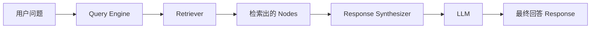
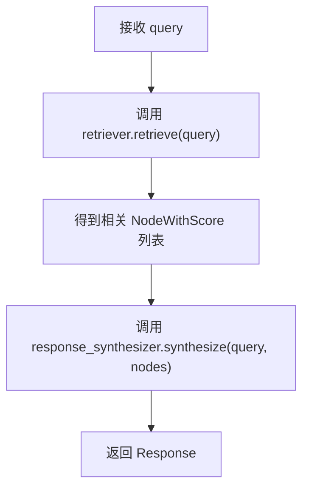

| 版本 | 内容 | 时间                   |
| ---- | ---- | ---------------------- |
| V1   | 新建 | 2026年05月06日11:21:45 |

下面我从**定位、核心组成、执行流程、源码结构、扩展方式、与检索器/响应生成器关系、常见类型**几个层面，系统分析 **LlamaIndex 的 RAG 引擎：查询引擎（Query Engine）**。

## 什么是查询引擎（Query Engine）

在 LlamaIndex 中，**查询引擎（Query Engine）**是最直接面向用户提问的入口组件。它的职责不是单纯“查数据”，而是把一条用户问题完整走完下面这条链路：

```
Query → Retriever（检索）→ Nodes（上下文）→ Response Synthesizer（响应生成）→ 最终回答
```

也就是说，查询引擎本质上是一个 **RAG 编排器（orchestrator）**。如果只看功能边界：

| 组件                   | 作用                               |
| ---------------------- | ---------------------------------- |
| `Retriever`            | 找相关上下文                       |
| `Response Synthesizer` | 基于上下文生成答案                 |
| `Query Engine`         | 把两者串起来，对外提供统一问答接口 |

所以，查询引擎并不是替代检索器或响应生成器，而是把它们组合成一个“可直接问答”的上层引擎。

## 查询引擎在 RAG 体系中的位置

可以把 LlamaIndex 的 RAG 执行链理解成下面这样：



从职责分层来看：

- **索引（Index）**：组织知识
- **检索器（Retriever）**：召回知识
- **查询引擎（Query Engine）**：调度问答流程
- **LLM**：负责自然语言生成

所以查询引擎是 **“检索与生成之间的桥梁”**，也是应用代码最常接触的对象。

## 最常见的查询引擎：RetrieverQueryEngine

LlamaIndex 中最核心、最常见的查询引擎实现是：RetrieverQueryEngine

它的设计思想非常直接：给我一个 `retriever` 和一个 `response_synthesizer`，我就能完成 RAG 问答。

最常见的写法：

```python
query_engine = index.as_query_engine()
resp = query_engine.query("什么是 RAG？")
```

这行代码背后通常就是在自动构造一个 `RetrieverQueryEngine`。

## 查询引擎的核心执行流程

### 高层流程

查询引擎收到问题后，基本会经历 4 步：



### 每一步具体做了什么

#### 第一步：接收用户问题

用户输入通常是字符串，例如：

```python
"什么是向量检索？"
```

查询引擎会把它包装成 `QueryBundle`（如果有需要），以便后续传递。

------

#### 第二步：调用检索器

查询引擎不会自己做向量搜索，它把问题交给 `Retriever`：

```python
nodes = retriever.retrieve(query_bundle)
```

返回值通常是：

```python
List[NodeWithScore]
```

每个元素包含：

- `node`：检索到的节点内容
- `score`：相似度分数

------

#### 第三步：调用响应生成器

查询引擎把问题和节点列表交给响应生成器：

```python
response = response_synthesizer.synthesize(
    query=query_bundle,
    nodes=nodes,
)
```

响应生成器内部再决定：

- 用 `compact`
- 用 `refine`
- 用 `tree_summarize`
- 或其它模式

------

#### 第四步：返回最终 Response

最终得到的是一个 `Response` 对象，而不是裸字符串。它通常包含：

- `response`：最终答案文本
- `source_nodes`：本次回答用到的上下文节点
- `metadata`：节点元数据

所以：

```python
print(resp.response)
print(resp.source_nodes)
```

都可以访问。

## 如何构造查询引擎

LlamaIndex 中构造查询引擎常见有三种方式。

### 通过索引直接构造（最常见）

```python
query_engine = index.as_query_engine()
```

这会自动：

- 根据索引类型创建默认 `retriever`
- 创建默认 `response_synthesizer`
- 组装成 `RetrieverQueryEngine`

如果是 `VectorStoreIndex`，默认通常是：

- `VectorIndexRetriever`
- `CompactAndRefine`（即 `ResponseMode.COMPACT`）

------

### 指定参数构造

```python
query_engine = index.as_query_engine(
    similarity_top_k=3,
    response_mode="refine",
    streaming=True,
)
```

这种方式实际上是“让索引帮你组装一个带参数的 Query Engine”。

它本质上仍然会：

- 构造 retriever
- 构造 synthesizer
- 再组装进查询引擎

------

### 手动构造 RetrieverQueryEngine（最灵活）

```python
retriever = index.as_retriever(similarity_top_k=3)
response_synthesizer = get_response_synthesizer(response_mode="tree_summarize")

query_engine = RetrieverQueryEngine(
    retriever=retriever,
    response_synthesizer=response_synthesizer,
)
```

这种方式适合：

- 你要自己定制检索器
- 你要自己定制响应生成器
- 你想插入自定义后处理器

## 查询引擎和检索器的关系

很多人容易把 `Query Engine` 和 `Retriever` 混淆，实际上它们层级不同：

| 对比项           | Retriever             | Query Engine   |
| ---------------- | --------------------- | -------------- |
| 核心职责         | 找上下文              | 完成问答       |
| 输出             | `List[NodeWithScore]` | `Response`     |
| 是否调用 LLM     | 不一定                | 一般会         |
| 是否对外直接使用 | 可用于调试和底层控制  | 更常用于应用层 |

一句话总结：**Retriever 负责“找材料”，Query Engine 负责“拿材料回答问题”。**

## 查询引擎和响应生成器的关系

查询引擎本身不决定回答策略，它只是调用响应生成器。

所以：

- 你切换 `response_mode="refine"`
- 或切换 `response_mode="tree_summarize"`
- 或自定义 synthesizer

本质上都是在改变查询引擎的“后半段逻辑”。

也就是说，**Query Engine 是流程壳，Synthesizer 是回答策略核心**。

## 常见 Query Engine 类型

除了最常见的 `RetrieverQueryEngine`，LlamaIndex 还有很多面向特定场景的 Query Engine。常见有：

| 类型                                   | 用途                                   |
| -------------------------------------- | -------------------------------------- |
| `RetrieverQueryEngine`                 | 最通用的 RAG 查询引擎                  |
| `CitationQueryEngine`                  | 支持引用来源的问答                     |
| `SubQuestionQueryEngine`               | 把复杂问题拆成多个子问题分别检索和回答 |
| `RouterQueryEngine`                    | 在多个索引/引擎之间做路由选择          |
| `TransformQueryEngine`                 | 先改写 query 再执行检索                |
| `KnowledgeGraphQueryEngine`（旧）      | 用于旧版知识图谱索引                   |
| `PropertyGraphQueryEngine`（相关生态） | 面向属性图/图谱场景                    |

所以 Query Engine 并不是单一实现，而是一整类“查询编排器”。

## 查询引擎的关键扩展点

如果你想深入定制 RAG，引擎层最常见的扩展点有 4 个：

### 1. 替换 Retriever

适合：

- 改变召回方式
- 混合检索
- 多路检索融合

```python
retriever = index.as_retriever(similarity_top_k=5)
```

### 2. 替换 Response Synthesizer

适合：

- 改变回答模式
- 改 Prompt
- 用结构化输出

```python
response_synthesizer = get_response_synthesizer(
    response_mode="refine"
)
```

### 3. 增加 Node Postprocessor

适合：

- 重排
- 过滤
- 去重
- 截断

例如：

- 相似度过滤
- 元数据过滤
- rerank

### 4. 改写 Query

适合：

- 同义词扩展
- 问题重写
- Query decomposition

这类通常通过：

- transform query engine
- router / sub-question query engine
- 自定义 query bundle

实现。

## 查询引擎为什么重要

在 RAG 系统里，真正决定最终效果的，不只是 embedding 或 vector store，而是**Query Engine 的编排策略**。

因为它决定了：

1. **检索多少内容**
2. **如何使用这些内容**
3. **是否进行后处理**
4. **最终如何交给 LLM**
5. **答案是否可追踪、可流式、可结构化**

所以 Query Engine 本质上是：**RAG 应用的执行中枢**

## 一个完整例子

```python
from llama_index.core import VectorStoreIndex, SimpleDirectoryReader
from llama_index.core.response_synthesizers import get_response_synthesizer
from llama_index.core.query_engine import RetrieverQueryEngine

# 1. 加载文档并构建索引
docs = SimpleDirectoryReader("data").load_data()
index = VectorStoreIndex.from_documents(docs)

# 2. 构造检索器
retriever = index.as_retriever(similarity_top_k=3)

# 3. 构造响应生成器
response_synthesizer = get_response_synthesizer(
    response_mode="compact"
)

# 4. 构造查询引擎
query_engine = RetrieverQueryEngine(
    retriever=retriever,
    response_synthesizer=response_synthesizer,
)

# 5. 查询
resp = query_engine.query("什么是 RAG？")

print(resp.response)
for node in resp.source_nodes:
    print(node.score, node.node.get_content())
```

这个例子很好地体现了查询引擎的职责：

- `Retriever` 找内容
- `Synthesizer` 生成答案
- `QueryEngine` 串起整个过程

## 总结


可以用一句话概括：**LlamaIndex 的查询引擎，本质上是对“检索 + 生成”全过程的统一编排器。**

它的核心价值不在“多了一个 query 方法”，而在于它把：

- 索引
- 检索器
- 后处理器
- 响应生成器
- LLM

这些组件真正连接成了一个可用的 RAG 问答系统。
