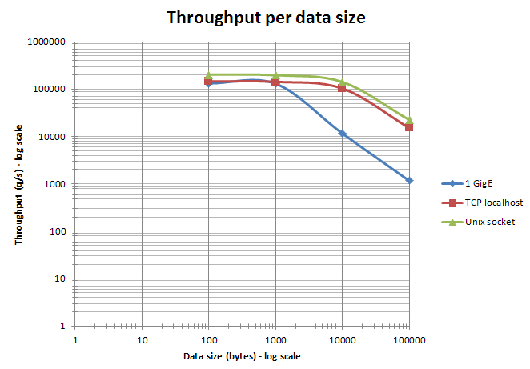
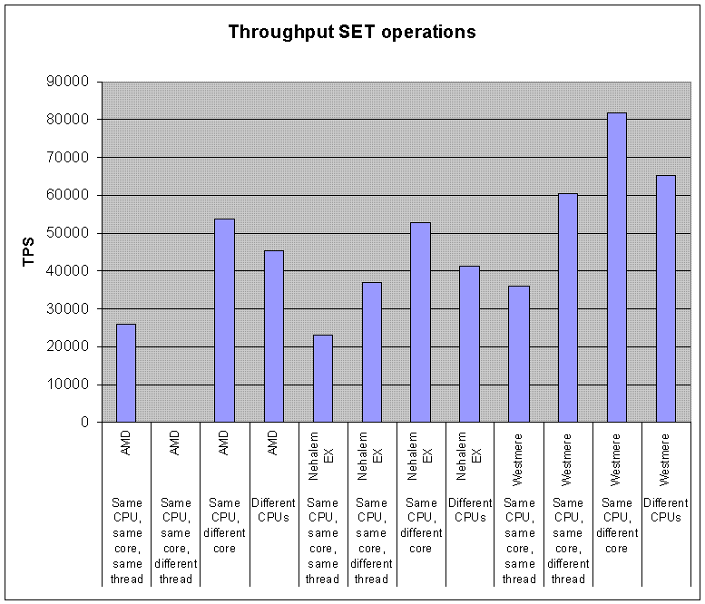
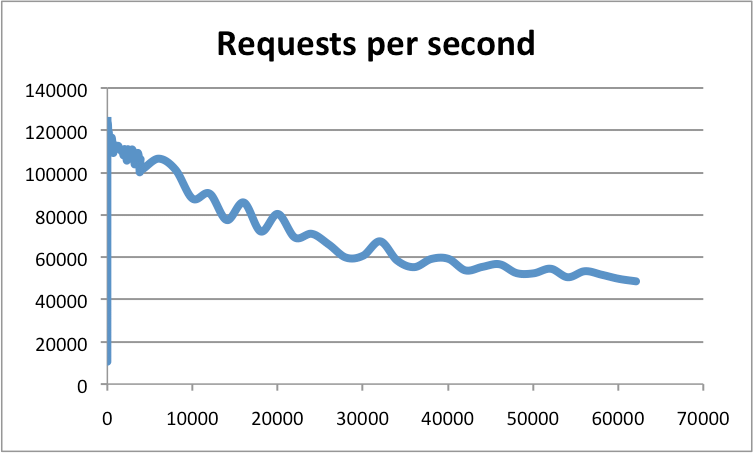

| 版本 | 内容 | 时间                   |
| ---- | ---- | ---------------------- |
| V1   | 新建 | 2023年04月23日01:29:59 |

> 翻译自 https://redis.io/docs/management/optimization/benchmarks/

## 基准测试

Redis 有一个 redis-benchmark 的可执行程序，它可以模拟N个客户端同时向Redis发送M条查询命令的应用场景。

## Redis Benchmark 选项

### 测试选项介绍

测试的 Redis 版本是 6.2.6。

使用 `redis-benchmark --help` 命令可以查看支持那些选项

```
Usage: redis-benchmark [-h <host>] [-p <port>] [-c <clients>] [-n <requests>] [-k <boolean>]

 -h <hostname>      Server hostname (default 127.0.0.1)
 -p <port>          Server port (default 6379)
 -s <socket>        Server socket (overrides host and port)
 -a <password>      Password for Redis Auth
 --user <username>  Used to send ACL style 'AUTH username pass'. Needs -a.
 -c <clients>       Number of parallel connections (default 50)
 -n <requests>      Total number of requests (default 100000)
 -d <size>          Data size of SET/GET value in bytes (default 3)
 --dbnum <db>       SELECT the specified db number (default 0)
 --threads <num>    Enable multi-thread mode.
 --cluster          Enable cluster mode.
 --enable-tracking  Send CLIENT TRACKING on before starting benchmark.
 -k <boolean>       1=keep alive 0=reconnect (default 1)
 -r <keyspacelen>   Use random keys for SET/GET/INCR, random values for SADD,
                    random members and scores for ZADD.
  Using this option the benchmark will expand the string __rand_int__
  inside an argument with a 12 digits number in the specified range
  from 0 to keyspacelen-1. The substitution changes every time a command
  is executed. Default tests use this to hit random keys in the
  specified range.
 -P <numreq>        Pipeline <numreq> requests. Default 1 (no pipeline).
 -q                 Quiet. Just show query/sec values
 --precision        Number of decimal places to display in latency output (default 0)
 --csv              Output in CSV format
 -l                 Loop. Run the tests forever
 -t <tests>         Only run the comma separated list of tests. The test
                    names are the same as the ones produced as output.
 -I                 Idle mode. Just open N idle connections and wait.
 --tls              Establish a secure TLS connection.
 --sni <host>       Server name indication for TLS.
 --cacert <file>    CA Certificate file to verify with.
 --cacertdir <dir>  Directory where trusted CA certificates are stored.
                    If neither cacert nor cacertdir are specified, the default
                    system-wide trusted root certs configuration will apply.
 --insecure         Allow insecure TLS connection by skipping cert validation.
 --cert <file>      Client certificate to authenticate with.
 --key <file>       Private key file to authenticate with.
 --tls-ciphers <list> Sets the list of prefered ciphers (TLSv1.2 and below)
                    in order of preference from highest to lowest separated by colon (":").
                    See the ciphers(1ssl) manpage for more information about the syntax of this string.
 --tls-ciphersuites <list> Sets the list of prefered ciphersuites (TLSv1.3)
                    in order of preference from highest to lowest separated by colon (":").
                    See the ciphers(1ssl) manpage for more information about the syntax of this string,
                    and specifically for TLSv1.3 ciphersuites.
 --help             Output this help and exit.
 --version          Output version and exit.
```


| redis-benchmark 常用选项 | 含义                                                         |
| ------------------------ | ------------------------------------------------------------ |
| `-h <hostname>`          | 服务器的主机名，可以是ip或者域名                             |
| `-p <port>`              | 服务器的端口，默认是6379                                     |
| `-a <password>`          | 连接服务器的密码，免密实例不写                               |
| `-c <clients>`           | 并发连接数 ，默认50                                          |
| `-n <requests>`          | 请求总数（默认为100000）                                     |
| `-d <size>`              | SET/GET值的数据大小（以字节为单位，默认值2）                 |
| `--dbnum <db> `          | 选择指定的数据库编号（默认值0）                              |
| `--threads <num>`        | 启动多线程模式（redis 6.0版本编译的redis-benchmark才支持，多线程压测redis的性能优于单线程） |
| `--cluster`              | 启动集群模式（cluster集群才需要该参数）                      |
| `-k <boolean> `          | 1=keep alive 0=reconnect（默认值1，可以测试长短连接）        |
| `-r <keyspacelen> `      | 对SET/GET/INCR使用随机键，对SADD使用随机值。参数中keyspacelen 指的是添加键的数量。 |
| `-e`                     | 如果服务器回复错误，请在stdout上显示它们                     |
| `-q`                     | 只展示query/sec的值                                          |
| `-l `                    | 循环测试                                                     |
| `-t <tests>`             | 可以对指定的命令进行测试                                     |
| `-I `                    | 空闲模式。仅打开N个空闲连接并等待                            |
| `-P <numreq> `           | 管道请求的并发数量（默认值为1）                              |

### 测试所有用例

`-n` 表示请求总数

```
redis-benchmark -q -n 100000
```

输出

```
PING_INLINE: 159489.64 requests per second, p50=0.175 msec
PING_MBULK: 164744.64 requests per second, p50=0.167 msec
SET: 162337.66 requests per second, p50=0.175 msec
GET: 164473.69 requests per second, p50=0.175 msec
INCR: 170357.75 requests per second, p50=0.183 msec
LPUSH: 173310.22 requests per second, p50=0.183 msec
RPUSH: 173611.12 requests per second, p50=0.183 msec
LPOP: 171821.30 requests per second, p50=0.183 msec
RPOP: 171232.88 requests per second, p50=0.183 msec
SADD: 166112.95 requests per second, p50=0.175 msec
HSET: 173310.22 requests per second, p50=0.183 msec
SPOP: 165837.48 requests per second, p50=0.167 msec
ZADD: 165016.50 requests per second, p50=0.175 msec
ZPOPMIN: 166389.34 requests per second, p50=0.167 msec
LPUSH (needed to benchmark LRANGE): 174216.03 requests per second, p50=0.183 msec
LRANGE_100 (first 100 elements): 50607.29 requests per second, p50=0.511 msec
LRANGE_300 (first 300 elements): 20959.97 requests per second, p50=1.215 msec
LRANGE_500 (first 500 elements): 13607.29 requests per second, p50=1.855 msec
LRANGE_600 (first 600 elements): 11496.90 requests per second, p50=2.183 msec
MSET (10 keys): 58105.75 requests per second, p50=0.799 msec
```

### 只测试某个命令（可指定命令参数）

`-t` 选项可以对指定的命令进行测试。

例如只测试 set 命令

```
$ ./redis-benchmark  -n 100000 -a -t set

====== SET ======
  100000 requests completed in 0.79 seconds
  50 parallel clients
  3 bytes payload
  keep alive: 1
  host configuration "save": 3600 1 300 100 60 10000
  host configuration "appendonly": no
  multi-thread: no

Latency by percentile distribution:
0.000% <= 0.103 milliseconds (cumulative count 1)
50.000% <= 0.191 milliseconds (cumulative count 51052)
75.000% <= 0.239 milliseconds (cumulative count 76569)
87.500% <= 0.343 milliseconds (cumulative count 87775)
93.750% <= 0.527 milliseconds (cumulative count 93761)
96.875% <= 0.719 milliseconds (cumulative count 96883)
98.438% <= 0.927 milliseconds (cumulative count 98465)
99.219% <= 1.199 milliseconds (cumulative count 99220)
99.609% <= 1.655 milliseconds (cumulative count 99610)
99.805% <= 2.879 milliseconds (cumulative count 99805)
99.902% <= 4.775 milliseconds (cumulative count 99903)
99.951% <= 5.111 milliseconds (cumulative count 99952)
99.976% <= 5.495 milliseconds (cumulative count 99976)
99.988% <= 5.615 milliseconds (cumulative count 99988)
99.994% <= 5.671 milliseconds (cumulative count 99994)
99.997% <= 5.743 milliseconds (cumulative count 99997)
99.998% <= 5.799 milliseconds (cumulative count 99999)
99.999% <= 5.855 milliseconds (cumulative count 100000)
100.000% <= 5.855 milliseconds (cumulative count 100000)

Cumulative distribution of latencies:
0.001% <= 0.103 milliseconds (cumulative count 1)
63.456% <= 0.207 milliseconds (cumulative count 63456)
85.030% <= 0.303 milliseconds (cumulative count 85030)
90.556% <= 0.407 milliseconds (cumulative count 90556)
93.216% <= 0.503 milliseconds (cumulative count 93216)
95.390% <= 0.607 milliseconds (cumulative count 95390)
96.701% <= 0.703 milliseconds (cumulative count 96701)
97.679% <= 0.807 milliseconds (cumulative count 97679)
98.369% <= 0.903 milliseconds (cumulative count 98369)
98.751% <= 1.007 milliseconds (cumulative count 98751)
99.014% <= 1.103 milliseconds (cumulative count 99014)
99.233% <= 1.207 milliseconds (cumulative count 99233)
99.384% <= 1.303 milliseconds (cumulative count 99384)
99.473% <= 1.407 milliseconds (cumulative count 99473)
99.528% <= 1.503 milliseconds (cumulative count 99528)
99.591% <= 1.607 milliseconds (cumulative count 99591)
99.638% <= 1.703 milliseconds (cumulative count 99638)
99.671% <= 1.807 milliseconds (cumulative count 99671)
99.684% <= 1.903 milliseconds (cumulative count 99684)
99.706% <= 2.007 milliseconds (cumulative count 99706)
99.724% <= 2.103 milliseconds (cumulative count 99724)
99.808% <= 3.103 milliseconds (cumulative count 99808)
99.871% <= 4.103 milliseconds (cumulative count 99871)
99.951% <= 5.103 milliseconds (cumulative count 99951)
100.000% <= 6.103 milliseconds (cumulative count 100000)

Summary:
  throughput summary: 126742.72 requests per second
  latency summary (msec):
          avg       min       p50       p95       p99       max
        0.255     0.096     0.191     0.591     1.095     5.855
```


**甚至可以测试指定命令测试，并带上参数**

```
$ ./redis-benchmark  -n 100000 -a master123  set name hello

====== set name hello ======
  100000 requests completed in 0.61 seconds
  50 parallel clients
  34 bytes payload
  keep alive: 1
  host configuration "save": 3600 1 300 100 60 10000
  host configuration "appendonly": no
  multi-thread: no

Latency by percentile distribution:
0.000% <= 0.095 milliseconds (cumulative count 1)
50.000% <= 0.183 milliseconds (cumulative count 59097)
75.000% <= 0.199 milliseconds (cumulative count 78854)
87.500% <= 0.215 milliseconds (cumulative count 89721)
93.750% <= 0.231 milliseconds (cumulative count 94303)
96.875% <= 0.271 milliseconds (cumulative count 96934)
98.438% <= 0.383 milliseconds (cumulative count 98458)
99.219% <= 0.647 milliseconds (cumulative count 99219)
99.609% <= 0.775 milliseconds (cumulative count 99610)
99.805% <= 0.831 milliseconds (cumulative count 99807)
99.902% <= 0.895 milliseconds (cumulative count 99908)
99.951% <= 3.615 milliseconds (cumulative count 99952)
99.976% <= 4.151 milliseconds (cumulative count 99976)
99.988% <= 4.247 milliseconds (cumulative count 99988)
99.994% <= 4.311 milliseconds (cumulative count 99994)
99.997% <= 4.327 milliseconds (cumulative count 99997)
99.998% <= 4.343 milliseconds (cumulative count 100000)
100.000% <= 4.343 milliseconds (cumulative count 100000)

Cumulative distribution of latencies:
0.006% <= 0.103 milliseconds (cumulative count 6)
85.293% <= 0.207 milliseconds (cumulative count 85293)
97.719% <= 0.303 milliseconds (cumulative count 97719)
98.592% <= 0.407 milliseconds (cumulative count 98592)
98.835% <= 0.503 milliseconds (cumulative count 98835)
99.191% <= 0.607 milliseconds (cumulative count 99191)
99.346% <= 0.703 milliseconds (cumulative count 99346)
99.722% <= 0.807 milliseconds (cumulative count 99722)
99.911% <= 0.903 milliseconds (cumulative count 99911)
99.942% <= 1.007 milliseconds (cumulative count 99942)
99.950% <= 1.103 milliseconds (cumulative count 99950)
99.973% <= 4.103 milliseconds (cumulative count 99973)
100.000% <= 5.103 milliseconds (cumulative count 100000)

Summary:
  throughput summary: 163132.14 requests per second
  latency summary (msec):
          avg       min       p50       p95       p99       max
        0.191     0.088     0.183     0.239     0.535     4.343
```

### Selecting the size of the key space（随机键）

Redis 基准测试默认只针对一个键进行测试。虽然 Redis 是一种内存数据库，基准测试和真实情况之间的差异并不大，但是通过扩大测试数据的范围，可以更好地模拟真实世界中的工作场景，例如缓存失效等情况。这样可以更准确地测试 Redis 的性能表现。

为了更好地测试 Redis 的性能，可以通过使用命令行参数` -r `来扩大基准测试的数据范围。例如，如果想运行100万个 SET 操作，并随机选择一百万个可能的键中的一个来进行每个操作，就可以使用提供的命令行参数来执行测试。

```
$ ./redis-benchmark  -a master123 -t set -r 100000 -n 1000000
====== SET ======
  1000000 requests completed in 9.31 seconds
  50 parallel clients
  3 bytes payload
  keep alive: 1
  host configuration "save": 3600 1 300 100 60 10000
  host configuration "appendonly": no
  multi-thread: no

Latency by percentile distribution:
0.000% <= 0.103 milliseconds (cumulative count 1)
50.000% <= 0.423 milliseconds (cumulative count 502592)
75.000% <= 0.495 milliseconds (cumulative count 762516)
87.500% <= 0.543 milliseconds (cumulative count 889421)
93.750% <= 0.583 milliseconds (cumulative count 944764)
96.875% <= 0.623 milliseconds (cumulative count 971665)
98.438% <= 0.663 milliseconds (cumulative count 984768)
99.219% <= 0.727 milliseconds (cumulative count 992205)
99.609% <= 0.967 milliseconds (cumulative count 996123)
99.805% <= 1.239 milliseconds (cumulative count 998051)
99.902% <= 1.367 milliseconds (cumulative count 999060)
99.951% <= 1.471 milliseconds (cumulative count 999531)
99.976% <= 1.631 milliseconds (cumulative count 999762)
99.988% <= 1.767 milliseconds (cumulative count 999881)
99.994% <= 2.207 milliseconds (cumulative count 999940)
99.997% <= 4.927 milliseconds (cumulative count 999970)
99.998% <= 5.063 milliseconds (cumulative count 999985)
99.999% <= 5.239 milliseconds (cumulative count 999993)
100.000% <= 5.335 milliseconds (cumulative count 999997)
100.000% <= 5.471 milliseconds (cumulative count 999999)
100.000% <= 5.527 milliseconds (cumulative count 1000000)
100.000% <= 5.527 milliseconds (cumulative count 1000000)

Cumulative distribution of latencies:
0.000% <= 0.103 milliseconds (cumulative count 1)
17.740% <= 0.207 milliseconds (cumulative count 177402)
28.966% <= 0.303 milliseconds (cumulative count 289658)
45.339% <= 0.407 milliseconds (cumulative count 453390)
78.855% <= 0.503 milliseconds (cumulative count 788547)
96.303% <= 0.607 milliseconds (cumulative count 963031)
99.055% <= 0.703 milliseconds (cumulative count 990548)
99.445% <= 0.807 milliseconds (cumulative count 994452)
99.565% <= 0.903 milliseconds (cumulative count 995648)
99.641% <= 1.007 milliseconds (cumulative count 996408)
99.700% <= 1.103 milliseconds (cumulative count 996995)
99.779% <= 1.207 milliseconds (cumulative count 997792)
99.860% <= 1.303 milliseconds (cumulative count 998598)
99.927% <= 1.407 milliseconds (cumulative count 999269)
99.959% <= 1.503 milliseconds (cumulative count 999589)
99.973% <= 1.607 milliseconds (cumulative count 999730)
99.983% <= 1.703 milliseconds (cumulative count 999828)
99.989% <= 1.807 milliseconds (cumulative count 999895)
99.992% <= 1.903 milliseconds (cumulative count 999921)
99.993% <= 2.007 milliseconds (cumulative count 999928)
99.993% <= 2.103 milliseconds (cumulative count 999930)
99.995% <= 3.103 milliseconds (cumulative count 999953)
99.999% <= 5.103 milliseconds (cumulative count 999986)
100.000% <= 6.103 milliseconds (cumulative count 1000000)

Summary:
  throughput summary: 107388.31 requests per second
  latency summary (msec):
          avg       min       p50       p95       p99       max
        0.394     0.096     0.423     0.591     0.703     5.527
```

### 使用 pipeline

默认情况下，Redis 基准测试会模拟 50 个客户端发送命令。每个客户端在发送下一个命令之前，需要等待上一个命令的响应返回，这意味着服务器需要进行一次读取操作以读取每个客户端的命令，并且也需要考虑来回传输时间。

但是 Redis 支持流水线技术，因此可以一次性发送多个命令，这也是现实世界应用程序经常使用的功能- Redis 的流水线技术能够显著提高服务器的每秒操作次数。

下面是使用 16 个命令的 pipeline 运行基准测试的例子：

```
$ ./redis-benchmark  -a master123 -n 1000000 -t set,get -P 16 -q
SET: 219202.11 requests per second, p50=3.135 msec
GET: 1189060.62 requests per second, p50=0.575 msec
```

使用 pipeline 可以显着提高性能。

### 一些基准测试的例子

```
Examples:

 Run the benchmark with the default configuration against 127.0.0.1:6379:
   $ redis-benchmark

 Use 20 parallel clients, for a total of 100k requests, against 192.168.1.1:
   $ redis-benchmark -h 192.168.1.1 -p 6379 -n 100000 -c 20

 Fill 127.0.0.1:6379 with about 1 million keys only using the SET test:
   $ redis-benchmark -t set -n 1000000 -r 100000000

 Benchmark 127.0.0.1:6379 for a few commands producing CSV output:
   $ redis-benchmark -t ping,set,get -n 100000 --csv

 Benchmark a specific command line:
   $ redis-benchmark -r 10000 -n 10000 eval 'return redis.call("ping")' 0

 Fill a list with 10000 random elements:
   $ redis-benchmark -r 10000 -n 10000 lpush mylist __rand_int__

 On user specified command lines __rand_int__ is replaced with a random integer
 with a range of values selected by the -r option.
```


- 单机、主备、读写分离和proxy集群的测试命令：

  **./redis-benchmark -h {IP或域名} -p 6379 -a {pwd}--threads {num} -n { nreqs } -r { randomkeys } -c {clients} -d {datasize} -t {command}**

- cluster集群测试命令：

  **./redis-benchmark -h {IP或域名} -p 6379 -a {pwd}--threads {num} -n { nreqs } -r { randomkeys } -c {clients} -d {datasize} --cluster -t {command}**

- 测试短连接：

  **./redis-benchmark -h {IP或域名} -p 6379 -a {pwd}--threads {num} -n { nreqs } -r { randomkeys } -c {clients} -d {datasize} -k 0 -t {command}**

- 测试空闲连接：

  **./redis-benchmark -h {IP或域名} -p 6379 -a {pwd} -c {clients} -I**

## 影响 Redis 性能的因素

有多种因素会直接影响 redis 的性能。这里，我们分析一些，因为它们可以改变所有 benchmark 测试的结果。但请注意，一个典型的 redis 实例，运行在低速、未调优过的系统上，提供的性能对大多数应用来说也是够好的。

- 网络带宽和延迟通常会直接影响性能。在启动基准测试之前，使用 ping 程序快速检查客户端和服务器主机之间的延迟是否正常是一个好习惯。对于带宽，通常很有用的是估算吞吐量（以 Gbit/s 为单位），并将其与网络的理论带宽进行比较。例如，以每秒 10 万次为速率在 Redis 中设置 4 KB 的字符串，实际上会消耗 3.2 Gbit/s 的带宽，并可能适用于 10 Gbit/s 的链路，但不适用于 1 Gbit/s 的链路。在许多真实场景中，Redis 的吞吐量由网络限制，而不是由 CPU 限制。要在单个服务器上合并几个高吞吐量的 Redis 实例，考虑安装一个 10 Gbit/s 的 NIC 或多个带有 TCP/IP 绑定的 1 Gbit/s 的 NIC 是值得的。
- CPU 是另一个非常重要的因素。由于 Redis 是单线程的，因此它青睐具有大缓存和较少核心的快速 CPU。在这个方面，Intel CPU 目前是赢家。在使用 redis-benchmark 时，当客户端和服务器运行在同一台机器上时，CPU 是限制因素。
- RAM 和内存带宽的速度似乎对全局性能不太关键，尤其是对于小对象来说。但是对于大对象（>10 KB），这可能变得明显。通常，为了优化 Redis 而购买昂贵的快速内存模块并不划算。
- Redis 在虚拟机上运行比在相同硬件上不使用虚拟化运行要慢。如果您有机会在物理机器上运行 Redis，则应优先选择这种方式。但这并不意味着 Redis 在虚拟化环境中很慢，实际表现仍然非常好，而在虚拟化环境中遇到的大多数严重性能问题都是由于超额分配、具有高延迟的非本地磁盘或旧的 hypervisor 软件具有缓慢的 fork 系统调用实现。
- 当服务器和客户端基准测试程序在同一台机器上运行时，可以使用 TCP/IP 回环和 Unix 域套接字。根据平台的不同，Unix 域套接字的吞吐量可以比 TCP/IP 回环高出约 50%（例如在 Linux 上）。redis-benchmark 的默认行为是使用 TCP/IP 回环。
- 与 TCP/IP 回环相比，Unix 域套接字的性能优势在强烈使用管道线路时（即长管道线路时）会减少。
- 当以太网网络用于访问 Redis 时，使用管道化聚合命令在数据大小保持在以太网数据包大小以下（约为 1500 字节）时特别高效。实际上，处理 10 字节、100 字节或 1000 字节的查询几乎得到相同的吞吐量。



- 在多 CPU 插槽服务器中，Redis 的性能会受到 NUMA 配置和进程位置的影响。最明显的影响是，redis-benchmark 的结果似乎是不确定的，因为客户端和服务器进程是随机分布在核心上的。为了获得确定性结果，需要使用进程放置工具（在 Linux 中是 taskset 或 numactl）。最有效的组合是将客户端和服务器放置在同一 CPU 的两个不同核心上，以获得 L3 缓存的优势。以下是使用不同相对放置方式的 4 KB SET 基准测试的三个服务器 CPU（AMD Istanbul、Intel Nehalem EX 和 Intel Westmere）的结果，请注意，此基准测试不旨在比较 CPU 型号本身（因此未公开 CPU 的确切型号和频率）。



- 客户端连接的数量也是一个重要的因素。Redis 事件循环基于 epoll/kqueue，具有相当好的可扩展性。Redis 已经在超过 60000 个连接上进行了基准测试，并且在这些条件下仍能支持每秒 50000 个请求。作为一个经验法则，具有 30000 个连接的实例只能处理具有 100 个连接时可实现吞吐量的一半。下图显示 Redis 实例的吞吐量与连接数之间的关系：



- 通过调整网卡配置和相关的中断可以实现更高的吞吐量。最佳吞吐量是通过设置 Rx/Tx 网卡队列与 CPU 核心之间的亲和性，并激活 RPS（接收数据包转发）支持来实现的。有关更多信息，请参考 [thread](https://groups.google.com/forum/#!msg/redis-db/gUhc19gnYgc/BruTPCOroiMJ)。当使用大型对象时，Jumbo 帧也可以提供性能提升。

- Redis 可以在不同的平台上使用不同的内存分配器（比如 libc malloc、jemalloc、tcmalloc），它们在处理内存的速度、内部和外部碎片化方面可能会有不同的表现。如果你没有自己编译 Redis，可以使用 INFO 命令来查看内存分配器的类型。需要注意的是，大多数基准测试运行的时间不够长，无法产生明显的外部碎片问题（与实际生产环境的 Redis 实例可能存在不同）。

## 其他要考虑的事情

任何基准测试的一个重要目标是获得可重现的结果，以便将它们与其他测试的结果进行比较。

1. 最好在没有其他运行程序的独立硬件上进行基准测试，如果不行，也要尽量避免基准测试受到外部活动的影响。
2. 一些电脑和服务器具有可变的 CPU 核心频率机制，为了得到可重复的结果，最好将所有 CPU 核心的频率设置为最高的固定频率。
3. 要根据基准测试的规模来调整系统，确保拥有足够的 RAM，避免交换内存。32 位和 64 位 Redis 实例的内存占用不同。
4. 如果在基准测试中使用 RDB 或 AOF，避免将文件放置在网络带宽和延迟受影响的设备上。
5. 将 Redis 的日志级别设置为 warning 或 notice，并将日志文件放置在本地而非远程文件系统上。
6. 避免使用会改变基准测试结果的监视工具，例如 MONITOR，这会显著影响测量性能。

## 其他 Redis 基准测试工具

有几种第三方工具可用于对 Redis 进行基准测试。有关其目标和功能的更多信息，请参阅每个工具的文档。

- [memtier_benchmark](https://github.com/redislabs/memtier_benchmark) from [Redis Ltd.](https://twitter.com/RedisInc) is a NoSQL Redis and Memcache traffic generation and benchmarking tool.
- [rpc-perf](https://github.com/twitter/rpc-perf) from [Twitter](https://twitter.com/twitter) is a tool for benchmarking RPC services that supports Redis and Memcache.
- [YCSB](https://github.com/brianfrankcooper/YCSB) from [Yahoo @Yahoo](https://twitter.com/Yahoo) is a benchmarking framework with clients to many databases, including Redis.
