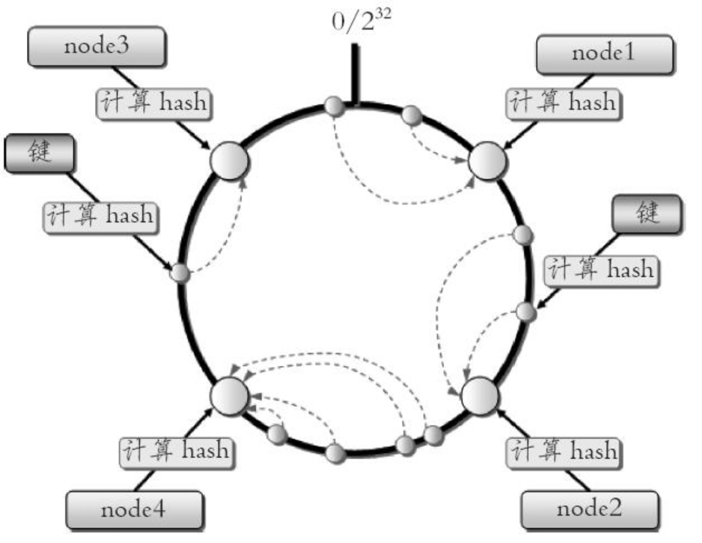
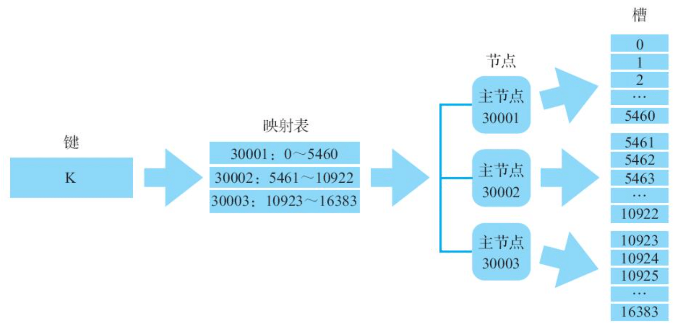

| 版本 | 内容 | 时间                   |
| ---- | ---- | ---------------------- |
| V1   | 新建 | 2023年05月04日09:12:05 |

> 本文内容来自 Redis 使用手册

## 集群概念

Redis 集群是 Redis 3.0 版本开始正式引入的功能，给用户带来了在线扩展 Redis 系统读写能力，Redis 5.0 更是在集群原有功能的基础上，进一步添加了更多新功能，并且对原有功能做了非常多的优化，使得整个集群系统更简单、易用和高效。

## 基本特性

### 复制和高可用

Redis 集群和单机版的 Redis 服务器一样，也提供了主从复制的功能。在 Redis 集群中，各个 Redis 服务器被称为节点（node），其中主节点（master node）负责处理客户端发送的读写命令请求，而从节点（replica/save node）则负责对主节点进行复制。

除了复制功能外，Redis 集群还提供了类似单机版 Redis Sentinel 的功能，以此来为集群提供高可用特性。简单来说，集群中各个节点将互相监视各自的运行状况，并在某个主节点下线时，通过提升该节点的从节点作为新主节点来继续提供服务。

### 分片和重分片

常见的数据分区规则有哈希分区和顺序分区两种。

- 哈希分区：
  - 离散度好；
  - 数据分布业务无关；
  - 无法顺序访问；
- 顺序分区：
  - 离散度易倾斜；
  - 数据分布业务相关；
  - 可顺序访问；

Redis 使用的是哈希分区，哈希分区又分为很多种：

- 节点取余分区；
- 一致性哈希分区；
- 虚拟槽分区；

#### 节点取余分区

**节点取余分区**：这种方式的突出优点是简单性， 常用于数据库的分库分表规则；

#### 一致性哈希分区

**一致性哈希分区**：实现思路就是为系统中的每个节点分配一个 token，范围一般在 0 - 2 的 32 次方，这些 token 构成一个哈希环，执行节点查找操作时， 先根据 key 计算 hash 值， 然后顺时针找到第一个大于等于该哈希值的 token 节点。

一致性哈希分区如下：



这种方式相比节点取余最大的好处在于加入和删除节点只影响哈希环中相邻的节点，对其他节点无影响。但一致性哈希分区存在几个问题：

- 加减节点会造成哈希环中部分数据无法命中，需要手动处理或者忽略这部分数据，因此一致性哈希常用于缓存场景。
- 当使用少量节点时，节点变化将大范围影响哈希环中数据映射，因此这种方式不适合少量数据节点的分布式方案。
- 普通的一致性哈希分区在增减节点时需要增加一倍或减去一半节点才能保证数据和负载的均衡。

正因为一致性哈希分区的这些缺点，一些分布式系统采用虚拟槽对一致性哈希进行改进。

#### 虚拟槽分区

虚拟槽分区巧妙地使用了哈希空间，使用分散度良好的哈希函数把所有数据映射到一个固定范围的整数集合中，整数定义为槽（slot）。这个范围一般远远大于节点数，比如 Redis Cluster 槽范围是 0~16383。槽是集群内数据管理和迁移的基本单位。采用大范围槽的主要目的是为了方便数据拆分和集群扩展。每个节点会负责一定数量的槽。

当前集群有 5 个节点，每个节点平均大约负责 3276 个槽。由于采用高质量的哈希算法，每个槽所映射的数据通常比较均匀，将数据平均划分到 5 个节点进行数据分区。

#### Redis 使用的分区（虚拟槽）

Redis 集群通过将数据库分散存储到多个节点上来平衡各个节点的负载压力。

具体来说：Redis 集群会将整个数据库空间划分为 16384 个槽（slot）来实现数据分片（sharding），而集群中的各个主节点则会分别负责处理其中一部分槽。当用户尝试讲一个键存储到集群中时，客户端会先计算出键所属的槽，接着记录集群节点槽分布的映射表中找出处理该槽的节点，最后再将键存储到相应的节点中。



当用户想要向集群添加新节点时，只需要向 Redis 集群发送几条简单的命令，集群就会将相应的槽以及槽中存储的数据迁移至新节点。与此类似，当用户想要从集群中移除已存在的节点时，被移除的节点也会将自己负责处理的槽以及槽中数据转交给集群中的其他节点负责。最重要的是，无论是向集群添加新节点还是从集群中移除已有节点，整个重分片（reshard）过程都可以在线进行，Redis 集群无须因此而停机。

### 高性能

Redis 集群采用无代理模式，客户端发送的所有命令都会直接交由节点执行，并且对于经过优化的集群客户端来说，客户端发送的命令在绝大部分情况下都不需要实施转向，或者仅需要一次转向，因此在 Redis 集群中执行命令的性能与在单机 Redis 服务器上执行命令的性能非常接近。

除了节点之间互通信息带来的性能损耗之外，单个 Redis 集群节点处理命令请求的性能与单个 Redis 服务器处理命令请求的性能几乎别无二致。从理论上来讲，集群每增加一倍数量的主节点，集群对于命令请求的处理性能就会提高一倍。

## 搭建集群

搭建一个 3 个主节点和 3 个从节点的集群。

配置文件，端口是 30001 到 30006，建立 6 个配置文件，cluster-config-file 是用于集群内部的配置文件，因为本次是部署到一个机器上，建议使用不同的名字。

```
port 30001
# 开启集群模式
cluster-enabled yes
# 节点超时时间，毫秒
cluster-node-timeout 15000
# 集群内部配置文件
cluster-config-file "nodes-30001.conf"
```

直接使用 redis-server 指定配置文件启动，这样就启动 6 台 Redis 实例成功了。

首次生成的 node.conf 文件如下，例如 node-30001.conf

```
7a6062647ca518602bfd4df53aa05e8b91685492 :0@0 myself,master - 0 0 0 connected
vars currentEpoch 0 lastVoteEpoch 0
```

文件内容记录了集群初始状态， 这里最重要的是节点 ID， 它是一个 40 位 16 进制字符串， 用于唯一标识集群内一个节点， 之后很多集群操作都要借助于节点 ID 来完成。 需要注意是， 节点 ID 不同于运行 ID。 节点 ID 在集群初始化时只创建一次， 节点重启时会加载集群配置文件进行重用， 而 Redis 的运行 ID 每次重启都会变化。

在节点 30001 执行 cluster nodes 命令获取集群节点状态：

```
127.0.0.1:30001> cluster nodes
7a6062647ca518602bfd4df53aa05e8b91685492 :30001@40001 myself,master - 0 0 0 connected
```

虽然我们已经启动了 6 个集群节点，但是由于这些节点并未相互联通，接下来需要将这 6 个节点连接起来并给它们分配槽。

```
$ ./redis-cli --cluster create 127.0.0.1:30001 127.0.0.1:30002 127.0.0.1:30003 127.0.0.1:30004 127.0.0.1:30005 127.0.0.1:30006 --cluster-replicas 1
```

redis-cli --cluster 是自带的集群管理工具，create 子命令接收任意多个节点的 IP 地址和端口作为参数，用这些节点组成一个集群，可选参数 cluster-replicas 用于指定集群中每个主节点的从节点数量。

使用上面的命令后将指定出下面的节点角色和槽的分配计划

```
>>> Performing hash slots allocation on 6 nodes...
Master[0] -> Slots 0 - 5460
Master[1] -> Slots 5461 - 10922
Master[2] -> Slots 10923 - 16383
Adding replica 127.0.0.1:30005 to 127.0.0.1:30001
Adding replica 127.0.0.1:30006 to 127.0.0.1:30002
Adding replica 127.0.0.1:30004 to 127.0.0.1:30003
>>> Trying to optimize slaves allocation for anti-affinity
[WARNING] Some slaves are in the same host as their master
M: 7a6062647ca518602bfd4df53aa05e8b91685492 127.0.0.1:30001
   slots:[0-5460] (5461 slots) master
M: b894fa8eae24d0ffec68bf0e7ada98fd2f5b37cf 127.0.0.1:30002
   slots:[5461-10922] (5462 slots) master
M: 7ffb74903c1f83e972db6aa4ccbea7d05c78522e 127.0.0.1:30003
   slots:[10923-16383] (5461 slots) master
S: 348c9f527752ea19f29ccf662e939d6c6dc10678 127.0.0.1:30004
   replicates 7ffb74903c1f83e972db6aa4ccbea7d05c78522e
S: e9afac3ecc6ca627830cf24d5fd0834d6b747b31 127.0.0.1:30005
   replicates 7a6062647ca518602bfd4df53aa05e8b91685492
S: 49eb6dbcb6bd920702a8d8c4d4d76b1b621b7b9a 127.0.0.1:30006
   replicates b894fa8eae24d0ffec68bf0e7ada98fd2f5b37cf
Can I set the above configuration? (type 'yes' to accept): 
```

可以看到，尝试把 30001、30002、30003 作为主节点，30004、30005、30006 分别为它们的从节点。将 16383 槽平均分为 3 份。输入 yes 后

```
>>> Nodes configuration updated
>>> Assign a different config epoch to each node
>>> Sending CLUSTER MEET messages to join the cluster
Waiting for the cluster to join
.
>>> Performing Cluster Check (using node 127.0.0.1:30001)
M: 7a6062647ca518602bfd4df53aa05e8b91685492 127.0.0.1:30001
   slots:[0-5460] (5461 slots) master
   1 additional replica(s)
M: 7ffb74903c1f83e972db6aa4ccbea7d05c78522e 127.0.0.1:30003
   slots:[10923-16383] (5461 slots) master
   1 additional replica(s)
S: 348c9f527752ea19f29ccf662e939d6c6dc10678 127.0.0.1:30004
   slots: (0 slots) slave
   replicates 7ffb74903c1f83e972db6aa4ccbea7d05c78522e
S: 49eb6dbcb6bd920702a8d8c4d4d76b1b621b7b9a 127.0.0.1:30006
   slots: (0 slots) slave
   replicates b894fa8eae24d0ffec68bf0e7ada98fd2f5b37cf
M: b894fa8eae24d0ffec68bf0e7ada98fd2f5b37cf 127.0.0.1:30002
   slots:[5461-10922] (5462 slots) master
   1 additional replica(s)
S: e9afac3ecc6ca627830cf24d5fd0834d6b747b31 127.0.0.1:30005
   slots: (0 slots) slave
   replicates 7a6062647ca518602bfd4df53aa05e8b91685492
[OK] All nodes agree about slots configuration.
>>> Check for open slots...
>>> Check slots coverage...
[OK] All 16384 slots covered.
```

OK 集群搭建已经完成

集群完整性检查，使用 `redis-cli --cluster check IP:端口`命令，check 命令只需要给出集群中任意一个节点地址就可以完成整个集群的检查工作。

```
$ ./redis-cli --cluster check 127.0.0.1:30001
127.0.0.1:30001 (7a606264...) -> 0 keys | 5461 slots | 1 slaves.
127.0.0.1:30003 (7ffb7490...) -> 0 keys | 5461 slots | 1 slaves.
127.0.0.1:30002 (b894fa8e...) -> 0 keys | 5462 slots | 1 slaves.
[OK] 0 keys in 3 masters.
0.00 keys per slot on average.
>>> Performing Cluster Check (using node 127.0.0.1:30001)
M: 7a6062647ca518602bfd4df53aa05e8b91685492 127.0.0.1:30001
   slots:[0-5460] (5461 slots) master
   1 additional replica(s)
M: 7ffb74903c1f83e972db6aa4ccbea7d05c78522e 127.0.0.1:30003
   slots:[10923-16383] (5461 slots) master
   1 additional replica(s)
S: 348c9f527752ea19f29ccf662e939d6c6dc10678 127.0.0.1:30004
   slots: (0 slots) slave
   replicates 7ffb74903c1f83e972db6aa4ccbea7d05c78522e
S: 49eb6dbcb6bd920702a8d8c4d4d76b1b621b7b9a 127.0.0.1:30006
   slots: (0 slots) slave
   replicates b894fa8eae24d0ffec68bf0e7ada98fd2f5b37cf
M: b894fa8eae24d0ffec68bf0e7ada98fd2f5b37cf 127.0.0.1:30002
   slots:[5461-10922] (5462 slots) master
   1 additional replica(s)
S: e9afac3ecc6ca627830cf24d5fd0834d6b747b31 127.0.0.1:30005
   slots: (0 slots) slave
   replicates 7a6062647ca518602bfd4df53aa05e8b91685492
[OK] All nodes agree about slots configuration.
>>> Check for open slots...
>>> Check slots coverage...
[OK] All 16384 slots covered.
```

## hash tag

在默认情况下，Redis 根据用户输入的整个键计算出该键所属的槽，然后将键存储到相应的槽中。但是在某些情况下，出于性能方面的考虑，或者为了在同一个节点上对多个相关联的键执行批量操作，我们也会想要将一些原本不属于同一个槽的键放到相同的槽里面。

如果某个 key 的某个部分用`{` 和`}` 包裹，则只会计算第一个大括号包括的散列值来分配槽。这样一来，即使两个键原本不属于同一个槽，但只要它们拥有相同的被包围子串，那么程序计算出的散列值就是一样的，因此 Redis 集群就会把它们存储到同一个槽中

- 如果键包含 `{` 字符；
- 如果 `{` 右边有一个 `}` 字符；
-  如果在第一次出现的 `{` 和第一次出现的 `}` 之间有一个或多个字符；

仅对第一次出现的 `{` 和随后第一次出现的 `}` 之间的内容进行哈希处理。

举个例子：

- `{user1000}.following` 和 `{user1000}.followers` 这两个键将哈希到同一个哈希槽，因为只有子字符串 `user1000` 会被哈希以计算哈希槽；
- 对于键 `foo{}{bar}` ，整个键将像往常一样被散列，因为第一次出现的 `{` 后面跟着右边的 `}`，中间没有字符；
- 对于键 `foo{{bar}}zap`，子字符串 `{bar` 将被散列，因为它是第一次出现的 `{` 和第一次出现的 `}` 之间的子串；
- 对于键 `foo{bar}{zap}`，子字符串 `bar` 将被散列，因为算法在 `{` 和 `}` 的第一个有效或无效（内部没有字节）匹配时停止；
- 从该算法可以看出，如果密钥以`{}`开头，则保证将其作为一个整体进行哈希处理。这在使用二进制数据作为键名时很有用；

给定哈希标签后，以下是用 C语言实现 HASH_SLOT 函数的代码。

```c
unsigned int HASH_SLOT(char *key, int keylen) {
    int s, e; /* start-end indexes of { and } */

    /* Search the first occurrence of '{'. */
    for (s = 0; s < keylen; s++)
        if (key[s] == '{') break;

    /* No '{' ? Hash the whole key. This is the base case. */
    if (s == keylen) return crc16(key,keylen) & 16383;

    /* '{' found? Check if we have the corresponding '}'. */
    for (e = s+1; e < keylen; e++)
        if (key[e] == '}') break;

    /* No '}' or nothing between {} ? Hash the whole key. */
    if (e == keylen || e == s+1) return crc16(key,keylen) & 16383;

    /* If we are here there is both a { and a } on its right. Hash
     * what is in the middle between { and }. */
    return crc16(key+s+1,e-s-1) & 16383;
}
```

