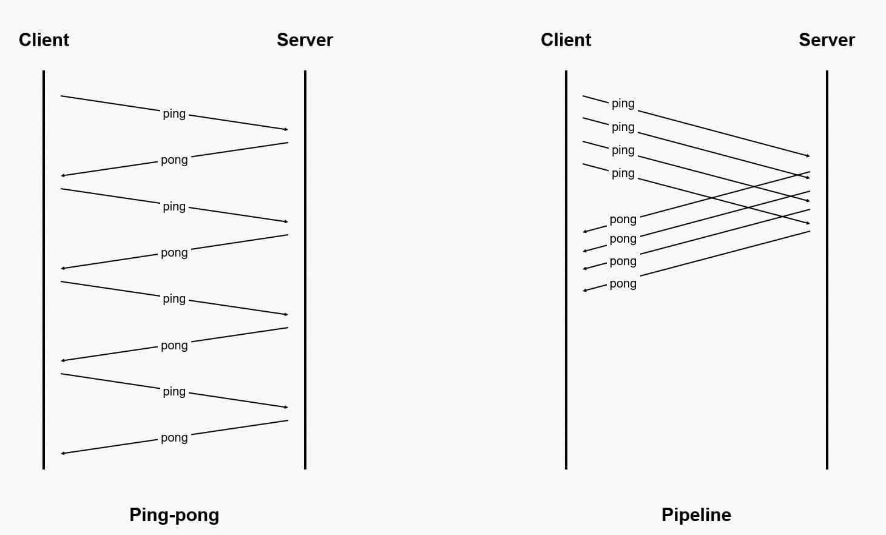
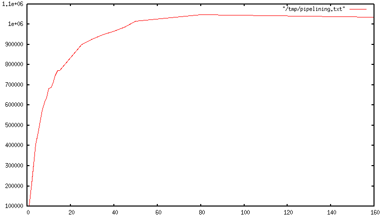

| 版本 | 内容 | 时间                   |
| ---- | ---- | ---------------------- |
| V1   | 新建 | 2023年03月30日01:25:08 |

参考：

- https://redis.io/docs/manual/pipelining/

## 请求/响应协议和RTT

Redis 是一个使用客户端-服务器模型和请求/响应协议的 TCP 服务器。一个请求步骤如下：

1. 客户端向服务器发送查询，并通常以阻塞方式从套接字中读取服务器响应；
2. 服务器处理命令，并产生响应的命令执行结果；
3. 服务器并将响应发送回客户端；
4. 客户端接收命令的执行结果，并向用户展示；

举个例子：

```
Client: INCR X
Server: 1
Client: INCR X
Server: 2
Client: INCR X
Server: 3
Client: INCR X
Server: 4
```

客户端和服务端是通过网络连接的，网络连接可能很快，也可能很慢。无论网络延迟如何，**数据包从客户端传输到服务器，再从服务器写到响应信息返回到客户端都需要时间**。

这个时间就叫做 **RTT（Round Trip Time**），当客户端需要连续执行许多请求时，多次网络 IO 很影响系统的性能；假如 Redis 服务器每秒能够处理 100k 个请求，如果 RTT 是 250 毫秒（网络连接很慢），那么我们每秒最多也只能处理 4 个请求。

> 一般情况下，客户端与 Redis 通信时采用的是 Ping-pong 网络交互模式，Ping-pong 模式是指客户端（Client）发送一个命令后会等待命令的执行结果，在客户端收到服务器端（Server）返回的结果后，再发送下一个命令，以此类推。

## 什么是 Redis Pipeline

通过 Pipeline 改进前面的案例：

```
Client: INCR X
Client: INCR X
Client: INCR X
Client: INCR X
Server: 1
Server: 2
Server: 3
Server: 4
```

Redis Pipeline 是一种通过一次发出多个命令而无需等待对每个命令的响应来提高性能的技术。大多数 Redis 的客户端都支持 Pipeline。**客户端发送一个命令后无需等待执行结果，会继续发送其他命令；在全部请求发送完毕后，客户端关闭请求，开始接收响应，收到执行结果后再与之前发送的命令按顺序进行一一匹配**。在Pipeline模式的具体实现中，大部分Redis客户端采用批处理的方式，即一次发送多个命令，在接收完所有命令执行结果后再返回给上层业务。



通过使用 Pipeline ，我们可以将执行多个命令所需的网络通信次数从原来的 N 次降低为 1 次，这样可以大幅度减少程序在网络通信方面的耗时，提高程序的执行效率；

注意：

虽然 Redis 服务器并不会限制客户端在 Pipeline 中包含的命令数量，但是却会为客户端的输入缓冲区设置默认值为 1 GB 的上限，当客户端发送的数据量超过这个限制时，Redis 服务器将会强制关闭该客户端。而且当客户端使用 Pipeline 发送命令时，服务器将被迫使用内存对响应进行排队。因此，**需要使用 Pipeline 发送大量命令，最好将它们分批发送，每批包含一个合理的数量**。例如 每批 10k 命令，读取回复，然后再次发送另外 10k 命令，依此类推。这两种操作的速度将几乎相同，但**使用的额外内存**最多为将这些 10k 命令的回复排队所需的内存量。

## It's not just a matter of RTT

Pipeline 不仅是降低网络往返时延（Round-trip time，简称RTT），它实际上大大**提高了在给定 Redis 服务器中每秒可以执行的操作的数量。减少 read() 和 write() 的系统调用以及进程上下文切换次数**，以提升程序的执行效率与性能。

使用 Pipeline 时，许多命令通常通过单个 read() 系统调用读取，多个响应通过单个 write() 系统调用传递。因此，每秒执行的总查询数最初随着管道的延长几乎呈线性增长，最终达到没有管道化时获得的基线的 10 倍，如图所示。



## 使用 Pipeline 和不用 Pipeline 的 RTT 对比

```python
import redis
import time


def bench(descr):
    start = time.time()
    yield
    print(f"{descr} {time.time() - start} seconds")

def get_redis_cli():
    return redis.Redis(host='127.0.0.1',
                       port=6322,
                       db=0,
                       password='xxxx',
                       decode_responses=True)

def without_pipelining():
    r = get_redis_cli()
    for i in range(100):
        r.ping()

def with_pipelining():
    r = get_redis_cli()
    with r.pipeline() as pipe:
        for i in range(100):
            pipe.ping()
        pipe.execute()


if __name__ == '__main__':
    for _ in bench('without pipelining'):
        without_pipelining()

    for _ in bench('with pipelining'):
        with_pipelining()
```

测试结果

```
without pipelining 0.7911701202392578 seconds
with pipelining 0.13191652297973633 seconds
```

## Pipelining vs Scripting

从 Redis 2.6 版本开始，我们可以使用 Lua 脚本来更高效地处理许多需要使用管道技术实现的场景。这是因为 Lua 脚本可以在服务端执行大部分操作，从而避免了不必要的数据传输和延迟。而且，脚本能够以极低的延迟读写数据，这意味着像读取数据、计算数据和写入数据这样的操作非常快速。这个优势在某些情况下比管道技术更加有效，因为管道技术依赖于客户端和服务器之间的交互，而 Lua 脚本则可以直接在服务器上操作数据，无需等待客户端的回复。

## 使用 Pipelining 的注意事项

- **不要在 Pipeline 中使用太多的命令；**

  虽然 pipeline 可以一次性发送多个命令给服务器，但是如果一次性发送的命令过多，可能会导致网络阻塞，反而影响性能。而且服务端以及部分客户端存在缓存区限制，所以不要在 Pipeline 中使用太多的命令；

- **Pipeline 不能保证原子性。**

  Pipeline 模式只是将客户端发送命令的方式改为发送批量命令，而服务端在处理批量命令的数据流时，仍然是解析出多个单命令并按顺序执行，各个命令相互独立，即服务端仍有可能在该过程中执行其他客户端的命令。如需保证原子性，请使用事务或 Lua 脚本。

- **Pipeline 中的命令可能会失败。**

  在使用 Pipeline 时，如果某个命令执行失败，后续的命令仍然会继续执行，因此需要在代码中对命令执行结果进行判断，并根据实际情况处理；

- **Pipeline 不支持事务，若 Pipeline 执行过程中发生错误，不支持回滚。**

  Pipeline 没有事务的特性，如待执行命令的前后存在依赖关系，请勿使用 Pipeline。

- 集群架构代理模式、集群架构直连模式以及读写分离架构实例均支持 Pipeline，但由于**集群架构不支持在一个命令中访问跨 Slot 的 Key，因此在使用 Pipeline 时，访问跨 Slot 的 Key 也会报错**。

  例如在集群架构直连模式访问的 Key 不在当前数据节点，数据节点会返回 `-MOVE` 错误，但由于 Pipeline 模式时客户端无法立即处理错误，可能会导致业务异常。建议集群架构实例在使用 Pipeline 时需确保访问的 Key 都在同一数据节点。


还有一个比较关键的点是： **Pipeline 时客户端将独占与服务器端的连接**。

当客户端使用 pipeline 向 Redis 服务器发送多个命令时，客户端会独占与服务器端的连接，直到 pipeline 中的所有命令都被执行完成。这是因为 pipeline 会将多个命令打包成一个请求一次性发送给服务器，服务器会按照请求的顺序执行这些命令，并将执行结果返回给客户端。

在 pipeline 执行期间，客户端与服务器之间的连接处于忙碌状态，不能被其他客户端使用。因此，**在使用 pipeline 时需要注意避免出现长时间的阻塞或死锁情况，以免影响其他客户端的正常使用**。

另外，需要注意的是，pipeline 的执行速度取决于网络延迟和 Redis 服务器的响应速度。如果网络延迟较大或 Redis 服务器负载较高，pipeline 的性能可能不如单个命令的执行速度。因此，在使用 pipeline 时需要根据实际情况进行权衡和选择，以达到最优的性能和可靠性。

## 一些性能对比的文章

https://www.distributedstack.dev/redis-mget-vs-pipeline/

https://www.distributedstack.dev/redis-get-vs-mget/

https://www.distributedstack.dev/redis-hmget-pipeline-vs-mget/
