| 版本 | 内容                                     | 时间                   |
| ---- | ---------------------------------------- | ---------------------- |
| V1   | 新建                                     | 2023年04月05日00:30:28 |
| V2   | 新增 Jedis 的 JedisSentinelPool 源码分析 | 2023年04月11日22:47:21 |

## Sentinel 基本概念

### 引入

在 Redis 复制机制，一旦主节点因故下线，可以将它其中的一个从节点转换为主节点，让新的主节点继续处理命令请求，这样整个系统就可以继续运作。

但是转换的操作需要人为来操作，一般的步骤就是**让一个从节点晋升为主节点，然后还要通知客户端更换主节点地址**。这样操作比较麻烦，Redis Sentinel 可以通过心跳检测的方式监视多个主节点以及它们的从节点，并在某个主节点下线时自动对其进行故障转移操作，整个过程不需要人工介入。

### 主从复制的作用和问题

Redis 主从复制的作用：

1. 主节点**故障转移**；
2. 可以**提高整个系统的读能力**；

但是 Redis 主从复制也带了问题：

1. 一旦主节点发生故障，需要**手动将一个从节点晋升为主节点**，同时**需要修改客户端的主节点的地址**，还需其它的从节点作为新的主节点的从节点；
2. 主节点的**写能力**受到单节点的限制；
3. 主节点的**存储能力**受到单节点的限制；‘

第一个可以用 Sentinel 解决，后面两个问题可以使用 Redis 集群解决。

### 手动故障转移的过程

1. 当主节点发生故障后，客户端连接主节点失败，两个从节点与主机连接失败导致复制中断；
2. 如果主节点无法正常启动，需要选出一个从节点，对其执行 slaveof no one / replicaof no one 命令使其称为新的主节点；
3. 原来的从节点成为新的主节点后，更新客户端的主节点信息，重新启动客户端连接；
4. 客户端命令另一个从节点去复制新的主节点；
5. 等待原来的主节点恢复后，让它成为新的主节点的从节点；

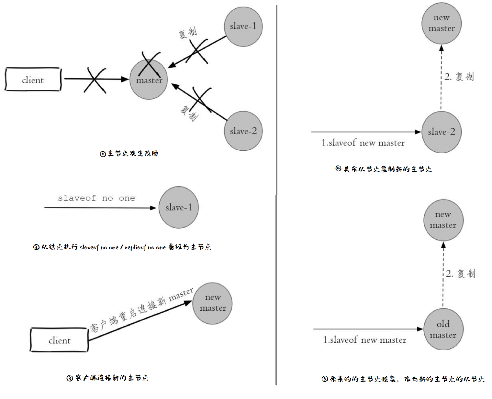

因为上面的过程是人工手动介入的，有几个问题：

- 判断节点不可达的机制是否合理；
- 如果有多个从节点，怎么保证只有一个从节点变成新的主节点，为什么是这个节点成为新的主节点；
- 通知客户端连接新的主节点的机制是否足够健壮；

Redis Sentinel 的出现就是为了解决这些问题的。

### Redis Sentinel 高可用

Redis Sentinel 是一个分布式系统，其中包含若干个 Sentinel 节点和 Redis 数据节点，提供的功能如下：

- 监控：Sentinel 不断检查 Redis 的主从节点是否按预期工作，还会监控其余的 Sentinel 节点；
- 通知：当其中一个受监控的 Redis 节点出现问题，Sentinel 可以通过 API 通知系统管理员或其他计算机程序；
- 自动故障转移：如果主节点没有按预期工作，Sentinel 可以启动故障转移过程，将某个从节点提升为主节点，其它的从节点被重新配置为新的主节点的从节点，并且使用 Redis 服务的应用程序被告知连接时要使用的新主节点地址；
- 配置提供者：Sentinel 充当客户端服务发现的权威来源：客户端连接到 Sentinel 以询问负责给定服务的当前 Redis 主节点的地址。如果发生故障转移，Sentinels 将报告新地址。

Redis Sentinel 和 Redis 的主从复制只是多了一些 Sentinel 节点，并没有对 Redis 数据节点做特殊处理。

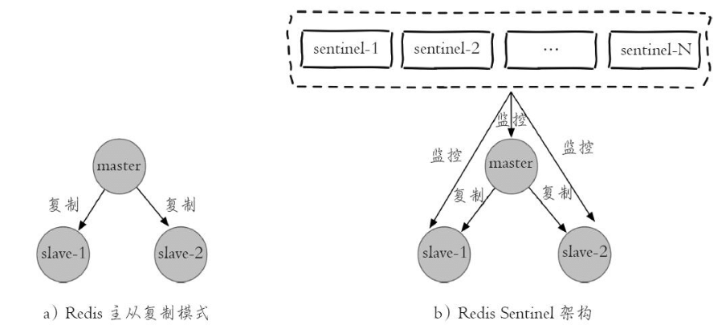

### Redis Sentinel 故障转移流程

以 1 个主节点、2 个从节点、3 个 Sentinel 节点组成的 Redis Sentinel 为例：

1. 主节点出现故障，此时两个从节点与主节点失去连接，主从复制失败；
2. 每个 Sentinel 节点通过定时任务监控发现主节点发生了故障；
3. 多个 Sentinel 节点对主节点的故障达成一致，选举出 Sentinel3 节点作为领导者负责故障转移操作；
4. Sentinel 领导者节点执行了故障转移，整个过程和前面说的手动故障转移是一样的；

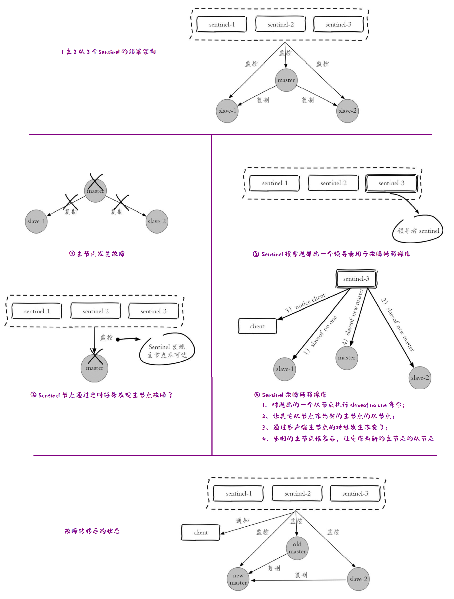

## 启动 Sentinel 命令

Sentinel 的当前版本称为 Sentinel 2。它是对初始 Sentinel 实现的重写，使用更强大且更易于预测的算法。Redis Sentinel 的稳定版本从 Redis 2.8 开始发布。随 Redis 2.6 一起提供的 Redis Sentinel 版本 1 已经弃用了。

可以使用
```
redis-sentinel /path/to/sentinel.conf
```

或者

```
redis-server /path/to/sentinel.conf --sentinel
```

在运行 Sentinel 时必须指定配置文件，因为系统将使用此文件来保存当前状态，以便在重新启动时重新加载。如果没有指定配置文件或者配置文件路径不可写，Sentinel 将拒绝启动。

> **关于 Redis Sentinel 节点，它本身就是一个独立的 Redis 节点，只不过它不存储数据，只支持部分命令。**

## Sentinel 配置文件

在下载的 Redis 中有一个 sentinel.conf 文件

 sentinel.conf 文件内（以 Redis 5.0.14 的配置为例）的主要配置如下（其他配置去看发行版的 sentinel.conf）：

```properties
port <sentinel-port>
logfile <filename>
dir <working-directory>
sentinel monitor <master-name> <ip> <redis-port> <quorum>
sentinel auth-pass <master-name> <password>
sentinel down-after-milliseconds <master-name> <milliseconds>
sentinel parallel-syncs <master-name> <numreplicas>
sentinel failover-timeout <master-name> <milliseconds>
sentinel notification-script <master-name> <script-path>
sentinel client-reconfig-script <master-name> <script-path>
```

- `port <sentinel-port>`

  给 Sentinel 指定端口号，默认 26379；

- `logfile <filename>`

  Sentinel 日志文件的名字；

- `dir <working-directory>`

  Sentinel 的工作目录；

- `sentinel monitor <master-name> <ip> <redis-port> <quorum>`

  - 表示要监视的主节点的信息
  - mater-name：主节点的名字；
  - ip：主节点的地址；
  - redis-port：主节点的端口；
  - quorum：用于故障发现和判定。有两种含义，一种是**判断 master 不可达需要的 Sentinels 的数量**，例如将quorum 配置为 2，表示至少有 2 个 Sentinel 节点认为主节点不可达， 那么这个不可达的判定才是客观的。第二种含义是**在 Sentinel  领导者选举**中，至少要有 `max(quorum, num(sentinels) / 2 + 1)` 个 Sentinel 节点参与选举， 才能选出领导者 Sentinel， 从而完成故障转移;

- `sentinel auth-pass <master-name> <password>`

  - master-name：主节点的名字；
  - password：配置主节点的密码，需要注意的是访问从节点的密码也是从这里获取的；

- `sentinel down-after-milliseconds <master-name> <milliseconds>`

  - 每个 Sentinel 节点都要通过定期发送 PING 命令来判断 Redis 数据节点和其他的 Sentinel 节点是否可达，如果超过了该时间且没有有效的回复（要么不回复我们的 PING，要么回复一个错误），则认为该节点不可达。（单位毫秒）；
  - 这个值设置的越大，也就是对 Sentinel 节点对其他节点不可达的判断条件是宽松的。反之越严格。**宽松的条件有可能带来的问题是节点确实不可达了，那么应用程序等待故障转移的时间越长**，也就意味着应用方故障的时间可能越长。**条件严格虽然可以及时发现故障并完成故障转移，但是也存在一定的误判率**；
  - 该参数**对 Sentinel 节点、 主节点、 从节点的故障判定同时有效**；

- `sentinel parallel-syncs <master-name> <numreplicas>`

  - 当 Sentinel 节点集合对主节点的故障判断达成一致时，选举出来的 Sentinel 领导者节点就会去做故障转移操作，选一个从节点作为新的主节点，其它的从节点需要向新的主节点发起复制请求，**parallel-syncs 配置项就是限制一次故障转移之后，每次向新的主节点发起复制的节点个数。**
  - 这个值数字越低，完成故障转移过程所需的时间就越长。虽然从节点的复制过程大部分是非阻塞的，但是**假如同时有很多个从节点给主节点发起同步请求时，就会消耗主节点的性能**。一般设置成 1 就好了；

- `sentinel failover-timeout <master-name> <milliseconds>`

  故障转移的超时时间，通常有下面几个用处：

  - 如果某个 Sentinel 已经尝试过针对同一主节点进行故障转移，则重新启动故障转移所需的时间是两倍的故障转移超时时间；
  - 当 Sentinel 选一个从节点作为新的主节点后，从节点执行 SLAVEOF NO ONE 命令失败（可能是故障了），当这个时间超过 failover-timeout 时间，则认为故障转移失败；
  - 假如从节点成功晋升为主节点后，当按照 Sentinel 当前配置进行复制的从节点正在错误的主节点上复制时，强制其与正确的、新的主节点进行复制所需的时间正好是故障转移超时时间（从 Sentinel 检测到配置错误的时刻开始计算）；
  - 进行中的故障转移等待所有从节点被重新配置为新主节点的从节点的最长时间。注意即使超过了这个时间， Sentinel 节点也会最终配置从节点去同步最新的主节点，但不会按照指定的并行同步进度进行；
  
- `sentinel notification-script <master-name> <script-path>`

  - 在故障转移期间，当一些警告级别的 Sentinel 事件发生（指重要事件，例如 -sdown：客观下线、-odown：主观下线）时，会触发对应路径的脚本，并向脚本发送相应的事件参数。

- `sentinel client-reconfig-script <master-name> <script-path>`

  - 当主节点由于故障转移而更改时，可以调用一个脚本来执行应用程序特定的任务，以通知客户端配置已更改，主节点已经位于不同的地址；
  - 当故障转移结束， 每个Sentinel节点会将故障转移的结果发送给对应的脚本， 具体参数如下

  ```
  <master-name> <role> <state> <from-ip> <from-port> <to-ip> <to-port>
  ```

  - `<state>` is currently always "failover"；
  - `<role>` is either "leader" or "observer"
  - Redis 规定脚本的最大执行时间不能超过 60 秒， 超过后脚本将被杀掉；


> 上面的部分参数可以在运行时配置，后面讲解如何在运行时配置

关于 parallel-syncs 配置项的含义如下：

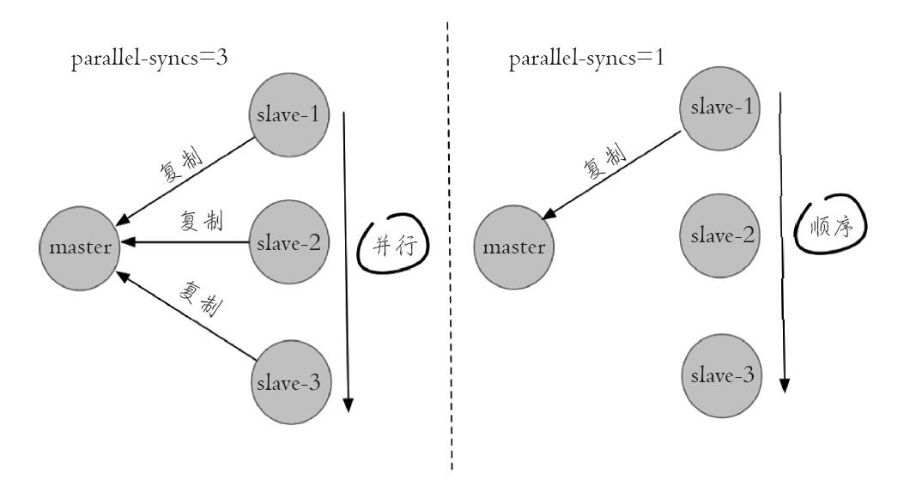

典型的最小配置文件如下所示：

```properties
sentinel monitor mymaster 127.0.0.1 6379 2
sentinel down-after-milliseconds mymaster 60000
sentinel failover-timeout mymaster 180000
sentinel parallel-syncs mymaster 1

sentinel monitor resque 192.168.1.3 6380 4
sentinel down-after-milliseconds resque 10000
sentinel failover-timeout resque 180000
sentinel parallel-syncs resque 5
```

这上面的配置**说明当前 Sentinel 实例监控两个主节点**。

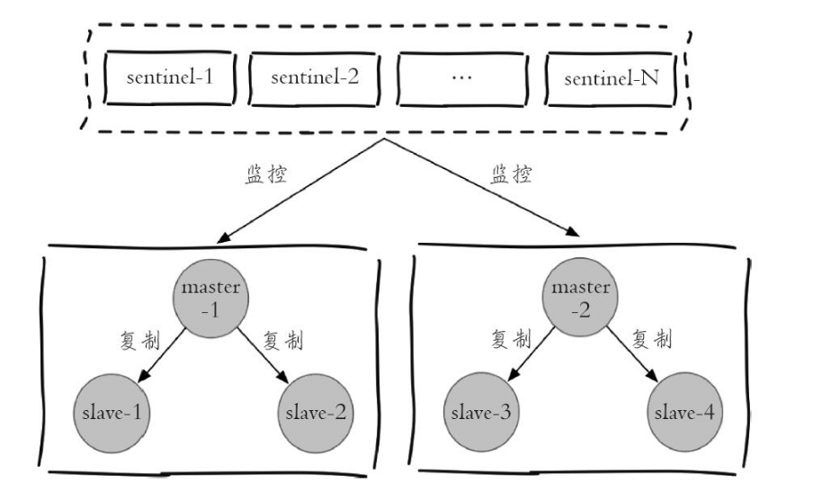

## 设置从节点的优先级

用户可以通过 replica-priority 配置项来设置各个从节点的优先级，优先级较高的从节点在 Sentinel 选择新的主节点的时候会被优先选择。

**replica-priority 默认值是 100，这个值越小表示从节点的服务器的优先级越高**。

通过这个配置，我们**可以给性能较高的从节点设置较高的优先级来尽可能的保证新的主节点的性能**，因为主节点在下线并重新上线之后也会变成从节点，所以我们**也应该给主节点设置相应的优先级**。

**replica-priority 值为 0 的从几点永远不会被选为主节点**。

## Sentinel 部署案例（官网的案例，看看就行了）

### 案例的图案的含义

按照官网的部署案例分析，需要了解官网的案例的一些图案的含义

box 表示一个独立的机器；

```
+--------------------+
| This is a computer |
| or VM that fails   |
| independently. We  |
| call it a "box"    |
+--------------------+
```

在框框里面写它里面运行的进程

```
+-------------------+
| Redis master M1   |
| Redis Sentinel S1 |
+-------------------+
```

不同的 box用线连接起来，表示它们会进行通信：

```
+-------------+               +-------------+
| Sentinel S1 |---------------| Sentinel S2 |
+-------------+               +-------------+
```

使用双斜线表示网络分区

```
+-------------+                +-------------+
| Sentinel S1 |------ // ------| Sentinel S2 |
+-------------+                +-------------+
```

另外：

- Masters are called M1, M2, M3, ..., Mn.
- Replicas are called R1, R2, R3, ..., Rn (R stands for *replica*).
- Sentinels are called S1, S2, S3, ..., Sn.
- Clients are called C1, C2, C3, ..., Cn.
- 当一个实例因为 Sentinel 的动作而改变角色时，我们将其放在方括号内，因此 [M1] 表示一个实例由于 Sentinel 的干预后现在是主节点；

### Example 1:仅有两个 Sentinel（不建议）

```
+----+         +----+
| M1 |---------| R1 |
| S1 |         | S2 |
+----+         +----+

Configuration: quorum = 1
```

在此设置中，如果主 M1 发生故障，R1 将晋升，因为两个 Sentinels 可以就故障达成一致（显然将 quorum 设置为 1）并且还可以授权故障转移，因为大多数是两个。

看起来可以正常运行，如果运行 M1 的 box 停止工作，则 S1 也停止工作。在另一个box 的 S2 中运行的 Sentinel 将无法授权故障转移，因此系统将变得不可用

```
+----+           +------+
| M1 |----//-----| [M1] |
| S1 |           | S2   |
+----+           +------+
```

因为某种原因，两个机器断开链接，S2 将同机器的 R1 提升角色为 master，这样集群里，出现了两个 master 同时工作 —— 脑裂出现了。不同的 client 链接到不同的 redis 进行读写，那么两台机器就出现了 redis 数据不一致的现象。

因此，请始终在 3 个不同的框中部署至少 3 个Sentinel。这样可以确保有一个多数支持的哨兵群体来监视并协调主从节点之间的切换，从而避免永久性的脑裂情况。

### Example 2:三个 Sentinel

这是一个非常简单的设置，其优点是易于调整以提高安全性。它基于三个 box，每个 box 都运行一个 Redis 进程和一个 Sentinel 进程。

```
   	   +----+
       | M1 |
       | S1 |
       +----+
          |
+----+    |    +----+
| R2 |----+----| R3 |
| S2 |         | S3 |
+----+         +----+

Configuration: quorum = 2
```

如果主 M1 发生故障，S2 和 S3 将就故障达成一致，并能够授权故障转移，使客户端能够继续。

在每个 Sentinel 设置中，由于 Redis 使用异步复制，因此始终存在丢失某些写入的风险，因为给定的已确认写入可能无法及时同步到新晋升为 master 的从节点。然而，在上面的设置中，由于客户端被旧 master 分区，因此存在更高的风险，如下图所示：

```
         +----+
         | M1 |
         | S1 | <- C1 (writes will be lost)
         +----+
            |
            /
            /
+------+    |    +----+
| [M2] |----+----| R3 |
| S2   |         | S3 |
+------+         +----+
```

在这种情况下，网络分区隔离了旧的主节点 M1，因此从节点 R2 被提升为主节点。但是，与旧 master 位于同一分区中的客户端（如 C1）可能会继续向旧 master 写入数据。

可以在 redis.conf 配置文件中配置下面两个配置项（下面的配置中的 replicas 假如是旧版本则替换成 salve）

```
min-replicas-to-write 1
min-replicas-max-lag 10
```

配置这两个选项后，主节点只会在从节点大于等于 min-slaves-to-write 的值，并且这些从节点与主节点最后一次成功通信的时间间隔不超过 min-slaves-max-lag 的时候才会执行写命令。

使用此配置，上例中的旧 Redis 主节点 M1 将在 10 秒后变得不可用。当分区恢复后，Sentinel 配置将汇聚到新配置，客户端 C1 将能够获取有效配置并继续使用新的 master。但是这样也有一个问题，如果两个从节点都宕机了，master 将停止接受写入。这是一个需要权衡利弊的点。

### Example 3:客户端中的 Sentinel

有时我们只有两个 Redis box 可用，一个用于 master，一个用于 replica。示例 2 中的配置在这种情况下不可行，因此我们可以求助于以下内容，将 Sentinels 放置在客户端所在的位置：

```
            +----+         +----+
            | M1 |----+----| R1 |
            |    |    |    |    |
            +----+    |    +----+
                      |
         +------------+------------+
         |            |            |
         |            |            |
      +----+        +----+      +----+
      | C1 |        | C2 |      | C3 |
      | S1 |        | S2 |      | S3 |
      +----+        +----+      +----+

      Configuration: quorum = 2
```

如果运行 M1 和 S1 的机器发生故障，故障转移将毫无问题地发生，但是很容易看出不同的网络分区会导致不同的行为。例如，如果客户端和 Redis 服务器之间的网络断开连接，则 Sentinel 将无法设置，因为 Redis 主服务器和副本服务器都将不可用。

请注意，如果 C3 与 M1 分区（虽然在上述描述的网络中很难发生，但在不同布局或软件层面故障的情况下可能更容易发生），我们将遇到类似于示例 2 中所描述的问题，不同之处在于这里没有办法打破对称性，因为只有一个主节点和从节点，所以当主节点与其从节点断开连接时，主机无法停止接受查询，否则主机将永远无法在副本出现故障时可用。

### Example 4: 少于 3 个客户端的 Sentinel 客户端

如果客户端中的框少于三个（例如三个 Web 服务器），则无法使用示例 3 中描述的设置。在这种情况下，我们需要采用如下混合设置：

```
            +----+         +----+
            | M1 |----+----| R1 |
            | S1 |    |    | S2 |
            +----+    |    +----+
                      |
               +------+-----+
               |            |
               |            |
            +----+        +----+
            | C1 |        | C2 |
            | S3 |        | S4 |
            +----+        +----+

      Configuration: quorum = 3
```

这类似于示例 3 中的设置，但在这里我们在可用的四个框中运行四个 Sentinel。如果主 M1 变得不可用，其他三个 Sentinels 将执行故障转移。

从理论上讲，此设置可以删除运行 C2 和 S4 的框，并将 quorum 设置为 2。但是，如果我们的应用程序层没有高可用性，我们不太可能希望 Redis 端具有高可用性。

### 部署 Sentinel 注意的地方

前面官网的 4 个案例，都是把 Sentinel 节点和 Redis 数据节点或者客户端放在一起。

我觉得在实际应用中，应该**将 Sentinel 和被监视的 Redis 服务器放到不同的机器上运行，并且各个 Sentinel 也应该放在不同的机器上运行，这样整个系统才能够更准确、有效的判断出服务器的实际状态**。

- Sentinel 节点应该部署在不同的机器上；
- **至少需要 3 个 Sentinel 实例才能进行可靠的部署，尽量奇数个 Sentinel 节点**；
- 因为 Redis 使用异步复制，所以 Redis Sentinel 分布式系统**不能保证在故障期间的写入命令同步到从节点，也就是说可能有丢数据的风险**；
- 客户端需要支持 Sentinel。例如 Jedis 就支持 Sentinel；
- Sentinel、Docker或其他形式的网络地址转换或端口映射应小心混合：Docker 执行端口重新映射时，打破Sentinel 对其他 Sentinel 进程的自动发现和从节点列表；

## 实际部署案例

本地部署的 Redis 版本 6.2.6。

我要部署一主两从，三个 Sentinel 节点组成的集合。

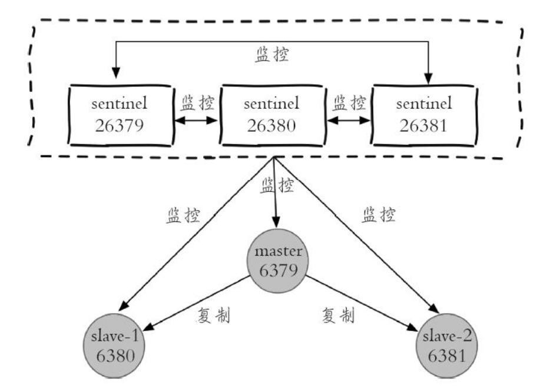

### 部署 Redis 数据节点

配置文件 redis-6379.conf，其它两个改下端口号和文件名就行

```
port 6379
daemonize yes
# 工作目录 dir 的相对路径
logfile "./redis-6379.log"
dbfilename dump-6379.rdb
dir "../data/redis-sentinel-demo"
# 密码
requirepass master123
masterauth master123
```

部署：

```shell
./redis-server ../conf/redis-sentinel-demo/redis-6379.conf
./redis-server ../conf/redis-sentinel-demo/redis-6380.conf
./redis-server ../conf/redis-sentinel-demo/redis-6381.conf
```

在主节点使用 info replication 命令：

```
127.0.0.1:6379> info replication
# Replication
role:master
connected_slaves:2
slave0:ip=127.0.0.1,port=6380,state=online,offset=98,lag=1
slave1:ip=127.0.0.1,port=6381,state=online,offset=98,lag=1
master_failover_state:no-failover
master_replid:1444b8ce1c3f903232525ecd278f0145080b1950
master_replid2:0000000000000000000000000000000000000000
master_repl_offset:98
second_repl_offset:-1
repl_backlog_active:1
repl_backlog_size:1048576
repl_backlog_first_byte_offset:1
repl_backlog_histlen:98
```

可以看到 master 有两个从节点了

### 部署 Sentinel 节点

配置文件 redis-sentinel-26379.conf，其它两个改下端口号和文件名就行

```
port 26379
daemonize yes
logfile "./sentinel-26379.log"
dir "../data/redis-sentinel-demo"
sentinel monitor demomaster 127.0.0.1 6379 2
sentinel down-after-milliseconds demomaster 30000
sentinel parallel-syncs demomaster 1
sentinel failover-timeout demomaster 180000

# 设置连接 redis 数据节点的密码
sentinel auth-pass demomaster master123
```

部署：

```
./redis-sentinel ../conf/redis-sentinel-demo/redis-sentinel-26379.conf
./redis-sentinel ../conf/redis-sentinel-demo/redis-sentinel-26380.conf
./redis-sentinel ../conf/redis-sentinel-demo/redis-sentinel-26381.conf
```

在 26379 端口的 Sentinel 上使用 info sentinel 命令

```
127.0.0.1:26379> info sentinel
# Sentinel
sentinel_masters:1
sentinel_tilt:0
sentinel_running_scripts:0
sentinel_scripts_queue_length:0
sentinel_simulate_failure_flags:0
master0:name=demomaster,status=ok,address=127.0.0.1:6379,slaves=2,sentinels=3
```

可以看到最后一行的信息，监控了名字为 demomaster 的主节点，有 2 个从节点，总共有 3 个 Sentinel 一起监控这个主节点。

### 日志分析

Redis 主从复制的日志前面的文章分析过了，这里就不再分析了。

这里分析端口 26379 的 Sentinel 的启动日志：

```
75469:X 04 Apr 2023 16:34:21.827 # oO0OoO0OoO0Oo Redis is starting oO0OoO0OoO0Oo
75469:X 04 Apr 2023 16:34:21.827 # Redis version=6.2.11, bits=64, commit=720ea82e, modified=0, pid=75469, just started
75469:X 04 Apr 2023 16:34:21.827 # Configuration loaded
75469:X 04 Apr 2023 16:34:21.829 * Increased maximum number of open files to 10032 (it was originally set to 256).
75469:X 04 Apr 2023 16:34:21.829 * monotonic clock: POSIX clock_gettime
75469:X 04 Apr 2023 16:34:21.833 * Running mode=sentinel, port=26379.
75469:X 04 Apr 2023 16:34:21.835 # Sentinel ID is 12a27d10e3f1bdf445ae30dd1f4aba1af78234f6
75469:X 04 Apr 2023 16:34:21.835 # +monitor master demomaster 127.0.0.1 6379 quorum 2
75469:X 04 Apr 2023 16:34:21.838 * +slave slave 127.0.0.1:6380 127.0.0.1 6380 @ demomaster 127.0.0.1 6379
75469:X 04 Apr 2023 16:34:21.838 * +slave slave 127.0.0.1:6381 127.0.0.1 6381 @ demomaster 127.0.0.1 6379
75469:X 04 Apr 2023 16:34:23.868 * +sentinel sentinel 2b044ab85b5b93b8553baf65f8a40970ff4fbb9e 127.0.0.1 26381 @ demomaster 127.0.0.1 6379
75469:X 04 Apr 2023 16:34:23.871 * +sentinel sentinel 70668315c96c8bfb74520e4982f8378dcd564dfe 127.0.0.1 26380 @ demomaster 127.0.0.1 6379
```

按步骤分析：

（1）当端口 26379 的 Sentinel 启动后，会打印下面的日志，表示当前监听一个名字为 demomaster 的主节点。这是一个 Sentinel 事件，如果我们自己订阅在 Pub/Sub 消息部分指定的事件名称，也可以通过 Pub/Sub 接收此类事件。

```
75469:X 04 Apr 2023 16:34:21.835 # +monitor master demomaster 127.0.0.1 6379 quorum 2
```

（2）监听到了主节点有两个从节点；

```
75469:X 04 Apr 2023 16:34:21.838 * +slave slave 127.0.0.1:6380 127.0.0.1 6380 @ demomaster 127.0.0.1 6379
75469:X 04 Apr 2023 16:34:21.838 * +slave slave 127.0.0.1:6381 127.0.0.1 6381 @ demomaster 127.0.0.1 6379
```

（3）监听到了有另外两个 Sentinel 也在监视同一个主节点；

```
75469:X 04 Apr 2023 16:34:23.868 * +sentinel sentinel 2b044ab85b5b93b8553baf65f8a40970ff4fbb9e 127.0.0.1 26381 @ demomaster 127.0.0.1 6379
75469:X 04 Apr 2023 16:34:23.871 * +sentinel sentinel 70668315c96c8bfb74520e4982f8378dcd564dfe 127.0.0.1 26380 @ demomaster 127.0.0.1 6379
```

## Sentinel API

Sentinel 提供 API 以检查其状态、检查受监控的主节点和从节点的健康状况、订阅以接收特定通知以及在运行时更改 Sentinel 配置。

### Sentinel 管理命令

> 详细的请看官网 https://redis.io/docs/management/sentinel/#sentinel-api

- **SENTINEL CKQUORUM `<master name>`** ：检查可用的 Sentinel 数量

  检查 Sentinel 系统中当前可用的 Sentinel 数量是否达到了判断主节点客观下线并实施故障转移所需的数量。该命令应用于监控系统，以检查 Sentinel 部署是否正常；

- **SENTINEL FLUSHCONFIG**：强制写入配置文件

  将 Sentinel 的配置文件重新写入磁盘中。因为 Sentinel 在被监视节点的状态发生改变的时候就会自动重写配置文件，所以这个命令的作用就是在配置文件由于某些原因或者错误丢失时，立即生成一个新的配置文件。此外，当 Sentinel 的配置选项发生变化时，Sentinel 内部也会使用这个命令创建新的配置文件来替代原有的配置文件；

  只有接收到该命令的 Sentinel 才会重写配置文件，Sentinel 集合中的其它 Sentinel 并不会受到这个命令的影响；

- **SENTINEL FAILOVER `<master name>`** ：强制执行故障转移

  接收到这个命令的 Sentinel 强制对指定的主节点实施故障转移，无需选举出一个 Sentinel 进行故障转移；

- **SENTINEL GET-MASTER-ADDR-BY-NAME `<master name>`**：获取给定主节点的 IP 和端口号；

  如果 Sentinel 正在对给定的主节点执行故障转移操作，或者原本的主节点已经因为故障转移而被新的主节点替换掉了，那么这个命令将会返回新节点的 IP 和端口号；

- **SENTINEL INFO-CACHE** (`>= 3.2`) Return cached [`INFO`](https://redis.io/commands/info) output from masters and replicas.

- **SENTINEL IS-MASTER-DOWN-BY-ADDR**：从当前 Sentinel 的角度检查 ip 和 port 指定的主机是否已关闭。此命令主要供内部使用；

- **SENTINEL MASTER `<master name>`** ：获取被监视的主节点的信息；

- **SENTINEL MASTERS**：获取所有被监视的主节点的信息；

- **SENTINEL MYID** (`>= 6.2`) Return the ID of the Sentinel instance.

- **SENTINEL PENDING-SCRIPTS** This command returns information about pending scripts.

- **SENTINEL REPLICAS `<master name>`** (`>= 5.0`)   或者 **SENTINEL SLAVES `<master name>`**

  获取被监视主节点的从节点的信息

- **SENTINEL SENTINELS `<master name>`** 获取其他 Sentinel 的相关信息；

- **SENTINEL SIMULATE-FAILURE (crash-after-election|crash-after-promotion|help)** (`>= 3.2`)：该命令模拟不同的Sentinel崩溃场景。

- **SENTINEL RESET `<pattern>`** 重置主节点的状态

  接受一个 glob 风格的模式作为参数，接收到该命令的 Sentinel 将重置所有与给定模式相匹配的主节点。

  命令将返回被重置的主节点的数量；

  接收到该命令的 Sentinel 除了会清理被匹配的主节点的相关信息之外，还会遗忘被匹配主节点目前已有的所有从节点，以及正在监视被匹配主节点的所有其他 Sentinel 节点。在此之后，这个 Sentinel 将会重新搜索正在监视被匹配主节点的其他 Sentinel，以及该节点下的各个从节点，并与它们重新建立连接；

#### 关于 Sentinel master 的返回值

| 字段                    | 含义                                                         |
| ----------------------- | ------------------------------------------------------------ |
| name                    | 服务器的名称                                                 |
| ip                      | 服务器的 ip                                                  |
| port                    | 服务器的端口                                                 |
| runid                   | 服务器的运行 ID                                              |
| flags                   | 服务器的角色和状态                                           |
| link-pending-commands   | Sentinel 向服务器发送了命令之后，仍然在等待回复的命令数量    |
| link-refcount           | Redis 实例拥有者数量，用于内部实现                           |
| last-ping-sent          | 距离 Sentinel 最后一次向服务器发送的 PING 之后过的毫秒数     |
| last-ok-ping-reply      | 服务器最后一次向 Sentinel 返回有效 PING 的回复之后过的毫秒数 |
| last-ping-reply         | 服务器最后一次向 Sentinel 返回 PING 的回复之后过的毫秒数     |
| down-after-milliseconds | Sentinel 的 down-after-milliseconds 配置项的值               |
| info-refresh            | 服务器最后一次向 Sentinel 返回 INFO 命令回复之后过的毫秒数   |
| role-reported           | 服务器向 Sentinel 汇报它自身的角色                           |
| role-reported-time      | 服务器最后一次向 Sentinel 汇报它自身的角色之后过的毫秒数     |
| config-epoch            | 当前 Sentienl 网络所处的配置纪元，用于实现投票机制           |
| num-slaves              | 主节点下面的从节点数量                                       |
| num-other-sentinels     | 其他正在监视这一台服务器的 Sentinel 的数量                   |
| quorum                  | 判断服务器下线所需要的 Sentinel 的数量                       |
| failover-timeout        | Sentinel 的 failover-time 配置选项的值                       |
| parallel-syncs          | Sentinel 的 parallel-syncs 配置选项的值                      |

#### 关于 Sentinel slaves 返回值

大部分字段的名称和含义，和 Sentinel master 的返回值一样

| 字段                  | 含义                         |
| --------------------- | ---------------------------- |
| master-link-down-time | 主从节点连接断开的时间，毫秒 |
| master-link-status    | 主从节点的连接状态           |
| master-host           | 主节点的地址                 |
| master-port           | 主节点的端口号               |
| slave-priority        | 从节点的优先级               |
| slave-repl-offset     | 从节点的复制偏移量           |

#### 关于 Sentinel sentinel 的返回值

大部分字段的名称和含义，和 Sentinel master 的返回值一样

| 字段               | 含义                                                         |
| ------------------ | ------------------------------------------------------------ |
| last-hello-message | 距离当前 Sentinel 最后一次从这个 Sentinel 收到 HELLO 消息后过的毫秒数 |
| voted-leader       | Sentinel 网络当前选举出来的 Sentinel 领导者， ？表示当前没有领导者 |
| voted-leader-epoch | Sentinel 领导者当前所处的配置纪元                            |

### 在线修改 Sentinel 配置项

在 Redis 2.8.4 之前，Redis Sentinel 只能通过加载配置文件的方式来修改配置项。

从 Redis 2.8.4 开始，Sentinel 提供了一组子命令，这些子命令可以在线的修改 Sentinel 对于被监视主节点的配置选项，并把修改后的配置选项保存到配置文件中，整个过程不需要停止 Sentinel，也不需要手动修改配置文件

**如果有多个 Sentinel，则应将更改应用于所有 Sentinel 实例，这意味着更改单个 Sentinel 的配置不会自动将更改传播到网络中的其他 Sentinel。**

以下是用于更新 Sentinel 实例配置的 SENTINEL 子命令列表。

- **SENTINEL MONITOR `<name>` `<ip>` `<port>` `<quorum>`** ：监视给的主节点

  当想要 Sentinel 监视一个新的主节点，但是又不想重启 Sentin 并手动修改 Sentinel 配置文件时，可以使用这个命令；（这里是添加一个监视主节点，之前的那个主节点还在监视着）

- **SENTINEL REMOVE `<name>`** ：取消对给定主节点的监视

  接收到这个命令的 Sentinel 会停止对给定主节点的监视，并删除 Sentinel 内部以及 Sentinel 配置文件中与给定主节点有关的所有信息，并返回 OK 表示执行成功；

- **SENTINEL SET `<name>` [`<option>` `<value>` ...]** ：修改 Sentinel 配置选项的值

  只要是 Sentinel 配置文件中与主节点有关的配置项，都可以使用这个命令进行在线更新。命令在成功修改给定的配置项之后都会返回 OK；

  例如：

  ```
  SENTINEL SET demomaster down-after-milliseconds 1000
  ```


从 Redis 6.2 版本开始，Sentinel 还允许获取和设置全局配置参数，这些参数在之前仅支持配置文件配置。

- **SENTINEL CONFIG GET `<name>`** (`>= 6.2`) Get the current value of a global Sentinel configuration parameter. The specified name may be a wildcard, similar to the Redis [`CONFIG GET`](https://redis.io/commands/config-get) command.
- **SENTINEL CONFIG SET `<name>` `<value>`** (`>= 6.2`) Set the value of a global Sentinel configuration parameter.

Global parameters that can be manipulated include:

- `resolve-hostnames`, `announce-hostnames`. See [*IP addresses and DNS names*](https://redis.io/docs/management/sentinel/#ip-addresses-and-dns-names).
- `announce-ip`, `announce-port`. See [*Sentinel, Docker, NAT, and possible issues*](https://redis.io/docs/management/sentinel/#sentinel-docker-nat-and-possible-issues).
- `sentinel-user`, `sentinel-pass`. See [*Configuring Sentinel instances with authentication*](https://redis.io/docs/management/sentinel/#configuring-sentinel-instances-with-authentication).

### 添加或删除 Sentinel

由于 Sentinel 的自动发现机制，仅需要在配置文件中指定要监视的主节点并启动 Sentinel，在 10 秒内，Sentinel 将获取其他 Sentinel 的集合和那些从节点。不到 10 秒是因为 Sentinel 中会有一些定时任务去获取系统的信息，后面会讲。

如果**需要一次添加多个 Sentinel，建议一个接一个添加，等待所有其他 Sentinel 都知道新加了一个 Sentinel 之后再添加下一个**。在向一个分区添加新的 Sentinel 时，如果在这个过程中出现了故障，就可以确保新的 Sentinel 只会被加入到一个分区中，而不是被平均地分配到多个分区。这样做可以确保在每个分区中仍然存在大多数的 Sentinel 节点，从而提高系统的可靠性。

在向一个分区添加新的 Sentinel 时，我们可以将每个新 Sentinel 的添加间隔设置为30秒，并且只在没有网络分区的情况下进行添加。这样做可以简单地实现确保每个 Sentinel 节点只被添加到一个分区中的目的。当整个添加过程完成后，我们可以使用命令 `SENTINEL MASTER mastername` 来检查所有 Sentinel 节点是否都同意监视该主节点的Sentinel 总数。


移除一个 Sentinel 节点比较复杂：即使某个 Sentinel 节点长时间不可用，其他 Sentinel 节点也不会忘记它，因为我们不想动态地改变授权故障转移和创建新的配置编号所需的大多数。因此，在没有网络分区的情况下，需要执行以下步骤才能移除一个 Sentinel 节点：

1. **停止要移除的 Sentinel 节点进程**；
2. 向所有其他 Sentinel 节点发送 `SENTINEL RESET *`命令，以重置它们所见到的已知 Sentinel 节点列表（如果您只想重置单个主节点，则可以使用该主节点的名称代替 *）。依次向每个 Sentinel 节点发送此命令，等待至少 30 秒后再向下一个 Sentinel 节点发送；
3. 确保每个 Sentinel 节点都同意当前活动 Sentinel 节点的数量，可以通过检查每个 Sentinel 节点的`SENTINEL MASTER mastername`输出来完成；

### 移除旧的主节点或者不可达的从节点

**在 Redis Sentinel 中，Sentinel 会追踪主节点的所有从节点，即使它们长时间无法到达，也会记住它们。这很有用，因为在网络分区或出现故障后，Sentinel 应该能够正确地重新配置恢复的从节点。**

此外，在进行故障转移后，被替换的主节点实际上会被添加回新主节点作为它的从节点，以便在新主节点再次可用时可以重新配置。

但是，有时候我们可能需要永久地从 Sentinel 监视的从节点列表中删除一个从节点（可能是旧的主节点）。为了实现这一点，**需要向所有 Sentinel 发送 `SENTINEL RESET mastername` 命令，这将刷新 Sentinel 中的从节点列表，并仅添加当前主节点 INFO 输出中列出的正确复制的从节点**。

###  Pub/Sub messages

客户端可以使用 Sentinel 作为 Redis 兼容的 Pub/Sub 服务器（但不能使用 PUBLISH），以 SUBSCRIBE 或 PSUBSCRIBE 到通道，并在特定事件发生时接收通知。

**通道名称与事件名称相同。例如，名为 +sdown 的通道将接收有关进入 SDOWN 状态的实例的所有通知（SDOWN 表示该实例从您查询的 Sentinel 视角不再可达）。**

**要获取所有消息，请使用 PSUBSCRIBE * 进行订阅。**

下面是通过此 API 可以接收的通道和消息格式列表。第一个单词是通道 / 事件名称，其余部分是数据格式。

注意：如果指定了实例详细信息，则表示提供以下参数以标识目标实例：

```
<instance-type> <name> <ip> <port> @ <master-name> <master-ip> <master-port>
```

从 @ 参数到结尾的标识主节点的部分是可选的，并且仅在实例本身不是主节点时才会指定。

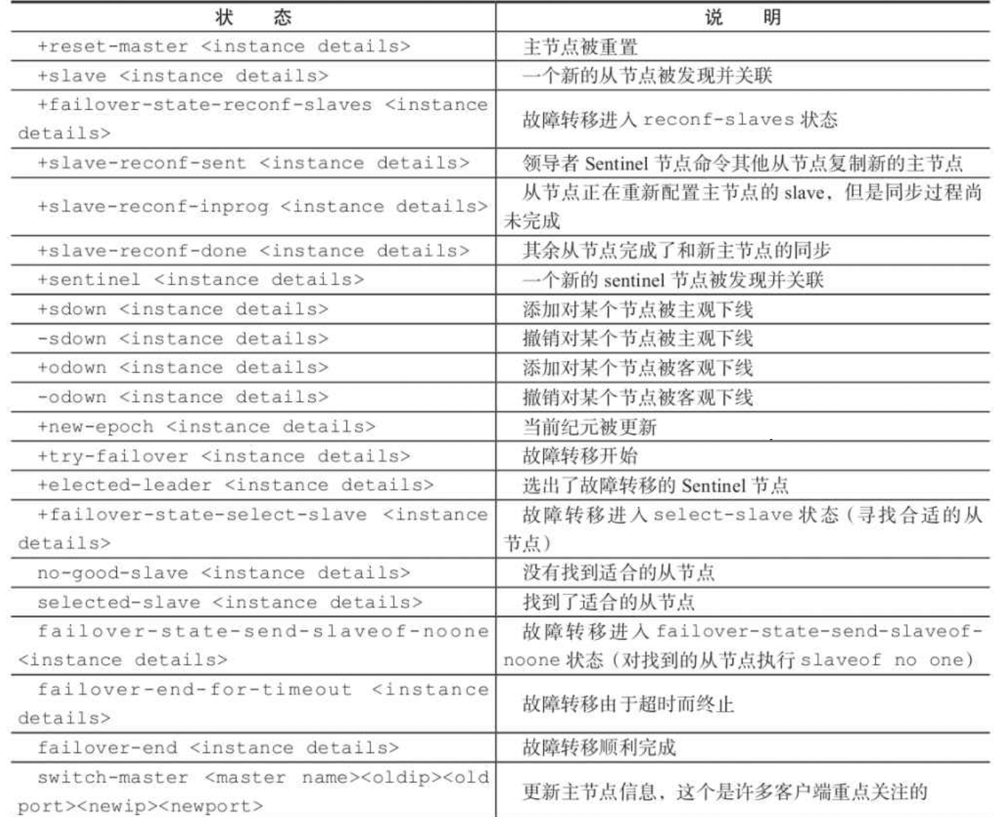

> 具体的看官网的 https://redis.io/docs/management/sentinel/#pubsub-messages

## Sentinel 客户端

### Sentinel 客户端实现原理

各个语言需要显示支持 Redis Sentinel。 Redis Sentinel 执行了故障转移操作， 客户端需要知道最新的主节点的地址是多少。

实现一个 Redis Sentinel 客户端的基本步骤如下：

1. 遍历 Sentinel 节点集合获取一个可用的 Sentinel 节点，Sentinel 节点之后可以共享数据，所以从任意一个 Sentinel 节点获取主节点的信息都是可以的；
2. 通过 SENTINEL GET-MASTER-ADDR-BY-NAME master-name，获取对应的主节点的相关信息；
3. 验证当前获取的“主节点”是否是真正的主节点，这样做的目的是为了防止故障转移期间的主节点的变化；
4. 保持和 Sentinel 节点集合的“联系”，时刻获取关于主节点的相关“信息”；

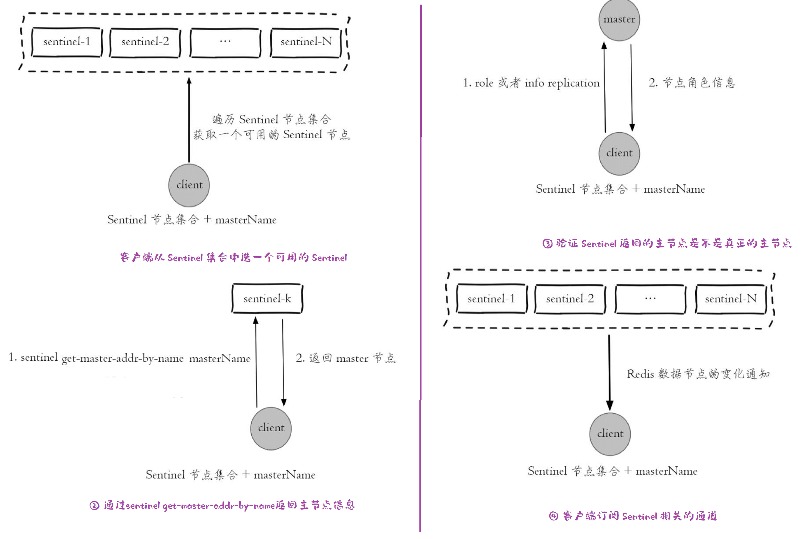

从上面的模型可以看出，Redis Sentinel 客户端只有在初始化和切换主节点时需要和 Sentinel 节点集合进行交互获取主节点信息，所以在设计客户端时需要将 Sentinel 节点考虑成配置发现服务；

### Jedis 的 JedisSentinelPool 原理

JedisSentinelPool 是 Jedis 连接 Redis Sentinel 的一个实现。

本次分析的源码是 jedis-4.3.0

**（1）首先看 JedisSentinelPool 的构造方法**

其中 masterName 表示 Sentinel 监视的主节点的名称，sentinels 是 Sentinel 实例的集合。

- 首先会调用 initSentinels 方法获取主节点的 IP 和端口；
- 拿到主节点的 IP 和端口后调用 initMaster 方法赋值给一些字段；

当然 initSentinels 方法不仅仅是获取主节点的 IP 和端口那么简单，还做了其他操作，接着看。

```java
/**
 *
 * @param masterName 主节点名称
 * @param sentinels Sentinel 节点的集合
 * @param poolConfig 连接池配置
 * @param factory 主节点的配置
 * @param sentinelClientConfig Sentinel 客户端配置
 */
public JedisSentinelPool(String masterName, Set<HostAndPort> sentinels,
                         final GenericObjectPoolConfig<Jedis> poolConfig, final JedisFactory factory,
                         final JedisClientConfig sentinelClientConfig) {
    super(poolConfig, factory);

    this.factory = factory;
    this.sentinelClientConfig = sentinelClientConfig;

    // 遍历 Sentinel 节点集合，获取当前主节点的 IP 和端口
    // 开启多个线程监听每个 Sentinel 的 Pub/Sub 的 +switch-master 事件
    // 当出现故障转移时，会更新最新的主节点的 IP 和端口
    HostAndPort master = initSentinels(sentinels, masterName);
    // 初始化主节点的 IP 和端口
    initMaster(master);
}
```

**（2）initSentinels 方法 — 遍历 Sentinel 集合获取主节点 IP 和端口**

这部分代码很简单，就是遍历 Sentinel 集合，调用 GET-MASTER-ADDR-BY-NAME 命令获取主节点的 IP 和端口，只要获取到了就退出循环。

```java
/**
   * 初始化 Sentinel
   *
   * @param sentinels Sentinel 集合
   * @param masterName 主节点名称
   * @return 返回主节点的 IP 和端口
   */
private HostAndPort initSentinels(Set<HostAndPort> sentinels, final String masterName) {

    // 主节点的 IP 和端口
    HostAndPort master = null;
    boolean sentinelAvailable = false;

    LOG.info("Trying to find master from available Sentinels...");

    // 遍历所有的 Sentinel 实例
    for (HostAndPort sentinel : sentinels) {

        LOG.debug("Connecting to Sentinel {}", sentinel);

        // 获取一个连接
        try (Jedis jedis = new Jedis(sentinel, sentinelClientConfig)) {

            // 通过 GET-MASTER-ADDR-BY-NAME 命令获取给定主节点的名称的 IP 地址和端口号
            List<String> masterAddr = jedis.sentinelGetMasterAddrByName(masterName);

            // connected to sentinel...
            sentinelAvailable = true;

            if (masterAddr == null || masterAddr.size() != 2) {
                // GET-MASTER-ADDR-BY-NAME 命令正常返回的是 2 个元素，假如不是就说明不正常，重试
                LOG.warn("Can not get master addr, master name: {}. Sentinel: {}", masterName, sentinel);
                continue;
            }

            // 解析端口号和 IP，解析成功就退出循环
            master = toHostAndPort(masterAddr);
            LOG.debug("Found Redis master at {}", master);
            break;
        } catch (JedisException e) {
            // resolves #1036, it should handle JedisException there's another chance
            // of raising JedisDataException
            LOG.warn(
                "Cannot get master address from sentinel running @ {}. Reason: {}. Trying next one.", sentinel, e);
        }
    }

    // 如果从上面的 Sentinel 集合中还是没有获取到主节点的 IP 和端口
    if (master == null) {
        if (sentinelAvailable) {
            // can connect to sentinel, but master name seems to not monitored
            throw new JedisException("Can connect to sentinel, but " + masterName
                                     + " seems to be not monitored...");
        } else {
            throw new JedisConnectionException("All sentinels down, cannot determine where is "
                                               + masterName + " master is running...");
        }
    }
    
    // ......
    // 省略了监听代码，下面再分析
}
```

**（3）initSentinels 方法 — 开启监听线程监听主节点地址变化**

这里就是针对每一个 Sentinel 实例都开启了一个 MasterListener 线程去监听主节点的变化。

```java
private HostAndPort initSentinels(Set<HostAndPort> sentinels, final String masterName) {

    // 主节点的 IP 和端口
    HostAndPort master = null;
    boolean sentinelAvailable = false;

    LOG.info("Trying to find master from available Sentinels...");

    // ......
    // 省略了获取主节点 IP 和端口的代码
    // 前面已经分析了
    // ......

    LOG.info("Redis master running at {}, starting Sentinel listeners...", master);

    // 再次遍历 Sentinel 集合，创建监听线程并启动
    for (HostAndPort sentinel : sentinels) {

        // MasterListener 继承了 Thread
        MasterListener masterListener = new MasterListener(masterName, sentinel.getHost(), sentinel.getPort());
        // whether MasterListener threads are alive or not, process can be stopped
        masterListener.setDaemon(true);
        masterListeners.add(masterListener);
        masterListener.start();
    }

    return master;
}
```

**（4）MasterListener#run 方法**

因为 MasterListener 是 Thread 子类，主要观察它的 run 方法即可。该方法主要是使用 Pub/Sub 订阅了 `+switch-master` 通道，当主节点的地址发生变化时，会给订阅了这个通道的客户端发送一个消息。如下：

```
demomaster 127.0.0.1 6379 127.0.0.1 6380
```

- 位置 1：主节点的名称；
- 位置 2 和 3：旧的主节点的 IP 和端口；
- 位置 4 和 5：新的主节点的 IP 和端口；

接下来看 MasterListener#run 方法的代码

```java
@Override
public void run() {

    running.set(true);

    while (running.get()) {

        try {
            // double check that it is not being shutdown
            if (!running.get()) {
                break;
            }

            // 获取连接到 Sentinel 实例的连接
            final HostAndPort hostPort = new HostAndPort(host, port);
            j = new Jedis(hostPort, sentinelClientConfig);

            // code for active refresh
            // 获取主节点的地址 GET-MASTER-ADDR-BY-NAME
            List<String> masterAddr = j.sentinelGetMasterAddrByName(masterName);
            if (masterAddr == null || masterAddr.size() != 2) {
                LOG.warn("Can not get master addr, master name: {}. Sentinel: {}.", masterName,
                         hostPort);
            } else {
                initMaster(toHostAndPort(masterAddr));
            }

            // 监听 +switch-master 通道
            // +switch-master demomaster 127.0.0.1 6379 127.0.0.1 6380
            j.subscribe(new JedisPubSub() {
                @Override
                public void onMessage(String channel, String message) {
                    LOG.debug("Sentinel {} published: {}.", hostPort, message);

                    String[] switchMasterMsg = message.split(" ");

                    if (switchMasterMsg.length > 3) {

                        // 校验主节点的名称
                        if (masterName.equals(switchMasterMsg[0])) {
                            // 初始化新的主节点的地址
                            initMaster(toHostAndPort(Arrays.asList(switchMasterMsg[3], switchMasterMsg[4])));
                        } else {
                            LOG.debug(
                                "Ignoring message on +switch-master for master name {}, our master name is {}",
                                switchMasterMsg[0], masterName);
                        }

                    } else {
                        LOG.error("Invalid message received on Sentinel {} on channel +switch-master: {}",
                                  hostPort, message);
                    }
                }
            }, "+switch-master");

        } catch (JedisException e) {
            // 省略......
        }
    }
}
```

可以看到，没到监听到主节点的地址发生变化后，就会调用 initMaster 方法去更新一些字段。

## Sentinel 实现原理

### 定时任务


Sentinel 在内部有3个定时任务完成对各个节点发现和监控：

1. **每 10 秒每个 Sentinel 节点会向主节点和从节点发送 info 命令**，这个任务达到两个目的：
   1. **发现从节点**；（这也是 Sentinel 节点不需要显示配置监控从节点的原因）
   2. **当有新的从节点加入时各个 Sentinel 可以感知**；
   3. **当节点不可达或者故障转移后，可以通过 info 命令实时更新节点信息**；
2. 此功能是通过将 HELLO 消息发送到名为` __sentinel__:hello` 的通道来实现的。**每 2 秒**每个 Sentinel 节点会向 **Redis 数据节点**（主从）的` __sentinel__:hello` 通道上（pub/sub）**发送当前 Sentinel 对主节点的判断以及当前 Sentinel 节点的信息。同时每个 Sentinel 节点也会订阅这个通道，进行信息交换**（对节点的"看法"和自身的信息）。所以这个定时任务的作用是：
   1. **发现新的 Sentinel 节点**，通过订阅数据节点的` __sentinel__:hello`通道了解其它的 Sentinel 节点信息，如果是新加入的 Sentinel 节点，将这个 Sentinel 节点保存起来，并与这个 Sentinel 节点建立连接；
   2. S**entinel 节点之间交换主节点的状态**，作为后面客观下线以及领导者选举的依据；
   3. **Hello 消息还包括主节点当前完整的配置**。如果接收 Sentinel 的给定主节点的配置比收到的要旧，它会立即更新为新配置；
3. 每 1 秒每个 Sentinel 节点会向主节点、从节点、其它 Sentinel 节点发送一条 PING 命令来做一次心跳检测，来确认这些节点是否可达。这是 Sentinel 判断某个节点主观下线的条件。

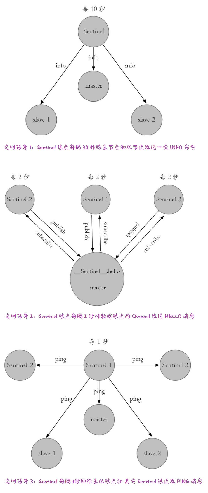

### 主观下线（SDOWN）

主观下线（Subjectively Down， 简称 SDOWN）指的是单个Sentinel实例对服务器做出的下线判断，即**单个sentinel认为某个服务下线（有可能是接收不到订阅，之间的网络不通等等原因）**。

**Sentinel 会以每秒一次的频率向所有与其建立了连接的实例（主从节点和其他sentinel）发送 PING 命令，如果服务器在 down-after-milliseconds 给定的毫秒数之内， 没有返回 Sentinel 发送的 PING 命令的回复， 或者返回一个错误， 那么 Sentinel 将这个服务器标记为主观下线（SDOWN ）**。

Sentinel 配置文件中的 down-after-milliseconds 设置了判断主观下线的时间限制，如果实例在 down-after-milliseconds 毫秒内，返回的响应都是无效回复，那么 Sentinel 会认为该实例已（主观）下线，修改其 flags 状态为 SRI_S_DOWN。如果多个 Sentinel 监视一个服务，有可能存在多个 Sentinel 的 down-after-milliseconds 配置不同，这个在实际生产中要注意。

**对于 PING  的可能的回复有：**

- PING replied with +PONG.
- PING replied with -LOADING error.
- PING replied with -MASTERDOWN error.

任何其他回复（或根本不回复）均被视为无效。请注意，如果一个逻辑主节点在 INFO 输出中标识自己为副本，那么它被认为是处于离线状态。

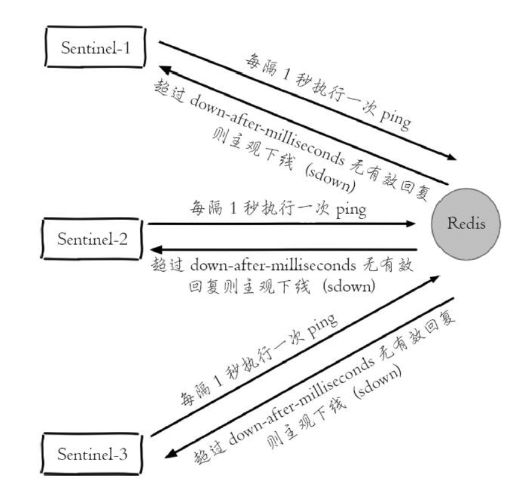

### 客观下线（ODOWN）

客观下线（Objectively Down， 简称 ODOWN）指的是**多个 Sentinel 实例在对主节点做出 SDOWN 判断， 并且通过 SENTINEL IS-MASTER-DOWN-BY-ADDR 向其他 Sentinel 节点询问其对主节点的判断， 当超过配置的 quorum 个数的 Sentinel 认为主节点不可达后，就认主节点是客观下线了。**

请注意，**SDOWN 状态只表示一个 Sentinel 认为 Redis 实例不可用，并不足以触发故障转移。只有到达 ODOWN 状态才能真正开始故障转移。**SDOWN 要求在配置的时间间隔内没有收到可接受的回复，因此例如，如果时间间隔为30000 毫秒(30秒)，而我们每 29 秒收到一个可接受的 PING 响应，那么该实例被认为是工作正常的。

**SENTINEL IS-MASTER-DOWN-BY-ADDR** 命令

```
SENTINEL IS-MASTER-DOWN-BY-ADDR  <ip> <port> <current_epoch> <runid>
```

1. ip：主节点 ip；
2. port：主节点端口；
3. current_epoch：当前配置纪元；
4. runid：两种
   1. 等于星号 *：表示 Sentinel 节点直接交换对主节点的下线的判定。
   2. 等于当前 Sentinel 节点的 runid 时，表示当前 Sentinel 节点希望目标节点同意自己称为故障转移的领导者；

例如某个 Sentinel 对主节点做主观下线后，会向其它 Sentinel 节点发送下面的命令

```
SENTINEL IS-MASTER-DOWN-BY-ADDR 127.0.0.1 6379 0 *
```

一个 Sentinel 接收另一个 Sentinel 发来的 IS-MASTER-DOWN-BY-ADDR 后，根据 ip 和端口，检测对应的节点在该Sentinel 是否可达，并且回复 IS-MASTER-DOWN-BY-ADDR，返回值有三个参数：

1. down_state：目标 Sentinel 节点对于主节点的下线判断，1 是下线，0 是在线；
2. leader_runid：当 lead_runid 等于星号 * 时，表示返回结果是用来做主节点是否可达的。当 leader_runid 等于具体的 runid 时，表示目标节点同意 runid 称为故障转移的领导者；
3. leader_epoch：领导者纪元；

Sentinel 接收到回复后，根据配置设置的下线最小数量，达到这个值，既认为该服务客观下线。

需要注意的是：**ODOWN 状态仅适用于主节点**。对于其他类型的实例，Sentinel 不需要采取措施，**因此从节点和其他 Sentinel 永远不会达到 ODOWN 状态，只会处于 SDOWN 状态。**但是，请注意，SDOWN 状态还具有语义上的影响。例如，**处于 SDOWN 状态的副从节点会被 Sentinel 选中进行故障转移。**

### 选举执行故障转移的 Sentinel

当整个 Sentinel 系统认为主节点客观下线后，需要选举一个 Sentinel 节点做故障转移操作。

Redis 使用了 Raft 算法实现领导者选举。官网：https://raft.github.io/。简单说下如何选举出一个 Sentinel。

- 每个在线的 Sentinel 节点都有资格称为领导者，**当某个 Sentinel 确认主节点主观下线的时候，会向其它 Sentinel 节点发送 SENTINEL IS-MASTER-DOWN-BY-ADDR 命令，请求将自己设置为领导者**；
- 收到命令的 Sentinel 节点，如果**没有同意其它的 Sentinel 节点的 SENTINEL IS-MASTER-DOWN-BY-ADDR 命令，就会同意这个请求**，否则拒绝；
- 如果该 Sentinel 节点发现自己的票数已经大于等于 `max(quorum, num(sentinels) / 2  + 1)`，那么它将成为领导者；
- 如果此次没有选出领导者，将进入下一次选举；

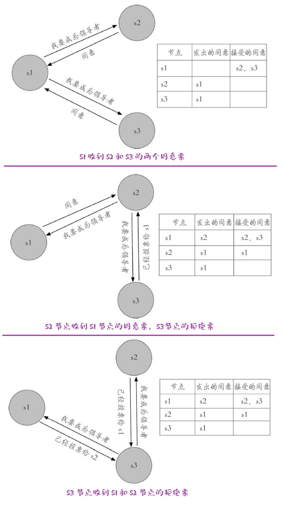

### 新的主节点的挑选规则

当 Sentinel 需要在多个从节点中选择一个作为新的主节点时，首先会根据下面的规则从候选的从节点中剔除不符合条件的从节点：

- 否决所有已经下线以及长时间没有心跳恢复的疑似已下线的从节点；
- 否决所有长时间没有和主节点通信，数据状态过时的从节点；
- 否决所有优先级为 0 的从服务器；

然后根据下面的规则，在剩余的候选的从节点选出新的节点

- 选择优先级最高的从节点；
- 如果优先级最高的从节点有两个或者两个以上，那么选择复制偏移量最大的从节点；
- 如果符合上面两个条件的从节点还是有两个或者两个以上，那么选出它们中运行 ID 最小的那个；

### 配置版本号（Configuration epochs）

出于以下几个重要原因，哨兵需要获得多数人的授权才能开始故障转移：

这是因为被授权的 Sentinel 会获得一个唯一的配置版本号，在故障转移完成后用于版本控制。由于其他 Sentinel 无法使用此版本号，因此每个故障转移的配置都具有唯一的版本号。

此外，Sentinel 还有一个规则：如果一个 Sentinel 投票支持另一个 Sentinel 执行主节点的故障转移，则它将等待一段时间再尝试进行故障转移。这个等待时间是在 sentinel.conf 中配置的 2 倍 failover-timeout。这意味着不会出现多个 Sentinel 同时尝试对同一主服务器执行故障转移的情况。

只要大多数 Sentinel 仍然能够通信，最终必定会有一个 Sentinel 被授权执行故障转移。同时，Redis Sentinel还保证了安全属性，即每个 Sentinel 都会使用独特的配置版本号来执行相同主主节点的故障转移，确保数据的一致性和可靠性。

### 配置传播性（Configuration propagation）

当一个 Sentinel 成功地进行了主服务器的故障转移后，它会向其他 Sentinel 广播新的配置信息，以便其他 Sentinel 能够更新有关该主服务器的信息。

对于故障转移的成功与否，需要满足以下条件：Sentinel 必须能够向所选的从节点发送 REPLICAOF NO ONE 命令，并且在主节点的 INFO 输出中观察到切换到主节点。

即使从节点的重新配置还没有完成，故障转移也被视为是成功的。所有的 Sentinel 都必须开始报告新的配置信息。

每个 Sentinel 都会使用 Redis Pub/Sub 消息连续广播主节点的配置版本，包括主节点和所有从节点。同时，所有 Sentinel 都等待消息以查看其他 Sentinel 广播的配置。这些配置被广播在`__sentinel__:hello ` Pub/Sub 通道中。

由于每个配置具有不同的版本号，较高版本始终优先于较小版本。因此，在故障转移完成后，获得授权的 Sentinel 将使用不同的版本号来广播新的配置信息。

例如，假设原始配置是主节点 IP 地址为 192.168.1.50:6379，版本为 1。一段时间后，一个 Sentinel 被授权执行故障转移，使用版本 2。如果故障转移成功，它将开始向其他 Sentinel 广播新的配置信息，比如新的节点 IP 地址为192.168.1.50:9000，版本为 2。由于新配置具有更高的版本号，所有其他 Sentinel 都将更新其配置信息。

这就是为什么 Sentinel 需要保证每个故障转移使用不同版本号的原因。只要能够通信，所有 Sentinel 都会汇聚到具有较高版本号的相同配置。如果出现了网络分区，每个区域都将汇聚到具有最高本地配置的位置。在没有分区的情况下，所有 Sentinel 都将达成一致意见，使用相同的配置信息。

### 分区下的一致性

Redis Sentinel 配置最终是一致的，因此每个分区都会收敛到可用的更高配置。

- Redis instances.
- Sentinel instances.
- Clients.

为了定义系统的行为，我们必须考虑所有这三个方面。

以下是一个简单的网络，其中有 3 个节点，每个节点运行一个 Redis 实例和一个 Sentinel 实例：

```
            +-------------+
            | Sentinel 1  |----- Client A
            | Redis 1 (M) |
            +-------------+
                    |
                    |
+-------------+     |          +------------+
| Sentinel 2  |-----+-- // ----| Sentinel 3 |----- Client B
| Redis 2 (S) |                | Redis 3 (M)|
+-------------+                +------------+
```

在这个系统中，原始状态是 Redis 3 是主节点，而 Redis 1 和 2 是从节点。某个时刻发生了网络分区，隔离了旧的主节点。 Sentinel 1 和 2 开始故障转移，将 Sentinel 1 提升为新的主节点。

Sentinel 属性保证 Sentinel 1 和 2 现在具有主节点的新配置。但是 Sentinel 3 仍然具有旧配置，因为它位于不同的分区中。

我们知道 Sentinel 3 将在网络分区修复时更新其配置，但是如果有客户端与旧主节点在一个分区，在分区期间会发生什么？

客户端仍然可以向旧的主节点 Redis 3 写入数据。当网络分区恢复时，Redis 3 将变成 Redis 1 的从节点，分区期间写入的所有数据都将丢失。

- 如果 Redis 仅仅作为缓存来使用，那么客户端 B 写入旧的主节点，即使数据丢失可能不是什么大问题；
- 如果 Redis 用作持久存储数据，出现数据丢失问题就大了，需要配置系统以部分防止此问题；

由于 Redis 是异步复制的，因此在这种情况下无法完全防止数据丢失，但是可以使用以下 Redis 配置选项限制 Redis 3 和 Redis 1 之间的差异：

```
min-replicas-to-write 1
min-replicas-max-lag 10
```

执行此配置，上例中的 Redis 3 将在 10 秒后变得不可用。当网络分区恢复后，Sentinel 3 配置将汇聚到新配置，客户端 B 将能够获取有效配置并继续。

Redis + Sentinel 是一个最终一致性系统，旧主节点的数据会被丢弃，旧主节点复制当前主节点的数据。这意味着在故障转移期间写入的数据可能会丢失。

需要注意的是，丢失的数据并不是 Sentinel 本身的限制。如果使用强一致的复制状态机编排故障转移，则仍将具有相同的属性。但是为了避免确认写入的丢失，只有两种方法可用：

- 使用同步复制（和适当的共识算法来运行复制状态机）。
- 使用最终一致的系统，可以合并同一对象的不同版本。

Redis 目前无法使用以上任何一个系统，目前并不是开发目标。

### Sentinel 配置持久化

Sentinel 状态被保存在 Sentinel 配置文件中。

每当一个主节点接收到或创建一个新的配置（由 leader Sentinel 负责），该配置都会与配置纪元（configuration epoch）一起持久化到磁盘上。这意味着在停止和重新启动 Sentinel 进程时，不必担心数据丢失。

还是看前面部署的案例，所有 Sentinel 都起来之后，它们的配置文件会改变

原始的是：

```
port 26379
daemonize yes
logfile "./sentinel-26379.log"
dir "../data/redis-sentinel-demo"
sentinel monitor demomaster 127.0.0.1 6379 2
sentinel down-after-milliseconds demomaster 30000
sentinel parallel-syncs demomaster 1
sentinel failover-timeout demomaster 180000

# 设置连接 redis 数据节点的密码
sentinel auth-pass demomaster master123
```

所有 Sentinel 都起来之后，配置文件变成下面这样

```
port 26379
daemonize yes
logfile "./sentinel-26379.log"
dir "../data/redis-sentinel-demo"
sentinel monitor demomaster 127.0.0.1 6379 2

# 设置连接 redis 数据节点的密码
sentinel auth-pass demomaster master123
# Generated by CONFIG REWRITE
protected-mode no
pidfile "/var/run/redis.pid"
user default on nopass ~* &* +@all
sentinel myid 12a27d10e3f1bdf445ae30dd1f4aba1af78234f6
sentinel config-epoch demomaster 0
sentinel leader-epoch demomaster 0
sentinel current-epoch 0
sentinel known-replica demomaster 127.0.0.1 6380
sentinel known-replica demomaster 127.0.0.1 6381
sentinel known-sentinel demomaster 127.0.0.1 26381 2b044ab85b5b93b8553baf65f8a40970ff4fbb9e
sentinel known-sentinel demomaster 127.0.0.1 26380 70668315c96c8bfb74520e4982f8378dcd564dfe
```

可以看到多了一个 # Generated by CONFIG REWRITE 的注释下面的东西

## 运维

### 模拟故障转移

还是以前面的部署案例为基础来模拟故障转移。一主两从，三个 Sentinel 节点组成的集合。

> https://redis.io/docs/management/sentinel/#testing-the-failover

模拟故障有下面的方式：

- 强制杀掉对应节点的进程；
- 使用 DEBUG sleep 命令，让节点进入睡眠状态；
- 使用 SHUTDOWN 命令，模拟正常停掉 Redis；

本次使用杀掉主节点 6379 的进程，过了一会儿 6380 变成新的主节点、6381 变成 6380 的从节点。

```
127.0.0.1:6380> role
1) "master"
2) (integer) 74870
3) 1) 1) "127.0.0.1"
      2) "6381"
      3) "74870"
```


**（1）6380 的日志**

2023-04-05 13:57:14 kill 掉了 6379 的进程，此时 6380 的日志如下，发现无法连接 master 6379，并在尝试重连。

```
4317:S 05 Apr 2023 13:57:14.593 # Connection with master lost.
4317:S 05 Apr 2023 13:57:14.594 * Caching the disconnected master state.
4317:S 05 Apr 2023 13:57:14.594 * Reconnecting to MASTER 127.0.0.1:6379
4317:S 05 Apr 2023 13:57:14.595 * MASTER <-> REPLICA sync started
4317:S 05 Apr 2023 13:57:14.595 # Error condition on socket for SYNC: Connection refused
4317:S 05 Apr 2023 13:57:14.984 * Connecting to MASTER 127.0.0.1:6379
4317:S 05 Apr 2023 13:57:14.985 * MASTER <-> REPLICA sync started
4317:S 05 Apr 2023 13:57:14.986 # Error condition on socket for SYNC: Connection refused
4317:S 05 Apr 2023 13:57:16.001 * Connecting to MASTER 127.0.0.1:6379
4317:S 05 Apr 2023 13:57:16.003 * MASTER <-> REPLICA sync started
4317:S 05 Apr 2023 13:57:16.004 # Error condition on socket for SYNC: Connection refused
```

2023-04-05 13:57:44 收到了来自 Sentinel 节点的命令

- 清理原来缓存的主节点的状态；
- 设置辅助的复制 id；
- Sentinel 将 6380 设置为主节点；
- 重写本地配置（sentinel 和 redis 数据节点的配置都会重写）；

```
4317:M 05 Apr 2023 13:57:44.943 * Discarding previously cached master state.
4317:M 05 Apr 2023 13:57:44.943 # Setting secondary replication ID to 3cf3ed60210bf62584c2e1ba68962ed3bb6ca4ad, valid up to offset: 45762. New replication ID is e1294507d971988f7d2d458fac63d85233767635
4317:M 05 Apr 2023 13:57:44.944 * MASTER MODE enabled (user request from 'id=7 addr=127.0.0.1:57902 laddr=127.0.0.1:6380 fd=11 name=sentinel-34aebf20-cmd age=259 idle=0 flags=x db=0 sub=0 psub=0 multi=4 qbuf=188 qbuf-free=65342 argv-mem=4 obl=45 oll=0 omem=0 tot-mem=82980 events=r cmd=exec user=default redir=-1')
4317:M 05 Apr 2023 13:57:44.947 # CONFIG REWRITE executed with success.

```

2023-04-05 13:57:45 时候，6381 节点发来了复制的请求。

```
4317:M 05 Apr 2023 13:57:45.495 * Replica 127.0.0.1:6381 asks for synchronization
4317:M 05 Apr 2023 13:57:45.496 * Partial resynchronization request from 127.0.0.1:6381 accepted. Sending 158 bytes of backlog starting from offset 45762.
```


**（2）6381 日志**

同样在 2023-04-05 13:57:14 发现和 6379 节点的连接断开了

```
4320:S 05 Apr 2023 13:57:14.593 # Connection with master lost.
4320:S 05 Apr 2023 13:57:14.594 * Caching the disconnected master state.
4320:S 05 Apr 2023 13:57:14.594 * Reconnecting to MASTER 127.0.0.1:6379
4320:S 05 Apr 2023 13:57:14.595 * MASTER <-> REPLICA sync started
4320:S 05 Apr 2023 13:57:14.595 # Error condition on socket for SYNC: Connection refused
```

2023-04-05 13:57:14 时接到 Sentinel 的命令，将自己变成了 6380 节点的从节点，然后重写配置

```
4320:S 05 Apr 2023 13:57:45.491 * Connecting to MASTER 127.0.0.1:6380
4320:S 05 Apr 2023 13:57:45.492 * MASTER <-> REPLICA sync started
4320:S 05 Apr 2023 13:57:45.492 * REPLICAOF 127.0.0.1:6380 enabled (user request from 'id=7 addr=127.0.0.1:57900 laddr=127.0.0.1:6381 fd=11 name=sentinel-34aebf20-cmd age=260 idle=0 flags=x db=0 sub=0 psub=0 multi=4 qbuf=331 qbuf-free=65199 argv-mem=4 obl=45 oll=0 omem=0 tot-mem=82980 events=r cmd=exec user=default redir=-1')
4320:S 05 Apr 2023 13:57:45.494 # CONFIG REWRITE executed with success.
4320:S 05 Apr 2023 13:57:45.494 * Non blocking connect for SYNC fired the event.
4320:S 05 Apr 2023 13:57:45.495 * Master replied to PING, replication can continue...
```

2023-04-05 13:57:45 和新的主节点建立连接后，尝试发起一个部分同步的操作

```
4320:S 05 Apr 2023 13:57:45.495 * Trying a partial resynchronization (request 3cf3ed60210bf62584c2e1ba68962ed3bb6ca4ad:45762).
4320:S 05 Apr 2023 13:57:45.496 * Successful partial resynchronization with master.
4320:S 05 Apr 2023 13:57:45.496 # Master replication ID changed to e1294507d971988f7d2d458fac63d85233767635
4320:S 05 Apr 2023 13:57:45.496 * MASTER <-> REPLICA sync: Master accepted a Partial Resynchronization.
```


**（3）Sentinel 26379 日志**

2023-04-05 13:57:44 对 6379 做了主观下线（+sdown），这个时间正好是杀掉 6379 进程后的 30 秒，也就是 down-after-milliseconds 的配置是一样的。Sentinel 节点更新自己的配置纪元（new-epoch）

```
4449:X 05 Apr 2023 13:57:44.693 # +sdown master demomaster 127.0.0.1 6379
4449:X 05 Apr 2023 13:57:44.777 # +new-epoch 1
```

给 Sentinel 23681 节点投票， 23681 的 runid 是 34aebf207b22c742b6fdab45667158681077e36a。

```
4449:X 05 Apr 2023 13:57:44.779 # +vote-for-leader 34aebf207b22c742b6fdab45667158681077e36a 1
4449:X 05 Apr 2023 13:57:44.784 # +odown master demomaster 127.0.0.1 6379 #quorum 2/2
```

Sentinel 26381 节点让 6380 为主节点，并发现了两个从节点 6381 和 6379，并在 30 秒后对 6379 做了主观下线。

```
4449:X 05 Apr 2023 13:57:44.785 # Next failover delay: I will not start a failover before Wed Apr  5 14:03:45 2023
4449:X 05 Apr 2023 13:57:45.491 # +config-update-from sentinel 34aebf207b22c742b6fdab45667158681077e36a 127.0.0.1 26381 @ demomaster 127.0.0.1 6379
4449:X 05 Apr 2023 13:57:45.492 # +switch-master demomaster 127.0.0.1 6379 127.0.0.1 6380
```

**（4）Sentinel 26380 日志**

和 Sentinel 26379 日志一样。

**（5）Sentinel 26381 日志**

Sentinel 26381 是领导者，达到了客观下线的条件

```
4453:X 05 Apr 2023 13:57:44.704 # +sdown master demomaster 127.0.0.1 6379
4453:X 05 Apr 2023 13:57:44.771 # +odown master demomaster 127.0.0.1 6379 #quorum 3/2
4453:X 05 Apr 2023 13:57:44.772 # +new-epoch 1
```

Sentinel 26381 被选为领导者，

```
4453:X 05 Apr 2023 13:57:44.772 # +try-failover master demomaster 127.0.0.1 6379
4453:X 05 Apr 2023 13:57:44.775 # +vote-for-leader 34aebf207b22c742b6fdab45667158681077e36a 1
4453:X 05 Apr 2023 13:57:44.779 # bfa7c7f8595957cc13ab5ee46522f5a4fd9d6627 voted for 34aebf207b22c742b6fdab45667158681077e36a 1
4453:X 05 Apr 2023 13:57:44.779 # 3dbe53a318a49cc2b2faea534737f41fea2f75d4 voted for 34aebf207b22c742b6fdab45667158681077e36a 1
4453:X 05 Apr 2023 13:57:44.834 # +elected-leader master demomaster 127.0.0.1 6379
```

开始故障转移

1. 寻找合适的从节点作为新的主节点；
2. 选出了合适的从节点（6380）；
3. 命令 6380 节点执行 slaveof no one 命令，让它称为主节点；
4. 等待 6380 晋升为主节点；
5. 确认 6380 节点已经晋升为主节点；
6. 故障转移进入重新配置从节点阶段；
7. 命令 6381 节点复制新的主节点；
8. 6381 节点正在重新配置称为 6380 节点的从节点，但是同步过程尚未完成；
9. 故障转移顺利完成；
10. 故障转移成功后，发布主节点的切换消息；

```
4453:X 05 Apr 2023 13:57:44.834 # +failover-state-select-slave master demomaster 127.0.0.1 6379
4453:X 05 Apr 2023 13:57:44.888 # +selected-slave slave 127.0.0.1:6380 127.0.0.1 6380 @ demomaster 127.0.0.1 6379
4453:X 05 Apr 2023 13:57:44.888 * +failover-state-send-slaveof-noone slave 127.0.0.1:6380 127.0.0.1 6380 @ demomaster 127.0.0.1 6379
4453:X 05 Apr 2023 13:57:44.942 * +failover-state-wait-promotion slave 127.0.0.1:6380 127.0.0.1 6380 @ demomaster 127.0.0.1 6379
4453:X 05 Apr 2023 13:57:45.438 # +promoted-slave slave 127.0.0.1:6380 127.0.0.1 6380 @ demomaster 127.0.0.1 6379
4453:X 05 Apr 2023 13:57:45.438 # +failover-state-reconf-slaves master demomaster 127.0.0.1 6379
4453:X 05 Apr 2023 13:57:45.491 * +slave-reconf-sent slave 127.0.0.1:6381 127.0.0.1 6381 @ demomaster 127.0.0.1 6379
4453:X 05 Apr 2023 13:57:45.870 # -odown master demomaster 127.0.0.1 6379
4453:X 05 Apr 2023 13:57:46.450 * +slave-reconf-inprog slave 127.0.0.1:6381 127.0.0.1 6381 @ demomaster 127.0.0.1 6379
4453:X 05 Apr 2023 13:57:46.450 * +slave-reconf-done slave 127.0.0.1:6381 127.0.0.1 6381 @ demomaster 127.0.0.1 6379
4453:X 05 Apr 2023 13:57:46.550 # +failover-end master demomaster 127.0.0.1 6379
4453:X 05 Apr 2023 13:57:46.551 # +switch-master demomaster 127.0.0.1 6379 127.0.0.1 6380
```


重新启动原来的 6379 节点

**（1）6379 的日志，向新的主节点 6380 发起复制请求**

```
8297:C 05 Apr 2023 14:42:21.524 # oO0OoO0OoO0Oo Redis is starting oO0OoO0OoO0Oo
8297:C 05 Apr 2023 14:42:21.524 # Redis version=6.2.11, bits=64, commit=720ea82e, modified=0, pid=8297, just started
8297:C 05 Apr 2023 14:42:21.525 # Configuration loaded
8297:S 05 Apr 2023 14:42:21.527 * Increased maximum number of open files to 10032 (it was originally set to 256).
8297:S 05 Apr 2023 14:42:21.527 * monotonic clock: POSIX clock_gettime
8297:S 05 Apr 2023 14:42:21.530 * Running mode=standalone, port=6379.
8297:S 05 Apr 2023 14:42:21.530 # Server initialized
8297:S 05 Apr 2023 14:42:21.531 * Loading RDB produced by version 6.2.11
8297:S 05 Apr 2023 14:42:21.531 * RDB age 2985 seconds
8297:S 05 Apr 2023 14:42:21.531 * RDB memory usage when created 2.06 Mb
8297:S 05 Apr 2023 14:42:21.531 # Done loading RDB, keys loaded: 0, keys expired: 0.
8297:S 05 Apr 2023 14:42:21.531 * DB loaded from disk: 0.001 seconds
8297:S 05 Apr 2023 14:42:21.531 * Before turning into a replica, using my own master parameters to synthesize a cached master: I may be able to synchronize with the new master with just a partial transfer.
8297:S 05 Apr 2023 14:42:21.531 * Ready to accept connections
8297:S 05 Apr 2023 14:42:21.532 * Connecting to MASTER 127.0.0.1:6380
8297:S 05 Apr 2023 14:42:21.532 * MASTER <-> REPLICA sync started
8297:S 05 Apr 2023 14:42:21.532 * Non blocking connect for SYNC fired the event.
8297:S 05 Apr 2023 14:42:21.532 * Master replied to PING, replication can continue...
8297:S 05 Apr 2023 14:42:21.533 * Trying a partial resynchronization (request 3cf3ed60210bf62584c2e1ba68962ed3bb6ca4ad:1).
8297:S 05 Apr 2023 14:42:21.533 * Successful partial resynchronization with master.
8297:S 05 Apr 2023 14:42:21.533 # Master replication ID changed to e1294507d971988f7d2d458fac63d85233767635
8297:S 05 Apr 2023 14:42:21.533 * MASTER <-> REPLICA sync: Master accepted a Partial Resynchronization.
```

**（2）6380 的日志**

接收复制请求

```
4317:M 05 Apr 2023 14:42:21.533 * Replica 127.0.0.1:6379 asks for synchronization
4317:M 05 Apr 2023 14:42:21.534 * Partial resynchronization request from 127.0.0.1:6379 accepted. Sending 582055 bytes of backlog starting from offset 1.
```

**（3）Sentinel 26379 的日志**

撤销对 6379 节点的主观下线决定

```
49:X 05 Apr 2023 14:42:22.445 * +reboot slave 127.0.0.1:6379 127.0.0.1 6379 @ demomaster 127.0.0.1 6380
4449:X 05 Apr 2023 14:42:22.536 # -sdown slave 127.0.0.1:6379 127.0.0.1 6379 @ demomaster 127.0.0.1 638
```

**（4）Sentinel 26380 的日志**

撤销对 6379 节点的主观下线决定

```
4453:X 05 Apr 2023 14:42:21.611 * +reboot slave 127.0.0.1:6379 127.0.0.1 6379 @ demomaster 127.0.0.1 6380
4453:X 05 Apr 2023 14:42:21.670 # -sdown slave 127.0.0.1:6379 127.0.0.1 6379 @ demomaster 127.0.0.1 6380
```

**（5）Sentinel 26381 的日志**

撤销对 6379 节点的主观下线决定，更新 Sentinel 节点的配置

```
4451:X 05 Apr 2023 14:42:21.611 # -sdown slave 127.0.0.1:6379 127.0.0.1 6379 @ demomaster 127.0.0.1 6380
4451:X 05 Apr 2023 114:42:21.612 * +convert-to-slave slave 127.0.0.1:6379 127.0.0.1 6379 @ demomaster 127.0.0.1 6380
```

### 高可用读写分离

从节点一般有两个作用

- 当主节点出现故障时，作为主节点的备份节点来实现故障转移，Redis Sentinel 已经实现了对该功能的自动化，实现了真正的高可用；
- 扩展主节点的读能力，尤其是在读多写少的场景非常适用；

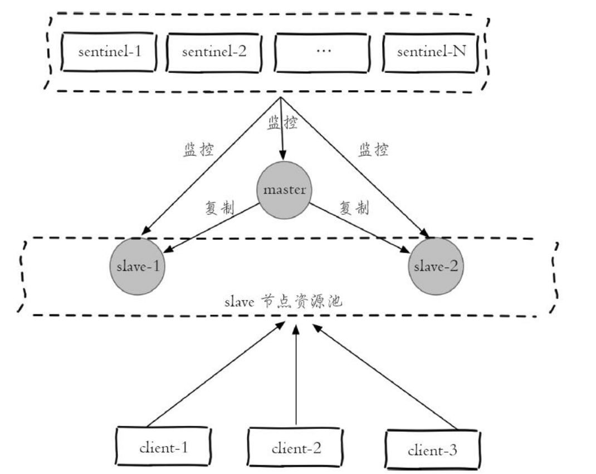

但是上面的架构存在问题，从节点不是高可用的，如果 Slave-1 节点出现故障，客户端 Clint-1 将会与其失联，其次 Sentinel 节点只会对该节点做主观下线，因为 Redis 的故障转移是针对主节点的。

前面说过 Sentinel 对各个节点的监控，如果有对应的事件发生，都会发出对应的事件消息，其中和从节点变动的事件有下面几个：

- `+switch-master`：将原来的从节点晋升为主节点，说明减少了某个从节点；
- `+convert-to-slave`：将原来的主节点降级为从节点，说明添加了某个从节点；
- `+slown`：主观下线，说明可能某个从节点可能不可用（因为对从节点不会做客观下线），所以实现客户端时可以采用自身策略来实现类似主观下线的功能；
- `+reboot`：重启了某个节点，如果它的角色是 Slave，那么说明添加了某个从节点；

所以在设计 Redis Sentinel 的从节点的高可用时，只要能够实时掌握所有从节点的状态，把所有的从节点都看做成一个资源池，无论是上线还是下线从节点，客户端都能及时感应到（将其从资源池中添加或者删除），这样从节点的高可用的目标就达到了。

