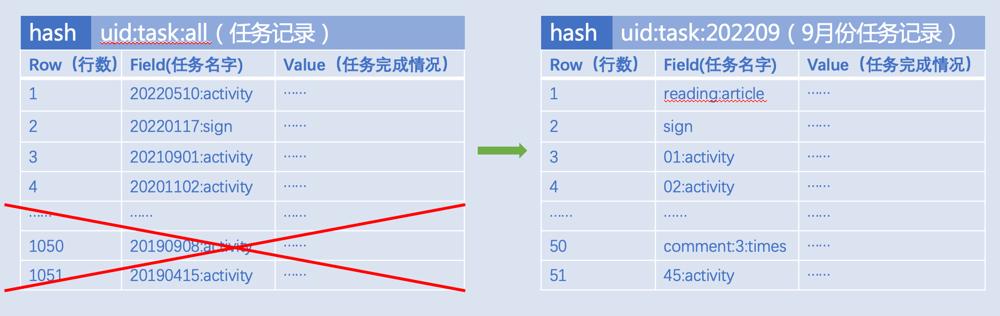
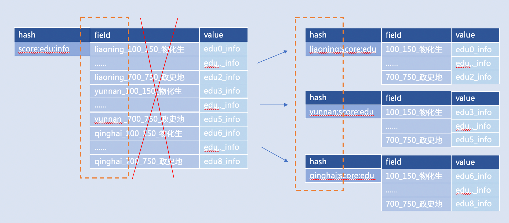
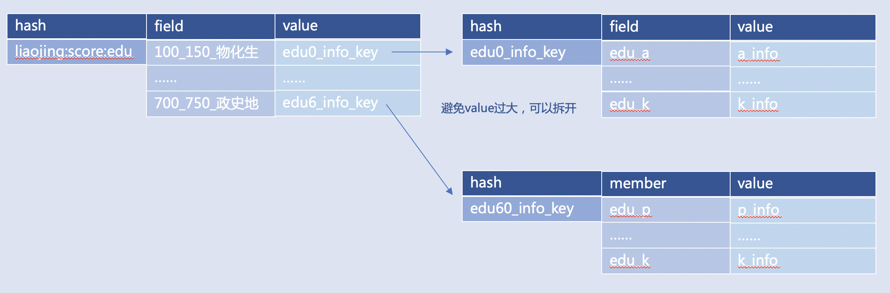
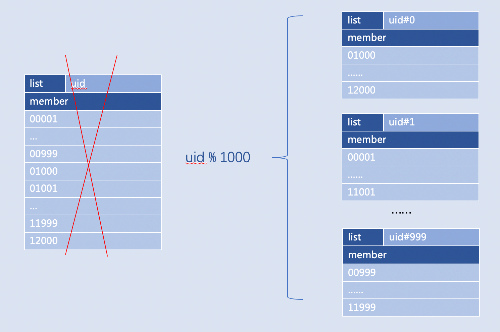
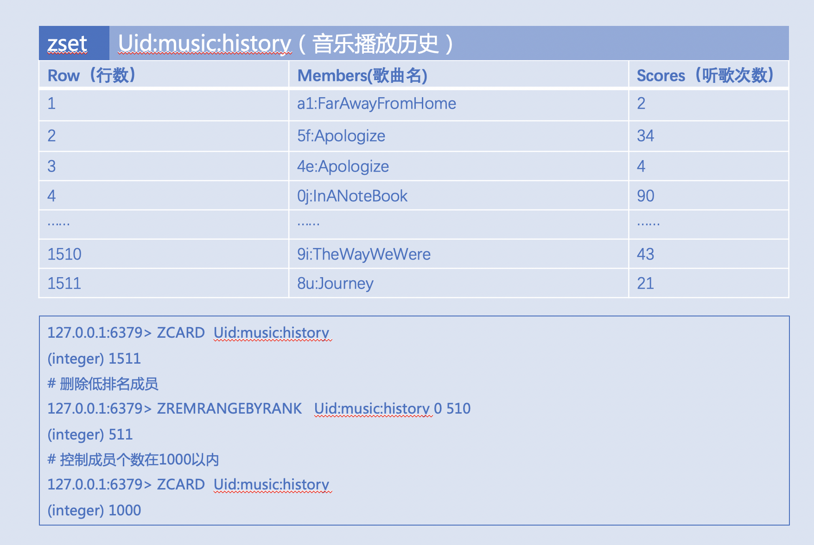
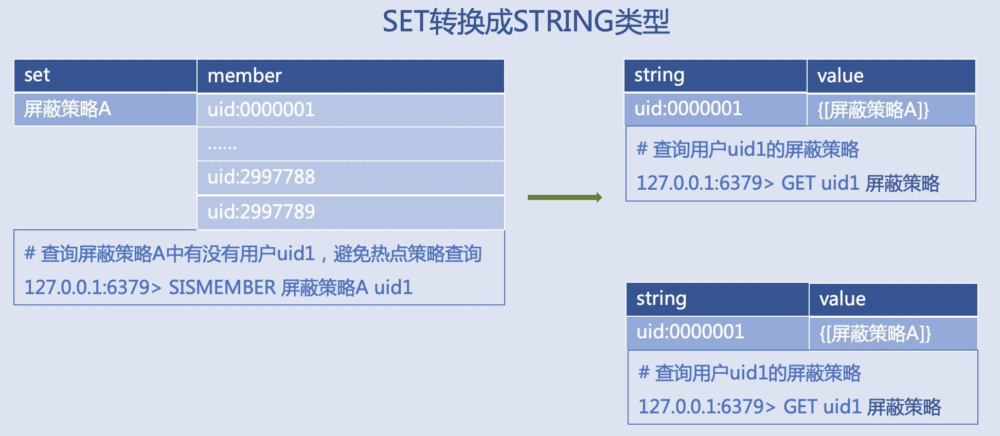
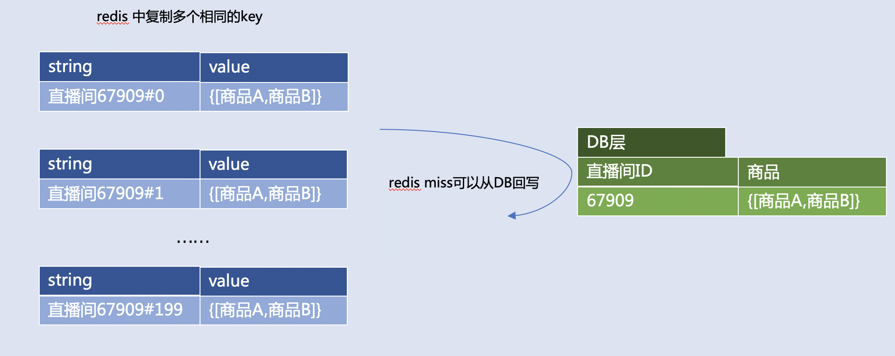

| 版本 | 内容 | 时间                   |
| ---- | ---- | ---------------------- |
| V1   | 新增 | 2023年05月03日22:32:42 |

> 本文内容来自百度产品文档

## Redis 键值对的一些限制

| 数据类型 | 限制说明                                                     |
| -------- | ------------------------------------------------------------ |
| String   | String 类型的单个 Value 最大值为 512MB。                     |
| List     | List 及其包含的元素个数不超过 `2^32-1` 个，单个元素最大值为 512MB。 |
| Set      | Set 及其包含的元素个数不超过 `2^32-1` 个，单个元素最大值为 512MB。 |
| ZSet     | ZSet 及其包含的元素个数不超过 `2^32-1` 个，单个元素最大值为 512MB。 |
| Hash     | Hash 及其包含的元素个数不超过 `2^32-1` 个，单个元素最大值为 512MB。 |

## Key 名字如何设计

### 大小

- 建议控制在 **30 个字节内**，尽可能**不超过 128 字节**，如果是 MGET 超过 100 个数据的场景，此时Key名字最好不超过 20 字节。

### 命名

- **不使用特殊字符**， 比如空格、单引号、转义字符；
- **业务标识可以当做 Key 的前缀，标识和含义内容用“:”分隔**， 比如业务标识是“AID:15”，Key就可以写成：“AID:15:player:ranking”，方便遇到问题时根据业务标识尽快定位；**如果Key本身是拆分 Key，可以使用"#"分隔**，比如“video_info#olympic#2020-08-29#1”，“video_info#olympic#2020-08-29#2”，提高可读性；
- 常见单词**尽可能使用英文简写**， 比如“economic”简写为“ec”，“file path”简写为“fp”。
- 正确使用 Redis 的 hashtag，默认符号的配置是“{}”，集群版是按照 hashtag（第一个“{”和第一个“}”之间的内容）来进行路由的，比如“a{aa{xxx}bb}b”是按照“{aa{xxx}”转发到同一个数据分片来实现分布式 Redis 的 RENAME 命令的操作，**要注意使用 hashtag 避免大量数据落入同一个数据分片**， 造成多个节点数据不均衡，不需要使用 hashtag 的场景，禁止使用“{}”，如果有特殊原因必须使用，建议在控制台关闭 hashtag 的特性。

### 过期

- 首先我们建议Key都是需要**设置过期时间**的，尤其是秒杀，热门活动等**集中写入的Key**的场景， 在设置过期时间的时候**要加上随机值**， 让过期时间分散一些。

## Value如何设计？

### 大小以及素个数：

- String 类型的数据**建议百字节以内，控制在 1K 以下**， 最好不超过 10K，如果是 MGET 或者使用 Pipeline 的场景，建议小于 4K，Redis 硬限是每个 Value 最大不超过 512M。

这里我们给出参考值，Redis请求最大10ms延迟级别下，对应的 Key 大小和 QPS：

| 单kv大小 | 100字节 | 1K   | 10K  | 50K  | 100K | 500K |
| -------- | ------- | ---- | ---- | ---- | ---- | ---- |
| qps      | 9.7w    | 7.8w | 7.3w | 6.8w | 4.2w | 6400 |

- 复合类型 Hash、List、Set、Zset，默认 Redis 配置下，控制成员数目并且控制单个成员大小是可以对应使用压缩算法的，可以降低Redis本身数据结构的开销。

| 类型 | 成员个数最大值 | 成员大小最大值 |
| ---- | -------------- | -------------- |
| Hash | 512            | 64B            |
| Set  | 512            | 64B            |
| List | 512            | 64B            |
| Zset | 128            | 64B            |

- 那么对于 Set、Hash、List 这类复杂数据类型，要尽量降低数据结构中的元素个数，**建议元素个数控制 1000 以下，单 Key 对应 Value 大小不超过 1M**。

这里我们给出参考值，预置单 Hash Key 下，每个成员长度为 10 字节，Field 个数在 10、100、500、1000、3000、5000 情况下，HGETALL 操作对应的平响时间、qps 测试结果：

| kv大小：member数量*10字节 | 10*10 | 100*10 | 500*10 | 1k*10 | 3k*10 | 5k*10 |
| ------------------------- | ----- | ------ | ------ | ----- | ----- | ----- |
| 平响时间（ms）            | 0.4   | 0.7    | 2.7    | 5     | 11    | 25    |
| qps                       | 4.8w  | 1w     | 2500   | 870   | 250   | 120   |

## 使用的命令请求遵守哪些规范？

### 控制数量：

- 对于**单个请求批量访问数据**的场景，建议**限制在 100 个Key以内**（如：MGET 一次不能超过100 个 Key、HMGET 一次不能超过 100 个 FIELD)；
- 每个 Pipeline 批次下 Key 数量 ，建议**限制在 200 以内，最好控制在 50 以内**；
- 对于O(n)，O(log(n))以及更高复杂度的，控制元素个数以及使用频率，比如LRANGE 0 -1，HGETALL；

### 数据删除：

- 对于复合类型的 DEL，如果是已知元素个数很多的大 Key，**4.0 以上版本建议使用 UNLINK 方式删除**，**如果是低版本的 Redis，可以使用 HSCAN、SSCAN、ZSCAN**；
- 对于 4 系以上版本 Redis 建议开启 Redis 的 lazyfree 配置，**启用异步删除**的功能；

### LUA 使用：

- **不建议**将复杂的 **Lua 脚本**放在 Redis 执行，会导致占用 CPU 以及内存资源，带来性能下降；
- **不建议 **LUA 中包含事务以及 redis.replication 相关的操作；
- LUA 脚本中变量需要保证是执行的时候给定脚本和参数，建议执行 EVAL 将 LUA 的脚本缓存在 Redis 中，通过 EVALSHA 的命令执行脚本内容；
- 执行 EVALSHA 收到返回是脚本不存在的时候，需要重新执行 EVAL；

### 消息队列或者通信：

- 发布订阅的业务场景，**要注意发布和订阅保持平衡**， 包括订阅或者取消订阅的是已有的频道，避免出现热点；
- 一次订阅建议**控制在 50 个频道以内**，以免输出缓冲区过高触发客户端连接的断连；
- 用 List 类型做消息队列，**要注意生产和消费保持平衡**，并且通过 LEN 检查长度，通过 LTRIM 对队列的长度进行控制，及时截断；
- 当出现队列异常堆积以后，控制再次消费的速度，**避免大量堆积任务**同一时间消费导致输出缓冲区过高触发客户端连接的断连。

### 慎用的命令：

- 如果不确认 Key 是 Big-key，不确认当前 Redis 的内存使用量，**慎用 DEBUG 相关的命令**（如 DEBUG DIGEST/OBJECT等），避免造成阻塞，如果需要检查 Key 的大小，使用 4 系及以上高版本 MEMORY 命令检查，低版本建议使用复杂度是O(1)的命令检查，比如：STRLEN，HLEN（更多详见：https://redis.io/commands/）；
- **非必要不使用 MONITOR 命令**，如果需要，预先检查 Redis 的网络流量，在确保网络流量在10M/s以下，安全使用 MONITOR 命令；
- **非必要不使用 KEYS 命令**，如果需要，在确保自己的数据量控制在网络流量 10M/s 以下，安全使用 KEYS 命令；（建议用 SCAN）

## 该如何设计数据结构以避开大Key和热Key？

老生常谈的大 Key 和热 Key，需要拆、需要打散，如上，我们也给出各种类型 Value 建议大小，**怎么拆呢？又如何打散呢？** 除了拆和打散，还有没有别的办法呢？下面举一些常见的场景案例。

### 消息队列或任务记录

用户任务记录（读文章，签到，看视频...），Key的设计最好以时间段划分，比如：按月记录 **uid:task:202209**，而非将所有任务记录到一个Key： **uid:task:all**。

注意：

- Key 要设置合理过期时间，避免一个 Key 中堆积很长时间历史数据；
- 如果预期 Key 的成员会随着时间增加而变多，建议“HSCAN，SSCAN......”的方式定期清理；
- 消息队列要监控上下游的生产消费速度，或者监控队列长度，避免任务堆积；

### 可分类的数据

可分类的数据：配置信息、活动种类、业务种类

根据考生分数查询可报考学校，

比如：将多个地域存一个 Key 拆开，改为多个地域对应多个 Key，

比如：“**全国考生**分数学校对应信息（**key**）—— `省份_分数段_政史地（field`）—— 可以报考学校的信息（**value**）”，可以优化成： “**云南考生**（**key**）—— 政史地:分数段（**field**）—— 可以报考学校的信息（**value**）”

注意：

- 对于地域，时间，业务种类这种数据，设计 Key 的粒度要尽可能小，避免出现地域级别热点Key，利用分类将 Key 打散；
- 有时候设计 Key 的时候习惯用 Key 名字对应 MySQL 表名字，那这个 Key 的范围就容易很大，我们建议将 Key 拆开，用一些常用数据库字段对应到 Key 上；

### 属性相关信息

属性相关信息：用户信息、设备规格、聊天记录、商品规格

记录不同分数段对应的学校信息，比如：上例中“edu0_info”对应“100-150分数段物化生考生”可报考所有学校的信息，那么假如所有学校的信息本身是超过 4KB 的 JSON，此时不建议 Hash 类型 Value 存储 JSON，可以存 JSON 的 Key 名字“edu0_info_key”

注意：

- 复合类型元素或者成员的 Value 建议小于 4k，避免 HGETALL，LRANGE 0 -1，SMEMBERS 取全集导致 Redis 压力过大；
- 建议将 HGETALL 换成 HMGET，将 LRANGE 0 -1 换成 LRANGE 0 50 获取，SMEMBERS 换成SISMEMBER，ZRANGE 0 -1 换成 ZRANGEBYSCORE 加 LIMIT；
- 元素或者成员 Value 建议是字符串，而不建议使用大 JSON 或者数组，可以将 JSON 存到单独的 Hash 或者 String 类型的 Key 中；

### 各种ID

各种ID：粉丝列表、视频收藏列表、歌单歌曲列表、文章信息库、关注用户列表

某次活动中奖用户记录，比如：用户 ID 用 1000 取模，就可以将用户 ID 全集的 1 个 Key 拆成 1000 个Key，如果 ID 很多，可以用 ID 和 ID 前 2 个字符取模两次，按需分段 uid#0#0，uid#1#1 ，......， uid#999#99

注意：

- 利用 Value 在 Key 的名字上取模，常用在各种 ID，即 Value 是整型，比如用户 ID，书籍 ID，文章 ID；
- Key 名字使用的分隔符号不建议使用空格和可能引起运算的符号（“-”，“.”，“+”，“=”，......），建议用 “#”，“:”，“_”

### 排序场景

排序场景：音乐历史记录排序、文章取热门评论排序、歌手热门歌曲排序。

音乐播放历史，比如：使用 ZREMRANGEBYRANK 定期控制成员个数在 1000 左右，减轻 ZREVRANK 的O(log(N))开销

注意：

- 预期会经常排序的数据，建议控制元素（成员）个数在 1000 以内；
- ZREMRANGEBYRANK 本身复杂度为 O(log(N)+M) ，注意使用频率，天级别或者整点或者业务低峰期执行为好；

### 一对多的关系

一对多的关系：作弊规则、反攻击规则限制、配置应用、权限管理

### 热门场景

热门场景：热门直播间商品信息、热门赛事赛程信息

查询直播间的商品，比如：同样的数据存多份备份，随机读一个，读不到再从 DB 回写

- 适合读多写少的数据；
- 最佳实践是，分布式 Redis 中，备份数据份数可以用 Redis 集群分片数评估 QPS 分布，份数最好是集群分片数的一倍及以上；

### 大文本

大文本：大图文、图片内容、小说、长篇文章、博客、评论内容、客服对话

将小说文章压缩后存储。

- JSON 和 XML 换成轻量级的 Protobuf；
- 使用 Snappy 或 GZIP 压缩；
- 预期 Key 可能过大，灌入数据的时候，使用 EXPIREAT 设置过期时间，不要集中到某个时间戳，最好加上随机时间；

### 所有场景

注意命令时间复杂度及其使用频率。

比如 O(n)，O(log(n)) 以及更高复杂度的，控制元素个数，以及命令使用频率，时间复杂度详见：https://redis.io/commands/。 比如 INCR 的 Key 需要设置一天的过期时间，那么可以根据返回结果判断，如果已经大于1，就不需要重复 PEXPIREAT。比如 Redis4 系及以上可以使用MEMORY USAGE 查询 Key 的内存占用，避免未知 Key 大小，执行 DEBUG OBJECT 造成阻塞。比如 O(N) 的 N 是成员（元素）总数的慎用者降低使用频率。

常见的高复杂度的命令如下：

- List 类型：LRANGE 范围取0 -1时慎用，LREM
- Hash 类型：HKEYS，HVALS，HGETALL
- Set 类型：SINTER / SINTERSTORE，SUNION / SUNIONSTORE，SMEMBERS
- Sorted Set 类型：ZRANGE(...) 范围取0 -1时慎用，ZREVRANGE(...)，ZREMRANGEBY(...)，ZUNION(...)
- Geo 类型：GEOHASH，GEORADIUS(...)，GEOSEARCH(...)
- 其他：KEYS，MONITOR，DEBUG
