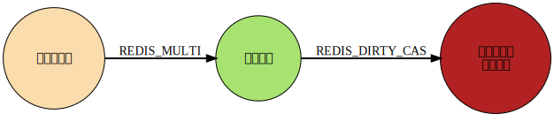

| 版本 | 内容            | 时间                   |
| ---- | --------------- | ---------------------- |
| V1   | 新增            | 2023年04月20日00:26:09 |
| V2   | 新增 WATCH 相关 | 2023年04月21日00:29:16 |

本文参考：

- https://redis.io/docs/manual/transactions/
- https://redisbook.readthedocs.io/en/latest/feature/transaction.html#watch

## Redis 事务

Redis 通过 MULTI、EXEC、WATCH 等命令来实现事务功能。

事务提供了一种将多个命令请求打包，然后一次性、按顺序地执行多个命令的机制，并且在事务执行期间，服务器不会中断事务而改去执行其他客户端的命令请求，它会将事务中的所有命令都执行完毕，然后才去处理其他客户端的命令请求。

因为事务在执行时会独占服务器，所以用户应该避免在事务中执行过多命令，更不要将一些需要进行大量计算的命令放入事务中，以免造成服务阻塞。

## Redis 事务相关的命令

| 命令    | 简单含义                         | 具体含义                                                     |
| ------- | -------------------------------- | ------------------------------------------------------------ |
| MULTI   | 开启事务                         | 开启事务，当一个客户端执行 MULTI 命令后，将执行该命令的客户端从非事务状态切换至事务状态。这时候所有除开 EXEC、DISCARD、WATCH、MULTI 这几个命令，其他对数据库操作命令都不会立即执行，而是按顺序放入一个事务队列中 |
| EXEC    | 执行事务中的命令                 | 遍历这个客户端的事务队列，执行队列中保存的所有命令，最后将执行命令所得的结果全部返回给客户端。并将连接恢复为正常状态 |
| DISCARD | 取消执行事务                     | 这个客户端的事务队列，也就是移除所有排队的命令，并将连接恢复为正常状态 |
| WATCH   | 标记要监视的键，用于实现乐观事务 | WATCH 命令对键进行监视。客户端可以通过执行 WATCH 命令，要求服务器对一个或多个数据库键进行监视，如果在客户端尝试执行事务之前，这些键的值发生了变化，那么服务器将拒绝执行客户端发送的事务，并返回一个空值。 |
| UNWATCH | 取消监视给定的键                 | 客户端可以通过 UNWATCH 命令，取消对所有键的监视。除了显示地执行 UNWATCH 命令之外，使用 EXEC 命令执行事务和使用 DISCARD 命令取消事务，同样会导致客户端撤销对所有键的监视，这是因为这两个命令在执行之后都会隐式调用 UNWATCH 命令 |

## 简单的事务案例

### 开启事务并执行

```
127.0.0.1:6379> MULTI
OK
127.0.0.1:6379(TX)> set name KangKang
QUEUED
127.0.0.1:6379(TX)> set age 18
QUEUED
127.0.0.1:6379(TX)> INCR age
QUEUED
127.0.0.1:6379(TX)> get age
QUEUED
127.0.0.1:6379(TX)> INCR age
QUEUED
127.0.0.1:6379(TX)> EXEC
1) OK
2) OK
3) (integer) 19
4) "19"
5) (integer) 20
```

### 开启事务并取消

```
127.0.0.1:6379> MULTI
OK
127.0.0.1:6379(TX)> SET name KangKang
QUEUED
127.0.0.1:6379(TX)> SET age 18
QUEUED
127.0.0.1:6379(TX)> DISCARD
OK
127.0.0.1:6379> get name
(nil)
127.0.0.1:6379> get age
(nil)
```

## 事务异常情况

在进行事务时，有可能会遇到两种类型的命令错误：

1. 命令无法进入事件队列，此时还未执行 EXEC。比如说，命令的语法可能有问题（参数数量、命令名称等），或者由于一些关键情况限制（例如服务器使用 maxmemory 指令限制内存）；
2. 命令在执行 EXEC 后失败，例如对一个字符串类型的键使用列表的命令；

### 语法错误

首先测试命令中有语法错误的情况，这种情况多为命令的参数个数不正确或输入的命令本身存在错误。下面我们在事务中输入一个存在格式错误的命令，开启事务并依次输入下面的命令：

```
127.0.0.1:6379> get abc
(nil)
127.0.0.1:6379> MULTI
OK
127.0.0.1:6379(TX)> set abc abc
QUEUED
127.0.0.1:6379(TX)> incr
(error) ERR wrong number of arguments for 'incr' command
127.0.0.1:6379(TX)> EXEC
(error) EXECABORT Transaction discarded because of previous errors.
127.0.0.1:6379> get abc
(nil)
```

在 Redis 2.6.5 版本之后，服务器会如何检测命令积累过程中可能出现的错误。如果服务器在积累命令的过程中发现了错误，它将会在执行 EXEC 命令时返回一个错误，并且**丢弃整个事务**。

输入的命令 INCR 后面没有添加参数，属于命令格式不对的语法错误，这时在命令入队时就会立刻检测出错误并提示错误。在执行 EXEC 后，也会提示错误。

如果存在命令本身拼写错误、或输入了一个不存在的命令等情况，也属于语法错误的情况，执行事务时会直接报错。

### 运行错误

运行错误是指输入的指令格式正确，但是在命令执行期间出现的错误，例如对一个字符串类型的键使用不是操作字符串的命令，例如 INCR命令；

```
127.0.0.1:6379> get before
(nil)
127.0.0.1:6379> get after
(nil)
127.0.0.1:6379> set aaa aaa
OK
127.0.0.1:6379> type aaa
string
127.0.0.1:6379> MULTI
OK
127.0.0.1:6379(TX)> set before before
QUEUED
127.0.0.1:6379(TX)> incr aaa
QUEUED
127.0.0.1:6379(TX)> set after after
QUEUED
127.0.0.1:6379(TX)> EXEC
1) OK
2) (error) ERR value is not an integer or out of range
3) OK
127.0.0.1:6379> get before
"before"
127.0.0.1:6379> get after
"after"
```

可以看到，虽然发生异常了，但是其他命令还是正常执行，只是异常的那个命令没有执行成功。

**在 EXEC 之后发生的错误不会以特殊方式处理：即使在事务期间某些命令失败，所有其他命令也会执行。**

## Redis 事务不支持回滚

Redis 不支持事务回滚，因为支持回滚会对 Redis 的简单性和性能产生重大影响。

## 事件队列原理

来自：http://redisbook.com/preview/transaction/transaction_implement.html

每个 Redis 客户端都有自己的事务状态， 这个事务状态保存在客户端状态的 `mstate` 属性里面：

```c
typedef struct redisClient {
    // ...
    // 事务状态
    multiState mstate;      /* MULTI/EXEC state */
    // ...
} redisClient;
```

事务状态包含一个事务队列， 以及一个已入队命令的计数器 （也可以说是事务队列的长度）：

```c
typedef struct multiState {
    // 事务队列，FIFO 顺序
    multiCmd *commands;
    // 已入队命令计数
    int count;
} multiState;
```

事务队列是一个 `multiCmd` 类型的数组， 数组中的每个 `multiCmd` 结构都保存了一个已入队命令的相关信息， 包括指向命令实现函数的指针， 命令的参数， 以及参数的数量：

```c
typedef struct multiCmd {
    // 参数
    robj **argv;
    // 参数数量
    int argc;
    // 命令指针
    struct redisCommand *cmd;
} multiCmd;
```

事务队列以先进先出（FIFO）的方式保存入队的命令： 较先入队的命令会被放到数组的前面， 而较后入队的命令则会被放到数组的后面。

eg.

```
127.0.0.1:6379> MULTI
OK
127.0.0.1:6379(TX)> SET "name" "Practical Common Lisp"
QUEUED
127.0.0.1:6379(TX)> GET "name"
QUEUED
127.0.0.1:6379(TX)> SET "author" "Peter Seibel"
QUEUED
127.0.0.1:6379(TX)> GET "author"
QUEUED
```

那么服务器将为客户端创建下图所示的事务状态：

- 最先入队的 SET 命令被放在了事务队列的索引 `0` 位置上。
- 第二入队的 GET 命令被放在了事务队列的索引 `1` 位置上。
- 第三入队的另一个 SET 命令被放在了事务队列的索引 `2` 位置上。
- 最后入队的另一个 GET 命令被放在了事务队列的索引 `3` 位置上。


## Redis 事务的安全性（ACID）

在传统的关系式数据库中，常常用ACID性质来检验事务功能的可靠性和安全性。

在Redis中，事务总是具有原子性（Atomicity）、一致性（Consistency）和隔离性（Isolation），并且当Redis运行在某种特定的持久化模式下时，事务也具有耐久性（Durability）。

### 原子性（Atomicity）

关于 Redis 事务是否支持原子性，好像没有统一的说法。

就前面的“事务异常情况”的小结中，我们分析了在语法错误时，所有命令都不会执行；在运行时发生错误时，只有异常的那个命令不执行，其他命令还是会执行的。而且 Redis 事务不支持回滚。

在 Redis 官方中曾经这样描述：Either all of the commands or none are processed, so a Redis transaction is also atomic.

但是这句话在后来被删除了，如下面的图片所示，commit 信息是 minor: this needs more nuance，翻译过来就是 这句话需要再斟酌一下，官方估计也拿捏不准。


所以关于 Redis 事务是否支持原子性，我个人觉得是不支持原子性的。

### 一致性

支持一致性

事务具有一致性指的是，如果数据库在执行事务之前是一致的，那么在事务执行之后，无论事务是否执行成功，数据库也应该仍然是一致的。

“一致”指的是数据符合数据库本身的定义和要求，没有包含非法或者无效的错误数据。简单来说事务执行完只要满足所有现实生活中的约束，那么就认为是符合一致性的。

Redis 服务器会对事务及其包含的命令进行检查，确保无论事务是否执行成功，事务本身并不会对数据库造成破坏。

需要注意的是，当 Redis 使用的是 AOF 持久化时，Redis 服务器系统崩溃或被管理员强制杀死等情况，可能只记录了一个事务的部分命令。Redis 会在重新启动时检测到这种情况，并且会报错且退出。通过运行 redis-check-aof 工具，可以修复 AOF 日志文件，可以删除不完整的事务命令，使得 Redis 能够重新启动。这种情况也不会破坏数据库的一致性。

### 隔离性

支持隔离性

事务的隔离性指的是，即使数据库中有多个事务并发地执行，各个事务之间也不会互相影响，并且在并发状态下执行的事务和串行执行的事务产生的结果完全相同。

因为 Redis 使用单线程的方式来执行事务（以及事务队列中的命令），并且服务器保证，在执行事务期间不会对事务进行中断，因此，Redis 的事务总是以串行的方式运行的，并且事务也总是具有隔离性的。

### 持久性

一般情况下是不支持持久性的，某些模式下支持持久性。

假如 Redis 的持久化模式是使用的 AOF，且 `appendfsync` 参数配置的是 `always`，程序总会在执行命令之后调用同步（sync）函数，将命令数据真正地保存到硬盘里面，可以说这种配置下的事务是具有持久性的。

需要注意的是还有个  `no-appendfsync-on-rewrite` 配置项，控制的是当 Redis 在隐式执行 BGSAVE 或者 AOF 文件重写 BGREWRITEAOF 时是否写入到磁盘，默认是 no。假如设置为 yes，表示在 Redis 的某个进程在执行 BGSAVE 或 BGREWRITEAOF 的时候不立即将命令写入到磁盘，所以说也是会有数据丢失的风险，这时是不支持持久性的。

## 带有乐观锁的事务（WATCH 命令）

CAS：check-and-set，也有叫 compare and set 的，意思都差不多。

WATCH 命令对键进行监视。客户端可以通过执行 WATCH 命令，要求服务器对一个或多个数据库键进行监视，如果在客户端尝试执行事务之前，这些键的值发生了变化，这包括客户端所做的修改，如写入命令，以及 Redis 本身所做的修改，如过期或内存淘汰，那么服务器将拒绝执行客户端发送的事务，并返回一个空值。

> 注意：在 Redis 6.0.9 版本之前，过期的键不会导致事务失败。 [More on this](https://github.com/redis/redis/pull/7920)

相反，如果被监视的这些键的值都没有发生任何变化，那么服务器会执行客户端发送的事务命令。

通过 WATCH 命令可以实现乐观锁（optimistic locking）的机制。

### WATCH 命令的使用

客户端 A：在事务开始前查询 age 和 counter 都是空的，然后设置 name 是 Kang，然后开启事务并执行。

```
127.0.0.1:6379> GET age
(nil)
127.0.0.1:6379> GET counter
(nil)
127.0.0.1:6379> SET name Kang
OK
127.0.0.1:6379> WATCH name
OK
127.0.0.1:6379> MULTI
OK
127.0.0.1:6379(TX)> SET age 18
QUEUED
127.0.0.1:6379(TX)> INCR counter
QUEUED
127.0.0.1:6379(TX)> EXEC
(nil)
127.0.0.1:6379> GET name
"aaa"
27.0.0.1:6379> GET age
(nil)
127.0.0.1:6379> GET counter
(nil)
```

客户端 B：在客户端的事务执行时，修改了 name 的值

```
127.0.0.1:6379> SET name aaa
OK
127.0.0.1:6379> GET name
"aaa"
```

最后客户端 A 执行的时候，因为 name 的值被修改了，所以返回一个空值，并且事务队列中的命令并未执行。

| 时间点 | 客户端 A 行为 | 客户端 B 行为 |
| ------ | ------------- | ------------- |
| T1     | WATCH  name   |               |
| T2     | MULTI         |               |
| T3     | SET age 18    |               |
| T4     |               | SET name aaa  |
| T5     | INCR counter  |               |
| T6     | EXEC          |               |

### WATCH 命令没有 ABA 问题

验证 WATCH 没有 ABA 问题

客户端 A

```
127.0.0.1:6379> get age
(nil)
127.0.0.1:6379> get counter
(nil)
127.0.0.1:6379> SET name Kang
OK
127.0.0.1:6379> WATCH name
OK
127.0.0.1:6379> MULTI
OK
127.0.0.1:6379(TX)> SET age 18
QUEUED
127.0.0.1:6379(TX)> INCR counter
QUEUED
127.0.0.1:6379(TX)> EXEC
(nil)
127.0.0.1:6379> GET age
(nil)
127.0.0.1:6379> GET counter
(nil)
```

客户端 B

```
127.0.0.1:6379> GET name
"Kang"
127.0.0.1:6379> SET name aaa
OK
127.0.0.1:6379> GET name
"aaa"
127.0.0.1:6379> SET name Kang
OK
127.0.0.1:6379> GET name
"Kang"
127.0.0.1:6379>
```

| 时间点 | 客户端 A 行为 | 客户端 B 行为 |
| ------ | ------------- | ------------- |
| T0     | SET name Kang  |               |
| T1     | WATCH name   |               |
| T2     | MULTI         |               |
| T3     | SET age 18    |               |
| T4     |               | SET name aaa  |
| T5     |               | SET name Kang  |
| T6     | INCR counter  |               |
| T7     | EXEC          |               |

### WATCH 命令的实现原理

本节来自 https://redisbook.readthedocs.io/en/latest/feature/transaction.html#watch

在每个代表数据库的 `redis.h/redisDb` 结构类型中， 都保存了一个 `watched_keys` 字典， 字典的键是这个数据库被监视的键， 而字典的值则是一个链表， 链表中保存了所有监视这个键的客户端。

```c
typedef struct redisDb {
  // ...
  // 正在被 WATCH 命令监视的键
  dict *watched_keys;
  // ...
} redisDb;
```

比如说，以下字典就展示了一个 `watched_keys` 字典的例子：


其中， 键 `key1` 正在被 `client2` 、 `client5` 和 `client1` 三个客户端监视， 其他一些键也分别被其他别的客户端监视着。

WATCH 命令的作用， 就是将当前客户端和要监视的键在 `watched_keys` 中进行关联。

举个例子， 如果当前客户端为 `client10086` ， 那么当客户端执行 `WATCH key1 key2` 时， 前面展示的 `watched_keys` 将被修改成这个样子：


通过 `watched_keys` 字典， 如果程序想检查某个键是否被监视， 那么它只要检查字典中是否存在这个键即可； 如果程序要获取监视某个键的所有客户端， 那么只要取出键的值（一个链表）， 然后对链表进行遍历即可。

前面说过，Redis 调用 MULTI 会从非事务状态进入到事务状态，在对 Redis 的任何键进行写操作时，就会去查数据库的 `watched_keys` 字典， 看是否有客户端在监视已经被命令修改的键， 如果有的话， 程序将所有监视这些被修改键的客户端的 `REDIS_DIRTY_CAS` 选项打开，表示事务被破坏了：



当客户端发送 EXEC 命令、触发事务执行时， 服务器会对客户端的状态进行检查：

- 如果客户端的 `REDIS_DIRTY_CAS` 选项已经被打开，那么说明被客户端监视的键至少有一个已经被修改了，事务的安全性已经被破坏。服务器会放弃执行这个事务，直接向客户端返回空回复，表示事务执行失败。
- 如果 `REDIS_DIRTY_CAS` 选项没有被打开，那么说明所有监视键都安全，服务器正式执行事务。

举个例子：


如果某个客户端对 `key1` 进行了修改（比如执行 `DEL key1` ）， 那么所有监视 `key1` 的客户端， 包括 `client2` 、 `client5` 和 `client1` 的 `REDIS_DIRTY_CAS` 选项都会被打开， 当客户端 `client2` 、 `client5` 和 `client1` 执行 EXEC 的时候， 它们的事务都会以失败告终。

最后，当一个客户端结束它的事务时，无论事务是成功执行，还是失败， `watched_keys` 字典中和这个客户端相关的信息都会被清除。

这里解释一下为什么 WATCH 为什么没有 ABA 问题，因为每次写操作都会去`watched_keys`字典中是否有客户端在监视这个键，假如有客户端再监视这个键，那么就把这个客户端的`REDIS_DIRTY_CAS` 选项打开，后续再把这个键的值恢复成旧值，客户端的`REDIS_DIRTY_CAS` 选项还是打开状态，所以没有 ABA 问题。

## 使用 WATCH 命令实现 ZPOP

> 并没有 ZPOP 这个命令，是官方事务文档的一个标题，我就没改，含义类似 SET 的 SPOP 命令。

ZPOPMIN、ZPOPMAX 及其阻塞变体是在 Redis 5.0 版中新加的，之前并没有 ZPOP 相关的命令。

一个很好的例子来说明 WATCH 如何用于创建 Redis 不支持的新原子操作是实现 ZPOP，这是一个以原子方式从排序集中弹出得分较低的元素的命令。这是最简单的实现：

```
WATCH zset
element = ZRANGE zset 0 0
MULTI
ZREM zset element
EXEC
```

如果 EXEC 失败（即返回 Null 回复），我们只是重复该操作。

## 事务和 Pipeline 的区别

Pipeline 和事务虽然在概念上有点类似，但是在作用上并不相同：

- Pipeline 的作用是将多个命令打包，然后一起发送给服务器；
- 事务的作用则是将多个命令打包，然后让服务一并执行它们；

因为 Redis 事务在 EXEC 命令执行之前并不会产生实际效果，所以很多 Redis 客户端都会使用 Pipeline 去包裹事务命令，并将入队的命令缓存在本地，等到用户输入 EXEC 命令之后，再将事务命令通过 Pipeline 一起发送给服务器。
