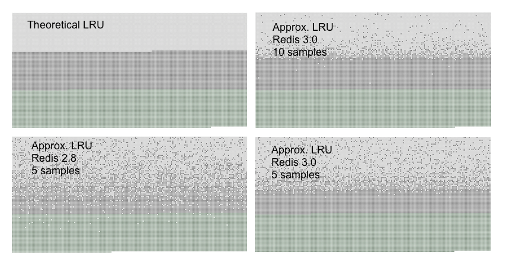

| 版本 | 内容 | 时间                   |
| ---- | ---- | ---------------------- |
| V1   | 新建 | 2023年04月13日23:42:36 |

## Redis 最大内存的配置

在 redis.conf 文件中，有个 `maxmemory` 配置项。

```
maxmemory 100mb
```

将 maxmemory 设置为 0 表示不限制内存大小。这是 64 位系统的默认行为，而 32 位系统使用 3GB 的隐式内存限制。

当 Redis 使用的内存达到了 maxmemory 时，会根据设置的内存淘汰策略去做对应的操作（配置项 `maxmemory-policy`配置的）。

假如内存到了上限时还继续往 Redis 添加数据时，Redis 根据淘汰策略无法移除某些键，或值淘汰策略设置的是 noeviction，Redis 会返回一个错误。

> 假如给某个 Redis 实例设置了 maxmemory 参数，当前 Redis 实例还有多个从节点，在内存淘汰发生时可能会出现一种情况：就是主节点发送内存淘汰需要将对应的 DEL 命令发送给从节点，并将这些 DEL 命令存储到同步到从节点的网络缓存区中，这个区域也是需要消耗内存的，假如 DEL 命令越来越多，也可能会达到  maxmemory 的限制，从而导致继续发送内存淘汰了，极端情况可能会导致整个数据库被清空。
>
> 为了解决这个问题，Redis是在内部分开计算数据库存储数据和同步到从节点所需的网络输出缓冲区空间大小的，因此在设置 maxmemory 参数时只需要考虑实际的数据存储需求即可。如果需要配置 Redis 实例的副本功能，Redis 会自动将副本所需的网络输出缓冲区空间从使用的内存计数中减去，以确保系统总体上可以更好地运行。但是需要注意的是，为了防止出现数据丢失等问题，建议设置一定的 maxmemory 限制，以便 Redis 能够遵守内存限制，并对数据进行适当的删除和回收。
>
> 简单来说，如果 Redis 服务器有副本时，会发生网络传输数据的情况。这些数据需要存储在内存中的输出缓冲区中，以便可以发送到副本节点。如果输出缓冲区没有足够的内存可用，系统将性能下降或出现运行问题。因此，为了避免这种情况的发生，建议在设置 maxmemory 参数时，考虑到副本所需的输出缓冲区的空间大小，并在必要时将其减去，以确保系统有足够的内存可供使用。但如果设置了 'noeviction' 策略，即 Redis 不使用 LRU 算法淘汰键值对时，这种情况一般不会发生。

## Redis 支持的内存淘汰策略

### 8 种内存淘汰策略

Redis 4 后支持 8 种内存淘汰策略

- **noeviction**: 不做清理操作，拒绝任何添加数据的操作并返回错误信息“OOM（Out of Memory）。这种情况下Redis会失去一些数据，但是可以保证Redis服务的高可用性，因为只要有足够的内存可用，Redis就可以继续运行；
- **allkeys-lru**: 以 LRU 算法（最近最久未使用，使用时间先后）为基础，从所有的键集合中挑选最近最少使用的键进行淘汰；
- **allkeys-lfu**: 以 LFU 算法（最近不经常使用，使用频率）为基础，从所有的键集合中挑选最不常使用的键进行淘汰；
- **volatile-lru**: 以 LRU 算法为基础，仅从带有过期时间的键集合中挑选最近最少使用的键进行淘汰；
- **volatile-lfu**: 以 LFU 算法为基础，从带有过期时间的键集合中挑选最不常使用的键进行淘汰；
- **allkeys-random**: 从所有的键集合中随机挑选键值对进行淘汰；
- **volatile-random**: 从带有过期时间的键集合中随机挑选键值对进行淘汰；
- **volatile-ttl**: 在带过期时间的键集合中，根据键的到期时间进行排序，淘汰离过期时间最近的键值对；

其中 **volatile-lru**, **volatile-lfu**, **volatile-random**, 和 **volatile-ttl** 这几种内存淘汰策略，当 Redis 中存储的数据都是持久性的（也就是没有设置过期时间的），就会表现出和 **noeviction** 一样的行为。

根据 Redis 的请求特点，选择一个内存淘汰策略是很重要的。内存淘汰策略在 Redis 运行中也是可以重新设置的，也可以通过 Redis 的 INFO 命令查看未命中和命中的个数。

**在线修改内存淘汰策略**

```
127.0.0.1:6379> config get maxmemory-policy
1) "maxmemory-policy"
2) "noeviction"
127.0.0.1:6379> config set maxmemory-policy allkeys-lru
OK
127.0.0.1:6379> config get maxmemory-policy
1) "maxmemory-policy"
2) "allkeys-lru"
```

### 如何选择淘汰策略

- **什么时候用 allkeys-lru？**
  1. 如果预计访问请求的特性呈现幂律分布，也就是说预计只有一部分元素会被频繁访问，而其余元素则很少被访问。使用 **allkeys-lru** 策略是一个不错的选择。如果不确定该选择哪种策略，**allkeys-lru** 也是一个很好的备选方案；
- **什么时候用 allkeys-random?**
  1. 如果需要循环扫描所有键，并且持续访问它们，即所有键有相同的操作频率和重要性，则 **allkeys-random** 策略可以使得所有键被均衡地淘汰，并保证整个键空间的内存使用处于稳定状态；
  2. 如果预计访问请求的分布是均匀的，则 **allkeys-random** 策略也能够适应这种情况。与其他淘汰策略相比，在这种情况下使用随机策略更具有普适性和可靠性；
- 什么时候用 **volatile-ttl** ?
  1. 基本上没啥场景会用到这个吧。。。

**volatile-lru** 和 **volatile-random** 策略主要用在希望使用单个实例持有一组持久键。一般我们并不会使用这两个策略。使用两个 Redis 实例可以达到这个目的，一个专门存储持久的数据，一个存储带过期时间或者允许内存淘汰的数据。

需要注意的是，维护键的过期时间也是需要占用内存的，因此如果需要在 Redis 中存储大量的键值对并且想要节省内存空间，那么使用 **allkeys-lru** 策略可能更加高效，因为在这种策略下，不需要为键配置过期时间也可以被 Redis 在内存不足时进行淘汰。

## Redis 淘汰数据的流程

1. 一个新命令需要往 Redis 写入数据；
2. Redis 检查内存使用情况，如果大于 maxmemory 的限制 ，则根据淘汰策略逐出键；
3. 最后执行命令，添加数据到 Redis 内存；

所以说 Redis 可能会不断的越过 maxmemory 限制，通过驱逐键回到限制的范围内。

如果某个命令导致在一段时间内使用大量内存（如将大集合交集存储到新键中），则超过内存限制可能会很明显。

举个例子：

假设有一个 set A 包含一百万个字符串元素，每个字符串大小为 1KB。如果在 Redis 中将 set A 内容复制到一个新的set B 中（例如 `SINTERSTORE` 的操作），则 Redis 将需要申请 1GB 的额外内存空间来存储 set B。如果此时 Redis 的内存限制是 2GB，而内存已被使用了 1.8GB，那么在这个操作完成之前，Redis 的内存使用量将会超出限制。

## Redis 的近似 LRU 的算法

### Redis 使用理论的 LRU 的问题

假如使用双链表来实现 LRU，需要用链表管理 Redis 中的所有数据，大量的节点访问就会带来频繁的链表节点的移动操作，会造成大量的额外空间和时间的消耗，从而降低 Redis 的性能。

### Redis 近似 LRU 的效果

Redis LRU 算法并不是一个精确的实现。这意味着 Redis 每次淘汰键的时候可能没有选择最佳的淘汰对象，也就是说可能不是最久未访问的键。Redis 的实现是通过一个近似的 LRU 的算法淘汰键的，通过**采样一小部分的键，淘汰这一小部分的键中访问时间最早的键**。

Redis 3.0 改进了这个近似的 LRU 算法，也可以选择一个好的淘汰池。提高了算法的性能，使其能够更接近真实 LRU 算法的行为。

Redis 的 LRU 算法可以通过更改样本数来调整算法的精度，配置文件通过 `maxmemory-samples` 配置采样数量。

```
maxmemory-samples 5
```

Redis 不使用真正的 LRU 实现的原因是它需要更多的内存。但是，对于使用 Redis 的应用程序，近似的 LRU 算法实际上已经满足使用要求了。此图将 Redis 使用的 LRU 近似与真实的 LRU 进行了比较。



- **测试过程**：

  生成上述图表的测试用给定数量的键填充了 Redis 服务器。从头到尾访问一次键，所以第一个添加的键在 LRU 算法中是最佳的淘汰对象。后面又添加了 50% 的密钥，以强制驱逐一半的旧键。

- **三种不同颜色的含义**
  1. 浅灰色带是被逐出的对象；
  2. 灰色带是未被逐出的对象；
  3. 绿色带是添加的对象；

**分析**：

- 预期的效果：
  1. 理论的 LRU 实现预计的效果是在旧键中，前半部分的键将被淘汰；
  2. Redis LRU 算法只会按概率淘汰旧键；
- 上图 Theoretical LRU 是理论上的 LRU 的算法；
- Redis 3.0 的近似的 LRU 的算法比 Redis 2.8 的效果要好。Redis 3.0 后的近似 LRU 算法可以调节采样键的数量，可以看到当把采样键的数量设置为 10 的时候和理论上 LRU 的算法的效果差不多了。需要注意的是将采样样本键的数量设置成 10 会产生以一些额外的 CPU 消耗；

### Redis 近似 LRU 的实现

Redis 近似的 LRU 实现涉及到了一个实例级别的全局 LRU 的时钟，Redis 会使用一个字段保存键值的时钟信息，每次访问就会更新这个值，保存最新的时间戳。

需要注意的是默认情况下这个时钟的精度是 1 秒钟，全局时钟的值更新频率由配置项 `hz` 控制，每次访问键值对的时候就会保存最新的时间戳，这样当 Redis 存储数据的内存达到了 `maxmemory` 的限制时，就会根据淘汰策略驱逐数据了，LRU 相关的淘汰策略，默认采样 5 个页面，通过键值保存的时间戳和全局时钟比较，找到其中最久未访问的数据去驱逐。

Redis的key的底层结构

```c
typedef struct redisObject {
    unsigned type:4; // 类型
    unsigned encoding:4; // 编码
    unsigned lru:LRU_BITS; /* LRU time (relative to global lru_clock) or
   							* LFU data (least significant 8 bits frequency
     					    * and most significant 16 bits access time). */
    int refcount; // 引用计数
    void *ptr; // 指向存储实际值的数据结构的指针，数据结构由 type、encoding 决定。
} robj;
```

## Redis 的 LFU 算法

Redis 4.0 后推出了 LFU 算法（[Least Frequently Used eviction mode](http://antirez.com/news/109) ），在某些情况下，这个算法可能会提供更好的的命中率和未命中率。Redis 会尝试跟踪键的访问频率，**将访问频率较少的键淘汰，保留访问频率较高的键**。

Redis 支持两个 LFU 的内存淘汰策略：

- **volatile-lfu**：针对设置了过期时间的 key 使用近似的 LFU 算法；
- **allkeys-lfu**： 针对所有 key 使用近似的 LFU 算法；

LFU (Least Frequently Used，最近最少使用) 算法的实现原理：LFU 算法利用一种**基于概率的计数器** —— Morris 计数器来估计对象的访问频率，每个对象只需要几个比特位的存储空间，然后结合一个衰减周期，使计数器随着时间的推移而逐渐减小，这样在某些时刻，即使过去某些键值对被频繁访问过，我们也不再认为它们是经常使用的，以便算法能够适应访问模式的变化。

更具体地说，Morris 计数器是一种可以在很小的空间内近似计数的数据结构，仅占用数比特位的空间。当一个对象每被访问一次时，计数器就会进行加一操作。当计数器值超过某个阈值时，我们就认为该对象被频繁访问，并将其作为候选对象来进行策略的选择和淘汰。同时，我们也会给计数器设置一个衰减周期，使得计数器值随着时间的推移而逐渐减小，以便能够及时发现新的热点对象。

总之，LFU 算法通过 Morris 计数器等技术手段实现了一种基于访问频率的数据淘汰策略，能够在较小的空间内高效地维护热点对象，并随着时间的推移及时适应访问模式的变化。

与 LRU 不同的是，LFU 具有某些可调参数：例如，如果访问频率比较高的那些项不再被访问，它的访问频率应该以多快的速度降低。

默认情况下，Redis 配置为：

- 在大约一百万个请求时使计数器饱和；
- 每隔一分钟衰减一次计数器；

可以在 redis.conf 文件中有下面的配置项：

```
lfu-log-factor 10
lfu-decay-time 1
```

`lfu-decay-time` 是计数器应该衰减的分钟数，当采样并发现它比该值更旧时。特殊值 0 表示永远不会衰减计数器（ps.这个地方的 redis.conf 文件中有坑，发现 conf 文件和官网的描述不一致，是他们 conf 文件没有及时更新 https://github.com/redis/redis-doc/issues/2384）。

LFU 的计数器给每个 key 使用 8 个 bit 位记录，最大值就是 255 了，所以 Redis 使用一个概率增加算法，当访问了一次 key，计数器会以下面的方式增加：

1. 生成一个 0 到 1 之间的随机数 R；
2. 通过 `1 / (旧的计数器值 × lfu-log-factor + 1)` 计算概率增量 P；
3. 只有 R < P 的时候才会增加计数器的值；

下面是关于频率计数器如何随着具有不同对数因子的不同访问次数而变化的表：

```
+--------+------------+------------+------------+------------+------------+
| factor | 100 hits   | 1000 hits  | 100K hits  | 1M hits    | 10M hits   |
+--------+------------+------------+------------+------------+------------+
| 0      | 104        | 255        | 255        | 255        | 255        |
+--------+------------+------------+------------+------------+------------+
| 1      | 18         | 49         | 255        | 255        | 255        |
+--------+------------+------------+------------+------------+------------+
| 10     | 10         | 18         | 142        | 255        | 255        |
+--------+------------+------------+------------+------------+------------+
| 100    | 8          | 11         | 49         | 143        | 255        |
+--------+------------+------------+------------+------------+------------+
```

上面的表格通过下面的命令生成

```
redis-benchmark -n 1000000 incr foo
redis-cli object freq foo
```

需要注意的是计数器的初始值设置为 5，这是为了让新键有机会积累足够的访问次数，在 LFU（Least Frequently Used，最不经常使用）算法的淘汰过程中被优先保留。如果计数器的初始值过高，可能会导致某些新对象无法获得足够的访问次数，从而被错误地淘汰掉。因此，通过将计数器的初始值设置为适当的较小值，可以让新对象有机会和其他对象一样被合理的缓存管理策略所保留，从而提高系统的缓存命中率。

下面的案例可以看到，计数器初始值设置的是 5，

```
127.0.0.1:6379> set name hello
OK
127.0.0.1:6379> object freq name
(integer) 5
```

计数器自动减半的时间间隔被称为“计数器衰减时间”，该时间以分钟为单位。当计数器衰减时间到达时，Redis 会将键对应的计数器除以二（如果计数器的值大于 10），或者直接将计数器的值减 1（如果计数器的值已经小于等于 10），从而使得过时的缓存对象可以被正确地淘汰。通过设置合适的衰减时间，可以让缓存系统更加智能、高效地管理缓存对象，避免过期对象占用过多内存或导致命中率下降的问题。

> 莫里斯计数算法 https://en.wikipedia.org/wiki/Approximate_counting_algorithm

