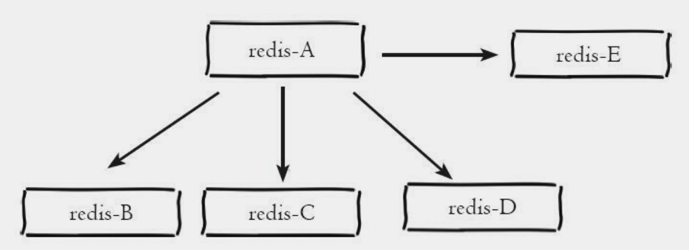
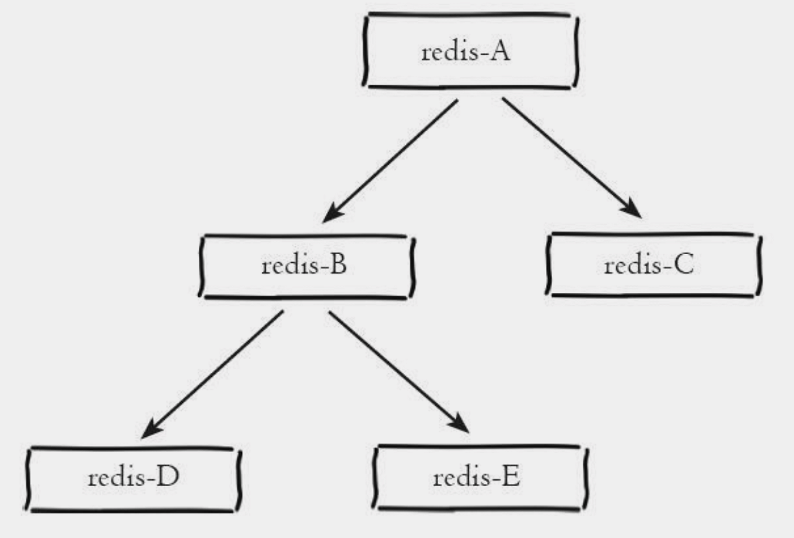
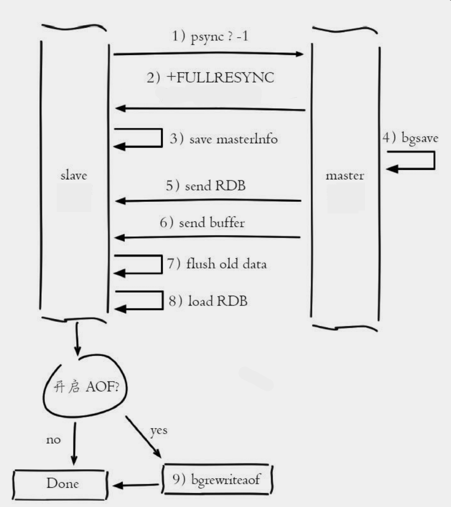
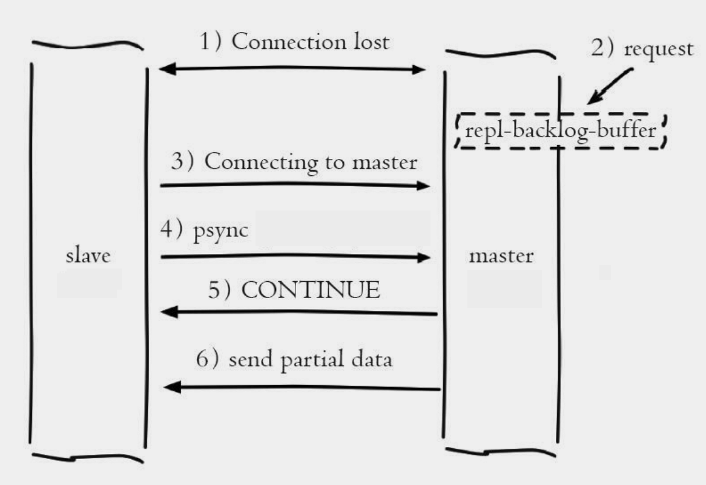
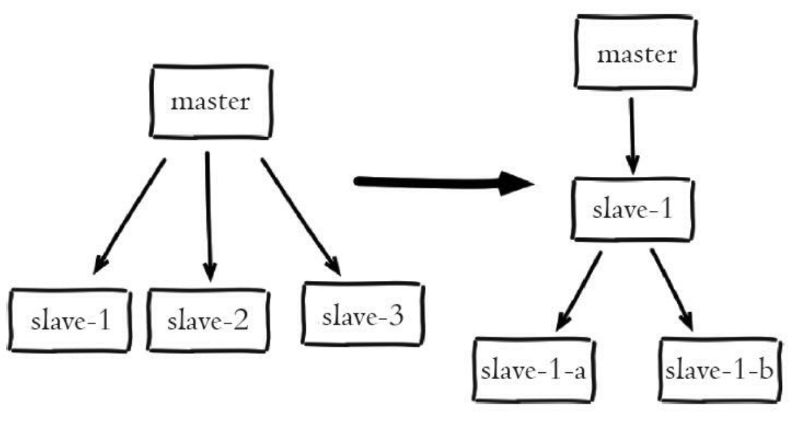

| 版本 | 内容 | 时间                   |
| ---- | ---- | ---------------------- |
| V1   | 新建 | 2023年04月02日00:44:03 |

本文内容来自

1. https://redis.io/docs/management/replication/
2. 《Redis 使用手册》 -- 可以
3. 《Redis 开发和运维》-- 很棒
4. 《Redis 深度历险》 -- 建议不看这个

## Redis 复制

Redis 提供了复制功能， 实现了相同数据的多个 Redis 副本， 复制功能是高可用 Redis 的基础。

参与复制的 Redis 分为主节点（master），从节点（slave 或者 replica）。

对于 Redis 来说

- 一个主节点可以拥有多个从节点，从节点本身也可以作为其他节点的主节点；
- 一个从节点只能有一个主节点；

默认情况下处于复制模式的主节点可以读写，从节点只能读（可配置）。


Redis 的复制的优点有哪些？

1. 性能方面：Redis 的复制功能可以给系统的读性能带来线性级别的提升。一般来说用户每增加一倍数量的从节点，整个系统的读性能就能提升一倍；
2. 安全性：增加从节点的数量，可以进行主节点的故障转移；
3. 高可用：使用 Redis 的复制功能和 Sentinel 功能，可以为整个 Redis 服务提供高可用特性；

## CAP 理论

- C : Consistent ， 一致性；
- A : Availability ， 可用性；
- P : Partition tolerance ，分区容错性；

分布式系统的节点往往都是分布在不同的机器上进行网络隔离开的 ， 这意味着必然会有网络断开的风险 ， 这个网络断开的场景的专业词汇叫作**网络分区**。

在网络分区发生时，两个分布式节点之间无法进行通信，我们对一个节点进行的修改操作将无法同步到另外一个节点，所以数据的**一致性**将无法满足 ， 因为两个分布式节点的数据不再保持一致。除非我们牺牲**可用性**，也就是暂停分布式节点服务 ， 在网络分区发生时，不再提供修改数据的功能，直到网络状况完全恢复正常再继续对外提供服务 。

简单来说就是**当网络分区发生时 ， 一致性和可用性只能保证一个**。

## 配置相关

### 建立复制

5.0.0 之前 Redis 一直使用 slaveof 作为复制命令，从 5.0.0 版本开始出现了新的复制命令 replicaof，并逐渐废弃原来的 slaveof 命令。

有三种方式建立复制

- 直接使用 slaveof 或者 replicaof 命令，让当前节点作为某个节点的从节点；
- 在配置文件在指定主节点的 ip 和端口；
- 在 redis-server 启动命令后加入启动参数指定主节点的 ip 和端口；


目前我在本地开了两个 Redis 进程，端口分别是 6379 和 10086，将 10086 端口的 Redis 作为 6379 的从节点。

#### 动态指定

直接使用 slaveof 或者 replicaof 命令

> https://redis.io/commands/slaveof/
>
> https://redis.io/commands/replicaof/

在 10086 Redis 的客户端输入命令

```
127.0.0.1:10086> replicaof 127.0.0.1 6379
OK
```

主节点日志

```
67690:M 01 Apr 2023 23:57:31.566 * Replica 127.0.0.1:10086 asks for synchronization
67690:M 01 Apr 2023 23:57:31.566 * Partial resynchronization not accepted: Replication ID mismatch (Replica asked for '14bd5efcae1e1bd1ed075eb2751db292a9a32cb0', my replication IDs are '2e11109e0e9d006c4204cfac232598c83c125a77' and '0000000000000000000000000000000000000000')
67690:M 01 Apr 2023 23:57:31.566 * Replication backlog created, my new replication IDs are '9fb57f9dd2175483564aef99f825bcf4a4d549a7' and '0000000000000000000000000000000000000000'
67690:M 01 Apr 2023 23:57:31.567 * Starting BGSAVE for SYNC with target: disk
67690:M 01 Apr 2023 23:57:31.572 * Background saving started by pid 68439
68439:C 01 Apr 2023 23:57:31.573 * DB saved on disk
67690:M 01 Apr 2023 23:57:31.581 * Background saving terminated with success
67690:M 01 Apr 2023 23:57:31.581 * Synchronization with replica 127.0.0.1:10086 succeeded
```

从节点日志

```
67813:S 01 Apr 2023 23:57:31.561 * Before turning into a replica, using my own master parameters to synthesize a cached master: I may be able to synchronize with the new master with just a partial transfer.
67813:S 01 Apr 2023 23:57:31.562 * Connecting to MASTER 127.0.0.1:6379
67813:S 01 Apr 2023 23:57:31.562 * MASTER <-> REPLICA sync started
67813:S 01 Apr 2023 23:57:31.562 * REPLICAOF 127.0.0.1:6379 enabled (user request from 'id=3 addr=127.0.0.1:63385 laddr=127.0.0.1:10086 fd=8 name= age=339 idle=0 flags=N db=0 sub=0 psub=0 multi=-1 qbuf=44 qbuf-free=65486 argv-mem=22 obl=0 oll=0 omem=0 tot-mem=82998 events=r cmd=replicaof user=default redir=-1')
67813:S 01 Apr 2023 23:57:31.563 * Non blocking connect for SYNC fired the event.
67813:S 01 Apr 2023 23:57:31.565 * Master replied to PING, replication can continue...
67813:S 01 Apr 2023 23:57:31.565 * Trying a partial resynchronization (request 14bd5efcae1e1bd1ed075eb2751db292a9a32cb0:1).
67813:S 01 Apr 2023 23:57:31.572 * Full resync from master: 9fb57f9dd2175483564aef99f825bcf4a4d549a7:0
67813:S 01 Apr 2023 23:57:31.572 * Discarding previously cached master state.
67813:S 01 Apr 2023 23:57:31.581 * MASTER <-> REPLICA sync: receiving 176 bytes from master to disk
67813:S 01 Apr 2023 23:57:31.581 * MASTER <-> REPLICA sync: Flushing old data
67813:S 01 Apr 2023 23:57:31.581 * MASTER <-> REPLICA sync: Loading DB in memory
67813:S 01 Apr 2023 23:57:31.582 * Loading RDB produced by version 6.2.11
67813:S 01 Apr 2023 23:57:31.582 * RDB age 0 seconds
67813:S 01 Apr 2023 23:57:31.582 * RDB memory usage when created 2.08 Mb
67813:S 01 Apr 2023 23:57:31.582 # Done loading RDB, keys loaded: 0, keys expired: 0.
67813:S 01 Apr 2023 23:57:31.582 * MASTER <-> REPLICA sync: Finished with success
```

> 这里主要说下上面日志中的 C、M、S 表示什么
>
> 1. C 表示是子进程打出来的日志；
> 2. M 表示是 Master 节点的日志；
> 3. S 表示是 Slave 节点的日志；

这样主从节点就配置好了。

slaveof 和 replicaof 都是异步命令，执行命令时， 当前节点只保存主节点信息后返回， 后续复制流程在节点内部异步执行。

通过 info replication 命令查看主从节点的状态

主节点：

```properties
127.0.0.1:6379> info replication
# Replication
role:master							# 当前节点的角色
connected_slaves:1					# 连接的从节点个数
slave0:ip=127.0.0.1,port=10086,state=online,offset=266,lag=1 # id、IP地址、端口、状态、偏移量、滞后
master_failover_state:no-failover	# 正在进行的故障转移的状态（如果有）
master_replid:02d649b60886a53ba1b19483707045bd0c2e8fd7	# 当前节点的复制ID 
master_replid2:0000000000000000000000000000000000000000	# 辅助复制ID，用于故障转移后的 PSYNC 命令
master_repl_offset:266				# 节点当前复制偏移量
second_repl_offset:-1
repl_backlog_active:1				# 标识复制积压的标志处于活动状态
repl_backlog_size:1048576			# 复制积压缓冲区的总大小（以字节为单位）
repl_backlog_first_byte_offset:1 	# 复制积压缓冲区的主偏移量
repl_backlog_histlen:266			# 复制积压缓冲区中数据的大小（以字节为单位）
```

从节点：

```properties
127.0.0.1:10086> info replication
# Replication
role:slave							# 当前节点的角色
master_host:127.0.0.1				# 主节点的 ip
master_port:6379					# 主节点的端口
master_link_status:up				# 连接状态 up/down
master_last_io_seconds_ago:3		# 上次与 master 交互的间隔秒数
master_sync_in_progress:0			# 表示主节点正在同步到副本
slave_read_repl_offset:280			# 从节点的读复制偏移量
slave_repl_offset:280				# 从节点的复制偏移量
slave_priority:100					# 从节点作为故障转移候选者的优先级
slave_read_only:1					# 从节点是否为只读的标志
replica_announced:1					# 从节点是否由 Sentinel 宣布的标志
connected_slaves:0					# 连接的从节点个数
master_failover_state:no-failover	# 正在进行的故障转移的状态（如果有）
master_replid:02d649b60886a53ba1b19483707045bd0c2e8fd7	# 当前节点的复制ID 
master_replid2:0000000000000000000000000000000000000000 # 辅助复制ID，用于故障转移后的 PSYNC 命令
master_repl_offset:280				# 节点当前复制偏移量
second_repl_offset:-1
repl_backlog_active:1				# 标识复制积压的标志处于活动状态
repl_backlog_size:1048576			# 复制积压缓冲区的总大小（以字节为单位）
repl_backlog_first_byte_offset:1 	# 复制积压缓冲区的主偏移量
repl_backlog_histlen:280			# 复制积压缓冲区中数据的大小（以字节为单位）
```


#### 配置文件指定

在配置文件加上这个配置项

- Redis 5 之前是 ` slaveof <masterip> <masterport>`
- Reids 5 之后是 `replicaof <masterip> <masterport>`

这里我指定 6379 端口作为当前节点的主节点

```properties
replicaof 127.0.0.1 6379
```

#### redis-server 启动命令指定

```
./redis-server  --replicaof 127.0.0.1 6379
```

### 取消复制

在将一个节点设置为从节点之后，可通过下面的命令，让从节点停止复制，重新变成主节点。

```
replicaof no one
```

或者

```
salveof no one
```

**节点在停止复制之后不会清空数据库，而是继续保留复制产生的所有数据。**

操作一下：

```
127.0.0.1:10086> slaveof no one
OK
```

主节点日志

```
69576:M 02 Apr 2023 00:39:59.503 # Connection with replica 127.0.0.1:10086 lost.
```

从节点日志，可以看到这个节点的日志的从前面的 S 变成了 M。

```
69865:M 02 Apr 2023 00:39:59.502 # Connection with master lost.
69865:M 02 Apr 2023 00:39:59.502 * Caching the disconnected master state.
69865:M 02 Apr 2023 00:39:59.502 * Discarding previously cached master state.
69865:M 02 Apr 2023 00:39:59.503 # Setting secondary replication ID to 02d649b60886a53ba1b19483707045bd0c2e8fd7, valid up to offset: 2087. New replication ID is bf5cb4acb80123f1422fb780043a9b79f20017ae
69865:M 02 Apr 2023 00:39:59.503 * MASTER MODE enabled (user request from 'id=5 addr=127.0.0.1:63961 laddr=127.0.0.1:10086 fd=9 name= age=1476 idle=0 flags=N db=0 sub=0 psub=0 multi=-1 qbuf=34 qbuf-free=65496 argv-mem=12 obl=0 oll=0 omem=0 tot-mem=82988 events=r cmd=slaveof user=default redir=-1')
```

通过取消复制的命令，我们可以实现切主的操作，重新和一个节点建立复制关系。不过需要注意的是，我们需要保存好数据，因为切主操作会清空当前节点内存中的数据。

### 主从复制密码校验

一般情况下主节点都会通过下面的配置项设置登录密码

```
requirepass 密码
```

这时假如某个节点需要和主节点建立复制连接，作为从节点需要在配置文件中配置主节点的密码才能建立连接

```
masterauth 主节点密码
```

### 从节点设置只读

redis 5 以上的配置

```
replica-read-only yes
```

redis 5 一下的配置

```
slave-read-only yes
```

这时假如想在从节点写操作就会报错

```
(error) READONLY You can't write against a read only replica.
```

## 复制架构

对于 Redis 来说，一个主节点可以拥有任意多个从节点，而从节点本身也可以用作其他节点的主节点。也就是说支持单层和多层复制关系。

可以分为下面几种一主一从、一主多从、树状主从结构。

### 一主一从

一主一从部署架构主要作用于故障转移。

当应用的写操作的并发量比较高且需要持久化时，可以只在从节点上面开启 AOF，这样既可以保证数据安全，也提高了主节点的性能。

### 一主多从（星型复制架构）

星型复制架构可以使得应用端利用多个从节点实现读写分离。

- 所有只读节点均具备容灾功能，可作为备节点进行数据备份。
- 只读节点均从主节点同步数据，为星型复制架构，数据同步延迟远小于链式复制架构。



### 树状结构（链式复制架构）

树状主从结构，从节点不仅可以复制主节点的数据，同时从节点也能作为其他从节点的主节点。这样的好处就是可以减少主节点的负载和需要传送给从节点的数据量。

需要注意的是只读节点采取链式复制架构，当只读节点数越多，**靠近链路末端的只读节点数据延迟越大**。



## 查看节点角色 ROLE

> https://redis.io/commands/role/

### 主节点的输出

```
1) "master"
2) (integer) 3129659
3) 1) 1) "127.0.0.1"
      2) "10086"
      3) "3129242"
   2) 1) "127.0.0.1"
      2) "10000"
      3) "3129543"
```

由三个元素组成结果

- 第一个元素 master 表示当前节点是主节点；
- 第二个元素是主节点的复制偏移量（replication offset），记录了主节点目前向复制数据流发送的数据数量；
- 第三个元素是个数组：记录了主节点下面的所有从节点
  - 第一个元素：从节点 IP 地址；
  - 第二个元素：从节点端口号；
  - 第三个元素：从节点的复制偏移量。从节点的复制偏移量记录了从节点通过复制数据流接收到的数据数量，从节点的复制偏移量与主节点的复制偏移量保持一致时，它们的数据就是一致的；

### 从节点的输出

```
1) "slave"
2) "127.0.0.1"
3) (integer) 10086
4) "connected"
5) (integer) 3167038
```

- 第一个元素 slave 表示当前节点是从节点；
- 第二个元素：从节点 IP 地址；
- 第三个元素：从节点端口号；
- 第四个元素：主节点和从节点的当前连接状态，这个状态的值有下面
  - none：主从节点尚未建立连接；
  - connect：主从节点正在握手；
  - connecting：主从节点成功建立了连接；
  - sync：主从节点正在进行数据同步；
  - connected：主从节点已进入在线更新状态；
  - unkown：主从节点连接状态未知；
- 第五个元素：从节点的复制偏移量。从节点的复制偏移量记录了从节点通过复制数据流接收到的数据数量，从节点的复制偏移量与主节点的复制偏移量保持一致时，它们的数据就是一致的；

### 哨兵节点输出

```
1) "sentinel"
2) 1) "resque-master"
   2) "html-fragments-master"
   3) "stats-master"
   4) "metadata-master"
```

- 字符串 sentinel。
- 此 Sentinel 实例监控的主节点名称的数组。

## 复制 ID 说明

实例实际上有两个复制 ID：主 ID和辅助的 ID。

复制 ID 基本上标记了数据集的给定历史记录。每次一个实例从头开始作为主节点重新启动，或者一个副本被提升为主节点，都会为该实例生成一个新的复制 ID。连接到主节点的副本将在握手后继承其复制 ID。因此，具有相同 复制 ID 的两个实例之间的关系在于它们持有相同的数据，但可能在不同的时间。偏移量作为逻辑时间来理解，在给定的历史记录（复制ID）中，谁持有最新的数据集。

例如，如果两个实例A和B具有相同的复制ID，但一个偏移量为1000，另一个偏移量为1023，这意味着第一个实例缺少应用于数据集的某些命令。这也意味着A只需应用少量命令，就可以达到与B完全相同的状态。

Redis 主节点有两个复制 ID，一个是主 ID，另一个是辅助 ID。主 ID 是 Redis 主节点的当前复制 ID，用于标识 Redis 主节点当前的复制历史记录。而辅助 ID 则是用于在 Redis 主节点进行故障转移后，辅助 Redis 副本正确同步数据所需的复制 ID。当 Redis 主节点进行故障转移时，新的主节点会生成一个新的复制 ID 来标识新的复制历史记录，同时将旧的复制 ID 作为辅助 ID 存储在主节点中。这样，其他副本就可以使用辅助 ID 来正确地进行同步，而不会与旧的历史记录混淆。同时，主 ID 也会更新为新的复制 ID 以确保所有实例都使用正确的复制 ID。因此，Redis 主节点的 info replication 命令会显示两个复制 ID，以便管理员可以了解主节点当前的复制历史记录，并在故障转移后确认副本是否正确同步。

如果您想知道为什么在故障转移后提升为主节点的副本需要更改其复制ID：可能是由于某些网络分区的原因，旧主节点仍然作为主节点运行：保留相同的复制ID将违反任意两个随机实例具有相同数据集的相同ID和相同偏移量的事实。

```properties
127.0.0.1:6379> info replication
# Replication
role:master
connected_slaves:2
slave0:ip=127.0.0.1,port=10086,state=online,offset=28207,lag=1
slave1:ip=127.0.0.1,port=0,state=online,offset=0,lag=18852
master_failover_state:no-failover
master_replid:8909d9d2679658bbd539da23ca2f242428fcb25d
master_replid2:0000000000000000000000000000000000000000
master_repl_offset:28207
second_repl_offset:-1
repl_backlog_active:1
repl_backlog_size:1048576
repl_backlog_first_byte_offset:1
repl_backlog_histlen:28207
```

## 数据同步

### 复制过程

- **保存主节点信息**；

- **主从建立 socket 连接**：

  从节点内部通过每秒运行的定时任务维护复制相关逻辑，当定时任务发现存在新的主节点后，会尝试与该节点建立网络连接。连接成功后从节点打印下面的日志

  ```
  75102:S 02 Apr 2023 15:36:43.820 * Connecting to MASTER 127.0.0.1:6379
  75102:S 02 Apr 2023 15:36:43.820 * MASTER <-> REPLICA sync started
  ```

  如果从节点无法建立连接，定时任务会无限重试直到连接成功或者执行取消连接的命令。

- **发送 ping 命令**

  连接建立成功后从节点发送 ping 请求进行首次通信，ping 的目的是检查主从之间网络套接字是否可用、检测主节点当前是否可以接收处理命令。如果从节点发送 ping 命令后，丛及诶单没有接收到主节点的 pong 或者超时，从节点会断开复制连接，下次定时任务会发起重连。

  从节点获得到主节点的 pong 后会打印下面的日志

  ```
  75102:S 02 Apr 2023 15:36:43.820 * Master replied to PING, replication can continue...
  ```

- **权限验证。**

  如果主节点设置了 requirepass 参数，则需要密码验证。从节点需要配置 masterauth；

- **同步数据**

  主从复制连接正常通信后，对于首次建立复制的场景，主节点会把它的数据全部发送给从节点。

- **命令持续复制**

  当主节点把当前的数据同步给从节点后，便完成了复制的建立流程。接下来主节点会持续的把写命令发送给从节点，保存主从数据一致性。

### 数据同步

数据同步分为完整同步、在线更新、部分同步。

- 完整同步：一般用于建立连接初次复制的场景；
- 部分同步：Redis 2.8 以后提供了部分同步的功能；
- 在线更新：就是每当主节点执行一个写命令后，主节点会将相同的写命令或者具有相同效果的写命令发送给从节点；

#### 完整同步

当一个 Redis 节点接收到 replicaof、slaveof 命令，开始对另一个服务器进行复制时：

- 从节点发送 psync 命令（旧版本是 sync）给主节点，发送从节点的旧主复制 ID 和它们到目前为止处理的偏移量，主节点根据自己的状态决定是完整同步还是部分同步；
- 主节点执行 bgsave 命令，生成一个 RDB 文件，并使用缓冲区存储 bgsave 命令之后执行的所有写命令；
- 当 RDB 文件创建完毕，主节点会通过套接字将 RDB 文件传送给从节点；
- 从节点在接收完主节点传送过来的 RDB 文件之后，先清空自己的数据库，然后载入这个 RDB 文件，从而获得主节点在执行 bgsave 命令时的所有数据；
- 当从节点完成 RDB 文件的加载动作后，并开始接收命令请求时，主节点会把之前存储在缓冲区中的所有写命令发送给从节点执行；如果主节点创建和传输 RDB 的时间过长， 对于高流量写入场景非常容易造成主节点复制客户端缓冲区溢出。 默认配置为 clientoutput-buffer-limit slave 256MB 64MB 60， 如果 60 秒内缓冲区消耗持续大于 64MB 或者直接超过 256MB 时， 主节点将直接关闭复制客户端连接， 造成全量同步失败。 对应日志如下：



每个服务器在刚开始进行复制的时候，都需要与主服务器进行一次完整同步。完整同步的命令是 sync 和 psync。当数据量较大时，会对主节点和从节点造成很大的网络开销。

从节点日志：

```
83156:S 02 Apr 2023 17:33:07.077 * Connecting to MASTER 127.0.0.1:6379
83156:S 02 Apr 2023 17:33:07.077 * MASTER <-> REPLICA sync started
83156:S 02 Apr 2023 17:33:07.077 * Non blocking connect for SYNC fired the event.
83156:S 02 Apr 2023 17:33:07.077 * Master replied to PING, replication can continue...
83156:S 02 Apr 2023 17:33:07.077 * Trying a partial resynchronization (request 34d39a331978a925fc9d138919ce80f1f023fc66:99).
83156:S 02 Apr 2023 17:33:07.080 * Full resync from master: fc318b44d1f853caaed26b6e608e55d1a09ad2de:0
83156:S 02 Apr 2023 17:33:07.080 * Discarding previously cached master state.
83156:S 02 Apr 2023 17:33:07.149 * MASTER <-> REPLICA sync: receiving 193 bytes from master to disk
83156:S 02 Apr 2023 17:33:07.149 * MASTER <-> REPLICA sync: Flushing old data
83156:S 02 Apr 2023 17:33:07.149 * MASTER <-> REPLICA sync: Loading DB in memory
83156:S 02 Apr 2023 17:33:07.150 * Loading RDB produced by version 6.2.11
83156:S 02 Apr 2023 17:33:07.150 * RDB age 0 seconds
83156:S 02 Apr 2023 17:33:07.150 * RDB memory usage when created 2.06 Mb
83156:S 02 Apr 2023 17:33:07.150 # Done loading RDB, keys loaded: 1, keys expired: 0.
83156:S 02 Apr 2023 17:33:07.150 * MASTER <-> REPLICA sync: Finished with success
```

主节点日志：

```
83133:M 02 Apr 2023 17:33:07.077 * Replica 127.0.0.1:10086 asks for synchronization
83133:M 02 Apr 2023 17:33:07.077 * Partial resynchronization not accepted: Replication ID mismatch (Replica asked for '34d39a331978a925fc9d138919ce80f1f023fc66', my replication IDs are 'baea43cd0b43dde3c2272c616c53431392fd24af' and '0000000000000000000000000000000000000000')
83133:M 02 Apr 2023 17:33:07.077 * Replication backlog created, my new replication IDs are 'fc318b44d1f853caaed26b6e608e55d1a09ad2de' and '0000000000000000000000000000000000000000'
83133:M 02 Apr 2023 17:33:07.077 * Starting BGSAVE for SYNC with target: disk
83133:M 02 Apr 2023 17:33:07.080 * Background saving started by pid 83157
83157:C 02 Apr 2023 17:33:07.081 * DB saved on disk
83133:M 02 Apr 2023 17:33:07.149 * Background saving terminated with success
83133:M 02 Apr 2023 17:33:07.149 * Synchronization with replica 127.0.0.1:10086 succeede
```

从上面的日志可以简单看到主节点和从节点做了什么事情。

需要注意， 对于数据量较大的主节点， 比如生成的 RDB 文件超过 6GB 以上时要格外小心。 传输文件这一步操作非常耗时， 速度取决于主从节点之间网络带宽， 通过细致分析 Full resync 和 MASTER <-> REPLICA （旧版本是 MASTER <-> SLAVE）这两行日志的时间差， 可以算出 RDB 文件从创建到传输完毕消耗的总时间。 如果总时间超过 repl-timeout 所配置的值（默认 60秒）， 从节点将放弃接受 RDB 文件并清理已经下载的临时文件， 导致全量复制失败， 此时从节点打印如下日志：

```
83133:M 02 Apr 2023 17:33:10.149 # Timeout receiving bulk data from MASTER... If the problem persists try to set the 'repl-timeout' parameter in redis.conf to a larger
```

针对数据量较大的节点， 建议调大 repl-timeout 参数防止出现全量同步数据超时。


完整复制的时间开销如下：

- 主节点 bgsave 时间。
- RDB 文件网络传输时间。
- 从节点清空数据时间。
- 从节点加载 RDB 的时间。
- 可能的 AOF 重写时间

#### 复制偏移量和复制积压缓冲区

**（1）主从节点各自的复制偏移量**

参与复制的主从节点都会维护自身复制偏移量。 主节点 在处理完写入命令后， 会把命令的字节长度做累加记录， 统计信息在 info relication中的 master_repl_offset 指标中

从节点每秒上报自身的复制偏移量给主节点，因此主节点也会保存从节点的复制偏移量

```properties
127.0.0.1:6379> info replication
# Replication
role:master
connected_slaves:1
slave0:ip=127.0.0.1,port=10086,state=online,offset=7924,lag=0  # 从节点上报的复制偏移量
.....
master_repl_offset:7924 									# 主节点的复制偏移量
.....
```

从节点在接收到主节点发送的命令后， 也会累加记录自身的偏移量。 统计信息在 info relication 中的 slave_repl_offset 指标中：

```properties
127.0.0.1:10086> info replication
# Replication
role:slave
.....
slave_read_repl_offset:7672
slave_repl_offset:7672
.....
```

通过对比主从节点的复制偏移量， 可以判断主从节点数据是否一致。


**（2）复制积压缓冲区**

复制积压缓冲区是保存在主节点上的一个固定长度的队列，默认大小是 1MB，当主节点有链接的从节点时创建，这时主节点响应写命令时，不但会把命令发送给从节点，还会写入复制积压缓冲区。

复制积压缓冲区是一个 FIFO 的定长队列，所以能实现保存最近已复制数据的功能，用于部分复制和复制命令丢失的数据补救。复制缓冲区相关统计保存在主节点的 info replication 中：

```properties
127.0.0.1:6379> info replication
# Replication
.....
repl_backlog_active:1				# 是否开启复制积压缓冲区
repl_backlog_size:1048576			# 缓冲区的最大长度（字节）
repl_backlog_first_byte_offset:1	# 起始偏移量，计算当前缓冲区的可用范围
repl_backlog_histlen:7924			# 已保存数据的有效长度
```

可以通过 repl-backlog-size 设置复制积压缓冲区的大小。


**（3） psync 命令**

> https://redis.io/commands/psync/

```
PSYNC replicationid offset
```

当从节点向主节点发送 PSYNC 命令时，主节点会根据自身的情况给从节点响应

- 完整同步；
- 部分同步；
- 第三种情况是主节点的 Redis 版本低于 2.8，无法识别psync 命令，从节点将发送旧版的 sync 命令触发完整同步；

#### 部分同步

当因故障下线的从节点重新上线时，主从节点的数据一般都不再一致，因此它们必须进行同步，让主从节点再次一致状态。Redis 2.8 之前，重新同步的操作都是通过直接进行完整同步来实现的，但是这种重新同步的方式在从节点短暂下线的情况下是非常浪费资源的，因为下线后可能就只写了一个命令。

为了解决这个问题，Redis 2.8 版本提供了一个新的同步方式，主要是 PSYNC 命令：

- 当一个 Redis 节点成为另一个节点的主节点时，它会把每个被执行的写命令都记录到一个特定长度的 FIFO 队列中；
- 当下线的从节点尝试重新连接主节点的时候，主节点将检查从节点下线期间，被执行的那些写命令是否仍然保存在队列里面。
  - 如果在队列里面，那么主节点就会直接把从节点缺失的那些写命令发送给从节点执行，从节点通过执行这些写命令就可以重新和主节点保持一致的状态；
  - 如果不在队列里面，那么主从服务器会进行一次完整同步；



部分同步的流程

- 当主从节点之间网络出现中断时，如果超过了 repl-timeout 时间，主节点会认为从将诶点故障并中断复制连接

  ```
  83133:M 02 Apr 2023 18:05:18.660 # Connection with replica 127.0.0.1:10086 lost.
  ```

  如果此次从节点没有宕机，也会打印连接丢失日志

  ```
  85503:S 02 Apr 2023 18:08:52.177 # Connection with master lost.
  85503:S 02 Apr 2023 18:08:52.177 * Caching the disconnected master state.
  85503:S 02 Apr 2023 18:08:52.177 * Reconnecting to MASTER 127.0.0.1:6379
  85503:S 02 Apr 2023 18:08:52.177 * MASTER <-> REPLICA sync started
  85503:S 02 Apr 2023 18:08:52.177 # Error condition on socket for SYNC: Connection refused
  ```

- 主从连接中断期间主节点依然响应命令，但是因为复制连接中断命令无法发送给从节点，不过主节点内部存在的复制积压缓冲区，依然可以保存最近一段时间的写命令数据，默认最大缓存 1MB。

- 当主从节点网络恢复后，从节点会再次连接上主节点，

  ```
  85503:S 02 Apr 2023 18:09:44.039 * Connecting to MASTER 127.0.0.1:6379
  85503:S 02 Apr 2023 18:09:44.039 * MASTER <-> REPLICA sync started
  85503:S 02 Apr 2023 18:09:44.039 * Non blocking connect for SYNC fired the event.
  85503:S 02 Apr 2023 18:09:44.039 * Master replied to PING, replication can continue...
  ```

- 当主从连接恢复后，由于从节点之前保存了自身已复制的偏移量和主节点的复制 id。因此会把它们当做 psync 参数发送给主节点，要求就行部分同步操作，日志如下：

  ```
  85503:S 02 Apr 2023 18:09:44.040 * Trying a partial resynchronization (request fc318b44d1f853caaed26b6e608e55d1a09ad2de:2689).
  ```

- 主节点接到 psync 命令后首先核对参数复制 id 是否与自身一致，如果一致则说明之前复制的就是当前主节点。之后根据参数 offset 在自身复制积压缓冲区中查找，如果偏移量之后的数据存在缓冲区中，则对从节点响应可以进行部分同步。从节点接到回复后打印日志如下：

  ```
  85503:S 02 Apr 2023 18:09:44.041 * Successful partial resynchronization with master.
  85503:S 02 Apr 2023 18:09:44.041 * MASTER <-> REPLICA sync: Master accepted a Partial Resynchronization.
  ```

- 主节点根据偏移量把复制积压缓冲区里的数据发送给从节点，保证主从复制进入正常状态。发送的数据量可以在主节点的日志中获取，如下所示

  ```
  82913:M 02 Apr 2023 18:09:44.031 * Replica 127.0.0.1:10086 asks for synchronization
  82913:M 02 Apr 2023 18:09:44.031 * Partial resynchronization request from 127.0.0.1:10086 accepted. Sending 39 bytes of backlog starting from offset 2689.
  ```

#### 在线异步更新

当主节点把当前的数据同步给从节点后，便完成了复制的建立流程。接下来每当主节点执行一个写命令后，就会将相同的写命令或者具有相同效果的写命令发送给从节点执行；

因为是异步更新，所以主节点在执行完写命令之后直到从节点也执行完相同写命令的这段时间里，主从节点的数据库将出现短暂的不一致，因此要求强一致性的程序可能需要直接读取主节点的数据。所以 Redis 的复制功能是无法杜绝不一致的。

我们可以通过 info replication 查看复制延迟了多少

```properties
127.0.0.1:6379> info replication
# Replication
role:master
connected_slaves:1
slave0:ip=127.0.0.1,port=10086,state=online,offset=1778,lag=0
master_failover_state:no-failover
master_replid:8909d9d2679658bbd539da23ca2f242428fcb25d
master_replid2:0000000000000000000000000000000000000000
master_repl_offset:1778
second_repl_offset:-1
repl_backlog_active:1
repl_backlog_size:1048576
repl_backlog_first_byte_offset:1
repl_backlog_histlen:1778
```

可以看 slave0 的信息，记录了从节点的 ip 、端口、从节点的状态、当前从节点的复制偏移量、lag 表示延迟。

master_repl_offset 表示当前主节点的复制偏移量，两者的差值就是当前从节点的复制偏移量。

#### 心跳保持

从节点通过命令 `REPLCONF ACK <reploff>` 每秒向主服务器汇报自己的复制偏移量，主节点存储接收到该命令的时间，以此作为检测从节点是否有效的标准。repl_timeout 表示主从服务器超时时间，用户可通过参数repl-timeout配置，默认为60，单位秒，超过此时间则认为主从服务器之间的连接出现故障，从服务器会主动断开连接。

主从心跳机制：

- 主从节点都有自己的心跳检测机制，各自模拟成对方的客户端进行通信，通过 client list 命令可以查看复制相关的客户端信息，主节点的连接状态为 flags=M，从节点连接状态为 flags=S；
- 主节点默认每隔 10 秒对从节点发送 ping 命令，判断从节点的存活性和连接状态。可通过 repl-ping-slave-period 设置发送频率；
- 从节点在主线程中每隔 1 秒发送 `REPLCONF ACK <reploff>`  命令，向主服务器汇报自己的复制偏移量；


`REPLCONF ACK <reploff>`  命令的作用是：

- 实时检测主从节点网络状态；
- 上报自身复制偏移量，检查复制数据是否丢失，如果从节点数据丢失，再从主节点的复制缓冲区中拉取丢失数据；
- 实现保证从节点的数量和延迟性功能，通过 min-slaves-to-write 和 min-slaves-max-lag 参数配置定义；

#### 无盘复制

前面说过，主节点在进行完整同步的时候，需要在本地创建 RDB 文件，然后通过套接字将这个 RDB 文件传输给从节点。但是如果主节点创建 RDB 文件也是一个耗性能的操作。

Redis 2.8.18 引入误判复制操作（diskless replication），开启了这个特性的主节点在接收到 replicaof / slaveof 命令时将不再在本地创建 RDB 文件，而是会 fork 一个子进程，然后由子进程通过套接字直接将 RDB 文件写入从节点，这样主节点就可以在不创建 RDB 文件的情况下，完成和从节点的数据同步。

配置项 repl-diskless-sync 开启无盘复制

```
repl-diskless-sync yes
```

## 复制可能出现的问题

### 主从数据延迟

因为复制是通过异步操作的，所以主从节点之后肯定会有数据不一致的情况。延迟取决于网络带宽和命令阻塞的情况，需要业务场景允许短时间的数据延迟。为了尽可能的降低数据不一致出现的概率，Redis 从 2.8 开始引入了两个配置项

```
min-slaves-to-write 3
min-slaves-max-lag 10
```

配置这两个选项后，主节点只会在从节点大于等于 min-slaves-to-write 的值，并且这些从节点与主节点最后一次成功通信的时间间隔不超过 min-slaves-max-lag 的时候才会执行写命令。

这样我们可以让主节点只在主从服务器连接良好的情况下执行写命令。这样可以有效减少因为主从节点连接不稳定而导致的数据不一致，并降低因为没有从节点可用而导致数据丢失的可能性。 

对应于无法容忍大量延迟场景， 可以编写外部监控程序监听主从节点的复制偏移量， 当延迟较大时触发报警或者通知客户端避免读取延迟过高的从节点。

在主节点执行 info replication 命令中：

```properties
127.0.0.1:6379> info replication
# Replication
role:master
connected_slaves:2
slave0:ip=127.0.0.1,port=10086,state=online,offset=23447,lag=0
slave1:ip=127.0.0.1,port=0,state=online,offset=0,lag=15417
master_failover_state:no-failover
master_replid:8909d9d2679658bbd539da23ca2f242428fcb25d
master_replid2:0000000000000000000000000000000000000000
master_repl_offset:23447
second_repl_offset:-1
repl_backlog_active:1
repl_backlog_size:1048576
repl_backlog_first_byte_offset:1
repl_backlog_histlen:23447
```

master_repl_offset 是主节点的复制偏移量，slave0 和 slave1 中存的是从节点的一些信息。可以监控主从节点的复制偏移量的差值。 

### 从节点的过期数据

当主节点存储大量设置超时的数据时，Redis 需要维护过期数据的删除策略。主要是惰性删除和定时删除。

- 惰性删除：主节点每次处理读命令时，会检查键是否超时，如果超时则执行 del 命令删除键对象，之后 del 命令也会异步发送给从节点。需要注意的是为了保证复制的一致性，从节点自身永远不会主动删除超时数据；
- 定时删除：Redis 主节点在内部定时任务会循环采样一定数量的键，当发现采样的键过期时执行 del 命令，之后再同步给从节点；

阐述问题：

- 从节点不会使键过期，而是等待主节点使键过期。当主节点使键过期（或由于 LRU 而将其逐出）时，它会合成一个[`DEL`](https://redis.io/commands/del)命令，该命令将传输到所有从节点；
- 如果此时数据大量超时，主机点的采样速度跟不上过期速度且主节点没有读取过期键的操作，那么从节点将无法收到 del 命令。这是在从节点上可以读取到已经超时的数据。Redis 在 3.2 版本解决了这个问题，从节点读取数据之前会检查键的过期时间来决定是否返回数据；

### 主从配置不一致

高版本的 Redis 默认情况下，从节点将忽略 maxmemory（除非它在故障转移后或手动提升为主）。这意味着键的逐出将由主节点处理，将 DEL 命令发送到从节点，作为主服节点端的键逐出。

要更改此行为，您可以允许副本不忽略 maxmemory，要使用的配置指令是：

```
replica-ignore-maxmemory no
```


主从配置不一致是一个容易忽视的问题。 对于有些配置主从之间是可以不一致， 比如： 主节点关闭 AOF 在从节点开启。 但对于内存相关的配置必须要一致， 比如 maxmemory， hash-max-ziplist-entries 等参数。 当配置的 maxmemory 从节点小于主节点， 如果复制的数据量超过从节点 maxmemory 时， 它会根据 maxmemory-policy 策略进行内存溢出控制， 此时从节点数据已经丢失， 但主从复制流程依然正常进行， 复制偏移量也正常。 修复这类问题也只能手动进行全量复制。 当压缩列表相关参数不一致时， 虽然主从节点存储的数据一致但实际内存占用情况差异会比较大。 

### 避免完整同步

因为完整同步是一个非常耗性能的操作，第一次建立复制的时候应该在业务低峰期的时候进行。

当主从节点断开后，再次建立连接时从节点会发送 psync 到主节点请求部分同步，如果请求的复制偏移量不在复制积压缓冲区中，此时也会进行完整同步，所以针对这种情况需要根据网络中断时长， 写命令数据量分析出合理
的积压缓冲区大小。 网络中断一般有闪断、 机房割接、 网络分区等情况。 这时网络中断的时长一般在分钟级。 写命令数据量可以统计高峰期主节点每秒 info replication 的 master_repl_offset 差值获取。积压缓冲区默认为1MB， 对于大流量场景显然不够， 这时需要增大积压缓冲区。

配置项：

```
repl-backlog-size 1mb
```

###  避免复制风暴

复制风暴是指大量从节点对同一主节点或者对同一台机器的多个主节点短时间内发起全量复制的过程。 复制风暴对发起复制的主节点或者机器造成大量开销， 导致CPU、 内存、 带宽消耗。 因此我们应该分析出复制风暴发生的场景， 提前采用合理的方式规避。 规避方式有如下几个

单主节点复制风暴一般发生在主节点挂载多个从节点的场景。 当主节点重启恢复后， 从节点会发起全量复制流程， 这时主节点就会为从节点创建RDB快照， 如果在快照创建完毕之前， 有多个从节点都尝试与主节点进行全量同步， 那么其他从节点将共享这份RDB快照。 这点Redis做了优化， 有效避免了创建多个快照。 但是， 同时向多个从节点发送RDB快照， 可能使主节点的网络带宽消耗严重， 造成主节点的延迟变大， 极端情况会发生主从节点
连接断开， 导致复制失败。

Redis 做的优化：

- 如果主节点在收到 replicaof、slaveof 命令之前，已经创建了 RDB，并且它在创建这个 RDB 文件之后没有写命令，那么主节点直接向从节点发送已有的 RDB 文件。
- 如果在主节点创建 RDB 期间有多个从节点向主节点发送数据同步请求，那么主节点会将发生请求的从节点全部放到一个队列中，等到 RDB 文件创建完毕后，再把它发给队列中的所有从节点。

解决方案首先可以减少主节点挂载从节点的数量，或者采用树状复制结构， 加入中间层从节点用来保护主节点， 



### master 关闭持久性时复制的安全性

在使用 Redis 复制的设置中，强烈建议在主节点和从节点中打开持久性。

假如主节点不打开持久性，假如由于非常慢的磁盘操作引起的延迟问题，主节点应该被配置为避免在脱机后**自动重启。**因为主节点没有保存持久化文件，它重启后数据库都是空的，这时所有的从节点都会发起一次全量同步，这样搞的所有从节点都没数据了。

1. 假如节点 A 充当主节点，持久性被关闭，节点 B 和 C 从节点 A 复制；
2. 假如节点 A 崩溃了，假如配置了自动重启系统的功能，可以重启进程。但是主节点 A 由于持久性关闭了，因此节点会以空数据集重新启动；

1. 节点 B 和 C 将从空的节点 A 进行复制，因此它们将从节点的数据都清空了；

当 Redis Sentinel 用于高可用性时，同时关闭 master 上的持久性以及进程的自动重启是危险的。例如，master 可以足够快地重新启动，以使 Sentinel 无法检测到故障，从而发生上述故障模式。
