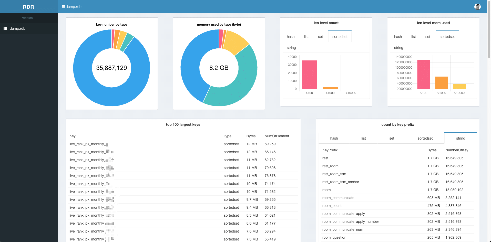

| 版本 | 内容 | 时间                   |
| ---- | ---- | ---------------------- |
| V1   | 新增 | 2023年04月27日00:26:37 |

## 定义

假如由于数据库使用不正确、业务规划不合理等情况都会产生 Big keys 和 Hot keys ，如果未能及时发现并处理热 Key 和大 Key，可能会导致服务性能下降、访问超时、用户体验变差，甚至可能造成实例大范围故障。

### 什么是大 key

大 Key 具体表现为 Redis 中的 Key 对应的 Value 很大，占用 Redis 空间比较大，本质上是大 Value 问题（当然键的大小也占一部分）

| key类型 | 大key标准                                                    |
| ------- | ------------------------------------------------------------ |
| string  | 值为 1MB（数据值太大）                                       |
| set     | 含有的成员数量为 10000 个（成员数量多）                      |
| list    | 含有的成员数量为 10000 个（成员数量多）                      |
| hash    | hash 类型不单单要看成员数量，还需要看单个成员的大小是否过大。<br />比如某个 hash 类型的 key 的成员数量虽然只有 10 个但这些成员的值总大小可能为 100 MB。<br />总的来说成员数量也不要超过 1000 个（成员总体积过大） |
| zset    | 含有的成员数量为 10000 个（成员数量多）                      |
| stream  | 含有的成员数量为 10000 个（成员数量多）                      |

> 上述例子中的具体数值仅供参考，大 key 没有非常明确的边界，需要根据 Redis 的实际业务场景进行综合判断。比如 string 类型的 value 也可以认为 10KB 就是大 key。

### 什么是热 key

热 Key 指一段时间内某个 Key 的访问量远远超过其他的 Key，导致大量访问流量 QPS 集中在某一个 Redis 实例中的特定 Key，或者是带宽使用率集中在特定的 Key，又或者是 CPU 使用占比集中在特定的 Key。

对于大 key 来说，它是热 key 的可能性也很大。

| 类型                            | 案例                                                         |
| ------------------------------- | ------------------------------------------------------------ |
| QPS 集中在特定的 Key            | Redis 实例的总请求 QPS（每秒命令执行次数）为10,000，而其中一个 Key 的每秒访问量达到 7,000 |
| 带宽使用率集中在特定的 Key      | 对一个拥 2000 个成员且总大小为 1 MB的 hash Key 每秒发送大量的 **HGETALL** 操作请求 |
| CPU使用时间占比集中在特定的 Key | 对一个包含 10000 个成员的 zset Key 每秒发送大量的 **ZRANGE** 操作请求 |

## 影响

### 大 key 的影响

常见的影响为：性能下降、访问超时、数据不均衡等

- **Redis 阻塞，访问变慢**（Redis 执行命令是单线程的）
  - 对大 key 执行读请求，可能导致连接输出缓冲区增长比较大（达到 maxmemory 导致返回 OOM Error、数据淘汰），也可能会使 Redis 实例的带宽使用率被占满，导致自身服务变慢，同时易波及相关的服务；
  - 对大 Key 执行删除操作，易造成主库较长时间的阻塞，进而可能引发同步中断或主从切换；
  - 内存不足时，对大 Key 进行驱逐操作或者 **RENAME** 一个大 Key，容易长时间阻塞主库，进而可能引发同步中断或主从切换；
  - 假如内存快达到上限了，这时要存储一个大 key，但是内存不足以存放这个大 key 时，此时可能导致重要的 Key 被逐出，甚至引发内存溢出；
  - 集群扩容迁移时，大Key迁移时可能导致节点卡顿；
- **内存占用不均，实例性能下降**：
  - 集群架构下，存在大 Key 的节点会占用较多内存，集群实例中的内存无法实现均衡占用，易出现内存容量瓶颈，导致集群整体性能下降；
  - 集群架构下，各个节点的带宽使用不均；
- **影响其他的服务：**
  - 大 key 意味着可能会阻塞服务，占用的网络带宽也比较多，除了 Redis 自身性能会变差，还会影响服务器上其他服务或应用；

### 热 key 的影响

- **流量集中，消耗 CPU 和网络资源**：
  - 对某一热点 Key 的请求流量过度集中，会消耗占用大量 CPU 和网络带宽，整体服务性能降低；
  - 集群架构下，请求分配不均，产生数据访问倾斜，即某个节点被大量访问，而其他节点处于空闲状态，可能引起该节点的连接数被耗尽；
  - 出现实例负载不均衡数据倾斜问题，导致其他请求超时无法正常访问。

- **请求超量，易造成缓存击穿，实例宕机业务雪崩**：

  - 在抢购或秒杀场景下，可能因商品对应库存 Key 的请求量过大，超出 Redis 处理能力造成超卖；

  - 热点缓存流量高度集中，超出 Redis 的承受能力，易造成缓存与数据库被击穿，从而引发系统雪崩，拖垮后端数据库服务；

## 产生原因

### 大 key 产生原因

- 业务规划不足：
  - Redis 中的 key-value 键值对设置不当，比如使用 String 类型的 Key 存放大体积二进制文件型数据，造成 key 对应的 value 值特别大；
  - 数据结构使用设计不合理：业务上线前，对业务分析不准确，没有对 Key 中的成员进行合理的拆分，造成个别 Key 中的成员数量过多

- 数据清理策略设置考虑不周：
  - 对于 list，set 这种类型的结构，无效的数据没有及时的清理，造成 Key 中的成员持续不断地增加；


### 热 key 产生原因

- 出现预期外的热点数据（如秒杀商品，某个直播搞活动等），对单个 Key 的访问过于集中或访问量激增，容易导致热 Key 问题，常见于读多写少的场景。

## 怎么定位

### 使用 redis-cli  定位

redis-cli 可以定位大 key 和热 key，需要注意的是定位热 key 需要将内存淘汰策略设置为 lfu 相关的策略。

虽然 redis-cli 可以定位大 key 和热 key，**bigkeys **仅能分析并输入六种数据类型（STRING、LIST、HASH、SET、ZSET、STREAM），而且分析结果比较粗糙，并不能定制化，准确性与时效性比较差。假如需要查找 SET 中超过 10 个成员，redis-cli 做不到。

> Redis 4.0版本起提供了**hotkeys**参数

**（1）定位大 key，使用 `redis-cli --bigkeys` 命令**

```
$ redis-cli  --bigkeys
Warning: Using a password with '-a' or '-u' option on the command line interface may not be safe.

# Scanning the entire keyspace to find biggest keys as well as
# average sizes per key type.  You can use -i 0.1 to sleep 0.1 sec
# per 100 SCAN commands (not usually needed).

[00.00%] Biggest string found so far '"room_current_resting_room_id_3008136564790"' with 19 bytes
[00.00%] Biggest hash   found so far '"room_fans_count_1656497259166040179"' with 1 fields
[00.00%] Biggest zset   found so far '"room_uid_before_list_2932106022955"' with 1 members
.
.
.
[02.45%] Biggest string found so far '"room_current_resting_room_notice_3238765916223"' with 762 bytes
[02.54%] Biggest set    found so far '"room_question_unanswered_list_959213033538715651"' with 52 members
[03.14%] Biggest string found so far '"room_current_resting_room_notice_3418533474321"' with 848 bytes
[03.50%] Sampled 1000000 keys so far
[07.01%] Sampled 2000000 keys so far
[10.07%] Biggest zset   found so far '"live_rank_pk_monthly_31_0"' with 82732 members
[10.51%] Sampled 3000000 keys so far
[12.37%] Biggest list   found so far '"room_weibo_mid_1089455821114310786"' with 10 items
[14.01%] Sampled 4000000 keys so far
[16.73%] Biggest hash   found so far '"user_room_guild_name_back_up_0"' with 41865 fields
[17.52%] Sampled 5000000 keys so far
[21.02%] Sampled 6000000 keys so far
[24.52%] Sampled 7000000 keys so far
[26.47%] Biggest set    found so far '"room_living_list"' with 1326 members
.
.
.
[61.97%] Biggest set    found so far '"room_cv_or_singer_anchor_62_0"' with 5731 members
[63.06%] Sampled 18000000 keys so far
[66.57%] Sampled 19000000 keys so far
[70.07%] Sampled 20000000 keys so far
[70.30%] Biggest zset   found so far '"live_rank_pk_monthly_0"' with 89259 members
[72.61%] Biggest list   found so far '"user_invite_code_list_all_"' with 69 items
[73.35%] Biggest string found so far '"room_quick_barrage_0"' with 1957 bytes
[73.57%] Sampled 21000000 keys so far
[77.08%] Sampled 22000000 keys so far
[80.58%] Sampled 23000000 keys so far
[84.08%] Sampled 24000000 keys so far
[87.59%] Sampled 25000000 keys so far
[91.09%] Sampled 26000000 keys so far
[94.59%] Sampled 27000000 keys so far
[98.10%] Sampled 28000000 keys so far

-------- summary -------

Sampled 28344706 keys in the keyspace!
Total key length in bytes is 1056048328 (avg len 37.26)

Biggest   list found '"user_invite_code_list_all_"' has 69 items
Biggest   hash found '"user_room_guild_name_back_up_0"' has 41865 fields
Biggest string found '"room_quick_barrage_0"' has 1957 bytes
Biggest    set found '"room_cv_or_singer_anchor_62_0"' has 5731 members
Biggest   zset found '"live_rank_pk_monthly_0"' has 89259 members

662803 lists with 725841 items (02.34% of keys, avg size 1.10)
369813 hashs with 544033 fields (01.30% of keys, avg size 1.47)
25690529 strings with 47599480 bytes (90.64% of keys, avg size 1.85)
0 streams with 0 entries (00.00% of keys, avg size 0.00)
680789 sets with 2635996 members (02.40% of keys, avg size 3.87)
940772 zsets with 18737540 members (03.32% of keys, avg size 19.92)
```


**（2）定位热 key，内存淘汰策略是为 lfu 相关的策略才能用哦。**

```
$ redis-cli --hotkeys

# Scanning the entire keyspace to find hot keys as well as
# average sizes per key type.  You can use -i 0.1 to sleep 0.1 sec
# per 100 SCAN commands (not usually needed).

[00.01%] Hot key 'room_count_aliyuns_1330620854714761345' found so far with counter 6
[00.01%] Hot key 'material_ref_count_1677681725523623942' found so far with counter 6
[00.01%] Hot key 'user_used_goods_period_2818771927042_8_0' found so far with counter 1
[00.03%] Hot key 'room_count_aliyuns_1356627835174781025' found so far with counter 6
.
.
.
[15.05%] Hot key 'user_noble_info_3388688834562' found so far with counter 8
[15.34%] Hot key 'noble_good_id_item_5' found so far with counter 9
[17.17%] Hot key 'user_used_goods_period_3300941873154_8_0' found so far with counter 7
[17.90%] Hot key 'user_noble_info_2380811198466' found so far with counter 7
[18.86%] Hot key 'noble_good_id_item_17' found so far with counter 7
[18.96%] Hot key 'user_noble_info_2380810891266' found so far with counter 8
[19.22%] Hot key 'user_noble_info_2846450024450' found so far with counter 7
[21.46%] Hot key 'user_noble_info_2380810952706' found so far with counter 7
[21.51%] Hot key 'user_noble_info_2380811091970' found so far with counter 8
[24.64%] Hot key 'user_noble_info_2834464792578' found so far with counter 8
[26.11%] Hot key 'user_noble_info_2760181399554' found so far with counter 10
[28.23%] Hot key 'user_used_goods_period_2760181399554_8_0' found so far with counter 8
[29.73%] Hot key 'noble_good_id_item_9' found so far with counter 14
[33.59%] Hot key 'user_noble_info_2976759832578' found so far with counter 9
[46.62%] Hot key 'user_noble_info_3154390097922' found so far with counter 8
[49.11%] Hot key 'user_used_goods_period_3393014472706_8_0' found so far with counter 8
[49.76%] Hot key 'noble_good_id_item_13' found so far with counter 11
[54.71%] Hot key 'user_noble_info_2776373985282' found so far with counter 11
[61.59%] Hot key 'user_noble_info_3441588903938' found so far with counter 18
[68.47%] Hot key 'user_noble_info_3393014472706' found so far with counter 15
[76.81%] Hot key 'noble_good_id_item_18' found so far with counter 16
[78.64%] Hot key 'user_used_goods_period_3164295929858_8_0' found so far with counter 9
[86.15%] Hot key 'noble_good_id_item_4' found so far with counter 10
[87.30%] Hot key 'user_noble_info_3441038745602' found so far with counter 9
[90.26%] Hot key 'user_noble_info_2638361001986' found so far with counter 11
[91.27%] Hot key 'noble_good_id_item_2' found so far with counter 14
[97.08%] Hot key 'user_noble_info_3164295929858' found so far with counter 13

-------- summary -------

Sampled 151148 keys in the keyspace!
hot key found with counter: 19  keyname: user_noble_info_3357545799682
hot key found with counter: 18  keyname: user_noble_info_3441588903938
hot key found with counter: 16  keyname: noble_good_id_item_18
hot key found with counter: 15  keyname: user_noble_info_3393014472706
hot key found with counter: 14  keyname: noble_good_id_item_9
hot key found with counter: 14  keyname: noble_good_id_item_2
hot key found with counter: 13  keyname: user_noble_info_3164295929858
hot key found with counter: 11  keyname: noble_good_id_item_13
hot key found with counter: 11  keyname: user_noble_info_2776373985282
hot key found with counter: 11  keyname: user_noble_info_2638361001986
hot key found with counter: 10  keyname: user_noble_info_2760181399554
hot key found with counter: 10  keyname: noble_good_id_item_4
hot key found with counter: 9   keyname: noble_good_id_item_5
hot key found with counter: 9   keyname: user_noble_info_2976759832578
hot key found with counter: 9   keyname: user_used_goods_period_3164295929858_8_0
hot key found with counter: 9   keyname: user_noble_info_3441038745602
```

> 需要注意的是 hot key found with counter 的数字并不代表访问多少次，当让数值越大就表示访问频率越高。在 Redis 中使用一个概率计数算法，具体可以看 https://redis.io/docs/reference/eviction/

### 使用 redis-rdb-tools 工具（离线）

地址：https://github.com/sripathikrishnan/redis-rdb-tools

### 使用 rdr 工具（离线）

地址 https://github.com/xueqiu/rdr

解析一个 2G 的 RDB 文件大概 3 分钟，如下：



### 通过 Redis 命令查看大 key

假如知道某个大 key 的匹配模式，可以使用 SCAN 命令找到对应的 key。然后通过查询成员数量和查询 key 大小的相关命令，来判断具体的大 key。

- 查询成员数量的相关命令：LLEN，HLEN，XLEN，ZCARD，SCARD；
- 查询Key占用内存大小的命令：DEBUG OBJECT，MEMORY USAGE，有阻塞Redis实例的风险；

> 注意：DEBUG OBJECT，MEMORY USAGE 这两个命令比较耗费系统资源，不要在业务压力较大的实例使用该方法，否则可能会对正常业务造成影响。一般我都是在测试环境用这两个命令来预估新业务占用缓存大小的。

### 通过 MONITOR 命令找出热 Key

Redis 的 **MONITOR**命令能够打印Redis中的所有请求，包括时间信息、Client 信息、命令以及 Key 信息。

在发生紧急情况时，可以通过短暂执行 **MONITOR** 命令并将返回信息输入至文件，在关闭 **MONITOR** 命令后，对文件中请求进行归类分析，找出这段时间中的热 Key。

### 观察线上 Redis 监控

实时监控线上 Redis

- **内存利用率**
- **入网最大带宽**
- **出网最大带宽**
- **CPU利用率**
- **Key 增长变化趋势**

例如 Redis 内存使用率超过 70%、Redis 的内存在 1 小时内增长率超过 20 %等。通过此类监控手段，可以提前规避许多问题。

例如 list 数据类型的消费程序故障造成对应 Key 的列表数量持续增长，将告警转变为预警从而避免故障的发生。

## 优化方法

我们应该尽量避免大 key 出现，即使有少量大key，只要使用规范，大部分时候影响也不大。

### 优化大 key

了解大 key 的产生原因后，需要针对不同的数据结构做不同的处理。

| 处理                      | 场景                                                         |
| ------------------------- | ------------------------------------------------------------ |
| 压缩对应的大 Key 的 Value | 通过序列化或者压缩的方法对 value 进行压缩，是其变为较小的 value，但是如果压缩之后如果对应的 value 还是特别大的话，就需要使用拆分的方法进行解决。 |
| 对大 Key 进行拆分         | 可以按照一定的规则将 key 拆分成多个 key：<br />1、按照 key 的哈希值取模（或者别的方式取模）；<br />2、按照业务维度区分，比如时间维度、地域维度等等；<br />3、针对 hash 类型拆分，也可以针对 field 计算哈希值并取模，确定该 field 落在哪个Key上； |
| 对大 Key 进行清理         | 假如某个 key 实在是很大，且不好拆分，说明它并不适合在缓存中存储，将其从 Redis 删除并转移到其他存储；<br />关于删除：<br />1、Redis 4.0 以上可以使用 UNLINK 删除大 key；<br />2、Redis 4.0 以下的需要使用各个数据结构对应的 SCAN 命令逐步删除大 key； |
| 对过期数据进行定期清理    | 主要针对 list 和 set 这种类型，在使用的过程中，某些场景下的 list 和 set 中对应的内容不断增加，但是由于之前存储的已经是无效的了，需要定时的对 list 和 set 进行清理。 |

### 优化热 key

- **使用读写分离架构**，如果热 Key 的产生来自于读请求，那么读写分离是一个很好的解决方案。在使用读写分离架构时，可以通过不断的增加从节点来降低每个 Redis 实例中的读请求压力；（读写分离架构可能会出现主从同步延迟，关于主从同步又可以分为星型架构和链式架构）
- **使用客户端缓存/本地缓存。**假如缓存的数据的时效性要求不高，可以通过增加本地缓存来减少对 Redis 的请求；（本地缓存在集群多节点场景下会遇到**缓存漂移**现象）
- **设计熔断/降级机制。**热 key 极易造成缓存击穿，高峰期请求都直接透传到后端数据库上，从而导致业务雪崩。因此热 key 的优化一定需要设计系统的熔断/降级机制，在发生击穿的场景下进行限流和服务降级，保护系统的可用性。
