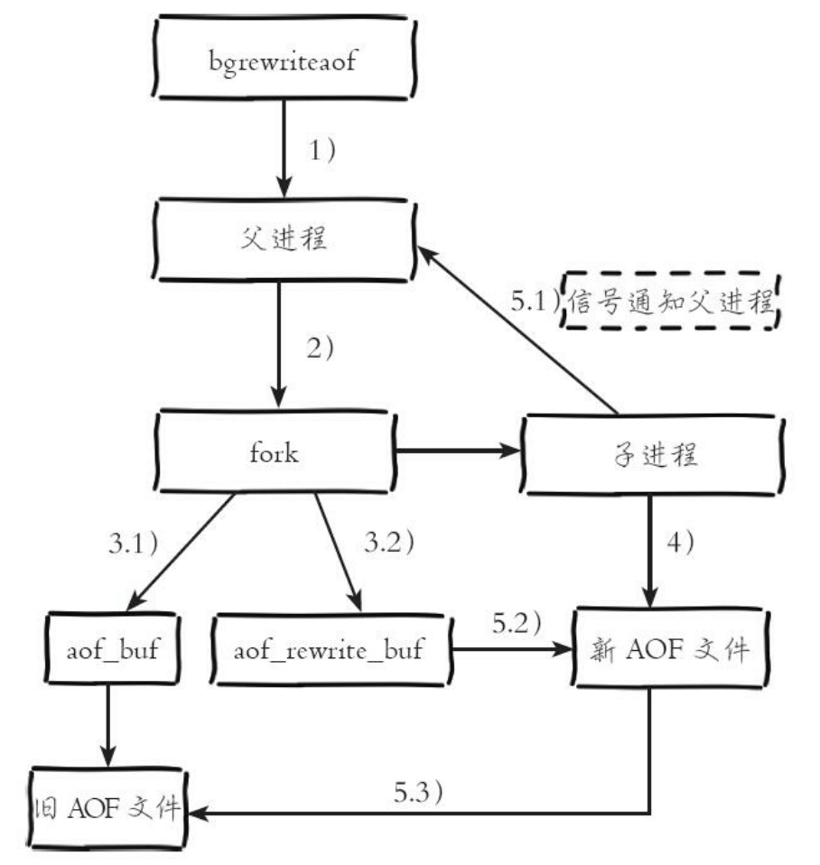

| 版本 | 内容 | 时间                   |
| ---- | ---- | ---------------------- |
| V1   | 新建 | 2023年03月30日01:25:08 |

本文内容来自：

1. https://redis.io/docs/management/persistence/
2. 《Redis 使用手册》 -- 可以
3. 《Redis 开发和运维》-- 很棒
4. 《Redis 深度历险》 -- 建议不看这个
5. 《Redis 5 设计和源码分析》-- 可以

## 持久化分类

Redis 的数据都存在内存里面，如果突然宕机，数据就会全部丢失，在需要的情况下，我们需要将数据持久化到磁盘中。下面是持久化机制的分类：

- **RDB** (Redis Database): RDB persistence performs point-in-time snapshots of your dataset at specified intervals.
- **AOF** (Append Only File): AOF persistence logs every write operation received by the server. These operations can then be replayed again at server startup, reconstructing the original dataset. Commands are logged using the same format as the Redis protocol itself.
- **No persistence**: You can disable persistence completely. This is sometimes used when caching.
- **RDB + AOF**: You can also combine both AOF and RDB in the same instance.

简单来说，RDB 是一种快照模式，每次全量备份，快照是内存数据的二进制序列化形式，存储紧凑。而 AOF 日志是连续的增量备份，记录的是内存数据修改的指令记录文本。

## RDB 持久化

### RDB 持久化

RDB 持久化产生的文件是以 .rdb 后缀结尾，其中 rdb 表示 Redis Database。

Redis 有多种方式创建 RDB 文件：

- SAVE 命令；
- BGSAVE 命令；
- 配置文件配置触发创建 RDB 文件的条件；

### SAVE 命令阻塞服务器创建 RDB 文件

> https://redis.io/commands/save/

```
Available since:1.0.0
Time complexity:O(N) where N is the total number of keys in all databases
ACL categories:@admin, @slow, @dangerous
```

SAVE 命令会阻塞 Redis 服务器进程，直到 RDB 文件创建完毕为止，在服务器进程阻塞期间，服务器不能处理任何命令请求。对于内存比较大的实例会造成长时间阻塞，线上环境不建议使用。

当接收到 SAVE 命令的 Redis 服务器会遍历数据库包含的所有数据库，将各个数据库包含的键值对全部记录到 RDB 文件中。假如之前已经存在 RDB 文件，那么服务器将使用新创建的 RDB 文件替代已有的 RDB 文件。

### BGSAVE 以非阻塞方式创建 RDB 文件

> https://redis.io/commands/bgsave/

```
Available since:1.0.0
Time complexity:O(1)
ACL categories:@admin, @slow, @dangerous
```

BGSAVE 不会直接使用 Redis 服务器进程创建 RDB 文件，而是使用子进程创建 RDB 文件。

Redis 3.0 的流程


- 执行 BGSAVE 命令，Redis 父进程判断当前是否存在正在执行的子进程，如 RDB、AOF 子进程，如果存在 BGSAVE 命令直接返回；
- 父进程执行 fork 操作创建子进程，fork 操作过程中父进程会阻塞，通过 info stats 命令查看 lastest_fork_usec，可以查看最近一个 fork 操作的耗时（微秒）；
- 父进程 fork 完成后，BGSAVE 命令返回 “Background saving started”信息，并不再阻塞父进程，父进程可以继续响应客户端的请求；
- 子进程创建临时的 RDB 文件，根据父进程内存生成临时快照文件，完成后对原有文件进行原子替换。执行 LASTSAVE 命令可以获取最后一次生成 RDB 文件的时间；
- 子进程发送信号给父进程表示创建 RDB 文件完成，使用新的 RDB 文件替换已有的 RDB 文件。更新统计信息，具体可以通过 info persistence 查看；

虽然 BGSAVE 命令不会像 SAVE 命令那样一直阻塞服务器，但是因为 BGSAVE 是 fork 一个子进程来创建 RDB 的，所以当父进程占用的内存数量越大，创建子进程这一操作耗费的时间也会越长，所以 Redis 服务器在执行 BGSAVE 命令的时候也可能会因为 fork 子进程而短暂阻塞。

> 当遇到坏盘或磁盘写满的情况时，可以通过 config set dir 在线修改文件路径到可用的磁盘路径。

### 通过配置自动创建 RDB 文件

配置文件内的配置项

```
save <seconds> <changes>
```

- seconds：指定触发持久化操作所需的时长；
- changes：指定触发持久化操作所需的修改次数；

就是说如果服务器在 seconds 秒的时间内，对各个数据库总共执行了至少 changes 次修改，服务器就会自动执行一次 BGSAVE。

Redis 5 的配置文件中默认的配置，只要下面任意一个条件满足时，就会触发一次 BGSAVE。

```
save 900 1
save 300 10
save 60 10000
```

> 注意：为了避免由于同时使用多个触发条件导致服务器过于频繁的执行 BGSAVE，服务器每次成功创建 RDB 文件之后，负责自动触发 BGSAVE 命令的时间计数器以及修改次数计数器都会被清零，重新开始计算。

### RDB 持久化的原理

一般都是使用 BGSAVE 来完成持久化操作的。Redis 会调用 glibc 的 fork 函数产生一个子进程，RDB 持久化由这个子进程来处理，父进程继续处理客户端的请求。子进程刚刚产生时，它和父进程共享内存里面的代码段和数据段。

Redis 需要一边持久化，一边响应客户端的请求。持久化操作的同时，内存的数据结构还在改变。这时候需要使用 COW（Copy on Write）机制来实现 RDB 的持久化。

数据段是一个由多个操作系统的页面（4KB）组成的，当父进程对其中的一个页面的数据进行修改时，会将被共享的页面复制一份分离出来，然后对这个复制的页面进行修改。这时子进程相应的页面是没有变化的，还是进程产生时的那一瞬间的数据。

随着父进程修改操作的持续进行，越来越多的共享页面被分离出来，内存就会持续增长，但是也不会超过原有数据内存的 2 倍。另外 Redis 实例里面的冷数据的比例比例也是很高的，所以很少会出现所有页面都被分离的情况。

### RDB 文件结构 - 本节基于 Redis 5

#### RDB 文件的总体结构

```
+-------------------------------------------------------------------------------+
| RDB文件标识符 | 版本号 | 设备附加信息 | 数据库数据 | Lua 脚本缓存 | EOF | CRC64 校验和 |
+-------------------------------------------------------------------------------+
```


- **RDB 文件标识符**

  就是 “REDIS” 这 5 个字符。Redis 在加载的时候通过这个标识符判断当前文件是否是 RDB 文件；

- **RDB 版本号**

  4 个字节，是 RDB 的版本号，不是 Redis 的版本号。假如 RDB 版本是第 9 版，那么这个位置就是“0009”。

  新版的 Redis 服务器是能够向下兼容旧版的 Redis 服务器生成的 RDB 文件的；

- **设备附加信息**

  RDB 文件的设备附加信息记录了生成 RDB 文件的 Redis 服务器及其所在平台的信息，例如服务器的版本号，宿主机的架构、创建 RDB 文件时的时间戳、服务器占用的内存数量等；

- **数据库数据**

  数据库数据部分记录了 Redis 服务器存储的 0 个或者任意多个数据库的数据，当这个部分包含的多个数据库的数据时，各个数据库将按照数据库号码大小从小到大进行排列；

- **Lua 脚本缓存**

  如果 Redis 服务器启用了复制功能，那么服务器将在 RDB 文件会在这里保存所有已被缓存的 Lua 脚本。这样，从服务器在载入 RDB 文件完成数据同步之后，就可以继续执行主服务器发过来的 EVALSHA 命令了；

- **EOF**

  标记 RDB 正文内容结尾，实际值“0xFF”；

- **CRC64 校验和**

  RDB 文件末尾是一个以无符号 64 位整数表示 CRC64 校验和。Redis 服务器在读入 RDB 文件时会通过这个校验和来快速的检查 RDB 文件是否有出错或者损坏的情况出现；

#### 数据库数据部分

前面说过 RDB 数据库部分包含了任意多个数据库的数据，其中每个数据库的由下面这个组成

```
+-------------------------------------------------------------+
| 数据库编号 | 键值对总数量 | 带有过期时间的键值对数量 | 键值对数据部分 |
+-------------------------------------------------------------+
```

- Redis 在读取 RDB 文件的数据时，会根据「数据库编号」来切换到对应的数据库；
- Redis 根据「键值对总数量」和「带有过期时间的键值对数量」尽可能通过最优的方式创建数据库的内部数据结构；
  - Redis的每个数据库是一个散列表，这个字段指明当前数据库散列表的大小。这样在加载时可以直接将散列表扩展到指定大小，提升加载速度；
  - Redis的过期时间也是保存为一个散列表，该字段指明当前数据库过期时间散列表的大小；
- 最后 RDB 以无序方式记录数据库包含的所有键值对；

#### 键值对部分

每个键值对最多会被划分为 5 个部分

```
+-----------------------------------------------------------------+
| 过期时间（可选） | LRU 信息（可选）或 LFU 信息（可选） | 类型 | 键 | 值 |
+-----------------------------------------------------------------+
```

- 过期时间可选，根据具体的键是否有过期时间；
- LRU 或者 LFU 根据 Redis 的淘汰算法决定；
- Redis 数据类型和底层编码结构；
- 键保存为字符串；
- 值根据数据类型和编码结构保存为不同的形式；


#### 键的保存形式

Redis中键都是字符串，一般的存储形式如下

```
+-------------------------------+
| 键的长度 Length | 字符串 String |
+-------------------------------+
```


假如键的长度统一用固定长度 8 字节表示，那就有点浪费。所以 Redis 采用了变长的方式来表示字符串占用了多少位。通过首字节能够知道LENGTH字段有多长，然后读取LENGTH字段可以知道具体的STRING长度。

- `00xxxxxx`：字符串长度小于 64
- `01xxxxxx xxxxxxxx ` ：字符串长度小于 16384
- `10000000 xxxxxxxx xxxxxxxx xxxxxxxx xxxxxxxx ` ：字符串长度 int 最大值
- `10000001 xxxxxxxx xxxxxxxx xxxxxxxx xxxxxxxx xxxxxxxx xxxxxxxx xxxxxxxx xxxxxxxx `：字符串长度 long 最大值

```
00xxxxxx 字符串长度小于 64
01xxxxxx xxxxxxxx 字符串长度小于 16384
10000000 xxxxxxxx xxxxxxxx xxxxxxxx xxxxxxxx 字符串长度 int 最大值
10000001 xxxxxxxx xxxxxxxx xxxxxxxx xxxxxxxx xxxxxxxx xxxxxxxx xxxxxxxx xxxxxxxx 字符串长度 long 最大值
```

RDB中对字符串的保存还有两种优化形式：

一种是尝试将字符串按整型保存，一种是通过将字符串进行 LZF 压缩之后保存。

字符串整型保存：

```
+---------------------------+
| 整型的类型 type | 字符串 int |
+---------------------------+
```


```
11000000 xxxxxxxx    取值范围[-128,127]
11000001 xxxxxxxx xxxxxxxx  取值范围[-32768,32767]
11000010 xxxxxxxx xxxxxxxx xxxxxxxx xxxxxxxx  取值范围[-2147483648, 2147483647 
```


字符串 LZF 压缩保存：

```
+-------------------------------------------------------------+
| type | 压缩之后的长度 | 压缩之前原始字符串的长度 | LZF压缩之后的数据 |
+-------------------------------------------------------------+
```


TYPE首字节头两个比特仍然为11，后六个比特是000011。

#### 值的保存形式

值的类型有 9 种，字符串类型和上面的键的类型保存方式一致。

**（1）list 保存形式**

quicklist 结构，从整体看是一个双向链表，但链表的每个节点在 Redis 中编码为 zipList 结构，ziplist 结构在一块连续的内存中保存，并且保存时可以选择进行 LZF 压缩或者不压缩。


首先保存 quicklist 的节点个数，保存方式同图20-5中LENGTH字段的保存。

- 如果 ziplist 未进行压缩，则将每个 ziplist 按字符串保存；
- 如果 ziplist 进行了压缩，则将每个ziplist按 LZF 进行保存；


**（2）set 保存形式**

集合类型在Redis中有两种编码方式：一种为intset，另一种为Hash。

intset 在 Redis 中也是一块连续的内存，所以 intset 的保存比较简单，直接将 intset 按字符串保存。

如果编码为Hash，则保存结构如下：


第一个字段为字典的大小，接下来逐字段保存字典的键。为什么只保存键呢？其实集合类型使用散列表保存时只使用了键，所有的值都保存为 NULL，所以此处只需要保存散列表的键。


**（3）zset 保存形式**

有序集合类型在 Redis 中也有两种编码方式：一种为 ziplist，另一种为 skiplist。

如果编码为 ziplist，即将 ziplist 整体作为一个字符串保存。

 skiplist 的保存方式如下：


第一个字段为skiplist包含的元素个数，接着分别按元素和元素的分值依次保存。元素保存为字符串，元素分值保存为一个双精度浮点数类型（固定为8个字节）。


**（4）hash 保存形式**

散列类型也有两种编码方式：一种为 ziplist，一种 hash。

ziplist 编码方式的保存同有序集合，

hash 结构如下如下


第一个字段为散列表的大小，然后依次保存键值对，键值都保存为字符串类型。


**(5) stream 保存形式**

Stream保存为RDB文件时整体格式


其中保存消费组的PEL时并没有保存相关消费者的信息，而是在加载完消费者之后，从消费者的PEL中查找并更新消费组PEL的相关信息

### 加载 RDB 文件

当 Redis 服务器启动时，会在工作目录中查找是否有 RDB 文件，如果有就会打开它，然后读取文件的内容并执行下面的操作：

- 检查文件开头的标识符是否是“REDIS”；
- 检查 RDB 文件的 RDB 的版本，用于判断当前版本的 Redis 能否加载这个 RDB 文件；
- 根据文件中记录的设备附加信息，执行相应的操作和设置；
- 检查文件的数据库数据部分是否为空，如果不为空就去尝试加载
  - 根据数据库编号，切换到对应的数据库；
  - 根据键值对总数量和带过期时间的键值对总数量，设置数据库的底层结构；
  - 依次载入所有键值对数据；
- 如果服务器开启了复制功能，需要将之前缓存的 Lua 脚本重新载入到缓存中；
- 遇到 EOF 标志，表示 RDB 文件已经读取完毕；
- 校验文件末尾的 CRC64 校验和，判断是否和加载期间计算得到的 CRC64 的值是否相等，用来判断加载的数据是否完好无损；
- RDB 文件加载完成，开始接收服务端的请求；

### RDB 优缺点

**RDB 持久化的优点：**

1. RDB 是一个进紧凑的二进制文件，代表某个时间点上的数据快照。非常适合备份，全量复制等场景。我们可以每隔几个小时执行 bgsave 备份；
2. Redis 加载 RDB 文件恢复数据的速度比 AOF 的方式快很多；


**RBD 持久化的缺点**

1. 使用 RDB 持久化策略，可能会丢失几分钟的数据。因为 RDB 是一种时间点快照（point-in-time snapshot），对于 RDB 持久化来说，服务器停机时丢失的数据量取决于最后一次成功执行 RDB 持久化操作的开始执行时间。
2. 为了使用子进程持久化到磁盘，RDB 需要经常调用 fork()。如果数据集很大，fork() 可能会耗费很长时间，并且如果数据集非常大且 CPU 性能不太好，则可能导致 Redis 在几毫秒甚至一秒钟内停止为客户端提供服务；


## AOF 持久化

RDB 是全量式的持久化，而 AOF 是增量式持久化。核心原理：服务器每次执行完写命令之后，都会以协议文本的方式将被执行的命令追加到 AOF 文件的末尾。在服务器停机之后，只要重新执行 AOF 文件中保存的命令，就可以将数据库恢复到停机之前的状态。

Redis 在收到客户端修改指令之后，进行参数校验、逻辑处理，如果没有问题就立即将该指令文本存储到 AOF 日志中，也就是说先执行指令再将日志落盘。

随着时间 AOF 的日志会越来越长，Redis 提供了重写功能，该功能能够生成一个全新的 AOF 文件，并且文件中只包含恢复当前数据库所需的尽可能少的命令。

AOF 文件在 7.0.0 的时候，原来的单个 AOF 文件被分成基础文件（最多一个）和增量文件（可能有多个）

> 官网原文：Since Redis 7.0.0, Redis uses a multi part AOF mechanism. That is, the original single AOF file is split into base file (at most one) and incremental files (there may be more than one). The base file represents an initial (RDB or AOF format) snapshot of the data present when the AOF is [rewritten](https://redis.io/docs/management/persistence/#log-rewriting). The incremental files contains incremental changes since the last base AOF file was created. All these files are put in a separate directory and are tracked by a manifest file.

### AOF 工作流程

Redis 3.0 的流程


1. 所有的写入命令会追加到 aof_buf（ 缓冲区）中；
2. AOF 缓冲区根据对应的策略向硬盘做同步操作；
3. 随着 AOF 文件越来越大， 需要定期对 AOF 文件进行重写， 达到压缩的目的；
4. 当 Redis 服务器重启时， 可以加载 AOF 文件进行数据恢复；

> AOF 文件存的就是 Redis 协议格式

### AOF 文件刷新频率

为什么要把命令先写入到一个缓冲区中呢？因为如果每次都把 AOF 文件命令都直接刷新到磁盘，性能很低。一般的操作时，将对硬盘的多次写入操作优化成一次写入操作，当程序调用 write 系统调用对文件进行写入时，系统会将数据写入位于内存的缓冲区中，等到指定的时长或者满足某些写入条件时，系统才会执行 flush 系统调用，将缓冲区中的数据刷新到磁盘。

Redis 提供了三种 AOF 文件刷新频率的配置，由参数 appendfsync 控制：

- always：每执行一个写命令，就对 AOF 文件执行一次刷新操作。也就是命令写入缓冲区后调用系统调用 fsync 操作同步到 AOF 文件，fsync 后线程立即返回；
- everysec：每隔 1s，就对 AOF 文件执行一次刷新操作。也就是命令写入缓冲区后调用系统调用 write 操作，write 完后线程返回。 fsync 同步到 AOF 文件的操作有专门的线程控制 1s 一次；
- no：不主动对 AOF 进行刷新操作，由操作系统决定什么时候对 AOF 进行刷新。也就是命令写入缓冲区后调用系统调用 write 操作，write 完后线程返回。 不对 AOF 文件做 fsync 操作，同步到磁盘的操作由操作系统控制，一般同步周期最长 30 秒；

fsync 针对单个文件操作，做强制磁盘同步，fsync 将阻塞直到写入硬盘完成后返回，保证了数据的持久化。

### AOF 重写

随着命令不断写入 AOF 文件，AOF 文件会越来越大，Redis 使用重写机制压缩文件体积。AOF 文件重写是把 Redis 进程内的数据转化为写命令同步到新的 AOF 文件的过程；

为什么 AOF 文件可以压缩呢？

如果对相同的键执行过多次修改，那么 AOF 文件中会出现多个冗余命令；多条写命令可以合并成一个，例如 lpush list a、lpush list b、lpush list c 可以转化为  lpush list a b c。为了防止单条命令过大造成客户端缓冲区溢出，对于 list、 set、 hash、 zset 等类型操作， 以 64 个元素为界拆分为多条。

AOF 重写同样是基于 copy-on-write 实现的。

> Since Redis 7.0.0, when an AOF rewrite is scheduled, the Redis parent process opens a new incremental AOF file to continue writing. The child process executes the rewrite logic and generates a new base AOF. Redis will use a temporary manifest file to track the newly generated base file and incremental file. When they are ready, Redis will perform an atomic replacement operation to make this temporary manifest file take effect. In order to avoid the problem of creating many incremental files in case of repeated failures and retries of an AOF rewrite, Redis introduces an AOF rewrite limiting mechanism to ensure that failed AOF rewrites are retried at a slower and slower rate.

#### BGREWRITEAOF 命令

> https://redis.io/commands/bgrewriteaof/

```
Available since:1.0.0
Time complexity:O(1)
ACL categories:@admin, @slow, @dangerous
```

通过 BGREWRITEAOF 显示触发 AOF 重写操作。是一个异步命令，Redis 服务器接收到这个命令之后会创建出一个子进程，由它扫描整个数据库并生成新的 AOF 文件。当

Redis 3.0 的流程



1. 执行 AOF 重写请求
   1. 如果当前进程正在执行 AOF 重写，请求不执行，返回 ERR Background append only file rewriting already in progress；
   2. 如果当前进程正在执行 bgsave 操作，重写命令延迟到 bgsave 完成之后再执行。返回 Background append only file rewriting scheduled；
2. 父进程 fork 创建子线程，开销等于 bgsave 过程；
3. fork 操作完成后
   1. 主线程 fork 操作完成后，继续响应其他命令。所有修改命令写入 AOF 缓冲区，并根据 appendfsync 策略同步到磁盘，保证原有 AOF 机制的正确性；
   2. 由于 fork 操作运用  copy-on-write  技术，子进程只能共享 fork 操作时的内存数据。由于父进程依然响应命令，Redis 使用 AOF 重写缓冲区保存这部分新数据，防止新 AOF 文件生成期间丢失这部分数据；
4. 子进程根据内存快照，按照命令合并规则写入到新的 AOF 文件。每次批量写入磁盘数据量由配置 aof-rewrite-incremental-fsync 控制，默认为 32MB，防止单次刷盘数据造成硬盘阻塞；
5. 新 AOF 文件完成
   1. 新 AOF 文件写入完成后，子进程发送信号给父进程，父进程更新统计信息；
   2. 父进程把 AOF 重写缓冲区的数据写入到新的 AOF 文件；
   3. 使用新的 AOF 文件替换老文件，完成 AOF 重写；

> 如果用户发送 BGREWRITEAOF 命令请求时，服务器正在创建 RDB 文件，那么服务器将把 AOF 重写操作延迟后到 RDB 文件创建完毕之后再执行，从而避免两个写硬盘操作同时执行导致机器性能下降；如果服务器在执行重写操作过程中，有接收到了新的 BGREWRITEAOF 命令请求时，那么服务器会直接返回一个错误信息；

官网的解释：

**Redis < 7.0**

- AOF can use a lot of memory if there are writes to the database during a rewrite (these are buffered in memory and written to the new AOF at the end).
- All write commands that arrive during rewrite are written to disk twice.
- Redis could freeze writing and fsyncing these write commands to the new AOF file at the end of the rewrite.

关于 Redis 7.0 以上的 AOF 重写流程是不一样了，因为 AOF 文件分成了多个，具体见官网。

#### AOF 重写配置选项

打开 aof 持久化功能：appendonly yes；

可以通过设置下面两个配置选项让 Redis 自动触发 BGREWRITEAOF。

```
auto-aof-rewrite-percentage 100
auto-aof-rewrite-min-size 64mb
```

auto-aof-rewrite-min-size 表示运行AOF重写时文件最小体积。

auto-aof-rewrite-min-size 控制触发自动 AOF 文件重写所需的文件体积增大比例，假如配置的是 100，表示如果当前 AOF 文件的体积比上一次 AOF 文件重写之后的体积增大了 100%，那么将自动执行一次 BGREWRITEAOF 命令。

### 文件校验

加载损坏的 AOF 文件时会拒绝启动， 对于错误格式的 AOF 文件， 先进行备份， 然后采用 redis-check-aof --fix 命令进行修复， 修复后使用 diff-u 对比数据的差异， 找出丢失的数据， 有些可以人工修改补全。

#### 文件尾部损坏

AOF 文件可能存在结尾不完整的情况， 比如机器突然掉电导致 AOF 尾部文件命令写入不全。 Redis 为我们提供了aof-load-truncated 配置来兼容这种情况， 默认开启。 加载 AOF 时， 当遇到此问题时会忽略并继续启动， 同时打印如下警告日志：

```
* Reading RDB preamble from AOF file...
* Reading the remaining AOF tail...
# !!! Warning: short read while loading the AOF file !!!
# !!! Truncating the AOF at offset 439 !!!
# AOF loaded anyway because aof-load-truncated is enabled
```

可以执行以下步骤：

- 备份您的 AOF 文件。

- 使用 Redis 附带的 redis-check-aof 工具修复原始文件

  ```
  $ redis-check-aof --fix <filename>
  ```

- 可选择使用 diff -u 检查两个文件之间的差异。 

- 使用解决后的文件重新启动服务器。

#### 文件中间损坏

如果 AOF 文件不仅被截断，而且在中间被无效字节序列损坏，事情会更复杂。 Redis 会在启动时报错并中止：

```
* Reading the remaining AOF tail...
# Bad file format reading the append only file: make a backup of your AOF file, then use ./redis-check-aof --fix <filename>
```

最好的做法是首先运行 redis-check-aof 程序，不使用 --fix s选项，然后了解问题，跳转到文件中给定的偏移量，并查看是否可以手动修复文件：AOF 使用与 Redis 协议相同的格式，手动修复相当简单。否则，可以让程序为我们修复文件，但在这种情况下，从无效部分到文件末尾的所有 AOF 部分可能会被丢弃，如果损坏发生在文件的初始部分，则可能导致大量数据丢失。

### AOF 的优缺点

优点就是 AOF 持久化的安全性要高很多，通过使用 everysec 选项，用户可以将数据丢失的时间限制在 1s 以内。

缺点：

- AOF 存储的是协议文本，所以体积会比相同数据量的 RBD 文件要大很多，并且生成 AOF 文件需要的时间也比 RDB 文件要长；
- RDB 的恢复数据的速度要比 AOF 块很多。因为 RDB 是直接的数据恢复操作，AOF 是间接的数据恢复操作，它要通过执行命令来恢复数据；
- AOF 重写命令 BGREWRITEAOF 和 RBD 使用的 BGSAVE 命令一样都要创建子进程，索引数据库体积比较大的情况下，进行 AOF 文件重写将占用大量资源，并导致服务器被短暂阻塞；

## RDB-AOF 混合持久化

开启混合持久化，前提是打开 AOF 持久化功能了，然后将下面的值设置了 yes

```
aof-use-rdb-preamble <value>
```

那么服务器在执行 AOF 重写时，就会像执行 BGSAVE 命令那样，根据数据库当前的状态生成出相应的 RDB 数据，并且将这些数据写入新建的 AOF 文件中，至于那些在 AOF 重写开始之后执行的 Redis 命令，则会继续以协议文本的方式追加到新 AOF 文件的末尾，也就是已由的 RDB 数据的后面。

```
| RDB 数据 | AOF 数据 |
```

当一个支持 RDB-AOF 混合持久化模式的 Redis 服务器启动并载入 AOF 文件时，它会检查 AOF 文件的开头是否包含了 RDB 格式的内容；

- 如果包含，那么服务器会先加载开头的 RDB 数据，然后再加载之后的 AOF 数据；
- 如果 AOF 文件只包含 AOF 数据，那么服务器会直接加载 AOF 数据；

## 同时使用 RDB 持久化和 AOF 持久化

如果是 Redis 4.0 之前的版本

1. 同时使用两种持久化功能会耗费大量的系统资源；
2. Redis 服务器在启动时，会优先使用 AOF 文件进行数据恢复，只有在没有检测到 AOF 文件时，才会考虑寻找并使用 RDB 文件进行数据恢复；
3. 当 Redis 服务器正在后台生成新的 RDB 文件时，如果有用户向服务器发送 BGREWRITEAOF 命令，或者配置选项中设置的 AOF 重写条件满足了，那么服务器将把 AOF 重写操作推迟到 RDB 文件创建完毕之后再执行，以此来避免两种持久化操作同时执行并争抢系统资源；
4. 当服务器正在执行 BGREWRITEAOF 命令时，用户发送或者被触发 BGSAVE 命令也会推迟打破 BGREWRITEAOF 命令执行完毕之后再执行；

## SHUTDOWN 关闭服务器

默认情况下，当 Redis 服务器接收到 SHUTDOWN 命令时，它将执行下面的动作：

1. 停止处理客户端发送的命令请求；
2. 根据服务器的持久化配置选项，决定是否执行数据保存操作；
   1. 如果服务器启动了 RDB 持久化，并且数据库距离最后一次成功创建 RDB 文件之后发生了变化，那么服务器将执行 SAVE 命令，创建一个新的 RDB 文件；
   2. 如果服务器启用了 AOF 持久化，或者混合持久化，那么它将刷新 AOF 文件，确保所有已执行的命令都被记录到 AOF 文件中；
   3. 如果服务器没有开启持久化功能，就不保存数据；
3. 服务器进程退出；


SHUTDOWN 命令也支持参数 

```
SHUTDOWN [save|nosave]
```

如果给定的是 save 参数，那么无论服务器是否开启持久化功能，也会进行一次持久化操作。

| 持久化配置            | SHUTDOWN save 的行为                                         |
| --------------------- | ------------------------------------------------------------ |
| 未开启持久化功能      | SAVE 命令                                                    |
| 只开启了 RDB          | SAVE 命令                                                    |
| 只开启了 AOF          | 刷新 AOF 文件，确保所有已执行命令都被记录到 AOF 文件         |
| 开启了混合持久化      | 刷新 AOF 文件，确保所有已执行命令都被记录到 AOF 文件         |
| 同时开启了 RDB 和 AOF | 刷新 AOF 文件，确保所有已执行命令都被记录到 AOF 文件，然后执行 SAVE 命令 |

## 持久化相关的配置项

| 配置项                      | 实例 or 可选值                                 | 功能       | 含义                                                         |
| --------------------------- | ---------------------------------------------- | ---------- | ------------------------------------------------------------ |
| save                        | save 900 1<br />save 300 10<br />save 60 10000 | RDB        | RDB 持久化配置，三个策略<br />1、如果 15 分钟内至少有 1 个 key 发生改变了就持久化一次<br />2、如果 5 分钟内至少有 10 个 key 发生改变了就持久化一次<br />3、如果 1 分钟内至少有 10000 个 key 发生改变了就持久化一次<br />可以通过注释掉这几行 save，来禁用掉 RDB 功能，或者使用 save "" 来禁用掉 |
| stop-writes-on-bgsave-error | yes/no                                         | RDB        | 指当执行BGSAVE时发生错误，redis会停止写入操作。BGSAVE是redis将内存中的数据存储到磁盘上的一种操作，如果在这个过程中出现了错误，redis就会停止接收写入请求，以保证数据不丢失。如果你希望在BGSAVE时发生错误时，redis仍然能继续接收写入请求，可以将stop-writes-on-bgsave-error设置为no。但是这种指标不治本，我们得排查为什么BGSAVE失败，可以去查看 redis 日志看看具体是什么原因导致 bgsave 失败的（配置项 logfile 配置的日志路径） |
| rdbcompression              | yes/no                                         | RDB        | 执行 RDB 快照时是否开启字符串 LZF 压缩                       |
| rdbchecksum                 | yes/no                                         | RDB        | 从RDB的第5个版本开始，在文件末尾添加了一个CRC64校验和。这使得格式更加抗损坏，但在保存和加载RDB文件时会付出性能代价（大约10％），因此您可以禁用它以获得最大性能。在禁用校验和的情况下创建的RDB文件的校验和为零，这将告诉加载代码跳过检查。 |
| dbfilename                  | dump.rdb                                       | RDB        | 指定 RDB 的文件名                                            |
| dir                         | ./                                             | RDB 和 AOF | 指定 RDB 文件和 AOF 文件的存放位置，必须是目录名             |
| appendonly                  | yes/no                                         | AOF        | 是否开启 AOF 持久化                                          |
| appendfilename              | appendonly.aof                                 | AOF        | AOF 文件名                                                   |
| appendfsync                 | always/everysec/no                             | AOF        | AOF 文件刷盘频率                                             |
| no-appendfsync-on-rewrite   | yes/no                                         | AOF        | AOF重写时会消耗大量硬盘IO。默认关闭。 表示在AOF重写期间不做fsync操作。 |
| auto-aof-rewrite-percentage | 100                                            | AOF        | 触发 AOF 重写的体积的增大比例                                |
| auto-aof-rewrite-min-size   | 64mb                                           | AOF        | 触发 AOF 重写的最小体积                                      |
| aof-load-truncated          | yes/no                                         | AOF        | AOF文件以追加日志的方式生成，所以服务端发生故障时可能会有尾部命令不完整的情况。开启该参数后，在此种情况下，AOF文件会截断尾部不完整的命令然后继续加载，并且会在日志中进行提示。如果不开启该参数，则加载AOF文件时会打印错误日志，然后直接退出。需要注意的是，AOF 文件中间出现错误时，服务器还是会报错并退出的。这配置项只是控制 AOF 文件末尾的指令是否被截断 |
| aof-use-rdb-preamble        | yes/no                                         | AOF        | 是否开启混合持久化                                           |
