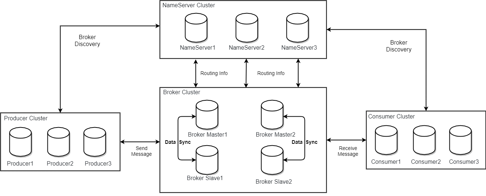
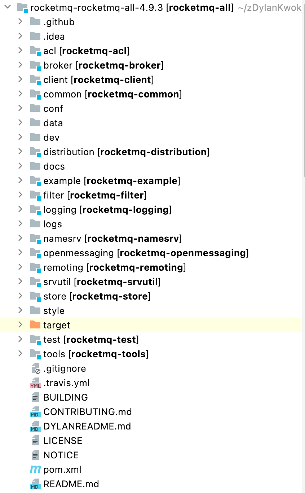
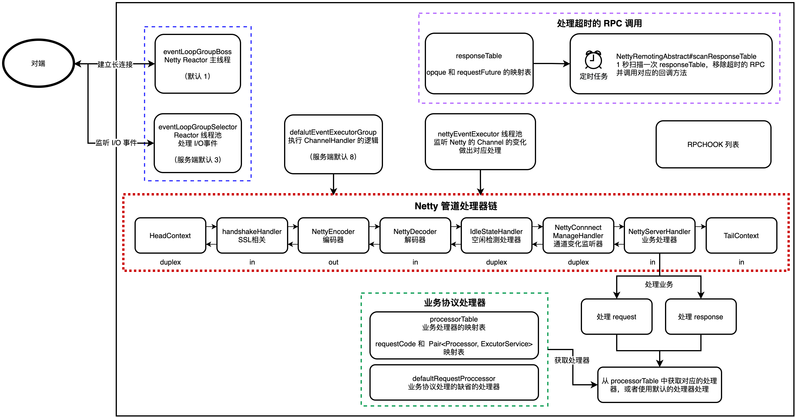
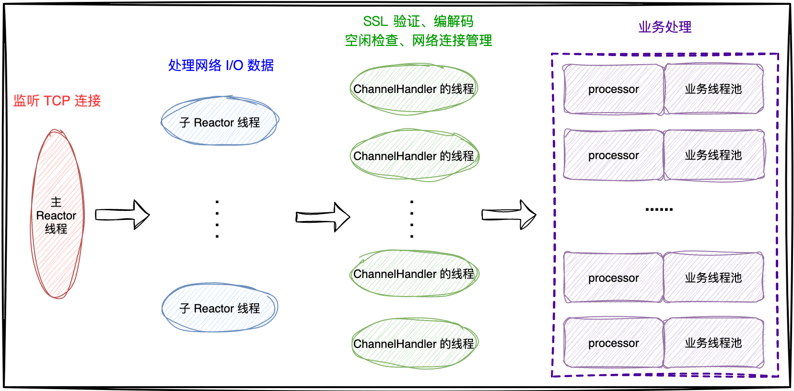

| 版本 | 内容                | 时间                   |
| ---- | ------------------- | ---------------------- |
| V1   | RocketMQ 整体架构   | 2023年06月07日23:40:43 |
| V2   | RocetMQ网络通信原理 | 2023年06月16日13:44:32 |

**本次分析的 RocketMQ 的版本是 4.9.3**

## RocketMQ 整体架构（来自官网）

RocketMQ架构上主要分为四部分，如上图所示。

- 每个 **Broker** 与 **NameServer** 集群中的所有节点建立长连接，定时注册 Topic 信息到所有 NameServer；
- **Producer** 与 **NameServer** 集群中的其中一个节点建立长连接，定期从 NameServer 获取 Topic 路由信息，并向提供 Topic 服务的 Master 建立长连接，且定时向 Master 发送心跳。Producer 完全无状态；
- **Consumer** 与 **NameServer** 集群中的其中一个节点建立长连接，定期从 NameServer 获取 Topic 路由信息，并向提供 Topic 服务的 Master、Slave 建立长连接，且定时向 Master、Slave发送心跳。Consumer 既可以从 Master 订阅消息，也可以 Slave 订阅消息；

### Producer

消息发布的角色，支持分布式集群方式部署。Producer 通过 MQ 的负载均衡模块选择相应的 Broker 集群队列进行消息投递，投递的过程支持快速失败并且低延迟；

### Consumer

Consumer：消息消费的角色：

1. 支持分布式集群方式部署；
2. 支持以 push 推，pull 拉两种模式对消息进行消费；
3. 同时也支持集群方式和广播方式的消费；
4. 它提供实时消息订阅机制，可以满足大多数用户的需求；

### NameServer

NameServer：NameServer 是一个非常简单的 Topic 路由注册中心，其角色类似 Dubbo 中的 zookeeper，支持 Topic、Broker 的动态注册与发现。

主要包括两个功能：

1. Broker 管理，NameServer 接受 Broker 集群的注册信息并且保存下来作为路由信息的基本数据。然后提供心跳检测机制，检查 Broker 是否还存活；
2. 路由信息管理，每个 NameServer 将保存关于 Broker 集群的整个路由信息和用于客户端查询的队列信息。然后 Producer 和 Consumer 通过 NameServer 就可以知道整个 Broker 集群的路由信息，从而进行消息的投递和消费；

NameServer 几乎无状态节点，因此可集群部署，节点之间无任何信息同步。Broker 是向每一台 NameServer 注册自己的路由信息，所以每一个 NameServer 实例上面都保存一份完整的路由信息。当某个 NameServer 因某种原因下线了，Broker 仍然可以向其它 NameServer 同步其路由信息， Producer 和 Consumer 仍然可以动态感知 Broker 的路由的信息；

### BrokerServer

BrokerServer：Broker 主要负责消息的存储、投递和查询以及服务高可用保证，为了实现这些功能，Broker 包含了以下几个重要子模块。

1. Remoting Module：整个 Broker 的实体，负责处理来自 Client 端的请求；
2. Client Manager：负责管理客户端( Producer / Consumer )和维护 Consumer 的 Topic 订阅信息；
3. Store Service：提供方便简单的 API 接口处理消息存储到物理硬盘和查询功能；
4. HA Service：高可用服务，提供 Master Broker 和 Slave Broker 之间的数据同步功能；
5. Index Service：根据特定的 Message key 对投递到Broker的消息进行索引服务，以提供消息的快速查询；

Broker 的部署：在 Master-Slave 架构中，Broker 分为 Master 与 Slave。一个 Master 可以对应多个 Slave，但是一个 Slave 只能对应一个 Master。Master 与 Slave 的对应关系通过指定相同的 BrokerName，不同的 BrokerId 来定义，BrokerId为 0 表示 Master，非 0 表示 Slave。Master 也可以部署多个。

## 源码包

- acl：权限控制模块；
- broker：broker模块（broker启动进程）；
- client：消息客户端，包含消息生产者和消息消费者相关类；
- common：公共包；
- dev：开发者信息（非源码）；
- distribution：打包分发目录（非源码）；
- example：RocketMQ示例代码；
- filter：消息过滤相关基础类；
- logappender：日志实现相关类；
- logging：自主实现日志相关类；
- namesrv：NameServer实现相关类（NameServer启动进程）；
- openmessaging：消息开放标准，已发布；
- remoting：远程通信模块，基于Netty；
- srvutil：服务器工具类；
- store：消息存储实现相关类；
- style：checkstyle相关实现；
- test：测试相关类；
- tools：工具类，监控命令相关实现类；

## RocketMQ 网络通信原理

### 通信角色（来自官网）

RocketMQ 消息队列集群主要包括 NameServer、Broker(Master/Slave)、Producer、Consumer 4个角色，基本通讯流程如下：

1.  Broker 启动后需要完成一次将自己注册至 NameServer 的操作。随后每隔 30s 时间向 NameServer 上报 Topic 路由信息（心跳）；
2.  消息生产者 Producer 作为客户端发送消息时候，需要根据消息的 Topic 从本地缓存的 TopicPublishInfoTable 获取路由信息。如果没有则更新路由信息会从 NameServer 上重新拉取，同时 Producer 会默认每隔 30s 向 NameServer 拉取一次路由信息；
3.  消息生产者 Producer 根据第二条中获取的路由信息选择一个队列（MessageQueue）进行消息发送。Broker 作为消息的接收者接收消息并落盘存储；
4.  消息消费者 Consumer 根据第二条中获取的路由信息，在完成客户端的负载均衡后，选择其中的某一个或者某几个消息队列来拉取消息并进行消费；

### Netty 服务端的设计

### 协议设计

在 RocketMQ 中，RemotingCommand 这个类在消息传输过程中对所有数据内容的封装，不但包含了所有的数据结构，还包含了编码解码操作。

| Header字段 | 类型                    | Request 说明                                                 | Response 说明                            |
| ---------- | ----------------------- | ------------------------------------------------------------ | ---------------------------------------- |
| code       | int                     | 请求操作码，应答方根据不同的请求码进行不同的业务处理         | 应答响应码。0表示成功，非0则表示各种错误 |
| language   | LanguageCode            | 请求方实现的语言                                             | 应答方实现的语言                         |
| version    | int                     | 请求方程序的版本                                             | 应答方程序的版本                         |
| opaque     | int                     | 相当于 requestId，在同一个连接上的不同请求标识码，与响应消息中的相对应 | 应答不做修改直接返回                     |
| flag       | int                     | 区分是普通 RPC 还是 oneway RPC 的标志                        | 区分是普通 RPC 还是 onewayRPC 的标志     |
| remark     | String                  | 传输自定义文本信息                                           | 传输自定义文本信息                       |
| extFields  | HashMap<String, String> | 请求自定义扩展信息                                           | 响应自定义扩展信息                       |

可见传输内容主要可以分为以下 4 部分：

1. 消息长度：总长度，四个字节存储，占用一个 int 类型；
2. 序列化类型 & 消息头长度：同样占用一个 int 类型，第一个字节表示序列化类型，后面三个字节表示消息头长度；
3. 消息头数据：经过序列化后的消息头数据；
4. 消息主体数据：消息主体的二进制字节数据内容；

### Reactor 多线程设计

RocketMQ 基于 Netty 框架设计的 RPC 通信。

- **一个主 Reactor 线程**（只监听一个端口）：负责监听 TCP 网络连接的请求，建立好连接后，创建客户端 SocketChannel，并且注册到 Selector 上，关注 ACCEPT 事件；
- **多个子 Reactor 线程**：当 Selector 上有准备好的网络 I/O 事件后，子 Reactor 处理网络数据后，将数据在处理器链中传播；
- **处理器 ChannelHandler 的线程**：在真正执行业务逻辑之前需要进行 SSL 验证、编解码、空闲检查、网络连接管理这些操作，这些处理器由特有的线程池的线程处理；
- **真正处理业务逻辑的线程**：处理业务的线程在特有的业务线程池中执行。每种类型的请求都有自己的 code，每个 code 都会有特定的 processor 去处理，会把请求逻辑封装成一个 Runnable 的任务，提交给业务线程池去处理。

