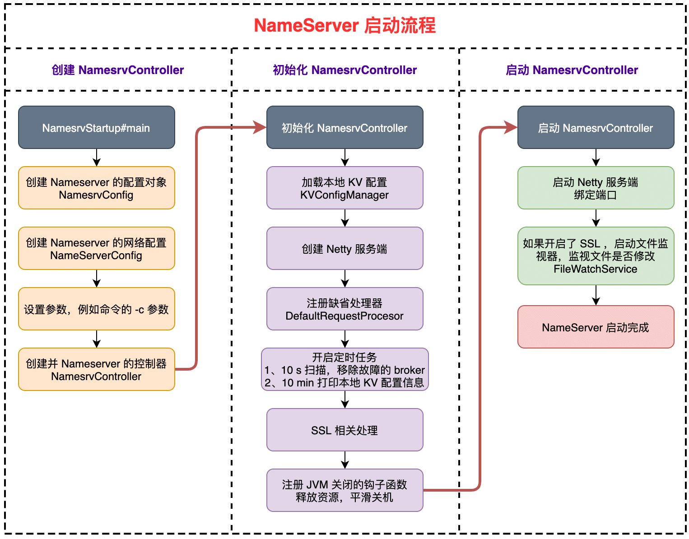

| 版本 | 内容 | 时间                   |
| ---- | ---- | ---------------------- |
| V1   | 新建 | 2022年08月1日10:40:21  |
| V2   | 重构 | 2023年06月06日19:57:14 |

## NameServer 概述

NameServer：NameServer 是一个非常简单的 Topic 路由注册中心，其角色类似 Dubbo 中的 zookeeper，支持 Topic、Broker 的动态注册与发现。

主要包括两个功能：

1. **Broker 管理**：NameServer 接受 Broker 集群的注册信息并且保存下来作为路由信息的基本数据。然后提供**心跳检测机制，检查 Broker 是否还存活**；
2. **路由信息管理**：每个 NameServer 将保存关于 Broker 集群的整个路由信息和用于客户端查询的队列信息。然后 Producer 和 Consumer 通过 NameServer 就可以知道整个 Broker 集群的路由信息，从而进行消息的投递和消费；

**NameServer 几乎无状态节点，因此可集群部署，节点之间无任何信息同步。**Broker 是向每一台 NameServer 注册自己的路由信息，所以每一个 NameServer 实例上面都保存一份完整的路由信息。当某个 NameServer 因某种原因下线了，Broker 仍然可以向其它 NameServer 同步其路由信息， Producer 和 Consumer 仍然可以动态感知 Broker 的路由的信息；

## NameServer 的启动入口

NameServer 的启动入口 org.apache.rocketmq.namesrv.NamesrvStartup#main

```java
public static void main(String[] args) {
    // 如果启动时，使用 -c  -p... 设置了参数了，这些参数由 args 接收
    main0(args);
}

public static NamesrvController main0(String[] args) {

    try {
        NamesrvController controller = createNamesrvController(args);
        start(controller);
        String tip = "The Name Server boot success. serializeType=" + RemotingCommand.getSerializeTypeConfigInThisServer();
        log.info(tip);
        System.out.printf("%s%n", tip);
        return controller;
    } catch (Throwable e) {
        e.printStackTrace();
        System.exit(-1);
    }

    return null;
}
```

可以看到主要是创建一个 NamesrvController 对象，然后调用方法将它启动。

## NameServer 启动相关的类

这里对这两个类有个了解就行，后续涉及到了再回头看看

### NamesrvConfig 配置对象

org.apache.rocketmq.common.namesrv.NamesrvConfig

```java
public class NamesrvConfig {
    private static final InternalLogger log = InternalLoggerFactory.getLogger(LoggerName.NAMESRV_LOGGER_NAME);

    // RocketMQ 主目录，通过 -Drocketmq.home.dir=path 或设置环境变量 ROCKETMQ_HOME 可以配置 RocketMQ 的主目录。
    private String rocketmqHome = System.getProperty(MixAll.ROCKETMQ_HOME_PROPERTY, System.getenv(MixAll.ROCKETMQ_HOME_ENV));
    // NameServer 存储 KV 配置属性的持久化路径， kvConfig.json 文件
    private String kvConfigPath = System.getProperty("user.home") + File.separator + "namesrv" + File.separator + "kvConfig.json";
    // NameServer 默认配置文件路径。NameServer 启动时如果要通过配置文件配置 NameServer 启动属性，请使用 -c 选项。
    private String configStorePath = System.getProperty("user.home") + File.separator + "namesrv" + File.separator + "namesrv.properties";
    private String productEnvName = "center";
    private boolean clusterTest = false;
    // 顺序消息功能是否开启，默认不支持
    private boolean orderMessageEnable = false;
}
```

NamesrvConfig 是 NameServer 的一些运行的配置。

- **rocketmqHome**：RocketMQ 的主目录；
- **kvConfigPat**h：NameServer 存储 KV 配置属性的持久化路径， kvConfig.json 文件；
- **configStorePath**：NameServer 默认配置文件路径；
- **orderMessageEnable**：顺序消息功能是否开启，默认不支持；

### NettyServerConfig 配置对象

应为 Nameserver 需要和 broker、producer、consumer 进行 rpc 通信，并且 NameServer 作为 Netty 服务端。NettyServerConfig 类就是提供 Netty 服务端的一些配置信息。

org.apache.rocketmq.remoting.netty.NettyServerConfig。

```java
public class NettyServerConfig implements Cloneable {
    private int listenPort = 8888;
    private int serverWorkerThreads = 8;
    private int serverCallbackExecutorThreads = 0;
    private int serverSelectorThreads = 3;
    private int serverOnewaySemaphoreValue = 256;
    private int serverAsyncSemaphoreValue = 64;
    private int serverChannelMaxIdleTimeSeconds = 120;
    private int serverSocketSndBufSize = NettySystemConfig.socketSndbufSize;
    private int serverSocketRcvBufSize = NettySystemConfig.socketRcvbufSize;
    private int writeBufferHighWaterMark = NettySystemConfig.writeBufferHighWaterMark;
    private int writeBufferLowWaterMark = NettySystemConfig.writeBufferLowWaterMark;
    private int serverSocketBacklog = NettySystemConfig.socketBacklog;
    private boolean serverPooledByteBufAllocatorEnable = true;
    private boolean useEpollNativeSelector = false;
}
```

参数解释：

| 参数名                             | 解释                                                         |
| ---------------------------------- | ------------------------------------------------------------ |
| listenPort                         | Netty 服务端启动时监听的端口，该值默认会被初始化为 9876      |
| serverWorkerThreads                | 线程池的线程个数，默认 8，两个地方使用：<br>1.用在协议处理器，eg.DefaultRequestProcessor； <br/>2.用在给 Netty 服务端的 Handler 使用的线程池 |
| serverCallbackExecutorThreads      | 线程池的线程个数，默认 0，会在后续初始化为 4。两个地方使用：<br/>1. 注册业务处理器时，如果未指定线程池，则使用 public 线程池； <br>2. 处理 RPC 回调的线程池； |
| serverSelectorThreads              | Netty 的 Worker 组线程个数                                   |
| serverOnewaySemaphoreValue         | 服务端单向消息请求客户端的并发度，默认 256                   |
| serverAsyncSemaphoreValue          | 服务端异步消息请求客户端的并发度，默认 64                    |
| serverChannelMaxIdleTimeSeconds    | 用于 Netty 服务端的 IdleStateHandler，网络连接最大空闲时间，默认为120s。如果连接空闲时间超过该参数设置的值，连接将被关闭。 |
| serverSocketSndBufSize             | 网络 socket 发送缓存区大小，默认为 0（ps.旧版本给的是 65535） |
| serverSocketRcvBufSize             | 网络 socket接收缓存区大小，默认为 0（ps.旧版本给的是 65535） |
| writeBufferHighWaterMark           | Netty 出站缓冲区高水位                                       |
| writeBufferLowWaterMark            | Netty 出站缓冲区低水位                                       |
| serverSocketBacklog                | TCP 协议的 backlog 参数，存放连接请求队列的最大长度          |
| serverPooledByteBufAllocatorEnable | Netty 是否开启池化内存，默认开启                             |
| useEpollNativeSelector             | 是否启用 epoll I/O 模型，Linux环境下建议开启。               |

## NameServer 的启动流程图



## NameServer 启动流程

### 读取 Nameserver 启动的配置并设置

NamesrvStartup#createNamesrvController

```java
// NameServer 业务参数
final NamesrvConfig namesrvConfig = new NamesrvConfig();
// NameServer 网络参数
final NettyServerConfig nettyServerConfig = new NettyServerConfig();
// namesrv 服务器监听端口设置为 9876
nettyServerConfig.setListenPort(9876);
if (commandLine.hasOption('c')) {
    // 读取 -c 选项的值
    String file = commandLine.getOptionValue('c');
    if (file != null) {
        // 加载配置文件到 properties 内
        InputStream in = new BufferedInputStream(new FileInputStream(file));
        properties = new Properties();
        properties.load(in);
        // 如果 config 配置文件内的配置涉及到 namesrvConfig 或者 NettyServerConfig 的字段那么进行重写
        MixAll.properties2Object(properties, namesrvConfig);
        MixAll.properties2Object(properties, nettyServerConfig);

        // 将读取的配置文件路径保存
        namesrvConfig.setConfigStorePath(file);

        System.out.printf("load config properties file OK, %s%n", file);
        in.close();
    }
}
```

- 首先创建两个对象，NamesrvConfig 和 NettyServerConfig，里面有一些默认的配置；
- 假如在启动 NameServer 的时候命令中用 -c 指定了配置文件，例如 nameserver.properties，假如该文件中有 `listenPort = 10086`，那么则会将 Netty 服务端端口设置为 10086； 

### 创建 NamesrvController 对象

根据上面的 NamesrvConfig 和 NettyServerConfig 配置对象，创建 NamesrvController。

org.apache.rocketmq.namesrv.NamesrvController#NamesrvController

```java
public NamesrvController(NamesrvConfig namesrvConfig, NettyServerConfig nettyServerConfig) {
    this.namesrvConfig = namesrvConfig;
    this.nettyServerConfig = nettyServerConfig;
    this.kvConfigManager = new KVConfigManager(this);
    this.routeInfoManager = new RouteInfoManager();
    this.brokerHousekeepingService = new BrokerHousekeepingService(this);
    this.configuration = new Configuration(
        log,
        this.namesrvConfig, this.nettyServerConfig
    );
    this.configuration.setStorePathFromConfig(this.namesrvConfig, "configStorePath");
}
```

- 首先是两个配置属性，namesrvConfig 和 nettyServerConfig；
- 创建 KVConfigManager 对象；
- 创建 RouteInfoManager 对象，这个主要是用作存储 NameServer 的路由元信息，也就是一些 broker 信息都存在这里；
- 创建 BrokerHousekeepingService 对象，这个主要是监听 Netty 的事件变化，当 Netty 事件发送改变后，会做对应的处理；
- 创建 Configuration 对象；

### 初始化 NamesrvController 对象

既然 NamesrvController 已经创建完成了，就会调用 NamesrvStartup#start 去启动 NameServer 了，第一步就是调用 NamesrvController#initialize 方法去初始化 NamesrvController。

```java
public boolean initialize() {

    // 加载本地 KV 配置
    this.kvConfigManager.load();

    // 创建 Netty 服务端
    this.remotingServer = new NettyRemotingServer(this.nettyServerConfig, this.brokerHousekeepingService);
    // 创建业务线程池，默认线程数 8，给协议处理器使用
    this.remotingExecutor =
        Executors.newFixedThreadPool(nettyServerConfig.getServerWorkerThreads(), new ThreadFactoryImpl("RemotingExecutorThread_"));

    // 注册协议处理器，缺省的协议处理器
    this.registerProcessor();

    // 定时任务，每隔 10 秒扫描一次 Broker，移除 idle 状态的 Broker
    this.scheduledExecutorService.scheduleAtFixedRate(new Runnable() {
        @Override
        public void run() {
            NamesrvController.this.routeInfoManager.scanNotActiveBroker();
        }
    }, 5, 10, TimeUnit.SECONDS);

    // 定时任务，每隔 10 秒打印一次 KV 配置
    this.scheduledExecutorService.scheduleAtFixedRate(new Runnable() {
        @Override
        public void run() {
            NamesrvController.this.kvConfigManager.printAllPeriodically();
        }
    }, 1, 10, TimeUnit.MINUTES);

    // ...... 省略处理 TLS 的代码 ......

    return true;
}
```

- 首先会去加载本地的 KV 配置；
- 创建 NettyRemotingServer 服务器对象；
  - 在 NettyRemotingServer 构造构造方法中，主要是创建 ServerBootstrap，Netty 的 Boss 和 Worker 等线程池；
  - 在创建 Netty 的线程组的时候会校验是否使用 epoll；
- 注册缺省的协议处理器，当 NameServer 接收到 RPC 请求时，会通过这个协议处理器去处理对应的请求；
- 定时任务：每隔 10 秒扫描一次 Broker 列表，移除超时未发心跳的 Broker；
- 定时任务：每隔 10 秒打印一次 KV 配置；

**到这里已经创建好 Nameserver 的 Netty 服务端了，并且注册了一个缺省的协议处理器。添加了定时任务 10s 去扫描所有的 broker，并将长时间（默认 120s）未发心跳的 broker 从 namserver 中移除。**

> NettyRemotingServer 和定时任务相关的后面文章会分析，这里知道是在这里创建的就行了

### 注册 JVM 关闭的钩子函数

因为 NameServer 运行依赖了不少资源，例如 Netty 的主从 Reactor 线程组，一些业务线程池。当 Namserver 需要关机时，为了让系统平滑关机，需要注册一个 JVM 关闭的构造函数，去关闭一些资源。

NamesrvStartup#start

```java
// 添加 JVM 的钩子函数，关闭一些资源，让服务器平滑关机
Runtime.getRuntime().addShutdownHook(new ShutdownHookThread(log, new Callable<Void>() {
    @Override
    public Void call() throws Exception {
        controller.shutdown();
        return null;
    }
}));
```

添加 JVM 的钩子函数，关闭一些资源，让服务器平滑关机。这些资源主要是一些线程资源。

NamesrvController#shutdown

```java
public void shutdown() {
    this.remotingServer.shutdown();
    this.remotingExecutor.shutdown();
    this.scheduledExecutorService.shutdown();

    if (this.fileWatchService != null) {
        this.fileWatchService.shutdown();
    }
}
```

### 启动 Netty 服务端

org.apache.rocketmq.remoting.netty.NettyRemotingServer#start

这个函数的代码比较长，前面创建线程池，设置 TCP 和 Netty 的参数的代码就不贴了。

```java
/**
 * 1.创建服务端 ServerBootstrap 对象，组装 option 参数，添加 ChannelHandler 到管道
 * 2.绑定端口 9876
 * 3.开启一个线程用于监听 Channel 的事件
 * 4.开启定时任务，10 秒扫描一次 responseTable。
 */
@Override
public void start() {
    // 省略部分代码...

    try {
        // 绑定端口 9876
        ChannelFuture sync = this.serverBootstrap.bind().sync();
        InetSocketAddress addr = (InetSocketAddress) sync.channel().localAddress();
        this.port = addr.getPort();
    } catch (InterruptedException e1) {
        throw new RuntimeException("this.serverBootstrap.bind().sync() InterruptedException", e1);
    }

    if (this.channelEventListener != null) {
        // 开启一个线程，死循环 run 方法
        // org.apache.rocketmq.remoting.netty.NettyRemotingAbstract.NettyEventExecutor.run
        this.nettyEventExecutor.start();
    }

    // 周期任务，扫描 ResponseTable
    // 将 responseTable 的超时的 ResponseFuture 移除掉
    this.timer.scheduleAtFixedRate(new TimerTask() {

        @Override
        public void run() {
            try {
                NettyRemotingServer.this.scanResponseTable();
            } catch (Throwable e) {
                log.error("scanResponseTable exception", e);
            }
        }
    }, 1000 * 3, 1000);
}
```

- 首先是创建一个线程池，用于处理 ChannelHandler 的事件；
- 创建共享的 ChannelHandler 对象。
  - HandshakeHandler：TLS 相关的；
  - NettyEncoder：编码器；
  - NettyConnectManageHandler：监听 Channel 的 Pipeline 的事件，将其添加到 NettyRemotingServer 的事件队列中，由前面说的 BrokerHousekeepingService 对象去消费。
  - NettyServerHandler：根据 RPC 的封装对象 RemotingCommand 中的 type 和 code 做不同的业务处理；
- 设置 TCP 和 Netty 的参数，初始化 Netty 服务端的管道；
- Netty 服务端绑定端口；
- 启动 NettyEventExecutor 线程，监听 Netty 管道中的事件变化，做对应的后续处理；
- 定时任务：扫描 RPC 请求的表 responseTable，移除超时的请求，并回调超时的请求的回调方法；

## 小结

本篇只简单叙述了 NameServer 的启动流程，具体涉及到的定时任务和 Netty 服务端启动的逻辑都未分析，NameServer 的路由管理功能也未分析。后面文章具体分析，这里只知道 NameServer 是如何启动的就行了。