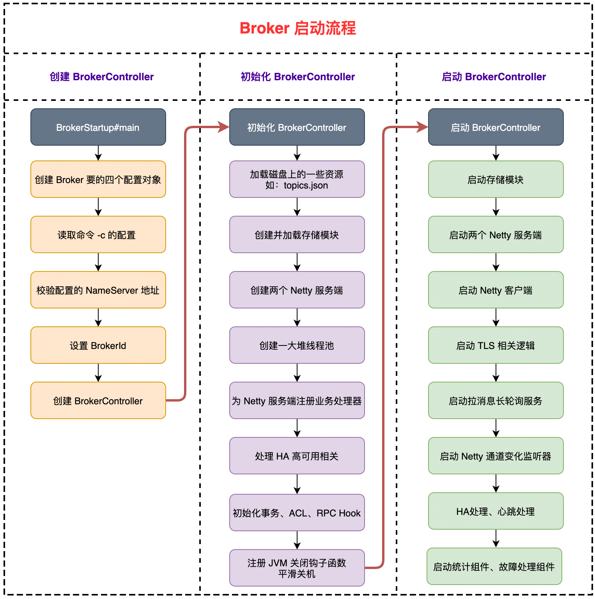

| 版本 | 内容 | 时间                   |
| ---- | ---- | ---------------------- |
| V1   | 新建 | 2022年07月28日22:07:31 |
| V2   | 重构 | 2023年06月06日22:42:50 |

## Broker 概述

BrokerServer：**Broker 主要负责消息的存储、投递和查询以及服务高可用保证**，为了实现这些功能，Broker 包含了以下几个重要子模块。

1. **Remoting Module**：整个 Broker 的实体，负责处理来自 Client 端的请求；
2. **Client Manager**：负责管理客户端( Producer / Consumer )和维护 Consumer 的 Topic 订阅信息；
3. **Store Service**：提供方便简单的 API 接口处理消息存储到物理硬盘和查询功能；
4. **HA Service**：高可用服务，提供 Master Broker 和 Slave Broker 之间的数据同步功能；
5. **Index Service**：根据特定的 Message key 对投递到Broker的消息进行索引服务，以提供消息的快速查询；

Broker 的部署：在 Master-Slave 架构中，Broker 分为 Master 与 Slave。一个 Master 可以对应多个 Slave，但是一个 Slave 只能对应一个 Master。Master 与 Slave 的对应关系通过指定相同的 BrokerName，不同的 BrokerId 来定义，BrokerId为 0 表示 Master，非 0 表示 Slave。Master 也可以部署多个。

## Broker 启动的入口

Broker 和 NameServer 的启动流程和代码都十分相似。

入口在：org.apache.rocketmq.broker.BrokerStartup#main

```java
public static void main(String[] args) {
        start(createBrokerController(args));
    }

    public static BrokerController start(BrokerController controller) {
        try {
            controller.start();

            String tip = "The broker[" + controller.getBrokerConfig().getBrokerName() + ", "
                + controller.getBrokerAddr() + "] boot success. serializeType=" + RemotingCommand.getSerializeTypeConfigInThisServer();

            if (null != controller.getBrokerConfig().getNamesrvAddr()) {
                tip += " and name server is " + controller.getBrokerConfig().getNamesrvAddr();
            }

            log.info(tip);
            System.out.printf("%s%n", tip);
            return controller;
        } catch (Throwable e) {
            e.printStackTrace();
            System.exit(-1);
        }

        return null;
    }
```

关键就是创建 BrokerController 对象，然后调用它的启动方法启动 broker。

## Broker 启动流程图

- 首先是创建了四个配置对象：

  - 创建 BrokerConfig 对象，这是 Broker 自己运行的相关配置；

  - 创建 NettyServerConfig 对象，这是作为 Netty 服务端的相关的配置；

  - 创建 NettyClientConfig 对象，这是作为 Netty 客户端相关的配置；

  - 创建 MessageStoreConfig 对象，这是 Broker 的核心存储模块的一些配置；
- 然后读取 -c 指定的配置文件，将其中的配置赋值到上面的配置对象对应的字段中；
- 校验配置中指定的 NameServer 地址的格式是否正确；
- 根据当前 broker 的角色，设置 brokerId；
- 设置 HA 监听端口号；
- 根据创建的四个配置文件创建 BrokerController 对象；
- 初始化 BrokerController 对象；
- 注册 JVM 关闭的钩子函数，主要是关闭一些资源，让服务器平滑关机；
- 启动 Broker 内部的一些组件；



## Broker 启动流程

### 创建 BrokerController

BrokerStartup#createBrokerController 方法比较长，这里分小结分析

#### 创建一些配置对象

```java
// 创建 BrokerConfig，自身运行的配置
final BrokerConfig brokerConfig = new BrokerConfig();
// 创建 NettyServerConfig，是作为 Netty 服务端相关的配置
final NettyServerConfig nettyServerConfig = new NettyServerConfig();
// 创建 NettyClientConfig，是作为 Netty 客户端相关的配置
final NettyClientConfig nettyClientConfig = new NettyClientConfig();

nettyClientConfig.setUseTLS(Boolean.parseBoolean(System.getProperty(TLS_ENABLE,
    String.valueOf(TlsSystemConfig.tlsMode == TlsMode.ENFORCING))));
// Netty 服务端的端口设置为 10911
nettyServerConfig.setListenPort(10911);
// broker 核心存储模块的配置
final MessageStoreConfig messageStoreConfig = new MessageStoreConfig();

// slave broker 的配置，这个百分比是用于后续校验 broker 中操作的数据是否是冷热数据
if (BrokerRole.SLAVE == messageStoreConfig.getBrokerRole()) {
    int ratio = messageStoreConfig.getAccessMessageInMemoryMaxRatio() - 10;
    messageStoreConfig.setAccessMessageInMemoryMaxRatio(ratio);
}
```

首先创建一些 Broker 相关的一些配置对象。Broker 不光要和 NameServer 通信，还要和 Producer 和 Consumer 进行通信。Broker 即是 Netty 服务端，也是一个 Netty 客户端。所以 Broker 需要两个对象分别保存服务端和客户端的配置类。另外，Broker 需要存储消息到磁盘，所以也需要一个存储模块的配置类。

- 创建 BrokerConfig 对象，这是 Broker 自己运行的相关配置；
- 创建 NettyServerConfig 对象，这是作为 Netty 服务端的相关的配置；
- 创建 NettyClientConfig 对象，这是作为 Netty 客户端相关的配置；
- 创建 MessageStoreConfig 对象，这是 Broker 的核心存储模块的一些配置；

#### 读取命令指定的配置项

```java
// 读取配置
if (commandLine.hasOption('c')) {
    String file = commandLine.getOptionValue('c');
    if (file != null) {
        configFile = file;
        InputStream in = new BufferedInputStream(new FileInputStream(file));
        properties = new Properties();
        properties.load(in);

        properties2SystemEnv(properties);
        MixAll.properties2Object(properties, brokerConfig);
        MixAll.properties2Object(properties, nettyServerConfig);
        MixAll.properties2Object(properties, nettyClientConfig);
        MixAll.properties2Object(properties, messageStoreConfig);

        BrokerPathConfigHelper.setBrokerConfigPath(file);
        in.close();
    }
}
```

假如指定了配置文件，那么读取 -c 指定的配置文件，将其中的配置赋值到上面的配置对象对应的字段中。

#### 校验配置的 NameServer 地址

```java
// 获取配置的 nameserver 地址，校验配置的地址是否正确
String namesrvAddr = brokerConfig.getNamesrvAddr();
if (null != namesrvAddr) {
    try {
        String[] addrArray = namesrvAddr.split(";");
        for (String addr : addrArray) {
            RemotingUtil.string2SocketAddress(addr);
        }
    } catch (Exception e) {
        System.out.printf(
            "The Name Server Address[%s] illegal, please set it as follows, \"127.0.0.1:9876;192.168.0.1:9876\"%n",
            namesrvAddr);
        System.exit(-3);
    }
}
```

Broker 启动要指定 NameServer 服务器的地址，因为 Broker 要和 NameServer 交互，例如发送心跳包。

#### 设置 brokerId

```java
// 设置 brokerId，0 表示主节点，大于 0 表示从节点
switch (messageStoreConfig.getBrokerRole()) {
    case ASYNC_MASTER:
    case SYNC_MASTER:
        brokerConfig.setBrokerId(MixAll.MASTER_ID);
        break;
    case SLAVE:
        if (brokerConfig.getBrokerId() <= 0) {
            System.out.printf("Slave's brokerId must be > 0");
            System.exit(-3);
        }

        break;
    default:
        break;
}

if (messageStoreConfig.isEnableDLegerCommitLog()) {
    brokerConfig.setBrokerId(-1);
}
```

关于 broker 的 brokerId：

- 0 表示主节点；
- 大于 0 表示从节点；

#### 创建 BrokerController

```java
// 创建 BrokerController
final BrokerController controller = new BrokerController(
    brokerConfig,
    nettyServerConfig,
    nettyClientConfig,
    messageStoreConfig);
// remember all configs to prevent discard
controller.getConfiguration().registerConfig(properties);
```

该部分的最后一步就是根据前面创建出来的那些配置对象，调用 BrokerController 的构造方法去创建 BrokerController 了。在 BrokerController 的构造方法中，步骤大概分为三类：

1. 根据入参赋值 broker 端的四个配置对象；
2. 创建 broker 的一些组件对象；
3. 创建一些线程池的队列；

> 这里就不贴 BrokerController 方法的代码了，比较长。具体组件的功能具体分析，这里我们只需要知道会创建这些组件就行了。

### 初始化 BrokerController

前面已经创建了四个配置对象，而且 BrokerController 已经创建完成了，现在需要对 BrokerController 进行初始化。

org.apache.rocketmq.broker.BrokerController#initialize

**初始化 BrokerController 的代码有很多，有很多代码目前是不用深挖的，这里留个印象就行了，后续文章遇到了具体分析。**

主要步骤如下：

1. 首先是加载各个资源文件，如 topics.json；
2. 创建 broker 的核心存储模块 DefaultMessageStore，然后加载核心存储模块的资源文件，主要是 commitLog，ConsumeQueue，IndexService 这些；
3. 创建两个 Netty 服务端对象，一个 remotingServer，一个 fastRemotingServer，两个端口不一样；
4. 初始化一堆线程池对象；
5. 注册 broker 端的业务处理器，用于处理不同类型的 RPC 请求；
6. 开启一堆定时任务；
7. 设置 NettyRemotingClient 的 NameServer 地址；
8. Master 角色的 broker 需要定时打印主从 broker 之间的同步数据差异，Slave 角色的 broker 需要处理 HA 相关；
9. TLS 相关处理；
10. 初始化一些事务，权限控制 ACL，RPC hook 相关的资源； 

#### 加载资源

首先是加载各个资源文件，如 topics.json；

```java
// 加载 topic 资源
boolean result = this.topicConfigManager.load();
// 加载 consumer 消费进度信息
result = result && this.consumerOffsetManager.load();
// 加载 consumer 订阅组信息
result = result && this.subscriptionGroupManager.load();
// 加载过滤器
result = result && this.consumerFilterManager.load();
```

依次加载各种资源，主要是 org.apache.rocketmq.broker.BrokerPathConfigHelper 中定义的一些路径，如：

- 主题配置的 topics.json；
- 消费进度的 consumerOffset.json；
- 订阅信息的 subscriptionGroup.json；
- 消息过滤器 consumerFilter.json；

> 这里有个印象就行了

#### 创建并加载核心存储模块

```java
if (result) {
    try {
        // 创建核心存储模块
        this.messageStore =
            new DefaultMessageStore(this.messageStoreConfig, this.brokerStatsManager, this.messageArrivingListener,
                this.brokerConfig);
        if (messageStoreConfig.isEnableDLegerCommitLog()) {
            DLedgerRoleChangeHandler roleChangeHandler = new DLedgerRoleChangeHandler(this, (DefaultMessageStore) messageStore);
            ((DLedgerCommitLog)((DefaultMessageStore) messageStore).getCommitLog()).getdLedgerServer().getdLedgerLeaderElector().addRoleChangeHandler(roleChangeHandler);
        }
        // broker 统计组件
        this.brokerStats = new BrokerStats((DefaultMessageStore) this.messageStore);
        //load plugin
        MessageStorePluginContext context = new MessageStorePluginContext(messageStoreConfig, brokerStatsManager, messageArrivingListener, brokerConfig);
        this.messageStore = MessageStoreFactory.build(context, this.messageStore);
        this.messageStore.getDispatcherList().addFirst(new CommitLogDispatcherCalcBitMap(this.brokerConfig, this.consumerFilterManager));
    } catch (IOException e) {
        result = false;
        log.error("Failed to initialize", e);
    }
}

// 加载核心存储的资源
// 主要是加载 CommitLog，ConsumeQueue，indexService 这些文件
result = result && this.messageStore.load();
```

创建 broker 的核心存储模块 DefaultMessageStore，然后加载核心存储模块的资源文件，主要是 commitLog，ConsumeQueue，IndexService 这些；

> 这里有个印象就行了，后面分析存储模块会详细分析

#### 创建 Netty 服务端

```java
// 创建 Netty 服务端对象
this.remotingServer = new NettyRemotingServer(this.nettyServerConfig, this.clientHousekeepingService);

NettyServerConfig fastConfig = (NettyServerConfig) this.nettyServerConfig.clone();
fastConfig.setListenPort(nettyServerConfig.getListenPort() - 2);
// 复制一个 Netty 服务端对象，端口设置为上面一个的 -2
this.fastRemotingServer = new NettyRemotingServer(fastConfig, this.clientHousekeepingService);
```

创建两个 Netty 服务端对象，一个 remotingServer，一个 fastRemotingServer。fastRemotingServer 的功能和 remotingServer 的功能基本上差不多，唯一不同的是不可以处理消费者拉取消息的请求。Broker 在向 NameServer 注册时，只会上报 remotingServer 绑定的端口。客户端发送消息时可以选择请求 remotingServer，也可以通过配置来请求 fastRemotingServer 服务端。

> 后续文章具体分析 Broker 监听的一些端口，这里简单了解一下。

#### 创建一堆线程池

```java
// 初始化一些线程池
this.sendMessageExecutor = new BrokerFixedThreadPoolExecutor(
    this.brokerConfig.getSendMessageThreadPoolNums(),
    this.brokerConfig.getSendMessageThreadPoolNums(),
    1000 * 60,
    TimeUnit.MILLISECONDS,
    this.sendThreadPoolQueue,
    new ThreadFactoryImpl("SendMessageThread_"));

// ...... 省略 ......
```

Broker 中需要使用很多线程池，这里创建了一堆线程池。

#### 注册业务处理器

BrokerController#registerProcessor

```java
public void registerProcessor() {
    /**
     * SendMessageProcessor
     */
    SendMessageProcessor sendProcessor = new SendMessageProcessor(this);
    sendProcessor.registerSendMessageHook(sendMessageHookList);
    sendProcessor.registerConsumeMessageHook(consumeMessageHookList);

    this.remotingServer.registerProcessor(RequestCode.SEND_MESSAGE, sendProcessor, this.sendMessageExecutor);
    this.remotingServer.registerProcessor(RequestCode.SEND_MESSAGE_V2, sendProcessor, this.sendMessageExecutor);
    this.remotingServer.registerProcessor(RequestCode.SEND_BATCH_MESSAGE, sendProcessor, this.sendMessageExecutor);
    this.remotingServer.registerProcessor(RequestCode.CONSUMER_SEND_MSG_BACK, sendProcessor, this.sendMessageExecutor);

    this.fastRemotingServer.registerProcessor(RequestCode.SEND_MESSAGE, sendProcessor, this.sendMessageExecutor);
    this.fastRemotingServer.registerProcessor(RequestCode.SEND_MESSAGE_V2, sendProcessor, this.sendMessageExecutor);
    this.fastRemotingServer.registerProcessor(RequestCode.SEND_BATCH_MESSAGE, sendProcessor, this.sendMessageExecutor);
    this.fastRemotingServer.registerProcessor(RequestCode.CONSUMER_SEND_MSG_BACK, sendProcessor, this.sendMessageExecutor);

    // ...... 省略其他的注册处理器操作 ......
}
```

前面我们创建了 remotingServer 和 fastRemotingServer 两个服务端，这里需要向它注册一些业务处理器。业务处理器的作用就是处理不同类型的 RPC 请求。

#### 创建一堆定时任务

```java
final long initialDelay = UtilAll.computeNextMorningTimeMillis() - System.currentTimeMillis();
final long period = 1000 * 60 * 60 * 24;
// 定时任务：Metric 统计任务
this.scheduledExecutorService.scheduleAtFixedRate(new Runnable() {
    @Override
    public void run() {
        try {
            BrokerController.this.getBrokerStats().record();
        } catch (Throwable e) {
            log.error("schedule record error.", e);
        }
    }
}, initialDelay, period, TimeUnit.MILLISECONDS);

 // ...... 省略其他的一些定时任务 ......
```

broker 中有一堆定时任务，例如持久化一些信息（consumerOffset.json 等）。

#### Netty 客户端保存 NameServer 地址

因为 broker 需要作为 Netty 客户端向 NameServer 发送请求，所以要保存 NameServer 的地址。

```java
// 设置 NettyRemotingClient 的 NameServer 地址
if (this.brokerConfig.getNamesrvAddr() != null) {
    this.brokerOuterAPI.updateNameServerAddressList(this.brokerConfig.getNamesrvAddr());
    log.info("Set user specified name server address: {}", this.brokerConfig.getNamesrvAddr());
} else if (this.brokerConfig.isFetchNamesrvAddrByAddressServer()) {
    // ...... 省略 ......
}
```

#### 处理 HA 高可用相关

```java
if (!messageStoreConfig.isEnableDLegerCommitLog()) {
    if (BrokerRole.SLAVE == this.messageStoreConfig.getBrokerRole()) {
        // 假如当前 broker 是 slave，需要处理 HA 相关的操作
        if (this.messageStoreConfig.getHaMasterAddress() != null && this.messageStoreConfig.getHaMasterAddress().length() >= 6) {
            this.messageStore.updateHaMasterAddress(this.messageStoreConfig.getHaMasterAddress());
            this.updateMasterHAServerAddrPeriodically = false;
        } else {
            this.updateMasterHAServerAddrPeriodically = true;
        }
    } else {
        // 假如当前 broker 是 master，则需要定时打印主从 broker 的同步数据差异
        this.scheduledExecutorService.scheduleAtFixedRate(new Runnable() {
            @Override
            public void run() {
                try {
                    BrokerController.this.printMasterAndSlaveDiff();
                } catch (Throwable e) {
                    log.error("schedule printMasterAndSlaveDiff error.", e);
                }
            }
        }, 1000 * 10, 1000 * 60, TimeUnit.MILLISECONDS);
    }
}
```

Master 角色的 broker 需要定时打印主从 broker 之间的同步数据差异，Slave 角色的 broker 需要处理 HA 相关；

> 会在 HA 高可用的时候详细分析

#### 其他操作

```java
// 初始化事务相关
initialTransaction();
// 初始化权限控制 ACL 相关
initialAcl();
// 初始化配置的 RPC 钩子函数
initialRpcHooks();
```

初始化一些事务，权限控制 ACL，RPC hook 相关的资源； 

#### 注册 JVM 关闭的钩子函数

因为 Broker 运行依赖了不少资源，例如 Netty 的主从 Reactor 线程组，一些业务线程池。当 Broker 需要关机时，为了让系统平滑关机，需要注册一个 JVM 关闭的构造函数，去关闭一些资源。

```java
// 注册 JVM 钩子函数
Runtime.getRuntime().addShutdownHook(new Thread(new Runnable() {
    private volatile boolean hasShutdown = false;
    private AtomicInteger shutdownTimes = new AtomicInteger(0);

    @Override
    public void run() {
        synchronized (this) {
            log.info("Shutdown hook was invoked, {}", this.shutdownTimes.incrementAndGet());
            if (!this.hasShutdown) {
                this.hasShutdown = true;
                long beginTime = System.currentTimeMillis();
                controller.shutdown();
                long consumingTimeTotal = System.currentTimeMillis() - beginTime;
                log.info("Shutdown hook over, consuming total time(ms): {}", consumingTimeTotal);
            }
        }
    }
}, "ShutdownHook"));
```

### 启动 BrokerController

OK，现在 BrokerController 已经创建好了，而且已经初始化完成了，现在需要启动它。

org.apache.rocketmq.broker.BrokerController#start

```java
/**
 * 启动 BrokerController
 */
public void start() throws Exception {
    // 核心存储模块启动
    if (this.messageStore != null) {
        this.messageStore.start();
    }

    // broker 作为 Netty 服务端启动
    if (this.remotingServer != null) {
        this.remotingServer.start();
    }

    // broker 作为 Netty 服务端启动，vip 通道
    if (this.fastRemotingServer != null) {
        this.fastRemotingServer.start();
    }

    // TLS 相关
    if (this.fileWatchService != null) {
        this.fileWatchService.start();
    }

    // broker 作为 Netty 客户端
    if (this.brokerOuterAPI != null) {
        this.brokerOuterAPI.start();
    }

    // 拉消息长轮询服务
    if (this.pullRequestHoldService != null) {
        this.pullRequestHoldService.start();
    }

    // Netty 通道变化的监听处理器
    if (this.clientHousekeepingService != null) {
        this.clientHousekeepingService.start();
    }

    if (this.filterServerManager != null) {
        this.filterServerManager.start();
    }

    // HA 相关处理
    if (!messageStoreConfig.isEnableDLegerCommitLog()) {
        startProcessorByHa(messageStoreConfig.getBrokerRole());
        handleSlaveSynchronize(messageStoreConfig.getBrokerRole());
        this.registerBrokerAll(true, false, true);
    }

    // broker 给 NameServer 发送心跳包
    this.scheduledExecutorService.scheduleAtFixedRate(new Runnable() {

        @Override
        public void run() {
            try {
                BrokerController.this.registerBrokerAll(true, false, brokerConfig.isForceRegister());
            } catch (Throwable e) {
                log.error("registerBrokerAll Exception", e);
            }
        }
    }, 1000 * 10, Math.max(10000, Math.min(brokerConfig.getRegisterNameServerPeriod(), 60000)), TimeUnit.MILLISECONDS);

    // metric 统计的组件
    if (this.brokerStatsManager != null) {
        this.brokerStatsManager.start();
    }

    // broker 故障处理的组件
    if (this.brokerFastFailure != null) {
        this.brokerFastFailure.start();
    }
}
```

主要是启动一些 BrokerController 的内部组件，例如两个 Netty 服务端，Netty 客户端等。开启了一个定时任务去给 NameServer 发心跳。

## 小结

整体来说 BrokerController 类的结构如下：

1. 作为配置的一些类，例如 BrokerConfig，NettyServerConfig，NettyClientConfig，MessageStoreConfig；
2. broker 的一些组件对象， PullRequestHoldService 等；
3. 各种线程池和线程池的队列对象；

而 Broker 的启动流程就是根据配置创建 BrokerController，然后初始化 BrokerController 内部的一些组件，最后将它启动。

需要注意的是，本篇文章只是简单的叙述了 Broker 的启动流程，并没有分析 Broker 内的一些组件，这些组件在后面遇到的地方会详细分析。