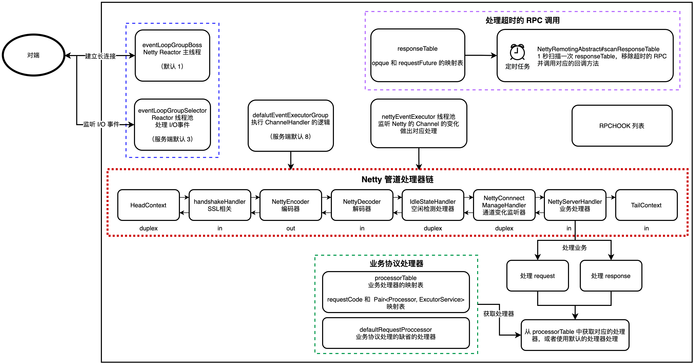
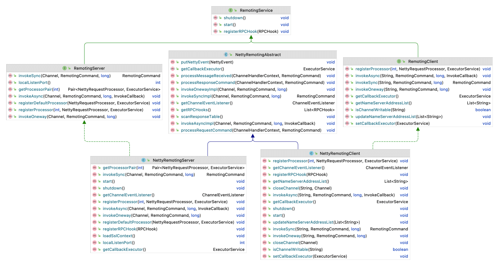
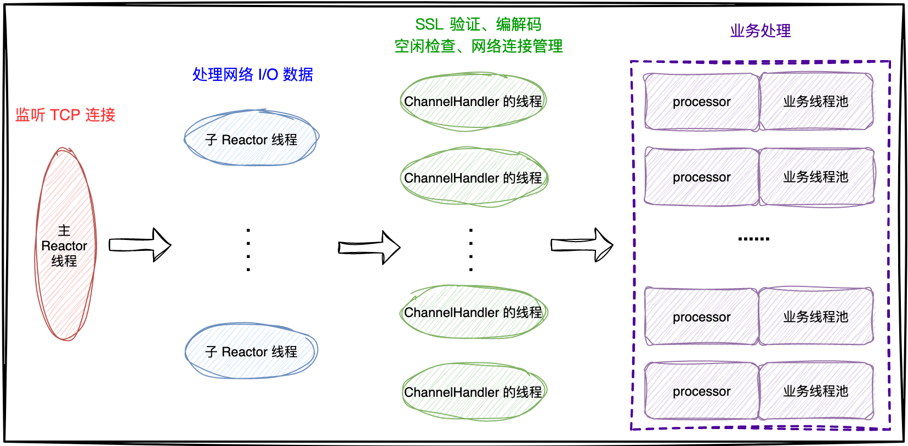

| 版本 | 内容 | 时间                   |
| ---- | ---- | ---------------------- |
| V1   | 新建 | 2022年08月01日23:15:29 |
| V2   | 重构 | 2023年06月07日21:08:54 |

## RocketMQ 通信机制概述（来自官网）

RocketMQ 使用 Netty 实现的客户端和服务端的架构组成基本上都是一样的，下图主要展示服务端的组成。

RocketMQ 消息队列集群主要包括 NameServer、Broker(Master/Slave)、Producer、Consumer 4个角色，基本通讯流程如下：

1.  Broker 启动后需要完成一次将自己注册至 NameServer 的操作。随后每隔 30s 时间向 NameServer 上报 Topic 路由信息（心跳）；
2. 消息生产者 Producer 作为客户端发送消息时候，需要根据消息的 Topic 从本地缓存的 TopicPublishInfoTable 获取路由信息。如果没有则更新路由信息会从 NameServer 上重新拉取，同时 Producer 会默认每隔 30s 向 NameServer 拉取一次路由信息；
3. 消息生产者 Producer 根据第二条中获取的路由信息选择一个队列（MessageQueue）进行消息发送。Broker 作为消息的接收者接收消息并落盘存储；
4. 消息消费者 Consumer 根据第二条中获取的路由信息，在完成客户端的负载均衡后，选择其中的某一个或者某几个消息队列来拉取消息并进行消费；

从上面 1~3 中可以看出在消息生产者，Broker 和 NameServer 之间都会发生通信（这里只说了MQ的部分通信），因此如何设计一个良好的网络通信模块在 MQ 中至关重要，它将决定 RocketMQ 集群整体的消息传输能力与最终的性能。

rocketmq-remoting 模块是 RocketMQ 消息队列中负责网络通信的模块，它几乎被其他所有需要网络通信的模块（诸如 rocketmq-client、rocketmq-broker、rocketmq-namesrv）所依赖和引用。为了实现客户端与服务器之间高效的数据请求与接收，RocketMQ 消息队列自定义了通信协议并在 Netty 的基础之上扩展了通信模块。

## 通信相关类的继承体系

顶级接口 RemotingService 提供了三个方法：

- 启动服务；
- 关闭服务；
- 注册 RPC 前后的钩子函数；

对于服务端和客户端对应的子接口 RemotingServer 和 RemotingClient，就是提供服务端和客户端的具体功能了。而 NettyRemotingAbstract 是服务端和客户端共同的抽象父类，提供了公共的方法，例如处理请求的流程。关于 NettyRemotingServer 和 NettyRemotingClient 类就是服务端和客户端的具体逻辑实现了。

## RocketMQ 的 Reactor 线程设计

RocketMQ 基于 Netty 框架设计的 RPC 通信。

- **一个主 Reactor 线程**（只监听一个端口）：负责监听 TCP 网络连接的请求，建立好连接后，创建客户端 SocketChannel，并且注册到 Selector 上，关注 ACCEPT 事件；
- **多个子 Reactor 线程**：当 Selector 上有准备好的网络 I/O 事件后，子 Reactor 处理网络数据后，将数据在处理器链中传播；
- **处理器 ChannelHandler 的线程**：在真正执行业务逻辑之前需要进行 SSL 验证、编解码、空闲检查、网络连接管理这些操作，这些处理器由特有的线程池的线程处理；
- **真正处理业务逻辑的线程**：处理业务的线程在特有的业务线程池中执行。每种类型的请求都有自己的 code，每个 code 都会有特定的 processor 去处理，会把请求逻辑封装成一个 Runnable 的任务，提交给业务线程池去处理。

## 协议设计与编解码（来自官网）

在 RocketMQ 中，RemotingCommand 这个类在消息传输过程中对所有数据内容的封装，不但包含了所有的数据结构，还包含了编码解码操作。

| Header字段 | 类型                    | Request 说明                                                 | Response 说明                            |
| ---------- | ----------------------- | ------------------------------------------------------------ | ---------------------------------------- |
| code       | int                     | 请求操作码，应答方根据不同的请求码进行不同的业务处理         | 应答响应码。0表示成功，非0则表示各种错误 |
| language   | LanguageCode            | 请求方实现的语言                                             | 应答方实现的语言                         |
| version    | int                     | 请求方程序的版本                                             | 应答方程序的版本                         |
| opaque     | int                     | 相当于 requestId，在同一个连接上的不同请求标识码，与响应消息中的相对应 | 应答不做修改直接返回                     |
| flag       | int                     | 区分是普通 RPC 还是 oneway RPC 的标志                        | 区分是普通 RPC 还是 onewayRPC 的标志     |
| remark     | String                  | 传输自定义文本信息                                           | 传输自定义文本信息                       |
| extFields  | HashMap<String, String> | 请求自定义扩展信息                                           | 响应自定义扩展信息                       |

可见传输内容主要可以分为以下 4 部分：

1. 消息长度：总长度，四个字节存储，占用一个 int 类型；
2. 序列化类型 & 消息头长度：同样占用一个 int 类型，第一个字节表示序列化类型，后面三个字节表示消息头长度；
3. 消息头数据：经过序列化后的消息头数据；
4. 消息主体数据：消息主体的二进制字节数据内容；
