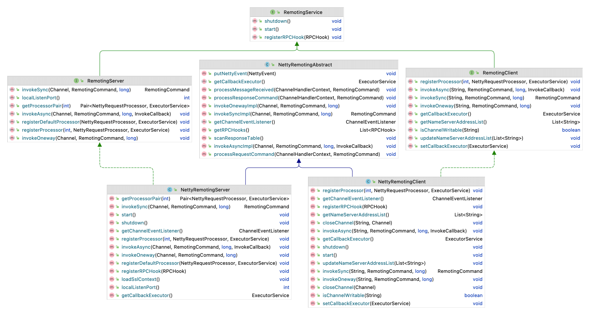
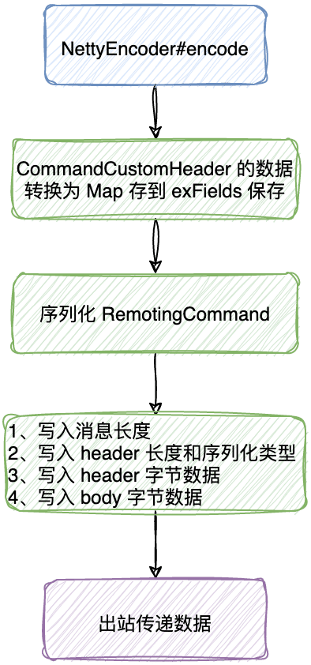
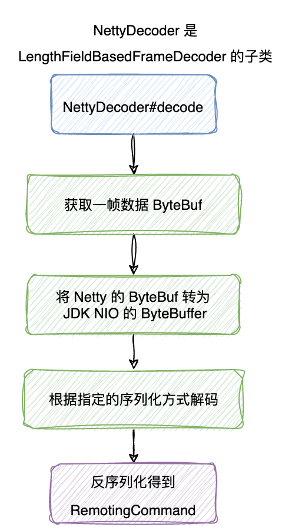
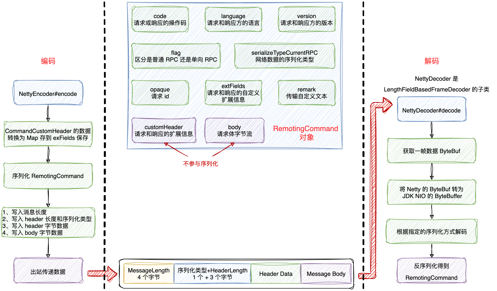
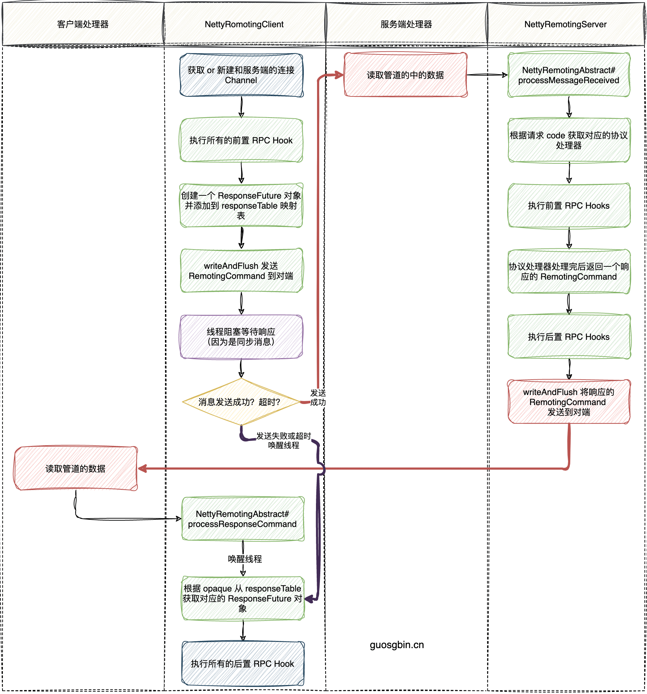
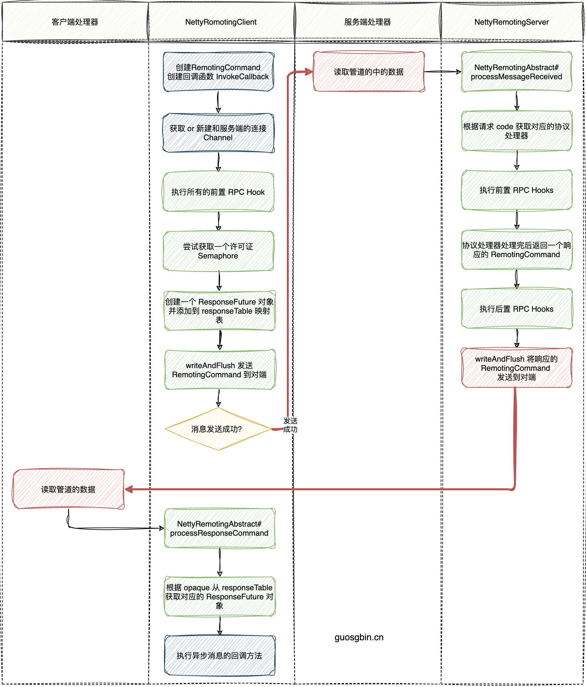
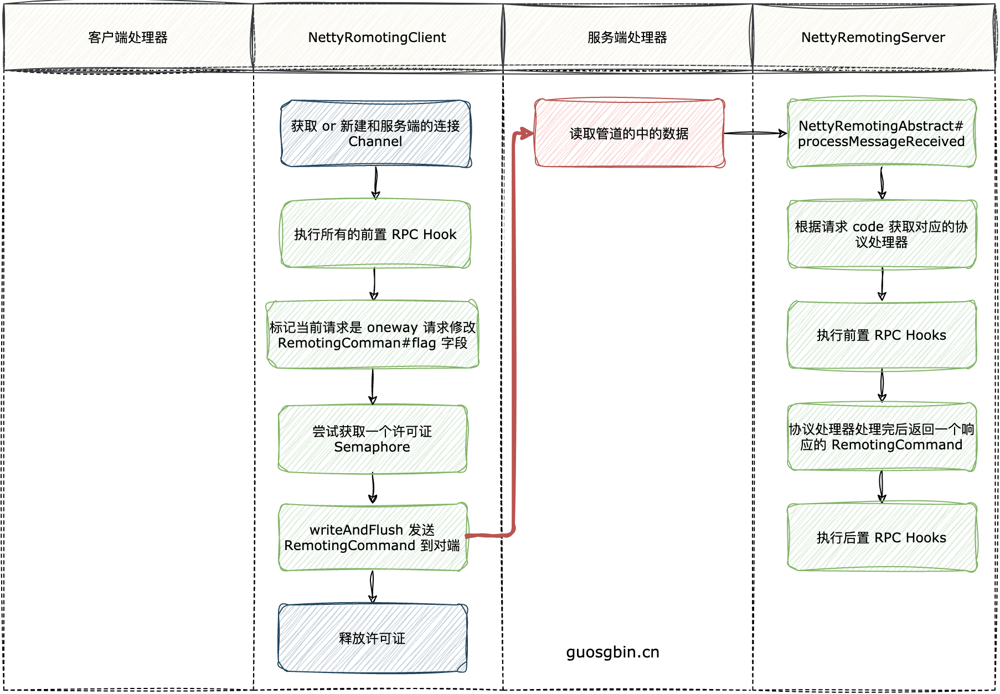

| 版本 | 内容     | 时间                   |
| ---- | -------- | ---------------------- |
| V1   | 新建     | 2022年08月01日23:20:55 |
| V2   | 重构     | 2023年06月09日00:55:20 |
| V3   | 新增图片 | 2023年06月09日23:35:13 |

## 本章分析流程

- 分析通信相关类的继承关系，和它们提供的 API；
- 分析 RocketMQ 的消息协议设计和编解码；
- 分析发送同步消息、异步消息和单向消息的流程，包括双端是如何处理的；
- 分析如何处理超时的那些请求；

## 通信相关类的继承图



## 接口和抽象类分析

在 RocketMQ 的通信层中有三个重要的接口。

1. RemotingService
2. RemotingServer
3. RemotingClient

和一个抽象类 NettyRemotingAbstract，这个抽象类是服务端和客户端的实现的公共父类。

### RemotingService 接口

RemotingService 接口是 RocketMQ 网络通信的顶层接口。

```java
public interface RemotingService {
    // 启动服务
    void start();

    // 关闭服务
    void shutdown();

    // 注册 rpc hook
    void registerRPCHook(RPCHook rpcHook);
}
```

就是启动服务、关闭服务和注册 RPC 钩子函数。

关于 RPCHook 钩子函数，其实就是在发送 RPC 的前后调用的方法，有点类似 Spring 的环绕通知。

```java
public interface RPCHook {
    void doBeforeRequest(final String remoteAddr, final RemotingCommand request);

    void doAfterResponse(final String remoteAddr, final RemotingCommand request,
        final RemotingCommand response);
}
```

### RemotingServer 接口

RemotingServer 接口是 RocketMQ 中作为服务端的接口。

```java
public interface RemotingServer extends RemotingService {

    // 注册协议处理器
    void registerProcessor(final int requestCode, final NettyRequestProcessor processor,
        final ExecutorService executor);

    // 注册默认的协议处理器
    void registerDefaultProcessor(final NettyRequestProcessor processor, final ExecutorService executor);

    int localListenPort();

    // 根据消息 code 获取协议处理器
    Pair<NettyRequestProcessor, ExecutorService> getProcessorPair(final int requestCode);

    // 同步发送消息
    RemotingCommand invokeSync(final Channel channel, final RemotingCommand request,
        final long timeoutMillis) throws InterruptedException, RemotingSendRequestException,
        RemotingTimeoutException;

    // 异步发送消息
    void invokeAsync(final Channel channel, final RemotingCommand request, final long timeoutMillis,
        final InvokeCallback invokeCallback) throws InterruptedException,
        RemotingTooMuchRequestException, RemotingTimeoutException, RemotingSendRequestException;

    // 单向发送消息
    void invokeOneway(final Channel channel, final RemotingCommand request, final long timeoutMillis)
        throws InterruptedException, RemotingTooMuchRequestException, RemotingTimeoutException,
        RemotingSendRequestException;

}
```

API 分析：

- 因为是服务端，它要处理来自客户端的请求，所以需要提供一些注册业务处理器的方法，例如 registerProcessor 方法；
- 提供了发送 RPC 请求的 API，例如发送同步消息的 invokeSync 方法；

### RemotingClient 接口

RemotingClient 接口和 RemotingServer 接口提供的 API 差不多，提供了发送 RPC 请求的 API，例如发送同步消息的 invokeSync 方法。

另外 RemotingClient 提供了获取 NameServer 地址的方法

```java
public interface RemotingClient extends RemotingService {
    // 更新 NameServer 的地址
    void updateNameServerAddressList(final List<String> addrs);

    // 获取 NameServer 的地址
    List<String> getNameServerAddressList();
    
}
```

### NettyRemotingAbstract 抽象类

NettyRemotingAbstract 抽象类是 NettyRemotingServer 和 NettyRemotingClient 公共父类。主要是定义了客户端和服务端都用到的一些属性。例如：

（1）请求的并发限制，用于防止系统内存占用过高：

```java
// 单向请求的并发量，防止系统内存占用过高
protected final Semaphore semaphoreOneway;

// 异步请求的并发量，防止系统内存占用过高
protected final Semaphore semaphoreAsync;
```

（2）一个 RPC 都有一个请求 id，在发送 RPC 请求之前将请求 id 存放到 responseTable 中保存，当对端响应数据后又将请求 id 对应的 ResponseFuture 从 responseTable 中移除。通过定时扫描 responseTable 就可以知道那些 RPC 请求超时了。

```java
protected final ConcurrentMap<Integer /* opaque */, ResponseFuture> responseTable =
    new ConcurrentHashMap<Integer, ResponseFuture>(256);
```

（3）请求 code 和对应的业务处理器、线程池的映射关系。也就是说一个 code 对应的请求需要对应的 NettyRequestProcessor 来处理；

```java
protected final HashMap<Integer/* request code */, Pair<NettyRequestProcessor, ExecutorService>> processorTable =
    new HashMap<Integer, Pair<NettyRequestProcessor, ExecutorService>>(64);
```

（4）缺省的业务处理器，也就是说假如 code 对应的业务处理器在（3）的映射关系中没有找到，就用缺省的 defaultRequestProcessor 来处理了。NameServer 用的就是这个 。

```java
protected Pair<NettyRequestProcessor, ExecutorService> defaultRequestProcessor;
```

（5）NettyEventExecutor 是 Thread 类型，它的作用是监听 Netty 的 Channel 状态变化。当 Channel 的状态发生改变后，监听状态改变的监听器就会执行对应的方法。

```java
protected final NettyEventExecutor nettyEventExecutor = new NettyEventExecutor();
```

（6）RPCHook 列表，在执行 RPC 前后时会执行这些钩子函数的逻辑。类似 Spring 的环绕通知。

```java
protected List<RPCHook> rpcHooks = new ArrayList<RPCHook>();
```


关于 NettyRemotingAbstract 实现的方法，就是发送消息、执行钩子函数、检查 RPC 请求是否超时等方法，遇到了再具体分析。


## 消息协议设计以及编解码

### 协议设计

RocketMQ 中的网络传输数据的格式如下：


可见传输内容主要可以分为以下 4 部分：

1. 消息长度：总长度，四个字节存储，占用一个 int 类型；
2. 序列化类型 & 消息头长度：同样占用一个 int 类型，第一个字节表示序列化类型，后面三个字节表示消息头长度；
3. 消息头 Header 数据：经过序列化后的消息头数据；
4. 消息体 Body 数据：消息主体的二进制字节数据内容；

关于消息头的各个字段的格式如下表所示：

| Header字段 | 类型                    | Request 说明                                                 | Response 说明                            |
| ---------- | ----------------------- | ------------------------------------------------------------ | ---------------------------------------- |
| code       | int                     | 请求操作码，应答方根据不同的请求码进行不同的业务处理         | 应答响应码。0表示成功，非0则表示各种错误 |
| language   | LanguageCode            | 请求方实现的语言                                             | 应答方实现的语言                         |
| version    | int                     | 请求方程序的版本                                             | 应答方程序的版本                         |
| opaque     | int                     | 相当于 requestId，在同一个连接上的不同请求标识码，与响应消息中的相对应 | 应答不做修改直接返回                     |
| flag       | int                     | 区分是普通 RPC 还是 oneway RPC 的标志                        | 区分是普通 RPC 还是 onewayRPC 的标志     |
| remark     | String                  | 传输自定义文本信息                                           | 传输自定义文本信息                       |
| extFields  | HashMap<String, String> | 请求自定义扩展信息                                           | 响应自定义扩展信息                       |

以 broker 向 NameServer 注册的 RPC 请求的消息头 Header 为例，它的数据长下面这样，其中 extFields 是每种请求特有自定义的数据，其他数据是所有请求和响应共用的字段。

```json
{
    "code": 103,
    "extFields": {
        "brokerId": "0",
        "bodyCrc32": "1818433699",
        "clusterName": "DefaultCluster",
        "brokerAddr": "172.16.50.43:10911",
        "haServerAddr": "172.16.50.43:10912",
        "compressed": "false",
        "brokerName": "broker-a"
    },
    "flag": 0,
    "language": "JAVA",
    "opaque": 2,
    "serializeTypeCurrentRPC": "JSON",
    "version": 399
}
```

关于传输的消息体，每种类型的消息体都不一样，有的消息其实也没有消息体。同样以 broker 向 NameServer 注册的 RPC 请求的消息体 Body 为例：

```json
{
    "filterServerList": [],
    "topicConfigSerializeWrapper": {
        "dataVersion": {
            "counter": 3,
            "timestamp": 1649954601593
        },
        "topicConfigTable": {
            "SCHEDULE_TOPIC_XXXX": {
                "order": false,
                "perm": 6,
                "readQueueNums": 18,
                "topicFilterType": "SINGLE_TAG",
                "topicName": "SCHEDULE_TOPIC_XXXX",
                "topicSysFlag": 0,
                "writeQueueNums": 18
            },
            
            // ...... 省略其它 ......
        }
    }
}
```

### RemotingCommand 消息封装

在 RocketMQ 中所有要传输的网络数据封装在 RemotingCommand 类中，下面看下它的成员属性，可以很清楚的看到，RemotingCommand 类的属性和我们上一节的协议设计的字段一模一样。

```java
// 消息请求或响应的 code
private int code;
// 请求方或响应方使用的语言
private LanguageCode language = LanguageCode.JAVA;
// 请求方或响应方程序的版本号
private int version = 0;
// requestId
private int opaque = requestId.getAndIncrement();
// 标记位，区分是普通 RPC 还是 oneway RPC 的标志，
// 1-响应
// 2-oneway
private int flag = 0;
// 传输自定义文本信息
private String remark;
// 自定义扩展信息
private HashMap<String, String> extFields;

// 不参与序列化 反射将 customHeader 压入到 extFields
private transient CommandCustomHeader customHeader;

// 序列化类型，默认 json
private SerializeType serializeTypeCurrentRPC = serializeTypeConfigInThisServer;

// 不参与序列化
private transient byte[] body;
```

有两个字段需要注意，那就是 customHeader 和 body，这两个字段被 transient 修饰，也就是说这两个字段不参与序列化。

- body：在组装数据的时候就被转换成字节流了；
- customHeader：这个字段会在 NettyEncoder 中处理，其实就是将 customHeader 字段的内容存放到 Map 类型的 extFields 中，再参与序列化；

### NettyEncoder 编码器

编码器的流程如下：



```java
@ChannelHandler.Sharable
public class NettyEncoder extends MessageToByteEncoder<RemotingCommand> {
    private static final InternalLogger log = InternalLoggerFactory.getLogger(RemotingHelper.ROCKETMQ_REMOTING);

    /**
     * 编码
     *
     * RemotingCommand 对象里的 customHeader 和 body 不参与序列化
     * 会将 customHeader 里的字段通过反射添加到 extFields（一个 map）中
     */
    @Override
    public void encode(ChannelHandlerContext ctx, RemotingCommand remotingCommand, ByteBuf out)
        throws Exception {
        try {
            ByteBuffer header = remotingCommand.encodeHeader();
            out.writeBytes(header);
            byte[] body = remotingCommand.getBody();
            if (body != null) {
                out.writeBytes(body);
            }
        } catch (Exception e) {
            log.error("encode exception, " + RemotingHelper.parseChannelRemoteAddr(ctx.channel()), e);
            if (remotingCommand != null) {
                log.error(remotingCommand.toString());
            }
            RemotingUtil.closeChannel(ctx.channel());
        }
    }
}
```

那么关键就是 RemotingCommand#encodeHeader()  方法：

代码很简单：

1. 调用重载的 encodeHeader 方法，
   1. 假如 RemotingCommand 的 body 属性有值就传入 body 的长度；
   2. 假如没有值就传 0；
2. 调用 RemotingCommand#headerEncode 将 RemotingCommand 序列化；（注意 transient 修饰的字段不被序列化）
3. 依次添加，消息总长度 length，序列化类型 + headerLength，header Data 到 ByteBuffer 里；

那么问题来了，我们的 body Data 怎么没添加到 ByteBuffer 里啊？这个是在 NettyEncoder 中添加的。

```java
public ByteBuffer encodeHeader() {
    return encodeHeader(this.body != null ? this.body.length : 0);
}

public ByteBuffer encodeHeader(final int bodyLength) {
    // 1> header length size
    int length = 4;

    // 2> header data length
    byte[] headerData;
    headerData = this.headerEncode();

    length += headerData.length;

    // 3> body data length
    length += bodyLength;

    // 申请堆内内存 4 + (4 + headerData.length)
    ByteBuffer result = ByteBuffer.allocate(4 + length - bodyLength);

    // length 4个字节
    result.putInt(length);

    // header length  4个字节
    result.put(markProtocolType(headerData.length, serializeTypeCurrentRPC));

    // header data
    result.put(headerData);

    result.flip();

    return result;
}
```

OK 这里已经知道 RocketMQ 是如何编码的了。

### NettyDecoder 解码器

NettyDecoder 继承自 LengthFieldBasedFrameDecoder，为了解决粘包拆包问题。

构造方法：

```java
public NettyDecoder() {
    // |长度 4 字节| - | 数据 |
    super(FRAME_MAX_LENGTH, 0, 4, 0, 4);
}
```

根据它的构造方法，可以得到的信息是：

```
lengthFieldOffset = 0
lengthFieldLength  = 4
lengthAdjustment   = 0
initialBytesToStrip = 4

BEFORE DECODE (16 bytes)         AFTER DECODE (12 bytes)
+------------+----------------+      +----------------+
|   Length   | Actual Content |----->| Actual Content |
| 0x0000000C | "HELLO, WORLD" |      | "HELLO, WORLD" |
+------------+----------------+      +----------------+
```

解码流程：

1. 获取一帧数据；
2. 将该 Netty 的 ByteBuf 转为 JDK NIO 的ByteBuffer；
3. 调用 RemotingCommand#decode(ByteBuffer) 方法解码，将网络数据转换为 RemotingCommand 实例；



```java
public class NettyDecoder extends LengthFieldBasedFrameDecoder {
    private static final InternalLogger log = InternalLoggerFactory.getLogger(RemotingHelper.ROCKETMQ_REMOTING);

    private static final int FRAME_MAX_LENGTH =
        Integer.parseInt(System.getProperty("com.rocketmq.remoting.frameMaxLength", "16777216"));

    public NettyDecoder() {
        // |长度 4 字节| - | 数据 |
        super(FRAME_MAX_LENGTH, 0, 4, 0, 4);
    }

    @Override
    public Object decode(ChannelHandlerContext ctx, ByteBuf in) throws Exception {
        ByteBuf frame = null;
        try {

            frame = (ByteBuf) super.decode(ctx, in);
            if (null == frame) {
                return null;
            }

            // 转换为 ByteBuffer
            ByteBuffer byteBuffer = frame.nioBuffer();

             // 此时的 ByteBuffer 是
            // | 4 字节（1 个存序列化协议类型，3 个存headerData.length）| - | headerData 数据| - | body 数据 |
            return RemotingCommand.decode(byteBuffer);
        } catch (Exception e) {
            log.error("decode exception, " + RemotingHelper.parseChannelRemoteAddr(ctx.channel()), e);
            RemotingUtil.closeChannel(ctx.channel());
        } finally {
            if (null != frame) {
                frame.release();
            }
        }

        return null;
    }
}
```


那么关键就是 RemotingCommand#decode(ByteBuffer)  方法，这个方法里面就是 JDK NIO 的 API 操作了。

```java
public static RemotingCommand decode(final ByteBuffer byteBuffer) throws RemotingCommandException {
        // headerData.length + body.length
        int length = byteBuffer.limit();
        // 这个 oriHeaderLen 里包含了 协议类型 和 headerData.length
        int oriHeaderLen = byteBuffer.getInt();
        // 获取 headerData.length
        int headerLength = getHeaderLength(oriHeaderLen);

        byte[] headerData = new byte[headerLength];
        byteBuffer.get(headerData);

        // 获取协议类型，解码 headerData
        RemotingCommand cmd = headerDecode(headerData, getProtocolType(oriHeaderLen));

        // 计算 body 的长度
        int bodyLength = length - 4 - headerLength;
        byte[] bodyData = null;
        if (bodyLength > 0) {
            bodyData = new byte[bodyLength];
            // 获取 body 数据
            byteBuffer.get(bodyData);
        }
        cmd.body = bodyData;

        return cmd;
    }
```

十分明了啦，解码后得到 RemotingCommand 实例。

### 消息协议和编解码小结



## 发送消息

在 RocketMQ 中，发送 RPC 消息有三种类型：

- 发送同步消息；
- 发送异步消息；
- 发送单向消息；

### 发送同步消息

以 NettyRemotingClient#invokeSync 分析，Server 端也有类似的。首先看下发送同步消息的整体流程图：



#### 发送同步消息准备

主要流程：

1. 因为是客户端，首先需要和服务端建立连接，所以需要调用 NettyRemotingClient#getAndCreateChannel 方法获取连接 Channel；
2. 校验连接状态后，首先执行所有的前置的 RPC hook 函数；
3. 校验执行前置 RPC 钩子函数的时候是否超时；
4. 执行抽象类的 NettyRemotingAbstract#invokeSyncImpl 方法发送同步消息；
5. 执行所有的后置的 RPC hook 函数；

```java
@Override
public RemotingCommand invokeSync(String addr, final RemotingCommand request, long timeoutMillis)
    throws InterruptedException, RemotingConnectException, RemotingSendRequestException, RemotingTimeoutException {
    long beginStartTime = System.currentTimeMillis();
    // 获取或者创建一个客户端和服务端的通道 Channel，
    final Channel channel = this.getAndCreateChannel(addr);
    // 校验通道的状态，条件成立则说明客户端和服务端的通到已经连接，可以通信
    if (channel != null && channel.isActive()) {
        try {
            // 执行 RPC 钩子函数
            doBeforeRpcHooks(addr, request);
            long costTime = System.currentTimeMillis() - beginStartTime;
            if (timeoutMillis < costTime) {
                throw new RemotingTimeoutException("invokeSync call the addr[" + addr + "] timeout");
            }
            // 同步获得服务端的响应数据 response
            RemotingCommand response = this.invokeSyncImpl(channel, request, timeoutMillis - costTime);
            // 执行 RPC 钩子函数
            doAfterRpcHooks(RemotingHelper.parseChannelRemoteAddr(channel), request, response);
            return response;
        } catch (RemotingSendRequestException e) {
           // ...... 省略异常处理 ......
        } catch (RemotingTimeoutException e) {
            // ...... 省略异常处理 ......
        }
    } else {
        this.closeChannel(addr, channel);
        throw new RemotingConnectException(addr);
    }
}
```

#### 发送同步消息过程

OK 下面来分析 NettyRemotingAbstract#invokeSyncImpl  做了什么

发送同步消息的入参就分为三个：

1. 连接的 Channel；
2. 网络数据的封装对象 RemotingCommand；
3. RPC 超时时间；

NettyRemotingAbstract#invokeSyncImpl  方法比较长，我们分步分析该方法的逻辑：

**（1）首先获取此次的请求 id，代表当前请求。**

```java
final int opaque = request.getOpaque();
```

**（2）创建 ResponseFuture 对象，该对象保存了当前请求相关的数据，如 Channel、请求 id、RPC 超时时间。将 ResponseFuture 保存到 NettyRemotingAbstract#responseTable 中，这是一个 Map。**

```java
// 创建 ResponseFuture 对象
final ResponseFuture responseFuture = new ResponseFuture(channel, opaque, timeoutMillis, null, null);
// 添加到请求的映射表内 key 是 opaque
this.responseTable.put(opaque, responseFuture);
```

**（3）发送数据到对端，并添加监听器。(监听器的代码这里先省略不看)**

```java
// request 写入到客户端 Channel，并注册监听器
channel.writeAndFlush(request).addListener(new ChannelFutureListener() {
    @Override
    public void operationComplete(ChannelFuture f) throws Exception {
        // ...... 省略监听器的代码 ......
    }
});
```

**（4）因为是同步发送消息，需要等待服务端的数据返回。所以这里用 CountDownLatch 来做线程通信。**

```java
// 因为同步调用，业务线程在这里挂起，指定超时时间
RemotingCommand responseCommand = responseFuture.waitResponse(timeoutMillis);
```

ResponseFuture#waitResponse 方法的实现如下，其中 CountDownLatch 的初始值是 1。当 CountDownLatch 的值减少到了 0 时，就会返回 responseCommand 的数据了。

```java
public RemotingCommand waitResponse(final long timeoutMillis) throws InterruptedException {
    this.countDownLatch.await(timeoutMillis, TimeUnit.MILLISECONDS);
    return this.responseCommand;
}
```

**（5）数据是否发送成功，可以通过前面在 ctx.writeAndFlush(xxx) 的监听器中知道，监听器的代码如下：**

```java
// request 写入到客户端 Channel，并注册监听器
channel.writeAndFlush(request).addListener(new ChannelFutureListener() {
    @Override
    public void operationComplete(ChannelFuture f) throws Exception {
        if (f.isSuccess()) {
            // 请求写成功了
            responseFuture.setSendRequestOK(true);
            return;
        } else {
            // 写失败了...
            responseFuture.setSendRequestOK(false);
        }

        // 走到此处，前置条件是写失败了...
        // 当前请求的 responseFuture 从映射表移除
        responseTable.remove(opaque);
        // 设置失败原因
        responseFuture.setCause(f.cause());
        // 唤醒 countDownLatch#await 的线程
        responseFuture.putResponse(null);
        log.warn("send a request command to channel <" + addr + "> failed.");
    }
});
```

- 成功发送数据到对端：设置 sendRequestOK 的值为 true 后，直接返回；
- 数据未成功发送：设置 sendRequestOK 的值为 false 后，将该请求 id 对应的 ResponseFuture 从 Map 中删除，同时调用 ResponseFuture#putResponse 将 CountDownLatch 的值减为 0，唤醒前面发送消息的线程。

```java
public void putResponse(final RemotingCommand responseCommand) {
    this.responseCommand = responseCommand;
    this.countDownLatch.countDown();
}
```

**（6）这里分析数据成功发送到服务端后，服务端响应数据到客户端，最终会调用到 NettyRemotingAbstract#processResponseCommand 方法，可以看到也是将该请求 id 对应的 ResponseFuture 从 Map 中删除，同时调用 ResponseFuture#putResponse 将 CountDownLatch 的值减为 0，唤醒前面发送消息的线程**

```java
public void processResponseCommand(ChannelHandlerContext ctx, RemotingCommand cmd) {
    // 获取响应的 opaque
    final int opaque = cmd.getOpaque();
    // 从响应的映射表 responseTable 中获取 ResponseFuture
    final ResponseFuture responseFuture = responseTable.get(opaque);
    if (responseFuture != null) {
        // 设置客户端 cmd
        responseFuture.setResponseCommand(cmd);

        // 通过 opaque 移除 ResponseFuture
        responseTable.remove(opaque);

        if (responseFuture.getInvokeCallback() != null) {
            // ...... 省略异步处理 ......
        } else {
            // 同步走这里
            // 设置 future 的结果，这里会调用 CountDownLatch 的 countDown() 方法
            // 将同步调用的业务线程唤醒
            responseFuture.putResponse(cmd);
            responseFuture.release();
        }
    } else {
        // ...... 省略日志打印 ......
    }
}
```

（7）最后是返回响应数据 responseCommand。有三种情况：

- 正常情况：对端返回数据了，将发送同步消息的线程唤醒；
- 异常情况：countDownLatch#await 超时自动唤醒；
- 异常情况：发送数据到服务端失败，例如写缓冲区满了；

```java
if (null == responseCommand) {
    if (responseFuture.isSendRequestOK()) {
        // CASE2:超时
        throw new RemotingTimeoutException(RemotingHelper.parseSocketAddressAddr(addr), timeoutMillis,
            responseFuture.getCause());
    } else {
        // CASE3:发送失败
        throw new RemotingSendRequestException(RemotingHelper.parseSocketAddressAddr(addr), responseFuture.getCause());
    }
}
// CASE1:正常情况，返回客户端请求结果
return responseCommand;
```

### 发送异步消息

既然是发送异步消息，那么就必须要一个回调函数，当对端处理完消息时需要回调这个函数。

RocketMQ 中的 org.apache.rocketmq.remoting.InvokeCallback 接口就是定义回调函数的接口，就一个方法。

```java
public interface InvokeCallback {
    void operationComplete(final ResponseFuture responseFuture);
}
```

NettyRemotingClient#invokeAsync 发送异步方法的流程和上面发送同步消息的流程基本上一样。先看流程图：



直接来看 NettyRemotingAbstract#invokeAsyncImpl 吧。

入参：

1. 连接通道 Channel；
2. 网络请求对象 RemotingCommand；
3. RPC 超时时间；
4. 回调函数；

前面已经分析过发送同步 RPC 消息的过程，在分析发送异步消息的流程就简单点，主要分析差异点。

```java
public void invokeAsyncImpl(final Channel channel, final RemotingCommand request, final long timeoutMillis,
        final InvokeCallback invokeCallback)
        throws InterruptedException, RemotingTooMuchRequestException, RemotingTimeoutException, RemotingSendRequestException {
        // 开始时间
        long beginStartTime = System.currentTimeMillis();
        // 请求 id
        final int opaque = request.getOpaque();
        // 因为有发送异步消息有并发度的限制，尝试获取一个信号量许可证，会阻塞线程
        boolean acquired = this.semaphoreAsync.tryAcquire(timeoutMillis, TimeUnit.MILLISECONDS);
        if (acquired) {
            // SemaphoreReleaseOnlyOnce 对象封装了释放信号量的操作
            final SemaphoreReleaseOnlyOnce once = new SemaphoreReleaseOnlyOnce(this.semaphoreAsync);
            long costTime = System.currentTimeMillis() - beginStartTime;
            if (timeoutMillis < costTime) {
                // 已经超时了，需要释放信号量
                once.release();
                throw new RemotingTimeoutException("invokeAsyncImpl call timeout");
            }

            // 注意剩余的超时时间是 timeoutMillis - costTime
            // 创建 ResponseFuture 对象
            final ResponseFuture responseFuture = new ResponseFuture(channel, opaque, timeoutMillis - costTime, invokeCallback, once);
            // 添加到映射表
            this.responseTable.put(opaque, responseFuture);
            try {
                // 业务线程将数据交给 Netty，netty 的 IO 线程做写和刷新的操作
                // 使用客户端 Channel 发送 request，注册监听器，监听器是 IO 线程调用的
                channel.writeAndFlush(request).addListener(new ChannelFutureListener() {
                    @Override
                    public void operationComplete(ChannelFuture f) throws Exception {
                        if (f.isSuccess()) {
                            responseFuture.setSendRequestOK(true);
                            return;
                        }
                        // 设置发送失败，删除映射表 responseTable 的数据，执行回调函数
                        requestFail(opaque);
                        log.warn("send a request command to channel <{}> failed.", RemotingHelper.parseChannelRemoteAddr(channel));
                    }
                });
            } catch (Exception e) {
               // ...... 省略异常处理 ......
            }
        } else {
           // ...... 省略获取许可证失败的处理，并发度过高 ......
        }
    }
```

这里主要分析异步 RPC 消息和同步 RPC 消息的差异点。

- 在 RocketMQ 中异步消息和 one way 消息都是用并发限制的，使用 Semaphore 来做并发限制；

- 同样是创建 ResponseFuture 对象，异步 RPC 消息多了 InvokeCallback 和 SemaphoreReleaseOnlyOnce 类型的参数。

  - InvokeCallback：是异步消息发送成功或者发送失败后需要回调的函数，由业务自定义；
  - SemaphoreReleaseOnlyOnce：我们说了异步消息是有并发度限制的，当异步消息发送成功或失败后需要释放此次获取的许可证；

- 最后在 channel.writeAndFlush(xxx) 的监听器中发送数据失败时调用了 NettyRemotingAbstract#requestFail 方法，它的实现如下，做的事情注释写的比较清楚。

  ```java
  private void requestFail(final int opaque) {
      // 移除映射表
      ResponseFuture responseFuture = responseTable.remove(opaque);
      if (responseFuture != null) {
          responseFuture.setSendRequestOK(false);
          // 里面会调用 countDownLatch.countDown()
          responseFuture.putResponse(null);
          try {
              // 执行回调方法
              executeInvokeCallback(responseFuture);
          } catch (Throwable e) {
              log.warn("execute callback in requestFail, and callback throw", e);
          } finally {
              // 释放 Semaphore 许可证
              responseFuture.release();
          }
      }
  }
  ```

那么问题来了，前面只分析了异步消息发送失败后会做什么，那么异步消息发送成功后，对端响应消息后是如何执行回调函数的呢？

和同步 RPC 消息一样，同样是在 NettyRemotingAbstract#processResponseCommand 方法中处理的，就是调用自定义的 InvokeCallback 回调函数了。

```java
public void processResponseCommand(ChannelHandlerContext ctx, RemotingCommand cmd) {
    // 获取响应的 opaque
    final int opaque = cmd.getOpaque();
    // 从响应的映射表 responseTable 中获取 ResponseFuture
    final ResponseFuture responseFuture = responseTable.get(opaque);
    if (responseFuture != null) {
        // 设置客户端 cmd
        responseFuture.setResponseCommand(cmd);

        // 通过 opaque 移除 ResponseFuture
        responseTable.remove(opaque);

        if (responseFuture.getInvokeCallback() != null) {
            // 异步走这里
            // 回调对象处理结果
            executeInvokeCallback(responseFuture);
        } else {
            // ...... 省略同步的处理 ......
        }
    } else {
        // ...... 省略 ......
    }
}
```

### 发送单向消息

先看流程图：



NettyRemotingClient#invokeOneway

```java
@Override
public void invokeOneway(String addr, RemotingCommand request, long timeoutMillis) throws InterruptedException,
RemotingConnectException, RemotingTooMuchRequestException, RemotingTimeoutException, RemotingSendRequestException {
    final Channel channel = this.getAndCreateChannel(addr);
    if (channel != null && channel.isActive()) {
        try {
            doBeforeRpcHooks(addr, request);
            this.invokeOnewayImpl(channel, request, timeoutMillis);
        } catch (RemotingSendRequestException e) {
            // ...... 省略异常处理 ......
        }
    } else {
        // ...... 省略异常处理 ......
    }
}
```

两步骤：

- 获取已有连接，或者创建一个新的连接；
- 执行所有前置 RPC Hook 方法；

NettyRemotingClient#invokeOneway 发送单向消息：

```java
public void invokeOnewayImpl(final Channel channel, final RemotingCommand request, final long timeoutMillis)
        throws InterruptedException, RemotingTooMuchRequestException, RemotingTimeoutException, RemotingSendRequestException {
        // 设置单向发送的标记，对端检查标记就可以知道是请求是单向请求
        request.markOnewayRPC();
        // 申请信号量
        boolean acquired = this.semaphoreOneway.tryAcquire(timeoutMillis, TimeUnit.MILLISECONDS);
        if (acquired) {
            // 释放信号量逻辑的封装对象
            final SemaphoreReleaseOnlyOnce once = new SemaphoreReleaseOnlyOnce(this.semaphoreOneway);
            try {
                // 将数据交给 Channel，这里数据发送的逻辑由 Netty 线程完成
                // 注册监听器，由 Netty 的 IO 线程回调
                channel.writeAndFlush(request).addListener(new ChannelFutureListener() {
                    @Override
                    public void operationComplete(ChannelFuture f) throws Exception {
                        // 只要操作完成，就释放信号量
                        once.release();
                        if (!f.isSuccess()) {
                            log.warn("send a request command to channel <" + channel.remoteAddress() + "> failed.");
                        }
                    }
                });
            } catch (Exception e) {
                once.release();
                // ...... 省略异常处理 ......
            }
        } else {
            // ...... 省略 发送单向消息并发太高，获取许可证超时 ......
        }
    }
```

发送单向消息相对于同步消息和异步消息简单很多，因为它不需要处理对端的响应。

- 单向消息的请求头特殊点，request.markOnewayRPC() 将 flag 改为 2，表示是单向消息，这样服务端就不用响应了；
- 单向消息同样是需要控制并发度的，也是通过 Semaphore 来控制的；
- 然后直接 channel.writeAndFlush(xxx) 发送数据到对端，应为是单向消息，所以不需要处理响应；

## 接收处理消息

### 接收消息入口

服务端和客户端都有一个处理器专门用来接收对端发送过来的消息。

1. NettyRemotingClient.NettyClientHandler
2. NettyRemotingServer.NettyServerHandler

以 NettyRemotingServer.NettyServerHandler 为例：

```java
@ChannelHandler.Sharable
class NettyServerHandler extends SimpleChannelInboundHandler<RemotingCommand> {

    @Override
    protected void channelRead0(ChannelHandlerContext ctx, RemotingCommand msg) throws Exception {
        processMessageReceived(ctx, msg);
    }
}
```

它们最终都调用到了 NettyRemotingAbstract#processMessageReceived 方法，根据消息类型的不同做不同的处理。

```java
public void processMessageReceived(ChannelHandlerContext ctx, RemotingCommand msg) throws Exception {
    final RemotingCommand cmd = msg;
    if (cmd != null) {
        switch (cmd.getType()) {
                // 处理请求
            case REQUEST_COMMAND:
                processRequestCommand(ctx, cmd);
                break;
                // 处理响应走这里
            case RESPONSE_COMMAND:
                processResponseCommand(ctx, cmd);
                break;
            default:
                break;
        }
    }
}
```

### 处理请求类型消息

TODO-KWOK 上图

NettyRemotingAbstract#processRequestCommand

```java
public void processRequestCommand(final ChannelHandlerContext ctx, final RemotingCommand cmd) {
        // 根据业务 code，得到对应的处理器和线程池
        final Pair<NettyRequestProcessor, ExecutorService> matched = this.processorTable.get(cmd.getCode());
        // 假如没有找到对应的处理器和线程池，则使用缺省的处理器和线程池
        final Pair<NettyRequestProcessor, ExecutorService> pair = null == matched ? this.defaultRequestProcessor : matched;
        // 获取请求 id
        final int opaque = cmd.getOpaque();

        if (pair != null) {
            // 封装一个 Runnable 对象，核心逻辑入口
            Runnable run = new Runnable() {
                @Override
                public void run() {
                    // ...... 省略 Runnable 的具体实现 ......
                }
            };

            // ...... 省略是否忽略该请求的校验 ......

            try {
                // 将上面封装的 Runnable 和 Channel 和 cmd 封装为 RequestTask 对象
                final RequestTask requestTask = new RequestTask(run, ctx.channel(), cmd);
                // 获取处理器对应的线程池，提交任务
                pair.getObject2().submit(requestTask);
            } catch (RejectedExecutionException e) {
                // ...... 省略异常处理 ......
            }
        } else {
            // ...... 省略没有找到 code 对应的处理器的情况的处理 ......
        }
    }
```

流程如下：

1. 根据 RemotingCommand 的 code 获取对应的协议处理器；
2. 封装一个 Runnable 对象，这个 Runable 是干什么的下面分析；
3. 封装一个 RequestTask 对象，将 Runnable 对象提交到对应的线程池中执行；


前面知道了就是封装一个 Runnable 对象并且执行，现在类分析 Runnable 对象做了什么：

```java
Runnable run = new Runnable() {
    @Override
    public void run() {
        try {
            String remoteAddr = RemotingHelper.parseChannelRemoteAddr(ctx.channel());
            // RPC 前置钩子函数
            doBeforeRpcHooks(remoteAddr, cmd);
            // callback 封装响应客户端的逻辑
            final RemotingResponseCallback callback = new RemotingResponseCallback() {
                @Override
                public void callback(RemotingCommand response) {
                    // RPC 后置钩子函数
                    doAfterRpcHooks(remoteAddr, cmd, response);
                    if (!cmd.isOnewayRPC()) {
                        if (response != null) {
                            response.setOpaque(opaque);
                            response.markResponseType();
                            try {
                                // 将 response 写到对端
                                ctx.writeAndFlush(response);
                            } catch (Throwable e) {
                               // ...... 省略异常处理 ......
                            }
                        } else {
                        }
                    }
                }
            };
            // namesrv 使用的 DefaultRequestProcessor，是 AsyncNettyRequestProcessor 子类
            if (pair.getObject1() instanceof AsyncNettyRequestProcessor) {
                AsyncNettyRequestProcessor processor = (AsyncNettyRequestProcessor)pair.getObject1();
                // 处理请求
                processor.asyncProcessRequest(ctx, cmd, callback);
            } else {
                NettyRequestProcessor processor = pair.getObject1();
                RemotingCommand response = processor.processRequest(ctx, cmd);
                callback.callback(response);
            }
        } catch (Throwable e) {
            // ...... 省略异常处理 ......
            }
        }
    }
};
```

流程：

1. 首先执行后置 RPC hook；
2. 创建一个 RemotingResponseCallback 对象，
   1. 这个对象是在协议处理器处理完消息后会回调的方法；
   2. 首先是执行后置 RPC hook；
   3. 根据当前 RPC 是单向请求，还是异步 or 同步走不同的分支
      1. 假如是单向的 RPC 请求则不处理；
      2. 假如是同步或者异步，需要将响应的 RemotingCommand 对象写到对端；
3. 根据协议处理器是否是 AsyncNettyRequestProcessor 类型走不同的分支，但是都是调用协议处理器的处理方法，并且在最后都调用 RemotingResponseCallback#callback 回调方法。

### 处理响应类型消息

NettyRemotingAbstract#processResponseCommand

**服务端或客户端发送消息到对端后，假如是异步或同步消息时，对端处理完后需要响应消息。**

前面我们已经知道了发送异步或同步消息时，会将当前请求 id 和 对应的 ResponseFuture 对象添加到 NettyRemotingAbstract#responseTable 中，那么当对端响应一条消息时，需要从 responseTable 中得到请求 id 对应的 ResponseFuture 进行处理。

```java
public void processResponseCommand(ChannelHandlerContext ctx, RemotingCommand cmd) {
    // 获取响应的 opaque
    final int opaque = cmd.getOpaque();
    // 从响应的映射表 responseTable 中获取 ResponseFuture
    final ResponseFuture responseFuture = responseTable.get(opaque);
    if (responseFuture != null) {
        // 设置客户端 cmd
        responseFuture.setResponseCommand(cmd);

        // 通过 opaque 移除 ResponseFuture
        responseTable.remove(opaque);

        if (responseFuture.getInvokeCallback() != null) {
            // 异步走这里
            // 回调对象处理结果
            executeInvokeCallback(responseFuture);
        } else {
            // 同步走这里
            // 设置 future 的结果，这里会调用 CountDownLatch 的 countDown() 方法
            // 将同步调用的业务线程唤醒
            responseFuture.putResponse(cmd);
            responseFuture.release();
        }
    } else {
        log.warn("receive response, but not matched any request, " + RemotingHelper.parseChannelRemoteAddr(ctx.channel()));
        log.warn(cmd.toString());
    }
}
```

这里很明显：

1. 根据请求 id 得到发送消息时创建的 ResponseFuture 对象。（这里有一种可能得到的是 null，可能是请求超时被移除了）；
2. 假如 responseFuture 中的 invokeCallback 属性不为 null，说明当前响应消息响应的是异步消息；
   1. 响应的是异步消息，执行 invokeCallback 回调方法；
   2. 响应的是同步消息，countDownLatch 唤醒当前的同步发送代码中 wait 等待的代码；

## 请求超时处理

在 NettyRemotingServer#start 和 NettyRemotingClient#start 中有个定时任务，每 1 秒扫描一次 NettyRemotingAbstract#responseTable 表，将超时的 responseFuture 从 responseTable 中移除，并执行它的回调方法（假如存在的话），

具体方法如下：

```java
public void scanResponseTable() {
    // 超时的 responseFuture 的集合
    final List<ResponseFuture> rfList = new LinkedList<ResponseFuture>();
    Iterator<Entry<Integer, ResponseFuture>> it = this.responseTable.entrySet().iterator();
    while (it.hasNext()) {
        Entry<Integer, ResponseFuture> next = it.next();
        ResponseFuture rep = next.getValue();

        // 校验时间是否超时
        if ((rep.getBeginTimestamp() + rep.getTimeoutMillis() + 1000) <= System.currentTimeMillis()) {
            // 释放信号量
            rep.release();
            // 从 responseTable 中移除
            it.remove();
            // 添加到超时的 responseFuture 的集合
            rfList.add(rep);
            log.warn("remove timeout request, " + rep);
        }
    }

    // 一次回调超时的 ResponseFuture 的回调方法
    for (ResponseFuture rf : rfList) {
        try {
            executeInvokeCallback(rf);
        } catch (Throwable e) {
            log.warn("scanResponseTable, operationComplete Exception", e);
        }
    }
}
```

