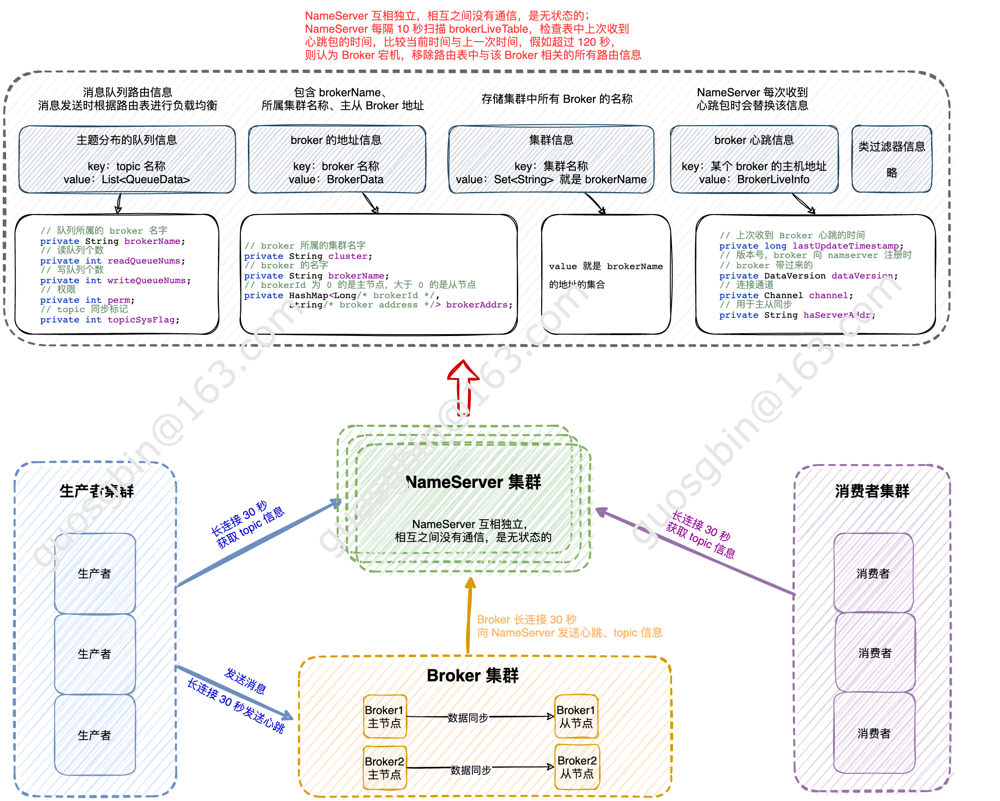

| 版本 | 内容                       | 时间                   |
| ---- | -------------------------- | :--------------------- |
| V1   | 新建                       | 2022年08月01日12:26:16 |
| V2   | 重构，增加NameServer交互图 | 2023年06月10日01:42:55 |

## NameServer 的作用

再次拿官网描述：

NameServer：NameServer 是一个非常简单的 Topic 路由注册中心，其角色类似 Dubbo 中的 zookeeper，支持 Topic、Broker 的动态注册与发现。

主要包括两个功能：

1. **Broker 管理**：NameServer 接受 Broker 集群的注册信息并且保存下来作为路由信息的基本数据。然后提供**心跳检测机制，检查 Broker 是否还存活**；
2. **路由信息管理**：每个 NameServer 将保存关于 Broker 集群的整个路由信息和用于客户端查询的队列信息。然后 Producer 和 Consumer 通过 NameServer 就可以知道整个 Broker 集群的路由信息，从而进行消息的投递和消费；

**NameServer 几乎无状态节点，因此可集群部署，节点之间无任何信息同步。**Broker 是向每一台 NameServer 注册自己的路由信息，所以每一个 NameServer 实例上面都保存一份完整的路由信息。当某个 NameServer 因某种原因下线了，Broker 仍然可以向其它 NameServer 同步其路由信息， Producer 和 Consumer 仍然可以动态感知 Broker 的路由的信息；



## RouteInfoManager 路由信息

在 NamesrvController 的构造函数中， 创建了 NameServer 的核心类 RouteInfoManager

```java
public NamesrvController(NamesrvConfig namesrvConfig, NettyServerConfig nettyServerConfig) {
   	// ...... 省略其他 ......
    
    // 创建路由管理类
    this.routeInfoManager = new RouteInfoManager();
    
    // ...... 省略其他 ......
}
```

NameServer 的主要作用是为 Producer 和 Consumer 提供关于 topic 的路由信息，那么 NameServer 就需要存储路由的基础信息，并且能够管理 Broker 节点，包括路由注册、路由删除等功能。

具体的路由信息保存在 RouteInfoManager 类中，都是 Map 结构。

```java
private final static long BROKER_CHANNEL_EXPIRED_TIME = 1000 * 60 * 2;
private final ReadWriteLock lock = new ReentrantReadWriteLock();
private final HashMap<String/* topic */, List<QueueData>> topicQueueTable;
private final HashMap<String/* brokerName */, BrokerData> brokerAddrTable;
private final HashMap<String/* clusterName */, Set<String/* brokerName */>> clusterAddrTable;
private final HashMap<String/* brokerAddr */, BrokerLiveInfo> brokerLiveTable;
private final HashMap<String/* brokerAddr */, List<String>/* Filter Server */> filterServerTable;
```

| 字段（Map 类型）  | key-value 信息                                         | 含义                                                         |
| ----------------- | ------------------------------------------------------ | ------------------------------------------------------------ |
| topicQueueTable   | key 是 topic，value 是 topic 所在队列的元数据          | 保存 Topic 和队列的信息，也叫真正的路由信息。一个 Topic 全部的 Queue 可能分布在不同的 Broker 中，也可能分布在同一个 Broker 中，消息发送时根据路由表进行负载均衡； |
| brokerAddrTable   | key 是 broker 名称，value 是名称对应的 broker 地址     | 存储了 Broker 名字和 Broker 信息的对应信息；                 |
| clusterAddrTable  | key 是集群名称，value 是集群下有那些 brokerName        | 集群和 Broker 的对应关系；                                   |
| brokerLiveTable   | key 是 broker 的主机地址，value 是 broker 的心跳包内容 | Broker 状态信息，NameServer 每次收到心跳包时会替换该信息；   |
| filterServerTable | key 是broker 的主机地址，value 是类模式过滤            | 过滤服务器信息。类模式过滤机制在4.4及以后版本被废弃；        |

NameServer 的主要工作就是维护这五个变量中存储的信息。

上面的常量 BROKER_CHANNEL_EXPIRED_TIME 表示 Broker 的默认存活的周期，默认 120 秒，意思就是假如 broker 超过 120 秒没有发送心跳就认为是掉线了，就做路由剔除操作。

### topicQueueTable

```java
private final HashMap<String/* topic */, List<QueueData>> topicQueueTable;
```

**保存 Topic 和队列的信息，也叫真正的路由信息。一个 Topic 全部的 Queue 可能分布在不同的 Broker 中，也可能分布在同一个 Broker 中，消息发送时根据路由表进行负载均衡。**

key 是 topic 的名字，value 是 QueueData 对象的集合。

单个 QueueData 结构如下所示

```java
public class QueueData implements Comparable<QueueData> {
    // broker 名字
    private String brokerName;
    // 读队列个数
    private int readQueueNums;
    // 写队列个数
    private int writeQueueNums;
    // 权限
    private int perm;
    // topic 同步标记
    private int topicSysFlag;
}
```

### brokerAddrTable

```java
private final HashMap<String/* brokerName */, BrokerData> brokerAddrTable;
```

**Broker 基础信息，包含 brokerName、所属集群名称、主从 Broker 地址。**

key 是 Broker 的名字，value 是 BrokerData 对象

BrokerData 结构如下所示

```java
public class BrokerData implements Comparable<BrokerData> {
    // 集群名字
    private String cluster;
    // broker 的名字
    private String brokerName;
    // broker 的地址， brokerId 为 0 的是主节点，不是 0 的是从节点
    private HashMap<Long/* brokerId */, String/* broker address */> brokerAddrs;
}
```

### clusterAddrTable

```java
private final HashMap<String/* clusterName */, Set<String/* brokerName */>> clusterAddrTable;
```

存储的是集群中 Cluster 的信息，一个 Cluster 名称对应一个由 BrokerName 组成的集合。

key 是集群名字，value 是 BrokerName 的集合

### brokerLiveTable

```java
private final HashMap<String/* brokerAddr */, BrokerLiveInfo> brokerLiveTable;
```

Key 是 broker 的地址，value 是 BrokerLiveInfo 对象

Broker 状态信息，NameServer 每次收到心跳包时会替换该信息。

BrokerLiveTable 存储的内容是这台 Broker 机器的实时状态，包括上次更新状态的时间戳，**NameServer 会 10 秒检查这个时间戳，那这个时间戳和当前时间戳比较，假如超过 120 秒就认为这个 Broker 无效了，将其从 Broker 列表里清除。**

BrokerLiveInfo 如下：

```java
class BrokerLiveInfo {
    // 上次收到 Broker 心跳的时间
    private long lastUpdateTimestamp;
    // 版本号
    private DataVersion dataVersion;
    private Channel channel;
    // 主从同步地址，端口
    private String haServerAddr;
}
```

### filterServerTable

过滤服务器信息。类模式过滤机制在4.4及以后版本被废弃
