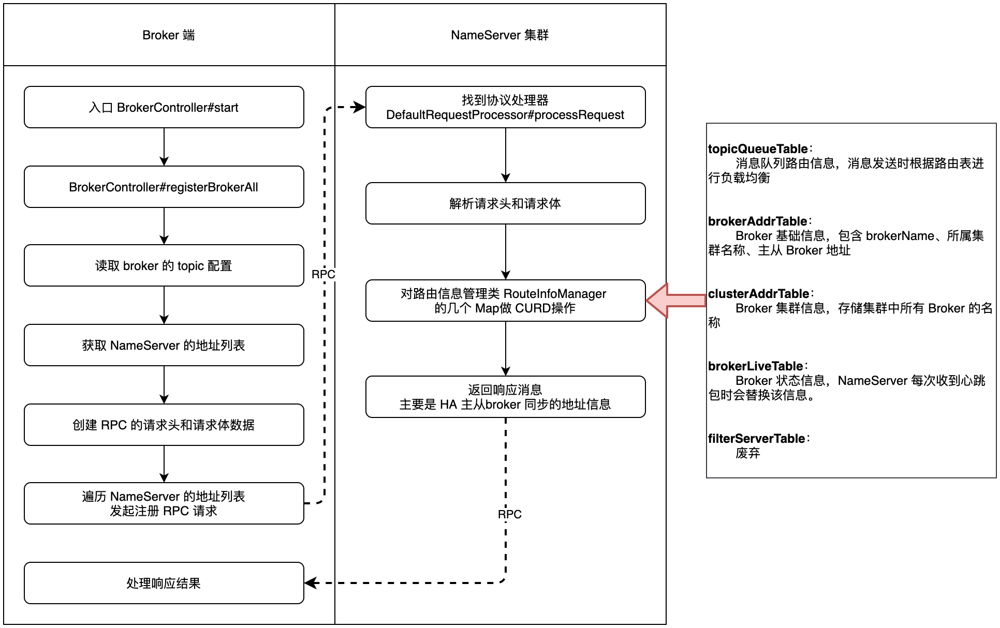

| 版本 | 内容 | 时间                   |
| ---- | ---- | :--------------------- |
| V1   | 新建 | 2022年08月01日23:15:33 |
| V2   | 重构 | 2023年06月11日21:12:12 |

## NameServer 路由管理

NameServer 的作用

1. **Broker 管理**：NameServer 接受 Broker 集群的注册信息并且保存下来作为路由信息的基本数据。然后提供**心跳检测机制，检查 Broker 是否还存活**；
2. **路由信息管理**：每个 NameServer 将保存关于 Broker 集群的整个路由信息和用于客户端查询的队列信息。然后 Producer 和 Consumer 通过 NameServer 就可以知道整个 Broker 集群的路由信息，从而进行消息的投递和消费；

本文主要分析：

1. **路由注册**：broker 是如何注册到 NameServer 以及是如何保活的；
2. **路由剔除**：NameServer 如何剔除失效的 broker；
3. **路由发现**：Producer 和 Consumer 如何获取 NameServer 的路由信息；

## 路由注册



### 路由注册入口

我们需要关注 broker 是如何注册到 NameServer 的。关注 BrokerController#start 方法。

在 BrokerController#start 方法中会调用 `this.registerBrokerAll(true, false, true);` 方法去向 NameServer 注册路由信息。

```java
// HA 相关处理
if (!messageStoreConfig.isEnableDLegerCommitLog()) {
    startProcessorByHa(messageStoreConfig.getBrokerRole());
    handleSlaveSynchronize(messageStoreConfig.getBrokerRole());
    // 注册broker
    this.registerBrokerAll(true, false, true);
}
```

然后在 broker 的启动过程中有触发一个定时任务，默认每 30 秒向 NameServer 发送一次心跳。具体代码在  方法中：

```java
// broker 给 NameServer 发送心跳包
this.scheduledExecutorService.scheduleAtFixedRate(new Runnable() {

    @Override
    public void run() {
        try {
            BrokerController.this.registerBrokerAll(true, false, brokerConfig.isForceRegister());
        } catch (Throwable e) {
            log.error("registerBrokerAll Exception", e);
        }
    }
}, 1000 * 10, Math.max(10000, Math.min(brokerConfig.getRegisterNameServerPeriod(), 60000)), TimeUnit.MILLISECONDS);
```

那么关键点就是 BrokerController#registerBrokerAll 方法了。

### broker 发送心跳信息

BrokerController#registerBrokerAll 方法：

```java
public synchronized void registerBrokerAll(final boolean checkOrderConfig, boolean oneway, boolean forceRegister) {
    // 获取 Topic 配置信息（生成 TopicConfigSerializeWrapper 对象）
    TopicConfigSerializeWrapper topicConfigWrapper = this.getTopicConfigManager().buildTopicConfigSerializeWrapper();

    // ...... 省略 ...... 如果 Broker 没有写权限或读权限，则修改 TopicConfig 权限为 Broker 的权限；

    // 判断是否需要向 nameserver 注册
    if (forceRegister || needRegister(this.brokerConfig.getBrokerClusterName(),
        this.getBrokerAddr(),
        this.brokerConfig.getBrokerName(),
        this.brokerConfig.getBrokerId(),
        this.brokerConfig.getRegisterBrokerTimeoutMills())) {
        // 注册 broker
        doRegisterBrokerAll(checkOrderConfig, oneway, topicConfigWrapper);
    }
}
```

这一步的关键点就是通过 TopicConfigManager 创建一个 TopicConfigSerializeWrapper 实例。然后调用 BrokerController#doRegisterBrokerAll 方法去处理，最后会调用到 BrokerOuterAPI#registerBrokerAll 方法去给所有的 NameServer 发送一个心跳包（RPC）。

给 NameServer 的心跳包有哪些字段呢？主要是创建请求头和请求体。

```java
// 创建自定义请求头数据
final RegisterBrokerRequestHeader requestHeader = new RegisterBrokerRequestHeader();
requestHeader.setBrokerAddr(brokerAddr);
requestHeader.setBrokerId(brokerId);
requestHeader.setBrokerName(brokerName);
requestHeader.setClusterName(clusterName);
requestHeader.setHaServerAddr(haServerAddr);
requestHeader.setCompressed(compressed);

// 创建请求体数据
RegisterBrokerBody requestBody = new RegisterBrokerBody();
requestBody.setTopicConfigSerializeWrapper(topicConfigWrapper);
requestBody.setFilterServerList(filterServerList);
final byte[] body = requestBody.encode(compressed);
// 算出 crc32，用于做数据校验
final int bodyCrc32 = UtilAll.crc32(body);
requestHeader.setBodyCrc32(bodyCrc32);
```

请求头部分：

- brokerAddr：当前 broker 的地址；
- brokerId：当前 broker 的角色，0 是主节点，大于 0 表示从节点；
- brokerName：当前 broker 的名称；
- clusterName：当前 broker 所属的集群名；
- haServerAddr：高可用节点的地址；
- compressed：请求体是否压缩；
- bodyCrc32：校验请求体是否被篡改；

请求体部分：

- topicConfigWrapper：当前 broker 的主题配置信息。主要就是 Broker 启动时会创建的一些默认的 topic，这些默认的 topic 是在 TopicConfigManager 类的构造方法中配置的，例如自动创建主题的 AUTO_CREATE_TOPIC_KEY_TOPIC 主题，延迟消息的主题 RMQ_SYS_SCHEDULE_TOPIC。broker 的 topic 会存储在 topics.json 文件中；
- filterServerList：消息过滤服务；

在组装好注册 broker 的请求后，就会遍历所有的 NameServer 的地址，依次向其发送注册的 RPC 请求。消息的请求 code 是 RequestCode.REGISTER_BROKER。

```java
for (final String namesrvAddr : nameServerAddressList) {

    // ...... 省略 ......
    
    // 真正注册的地方，发送 rpc
    RegisterBrokerResult result = registerBroker(namesrvAddr, oneway, timeoutMills, requestHeader, body);
    if (result != null) {
        // 保存注册结果
        registerBrokerResultList.add(result);
    }
    
    // ...... 省略 ......
}
```

### NameServer 处理心跳信息

根据前面注册 broker 的请求 code 是 RequestCode.REGISTER_BROKER，可以定位到DefaultRequestProcessor#processRequest 用来处理 broker 的注册，通过 switch...case...语句定位到 DefaultRequestProcessor#registerBrokerWithFilterServer

```java
public RemotingCommand registerBrokerWithFilterServer(ChannelHandlerContext ctx, RemotingCommand request)
    throws RemotingCommandException {
    // ...... 省略 ...... 获取请求头数据

    // ...... 省略 ...... 校验 crc

    // ...... 省略 ...... 获取请求体数据

    // broker 向 nameserver 注册
    RegisterBrokerResult result = this.namesrvController.getRouteInfoManager().registerBroker(
        requestHeader.getClusterName(),
        requestHeader.getBrokerAddr(),
        requestHeader.getBrokerName(),
        requestHeader.getBrokerId(),
        requestHeader.getHaServerAddr(),
        registerBrokerBody.getTopicConfigSerializeWrapper(),
        registerBrokerBody.getFilterServerList(),
        ctx.channel());

    // ...... 省略 ...... 组装响应数据，响应头，响应体
}
```

这个方法的主要流程就是：

1. 首先创建一个响应的 RemotingCommand 对象；
2. 将请求类型的 RemotingCommand 对象的请求头解析出来；
3. 校验 crc32；
4. 解码请求类型的 RemotingCommand 对象的请求体，也就是 topicConfigWrapper 对象；
5. 调用 RouteInfoManager#registerBroker 方法存储 broker 相关信息；
6. 将注册结果设置到响应对象 RemotingCommand 中；

OK 到了关键的 RouteInfoManager#registerBroker 方法。这个方法其实就是对 RouteInfoManager 的几个 Map 属性的 CURD 操作。没什么好分析的，可以自行阅读。

## 路由剔除

假如一个 Broker 发生故障了，NameServer 是如何感知的呢？

前面在分析 Broker 注册的时候，我们知道了 broker 的信息会存放在 RouteInfoManager 类的几个 Map 里，其中 RouteInfoManager#brokerLiveTable 的 key-value 的 value 如下：

```java
class BrokerLiveInfo {
    // 上次收到 Broker 心跳的时间
    private long lastUpdateTimestamp;
    // 心跳的版本号
    private DataVersion dataVersion;
    // 通信通道
    private Channel channel;
    // 用于主从同步
    private String haServerAddr;
} 
```

NameServer 感知 broker 下线有两个路径：

- **第一个是 broker 关机，会主动给 NameServer 发送一个下线的请求，这样 NameServer 就会将对应的 broker 信息从 RouteInfoManager 的几个 Map 中移除；**
- **在 NamesrvController#initialize 中启动了一个定时任务，每隔 10 秒去扫描 RouteInfoManager#brokerLiveTable；**

本次主要以定时任务来分析路由剔除：

```java
public boolean initialize() {
    // 省略...

    // 定时任务，每隔 10 秒扫描一次 Broker，移除故障的 Broker
    this.scheduledExecutorService.scheduleAtFixedRate(new Runnable() {
        @Override
        public void run() {
            NamesrvController.this.routeInfoManager.scanNotActiveBroker();
        }
    }, 5, 10, TimeUnit.SECONDS);

    // 省略...

    return true;
}
```


关键到了 RouteInfoManager#scanNotActiveBroker

```java
/**
 * 扫描 brokerLiveTable 表，剔除掉 120 秒（默认）内未发心跳的 broker 地址
 * 1 关闭 Channel
 * 2 将当前 broker 地址从 {@link #brokerLiveTable} 移除
 * 3 移除映射表的数据
 *      {@link #brokerAddrTable}
 *      {@link #clusterAddrTable}
 *      {@link #topicQueueTable}
 */
public void scanNotActiveBroker() {
    Iterator<Entry<String, BrokerLiveInfo>> it = this.brokerLiveTable.entrySet().iterator();
    while (it.hasNext()) {
        Entry<String, BrokerLiveInfo> next = it.next();
        // 获取上次收到 broker 的心跳时间
        long last = next.getValue().getLastUpdateTimestamp();
        // 校验时间，上一次时间 + 默认 120 秒 < 当前时间
        if ((last + BROKER_CHANNEL_EXPIRED_TIME) < System.currentTimeMillis()) {
            // 关闭 Channel
            RemotingUtil.closeChannel(next.getValue().getChannel());
            it.remove();
            log.warn("The broker channel expired, {} {}ms", next.getKey(), BROKER_CHANNEL_EXPIRED_TIME);
            this.onChannelDestroy(next.getKey(), next.getValue().getChannel());
        }
    }
}
```

主要流程就是遍历 RouteInfoManager#brokerLiveTable 依次做如下处理：

1. 获取上次 broker 的心跳时间，判断这个 broker 是否已经超过 120 秒未发心跳；
2. 假如超过 120 秒未发送心跳，则认为这个 broker 发生故障了，需要
   1. 关闭 Channel 连接；
   2. 将当前 broker 的信息从 RouteInfoManager#brokerLiveTable 移除；
   3. 针对 RouteInfoManager 类中的几个 Map 做增删改查的操作；

## 路由发现

主题的路由信息都是存在 NameServer 的，当某个主题的路由信息发生改变了，NameServer 不会主动推送新的路由信息到客户端。客户端会定时的从 NameServer 中拉取最新的路由信息。

客户端定时拉取最新的路由信息的定时任务在 MQClientInstance#startScheduledTask 方法中：

```java
// 定时任务1，从 nameserver 更新客户端本地的 topic 的路由信息
// 30 秒
this.scheduledExecutorService.scheduleAtFixedRate(new Runnable() {

    @Override
    public void run() {
        try {
            MQClientInstance.this.updateTopicRouteInfoFromNameServer();
        } catch (Exception e) {
            log.error("ScheduledTask updateTopicRouteInfoFromNameServer exception", e);
        }
    }
}, 10, this.clientConfig.getPollNameServerInterval(), TimeUnit.MILLISECONDS);
```

客户端每隔 30 秒从 NameServer 拉取一次主题路由信息。在 updateTopicRouteInfoFromNameServer 方法中根据主题名称给 NameServer 发送一个更新路由信息的请求 code 是 RequestCode.GET_ROUTEINFO_BY_TOPIC。


NameServer 处理 RequestCode.GET_ROUTEINFO_BY_TOPIC 流程如下，主要就是 pickupTopicRouteData 方法，其实就是对 RouteInfoManager 中的几个 Map 的 CURD，没什么好分析的。

```java
public RemotingCommand getRouteInfoByTopic(ChannelHandlerContext ctx,
    RemotingCommand request) throws RemotingCommandException {
    
    // ...... 省略 ......
    
    // 获取 topic 的路由信息
    TopicRouteData topicRouteData = this.namesrvController.getRouteInfoManager().pickupTopicRouteData(requestHeader.getTopic());

    // ...... 省略 ......
}
```

最终返回给客户端的路由信息的对象是 TopicRouteData，它的各个字段如下：

```java
/**
 * topic 路由信息
 */
public class TopicRouteData extends RemotingSerializable {
    // 顺序消息配置
    private String orderTopicConf;
    // 主题队列的元数据
    private List<QueueData> queueDatas;
    // 主题分布在那些 broker 上，地址信息
    private List<BrokerData> brokerDatas;
    // broker 上的过滤服务器列表
    private HashMap<String/* brokerAddr */, List<String>/* Filter Server */> filterServerTable;

    // ...... 省略 ......

}
```
