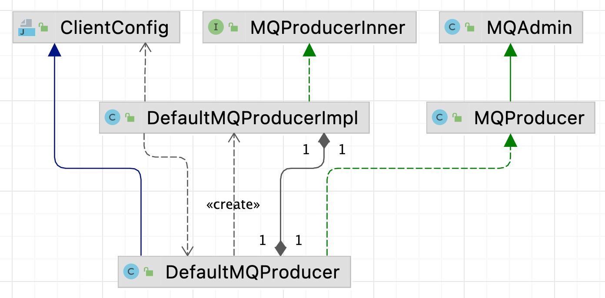

| 版本 | 内容 | 时间 |
| ---- | ---- | ---- |
| V1   | 新建 |      |

## 引入

以源码中的案例来看一个简单的生产者的代码，org.apache.rocketmq.example.quickstart.Producer

```java
public class Producer {
    public static void main(String[] args) throws MQClientException, InterruptedException {
        DefaultMQProducer producer = new DefaultMQProducer("please_rename_unique_group_name");
        producer.setNamesrvAddr("127.0.0.1:9876");
        producer.start();

        // ...... 省略消息发送代码 ......

        producer.shutdown();
    }
}
```

可以看到就是创建一个 DefaultMQProducer 类，设置一些参数并启动。关键点就是 DefaultMQProducer。

DefaultMQProducer 类是应用用来投递消息的入口，开箱即用，可通过无参构造方法快速创建一个生产者。主要负责消息的发送，支持同步/异步/oneway的发送方式，这些发送方式均支持批量发送。可以通过该类提供的getter/setter方法，调整发送者的参数。

## DefaultMQProducer 生产者类

###  DefaultMQProducer 继承关系



首先分析 DefaultMQProducer 继承关系，DefaultMQProducer 继承 ClientConfig 类，实现了 MQProducer 接口。

- ClientConfig：该类是客户端角色的公共配置类，保存了客户端向改的配置信息；
- MQProducer 和 MQAdmin 提供了一些发送消息、创建主题等 API；

而 DefaultMQProducer 提供的接口的功能，一般都是委托给 DefaultMQProducerImpl 实例去处理的。

对于生产者来说 DefaultMQProducerImpl 类，和该类的一个 MQClientInstance 字段是核心。

### DefaultMQProducer 的属性

```java
protected final transient DefaultMQProducerImpl defaultMQProducerImpl;
private final InternalLogger log = ClientLogger.getLog();
private final Set<Integer> retryResponseCodes = new CopyOnWriteArraySet<Integer>(Arrays.asList(
        ResponseCode.TOPIC_NOT_EXIST,
        ResponseCode.SERVICE_NOT_AVAILABLE,
        ResponseCode.SYSTEM_ERROR,
        ResponseCode.NO_PERMISSION,
        ResponseCode.NO_BUYER_ID,
        ResponseCode.NOT_IN_CURRENT_UNIT
));
private String producerGroup;
private String createTopicKey = TopicValidator.AUTO_CREATE_TOPIC_KEY_TOPIC;
private volatile int defaultTopicQueueNums = 4;
private int sendMsgTimeout = 3000;
private int compressMsgBodyOverHowmuch = 1024 * 4;
private int retryTimesWhenSendFailed = 2;
private int retryTimesWhenSendAsyncFailed = 2;
private boolean retryAnotherBrokerWhenNotStoreOK = false;
private int maxMessageSize = 1024 * 1024 * 4; // 4M
private TraceDispatcher traceDispatcher = null;
```

- defaultMQProducerImpl：真正处理发送消息的实例；
- retryResponseCodes：需要重试的响应码；
- producerGroup：生产者组。相同的分组名称表明生产者实例在概念上归属于同一分组。这对事务消息十分重要，如果原始生产者在事务之后崩溃，那么 broker 可以联系同一生产者分组的不同生产者实例来提交或回滚事务；
- createTopicKey：TBW102，测试或者demo使用，生产环境下不建议打开自动创建配置。broker 写死的主题队列信息，当发送消息指定的 topic 在 nameserver 上未找到路由信息时，则使用该 TBW102 作为模板去创建主题发布信息；
- defaultTopicQueueNums：默认 broker 给每个 topic 创建的队列数；
- sendMsgTimeout：消息发送的超时时间 默认 3s；
- compressMsgBodyOverHowmuch：压缩阈值，当 msg 的 body 超过 4k 后，使用压缩；
- retryTimesWhenSendFailed：同步模式下发送失败最大重试次数默认 2 次，加上本来的 1 次，总共 3 次。这可能会导致消息重复发送，需要开发人员自行解决；
- retryTimesWhenSendAsyncFailed：异步模式下发送失败最大重试次数默认 2 次，加上本来的 1 次，总共 3 次。这可能会导致消息重复发送，需要开发人员自行解决；
- retryAnotherBrokerWhenNotStoreOK：消息未存储成功是否选择其他 broker 节点来进行消息重试。一般设置成 true，假如是 false，上面的消息重试也不会去发了；
- maxMessageSize：最大消息限制 默认 4m，当消息体的字节数超过maxMessageSize就发送失败；
- traceDispatcher：基于RPCHooK实现的消息轨迹插件。在开启消息轨迹后，该类通过 hook 的方式把消息生产者，消息存储的 broker 和消费者消费消息的信息像链路一样记录下来。在构造生产者时根据构造入参 enableMsgTrace 来决定是否创建该对象；

## Message 消息类

```java
public class Message implements Serializable {
    private static final long serialVersionUID = 8445773977080406428L;

    // 主题
    private String topic;
    // 消息标记
    private int flag;
    // 消息扩展属性
    private Map<String, String> properties;
    // 消息体
    private byte[] body;
    // 事务
    private String transactionId;
 
    // ...... 省略 ......
}
```

flag 字段，在 RocketMQ 中并未直接使用。