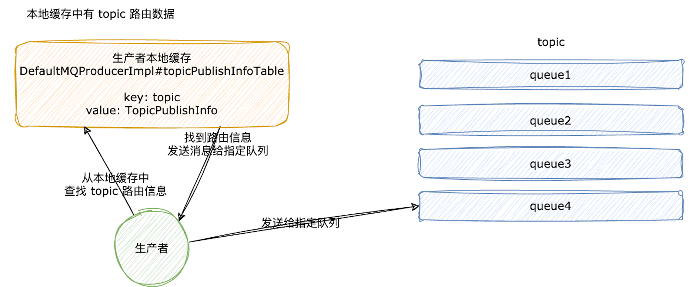
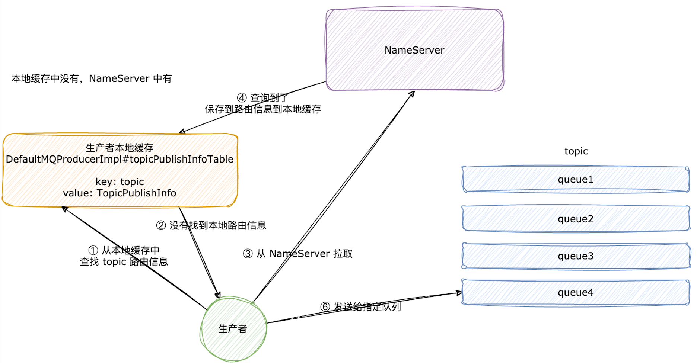
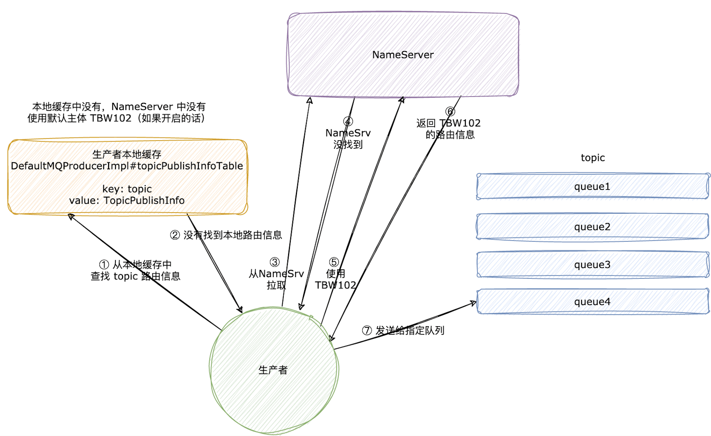
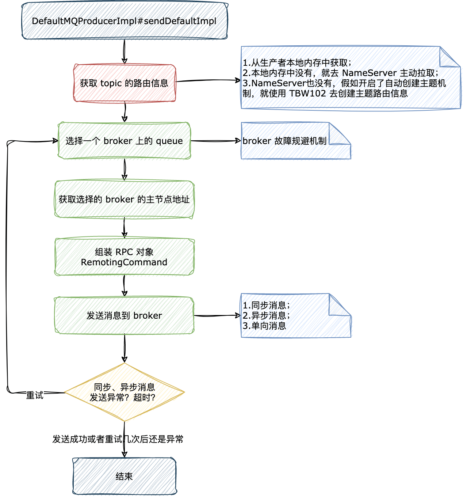
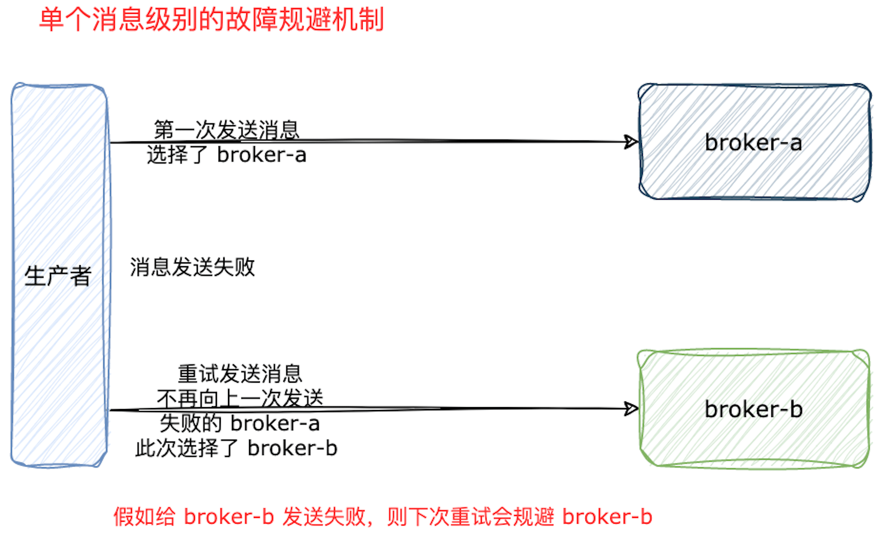
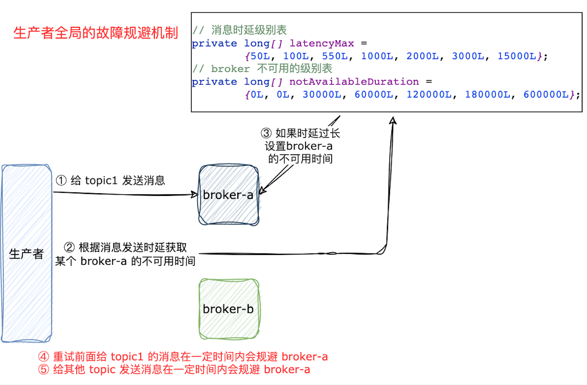

| 版本 | 内容 | 时间                   |
| ---- | ---- | ---------------------- |
| V1   | 新建 | 2022年08月08日09:10:24 |
| V2   | 重构 | 2023年06月16日13:27:53 |

## 本文分析流程

来几个疑问：

1. RocketMQ 中消息的类型有哪些？
2. 客户端（生产者和消费者）的 topic 的路由信息是如何维护的？
3. 发送消息的主体流程是怎么样的？
4. 要发送的消息队列如何进行负载？
5. 故障规避机制？
6. 消息发送重试规则？

## 消息发送的类型和入口

RocketMQ 消息发送在发送方式上分为三种

1. 同步发送；
2. 异步发送；
3. 单向发送；

RocketMQ 在发送消息的类型分为以下几种

1. 普通消息；
2. 顺序消息；
3. 延迟消息；
4. 事务消息；
5. 单向消息；
6. 批量消息；

发送消息的入口在 DefaultMQProducerImpl 类中，本次分析以异步发送消息为例分析，入口是 DefaultMQProducerImpl#send(Message, SendCallback)

## 生产者的 topic 路由信息

### topic 路由信息对象

> RocketMQ 中的路由消息是持久化在 Broker 中的，NameServer 中的路由信息来自 Broker 的心跳包并存储在内存中。

既然生产者要给某个 topic 发送消息，那么生产者就需要知道这个 topic 的队列分布在那个 broker 上。生产者本地缓存（内存中）保存 topic 的路由信息，当生产者发送消息时，需要尝试获取 topic 的路由信息。

topic 的路由信息用 TopicPublishInfo 类封装，TopicPublishInfo 类的字段如下：

```java
public class TopicPublishInfo {
    // 是否是顺序消息
    private boolean orderTopic = false;
    // 标记是否有 topicRouteData 数据
    private boolean haveTopicRouterInfo = false;
    // 队列列表
    // 当前主题 topic 在那些 broker 主机上有队列
    private List<MessageQueue> messageQueueList = new ArrayList<MessageQueue>();
    // 线程本地对象，选择发送到哪一个 queue
    private volatile ThreadLocalIndex sendWhichQueue = new ThreadLocalIndex();
    // 主题路由数据，主要是 QueueData 和 brokerDatas
    private TopicRouteData topicRouteData;
	
    // 省略...
}
```

- `boolean orderTopic`：是否是顺序消息；
- `boolean haveTopicRouterInfo`：标记是否有该 topic 的路由信息；
- `List<MessageQueue> messageQueueList`：当前 topic 在那些 broker 主机上有队列；
- `ThreadLocalIndex sendWhichQueue`：用于选择消息发送到那个队列上去；
- `TopicRouteData topicRouteData`：topic 路由信息；

### topic 路由信息的维护原理

生产者给 topic 发送一个消息时，需要先查询 topic 的路由信息。在第一次发送某个 topic 的时候会向 NameServer 集群中查找这个 topic 的路由信息，然后把查找的路由信息保存在生产者的内存中。

而且在生产者启动的时候会启动一个定时任务，这个定时任务会每 30 秒定时从 NameServer 中查询 topic 的最新的路由信息。如果成功查询到路由信息，会更新本地 topic 路由信息缓存。定时任务入口如下：

我们需要了解一个特殊的主题，RocketMQ 写死的 「TBW102」，也就是 AUTO_CREATE_TOPIC_KEY_TOPIC。这个主题的作用是自动创建主题，当消息发送者向一个不存在的 topic 发送消息时，向 NameServer 查询该 topic 的路由信息会先返回空，如果开启了自动创建 topic 机制，会使用一个默认的 topic 名再次从 NameServer 查询路由信息，然后消息发送者会使用默认 topic 的路由信息进行负载均衡，但不会直接使用默认路由信息为新 topic 创建对应的路由信息。

> **RocketMQ 中的路由消息是持久化在 Broker 中的，NameServer 中的路由信息来自 Broker 的心跳包并存储在内存中。**

**（1）发送消息时，本地内存有路由信息的情况：**



**（2）发送消息时，本地内存中没有 topic 的路由信息，去 NameServer 拉取到了路由信息**



**（3）发送消息时，本地内存中没有 topic 的路由信息， NameServer 也没有对应的路由信息。如果开启了自动创建 topic 机制，会使用一个默认的主题 TBW102 再次从 NameServer 查询路由信息**



### topic 路由信息维护的源码分析

在 DefaultMQProducerImpl 类中有个 topicPublishInfoTable 的 Map

```java
private final ConcurrentMap<String/* topic */, TopicPublishInfo> topicPublishInfoTable = new ConcurrentHashMap<String, TopicPublishInfo>();
```

可以看到 key 就是 topic 名字，value 就是 TopicPublishInfo 对象了。在给 topic 发送消息时会先查询生产者本地内存保存的 topic 的路由信息。

那么 topicPublishInfoTable 这个 Map 的数据是怎么维护的呢？

（1）定时任务从 NameServer 拉取 topic 的路由信息；

（2）假如第一次给某个 topic 发送消息时，本地内存是没有该 topic 的路由信息的，所以此时会从 NameServer 中拉取该 topic 的路由信息，并保存到本地内存中；

（3）生产者启动的时候会向 topicPublishInfoTable 中注册一个特殊的主题 「TBW102」的路由信息；

#### 第一次给 topic 发送消息

在消息发送的方法 DefaultMQProducerImpl#sendDefaultImpl 中，先会尝试获取 topic 的路由信息，也就是下面这一行代码

```java
// 获取当前消息 topic 的发布信息，需要依赖他里面的 MessageQueue 信息，选择一个队列后面去发送消息使用
TopicPublishInfo topicPublishInfo = this.tryToFindTopicPublishInfo(msg.getTopic());
```

继续跟进 DefaultMQProducerImpl#tryToFindTopicPublishInfo 逻辑：

```java
private TopicPublishInfo tryToFindTopicPublishInfo(final String topic) {
    // 从生产者本地发布信息映射表尝试获取 topic 的发布信息
    TopicPublishInfo topicPublishInfo = this.topicPublishInfoTable.get(topic);
    // 条件成立说明生产者本地保存的指定 topic 的发布信息是空的，需要从 NameServer 获取发布信息
    if (null == topicPublishInfo || !topicPublishInfo.ok()) {
        this.topicPublishInfoTable.putIfAbsent(topic, new TopicPublishInfo());
        // 客户端从 nameserver 更新该 topic 的路由数据
        this.mQClientFactory.updateTopicRouteInfoFromNameServer(topic);
        // 正常情况，这里拿到的主题发布信息是有数据的
        // 特殊情况，这里可能因为 nameserver 没有 topic 路由数据，所以这里返回的是 new TopicPublishInfo()
        topicPublishInfo = this.topicPublishInfoTable.get(topic);
    }

    // 条件成立，说明这个发布信息可用，直接返回
    if (topicPublishInfo.isHaveTopicRouterInfo() || topicPublishInfo.ok()) {
        return topicPublishInfo;
    } else {
        // 走到这里，原因是 nameserver 没有 topic 路由数据，所以这里返回的是 new TopicPublishInfo()
        this.mQClientFactory.updateTopicRouteInfoFromNameServer(topic, true, this.defaultMQProducer);
        topicPublishInfo = this.topicPublishInfoTable.get(topic);
        return topicPublishInfo;
    }
}
```

上面的方法很清楚

1. 会先尝试在生产者本地内存中获取当前 topic 的路由信息，假如有且路由信息可用，则直接返回；
2. 假如生产者本地缓存在没有当前 topic 的路由信息，那么会调用 MQClientInstance#updateTopicRouteInfoFromNameServer 方法去 NameServer 获取，并保存在本地内存中，假如获取的路由信息可用，也直接返回；
3. 假如 NameServer 中没有该 topic 的路由信息，则用默认的主题 TBW102 去NameServer 查找 TBW102 的路由信息；

关于 updateTopicRouteInfoFromNameServer 方法，后面会详细分析，这里知道个流程就行。

#### 定时任务维护路由信息

前面分析过第一次给 topic 发送消息时，会将路由信息保存到 DefaultMQProducerImpl 类中的 topicPublishInfoTable 的 Map 中，然后会有一个定时任务每隔 30 秒去维护之前已经发送过的 topic 的路由信息。

MQClientInstance#startScheduledTask 中的定时任务，这个定时任务是在生产者启动的过程中启动的。

```java
// 定时任务1，从 nameserver 更新客户端本地的 topic 的路由信息
// 30 秒
this.scheduledExecutorService.scheduleAtFixedRate(new Runnable() {

    @Override
    public void run() {
        try {
            MQClientInstance.this.updateTopicRouteInfoFromNameServer();
        } catch (Exception e) {
            log.error("ScheduledTask updateTopicRouteInfoFromNameServer exception", e);
        }
    }
}, 10, this.clientConfig.getPollNameServerInterval(), TimeUnit.MILLISECONDS);
```

继续跟进 MQClientInstance#updateTopicRouteInfoFromNameServer() 方法

```java
public void updateTopicRouteInfoFromNameServer() {
    // 客户端关注的主题的集合
    Set<String> topicList = new HashSet<String>();

    // ...... 省略 Consumer 关注的主题的处理 ......

    // Producer
    // 提取生产者关注的主题
    {
        Iterator<Entry<String, MQProducerInner>> it = this.producerTable.entrySet().iterator();
        while (it.hasNext()) {
            Entry<String, MQProducerInner> entry = it.next();
            MQProducerInner impl = entry.getValue();
            if (impl != null) {
                Set<String> lst = impl.getPublishTopicList();
                topicList.addAll(lst);
            }
        }
    }

    // 遍历客户端主题集合，从 nameserver 拉取最新的 topic 路由数据
    // 与本地客户端的路由数据对比，判断是否需要更新
    for (String topic : topicList) {
        this.updateTopicRouteInfoFromNameServer(topic);
    }
}
```

可以看到也是调用 updateTopicRouteInfoFromNameServer 方法去 NameServer 拉取主题路由信息的。关于 updateTopicRouteInfoFromNameServer 方法，后面会详细分析，这里知道个流程就行。

#### 特殊的主题 「TBW102」

特殊的主题名称 「TBW102」，会在生产者启动的时候向 DefaultMQProducerImpl 的 topicPublishInfoTable 的 Map 中直接添加一个空的 TopicPublishInfo。

```java
// 添加测试用的 topic，就是 TBW102
this.topicPublishInfoTable.put(this.defaultMQProducer.getCreateTopicKey(), new TopicPublishInfo());
```

#### 核心-从 NameServer 拉取路由信息

从 NameServer 中获取 topic 的路由信息，有两种情况：

- 假如 NameServer 中有，则直接拿返回的路由信息去发送消息；
- 假如 NameServer 中没有，如果开启了自动创建 topic 机制，会使用一个默认的 topic 名再次从 NameServer 查询路由信息，然后消息发送者会使用默认 topic 的路由信息进行负载均衡。

MQClientInstance#updateTopicRouteInfoFromNameServer(String, boolean,DefaultMQProducer) 方法分析：

（1）第一步尝试从 NameServer 获取路由信息：分为两个类型，1）获取指定 topic 的路由信息；2）没找到对应的 topic 的路由信息，尝试用默认的 TBW102 去获取路由信息；

```java
TopicRouteData topicRouteData;
if (isDefault && defaultMQProducer != null) {
    // 获取 TBW102 的路由数据
    topicRouteData = this.mQClientAPIImpl.getDefaultTopicRouteInfoFromNameServer(defaultMQProducer.getCreateTopicKey(), clientConfig.getMqClientApiTimeout());
    
    // ...... 省略其他处理 ......
    
} else {
    // 从 nameserver 拉取最新的路由数据
    topicRouteData = this.mQClientAPIImpl.getTopicRouteInfoFromNameServer(topic, clientConfig.getMqClientApiTimeout());
}
```

（2）第二步，从 NameServer 获取的 topic 的路由信息，拿它和生产者本地的 topic 的路由信息做对比，如果不同就更新本地路由信息。这部分代码没什么好分析的。

```java
if (topicRouteData != null) {
    // old -> 获取当前客户端本地的 topic 路有数据
    TopicRouteData old = this.topicRouteTable.get(topic);
    // 判断是否发生变化，即 对比本地路由数据 和 nameserver 中最新拉取到的路由数据是否一致
    boolean changed = topicRouteDataIsChange(old, topicRouteData);

    // ...... 省略一些操作 ......

    if (changed) {
        // 克隆一份
        TopicRouteData cloneTopicRouteData = topicRouteData.cloneTopicRouteData();

        // 更新客户端 broker 物理节点映射表
        for (BrokerData bd : topicRouteData.getBrokerDatas()) {
            this.brokerAddrTable.put(bd.getBrokerName(), bd.getBrokerAddrs());
        }

        // Update Pub info
        if (!producerTable.isEmpty()) {
            // 将 topic 路由数据转化为 主题发布数据
            TopicPublishInfo publishInfo = topicRouteData2TopicPublishInfo(topic, topicRouteData);
            // 标记是否有 topicRouteData 数据
            publishInfo.setHaveTopicRouterInfo(true);
            // 遍历生产者
            Iterator<Entry<String, MQProducerInner>> it = this.producerTable.entrySet().iterator();
            while (it.hasNext()) {
                Entry<String, MQProducerInner> entry = it.next();
                MQProducerInner impl = entry.getValue();
                if (impl != null) {
                    // 生产者将主题发布数据保存到本地，方便发送消息时使用
                    impl.updateTopicPublishInfo(topic, publishInfo);
                }
            }
        }

        // ...... 省略消费者相关操作 ......

    }
    log.info("topicRouteTable.put. Topic = {}, TopicRouteData[{}]", topic, cloneTopicRouteData);
    this.topicRouteTable.put(topic, cloneTopicRouteData);
    return true;
}
} else {
    log.warn("updateTopicRouteInfoFromNameServer, getTopicRouteInfoFromNameServer return null, Topic: {}. [{}]", topic, this.clientId);
}
```

## 准备发送消息的主体流程

入口 DefaultMQProducerImpl#send(Message, SendCallback)

```java
/**
 * DEFAULT ASYNC -------------------------------------------------------
 */
public void send(Message msg,
    SendCallback sendCallback) throws MQClientException, RemotingException, InterruptedException {
    send(msg, sendCallback, this.defaultMQProducer.getSendMsgTimeout());
}
```

入参：

1. Message：消息对象；
2. SendCallback：回调函数；
3. 超时时间：传入了一个默认的超时时间，值是 3 秒。

最后会调用到：DefaultMQProducerImpl#sendDefaultImpl。这个方法处理逻辑比较复杂，逐步分析。

先看下整体流程图：



### 发送消息的前置校验

第一步就是合法性校验，主要就是校验生产者的状态是否是运行中，校验消息的长度等；

```java
// 校验生产者状态是否是运行中
this.makeSureStateOK();
// 校验消息是否合法
Validators.checkMessage(msg, this.defaultMQProducer);
```

### 查询当前主题的路由信息

```java
// 获取当前消息 topic 的发布信息，需要依赖他里面的 MessageQueue 信息，选择一个队列后面去发送消息使用
TopicPublishInfo topicPublishInfo = this.tryToFindTopicPublishInfo(msg.getTopic());
```

这里就是去查询消息要发送的 topic 的路由信息，可能是从生产者本地内存中读到的，也可能是从 NameServer 中查询到的。这里知道获取到了 topic 的路由信息就行了，具体如何获取以及 topic 的路由信息是如何维护的前面已经分析了。

### 循环发送消息的一些变量含义

既然已经拿到 topic 的路由信息了，就可以准备去发送消息了，先了解下消息发送的一些变量的含义。

```java
// 是否超时
boolean callTimeout = false;
// 选中的队列
MessageQueue mq = null;
Exception exception = null;
// 发送结果
SendResult sendResult = null;
// 总共发送的次数
// 假如是同步发送，则是 1 + 默认的重试 2 次 = 3，
// 其他的 异步发送和单向发送是 1
int timesTotal = communicationMode == CommunicationMode.SYNC ? 1 + this.defaultMQProducer.getRetryTimesWhenSendFailed() : 1;
// 当前是第几次发送
int times = 0;
// 数组，存放上次尝试发送的队列的 brokername
String[] brokersSent = new String[timesTotal];
```

- `boolean callTimeout`：消息发送是否超时；
- `MessageQueue mq`：某次消息发送，选择的队列；
- `Exception exception`：如果消息发送异常，保存此异常；
- `SendResult sendResult`：发送同步消息的返回值；
- `int timesTotal`：消息最大的发送次数。同步消息最多发送 3 次，异步消息和单向消息最多发送一次；
- `int times`：在循环中表示当前是第几次发送消息；
- `String[] brokersSent`：存放每次循环发送的队列的 brokerName；

最关键的我们需要知道，在 RocketMQ 中同步和异步消息都会重试，异步的重试操作在异常处理中，后面会具体分析。

### 循环发送消息-选择消息队列

```java
for (; times < timesTotal; times++) {
    // 上次尝试发送至的 brokerName，首次是 null
    String lastBrokerName = null == mq ? null : mq.getBrokerName();
    // 选择一个 MessageQueue
    MessageQueue mqSelected = this.selectOneMessageQueue(topicPublishInfo, lastBrokerName);
    // 条件成立：说明已经选择出来一个可以发送的 MessageQueue
    if (mqSelected != null) {
        
        // ...... 省略消息发送具体逻辑 ......
        
    } else {
        break;
    }
}
```

DefaultMQProducerImpl#selectOneMessageQueue 选择一个消息队列发送，这里我们只需要知道获取到了 topic 存在的某一个队列就行了，具体如何选择队列的后面具体分析，先把握主体流程。

### 循环发送消息-发送消息到队列

```java
for (; times < timesTotal; times++) {
    // 上次尝试发送至的 brokerName，首次是 null
    String lastBrokerName = null == mq ? null : mq.getBrokerName();
    // 选择一个 MessageQueue
    MessageQueue mqSelected = this.selectOneMessageQueue(topicPublishInfo, lastBrokerName);
    // 条件成立：说明已经选择出来一个可以发送的 MessageQueue
    if (mqSelected != null) {
        mq = mqSelected;
        brokersSent[times] = mq.getBrokerName();
        try {
            // 记录本轮发送的开始时间
            beginTimestampPrev = System.currentTimeMillis();

            // ...... 省略一些判断，例如超时判断 ......

            sendResult = this.sendKernelImpl(msg, mq, communicationMode, sendCallback, topicPublishInfo, timeout - costTime);
            
            // ...... 省略消息发送后的处理 ......
            
        } catch (RemotingException e) {
            // ...... 省略异常处理 ......
        } catch (MQClientException e) {
            // ...... 省略异常处理 ......
        } catch (MQBrokerException e) {
            // ...... 省略异常处理 ......
        } catch (InterruptedException e) {
            // ...... 省略异常处理 ......
        }
    } else {
        break;
    }
}
```

核心就是 DefaultMQProducerImpl#sendKernelImpl 发送消息，这里我们只需要知道这个方法就真正发送消息到某一个队列的就行了。后面具体详细分析。

### 循环发送消息-同步发送结果处理

```java
sendResult = this.sendKernelImpl(msg, mq, communicationMode, sendCallback, topicPublishInfo, timeout - costTime);
// 故障规避机制
this.updateFaultItem(mq.getBrokerName(), endTimestamp - beginTimestampPrev, false);
switch (communicationMode) {
    case ASYNC:
        // 异步消息直接返回 null，异步消息结果处理在回调时处理
        return null;
    case ONEWAY:
        // 单向消息直接返回 null
        return null;
    case SYNC:
        // 同步消息，假如不是 SEND_OK，则需要根据设置去尝试重新尝试发送消息
        if (sendResult.getSendStatus() != SendStatus.SEND_OK) {
            if (this.defaultMQProducer.isRetryAnotherBrokerWhenNotStoreOK()) {
                continue;
            }
        }

        // 发送成功直接返回
        return sendResult;
    default:
        break;
}
```

首先我们要知道 RocketMQ 中存在的消息类型有，同步消息、异步消息、单向消息。其中同步消息是有返回值的，而异步消息和单向消息是不用处理返回值的。

所以在 DefaultMQProducerImpl#sendDefaultImpl 中只会处理同步消息的返回值，这里就是通过判断消息发送的返回值 sendResult 的状态，如果发送成功就返回发送结果并退出，如果消息发送失败就会重试发送消息了。

上面还有个 DefaultMQProducerImpl#updateFaultItem 方法，这个是故障规避机制，后文会详细分析的。

## 消息队列的选择和故障规避机制

回顾下 topic 的路由信息 TopicPublishInfo 类，其内部有个 messageQueueList 属性。也就是说 topic 的队列可能分布在多个 broker 的队列上，那么我们发送消息时就需要选择一个队列发送。本次就来分析如何选择一个队列去发送。

```java
public class TopicPublishInfo {
    private boolean orderTopic = false;
    // 标记是否有 topicRouteData 数据
    private boolean haveTopicRouterInfo = false;
    // 队列列表
    // 当前主题 topic 在那些 broker 主机上有队列
    private List<MessageQueue> messageQueueList = new ArrayList<MessageQueue>();
    // 线程本地对象，选择发送到哪一个 queue
    private volatile ThreadLocalIndex sendWhichQueue = new ThreadLocalIndex();
    // 主题路由数据，主要是 QueueData 和 brokerDatas
    private TopicRouteData topicRouteData;

	// 省略其他
}
```

队列的选择在 DefaultMQProducerImpl#sendDefaultImpl 方法中，具体会调用 MQFaultStrategy#selectOneMessageQueue 方法去选择队列。

在 RocketMQ 中 broker 的故障规避机制有两种：

- **消息级别的故障规避机制**：默认策略。RocketMQ 中同步消息和异步消息都会去重试，假如某一次发送消息失败了，再重试的时候是不会再往这个 broker 发送的，除非其它 broker 上没有该 topic 所在的队列；
- **生产者级别的故障规避机制**：需要将 sendLatencyFaultEnable 配置设为 true。根据消息发送消耗的时间得到 broker 的不可用时间。假如现在有个时间 A，例如消耗的时间小于 A，则认为 broker 正常。如果某次消息发送的时间大于 A，则认为 broker 可能有点问题，需要在一段时间内不允许向其发送消息；

因为 topic 的路由信息是持久化在 broker 上的，broker 会每 30 秒向 NameServer 发送带有路由信息的心跳，而 NameServer 又不会主动给 producer 和 consumer 推送变化的路由信息，而是 producer 和 consumer 每隔 30 秒去主动拉取路由信息，所以 producer 和 consumer 的本地保存的路由信息可能不是最新的，在 producer 做 broker 故障规避机制是有必要的。

**单个消息级别的故障规避机制：**



**单个生产者全局级别的故障规避机制**



### 消息级别的 broker 故障规避机制

**默认策略**，具体代码逻辑在 TopicPublishInfo#selectOneMessageQueue(String)

```java
public MessageQueue selectOneMessageQueue(final String lastBrokerName) {
    if (lastBrokerName == null) {
        // 第一次 lastBrokerName 是 null，
        return selectOneMessageQueue();
    } else {
        // 走到此处，说明不是第一次发送消息了，是重试
        // 需要遍历所有的队列，获取一个队列后，需要判断当前得到的队列的 brokername 和上次队列的 brokername 是否一致
        for (int i = 0; i < this.messageQueueList.size(); i++) {
            int index = this.sendWhichQueue.incrementAndGet();
            int pos = Math.abs(index) % this.messageQueueList.size();
            if (pos < 0)
                pos = 0;
            MessageQueue mq = this.messageQueueList.get(pos);
            if (!mq.getBrokerName().equals(lastBrokerName)) {
                return mq;
            }
        }
        // 说明还没找到队列，选择一个
        return selectOneMessageQueue();
    }
}

public MessageQueue selectOneMessageQueue() {
    int index = this.sendWhichQueue.incrementAndGet();
    int pos = Math.abs(index) % this.messageQueueList.size();
    if (pos < 0)
        pos = 0;
    return this.messageQueueList.get(pos);
}
```

入参 lastBrokerName 是在某次重试消息时，上一次发送的 broker 的名字。假如是第一次发送消息（也就是不是重试的），lastBrokerName 是 null；

- **第一次发送消息：直接取模选择一个队列；**
- **重试消息：同样是取模选择一个队列，但是要规避上一次有问题的发送的 lastBrokerName；**

### 生产者级别的 broker 故障规避机制

需要将 sendLatencyFaultEnable 设置为 true，才能开启生产级别的故障规避机制。

生产者级别的 broker 的故障规避机制的原理是：从消息发送开始，到得到消息发送的返回值或者出现异常的时间，根据这段消耗的时间给此次消息发送行为的时延分几个级别，在 org.apache.rocketmq.client.latency.MQFaultStrategy  中有两个数组类型的变量：

```java
// 消息发送的延迟时间
private long[] latencyMax = {50L, 100L, 550L, 1000L, 2000L, 3000L, 15000L};
// 假如发送消息失败，会将这个 broker 设置为多长时间不可用
// 和上面的 latencyMax 的索引是一一对应的
private long[] notAvailableDuration = {0L, 0L, 30000L, 60000L, 120000L, 180000L, 600000L};
```

- latencyMax 数组表示某次发送消息成功 or 失败消耗的时间的区间范围；
- notAvailableDuration 数组表示 broker 的不可用的时间；

某次消息发送的时延时间会在 latencyMax 数组中得到一个索引，拿这个索引去 notAvailableDuration 表中给 broker 设置一个不可用的时间。例如某次发送失败了，默认时间给了 3000L，那么找到 notAvailableDuration 对应的索引位置的值是 180000L，表示这个 broker 此次会在 180 秒内认为是不可用的。

在每次消息发送完或者出现异常都会调用 DefaultMQProducerImpl#updateFaultItem 方法，无论是同步消息还是异步消息都会调用。最终会调用到 MQFaultStrategy#updateFaultItem 方法，具体实现如下：

```java
public void updateFaultItem(final String brokerName, final long currentLatency, boolean isolation) {
    // 必须开启了延迟规避机制
    if (this.sendLatencyFaultEnable) {
        // 计算 brokerName 的不可用时间
        long duration = computeNotAvailableDuration(isolation ? 30000 : currentLatency);
        // 参数 1：brokeName
        // 参数 2：当前消息发送到返回的延迟时间，也有可能是发生异常了（其实就是消耗时间）
        // 参数 3：根据 currentLatency 计算出来的 broker 的不可用时间
        this.latencyFaultTolerance.updateFaultItem(brokerName, currentLatency, duration);
    }
}
```

关于该方法的参数：

1. brokerName：就是某次消息发送到的 broker；
2. currentLatency：就是某次消息的发送时延时间；
3. isolation：不是很重要，控制默认值 3000 的，异常情况会走这里；

computeNotAvailableDuration 方法就是根据某次消息发送时延时间去前面说的 notAvailableDuration 数组中获取一个时间，获取到的时间表示该 broker 的不可用时间。然后将该时间保存起来。

那么在选择队列时，是如何规避被标记为不可用的 broker 呢？具体看 MQFaultStrategy#selectOneMessageQueue 方法：

```java
public MessageQueue selectOneMessageQueue(final TopicPublishInfo tpInfo, final String lastBrokerName) {
    if (this.sendLatencyFaultEnable) {
        try {
            // 遍历所有的队列，取模选择一个队列，校验选择的队列是否可用，
            // 如果可以就直接返回，不可用就继续遍历查找
            int index = tpInfo.getSendWhichQueue().incrementAndGet();
            for (int i = 0; i < tpInfo.getMessageQueueList().size(); i++) {
                int pos = Math.abs(index++) % tpInfo.getMessageQueueList().size();
                if (pos < 0)
                    pos = 0;
                MessageQueue mq = tpInfo.getMessageQueueList().get(pos);
                // 验证这个消息队列是否可用
                if (latencyFaultTolerance.isAvailable(mq.getBrokerName()))
                    return mq;
            }

            // ...... 省略 ...... 选择一个优先级最高的 broker 去发送

        } catch (Exception e) {
            log.error("Error occurred when selecting message queue", e);
        }
        return tpInfo.selectOneMessageQueue();
    }
    // 默认走这里
    return tpInfo.selectOneMessageQueue(lastBrokerName);
}
```

`latencyFaultTolerance.isAvailable(mq.getBrokerName()` 就是校验选择出来的 broker 的是否可用的。假如 RocketMQ 遍历 topic 所在的所有队列的 broker 都被标记为不可用了，那么最后会选择一个相对来说优先级高的 broker 去发送了。

##  发送消息核心方法 sendKernelImpl

DefaultMQProducerImpl#sendKernelImpl，该方法比较长，分步骤来分析：

1. 获取要发送的 brokerName 的主节点的地址；
2. 消息发送的前置处理，例如计算出自定义请求头的一些属性的值；
3. 用户扩展点，执行钩子方法；
4. 创建并组装消息发送的自定义请求头 SendMessageRequestHeader 对象；
5. 真正的消息发送逻辑；

### 获取 brokerName 主节点地址

```java
// 根据选择的队列 获取 broker 的主节点的地址
String brokerAddr = this.mQClientFactory.findBrokerAddressInPublish(mq.getBrokerName());
if (null == brokerAddr) {
    // 说明没有在生产者本地内存中没找到，rpc 从 NameServer 主动拉取路由信息
    tryToFindTopicPublishInfo(mq.getTopic());
    brokerAddr = this.mQClientFactory.findBrokerAddressInPublish(mq.getBrokerName());
}
```

既然要发送消息到 broker，那么就得知道我们此次要发送的 brokerName 对应的 broker 主节点地址咯。假如生产者本地内存没找到，就 rpc 去 NameServer 拉取 topic 的路由信息；

### 消息发送预处理

主要就是复制消息 id、处理消息压缩、是否是事务预处理消息等。逻辑比较简单：

```java
if (!(msg instanceof MessageBatch)) {
    // 消息生成唯一 ID，即在 msg.properties.put("UNIQ_KEY", "msgId")
    // 服务器 broker 会给消息按照 UNIQ_KEY 建立一个哈希索引
    MessageClientIDSetter.setUniqID(msg);
}

// ...... 省略 ......

int sysFlag = 0;
boolean msgBodyCompressed = false;
// 条件返回 true ，说明消息被压缩了
if (this.tryToCompressMessage(msg)) {
    // sysFlag 设置标记位，标明此条消息被压缩过
    sysFlag |= MessageSysFlag.COMPRESSED_FLAG;
    msgBodyCompressed = true;
}

// 是否是事务相关的预处理消息
final String tranMsg = msg.getProperty(MessageConst.PROPERTY_TRANSACTION_PREPARED);
if (Boolean.parseBoolean(tranMsg)) {
    sysFlag |= MessageSysFlag.TRANSACTION_PREPARED_TYPE;
}
```

### 用户扩展点-执行钩子方法

```java
// 用户扩展点，可以注册 hasCheckForbiddenHook 控制消息发送
if (hasCheckForbiddenHook()) {
    // 钩子方法
    CheckForbiddenContext checkForbiddenContext = new CheckForbiddenContext();
    
    // ...... 省略 ......
    
    this.executeCheckForbiddenHook(checkForbiddenContext);
}

// 用户扩展点，执行 msgHook 的 before 方法，比如实现监控埋点。
if (this.hasSendMessageHook()) {
    context = new SendMessageContext();
    
    // ...... 省略 ......
    
    this.executeSendMessageHookBefore(context);
}
```

给用户扩展的一些地方，我们可以做监控埋点的功能。

### 创建发送消息的自定义请求头

```java
// 创建发送消息的请求头对象
SendMessageRequestHeader requestHeader = new SendMessageRequestHeader();
// 生产者组
requestHeader.setProducerGroup(this.defaultMQProducer.getProducerGroup());
// 消息主题
requestHeader.setTopic(msg.getTopic());
// 缺省主题 TBW102
requestHeader.setDefaultTopic(this.defaultMQProducer.getCreateTopicKey());
// 主题队列数，默认创建 4 个
requestHeader.setDefaultTopicQueueNums(this.defaultMQProducer.getDefaultTopicQueueNums());
// 选中的消息队列 ID
requestHeader.setQueueId(mq.getQueueId());
// 系统标记变量
requestHeader.setSysFlag(sysFlag);
// 消息创建时间
requestHeader.setBornTimestamp(System.currentTimeMillis());
// 消息的标记，RocketMQ 没用这个
requestHeader.setFlag(msg.getFlag());
// 消息的 properties
requestHeader.setProperties(MessageDecoder.messageProperties2String(msg.getProperties()));

// ...... 省略其他的 ......
```

主要就是创建自定义的请求头对象 SendMessageRequestHeader。简要说下一些字段吧

- 生产者组；
- 消息主题；
- 默认自定创建的主题的主题 TBW102；
- 默认自定创建的主题的队列个数；
- 此次发送消息选择的 queueId；

### 发送消息 RPC

无论是同步、异步、单向消息最终都会调用到 MQClientAPIImpl#sendMessage(String, String, Message, SendMessageRequestHeader, long, CommunicationMode, SendCallback, TopicPublishInfo, MQClientInstance, int, SendMessageContext, DefaultMQProducerImpl) 方法

（1）第一步就是根据请求头和请求体转换一个 RocketMQ 中网络传输对象 RemotingCommand。

```java
RemotingCommand request = null;
String msgType = msg.getProperty(MessageConst.PROPERTY_MESSAGE_TYPE);
boolean isReply = msgType != null && msgType.equals(MixAll.REPLY_MESSAGE_FLAG);
if (isReply) {
    // ...... 省略回复消息 ......
} else {
    if (sendSmartMsg || msg instanceof MessageBatch) {
        // 默认情况走这里
        // 做消息精简操作
        SendMessageRequestHeaderV2 requestHeaderV2 = SendMessageRequestHeaderV2.createSendMessageRequestHeaderV2(requestHeader);
        // 创建 RemotingCommand
        request = RemotingCommand.createRequestCommand(msg instanceof MessageBatch ? RequestCode.SEND_BATCH_MESSAGE : RequestCode.SEND_MESSAGE_V2, requestHeaderV2);
    } else {
        request = RemotingCommand.createRequestCommand(RequestCode.SEND_MESSAGE, requestHeader);
    }
}
// 将消息的消息体放到网络传输层的 body 中
request.setBody(msg.getBody());
```

（2）第二步就是根据消息发送类型，选择不同的发送方式，例如同步、异步和单向 RPC。

```java
switch (communicationMode) {
    case ONEWAY:
        this.remotingClient.invokeOneway(addr, request, timeoutMillis);
        return null;
    case ASYNC:
        final AtomicInteger times = new AtomicInteger();
        // ...... 省略超时判断 ......
        
        this.sendMessageAsync(addr, brokerName, msg, timeoutMillis - costTimeAsync, request, sendCallback, topicPublishInfo, instance,
            retryTimesWhenSendFailed, times, context, producer);
        return null;
    case SYNC:
        // ...... 省略超时判断 ......
        
        // 同步发送消息，将消息传递到 broker，broker 完成存储后或者其他情况都会返回
        return this.sendMessageSync(addr, brokerName, msg, timeoutMillis - costTimeSync, request);
    default:
        assert false;
        break;
}
```

到这里，我们消息流程已经分析完毕了。

## 消息重试策略

### 概述

在 org.apache.rocketmq.client.producer.DefaultMQProducer 中有两个数量，控制着同步和异步的重试次数，默认值都是 2，表示最大会重试 2 次，加上最开始发送的 1 次，所有某个消息总共最大会发送 3 次。

```java
private int retryTimesWhenSendFailed = 2;
private int retryTimesWhenSendAsyncFailed = 2;
```

### 同步消息的重试

同步消息的重试在 DefaultMQProducerImpl#sendDefaultImpl 方法中实现：

```java
private SendResult sendDefaultImpl(
    Message msg,
    final CommunicationMode communicationMode,
    final SendCallback sendCallback,
    final long timeout
) throws MQClientException, RemotingException, MQBrokerException, InterruptedException {
    // ...... 省略其他 ......

    int timesTotal = communicationMode == CommunicationMode.SYNC ? 1 + this.defaultMQProducer.getRetryTimesWhenSendFailed() : 1;
    // 当前是第几次发送
    int times = 0;
    // ...... 省略其他 ......

    for (; times < timesTotal; times++) {
        // ...... 省略其他 ......
        sendResult = this.sendKernelImpl(msg, mq, communicationMode, sendCallback, topicPublishInfo, timeout - costTime);
        // ...... 省略其他 ......
        switch (communicationMode) {
            case ASYNC:
                // 异步消息直接返回 null，异步消息结果处理在回调时处理
                return null;
            case ONEWAY:
                // 单向消息直接返回 null
                return null;
            case SYNC:
                // 同步消息，假如不是 SEND_OK，则需要根据设置去尝试重新尝试发送消息
                if (sendResult.getSendStatus() != SendStatus.SEND_OK) {
                    if (this.defaultMQProducer.isRetryAnotherBrokerWhenNotStoreOK()) {
                        continue;
                    }
                }

                // 发送成功直接返回
                return sendResult;
            default:
                break;
        }
    } 

    // ...... 省略异常处理 ......
}
```

可以同步发送就是一个 for 循环，如果消息发送成功就会直接返回消息发送的结果，如果消息发送失败就会在 for 循环中重试。

### 异步消息的重试

异步消息的重试是在异常处理中做的，首先看发送消息的核心方法 DefaultMQProducerImpl#sendKernelImpl 中调用具体发送方法的入参：

```java
switch (communicationMode) {
    case ASYNC:
        // ...... 省略其他 ......

        // 获取 API 对象，调用它的发送方法，完成发送
        sendResult = this.mQClientFactory.getMQClientAPIImpl().sendMessage(
            brokerAddr,
            mq.getBrokerName(),
            tmpMessage,
            requestHeader,
            timeout - costTimeAsync,
            communicationMode,
            sendCallback,
            topicPublishInfo,
            this.mQClientFactory,
            this.defaultMQProducer.getRetryTimesWhenSendAsyncFailed(), // 异步模式的发送消息的重试次数
            context,
            this);
        break;
    case ONEWAY:
    case SYNC:
         // ...... 省略同步和单向消息发送 ......
        break;
    default:
        assert false;
        break;
}
```

可以看到关键的` this.defaultMQProducer.getRetryTimesWhenSendAsyncFailed()`，这就是异步消息的最大重试次数。那我们具体看异步消息发送发生异常情况是如何重试的。

具体在 org.apache.rocketmq.client.impl.MQClientAPIImpl#onExceptionImpl 方法

```java
private void onExceptionImpl(final String brokerName,
    // ...... 省略参数 ......
    final int timesTotal, // 最大重试次数
    final AtomicInteger curTimes, // 当前是第几次发送消息
    // ...... 省略参数 ......
) {
    // 重试次数自增
    int tmp = curTimes.incrementAndGet();
    // 判断是否已经到达了最大重试次数
    if (needRetry && tmp <= timesTotal) {
        // ...... 省略 ...... broker 故障规避机制，选择一个 broker ......
        try {
            // 消息重试
            request.setOpaque(RemotingCommand.createNewRequestId());
            sendMessageAsync(addr, retryBrokerName, msg, timeoutMillis, request, sendCallback, topicPublishInfo, instance,
                timesTotal, curTimes, context, producer);
        } catch (InterruptedException e1) {
            // ...... 异常情况还是递归调用当前方法 onExceptionImpl 方法 ......
        } catch (RemotingTooMuchRequestException e1) {
            // ...... 异常情况还是递归调用当前方法 onExceptionImpl 方法 ......
        } catch (RemotingException e1) {
            // ...... 异常情况还是递归调用当前方法 onExceptionImpl 方法 ......
        }
    } else {
        // 重试了几次发现还是发生异常了

        // ...... 省略 ......

        try {
            // 执行业务方编写的消息发送失败的回调方法
            sendCallback.onException(e);
        } catch (Exception ignored) {
        }
    }
}
```

具体就是继续异步消息重试，使用 `int tmp = curTimes.incrementAndGet();` 来控制重试次数，假如最终还是出现异常情况了，就会调用 `sendCallback.onException(e);` 回调给业务方。

## 小结

1. RocketMQ 在发送方式上分为三种
   1. 同步发送；
   2. 异步发送；
   3. 单向发送；
2. RocketMQ 在发送消息的类型分为以下几种
   1. 普通消息；
   2. 顺序消息；
   3. 延迟消息；
   4. 事务消息；
   5. 单向消息；
   6. 批量消息；

本篇只讲述了消息是如何发送出去了，并没有分析 broker 是如何接收消息的，后续分析。

**生产者的 topic 的路由管理**：

- 三个部分：① broker 持久化的；② broker 上报到 NameServer 的；③ 生产者和消费者贝蒂内存的；首先 topic 的路由信息是持久化在 broker 上的，broker 默认 30 秒给 NameServer 发送心跳包，会带上自己的持久化的 topic 的路由信息。然后生产者和消费者会 30 秒去 NameServer 拉取主题路由信息，然后更新自己的本地内存缓存（Map）的信息

**消息队列的选择：**

- 生产者选择某个 broker 上的消息队列的策略其实就是轮询，拿一个自增的数去取模得到一个索引，去队列列表获取。

**broker 的故障规避机制**：正是因为 topic 路由管理信息是生产者 30 秒去 NameServer 拉取的，而且 NameServer 不会主动给生产者推送 topic 路由信息，所以生产者感知 topic 路由信息变化是有延迟的，所以 broker 的故障规避机制是很有必要的。

- **消息级别的故障规避机制**：默认策略。RocketMQ 中同步消息和异步消息都会去重试，假如某一次发送消息失败了，再重试的时候是不会再往这个 broker 发送的，除非其它 broker 上没有该 topic 所在的队列；
- **生产者级别的故障规避机制**：需要将 sendLatencyFaultEnable 配置设为 true。根据消息发送消耗的时间得到 broker 的不可用时间。假如现在有个时间 A，例如消耗的时间小于 A，则认为 broker 正常。如果某次消息发送的时间大于 A，则认为 broker 可能有点问题，需要在一段时间内不允许向其发送消息；

**消息的重试策略**：RocketMQ 中只有同步和异步消息才会重试，默认最大重试次数是 2 次，也就是说最大发送 3 次，消费方需要做好幂等操作。
