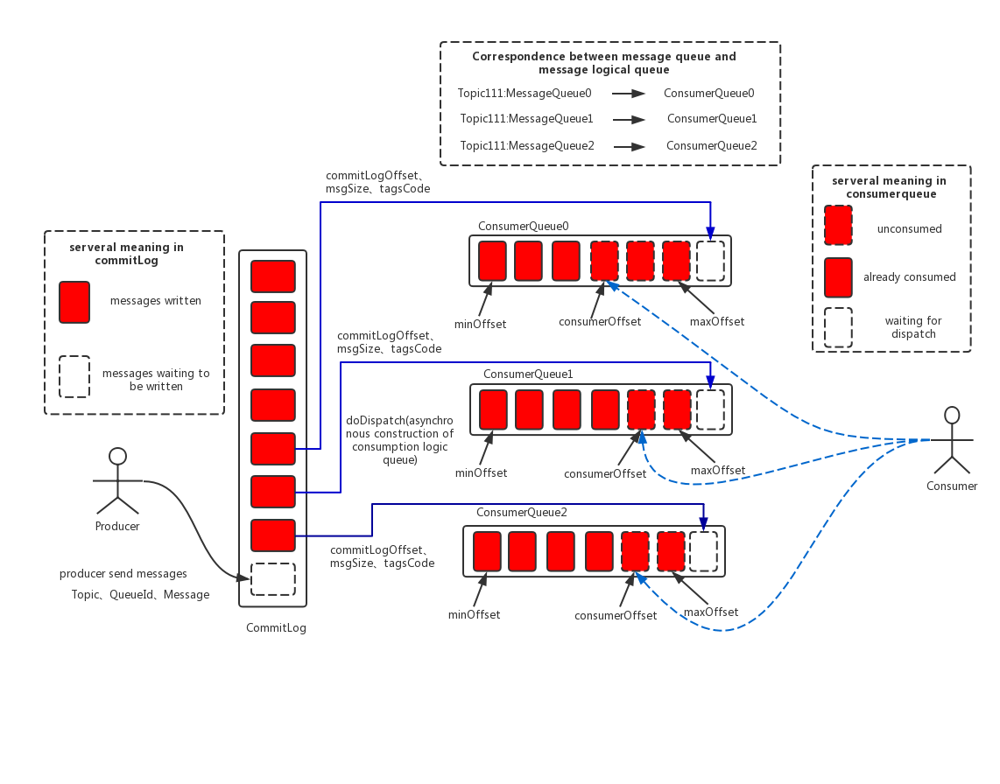
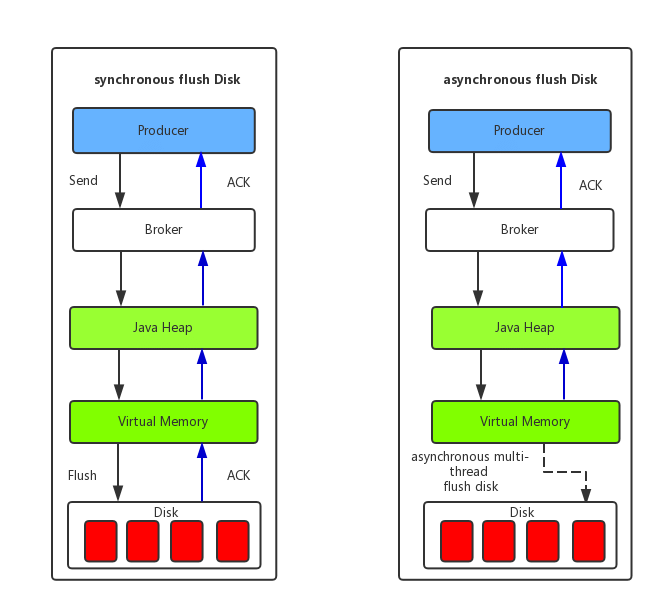

| 版本 | 内容 | 时间                   |
| ---- | ---- | ---------------------- |
| V1   | 新建 | 2022年08月09日19:14:24 |

## Broker 相关目录介绍

```
store
├── abort
├── checkpoint
├── commitlog
│   └── 00000000000000000000
├── config
│   ├── consumerFilter.json
│   ├── consumerFilter.json.bak
│   ├── consumerOffset.json
│   ├── consumerOffset.json.bak
│   ├── delayOffset.json
│   ├── delayOffset.json.bak
│   ├── subscriptionGroup.json
│   ├── subscriptionGroup.json.bak
│   ├── topics.json
│   └── topics.json.bak
├── consumequeue
│   ├── ScheduledTopic
│   │   ├── 0
│   │   │   └── 00000000000000000000
│   │   ├── 1
│   │   │   └── 00000000000000000000
│   │   ├── 2
│   │   │   └── 00000000000000000000
│   │   └── 3
│   │       └── 00000000000000000000
│   ├── SCHEDULE_TOPIC_XXXX
│   │   ├── 1
│   │   │   └── 00000000000000000000
│   │   └── 2
│   │       └── 00000000000000000000
│   ├── TopicTest
│   │   ├── 0
│   │   │   └── 00000000000000000000
│   │   ├── 1
│   │   │   └── 00000000000000000000
│   │   ├── 2
│   │   │   └── 00000000000000000000
│   │   └── 3
│   │       └── 00000000000000000000
│   └── TopicTest2
│       ├── 0
│       │   └── 00000000000000000000
│       ├── 1
│       │   └── 00000000000000000000
│       ├── 2
│       │   └── 00000000000000000000
│       └── 3
│           └── 00000000000000000000
├── index
│   └── 20220411232202751
└── lock
```

1. **commitlog 目录**：文件夹，里面存放着许多 commitLog 文件，文件名长度 20 个字符，文件名由该文件保存消息的最大物理 offset 值在高位补零组成。每个文件的大小默认是 1G，可配置；
2. **consumeQueue 目录**：文件夹，里面存放着当前 broker 上的所有 topic 对应的消息队列的信息。每个消费队列就是 commitlog 的一个索引文件，提供给消费者拉取消息用。因为 commitlog 是顺序写的，假如没有索引的话需要从头开启遍历查找消息，比较耗时；
3. **index 目录**：文件夹，全部的文件是按照消息 key 创建的 hash 索引。文件名是参加的时间戳命名的；
4. **config 目录**：文件夹，保存了当前 broker 的全部 topic 的路由信息、订阅关系和消费进度。这些数据 broker 会定时从内存持久化到磁盘，以后宕机后恢复数据；
   1. **consumerFilter.json**：主题消息过滤信息；
   2. **consumerOffset.json**：集群消费模式下的消息消费进度；
   3. **delayOffset.json**：延迟消息队列拉取进度；
   4. **subscriptionGroup.json**：消息消费组的配置信息；
   5. **topics.json**：topic 配置属性（主题路由信息）；

5. **abort 文件**：标记 broker 是否是异常关闭。正常关闭 broker 时会删除这个文件，异常关闭时不会删除这个文件。当 broker 重启时，根据是否存在这个文件决定是否重新构建 index 索引等操作；
6. **checkpoint 文件**：broker 最近一次正常运行的状态，例如最后一次正常刷盘的时间等；
7. **lock 文件**：存储模块中的加锁文件，作为锁对象；

## RocketMQ 存储架构（来自官网）



消息存储架构图中主要有下面三个跟消息存储相关的文件构成。CommitLog文件、ConsumeQueue文件、Index文件：

（1） **CommitLog**：**消息主体以及元数据的存储主体**，存储 Producer 端写入的消息主体内容，**消息内容不是定长的**。单个文件大小默认 1G，文件名长度为 20 位，左边补零，剩余为起始偏移量，比如 00000000000000000000 代表了第一个文件，起始偏移量为 0，文件大小为 1G = 1073741824；当第一个文件写满了，第二个文件为 00000000001073741824，起始偏移量为 1073741824 ，以此类推。消息主要是**顺序写入**日志文件，当文件满了，写入下一个文件；

TODO-KWOK 上图，那本书上有图，抄一个即可

（2） **ConsumeQueue**：**消息消费队列，引入的目的主要是提高消息消费的性能**。由于 RocketMQ 是基于主题 topic 的订阅模式，消息消费是针对主题进行的，如果要遍历 commitlog 文件，根据 topic 检索消息是非常低效的。Consumer 可根据 ConsumeQueue 来查找待消费的消息。其中，**ConsumeQueue（逻辑消费队列）作为消费消息的索引，保存了指定 topic 下的队列消息在 CommitLog 中的起始物理偏移量 offset，消息大小 size 和消息 Tag 的 HashCode 值。consumequeue 文件可以看成是基于 topic 的 commitlog 索引文件**，故 consumequeue 文件夹的组织方式如下：topic/queue/file 三层组织结构，具体存储路径为： $HOME/store/consumequeue/{topic}/{queueId}/{fileName}。同样 consumequeue 文件采取定长设计，**每一个条目共 20 个字节，分别为 8 字节的 commitlog 物理偏移量、4 字节的消息长度、8 字节 tag hashcode**，存储 tag 的哈希码的原因是为了保证每个条目的长度一致，可以使用类似数组下标快速访问条目。单个文件由 30W 个条目组成，可以像数组一样随机访问每一个条目，每个 ConsumeQueue 文件大小约 5.72M；

消息消费者根据 topic、消息消费进度（ConsumeQueue 逻辑偏移量），也就是第几个 ConsumeQueue 条目，类似数组的索引，这样的消费进度去访问消息，通过逻辑偏移量 logicOffset × 20，即可找到该条目的起始偏移量（ConsumeQueue 文件中的偏移量），然后读取该偏移量后 20 个字节即可得到一个条目，无须遍历 ConsumeQueue 文件。

TODO-KWOK 上图，那本书上有图，抄一个即可

（3） **IndexFile**：**IndexFile（索引文件）提供了一种可以通过 key 或时间区间来查询消息的方法，主要存储消息 key 与 offset 的对应关系**。Index 文件的存储位置是：$HOME/store/index/{fileName}，文件名 fileName 是以创建时的时间戳命名的，**固定的单个 IndexFile 文件大小约为 400M，一个 IndexFile 可以保存 2000W 个索引，IndexFile 的底层存储设计为在文件系统中实现 HashMap 结构，故 RocketMQ 的索引文件其底层实现为 hash 索引。**

TODO-KWOK 上图，那本书上有图，抄一个即可

在上面的 RocketMQ 的消息存储整体架构图中可以看出，RocketMQ 采用的是混合型的存储结构，即为 **Broker 单个实例下所有的队列共用一个日志数据文件（即为 CommitLog ）来存储**。RocketMQ 的混合型存储结构（多个 Topic 的消息实体内容都存储于一个 CommitLog 中）针对 Producer 和 Consumer 分别**采用了数据和索引部分相分离的存储结构**，Producer 发送消息至 Broker 端，然后 **Broker 端使用同步或者异步的方式对消息刷盘持久化，保存至 CommitLog 中。只要消息被刷盘持久化至磁盘文件 CommitLog 中，那么 Producer 发送的消息就不会丢失**。正因为如此，Consumer 也就肯定有机会去消费这条消息。当无法拉取到消息后，可以等下一次消息拉取，同时**服务端也支持长轮询模式，如果一个消息拉取请求未拉取到消息，Broker 允许等待 30s 的时间，只要这段时间内有新消息到达，将直接返回给消费端**。这里，RocketMQ 的具体做法是，使用 Broker 端的后台服务线程 — ReputMessageService 不停地分发请求并异步构建 ConsumeQueue（逻辑消费队列）和 IndexFile（索引文件）数据。


TODO-KWOK  consumerQueue 和 index 文件的生成时机

## 存储性能优化（来自官网）

### PageCache

页缓存（PageCache）是 OS 对文件的缓存，用于加速对文件的读写。一般来说，程序对文件进行顺序读写的速度几乎接近于内存的读写速度，主要原因就是由于 OS 使用 PageCache 机制对读写访问操作进行了性能优化，将一部分的内存用作 PageCache。对于数据的写入，OS 会先写入至 Cache 内，随后通过异步的方式由 pdflush 内核线程将 Cache 内的数据刷盘至物理磁盘上。对于数据的读取，如果一次读取文件时出现未命中 PageCache 的情况，OS 从物理磁盘上访问读取文件的同时，会顺序对其他相邻块的数据文件进行预读取。每个 Page 默认为 4KB。

PageCache 的缺点是当遇到操作系统进行脏页回写、内存回收、内存交换等情况时，就会引起较大的消息读写延迟。

在 RocketMQ 中，Broker 将数据写入 CommitLog 文件的时候，其实不是直接写入底层的物理磁盘文件，而是先进入 OS 的 PageCache 内存缓存中，后续由 OS 后台线程异步将 PageCache 中的数据刷入底层的磁盘文件中。所以，RocketMQ 正是通过**磁盘文件顺序写 + OS PageCache 写入 + OS 异步刷盘**的策略来保证消息写入的性能。

在 RocketMQ 中，ConsumeQueue 逻辑消费队列存储的数据较少，并且是**顺序读取，在 PageCache 机制的预读取作用下，ConsumeQueue 文件的读性能几乎接近读内存**，即使在有消息堆积情况下也不会影响性能。而对于 CommitLog 消息存储的日志数据文件来说，读取消息内容时候会产生较多的随机访问读取，严重影响性能。如果选择合适的系统 IO 调度算法，比如设置调度算法为“Deadline”（此时块存储采用 SSD 的话），随机读的性能也会有所提升。

### mmap 零拷贝

RocketMQ 主要通过 MappedByteBuffer 对文件进行读写操作。其中，利用了 NIO 中的 FileChannel 模型将磁盘上的物理文件直接映射到用户态的内存地址中（这种 Mmap 的方式减少了传统 IO 将磁盘文件数据在操作系统内核地址空间的缓冲区和用户应用程序地址空间的缓冲区之间来回进行拷贝的性能开销），将对文件的操作转化为直接对内存地址进行操作，从而极大地提高了文件的读写效率（正因为需要使用内存映射机制，故 RocketMQ 的文件存储都使用定长结构来存储，方便一次将整个文件映射至内存）。

具体来说，传统的磁盘 IO 操作，把数据从硬盘读取到内核缓冲区，再复制到用户缓冲区，有两次拷贝。mmap 主要实现方式是将读缓冲区的地址和用户缓冲区的地址进行映射，内核缓冲区和应用缓冲区共享，从而减少了从读缓冲区到用户缓冲区的一次 CPU 拷贝，即 Java 进程映射到内核态内存，原来内核态内存与用户态内存的互相拷贝过程就消失了。

TODO-KWOK 找一下相关的图

## 消息刷盘机制（来自官网）



（1）**同步刷盘**：如上图所示，只有在消息真正持久化至磁盘后 RocketMQ 的 Broker 端才会真正返回给 Producer 端一个成功的 ACK 响应。同步刷盘对 MQ 消息可靠性来说是一种不错的保障，但是性能上会有较大影响，一般适用于金融业务应用该模式较多；

（2）**异步刷盘**：能够充分利用 OS 的 PageCache 的优势，只要消息写入 PageCache 即可将成功的 ACK 返回给 Producer 端。消息刷盘采用后台异步线程提交的方式进行，降低了读写延迟，提高了 MQ 的性能和吞吐量；

## 内存级别读写分离

## 过期文件删除机制

## 文件恢复机制

## 本次分析 broker 核心存储模块的顺序

broker 核心存储模块，因为涉及的类比较多，本次先分析各个子模块的实现原理，再串起来整个存储模块。

**1、图解内存映射文件MappedFile**

**2、内存映射文件MappedFile核心源码详解**

**3、图解目录文件管理器 MappedFileQueue**

**4、目录文件管理器 MappedFileQueue核心源码详解**

**5、图解消息提交日志模块CommitLog**

**6、消息提交日志模块CommitLog核心源码详解**

**7、图解消费队列模块ConsumeQueue**

**8、消费队列模块ConsumeQueue核心源码详解**

**9、图解索引文件IndexFile**

**10、索引文件IndexFile核心源码详解**

**11、图解索引服务IndexService**

**12、索引服务IndexService核心源码详解**

**13、图解消息存储主模块 DefaultMessageStore**

**14、消息存储主模块DefaultMessageStore核心源码详解**
