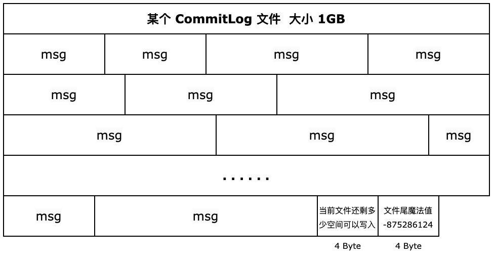
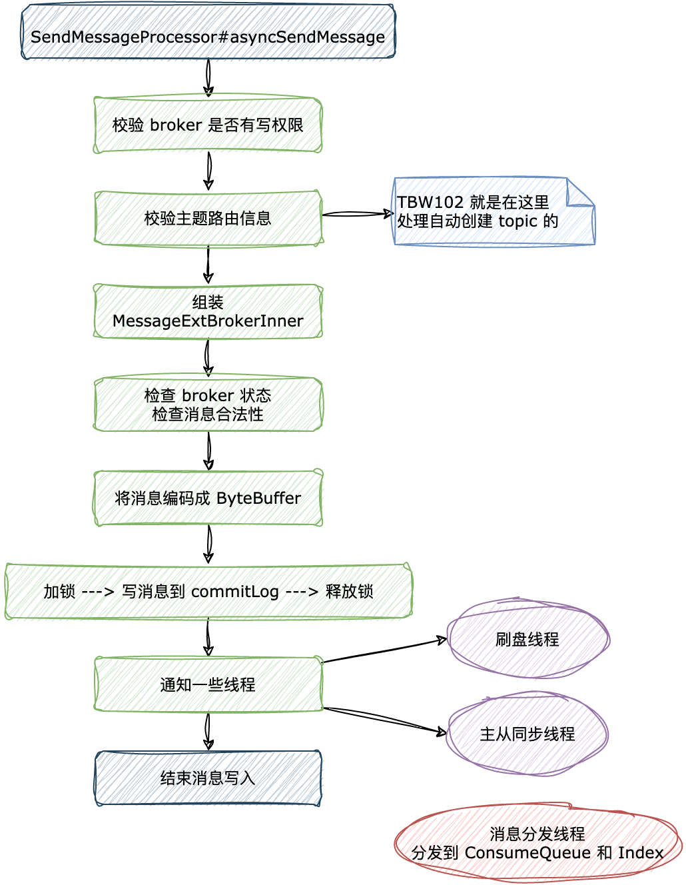

| 版本 | 内容 | 时间                   |
| ---- | ---- | ---------------------- |
| V1   | 新建 | 2023年06月18日23:02:01 |

## CommitLog 的存储方式

CommitLog 是**消息主体以及元数据的存储主体**，存储 Producer 端写入的消息主体内容，**消息内容不是定长的**。单个文件大小默认 1G，文件名长度为 20 位，左边补零，剩余为起始偏移量，比如 00000000000000000000 代表了第一个文件，起始偏移量为 0，文件大小为 1G = 1073741824；当第一个文件写满了，第二个文件为 00000000001073741824，起始偏移量为 1073741824 ，以此类推。消息主要是**顺序写入**日志文件，当文件满了，写入下一个文件；

因为 CommitLog 的文件是存储在磁盘上的，为了提高写入消息的性能，RocketMQ 使用了 mmap 将磁盘文件映射到内存中。映射到的内存到 page cache，现代的操作系统内核被设计为按照 Page 读取文件，每个 Page 的默认大小是 4kb，如果读取的内容名字了 page cache 就直接返回，不会再次读取磁盘了。但是 page cache 也有脏页回写、内存回收、内存置换等情况，RocketMQ 通过内存预热、设定内存不置换等措施来优化。

## CommitLog 的存储格式

CommitLog 文件的存储效果如下：

生产者发送过来的消息长度一般都是不相同的。假如生产者发送过来的消息大于文件的剩余空间，那么此次消息是无法写进该 CommitLog 文件的，此时需要把当前文件的剩余空间大小写到文件尾，占用 4 字节，最后写下文件结束的魔法值，也是占用 4 个字节。

具体的逻辑在 DefaultAppendMessageCallback#doAppend(long, ByteBuffer, int, MessageExtBrokerInner, PutMessageContext) 中：

```java
public AppendMessageResult doAppend(final long fileFromOffset, final ByteBuffer byteBuffer, final int maxBlank,
        final MessageExtBrokerInner msgInner, PutMessageContext putMessageContext) {
        
        // ...... 省略 ......

        // 获取编码后的 buffer
        ByteBuffer preEncodeBuffer = msgInner.getEncodedBuff();
        // 获取消息长度
        final int msgLen = preEncodeBuffer.getInt(0);

        // Determines whether there is sufficient free space
        // 如果消息长度 + END_FILE_MIN_BLANK_LENGTH 大于 CommitLog 文件的空闲空间，则返回 AppendMessageStatus.END_OF_FILE，Broker 会创建一个新的 CommitLog 文件来存储该消息。
        // 每个CommitLog文件最少空闲8字节，高4字节存储当前文件的剩余空间，低4字节存储魔数
        if ((msgLen + END_FILE_MIN_BLANK_LENGTH) > maxBlank) {
            this.msgStoreItemMemory.clear();
            // 1 TOTALSIZE
            this.msgStoreItemMemory.putInt(maxBlank);
            // 2 MAGICCODE  文件尾的魔法值
            this.msgStoreItemMemory.putInt(CommitLog.BLANK_MAGIC_CODE);
            // 3 The remaining space may be any value
            // Here the length of the specially set maxBlank
            final long beginTimeMills = CommitLog.this.defaultMessageStore.now();
            byteBuffer.put(this.msgStoreItemMemory.array(), 0, 8);
            return new AppendMessageResult(AppendMessageStatus.END_OF_FILE, wroteOffset,
                    maxBlank, /* only wrote 8 bytes, but declare wrote maxBlank for compute write position */
                    msgIdSupplier, msgInner.getStoreTimestamp(),
                    queueOffset, CommitLog.this.defaultMessageStore.now() - beginTimeMills);
        }

        // ...... 省略 其他......

        return result;
    }
```


对于 CommitLog 文件中单个文件的存储格式，从 CommitLog#calMsgLength 计算消息长度的方法，就可以看到消息的编码规则了

```java
/**
 * 计算消息总长度
 */
protected static int calMsgLength(int sysFlag, int bodyLength, int topicLength, int propertiesLength) {
    int bornhostLength = (sysFlag & MessageSysFlag.BORNHOST_V6_FLAG) == 0 ? 8 : 20;
    int storehostAddressLength = (sysFlag & MessageSysFlag.STOREHOSTADDRESS_V6_FLAG) == 0 ? 8 : 20;
    final int msgLen = 4 //TOTALSIZE
        + 4 //MAGICCODE
        + 4 //BODYCRC
        + 4 //QUEUEID
        + 4 //FLAG
        + 8 //QUEUEOFFSET
        + 8 //PHYSICALOFFSET
        + 4 //SYSFLAG
        + 8 //BORNTIMESTAMP
        + bornhostLength //BORNHOST
        + 8 //STORETIMESTAMP
        + storehostAddressLength //STOREHOSTADDRESS
        + 4 //RECONSUMETIMES
        + 8 //Prepared Transaction Offset
        + 4 + (bodyLength > 0 ? bodyLength : 0) //BODY
        + 1 + topicLength //TOPIC
        + 2 + (propertiesLength > 0 ? propertiesLength : 0) //propertiesLength
        + 0;
    return msgLen;
}
```

这里 我们就可以看到 CommitLog 消息存储格式了

| 写入顺序 | 字段                        | 字段大小（字节） | 数据类型 | 字段含义                                                     |
| -------- | --------------------------- | ---------------- | -------- | ------------------------------------------------------------ |
| 1        | TOTALSIZE                   | 4                | int      | 这个消息的大小                                               |
| 2        | MAGICCODE                   | 4                | int      | 魔法值                                                       |
| 3        | BODYCRC                     | 4                | int      | 消息体 BODY CRC，当 broker 重启 recover 时会校验             |
| 4        | QUEUEID                     | 4                | int      | 消息队列 id                                                  |
| 5        | FLAG                        | 4                | int      |                                                              |
| 6        | QUEUEOFFSET                 | 8                | long     | 队列逻辑偏移量，ConsumeQueu 文件内的真实偏移量为：QUEUEOFFSET * 20 |
| 7        | PHYSICALOFFSET              | 8                | long     | 代表消息在 CommitLog 中的物理起始地址偏移量                  |
| 8        | SYSFLAG                     | 4                | int      | 系统标记                                                     |
| 9        | BORNTIMESTAMP               | 8                | long     | 消息生产端（producer）的发送消息时间戳                       |
| 10       | bornhost                    | 8 or 20          | long     | 消息生产端（producer）的发送消息的主机地址（address:port）  (可能是 ipv6) |
| 11       | STORETIMESTAMP              | 8                | long     | 消息在 broker 的存储时间                                     |
| 12       | storehostAddress            | 8 or 20          | long     | 消息存储到 broker 的主机地址（address:port）  (可能是 ipv6)  |
| 13       | RECONSUMETIMES              | 4                | int      | 重试消息重试第几次                                           |
| 14       | Prepared Transaction Offset | 8                | long     | 表示的是事务消息位点                                         |
| 15       | BODYLength                  | 4                | int      | 消息体长度                                                   |
| 16       | BODY                        | 数组长度         | byte[]   | 消息体                                                       |
| 17       | topicLength                 | 1                | int      | 1                                                            |
| 18       | topic                       | 数组长度         | byte[]   | 主题名                                                       |
| 19       | propertiesLength            | 2                | short    | 扩展信息长度                                                 |
| 20       | properties                  | 数组长度         | byte[]   | 扩展信息                                                     |

## CommitLog 存储消息的流程

### broker 处理入口

生产者发送过来的消息有单个消息和批量消息。

- 单个消息有：RequestCode.SEND_MESSAGE 和 RequestCode.SEND_MESSAGE_V2；
- 批量消息有：RequestCode.SEND_BATCH_MESSAGE；

关于单个消息的 RequestCode.SEND_MESSAGE_V2 和前一个的区别是，V2 是提供的消息精简的功能，就是把各个字段的名字长度减少了，如下：

SendMessageRequestHeaderV2#createSendMessageRequestHeaderV2

```java
public static SendMessageRequestHeaderV2 createSendMessageRequestHeaderV2(final SendMessageRequestHeader v1) {
    SendMessageRequestHeaderV2 v2 = new SendMessageRequestHeaderV2();
    v2.a = v1.getProducerGroup();
    v2.b = v1.getTopic();
    v2.c = v1.getDefaultTopic();
    v2.d = v1.getDefaultTopicQueueNums();
    v2.e = v1.getQueueId();
    v2.f = v1.getSysFlag();
    v2.g = v1.getBornTimestamp();
    v2.h = v1.getFlag();
    v2.i = v1.getProperties();
    v2.j = v1.getReconsumeTimes();
    v2.k = v1.isUnitMode();
    v2.l = v1.getMaxReconsumeTimes();
    v2.m = v1.isBatch();
    return v2;
}
```

以 RequestCode.SEND_MESSAGE_V2 为例，Broker 处理消息的入口在 SendMessageProcessor#asyncSendMessage 方法。

### broker 处理消息

先看流程图：




#### SendMessageProcessor#asyncSendMessage

```java
private CompletableFuture<RemotingCommand> asyncSendMessage(ChannelHandlerContext ctx, RemotingCommand request,
                                                            SendMessageContext mqtraceContext,
                                                            SendMessageRequestHeader requestHeader) {
    // 主要做一些校验，然后准备一个响应的 response 类型的 RemotingCommand 对象
    final RemotingCommand response = preSend(ctx, request, requestHeader);
    final SendMessageResponseHeader responseHeader = (SendMessageResponseHeader)response.readCustomHeader();

    // ...... 省略 ......

    final byte[] body = request.getBody();

    int queueIdInt = requestHeader.getQueueId();
    // 获取 producer 发送来的消息的 topic 路由信息
    TopicConfig topicConfig = this.brokerController.getTopicConfigManager().selectTopicConfig(requestHeader.getTopic());

    // ...... 省略 ......

    MessageExtBrokerInner msgInner = new MessageExtBrokerInner();
    msgInner.setTopic(requestHeader.getTopic());
    msgInner.setQueueId(queueIdInt);

   // ...... 省略 ......

    msgInner.setBody(body);
    msgInner.setFlag(requestHeader.getFlag());
    Map<String, String> origProps = MessageDecoder.string2messageProperties(requestHeader.getProperties());
    MessageAccessor.setProperties(msgInner, origProps);
    msgInner.setBornTimestamp(requestHeader.getBornTimestamp());
    msgInner.setBornHost(ctx.channel().remoteAddress());
    msgInner.setStoreHost(this.getStoreHost());
    msgInner.setReconsumeTimes(requestHeader.getReconsumeTimes() == null ? 0 : requestHeader.getReconsumeTimes());
    String clusterName = this.brokerController.getBrokerConfig().getBrokerClusterName();
    MessageAccessor.putProperty(msgInner, MessageConst.PROPERTY_CLUSTER, clusterName);
    // ...... 省略 ......

    CompletableFuture<PutMessageResult> putMessageResult = null;
    String transFlag = origProps.get(MessageConst.PROPERTY_TRANSACTION_PREPARED);
    if (transFlag != null && Boolean.parseBoolean(transFlag)) {
        // ...... 省略处理事务消息 ......
    } else {
        // 写入生产端的消息到 broker
        putMessageResult = this.brokerController.getMessageStore().asyncPutMessage(msgInner);
    }
    return handlePutMessageResultFuture(putMessageResult, response, request, msgInner, responseHeader, mqtraceContext, ctx, queueIdInt);
}
```

这个方法的作用就是封装一下 producer 发送过来的消息的数据，组装成 MessageExtBrokerInner 对象。然后继续调用 DefaultMessageStore#asyncPutMessage 方法

#### DefaultMessageStore#asyncPutMessage

```java
public CompletableFuture<PutMessageResult> asyncPutMessage(MessageExtBrokerInner msg) {

    // ...... 省略 broker 状态检查逻辑 ......
    // ...... 省略 producer 发送过来的消息的合法性检查逻辑 ......
    // ...... 省略其他状态检查逻辑 ......

    long beginTime = this.getSystemClock().now();
    // 追加数据到 CommitLog
    CompletableFuture<PutMessageResult> putResultFuture = this.commitLog.asyncPutMessage(msg);

    // ...... 省略消息写入的结果处理 ......

    return putResultFuture;
}
```

该方法的主要作用就是提供一些校验，然后调用 commitlog 的写入消息的方法去写消息。

#### CommitLog#asyncPutMessage

这个方法非常长，这里分步分析，本次省略对延迟消息的分析

**（1）编码消息**

```java
// 获取线程本地变量 putMessageThreadLocal
PutMessageThreadLocal putMessageThreadLocal = this.putMessageThreadLocal.get();
// 将生产者发送来的消息，编码后保存在线程本地变量中
PutMessageResult encodeResult = putMessageThreadLocal.getEncoder().encode(msg);
if (encodeResult != null) {
    // encode 异常才会到这里，正常情况是返回 null 的
    return CompletableFuture.completedFuture(encodeResult);
}
// 将编码好的消息保存
msg.setEncodedBuff(putMessageThreadLocal.getEncoder().encoderBuffer);
```

首先使用 PutMessageThreadLocal 对消息进行编码，将编码器放到 ThreadLocal 中是为了保证线程安全，最后将编码后得到的 ByteBuffer 赋值到 msg 的字段中。

```java
static class PutMessageThreadLocal {
    private MessageExtEncoder encoder;
    private StringBuilder keyBuilder;

    // ...... 省略 ......
}
```

关于 MessageExtEncoder 编码器，就是按照 broker 中存储消息的 MessageExtBrokerInner 的字段按照顺序依次存到 ByteBuffer 中去

**（2）写入消息到 commitLog 文件**

```java
putMessageLock.lock(); //spin or ReentrantLock ,depending on store config
try {
    // 获取当前顺序写的 MappedFile，最后一个 MappedFile
    MappedFile mappedFile = this.mappedFileQueue.getLastMappedFile();
    // 记录获取锁的时间
    long beginLockTimestamp = this.defaultMessageStore.getSystemClock().now();
    // 记录加锁开启时间
    this.beginTimeInLock = beginLockTimestamp;

    // Here settings are stored timestamp, in order to ensure an orderly global
    // 设置消息的存储时间，保证消息的全局顺序
    msg.setStoreTimestamp(beginLockTimestamp);

    // 条件成立：1 commitLog 目录下是空 2 文件写满了
    if (null == mappedFile || mappedFile.isFull()) {
        // 创建一个 MappedFile
        mappedFile = this.mappedFileQueue.getLastMappedFile(0); // Mark: NewFile may be cause noise
    }
    if (null == mappedFile) {
        log.error("create mapped file1 error, topic: " + msg.getTopic() + " clientAddr: " + msg.getBornHostString());
        return CompletableFuture.completedFuture(new PutMessageResult(PutMessageStatus.CREATE_MAPEDFILE_FAILED, null));
    }

    // 正常执行到这里..

    // 参数 1：消息
    // 参数 2：appendMessageCallback，控制消息那些字段追加到
    result = mappedFile.appendMessage(msg, this.appendMessageCallback, putMessageContext);
```

commitLog 文件是通过 mmap 技术将磁盘文件映射到内存中，通过 FileChannel 的 map 方法映射成 MappedByteBuffer。在 RocketMQ 中将 MappedByteBuffer 封装到 MappedFile 类中了。

- 首先需要加锁，保证 commitlog 文件的写入顺序；
- 获取当前正在写的 commitlog 文件对应内存映射 MappedByteBuffer；
- 最后写入消息到 MappedByteBuffer 中；

**（3）处理消息写入结果**

```java
switch (result.getStatus()) {
        case PUT_OK:
            break;
        case END_OF_FILE:
            // 文件尾了，创建新文件
            unlockMappedFile = mappedFile;
            // Create a new file, re-write the message
            mappedFile = this.mappedFileQueue.getLastMappedFile(0);
            if (null == mappedFile) {
                // XXX: warn and notify me
                log.error("create mapped file2 error, topic: " + msg.getTopic() + " clientAddr: " + msg.getBornHostString());
                return CompletableFuture.completedFuture(new PutMessageResult(PutMessageStatus.CREATE_MAPEDFILE_FAILED, result));
            }
            // 创建新文件后，再次尝试写入
            result = mappedFile.appendMessage(msg, this.appendMessageCallback, putMessageContext);
            break;
        case MESSAGE_SIZE_EXCEEDED:
        case PROPERTIES_SIZE_EXCEEDED:
            return CompletableFuture.completedFuture(new PutMessageResult(PutMessageStatus.MESSAGE_ILLEGAL, result));
        case UNKNOWN_ERROR:
            return CompletableFuture.completedFuture(new PutMessageResult(PutMessageStatus.UNKNOWN_ERROR, result));
        default:
            return CompletableFuture.completedFuture(new PutMessageResult(PutMessageStatus.UNKNOWN_ERROR, result));
    }

    // 计算加锁的总耗时
    elapsedTimeInLock = this.defaultMessageStore.getSystemClock().now() - beginLockTimestamp;
} finally {
    // 重置时间
    beginTimeInLock = 0;
    // 释放锁
    putMessageLock.unlock();
}
```

如果某个 commitlog 已经写完了，需要重新创建一个文件并将其映射成 MappedByteBuffer，再次尝试写入到新的 commitlog 文件中。

还需要释放锁。

**（4）通知刷盘服务**

```java
// 通知刷盘线程
CompletableFuture<PutMessageStatus> flushResultFuture = submitFlushRequest(result, msg);
```

commitlog 映射出来的 MappedByteBuffer 是在内存中的，最后需要 os 的异步线程去刷盘，我们可以调用 api 去强制刷盘。这里就是通知刷盘线程去执行刷盘操作。在 RocketMQ 中刷盘分为同步刷盘和异步刷盘，这里知道会去通知刷盘线程就行了，关于同步刷盘和异步刷盘后面会详细分析。

**（5）主从同步**

```java
// 通知主从同步线程
CompletableFuture<PutMessageStatus> replicaResultFuture = submitReplicaRequest(result, msg);
```

当 commitlog 写入消息成功后，需要去做主从同步的处理。这里后面会详细分析。
