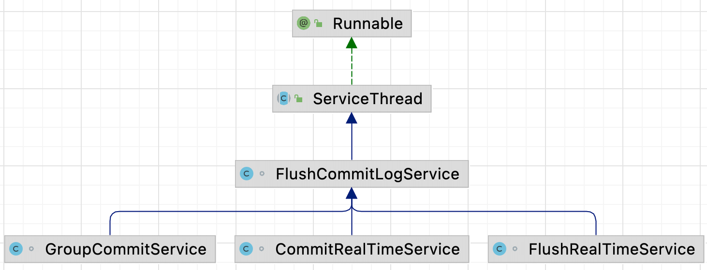
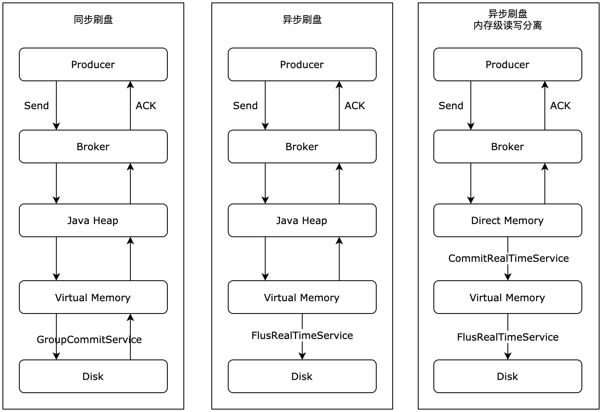

| 版本 | 内容 | 时间                   |
| ---- | ---- | ---------------------- |
| V1   | 新建 | 2023年06月18日22:19:54 |

## broker 的刷盘机制

消息存储完成后会被操作系统持久化到磁盘。

RocketMQ 支持两种刷盘方式，同步刷盘和异步刷盘。刷盘功能涉及下面三个线程服务：



- GroupCommitService：同步刷盘服务；
- FlushRealTimeService：异步刷盘服务；
- CommitRealTimeService：内存级读写分离机制用的，消息首先会写到堆外内存，然后通过 commit 写到 os pageCache，最后由 os 异步刷新到磁盘；



## 刷盘机制的入口

Broker 在处理 Producer 发送来的消息，最终会调用到 CommitLog#asyncPutMessage 方法，在这个方法里面会去通知刷盘线程去刷盘。

```java
// 通知刷盘线程
CompletableFuture<PutMessageStatus> flushResultFuture = submitFlushRequest(result, msg);
```

看一下 CommitLog#submitFlushRequest 方法

```java
public CompletableFuture<PutMessageStatus> submitFlushRequest(AppendMessageResult result, MessageExt messageExt) {
    // Synchronization flush
    if (FlushDiskType.SYNC_FLUSH == this.defaultMessageStore.getMessageStoreConfig().getFlushDiskType()) {
        final GroupCommitService service = (GroupCommitService) this.flushCommitLogService;
        if (messageExt.isWaitStoreMsgOK()) {
            // 参数 1：当前写的位置 + 此次写的数据的字节数
            // 参数 2：同步刷新的超时时间
            // 创建同步刷盘任务
            GroupCommitRequest request = new GroupCommitRequest(result.getWroteOffset() + result.getWroteBytes(),
                    this.defaultMessageStore.getMessageStoreConfig().getSyncFlushTimeout());
            flushDiskWatcher.add(request);
            // 添加同步刷盘任务
            service.putRequest(request);
            return request.future();
        } else {
            service.wakeup();
            return CompletableFuture.completedFuture(PutMessageStatus.PUT_OK);
        }
    }
    // Asynchronous flush
    // 唤醒异步刷盘线程
    else {
        if (!this.defaultMessageStore.getMessageStoreConfig().isTransientStorePoolEnable()) {
            // 唤醒异步刷盘服务
            flushCommitLogService.wakeup();
        } else  {
            // 内存级读写分离，唤醒提交到 page cache 服务
            commitLogService.wakeup();
        }
        return CompletableFuture.completedFuture(PutMessageStatus.PUT_OK);
    }
}
```

就是根据配置获取当前 broker 的刷盘策略，然后去做不同的处理。主要就是前面提到的三种刷盘机制。接下来依次分析同步刷盘机制、异步刷盘、异步内存读写分离式刷盘。

## 同步刷盘机制

同步刷盘是一个后台线程服务，先看下 GroupCommitService 的属性：

```java
// 同步刷盘任务暂存容器，是待刷新到磁盘的数据
private volatile LinkedList<GroupCommitRequest> requestsWrite = new LinkedList<GroupCommitRequest>();
// GroupCommitService 线程每次处理的 request 容器，避免任务提交和任务执行的锁冲突
private volatile LinkedList<GroupCommitRequest> requestsRead = new LinkedList<GroupCommitRequest>();
// 自旋锁
private final PutMessageSpinLock lock = new PutMessageSpinLock();
```

requestsWrite 和 requestsRead 读写分析，也就是任务会提交到 requestsWrite 集合中，真正处理的时候会交换 requestsWrite 的数据到 requestsRead 中，然后处理 requestsRead 中的数据。交换操作如下：

```java
private void swapRequests() {
    lock.lock();
    try {
        LinkedList<GroupCommitRequest> tmp = this.requestsWrite;
        this.requestsWrite = this.requestsRead;
        this.requestsRead = tmp;
    } finally {
        lock.unlock();
    }
}
```

关键点就是 GroupCommitService#doCommit 方法了，这个方法会在 run 方法内每隔 10ms 死循环去执行的。

```java
private void doCommit() {
    if (!this.requestsRead.isEmpty()) {
        // 遍历集合
        for (GroupCommitRequest req : this.requestsRead) {
            // There may be a message in the next file, so a maximum of two times the flush
            // 是否已经刷新完毕
            boolean flushOK = CommitLog.this.mappedFileQueue.getFlushedWhere() >= req.getNextOffset();
            for (int i = 0; i < 2 && !flushOK; i++) {
                // 传 0 强制刷新
                CommitLog.this.mappedFileQueue.flush(0);
                flushOK = CommitLog.this.mappedFileQueue.getFlushedWhere() >= req.getNextOffset();
            }

            // 唤醒之前添加刷盘任务的线程
            req.wakeupCustomer(flushOK ? PutMessageStatus.PUT_OK : PutMessageStatus.FLUSH_DISK_TIMEOUT);
        }

        // 处理完所有同步刷盘任务后，更新刷盘检测点 StoreCheckpoint 中 的 physicMsgTimestamp，
        // 但并没有执行检测点的刷盘操作，刷盘检测点的刷盘操作将在刷写消息队列文件时触发。
        long storeTimestamp = CommitLog.this.mappedFileQueue.getStoreTimestamp();
        if (storeTimestamp > 0) {
            CommitLog.this.defaultMessageStore.getStoreCheckpoint().setPhysicMsgTimestamp(storeTimestamp);
        }

        this.requestsRead = new LinkedList<>();
    } else {
        // Because of individual messages is set to not sync flush, it
        // will come to this process
        CommitLog.this.mappedFileQueue.flush(0);
    }
}
```

每次刷盘前都需要做一些检查，以确认当前同步刷盘请求对应偏移量的消息是否已经被刷盘，如果已经被刷盘，当前刷盘请求就不需要执行。刷盘完成后，需要唤醒之前添加刷盘任务的线程，因为是同步刷盘嘛。

## 异步刷盘机制

如果 Broker 配置了内存级别的读写分离，异步刷盘流程还包含提交到堆外内存的步骤。

### 未配置内存读写分离

主要看 FlushRealTimeService 服务，刷盘流程主要在 FlushRealTimeService#run 中实现的，下面的操作都是在死循环中进行的：

**（1）第一步获取一些刷盘参数**

```java
// 控制线程休眠方式： true 使用 sleep 休眠，false 使用的是 countDownLatch.wait() 休眠，默认是 true
boolean flushCommitLogTimed = CommitLog.this.defaultMessageStore.getMessageStoreConfig().isFlushCommitLogTimed();

// 异步刷盘间隔
int interval = CommitLog.this.defaultMessageStore.getMessageStoreConfig().getFlushIntervalCommitLog();
// 异步刷盘脏页最小值
int flushPhysicQueueLeastPages = CommitLog.this.defaultMessageStore.getMessageStoreConfig().getFlushCommitLogLeastPages();

// 强制刷盘的时间间隔
int flushPhysicQueueThoroughInterval =
    CommitLog.this.defaultMessageStore.getMessageStoreConfig().getFlushCommitLogThoroughInterval();

// 是否打印刷盘进度
boolean printFlushProgress = false;
```

主要关注「异步刷盘的间隔」、「异步刷盘的脏页的最小值」、「强制刷盘的时间间隔」，下面说下这三个参数的作用：

- 异步刷盘的间隔：因为是在 while 循环中，要控制下每次循环的时间间隔，避免将 cpu 占用太长时间，导致无法执行其他更紧急的任务；
- 异步刷盘的脏页的最小值：每次消息来都刷盘、或者很长时间才去刷盘，前者会影响整个系统的性能，后者可能会导致消息不能及时写到磁盘。所以需要一个折中点，当写到内存中的数据达到一定页数的时候，就会去执行刷盘操作了；
- 强制刷盘的时间间隔：上次刷盘时间和此次间隔到一定值时，不管内存中脏页多少都会去强制刷盘的；

**（2）第二步就是判断是否需要强制刷盘了**，如果上次刷盘时间和此次间隔到一定值时，需要将 flushPhysicQueueLeastPages 设置为 0，表示强制刷盘。

```java
// 是否打印刷盘进度
boolean printFlushProgress = false;

// Print flush progress
long currentTimeMillis = System.currentTimeMillis();
if (currentTimeMillis >= (this.lastFlushTimestamp + flushPhysicQueueThoroughInterval)) {
    // 强制刷盘时间
    this.lastFlushTimestamp = currentTimeMillis;
    // 设置为 0，表示强制置刷盘
    flushPhysicQueueLeastPages = 0;
    printFlushProgress = (printTimes++ % 10) == 0;
}
```

**（3）第三步就是休眠动作了，防止占用 CPU 时间过长**

```java
// 休眠逻辑，避免将 cpu 占用太长时间，导致无法执行其他更紧急的任务
if (flushCommitLogTimed) {
    Thread.sleep(interval);
} else {
    this.waitForRunning(interval);
}
```

**（4）第四步就是做真正的刷盘操作了**，顺带记录一下 Checkpoint 信息

```java
long begin = System.currentTimeMillis();
// 刷盘动作
CommitLog.this.mappedFileQueue.flush(flushPhysicQueueLeastPages);
// 更新checkpoint文件的CommitLog文件更新时间戳，
// checkpoint文件的刷盘动作在刷盘ConsumeQueue线程中执行，其入口为DefaultMessageStore#FlushConsumeQueueService。

// 获取最后一条数据的存储时间
long storeTimestamp = CommitLog.this.mappedFileQueue.getStoreTimestamp();
if (storeTimestamp > 0) {
    // 记录 checkpoint 的时间
    CommitLog.this.defaultMessageStore.getStoreCheckpoint().setPhysicMsgTimestamp(storeTimestamp);
}
```

### 内存读写分离的刷盘

先说一下流程：

- 生产者写消息到 broker，broker 处理消息；
- broker 先写到直接内存；
- 通过 CommitRealTimeService 线程服务将数据写到 page cache；
- 然后通过 FlushRealTimeService 线程服务区刷盘；

这里主要关注 CommitRealTimeService 服务的逻辑，FlushRealTimeService 上一小节已经分析过了。主要关注 CommitRealTimeService#run 方法，下面的逻辑也是再死循环中进行的

**（1）首先获取提交的一些参数，并判断是否需要强制提交**

```java
// 获取刷新间隔时间
int interval = CommitLog.this.defaultMessageStore.getMessageStoreConfig().getCommitIntervalCommitLog();

// 获取最小 刷盘的页数
int commitDataLeastPages = CommitLog.this.defaultMessageStore.getMessageStoreConfig().getCommitCommitLogLeastPages();

int commitDataThoroughInterval =
 CommitLog.this.defaultMessageStore.getMessageStoreConfig().getCommitCommitLogThoroughInterval();

long begin = System.currentTimeMillis();
if (begin >= (this.lastCommitTimestamp + commitDataThoroughInterval)) {
    this.lastCommitTimestamp = begin;
    commitDataLeastPages = 0;
}
```

**（2）提交操作。如果返回的 result 是 false，唤醒异步刷盘线程。返回 false 并不是表示没有数据被提交到 page cache中，而是说明有部分数据提交成功，部分数据提交失败，所以可以唤醒刷盘线程执行刷盘操作。而如果转存成功，则正常进行异步刷盘即可。**

```java
try {
    boolean result = CommitLog.this.mappedFileQueue.commit(commitDataLeastPages);
    long end = System.currentTimeMillis();
    if (!result) {
        this.lastCommitTimestamp = end; // result = false means some data committed.
        //now wake up flush thread.
        flushCommitLogService.wakeup();
    }

    if (end - begin > 500) {
        log.info("Commit data to file costs {} ms", end - begin);
    }
    this.waitForRunning(interval);
```

## 刷盘机制的对比

| 刷盘机制   | 异步实时刷盘 | 异步刷盘（内存读写分离） | 同步刷盘 |
| ---------- | ------------ | ------------------------ | -------- |
| 数据一致性 | 中           | 低                       | 高       |
| 数据可靠性 | 低           | 低                       | 高       |
| 数据可用性 | 中           | 低                       | 高       |
| 系统吞吐量 | 高           | 高                       | 低       |

解释一下：

- **同步刷盘**：因为只有消息落盘成功后，broker 才会给 producer 响应，所有它的消息可靠性是最高的，但是正是要等待落盘完成才响应给 producer，所有吞吐量也是最差的；
- **异步实时落盘**：当 broker 把消息写到内存映射上（其实就算 page cache 了），然后就会给 producer 响应了。当写到 page cache 上后，只要系统正常，os 就会有一个异步线程去刷盘。RocketMQ 也有一些后台线程去强制刷盘。但是如果写到 page cache，宿主机崩溃了，这部分数据就丢失了。这时系统吞吐量虽然高了，但是有丢失数据的风险；
- **异步刷盘（内存级别读写分离）**：这个机制首先是先提交到直接内存，然后通过后台线程去写到 page cache，最后是后台线程去刷盘。在写 page cache 和刷盘这两步都有丢失数据的风险；