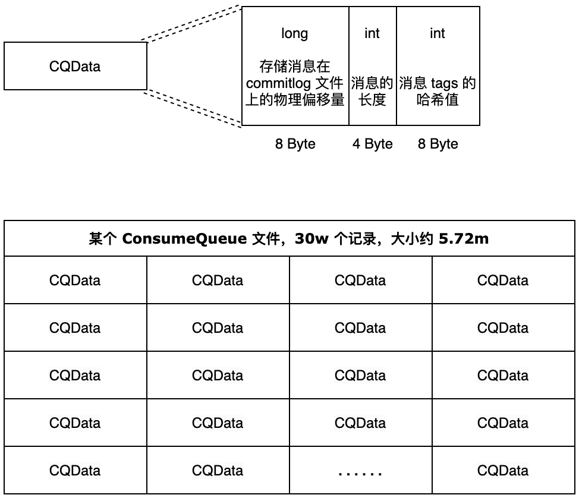
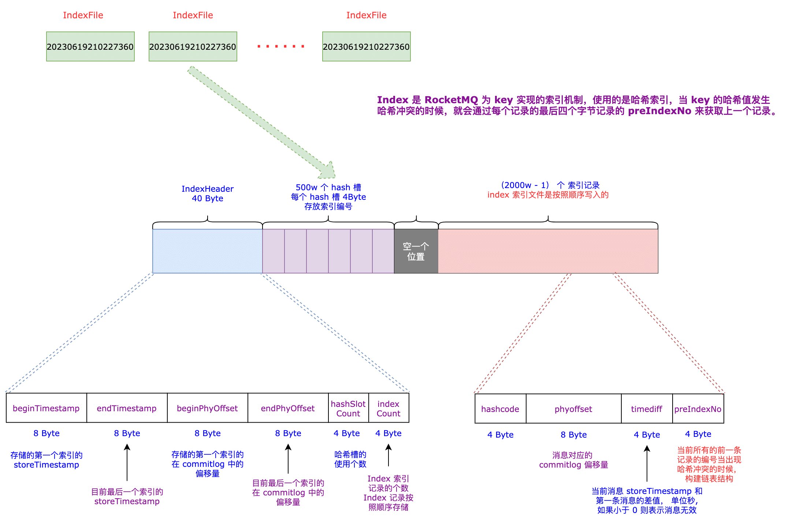
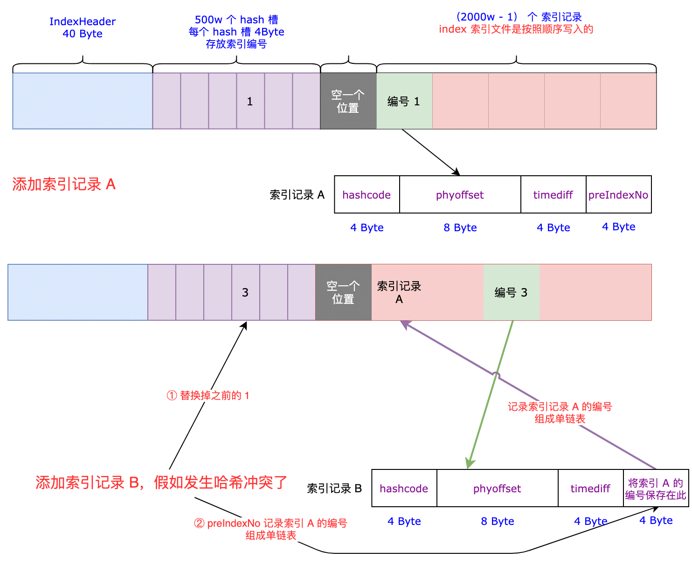

| 版本 | 内容 | 时间                   |
| ---- | ---- | ---------------------- |
| V1   | 新建 | 2023年06月22日13:01:04 |

## 概念

### ConsumeQueue 是什么

**ConsumeQueue**：**消息消费队列，引入的目的主要是提高消息消费的性能**。

由于 RocketMQ 是基于主题 topic 的订阅模式，消息消费是针对主题进行的，如果要遍历 commitlog 文件，根据 topic 检索消息是非常低效的。Consumer 可根据 ConsumeQueue 来查找待消费的消息。其中，**ConsumeQueue（逻辑消费队列）作为消费消息的索引，保存了指定 topic 下的队列消息在 CommitLog 中的起始物理偏移量 offset，消息大小 size 和消息 Tag 的 HashCode 值。**

**consumequeue 文件可以看成是基于 topic 的 commitlog 索引文件**，故 consumequeue 文件夹的组织方式如下：topic/queue/file 三层组织结构，具体存储路径为： $HOME/store/consumequeue/{topic}/{queueId}/{fileName}。同样 consumequeue 文件采取定长设计，**每一个条目共 20 个字节，分别为 8 字节的 commitlog 物理偏移量、4 字节的消息长度、8 字节 tag hashcode**，存储 tag 的哈希码的原因是为了保证每个条目的长度一致，可以使用类似数组下标快速访问条目。单个文件由 30W 个条目组成，可以像数组一样随机访问每一个条目，每个 ConsumeQueue 文件大小约 5.72M；



消息消费者根据 topic、消息消费进度（ConsumeQueue 逻辑偏移量），也就是第几个 ConsumeQueue 条目，类似数组的索引，这样的消费进度去访问消息，通过逻辑偏移量 logicOffset × 20，即可找到该条目的起始偏移量（ConsumeQueue 文件中的偏移量），然后读取该偏移量后 20 个字节即可得到一个条目，无须遍历 ConsumeQueue 文件。

### Index 是什么

Index 是一个哈希索引，主要在方便消息 key 查询时使用，主要是通过 IndexFile 实现的。



RocketMQ 中有多个 IndexFile，每个 IndexFile 的存储格式如上图所示，主要分为三个部分：

- **IndexHeader 头部分**：Index 文件头，保存着该文件的一些信息；
- **哈希槽部分**：每个 Index 文件默认有 500w 个哈希槽，存放的就是真正的索引记录在当前 Index 文件中的编号，通过编号可以快速定位到索引信息；
- **索引记录部分**：（2000w -1）个索引记录，顺序写入，主要存的就是消息在 commitlog 中的物理偏移量；

详细说下这三部分的具体内容

**IndexHeader 部分**：

- **beginTimestamp**：第一个添加到该 IndexFile 文件的索引记录对应消息的 storeTimestamp；
- **endTimestamp**：最后一个添加到该 IndexFile 文件的索引记录对应消息的 storeTimestamp（每次写都会更新）；
- **beginPhyOffset**：第一个添加到该 IndexFile 文件的索引记录对应消息在 commitlog 中的物理偏移量；
- **endPhyOffset**：最后一个添加到该 IndexFile 文件的索引记录对应消息在 commitlog 中的物理偏移量（每次写都会更新）；
- **hashSlotCount**：当前哈希槽占用个数，有可能会哈希冲突；
- **indexCount**：当前 IndexFile 文件中，索引记录的个数；

**哈希槽部分**：这部分就简单了，就是记录当前哈希槽对应的是那一条索引记录，存的是编号，索引记录在 IndexFile 文件在是按照顺序写入的，因为每条索引记录都是定长的，根据编号可以很快的定位到具体的索引记录。

**索引记录部分**：每个索引记录都是定长的，方便根据编号快速定位

- **hashCode**：key 的哈希值，存储 key 的哈希值是为了控制每条索引记录的长度一致；
- **phyoffset**：索引记录内存储 key 对应消息的 commitlog 的地址偏移量；
- **timediff**：当前索引记录内对应的消息相对第一个添加到该 IndexFile 文件的索引记录对应消息的 storeTimestamp 的时间差值，时间单位是秒。存储差值并且单位是秒的原因是为了尽可能的节约空间；
- **preIndexNo**：解决哈希冲突使用的，组成一个单向链表的结构；


**Index 是如何解决哈希冲突的？**




解释一下这个图：

- 通过计算某个 key 的哈希码，命中了哈希槽中的槽 X，然后按照顺序将该索引记录写到 index 文件中，假如此时是写到编号 1 位置；
- 某个时刻添加一个新的 key 的信息，通过计算哈希码发现也命中了槽 X，假如 index 文件顺序写到了编号 3 的位置，此时需要将槽 X 保存的数据由编号 1 改为编号 3，然后将新 key 的索引文件的 preIndexNo 位置写入编号 1，表示发生哈希冲突了，保存的是冲突前的索引记录的编号，这样就形成了链表结构了，查询的时候就可以通过这个 preIndexNo 的编码号去遍历了；

## 索引文件构建过程

在 DefaultMessageStore 中有个消息分发的服务 ReputMessageService，这个服务就是为了构建 ConsumeQueue 和 Index 文件的。整个消息分发的核心就是 ReputMessageService#doReput 方法，具体就是读取 commitlog 文件，从文件中一个一个的读取一个完整消息，然后调用 ConsumeQueue 和 Index 对应的各自的消息分发处理去构建对应的文件。

ReputMessageService 有一个属性 reputFromOffset，表示当前已经从 commitlog 中分发到了哪一个地址。

```java
// 分发服务已经分发的偏移量
private volatile long reputFromOffset = 0;
```

接下来核心就是分析 ReputMessageService#doReput  方法，该方法流程很长，分步分析：

### 消息读取流程

#### 校验消息分发的偏移量是否正常

```java
if (this.reputFromOffset < DefaultMessageStore.this.commitLog.getMinOffset()) {
    log.warn("The reputFromOffset={} is smaller than minPyOffset={}, this usually indicate that the dispatch behind too much and the commitlog has expired.",
        this.reputFromOffset, DefaultMessageStore.this.commitLog.getMinOffset());
    this.reputFromOffset = DefaultMessageStore.this.commitLog.getMinOffset();
}
```

主要就是用 reputFromOffset 和 commitlog 文件夹中最小的一个物理偏移量做比较，假如 reputFromOffset 比较小，说明可能是太久没有做消息分发了，commitlog 自动过期被删除了，所以此时需要将 reputFromOffset 设置为最小的 commitlog 的地址偏移量。

#### 获取消息分发位置的内存切片

**第二步：开启一个 for 循环，通过 reputFromOffset 定位到该偏移量对应的是那个 commitlog，然后获取该位置后面的 commitlog 的内存切片，就去读取该内存切片内的消息了做转发操作了。**

```java
// for 循环转发消息
// isCommitLogAvailable() 为 true 表名还有消息需要同步
for (boolean doNext = true; this.isCommitLogAvailable() && doNext; ) {

    // ...... 省略 ......

    // 根据消息转发的偏移量，获取该偏移量在那个 commitlog 文件上，获取该文件的内存映射的切片
    SelectMappedBufferResult result = DefaultMessageStore.this.commitLog.getData(reputFromOffset);
    if (result != null) {
        // ...... 省略真正的消息转发处理 ......
    } else {
        doNext = false;
    }
}
```

#### 读取消息封装成消息转发对象

**第三步：从内存切片中，一个消息一个消息的读取出来，封装成消息转发对象 DispatchRequest。**

```java

// for 循环转发消息
// isCommitLogAvailable() 为 true 表名还有消息需要同步
for (boolean doNext = true; this.isCommitLogAvailable() && doNext; ) {

    // ...... 省略 ......

    // 根据消息转发的偏移量，获取该偏移量在那个 commitlog 文件上，获取该文件的内存映射的切片
    SelectMappedBufferResult result = DefaultMessageStore.this.commitLog.getData(reputFromOffset);
    if (result != null) {
        try {
            this.reputFromOffset = result.getStartOffset();

            // 一条消息一条消息的同步
            for (int readSize = 0; readSize < result.getSize() && doNext; ) {
                // 从内存映射文件切片中读取到了一个 dipatch 分发消息
                DispatchRequest dispatchRequest = DefaultMessageStore.this.commitLog.checkMessageAndReturnSize(result.getByteBuffer(), false, false);
                int size = dispatchRequest.getBufferSize() == -1 ? dispatchRequest.getMsgSize() : dispatchRequest.getBufferSize();

                // ...... 省略消息读取结果的处理 ......
        } finally 
            result.release();
        }
    } else {
        doNext = false;
    }
}
```

上面代码的关键就是 CommitLog#checkMessageAndReturnSize(ByteBuffer, boolean, boolean) 这个方法了，这里面就是读取内存切片 ByteBuffer 中的数据，每读取到一个消息就会将其封装为 DispatchRequest 对象。

读取消息是严格按照 commitlog 存储消息的顺序来做的，关于 commitlog 的单个消息的存储数据的格式可以看前面的文章。这里主要说下 checkMessageAndReturnSize 方法的几种情况：

```java
public DispatchRequest checkMessageAndReturnSize(java.nio.ByteBuffer byteBuffer, final boolean checkCRC,
    final boolean readBody) {
    try {
        // 1 TOTAL SIZE
        int totalSize = byteBuffer.getInt();

        // 2 MAGIC CODE
        int magicCode = byteBuffer.getInt();
        switch (magicCode) {
            case MESSAGE_MAGIC_CODE:
                // 正常消息的魔法值
                break;
            case BLANK_MAGIC_CODE:
                // 文件尾
                return new DispatchRequest(0, true /* success */);
            default:
                log.warn("found a illegal magic code 0x" + Integer.toHexString(magicCode));
                // 注意有问题的 magic 值的 size 参数传的是 -1
                return new DispatchRequest(-1, false /* success */);
        }

        //  正常消息才会走到这里，异常情况在 switch...case... 中直接返回了

        
        // ...... 省略其他 ......
}
```

这个方法有几种情况，主要关注返回的对象 DispatchRequest 的 size 属性和 success 属性

- 消息读取成功的情况：
  - 读到某个 commitlog 文件尾了，先返回出去，后面会获取下一个 commitlog；
  - 读到一个正常的消息了，封装 DispatchRequest 返回，等待处理；
- 消息读取失败的情况：
  - 消息存储的魔法值有问题；
  - 消息虽然读取成功了，但是可能消息的 crc 校验没过，或者读取的消息长度和其本身存储的长度字段的值不同；

#### 消息处理

```java
if (dispatchRequest.isSuccess()) { // 消息读取正常
    if (size > 0) {
        // 如果消息长度大于 0，则调用 doDispatch() 方法去做真正的转发工作
        DefaultMessageStore.this.doDispatch(dispatchRequest);

        // ...... 省略长轮询的消息监听器的处理 ......

        // 更新同步进度，也就是偏移量
        this.reputFromOffset += size;
        readSize += size;

        // ...... 省略统计 ......
    } else if (size == 0) {
        // 读到文件尾了，翻页操作
        this.reputFromOffset = DefaultMessageStore.this.commitLog.rollNextFile(this.reputFromOffset);
        readSize = result.getSize();
    }
} else if (!dispatchRequest.isSuccess()) { // 消息解析失败

    if (size > 0) { // 某个消息读的有问题
        log.error("[BUG]read total count not equals msg total size. reputFromOffset={}", reputFromOffset);
        this.reputFromOffset += size;
    } else {
        doNext = false;
        // If user open the dledger pattern or the broker is master node,
        // it will not ignore the exception and fix the reputFromOffset variable
        if (DefaultMessageStore.this.getMessageStoreConfig().isEnableDLegerCommitLog() ||
            DefaultMessageStore.this.brokerConfig.getBrokerId() == MixAll.MASTER_ID) {
            log.error("[BUG]dispatch message to consume queue error, COMMITLOG OFFSET: {}",
                      this.reputFromOffset);
            this.reputFromOffset += result.getSize() - readSize;
        }
    }
}
```

就看正常的情况吧，`DefaultMessageStore.this.doDispatch(dispatchRequest);`，核心就是拿读取到的 DispatchRequest 对象去做转发操作了。DefaultMessageStore#doDispatch 的实现如下：

```java
/**
 * 同步消息到 consumeQueue 和 index
 */
public void doDispatch(DispatchRequest req) {
    for (CommitLogDispatcher dispatcher : this.dispatcherList) {
        dispatcher.dispatch(req);
    }
}
```

在 DefaultMessageStore 的构造方法中，创建了两个 CommitLogDispatcher 类型的对象，他们分别对应的是 ConsumeQueue 和 index 文件的转发器。接下来就依次分析 ConsumeQueue 和 Index 文件是如何构建的。

```java
// 添加消息转发器，构建消息消费队列的转发器和构建索引文件的转发器
this.dispatcherList = new LinkedList<>();
this.dispatcherList.addLast(new CommitLogDispatcherBuildConsumeQueue());
this.dispatcherList.addLast(new CommitLogDispatcherBuildIndex());
```

### ConsumeQueue 构建过程

```java
/**
 *  消息分发，分发到 ConsumeQueue
 */
class CommitLogDispatcherBuildConsumeQueue implements CommitLogDispatcher {

    @Override
    public void dispatch(DispatchRequest request) {
        final int tranType = MessageSysFlag.getTransactionValue(request.getSysFlag());
        switch (tranType) {
            case MessageSysFlag.TRANSACTION_NOT_TYPE:
            case MessageSysFlag.TRANSACTION_COMMIT_TYPE:
                DefaultMessageStore.this.putMessagePositionInfo(request);
                break;
            case MessageSysFlag.TRANSACTION_PREPARED_TYPE:
            case MessageSysFlag.TRANSACTION_ROLLBACK_TYPE:
                break;
        }
    }
}
```

关键就是 DefaultMessageStore#putMessagePositionInfo 方法

```java
public void putMessagePositionInfo(DispatchRequest dispatchRequest) {
    // 根据消息主题与队列ID，先获取对应的ConsumeQueue文件
    ConsumeQueue cq = this.findConsumeQueue(dispatchRequest.getTopic(), dispatchRequest.getQueueId());
    cq.putMessagePositionInfoWrapper(dispatchRequest, checkMultiDispatchQueue(dispatchRequest));
}
```

#### 获取或创建 ConsumeQueue

在 DefaultMessageStore 中有 consumeQueueTable 的 Map，从这里就可以看出 ConsumeQueue 是根据 topic 来区分的，然后每个 queueId 对应一个 ConsumeQueue，方便后续 Consumer 来消费消息。

```java
// 消息队列存储缓存表，按照消息主题分组
private final ConcurrentMap<String/* topic */, ConcurrentMap<Integer/* queueId */, ConsumeQueue>> consumeQueueTable;
```

主要看下 ConsumeQueue 构造方法，因为在消息分发的时候，会先尝试通过 topic 和 queueId 获取对应的 ConsumeQueue，如果不存在就会去创建一个新的 ConsumeQueue。

ConsumeQueue 的构造方法如下：

```java
public ConsumeQueue(
    final String topic,
    final int queueId,
    final String storePath,
    final int mappedFileSize,
    final DefaultMessageStore defaultMessageStore) {
    this.storePath = storePath;
    this.mappedFileSize = mappedFileSize;
    this.defaultMessageStore = defaultMessageStore;

    this.topic = topic;
    this.queueId = queueId;

    String queueDir = this.storePath
        + File.separator + topic
        + File.separator + queueId;

    this.mappedFileQueue = new MappedFileQueue(queueDir, mappedFileSize, null);

    // 申请了 20byte 大小的临时缓冲区
    this.byteBufferIndex = ByteBuffer.allocate(CQ_STORE_UNIT_SIZE);

    // ...... 省略 ......
}
```

就是创建一个 mappedFileQueue 对象，这个会去做内存映射操作。然后会分配一个临时缓冲区，在插入新的 CQData 时使用，size = 20byte。

#### 追加 ConsumeQueue 的数据

追加 ConsumeQueue 数据 ConsumeQueue#putMessagePositionInfoWrapper，会最大尝试追加 30 次，核心方法就是调用 putMessagePositionInfo 方法，就是去往 ConsumeQueue 的内存映射文件中写入数据了，内部没什么好分析的。我们只要记住

-  ConsumeQueue 内存储的每条数据的格式是：**每一个条目共 20 个字节，分别为 8 字节的 commitlog 物理偏移量、4 字节的消息长度、8 字节 tag hashcode**；
- **每个 topic 和 queueId 对应一个 ConsumeQueue；**

```java
public void putMessagePositionInfoWrapper(DispatchRequest request, boolean multiQueue) {
    // 最大重试 30 次
    final int maxRetries = 30;
    // 获取 ConsumeQueue 标记位状态，判断当前是否可写
    boolean canWrite = this.defaultMessageStore.getRunningFlags().isCQWriteable();
    // 循环写入 CQData，最大重试次数 30
    for (int i = 0; i < maxRetries && canWrite; i++) {
        // 获取消息的 tagCode
        long tagsCode = request.getTagsCode();
        // ...... 省略其他处理 ......

        // 参数 1：当前消息物理 offset
        // 参数 2：消息 size
        // 参数 3：tagCode
        // 参数 4：消息逻辑偏移量（ConsumeQueue 内的偏移量，转换为真实的物理偏移量：消息逻辑偏移量 * 20）
        // 正常返回值是 true
        boolean result = this.putMessagePositionInfo(request.getCommitLogOffset(),
            request.getMsgSize(), tagsCode, request.getConsumeQueueOffset());
        if (result) {
            // ...... 省略其他处理 ......
            // checkPoint 记录最后一条 CQData 所归属的 msg 的存储时间
            this.defaultMessageStore.getStoreCheckpoint().setLogicsMsgTimestamp(request.getStoreTimestamp());
                // ...... 省略其他处理 ......
            return;
        } else {
            // ...... 省略异常情况处理 ......
        }
    }

    // XXX: warn and notify me
    log.error("[BUG]consume queue can not write, {} {}", this.topic, this.queueId);
    this.defaultMessageStore.getRunningFlags().makeLogicsQueueError();
}
```

### Index 构建过程 

```java
public void buildIndex(DispatchRequest req) {
    // 获取当前索引文件，假如 list 内不存在 file 或者当前 file 写满的话，就创建新的 file
    IndexFile indexFile = retryGetAndCreateIndexFile();
    if (indexFile != null) {
        // 获取所有文件最大的物理偏移量
        // 获取索引文件最后一条消息 offset
        long endPhyOffset = indexFile.getEndPhyOffset();
        DispatchRequest msg = req;
        // 消息主题
        String topic = msg.getTopic();
        // 消息 key
        String keys = msg.getKeys();
        // ...... 省略异常情况 ......

        // ...... 省略消息类型的判断 ......

        // 如果消息的唯一键不为空，则添加到哈希索引中，以便加速根据唯一键检索消息
        if (req.getUniqKey() != null) {
            indexFile = putKey(indexFile, msg, buildKey(topic, req.getUniqKey()));
            // ...... 省略异常情况 ......
        }

        // 构建索引键，RocketMQ支持为同一个消息建立多个索引，多个索引键用空格分开。
        if (keys != null && keys.length() > 0) {
            String[] keyset = keys.split(MessageConst.KEY_SEPARATOR);
            for (int i = 0; i < keyset.length; i++) {
                String key = keyset[i];
                if (key.length() > 0) {
                    indexFile = putKey(indexFile, msg, buildKey(topic, key));
                    // ...... 省略异常情况 ......
                }
            }
        }
    } else {
        log.error("build index error, stop building index");
    }
}
```

可以看到，RocketMQ 会给消息生成的唯一键 UniqKey，和用户自定义的 key 生成索引。用户可以自定义多个 key，用空格隔开。

#### 追加数据到 Index

追加数据的核心在 IndexFile#putKey 方法：

**（1）第一步：计算 key 的哈希值，根据哈希值路由寻址到一个哈希槽，计算该哈希槽在该 Index 文件上的地址偏移量**

```java
// 计算哈希值，是个正值
int keyHash = indexKeyHashMethod(key);
// 根据 keyHash 对哈希槽数量取余定位到哈希值对应的哈希槽下标
int slotPos = keyHash % this.hashSlotNum;
// 哈希码对应的哈希槽的物理地址为   IndexHeader（40字节）+ 下标 * 每个哈希槽的大小（4字节）
int absSlotPos = IndexHeader.INDEX_HEADER_SIZE + slotPos * hashSlotSize;
```

**（2）第二步：获取该哈希槽之前存储的数据，用在哈希冲突的时候的，就相当于一个指针指向之前存在这里的索引条目，链表结构。**

```java
int slotValue = this.mappedByteBuffer.getInt(absSlotPos);
if (slotValue <= invalidIndex || slotValue > this.indexHeader.getIndexCount()) {
    slotValue = invalidIndex;
}
```

**（3）第三步：计算待存储消息的时间戳与第一条消息时间戳的差值，并转换成秒**

```java
// 计算待存储消息的时间戳与第一条消息时间戳的差值，并转换成秒
long timeDiff = storeTimestamp - this.indexHeader.getBeginTimestamp();
timeDiff = timeDiff / 1000;

if (this.indexHeader.getBeginTimestamp() <= 0) {
    timeDiff = 0;
} else if (timeDiff > Integer.MAX_VALUE) {
    timeDiff = Integer.MAX_VALUE;
} else if (timeDiff < 0) {
    timeDiff = 0;
}
```

**（4）第四步：将 key 的哈希值、消息在 commitlog 上的物理偏移量、消息存储的时间戳的差值、哈希槽原本的值（如果发送哈希冲突了，这里就是存的冲突之前的条目的编号了），最后将当前消息的索引编号存到哈希槽里面。**

```java
// 计算新添加条目的起始物理偏移量
// 头部字节长度 + 哈希槽数量 × 单个哈希槽大小（4个字节）+ 当前Index条目个数 × 单个Index条目大小（20个字节）。
// 40 + 500w * 4 + 当前Index条目个数 * 20
int absIndexPos =
    IndexHeader.INDEX_HEADER_SIZE + this.hashSlotNum * hashSlotSize
        + this.indexHeader.getIndexCount() * indexSize;

// 依次将 key 哈希、消息物理偏移量、消息时间戳存入MappedByteBuffer。
// 20 个字节
this.mappedByteBuffer.putInt(absIndexPos, keyHash);
this.mappedByteBuffer.putLong(absIndexPos + 4, phyOffset);
this.mappedByteBuffer.putInt(absIndexPos + 4 + 8, (int) timeDiff);
this.mappedByteBuffer.putInt(absIndexPos + 4 + 8 + 4, slotValue);

// 将当前 Index 文件中包含的条目数量存入哈希槽中，覆盖原先哈希槽的值。
this.mappedByteBuffer.putInt(absSlotPos, this.indexHeader.getIndexCount());
```

**（5）第五步：如果 `slotValue == invalidIndex`，说明没有发生哈希冲突，就需要去增加槽占用个数了。然后增加 Index 索引文件个数，设置 indexHeader 的 endPhyOffset 和 endTimestamp 的指针。**

```java
// 条件成立，说明之前的哈希槽的数据是 0，说明之前的哈希槽没有被占用，也就是没有发送哈希冲突
// 那么就将哈希槽占用的计数 + 1
if (invalidIndex == slotValue) {
    this.indexHeader.incHashSlotCount();
}
// 当前文件使用索引条目增加
this.indexHeader.incIndexCount();
this.indexHeader.setEndPhyOffset(phyOffset);
this.indexHeader.setEndTimestamp(storeTimestamp);
```

## 索引文件如何使用

### ConsumeQueue 的使用

略，会在分析消费者消费消息的时候分析

### Index 的使用

Index 作为哈希索引，主要是为了提供查询使用的。主要看一下 IndexFile#selectPhyOffset 查询方法，解析一下这个方法的入参：

- `List<Long> phyOffsets`：存放消息查找结果的容器；
- `String key`：待查询的 key，格式就是 topic#key；
- `int maxNum`：本次查询允许查询的最多的消息次数；
- `long begin`：消息存储的开启时间；
- `long end`：消息存储的结束时间；
- `boolean lock`：没啥用，这个参数代码中已经注释了，（也不删除，RocketMQ 的代码拉胯）；

下面分析如何通过 Index 查找消息在 commitlog 上的地址偏移量，以及如何处理哈希碰撞：

**（1）第一步：计算出要查找的 key 的哈希值，以及命中的哈希槽和对应在 IndexFile 文件中的地址偏移量。**

```java
// 根据 key 算出 key 的哈希码，keyHash 对哈希槽数量取余，定位到哈希码对应的哈希槽下标
int keyHash = indexKeyHashMethod(key);
// 计算当前 key 命中哈希槽中的下标
int slotPos = keyHash % this.hashSlotNum;
// 计算命中的哈希槽在 IndexFile 文件中的地址偏移量
int absSlotPos = IndexHeader.INDEX_HEADER_SIZE + slotPos * hashSlotSize;
```

**（2）第二步：根据哈希槽的地址偏移量，获取其保存的数据，也就是索引记录在 IndexFile 文件中的编号了。**

```java
// 获取哈希槽中原来存储的 index 文件的索引
int slotValue = this.mappedByteBuffer.getInt(absSlotPos);
```

**（3）第三步：校验从哈希槽中获取的索引记录编号，如果该编号无效则什么都不处理。**

```java
dex || slotValue > this.indexHeader.getIndexCount()
    || this.indexHeader.getIndexCount() <= 1) {
    // 如果对应的哈希槽中存储的数据小于1或大于当前索引条目个数，表示该哈希码没有对应的条目，直接返回
    // do nothing
} else {
    // ...... 省略有效的处理情况 ......
}
```

**（4）第四步：如果从哈希槽获取的索引记录的编号是有效的，那么需要校验该索引记录是否在查询的时间范围内。**因为给在写记录的时候 key 可能会存在哈希冲突，前面说过，index 文件解决哈希冲突的方式就是，在发送冲突时在每个索引记录的最后 4 个字节保存上一个索引记录的编号，通过这个编号组成链表结构，这样就可以遍历查找了。

```java
// 因为会存在哈希冲突，所以需要 for 循环依次查询
for (int nextIndexToRead = slotValue; ; ) {
    if (phyOffsets.size() >= maxNum) {
        // 已经到达本次查找最大消息条数，跳出循环
        break;
    }

    // 根据Index下标定位到索引记录的起始物理偏移量，然后依次读取哈希码、物理偏移量、时间戳、上一个条目的Index下标
    int absIndexPos = IndexHeader.INDEX_HEADER_SIZE + this.hashSlotNum * hashSlotSize + nextIndexToRead * indexSize;

    // 依次获取 keyHash、phyoffset、timeDiff、prevIndex 的数据
    int keyHashRead = this.mappedByteBuffer.getInt(absIndexPos);
    long phyOffsetRead = this.mappedByteBuffer.getLong(absIndexPos + 4);
    long timeDiff = (long) this.mappedByteBuffer.getInt(absIndexPos + 4 + 8);
    int prevIndexRead = this.mappedByteBuffer.getInt(absIndexPos + 4 + 8 + 4);

    if (timeDiff < 0) {
        // 如果存储的时间戳小于0，则直接结束查找
        break;
    }

    // 恢复毫秒值
    timeDiff *= 1000L;

    long timeRead = this.indexHeader.getBeginTimestamp() + timeDiff;
    // 校验时间是否匹配
    boolean timeMatched = (timeRead >= begin) && (timeRead <= end);

    if (keyHash == keyHashRead && timeMatched) {
        // 找到了
        phyOffsets.add(phyOffsetRead);
    }

    if (prevIndexRead <= invalidIndex
        || prevIndexRead > this.indexHeader.getIndexCount()
        || prevIndexRead == nextIndexToRead || timeRead < begin) {
        break;
    }

    // 向前查找
    nextIndexToRead = prevIndexRead;
}
```

## 索引文件的刷盘

### ConsumeQueue 的刷盘

ConsumeQueue 的刷盘是由 FlushConsumeQueueService 后台线程服务处理的。首先看 FlushConsumeQueueService#run 方法：

```java
public void run() {
    DefaultMessageStore.log.info(this.getServiceName() + " service started");
    while (!this.isStopped()) {
        try {
            // consumeQueue 刷盘的等待时间，默认 1 秒钟
            int interval = DefaultMessageStore.this.getMessageStoreConfig().getFlushIntervalConsumeQueue();
            this.waitForRunning(interval);
            this.doFlush(1);
        } catch (Exception e) {
            DefaultMessageStore.log.warn(this.getServiceName() + " service has exception. ", e);
        }
    }
    this.doFlush(RETRY_TIMES_OVER);
    DefaultMessageStore.log.info(this.getServiceName() + " service end");
}
```

**RocketMQ 中 ConsumeQueue 的默认每隔 1 秒钟去调用 doFlush 方法尝试刷盘。那么看下 doFlush 方法做了什么事情：**主要就是获取所有的 ConsumeQueue，并调用对应的刷盘方法去落盘，强制刷盘的时间间隔是 1 分钟。

```java
private void doFlush(int retryTimes) {
    // 获取每次刷新的脏页数量，默认 2 页
    int flushConsumeQueueLeastPages = DefaultMessageStore.this.getMessageStoreConfig().getFlushConsumeQueueLeastPages();

    if (retryTimes == RETRY_TIMES_OVER) {
        flushConsumeQueueLeastPages = 0;
    }

    long logicsMsgTimestamp = 0;

    // 强制刷盘的时间周期，默认 1 分钟
    int flushConsumeQueueThoroughInterval = DefaultMessageStore.this.getMessageStoreConfig().getFlushConsumeQueueThoroughInterval();
    long currentTimeMillis = System.currentTimeMillis();
    if (currentTimeMillis >= (this.lastFlushTimestamp + flushConsumeQueueThoroughInterval)) {
        this.lastFlushTimestamp = currentTimeMillis;
        // 设置为强制刷盘
        flushConsumeQueueLeastPages = 0;
        logicsMsgTimestamp = DefaultMessageStore.this.getStoreCheckpoint().getLogicsMsgTimestamp();
    }

    ConcurrentMap<String, ConcurrentMap<Integer, ConsumeQueue>> tables = DefaultMessageStore.this.consumeQueueTable;

    // 调用每个 consumerQueue 的刷盘方法
    for (ConcurrentMap<Integer, ConsumeQueue> maps : tables.values()) {
        for (ConsumeQueue cq : maps.values()) {
            boolean result = false;
            for (int i = 0; i < retryTimes && !result; i++) {
                result = cq.flush(flushConsumeQueueLeastPages);
            }
        }
    }

    // ...... 省略 checkpoint 文件的操作 ......
}
```

### Index 文件的刷盘

当一个 Index 文件写满后，会创建一个新的 Index 文件，此时会有一个线程去给旧的 Index 文件做刷盘操作。主要看 IndexService#getAndCreateLastIndexFile 方法：

```java
public IndexFile getAndCreateLastIndexFile() {

    // 省略 ......
    if (indexFile == null) {
        try {
            String fileName =this.storePath + File.separator + UtilAll.timeMillisToHumanString(System.currentTimeMillis());
            // 创建 indexFile 文件
            indexFile = new IndexFile(fileName, this.hashSlotNum, this.indexNum, 
                                        lastUpdateEndPhyOffset,lastUpdateIndexTimestamp);
            this.readWriteLock.writeLock().lock();
            this.indexFileList.add(indexFile);
        } 
        
        // 省略 ......

        if (indexFile != null) {
            // 创建新文件后开启一个线程，让前一个文件强制刷盘
            final IndexFile flushThisFile = prevIndexFile;
            Thread flushThread = new Thread(new Runnable() {
                @Override
                public void run() {
                    IndexService.this.flush(flushThisFile);
                }
            }, "FlushIndexFileThread");

            flushThread.setDaemon(true);
            flushThread.start();
        }
    }

    return indexFile;
}
```


