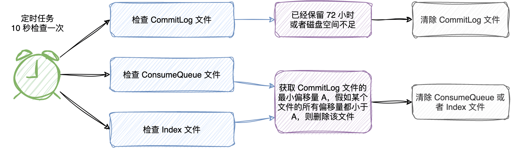

| 版本 | 内容 | 时间                   |
| ---- | ---- | ---------------------- |
| V1   | 新建 | 2023年06月22日13:15:53 |

## 引入

由于内存和磁盘都是有限的资源，Broker 不可能永久地保存所有数据，所以一些超过保存期限的数据会被定期删除。在 RocketMQ 中有 commitlog、ConsumeQueue、Index 这三种重要的文件，本文分析这三个文件是如何被定期删除的。

定期删除涉及到一些后台线程服务：

- CleanCommitLogService：检查/处理 commitLog 文件删除的服务；
- CleanConsumeQueueService：检查/处理 ConsumeQueue 和 Index 文件删除的服务；

这两个服务是通过定时任务调度的，默认 10 秒钟检查文件是否需要删除。

```java
this.scheduledExecutorService.scheduleAtFixedRate(new Runnable() {
    @Override
    public void run() {
        DefaultMessageStore.this.cleanFilesPeriodically();
    }
}, 1000 * 60, this.messageStoreConfig.getCleanResourceInterval(), TimeUnit.MILLISECONDS);
```



## commitLog 过期处理

什么时候删除 commitLog 文件，RocketMQ 目前有两个情况会触发删除：

- 假如 commitLog 文件最后一次更新时间距离当前已经超过 72 小时了（默认值，可配置）；
- 假如 commitLog 文件所在的磁盘空间超过 85% 时（默认值，可配置），也会触发删除操作。

其实还有第三个情况会触发，这里不做分析。

清除 CommitLog 文件主要是 CleanCommitLogService 后台线程服务。看一下 CleanCommitLogService#run 方法

```java
public void run() {
    try {
        // 删除过期的文件
        this.deleteExpiredFiles();

        this.redeleteHangedFile();
    } catch (Throwable e) {
        DefaultMessageStore.log.warn(this.getServiceName() + " service has exception. ", e);
    }
}
```

- deleteExpiredFiles 方法：尝试删除 CommitLog 文件；
- redeleteHangedFile 方法：在上一步删除 CommitLog 文件时，该文件可能被别的程序引用了，这个方法的作用是在一段时间后强制删除 CommitLog 文件。

主要看 deleteExpiredFiles 方法做了什么 CleanCommitLogService#deleteExpiredFiles

**（1）第一步：获取清理相关的参数；**

```java
int deleteCount = 0;
// 获取文件最大保留时间，默认 72 小时
long fileReservedTime = DefaultMessageStore.this.getMessageStoreConfig().getFileReservedTime();
// 删除物理文件的间隔时间，默认 100ms
int deletePhysicFilesInterval = DefaultMessageStore.this.getMessageStoreConfig().getDeleteCommitLogFilesInterval();
// 表示第一次拒绝删除之后能保留文件的最大时间，超过改时间后，文件将被强制删除，默认 120s
int destroyMapedFileIntervalForcibly = DefaultMessageStore.this.getMessageStoreConfig().getDestroyMapedFileIntervalForcibly();
```

主要关注 fileReservedTime 和 deletePhysicFilesInterval：

- fileReservedTime：CommitLog 文件保留的最大时间，默认是 72 小时；
- deletePhysicFilesInterval：可能会删除多个 CommitLog 文件，删除多个文件之间需要间隔一小段时间，默认 100ms；

**（2）第二步：校验是否达到删除条件**

```java
// 删除文件的时间点，默认 4 点
boolean timeup = this.isTimeToDelete();
// 检查磁盘空间是否充足，如果磁盘空间不充足，则返回true，表示应该触发过期文件删除操作。
boolean spacefull = this.isSpaceToDelete();
// 预留手动触发机制，目前RocketMQ暂未封装手工触发文件删除的命令。
boolean manualDelete = this.manualDeleteFileSeveralTimes > 0;
```

主要有三种：

- 过期：假如 commitLog 文件最后一次更新时间距离当前已经超过 72 小时了（默认值，可配置）；
- 磁盘不足：假如 commitLog 文件所在的磁盘空间超过 85% 时（默认值，可配置），也会触发删除操作；
- 手动触发；

**（3）第三步：调用 MappedFile 相关删除文件的方法。**

```java
// RocketMQ 满足如下任意一种情况将继续执行删除文件的操作
if (timeup || spacefull || manualDelete) {

    if (manualDelete)
        this.manualDeleteFileSeveralTimes--;

    // 是否立即清理，cleanImmediately 会在磁盘空间不足的时候修改为 true
    boolean cleanAtOnce = DefaultMessageStore.this.getMessageStoreConfig().isCleanFileForciblyEnable() && this.cleanImmediately;

    // ...... 省略日志打印 ......

    fileReservedTime *= 60 * 60 * 1000;

    // 清理
    deleteCount = DefaultMessageStore.this.commitLog.deleteExpiredFile(fileReservedTime, deletePhysicFilesInterval,
                                                                       destroyMapedFileIntervalForcibly, cleanAtOnce);
    // ...... 省略 ......
```

## ConsumeQueue 和 Index 过期处理

因为 CommitLog 文件会过期，那么其对应的 ConsumeQueue 和 Index 文件就没有必要再保留了。RocketMQ的删除策略是定时检查，满足删除条件时会删除过期或者无意义的文件。CleanConsumeQueueService 服务用来处理这两个文件的删除。

CleanConsumeQueueService#deleteExpiredFiles

```java
private void deleteExpiredFiles() {
    // 删除每个 consumeQueue 的间隔时间，默认 100ms
    int deleteLogicsFilesInterval = DefaultMessageStore.this.getMessageStoreConfig().getDeleteConsumeQueueFilesInterval();

    // CommitLog 全部文件中的最小物理位点
    long minOffset = DefaultMessageStore.this.commitLog.getMinOffset();
    // 判断是否有新数据没有被检查过
    if (minOffset > this.lastPhysicalMinOffset) {
        this.lastPhysicalMinOffset = minOffset;

        ConcurrentMap<String, ConcurrentMap<Integer, ConsumeQueue>> tables = DefaultMessageStore.this.consumeQueueTable;

        for (ConcurrentMap<Integer, ConsumeQueue> maps : tables.values()) {
            for (ConsumeQueue logic : maps.values()) {
                // 根据 CommitLog 全部文件中的最小物理位点尝试删除 ConsumeQueue 的文件
                int deleteCount = logic.deleteExpiredFile(minOffset);

                if (deleteCount > 0 && deleteLogicsFilesInterval > 0) {
                    try {
                        Thread.sleep(deleteLogicsFilesInterval);
                    } catch (InterruptedException ignored) {
                    }
                }
            }
        }

        // 删除 indexService 的过期文件
        DefaultMessageStore.this.indexService.deleteExpiredFile(minOffset);
    }
}
```

上面方法的关键点就是 `minOffset > this.lastPhysicalMinOffset` 这个判断，介绍一下这两个变量：

- minOffset：当前磁盘上 CommitLog 文件最小的物理偏移量；
- lastPhysicalMinOffset：当前服务已经检查到了哪一个物理偏移量了；

如果 `minOffset > this.lastPhysicalMinOffset` 成立，说明还有新数据没有检查，需要去检查 ConsumeQueue 和 Index 文件是否需要删除。

然后遍历所有的 ConsumeQueue，依次检查 ConsumeQueue 文件是否需要删除，如果过期最后还是调用 MappedFile 的删除方法去删除。对于 Index 文件的删除，除开当前正在写的文件，其他文件都需要检查其存储的文件是否需要删除。

## 小结

CommitLog、ConsumeQueue、Index 不会一直存储在磁盘上，需要定时去清理这些文件。

- CommitLog 文件最大存储时间是 72 小时（默认值，可配置），另外假如磁盘占用率过高也是会强制清除 CommitLog 文件的；
- ConsumeQueue 和 Index 文件的删除，是依据所有的 CommitLog 文件中最小的物理偏移量 A去删除的，也就是说假如 ConsumeQueue 和 Index 文件中保存的数据都是小于这个最小偏移量 A 的，那么就需要删除了；