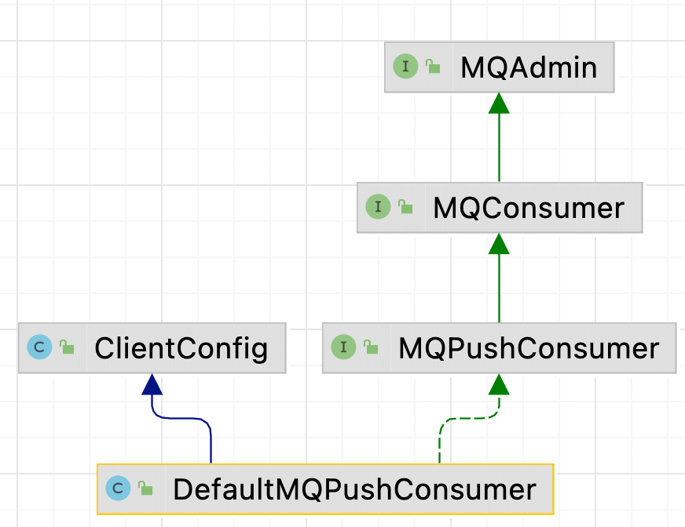

| 版本 | 内容 | 时间                   |
| ---- | ---- | ---------------------- |
| V1   | 新建 | 2023年06月25日19:31:40 |

> ps.不完整，目前没有完善的打算

## 消费者模板代码

以 RocketMQ 自带的案例 org.apache.rocketmq.example.quickstart.Consumer

```java
public class Consumer {
    public static void main(String[] args) throws InterruptedException, MQClientException {
        DefaultMQPushConsumer consumer = new DefaultMQPushConsumer("please_rename_unique_group_name_4");
        consumer.setNamesrvAddr("127.0.0.1:9876");
        consumer.setConsumeFromWhere(ConsumeFromWhere.CONSUME_FROM_FIRST_OFFSET);
        consumer.subscribe("TopicTest", "*");
        consumer.registerMessageListener(new MessageListenerConcurrently() {
            @Override
            public ConsumeConcurrentlyStatus consumeMessage(List<MessageExt> msgs,
                ConsumeConcurrentlyContext context) {
                System.out.printf("%s Receive New Messages: %s %n", Thread.currentThread().getName(), msgs);a
                return ConsumeConcurrentlyStatus.CONSUME_SUCCESS;
            }
        });
        consumer.start();
        System.out.printf("Consumer Started.%n");
    }
}
```

这个代码主要是指定了当前消费者的消费者组、NameServer 的地址、订阅信息、注册消息监听器等，然后启动消费者。这就是消费者启动消费的模板代码，在分析消费者启动的流程前，得了解 DefaultMQPushConsumer 的一些字段。

## DefaultMQPushConsumer 简要分析

### 继承关系

org.apache.rocketmq.client.consumer.DefaultMQPushConsumer，它的继承关系如下：



和生产者类一样，DefaultMQPushConsumer 就是一个门面对象，提供一些配置和一些给用户使用的 API。

### 基本配置

```java
protected final transient DefaultMQPushConsumerImpl defaultMQPushConsumerImpl;
private String consumerGroup;
private MessageModel messageModel = MessageModel.CLUSTERING;
private ConsumeFromWhere consumeFromWhere = ConsumeFromWhere.CONSUME_FROM_LAST_OFFSET;
private String consumeTimestamp = UtilAll.timeMillisToHumanString3(System.currentTimeMillis() - (1000 * 60 * 30));
private AllocateMessageQueueStrategy allocateMessageQueueStrategy;
private Map<String /* topic */, String /* sub expression */> subscription = new HashMap<String, String>();
private MessageListener messageListener;
private OffsetStore offsetStore;
private int consumeThreadMin = 20;
private int consumeThreadMax = 20;
```

- `DefaultMQPushConsumerImpl defaultMQPushConsumerImpl`：真正处理业务的类，DefaultMQPushConsumer 提供的所有 API 最后都是委托给该类处理的；
- `String consumerGroup`：当前消费者所属的消费者组的名字，实现消费者组负载均衡的核心；
- `MessageModel messageModel`：消费者的消费模式，集群模式和广播模式。集群模式下同一个消费者组下的消费者只会消费自己负责的队列的消息，需要负载均衡保证集群模式；而广播模式下同一个消费者组下的消费者会消费所有订阅的消息；
- `ConsumeFromWhere consumeFromWhere`：第一次消费时指定的消费策略，TODO-KWOK 后面再分析；
- `String consumeTimestamp`：TODO-KWOK
- `AllocateMessageQueueStrategy allocateMessageQueueStrategy`：集群模式下消息队列的负载策略，负载均衡服务依赖这个对象；
- `Map<String /* topic */, String /* sub expression */> subscription`：订阅信息；
- `MessageListener messageListener`：消息监听器，就是消费者拉取到消息后，我们想要如何消费这个消息；
- `OffsetStore offsetStore`：消费者的消费进度存储服务。集群模式消费进度是存储在 broker 的，广播模式消费进度是存储在消费者本身的；

### 流控配置

```java
private int consumeConcurrentlyMaxSpan = 2000;
private int pullThresholdForQueue = 1000;
private int pullThresholdSizeForQueue = 100;
private int pullThresholdForTopic = -1;
private int pullThresholdSizeForTopic = -1;
```

- `consumeConcurrentlyMaxSpan`：
- `pullThresholdForQueue`：
- ``：
- ``：
- ``：

TODO-KWOK

### 其他配置

```java
private long pullInterval = 0;
private int consumeMessageBatchMaxSize = 1;
private int pullBatchSize = 32;
private boolean postSubscriptionWhenPull = false;
private boolean unitMode = false;
private int maxReconsumeTimes = -1;
private long suspendCurrentQueueTimeMillis = 1000;
private long consumeTimeout = 15;
```

TODO-KWOK

### DefaultMQPushConsumerImpl 简要分析

TODO-KWOK

## 消费者启动流程

### 消费者启动流程

TODO-KWOK 画个消费者 DefaultMQPushConsumerImpl 的一些组件的图

DefaultMQPushConsumerImpl#start 方法，该方法流程比较长，分步分析：

**（1）第一步：校验消费者的配置是否合法，然后获取 MQClientInstance 实例。MQClientInstance 在分析生产者的时候分析过，可以简单的理解它是和 broker 和 NameServer 通信的类。**

```java
this.serviceState = ServiceState.START_FAILED;

// 校验消费者的一些配置参数
this.checkConfig();

// 设置主题订阅信息
// 拷贝订阅信息到负载均衡 rbl 对象
this.copySubscription();

if (this.defaultMQPushConsumer.getMessageModel() == MessageModel.CLUSTERING) {
    // 修改消费者实例名称 pid
    this.defaultMQPushConsumer.changeInstanceNameToPID();
}

// 初始化 MQClientInstance、RebalanceImple（消息重新负载实现类）等
this.mQClientFactory = MQClientManager.getInstance().getOrCreateMQClientInstance(this.defaultMQPushConsumer, this.rpcHook);
```

**（2）第二步：初始化 RebalanceImpl 对象，该对象是用于消费者组内的负载均衡的。**

```java
// 初始化 rbl 对象
this.rebalanceImpl.setConsumerGroup(this.defaultMQPushConsumer.getConsumerGroup());
this.rebalanceImpl.setMessageModel(this.defaultMQPushConsumer.getMessageModel());
// 将队列分配策略，赋值给 rbl
this.rebalanceImpl.setAllocateMessageQueueStrategy(this.defaultMQPushConsumer.getAllocateMessageQueueStrategy());
this.rebalanceImpl.setmQClientFactory(this.mQClientFactory);
```

**（3）第三步：创建 PullAPIWrapper 实例，该对象主要是用于去 broker 拉取消息的；**

```java
// 创建拉消息 API 对象，内部封装了推荐主机算法
this.pullAPIWrapper = new PullAPIWrapper(
    mQClientFactory,
    this.defaultMQPushConsumer.getConsumerGroup(), isUnitMode());
// 将"过滤 hook 列表"注册到 pullApi 内，消息拉取下来之后，会执行该 hook，在进行一次自定义的过滤
this.pullAPIWrapper.registerFilterMessageHook(filterMessageHookList);
```

**（4）第四步：初始化 OffsetStore 实例，该对象主要是用于存储消费者消费进度的。如果是广播模式那么使用的是 LocalFileOffsetStore 对象，是存在消费者本身的；如果是集群模式，那么使用的是 RemoteBrokerOffsetStore，是将消费进度保存在 broker 的。**

```java
// 初始化消息进度。如果消息消费采用集群模式，那么消息进度存储在Broker上，如果采用广播模式，那么消息消费进度存储在消费端，
if (this.defaultMQPushConsumer.getOffsetStore() != null) {
    this.offsetStore = this.defaultMQPushConsumer.getOffsetStore();
} else {
    // 一般走这里
    switch (this.defaultMQPushConsumer.getMessageModel()) {
        case BROADCASTING:
            this.offsetStore = new LocalFileOffsetStore(this.mQClientFactory, this.defaultMQPushConsumer.getConsumerGroup());
            break;
        case CLUSTERING:
            // 集群模式
            this.offsetStore = new RemoteBrokerOffsetStore(this.mQClientFactory, this.defaultMQPushConsumer.getConsumerGroup());
            break;
        default:
            break;
    }
    // 将创建的 store 对象回写到门面对象
    this.defaultMQPushConsumer.setOffsetStore(this.offsetStore);
}
this.offsetStore.load();
```

**（5）第五步：创建并启动消费服务，主要是并发消费服务和顺序消费服务。**

```java
// 如果是顺序消费，创建消费端消费线程服务。ConsumeMessageService主要负责消息消费，在内部维护一个线程池，
if (this.getMessageListenerInner() instanceof MessageListenerOrderly) {
    // 是否是顺序消费，属性设置为 true，表示顺序消费
    this.consumeOrderly = true;
    this.consumeMessageService =
        new ConsumeMessageOrderlyService(this, (MessageListenerOrderly) this.getMessageListenerInner());
} else if (this.getMessageListenerInner() instanceof MessageListenerConcurrently) {
    // 表示并发消费
    this.consumeOrderly = false;
    this.consumeMessageService =
        new ConsumeMessageConcurrentlyService(this, (MessageListenerConcurrently) this.getMessageListenerInner());
}

// 启动消费服务
this.consumeMessageService.start();
```

**（6）第六步：将当前消费者注册到 mQClientFactory，然后启动 mQClientFactory。**

```java
boolean registerOK = mQClientFactory.registerConsumer(this.defaultMQPushConsumer.getConsumerGroup(), this);
// ...... 省略 ......

// 启动客户端实例
mQClientFactory.start();
```

**（7）第七步：从 NameServer 中拉取 broker 信息，和 topic 的路由信息，然后给所有的 broker 节点发送一次心跳，最后唤醒负载均衡的线程，让它去处理消费者的负载均衡工作。**

```java
// 从 nameserver 强制加载主题路由数据，生成主题的 set<mq> 交给 rbl 的 topicSubscribeInfoTable
this.updateTopicSubscribeInfoWhenSubscriptionChanged();
// 检查服务器是否支持"消息过滤模式"，一般都是 tag 过滤，服务器默认支持，假如不支持这里会抛异常
this.mQClientFactory.checkClientInBroker();
// 向已知的 broker 节点发送心跳
this.mQClientFactory.sendHeartbeatToAllBrokerWithLock();
// 唤醒 rbl 线程，让rbl 线程去做负载均衡的事情
this.mQClientFactory.rebalanceImmediately();
```


这里消费者已经起来了，但是前面有一些主要的组件做的事情没有说，这里简单回顾下 MQClientInstance 主要做了什么事情

### MQClientInstance 核心业务

MQClientInstance#start 

```java
public void start() throws MQClientException {

    synchronized (this) {
        switch (this.serviceState) {
            case CREATE_JUST:
                this.serviceState = ServiceState.START_FAILED;
                // If not specified,looking address from name server
                if (null == this.clientConfig.getNamesrvAddr()) {
                    this.mQClientAPIImpl.fetchNameServerAddr();
                }
                // Start request-response channel
                // 开启客户端网络层
                this.mQClientAPIImpl.start();
                // Start various schedule tasks
                // 启动定时任务的入口
                this.startScheduledTask();
                // Start pull service
                this.pullMessageService.start();
                // Start rebalance service
                this.rebalanceService.start();
                // Start push service
                // 启动内部生产者，消息回退时使用
                this.defaultMQProducer.getDefaultMQProducerImpl().start(false);
                log.info("the client factory [{}] start OK", this.clientId);
                this.serviceState = ServiceState.RUNNING;
                break;
            case START_FAILED:
                throw new MQClientException("The Factory object[" + this.getClientId() + "] has been created before, and failed.", null);
            default:
                break;
        }
    }
}
```

主要是下面几个业务：

- 开启网络层服务，用于 TCP 通信；
- 开启一些定时任务；
- 启动拉消息的后台线程服务；
- 启动消费者负载均衡的后台线程服务；
- 启动内部生产者，消息回退服务；

网络层服务之前已经详细分析过，这里主要回顾下主要的定时任务做了什么事情，后面三个服务具体用到的时候再分析。

**（1）第一个定时任务：主要是每 30 秒从 NameServer 更新客户端本地的 topic 的路由信息。**

```java
// 定时任务1，从 nameserver 更新客户端本地的 topic 的路由信息
// 生产者和消费者
// 30 秒
this.scheduledExecutorService.scheduleAtFixedRate(new Runnable() {

    @Override
    public void run() {
        try {
            MQClientInstance.this.updateTopicRouteInfoFromNameServer();
        } catch (Exception e) {
            log.error("ScheduledTask updateTopicRouteInfoFromNameServer exception", e);
        }
    }
}, 10, this.clientConfig.getPollNameServerInterval(), TimeUnit.MILLISECONDS);
```

**（2）第二个定时任务：主要是清除所有认为下线的 broker，并向所有 broker 节点发送心跳数据；**

```java
// 定时任务2，30 秒
// 1 清除下线的 broker节点
// 2 给所有在线的 broker 发送心跳数据
this.scheduledExecutorService.scheduleAtFixedRate(new Runnable() {

    @Override
    public void run() {
        try {
            // 检查客户端路由表，将路由表中不包含的 addr 清理掉，
            // 如果被清理的 brokerName 下所有的物理节点都没有了，需要将所有的 broker 映射数据删除
            MQClientInstance.this.cleanOfflineBroker();
            MQClientInstance.this.sendHeartbeatToAllBrokerWithLock();
        } catch (Exception e) {
            log.error("ScheduledTask sendHeartbeatToAllBroker exception", e);
        }
    }
}, 1000, this.clientConfig.getHeartbeatBrokerInterval(), TimeUnit.MILLISECONDS);
```

**（3）第三个定时任务：主要是向 broker 同步当前消费者的消费进度；**

```java
// 定时任务3，消费者持久化消费进度，5 秒钟一次
this.scheduledExecutorService.scheduleAtFixedRate(new Runnable() {

    @Override
    public void run() {
        try {
            MQClientInstance.this.persistAllConsumerOffset();
        } catch (Exception e) {
            log.error("ScheduledTask persistAllConsumerOffset exception", e);
        }
    }
}, 1000 * 10, this.clientConfig.getPersistConsumerOffsetInterval(), TimeUnit.MILLISECONDS);
```