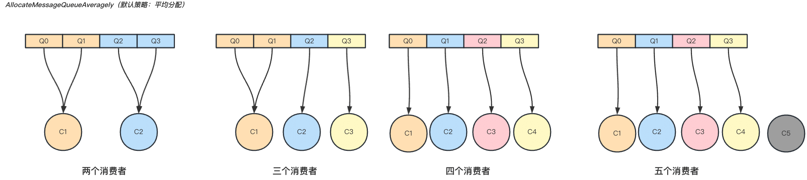
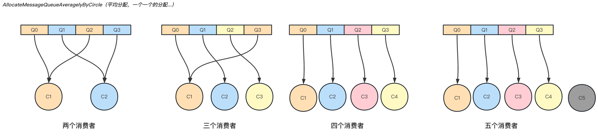
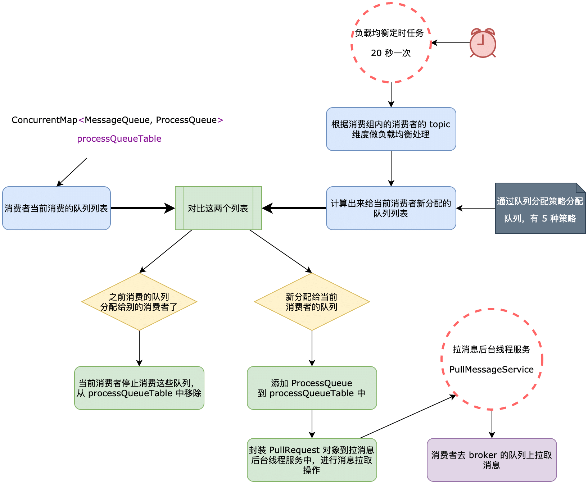

| 版本 | 内容 | 时间                   |
| ---- | ---- | ---------------------- |
| V1   | 新建 | 2023年06月23日15:42:44 |

## 消息拉取入口

### 消息拉取入口

前面在分析 MQClientInstance 的时候，MQClientInstance 启动的时候顺带启动了 PullMessageService 这个后台线程服务，这个服务就是消息消费的入口。

在 PullMessageService 中有个队列，用于存放 PullRequest 对象。

```java
private final LinkedBlockingQueue<PullRequest> pullRequestQueue = new LinkedBlockingQueue<PullRequest>();
```

然后再 PullMessageService#run 方法中，主要就是消费这个 PullRequest 对象：

```java
public void run() {
    // 每执行一次业务逻辑，检测一下其运行状态，可以通过其他线程将 Stopped 设置为 true，从而停止该线程。
    while (!this.isStopped()) {
        try {
            PullRequest pullRequest = this.pullRequestQueue.take();
            // 调用 pullMessage 方法进行消息拉取。
            this.pullMessage(pullRequest);
        } catch (InterruptedException ignored) {
        } catch (Exception e) {
            log.error("Pull Message Service Run Method exception", e);
        }
    }
}
```

最后就是调用消费者的拉取消息的方法 DefaultMQPushConsumerImpl#pullMessage 尝试去 broker 拉取消息了。

```java
private void pullMessage(final PullRequest pullRequest) {
    //
    final MQConsumerInner consumer = this.mQClientFactory.selectConsumer(pullRequest.getConsumerGroup());
    if (consumer != null) {
        // 将consumer强制转换为DefaultMQPushConsumerImpl，也就是PullMessageService
        DefaultMQPushConsumerImpl impl = (DefaultMQPushConsumerImpl) consumer;
        impl.pullMessage(pullRequest);
    } else {
        log.warn("No matched consumer for the PullRequest {}, drop it", pullRequest);
    }
}
```

### PullRequest 对象

```java
public class PullRequest {
    // 消费者组
    private String consumerGroup;
    // 待拉取消费队列
    private MessageQueue messageQueue;
    // 消息处理队列，从 Broker 中拉取到的消息会先存入 ProcessQueue，然后再提交到消费者消费线程池中进行消费
    // 消息本地的队列快照，从服务器拉取下来的消息要先放到该快照队列内，被消费的消息需要从该队列移除走
    private ProcessQueue processQueue;
    // 待拉取的 MessageQueue 偏移量，broker 需要根据这个 offset 定位消息位置，然后才可以获取一批消息
    private long nextOffset;
    // 是否被锁定
    private boolean previouslyLocked = false;

	// ...... 省略 ......
}
```

- `String consumerGroup`：消费者组；
- `MessageQueue messageQueue`：消费者向哪一个队列拉取消息消费；
- `ProcessQueue processQueue`：消息本地的队列快照，从 broker 拉取的消息先存到该快照队列内，然后再提交到消费者消费线程池中去消费，消费完的消息需要从这个队列中移除；
- `long nextOffset`：需要从队列的哪一个偏移量开启拉取消息；
- `boolean previouslyLocked`：是否被锁定，顺序消费要用的；

既然需要往 PullMessageService 的阻塞队列中存放 PullRequest 对象，消费者才会尝试去 broker 拉取消息，那么 PullRequest 对象是什么时候添加到阻塞队列中的呢？

## 消息队列负载均衡

### 消息队列负载均衡服务

消息队列的负载均衡和重分布是由 RebalanceService 处理的，同样是在 MQClientInstance 中启动的。这个后台线程服务会每隔 20 秒钟去处理消息队列的负载均衡和重分布。

```java
/**
 * RebalanceService 线程默认每隔 20s 执行一次 mqClientFactory.doRebalance() 方法
 */
@Override
public void run() {
    while (!this.isStopped()) {
        // 默认20秒
        this.waitForRunning(waitInterval);
        this.mqClientFactory.doRebalance();
    }
}
```

最终会调用到每个消费者内部的 RebalanceImpl#doRebalance 方法，主要就是针对单个主题去做消费队列的负载均衡工作

```java
public void doRebalance(final boolean isOrder) {
    // 获取当前消费者的订阅信息
    Map<String, SubscriptionData> subTable = this.getSubscriptionInner();
    if (subTable != null) {
        for (final Map.Entry<String, SubscriptionData> entry : subTable.entrySet()) {
            final String topic = entry.getKey();
            try {
                // 针对单个主题进行消息队列重新负载
                this.rebalanceByTopic(topic, isOrder);
            } catch (Throwable e) {
                if (!topic.startsWith(MixAll.RETRY_GROUP_TOPIC_PREFIX)) {
                    log.warn("rebalanceByTopic Exception", e);
                }
            }
        }
    }

    // 调这个方法的原因，因为可能调用了 unsubscribe 方法取消订阅了主题
    this.truncateMessageQueueNotMyTopic();
}
```

在真正分析消费队列的重负载工作之前得先了解 RebalanceImpl。

### RebalanceImpl 字段分析

```java
// 分配到当前消费者的队列信息，key 是 MessageQueue，value 是 ProcessQueue（队列再消费者端的快照）
protected final ConcurrentMap<MessageQueue, ProcessQueue> processQueueTable = new ConcurrentHashMap<MessageQueue, ProcessQueue>(64);

// 主题的队列分布信息
// 会在消费者启动的时候主动从 nameserver 拉取一次消息订阅信息
// 客户端实例里有定时任务，从 nameserver 里拉取最新的主题路由信息
protected final ConcurrentMap<String/* topic */, Set<MessageQueue>> topicSubscribeInfoTable =
    new ConcurrentHashMap<String, Set<MessageQueue>>();

// 消费者订阅信息，key 是主题，value 是主题的订阅信息
// 在程序员的业务代码中，subscribe 订阅主题会添加数据到此 map
protected final ConcurrentMap<String /* topic */, SubscriptionData> subscriptionInner =
    new ConcurrentHashMap<String, SubscriptionData>();

// 当前消费者的消费者组
protected String consumerGroup;
// 当前消费者的消费模式，并发消费还是顺序消费
protected MessageModel messageModel;

// 队列分配策略
protected AllocateMessageQueueStrategy allocateMessageQueueStrategy;
// MQ 的客户端实例，就是发送和接收网络请求的
protected MQClientInstance mQClientFactory;
```

首先是三个 Map：

1. `processQueueTable`：该 Map 存储的是当前消费者负责消费的消息队列和其对应的 ProcessQueue 本地消费快照；
2. `topicSubscribeInfoTable`：主题的队列分布信息，在 MQClientInstance 中的定时任务去 NameServer 拉取主题的路由信息，这个Map 的数据就是在这里维护的；
3. `subscriptionInner`：当前消费者的消费订阅信息，指定要消费那些主题的消息；

其他字段：

- `String consumerGroup`：当前消费者的消费者组名字；
- `MessageModel messageModel`：当前消费者的消费模式；
- `AllocateMessageQueueStrategy allocateMessageQueueStrategy`：队列的分配策略；
- `MQClientInstance mQClientFactory`：生产者的客户端实例；

### 负载均衡具体流程

继续看消息队列的负载均衡机制，RebalanceImpl#rebalanceByTopic，这里我们主要分析集群模式的负载均衡，不分析广播模式的负载均衡了。

**（1）第一步：获取当前订阅的某个主题在 broker 上的消费队列信息，然后从 broker 获取消费者组内所有的消费者的 id（这个数据是通过心跳包维护的）；**

```java
// 从 topic 订阅信息缓存表中获取主题对应的队列信息
Set<MessageQueue> mqSet = this.topicSubscribeInfoTable.get(topic);
// 获取当前消费者组下所有客户端 id 集合 （从 broker 获取，broker 中的该数据是心跳维护的）
List<String> cidAll = this.mQClientFactory.findConsumerIdList(topic, consumerGroup);
```

**（2）第二步：将 topic 对应的消费队列信息进行排序，消费者组下所有的消费者 id 排序，这样就能保证同一个消费组内看到的视图一致，确保同一个消费队列不会被多个消费者分配；**

```java
List<MessageQueue> mqAll = new ArrayList<MessageQueue>();
mqAll.addAll(mqSet);

// 对cidAll、mqAll进行排序。
// 这一步很重要，同一个消费组内看到的视图应保持一致，确保同一个消费队列不会被多个消费者分配。

// 队列排序
Collections.sort(mqAll);
// 客户端 id 排序
Collections.sort(cidAll);
```

**（3）第三步：通过队列分配策略获取当前消费者分配到的队列。**这一步的源码不分析了，待会儿直接看图。

```java
// 分配策略得到的结果
List<MessageQueue> allocateResult = null;
try {
    // 返回值：分配给当前消费者的队列集合
    allocateResult = strategy.allocate(
        this.consumerGroup, // 消费者组
        this.mQClientFactory.getClientId(), // 当前消费者 id
        mqAll, // 当前全部队列集合（包括所有 broker 上该主题的 mq）
        cidAll); // 当前消费者组下全部消费者 id 集合
} catch (Throwable e) {
	// ...... 省略 ......
}

Set<MessageQueue> allocateResultSet = new HashSet<MessageQueue>();
if (allocateResult != null) {
    allocateResultSet.addAll(allocateResult);
}
```

**（4）第四步：根据此次分配的队列的结果，判断是否需要做队列重分配的工作。**后面具体分析

```java
boolean changed = this.updateProcessQueueTableInRebalance(topic, allocateResultSet, isOrder);
```

### 队列分配策略

RocketMQ 提供五种队列分配策略，这里分析两种常用的。

#### 平均分配

AllocateMessageQueueAveragely



假如某个 topic 有四个队列

- 假如消费者组中有 2 个消费者：每个消费者分两个队列；
- 假如消费者组中有 3 个消费者：第一个消费者分两个队列，剩下两个消费者分别消费一个队列；
- 假如消费者组中有 4 个消费者：每个消费者分一个队列；
- 假如消费者组中有 5 个消费者：因为只有四个队列，所以最后一个消费者无法消费；

消息队列分配原则为一个消费者可以分配多个消息队列，但同一个消息队列只会分配给一个消费者，如果消费者个数大于消息队列数量，则有些消费者无法消费消息。

#### 平均环形分配

AllocateMessageQueueAveragelyByCircle



### 对比消息队列是否变化



RebalanceImpl#updateProcessQueueTableInRebalance 方法的入参如下：

- `String topic`：当前处理的主题；
- `Set<MessageQueue> mqSet`：新分配的消费队列；
- `boolean isOrder`：是否是顺序消费；

该方法主要分为两步：

- 第一步：获取当前消费者目前正在消费的那些队列信息，和新分配的队列信息做比较：如果某个队列被分配到别的消费者了，当前消费者需要停止消费这个队列的消息，并将自己的消费进度保存起来，如果是集群模式，则是将消费进度发到 broker 端保存起来。
- 第二步：如果新的队列分配当前消费者了，则需要创建一个 PullRequest 对象，给拉消息的后台线程服务 PullMessageService 去处理了。

#### 处理不再消费的队列

```java
Iterator<Entry<MessageQueue, ProcessQueue>> it = this.processQueueTable.entrySet().iterator();
while (it.hasNext()) {
    Entry<MessageQueue, ProcessQueue> next = it.next();
    // 队列元信息
    MessageQueue mq = next.getKey();
    // 队列在消费者端的快照
    ProcessQueue pq = next.getValue();

    // 条件成立，说明该 mq 是本次 rbl 分配算法计算的主题，因为processQueueTable中会存放多个 topic 的信息
    if (mq.getTopic().equals(topic)) {
        // 条件成立：mqSet 最新分配给当前消费者的结果（指定主题）不包含 mq，
        // 说明该 mq 经过 rbl 计算之后，被分配到其他 consumer 节点了
        if (!mqSet.contains(mq)) {
            // 将 pq 的删除状态设置为 true，消费任务会一直检查这个状态，如果这个状态变成删除态，消费任务会立马退出
            pq.setDropped(true);
            if (this.removeUnnecessaryMessageQueue(mq, pq)) {
                // 从processQueueTable中移除该 kv
                it.remove();
                // 说明当前消费者消费的队列发生了变化
                changed = true;
                log.info("doRebalance, {}, remove unnecessary mq, {}", consumerGroup, mq);
            }
        }
        // ...... 省略 ......
    }
}
```

主要就是将 ProcessQueue 设置为不再消费，`pq.setDropped(true);`，然后从 ProcessQueue 中移除。

#### 处理新消费的队列

```java
List<PullRequest> pullRequestList = new ArrayList<PullRequest>();
for (MessageQueue mq : mqSet) {
    // 条件成立：说明当前 mq 是 rbl 之后，新分配给当前 consumer 的队列
    if (!this.processQueueTable.containsKey(mq)) {
        // ...... 省略顺序消费的处理 ......
        // 删除冗余数据（脏数据） offset
        this.removeDirtyOffset(mq);
        // 为新分配到当前消费者的 mq，创建 pq（快照队列）
        ProcessQueue pq = new ProcessQueue();
        long nextOffset = -1L;
        try {
            // 从服务器拉取 mq 的消费进度
            nextOffset = this.computePullFromWhereWithException(mq);
        } // ...... 省略 ......

        if (nextOffset >= 0) {
            // 保存 kv key：messageQueue value：上面创建的 processQueue
            ProcessQueue pre = this.processQueueTable.putIfAbsent(mq, pq);
            if (pre != null) {
                log.info("doRebalance, {}, mq already exists, {}", consumerGroup, mq);
            } else {
                log.info("doRebalance, {}, add a new mq, {}", consumerGroup, mq);
                // 拉消息服务依赖 PullRequest 对象进行拉消息工作
                PullRequest pullRequest = new PullRequest();
                pullRequest.setConsumerGroup(consumerGroup);
                pullRequest.setNextOffset(nextOffset);
                pullRequest.setMessageQueue(mq);
                pullRequest.setProcessQueue(pq);
                pullRequestList.add(pullRequest);
                changed = true;
            }
        } else {
            log.warn("doRebalance, {}, add new mq failed, {}", consumerGroup, mq);
        }
    }
}

// 将 PullRequest 加入 PullMessageService，以便唤醒 PullMessageService 线程。
this.dispatchPullRequest(pullRequestList);
```

主要就是获取当前新加入的队列的消费进度，如果是集群模式就是从 broker 获取了，然后将当前队列封装加入到 ProcessQueue 队列，然后封装一个 PullRequest 对象，从而 PullMessageService 线程就可以去处理消费新队列的逻辑了。 
