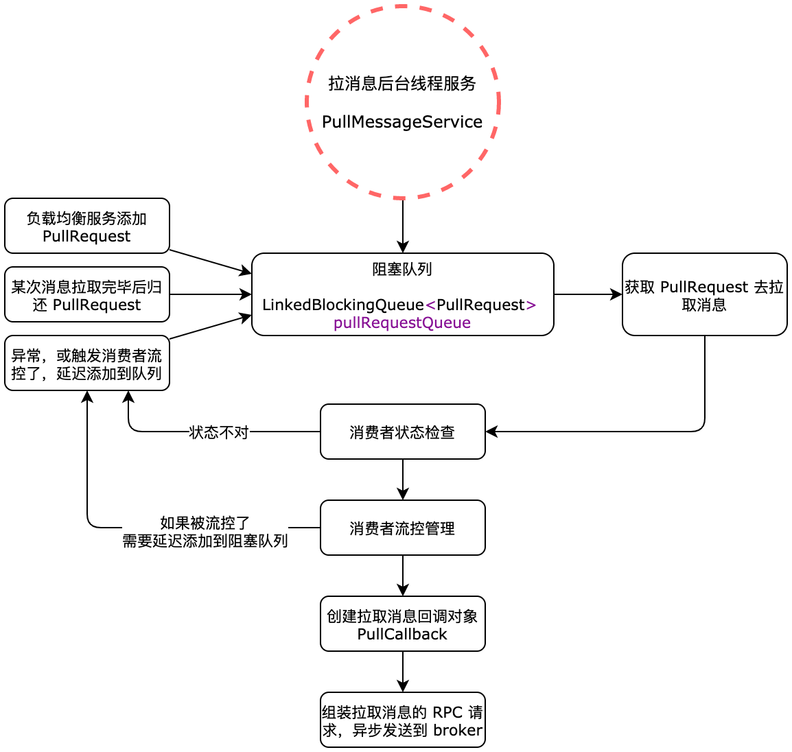

| 版本 | 内容 | 时间                   |
| ---- | ---- | ---------------------- |
| V1   | 新建 | 2023年06月23日18:57:14 |

## 拉消息入口回顾

PullMessageService 内有个存放 PullRequest 的阻塞队列，当往这个队列添加 PullRequest 时，PullMessageService 就会调用 PullRequest 内的消费者组对应的消费者的 api 去 broker 拉取消息了。

```java
private final LinkedBlockingQueue<PullRequest> pullRequestQueue = new LinkedBlockingQueue<PullRequest>();
```


```java
@Override
public void run() {
    log.info(this.getServiceName() + " service started");

    // 每执行一次业务逻辑，检测一下其运行状态，可以通过其他线程将 Stopped 设置为 true，从而停止该线程。
    while (!this.isStopped()) {
        try {
            // 从 pullRequestQueue 中获取一个 PullRequest 消息拉取任务，
            // 如果 pullRequestQueue 为空，则线程将阻塞，直到有拉取任务被放入。
            PullRequest pullRequest = this.pullRequestQueue.take();
            // 调用 pullMessage 方法进行消息拉取。
            this.pullMessage(pullRequest);
        } catch (InterruptedException ignored) {
        } catch (Exception e) {
            log.error("Pull Message Service Run Method exception", e);
        }
    }

    log.info(this.getServiceName() + " service end");
}
```

## 消息拉取

DefaultMQPushConsumerImpl#pullMessage，消息拉取的流程比较长，这里分步分析，主要就是 Consumer 封装拉取消息请求对象，向 broker 发送拉取消息的 RPC 请求；



### 检查消费者状态

```java
// 获取拉消息队列再消费者端的快照队列
final ProcessQueue processQueue = pullRequest.getProcessQueue();
// 条件成立说明该队列状态是删除状态（可能是 rbl 之后，被转移到其他消费者了），这里不再为该队列拉消息
if (processQueue.isDropped()) {
    log.info("the pull request[{}] is dropped.", pullRequest.toString());
    return;
}

// 设置本次拉消息的时间戳
pullRequest.getProcessQueue().setLastPullTimestamp(System.currentTimeMillis());

try {
    // 检查当前消费者的状态
    this.makeSureStateOK();
} catch (MQClientException e) {
    log.warn("pullMessage exception, consumer state not ok", e);
    // 如果当前消费者状态不是运行态，则拉消息任务延迟 3 秒后再执行
    this.executePullRequestLater(pullRequest, pullTimeDelayMillsWhenException);
    // 直接返回
    return;
}

if (this.isPause()) {
    // ...... 省略 ......
    // 如果消费者是暂停状态，则拉消息任务延迟 1 秒后再执行
    this.executePullRequestLater(pullRequest, PULL_TIME_DELAY_MILLS_WHEN_SUSPEND);
    return;
}
```

主要是检验消费者自身的状态，和本地消费快照队列的状态。

### 消费者流量控制

这部分主要是用作消费者的流量控制，

```java
// 获取消费者本地该 queue 快照内缓存的消息数量
long cachedMessageCount = processQueue.getMsgCount().get();
// 获取消费者本地该 queue 快照内缓存的消息容量大小 size
long cachedMessageSizeInMiB = processQueue.getMsgSize().get() / (1024 * 1024);

// 条件成立说明消费者本地快照内还有 1000（默认）条消息未被消费，本次拉消息请求将被延迟 50 毫秒
if (cachedMessageCount > this.defaultMQPushConsumer.getPullThresholdForQueue()) {
    this.executePullRequestLater(pullRequest, PULL_TIME_DELAY_MILLS_WHEN_FLOW_CONTROL);
    // ....... 省略日志打印 ......
    return;
}

// 条件成立说明消费者本地快照内还有 100 兆(默认)消息未被消费，本次拉消息请求将被延迟 50 毫秒
if (cachedMessageSizeInMiB > this.defaultMQPushConsumer.getPullThresholdSizeForQueue()) {
    this.executePullRequestLater(pullRequest, PULL_TIME_DELAY_MILLS_WHEN_FLOW_CONTROL);
    // ....... 省略日志打印 ......
    return;
}

if (!this.consumeOrderly) {
    // 并发消费走这里

    // 条件成立：说明 processQueue.getMaxSpan() 快照队列中的第一条消息和最后一条消息的差值，
    // 大于流控限制 2000(默认)
    // 注意：说明不了 processQueue 内有 2000 条消息，因为存在 broker 和客户端过滤逻辑
    if (processQueue.getMaxSpan() > this.defaultMQPushConsumer.getConsumeConcurrentlyMaxSpan()) {
        this.executePullRequestLater(pullRequest, PULL_TIME_DELAY_MILLS_WHEN_FLOW_CONTROL);
        // ....... 省略日志打印 ......
        return;
    }
} else {
    // ....... 省略顺序消费的逻辑 ......
}
```

- 首先获取消费者本地消费快照 processQueue 中的已经拉取下来的**消息个数**和**对应的消息大小 MiB**；
- 根据 defaultMQPushConsumer  内配置做消息流控操作，流控操作主要就是将 pullRequest 对象延迟一小段时间再次添加到 PullMessageService 的阻塞队列中，然后直接退出；

### 获取 topic 订阅数据

```java
// 获取本次拉消息请求的 topic 的订阅数据
final SubscriptionData subscriptionData = this.rebalanceImpl.getSubscriptionInner().get(pullRequest.getMessageQueue().getTopic());
// 什么时候 null == subscriptionData ？
// unsubscribe（主题）给删除了，这种情况下，该条件会成立
// 最终 rbl 程序会对比订阅集合，将移除的订阅主题的 processQueue 的 dropped 状态设置为 true，然后该 queue 对应的 pullRequest 请求就会退出了
if (null == subscriptionData) {
    // 没找到该主题的订阅信息，本次拉消息请求将被延迟 3 秒钟
    this.executePullRequestLater(pullRequest, pullTimeDelayMillsWhenException);
    log.warn("find the consumer's subscription failed, {}", pullRequest);
    return;
}
```

### 创建 PullCallback 对象

创建 PullCallback 对象，主要是用于处理从 broker 拉取下来的消息的，当 broker 响应一些消息给消费者的时候，就会回调这个 PullCallback 内的方法。这里先忽略，后面详细分析消息拉取后的处理。

```java
PullCallback pullCallback = new PullCallback() {
    @Override
    public void onSuccess(PullResult pullResult) {
        // ...... 省略 ......
    }
};
```

### 构建消息拉取系统标记

```java
// 是否提交消费者本地该队列的 offset
boolean commitOffsetEnable = false;
// 该队列再消费者本地的 offset
long commitOffsetValue = 0L;
if (MessageModel.CLUSTERING == this.defaultMQPushConsumer.getMessageModel()) {
    // 读取消息偏移量
    commitOffsetValue = this.offsetStore.readOffset(pullRequest.getMessageQueue(), ReadOffsetType.READ_FROM_MEMORY);
    if (commitOffsetValue > 0) {
        commitOffsetEnable = true;
    }
}

// 过滤表达式
String subExpression = null;
// 是否是类过滤模式
boolean classFilter = false;
// 获取本次拉消息的请求的 topic 的订阅数据
SubscriptionData sd = this.rebalanceImpl.getSubscriptionInner().get(pullRequest.getMessageQueue().getTopic());
if (sd != null) {
    if (this.defaultMQPushConsumer.isPostSubscriptionWhenPull() && !sd.isClassFilterMode()) {
        subExpression = sd.getSubString();
    }

    classFilter = sd.isClassFilterMode();
}

// 构建拉消息的 flag
int sysFlag = PullSysFlag.buildSysFlag(
    commitOffsetEnable, // commitOffset
    true, // suspend
    subExpression != null, // subscription
    classFilter // class filter
);
```

主要是

- 读取消费者本地的消费进度；
- 获取当前消费者的 topic 的订阅信息；
- 构建消息拉取系统标记，这个会发送到 broker，broker 会做对应处理；

### 调用 PullAPIWrapper 的 API 拉取消息

PullAPIWrapper#pullKernelImpl，各个字段的含义写在注释中了。

```java
this.pullAPIWrapper.pullKernelImpl(
    pullRequest.getMessageQueue(), // 从那个消息队列拉取消息
    subExpression, // 消息过滤表达式
    subscriptionData.getExpressionType(), // 消息表达式类型，分为 tag，sql92
    subscriptionData.getSubVersion(), // 客户端版本
    pullRequest.getNextOffset(), // 本次拉消息的 offset（重要）
    this.defaultMQPushConsumer.getPullBatchSize(), // 本次拉消息的最大消息条数，默认 32
    sysFlag, // 拉取系统标记
    commitOffsetValue, // 消费者本地该队列的消费进度，（内存中的）
    BROKER_SUSPEND_MAX_TIME_MILLIS, // 控制服务器端长轮询时最长 hold 的时间，默认是 15 秒
    CONSUMER_TIMEOUT_MILLIS_WHEN_SUSPEND, // 消息拉取的 rpc 超时时间
    CommunicationMode.ASYNC, // rpc调用模式，异步同步等，默认是异步拉取
    pullCallback // 从 broker 拉取消息结果回调处理对象
);
```

这个 PullAPIWrapper#pullKernelImpl 其实就是封装 RPC 请求对象，然后 RPC 请求 broker，请求拉取消息。

因为是异步 RPC 的方式，所以我们得看下它接收到 broker 端的响应后会做什么处理。在 MQClientAPIImpl#pullMessageAsync 方法中，会在 broker 响应之后封装响应为 PullResult 对象，然后调用我们前面创建的 PullCallback#onSuccess 方法去处理了。

```java
this.remotingClient.invokeAsync(addr, request, timeoutMillis, new InvokeCallback() {
    /**
        * 调用时机，服务器响应客户端之后
        */
    @Override
    public void operationComplete(ResponseFuture responseFuture) {
        RemotingCommand response = responseFuture.getResponseCommand();
        if (response != null) {
            try {
                PullResult pullResult = MQClientAPIImpl.this.processPullResponse(response, addr);
                assert pullResult != null;
                // 将 pullResult 交给 拉消息结果处理回调对象
                pullCallback.onSuccess(pullResult);
            } // ...... 省略异常情况 ......
        } else {
            // ...... 省略异常情况 ......
        }
    }
});
```

具体拉取到消息后如何处理后续分析


