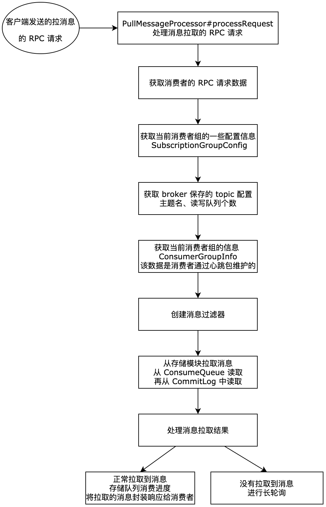

| 版本 | 内容 | 时间                   |
| ---- | ---- | ---------------------- |
| V1   | 新建 | 2023年06月24日00:26:38 |

## broker 处理消息拉取请求的入口

消费者给 broker 发送拉取消息的 RPC 请求的 code 是 RequestCode.PULL_MESSAGE，这个 code 是在 broker 的 PullMessageProcessor 处理器中处理的。入口在 PullMessageProcessor#processRequest(ChannelHandlerContext, RemotingCommand) 方法：

```java
@Override
public RemotingCommand processRequest(final ChannelHandlerContext ctx,
    RemotingCommand request) throws RemotingCommandException {
    return this.processRequest(ctx.channel(), request, true);
}
```

这里调用了一个三个参数的重载的方法

```java
private RemotingCommand processRequest(final Channel channel, RemotingCommand request, boolean brokerAllowSuspend) {
    // ....... 省略 ......
}
```

这三个参数分别表示：

- `Channel channel`：消费者的 Netty 的通道；
- `RemotingCommand request`：消费者发送过来的请求数据；
- `boolean brokerAllowSuspend`：是否允许 broker 长轮询，如果是 true，表示支持挂起，则将响应对象 response 置为 null，不会立即向客户端写入响应；false，表示此次处理不允许 broker 进行长轮询操作；

broker 处理消息拉取的 processRequest 方法的流程很长，分步分析：

## 拉消息主流程分析

> 我只能说这段代码 RocketMQ 写的非常烂

先看下主流程图：



### 解析请求数据&创建响应对象

```java
// 创建服务器端对请求的 响应对象，header 的类型是 PullMessageResponseHeader
RemotingCommand response = RemotingCommand.createResponseCommand(PullMessageResponseHeader.class);
final PullMessageResponseHeader responseHeader = (PullMessageResponseHeader) response.readCustomHeader();
// 从 request 请求中解析出 requestHeader
final PullMessageRequestHeader requestHeader =
    (PullMessageRequestHeader) request.decodeCommandCustomHeader(PullMessageRequestHeader.class);

// 设置响应对象的 opaque
response.setOpaque(request.getOpaque());
```

主要就是解析消费者发送过来的请求数据，然后创建响应类型的 RemotingCommand 对象。

### 校验 broker 是否可读

```java
// 服务器端是否可读
if (!PermName.isReadable(this.brokerController.getBrokerConfig().getBrokerPermission())) {
    // ...... 省略异常响应的组装 ......
    return response;
}
```

### 校验消费者组的订阅信息

```java
// 获取当前消费者组订阅的配置
SubscriptionGroupConfig subscriptionGroupConfig =
 this.brokerController.getSubscriptionGroupManager().findSubscriptionGroupConfig(requestHeader.getConsumerGroup());
if (null == subscriptionGroupConfig) {
    // ...... 省略异常响应的组装 ......
    return response;
}

if (!subscriptionGroupConfig.isConsumeEnable()) {
    // ...... 省略异常响应的组装 ......
    return response;
}
```

主要是校验当前消费者组的订阅数据是否在 broker 上存在，broker 上的消费者组的订阅数据是消费者通过心跳上报的。

### 获取请求数据内的标记

```java
// 是否允许服务器端长轮询（一般是 true）
final boolean hasSuspendFlag = PullSysFlag.hasSuspendFlag(requestHeader.getSysFlag());
// 客户端是否提交 offset（一般是 true）
final boolean hasCommitOffsetFlag = PullSysFlag.hasCommitOffsetFlag(requestHeader.getSysFlag());
// 客户端请求是否包含 消费者的订阅数据（一般 false）
final boolean hasSubscriptionFlag = PullSysFlag.hasSubscriptionFlag(requestHeader.getSysFlag());

// 长轮询的时间长度（默认是 15 秒）
final long suspendTimeoutMillisLong = hasSuspendFlag ? requestHeader.getSuspendTimeoutMillis() : 0;
```

获取消费者请求数据内的标记数据，主要是：

- hasSuspendFlag：是否允许 broker 进行长轮询；
- hasCommitOffsetFlag：消费者是否提交自己的消费进度；
- hasSubscriptionFlag：表示消费发送请求时，是否带上消费者的订阅数据，默认是 false，也就是不带；
- suspendTimeoutMillisLong：broker 的长轮询的时间；

### 校验主题配置信息

```java
TopicConfig topicConfig = this.brokerController.getTopicConfigManager().selectTopicConfig(requestHeader.getTopic());
if (null == topicConfig) {
    // ...... 省略异常响应的组装 ......
    return response;
}

if (!PermName.isReadable(topicConfig.getPerm())) {
    // ...... 省略异常响应的组装 ......
    return response;
}

// 请求的 queueId 不能大于等于读队列的个数， 等于号是因为序号是从 0 开始的
if (requestHeader.getQueueId() < 0 || requestHeader.getQueueId() >= topicConfig.getReadQueueNums()) {
    // ...... 省略异常响应的组装 ......
    return response;
}
```

获取 broker 中的 topic 的配置信息，主要包括主题名字，读队列和写队列的个数。然后校验消费者请求数据中的 queueId 是否合法。

### 校验 broker 中消费者组的信息

```java
// 获取 consumerGroupInfo 信息，校验 consumerGroupInfo
ConsumerGroupInfo consumerGroupInfo =
 this.brokerController.getConsumerManager().getConsumerGroupInfo(requestHeader.getConsumerGroup());
if (null == consumerGroupInfo) {
    // ...... 省略异常响应的组装 ......
    return response;
}

// 广播模式的校验
if (!subscriptionGroupConfig.isConsumeBroadcastEnable()
    && consumerGroupInfo.getMessageModel() == MessageModel.BROADCASTING) {
    // ...... 省略异常响应的组装 ......
    return response;
}

// 获取订阅信息
subscriptionData = consumerGroupInfo.findSubscriptionData(requestHeader.getTopic());
if (null == subscriptionData) {
    // ...... 省略异常响应的组装 ......
    return response;
}

if (subscriptionData.getSubVersion() < requestHeader.getSubVersion()) {
    // ...... 省略异常响应的组装 ......
    return response;
}

if (!ExpressionType.isTagType(subscriptionData.getExpressionType())) {
    consumerFilterData = this.brokerController.getConsumerFilterManager().get(requestHeader.getTopic(),
        requestHeader.getConsumerGroup());
    if (consumerFilterData == null) {
        // ...... 省略异常响应的组装 ......
        return response;
    }
    if (consumerFilterData.getClientVersion() < requestHeader.getSubVersion()) {
        // ...... 省略异常响应的组装 ......
        return response;
    }
}
```

从 broker 中获取消费者组的信息，这个信息主要是消费者通过心跳包维护的。剩下的就是一些校验的代码，没什么好分析的。

### 创建 tag 消息过滤器

```java
// 按照 tag 过滤的 filter
messageFilter = new ExpressionMessageFilter(subscriptionData, consumerFilterData,
    this.brokerController.getConsumerFilterManager());
```

### 读取消息

```java
// 从存储模块获取消息 核心入口
final GetMessageResult getMessageResult =
    this.brokerController.getMessageStore().getMessage(requestHeader.getConsumerGroup(), requestHeader.getTopic(),
        requestHeader.getQueueId(), requestHeader.getQueueOffset(), requestHeader.getMaxMsgNums(), messageFilter);
```

主要是从 ConsumeQueue 中读取某个消息的 ConsumeQueueData，一个 ConsumeQueueData 主要包含下面三个数据：

- 消息在 CommitLog 上的物理偏移量，8 字节；
- 消息大小，4 字节；
- tag 的哈希值，8 字节；

通过这前两个可以去 CommitLog 中读取消息，最后一个数据可以用于 tag 消息在 broker 端的过滤操作。

具体怎么去 ConsumeQueue 和 CommitLog 中读取数据的，后面单独一篇分析，这个方法里面也比较复杂。

### 组装响应数据

```java
response.setRemark(getMessageResult.getStatus().name());
// 设置下次查询的 offset，是服务器计算出来的该队列的下一次 pull 时使用的 offset
responseHeader.setNextBeginOffset(getMessageResult.getNextBeginOffset());
// 设置为 pull queue 的最小 offset
responseHeader.setMinOffset(getMessageResult.getMinOffset());
responseHeader.setMaxOffset(getMessageResult.getMaxOffset());

// 设置客户端下次拉 queue 时推荐使用的 brokerId
if (getMessageResult.isSuggestPullingFromSlave()) {
    responseHeader.setSuggestWhichBrokerId(subscriptionGroupConfig.getWhichBrokerWhenConsumeSlowly());
} else {
    responseHeader.setSuggestWhichBrokerId(MixAll.MASTER_ID);
}

switch (this.brokerController.getMessageStoreConfig().getBrokerRole()) {
    case ASYNC_MASTER:
    case SYNC_MASTER:
        break;
    case SLAVE:
        // 如果当前主机节点的角色为 slave 并且从节点读 未开启的话
        // 直接给客户端一个状态 PULL_RETRY_IMMEDIATELY
        // 客户端检查是该状态后，会重新立马再次发起 pull，此时使用的 brokerId 是 master 了
        if (!this.brokerController.getBrokerConfig().isSlaveReadEnable()) {
            response.setCode(ResponseCode.PULL_RETRY_IMMEDIATELY);
            responseHeader.setSuggestWhichBrokerId(MixAll.MASTER_ID);
        }
        break;
}

// 设置建议 brokerId
if (this.brokerController.getBrokerConfig().isSlaveReadEnable()) {
    // consume too slow ,redirect to another machine
    if (getMessageResult.isSuggestPullingFromSlave()) {
        responseHeader.setSuggestWhichBrokerId(subscriptionGroupConfig.getWhichBrokerWhenConsumeSlowly());
    }
    // consume ok
    else {
        responseHeader.setSuggestWhichBrokerId(subscriptionGroupConfig.getBrokerId());
    }
} else {
    responseHeader.setSuggestWhichBrokerId(MixAll.MASTER_ID);
}
```

这里主要就是组装响应数据，主要包括：

- `Long nextBeginOffset`：下次消费者发送拉取请求的偏移量；
- `Long minOffset`：当前消费队列的最小偏移量；
- `Long maxOffset`：当前消费队列的最大偏移量；
- `Long suggestWhichBrokerId`：下次消费者发送拉取请求建议请求到那个 broker，因为 broker 是有主从概念的，假如当前读取的数据被 RocketMQ 视为“冷数据”，那么就会建议消费者下次的拉取请求发送到 slave 节点。“冷数据”指的是当前请求拉取消息的偏移量和目前最大的偏移量大于系统物理内存的 40%，说明消费者消费进度落后很多，这时如果再去 master 节点去拉取消息，就会给 master 节点增大压力。

### 处理消息读取的结果

如果读取消息成功，返回的响应码会是 ResponseCode.SUCCESS，这里主要就是将从 CommitLog 中读取的消息数据转换成一个字节数据。

```java
// 本次 pull 出来的全部消息用 byte 数组表示
final byte[] r = this.readGetMessageResult(getMessageResult, requestHeader.getConsumerGroup(), requestHeader.getTopic(), requestHeader.getQueueId());
this.brokerController.getBrokerStatsManager().incGroupGetLatency(requestHeader.getConsumerGroup(),
    requestHeader.getTopic(), requestHeader.getQueueId(),
    (int) (this.brokerController.getMessageStore().now() - beginTimeMills));
// 将消息 byte 数组 保存到 response body 字段
response.setBody(r);
```

如果本次未读取到消息，返回的响应码会是 ResponseCode.PULL_NOT_FOUND，这里主要处理消息拉取长轮询的逻辑，本篇暂不分析，单独一篇分析。

## 小结

就这一个方法几百行代码，只能说有点烂。

本次就分析了 broker 是如何处理消费者的消息拉取请求的，首先：

- 首先就是解析来自消费者的请求数据；
- 然后就是做一些校验，例如当前 broker 是否可读、消费者组的订阅信息、broker 的主题配置信息、消费者组心跳维护的信息；
- 然后就是去 broker 的存储模块去读取消息了，先是从 ConsumeQueue 中读取消息偏移量和消息大小，然后到 CommitLog 去读取消息；
- 最后就是处理读取到的消息了：如果是读取到了消息，那就保存队列的消费进度，然后响应本次拉取到的消息给消费者；如果没有读取到消息，就开启 broker 的长轮询操作；

如何读取消息和 broker 的长轮询操作在后面的文章分析。