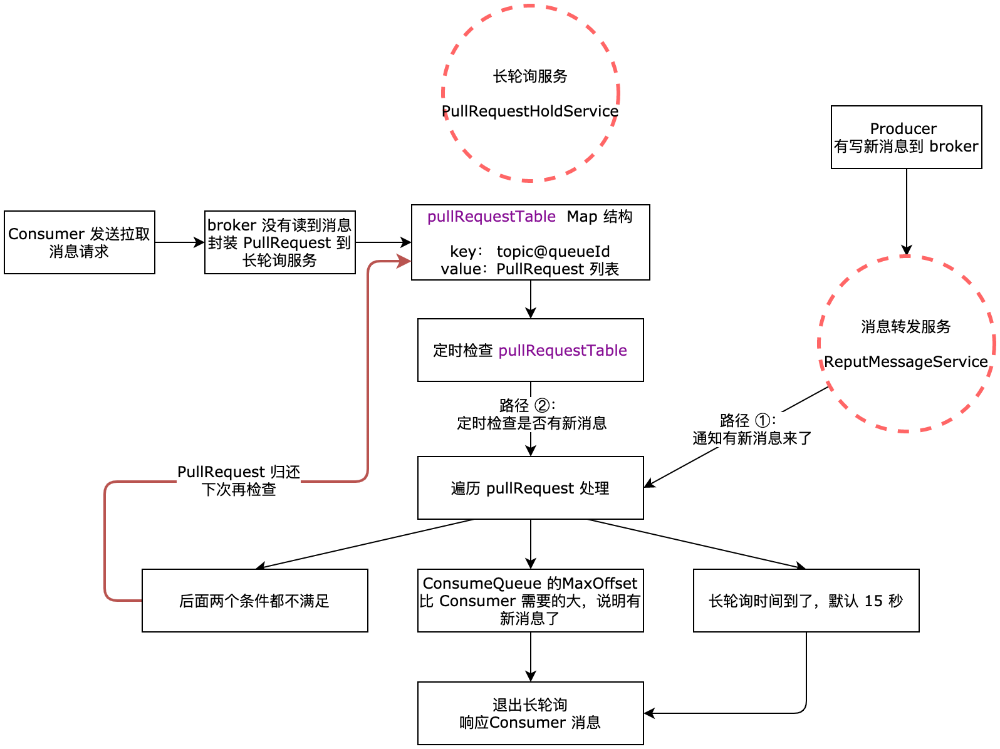

| 版本 | 内容 | 时间                   |
| ---- | ---- | ---------------------- |
| V1   | 新建 | 2023年06月24日15:18:40 |

## broker 长轮询概述

消费者发送拉取消息到 broker，broker 在 PullMessageProcessor#processRequest 中处理消息拉取逻辑。

- 假如拉取到消息了，就直接封装消息响应到 Consumer，Consumer 就去消费消息；
- 假如没有拉取到消息，就需要将 Consumer 发送来的请求 hold 住，然后开启 broker 端长轮询，当有 Producer 新写消息到 broker 了，broker 发现是该 Consumer 的订阅消息，就会将消息封装响应给 Consumer，结束长轮询。

broker 长轮询的好处就是防止 broker 端的压力过大，因为如果没有拉取到消息，Consumer 会立即再次发送消息拉取的请求。

## broker 长轮询入口

当 Consumer 发送拉消息请求到 broker 端后，如果没有拉取到消息，就需要在 broker 开启长轮询，处理逻辑在 PullMessageProcessor#processRequest 方法，没有拉取到消息的状态码是 ResponseCode.PULL_NOT_FOUND，那么就看这个 switch...case... 分支做的事情。

```java
if (brokerAllowSuspend && hasSuspendFlag) {
    // 默认 1500
    long pollingTimeMills = suspendTimeoutMillisLong;
    if (!this.brokerController.getBrokerConfig().isLongPollingEnable()) {
        pollingTimeMills = this.brokerController.getBrokerConfig().getShortPollingTimeMills();
    }

    // 拉消息请求的主题
    String topic = requestHeader.getTopic();
    // 请求的偏移量
    long offset = requestHeader.getQueueOffset();
    // 拉消息请求的队列 id
    int queueId = requestHeader.getQueueId();

    // 创建长轮询 PullRequest 对象
    PullRequest pullRequest = new PullRequest(request, channel, pollingTimeMills,
        this.brokerController.getMessageStore().now(), offset, subscriptionData, messageFilter);
    // 将长轮询 PullRequest 对象交给长轮询服务
    this.brokerController.getPullRequestHoldService().suspendPullRequest(topic, queueId, pullRequest);
    // 将 response 设置为 null
    // 设置成 null 之后，外层的 requestTask 拿到的结果就是 null
    // 它是 null 的话，requestTask 内部的 callBack 就不会给客户端发送任何数据了
    response = null;
    break;
}
```

上面的 requestHeader 就是消费者发送的拉消息请求的请求头，创建一个 PullRequest 对象，然后交给拉消息长轮询服务 PullRequestHoldService 去处理。

在分析长轮询的操作之前得分析一些相关类

## broker 长轮询相关类

### PullRequestHoldService 字段分析

PullRequestHoldService 是 broker 的一个后台线程服务，用于处理 broker 拉取消息长轮询的，该类有个关键字段如下：

```java
// 长轮询服务
protected ConcurrentMap<String/* topic@queueId */, ManyPullRequest> pullRequestTable =
    new ConcurrentHashMap<String, ManyPullRequest>(1024);
```

key 是 topic@queueId，value 是 ManyPullRequest 类型的值。当 Consumer 发送拉取消息到 broker 后，如果 broker 没有读取到消息，那就需要将此次请求的 topic 和 queueId 作为 key，封装一个 PullRequest 对象放到 ManyPullRequest 中去。其中 ManyPullRequest 其实就是一个存放多个 PullRequest 的容器。

```java
public class ManyPullRequest {
    private final ArrayList<PullRequest> pullRequestList = new ArrayList<>();
 
    // ...... 省略 ......
}
```

### PullRequest

```java
public class PullRequest {
    // 消费者 rpc 的请求对象
    private final RemotingCommand requestCommand;
    // 服务器和客户端的 channel
    private final Channel clientChannel;
    // 长轮询超时时间，默认 15 秒
    private final long timeoutMillis;
    // 长轮询开始时间
    private final long suspendTimestamp;
    // 从 RemotingCommand 中 header 提起出来的本次 pull 队列的 offset
    private final long pullFromThisOffset;
    // 该主题的订阅数据
    private final SubscriptionData subscriptionData;
    // 消息过滤器，一般都是 tag 过滤
    private final MessageFilter messageFilter;
 
    
    // ...... 省略 ......
}
```

PullRequest 其实就是封装的来自 Consumer 的请求的数据，如下

- `RemotingCommand requestCommand`：就是来自 Consumer 的拉取消息的请求数据；
- `Channel clientChannel`：Consumer 和 broker 的通信 Channel；
- `long timeoutMillis`：broker 保持长轮询的时间；
- `long suspendTimestamp`：broker 长轮询的开始时间；
- `long pullFromThisOffset`：就是 Consumer 此次需要拉取的消息的偏移量；
- `SubscriptionData subscriptionData`：Consumer 的订阅的 topic 的数据；
- `MessageFilter messageFilter`：消息过滤器；

## broker 长轮询流程

先看流程图：



### 添加 PullRequest 到长轮询服务

当 broker 没有读取到 Consumer 需要的消息后，就会封装此次 Consumer 的请求数据为 PullRequest 对象，添加到 PullRequestHoldService 长轮询服务的 Map 字段中，上面已经分析过了，key 是 topic@queueId 格式的。 

```java
// 长轮询服务
protected ConcurrentMap<String/* topic@queueId */, ManyPullRequest> pullRequestTable =
    new ConcurrentHashMap<String, ManyPullRequest>(1024);
```

### PullRequestHoldService 定时任务检查

PullRequestHoldService 是一个线程服务，关注它的 run 方法：

```java
@Override
public void run() {
    while (!this.isStopped()) {
        try {
            if (this.brokerController.getBrokerConfig().isLongPollingEnable()) {
                // 服务器开启长轮询，每次循环休眠 5 秒
                this.waitForRunning(5 * 1000);
            } else {
                // 关闭的请求，每次休眠 1 秒
                this.waitForRunning(this.brokerController.getBrokerConfig().getShortPollingTimeMills());
            }

            long beginLockTimestamp = this.systemClock.now();
            this.checkHoldRequest();
            // ...... 省略 ......
        } catch (Throwable e) {
            log.warn(this.getServiceName() + " service has exception. ", e);
        }
    }
}
```

broker 是默认开启长轮询的，所以 PullRequestHoldService#run 的意思就是，每 5 秒调用 checkHoldRequest 方法去检查是否有长轮询服务需要检查。

```java
protected void checkHoldRequest() {
    for (String key : this.pullRequestTable.keySet()) {
        // 循环体内为每个 topic@queueId 的 kv
        String[] kArray = key.split(TOPIC_QUEUEID_SEPARATOR);
        if (2 == kArray.length) {
            // 获取主题
            String topic = kArray[0];
            // 获取队列 id
            int queueId = Integer.parseInt(kArray[1]);
            // 到存储模块查询该 consumequeue 的最大 offset
            final long offset = this.brokerController.getMessageStore().getMaxOffsetInQueue(topic, queueId);
            try {
                // 通知消息到达的逻辑
                this.notifyMessageArriving(topic, queueId, offset);
            } catch (Throwable e) {
                log.error("check hold request failed. topic={}, queueId={}", topic, queueId, e);
            }
        }
    }
}
```

其实就是读取 key 表示的 topic 和 queueId，通过 topic 和 queueId 去读取 broker 中的 ConsumeQueue 的最大逻辑偏移量。我们就可以拿 ConsumeQueue 中的最大逻辑偏移量和 Consumer 发送的拉取消息的请求中的要拉去的逻辑偏移量做比较，如果 ConsumeQueue 中的 maxOffset 大，说明有消息可以给 Consumer 返回了，就可以结束长轮询了，后面具体分析。

可以看到就是调用了 notifyMessageArriving 方法。

### notifyMessageArriving 的两个调用位置

**（1）消息转发服务 ReputMessageService 中调用**

我们知道当 Producer 写入消息到 CommitLog 后，消息转发服务 ReputMessageService 会将新接收到的消息转发到 ConsumeQueue 和 Index 文件，在这里当读取到一个转发消息后，就会去提醒 broker 的长轮询服务有新的消息来了，你快去检查一下是否有长轮询的请求在等着。方法是 ReputMessageService#doReput：

```java
private void doReput() {
    // ...... 省略 ......

    if (BrokerRole.SLAVE != DefaultMessageStore.this.getMessageStoreConfig().getBrokerRole()
            && DefaultMessageStore.this.brokerConfig.isLongPollingEnable()
            && DefaultMessageStore.this.messageArrivingListener != null) {
        DefaultMessageStore.this.messageArrivingListener.arriving(dispatchRequest.getTopic(),
            dispatchRequest.getQueueId(), dispatchRequest.getConsumeQueueOffset() + 1,
            dispatchRequest.getTagsCode(), dispatchRequest.getStoreTimestamp(),
            dispatchRequest.getBitMap(), dispatchRequest.getPropertiesMap());
        notifyMessageArrive4MultiQueue(dispatchRequest);
    }

    // ...... 省略 ......         
}
```

可以看到就是调用 MessageArrivingListener#arriving 方法将消息的属性传递过去了，这个方法最终会调用到长轮询服务 PullRequestHoldService 的 notifyMessageArriving 方法。

**（2）消息长轮询服务 PullRequestHoldService 定时调用**

就是上一小节分析的。


那么接下来分析一下 notifyMessageArriving 做了什么事情

### notifyMessageArriving 流程

**（1）第一步：获取 PullRequestHoldService 服务中长轮询的 PullRequest。**

**（2）第二步：遍历 PullRequest 列表，依次处理。**

```java
List<PullRequest> replayList = new ArrayList<PullRequest>();
for (PullRequest request : requestList) {
    // ...... 省略 ......
}
```

那么接下来分析单个 PullRequest 是如何处理的

**（3）第三步：如果 ConsumeQueue 的最大逻辑偏移量 maxOffset 比 Consumer 需要拉取的偏移量要大，说明可以给 Consumer 响应消息了，在真正响应消息前，需要通过消息过滤器过滤一下消息，如果是 TAG 过滤，在 broker 端是通过 tag 的哈希值简单过滤的，其实在 Consumer 端会通过真正的 tag 去进行过滤。当过滤后还有消息，就需要继续调用 broker 消息拉取处理器 PullMessageProcessor 的对应方法去读取消息并响应给 Consumer 了。**

```java
long newestOffset = maxOffset;
if (newestOffset <= request.getPullFromThisOffset()) {
    // 保证 newestOffset 为 queue 的 maxOffset
    newestOffset = this.brokerController.getMessageStore().getMaxOffsetInQueue(topic, queueId);
}
// 条件成立说明
// 这个 request 关注的 queue 内有本次 pull 查询的数据了，长轮询该结束了
if (newestOffset > request.getPullFromThisOffset()) {
    // 判断消息是否需要被过滤，broker 端使用的是 tagCode 进行过滤的，也就是真正的 tag 的哈希值去过滤的
    // 在消费者那边会使用真正的tag 去过滤，因为哈希值可能会重复
    boolean match = request.getMessageFilter().isMatchedByConsumeQueue(tagsCode,
                                                                       new ConsumeQueueExt.CqExtUnit(tagsCode, msgStoreTime, filterBitMap));
    // match by bit map, need eval again when properties is not null.
    if (match && properties != null) {
        match = request.getMessageFilter().isMatchedByCommitLog(null, properties);
    }

    if (match) {
        try {
            // 将满足条件的 pullRequest 再次封装出 requestTask 提交到线程池内执行
            // 会再次调用 pullMessageProcess.processRequest(..)
            this.brokerController.getPullMessageProcessor().executeRequestWhenWakeup(request.getClientChannel(),
                                                                                     request.getRequestCommand());
        } catch (Throwable e) {
            log.error("execute request when wakeup failed.", e);
        }
        continue;
    }
}
```

**（4）第四步：判断 broker 长轮询的时间是否超时，默认是 15 秒，如果超时了，也会调用 broker 消息拉取处理器 PullMessageProcessor 的对应方法去读取消息并响应给 Consumer 了，当然这里没有读到消息也会响应给消费者。**

```java
// 判断该 pullrequest 长轮询请求是否超时，超时了也是会将其提交到线程池内执行 pullMessageProcess.processRequest(..)
if (System.currentTimeMillis() >= (request.getSuspendTimestamp() + request.getTimeoutMillis())) {
    try {
        this.brokerController.getPullMessageProcessor().executeRequestWhenWakeup(request.getClientChannel(),
            request.getRequestCommand());
    } catch (Throwable e) {
        log.error("execute request when wakeup failed.", e);
    }
    continue;
}
```

**（5）第五步：如果没有新消息写入到 broker，也长轮询没有超时，那么就需要将 PullRequest 归还到长轮询服务 PullRequestHoldService 中，等待下一次检查。** 

```java
   replayList.add(request);


if (!replayList.isEmpty()) {
    mpr.addPullRequest(replayList);
}
```

## 小结

本次分析了 broker 的长轮询服务，broker 处理消息拉取的整体流程图如下：

.png)

其实退出长轮询后还是调用的是 PullMessageProcessor#processRequest 方法，只是最后一个参数传的是 false，表示此次不允许长轮询，那么就一定会响应给 Consumer 了。