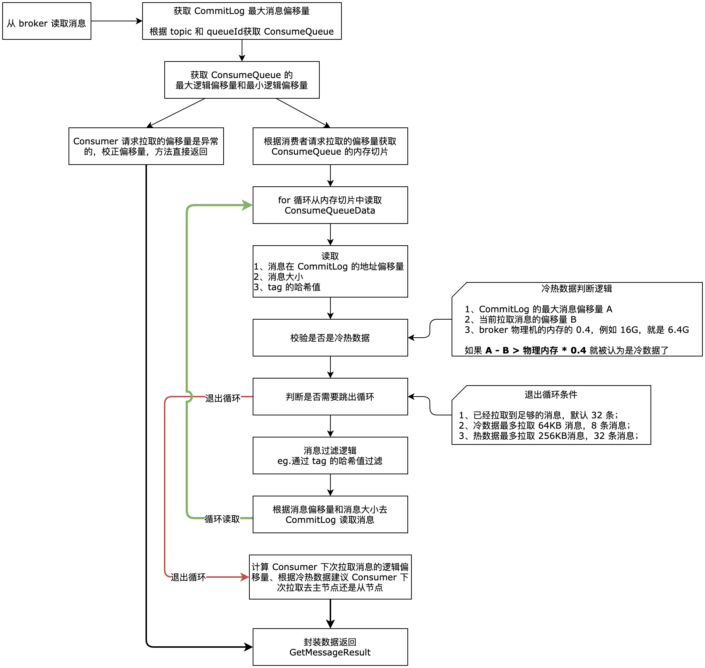
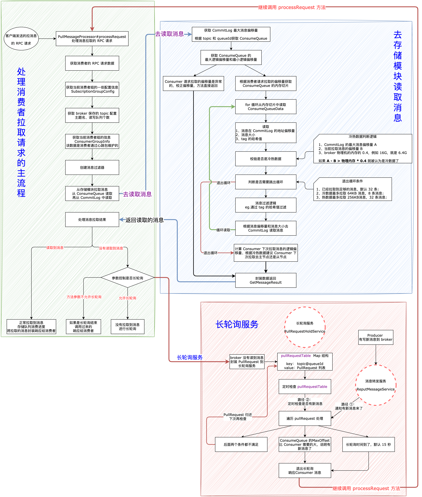

| 版本 | 内容 | 时间                   |
| ---- | ---- | ---------------------- |
| V1   | 新建 | 2023年06月24日18:37:40 |

## broker 读取消息入口

Consumer 发送拉消息的 RPC 请求，在 broker 端是 PullMessageProcessor#processRequest 方法处理的，如下：

```java
private RemotingCommand processRequest(final Channel channel, RemotingCommand request, boolean brokerAllowSuspend)
    throws RemotingCommandException {
    
    // ...... 省略 ......

    // 从存储模块获取消息 核心入口
    final GetMessageResult getMessageResult =
        this.brokerController.getMessageStore().getMessage(requestHeader.getConsumerGroup(), requestHeader.getTopic(),
            requestHeader.getQueueId(), requestHeader.getQueueOffset(), requestHeader.getMaxMsgNums(), messageFilter);

    // ...... 省略消息处理 ......
}
```

可以看到消息读取就是调用 DefaultMessageStore#getMessage 方法，这个方法比较长，逻辑比较复杂，分步分析。

## broker 读取消息

DefaultMessageStore#getMessage， 先看流程图



### 定义消息读取的返回数据

```java
// 查询开始时间
long beginTime = this.getSystemClock().now();

// status 查询结果状态，先给个默认值
GetMessageStatus status = GetMessageStatus.NO_MESSAGE_IN_QUEUE;
// nextBeginOffset 客户端下一次 pull 时使用的位点信息，默认值，后面拉取到消息后就会修改
// 待查找队列的偏移量
long nextBeginOffset = offset;
// 当前消息队列的最小的逻辑 offset，这里的单位是一个 ConsumeQueueData 也就是 20 个字节
long minOffset = 0;
// 当前消息队列的最大 offset
long maxOffset = 0;

// lazy init when find msg.
// 查询结果对象
GetMessageResult getResult = null;
```

主要就是定义一些方法返回值 GetMessageResult 的一些参数

### 获取 CommitLog 的最大消息物理偏移量

```java
// 获取 commitLog 最大的物理偏移量，当前正在顺序写的文件，文件名long 值+顺序写文件的 position
final long maxOffsetPy = this.commitLog.getMaxOffset();
```

获取 CommitLog 的最大消息物理偏移量，用于后面判断 Consumer 请求拉取的消息的偏移量是否合法。

### 获取 ConsumeQueue

```java
ConsumeQueue consumeQueue = findConsumeQueue(topic, queueId);
if (consumeQueue != null) {
    // 获取 COnsumeQueue 的最大最小的逻辑偏移量
    minOffset = consumeQueue.getMinOffsetInQueue();
    maxOffset = consumeQueue.getMaxOffsetInQueue();
 
    // ...... 省略处理 ......
}
```

通过 topic 和 queueId 获取对应的 ConsumeQueue，每个 topic 的每个 queueId 都有属于自己的 ConsumeQueue 文件。然后获取当前 ConsumeQueue 的最小逻辑偏移量和最大逻辑偏移量，后面会根据这两个偏移量来判断 Consumer 请求的偏移量是否合法。

### 异常偏移量处理

```java
if (maxOffset == 0) {
    status = GetMessageStatus.NO_MESSAGE_IN_QUEUE;
    nextBeginOffset = nextOffsetCorrection(offset, 0);
} else if (offset < minOffset) {
    status = GetMessageStatus.OFFSET_TOO_SMALL;
    nextBeginOffset = nextOffsetCorrection(offset, minOffset);
} else if (offset == maxOffset) {
    status = GetMessageStatus.OFFSET_OVERFLOW_ONE;
    nextBeginOffset = nextOffsetCorrection(offset, offset);
} else if (offset > maxOffset) {
    status = GetMessageStatus.OFFSET_OVERFLOW_BADLY;
    if (0 == minOffset) {
        nextBeginOffset = nextOffsetCorrection(offset, minOffset);
    } else {
        nextBeginOffset = nextOffsetCorrection(offset, maxOffset);
    }
} else {
 	// ...... 省略正常偏移量的 读取消息的处理 ...... 
}
```

上面有 5 个分支，最后 else 分支是正常的偏移量，会去读取消息。前面的 4 个分支都是 Consumer 请求拉取的偏移量是异常的，需要做一些校正动作。

- `maxOffset == 0`：说明根据 topic 和 queueId 获取的 ConsumeQueue 是新建的，也就是没有数据，需要校正 Consumer 下次拉取的偏移量为 0，也就是建议从 ConsumeQueue 的第一个 ConsumeQueueData 开始消费；
- `offset < minOffset`：说明 ConsumeQueue 中没有 Consumer 需要的偏移量的消息，有可能是被清理了，这时需要校正 Consumer 下次拉取的偏移量为 ConsumeQueue 的最小逻辑偏移量；
- `offset == maxOffset`：Consumer 需要拉取的消息和 ConsumeQueue 最大的逻辑消息量持平，说明 Consumer 的消费进度和队列的消息持平了，这时是拉取不到消息的，然后也没有做别的处理，后面会退出查找消息的方法；
- `offset > maxOffset`：说明 Consumer 需要拉取的消息的偏移量比 ConsumeQueue 的最大逻辑偏移量还大，肯定是拉取不到消息的，这里也需要校正 Consumer 下次拉取的偏移量；

上面 4 个分支都是异常的偏移量，是不会走真正的查询消息操作的，会封装返回值从方法返回。

### 读取消息流程

#### 获取 ConsumeQueue 内存切片

**（1）第一步：获取 Consumer 此次拉取的消息的起始的逻辑偏移量对应的 MappedFile 文件的内存切片。**

```java
SelectMappedBufferResult bufferConsumeQueue = consumeQueue.getIndexBuffer(offset);
```

其中 SelectMappedBufferResult 的属性如下：

```java
public class SelectMappedBufferResult {
    private final long startOffset;
    private final ByteBuffer byteBuffer;
    private int size;
    private MappedFile mappedFile; 
    
    // ...... 省略 .....
}
```

- `ByteBuffer byteBuffer`：切片出来的内存切片；
- `int size`：切片出来的大小；
- `MappedFile mappedFile`：当前内存切片属于哪一个 MappedFile；
- `long startOffset`：当前内存切片在 MappedFile 上的起始偏移量；

#### for 循环-读取 ConsumeQueueData

```java
for (; i < bufferConsumeQueue.getSize() && i < maxFilterMessageCount; i += ConsumeQueue.CQ_STORE_UNIT_SIZE) {
    // 从切片中读取 20 个字节
    // 消息物理偏移量
    long offsetPy = bufferConsumeQueue.getByteBuffer().getLong();
    // 消息大小
    int sizePy = bufferConsumeQueue.getByteBuffer().getInt();
    long tagsCode = bufferConsumeQueue.getByteBuffer().getLong();

    maxPhyOffsetPulling = offsetPy;
 
    // ...... 省略 ......
}
```

我们已经分析过很多次，一个 ConsumeQueueData 数据占用 20 字节：

- 消息在 CommitLog 文件中的物理偏移量，占用 8 字节；
- 消息的大小，占用 4 字节；
- 消息的 tag 的哈希值，占用 8 字节；

在这里就是从内存切片中一步步的读取每个 ConsumeQueueData 内的数据，每次循环读取 20 个字节。

#### for 循环-判断冷热数据

```java
// 检查是否是冷热数据
// 参数 1：本次循环处理的 consumeQueueData 代表的消息的物理偏移量
// 参数 2：当前 broker 节点的 commitLog 的最大物理偏移量
boolean isInDisk = checkInDiskByCommitOffset(offsetPy, maxOffsetPy);
```

判断当前读取的数据是冷数据还是热数据。

```java
private boolean checkInDiskByCommitOffset(long offsetPy, long maxOffsetPy) {
    long memory = (long) (StoreUtil.TOTAL_PHYSICAL_MEMORY_SIZE * (this.messageStoreConfig.getAccessMessageInMemoryMaxRatio() / 100.0));
    return (maxOffsetPy - offsetPy) > memory;
}
```

- `messageStoreConfig.getAccessMessageInMemoryMaxRatio()` 默认值给的是 40；
- `StoreUtil.TOTAL_PHYSICAL_MEMORY_SIZE` 是当前物理机内存的大小，比如 16G；
- 如果当前拉取的消息的偏移量是 A，CommitLog 的最大消息偏移量是 B，如果 `B -A > 0.4 * 物理机内存`，就被认为是冷数据；

#### for 循环-判断是否跳出循环

```java
// 控制是否跳出循环
// 参数 1：本次循环 ConsumeQueueData表示消息大小
// 参数 2：maxMsgNums 32
// 参数 3：本次查询已经获取的消息总 size
// 参数 4：本次查询已经获取的消息个数
// 参数 5：本次循环存储的 ConsumeQueueData 是否是冷热数据
if (this.isTheBatchFull(sizePy, maxMsgNums, getResult.getBufferTotalSize(), getResult.getMessageCount(), isInDisk)) {
    break;
}
```

这部分是控制是否跳出 for 循环的，

```java
private boolean isTheBatchFull(int sizePy, int maxMsgNums, int bufferTotal, int messageTotal, boolean isInDisk) {
    // 条件成立说明本次 pull 消息，还未拉取到任何东西，需要外层 for 循环继续，返回 false
    if (0 == bufferTotal || 0 == messageTotal) {
        return false;
    }
    // 条件成立，说明结果对象内消息数已经够量（maxMsgNums）
    if (maxMsgNums <= messageTotal) {
        return true;
    }
    if (isInDisk) {
        // 冷数据拉消息最多拉取 64kb 消息
        if ((bufferTotal + sizePy) > this.messageStoreConfig.getMaxTransferBytesOnMessageInDisk()) {
            return true;
        }
        // 冷数据拉消息最多 8 条消息
        if (messageTotal > this.messageStoreConfig.getMaxTransferCountOnMessageInDisk() - 1) {
            return true;
        }
    } else {
        // 热数据最多拉取 256kb 消息
        if ((bufferTotal + sizePy) > this.messageStoreConfig.getMaxTransferBytesOnMessageInMemory()) {
            return true;
        }
        // 热数据最多拉取 32 条消息
        if (messageTotal > this.messageStoreConfig.getMaxTransferCountOnMessageInMemory() - 1) {
            return true;
        }
    }
    return false;
}
```

很简单，没什么好分析了，直接看代码的注释就行了。

#### for 循环-消息过滤

```java
// 服务器按照消息 tagCode 进行过滤
if (messageFilter != null
    && !messageFilter.isMatchedByConsumeQueue(isTagsCodeLegal ? tagsCode : null, extRet ? cqExtUnit : null)) {
    if (getResult.getBufferTotalSize() == 0) {
        status = GetMessageStatus.NO_MATCHED_MESSAGE;
    }

    continue;
}
```

broker 过滤主要是按照 tagCode，也就是 tag 的哈希值来进行过滤，但是哈希值可能会出现重复，所以 Consumer 在真正拉取到消息后还会根据 tag 值去做过滤的。

#### for 循环-从 CommitLog 读取数据

```java
// 根据 ConsumeQueueData 的offsetPy和 ConsumeQueueData的sizePy 到 commitLog 查询出这条 msg
SelectMappedBufferResult selectResult = this.commitLog.getMessage(offsetPy, sizePy);
// 什么时候 selectResult 会是 null？  刚刚好执行了commitLog过期的任务，将包含 offetPy的文件删除了
if (null == selectResult) {
    if (getResult.getBufferTotalSize() == 0) {
        status = GetMessageStatus.MESSAGE_WAS_REMOVING;
    }

    // 获取包含该 offsetPy 数据文件的下一个数据文件的文件名，翻页
    nextPhyFileStartOffset = this.commitLog.rollNextFile(offsetPy);
    continue;
}
```

这部分就是通过 ConsumeQueue 得到消息的物理偏移量和消息大小，就去 CommitLog 读取真正的消息了，得到某个消息的内存切片 SelectMappedBufferResult，如果没有找到，说明某个 CommitLog 文件可能由于过期被删除了，这时读取下一个 CommitLog 数据文件即可。

#### for 循环-将查询的数据添加到 GetMessageResult

```java
// 将本次循环查询出来的 msg，加入
getResult.addMessage(selectResult);
status = GetMessageStatus.FOUND;
// 设置为MIN_VALUE，避免走上面跳过期的 ConsumeQueueData 的逻辑
nextPhyFileStartOffset = Long.MIN_VALUE;
```

### 计算下次拉取的消息偏移量和broker

```java
// nextBeginOffset 客户端下一次 pull 时使用的位点信息
// pull.offset + 上面 for 循环读取过的 ConsumeQueueData 的字节数/20
nextBeginOffset = offset + (i / ConsumeQueue.CQ_STORE_UNIT_SIZE);

// diff = commitLog 的最大物理偏移量 - 本次拉消息最后一条消息的物理偏移量
long diff = maxOffsetPy - maxPhyOffsetPulling;
// 40% 系统内存
long memory = (long) (StoreUtil.TOTAL_PHYSICAL_MEMORY_SIZE
    * (this.messageStoreConfig.getAccessMessageInMemoryMaxRatio() / 100.0));
// diff > memory
// -> true的话，表示本轮查询最后一条消息是冷数据，broker 服务器建议客户端下一次 pull 时到 slave 节点
// -> false的话，表示本轮查询最后一条消息是热数据，broker 服务器建议客户端下一次 pull 时到 master 节点
getResult.setSuggestPullingFromSlave(diff > memory);
```

跳出 for 循环后，就需要计算一些返回值需要的数据了，这里主要计算的就是两个：

- nextBeginOffset：表示之前的消息已经被拉取了，建议消费者下次拉取消息的时候从该逻辑偏移量拉取消息；
- SuggestPullingFromSlave：主要是根据当前拉取的最后一个消息是否是冷热数据来判断的，如果是冷数据那么建议下次拉取消息到 slave 节点去拉取，防止 master 节点压力过大；如果是热数据还是从 master 节点读取。

### 封装返回值

```java
getResult.setStatus(status);
// 设置客户端1下一次 pull 时的 offset
getResult.setNextBeginOffset(nextBeginOffset);
getResult.setMaxOffset(maxOffset);
getResult.setMinOffset(minOffset);
```

## 小结

从存储模块读取消息的流程非常长，主要的思想就是从 ConsumeQueue 中读取 topic 和 queueId 对应的ConsumeQueueData，从中获取消息在 CommitLog 中的物理偏移量、消息大小、tag 的哈希值，通过这些参数去 CommitLog 中读取真正的消息返回。

这里给上，整个 broker 处理消息拉取的流程图：

