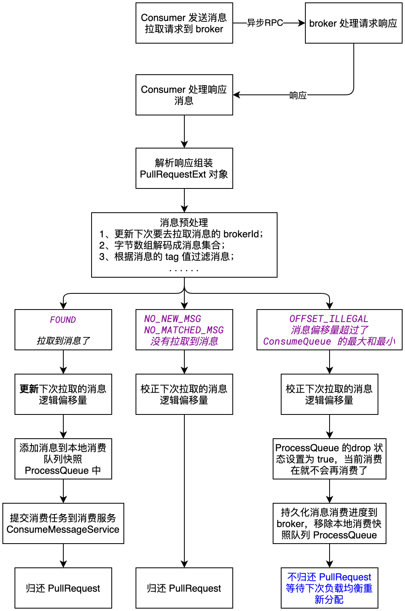

| 版本 | 内容 | 时间                   |
| ---- | ---- | ---------------------- |
| V1   | 新建 | 2023年06月24日22:04:54 |

## 消费者处理 broker 拉取的消息的入口

Consumer 发送异步 RPC 到 broker 端拉取消息，当 broker 端响应给 Consumer 端时，会调用 Consumer 事先准备好的回调方法。

先看下 Consumer 发送异步 RPC 的位置，MQClientAPIImpl#pullMessageAsync

```java
private void pullMessageAsync(
    final String addr,
    final RemotingCommand request,
    final long timeoutMillis,
    final PullCallback pullCallback
) throws RemotingException, InterruptedException {
    this.remotingClient.invokeAsync(addr, request, timeoutMillis, new InvokeCallback() {
        @Override
        public void operationComplete(ResponseFuture responseFuture) {
            RemotingCommand response = responseFuture.getResponseCommand();
            if (response != null) {
                try {
                    PullResult pullResult = MQClientAPIImpl.this.processPullResponse(response, addr);
                    assert pullResult != null;
                    // 将 pullResult 交给 拉消息结果处理回调对象
                    pullCallback.onSuccess(pullResult);
                } catch (Exception e) {
                    pullCallback.onException(e);
                }
            } else {
                // ...... 省略异常情况 ......
            }
        }
    });
}
```

可以看到，当 broker 响应消息到 Consumer 时，会解析响应为 PullResult 对象，然后调用 PullCallback 对应的函数去处理。 

## PullResult 属性

在分析 PullCallback#onSuccess 方法之前，我们得知道 broker 返回的 PullResult 有什么内容

```java
public class PullResult {
    // 消息拉取状态
    private final PullStatus pullStatus;
    // 下次拉取的偏移量
    private final long nextBeginOffset;
    // 消息队列的最小偏移量
    private final long minOffset;
    // 消息队列的最大偏移量
    private final long maxOffset;
    // 具体拉取消息的消息列表
    private List<MessageExt> msgFoundList;
    
    // ...... 省略 ......
    
}
```

- `PullStatus pullStatus`：消息拉取状态；
- `long nextBeginOffset`：broker 返回的下次拉取消息的偏移量，下次那这个偏移量去拉取消息；
- `long minOffset`：当前拉取的消息队列的最小偏移量；
- `long maxOffset`：当前拉取的消息队列的最大偏移量；
- `List<MessageExt> msgFoundList`：当前拉取请求拉取下来的具体的消息列表；

具体返回的 PullResult 其实是它的子类 PullResultExt

```java
public class PullResultExt extends PullResult {
    private final long suggestWhichBrokerId;
    // 从网络中读取消息列表中的属性
    private byte[] messageBinary;
 
    // ...... 省略 ......
}
```

- `long suggestWhichBrokerId`：broker 端建议下次去哪个 broker 拉取数据，0 表示从主 broker 节点拉取消息，非 0 表示去从节点拉取消息；
- `byte[] messageBinary`：从 broker 拉取下来的所有的消息的字节数组；

## 消息处理

关于消息拉取的回调函数 PullCallback 是在 DefaultMQPushConsumerImpl#pullMessage 方法中定义的。这里主要关注拉取消息成功时处理的 PullCallback#onSuccess 方法，先看流程图：



### 预处理消息

```java
// 预处理
pullResult = DefaultMQPushConsumerImpl.this.pullAPIWrapper.processPullResult(pullRequest.getMessageQueue(), pullResult,
    subscriptionData);
```

调用 processPullResult 预处理消息，从 broker 拉取的消息都是保存在一个 byte 数组内的，这里主要就是要将 byte 数组解析成一个一个的消息对象，方便我们处理数据。然后根据 tag 的值去进行过滤操作， 

```java
public PullResult processPullResult(final MessageQueue mq, final PullResult pullResult,
    final SubscriptionData subscriptionData) {
    PullResultExt pullResultExt = (PullResultExt) pullResult;

    // 更新 pullFromWhichNodeTable 内该 mq 的下次查询推荐的 brokerId
    this.updatePullFromWhichNode(mq, pullResultExt.getSuggestWhichBrokerId());
    if (PullStatus.FOUND == pullResult.getPullStatus()) {
        // 消息转换成 ByteBUffer
        ByteBuffer byteBuffer = ByteBuffer.wrap(pullResultExt.getMessageBinary());
        // 解码
        List<MessageExt> msgList = MessageDecoder.decodes(byteBuffer);

        // 客户端再次过滤后的 list
        List<MessageExt> msgListFilterAgain = msgList;
        // 客户端按照 tag 值进行过滤
        if (!subscriptionData.getTagsSet().isEmpty() && !subscriptionData.isClassFilterMode()) {
            msgListFilterAgain = new ArrayList<MessageExt>(msgList.size());
            for (MessageExt msg : msgList) {
                if (msg.getTags() != null) {
                    // tag 过滤
                    if (subscriptionData.getTagsSet().contains(msg.getTags())) {
                        msgListFilterAgain.add(msg);
                    }
                }
            }
        }

        // ...... 省略 ......

        for (MessageExt msg : msgListFilterAgain) {
            String traFlag = msg.getProperty(MessageConst.PROPERTY_TRANSACTION_PREPARED);
            if (Boolean.parseBoolean(traFlag)) {
                msg.setTransactionId(msg.getProperty(MessageConst.PROPERTY_UNIQ_CLIENT_MESSAGE_ID_KEYIDX));
            }
            // 给消息添加三个 property， 队列最小 offset，队列最大 offset，消息归属 brokerName
            MessageAccessor.putProperty(msg, MessageConst.PROPERTY_MIN_OFFSET,
                Long.toString(pullResult.getMinOffset()));
            MessageAccessor.putProperty(msg, MessageConst.PROPERTY_MAX_OFFSET,
                Long.toString(pullResult.getMaxOffset()));
            msg.setBrokerName(mq.getBrokerName());
        }

        // 将再次过滤后的消息 list，保存到 pullResult 中
        pullResultExt.setMsgFoundList(msgListFilterAgain);
    }

    // help gc
    pullResultExt.setMessageBinary(null);

    return pullResult;
}
```

主要是做三件事情：

1. 根据 broker 返回的 suggestWhichBrokerId 更新下次去 broker 拉取的节点；
2. 解码 broker 返回的字节数组为消息集合，然后进行 tag 的消息过滤操作，过滤掉当前消费者没有订阅的 tag 的消息；
3. 给消息对象 MessageExt 设置三个属性，broker 的 queueId 的最大逻辑偏移量和最小逻辑偏移量，还有 brokerName；

### 根据消息的拉取状态做不同的处理

#### 正常拉取消息

```java
switch (pullResult.getPullStatus()) {
    case FOUND: // 从服务器正常拉取到消息
        // 更新 pullRequest 对象的 nextOffset
        long prevRequestOffset = pullRequest.getNextOffset();
        pullRequest.setNextOffset(pullResult.getNextBeginOffset());
        // ...... 省略统计相关业务 ......

        long firstMsgOffset = Long.MAX_VALUE;
        if (pullResult.getMsgFoundList() == null || pullResult.getMsgFoundList().isEmpty()) {
            // 条件成立，说明客户端过滤导致消息全部被过滤了，发起下一次拉消息
            DefaultMQPushConsumerImpl.this.executePullRequestImmediately(pullRequest);
        } else {
            // 说明拉取到的消息没有被过滤完
            firstMsgOffset = pullResult.getMsgFoundList().get(0).getQueueOffset();
            // ...... 省略统计相关业务 ......

            // 将服务器拉取的消息 list 加入到消费者本地的该 queue 的 processQueue 中
            boolean dispatchToConsume = processQueue.putMessage(pullResult.getMsgFoundList());

            // 提交 "消费任务"
            DefaultMQPushConsumerImpl.this.consumeMessageService.submitConsumeRequest(
                    pullResult.getMsgFoundList(),
                    processQueue,
                    pullRequest.getMessageQueue(),
                    dispatchToConsume);

            if (DefaultMQPushConsumerImpl.this.defaultMQPushConsumer.getPullInterval() > 0) {
                DefaultMQPushConsumerImpl.this.executePullRequestLater(pullRequest,
                        DefaultMQPushConsumerImpl.this.defaultMQPushConsumer.getPullInterval());
            } else {
                DefaultMQPushConsumerImpl.this.executePullRequestImmediately(pullRequest);
            }
        }
        // ...... 省略日志打印 ......
        break;
        // ...... 省略其他分支 ......
}
```

1. 更新 PullRequest 的下次拉取消息的逻辑偏移量；
2. 将从 broker 拉取下来的消息添加到消费者本地消费快照队列 ProcessQueue 中；
3. 提交消费任务到消费服务，也就是 ConsumeMessageService，这里分为两种并发消费服务和顺序消费服务；
4. 根据配置，将从消息拉取服务 PullMessageService 的阻塞队列中拿的 PullRequest 对象，归还给阻塞队列，这样 PullMessageService 就可以再去发送 RPC 请求到 broker 继续拉取消息了；

#### 未拉取到消息

```java
// ...... 省略其他分支 .......
case NO_NEW_MSG: // 没有新的消息
case NO_MATCHED_MSG: // 没有匹配消息
    pullRequest.setNextOffset(pullResult.getNextBeginOffset());
    DefaultMQPushConsumerImpl.this.correctTagsOffset(pullRequest);
    DefaultMQPushConsumerImpl.this.executePullRequestImmediately(pullRequest);
    break;
case OFFSET_ILLEGAL: // 本次 pull 时，使用的 offset 是无效的，也就是 offset > maxOffset || offset < minOffset
    pullRequest.setNextOffset(pullResult.getNextBeginOffset());
    pullRequest.getProcessQueue().setDropped(true);
    // 提交 10 秒的延迟任务
    DefaultMQPushConsumerImpl.this.executeTaskLater(new Runnable() {
        @Override
        public void run() {
            try {
          DefaultMQPushConsumerImpl.this.offsetStore.updateOffset(pullRequest.getMessageQueue(),pullRequest.getNextOffset(), false)
                DefaultMQPushConsumerImpl.this.offsetStore.persist(pullRequest.getMessageQueue());
                DefaultMQPushConsumerImpl.this.rebalanceImpl.removeProcessQueue(pullRequest.getMessageQueue());
            } catch (Throwable e) {
                log.error("executeTaskLater Exception", e);
            }
        }
    }, 10000);
    break;
default:
    break;
```

关于 NO_NEW_MSG 和 NO_MATCHED_MSG 这两个状态， 主要就是校正消费者消费进度，然后归还 PullRequest 到 PullMessageService 的阻塞对了中。

关于 OFFSET_ILLEGAL 这个状态，主要原因是本次去 broker 端拉取消息时，使用的 offset 是无效的，也就是 `offset > maxOffset || offset < minOffset`，其中 maxOffset 和 minOffset 表示 ConsumeQueue 文件的最大逻辑偏移量和最小逻辑偏移量。这个情况比较复杂，主要就是校正 PullRequest 中的消息拉取偏移量，然后将该 PullRequest 对应的本地消费快照 ProcessQueue 的 drop 状态设置为 true，这样当前消费者就不会继续消费这个队列的消息了，而且也不会归还 PullRequest 到 PullMessageService 的阻塞队列，然后将该本地消费快照 ProcessQueue 从负载均衡服务 RebalanceImpl 中移除。

有个疑问就是，既然没有归还 PullRequest，那么岂不是 topic 的这个队列不会在消费了吗？其实是这个会在消费队列负载均衡服务 RebalanceImpl 中重新给它分配一个消费者中去消费。

## 小结

本篇主要分析了是将消息从 broker 拉取下来后的流程，主要就是将 broker 拉取下来的消息添加到本地快照消费队列 ProcessQueue 中去，然后提交一个消费任务到 ConsumeMessageService 消费服务中，消费服务器在 RocketMQ 中分为两种，一是并发消费服务、一是顺序消费服务。具体如何消费，是用户编写的业务代码。

