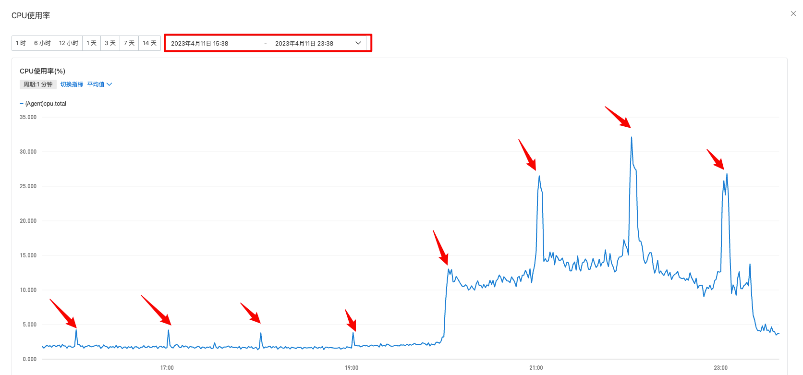
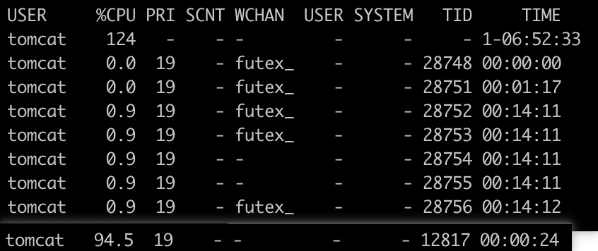
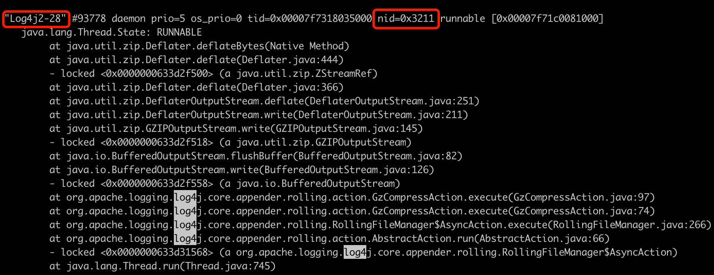
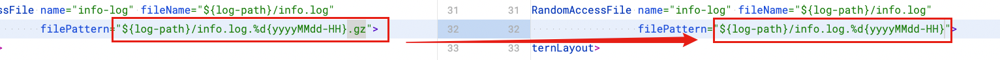
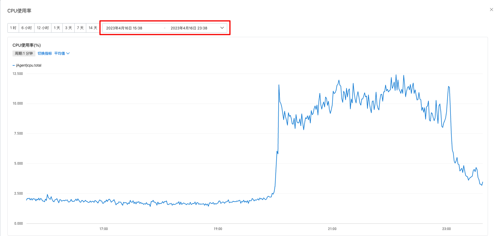

| 版本 | 内容 | 时间                   |
| ---- | ---- | ---------------------- |
| V1   | 新建 | 2023年04月17日12:49:21 |

## 现象



**现象**：线上某个服务的服务器在准点时间出现 CPU 峰刺，高峰期的峰刺十分明显。

**影响**：如果是相同流量，那么这个峰刺将会导致服务无法缩容。

**简单分析**：观察阿里云监控，峰刺期间会有**大量磁盘读写请求**，其它网**络流入流出数据正常**，TCP连接正常。在某个准点时间是由 top 命令发现是 Java 进程导致 CPU 飙升。

## 排查方向

首先根据经验，CPU 规律性峰刺大部分情况是定时触发的某个操作导致的。排查方向如下：

1. 观察线上接口请求无异常，在**峰刺时间点的接口请求量没有增加**；
2. 服务器的 **crontab 定时任务并没有**每小时执行的任务；
3. **业务定时任务也没有**每小时执行的任务；
4. 大数据和 PHP 部门，他们也没有每小时定时访问该服务的操作；
5. 观察**准点时的垃圾收集器，没有异常**情况；
6. 观察线程栈信息，查找到导致cpu飙升的具体线程，根据线程名字分析出具体业务

## 问题排查和分析

（1）首先查看当前服务器运行的 Java 进程号

```
ps -ef | grep java
```


（2）在整点时刻执行下面两个命令：

```
ps -p '你的进程pid' -m -o THREAD,tid,cputime | sort -k 2 -r > threadcpu
```

上面这个命令是打出整点时刻指定 pid 的进程的线程的 CPU 占用情况，倒序排列

> ps. 这个图当时没有使用排序，所以没有排序，现在没法子还原当时的场景了




第二个命令

```
jcmd '你的进程pid' Thread.print > threadprint
```


> 关于怎么查看 jcmd 的一些 command，可以使用` jcmd '你的pid' help`
>
> ```
> # jcmd 347 help
> 347:
> The following commands are available:
> JFR.stop
> JFR.start
> JFR.dump
> JFR.check
> VM.native_memory
> VM.check_commercial_features
> VM.unlock_commercial_features
> ManagementAgent.stop
> ManagementAgent.start_local
> ManagementAgent.start
> GC.rotate_log
> Thread.print
> GC.class_stats
> GC.class_histogram
> GC.heap_dump
> GC.run_finalization
> GC.run
> VM.uptime
> VM.flags
> VM.system_properties
> VM.command_line
> VM.version
> help
> 
> For more information about a specific command use 'help <command>'.
> ```


通过上面的两个命令，我们得到了两个文件，一个是线程 cpu 的使用情况，一个是线程的堆栈信息。

1. 通过%CPU和 TIME，判断占用的异常线程TID【12817】
2. 找到TID，转换成16进制【3211】，在java线程栈中找到具体的线程id 【nid=0x3211】（shell  转换方式 `printf '%x\n' 十进制数`）
3. 定位到线程名 log4j-28 的线程；
4. 每小时一次的峰刺时 log4j2 引起的，观察 log4j 配置文件最近没有更改
5. 结合每小时一次，看堆栈信息，分析出是 log4j 每小时生成一个日志文件导致的cpu飙升。



## 问题解决

### 阶段 1 - 优化日志打印

1. **删除部分大日志**；
2. 观察整点日志压缩，CPU 峰刺有降低，但是依然存在；
3. 继续观察日志，未找到可以优化大日志；

### 阶段 2 - 脚本压缩日志

**log4j2 每小时切割日志，但不进行压缩**；



**通过脚本限制单个 cpu 使用 10% 性能进行压缩，脚本定时每天凌晨 4 点统一压缩前一天的日志**

```shell
log_path_new="/your/log/path"
cd $log_path_new
for ((i=0;i<=2;i++))
do
    [ $i == 2 ] && num=3 || num=9
    for ((j=0;j<=${num};j++))
    do
        log_file="info.log.${date_hour}${i}${j}"
        if [ -f $log_file ] ; then
            cpulimit --limit=10 gzip $log_file
        fi
        echo $log_file
        apilog_file="api.log.${date_hour}${i}${j}"
        if [ -f $apilog_file ] ; then
            cpulimit --limit=10 gzip $apilog_file
        fi
        echo $apilog_file
    done
done
```

## 优化结果

优化日志打印，和脚本凌晨统一压缩日志后，CPU 已经没有峰刺了。

