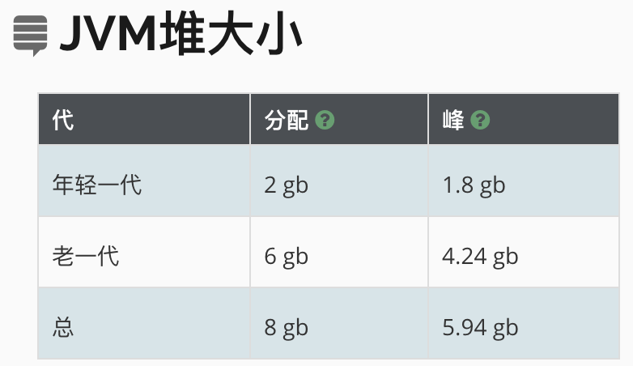
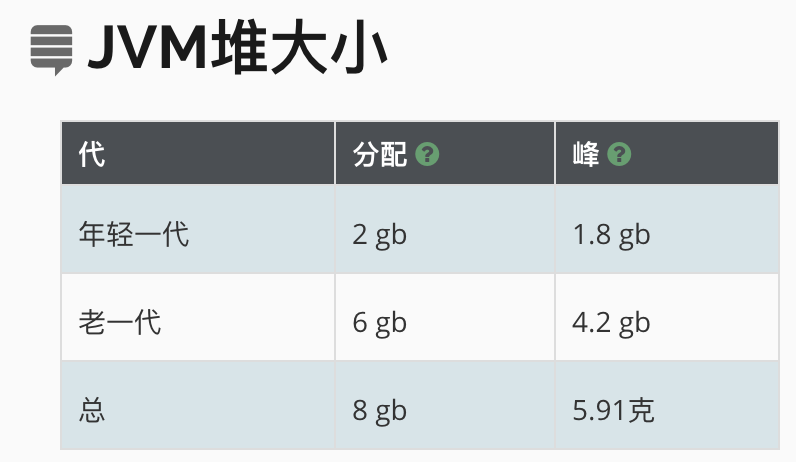
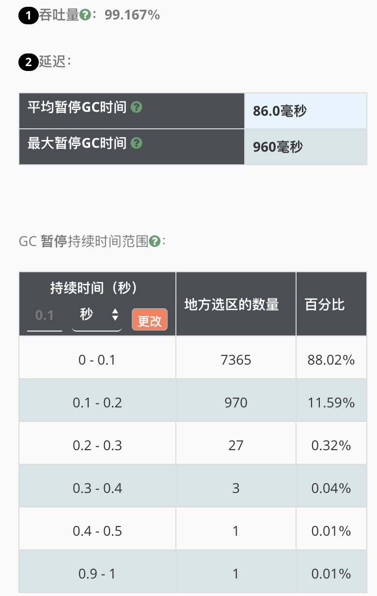
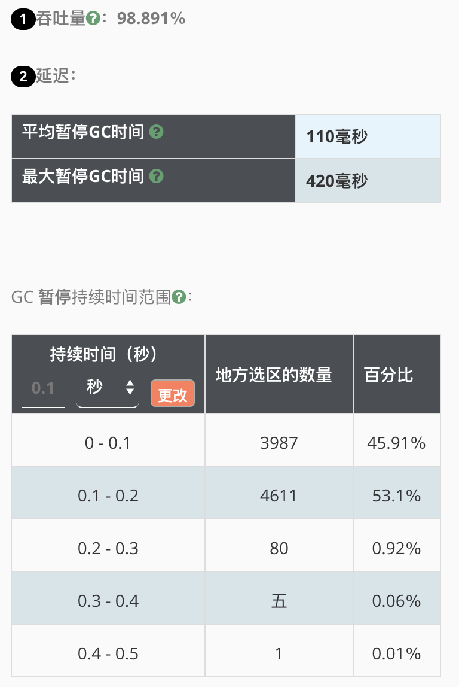

| 版本 | 内容 | 时间                   |
| ---- | ---- | ---------------------- |
| V1   | 新建 | 2023年03月28日15:29:22 |

## 现状

期望将服务器从 16 核 32G 内存降到 8 核 16G。

JVM 的参数如下：

```
java -Xms8g -Xmx8g -Xmn2g -Xss900k -XX:+ExplicitGCInvokesConcurrent -XX:+UseParNewGC -XX:+UseConcMarkSweepGC -XX:CMSInitiatingOccupancyFraction=70 -XX:+UseCMSCompactAtFullCollection -XX:CMSFullGCsBeforeCompaction=5 -XX:+PrintGCDetails -XX:+PrintGCDateStamps -XX:SurvivorRatio=8 -XX:MaxTenuringThreshold=15 -XX:+HeapDumpOnOutOfMemoryError -XX:HeapDumpPath=/data/logs/bak -Xloggc:/data/logs/gc.log.20230327_074744 -Djava.net.preferIPv4Stack=true ....省略....
```

## 对照

将一台服务器降为 8 核 16G 后，和 16 核 32G 的服务器的对照数据如下：

|                  | 16核32G内存                                                  | 8核16G内存                                                   |
| :--------------- | :----------------------------------------------------------- | :----------------------------------------------------------- |
| gc总停顿时间     | 总暂停时间12分钟                                             | 总暂停时间16分钟                                             |
| 内存分配         |  |  |
| 垃圾回收停顿时间 |  |  |

 结果对比

1. 根据配置 ParNew 回收器是 serial 的多线程版，可以充分利用 cpu 资源，减少回收时间；
2. 因为是多线程同时执行，所以 cpu 核数，对垃圾回收有一定影响，降低 cpu 配置会导致回收时间延长；

## 优化策略

### 确定目标

低延迟：系统要求在 500ms 内必须响应请求。

### 分析

1. gc 停顿时间 100~200ms 增加了 3644 次，服务的 qps 按照 1500/s 来算， gc 回收时停顿时间 100ms 到 200ms 大概影响 200 个请求（1500 * 0.15 = 200，这个应该按照平均响应时间算），计算影响请求数：200*3644 = 728800；
2. 现在高峰期，大概每 3 秒一次 gc，按照每个接口响应时间 500ms 算，500ms 过后这个请求涉及的对象都可以被回收，3 秒内存在大量可回收对象

### 解决思路

1. 垃圾回收器，每秒回收 2g 内存，肯定比回收 1g 内存的耗时长，为了达到请求的低延迟效果，可以将堆内存分配调小，让每次回收的垃圾小一点，充分利用 cpu 资源；
2. 按照 3 秒内一次 Minor 回收计算，3 秒大概 2048M 数据，如果调整成 1 秒一次垃圾回收大概需要年轻代 700M 内存，尝试将新生代改为 1G；