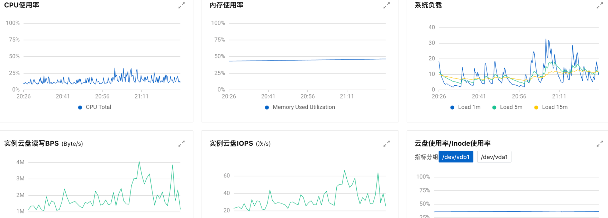
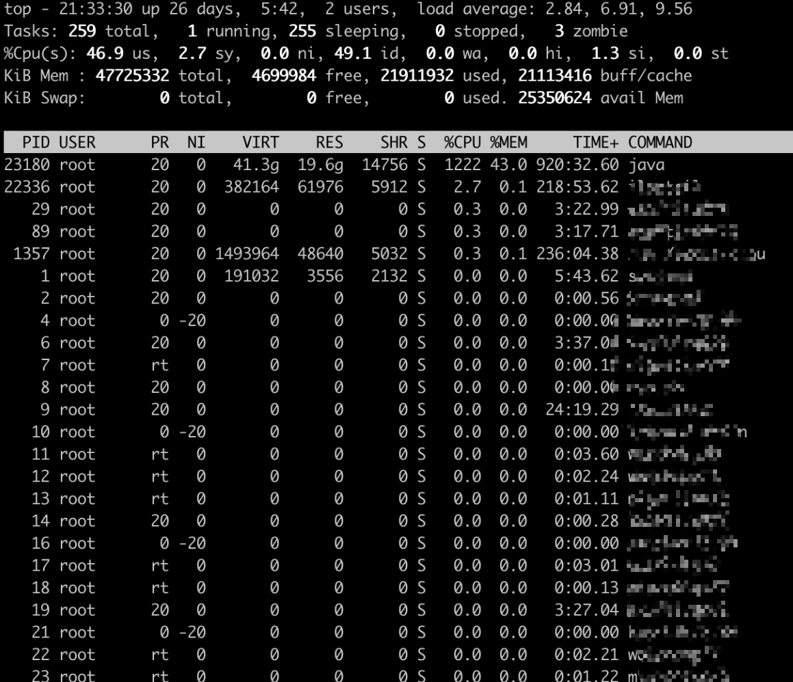
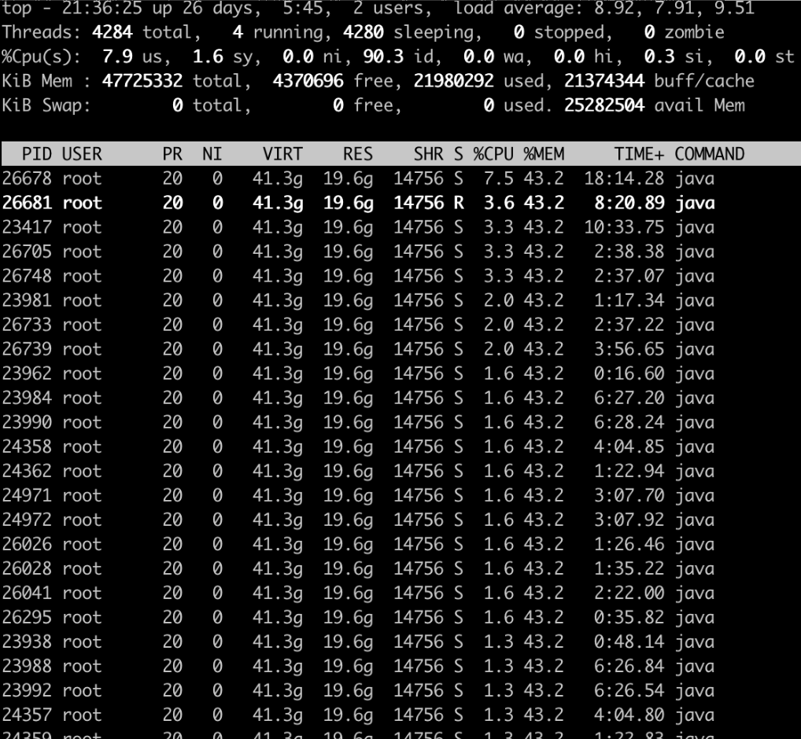
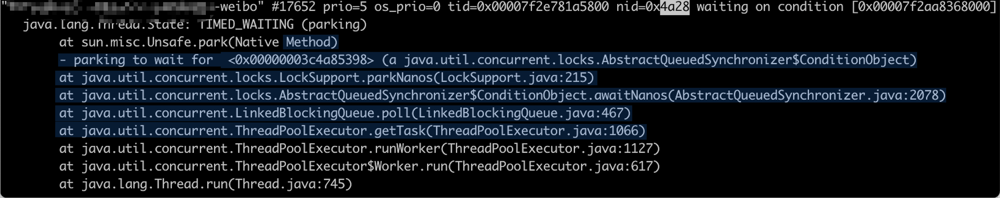
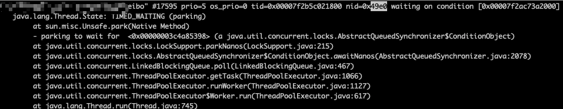
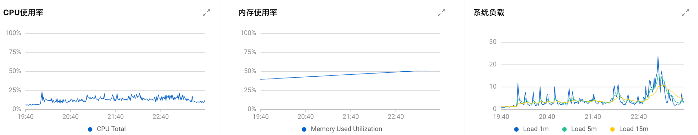
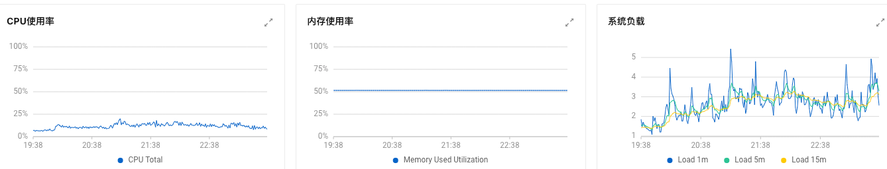

| 版本 | 内容 | 时间                   |
| ---- | ---- | ---------------------- |
| V1   | 新建 | 2023年12月19日22:36:22 |

## 现象

最近公司做服务拆分，抽出一个业务拆分出来单独部署。在晚高峰时候，新服务的服务器的『系统平均负载』很高，对应监控指标就会报警，但是『 CPU 的使用率』并不是很高。


> ps. 我们的服务器是 24 核 CPU 的，报警指标的阈值是 24 * 0.7 ≈ 17 。
>
> 关于服务器的系统负载的解释可以看看阮一峰的这个文章：[理解Linux系统负荷](https://www.ruanyifeng.com/blog/2011/07/linux_load_average_explained.html)

发现报警之后，点到控制台查看一小时内的服务器的监控信息如下：



可以看到，CPU 使用率不高、内存也充足、磁盘相关指标也正常，没有突发流量。

## 负载相关知识

Linux的负载高，主要是由于 CPU 使用、内存使用、IO 消耗三部分构成。任意一项使用过多，都将导致服务器负载的急剧攀升。比如说**带宽不足、内存不足、CPU 负载过高、硬盘满了这些都可能会导致服务器负载变高。**

可以使用 uptime 命令和 top 命令查看当前系统的负载，以 uptime 为例：

```shell
$ cat /proc/loadavg
8.51 7.64 7.96 4/29438 7761
```

每列代表的含义依次为 ：1 分钟平均 load、5 分钟平均 load、15 分钟平均 load、cpu 队列中的任务数/总任务数、最后一次运行的进程或线程 id；

**load飙高一般有三种情况**

1. cpu 使用率高，load 值高，有状态为 R 的进程
   1. 说明任务都是 cpu 密集型的，都在等待着 cpu，这种情况下说明 cpu 负载很高。
2. cpu 使用率不高，load 值高，有状态为 D 的进程
   1. 这种情况会发现进程状态为 D，说明任务为 IO 密集型的任务，都在等待 IO，这种情况下要检查 IO 设备。
3. cpu 使用率高，load 值高，系统中既有 R 状态又有 D 状态的进程
   1. 这种情况就不好判断 cpu 负载了，但是存在 D 状态的任务，就说明 IO 操作出现了阻塞，要关注一下 IO 设备情况了；cpu 负载需要排查了 D 状态进程问题后再去判断；

## 排查方向

晚高峰进入一台服务器查看 CPU 的使用率，观察一段时间后发现 CPU 飙升的现象。



分析服务中线程 cpu 使用率

```
# 实时查询java进行下线程
top -Hp 23180
```

分析 java 进程中最耗性能的线程



因为现在是晚高峰，如果查看线程可能会导致服务卡顿造成超时。所以要等第二天上午，在观察查看具体的线程

1. 登录上面机器
2. 导出线程日志
2. 执行命令：jcmd 5045 Thread.print > thread23180

查看具体工作线程名称，来判断是哪个业务导致：

| 机器ip | 线程号 | 16进制 | 线程name     | 对应java线程                                                 |
| :----- | :----- | :----- | :----------- | :----------------------------------------------------------- |
|        | 18984  | 4a28   | xxxxxx-weibo |  |
|        | 26618  | 67fa   |              | 无                                                           |
|        | 10259  | 2813   |              | 无                                                           |
|        | ....   | .....  |              | 无                                                           |
|        | 18912  | 49e0   | xxxxxx-weibo |  |

大部分线程 id 已经在当前运行中线程找不到了

定位一下上面的线程池的定义：（脱敏了）

```java
private static ThreadPoolExecutor xxxxxxWeibo = new ThreadPoolExecutorTraceId(2, 300, 10l, TimeUnit.SECONDS,
        new LinkedBlockingQueue<>(3000), new ThreadPoolExecutor.DiscardOldestPolicy());

static {
    StatLog.registerExecutor("xxxxxx-weibo", threadPoolExecutorSendMsg2Weibo);
}
```

查看两台服务器这个线程池的一天使用情况：

服务器 1：

```
2023-12-20 23:59:56:366  Thread-20 ERROR debug_stat - xxxxxx-weibo{队列任务堆积：0;完成任务数：1934717;总任务数：1934719;活跃线程数：2;历史最大活跃线程数：282;历史最大线程数：282;核心线程数：2}
```

服务器 2：

```
2023-12-20 23:59:59:512  Thread-20 ERROR debug_stat - xxxxxx-weibo{队列任务堆积：0;完成任务数：2017654;总任务数：2017655;活跃线程数：1;历史最大活跃线程数：135;历史最大线程数：135;核心线程数：2}
```

昨晚的线程今天早上大部分已经不存在了，可能因为是触发的最大线程数被回收。

存在的线程，可能是线程号被回收后由其他线程池创建，存在不准的情况。

继续分析，在晚高峰的时候实时查看线程：

```
jstack 12456 | grep 3358
```

看了几台机器都是这个线程池

| 机器ip | 线程号 | 16进制 | 线程name     | 对应java线程                                                 |
| :----- | :----- | :----- | :----------- | :----------------------------------------------------------- |
|        | 17005  | 426d   | xxxxxx-weibo | jstack 26055 \| grep 426d <br />"xxxxxx-weibo"` #18913 prio=5 os_prio=0 tid=0x00007f545801d800 nid=0x426d waiting on condition [0x00007f51d4c9c000] |
|        | 17116  | 42dc   | xxxxxx-weibo | jstack 26055 \| grep 42dc <br />"xxxxxx-weibo"` `#19023 prio=5 os_prio=0 tid=0x00007f52cc08f800 nid=0x42dc waiting on condition [0x00007f51bd766000] |
|        | 17027  | 4283   | xxxxxx-weibo | jstack 26055 \| grep 4283 <br />"xxxxxx-weibo"` `#18936 prio=5 os_prio=0 tid=0x00007f54a8012800 nid=0x4283 waiting on condition [0x00007f51c9a72000] |

## 分析

定位到这个 xxxxxx-weibo 线程池了，接下来分析为什么它会疯狂占用 CPU

```java
private static ThreadPoolExecutor xxxxxxWeibo = new ThreadPoolExecutorTraceId(2, 300, 10l, TimeUnit.SECONDS,
        new LinkedBlockingQueue<>(3000), new ThreadPoolExecutor.DiscardOldestPolicy());

static {
    StatLog.registerExecutor("xxxxxx-weibo", threadPoolExecutorSendMsg2Weibo);
}
```


记录某一时刻的线程池的状态

```
2023-12-21 21:21:52:017  Thread-20 ERROR debug_stat - xxxxxx-weibo{队列任务堆积：0;完成任务数：914595;总任务数：914596;活跃线程数：1;历史最大活跃线程数：205;历史最大线程数：205;核心线程数：2}
```

1. 线程池最大300，并没有用满，任务数并不是很多，为什么如此耗 cpu、负载？
2. 这个线程池的任务就是将自研 IM 消息通过普通的 http post 请求转发到微博。
3. 可疑点：最大活跃205，观察其它线程池日志，一般监控很难抓到活跃中的线程数量。
4. 排查线程池日志，发现【历史最大活跃线程数】大于 100 的有几个

## 优化

可能是由于频繁创建、销毁线程会导致系统负载、cpu增加。另外像这种高峰期任务数一直很多的情况下，创建线程池参数最大线程过期时间建议不低于一个小时；

xxxxxxWeibo 线程池参数调整如下：

- 将核心线程数由 2 改为 20；
- 将线程超时时间由 10 秒改为 3600 秒；（理由是高峰期任务数一直很多的情况下最大线程过期时间应该调大一点，防止频繁的创建和销毁线程）

优化前高峰期系统负载：



优化后高峰期系统负载：



## 小结

频繁创建、销毁线程会导致系统负载、cpu增加。如果某些任务的数量在某个时间段数一直很多，这种情况最大线程的过期时间建议调大一点；