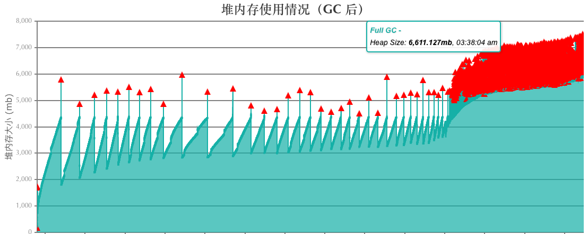
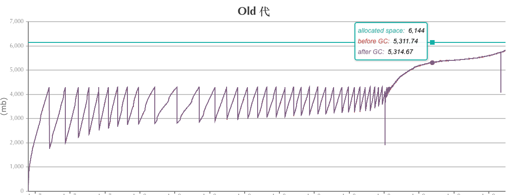
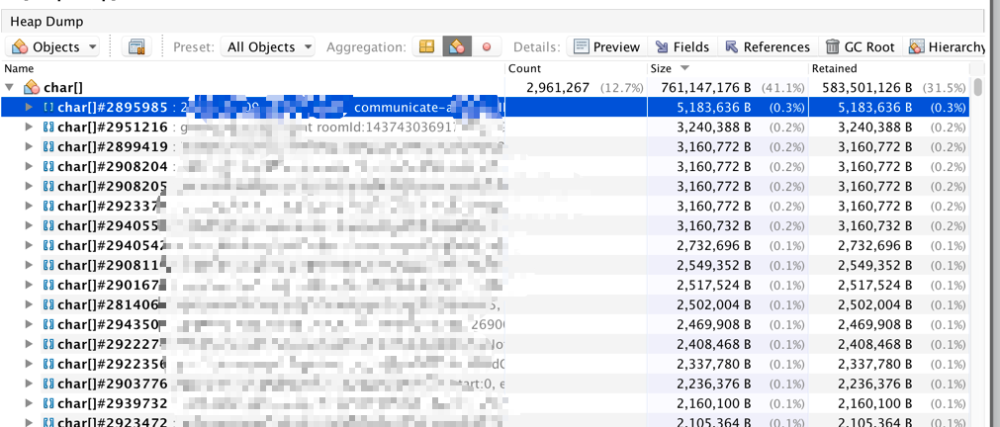
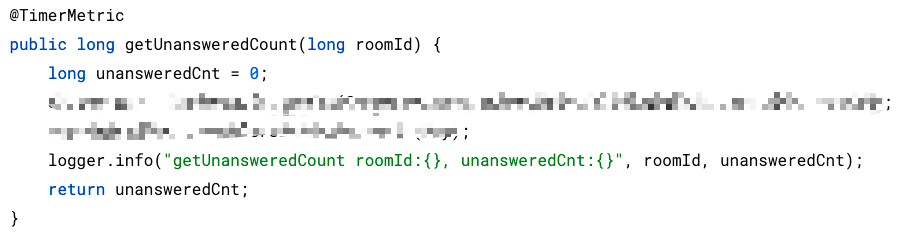
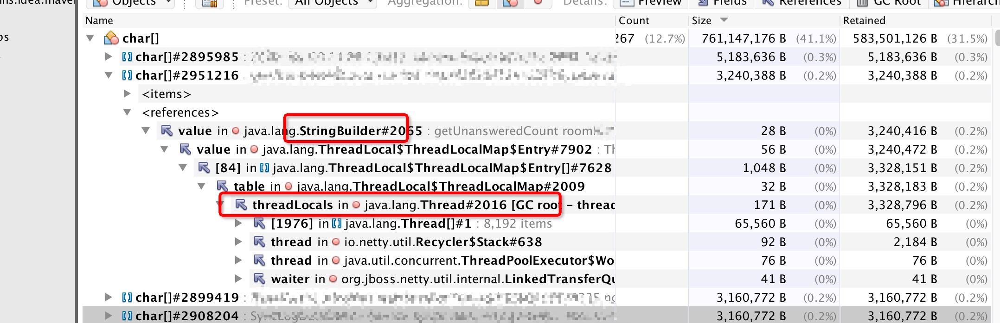
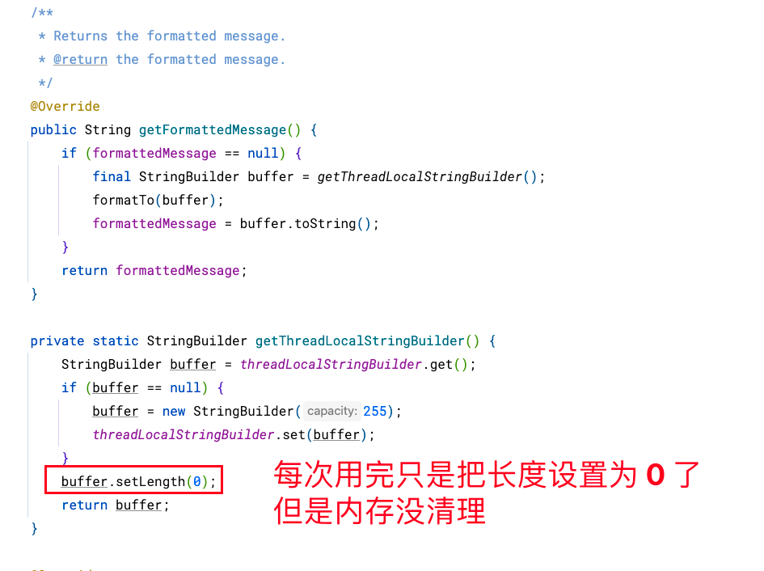
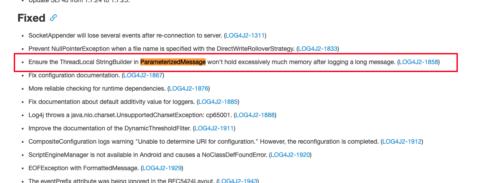
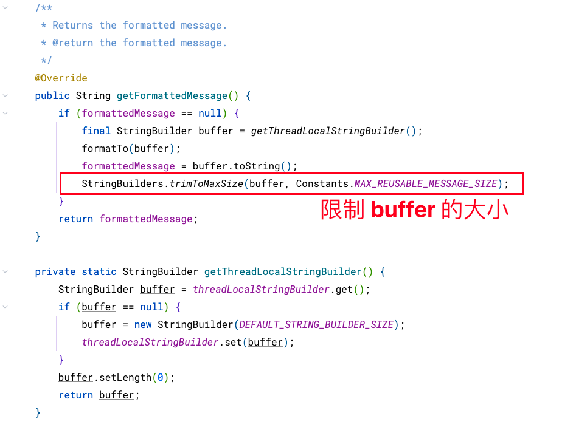

## 现象

线上服务突然发生频繁的 Full GC，并且每次 Full GC 后只回收一点点内存，老年代的内存使用率不降。

- 频繁发生 Full GC 👇🏻

- 每次 Full GC 老年代只回收了一点点内存 👇🏻

## 排查方向

第一时间下载 dump 的 prof 文件，并对将该服务器的流量切走。

## 问题排查和分析

### 定位业务代码

visualVm 发现大量 char[]。按大小排序，前面部分基本都是存储的 log 日志，大小都好几兆，怀疑是打了大日志有关，排查相关业务，关闭了一些不合理的日志。

将其中一个char[] 数组的内容拿出来看一下：

对应的代码如下：

从代码中看到，这条日志并不长，为啥这个 char[] 却好几m，而且 unansweredCnt:0  后面的日志明显跟前面的接不上, 随便找了其他的char[] 也有这种情况。

### 分析引用链路

通过 references，分析引用链路

发现日志最终缓存到 StringBuilder，而这个 StringBuilder 存储到了线程的 ThreadLocal 里面去了。

搜索 Log4j2 在什么地方使用了 StringBuilder，排查发现 org.apache.logging.log4j.message.ParameterizedMessage 这个类中有一个复用 StringBuilder 的代码，线上使用 log4j-api 的版本是 2.6.1

这段代码中 Log4j2 引用了一个 ThreadLocal 中的 StringBuilder，这样复用 StringBuilder 可以大幅提高日志输出效率，但是这段代码 buffer.setLength(0)，这个操作只会将 StringBuilder 的写入重置为从 0 开始写入，但不会回收 StringBuilder 已经占用的内存，由于当前的 ThreadLocal 是 tomcat 的线程池里的线程，线程一般不会销毁，所以 ThreadLocal 就基本没啥可能会被释放，导致StringBuilder 也不会被回收。这个 StringBuilder 的内存只会增加不会减少，由此导致内存泄漏。

## 问题解决

查看官网发现，这是一个 bug，具体地址如下：https://issues.apache.org/jira/browse/LOG4J2-1858

然后 log4j 官方在 2.9.0 版本修复了这个 bug， release note 地址：https://logging.apache.org/log4j/2.x/release-notes.html

我们决定升级到 2.12.1

可以看到新版本中增加一个操作trimToMaxSize，当 buffer 的长度大于某一直时会触发 StringBuilder 的 trimToSize 操作，这个方法会回收 StringBuilder 的缓存。

## 结论

1、某些业务打印了大量大日志，导致每个线程 threadLocal 的 StringBuilder 占用内存增大，最大达到 5m；

2、目前系统常驻线程稳定在 6000~7000，最终日志 buffer 就会占到 3~4g；

3、规范日志输出，避免磁盘、内存浪费；

4、升级 log4j2 版本，从 2.6.1 到 2.12.1；