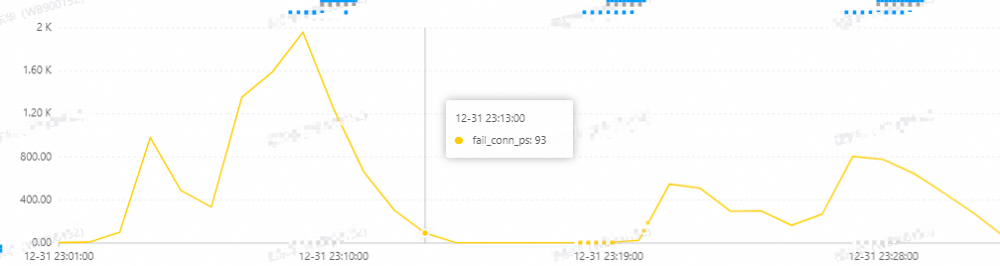
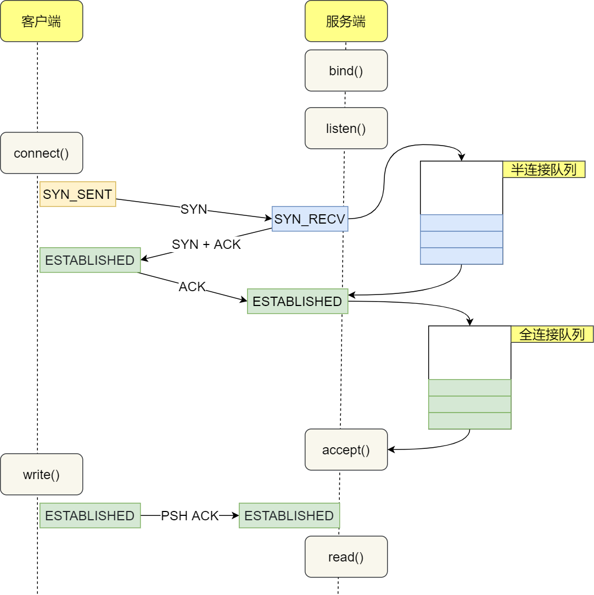
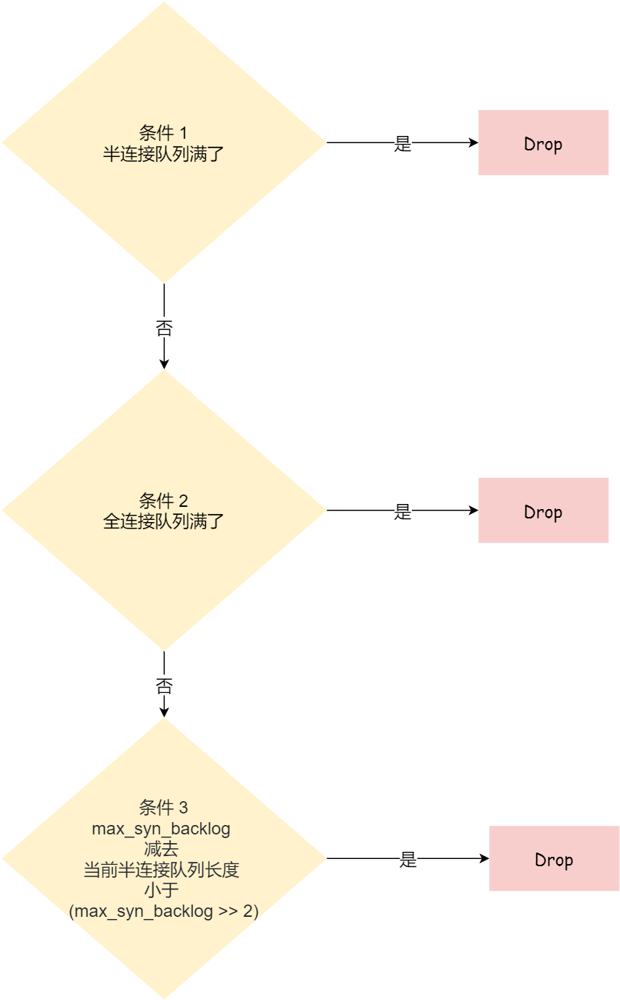
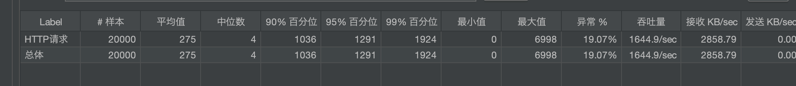
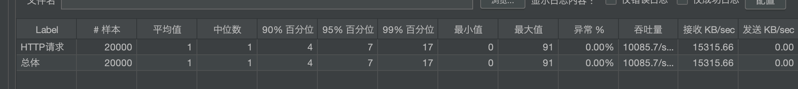
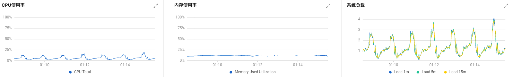
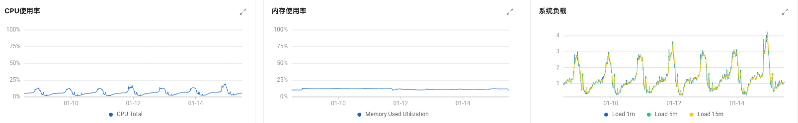

## 现象

2023 年跨年夜，一个大主播关播，大量服务异常，经客户端查看日志，是请求业务接口超时。

## 问题排查和分析

### 客户端请求路径

客户端请求路径：

```
客户端 -> 阿里云slb -> nginx -> Tomcat
```

通过日志分析，客户端请求信息并没有落到 nginx 日志，怀疑客户端到 nginx 的链路出了问题，从阿里云 slb 当时的流量以及连接数上看，并没有达到上限，咨询阿里云，阿里云的反馈是：slb 侧是有失败连接突增的，后端也出现了健康检查失败的情况，怀疑跟当时业务新建连接增加有关”



观察机器负载情况：

- nginx 机器当时的 cpu、内存、负载、网络流入流出没有异常；
- 业务服务器当时的 cpu、内存、负载、网络流入流出没有异常；

从后端机器负载上看，无明显异常，因此可判断连接异常跟业务系统无关，有可能是 nginx 机器的系统 socket 配置问题：

### 全连接队列和半连接队列丢弃请求查询

连接异常下命令查看，显示 TCP 相关的网络统计数据，并筛选出包含 "drop"、"reject"、"overflowed"、"listen" 或 "filter" 关键词的统计信息行：

```
netstat -st |egrep -i "drop|reject|overflowed|listen|filter"
```

执行一下：

```shell
netstat -st |egrep -i "drop|reject|overflowed|listen|filter"
    26771 ICMP packets dropped because they were out-of-window
    5 ICMP packets dropped because socket was locked
    11678441 times the listen queue of a socket overflowed
    13291240 SYNs to LISTEN sockets dropped
    TCPBacklogDrop: 14
```

这是从开机以来的统计，因为队列溢出，总共丢弃2千多万个连接，因为这是统计数据，不能确定是什么时候丢弃，可后续观察

其中：

- xxx times the listen queue of a socket overflowed   表示全连接队列满了
- xxx SYNs to LISTEN sockets dropped   表示半连接队列满了


半连接队列 SYN queue，长度由下面三个参数最小值决定：

- tcp_max_syn_backlog，内核参数，通过/proc/sys/net/ipv4/tcp_max_syn_backlog来设置；
- net.core.somaxconn，somaxconn 是Linux内核参数，默认128，可通过/proc/sys/net/core/somaxconn进行配置；
- 业务 tcp 调用 listen(fd, backlog) 的 backlog；

全连接队列：ACCEPT queue ， 长度由下面两者的最小值决定，也就是 min(backlog,somaxconn)

- net.core.somaxconn，somaxconn 是Linux内核参数，默认128，可通过/proc/sys/net/core/somaxconn进行配置；
- 业务的 listen(fd, backlog) 的 backlog；

> 参考地址：
>
> https://blog.csdn.net/zhangyanfei01/article/details/119881277
>
> https://www.xiaolincoding.com/network/3_tcp/tcp_queue.html#%E4%BB%80%E4%B9%88%E6%98%AF-tcp-%E5%8D%8A%E8%BF%9E%E6%8E%A5%E9%98%9F%E5%88%97%E5%92%8C%E5%85%A8%E8%BF%9E%E6%8E%A5%E9%98%9F%E5%88%97

### nginx 连接配置分析

从前面分析来看，nginx 机器存在连接丢弃情况，影响 nignx 连接的参数有：

- tcp_max_syn_backlog 半连接队列长度的一个配置项（连接中，未完成连接）
- net.core.somaxconn 全连接队列长度（已完成连接，但是没有accept）
- nginx listen 的backlog参数（调用系统listen时候的入参，会根据tcp_max_syn_backlog、net.core.somaxcon、backlog）

下图是客户端与 nginx 建立连接的过程，半连接、全连接的位置：




- client 发送 SYN 到 server，将状态修改为 SYN_SEND，如果 server 收到请求，则将状态修改为 SYN_RCVD，并把该请求放到 syns queue 队列中
- server 回复 SYN+ACK 给 client，如果 client 收到请求，则将状态修改为 ESTABLISHED，并发送 ACK 给 server
- server 收到 ACK，将状态修改为 ESTABLISHED，并把该请求从 syns queue 中放到 accept queue

**全连接队列：执行ss -lnt 全连接队列情况：**

- Recv-Q：当前全连接队列的大小，也就是当前已完成三次握手并等待服务端 `accept()` 的 TCP 连接；
- Send-Q：当前全连接最大队列长度，上面的输出结果说明监听 443 端口的 TCP 服务，最大全连接长度为 128；

当服务端并发处理大量请求时，如果 TCP 全连接队列过小，就容易溢出。发生 TCP 全连接队溢出的时候，后续的请求就会被丢弃，这样就会出现服务端请求数量上不去的现象。

当发现 TCP 全连接队列发生溢出的时候，我们就需要增大该队列的大小，以便可以应对客户端大量的请求。TCP 全连接队列的最大值取决于 somaxconn 和 backlog 之间的最小值，也就是 min(somaxconn, backlog)

**半连接队列：执行 netstat -natp | grep SYN_RECV | wc -l** 

半连接队列最大长度由系统参数tcp_max_syn_backlog 以及全连接队列状态决定：



### 验证

通过调整 nginx backlog 验证连接队列对突发连接影响，1 秒并发 2000：

backlog = 2



backlog = 128



## 问题解决

### 参数修改

通过上面分析，nginx 连接调优应该调整tcp_max_syn_backlog、net.core.somaxconn、backlog的值：

| 参数                    | 当前值 | 调整值 | 操作                                                         |
| :---------------------- | :----- | :----- | :----------------------------------------------------------- |
| **tcp_max_syn_backlog** | 262144 | 262144 | vim /etc/sysctl.confnet.ipv4.tcp_max_syn_backlog = 262144sysctl -p |
| **net.core.somaxconn**  | 128    | 1024   | vim /etc/sysctl.confnet.core.somaxconn = 1024sysctl -p       |
| **backlog(nginx)**      | 511    | 1024   | vim conf/nginx.conflisten 443 backlog=1024                   |

执行netstat -st |egrep -i "drop|reject|overflowed|listen|filter" 查看半连接、全连接队列丢弃是否有增多，以验证优化是否有效果

### 优化效果

通过一组对照机器查看优化效果，一台调整过参数值，一台还是旧的参数值。

经过一个周末，连接队列丢弃数据对比：

| ip        | 调整过参数值的机器 | 调整过参数值的机器 | 未调整过的机器 | 未调整过的机器 |
| :-------- | :----------------- | :----------------- | :------------- | :------------- |
| 日期      | 全连接丢弃         | 半连接丢弃         | 全连接丢弃     | 半连接丢弃     |
| 2024/1/12 | 11711465           | 13340388           | 11360315       | 12990207       |
| 2024/1/15 | 11712283           | 13344129           | 11373654       | 13007022       |
| 丢弃差值  | 818                | 3741               | 13339          | 16815          |

调整过参数的机器负载：



未调整参数的机器负载：



从对比结果上看，优化效果明显，优化后的丢弃连接数少很多了，负载无明显波动。

最后最终参数调整为：

net.core.somaxconn：8192

backlog(nginx)：8192

