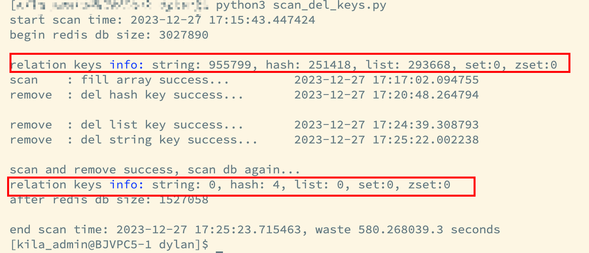

## 现象

线上有台 redis 的内存老是满了，经常发生内存淘汰，导致 redis 的命中率比较低。

## 排查方法

使用 redis 的分析工具分析 redis 的 rdb 文件。

## 问题排查和分析

经过排查发现，该 redis 本来是用来存储过期时间的 key 的，也就是 lru 的缓存，但是有些旧的逻辑没有遵守这个规则，往里面存放了未设置过期时间的 key。现在的做法就是

- 将未设置过期时间的 key 迁移到持久化功能的 redis 实例里面去；
- 清除当前 redis 上未设置过期时间的 key；

使用工具分析 redis key 的分布情况，以及是否有涉及到大 key 的，删除的时候需要注意，否则会阻塞 redis：

- 使用 redis-rdb-tools 工具（离线），地址：https://github.com/sripathikrishnan/redis-rdb-tools
- 使用 rdr 工具（离线），地址 https://github.com/xueqiu/rdr

大概了解了 redis 的 key 的分布后，就可以写脚本删除 redis key 了

## 问题解决

分批次删除大 key：

1）hash key：通过 hscan 命令，每次获取 500 个字段，再用 hdel 命令；

2）set key：使用 sscan 命令，每次扫描集合中 500 个元素，再用 srem 命令每次删除一个元素；

3）list key：删除大的 list 键，未使用 scan 命令； 通过 ltrim 命令每次删除少量元素；

4）zset key：删除大的有序集合键，和 list 类似，使用 zset 自带的 zremrangebyrank 命令，每次删除 top 100 个元素；


```python
# -*- coding: utf-8 -*-

"""
扫描 redis 实例中的 key，按照规则删除 key
"""
import datetime
import time

import redis

redis_client = redis.StrictRedis(host='127.0.0.1',
                                 port=6379,
                                 db=0,
                                 decode_responses=True)

string_key_standrd = 10000  # string key 中认为是大 key 的自定义标准

regex_str = 'random*'  # 要删除的 key 的前缀

string_keys = []  # string key 列表
hash_keys = []  # hash key 列表
list_keys = []  # list key 列表
set_keys = []  # set key 列表
zset_keys = []  # zset key 列表


def main():
    start_time = datetime.datetime.now()
    print('start scan time: %s' % start_time)
    print('begin redis db size: %d' % redis_client.dbsize())
    print()

    scan_and_fill_array()
    print('scan\t: fill array success... \t%s' % datetime.datetime.now())

    scan_and_remove_hash()
    print('remove\t: del hash key success...\t%s' % datetime.datetime.now())

    scan_and_remove_list()
    print('remove\t: del list key success...\t%s' % datetime.datetime.now())

    scan_and_remove_string()
    print('remove\t: del string key success...\t%s' % datetime.datetime.now())

    print()
    print('scan and remove success, scan db again...')
    scan_and_fill_array(False)
    print('after redis db size: %d' % redis_client.dbsize())
    print()

    end_time = datetime.datetime.now()
    waste_time = end_time - start_time
    print('end scan time: %s, waste %f.3 seconds' % (end_time, waste_time.total_seconds()))


def scan_and_fill_array(fill=True):
    """
    扫描 redis， 按照不同的类型保存到集合中
    """
    scan_iter = redis_client.scan_iter(match=regex_str, count=10000)
    keys = list(scan_iter)
    keys_count = len(keys)

    with redis_client.pipeline(transaction=False) as pipe:
        pipe_size = 1000
        idx = 0

        string_count = 0
        hash_count = 0
        list_count = 0
        set_count = 0
        zset_count = 0
        while idx < keys_count:
            old_idx = idx
            pipe_idx = 0
            while idx < keys_count and pipe_idx < pipe_size:
                pipe.type(keys[idx])
                idx += 1
                pipe_idx += 1
            key_type_list = pipe.execute()
            for key_type in key_type_list:
                if key_type == "string":
                    if fill:
                        string_keys.append(keys[old_idx])
                    string_count += 1
                elif key_type == "list":
                    if fill:
                        list_keys.append(keys[old_idx])
                    list_count += 1
                elif key_type == "hash":
                    if fill:
                        hash_keys.append(keys[old_idx])
                    hash_count += 1
                elif key_type == "set":
                    if fill:
                        set_keys.append(keys[old_idx])
                    set_count += 1
                elif key_type == "zset":
                    if fill:
                        zset_keys.append(keys[old_idx])
                    zset_count += 1
                else:
                    print('no key')
                old_idx += 1

            time.sleep(0.02)

    print('relation keys info: string: %d, hash: %d, list: %d, set:%d, zset:%d' % (
    string_count, hash_count, list_count, set_count, zset_count))


def scan_and_remove_hash():
    """
    删除 hash
    """
    pipe_size = 1000
    pipe_idx = 0
    with redis_client.pipeline(transaction=False) as pipe:
        # 遍历所有的 hash key
        for hash_key in hash_keys:
            # 获取某个 hash key 的 所有 field
            hscan_iter = redis_client.hscan_iter(hash_key, count=100)
            for field_val in hscan_iter:
                pipe.hdel(hash_key, field_val[0])
                pipe_idx += 1
                if pipe_idx > pipe_size:
                    pipe.execute()
                    pipe_idx = 0
        # 最后执行下，还有一点命令没执行
        pipe.execute()


def scan_and_remove_list():
    """
    删除 list
    """
    count = 0
    for list_key in list_keys:
        while redis_client.llen(list_key) > 0:
            # 每次只删除最右 100 个元素
            redis_client.ltrim(list_key, 0, -101)
            count += 1
            if count == 1000:
                count = 0
                time.sleep(0.01)


def scan_and_remove_string():
    """
    删除 string， 低版本没有 unlink 命令
    """
    big_string_keys = []
    str_len_list = []

    with redis_client.pipeline(transaction=False) as pipe:
        pipe_size = 1000
        idx = 0
        # 找出所有的 string key 的长度
        while idx < len(string_keys):
            pipe_idx = 0
            while idx < len(string_keys) and pipe_idx < pipe_size:
                pipe.strlen(string_keys[idx])
                idx += 1
                pipe_idx += 1
            len_list = pipe.execute()
            str_len_list += len_list

        for key_idx, str_len in enumerate(str_len_list):
            if str_len > string_key_standrd:
                big_string_keys.append(string_keys[key_idx])

        # 过滤掉我们认为的大 key
        string_keys_filter = list(filter(lambda x: x not in big_string_keys, string_keys))
        # print(len(string_keys))
        # print(len(string_keys_filter))
        # print(len(big_string_keys))

        idx = 0
        # 依次执行 del 命令，低版本没有 unlink
        while idx < len(string_keys_filter):
            pipe_idx = 0
            while idx < len(string_keys_filter) and pipe_idx < pipe_size:
                pipe.delete(string_keys_filter[idx])
                idx += 1
                pipe_idx += 1
            pipe.execute()

    if len(big_string_keys) > 0:
        print('warning!!! big string key found: %d, output to stringBigKey.txt' % len(big_string_keys))
        with open(file='stringBigKey.txt', mode='w', encoding='utf-8') as f:
            for big_string_key in big_string_keys:
                f.writelines(big_string_key + '\n')


if __name__ == '__main__':
    main()

```

执行成功，成功删除未设置过期时间的 key。



## 结果

清理完未设置过期时间的 key 后，该 redis 实例都是设置了过期时间的 key，一段时间后，该 redis 实例的命中率达到 99%。