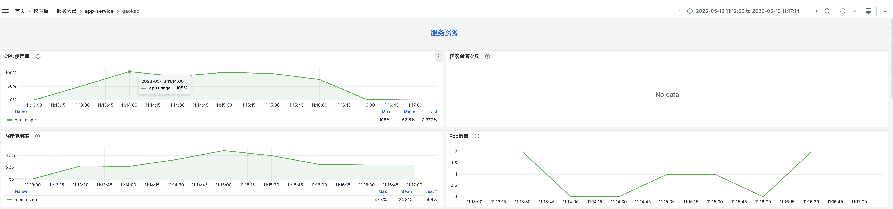

| 版本 | 内容 | 时间                   |
| ---- | ---- | ---------------------- |
| V1   | 新建 | 2026年06月23日02:40:53 |

## 确认现象

灰度环境 2 实例，压测 CPU 占用100%，需要排查原因

业务服务资源监控



## 初步猜想

CPU 打满，一般是转码、压缩、解压、序列化等问题，根据经验判断，一般业务 CPU 消耗比较高大部分是在序列化和反序列化的地方，重点关注。

## 压测定位

由于此次优化接口比较多，这里只展示一个接口的分析过程

压测：300 并发，1s 爬坡，总请求 9000


压测概览：


压测结论：

| 结论                             |                                                              |
| -------------------------------- | ------------------------------------------------------------ |
| 响应时间极差，且波动巨大         | 平均 2083ms（2 秒），但最大 95995ms（96 秒），差了近千倍     |
| 错误率超标（3.04%）              | 生产环境一般要求错误率 ≤ 0.01%，4 个 9 或者 5 个 9           |
| 吞吐量极低                       | 300 并发下，QPS 只有 142，换算下来：平均响应时间 2083ms，理论上 300 并发的极限 QPS 应该在 300 / 2 = 150 左右，说明你现在的表现已经接近极限，但这个极限太低了 |
| 接口返回数据量过大（247KB / 次） | 单次返回 247KB，每秒 143 次，就是 35MB/s，对带宽和服务端内存都是不小的压力这会放大 GC 压力、序列化耗时，拖慢整体性能 |

火焰图：


- Flat=0、Flat%=0.00%说明这个函数自身代码不耗 CPU，所有耗时都来自它调用的子函数。
- Cum=1521、Cum%=44.60%说明整个程序 CPU 采样时间的 44.6%，都花在了 DecodeResponse 这个调用链上。

## 确认根因

```go
func DecodeResponse(ctx *gin.Context, res *base.ApiResult, output interface{}) (errno int, err error) {
	var r base.DefaultRender
	if err = json.Unmarshal(res.Response, &r); err != nil {
		zlog.Errorf(ctx, "http response decode err, err: %s", res.Response)
		return errno, err
	}

	errno = r.ErrNo
	if r.ErrNo != 0 {
		returnError := base.Error{
			ErrNo:  r.ErrNo,
			ErrMsg: r.ErrMsg,
		}
		zlog.Errorf(ctx, "http response code: %d", r.ErrNo)
		return errno, returnError
	}

	if _, ok := r.Data.(map[string]interface{}); !ok {
		return errno, components.ErrorApiResp.Sprintf("resp data is not map[string]interface{}")
	}

	jsonBytes, err := json.Marshal(r.Data)
	if err != nil {
		zlog.Errorf(ctx, "Error marshaling map to JSON: %v", err)
		return errno, err
	}
	err = json.Unmarshal(jsonBytes, output)
	if err != nil {
		zlog.Errorf(ctx, "Error unmarshal JSON to struct: %v", err)
		return errno, err
	}

	return errno, nil
}
```

在先把整段响应 json.Unmarshal 到 base.DefaultRender，由于 Data 是 interface{}，data 会先被解成 map[string]interface{}。随后在又把这个 map json.Marshal 一次，再 json.Unmarshal 到目标 struct。也就是 data 走了这条链：[]byte -> map[string]interface{} -> []byte -> struct

CPU 高主要就耗在这两次额外转换上，尤其这个函数还被大量接口复用。

## 优化代码

优化代码，增加泛型的反序列化方法

```go
type responseEnvelope[T any] struct {
	ErrNo  int    `json:"errNo"`
	ErrMsg string `json:"errMsg"`
	Data   T      `json:"data"`
}

// 泛型序列化响应数据
func DecodeResponseWithGeneric[T any](ctx *gin.Context, res *base.ApiResult) (output T, errno int, err error) {
	var r responseEnvelope[T]
	if err = json.Unmarshal(res.Response, &r); err != nil {
		zlog.Errorf(ctx, "http response decode err, err: %s", res.Response)
		return output, 0, err
	}

	errno = r.ErrNo
	if r.ErrNo != 0 {
		return output, errno, base.Error{
			ErrNo:  r.ErrNo,
			ErrMsg: r.ErrMsg,
		}
	}

	return r.Data, errno, nil
}
```

重新压测：300 并发，1s 爬坡，总请求 9000

压测概览：


火焰图


压测结论：

| 指标                        | 优化前    | 优化后    | 变化                                                         |
| --------------------------- | --------- | --------- | ------------------------------------------------------------ |
| **# Samples（总请求数）**   | 98660     | 90000     | 接近，都是约 9 万次                                          |
| **Average（平均响应时间）** | 2083ms    | 1090ms    | 降低了约 **48%**                                             |
| **Min（最小响应时间）**     | 100ms     | 169ms     | 小幅上升，说明单次请求的 “底噪” 略有增加                     |
| **Max（最大响应时间）**     | 95995ms   | 51182ms   | 降低了约 **47%**，极端慢请求大幅减少                         |
| **Std. Dev.（标准差）**     | 1397.49   | 478.46    | 降低了约 **66%**，性能波动显著减小                           |
| **Error %（错误率）**       | 3.04%     | 0.00%     | 错误率清零，稳定性达标                                       |
| **Throughput（QPS）**       | 142.7/sec | 247.2/sec | 提升了约 **73%**，吞吐量大幅提升平均响应时间为 1090，理论上 300 并发的极限 QPS 应该在 300 / 1.09 = 275 左右， |

**优化效果：CPU 使用率降低 27%，吞吐量提升 73%**

## 优化效果

**注意：仅本地压测，未使用线上流量种子回放**

此次优化的效果

- CPU 降低大的接口 ：返回数据量大（ list 、 master ）， DecodeResponse 在火焰图中占比高（44.6%、7.8%~10.4%），去掉双重转换后直接释放了大量 CPU
- CPU 降低小但吞吐暴涨的接口 ：返回数据小（ info 、 school 、 employment ）， DecodeResponse 占总 CPU 比例不高，但它是 串行链路上的关键瓶颈 ——去掉后请求处理时间大幅缩短，并发能力释放，QPS 飙升


一句话总结 ：

- 数据量大的接口 ：优化效果体现在 CPU 降低
- 数据量小的接口 ：优化效果体现在 吞吐量提升


总体效果：

- CPU 使用率 ：核心接口（大数据量）累计降低约 44%+ ，整体服务 CPU 压力显著下降
- 吞吐量 ：所有接口全部正向提升 ，最高提升 840%