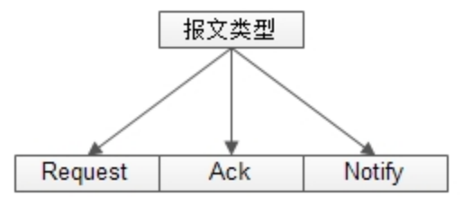
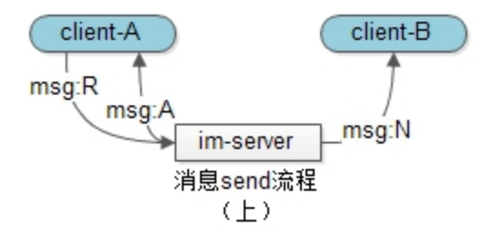
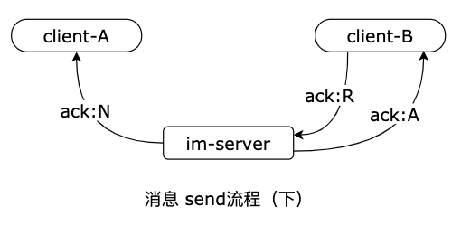
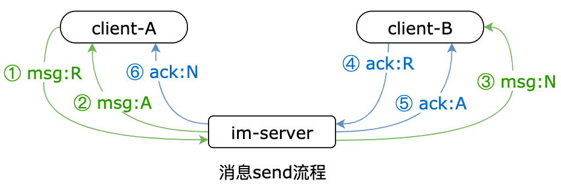
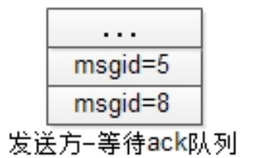
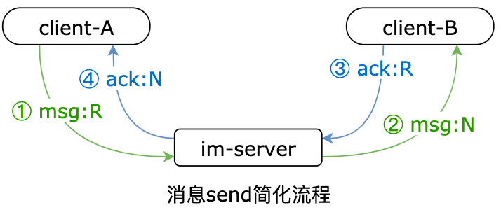

> 本节核心思路来自 http://www.52im.net/thread-294-1-1.html

 

消息的可靠性，即消息的不丢失和不重复，是IM系统中的一个难点

## 报文类型

IM 的客户端与服务器通过发送报文（也就是请求包）来完成消息的传递。

**报文分为三种：**

- 请求报文（request，后简称为 R）；
- 应答报文（acknowledge，后简称为 A）；
- 通知报文（notify，后简称为 N）;

这三种报文的解释如下：

- R：客户端主动发送给服务器的报文
- A：服务器被动应答客户端的报文，一个 A 一定对应一个 R
- N：服务器主动发送给客户端的报文

## 普通消息投递流程

**用户 A 给用户 B 发送一个“你好”，很容易想到，流程如下：**

1. client-A 向 im-server 发送一个消息请求包，即 msg:R
2. im-server 在成功处理后，回复 client-A 一个消息响应包，即 msg:A
3. 如果此时 client-B 在线，则 im-server 主动向 client-B 发送一个消息通知包，即 msg:N（当然，如果 client-B 不在线，则消息会存储离线，发送 push 推送）

这个投递流程的问题：

从流程图中容易看到，发送方 client-A 收到 msg:A 后，只能说明 im-server 成功接收到了消息，并不能说明 client-B 接收到了消息。在若干场景下，可能出现 msg:N 包丢失，且发送方 client-A 完全不知道，例如：

- 服务器崩溃，msg:N 包未发出
- 网络抖动，msg:N 包被网络设备丢弃
- client-B 崩溃，msg:N 包未接收

结论是悲观的：接收方 client-B 是否有收到 msg:N，发送方 client-A 完全不可控，那怎么办呢？

## 应用层确认 + im 消息可靠投递的六个报文

我们来参考网络传输协议的实现：UDP 是一种不可靠的传输层协议，TCP 是一种可靠的传输层协议，TCP 是如何做到可靠的？

答案是：**超时、重传、确认。**

> 实际上 IM 中，数据通讯层无论用的是 UDP 还是 TCP 协议，都同样需要消息送达保证（即 QoS）机制，原因在于 IM  的通信是 A 端 - Server - B 端的 3 方通信，而非传统 C/S 或 B/S 这种 2 方通信）。

要想实现应用层的消息可靠投递，必须加入应用层的确认机制，即：要想让发送方 client-A 确保接收方 client-B 收到了消息，必须让接收方 client-B 给一个消息的确认，这个应用层的确认的流程，与消息的发送流程类似：

1. client-B 向 im-server 发送一个 ack 请求包，即 ack:R
2. im-server 在成功处理后，回复 client-B 一个 ack 响应包，即 ack:A
3. 则 im-server 主动向 client-A 发送一个 ack 通知包，即 ack:N

至此，发送“你好”的 client-A，在收到了 ack:N 报文后，才能确认 client-B 真正接收到了“你好”。

你会发现，一条消息的发送，分别包含（上）（下）两个半场，即 msg 的 R/A/N三个报文，ack 的 R/A/N 三个报文。一个应用层即时通讯消息的可靠投递，共涉及 6 个报文，这就是 im 系统中消息投递的最核心技术（如果某个 im 系统不包含这 6 个报文，不要谈什么消息的可靠性）。

 

总体流程如下：

## 可靠投递的问题以及解决办法

### 问题

**期望六个报文完成消息的可靠投递，但实际情况下：**

- **msg:R，msg:A 报文可能丢失：**也就是 im 服务器没有接收到，此时直接提示“发送失败”即可，问题不大；
- **msg:N，ack:R，ack:A，ack:N 这四个报文都可能丢失：**（可能是服务器崩溃、网络抖动、或者客户端崩溃），此时client-A 都收不到期待的 ack:N 报文，即 client-A 不能确认 client-B 是否收到“你好”。

那怎么办呢？

### 消息超时和重传

client-A 发出了 msg:R，收到了 msg:A 之后，在一个期待的时间内，如果没有收到 ack:N，client-A 会尝试将 msg:R 重发。可能 client-A 同时发出了很多消息，故 client-A 需要在本地维护一个等待 ack 队列，并配合 timer 超时机制，来记录哪些消息没有收到 ack:N，以定时重发。

一旦收到了 ack:N，说明 client-B 收到了“你好”消息，对应的消息将从“等待 ack 队列”中移除。

### 消息重传的问题-消息去重

**msg:N报文，ack:N报文都有可能丢失：**

- **msg:N 报文丢失：**说明 client-B 之前压根没有收到“你好”报文，超时与重传机制十分有效；
- **ack:N 报文丢失：**说明 client-B 之前已经收到了“你好”报文（只是 client-A 不知道而已），超时与重传机制将导致 client-B 收到重复的消息。

> 平时使用 qq，或许大伙都有类似的体验，弹出一个对话框“因为网络原因，消息发送失败，是否要重发”，此时，有可能是对方没有收到消息（发送方网络不好，msg:N 丢失），也可能已经收到了消息（接收方网络不好，反复重传后，ack:N 依然丢失），出现这个提示时，大伙不妨和对端确认一下，看是哪种情况。

解决方法也很简单，由发送方 client-A 生成一个消息去重的 msgid，保存在“等待ack队列”里，同一条消息使用相同的 msgid 来重传，供 client-B 去重，而不影响用户体验。

## 应用层确认 + im 消息可靠投递的 4 个报文

## 小结

1. 上述设计理念，由客户端重传，可以保证服务端无状态性（架构设计基本准则）；
2. 如果 client-B 不在线，im-server 保存了离线消息后，要伪造 ack:N 发送给 client-A；
3. 离线消息的拉取，为了保证消息的可靠性，也需要有 ack 机制，但由于拉取离线消息不存在 N 报文，故实际情况要简单的多，即先发送 offline:R 报文拉取消息，收到 offline:A 后，再发送 offlineack:R 删除离线消息。

im 系统是通过超时、重传、确认、去重的机制来保证消息的可靠投递，不丢不重；切记，一个“你好”的发送，包含上半 场msg:R/A/N 与下半场 ack:R/A/N 的 6 个报文。

私聊消息是一个 1 对 1 的 ack；

群消息就没有这么简单了，群消息存在一个扩散系数，其实就可以把群消息当做是私聊消息，然后走和私聊消息一样的逻辑。