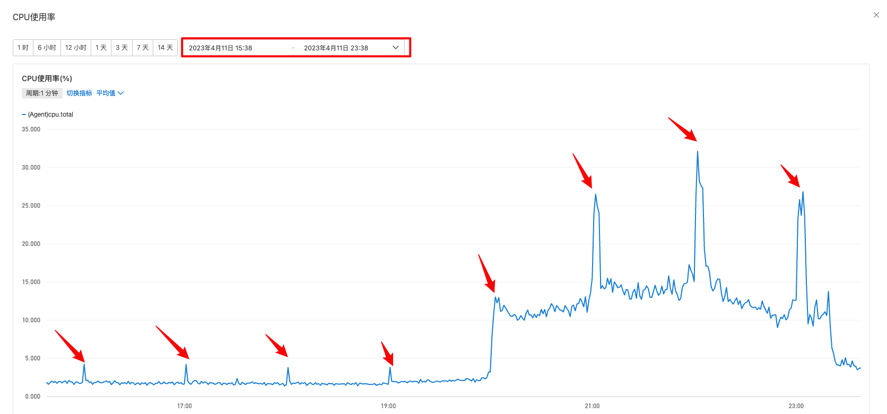
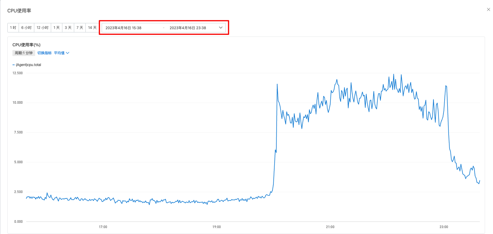
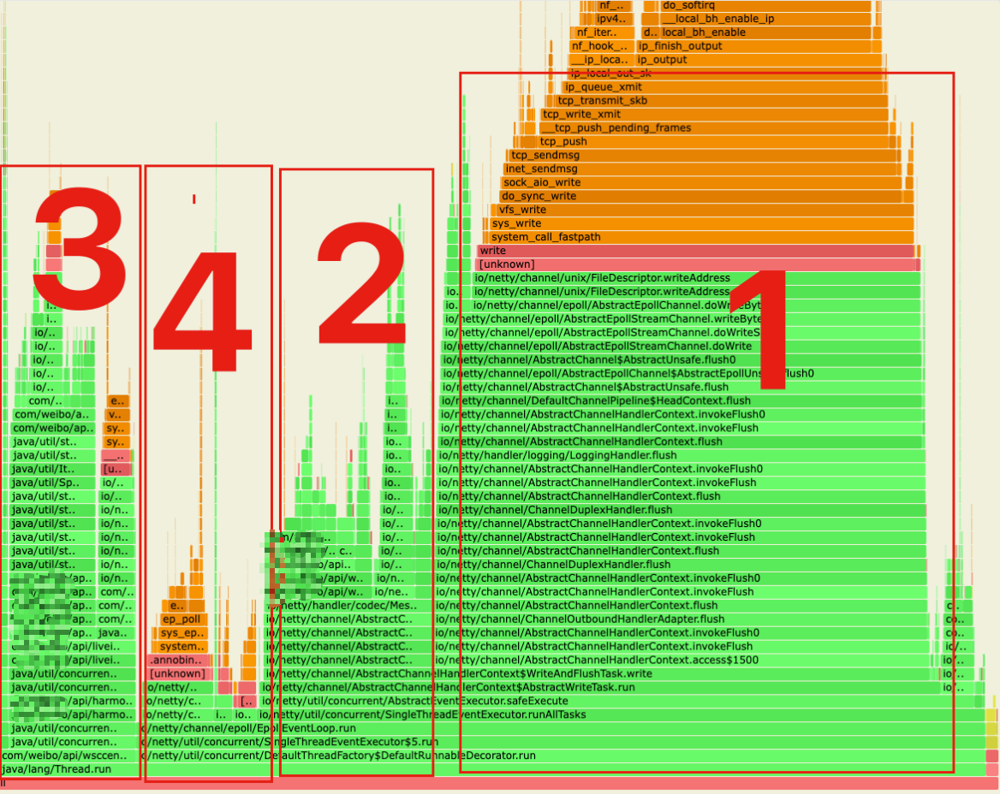
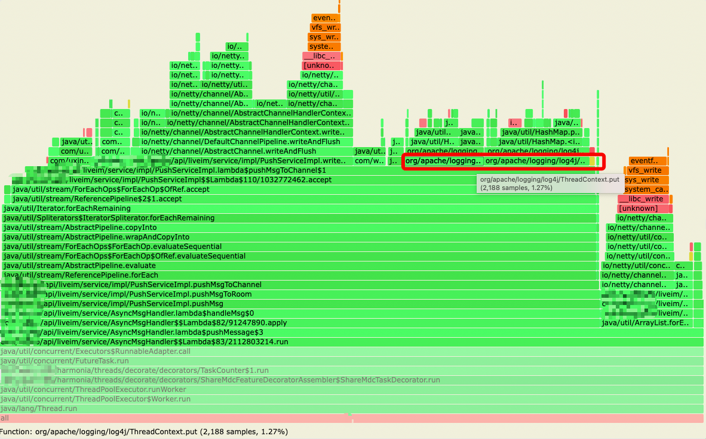
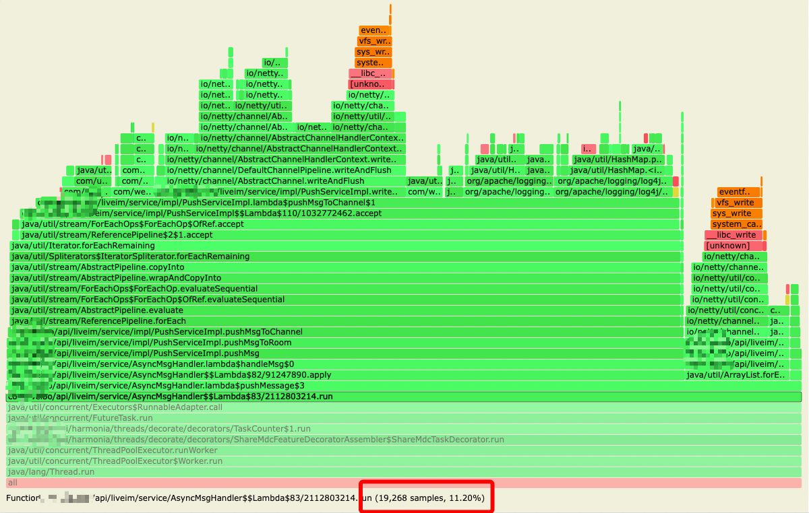
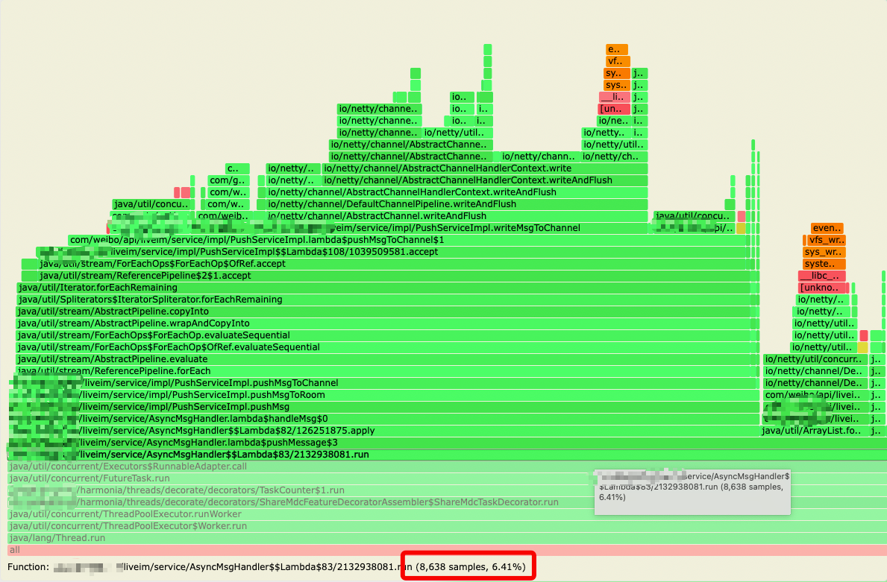
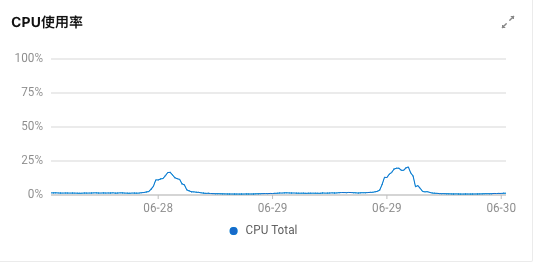
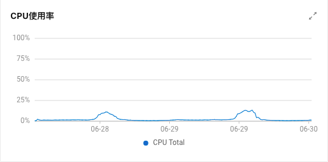

## IM 长连接 CPU 优化的背景

随着**直播间 DAU 的增长，运营活动、大主播开播**的时候经常导致 IM 服务器 **CPU 利用率暴涨到 90%**，导致消息延迟或者丢失，影响用户体验。

另外 **CPU 有规律性峰刺**，一小时一次，这个峰刺可能会导致服务器无法正常缩容。

## 优化目标

在相同场景下，降低 CPU 的使用率。

## 问题分析思路/过程

因为是 IM 的长连接的 CPU 使用率暴涨，所以需要定位到底是那一块代码导致 CPU 使用率暴涨。

<br>

**针对运营活动、大主播开播导致的 CPU 激增，大概率是业务代码中的一些操作导致的，可以做如下处理：**

- 使用 arthas 的 profiler 命令，针对长连接中发送消息的流程生成 CPU 的火焰图，观察我们的业务代码中那些环节占用的 CPU 时间最多；
- 针对发消息的流程中 CPU 占用高的那些方法，分析为何占用 CPU 的时间长；

<br>

**针对 CPU 的一小时一次的规律性峰刺**

- 初步认定是一些定时任务导致的规律性峰刺，
  - 观察业务中的定时任务，并没有发现有一小时一次的定时任务；
  - 在服务器中使用`crontab -l`命令查看定时任务列表，观察定时任务的执行时间是否与 CPU 飙升的时间相匹配，确认定时任务是做什么用的，最后发现是整点日志压缩的定时任务导致的 CPU 飙升；

- 通过观察 JVM 的 GC 信息，发现不是 full GC 导致的规律性 CPU 峰刺；

## 方案设计

### 日志打印优化、日志闲时压缩（减少 CPU 峰刺问题）

**第一：优化日志打印**

优化前的日志大小：

```
-rw-r--r-- 1 root root  853M Apr 12 21:03 connector-info.log.20230412-20.gz
-rw-r--r-- 1 root root  1.2G Apr 12 22:04 connector-info.log.20230412-21.gz
-rw-r--r-- 1 root root  1.1G Apr 12 23:04 connector-info.log.20230412-22.gz
-rw-r--r-- 1 root root  266M Apr 13 00:00 connector-info.log.20230412-23.gz
......
-rw-r--r-- 1 root root  903M Apr 13 21:03 connector-info.log.20230413-20.gz
-rw-r--r-- 1 root root  1.1G Apr 13 22:04 connector-info.log.20230413-21.gz
-rw-r--r-- 1 root root 1005M Apr 13 23:04 connector-info.log.20230413-22.gz
-rw-r--r-- 1 root root  339M Apr 14 00:01 connector-info.log.20230413-23.gz
```

优化后的日志大小

```
-rw-r--r-- 1 root root  264M Apr 15 20:59 connector-info.log.20230415-20.gz
-rw-r--r-- 1 root root  305M Apr 15 21:59 connector-info.log.20230415-21.gz
-rw-r--r-- 1 root root  310M Apr 15 22:59 connector-info.log.20230415-22.gz
-rw-r--r-- 1 root root  237M Apr 15 23:59 connector-info.log.20230415-23.gz
......
-rw-r--r-- 1 root root  226M Apr 16 20:59 connector-info.log.20230416-20.gz
-rw-r--r-- 1 root root  279M Apr 16 21:59 connector-info.log.20230416-21.gz
-rw-r--r-- 1 root root  277M Apr 16 22:59 connector-info.log.20230416-22.gz
-rw-r--r-- 1 root root  191M Apr 16 23:59 connector-info.log.20230416-23.gz
```


**第二：日志闲时压缩**

运行 `crontab -e` 命令以编辑当前用户的 crontab 文件。如果是 root 用户，可以直接编辑 /etc/crontab 文件。

目前是每小时整点压缩日志，在高峰期可能会影响业务程序。现在使用 linux 的定时任务，定时的执行脚本去压缩前一天的日志；

```shell
#!/bin/bash

log_path="/your/log/path"
date_hour=`date -d -1day '+%Y%m%d-'`

cd $log_path
for ((i=0;i<=2;i++))
do
    [ $i == 2 ] && num=3 || num=9
    for ((j=0;j<=${num};j++))
    do
        filename="xxxxxxxx.log.${date_hour}${i}${j}"
        if [ -f $log_file ] ; then
            cpulimit --limit=10 gzip $filename
        fi
    done
done
```

> `cpulimit` 是一个用于限制进程的 CPU 使用率的命令行工具。它允许你控制某个进程在运行时所占用的 CPU 资源，从而避免过度使用 CPU 导致系统负载过高。
>
> ·其中 `<command>` 是要执行的命令或进程的名称。
>
> `cpulimit` 工具的原理是通过不间断地暂停和恢复进程的执行来实现 CPU 限制。它并非精确地限制了进程的绝对 CPU 时间，而是通过周期性地挂起和恢复进程来控制其 CPU 占用率。


小结：CPU 峰刺消失了有两个原因

1. 运维写脚本将日志放到闲时（凌晨 4 点）压缩；
2. 删除长连接写数据循环里面的 info 日志；

以一台机器为例，整点时间压缩日志导致 CPU 飚高



脚本压缩日志和移除写循环 info 日志后，已经没有明显的峰刺了



### 消息重复编码问题

以下为长连接服务火焰图，图中分为 4 大区域

1. channel flush 部分
2. channel write 部分
3. AsyncMsgHandler 部分，读取 redis 数据，写入 channel
4. EpollEventLoop.epollWait 事件循环



区域 2 中发现主要耗时在自定义编码器的 xxxxxxProtocolEncoder.encode 方法，而 encode 方法中主要逻辑是对下发的数据进行 protocol 编码。

**通过 review 代码，发现同一个房间的 channel 下发的数据是完全一致的，没有必要给每个 channel 做编码，可以把编码工作提前到下发之前，即在生成下发数据的时候就做好编码，这样在 encode 里就不需要编码（相当于把循环里的操作挪到循环外）**

优化效果

| 策略                                    | 房间人数 | 下发并发 | cpu利用率 | xxxxxxProtocolEncoder.encode cpu占比 |
| :-------------------------------------- | :------- | :------- | :-------- | :----------------------------------- |
| `xxxxxxrotocolEncoder 有protocol 编码`  | 4000     | 58000    | 370%      | 10.67%                               |
| `xxxxxxProtocolEncoder 无protocol 编码` | 4000     | 58000    | 320%      | 1.49%                                |

### 日志的 filter（针对不同的 uid 打印不同级别的日志）

**现状：**

长连接消息订阅成功率：订阅消息成功 / (订阅消息成功 + 订阅消息失败) = 228965095 / (228965095 +165 ) = 99.9999%

丢弃原因：收到消息后，扔到线程池处理，如果线程池满后直接丢弃（线程池满了就说明线程池处理能力不够了）

**优化分析：**

线程池不够用有下面优化方向：

1. 优化线程池参数；
2. 优化单个任务的处理时间，也就是缩短消息处理的时间；
3. 针对业务消息类型的不同区分线程池，比如优先级高，或者说比较重要的消息用大的线程池，其他的类型的消息使用一个稍微小点的线程池。

针对上面的第 2 点，通过火焰图发现，log4j.ThreadContext.put('uid',xxxx) + log4j.ThreadContext.remove('uid') 占了整个处理流程的 30% 的 cpu 时间，整个订阅处理流程占总cpu使用率的11.2%：



<br>



通过代码分析，该处代码本意是用来做 log4j 的 filter，针对特定 uid 打印的日志调整级别，但在 put 和 remove 之间并无日志输出，特定 uid 也不存在，因此可以移除这部分代码，整个订阅处理流程占总 cpu 使用率的 6.4%：



## 效果分析

| 线上机器                                                     | 灰度机器（已优化）                                           |
| ------------------------------------------------------------ | ------------------------------------------------------------ |
|  |  |

小结：通过

- 优化日志打印，日志闲时压缩；
- 房间消息在 Netty 消息出站前统一编码；
- 移除 log4j 的 filter 根据特定 uid 打印不同级别的日志；

线上机器高峰期 cpu 使用率 20%，灰度机器 13%，也就是优化后 CPU 下降了 7%。

## 优化总结

- 使用 arthas 的 profiler 命令，针对长连接中发送消息的流程生成 CPU 的火焰图，观察我们的业务代码中那些环节占用的 CPU 时间最多；
  - 发现同一个房间下发的消息，目前线上的逻辑是给每个用户的 channel 都单独编码了一次，由于编码是非常耗 CPU 的一个操作。如果一个房间有 10w 人每发一个消息就回编码 10w 次。将 10w 次改为 1 次，减少了大量的 CPU 使用率；
- 分析出日志定时压缩导致 CPU 峰刺，让运维写脚本在闲时压缩，防止高峰期日志压缩影响业务；
- 优化日志打印，删除不合理的日志打印；
- 因为处理下推消息的线程池老是丢弃任务，通过分析任务的 CPU 的火焰图；
  - 火焰图发现，og4j.ThreadContext.put('uid',xxxx) + log4j.ThreadContext.remove('uid') 占了整个处理流程的 30% 的 cpu 时间，整个订阅处理流程占总 cpu 使用率的 11.2%；
  - 原来的代码使用 log4j 的 filter，针对特定 uid 打印的日志调整级别，但在 put 和 remove 之间并无日志输出，特定uid 也没有配置，因此可以移除这个代码，整个订阅处理流程占总 cpu 使用率的 6.4%：
- 对于线程池老是丢任务，根据消息的优先级区分使用不同的线程池；