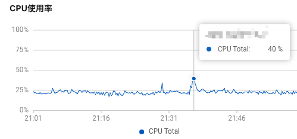

## 背景

### 现状

平台的主播开播关播，用户会调用很多接口获取直播间的一些信息。在直播间人数少的情况下，对服务影响不大。

随着 DAU 的上升，有些大主播的直播间的任务非常多。大主播开播、关播，用户同时进入直播间和进入休息室会有大量的接口调用，导致系统 QPS 激增。QPS 激增对系统的冲击比较大，其中表现就是给后端服务器、Redis、DB 等服务的 CPU 会激增。

为了应对突发流量，设计了直播间的开播和关播时的多级缓存优化。

### 数据体现

以一台服务为例，在关闭直播间的一瞬间时 CPU 的



|            | 单机QPS | 总QPS   |
| :--------- | :------ | :------ |
| 关播前整体 | 1.46K   | 44.07K  |
| 关播瞬间   | 4.05K   | 122.24K |

## 优化目标

降低主播开播关播操作时后端服务器的 CPU 的使用率。

## 问题分析思路、过程

### 定位是那些接口导致的 CPU 激增

通过观察 CPU 激增的时间段，以及对应时间的接口的 QPS 监控，发现一些接口的 QPS 瞬间激增。

- 梳理这一瞬间 QPS 激增的接口路径，发现很大一部分接口是客户端在用户进入直播间和退出直播间时需要调用的接口；
- 梳理开播、关播后 3min 内访问高的接口对比；

大主播开播 QPS 激增相关接口举例：

| 接口                           | 开播前 QPS | 开播瞬间 QPS | 开播后 QPS |
| ------------------------------ | ---------- | ------------ | ---------- |
| 查询直播间信息                 | 500        | 10000        | 1000       |
| 客户端轮询接口，查询统计信息等 | 300        | 3000         | 600        |
| 进入直播间接口                 | 100        | 5000         | 300        |

大主播关播 QPS 激增相关接口举例：

| 接口             | 关播前 QPS | 关播瞬间 QPS | 关播后 QPS |
| ---------------- | ---------- | ------------ | ---------- |
| 听众结束直播接口 | 0          | 9000         | 1000       |
| 查询直播间信息   | 400        | 6000         | 800        |
| 直播间在线人数   | 100        | 7000         | 4000       |

### 定位接口中的那部分导致 CPU 激增

在灰度环境模拟，使用 skywalking 看一下这些接口的跨度，梳理接口的逻辑。

目前系统中有基本上所有数据都有 Redis 缓存层，但是 QPS 调用量大的接口里面可能需要查询各种各样的信息，导致接口的跨度比较大，可能会查询很多次 Redis 或者 DB。


## 方案设计

### 方案梳理

1. 降低接口跨度和响应事件：
   1. 重写业务逻辑降低查询次数；
   2. 优化循环查询，不支持的数据结构进行改造；
   3. 废弃冗余逻辑和老版本逻辑；
   4. 使用线程池异步处理任务；
2. 将一些接口的响应结果存放在缓存里面：
   1. 对于数据实时性不高的接口数据，将接口结果直接放入缓存 n 秒；
   2. 对于要求实效的接口，梳理是否有可以缓存起来的数据，实时查询和缓存结合；
3. 客户端下掉不必要的接口调用，取消查询客户端不需要的字段：
   1. 梳理重复调用和不需调用的接口，让客户端不再调用；

### 最终方案

最终的方案是：

- 将大主播开关播使用的接口数据整合到 Redis 和本地缓存中；
- 在开播、关播、数据变更时预先加载数据至缓存中，同时定时刷新缓存数据；
- 减少不必要接口调用，精简接口字段；
- 缓存采用「算法路由+多节点负载」的架构，保证请求均匀分发到多个实例，避免单点压力；


数据预热：开播，关播时提前刷新好 redis 缓存。

- 开播时倒计时几秒开播，在这几秒钟内做数据预热；
- 关闭时倒计时几秒关播，在这几秒钟内做数据预热；
- 因为关播用户会全部直接涌入休息室，让客户端在主播关闭时，用户 5 秒钟之内随机调用进入休息室的逻辑；

### 本地缓存回种超时优化（异步刷新）

背景：礼物的数据更新的频率不高，使用本地缓存去存储，但是假如本地缓存过期回种的时候只会允许一个线程去刷新数据，其他线程就会等待，导致 RPC 超时，给用户不好的体验。

优化：针对礼物这种静态数据但请求量大的业务场景，通过异步刷新本地缓存 , 保证本地缓存的数据是最新的。

- 查询时先获取上次刷新的时间，如果到了需要刷新的时间仍然返回缓存中的结果，同时启动异步刷新缓存的任务；
- 这样可以避免在用户请求线程中回种导致用户请求超时；
- 例如有些业务，比如查询主播自定义礼物单次从查询回种需要查询 1900+ 条数据回种必然超时，可以使用这个工具类异步刷新本地缓存；

主要优化思路：

- 一个业务需要保存两个本地缓存的 key，一个实际数据和上次刷新时间；
- 如果从本地缓存没有获取到数据，那么还是要同步等待数据刷新；
- 如果从本地缓存获取到了数据，但是距离上次刷新时间已经到期了。此次会返回旧数据，然后异步刷新数据；

部分代码如下：

```java
public V get(K key , Callable<V> call){
    // 获取缓存值
    V value = (V) cache.getIfPresent(key);
    // 获取缓存的刷新时间
    Long refershTime = (Long) cache.getIfPresent(key.toString() + EXPIREKEY);

    if (value == null) {
        if (call == null) {
            return null;
        }
        if (refershTime == null) {
            logger.warn("init cache key {} current size {}", key , cache.size());
        }
        return refresh(key, call);
    }

    // 判断缓存是否需要刷新，如果需要刷新就异步刷新
    if (needRefresh(key) && call != null) {
        executor.execute(() -> refresh(key,call));
    }

    // 无论缓存是否过期都返回一份数据
    return value;
}
```

## 效果分析

降低主播开播关播操作时后端服务器的 CPU 的使用率，已经没有明显峰刺了。

## 优化总结

本地缓存的问题

问题：本地缓存会出现 「数据漂移」的现象。具体体现为集群中的多个服务中的本地缓存的刷新时机不一样，两台机器内的本地数据的不一样，用户两次请求分别打到了这两个机器上，导致用户看到的效果不同。

解决：无法解决，使用本地缓存的场景就是为了存储数据变更频率不高的场景，那么对这种数据不一致性是可以接受的。