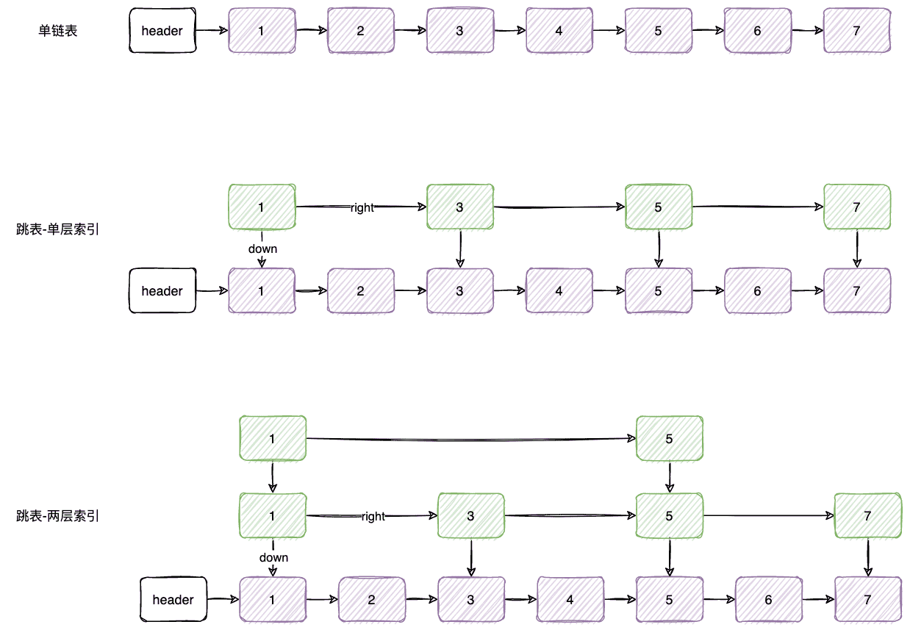
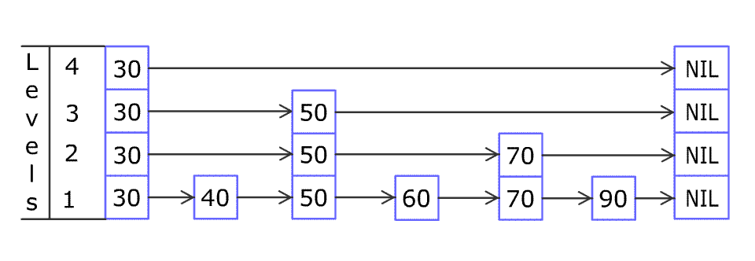

## 内存模型相关

### 物理硬件和操作系统的内存模型

1. 计算机的**存储设备**和**处理器**的**运算速度**有几个数量级的差距，所以现代计算器都不得不加入一层或多层读写速度尽可能接近处理器的运算速度的**高速缓存来作为内存和处理器之间的缓冲**：将运算需要使用的数据复制到缓存中，让运算能快速运行，当运算结束后再从缓存同步回内存之中，这样处理器就无须等待缓慢的内存读写了；
2. 引入**高速缓存**带来一个新的问题，就是**缓存一致性问题**。在多路处理器系统中，**每个处理器都有自己的高速缓存，而它们又共享同一主存**，这种系统称为共享内存多核系统，当多个处理器运算任务都涉及同一块主内存区域时，将可能导致各自的缓存数据不一致；
3. 为了使处理器内部的运算单元能被充分利用，**处理器可能会对代码进行乱序执行优化**，处理器会在计算之后将乱序执行的结果重组，保证该结果与顺序执行的结果是一致的，但并不保证程序中各个语句计算的先后顺序与输入代码中的顺序一致，因此如果存在一个计算任务依赖另一个计算任务的中间结果，那么其顺序性并不能依靠代码的先后顺序来保证；

### Java 内存模型-主内存和工作内存


1. 此处的变量含义是，实例字段、静态字段和构成数组对象的元素，但是不包括局部变量和方法参数，因为后者是线程私有的；
2. **Java 内存模型**规定了**所有的变量都存在主存**，每个**线程**又自己的**工作内存**，线程的工作内存保存了被该线程使用的**变量的主内存副本**（这个对象的引用、对象中某个线程访问到的字段有可能是被复制的，但是不会把虚拟机整个对象复制一次），**线程对变量的所有操作（读取、赋值等）都必须在工作内存中进行**，而不能直接读写主存中的数据。不同的线程之间也无法直接访问对方工作内存中的变量，线程建变量值的传递均需要通过主存来完成；

### Java 内存模型 - 内存间交互操作

关于主存和工作内存间的具体交互协议，即一个变量如何从主存拷贝到工作内存、如何从工作内存同步回主存这一类的实现细节。Java 虚拟机实现时必须保证下面提及的每一种操作都是原子的；

| 命令   | 作用范围       | 作用                                                         |
| ------ | -------------- | ------------------------------------------------------------ |
| lock   | 主存的变量     | 把一个变量标识为一个线程独占的状态                           |
| unlock | 主存的变量     | 把一个处于锁定状态的变量释放出来，释放后的变量才可以被其他线程锁定 |
| read   | 主存的变量     | 把一个变量的值从主存传输到线程的工作内存中，方便后续 load    |
| load   | 工作内存的变量 | 把 read 操作从主存中得到的变量值放入到工作内存的变量副本中   |
| use    | 工作内存的变量 | 把工作内存中的一个变量的值传递给执行引擎                     |
| assign | 工作内存的变量 | 把一个从执行引擎接收的值赋值给工作内存的变量                 |
| store  | 工作内存的变量 | 把工作内存中一个变量的值传送到主内存中，方便后续 write       |
| write  | 主内存的变量   | 把 store 操作从工作内存中得到的变量的值放入主存的变量中      |

执行上述 8 种基本操作时需要满足下面的规则：

1. 不允许 read 和 load 单独出现，不允许 store 和 write 单独出现；
2. 不允许一个线程丢弃它的 assign 操作，也就是说变量在工作内存中改变了之后必须把该变化同步到主存；
3. 不允许一个线程无原因（没有做 assign 操作）的把数据从线程的工作内存同步到主内存中；
4. 对一个变量的 use 和 store 操作之前，必须限制性 assign 和 load 操作；
5. 一个变量在同一时刻只允许一条线程对其进行 lock 操作，但 lock 操作可以被同一条线程执行多次，多次 lock 后，只有执行相同次数的 unlock 操作，变量才会被解锁；
6. 如果对一个变量执行 lock 操作，那么将会情况工作内存中此变量的值，在执行引擎使用这个变量前，需要重新执行 load 和 assign 以初始化变量的值；
7. 如果一个变量没有被 lock 操作，那么就不允许对它执行 unlock 操作，也不允许去 unlock 一个被其他线程锁定的变量；
8. 对一个变量执行 unlock 之前，必须先把此变量同步回主存中（store、write）;

## 线程的实现和调度

### 线程的实现？Java 的线程是怎么实现的？

实现线程主要有三种方式，使用**内核线程**实现（1:1 实现），使用**用户线程**实现（1:N 实现），使用**用户线程加轻量级进程混合**实现（N:M）实现。

1. **内核线程实现**：
   1. 内核线程是**直接由操作系统内核支持的线程**，这种线程由**内核来完成线程切换**，内核通过操纵调度器对线程进行调度，并负责将线程的任务映射到各个处理器上。
   2. 程序一般不会直接使用内核线程，而是使用内核线程的一种高级接口——轻量级进程，**轻量级进程**就是我们通常意义上的线程，由于每个轻量级进程都由一个内核线程支持，因此只有先支持内核线程，才能有轻量级进程。由于内核线程的支持，每个轻量级进程就成为一个独立的调度单元，即使其中某一个轻量级进程在系统调用中被阻塞了，也不会影响整个进程继续工作。
   3. 轻量级进程也具有它的局限性，因为它是基于内核线程实现的，**所以各种线程操作，比如创建、析构和同步，都需要进行系统调用，而系统调用的代价相对较高，需要在用户态和内核态之间来回切换。**其次每个轻量级进程都需要一个内核线程支持，因此轻量级进程要**消耗一定的内核资源**，因此一个系统支持的轻量级进程的**数量是有限的**；
2. **用户线程实现**：
   1. 完全建立在用户空间的线程库上，系统内核不能高指导用户线程的存在和如何实现的；
   2. **用户线程的建立、同步、销毁和调度完全在用户态中完成，不需要内核的帮助**。如果程序实现得当，这种线程不需要切换到内核态，因此操作可以是非常快速且低消耗的，也能够支持规模更大的线程数量，部分高性能数据库中的多线程就是由用户线程实现的；
   3. 用户线程的优势在于不需要系统内核支援，劣势也在于没有系统内核的支援，所有的线程操作都要由用户程序自己去处理。线程的创建、销毁、切换和调度都是用户必须考虑的问题，而且由于操作系统只把处理器资源分配到进程，那诸如“阻塞如何处理”这类问题解决就比较麻烦；
3. **混合实现**：
   1. 线程除了依赖内核线程实现和用户程序自己实现以外，还有一种将内核线程与用户线程一起使用的实现方式；
   2. 既存在内核线程，也存在轻量级进程。用户线程还是完全建立在用户空间中，用户线程的建立、同步、销毁等操作依然廉价，并且可以支持大规模的用户线程并发、而操作系统支持的轻量级进程则作为用户线程和内核线程之间的桥梁，这样可以使用内核提供的线程调度功能以及处理器映射，并且用户线程的系统调用要通过轻量级进程来完成，这大大降低了整个进程被完全阻塞的风险；

对于 Java 来说，Java 线程的如何实现并不受 Java 虚拟机规范的约束，这是一个与具体虚拟机相关的话题。早期的 Classic 虚拟机上用的是用户线程。后面出现的主流虚拟机用的都是操作系统的原生线程模型来实现。

### Java 线程调度？

调度方式主要分为两种，协同式线程调度和抢占式线程调度。

1. **协同式线程调度**：**线程的执行时间由线程本身来控制，线程把自己的工作执行完之后，要主动通知系统切换到另外一个线程上去**。优点就是实现简单，而且由于线程要把自己的事情干完之后才会进行线程切换，切换操作对线程自己是可知的，所以一般没有什么线程同步的问题。缺点也很明显，线程执行时间不可控制，甚至如果一个线程的代码编写有问题一直不告知系统进行线程切换，那么程序就会一直阻塞在哪里；
2. **抢占式调度**：**每个线程将由系统来分配执行时间，线程的切换不由线程本身控制**。在 Java 中 Thread::yield() 方法可以主动让出执行时间，但是如果想要主动获取执行时间，线程本身是没有什么办法的，在这种实现线程调度的方式下，线程的执行时间是系统可控的，也不会有一个线程导致整个进程甚至整个系统阻塞。Java 用的就是抢占式调度；

### Java 与协程？

1. **内核线程的局限**：1:1 的内核线程模型是如今 Java 虚拟机的主流选择，但是这种映射到操作系统上的线程天然的缺陷是**切换、调度成本高昂，系统能容纳的线程数量也有限**；
2. **内核线程的调度成本**：主要来自于**用户态和内核态之间的状态切换，而这两种状态切换的开销主要来自于响应中断、保护和恢复执行现场的成本**。处理器要执行线程 A 的程序代码时，并不是仅有代码程序就能够跑得起来，程序是数据和代码的组合体，**代码执行还必须要有上下文数据的支撑**。这里说的“上下文”是以程序员的角度来看的，是方法调用过程中的各种局部变量与资源；以线程的角度来看，是方法的调用栈中存储的各类信息；而以操作系统和硬件的角度来看，则是存储在内存、缓存和寄存器中的一个个具体数值。物理硬件的各种存储设备和寄存器是被操作系统内所有的线程共享的资源，当中断发生，线程 A 切换到线程 B 去执行之前，操作系统首先要把线程 A 的上下文数据保存好，然后把寄存器、内存分页等恢复到线程 B 挂起的时候的状态；
3. **协程（Coroutine）是一种轻量级的线程，是一种用户态的线程**。与线程不同的是，协程不需要操作系统的支持，可以在用户空间中实现，因此协程的切换速度比线程更快，消耗的资源也更少。协程的特点是：
   1. 协程是轻量级的，可以在单个线程中创建多个协程，从而实现高并发。
   2. 协程的切换速度比线程更快，因为协程的切换不需要切换到内核态，只需要在用户态中进行切换。
   3. 协程之间的切换是协作式的，即只有当前协程主动让出执行权时，才会切换到其他协程。
4. Loom是Java的一个实验性项目，旨在改善Java的并发编程模型，提供更好的协程支持；

## 并发编程的三大特性

### 并发编程的三大特性

1. **原子性**：指一个操作是不可分割的，要么全部执行成功，要么全部不执行。**在并发编程中，原子性是指对共享变量的操作是原子的，即多个线程同时访问共享变量时，每个线程都能够看到该变量的最新值**；
2. **可见性**：**指一个线程对共享变量的修改能够被其他线程及时看到**。在并发编程中，可见性是指当一个线程修改了共享变量的值后，其他线程能够立即看到该变量的最新值；普通变量和 volatile 变量的区别是，volatile 的特殊规则保证了新值能够立即同步到主存，以及每次使用前立即从主存刷新。另外 synchronized 和 final 也能保证可见性；
3. **有序性**：指程序执行的顺序和代码的顺序是一致的。**在并发编程中，有序性是指在不同线程中执行的指令按照一定的顺序执行，保证程序的正确性和可预测性；**

### Happen-before

比如说操作 A 先行发生于操作 B，其实就是说发生操作 B 之前，操作 A 产生的影响能够被操作 B 观察到，“影响”包括修改了内存中共享变量的值、发送了消息、调用了方法等。下面是 Java 内存模型中的“天然的”先行发生关系

1. **程序次序规则**：在一个线程内，按照控制流顺序，书写在前面的操作先行发生于书写在后面的操作。这里说的控制力顺序并不是程序的代码顺序，要考虑分支、循环等结构；
2. **管程锁定规则**：一个 unlock 操作先行发生于后面对同一个锁的 lock 操作。同一个锁，后面指的是时间的先后；
3. **volatile 变量规则**：对一个 volatile 变量的写操作先行发生于后面对这个变量的读操作；时间先后；
4. **线程启动规则**：Thread 对象的 start 方法先行发生于此线程的每一个动作；
5. **线程终止规则**：线程中的所有操作都先行发生于对此线程的终止检测，我们可以通过 Thread::join() 方法是否结束、Thread::isAlive() 的返回值等手段检测线程是否已经终止执行；
6. **线程中断原则**：对线程的 interrupt() 方法的调用先行发生于被中断线程的代码检测到中断事件的发生，可以通过 Thread::interrupted() 方法检测是否有中断发生；
7. **对象终结原则**：一个对象的初始化完成先行于发生它的 finalize() 方法的开始；
8. **传递性**：如果操作 A 先行发生于操作 B，操作 B 先行发生于操作 C，那么就可以得出操作 A 先行发生于操作 C；

## 线程的状态以及状态转换


- **新建(New)**：创建后尚未启动。

- **可运行(Runnable)**：
  - 可能正在运行，也可能正在等待 CPU 时间片。
  - 包含了操作系统线程状态中的 Running 和 Ready。

- **阻塞(Blocking)**：等待获取一个排它锁，如果其线程释放了锁就会结束此状态。

- **无限期等待(Waiting)**：等待其它线程显式地唤醒，否则不会被分配 CPU 时间片。
| 进入方法                                   | 退出方法                             |
| ------------------------------------------ | ------------------------------------ |
| 没有设置 Timeout 参数的 Object.wait() 方法 | Object.notify() / Object.notifyAll() |
| 没有设置 Timeout 参数的 Thread.join() 方法 | 被调用的线程执行完毕                 |
| LockSupport.park() 方法                    | -                                    |

- **限期等待(Timed Waiting)**：无需等待其它线程显式地唤醒，在一定时间之后会被系统自动唤醒。
  - 调用 Thread.sleep() 方法使线程进入限期等待状态时，常常用“使一个线程睡眠”进行描述。
  - 调用 Object.wait() 方法使线程进入限期等待或者无限期等待时，常常用“挂起一个线程”进行描述。

睡眠和挂起是用来描述行为，而阻塞和等待用来描述状态。

阻塞和等待的区别在于，**阻塞是被动的**，它是在等待获取一个排它锁。而**等待是主动的**，通过调用 Thread.sleep() 和 Object.wait() 等方法进入。

| 进入方法                                 | 退出方法                                        |
| ---------------------------------------- | ----------------------------------------------- |
| Thread.sleep() 方法                      | 时间结束                                        |
| 设置了 Timeout 参数的 Object.wait() 方法 | 时间结束 / Object.notify() / Object.notifyAll() |
| 设置了 Timeout 参数的 Thread.join() 方法 | 时间结束 / 被调用的线程执行完毕                 |
| LockSupport.parkNanos() 方法             | -                                               |
| LockSupport.parkUntil() 方法             | -                                               |

- **死亡(Terminated)**：可以是线程结束任务之后自己结束，或者产生了异常而结束。

## 线程之间的协作方式

### join 方法

在线程中调用另一个线程的 join() 方法，会将当前线程挂起，而不是忙等待，直到目标线程结束。

### wait() notify() notifyAll()

调用 wait() 使得线程等待某个条件满足，线程在等待时会被挂起，当其他线程的运行使得这个条件满足时，其它线程会调用 notify() 或者 notifyAll() 来唤醒挂起的线程。

它们都属于 Object 的一部分，而不属于 Thread。

**只能用在同步方法或者同步控制块中使用**，否则会在运行时抛出 IllegalMonitorStateExeception。

使用 wait() 挂起期间，线程会释放锁。这是因为，如果没有释放锁，那么其它线程就无法进入对象的同步方法或者同步控制块中，那么就无法执行 notify() 或者 notifyAll() 来唤醒挂起的线程，造成死锁。

### await() signal() signalAll()

java.util.concurrent 类库中提供了 Condition 类来实现线程之间的协调，可以在 Condition 上调用 await() 方法使线程等待，其它线程调用 signal() 或 signalAll() 方法唤醒等待的线程。相比于 wait() 这种等待方式，await() 可以指定等待的条件，因此更加灵活。

### Thread#sleep 方法和 Object#wait 方法的区别？

| 区别       | wait()                                | sleep()                   |
| ---------- | ------------------------------------- | ------------------------- |
| 归属类     | Object类实例方法                      | Thread类静态方法          |
| 是否释放锁 | 释放锁                                | 不会释放锁                |
| 线程状态   | 等待                                  | 睡眠                      |
| 使用时机   | 只能在同步块（Synchronized）中使用    | 在任何时候使用            |
| 唤醒条件   | 其他线程调用notify()或notifyAll()方法 | 超时或调用Interrupt()方法 |
| cpu占用    | 不占用cpu，程序等待n秒                | 占用cpu，程序等待n秒1     |

## volatile 关键字

一个变量被定义为 volatile 之后，

1. **保证此变量对所有线程的可见性**，这里的“可见性”是指当一条线程修改了这个变量的值，新值对于其他线程来说是可以立即得知的；
2. **禁止指令重排序优化**；


对于 volatile 修饰的变量，在**赋值前后多执行了一个“lock addl $0x0,(%esp)” 操作**，这个操作的作用相当于一个**内存屏障**，指令重排序不能将后面的指令重排序到内存屏障之前的位置。只有一个处理器访问内存时，并不需要内存屏障；但是如果有多个线程访问同一块内存，且其中有一个在观测另一个，就需要内存屏障来保持一致性了；

addl $0x0,(%esp) 指令显然是一个空操作（把 ESP 寄存器的值加 0），之所有使用这个空操作而不是空操作专用指令 nop，是因为 IA32 手册规定 lock 前缀不允许配合 nop 指令使用。这里的关键在于 **lock 前缀**，它的作用是**将本处理器的缓存写入了内存，该写入动作也会引起别的处理器或别的内核无效化其缓存**，这种操作相当于对缓存中的变量做了一次前面说的 store 和 write 操作，所以通过这样一个空操作，可**让前面的 volatile 变量的修改对其他处理器立即可见**。

那么为什么说他禁止指令重排序呢？指令重排序是指处理器采用了允许将多条指令不按照规定的顺序分开发送给各个相应的电路单元进行处理。但是并不是说是任意重排，处理器必须能够正确处理指令依赖情况，保证程序能够得出正确的执行结果。所以**在同一个处理器中，重排序过的代码看起来依然是有序的。因此 “lock addl $0x0,(%esp)”  指令把修改同步到内存时，意味着所有之前的操作都已经执行完成，这样便形成了“指令重排序无法越过内存屏障”的效果**；


volatile 变量的读写性能：

**volatile 变量的读操作的性能消耗与普通变量并没有什么差别。但是写操作则可能会慢上一些，因为它需要在本地代码中插入许多内存屏障指令来保证处理器不发生乱序执行。**

## 线程安全的理解

当**多个线程同时访问一个对象**时，如果不用考虑这些线程在运行环境下的**调度和交替执行**，也不需要**进行额外的同步**，或者在**调用方法进行任何其他的协调操作**，调用这个对象的行为都可以获得正确的结果，那就称这个对象是线程安全的。

## Synchronized 关键字

### Synchronized 锁优化？锁升级的流程是什么？

简单来说在 JVM 中 monitorenter 和 monitorexit 字节码依赖于底层的操作系统的 Mutex Lock 来实现的，但是由于使用Mutex Lock 需要**将当前线程挂起并从用户态切换到内核态来执行，这种切换的代价是非常昂贵的**；然而在现实中的大部分情况下，同步方法是运行在单线程环境(无锁竞争环境)如果每次都调用 Mutex Lock 那么将严重的影响程序的性能。**不过在jdk1.6中对锁的实现引入了大量的优化，如锁粗化(Lock Coarsening)、锁消除(Lock Elimination)、轻量级锁(Lightweight Locking)、偏向锁(Biased Locking)、适应性自旋(Adaptive Spinning)等技术来减少锁操作的开销**。

- **锁粗化(Lock Coarsening)**：也就是减少不必要的紧连在一起的unlock，lock操作，将多个连续的锁扩展成一个范围更大的锁。
- **锁消除(Lock Elimination)**：通过运行时JIT编译器的逃逸分析来消除一些没有在当前同步块以外被其他线程共享的数据的锁保护，通过逃逸分析也可以在线程本地Stack上进行对象空间的分配(同时还可以减少Heap上的垃圾收集开销)。
- **轻量级锁(Lightweight Locking)**：这种锁实现的背后基于这样一种假设，即在真实的情况下我们程序中的大部分同步代码一般都处于无锁竞争状态(即单线程执行环境)，在无锁竞争的情况下完全可以避免调用操作系统层面的重量级互斥锁，取而代之的是在monitorenter和monitorexit中只需要依靠一条CAS原子指令就可以完成锁的获取及释放。当存在锁竞争的情况下，执行CAS指令失败的线程将调用操作系统互斥锁进入到阻塞状态，当锁被释放的时候被唤醒。
- **偏向锁(Biased Locking)**：是为了在无锁竞争的情况下避免在锁获取过程中执行不必要的CAS原子指令，因为CAS原子指令虽然相对于重量级锁来说开销比较小但还是存在非常可观的本地延迟。
- **适应性自旋(Adaptive Spinning)**：当线程在获取轻量级锁的过程中执行CAS操作失败时，在进入与monitor相关联的操作系统重量级锁(mutex semaphore)前会进入忙等待(Spinning)然后再次尝试，当尝试一定的次数后如果仍然没有成功则调用与该monitor关联的semaphore(即互斥锁)进入到阻塞状态。

### Synchronized 有哪些存在的问题？

1. **Synchronized 无法灵活的控制锁的释放**。Synchronized 是一个独占锁，在某一时刻只允许一个线程持有锁，只有当前持有锁的线程释放锁后，其他线程才有机会去争取锁。
   
   Synchronized 在下面几个时刻会**释放锁**：
   
   1. 线程执行完同步代码块/方法时，线程自动释放锁；
   2. 线程执行同步代码块/方法时发生异常了，线程会退出代码块/方法，并自动释放锁；
   3. 线程在同步代码块/方法里调用了 wait 方法，线程会释放锁；
   
   假如持有锁的线程被无限阻塞了，那么其他尝试获取锁的线程也会一直阻塞，且没有什么方法可以持有锁的线程释放锁；
   
2. S**ynchronized 在读多写少的场景下性能很低**。假如某个场景下，多个线程在对一个资源操作时，是读多写少的情况。读操作并不会修改资源，这个时候加锁就会十分影响性能了。

3. JUC 中的 ReentrantLock 解决了 Synchronized 的痛点 1，ReentrantReadWriteLock 解决了痛点 2；

## CAS 

### CAS是什么？CAS 有什么缺点？怎么解决这些缺点？

<font color='blue'>CAS 概念</font>：

- 比较再交换，是计算机处理器提供的一个原子指令，**保证了比较和替换两个操作的原子性**。
- 有三个操作值，**内存原始值、内存期望值、要替换的值**。当且仅当内存原始值和期望值相等的时候才会去更新成要更新的值。
- 在 IA64、x86 指令集中用 cmpxchg 指令完成的 CAS 功能，其他处理器也有提供类似的指令；

<font color='blue'>CAS 的 ABA 问题</font>：

- CAS 有 ABA 问题。CAS 就是比较内存的原始值和期望值是否相等，假如内存的原始值从 1 变成 2，然后又从 2 变为 1，这样某个线程就认为内存的原始值并没有改变，就会去改变内存值；

<font color='blue'>怎么解决 CAS 的 ABA 问题</font>：

- 增加版本号就可以解决 ABA 问题，每次更新一次值就改变版本号就行，也就是说更新的时候还需要判断版本号是否相等；

- JDK8 的 JUC 包中对 CAS 的支持是在 Unsafe 类中，这个类一般不会暴露给用户使用，但是可以使用反射来创建 Unsafe 对象。不过我们一般也不用 Unsafe，在 JUC 包中已经为我们提供了大量的工具类、集合类给我们使用。针对 CAS 的 ABA 问题也给我们提供了解决方案，AtomicMarkableReference提供布尔类型的版本号、AtomicStampedReference 提供 int 类型的值作为版本号（使用 pair 保存版本号和值，cas 这个 pair）；

### 自旋 + CAS 操作是什么，有什么缺点？怎么解决？

<font color='blue'>自旋＋CAS 操作的原因</font>：

- 在 Java 中涉及到**线程的挂起和唤醒是一个重量级的操作，涉及到了内核态和用户态的切换**；
- 为了**减少线程切换的带来的性能消耗**，这时就有自旋 + CAS 的操作了，CAS 就是比较并交换，在少量时间内一直进行 CAS 的比较，假如在这段时间内更新成功了，就可以退出循环了。这样的好处就是不用挂起线程了；

<font color='blue'>自旋＋CAS 的缺点</font>：

- 假如一直没有更新成功或等待时间过长才更新成功，就可能让线程在这里空跑了，**可能会阻塞业务**；

<font color='blue'>如何解决</font>：

- 针对某个业务的**自旋操作增加一些次数限制**；

## 原子类

### AtomicLong 实现原理是什么？有什么缺点吗？

<font color='blue'>实现原理</font>：

- 首先 AtomicLong 里面封装的一个 volatile 修饰的 long 类型的变量；
- AtomicLong 获取这个 long 类型的变量在 AtomicLong 中的地址偏移量，通过 UnSafe 的 API 调用系统的 CAS 指令，进行 CAS + 自旋的操作，来完成更新；

<font color='blue'>缺点</font>：

- 假如有很多线程在做并发更新时，就可能导致 AtomicLong 中自旋的次数过多，影响整体的计数效率；

### AtomicLongArray 原子类数组有了解吗？什么原理？

1. AtomicLongArray 内部封装的就是一个 long 类型的数组，通过 Unsafe 类提供的功能可以**获取到每个索引位置的元素在 AtomicLongArray 对象中的内存偏移量**，然后就可以使用自旋 + CAS 更新每个位置的元素了；
2. 需要注意的是，这里的原子类数组是能以原子的方式操作数组中的每一个元素，是原子操作数组中的每个元素，而不是原子操作数组；

### AtomicReferenceFieldUpdater 有了解吗？什么原理？使用有什么要注意的？为什么用这个？

<font color='blue'>作用</font>：

- 顾名思义，就是原子操作某个类中的某个字段；

<font color='blue'>原理</font>：

- 原理也是 Unsafe 类获取字段在对象中的内存偏移地址，这样就可以通过自旋 + CAS 更新了；

<font color='blue'>使用限制</font>：

- AtomicReferenceFieldUpdater 使用起来有一些限制，例如**操作的字段必须是 volatile 修饰的、不能是 static 修饰的**，AtomicIntegerFieldUpdater 要操作的字段必须是对 AtomicIntegerFieldUpdater **可见的** （包范围）；

<font color='blue'>优点</font>：

1. 对于某个字段我们想要原子更新它，但是也有不需要原子更新它的需求，这时候就可以用 AtomicReferenceFieldUpdater 了；
2. AtomicReferenceFieldUpdater 这种类可以节约内存，一般用 AtomicReferenceFieldUpdater 都用 static final 修饰。假如使用原子类 AtomicInteger，在对象很多的情况下会额外占用不少内存；

<font color='blue'>Netty 中的使用案例</font>

- 说个小案例，在 Netty 中有个高低水位，用于控制出站缓冲区是否可写，针对出站缓冲区中有多少个数据待刷新的计数就是用 AtomicLongFieldUpdater 实现的。      

```java
private static final AtomicLongFieldUpdater<ChannelOutboundBuffer> TOTAL_PENDING_SIZE_UPDATER =
    AtomicLongFieldUpdater.newUpdater(ChannelOutboundBuffer.class, "totalPendingSize");

@SuppressWarnings("UnusedDeclaration")
private volatile long totalPendingSize;
```

### LongAdder 原理？和 AtomicLong 比较？

<font color='blue'>LongAdder 有三个比较关键的属性</font>

- **long 类型的 base**：主要是在没有发生竞争的时候进行 CAS 累加；
- **Cell 类型的数组**：Cell 类主要是封装了一下 long 类型，如果发生线程竞争更新 base，那么就会计算线程的哈希值，根据这个哈希值路由到 Cell 数组的某个位置，然后再 CAS 更新这个位置的 long 类型的元素；
- **int 类型的 cellsBusy**：作为锁对象，在数组初始化，扩容和创建 Cell 对象的时候使用。

<font color='blue'>LongAdder 原理</font>：

- 当没有发生线程竞争的时候原子更新 base，发生线程竞争时就根据当前线程的哈希值，路由到数组的对应位置，针对该位置进行原子更新；
- 数组的最大长度是 CPU 的处理器个数；
- LongAdder#sum 方法返回的计数不是准确值，因为有的线程还可能在竞争自旋中，累加值还未来得及加上；

<font color='blue'>和 AtomicLong 的比较</font>：

- AtomicLong 使用的是自旋 + CAS 方式来更新值的，仅仅**针对的是一个 long 类型的值**，这在多线程的情况同时操作这一个共享资源，就可能会导致自旋的时间变长，带来很大的性能消耗；
- LongAdder 使用了**分段锁的思想，在线程没有发生竞争的时候针对 base 字段进行累加，在线程发生竞争时，将这些线程按照哈希路由顺治到 cell 数组的同步数据段上去 CAS 更新，这样就将一个热点分散成多个热点，减少线程竞争的概率，提升性能。**（也就是说将单个更新的热点分散到了多个，**「空间换时间」**） 

## LockSupport

1. LockSupport 的阻塞和唤醒通过 Unsafe 类的 API 来完成的；
2. park 方法阻塞线程，支持超时时间。可传入是在那个对象里面阻塞线程的，方便我们在 jstack 里面查看；
3. unpark 方法就是唤醒线程；
4. 线程有可能被虚假唤醒，所以一般 park 操作在循环体中使用，防止被虚假唤醒后执行条件不满足；
5. park 方法是会响应中断的，但是不会抛出异常，我们可以用一个标记变量表示线程是否被中断，根据这个标记做我们自己的处理；

## ReentrantReadWriteLock？

备注：这个并不完整，完整的看博客；

ReentrantReadWriteLock 顾名思义就是一个可重入的读写锁，内部也是基于 AQS 的。

- 读写锁的写锁和读锁都**可以重入**；
- 读写锁的读锁和写锁都**支持公平模式和非公平模式**；
- 互斥 
  - 当一个线程获取了写锁，其他线程无法获取写锁（独占锁）；
  - 当一个线程获取了读锁，所有线程都无法获取写锁；

- 支持锁降级：**写锁可以降级为读锁，读锁不能升级为写锁**； 
  - 锁降级，就是先获取写锁，然后获取读锁，最后释放写锁，这样写锁就降级成了读锁。
  - 当一个线程获取了读锁后，是不能升级为写锁的。也就是说不能从读锁升级为写锁；
  - 当一个线程获取了写锁后，可以继续获取读锁；


ReentrantLock 的 AQS 的同步资源 state 表示独占锁的重入次数。**ReentrantReadWriteLock 的同步资源 state 是 int 类型**，它的

- **高 16 位表示共享锁的计数；**

- **低 16 位表示独占锁的计数；**

**关于 cachedHoldCounter 的作用**，一般获取和释放读锁的线程都是最后一个线程，虽然每个线程的重入次数都会使用 readHolds 这个 ThreadLocal 来保存，但是假如每次获取读锁重入次数都要去 ThreadLocal 里面去查的话，就比较费时。这是就可以用 cachedHoldCounter 保存最后一个线程的读锁重入次数，这样就可以较少很多查询了，直接拿这个缓存用即可，这算是一个优化吧，空间换时间。

## AQS

### AQS 的小结（重要！！！）

> 面试时回答这个就行，回答太多太冗余了，回答个大概的，让面试官去提问，他要深问就再说。

AbstractQueuedSynchronizer 是一个抽象类，使用模板方法，让不同的子类去实现。JUC 中常用的同步器 ReentrantLock、CountDownLatch、 Semaphore 这些都是基于 AQS 的。

- AQS 支持独占模式和共享模式，典型应用就是 ReentrantLock 就是独占模式，CountDownLatch 是共享模式；
- AQS 支持公平锁（先到先得）和非公平模式；
- AQS 支持中断和超时机制；
- AQS 支持类似 Object 的 wait、notify 的等待唤醒机制，API 是 await 和 signal；

另外，AbstractQueuedSynchronizer 是所有同步工具类的抽象父类，它提供了一个 int 类型的值，这个值的含义在不同的子类中是不同的，例如：

- 在 ReentrantLock 中表示加锁次数，0 表示未加锁，1 表示有线程持有锁了，大于 1 表示锁重入了；
- 在 CountDownLatch 中表示倒数计数器的值，该值大于 0 表示调用 await 方法的线程需要阻塞，直到计数器减到 0；
- 在 Semaphore 中表示许可证的个数，当许可证个数大于 0 的时候，线程可以获取这个许可证向下继续执行，否则当前线程需要阻塞直到别的线程归还许可证；

AQS 中有两个队列，一个是等待队列，一个是 Condition 条件队列。

- 等待队列：是一个先进先出的双向链表，用来存放因为获取同步资源而被阻塞的线程；当一个线程无法获取同步资源的时候，会被加入等待队列的尾部，并进入阻塞状态；当持有同步资源的线程释放资源时，会唤醒等待队列中的头部线程，让这个线程有机会竞争同步资源；
- Condtion 条件队列：是一个单向链表。每个 Condition 对象都有一个相关联的等待队列，用于保存调用 Condition 的 await 方法后被阻塞的线程，在加入条件队列之前需要把当前线程持有锁的重入次数保存起来，再去释放锁。当调用 Condition 的 signal 或者 signalAll 方法时，会从 Condition 队列中唤醒一个或者所有线程并加入到 AQS 的等待队列的尾部，继续竞争同步资源；（Condition 必须和 Lock 配合使用，这和 Synchronized 的使用要求是一样的）

### AQS 的概念

<font color='blue'>概念</font>：

- AbstractQueuedSynchronizer 是整个 JUC 并发包的核心，JUC 包下的许多组件都是基于这个抽象类来实现的，其实就是使用了模板方法，让不同的子类去实现。我们常用的同步器 ReentrantLock、CountDownLatch、CyclicBarrier 这些都是基于 AQS 的；

<font color='blue'>独占模式和共享模式</font>：

- AQS 支持独占模式和共享模式：
  - 独占模式：某一时刻只能有一个线程能够获取资源；
  - 共享模式：某一时刻可以有多个线程能够获取资源；

- 典型应用就是 ReentrantLock 就是独占模式，CountDownLatch 是共享模式；

<font color='blue'>等待唤醒机制</font>：

- AQS 通过 Condition 条件队列支持类似 Object 类提供的 wait，notify，notifyAll 机制，功能更强大；
- 主要是一个 ReetrantLock 可以创建多个 Condition 对象出来，每个都能支持等待唤醒机制；

<font color='blue'>AQS 支持公平锁和非公平锁</font>：

- 公平锁：根据尝试获取锁的先后顺序来获取锁，就是先到先得；
- 非公平锁：不是先到先得，前面的线程并没有优先获取锁的优势。我们熟知的 synchronized 就是一个非公平锁；

<font color='blue'>中断和超时</font>：

- AQS 支持中断和超时机制；

<br>

等待队列和 Condition 队列的内部属性 🔽


### AQS 的同步资源是什么？

AQS 的同步资源就是一个 int 类型的值（当然也有 long 类型的版本），JUC 中各个类使用 AQS 的方式都不同，所以对于不同的类来说，它们使用 AQS 的同步资源代表不同的意思；

| 同步器         | 同步状态含义                                                 |
| -------------- | ------------------------------------------------------------ |
| CountDownLatch | 资源 state 表示一个计数器的值，创建时 state 赋值初始值 n，<br />当 n > 0 时表示需要阻塞线程，<br />当 n 减到 0 时表示所有阻塞的线程可以继续运行； |
| ReentrantLock  | 资源 state 表示锁是否占用<br />当 state = 0 时表示锁是空闲状态<br />当 state = 1 时表示锁已经被某个线程占用了<br />当 state > 1 时表示锁重入了 |
| Semaphore      | 资源 state 表示许可证 or 令牌，创建时给 state 赋值初始值 n，<br />当 n > 0 时表示当前线程可以获取这个许可证并继续向下运行。<br />当 n = 0 时表示没有许可证了，当前线程需要阻塞并等待别的线程归还许可证； |
| CyclicBarrier  | 资源 state 表示的意思和 Semaphore 一样，可以把 CyclicBarrier 看成是一个可循环使用的 Semaphore； |

### AQS 的等待队列？

1. 等待队列是一个 **FIFO （先进先出）**队列，采用**双向链表**实现；

2. 节点的属性：

   1. 每个节点封装了当前线程对象；

   2. 因为是双链表，所以包含了指向前后节点的指针；

   3. 标记当前节点的模式，独占或者共享模式；

   4. **AQS 的条件队列是一个单链表**，在等待队列的节点中维护了一个指向条件队列中 next 节点的指针；

   5. 还有一个 waitStatus，表示当前节点的状态；

   | key       | 值   | 含义                                                         |
   | --------- | ---- | ------------------------------------------------------------ |
   | CANCELLED | 1    | 表示当前线程等待超时或者被中断，被取消排队了，取消争抢锁     |
   | SIGNAL    | -1   | 表示当前线程可以唤醒它的 next 节点                           |
   | CONDITION | -2   | 表示线程在条件队列里等待                                     |
   | PROPAGATE | -3   | 用于将唤醒后继线程传递下去，这个状态的引入是为了完善和增强共享锁的唤醒机制； |
   |           | 0    | 等待队列里的初始状态                                         |

3. 在某个线程没有抢到锁的时候，就会将当前线程封装成一个节点对象添加到等待队列中。在代码中的逻辑其实就是在一个死循环中将当前线程用 LockSupport#park 方法挂起（该挂起方法是支持响应中断的，但是不会抛出异常）。当当前线程被 LockSupport#unpark 唤醒后就会继续去死循环中判断了，假如是等待队列中尝试获取锁的第一个节点，就会去尝试获取锁，假如没获取到还是会继续阻塞的。

4. 等待队列中的节点是可以被取消（意外中断或超时或取消）的，需要将取消的节点从等待队列中移除；

### AQS 的条件（Condition）队列是什么？

1. Synchronized 同步锁在同步代码块中可以通过锁对象的 wait 和 notify 方法来实现线程通信；
2. 对于 JUC 中的 Condition 接口，配合 Lock 锁也可以实现线程通信，通过 Condition 接口中的 await 和 signal 方法实现；
3. 一个 Synchronized 锁只能有一个共享的变量锁对象的 wait 和 notify 来实现线程同步，而一个 Lock 锁可配合多个 Condition 实例使用；
4. Condition 必须和 Lock 配合使用，这和 Synchronized 的使用要求是一样的；

### AQS 的条件（Condition）队列实现原理？

1. AQS 条件队列是一个**单链表**，AQS 中的节点对象有一个属性 nextWaiter，就是指向当前节点的后继节点；
2. 线程挂起逻辑：
   1. 当我们**调用 await 方法后，当前线程就会被封装成一个节点加入到条件队列中去**。因为 Lock 可以配合多个 Condition 使用，每个 Condition 都有自己的条件队列；
   2. 在**加入条件队列之前需要把当前线程持锁的重入次数保存起来，然后再去释放锁**，方便线程被唤醒后的恢复现场工作，释放锁后就将当前线程挂起等待唤醒；
3. 线程唤醒逻辑：
   1. 当调**用指定 Condition 的 signal 方法后，就会将它的条件队列中的队首节点迁移到等待队列**（涉及到节点状态修改）中，等待等待队列中的前驱节点唤醒它。
   2. **当条件队列的节点被迁移到等待队列并且被前驱节点唤醒后，会尝试重新获取锁（恢复现场）**，当获取到锁之后就可以执行自己的业务代码了；
   3. 如果在同步队列或者等待队列中发生了中断，则需要根据中断模式重放中断。条件队列内发生过中断，此时 await 方法抛出中断异常。在条件队列外发生过中断，此时设置当前线程的中断标记位为 true，中断处理交给业务处理，如果我们的业务代码不处理，那么就其实什么也不会发生，需要我们业务代码去判断中断标记并做处理；（ 这个是 JSR133 要求的）

## AQS 独占模式

### ReentrantLock 原理 -- AQS 的独占模式

<font color='blue'>主要 API</font>：

- ReentrantLock 的主要 API，lock，unlock，tryLock，带超时的 tryLock；

<font color='blue'>同步资源</font>：（ReentrantLock 独占模式的 status 的字段值）

- 0 - 锁空闲；
- 1 - 锁被占用；
- 大于 1 - 表示锁重入了，锁重入次数；

<font color='blue'>加锁原理</font>：

- 如果锁是空闲状态的，且没有线程在等待队列中排队，那么就尝试直接 CAS 抢锁。CAS 成功就说明抢锁成功，如果 CAS 失败，那就需要将当前线程封装成 Node 节点到等待队列中排队了；
- 如果锁不是空闲状态的，但是是当前线程独占的，那就说明是锁重入了，做锁重入的流程，其实就是将 status 加 1；
- 如果锁不是空闲状态的，且不是当前线程持有锁，那就需要将当前线程封装成 Node 节点到等待队列中排队了；

<font color='blue'>等待队列排队原理</font>：

- 如果线程抢锁失败，就需要将线程封装成 Node 节点添加到等待队列中等待，主要就是调用 LockSupport.park() 方法阻塞线程；
- 当持有锁的线程释放锁后，会唤醒它所在的 Node 节点下一个节点的线程，主要是 LockSupport.unpark(Thread) 方法；

<font color='blue'>释放锁原理</font>：

- 判断当前线程是否是持有锁的线程，如果是就去将 status 值减 1。因为有锁重入的操作，只有当 status 减到 0 的时候才会被认为是锁释放成功；
- 完全释放锁的时候（也就是 status 减为 0 了），会唤醒持有锁的线程所在的 Node 节点的下一个 Node 节点的线程，然后下一个 Node 节点的线程就会去尝试获取锁；

### 什么是公平锁？什么是非公平锁？（重要！！！）

<font color='blue'>概念</font>：

- 公平锁就是多个线程按照申请锁的顺序来获取锁，通俗说就是**先来先到**；
- 非公平锁就是多个线程并不是按照申请锁的顺序来获取锁，而是**直接尝试抢锁，不等别人是否在排队**；

<font color='blue'>优缺点</font>：

- 公平锁可能会出现的问题就是整体的吞吐量要比非公平锁要低，等待队列中除第一个线程以外，其他线程都需要排队等待获取锁，**CPU 阻塞唤醒线程的开销比非公平锁要大**；
- **非公平锁的优点就是吞吐量大，缺点就是可能在高并发的情况下会出现线程饥饿现象**；

<font color='blue'>关于非公平锁的注意点</font>：

- 非公平锁并不是任意去插队获取锁资源的，只有当某个线程刚刚好释放锁了，这时一个新的线程尝试获取锁，当它获取成功后，就直接拿锁去用了，也就是说不会去等待队列中乖乖排队了。其它情况下线程还是要去等待队列排队的；
- 非公平锁高并发的情况下**线程饥饿现象**：前面说了在某个线程释放锁的时候，一个线程刚刚好要来获取锁刚好成功了，在高并发的情况下这种情况发生的概率会明显增大，这样就导致了在后面乖乖排队的线程长时间获取不到锁了；

### ReentrantLock 的公平锁和非公平锁

- 如果线程没有拿到锁的话，就会将当前线程封装为 Node 节点放到一个等待队列中去阻塞等待；
- 非公平锁：
  - 无论当前有没有线程持有锁，都会先去尝试 CAS 更新 status 的值，尝试获取锁。
  - 如果获取成功则说明拿到锁了；如果获取失败，则说明已经有线程持有锁了；
  - 还有个就是，如果锁空闲了，非公平锁的流程是，无论等待队列中是否有线程在等待，都会去尝试 CAS 获取锁。也就是类似一个插队尝试获取锁的操作了。
  - 最后，如果获取锁失败了，也是会将当前线程封装成 Node 节点到等待队列中排队了；
- 公平锁：
  - 如果锁是空闲状态的，且没有线程在等待队列中排队，那么就尝试直接 CAS 抢锁。CAS 成功就说明抢锁成功，如果 CAS 失败，那就需要将当前线程封装成 Node 节点到等待队列中排队了；
  - 如果锁不是空闲状态的，但是是当前线程独占的，那就说明是锁重入了，做锁重入的流程，其实就是将 status 加 1；
  - 如果锁不是空闲状态的，且不是当前线程持有锁，那就需要将当前线程封装成 Node 节点到等待队列中排队了；

### ReentrantLock 是如何响应中断的

- 假如线程没有获取到锁，就会将当前线程封装成一个节点添加到等待队列中，并用 LockSupport#park 将线程挂起；

- LockSupport#park 是响应中断的，只是不会抛出中断异常；

- 在等待队列中的线程被唤醒后，就检查一下它们的中断标志，假如是被中断的，就手动抛出一个异常，这样就可以退出循环了，然后设置当前节点等待标识是取消状态，然后出队；

  ```java
  private final boolean parkAndCheckInterrupt() {
      // 阻塞
      LockSupport.park(this);
      // 返回当前线程的中断标记并清除中断标记
      return Thread.interrupted();
  }
  ```

### ReentrantLock 是如何支持超时机制的？

1. LockSupport 支持超时机制的 api，LockSupport#parkNanos；
2. 支持超时的流程和不支持超时的流程其实大部分逻辑都是一样的，唯一不同就是多了超时的判断，假如某个线程等待超时了，设置当前节点等待标识是取消状态，然后出队；

### Synchronized 和 ReentrantLock 的对比？ （重要！！！）

首先分析下，Synchronized 有如下的问题，

- **Synchronized 无法灵活的控制锁的释放。**假如持有锁的线程被无限阻塞了，那么其他尝试获取锁的线程也会一直阻塞，且没有什么方法可以持有锁的线程释放锁。Synchronized 在下面几个时刻会释放锁：
  - 线程执行完同步代码块/方法时，线程自动释放锁；
  - 线程执行同步代码块/方法时发生异常了，线程会退出代码块/方法，并自动释放锁；
  - 线程在同步代码块/方法里调用了 wait 方法，线程会释放锁；
- **Synchronized 在读多写少的场景下性能很低。**
  - 假如某个场景下，多个线程在对一个资源操作时，是读多写少的情况。读操作并不会修改资源，这个时候加锁就会十分影响性能了。


**ReentrantLock 提供了可中断和限时的加锁方式，比 Synchronized 更加灵活。**

**除此之外，ReentrantLock 可以通过构造函数设置公平锁和非公平锁，而 Synchronized 是一个非公平锁。**

|                  | Synchronized                                                 | ReentrantLock                                                |
| ---------------- | ------------------------------------------------------------ | ------------------------------------------------------------ |
| 修饰范围         | 方法和代码块                                                 | 代码块                                                       |
| 实现方式         | JVM 实现的                                                   | Java 代码实现的                                              |
| 加锁和释放锁     | 自动加锁和释放锁的                                           | 手动加锁和释放锁                                             |
| 公平锁和非公平锁 | 非公平锁                                                     | 可指定公平锁和非公平锁（默认非公平）                         |
| 是否支持响应中断 | 不支持响应中断                                               | 支持响应中断                                                 |
| 是否支持超时     | 不支持超时                                                   | 支持抢锁超时                                                 |
| 是否支持锁重入   | 支持锁重入                                                   | 支持锁重入                                                   |
| 等待唤醒机制     | synchronized 配合 Object 类提供的 wait，notify，notifyAll 机制 | ReentrantLock 通过 Condition 条件对象也支持类似的等待唤醒 API，但是 ReentrantLock 的功能更强大，一个 ReentrantLock 可配置多个 Condition 对象； |

## AQS 的共享模式

### CountDownLatch 怎么使用？使用场景是什么？

1. CountDownLatch 可以用于在多线程环境下的一个倒数计数器；
2. 可以用在让主线程等待多个子线程的操作，也就是**主线程只有在所有的子线程都操作完才能继续向下运行**；
3. 还可以用在**保证所有子线程同时开始执行任务**：其实原理就是在子线程中用 await() 方法等待，在主线程中使用 countDown() 方法来让所有子线程都同时开始执行；

### CountDownLatch 原理是什么？（重要！！！）

<font color='blue'>主要的 API</font>：

- await 方法，带超时的 await 方法，countDown 方法；

<font color='blue'>原理</font>：

- CountDownLatch 的原理是基于一个计数器来实现的；
- 构造方法指定计数器的初始值，即需要等待的线程数量，其实就是指定 AQS 的 int 类型的 state 变量的值。**每当一个线程完成了自己的任务，就会调用 CountDownLatch 的 countDown 方法来使计数器减 1。**当计数器的值减为 0 时，所有等待的线程都会被唤醒，可以继续执行下一步操作；
- CountDownLatch 是基于 AQS 的共享模式，通过 AQS 提供的 API 来完成计数器的加减和线程的阻塞和唤醒。
- CountDownLatch 在线程 await 的时候，会判断 AQS 的同步资源（此时就是计数器）是否是0，**假如不是 0，那就需要将当前线程封装成节点加入到等待队列中等待（阻塞挂起）**。CountDownLatch 在 countDown 的时候，**假如 AQS 的同步资源（此时就是计数器）减少到 0 了，那么就会尝试去释放共享节点，尝试唤醒等待队列中所有的等待节点**，使用的方式就是从最开始的节点然后依次唤醒后继节点（也需要处理取消状态的节点）；
- CountDownLatch 支持中断和超时机制；

### 使用 CountDownLatch 需要注意什么？

1. CountDownLatch 的计数器只能减少不能增加，一旦计数器的值减为 0，就不能再使用了。如果需要重复使用计数器，可以考虑使用 CyclicBarrier；
2. 如果在等待 CountDownLatch 的线程中存在异常或超时等情况，可能会导致线程一直处于等待状态，从而引起程序的异常或死锁。因此，在使用 CountDownLatch 时，需要考虑异常处理和超时机制；
3. CountDownLatch 在等待线程时使用了共享锁，如果等待的线程数量很大，可能会导致 JVM 的内存溢出或者性能下降。因此，在使用 CountDownLatch 时，需要合理设置等待线程的数量，避免过多的线程阻塞；
4. CountDownLatch 只能用于一次性的同步操作，无法支持动态添加或删除等操作。如果需要支持动态的同步操作，可以考虑使用 CyclicBarrier；

### CyclicBarrier 原理？

1. CyclicBarrier 是一个同步辅助类，是**基于 ReentrantLock 配合 Condition 来完成线程的阻塞和唤醒的**，也就是 AQS 的条件队列。CyclicBarrier 让多个线程在执行到某个点时等待，并且只有当所有线程都到达这个点时，它们才能继续执行。CyclicBarrier 可以看作是一个栅栏，它将所有线程阻塞在栅栏前面，只有当所有线程都到达栅栏时，栅栏才会打开，所有线程才能通过；
2. CyclicBarrier 类包含一个计数器和到达屏障点要执行的 Runnable 任务。计数器用来记录还有多少个线程需要等待；
3. 当某个线程调用 CyclicBarrier#await() 方法时，会将计数器减 1，
   1. 假如减后的计数器的值不为 0，就会使用 AQS 的条件队列 Condition#await()将自己阻塞；
   2. 假如减后的计数器的值为 0 时，最后一个线程会执行指定的 Runnable 任务，并调用 Condition#signalAll 方法唤醒所有阻塞中的线程；

4. CyclicBarrier 支持中断机制和超时机制；

### CyclicBarrier 和 CountDownLatch 的区别？

1. CyclicBarrier 和 CountDownLatch 的作用很类似，下面说下他们的区别：
   - CountDownLatch 是使用内部类 Sync 继承 AQS 的，使用的是 AQS 的共享模式。而 CyclicBarrier 是使用 AQS 的 Condition 机制来做等待和唤醒的；
   - CountDownLatch 的计数器只能使用一次，而 CyclicBarrier 能够使用多次；CountDownLatch 只能使用一次，因为它的内部计数器在倒数到 0 后就不能再次使用。这意味着，如果需要在多个线程之间进行多次同步，就需要创建多个 CountDownLatch 实例。CyclicBarrier 可以使用多次，因为它的内部计数器在倒数到 0 后会被重置为初始值，可以继续使用。这意味着，如果需要在多个线程之间进行多次同步，只需要创建一个 CyclicBarrier 实例即可。
   - CyclicBarrier 在所有线程到达屏障之后可选择执行一个 Runnable 任务；

### Semaphore 的原理（重要！！！）

- **信号量 Semaphore 是通过 AQS 的共享模式实现的。在某些时候我们可能需要控制访问某个资源的最大线程数**，比如说要对某个服务做限流。例如 RocketMQ 中生产者、消费者和 nameServer 之间的单向和异步的 RPC 调用就是用 Semaphore 做限流的；
- 信号量 Semaphore 是基于 AQS 的共享模式实现的，支持公平和非公平模式。
  1. 公平模式：在尝试获取共享锁的时候，**会去查看等待队列中是否有线程在等待**，如果有就不去尝试获取共享锁了，而是去 AQS 的等待队列排队；
  2. 非公平模式：在尝试获取共享锁的时候，**不会去查看等待队列中是否有线程在等待，直接自旋 + CAS 获取共享锁，直到没有共享锁资源了或者获取成功了才会退出循环**；
- Semaphore 中的资源相当于是维护一个“许可证”的计数，初始时给 Semaphore 赋值指定个数的“许可证”，
  1. 每次线程就可以获取一个“许可证”然后就执行自己的业务，执行完后归还“许可证”；
  2. 假如获取不到许可证，当前线程就需要那在 AQS 的等待队列中阻塞了，等待被唤醒；
- Semaphore 支持中断和超时机制；

### Semaphore 和 CountDownLatch 的比较？

1. 使用场景：Semaphore 适用于控制同时访问某个资源的线程数量，例如限制同时访问共享资源的线程数量。CountDownLatch 适用于一个线程等待其他线程完成某个任务之后再继续执行，例如主线程需要等待所有子线程完成任务之后再继续执行；
2. 实现机制：Semaphore 使用 AQS 的共享模式实现线程的同步，它维护了一个许可证的计数器，线程需要获取许可证才能访问资源。CountDownLatch 使用 AQS 的共享模式实现线程的同步，它的计数器只能使用一次，计数器减为 0 后不会再次使用；
3. 计数器的作用：Semaphore 的计数器表示可用的许可证数量，每个线程需要获取许可证才能访问资源，获取许可证会使计数器减 1，释放许可证会使计数器加 1。CountDownLatch 的计数器表示需要等待的事件数，每个事件完成时计数器减 1，计数器减为 0 时等待线程才能继续执行；

## 线程池相关

### 为什么要用线程池（重要）

当 new Thread 创建一个线程，执行任务，然后销毁经历了下面的步骤：

1. 创建 Java 的 Thread 对象，**会在堆中分配内存**。（创建线程消耗了时间和内存）；
2. **JVM 为线程创建私有资源：虚拟机栈和程序计数器**；
3. 调用 start 方法开启 Java 线程，**操作系统为 Java 线程创建对应的内核线程**，线程处于就绪状态。（内核线程是操作系统的资源，创建需要消耗时间和内存）；
4. 线程获取了 CPU 的资源后，开始执行任务，后续运行也需要 CPU 的调度；
5. 任务执行结束，Java 线程被垃圾回收器回收；


上面的流程的问题：

1. 创建和销毁 Java 线程和内核线程都需要时间和内存，**当频繁创建和销毁线程会浪费很多时间**；

1. **线程缺乏统一的管理**，可能无限制的新建和销毁线程，相互之间竞争，极可能占用过多的系统资源；


**线程池的优点**：

1. **降低系统资源消耗，提高线程的可管理性**：可以复用线程，降低了线程创建和销毁的性能开销，使用线程池可以进行对线程进行统一的分配、调优和监控；

1. **提高响应速度**：当有任务到达时，无需等待新线程的创建就可以立即执行；

> 简单来说就是：
>
> 线程池是一种线程管理机制，它可以在程序启动时创建一定数量的线程，然后将任务分配给这些线程执行。使用线程池的好处在于减少线程的创建和销毁开销，避免频繁的线程创建和销毁导致的性能损失，同时可以有效控制并发线程数量，避免资源耗尽。

### 为什么不推荐使用 Executors 工厂类来创建线程池？

1. FixedThreadPool 和 SingleThreadPool：允许的请求队列长度为 Integer.MAX_VALUE，可能会堆积大量的请求，从而导致 OOM；
2. CachedThreadPool：允许的创建线程数量为 Integer.MAX_VALUE， 可能会创建大量的线程，从而导致 OOM；

### 线程池几个核心参数的作用？（重要！）

① **核心线程数和最大线程数**：ThreadPoolExecutor 会根据 corePoolSize 和 maximumPoolSize 自动调整线程池的线程的个数。当一个新的任务被提交到 execute 方法时：

- 假如**线程池中的线程的数量小于核心线程数 corePoolSize，此时会创建一个新的线程去处理这个任务**，即使线程池中的线程是空闲的；

- 如果此时**线程池的线程数量大于核心线程数但是小于最大线程数**maximumPoolSize，此时**只会在任务队列满了的时候才会创建一个新的线程**；

② **线程池中线程的存活时间**：

- 如果线程池当前拥有的线程个数大于核心线程数 corePoolSize，多出的线程会在空闲超过过期时间 keepAliveTime 时被杀死，有效减少了线程池的资源消耗。
- 默认情况下，这个超时时间是针对超过核心线程数之外的线程，我们可以使用 allowCoreThreadTimeOut 方法设置核心线程也可以超时。

**③ 任务阻塞队列**：

- 如果线程池的线程个数小于核心线程数 corePoolSize，此时来了新任务时会新创建一个线程去执行，而不是放到任务队列。
- 如果线程池的线程个数大于等于核心线程数 corePoolSize，此时来了新任务时会将任务入队，而不是创建新线程去执行。
- 如果一个任务无法入队，假如当前线程池的线程个数小于最大线程数 maximumPoolSize，此时会创建一个新线程去执行此任务，否则执行拒绝策略。

**④ 拒绝策略：**执行拒绝策略的情况：**线程池被 SHUTDOWN 关闭了**，或者是**线程池的任务队列满了，且线程池的线程达到最大线程数了**。

### 核心线程和最大线程数怎么设置？（重要）

核心线程和最大线程数的设置，需要考虑到任务的性质。

① CPU 密集型任务：

- 也叫计算密集型，系统中大部份时间用来做计算、逻辑判断等，比如对**视频进行高清解码**等，一般而言 CPU 占用率相当高。多线程跑的时候，可以充分利用起所有的 cpu 核心。但是如果线程远远超出 cpu 核心数量反而会使得任务效率下降，因为频繁的切换线程也是要消耗时间的。
- CPU 密集型任务：核心线程数参考值可以设置为 NCPU + 1；

② IO 密集型任务：（**文件读写、DB读写、网络请求**）

- 指任务需要执行大量的 IO 操作，涉及到**网络 IO、磁盘 IO 操作**。当线程因为 IO 阻塞而进入阻塞状态后，该线程的调度被操作系统内核立即停止，不再占用 CPU 时间片段，而其他 IO 线程能立即被操作系统内核调度，等 IO 阻塞操作完成后，原来阻塞状态的线程重新变成就绪状态，而可以被操作系统调度。这类**任务的特点是 CPU 消耗很少，任务的大部分时间都在等待 IO 操作完成**（因为 IO 的速度远远低于 CPU 和内存的速度）。对于 IO 密集型任务，任务越多， CPU 效率越高，但也有一个限度。常见的大部分任务都是 IO 密集型任务；
- IO 密集型任务：核心线程数参考值可以设置为 2 * NCPU；

> 上面的经验归经验，最终的数据大小需要通过压测来验证，比如预估多少流量的请求，多大的线程数参数和队里长度才能抗住

### 线程池中的任务出现异常了会发生什么？怎么处理？（重要！）

#### 现象

先看下具体的代码，java.util.concurrent.ThreadPoolExecutor#runWorker 执行任务的 run 方法。

```java
// 执行任务前的逻辑
beforeExecute(wt, task);
Throwable thrown = null;
try {
    // 执行任务的 run 方法
    task.run();
} catch (RuntimeException x) {
    thrown = x; throw x;
} catch (Error x) {
    thrown = x; throw x;
} catch (Throwable x) {
    thrown = x; throw new Error(x);
} finally {
    // 执行任务后执行的逻辑
    afterExecute(task, thrown);
}
```

主要分为三个部分：前置钩子方法 beforeExecute，run 方法，后置钩子方法 afterExecute。

**这三个部分都有可能抛出异常，只要抛出异常，就会导致线程退出循环，然后从维护存活线程的 hashset 中移除，就会被 GC 回收了。发生异常后，会创建一个新的线程加入到线程池，替代之前发生异常的线程。**

关于上面的 run 方法是否抛出异常，需要看任务是怎么提交到线程池的，主要是两种 submit 和 execute 两种方式提交任务。

- execute 提交的任务：如果任务发生异常，会直接抛出异常；
- submit 提交的任务：不会在 run 方法中抛出异常的，它在内部捕获异常了，需要调用 Future 的 get 方法获取返回值或者异常；

> 关于前置钩子方法 beforeExecute，后置钩子方法 afterExecute 的扩展方向有
>
> 1. 记录日志；
> 2. 计算任务消耗的时间；

#### 处理方式

- 给提交的任务的代码中，使用 try......catch....抓取异常并记录；
- 在后置钩子方法 afterExecute 中，因为有 thrown 参数，可以用来判断是否发生异常，并做处理；’

```java
ThreadPoolExecutor executor = new ThreadPoolExecutor(
    	1,
        1,
        60,
        TimeUnit.SECONDS,
        new LinkedBlockingQueue<>(10),
        threadFactory,
        new ThreadPoolExecutor.DiscardOldestPolicy()) {
    @Override
    protected void afterExecute(Runnable r, Throwable t) {
        // execute 提交发生异常了
        if (t != null) {
            log.error("afterExecute里面获取到异常信息，处理异常", t);
        }
        // 如果 r 的实际类型是 FutureTask 那么是 submit 提交的，所以可以在里面 get 到异常
        if (r instanceof FutureTask) {
            try {
                Future<?> future = (Future<?>) r;
                // get 获取异常
                future.get();
            } catch (Exception e) {
                log.error("afterExecute里面获取到submit提交的异常信息，处理异常", e);
            }
        }
    }
};
```

- 在线程工厂 ThreadFactory 中设置  UncaughtExceptionHandler。

```java
ThreadFactory threadFactory = new ThreadFactory() {
    @Override
    public Thread newThread(Runnable r) {
        //创建一个线程
        Thread t = new Thread(r);
        //给创建的线程设置UncaughtExceptionHandler对象 里面实现异常的默认逻辑
        t.setUncaughtExceptionHandler((Thread thread, Throwable e) -> {
            log.error("线程工厂设置的 exceptionHandler，发生异常了，", e);
        });
        return t;
    }
};
```

### 线程池的生命周期

**原子变量 ctl**

ThreadPoolExecutor 使用一个 AtomicInteger 的原子变量 ctl 来记录线程池的状态和当前线程池的有效线程的个数。

ctl 按照位数分隔表示了两个属性：

- **wokerCount：表明了存活的有效的线程的个数**；

- **runState：表明线程池的状态，例如正在运行，关闭等**；

ctl 是 int 类型的数，前面 3 位表示线程池的状态，后面 29 位表示有效线程的个数。也就说最多`(2 ^ 29) - 1` (大约5个亿)个线程。


线程池状态：


**线程池生命周期（衍生问题：shutdown 方法和 shutdownNow 方法的区别是什么？）**


-  **RUNNING：接受新的任务并处理队列中的任务。** 

-  **SHUTDOWN：不接受新的任务，但是会去处理队列中的任务。** 

-  **STOP：不接受新的任务，不处理队列中的任务，中断正在执行中的任务。** 

-  **TIDYING：临时状态。如果所有的任务终止，wokerCount 为 0（阻塞队列为空，线程池中的工作线程数量为 0），线程池就会进入这个状态，是一个过渡状态，会在 TERMINATED 状态之前执行 terminated() 的钩子方法。** 

-  **TERMINATED：处于 TIDYING 状态的线程池调用 terminated() 方法执行完了，就会进入这个状态** 

为了给这些个状态作比较，也就是判断数值的大小，所以它们的数值大小很重要，运行状态随时间增加，但不保证能够到达每个状态。线程池的状态过度过程如下：

-  `RUNNING -> SHUTDOWN`：**调用了 shutdown() 方法，该方法还隐藏在 finalize() 方法中。** 

-  `(RUNNING or SHUTDOWN) -> STOP`：**调用了 shutdownNow() 方法。** 

-  `SHUTDOWN -> TIDYING`：**队列和池子都为空。** 

-  `STOP -> TIDYING`：**当池子为空时。** 

-  `TIDYING -> TERMINATED`：**当 terminated() 的钩子方法执行完成后。** 

当状态是 TERMINATED 时，在 awaitTermination() 方法中等待的线程将会返回。

检测从 SHUTDOWN 状态到 TIDYING 状态，没有我们想象的那么简单，因为队列可能在非空之后变为空，反之亦然。但是我们只能在看到队列为空之后终止，我们看到 workerCount 为 0（这有时需要重新检查——见下文）

线程池生命周期转换：


### 你们项目中拒绝策略是怎么样的？直接丢弃？（重要！）

有 4 个预定义的拒绝策略：

1. ThreadPoolExecutor.AbortPolicy，在拒绝的时候抛出一个运行时异常，在任务不能再提交的时候，抛出异常，及时反馈程序运行状态。如果是比较关键的业务，可以在系统不能承载更大的并发量的时候，能够及时的通过异常发现；
2. **ThreadPoolExecutor.CallerRunsPolicy，假如线程池还未关闭，让调用 execute 方法的线程直接去执行 run 方法，否则不执行。**
3. ThreadPoolExecutor.DiscardPolicy，这个拒绝策略，什么都没做。其实就是把任务抛弃了。
4. ThreadPoolExecutor.DiscardOldestPolicy，用于被拒绝任务的处理程序，它放弃最旧的未处理请求，也就是让最旧的任务出队，自己入队，然后重试 execute 。如果执行程序已关闭，在这种情况下，任务将被丢弃。

第三方框架的拒绝策略：

**① dubbo 的拒绝策略**：

```java
class AbortPolicyWithReport extends ThreadPoolExecutor.AbortPolicy {
    private final String threadName;

    private static volatile long lastPrintTime = 0;

    private static Semaphore guard = new Semaphore(1);

    public AbortPolicyWithReport(String threadName) {
        this.threadName = threadName;
    }
    @Override
    public void rejectedExecution(Runnable r, ThreadPoolExecutor e) {
        String msg = String.format("Thread pool is EXHAUSTED!" +
                        " Thread Name: %s, Pool Size: %d (active: %d, core: %d, max: %d, largest: %d), Task: %d (completed: %d)," +
                        " Executor status:(isShutdown:%s, isTerminated:%s, isTerminating:%s)",
                threadName, e.getPoolSize(), e.getActiveCount(), e.getCorePoolSize(), e.getMaximumPoolSize(), e.getLargestPoolSize(),
                e.getTaskCount(), e.getCompletedTaskCount(), e.isShutdown(), e.isTerminated(), e.isTerminating());
        log.warn(msg);
        dumpJStack();
        throw new RejectedExecutionException(msg);
    }

    private void dumpJStack() {
        long now = System.currentTimeMillis();

        //十分钟打一次
        if (now - lastPrintTime < 10 * 60 * 1000) {
            return;
        }
        // 省略 JVM 线程堆栈详情
    }
}
```

1. 输出了一条警告级别的日志，日志内容为线程池的详细设置参数，以及线程池当前的状态，还有当前拒绝任务的一些详细信息。
2. 输出当前线程堆栈详情，这个太有用了，当你通过上面的日志信息还不能定位问题时，案发现场的dump线程上下文信息就是你发现问题的救命稻草。
3. 继续抛出拒绝执行异常，使本次任务失败，这个继承了 JDK 默认拒绝策略的特性。

> 打印 JVM 堆栈主要是通过
>
> ```java
> ThreadMXBean threadMxBean = ManagementFactory.getThreadMXBean();
> for (ThreadInfo threadInfo : threadMxBean.dumpAllThreads(true, true)) {
>     stream.write(getThreadDumpString(threadInfo).getBytes());
> }
> ```
>
> 其中 ThreadInfo 的属性如下，可以打印一些东西出来
>
> ```java
> private String       threadName;
> private long         threadId;
> private long         blockedTime;
> private long         blockedCount;
> private long         waitedTime;
> private long         waitedCount;
> private LockInfo     lock;
> private String       lockName;
> private long         lockOwnerId;
> private String       lockOwnerName;
> private boolean      inNative;
> private boolean      suspended;
> private Thread.State threadState;
> private StackTraceElement[] stackTrace;
> private MonitorInfo[]       lockedMonitors;
> private LockInfo[]          lockedSynchronizers;
> ```

**② Netty 的拒绝策略**

```java
private static final class NewThreadRunsPolicy implements RejectedExecutionHandler {
        NewThreadRunsPolicy() {
            super();
        }

        public void rejectedExecution(Runnable r, ThreadPoolExecutor executor) {
            try {
                final Thread t = new Thread(r, "Temporary task executor");
                t.start();
            } catch (Throwable e) {
                throw new RejectedExecutionException(
                        "Failed to start a new thread", e);
            }
        }
    }
```

Netty 的实现相较于调用者执行策略的使用面就可以扩展到支持高效率高性能的场景了。但是也要注意一点，Netty 的实现里，在创建线程时未做任何的判断约束，也就是说只要系统还有资源就会创建新的线程来处理，直到 new 不出新的线程了，才会抛创建线程失败的异常。

> ps. 可以在拒绝策略的中创建一个线程池来执行被拒绝的任务。

### 线程池中的核心线程数、最大线程数和任务队列之间的关系是什么？

1. 当新任务提交到线程池时，如果当前运行的线程数小于核心线程数，则会创建新的核心线程来处理任务；
2. 如果当前运行的线程数大于等于核心线程数，而任务队列未满，则将任务放入任务队列；
3. 如果任务队列也已满且当前运行的线程数小于最大线程数，则会创建新的非核心线程来处理任务；
4. 如果任务队列已满且当前运行的线程数已达到最大线程数，则根据任务拒绝策略来处理新提交的任务。

### 线程池如何优雅地关闭？（重要！）

线程池应该在不再需要时优雅地关闭，避免资源泄漏。可以按照以下步骤来关闭线程池：

1. 调用线程池的`shutdown()`方法，该方法会允许已提交的任务继续执行，但不接受新的任务。
2. 调用线程池的`awaitTermination(timeout, TimeUnit)`方法，该方法会等待一段时间，直到所有任务执行完成或超时。
3. 如果等待超时，调用线程池的`shutdownNow()`方法，该方法会立即停止所有正在执行的任务，并返回未执行的任务列表。
4. 最后，确保在关闭线程池后释放所有线程池相关的资源，如关闭底层的线程工厂等。

###  你如何监控线程池的运行状态

我们写了一个日志打印的工具类，线程池创建的时候将线程池注册到工具类的 Map 中。然后每隔 5 秒打印一下线程池的状态。

线程池统计相关的 API：

- getPoolSize()：获取线程池中工作的线程的个数；
- getActiveCount()：获取线程池中活跃线程数；（近似值，执行任务加锁的原因）
- getLargestPoolSize()：获取线程池的历史最大的线程个数；
- getCorePoolSize()：获取核心线程数；
- getMaximumPoolSize()：获取允许的最大的线程数；
- getQueue().size()：获取线程池堆积的任务个数；
- getTaskCount()：获取总任务数；（近似值，已执行的任务数 + 阻塞队列中的任务个数）
- getCompletedTaskCount()：已执行任务数；（近似值，因为累加只会在线程退出时才累加）

那么如何根据监控去做线程池优化呢？如何调整参数大小？

- 如果任务队列长时间堆积，需要调整核心线程数和最大线程数的大小；如果任务队列短时间堆积，可能是突发流量导致的，可以考虑增大最大线程数；
- 可以看看历史最大的线程个数，如果历史最大线程个数达到了最大线程数，可以尝试修改任务队列大小，或者核心线程数；

### 什么是线程池的预启动策略？为什么要使用预启动策略？（重要！）

默认情况下，即使是核心线程也是在一个新任务提交的时候才会去创建，这样就会降低前面几个任务的响应速度。调用 prestartAllCoreThreads() 方法可以预先启动所有的核心线程。

### 线程池的执行原理（重要！）


1. 线程池里面有几个重要的参数核心线程数、最大线程数、任务队列、拒绝策略；
2. 我们使用线程池是调用它的 execute 和 submit 方法来提交任务；
   1. 如果线程池中的线程数还未到达核心线程数，就会创建一个线程去执行任务；
   2. 如果线程池中的线程数已经到达核心线程数，且都在执行任务，此时就会添加到任务队列中缓冲执行；
   3. 如果任务队列满了，就会尝试去创建线程去执行任务，直到线程数达到最大线程数；
   4. 如果任务队列满了，且线程数也达到了最大线程数，此时就会去走拒绝策略了；

### 线程池的线程是怎么回收的

线程池需要管理线程的生命周期，需要在线程长时间不运行的时候进行回收。**线程池使用一张 Hash 表去持有线程的引用，这样可以通过添加引用、移除引用这样的操作来控制线程的生命周期**

线程池中线程的销毁依赖 JVM 自动的回收，线程池做的工作是根据当前线程池的状态维护一定数量的线程引用，防止这部分线程被 JVM 回收，当线程池决定哪些线程需要回收时，只需要将其引用消除即可。Worker 被创建出来后，就会不断地进行轮询，然后获取任务去执行，核心线程可以无限等待获取任务，非核心线程要限时获取任务。

- 当 Worker 无法获取到任务，也就是获取的任务为空时，循环会结束；
- 如果是 execute() 方法提交的任务，假如任务发生异常了，也是会退出循环；

**退出循环后，Worker 会主动消除自身在线程池内的引用，也就是从 HashSet 中移除这个线程。**

### 什么场景用线程池？

- **为了快速响应用户请求。**追求响应时间，如果一个接口的响应数据是多个服务提供的，需要把多个服务提供的数据聚合起来；
- **快速处理一些批处理任务。**

### 线程池的源码实现原理

**内部类 Worker**

Worker 类继承 AbstractQueuedSynchronizer，并实现了 Runnable 接口。

**Worker 继承 AbstractQueuedSynchronizer，以简化获取和释放每个任务执行的锁，为了防止线程被中断**。因为这些中断旨在唤醒等待任务的工作线程，而不是中断正在运行的任务。

lock 方法一旦获取了独占锁，表示当前线程正在执行任务中，有下面几个作用：

- 如果正在执行任务，则不应该中断线程；

- 如果线程现在不是独占锁的状态，也就是空闲状态，说明它没有在处理任务，这时可以对线程进行中断；

线程池在执行 shutdown 方法或 tryTerminate 方法时会调用 interruptIdleWorkers 方法来中断空闲的线程，interruptIdleWorkers 方法会使用 tryLock 方法来判断线程池中的线程是否是空闲状态。

**在运行 Worke的时候之所以没有用 ReentrantLock 作为独占锁来使用是因为这里是要求不可重入的**，线程池实现了一个简单的不可重入互斥锁，而不是使用可重入锁。因为我们不希望任务在调用像setCorePoolSize这样的线程池控制方法时重新获取锁，这样会中断正在运行的线程。

此外，**为了在线程实际开始运行任务之前抑制中断，我们将锁状态初始化为 -1，并在启动时将其清除（在runWorker 中）**。


**提交任务入口（execute 方法）**

在线程池刚创建时，默认情况下线程池中的线程数是 0。当我们向线程池提交一个任务时，这个方法的流程：

1. 如果当前线程池的线程数小于 corePoolSize，说明线程数还未到核心线程数，这时**即使是有空闲线程也会去创建一个新的线程去执行任务**。具体对应代码就是调用 addWorker 方法去创建线程；
2. **如果当前线程池的线程数大于等于 corePoolSize**，或者是第一步 addWorker 创建线程失败了的情况。假如此时线程池是运行状态，就会**尝试将任务入队，等待线程池中有空闲线程时，就会执行任务队列中的任务**。这里需要检查线程池状态，**如果线程池状态是非运行状态时，需要拒绝新任务，执行拒绝策略；**
3. 假如在步骤 2 中任务入队成功，其他线程可能会修改线程池的状态，需要对线程池的状态进行 double-check； 
   1. 假如线程池当前状态不再是运行态时，需要将刚刚添加的任务从阻塞队列中移除，移除成功则执行后续的拒绝策略（移除失败可能是因为已经执行了）；
   2. 假如线程池当前状态还是运行态时，需要判断线程池的线程个数是否为 0，如果线程池中没有线程了，需要新建一个线程到线程池中（保证线程池此时至少得有一个线程，防止线程池没有线程执行这个任务）；

4. **假如在步骤 2 中任务入队失败，说明阻塞队列已经满了，则会尝试开启新的线程去执行任务。假如当前线程池的线程个数已经到达 maximumPoolSize，则执行拒绝策略**；


**添加工作线程的流程（addWorker 方法）**

大概可以分成两部分，第一步是添加线程池的 workerCount 计数，第二步是创建并开启线程；

我们需要知道线程池的状态是**SHUTDOWN时，线程池不接受新的任务，但是会去处理队列中的任务**。这个时候是**允许添加worker，但是不允许再次提交任务**。

**那么什么时候 addWorker 方法会创建线程失败呢？**

- 当前线程池状态大于 SHUTDOWN 状态，即**STOP、TIDYING、TERMINATED状态**；
- 当前线程池状态是 **SHUTDOWN 状态，且参数 firstTask 不为 null**；
- 当前线程池状态是 **SHUTDOWN 状态，且参数 firstTask 为 null，且任务队列是空的，也就是没任务**；
- 当前线程池的线**程个数超过上限 5亿，基本不可能**；
- 当前线程池的**线程个数超过核心线程数或最大线程个数，具体哪一个需要根据参数 core 决定**；
- 当前线程池的 ThreadFactory 有问题，创建的线程是 null，或者是工厂中创建线程后立马调用了 start 方法；
- 可能发生异常了，通常是 Thread.start() 中发生 OOM 了；

### 调度线程池相关（重要！）

**（1）ScheduledExecutorService 接口的 API**

主要是三种类型的方法

- schedule：在给定延迟后执行一次任务；

- scheduleAtFixedRate：在给定延迟后周期性执行任务，这个不会考虑任务的执行时间；

- scheduleWithFixedDelay：在给定延迟后周期性执行任务，这个会考虑任务的执行时间；

考虑任务的延迟时间指的是，一个任务执行完和下一个任务执行开始的时间间隔是固定的。


**（2）ScheduledFutureTask 任务对象**

- **long sequenceNumber**：任务的序号，主要作用就是在判断任务优先级的时候，假如两个任务的执行时间相同，需要根据 sequenceNumber 来判断任务的优先级。这个值是原子递增的；

- **long time**：任务的执行时间（相对时间）；

- **long period**：任务的执行周期 

1. 1. period > 0：表示固定速率的周期任务，scheduleAtFixedRate 提交的，不考虑任务的执行时间；
   2. period < 0：表示固定延迟的周期任务，scheduleWithFixedDelay 提交的，考虑任务的执行时间；
   3. period = 0：表示执行一次的延迟任务；

- **RunnableScheduledFuture outerTask**：周期任务需要重新入队，就是将 outerTask 入队；

- **int heapIndex**：**调度线程池的阻塞队列是最小堆的优先队列**，heapIndex 表示当前任务在最小堆中的索引；


**（3）添加任务的流程**

- 首先会判断线程的状态，假如当前线程池的状态不是 RUNNING 状态就执行拒绝策略；
- 然后将任务添加到优先队列中去；
- 重新判断线程池的状态，根据参数决定线程池不是 RUNNING 态的时候任务是否允许执行。假如不允许执行就将刚添加的任务从优先队列中移除，并取消任务；
- 假如允许执行任务的话，就调用 ensurePrestart 方法，确保有足够的线程去执行任务；


**（4）执行任务的流程**

- 首先根据当前任务是延迟任务还是周期任务判断，canRunInCurrentRunState 很简单，就是根据当前线程池的状态来决定任务是否可以执行。假如不能执行，就只想 cancel 方法取消任务；
- 假如任务可以执行，并且当前任务是延迟任务，那么就执行父类的 run 方法；

- 假如任务可以执行，并且当前任务是周期任务，就调用 FutureTask#runAndReset 方法执行任务。任务执行成功后调用  ScheduledFutureTask#setNextRunTime 计算任务的下次执行时间，然后将任务重新入队；


**（5）优先队列（重要！）**

- 使用**小顶堆来实现的优先队列**，**按照任务的执行任务的时间先后来排序**，假如时间相同则按照生成任务的 id 来排序；
- 使用**数组来表示这个满二叉树**：

  - 查询父节点索引：(i -1) / 2

  - 查询左子节点： i * 2 + 1

  - 查询右子节点：i * 2 + 2
- **插入元素的流程**：执行**向上冒泡**的逻辑，首先会将要插入节点放到数组的最后一个节点的后面，然后依次和父节点做比较，假如当前节点的优先级比父节点的高，就交换它们的位置。直到当前节点比父节点的优先级低或者已经冒泡到了根节点了；
- **删除元素的流程**：执行**向下冒泡**的逻辑，将数组中最后一个节点和根节点的左右节点比较，假如最后一个节点的优先级要比左右子节点的优先级要低，就交换它们的位置。直到已经比较到二叉树的底层了或者当前节点优先级比左右子节点都高；

## CopyOnWriteArrayList写时复制

**简单介绍**：CopyOnWriteArrayList 针对读操作未加锁，对所有的写操作加锁。使用的是「写时复制」的思想，也就是在写操作的时候会复制一份新的数组去修改。

**应用场景**：适用于读操作的次数远远大于写操作的次数的场景。

CopyOnWriteArrayList 有两个**核心属性**，

- ReentrantLock lock；

- Object[] array；

**设计思想**：CopyOnWriteArrayList 的思想是「写时复制」，就是写操作时，会复制一份数组出来，在写操作期间其他线程读取的数据还是之前的旧数组，等待写操作完成后会将底层数组的引用设置为新的数组。

CopyOnWriteArrayList 的写操作都是需要使用 ReentrantLock 进行同步操作的。

**缺点**：： 

- 在写操作时需要复制一个新的数组，假如数据量很大的话，就是一个很大的开销了。
- CopyOnWriteArrayList 的数据是最终一致性的，不满足实时的要求；

## ConcurrentSkipListMap



先从单链表说起，单链表就是维护了一个指向后继节点的指针，可以通过前一个节点找到后面的节点。查找元素的效率很低，**平均时间复杂度 O(n)**。

为了提高查找的效率，可以给元素加一层索引。为了更进一步提高查找效率，可以继续给元素添加一层索引。

当然不能无限制的添加层数，一般我们在实现的时候是会增加限制的。这是一种**空间换时间**的做法，具体的实现我们其实可以看成二分查找。

ConcurrentSkipListMap 中有三种节点

1. HeadIndex：高层的索引节点的头节点对象。存的是当前索引的高度、Node 对象、down 指针、right 指针；
2. Index：高层的索引节点对象。存的是 Node 对象、down 指针、right 指针；
3. Node：最底层真正存储数据的节点对象。存的是 key、value、和单链表的 next 指针；

跳表的时间复杂度

| Algorithm | **Average** | **Worst case** |
| :-------- | ----------- | -------------- |
| Space     | O(n)        | O(nlogn)       |
| Search    | O(logn)     | O(n)           |
| Insert    | O(logn)     | O(n)           |
| Delete    | O(logn)     | O(n)           |

插入元素到跳表的示意图，（来自维基百科）



## ConcurrentHashMap 1.8

**（1）基本原理**

- 底层基于数组、链表、红黑树来实现的；
- 并发安全的关键就是**将锁的粒度降低，分散线程的竞争热点**。具体就是针对每个桶位用 synchronized 加锁。
- **当写元素未发送哈希冲突时，使用 CAS 进行无锁化写入，当发生哈希冲突时，使用 Synchronized 给桶位锁定进行写入操作，这样降低了锁的粒度**。
- ConcurrentHashMap 的数组一定是 2 的 n 次幂。一个原因是可以使用位运算高效的计算索引值，让 key 均匀分布，减少哈希冲突；另一个原因就是扩容迁移的便捷及高效，可以实现多线程并发协作完成数据迁移；
- JDK8 的 ConcurrentHashMap 的加载因子固定 0.75；
- 关于计数相关的属性，就是 LongAdder 类里的属性，只是把 LongAdder 的实现方式搬到 ConcurrentHashMap 里面来了；
- 链表树化的条件是，链表有 8 个节点且数组长度至少是 64 位；

**（2）节点对象**

- **Node**：Node 节点存放在数组的一个桶位中，当发生哈希冲突的时候会以 Node 链表的形式存储。(当满足一定条件的时候会变成红黑树)；

- **ForwardingNode**：临时节点，哈希值固定为 -1，只会在扩容的时候出现。当哈希表中的元素个数超过阈值后会进行扩容，扩容会将旧数组高位索引处开始迁移每个桶位的节点到新数组 nextTable 中，**某个桶位迁移完成后，就会给旧数组的该桶位放一个 ForwardingNode 节点。其他线程在扩容期间访问数据的时候，假如发现桶位是 ForwardingNode 节点，就需要去新数组里去查询了**；

- **TreeBin**：哈希值固定为 -2。TreeBin 指向红黑树的根节点。当某个桶位满足了转变红黑树的条件，会在桶位处放置一个 TreeBin 节点，桶位之前的链表数据会转变成一个 TreeNode 节点的红黑树，挂在 TreeBin 节点下；

- **TreeNode**：红黑树节点；

- **ReservationNode**：保留节点，哈希值固定为 -3。在ConcurrentHashMap中就相当于一个占位符，不存储实际的数据，正常情况不会出现。在 computeIfAbsent  和 compute 这两个函数在加锁时会使用 ReservationNode 作占位符；

**（3）核心属性 sizeCtl**

sizeCtl 变量，这个属性的值在不同的场景下的取值表示的含义不同。

- **sizeCtl 等于 0**： 表示在初始化数组的时候，使用默认的初始容量；

- **sizeCtl 大于 0**：两种情况 

1. 1. 数组初始化时使用的容量；
   2. 初始化或者扩容完成后，下次扩容的阈值，其实就是 0.75n（n 是数组长度）；

- **sizeCtl 等于 -1**：表示数组正在被某个线程初始化；

- **sizeCtl 低位等于  -(1 + nThreads)**：记录正在执行扩容任务的线程数；高 16 位保存着扩容戳，低 16 位保存着并发扩容的线程总数；

**（4）添加元素的流程**

- 哈希扰动一下：先看下 ConcurrentHashMap#spread 方法，`(h ^ (h >>> 16))`操作是将 h 的高 16 位和低 16 位做异或操作，这样得到的数就具有高位和低位的特性了，最后与上 `0x7fffffff`是为了将最高位强制设为 0（正数）；
- 开启自旋，直到插入元素或者替换元素成功；
  - 延迟初始化数组，直到第一个元素添加的时候，才会去初始化数组。某个线程使用 CAS 将 sizeCtl 属性改为-1，表示它去初始化数组了，其他线程的 CAS 就不会成功。可能有多个线程触发了去初始化的操作，但是只会有一个线程去真正的初始化数组，其他的线程会一直自旋直到数组创建完成；
  - 数组创建完成后，将扩容阈值（0.75n）赋值给 sizeCtl 属性；
  - 假如哈希路由的数组位置没有元素，说明没有打算哈希冲突，直接 CAS 尝试占用该位置；
  - 假如哈希路由的数组位置有元素，且是 ForwardingNode 节点，说明有线程正在进行扩容迁移操作，当前线程需要去协助扩容；
  - 假如哈希路由的数组的位置有元素，而且当前没有线程正在扩容，说明发送哈希冲突了，需要给桶的头节点使用 synchronized 加锁，根据当前桶位挂的是链表还是红黑树做不同的插入操作；
- 插入元素成功后，会增加集合大小的计数，因为使用的是和 LongAdder 一样的代码逻辑，所以这个只是一个近似值。调用 ConcurrentHashMap#addCount 方法，增加计数和判断是否需要扩容；

**（5）触发扩容的时机**

当集合中的元素触发扩容阈值了，就会触发扩容，在扩容的时候 sizeCtl 属性的高 16 位保存着扩容戳，低 16 位保存着并发扩容的线程总数；

**（6）扩容原理**

ConcurrentHashMap 的扩容操作分为两个步骤：

1. **创建一个新的 2 倍于原来的数组长度的新数组**（这个操作只能一个线程完成）；
2. **将旧数组的每个桶位的节点迁移到新数组对应桶位处**；

因为数组长度是 2 的 n 次幂值，假如目前 key 键在旧数组的索引位置为i，当数组扩容一倍后，key 键在新数组的索引的规律是：

1. 如果 key 的哈希值`hash & table.length==0`，说明哈希二进制的从右向左的第 n 个 bit 位为 0，迁移后 key 在新数组中索引值不变，仍为 i。
2. 如果key的哈希值`hash & table.length＞0`，说明哈希二进制的从右向左的第 n 个bit位为 1，迁移后 key 在新数组中索引值为 i + table.length。

另外如果两个不同的键值在旧数组中索引位置就已经不同了，那么这两个键值映射到新数组的位置肯定也是不同的。所以数组中每个桶节点的迁移不会相互影响，利用这个特性在数据迁移时，可以多线程并发迁移不同桶的元素。**所以在扩容的时候需要给每个线程在数组上划分一个区间，让某个线程负责给这个区间的桶位节点的迁移。**

每个线程至少要负责旧数组中的 16 个桶的数据转移。

JDK8 的 ConcurrentHashMap 的 Bug，在判断当前线程是否需要协助扩容的时候没有位移 16；

扩容给某个桶位做数据迁移的时候是需要 synchronized 加锁的。
