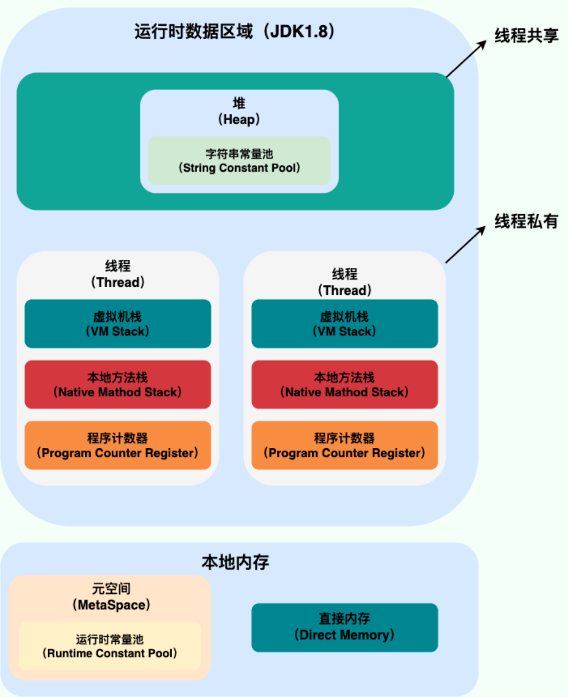
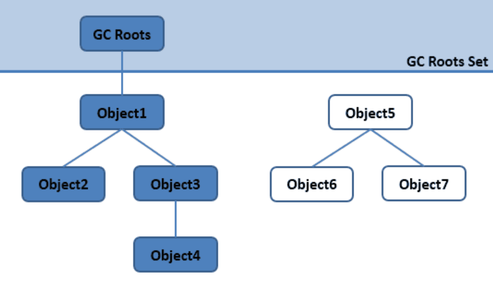
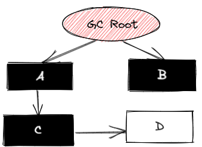

> JDK8 垃圾回收器官方文档 https://docs.oracle.com/javase/8/docs/technotes/guides/vm/gctuning/
>
> JDK11 垃圾回收器官方文档 https://docs.oracle.com/en/java/javase/11/gctuning/index.html

## JVM 内存区域的一些概念

### JVM 内存区域划分

JDK 1.8



1. **程序计数器**：是一块较小的内存区域，用于记录当前线程执行的字节码指令地址；
2. **Java虚拟机栈**：每个线程在运行时都会创建一个Java虚拟机栈，用于存储方法的局部变量、操作数栈、动态链接、方法出口等信息；
3. **本地方法栈**：与Java虚拟机栈类似，但是用于执行本地方法；
4. **Java 堆**：是JVM中最大的一块内存区域，用于存储Java对象实例，被所有线程共享；
5. **方法区**：用于存储已被虚拟机加载的类信息、常量、静态变量、即时编译器编译后的代码等数据；
6. **运行时常量池**：是方法区的一部分，用于存储编译时生成的各种字面量和符号引用；
7. **直接内存**：JVM中的一块非Java堆区域，用于存储NIO（New Input/Output）缓冲区；

### 程序计数器的作用？线程私有吗？是否会发生 OOM？

1. 确定线程执行的位置：**程序计数器可以记录线程执行的位置，当线程在执行过程中需要切换到其他线程时，JVM可以通过程序计数器来恢复线程执行的位置**；
2. 指令的流程控制：**程序计数器可以记录下一条要执行的指令的地址，当执行条件分支、循环、异常处理等操作时，JVM可以通过程序计数器来控制指令的流程**；
3. 程序计数器是**线程私有**的，**不会发生 OOM**；

### 虚拟机栈和本地方法栈？线程私有吗？是否会发生 OOM？

1. 虚拟机栈和本地方法栈是JVM（Java Virtual Machine）中的两个重要的内存区域，分别用于存储Java方法和本地方法（native method）的执行信息；
2. 虚拟机栈：**每个线程在运行时都会创建一个虚拟机栈**，用于存储方法的**局部变量**、**操作数栈**、**动态链接**、**方法出口**等信息。**每个方法在执行时，都会创建一个栈帧**（stack frame），用于存储方法的执行信息。当方法执行完成后，该方法对应的栈帧会被弹出，虚拟机栈也会恢复到该方法被调用的状态。虚拟机栈的大小可以通过-Xss参数进行设置；
3. 本地方法栈：与虚拟机栈类似，但是用于执行本地方法。本地方法是使用其他编程语言（如C或C++）实现的方法，可以通过Java的本地方法接口（JNI）调用。本地方法栈的大小也可以通过-Xoss参数进行设置；
4. 需要注意的是，**虚拟机栈和本地方法栈都是线程私有的**，也就是说，每个线程都有自己独立的虚拟机栈和本地方法栈。这样可以保证多个线程同时执行时，不会相互干扰。同时，**虚拟机栈和本地方法栈都是基于栈的数据结构，具有先进后出的特点；**

### 堆？堆的作用？

1. Java 堆是 Java 虚拟机（JVM）在运行时分配内存的一部分，**用于存储对象实例**。Java 堆是 JVM 中最大的一块内存区域，**被所有线程共享**。它是**由垃圾回收器进行管理和维护的**，可以动态地分配和释放内存。Java 堆的大小可以在启动 JVM 时设置，也可以通过在代码中使用 -Xmx 和 -Xms 这样的命令行选项进行设置；
2. Java 堆的实现**通常是基于数组或链表**的数据结构，其中每个元素都是一个对象实例。Java 堆的**内存分配通常是通过指针碰撞或空闲列表实现的**。当需要分配内存时，垃圾回收器会搜索堆中的空闲内存块，并将其分配给对象实例。当对象实例不再被引用时，垃圾回收器会将其标记为垃圾，并在需要时将其回收；
3. Java 堆的大小对程序的性能和稳定性都有很大的影响。**如果 Java 堆的大小过小，将会导致频繁的垃圾回收和内存分配，从而降低程序的性能。如果 Java 堆的大小过大，将会浪费系统资源，从而导致系统稳定性的问题**。因此，在设置 Java 堆的大小时，需要根据程序的实际情况进行调整；

### 方法区存放的什么东西？

1. 方法区（Method Area）是 Java 虚拟机中的一块内存区域，用于存储**类的元数据、静态变量、常量池**等信息。它是所有**线程共享**的内存区域，与 Java 堆一样，也是在 Java 虚拟机启动时就被创建的。方法区通常被划分为以下几个部分：
   1. **运行时常量池**：用于存储编译时生成的各种字面量和符号引用，包括类和接口的全限定名、字段和方法的名称和描述符、常量值等信息；
   2. **类的元数据**：包括类的访问修饰符、父类和接口的全限定名、字段和方法的信息、方法的字节码等信息；
   3. **静态变量**：类中所有被 static 修饰的变量都存储在方法区中；
   4. **常量**：所有被 final 修饰的变量都被视为常量，也会存储在方法区中；
2. 在Java 8 中，方法区的实现是基于本地内存的，也就是说，方法区不再是 JVM 进程的一部分，而是使用本地内存来实现。这样做的好处是可以避免内存泄漏问题，同时也可以提高JVM的性能；

### 符号引用是什么？

1. 符号引用（Symbolic Reference）是一种在 Java 虚拟机中**用于表示类、接口、方法、字段等符号的引用**。在 Java 代码**编译过程中**，所有的符号引用都被编译成为符号引用的形式，而在**类加载的过程中**，这些符号引用会被解析成为实际的内存地址，从而使得 Java 代码能够正确地执行。符号引用通常包括以下几种类型：
   1. **类和接口的符号引用**：包括类和接口的全限定名、访问修饰符、父类和接口列表等信息；
   2. **字段的符号引用**：包括字段所属的类或接口、字段的名称和类型等信息；
   3. **方法的符号引用**：包括方法所属的类或接口、方法的名称、参数类型和返回值类型等信息；

2. **符号引用与直接引用的区别在于，符号引用是一个符号名称，而直接引用则是一个指向具体内存地址的指针**。在 Java 虚拟机中，符号引用需要在类加载的过程中被解析成为直接引用，从而使得 Java 代码能够正确地执行；

### 运行时常量池？

1. 运行时常量池（Runtime Constant Pool）是 Java 虚拟机中的一块内存区域，用于**存储编译时**生成的**各种字面量**和**符号引用**，包括**类和接口的全限定名、字段和方法的名称和描述符、常量值**等信息；
2. 运行时常量池是在类加载时被创建的，与 Java 堆和方法区不同，它是**每个类或接口的独立部分，而不是所有线程共享的内存区域**。每个类或接口都有自己的运行时常量池，它包含的信息与类或接口的代码有关；
3. 运行时常量池的主要作用是为 Java 程序提供一种**动态性的机制**，**使程序可以在运行时动态地加载和使用类、方法和变量等**。例如，程序可以通过**反射机制动态地加载和使用类**，通过字符串拼接和反射机制动态地调用方法等；

## 对象的布局、创建流程、生命周期

### 对象的内存布局

Java 对象的内存布局由三部分组成：对象头、实例数据和对齐填充。

1. **对象头**：对象头是 Java 对象在内存中的开头部分，用于存储对象的元数据信息，包括 **Mark Word**、**类型指针**（Java 虚拟机通过这个指针来确定这个对象是那个类的实例）、**数组就有数组长度**。其中 Mark Word 内保存了对象的哈希码、对象所属的类的引用、对象锁等信息；
2. **实例数据**：实例数据是 Java 对象中实际**存储的成员变量数据**，包括基本类型数据、引用类型数据、数组类型数据等。实例数据的大小取决于对象中包含的成员变量数量和类型，不同的对象实例的实例数据大小可能不同；
3. **对齐填充**：由于 Java 虚拟机要求对象的起始地址必须是 8 字节的整数倍，因此在实例数据末尾可能会添加一些无用的填充字节，以确保对象的大小是 8 字节的整数倍；

需要注意的是，Java 对象的内存布局可能会受到虚拟机实现的影响，不同的虚拟机实现可能会有不同的实现方式。此外，Java 对象的大小也可能会受到对象头、对齐填充等因素的影响，因此在计算对象的大小时需要考虑这些因素；

### 对象的创建流程？给对象分配内存时的并发安全问题是如何解决的？

1. **加载类的元信息**：在程序第一次使用一个类时，Java 虚拟机会先加载这个类的元信息，包括类的访问修饰符、父类和接口的全限定名、字段和方法的信息、方法的字节码等信息；
2. **分配内存空间**：在加载完类的元信息之后，Java 虚拟机会为新对象分配内存空间。内存的分配方式有两种：**指针碰撞**和**空闲列表**；
   - **指针碰撞用 CAS 加失败重试保证分配内存的原子性**；**空闲列表使用本地线程分配缓冲 TLAB**，一个本地缓冲区用完了才回去加上同步锁定去分配新的缓冲区；

3. **初始化对象头**：在分配内存空间之后，Java 虚拟机会初始化对象头。对象头包括两部分信息：对象的哈希码、对象所属的类的引用；
4. **执行构造方法**：在对象头初始化完成之后，Java 虚拟机会执行对象的构造方法，完成对象的初始化工作。在构造方法中，可以对对象的成员变量进行初始化，也可以执行其他操作；
5. **返回对象引用**：在对象初始化完成之后，Java 虚拟机会返回对象的引用，这个引用可以被存储在局部变量、成员变量、静态变量等位置，用于后续的操作。

### 内存分配的指针碰撞和空闲列表

1. **指针碰撞**是一种在**连续的内存空间**中分配变量或对象的方式。在指针碰撞中，Java 虚拟机使用一个**指针**来记录当前**可用的内存空间的起始地址**，每当分配一个对象时，就将指针向后移动对象所需的内存大小，以便为下一个对象分配内存空间。指针碰撞的优点是实现简单，分配速度快，适合于内存空间较为连续的情况。但是它的缺点也很明显，即当内存空间不连续时，就无法使用指针碰撞的方式进行内存分配。此外，指针碰撞还存在**内存碎片**的问题，容易造成内存的浪费；
2. **空闲列表**是一种在**非连续的内存空间**中分配变量或对象的方式。在空闲列表中，Java 虚拟机使用一个链表来记录可用的内存空间，每当分配一个对象时，就从链表中找到一个足够大的内存块，将其分配给对象。空闲列表的优点是可以处理非连续的内存空间，避免了指针碰撞的缺点。但是它的缺点也很明显，即链表的遍历和维护需要消耗时间和空间，分配速度相对较慢；
3. 在 Java 虚拟机中，通常会将堆内存空间分为两个区域：新生代和老年代。**新生代**使用的是**指针碰撞**的方式进行内存分配，而**老年代**使用的是**空闲列表**的方式进行内存分配。这样可以充分利用指针碰撞的优点，同时避免了它的缺点；

### 对象在堆中的生命周期

1. 在 JVM 内存模型的堆中，堆被划分为新生代和老年代（1:1:8）
   - 新生代又被进一步划分为 **Eden区** 和 **Survivor区**，Survivor 区由 **From Survivor** 和 **To Survivor** 组成
2. 当创建一个对象时，对象会被**优先分配到新生代的 Eden 区** 
   - 此时 JVM 会给对象定义一个**对象年轻计数器**（`-XX:MaxTenuringThreshold`）
3. 当 Eden 空间不足时，JVM 将执行新生代的垃圾回收（Minor GC） 
   - JVM 会把存活的对象转移到 Survivor 中，并且对象年龄 +1
   - 对象在 Survivor 中同样也会经历 Minor GC，每经历一次 Minor GC，对象年龄都会+1
4. 如果分配的对象超过了`-XX:PetenureSizeThreshold`，对象会**直接被分配到老年代**

## 内存泄漏

### 内存泄漏有那些原因

1. Java内存泄漏是指在Java程序运行时，由于对象没有被正确地释放或管理，导致内存空间被占用，最终导致程序崩溃或性能下降的现象。
   1. **对象没有被正确地释放**：Java中的垃圾回收机制可以自动回收不再使用的对象，但如果程序中存在对对象的强引用，即使对象不再使用，垃圾回收机制也无法回收该对象所占用的内存空间，从而导致内存泄漏。
   2. **集合类使用不当**：Java 中的集合类如 List、Map 等，在使用时需要注意及时清空或移除集合中的元素，否则集合中的元素会一直占用内存空间，导致内存泄漏。
   3. **未关闭 IO 流**：Java中的IO流需要手动关闭，如果程序中未正确关闭IO流，就会导致内存泄漏。
   4. **内存泄漏的第三方库**：使用第三方库时，如果该库中存在内存泄漏的问题，就会导致 Java 程序出现内存泄漏。
2. 为了避免Java内存泄漏，我们需要在程序中**合理地使用对象、集合类、静态变量和IO流，并及时释放不再使用的资源**。同时，在使用第三方库时，也需要仔细查看该库是否存在内存泄漏的问题。

### 如何定位内存泄漏

1. 使用内存分析工具，常用的内存分析工具有Eclipse Memory Analyzer、VisualVM、MAT等。这些工具可以生成内存快照，查看泄漏对象到 GC Roots 的引用链，找到泄漏对象是通过什么样的引用路径、与那些 GC Roots 对象关联，才导致垃圾回收器无法回收它们；

## GC 垃圾回收

### **如何判断对象已经死亡？**



1. 可达性分析算法是Java虚拟机中常用的内存管理方式之一，它通过**从一组根对象开始，遍历所有可达对象，将不可达的对象标记为垃圾对象**，最后将垃圾对象回收。可达性分析算法的基本思路是：
   1. **根对象的选择**：根对象包括静态变量、本地变量和虚拟机栈中的对象引用；
   2. **根对象的遍历**：从根对象开始，沿着对象之间的引用链，遍历所有可达对象，将所有可达的对象标记为存活对象；
   3. **垃圾对象的回收**：遍历完成后，剩下的对象即为垃圾对象，可以被回收；
2. 可达性分析算法的优点是可以处理循环引用的情况，避免了引用计数器的问题。但是，可达性分析算法有一个缺点，就是**在对象引用链较长时，遍历所有对象可能会比较耗时，影响程序的性能**；
3. 为了提高可达性分析算法的效率，Java虚拟机采用了一些优化策略，如分代回收、增量回收、并发回收等。这些策略可以根据不同的应用场景和硬件环境进行调整，以达到最佳的内存管理效果；

### **有哪些对象是 GC Root 对象？**

1. **虚拟机栈**中引用的对象（栈帧中的本地变量表），**参数**、**局部变量**等，当方法执行完毕后，虚拟机栈中的引用对象也会被回收；
2. 方法区中的**静态类型属性引用的对象**，譬如 Java 类的引用类型静态变量；
3. 在方法区中常量引用的对象，譬如**字符串常量池**；
4. 本地方法栈中（Native 方法）引用的对象；
5. Java 虚拟机内部的引用，如**基本数据类型对应的 Class 对象**，一些**常驻的异常类（空指针，内存溢出）**，还有**类加载器**；
6. 所有被**同步锁持有的对象**；
7. 临时加入 GC Root 的对象，例如新生代的某个对象被老年代的对象给引用了，这是老年代的这个对象就会临时视为 GC Root 对象；

### **Java 的引用有那些？分别的特点是什么？**

1. **强引用（Strong Reference）**：强引用是指在程序中显式地使用 new 操作符创建的对象所持有的引用。只要强引用存在，垃圾回收器就不会回收该对象；
2. **软引用（Soft Reference）**：软引用是一种有用的引用类型，它可以让对象存活更长的时间，**直到内存不足时才被回收**。在Java中，我们可以使用 SoftReference 类来创建软引用对象；
3. **弱引用（Weak Reference）**：弱引用是一种比软引用更弱的引用类型，它的生命周期更短，**只要没有强引用或软引用指向该对象，垃圾回收器就会回收该对象**。在Java中，我们可以使用WeakReference类来创建弱引用对象；
4. **虚引用（Phantom Reference）**：虚引用是一种最弱的引用类型，它几乎没有实际用途，只是用来跟踪对象被垃圾回收的状态，为一个对象设置虚引用关联的唯一目的就是能在这个对象被回收时收到一个系统通知。在Java中，我们可以使用PhantomReference类来创建虚引用对象；

### **对分代收集理论的理解？为什么要分代？跨代引用问题是如何处理的？**

1. **绝大多数的对象都是朝生夕灭的，熬过越多次垃圾回收的对象就越难以消亡**，收集器应该按照回收对象的年龄分配到不同的区域之中。还有个是跨代引用相当于同代引用来说占极少数；
2. 跨代引用问题用一个记忆集来处理，在新生代上建立一个全局的记忆集，将老年代分为若干小块，表示出老年代那一块内存有跨代引用，此后发生 Minor GC 的时候，只有包含了跨代引用的小块内的对象才会被假如到 GC Root 中进行扫描；

### **说下垃圾清理算法有那些？**

1. **标记-清除算法（Mark-Sweep）**：该算法首先标记所有可达对象，然后清除所有不可达对象。但是该算法存在两个问题：1）标记和清除过程需要**遍历整个堆内存，效率较低**；2）清除后会产生**内存碎片**，不利于后续对象的分配；
2. **复制算法（Copying）**：该算法将内存分为两个区域，每次只使用其中一个区域，当该区域无法再分配时，将其中的存活对象复制到另一个区域中，然后清除该区域的所有对象。该算法解决了内存碎片问题，但是需要将存活对象复制到另一个区域，导致空间浪费；
3. **标记-整理算法（Mark-Compact）**：该算法先标记所有可达对象，然后将所有存活对象向一端移动，然后清除该端以外的所有对象。该算法解决了内存碎片问题，但是需要移动存活对象，需要暂停所有的用户线程，导致效率较低；
4. **分代算法（Generational）**：该算法将内存分为多个年代，每个年代的存活时间不同，一般将新创建的对象放入新生代，存活时间短，然后将存活时间较长的对象放入老年代。**新生代一般采用复制算法，老年代采用标记-整理算法**。该算法充分利用了对象存活时间的特点，提高了垃圾回收效率；
5. **分区算法（Region）**：该算法将内存分为多个连续的区域，每个区域大小相同，其中一个区域作为当前分配区，当该区域无法分配时，将其中的存活对象复制到另一个区域中，然后将该区域清空。该算法结合了复制算法和标记-整理算法的优点，能够更好地解决内存碎片问题；

### **谈谈你对新生代的分区占比的理解？为什么要按这样的比例划分？**

1. 因为有人专门研究过，**新生代中超过 98%的对象都是熬不过第一次垃圾回收的**，所以并不需要按照 1 : 1 来划分新生代的内存空间；
2. 所以分为一个大的 Eden 区和两个小的 Survivor 空间，比例是 8 : 1 : 1，所以**只有 10% 的内存浪费**；

### JVM 内存分配策略

- **对象优先在 Eden 区分配**

  大多数情况下，对象在新生代 Eden 区分配，当 Eden 区空间不够时，发起 Minor GC。

- **大对象直接进入老年代**

  大对象是指需要连续内存空间的对象，最典型的大对象是那种很长的字符串以及数组。经常出现大对象会提前触发垃圾收集以获取足够的连续空间分配给大对象。-XX:PretenureSizeThreshold，大于此值的对象直接在老年代分配，**避免在 Eden 区和 Survivor 区之间的大量内存复制。**

- **长期存活的对象进入老年代**

  为对象定义年龄计数器，对象在 Eden 出生并经过 Minor GC 依然存活，将移动到 Survivor 中，年龄就增加 1 岁，增加到一定年龄则移动到老年代中。-XX:MaxTenuringThreshold 用来定义年龄的阈值。

- **动态对象年龄判定**

  虚拟机并不是永远地要求对象的年龄必须达到 MaxTenuringThreshold 才能晋升老年代，如果在 Survivor 中相同年龄所有对象大小的总和大于 Survivor 空间的一半，则年龄大于或等于该年龄的对象可以直接进入老年代，无需等到 MaxTenuringThreshold 中要求的年龄。

- **空间分配担保**

  在发生 Minor GC 之前，虚拟机先检查老年代最大可用的连续空间是否大于新生代所有对象总空间，如果条件成立的话，那么 Minor GC 可以确认是安全的。

  如果不成立的话虚拟机会查看 HandlePromotionFailure 设置值是否允许担保失败，如果允许那么就会继续检查老年代最大可用的连续空间是否大于历次晋升到老年代对象的平均大小，如果大于，将尝试着进行一次 Minor GC；如果小于，或者 HandlePromotionFailure 设置不允许冒险，那么就要进行一次 Full GC。

### **垃圾回收的安全点的概念？如何让所有线程在垃圾回收前都跑到安全点位置停顿下来？**

1. **用户程序**并**不会**在代码指令流的**任意位置**都能够**停顿**下来进行**垃圾回收**，必须**强制**执行到**安全点**的时候才能够**暂停**，只有在指令序列复用的地方才会产生安全点，例如方法调用，循环跳转，异常跳转等；
2. 抢先式中断：发生垃圾回收时，系统先把所有用户线程全部中断，如果发现有用户线程中断的地方不在安全点上，就恢复这条线程的运行，让他跑到安全点上再中断（这个现在没有虚拟机在用了）；
3. **主动式中断**：当**垃圾回收**需要**中断线程**的时候，不直接对象线程操作，而是简单的设置一个**标记位**，各个**线程**执行过程中**不断主动去轮询这个标记位**，一旦发现中断标志为真时候就自己在最近的安全点主动挂起；

### **垃圾回收有了安全点为什么还要安全区域？**

1. 有了安全点，程序就可以在不太长的时间内就可以进到垃圾回收的安全点，但是有的程序可能没抢到 CPU 资源，并不在“执行”的状态（sleep、blocked），这时候线程无法响应虚拟机的中断请求，不能走到安全点来中断挂起自己，显然也不能持续等待线程重新被激活分配处理器时间；
2. 安全区域指的是确保在某一段代码中，引用关系不会发生变化，因此在这个区域中的任意地方都是可以安全进行垃圾回收的；

### **JVM 的卡表？作用是什么？什么时候更新卡表？**

1. 为了解决**对象跨代引用**所带来的问题，垃圾收集器在新生代中建立了记忆集的数据结构，用于**避免把整个老年代加进 GC Roots 扫描范围**；
2. 最常用的一种记忆集的实现形式就是卡表了，最简单形式可以只是一个**字节数组**；
3. 字节数据的每一个元素都对应着其标识的内存区域中的一块特定大小的内存块，这个内存块称为卡页（Card Page），一个卡页的内存通常不止一个对象，只要卡页中至少有一个对象存在跨代指针，就会将对应卡表的数组元素的值标志为 1，称这个元素变脏，没有则标识为 0。在垃圾回收发生时，只要筛选出卡表中变脏的元素，就能简单的得到那些卡页中包含跨代指针，把它们加入到 GC Roots 中一并扫描；

### **简单说下 ParNew 回收器？**

1. 是 Serial 垃圾回收器的多线程版本，适用于多核处理器上的应用程序。ParNew 回收器主要用于新生代的垃圾回收，它可以并行地执行垃圾回收，从而提高垃圾回收的效率和速度；
2. 多线程垃圾回收：ParNew 回收器默认开启的回收线程数和处理器核心的数量相同，在核心非常多的机器下，可以用 -XX:ParallelGCTheads 参数来限制垃圾回收的线程数；
3. 内存分配策略：ParNew 回收器使用基于指针碰撞的内存分配策略，可以快速地分配内存空间，提高内存分配的效率；
4. 低延迟：**ParNew 回收器可以与 CMS 垃圾回收器一起使用**，以实现低延迟的垃圾回收；

### **吞吐量是什么？**

1. 吞吐量（Throughput）是指在**单位时间内完成的任务数量或数据量**。在计算机科学中，吞吐量通常指在一段时间内，计算机系统能够处理的事务或数据量。吞吐量是衡量系统性能的重要指标之一，可以用来评估计算机系统的处理能力和效率；
2. 在 JVM 中，吞吐量通常用来衡量垃圾回收的效率和性能。吞吐量=运行用户代码时间/(运行用户代码时间+运行垃圾收集时间)；
3. 在实际应用中，吞吐量不是唯一的性能指标，还需要考虑其他因素，例如延迟、响应时间、并发等。因此，在评估计算机系统或 JVM 垃圾回收器的性能时，需要综合考虑各种因素，并根据应用程序的需求选择合适的性能指标进行评估和优化；

### **简单说下 CMS 回收器？设计目的？收集过程？优缺点？**

1. CMS（Concurrent Mark Sweep）是一种以获取最短回收停顿时间为目标的收集器；
2. CMS回收器的工作方式包括以下几个阶段：
   1. **初始标记**：在此阶段中，垃圾回收器会**遍历整个对象图**，标记所有直接与 GC Roots 关联的对象，将它们标记为"已使用"。
   2. **并发标记**：在初始标记阶段结束后，垃圾回收器会并发地执行标记，**遍历整个对象图**，标记所有与 GC Roots 可达的对象；（这个时间耗时较长，但是不需要停顿用户线程）
   3. **重新标记**：在并发标记阶段结束后，垃圾回收器会再次**暂停用户程序的执行**，重新标记所有在并发标记阶段中被修改的对象；（这个阶段停顿的时间通常会比初始标记稍微长一点，但也远比并发标记阶段的时间短）
   4. **并发清除**：在重新标记阶段结束后，垃圾回收器会并发将所有已经死亡的对象清除，应为不需要移动存活的对象，所有这个阶段也是可以和用户线程并发运行的；
3. CMS 的缺点：
   1. **对 CPU 资源的占用**：并发阶段虽然不会导致用户线程停顿，但是占用了一部分的处理器的计算能力，这可能会影响用户程序的性能；
   2. **核心数的影响**：CMS 默认启动的回收线程数是 (处理器核心数量 + 3) / 4，也就是说处理器核心数在四个或者以上，并发回收时垃圾回收线程不超过 25% 的处理器运算资源，但是假如当处理器的核心数不足四个时，CMS 对用户的影响就可能变得很大了；
   3. **CMS 无法处理浮动垃圾**：在最后并发清理阶段，用户线程还在继续运行，就可能继续产生垃圾，CMS 垃圾回收器无法再本次回收它们；
   4. **CMS 需要预留部分内存给并发清除阶段的程序运行使用**：因为在垃圾回收阶段用户线程还需要持续运行，那就要预留足够的内存给用户线程使用，因此 CMS 收集器不能像其他收集器那样等到老年代几乎完全使用完了再去收集，必须预留一部分空间给并发收集时的程序使用。老年代到一定的百分比空间后就会触发一次回收，这个值是可以设置的。需要注意的是过高的回收阈值可能会导致CMS无法及时回收垃圾，从而导致大量”并发失败“（并发失败会冻结用户线程的执行，临时启动 Serial Old 收集器进行老年代的垃圾回收），而过低的回收阈值则可能会导致频繁的垃圾回收，影响应用程序的性能。如果老年代的内存增长速度不是很块，就可以适当增大阈值了；
   5. **内存碎片**：CMS垃圾回收器使用了一种称为“标记-清除”的垃圾回收算法，这可能会导致内存碎片的产生，从而降低内存使用效率。因为是“标记-清除”，当内存碎片不够分配某个对象的时候，就会触发一次 Full GC 操作，但是 CMS 提供了一个开关，在 CMS 不得不进行 Full GC 时开启内存碎片的合并整理过程，因为这块内存必须要移动存活的对象，所以这个也是要暂停用户线程的，停顿时间就变长了。 CMS 又提供了一个参数，就是要求 CMS 在执行过若干次不整理空间的 Full GC 之后下一次进入 Full GC 之前会先进行碎片整理（默认为 0 表示每次都整理）；

### **如何优化 CMS 垃圾回收器？**

1. **增加内存**：CMS垃圾回收器需要足够的内存来避免频繁的Full GC。因此，将堆大小增加到足够大的程度可以减少Full GC的频率，从而提高应用程序的性能；
2. **减少并发线程数**：CMS垃圾回收器的并发阶段需要占用一定的CPU资源。如果并发线程数设置过高，可能会导致CPU过度使用，从而影响应用程序的性能。因此，可以适当减少并发线程数，以减轻CPU负担；
3. **优化垃圾回收器参数**：CMS垃圾回收器有许多参数可以调整，
   1. CMSInitiatingOccupancyFraction：指定CMS垃圾回收器在进行CMS垃圾回收之前，堆内存使用率达到多少百分比时触发CMS垃圾回收。默认值为68%，可以根据应用程序的内存使用情况进行调整；
   2. UseCMSInitiatingOccupancyOnly：如果设置为true，则CMS垃圾回收器只在堆内存使用率达到CMSInitiatingOccupancyFraction时触发CMS垃圾回收。如果设置为false（默认值），则CMS垃圾回收器会根据内存使用情况自动触发CMS垃圾回收。
   3. CMSFullGCsBeforeCompaction：要求 CMS 在执行过若干次不整理空间的 Full GC 之后下一次进入 Full GC 之前会先进行碎片整理（默认为 0 表示每次都整理）；
   4. CMSClassUnloadingEnabled：指定是否启用CMS垃圾回收器的类卸载功能。默认值为true，表示启用类卸载功能。如果设置为false，则CMS垃圾回收器不会卸载不再使用的类，从而可能导致内存泄漏；
   5. UseCMSCompactAtFullCollection：设置 CMS 在完成垃圾收集后是否要进行一次内存碎片整理；
   6. CMSScavengeBeforeRemark：指定在进行CMS垃圾回收的Remark阶段之前，是否进行一次Young GC。默认值为false，表示不进行Young GC。如果设置为true，则在Remark阶段之前进行一次Young GC，可以减少Remark阶段（重新标记）的停顿时间；
   7. CMSParallelRemarkEnabled：指定是否启用CMS垃圾回收器的并行Remark功能。默认值为true，表示启用并行Remark功能。如果设置为false，则Remark阶段将会变为串行执行，可能会导致停顿时间的增加； 
   8. ParallelGCThreads：设置并行的垃圾回收线程数，默认（处理器核心数量 + 3）/ 4）；

### **G1 垃圾回收器简单描述？**

1. 在 G1 垃圾回收器出现之前，垃圾回收的目标范围要么是整个新生代（Minor GC），要么就是针对老年代的（Major GC），再要么就是整个 Java 堆（Full GC）。而 G1 面向堆内存任何部分来组成回收集进行回收，衡量标准不再是它属于那个分代，而是那块内存中存放的垃圾数量越多，回收收益最大，这就是 G1 的 Mixed GC 模式；
2. G1 也是遵循分代收集理论设计的，把连续的堆划分为多个大小相等的独立区域（Region），每一个 Region 都可以根据需要扮演新生代的 Eden 空间、Survivor 空间，或者老年代空间。收集器能够对扮演不同的角色的 Region 采用不同的策略去处理；
3. Region 中有一类特殊的 Humongous 区域，专门用来存储大对象。G1 认为只要大小超过了一个 Region 容量一半的对象即可判断为大对象。每个 Region 的大小可以通过 -XX:G1HeapRegionSize 设定、取值范围为 1MB~32MB，且应该为 2 的 n 次幂。对于那些超过了整个 Region 的容量的超级大对象，将会被存到 N 个连续的 Humongous Region 之中，G1 的大多数行为都把 Humongous Region 作为老年代的一部分来看待；
4. 虽然 G1 仍然保留新生代和老年代的概念，但是新生代和老年代不再是固定的了，它们都是一系列区域（不需要连续）的动态集合。G1 之所以能够建立可预测的停顿时间模型，是因为它将 Region 作为单次回收的最小单元，即每次收集到的内存空还能都是 Region 大小的整数倍，这样可以有计划的避免在整个 Java 堆中进行全区域的垃圾回收。更具体的思路是让 G1 去跟踪各个 Region 里面的垃圾堆积的“价值”大小，“价值”就是回收所获得的空间大小 以及回收所需时间的经验值，然后在后台维护一个优先级列表，每次根据用户设定允许的收集停顿时间（-XX:MaxGCPauseMullis 指定，默认 200ms），优先处理回收价值收益最大的那些 Region，也就是“Garbage First” 的由来。这种使用 Region 划分内存空间，以及具有优先级的区域回收方式，保证了 G1 回收器在有限的时间内获得尽可能高的收集效率；

### **G1 垃圾回收器如何处理跨代引用？**

1. 使用记忆集避免全堆作为 GC Roots 扫描，但在 G1 收集器上的记忆集要复杂很多，每个 Region 都需要维护自己的记忆集，这些记忆集会记录下别的 Region 指向自己的指针，并标记这些指针分别在那些卡页的范围之内；
2. G1 的记忆集本质上是一个哈希表，key 是别的 Region 的起始地址，value 是一个集合，里面存储的元素是卡表的索引号。（双向卡表结构，卡表是“我指向谁”，这里还要保存“谁指向我”）；
3. Region 数量比传统收集器的分代数量要明显增多，因此 G1 收集器要比其他的传统的垃圾收集器有个更高的内存负担。根据经验，G1 至少要耗费大约约相当于 Java 堆容量的 10% 至 20% 的内存来维持收集器的工作；

### **三色标记？**

三色标记过程：

- **黑色**：代表该对象以及该对象下的属性全部被标记过了。（程序需要用到的对象，不应该被回收）
- **灰色**：对象被标记了，但是该对象下的属性未被完全标记。（需要在该对象中寻找垃圾）
- **白色**：对象未被标记（需要被清除的垃圾）


三色标记存在的问题：对象漏标：



如果已经被C已经被标记为黑色了，因为是并发标记，此时可能会有线程在C中引用D。此时由于C已经被标记为黑色，不会再扫描D。D会被认为需要回收，此问题会导致系统出问题。

CMS 为了解决漏标的问题，增量更新的方法（Increment Update）

### **并发的可达性分析？并发扫描对象消失问题如何解决？增量更新和原始快照（SATB）**

1. 如果用户线程和收集器是并发工作的，则可能会出现原本是存活的对象被误标记为已消亡的对象；
2. 下面两个条件同时满足时会出现“对象消失”的现象，也就是原本应该是黑色的对象被误标记位白色；
   1. 赋值器插入了一条或者多条从黑色对象到白色对象的新引用；
   2. 赋值器删除了全部从灰色对象到该白色对象的直接或间接引用；
3. 解决并发扫描对象消失的问题，只需要破坏上面一个条件就可以了
   1. **增量更新要破坏的就是第一个条件，当黑色对象插入新的指向白色对象的引用关系时，就将这个新插入的引用记录下来，等并发扫描结束之后，再将这些记录过的引用关系中的黑色对象为根重新扫描一次；**
   2. 原始快照要破坏的是第二个条件，当灰色对象要删除指向白色对象的引用关系时，就将这个要删除的引用记录下来，在并发扫描结束之后，再将这些记录过的引用关系中的灰色对象为根重新扫描一次；
4. CMS 基于增量更新来做并发标记的，G1 用原始快照来实现并发标记的；

### **G1 垃圾回收器的执行流程？**

1. 初始标记（Initial Marking）：标记一下 GC Roots 能直接关联到的对象，这个阶段需要暂停用户线程，但是很短暂；
2. 并发标记（Concurrent Marking）：从 GC Roots  开始对堆中的对象进行可达性分析，递归扫描整个堆的对象图，找出要回收的对象，这个阶段耗时比较长，但是可与用户程序并发执行。对象图扫描完成后，还要重新处理 SATB（原始快照） 记录下的在并发时有引用变动的情况；
3. 最终标记（Final Marking）：对用户线程一个短暂的暂停，用于处理并发阶段结束后仍遗留下来的最后那些少量的 SATB （原始快照）记录；
4. 筛选回收（Live Data Counting and Evacution）：负责更新 Region 的统计数据，对每个 Region 的回收价值和成本进行排序，根据用户所期望的停顿时间来指定回收计划，可以自由选择任意多个 Region 构成回收集，然后把决定回收的哪一部分 Region 的存活对象复制到空的 Region 中，再清理掉整个旧 Region 的全部空间。这里的操作涉及存活对象的移动，是必须暂停用户线程，由多条收集线程并行完成的；

### **G1 的停顿时间如何设置？**

1. 一般来说把停顿时间设置为一百，两百都很正常；
2. 假如把停顿时间设置的很低，比如 20ms，就很可能出现的结果就是由于停顿目标时间太短，导致每次选出来的回收集只占堆内存的很小一部分，收集器收集的速度逐渐跟不上分配器分配内存的速度，导致垃圾慢慢堆积，最终占满堆引发 Full GC 反而减低性能；

### **CMS 和 G1 比较？**

1. **G1 垃圾回收器是面向整堆的，而 CMS 是面向老年代的**；
2. 与 CMS 的“标记-清除”不同，**G1 从整体上看是基于“标记-整理”**算法实现的回收器，但是从**局部（两个 Region 之间）又是基于“标记-复制”**算法实现，无论如何，这两种算法都意味着 G1 运行期间不会产生内存空间碎片，垃圾收集完成之后能提供规整的内存；
3. 在用户程序运行过程中，G1 无论是为了垃圾收集产生的内存占用还是程序运行时的额外负载都要比 CMS 高；
   1. 就内存占用上来说。由于 G1 的卡表要比 CMS 的复杂。因为 CMS 只需要处理老年代到新生代的跨代引用问题，反过来不需要存。而 G1 因为每个 Region 在不同时刻扮演的角色不一样（新生代老年代），都必须有一份卡表，这导致 G1 的记忆集（和其他内存消耗）可能会占整堆的 20%，甚至更多；
   2. 在执行负载角度上。CMS 写后屏障维护卡表信息，而 G1 也是用写后屏障维护卡表信息，但是 G1 的卡表要比 CMS 的复杂。而且为了使用原始快照（SATB）算法，还需要写前屏障来跟踪并发时的指针变化情况。
4. 在小内存的应用上 CMS 的表现大概率仍然要优于 G1，而在大内存的应用上 G1 则大多发挥它的优势，这个优势的平衡点通常在 6GB 和 8GB 之间。

### **你们公司生产用的什么垃圾回收器的组合？为什么这样选？**

线上 service 使用的垃圾回收器

- 新生代：UseParNewGC；
- 老年代：UseConcMarkSweepGC；

进程信息

```
tomcat   13195     1 88 06:46 ?        03:25:32 /opt/java/jdk/bin/java -Xms12g -Xmx12g -Xmn3g -Xss512k -XX:+ExplicitGCInvokesConcurrent -XX:+UseParNewGC -XX:+UseConcMarkSweepGC -XX:CMSInitiatingOccupancyFraction=70 -XX:+UseCMSCompactAtFullCollection -XX:CMSFullGCsBeforeCompaction=5 -XX:+PrintGCDetails -XX:+PrintGCDateStamps -XX:SurvivorRatio=8 -XX:MaxTenuringThreshold=15 -XX:+HeapDumpOnOutOfMemoryError -XX:HeapDumpPath=/data/soft/logs/bak -Xloggc:/data/soft/logs/gc.log.20230703_064617 -Djava.net.preferIPv4Stack=true -classpath /手动打码/WEB-INF/classes:/手动打码/WEB-INF/lib/* com.uxin.zb.bootstrap.Provider
```

根据提供的信息，这是关于Tomcat服务器的启动命令和参数配置。下面是对该命令和参数的分析：

- `-Xms12g`：设置JVM的初始堆大小为12GB。
- `-Xmx12g`：设置JVM的最大堆大小为12GB。
- `-Xmn3g`：设置新生代（Young Generation）的大小为3GB。
- `-Xss512k`：设置线程栈大小为512KB。
- `-XX:+ExplicitGCInvokesConcurrent`：启用显式触发并发垃圾回收。
- `-XX:+UseParNewGC`：指定使用并行的新生代垃圾回收器。
- `-XX:+UseConcMarkSweepGC`：指定使用并发标记-清除（CMS）垃圾回收器。
- `-XX:CMSInitiatingOccupancyFraction=70`：设置CMS垃圾回收器触发标记阈值为70%。
- `-XX:+UseCMSCompactAtFullCollection`：指定在进行完整垃圾收集时使用压缩算法。
- `-XX:CMSFullGCsBeforeCompaction=5`：设置在进行压缩前进行完整垃圾回收的次数为5次。
- `-XX:+PrintGCDetails`：打印详细的垃圾回收信息。
- `-XX:+PrintGCDateStamps`：打印垃圾回收事件的日期时间戳。
- `-XX:SurvivorRatio=8`：设置幸存者空间（Survivor Space）与伊甸园空间（Eden Space）的大小比例为8:1。
- `-XX:MaxTenuringThreshold=15`：设置对象晋升到老年代的最大年龄阈值为15。
- `-XX:+HeapDumpOnOutOfMemoryError`：在发生OutOfMemoryError时生成堆转储文件。
- `-XX:HeapDumpPath=/data/soft/logs/bak`：指定堆转储文件的路径为`/data/soft/logs/bak`。
- `-Xloggc:/data/soft/logs/gc.log.20230703_064617`：将GC日志输出到`/data/soft/logs/gc.log.20230703_064617`文件中。
- `-Djava.net.preferIPv4Stack=true`：设置Java虚拟机首选使用IPv4网络栈。
- `-classpath /手动打码/WEB-INF/classes:/手动打码/WEB-INF/lib/*`：指定类路径，包括应用程序的类和依赖库。
- `com.uxin.zb.bootstrap.Provider`：要启动的主类。

## JVM 相关的命令

### **jps 的作用？常用的参数选项？**（JDK8）

1. 查看正在进行的 java 进程；
2. 主要的参数有 -m、-v、-l；
   1. jps -m：显示传递给 main 方法的参数；
   2. jps -l：显示应用 main 方法的完整包名或应用程序 JAR 文件的完整路径名；
   3. jps -v：显示传递给 JVM 的参数。

### **jmap 的作用？常用的参数选项？（JDK8）**

1. 用于打印堆内存的详细信息；
2. https://docs.oracle.com/javase/8/docs/technotes/tools/unix/jmap.html；
3. jmap -histo[:live]：打印当前堆中的对象信息，:live 表示只打印存活的对象；
4. jmap -heap：查看当前堆的信息，老年代、新生代个已使用占它们的总内存的百分比，还可以看到元空间信息；假如是用的 G1，可以看到每个 Region 的大小；
5. jmap -dump:live, format=b, file=文件名：dump 指定 pid 的堆快照；
6. 教你怎么使用 MAT，https://eclipsesource.com/blogs/2013/01/21/10-tips-for-using-the-eclipse-memory-analyzer；

### **jstat 的作用？常用的参数选项？（JDK8）**

1. 用于查看 JVM 的统计信息；
2. https://docs.oracle.com/javase/8/docs/technotes/tools/unix/jstat.html；
3. jstat -options：查看所有支持查询 JVM 统计信息的选项；
4. jstat -class：查看类加载信息；
5. jstat -gc：查看垃圾回收信息，例如 survivor 1 和 2 容量、survivor 1 和 2 已使用内存、eden 区容量和已使用的，老年代容量和已使用的，元空间容量和已使用的，新生代垃圾回收次数和时间，老年代垃圾回收次数和时间；
6. jstat -gccapacity：能看到和 -gc 类似的东西，大差不差；
7. jstat -gcutil：垃圾收集统计摘要，主要看的是 survivor 1 占用 survivor 1 的百分比，其他的 survivor 2、eden 区、老年代的百分比，然后新生代和来年代垃圾回收次数和时间；
8. jstat -gccause：除了能看到 -gcutil 的所有内容，还能看到上次垃圾回收的原因和本次垃圾回收的原因；
9. jstat -gcnew：新生代的统计信息；
10. jstat -gcold：老年代的统计信息；
11. jstat -gcmetacapacity：元空间；

### **jstack 的作用？常用的参数选项？（JDK8）**

1. 教你怎么排查线上 CPU 100% 问题；
1. https://cloud.tencent.com/developer/article/1546726

### **jinfo 的作用？常用的参数选项？（JDK8）**

1. https://docs.oracle.com/javase/8/docs/technotes/tools/unix/jinfo.html
2. no-option：Prints both command-line flags and system property name-value pairs.
3. -flag name：Prints the name and value of the specified command-line flag.
4. -flag [+|-]name：enables or disables the specified Boolean command-line flag.
5. -flag name=value：Sets the specified command-line flag to the specified value.
6. -flags：Prints command-line flags passed to the JVM.
7. -sysprops：Prints Java system properties as name-value pairs.

### **如何查看 JVM 的一些参数的默认值？**

1. java -XX:+PrintFlagsFinal

## Class 文件结构

### **Class 类文件结构**

1. Class 文件是一组以 8 个字节为基础单位的二进制流，各个数据项目严格按照顺序紧凑地排列在文件之中，中间没有添加任何分隔符。当遇到需要占用 8 个字节以上的空间的数据项时，则会按照高位在前（大端）的方式分割成若干个 8 个字节进行存储；
2. 魔数（Magic Number）：4个字节，用于标识文件类型，固定值为0xCAFEBABE；
3. 次版本号（Minor Version）：2个字节，用于标识Class文件的次版本号；
4. 主版本号（Major Version）：2个字节，用于标识Class文件的主版本号；
5. 常量池容量（Constant Pool count）：2 个字节；
6. 常量池（Constant Pool）：变长，用于存放Java类中的常量，如字符串、数字、类名、字段名、方法名等；
7. 访问标志（Access Flags）：2个字节，用于标识Java类中的访问修饰符，如public、private、final等；
8. 类索引（This Class）：2个字节，用于标识当前类在常量池中的索引；
9. 父类索引（Super Class）：2个字节，用于标识当前类的父类在常量池中的索引；
10. 接口索引个数（interface count）：2个字节；
11. 接口索引集合（Interfaces）：2个字节，用于标识当前类实现的接口在常量池中的索引集合；
12. 字段表个数（Fields count）：2 个字节；
13. 字段表集合（Fields）：变长，用于存放Java类中的字段信息，如字段名、字段类型、访问修饰符等。
14. 方法表个数（Methods）：2 个字节；
15. 方法表集合（Methods）：变长，用于存放Java类中的方法信息，如方法名、返回类型、参数类型、问修饰符等。
16. 属性表个数（Attributes count）：2 个字节；
17. 属性表集合（Attributes）：变长，用于存放Java类中的属性信息，如源代码行数、调试信息等。

### **Class 文件的常量池里面存的是什么？**

1. 常量池主要存放两大类常量：字面量和符号引用；
2. 字面量：如文本字符串、被声明为 final 的常量值等；
3. 符号引用：主要包括以下几个几种常量：
   1. 被模块导出或开放的包；
   2. 类和接口的全限定名；
   3. 字段的名称和描述符（类型和修饰符）；
   4. 方法的名称和描述符（参数类型和返回类型）；
   5. 方法句柄（函数式编程，对方法的引用，可以将一个方法作为一个对象来传递和调用）和方法类型（方法名、参数类型和返回类型）；
   6. 动态调用点和动态常量；

4. 常量池的作用是提供Java类的基本信息，是Java虚拟机解析Java类的重要依据。在Java虚拟机加载Java类时，会先解析常量池中的信息，然后才能正确加载和执行Java类；

### **Class 文件中的访问标志？**

1. ACC_PUBLIC：是否是 public 类型；
2. ACC_FINAL：是否被声明为 final，只有类可以设置；
3. ACC_SUPER：略；
4. ACC_ABSTRACT：是否是抽象类型，对于接口和抽象类来说，此标志为真，其他类型值为假；
5. ACC_INTERFACE：标识这是一个接口；
6. ACC_SYNTHETIC：标识这个类并非由用户代码产生的；
7. ACC_ANNOTATION：表示这是一个注解；
8. ACC_ENUM：表示这是一个枚举；
9. ACC_MODULE：标识这是一个模块；

### **Class 文件中类索引、父类索引、接口索引集合？**

1. Class 文件通过这三项数据来确定该类型的继承关系；
2. 类索引：用于确定这个类的全限定类名；
3. 父类索引：用于确定这个类的父类的全限定名，由于 Java 不支持多重继承，所以父类索引只有一个；
4. 接口索引集合：通过该索引集合来确定该类的实现接口；

### **Class 文件中字段表集合？**

1. 字段表用于描述接口或者类中声明的变量。Java 语言中的字段包括类级变量以及实例级变量，但不包括方法内部声明的局部变量；
2. 字段访问标志：字段可以包括的修饰符有字段的作用域（public、private、protected）、是实例变量还是类变量（static）、可变性（final）、并发可见性（volatile）、是否被序列化（transient）、字段数据类型（基本类型、对象、数组）、字段名称；
3. 跟随字段访问标志的是两项索引值，name_index 和 descriptor_index。它们都是对常量池项的引用，分别代表着字段的简单名称以及字段和方法的描述符；描述符的作用是用来描述字段的数据类型、方法的参数列表（包括数量、类型、以及顺序）和返回值；

### **Class 文件中方法表集合？**

1. 和字段表一样，包括访问标志，名称索引、描述符索引、属性表集合等几项；
2. 访问标志：public、private、protected、static、final、Synchronized、bridge、varargs、native、abstract、strict、synthetic；
3. 方法的定义可通过访问标志、名称索引、描述符索引来表达清楚，方法里面的代码经过 Javac 编译成字节码指令后，存放在方法属性表集合中的一个名为“Code”的属性中；

## 类加载机制

### **什么是类加载机制？**

1. JVM 把描述类的数据从 Class 文件加载到内存，并对数据进行校验、转换解析和初始化，最终形成可以被虚拟机直接使用的 Java 类型，这个过程被称为虚拟机的类加载机制；

### **类加载的流程？**


1. 加载；
2. 连接：验证、准备、解析；
3. 初始化；

其中类加载的过程包括了**加载、验证、准备、解析、初始化**五个阶段。在这五个阶段中，加载、验证、准备和初始化这四个阶段发生的顺序是确定的，而解析阶段则不一定，它在某些情况下可以在初始化阶段之后开始，这是为了支持Java语言的运行时绑定(也成为动态绑定或晚期绑定)*。另外注意这里的几个阶段是按顺序开始，而不是按顺序进行或完成，因为这些阶段通常都是互相交叉地混合进行的，通常在一个阶段执行的过程中调用或激活另一个阶段。

- **类的加载**: 查找并加载类的二进制数据
- **连接** 
  - 验证: 确保被加载的类的正确性
  - **准备**: 为类的静态变量分配内存，并将其初始化为默认值
  - **解析**: 把类中的符号引用转换为直接引用
- **初始化**：为类的静态变量赋予正确的初始值，JVM负责对类进行初始化，主要对类变量进行初始化。
- **使用**： 类访问方法区内的数据结构的接口， 对象是Heap区的数据
- **卸载**： 结束生命周期

### **类加载过程的加载部分？**

1. 类加载阶段，虚拟机主要做下面三件事情：
   1. 通过类的全限定名来查找并加载类的二进制字节流；
   2. 将这个字节流所代表的静态存储结构转化为方法区的运行时数据结构；（此时方法区内有类型数据、静态变量、常量等信息）
   3. 在 Java 堆中生成一个代表这个类的 java.lang.Class 实例，作为方法区这个类的各个数据访问入口；
2. 加载阶段的二进制流从哪里获取呢？
   1. 从 zip 包中读取，这也是日后 jar、war 格式的基础；
   2. 从网络中获取；
   3. 动态代理技术，运行时计算生成；等等；

### **类加载过程的连接阶段的验证阶段？**

1. 目的：确保 Class 文件的字节流中包含的信息符合《Java 虚拟机规范》的全部约束，保证这些信息被当做代码运行后不会危害虚拟机自身的安全；
2. 检验动作：
   1. 文件格式校验：是否符合 Class 文件格式，并且能够被当前版本的虚拟机处理，（魔数、主次版本号等等），这部分主要目的是保证输入的字节流能正确的解析并存储到方法区中，格式上符合描述一个 Java 类型信息的要求。这阶段的验证是基于二进制字节流进行的，只有通过了这个阶段的验证之后，这段字节流才被允许进入 Java 虚拟机内存的方法区中进行存储；
   2. 元数据验证：对字节码描述的信息进行语义分析，保证它的描述信息符合《Java 语言规范》，例如是否有父类，父类是否继承了不被允许继承的 final 类，不是抽象类的类是否实现了所有父接口或父类的抽象方法等等；
   3. 字节码验证：这阶段对类的方法体进行校验分析（Class 文件中的 Code 属性），保证被校验类的方法在运行时不做出危害虚拟机安全的行为；（例如校验类型转换的正确性）
   4. 符号引用验证：符号引用验证可以看成是对类自身以外（常量池中的各种引用）的各类信息进行匹配性校验，通俗来说就是，该类是否缺少或者被禁止访问它依赖的某些外部类、方法、字段等资源。（例如符号引用中的类、字段、方法的可访问性）

### **类加载过程的连接阶段的准备阶段？**

1. 准备阶段为类中定义的静态变量分配内存并设置静态变量初始值，这些变量所使用的内存都是在方法区中（逻辑区域）分配。
2. 静态变量赋值零值：int 是 0，long 是 0L 等；
3. 常量直接赋值指定的初始值，而不是零值；

### **类加载过程的连接阶段的解析阶段？**

1. 解析阶段是 Java 虚拟机将常量池内的符号引用替换为直接引用的过程；
1. 符号引用（Symbolic References）：符号引用以一组符号来描述所引用的目标，符号可以是任何形式的字面量，只要使用时能无歧义的定位到目标即可。符号引用是指在程序中使用一个符号来代表一个变量或函数，而不是直接使用变量或函数的地址。这个符号在编译时会被解析成对应的地址，然后在程序运行时使用；
1. 直接引用（Direct Reference）：直接引用是可以直接指向目标指针、相对偏移量或者是一个能间接定位到目标的句柄。直接引用和虚拟机实现的内存布局直接相关的，同一个符号引用在不同虚拟机实例上翻译出来的直接引用一般不相同，如果有直接引用，那引用的目标必定已经在虚拟机的内存中存在；
1. 解析动作主要针对类或接口、字段、类方法、接口方法、方法类型、方法句柄和调用限定符这 7 类符号引用进行；

### **类加载过程的连接初始化阶段？**

1. 进行准备阶段时，变量已经赋过一次系统要求的初始零值，而在初始化阶段，则会根据程序员通过程序编码定制的主观计划去初始化类变量和其他资源；
1. 初始化阶段就是执行类构造器`<clinit>()` 方法的过程。`<clinit>()` 方法是由编译器自动收集类中的所有类变量赋值动作和静态语句块中的语句合并产生的，编译器收集的顺序是由语句在源文件中出现的顺序决定的，静态语句块中只能访问到定义再静态语句块之前的变量，定义再它之后的变量，在前面的静态语句代码块中可以赋值，但是不能访问；
1. `<clinit>()`方法与类的构造函数（即在虚拟机视角中的实例构造器`<init>()`方法）不同，它不需要显示的调用父类构造函数，Java 虚拟机会保证在子类`<clinit>()`方法执行前，父类的 `<clinit>()` 方法已经执行完毕。因此在 Java 虚拟机中的第一个被执行的`<clinit>()`方法的类型肯定是 Object 类型的；
1. 由于父类的 `<clinit>()` 方法先执行，也就意味着父类中定义的静态语句代码块要优先于子类的变量赋值操作；
1. `<clinit>()`方法对于类或接口来说并不是必须的，如果一个类中没有静态语句块，也没有对变量的赋值操作，那么编译器可以不为这个类生成 `<clinit>()` 方法；

### **类和类加载器的关系？**

1. 对于任意一个类，都必须由加载它的类加载器和这个类本身一起共同确定其在 Java 虚拟机中的唯一性，每个类加载器，都拥有一个独立的类名称空间；
2. 比较两个类是否”相等“，只有在这两个类是由同一个类加载器加载的前提下才有意义，否则，即使这两个类来源于同一个 Class 文件，被同一个 Java 虚拟机加载，只要加载它们的类加载器不同，那这两个类就必定不相等；
3. 这里的”相等“，包括代表类的 Class 对象的 equals() 方法，isAssignableFrom() 方法，isInstance() 方法的返回结果，也包括了使用 instanceof 关键字做的对象所属关系的判定等各种情况；

### **JVM 中有哪些类加载器？（JDK8）**


1. 类加载器（Class Loader）是Java虚拟机（JVM）的一个重要组成部分，它负责将Java类加载到内存中，并生成对应的Class对象。在Java程序运行时，类加载器会动态地加载所需的类，可以实现类的动态加载和卸载，从而实现Java应用程序的灵活性和可扩展性。Java虚拟机中默认提供了三种类加载器：
   1. **Bootstrap Class Loader**：也称为根类加载器，启动类加载器，它是Java虚拟机的内置类加载器，负责加载Java核心类库，JAVA_HOME/lib 目录，如java.lang包中的类；
   2. **Extension Class Loader**：也称为扩展类加载器，它负责加载Java扩展类库，JAVA_HOME/lib、ext 如javax包中的类；
   3. **Application Class Loader**：也称为应用程序类加载器，它负责加载应用程序的类，即用户自定义的类。类路径（Classpath）;
   4. **自定义类加载器**：继承 ClassLoader 类，实现自己的类加载器。自定义类加载器可以实现自定义的类加载策略，比如从网络或数据库中加载类，从而实现Java应用程序的更高的灵活性和可扩展性。
2. 总之，类加载器是Java虚拟机的一个重要组成部分，它负责将Java类加载到内存中，并生成对应的Class对象。Java虚拟机提供了默认的类加载器，同时也支持自定义类加载器，从而实现Java应用程序的灵活性和可扩展性。

### **类加载器的双亲委派流程？**

1. 当一个类加载器需要加载一个类时，它首先会向上委托给父类加载器去加载，每一层次的类加载器都是如此；
2. 如果父类加载器无法加载该类，则会向下委托给子类加载器去加载；
3. 如果子类加载器也无法加载该类，则该类加载器会尝试自己加载该类；
4. 如果该类加载器还是无法加载该类，则会抛出ClassNotFoundException异常；

### **类加载器的双亲委派有什么好处？**

1. 双亲委派模型的主要作用是保证Java类的唯一性和安全性。由于父类加载器优先加载类，所以同一个类只会被加载一次，从而避免了重复加载和内存浪费的问题。
2. 同时，由于父类加载器是Java核心类库的加载器，所以它们具有更高的安全性，可以防止恶意类的加载和执行。
3. 举个例子：以 Object 类为例，在双亲委派模型下就能保证是启动类加载器去加载它了，这时 Object 类再程序的各种类加载器环境中都能够保证是同一个类。如果没有双亲委派机制，都又各个类加载器自行加载的话，如果用户自己也写了个 Object 类，并放在程序的 classpath 中，那么系统中就会出现多个不同的 Object 类，Java 类型体系中最基础的行为也就无法保证；

### **破坏双亲委派模型？**

1. 破坏双亲委派模型通常是为了实现一些特殊的需求，比如实现Java的热部署功能或者在同一个JVM中加载不同版本的类等。下面介绍两种破坏双亲委派模型的方式：
   1. 自定义类加载器：通过自定义类加载器，可以实现破坏双亲委派模型。自定义类加载器可以重写loadClass方法，在该方法中实现自己的类加载逻辑，从而实现在同一个JVM中加载不同版本的类。比如，可以在自定义类加载器中先尝试从缓存中加载类，如果缓存中不存在，则从指定的目录中加载类；
   2. 线程上下文类加载器：线程上下文类加载器是Java 1.2引入的一个新特性，它可以在运行时为线程指定类加载器。通过设置线程上下文类加载器，可以实现在不同的线程中加载不同的类。比如，在Web应用程序中，可以为每个Web应用程序设置一个独立的线程上下文类加载器，从而实现Java的热部署功能；

2. 总之，破坏双亲委派模型可以实现一些特殊的需求，但是需要注意破坏双亲委派模型可能会导致类的冲突和安全问题。一般情况下，还是建议遵循双亲委派模型，尽量不要破坏它；

### **运行时栈帧结构？**

1. 栈帧中存储了方法的局部变量表、操作数栈、动态连接和方法返回地址和一些额外的附加信息；
2. 在编译 Java 程序源码的时候，栈帧中需要多大的局部变量表，需要多深的操作数栈就已经被分析计算出来，并且写入到方法表的 Code 属性之中。也就是说一个栈帧需要分配多少内存，并不会受到程序运行期变量数据的影响，而仅仅取决于程序源码和具体的虚拟机实现的栈内存布局形式；
3. 对于执行引擎来讲，只有位于栈顶的方法才才是运行的，只有位于栈顶的栈帧才是生效的，其被称为“当前栈帧”，与这个栈帧所关联的方法被称为“当前方法”。执行引擎所运行的所有字节码指令都只针对当前栈帧进行操作；
4. 依次分析：
   1. 局部变量表：它的作用是在方法执行时，存储方法中定义的局部变量，包括方法参数和方法内部定义的变量。局部变量表是一个数组，数组元素的类型和数量由编译器在编译期间确定。在方法执行过程中，局部变量表的作用是存储方法中使用的变量，在方法执行结束后，这些变量的值将被销毁。局部变量表的大小是在编译期间确定的，它的大小取决于方法中定义的局部变量的数量和类型，以及方法参数的数量和类型。Java虚拟机规范要求，局部变量表中的变量必须在使用之前进行初始化。如果某个变量没有被初始化，Java虚拟机将抛出一个异常。当一个方法被调用时，Java 虚拟机会使用局部变量表来完成参数值到参数变量列表的传递过程，即实参到形参的传递。如果执行的方法是实例方法，那么局部变量表的第 0 位个索引的变量槽的默认是用于传递方法所属对象实例的引用，就是 this 关键字访问。其余参数则按照参数表顺序排列，占用从 1 开始的位置，参数表分配完毕后，再根据方法体内部定义的变量顺序和作用域分配其余的变量槽；
   2. 操作数栈：在方法执行时，存储方法中需要进行计算的操作数和中间结果。操作数栈是一个后进先出（LIFO）的栈结构，可以存储各种类型的数据，包括整数、浮点数、对象引用等。例如，在执行一条加法指令时，需要从操作数栈中弹出两个数值，执行加法运算后再将结果压入操作数栈中。当方法执行结束后，操作数栈中的数据将被销毁。Java虚拟机规范要求，操作数栈中的数据必须具有明确的类型，以便在进行计算时进行类型检查。如果操作数栈中的数据类型不匹配，Java虚拟机将抛出一个异常。操作数栈的大小是有限制的，如果操作数栈中的元素数量超过了其大小限制，Java虚拟机将抛出一个StackOverflowError异常。因此，在编写Java程序时，需要注意操作数栈的大小限制，避免出现这种异常；
   3. 动态连接：每个栈帧都包含一个指向运行时常量池中该栈帧所属方法的引用，持有这个引用是为了支持方法调用过程的动态连接。Class 文件的常量池中存有大量符号引用，字节码中的方法调用指令就以常量池里指向方法的符号引用作为参数。这些符号引用一部分会在类加载阶段或第一次使用的时候会被转化为直接引用（静态解析）。另外一部分在每一次运行期间都转化为直接引用，这部分称为动态连接；
   4. 方法返回地址：当一个方法退出后会有两种方式退出这个方法。第一种是执行引擎遇到任意一个方法返回的字节码指令，这时候可能会有返回值传递给上层的方法调用者，方法是否有返回值以及返回值的类型将更具遇到何种方法返回指令来决定，这种退出方式称为“正常调用完成”。另一种是在方法的执行过程中遇到了异常，并且这个异常没有在方法中得到妥善处理。这种退出方法的方式称为“异常调用完成”。一个方法使用异常完成出口的方式退出，是不会给它的上层调用者提供任何返回值的。无论采用什么退出方式，在方法退出之后，都必须返回到最初方法被调用是的位置，程序才能继续执行。一般来说，方法正常退出时，主调方法的 PC 计数器的值就可以作为返回地址，栈帧中很可能会保存这个计数器值。而方法异常退出时，返回地址是要通过异常处理器表来确定的，栈帧中一般不会保存这部分信息；
   5. 附加信息：略；

### **方法调用？**

一切方法调用在 Class 文件里面存储的都只是符号引用，而不是方法在实际运行时的内存布局中的内存地址（直接引用）。这个特性给 Java 带来了更强大的动态扩展能力，但也使得 Java 方法调用的过程变得复杂，某些调用需要在类加载期间，甚至到运行期间才能确定目标方法的直接引用；

**解析**：所有方法调用的目标方法在 Class 文件里面都是一个常量池的符号引用，在类加载阶段，会将其中的一部分符号引用转化为直接引用，这种解析能够成立的前提是：方法在程序真正运行之前就有一个可确定的调用版本，并且这个方法的调用版本在运行期是不可改变的。换句话说，调用目标在程序代码写好、编译器进行编译的那一刻就已经确定下来了。这类方法的调用被称为解析。

针对“编译器可知，运行期不可变”这个方法的要求，主要有静态方法和私有方法两大类。前者与类型直接关联，后者在外部不可被访问。这两种都适合在类加载阶段进行解析，将符号引用解析为该方法的直接引用。

1. 静态方法；
2. 私有方法；
3. 实例构造器；
4. 父类方法；
5. 被 final 修饰的方法；

**静态分派**（典型应用：方法重载）：假设 Human 是父类，有两个子类 Man 和 Woman。Human 称为变量的“静态类型”，后面的 Man 称为变量“实际类型”（或者运行时类型）。静态类型和实际类型在程序中都可能发生变化，区别是静态类型的变化仅仅再使用时发生，变量本身的静态类型不会改变，并且最终的静态类型是在编译器可知的；而实际类型变化的结果在运行期才可以确定，编译器在编译程序时候并不知道一个对象的实际类型是什么；

虚拟机（准确的说是编译器）在重载时是通过参数的静态类型而不是实际类型作为判定依据的。由于静态类型在编译器可知，所以在编译阶段，Javac 编译器就根据参数的静态类型决定了会使用那个重载版本；

**动态分派**（典型应用：方法重写）

### **Tomcat 为什么要自定义类加载器？**

一个功能健全的 Web 服务器需要解决下面问题

1. 部署在同一个服务器上的两个 Web 应用程序所使用的 Java 类库可以实现相互隔离；
2. 部署在同一个服务器上的两个 Web 应用程序所使用的 Java 类库可以互相共享；
3. 基于安全考虑，一般来说，服务器所使用的类库应该与应用程序的类库互相独立；

因为存在上面的问题，在部署Web 应用时。单独的一个 Classpath 就不能满足需求了，所以各种 Web 服务器都不约而同的提供了好几个不同含义的 ClassPath 路径供用户存放第三方类库，这些路径一般会以“lib”或者“classes”命名。被放置到不同路径的类库，具备不同的访问范围和服务对象，通常每一个目录都会有一个相应的自定义类加载器去加载放置在里面的 Java 类库。

