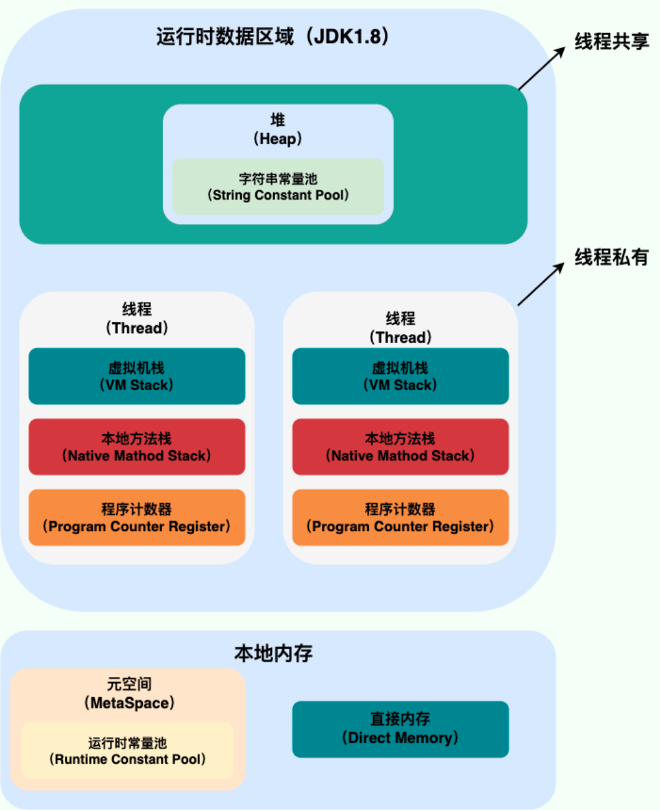
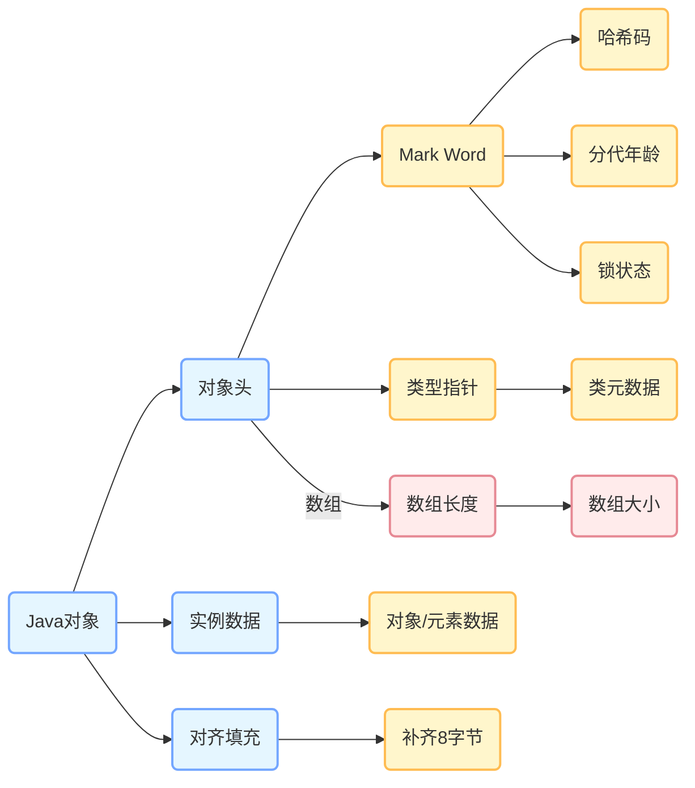
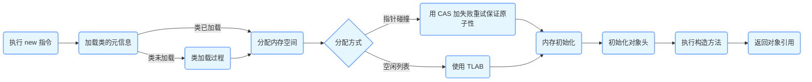
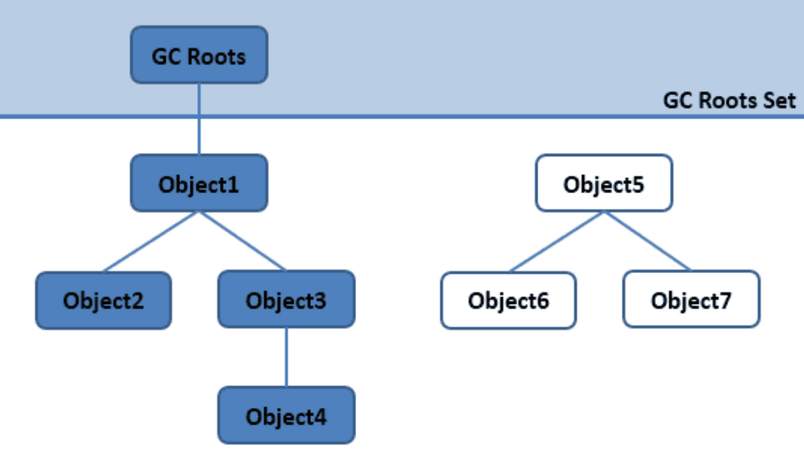
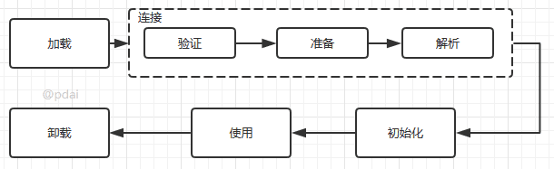
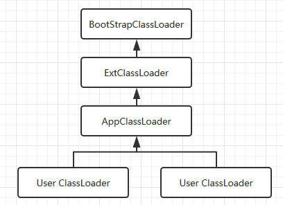

| 版本 | 内容         | 时间                |
| ---- | ------------ | ------------------- |
| V1   | 新建         | 2023-12-12 21:24:00 |
| V2   | 更新部分文案 | 2025-04-21 02:19:10 |
| V3   | 修改错误     | 2026-06-11 13:10:02 |

> JDK8 垃圾回收器官方文档 https://docs.oracle.com/javase/8/docs/technotes/guides/vm/gctuning/
>
> JDK11 垃圾回收器官方文档 https://docs.oracle.com/en/java/javase/11/gctuning/index.html

## JVM 内存区域的一些概念

### JVM 内存区域划分

JDK 8



1. <font color="purple"><b>程序计数器</b></font>：是一块较小的内存区域，用于记录当前线程执行的字节码指令地址；<font color="purple"><b>(线程私有)</b></font>
2. <font color="purple"><b>Java 虚拟机栈</b></font>：每个线程在运行时都会创建一个 Java 虚拟机栈，用于存储方法的局部变量、操作数栈、动态链接、方法出口等信息，每一个方法从调用直至执行完成的过程，就对应着一个栈帧在虚拟机栈中入栈到出栈的过程；<font color="purple"><b>(线程私有)</b></font>
3. <font color="purple"><b>本地方法栈</b></font>：与 Java 虚拟机栈类似，但是用于执行本地方法；
4. <font color="purple"><b>Java 堆</b></font>：是 JVM 中最大的一块内存区域，用于存储 Java 对象实例，被所有线程共享；<font color="purple"><b>(线程共享)</b></font>
5. <font color="purple"><b>方法区</b></font>：用于存储已被虚拟机加载的类信息、常量、静态变量、即时编译器编译后的代码等数据；<font color="purple"><b>（线程共享）</b></font>
   1. 在 JDK 1.8 之前，方法区也被称为 “永久代”
   2. JDK 1.8 及以后，使用<font color="purple"><b>元空间（MetaSpace）</b></font>代替了永久代，元空间使用的是<font color="purple"><b>本地内存</b></font>。
6. <font color="purple"><b>运行时常量池</b></font>：它是方法区的一部分，Class 文件中除了有类的版本、字段、方法、接口等描述信息外，还有一项信息是常量池表（Constant Pool Table），用于存放编译期生成的各种字面量和符号引用，这部分内容将在类加载后存放到方法区的运行时常量池中。
7. <font color="purple"><b>直接内存</b></font>：JVM 中的一块非 Java 堆区域，用于存储 NIO（New Input/Output）缓冲区；

### 程序计数器的作用？线程私有吗？是否会发生 OOM？

程序计数器（Program Counter Register）是一块较小的内存空间，它可以看作是<font color="purple"><b>当前线程所执行的它存储的是**字节码指令偏移地址**</b></font>。

- <font color="purple"><b>字节码解释器工作依据</b></font>：在 JVM 的概念模型里，字节码解释器工作时就是通过改变这个计数器的值来选取下一条需要执行的字节码指令。比如在执行顺序结构代码时，程序计数器会依次递增，指向下一条要执行的指令；当遇到条件分支、循环、跳转等语句时，程序计数器会根据具体的逻辑<font color="purple"><b>将值调整到相应的指令地址</b></font>，从而实现程序的流程控制。
- <font color="purple"><b>线程上下文切换</b></font>：在多线程环境下，线程是轮流执行的，当一个线程的执行被暂停，另一个线程开始执行时，每个<font color="purple"><b>线程</b></font>都需要<font color="purple"><b>记住</b></font>自己当前执行到了<font color="purple"><b>哪一条字节码指令</b></font>。程序计数器就为每个线程保存了这个执行位置信息，当线程恢复执行时，能够根据程序计数器的值继续从上次中断的地方接着执行。

线程私有，不会发生 OOM：

- 程序计数器是<font color="purple"><b>线程私有</b></font>的；
- <font color="purple"><b>不会发生 OOM</b></font>：它是 JVM 运行时数据区中，唯一虚拟机规范未规定会抛出 OOM 的区域。它仅存储一个固定长度的指令地址，内存占用极小且空间不会动态扩张，因此永远不会内存溢出。

### 虚拟机栈和本地方法栈？线程私有吗？是否会发生 OOM？

**概念**

虚拟机栈和本地方法栈是JVM（Java Virtual Machine）中的两个重要的内存区域，分别用于存储Java方法和本地方法（native method）的执行信息。<font color="blue"><b>它描述的是 Java 方法执行的内存模型，每个方法在执行的同时都会创建一个栈帧（Stack Frame）</b></font>，用于存储局部变量表、操作数栈、动态链接、方法出口等信息。每一个方法从调用直至执行完成的过程，就对应着一个栈帧在虚拟机栈中入栈到出栈的过程。

> 虚拟机栈的大小可以通过-Xss参数进行设置

**是否线程私有**

都是线程私有的。每个线程都有自己独立的虚拟机栈，不同线程之间的虚拟机栈互不干扰。这是因为每个线程的执行路径和方法调用序列是独立的，每个线程都需要有自己的栈来记录方法调用的状态和局部变量等信息。

**是否会发生 OOM**

可能会发生两种与内存相关的异常情况：

- <font color="blue"><b>StackOverflowError</b></font>：如果线程请求的栈深度大于虚拟机所允许的深度，就会抛出 `StackOverflowError` 异常。例如，在一个递归方法中，如果没有正确的终止条件，递归调用会不断进行，栈帧会不断入栈，最终导致栈深度超过虚拟机限制。
- <font color="blue"><b>OutOfMemoryError</b></font>：如果虚拟机栈可以动态扩展（当前大部分的 Java 虚拟机都可动态扩展），当扩展时无法申请到足够的内存时会抛出 `OutOfMemoryError` 异常。不过这种情况相对较少，因为一般情况下栈的扩展是有限制的。

### 堆？堆的作用？

**定义**：Java 堆是虚拟机所管理的内存中最大的一块区域。<font color="purple"><b>它是被所有线程共享的一块内存区域，在虚拟机启动时创建</b></font>。

**作用**：

- <font color="purple"><b>用于存储对象实例</b></font>。Java 堆是 JVM 中最大的一块内存区域，<font color="purple"><b>被所有线程共享</b></font>。它是<font color="purple"><b>由垃圾回收器进行管理和维护的</b></font>，可以动态地分配和释放内存。Java 堆的大小可以通过 JVM 启动参数使用 -Xmx（初始堆大小）和 -Xms（最大堆大小）进行设置；
- <font color="purple"><b>垃圾回收的主要区域</b></font>：由于堆中存储了大量的对象实例，随着程序的运行，会有一些对象不再被引用，成为垃圾对象。Java 堆是垃圾收集器管理的主要区域。<font color="purple"><b>垃圾收集器会定期或在必要时对堆进行扫描，识别并回收那些不再被引用的对象所占用的内存空间，以保证堆的有效利用</b></font>。

**实现**：<font color="purple"><b>Java 堆是 JVM 向操作系统申请的内存区域，其内存管理底层基于**指针、链表、**等数据结构实现，例如使用**空闲列表（链表）**管理不连续内存，使用**指针碰撞**管理连续内存。</b></font>的数据结构，其中每个元素都是一个对象实例。Java 堆的<font color="purple"><b>内存分配通常是通过指针碰撞或空闲列表实现的</b></font>。当需要分配内存时，JVM 分配器会搜索堆中的空闲内存块，并将其分配给对象实例。当对象实例不再被引用时，垃圾回收器会将其标记为垃圾，并在需要时将其回收；

**堆大小**：Java 堆的大小对程序的性能和稳定性都有很大的影响。<font color="purple"><b>如果 Java 堆的大小过小，将会导致频繁的垃圾回收和内存分配，从而降低程序的性能。如果 Java 堆的大小过大，将会浪费系统资源，从而导致系统稳定性的问题</b></font>。因此，在设置 Java 堆的大小时，需要根据程序的实际情况进行调整；

### 方法区存放的什么东西？

**方法区概念和存放的内容：**

方法区（Method Area）是 Java 虚拟机中的一块内存区域，用于存储<font color="blue"><b>类的元数据、静态变量、常量池</b></font>、即时编译器编译后的代码等数据。它是所有<font color="blue"><b>线程共享</b></font>的内存区域，与 Java 堆一样，也是在 Java 虚拟机启动时就被创建的。方法区通常被划分为以下几个部分：

1. <font color="blue"><b>运行时常量池</b></font>：用于存储编译时生成的各种字面量和符号引用。字面量包括字符串常量、基本数据类型的常量值等。符号引用包括类和接口的全限定名、字段的名称和描述符、方法的名称和描述符等
2. <font color="blue"><b>类的元数据</b></font>：包括类的全限定名、父类信息、接口信息、字段信息、方法信息等。这些信息描述了类的结构和行为，JVM 在加载类时会将这些信息存储在方法区中。例如，类的字段信息包含了字段的名称、类型、修饰符等；方法信息包含了方法的名称、参数列表、返回类型、方法体的字节码等。
3. <font color="blue"><b>静态变量</b></font>：类的静态变量也存储在方法区中。静态变量是属于类的，而不是属于某个对象的，因此所有对象共享这些静态变量。
4. <font color="blue"><b>即时编译器编译后的代码</b></font>：JVM 在运行时会使用即时编译器（JIT）将热点代码（频繁执行的代码）编译成机器码，以提高程序的执行效率。编译后的机器码也会存储在方法区中。

**方法区的实现方式**：

- <font color="blue"><b>JDK 8 之前</b></font>：方法区也被称为 “永久代”（Permanent Generation）。永久代有固定的大小限制，可以通过 `-XX:MaxPermSize` 参数来设置其最大大小。永久代使用的是 JVM 的堆内存，因此受到堆内存管理的影响。
- <font color="blue"><b>JDK 8 及以后</b></font>：使用元空间（MetaSpace）代替了永久代。元空间使用的是本地内存（Native Memory），而不是 JVM 的堆内存。元空间的大小可以动态扩展，只受限于系统的可用内存。可以通过 `-XX:MetaspaceSize` 和 `-XX:MaxMetaspaceSize` 等参数来进行配置。

### 符号引用是什么？

符号引用是一种用来描述所引用目标的符号表示，它是一种抽象的引用形式，并非直接指向内存中的实际地址。

- 编译时，编译器并不知道所引用的类、方法或者字段在运行时的具体内存地址，所以就用<font color="purple"><b>符号引用来表示这些引用关系</b></font>。
- 等到类加载过程中，JVM 会把这些符号引用解析成直接引用（即<font color="purple"><b>实际的内存地址</b></font>）。

常见的符号引用的类型：

- <font color="purple"><b>类和接口的符号引用</b></font>：包括类和接口的全限定名、访问修饰符、父类和接口列表等信息；
- <font color="purple"><b>字段的符号引用</b></font>：包括字段所属的类或接口、字段的名称和类型等信息；
- <font color="purple"><b>方法的符号引用</b></font>：包括方法所属的类或接口、方法的名称、参数类型和返回值类型等信息；

符号引用和直接引用：

- <font color="purple"><b>符号引用与直接引用的区别在于，符号引用是一个符号名称，而直接引用则是一个指向具体内存地址的指针</b></font>。在 Java 虚拟机中，符号引用需要在类加载的过程中被解析成为直接引用，从而使得 Java 代码能够正确地执行；

在 JVM 中的处理过程:

- <font color="purple"><b>编译阶段</b></font>：Java 源文件编译成字节码文件时，编译器会把代码中对类、方法、字段的引用转换为符号引用，并存储在字节码文件的常量池表中。
- <font color="purple"><b>类加载阶段</b></font>：当 JVM 加载一个类时，会读取字节码文件中的常量池，其中包含了各种符号引用。在类的链接阶段，JVM 会对这些符号引用进行解析，将其转换为直接引用。解析过程可能涉及到查找类的定义、验证引用的合法性等操作。
- <font color="purple"><b>运行阶段</b></font>：在程序运行时，当调用方法或访问字段时，JVM 会使用解析后的直接引用找到对应的内存地址，从而执行相应的操作。

### 运行时常量池？

**定义**：运行时常量池是方法区的一部分，它是类或接口的常量池在运行时的表现形式。Class 文件中除了有类的版本、字段、方法、接口等描述信息外，还有常量池表，用于存放编译期生成的各种字面量和符号引用，这部分内容在类加载后会存放到方法区的运行时常量池中。

**每个类或接口有自己的运行时常量池**：方法区是线程共享的内存区域。运行时常量池在类加载时创建，**每个类或接口都拥有独立的运行时常量池**，内容与当前类或接口的代码信息一一对应。

**作用**：

- 存储编译期产生的字面量与符号引用，并在类加载解析阶段，将符号引用转换为直接引用，支撑代码正常访问类、字段、方法；

- 具备动态性：允许程序在运行期间向池中添加新的常量，最典型的场景是 `String.intern()` 方法。

## 对象的布局、创建流程、生命周期

### 对象的内存布局


```mermaid
graph LR
    classDef main fill:#E5F6FF,stroke:#73A6FF,stroke-width:2px
    classDef sub fill:#FFF6CC,stroke:#FFBC52,stroke-width:2px
    classDef optional fill:#FFEBEB,stroke:#E68994,stroke-width:2px
    
    A(Java对象):::main --> B(对象头):::main
    A --> C(实例数据):::main
    A --> D(对齐填充):::main
    
    B --> B1(Mark Word):::sub
    B --> B2(类型指针):::sub
    B -->|数组| B3(数组长度):::optional
    
    B1 --> B11(哈希码):::sub
    B1 --> B12(分代年龄):::sub
    B1 --> B13(锁状态):::sub
    
    B2 --> B21(类元数据):::sub
    B3 --> B31(数组大小):::optional
    
    C --> C1(对象/元素数据):::sub
    D --> D1(补齐8字节):::sub
```

Java 对象的内存布局由三部分组成：对象头、实例数据和对齐填充。

1. <font color="purple"><b>对象头</b></font>：对象头是 Java 对象在内存中的开头部分，用于存储对象的元数据信息，包括
   1. <font color="purple"><b>Mark Word</b></font>：哈希码、分代年龄、锁状态、线程 ID；
   2. <font color="purple"><b>类型指针</b></font>：指向类元数据（方法区），Java 虚拟机通过这个指针来确定这个对象是那个类的实例；
   3. <font color="purple"><b>如果对象是数组就有数组长度</b></font>。
2. <font color="purple"><b>实例数据</b></font>：实例数据是 Java 对象中实际<font color="purple"><b>存储的成员变量数据</b></font>，包括基本类型数据、引用类型数据、数组类型数据等。实例数据的大小取决于对象中包含的成员变量数量和类型，不同的对象实例的实例数据大小可能不同；
3. <font color="purple"><b>对齐填充</b></font>：由于 Java 虚拟机要求对象必须是 8 字节的整数倍，因此在实例数据末尾可能会添加一些无用的填充字节，以确保对象的大小是 8 字节的整数倍；

需要注意的是，Java 对象的内存布局可能会受到虚拟机实现的影响，不同的虚拟机实现可能会有不同的实现方式。此外，Java 对象的大小也可能会受到对象头、对齐填充等因素的影响，因此在计算对象的大小时需要考虑这些因素；

### 对象的创建流程？给对象分配内存时的并发安全问题是如何解决的？


```mermaid
graph LR
    classDef process fill:#E5F6FF,stroke:#73A6FF,stroke-width:2px
    A(执行 new 指令):::process --> B(加载类的元信息):::process
    B -->|类未加载| B1(类加载过程):::process
    B -->|类已加载| C(分配内存空间):::process
    B1 --> C
    C --> C1{分配方式}:::process
    C1 -->|指针碰撞| C2(用 CAS 加失败重试保证原子性):::process
    C1 -->|空闲列表| C3(使用 TLAB):::process
    C2 --> D(内存初始化):::process
    C3 --> D
    D --> E(初始化对象头):::process
    E --> F(执行构造方法):::process
    F --> G(返回对象引用):::process
```

当 JVM 执行 new Object() 时，大致会经历以下步骤

1. <font color="blue"><b>加载类的元信息</b></font>：当 Java 程序执行 new 指令时，虚拟机首先会检查该指令的参数是否能在常量池中定位到一个类的符号引用，并且检查这个符号引用代表的<font color="blue"><b>类是否已经被加载和初始化</b></font>。如果没有，则需要先进行类的加载过程，包括加载、验证、准备、解析和初始化等阶段，确保类的元数据信息加载到方法区中。
2. <font color="blue"><b>分配内存空间</b></font>：在类加载检查通过后，对象的大小已经确定，虚拟机需要为新对象分配内存。内存的分配方式有两种：<font color="blue"><b>指针碰撞（内存规整，只需要移动空闲指针即可）</b></font>和<font color="blue"><b>空闲列表（内存碎片化，JVM 维护空闲列表快进行分配）</b></font>；

3. <font color="blue"><b>零值初始化</b></font>：内存分配完成后，虚拟机需要将分配到的内存空间都<font color="blue"><b>初始化为零值</b></font>（不包括对象头）。这一步保证了对象的实例变量在对象创建时就可以被赋予默认的初始值，使得程序员在使用对象时不需要为每个实例变量都显式地赋初值。

4. <font color="blue"><b>初始化对象头</b></font>：在分配内存空间之后，Java 虚拟机会初始化对象头。例如这个对象是<font color="blue"><b>哪个类的实例</b></font>、如何才能找到<font color="blue"><b>类的元数据</b></font>信息、对象的哈希码、对象的分代年龄等信息。数组对象还会分配数组长度。

5. <font color="blue"><b>执行`<init>`()</b></font>：Java 虚拟机会执行对象的构造方法，完成对象的初始化工作。在构造方法中，<font color="blue"><b>完成成员变量的复制、实例代码块执行、构造方法逻辑执行</b></font>

6. <font color="blue"><b>返回对象引用</b></font>：在对象初始化完成之后，Java 虚拟机会返回对象的引用，这个引用可以被存储在局部变量、成员变量、静态变量等位置，用于后续的操作。


解决并发分配安全问题：多个线程可能同事分配对象，为了保证多线程下分配内存的安全性，JVM 采用两种方案：

- **CAS + 失败重试**：对内存指针进行原子更新，失败则重试；
- **TLAB**（**本地线程分配缓冲TLAB**）：每个线程在堆中预先分配一块私有缓冲区，线程私有分配，无竞争。一个本地缓冲区用完了才回去加上同步锁定去分配新的缓冲区。

> Thread Local Allocation Buffer：Eden 区中的线程私有缓冲区

### 内存分配的指针碰撞和空闲列表

**指针碰撞**：

- <font color="purple"><b>概念</b></font>：在<font color="purple"><b>连续的内存空间</b></font>中分配变量或对象的方式。在指针碰撞中，Java 虚拟机使用一个<font color="purple"><b>指针</b></font>来记录当前<font color="purple"><b>可用的内存空间的起始地址</b></font>，每当分配一个对象时，就将指针向后移动对象所需的内存大小，以便为下一个对象分配内存空间。
- <font color="purple"><b>优点</b></font>：实现简单，分配速度快，适合于内存空间较为连续的情况。
- <font color="purple"><b>缺点</b></font>：当内存空间不连续时，就无法使用指针碰撞的方式进行内存分配。
- <font color="purple"><b>适用场景</b></font>：这种方式适用于使用<font color="purple"><b>标记-整理</b></font>算法或者<font color="purple"><b>复制算法</b></font>的垃圾收集器，因为这些算法会对内存进行规整，使得内存空间是连续的。例如，在使用 Serial、ParNew 等垃圾收集器时，就可以采用指针碰撞的方式来分配内存。
- <font color="purple"><b>并发问题及解决办法</b></font>：在多线程环境下，指针碰撞可能会出现并发问题，因为多个线程可能同时修改指针的位置。为了解决这个问题，JVM 通常会采用 CAS 加上失败重试的方式来保证内存分配的原子性。也就是说，当一个线程尝试移动指针分配内存时，会先比较指针的当前值是否和预期值相同，如果相同则进行更新操作，否则重试。为了进一步提升效率，JVM 还使用 **TLAB（本地线程分配缓冲）**，每个线程在堆中预先申请一小块私有内存，无锁分配，速度更快。

**空闲列表**：

- <font color="purple"><b>概念</b></font>：<font color="purple"><b>空闲列表</b></font>是一种在<font color="purple"><b>非连续的内存空间</b></font>中分配变量或对象的方式。在空闲列表中，Java 虚拟机使用一个链表来记录可用的内存空间，每当分配一个对象时，就从链表中找到一个足够大的内存块，将其分配给对象。
- <font color="purple"><b>优点</b></font>：可以处理非连续的内存空间，避免了指针碰撞的缺点
- <font color="purple"><b>缺点</b></font>：缺点也很明显，即链表的遍历和维护需要消耗时间和空间，分配速度相对较慢；
- <font color="purple"><b>适用场景</b></font>：这种方式适用于使用<font color="purple"><b>标记-清除</b></font>算法的垃圾收集器，因为该算法不会对内存进行规整，会产生内存碎片，导致内存空间不连续。例如，CMS（Concurrent Mark Sweep）垃圾收集器就会采用空闲列表的方式来分配内存。
- <font color="purple"><b>并发问题及解决办法</b></font>：空闲列表在多线程环境下分配内存时，会存在线程安全问题，多个线程可能同时操作空闲链表。为了解决这个问题，JVM 采用 **CAS 或 同步锁** 来保证空闲列表修改的原子性。

### 对象在堆中的生命周期

**Serial / ParNew 垃圾收集器**

1. 在 JVM 内存模型的堆中，堆被划分为新生代和老年代（1:2），新生代又被进一步划分为 **Eden区** 和 **Survivor区**，Survivor 区由 **From Survivor** 和 **To Survivor** 组成

   ```
   堆
   ├── 新生代（1/3）
   │   ├── Eden 80%
   │   ├── S0 10%
   │   └── S1 10%
   │
   └── 老年代（2/3）
   ```

2. 新建对象**优先分配到新生代 Eden 区**，对象头会记录**分代年龄**（记录在 Mark Word 中），参数 `-XX:MaxTenuringThreshold` 规定对象晋升老年代的最大年龄阈值。

3. 当 Eden 区空间不足时，触发 **Minor GC（新生代 GC）**：Eden + From Survivor 中存活对象会被复制到 To Survivor 区，对象分代年龄 +1；后续每次经历 Minor GC，年龄都会递增，同时 From、To 两区会互换角色。

4. 特殊分配规则：如果对象大小超过参数 `-XX:PretenureSizeThreshold` 设定的值，**大对象会直接分配到老年代**，不进入新生代。不过也可能因为动态年龄判断提前进入老年代。

## 内存泄漏

### 内存泄漏有那些原因

Java 内存泄漏是指在 Java 程序运行时，不再使用的对象因为被意外持有强引用，也就是说，对象已经”逻辑无用“，但是仍然可达，导致无法被垃圾回收器回收，长期占用内存，最终导致程序性能下降、频繁 GC 甚至 OOM 的现象。

1. **对象没有被正确地释放**：Java中的垃圾回收机制可以自动回收不再使用的对象，但如果程序中存在对对象的强引用，即使对象不再使用，垃圾回收机制也无法回收该对象所占用的内存空间，从而导致内存泄漏。

   - 典型场景：**非静态内部类隐式持有外部类引用**，内部类生命周期过长导致外部类无法回收。

2. **集合类使用不当**：List、Map 等集合生命周期过长，使用后没有及时清空、移除元素，导致集合越来越大，引发内存泄漏。

   - 典型场景：**缓存使用不当**，使用缓存时若没有合理的清理机制，缓存中的对象会不断增加并占用内存。

3. **资源未关闭**：IO 流、数据库连接、Socket 连接等资源使用完未关闭，会造成资源泄漏与内存泄漏。资源未关闭会导致：

   - 文件句柄泄漏

   - Socket 泄漏

   - 数据库连接泄漏

   - 堆外内存泄漏

     并间接引发 JVM 内存压力。

4. **内存泄漏的第三方库**：使用第三方库时，如果该库中存在内存泄漏的问题，就会导致 Java 程序出现内存泄漏。

为了避免Java内存泄漏，需要**及时释放无用对象的引用、合理清理集合、用完资源立即关闭、谨慎使用静态变量**。同时，在使用第三方库时，也需要仔细查看该库是否存在内存泄漏的问题。

### 如何定位内存泄漏

<font color="purple">观察系统表现</font>

- **内存使用监控**：运用系统自带的监控工具（Linux 的 `top`、`htop` 或者 `free` 命令）来实时监控 Java 进程的内存使用状况。如果 Full GC 后，堆内存占用仍持续增长且无法回落，则可能存在内存泄漏。
- **性能分析**：借助 Java 自带的性能分析工具，例如 `jstat`、`jconsole`、`jvisualvm` 等，来监控 Java 堆内存、非堆内存、GC 频率等指标。若 Full GC 频繁，并且 GC 后内存占用仍无明显下降，则可能存在内存泄漏。

<font color="purple">生成堆转储文件</font>

- **手动触发**：在程序运行期间，可以使用 `jmap` 命令手动触发堆转储文件的生成。例如：

  ```
  jmap -dump:format=b,file=heapdump.hprof <pid>
  ```

  其中，`<pid>` 是 Java 进程的进程 ID，`heapdump.hprof` 是生成的堆转储文件的文件名。

  > 最佳时机：Full GC 后 dump，理论上只剩存活对象，最容易发现泄露。

- **自动触发**：也可以通过设置 JVM 参数，例如：

  ```
  -XX:+HeapDumpOnOutOfMemoryError -XX:HeapDumpPath=/path/to/dump/file
  ```

  当程序发生 `OutOfMemoryError` 时，会自动在指定路径下生成堆转储文件。

<font color="purple">分析堆转储文件</font>

查看泄漏对象到 GC Roots 的引用链，找到泄漏对象是通过什么样的引用路径、与那些 GC Roots 对象关联，才导致垃圾回收器无法回收它们

- Eclipse Memory Analyzer（MAT）：这是一款功能强大的堆转储文件分析工具。它可以帮助你找出内存中占用大量空间的对象、对象之间的引用关系等。
- **VisualVM**：除了可以监控 Java 进程的性能指标外，VisualVM 也可以用于分析堆转储文件。在 VisualVM 中导入堆转储文件后，可以查看对象的分布情况、对象的引用关系等。

## GC 垃圾回收

### **如何判断对象已经死亡？**



1. 可达性分析算法是Java虚拟机中常用的内存管理方式之一，它通过**从一组根对象开始，遍历所有可达对象，将不可达的对象标记为垃圾对象**，最后将垃圾对象回收。可达性分析算法的基本思路是：
   1. **根对象的选择**：根对象包括方法区中的静态属性引用的对象、虚拟机栈、本地虚拟机栈中引用的对象，同步锁持有的对象；
   2. **根对象的遍历**：从根对象开始，沿着对象之间的引用链，遍历所有可达对象，将所有可达的对象标记为存活对象；
   3. **垃圾对象的回收**：遍历完成后，不可达对象会被判定为可回收对象，后续由垃圾收集器回收；
2. 可达性分析算法的优点是可以处理循环引用的情况，避免了引用计数器的问题。但是，可达性分析算法有一个缺点，就是**在对象引用链较长时，遍历所有对象可能会比较耗时，影响程序的性能**；**分析过程需要暂停用户线程（STW）**，否则引用关系不断变化会导致分析结果不准确。为了降低停顿时间，JVM 使用了**分代回收、并发回收、增量回收**等优化策略，提升 GC 效率。

### **有哪些对象是 GC Root 对象？**

1. **虚拟机栈**中引用的对象（栈帧中的本地变量表），**参数**、**局部变量**等，方法执行完毕后，栈帧销毁，该引用随之失效，对应对象不再被 GC Roots 引用。
2. 方法区中**静态变量**引用的对象。静态变量生命周期与类一致，只要类未被卸载，引用就一直存在。
3. 方法区中**常量引用的对象**，典型如字符串常量池中的常量对象；
4. 本地方法栈中（Native 方法）引用的对象；
5. JVM 内部引用的对象：基本数据类型对应的 Class 对象、系统常驻异常类、JVM 内置实例等。
6. 所有被**同步锁持有的对象**；

### **Java 的引用有那些？分别的特点是什么？**

1. **强引用（Strong Reference）**：强引用是指在程序中显式地使用 new 操作符创建的对象所持有的引用。只要强引用存在，垃圾回收器就不会回收该对象；
2. **软引用（Soft Reference）**：软引用是一种有用的引用类型，它可以让对象存活更长的时间，**直到内存不足时才被回收**。在Java中，我们可以使用 SoftReference 类来创建软引用对象；
3. **弱引用（Weak Reference）**：弱引用是一种比软引用更弱的引用类型，它的生命周期更短，**只要发生 GC，垃圾回收器就会回收该对象**。在Java中，我们可以使用WeakReference类来创建弱引用对象；典型应用就是 ThreadLocal。
4. **虚引用（Phantom Reference）**：虚引用是一种最弱的引用类型，完全不影响对象生命周期，唯一作用：在对象被回收时收到一个系统通知。在Java中，我们可以使用PhantomReference类来创建虚引用对象；

| 引用类型         | 回收条件                 | 特点                                | 典型用途                       |
| ---------------- | ------------------------ | ----------------------------------- | ------------------------------ |
| 强引用 (Strong)  | 对象被强引用时不会被回收 | 普通对象引用                        | 普通对象                       |
| 软引用 (Soft)    | JVM 内存不足时回收       | 内存敏感缓存                        | 缓存，如图片缓存               |
| 弱引用 (Weak)    | 只要 GC 执行就可能回收   | 生命周期比软引用短                  | WeakHashMap、ThreadLocal key   |
| 虚引用 (Phantom) | 对象被回收时通知         | 不影响对象生命周期，get() 总是 null | 直接内存释放监控、清理对象资源 |

### **对分代收集理论的理解？为什么要分代？跨代引用问题是如何处理的？**

**为什么要分代？**

- 弱分代假说：**绝大多数的对象都是朝生夕灭的，也就是说，大部分对象在创建后很快就不再被使用，会在短时间内成为垃圾对象，可被垃圾回收器回收。**

- 强分代假说：**熬过越多次垃圾回收的对象就越难以消亡**，收集器应该按照回收对象的年龄分配到不同的区域之中。

- 跨代引用假说：跨代引用相对于同代引用仅占极少数。

基于这三个假说，分代收集理论将堆内存划分为不同的区域，每个区域对应不同生命周期的对象，**针对不同区域采用不同的垃圾回收策略，以提高垃圾回收的效率。**


**跨代引用问题**：

- 简单来说：在分代回收中，会出现：**老年代对象引用新生代对象** 的情况。如果进行 Minor GC（新生代回收）时，为了保证准确性，**必须扫描整个老年代**，效率极低。
- 如果不记录老年代引用的新生代，那么 Minor GC 可能会错误回收仍被引用的新圣代对象。


**跨代引用问题是如何处理的？**

- 使用 **记忆集（Remembered Set）** 解决。
  1. 在**新生代**中维护一个**记忆集**；记忆集的作用是：**记录老年代哪些区域存在对新生代的引用**；
  2. 具体实现使用 **卡表（Card Table）**，把内存划分为一个个卡片；
  3. 当发生 Minor GC 时，**只扫描记忆集记录的区域，不用扫描整个老年代**；
  4. 大幅降低 GC 扫描范围，提升回收效率。

### **说下垃圾清理算法有那些？**

1. **标记-清除算法（Mark-Sweep）**：该算法首先标记所有可达对象，然后清除所有不可达对象。但是该算法存在两个问题：1）标记和清除过程需要**遍历整个堆内存，效率较低**；2）清除后会产生**内存碎片**，不利于后续对象的分配；适用老年代、CMS 收集器。
   - 先标记存活对象 → 然后清除未标记的垃圾对象
2. **复制算法（Copying）**：该算法将内存分为两个区域，每次只使用其中一个区域，当该区域无法再分配时，将其中的存活对象复制到另一个区域中，然后清除该区域的所有对象。该算法解决了内存碎片问题，但是需要将存活对象复制到另一个区域，导致空间浪费；适用新生代，因为对象存活率较低。
   - 将内存分为两块 → 只使用一块 → 存活对象复制到另一块 → 清空当前块
3. **标记-整理算法（Mark-Compact）**：该算法先标记所有可达对象，然后将所有存活对象向一端移动，然后清除该端以外的所有对象。该算法解决了内存碎片问题，但是需要移动存活对象，需要暂停所有的用户线程，导致效率较低；适用老年代，对象存活率高。
   - 先标记存活对象 → 让存活对象向一端移动 → 清除端以外的所有内存
4. **分代算法（Generational）**：该算法将内存分为多个年代，每个年代的存活时间不同，一般将新创建的对象放入新生代，存活时间短，然后将存活时间较长的对象放入老年代。**新生代对象存活率低，一般采用复制算法，老年代对象存活率高，采用标记-整理或者标记-清除算法**。该算法充分利用了对象存活时间的特点，提高了垃圾回收效率；


### **谈谈你对新生代的分区占比的理解？为什么要按这样的比例划分？**

新生代按照 **Eden:From:To = 8:1:1** 划分，原因如下：

1. **绝大多数对象朝生夕死，新生代中超过 98% 的对象都是熬不过第一次垃圾回收的**，所以 Eden 占最大空间（80%）。
2. Survivor 区使用**复制算法**，必须分成**两个大小相等的区域**。存活对象少，Survivor 不需要大空间，各占 10% 足够。
3. 该比例能**最大化内存利用率**，同时保证 GC 效率最高。


### JVM 内存分配策略

**这套对象分配与内存担保机制，是基于传统分代回收设计的，适用于 Serial、ParNew、CMS 等经典垃圾收集器。**

- **对象优先在 Eden 区分配**

  大多数情况下，对象在新生代 Eden 区分配，当 Eden 区空间不够时，发起 Minor GC。

- **大对象直接进入老年代**

  大对象是指需要连续内存空间的对象，大对象需要**连续内存**，新生代剩余碎片化空间无法满足时，会触发 GC；。-XX:PretenureSizeThreshold，大于此值的对象直接在老年代分配，**避免在 Eden 区和 Survivor 区之间的大量内存复制。**

  > 该参数**对 G1 收集器无效**，仅作用于 Serial、ParNew。

- **长期存活的对象进入老年代**

  为对象定义年龄计数器，对象在 Eden 出生并经过 Minor GC 依然存活，将移动到 Survivor 中，年龄就增加 1 岁，增加到一定年龄则移动到老年代中。-XX:MaxTenuringThreshold 用来定义年龄的阈值。

- **动态对象年龄判定**

  虚拟机并不是永远地要求对象的年龄必须达到 MaxTenuringThreshold 才能晋升老年代。若 Survivor 区内**同一年龄的对象总容量**超过 Survivor 区域的一半，该年龄及以上的对象可直接晋升老年代。

- **空间分配担保**

  执行 Minor GC 前，JVM 会判断老年代空间，为新生代存活对象做迁移担保：

  - 先检查老年代最大连续可用空间，是否大于新生代所有对象总容量。若满足，Minor GC 安全，正常执行。
  - 若不满足，再判断老年代空间是否大于历次晋升对象的平均大小：
    1. 大于：冒险执行 Minor GC；若后续出现担保失败，会触发 Full GC；
    2. 小于：直接执行 Full GC。
  
  > 补充：JDK6 Update24 之后，默认关闭动态判断，空间不足时直接触发 Full GC。


### 垃圾回收的安全点的概念？如何让所有线程在垃圾回收前都跑到安全点位置停顿下来？

**安全点就是代码中一段 “线程执行状态可以被安全保存” 的位置**：GC 要进行**可达性分析**，必须让所有用户线程**暂停（STW）**，但线程不能随便停，必须停在**对象引用关系不会变化**的位置，这个位置就是 **Safe Point**。

安全点选在哪里？（高频考点）

1. **方法调用之前 / 之后**
2. **循环结束**
3. **异常处理跳转**
4. **方法返回**


JVM 用两种方式让线程跑到安全点停顿：

① 抢先式中断（Preemptive Suspension）

- **JVM 直接中断所有线程**
- 如果线程不在安全点，就让它继续执行，跑到安全点再停
- **现在几乎不用**

② 主动式中断（Volatile Suspension）——**HotSpot 默认使用**

- JVM 设置一个 **中断标志**（volatile 变量）
- 线程执行时**不断主动轮询这个标志**
- 发现标志为真，就自动跑到最近的安全点**主动停顿**
- GC 完成后，标志复位，线程继续执行


### 垃圾回收有了安全点为什么还要安全区域？

安全点依赖**线程不断执行代码、轮询中断标记**，才能走到安全点并暂停。

但存在一类场景：线程可能没抢到 CPU 资源**线程处于休眠 / 阻塞状态，完全不执行代码**，这时候线程无法响应虚拟机的中断请求，不能走到安全点来中断挂起自己。


安全区域是**一段代码片段**，区域内所有位置都属于广义安全点。

线程一旦进入安全区域，就算全程不执行代码、阻塞休眠，引用关系也不会发生变化，GC 可以放心把它当作 “已到达安全点” 处理。


1. **安全点的短板**

   安全点要求线程**持续运行代码**，才能轮询标记、进入停顿。

   如果线程调用 `sleep()`、`wait()`、阻塞在锁 / IO 上，线程不再执行指令，就无法主动走到安全点，会导致 GC 迟迟无法开始。
2. **安全区域的作用**：专门适配**阻塞、休眠、挂起**的线程：

- 线程进入阻塞 / 休眠前，主动进入**安全区域**，并向 JVM 标记自己处于安全状态；
- GC 期间，JVM 直接认定该线程状态安全，无需等待它跑到安全点；
- 线程唤醒、离开安全区域前，会先检查 GC 是否还在进行：若 GC 未结束，线程就暂停，直到 GC 完成再继续执行。


### **简单说下 ParNew 回收器？**

**ParNew 是 Serial 的多线程并行版本**，是一款新生代垃圾收集器。他是新生代 + 复制算法 + 多线程 + STW

- 采用 **复制算法**
- 负责回收 **新生代**
- 是 **CMS 老年代收集器唯一能配合使用的新生代收集器**


原理：

- **多线程并行回收**：ParNew 会开启多个 GC 线程并行执行 Minor GC，默认线程数由 JVM 根据 CPU 核数动态计算，若机器核心数量众多，可通过 `-XX:ParallelGCThreads` 参数对垃圾回收线程数加以限制。

- **内存分配策略**：采用基于指针碰撞的内存分配策略。在这种策略下，空闲内存呈现规整排列，所有用过的内存处于一边，空闲的内存处于另一边，中间由一个指针作为分界点。分配内存时，只需将指针向空闲内存一侧移动与对象大小相等的距离即可，这种方式能快速分配内存空间，提高内存分配效率。

- **与 CMS 搭配使用**：ParNew + CMS 是经典的低延迟 GC 组合：

  - ParNew 负责新生代多线程 Minor GC
  - CMS 负责老年代并发回收

  CMS 将老年代大部分回收阶段改为与用户线程并发执行，从而显著降低 Full GC 停顿时间。

  但 Young GC（Minor GC）阶段依然会 Stop-The-World。


回收流程：

1. **对象先进入 eden**：新对象优先分配到 Eden，对象头的 mark word 会记录对象的分代年龄。
2. **Eden 满了 -> 触发 Minor GC**，当 Eden 空间不足时，触发 Minor GC，此时 STW 所有用户线程暂停。
3. **GC Roots 可达性分析**：从 GC Roots 开始扫描，找出那些对象还活着。
4. **存活对象复制到 To Survivor**：存活对象从 Eden / From Survivor，复制到 To Survivor，同时对象年龄 +1。
5. **年龄达到阈值 -> 晋升老年代**：默认 15 次 Minor GC，对象就会进入老年代。
6. **清空 Eden 和 From**：复制完成后，Eden 和 From Survivor 整体清空，因为垃圾对象根本没复制，这也是复制算法效率高的原因。
7. **From / To 交换**：GC 后，To Survivor 变成下一次的 From Survivor，两块 Survivor 轮流切换。


跨代引用问题：参考下个问题，JVM 的卡表。


### **JVM 的卡表？作用是什么？什么时候更新卡表？**

**卡表是 JVM 用来记录 “跨代引用” 的一个字节数组（byte []）。**

- 把**整个堆**分成固定大小的 “**卡页 Card Page**”，默认 **512 字节**
- 每个卡页对应卡表中的**一个字节**
- 字节值：
  - **0 = 干净（Clean）**：这一块里**没有**老年代→新生代引用
  - **非 0 = 脏卡（Dirty）**：这一块里**可能有**老年代→新生代引用


背景

- 新生代 GC 很频繁
- 新生代对象可能被**老年代对象引用**
- 按 GC 规则：**被老年代引用的新生代对象 = 存活对象，不能回收**
- 如果没有卡表：**每次 YGC 都要遍历整个老年代找引用 → 巨慢**

卡表解决了什么

卡表只记录：**哪几块老年代内存里有指向新生代的引用**

YGC 时：

- **只扫描脏卡对应的那几小块老年代**
- 不需要扫整个老年代 → **速度提升巨大**

一句话总结：**卡表 = 老年代对新生代的 “引用地图”，让 YGC 只扫必要区域，不扫全堆。**


**老年代对象 → 新生代对象 的引用赋值**

```java
oldObj.field = youngObj;
```

只要发生这种赋值，**JVM 写屏障自动执行**：

1. 计算 oldObj 所在卡页
2. 把对应卡表字节设为**脏（非 0）**


**卡表：全局字节数组，记录 “哪块内存有跨代引用”**

**记忆集 RSet：G1 用，记录 “谁引用了我这个 Region”**

> **G1 的 RSet 底层就是靠卡表来构建和维护的**


✅ **Serial、ParNew、CMS**：用卡表做跨代引用追踪

✅ **G1**：全局卡表 + 每个 Region 的 RSet


总的来说：**卡表是一个 512 字节为单位的字节数组，用来记录老年代到新生代的跨代引用；主要作用是让新生代 GC 只扫描脏卡区域，避免全堆扫描；在发生老年代对象引用新生代对象的赋值时，通过写屏障把对应卡页标记为脏卡。**


### **吞吐量是什么？**

1. 吞吐量（Throughput）是指在**单位时间内完成的任务数量或数据量**。在计算机科学中，吞吐量通常指在一段时间内，计算机系统能够处理的事务或数据量。吞吐量是衡量系统性能的重要指标之一，可以用来评估计算机系统的处理能力和效率；
2. 在 JVM 中，吞吐量通常用来衡量垃圾回收的效率和性能。
   - 吞吐量 = 运行用户代码时间 / (运行用户代码时间 + 运行垃圾收集时间)；
   - 以程序运行 100 分钟，其中垃圾回收花费 5 分钟，执行用户代码 95 分钟为例，计算吞吐量的式子为：
     吞吐量 = 95 / (95 + 5) × 100% = 95%
3. 在实际应用中，吞吐量不是唯一的性能指标，还需要考虑其他因素，例如延迟、响应时间、并发等。因此，在评估计算机系统或 JVM 垃圾回收器的性能时，需要综合考虑各种因素，并根据应用程序的需求选择合适的性能指标进行评估和优化；


影响吞吐量的因素

- **垃圾回收器的选择**：

  不同收集器设计目标不同，吞吐量表现差异明显。`Parallel Scavenge` 系列以**高吞吐量**为核心，依靠多线程并行回收，压低 GC 整体耗时；而 CMS 侧重低延迟，并发、标记阶段会产生额外开销，吞吐量相对更低。

- **堆内存大小**：

  堆内存过小，对象很快占满空间，GC 会频繁触发，大幅拉低吞吐量；堆内存过大，单次 GC 的扫描、回收耗时会增加。需根据业务场景设置合理堆大小，在 GC 频率和单次耗时之间取得平衡。

- **对象创建和销毁的频率**：

  程序频繁创建、销毁短期临时对象，会不断触发 GC，持续占用 CPU 资源，进而降低应用有效运行的占比，吞吐量随之下降。

- 其他：

  - **GC 线程数**：线程数匹配 CPU 核心可提升回收效率，过多 / 过少都会拖慢速度；
  - **内存泄漏**：泄漏导致对象无法回收，堆空间被持续占用，GC 愈发频繁，严重影响吞吐量；


### **简单说下 CMS 回收器？设计目的？收集过程？优缺点？**

> JDK9 标记废弃，JDK14 删除

设计目的：

**CMS（Concurrent Mark Sweep）以获取最短 GC 停顿时间为目标**，主打**低延迟**，适配交互型、对响应速度敏感的业务。


收集过程（共 4 步，核心是并发标记 + 并发清除）

1. **初始标记**(STW)：在此阶段中，垃圾回收器会**遍历整个对象图**，标记所有直接与 GC Roots 关联的对象，只标记第一层，将它们标记为"已使用"，因为 GCroot 数量有限，所以这个阶段很快。（短暂的停顿）
2. **并发标记**(并发)：用户线程与 GC 线程并发执行，开始遍历整个对象图，顺着引用链遍历标记全部存活对象。由于是并发执行，所以在这个过程中用户程序可以继续运行，不会产生明显的停顿；（这是 CMS 最耗时阶段，这个时间耗时较长，但是不需要停顿用户线程）
3. **重新标记**(STW)：由于并发标记阶段用户线程还在运行，可能会出现对象引用关系的变化，所以需要进行重新标记来修正这些标记，**确保所有存活的对象都被正确标记**；（这个阶段停顿的时间通常会比初始标记稍微长一点，但也远比并发标记阶段的时间短）
4. **并发清除****(并发)：在重新标记阶段结束后，垃圾回收器会并发将所有已经死亡的对象清除，因为不需要移动存活的对象，所有这个阶段也是**可以和用户线程并发运行**的；

> 总结：**两次 STW，两次并发**。


CMS 优点：

1. **低停顿**：它通过并发标记和并发清除阶段，大部分阶段与业务线程并发运行，从而减少了垃圾回收对应用程序响应时间的影响。
2. 采用标记 - 清除算法，配合 ParNew 新生代，是 JDK8 经典低延迟组合。


CMS 的缺点：

1. **对 CPU 资源的占用**：并发阶段虽然不会导致用户线程停顿，但是占用了一部分的处理器的计算能力，这可能会影响用户程序的性能；
2. **核心数的影响**：CMS 默认启动的回收线程数是 (处理器核心数量 + 3) / 4，也就是说处理器核心数在四个或者以上，并发回收时垃圾回收线程不超过 25% 的处理器运算资源，但是假如当处理器的核心数不足四个时，CMS 对用户的影响就可能变得很大了；
3. **CMS 无法处理浮动垃圾**：CMS 的并发标记和并发清理阶段，用户线程都在运行，因此会持续产生新的垃圾对象，这些在 GC 过程开始后新产生的垃圾，本次 GC 无法处理，只能留到下一次回收。
4. **CMS 需要预留部分内存给并发清除阶段的程序运行使用**：
   - CMS 使用的是“边回收边运行用户线程”的并发模型，CMS 使用的是“边回收边运行用户线程”的并发模型，如果老年代被占满，用户线程就无法继续分配对象，CMS 只能退化成 Serial Old Full GC。
   - 因为在垃圾回收阶段用户线程还需要持续运行，那就要预留足够的内存给用户线程使用，因此 CMS 收集器不能像其他收集器那样等到老年代几乎完全使用完了再去收集，必须预留一部分空间给并发收集时的程序使用。老年代到一定的百分比空间后就会触发一次回收，这个值是可以设置的。触发 CMS 的阈值对应参数 **`-XX:CMSInitiatingOccupancyFraction`**，代表老年代使用率达到该百分比时启动 CMS。
   - 过高的回收阈值可能会导致，CMS 回收速度跟不上对象分配速度，导致老年代在 CMS 完成前被占满。，从而导致大量”并发模式失败“（并发模式失败会暂停用户线程的执行，临时启动 Serial Old 收集器进行老年代的垃圾回收）
   - 过低的回收阈值则可能会导致频繁的垃圾回收，影响应用程序的性能。
   - 负载平稳、内存增长慢，可适当调高阈值，减少 GC 次数。
5. **内存碎片**：
   - CMS 基于标记 - 清除算法，会产生大量内存碎片。当碎片无法容纳大对象时，会触发 Full GC。
   - CMS 提供碎片整理相关参数：`-XX:+UseCMSCompactAtFullCollection`：Full GC 时开启内存碎片整理（默认开启），整理过程需移动对象，会 STW，停顿时间变长；`-XX:CMSFullGCsBeforeCompaction`：指定连续多少次不整理的 Full GC 后，执行一次碎片整理，默认 0 表示**每次 Full GC 都进行整理**。


### **如何优化 CMS 垃圾回收器？**

核心优化目标：

1. **减少 Full GC（最关键）**
2. **避免并发失败（Concurrent Mode Failure）**
3. **降低 GC 停顿时间**
4. **减少内存碎片**


优化方案：

1. **合理设置老年代触发阈值**：避免**并发失败**，可以根据应用程序的内存使用情况进行调整；

   - 参数：`-XX:CMSInitiatingOccupancyFraction=70`, 
   - 建议：**不要设太高（如 90%）**，否则容易并发失败
   - 内存增长慢 → 可以设高一点
   - 内存增长快 → 设低一点，提早回收

   > `-XX:+UseCMSInitiatingOccupancyOnly`，否则 JVM 可能会动态调整这个阈值

2. **开启内存碎片整理**：解决 CMS **内存碎片**问题

   - 参数：`-XX:+UseCMSCompactAtFullCollection`

   - 参数：`-XX:CMSFullGCsBeforeCompaction=5`

     表示 5 次 Full GC 后整理一次内存，避免每次都 STW 过长。

     真正线上最怕的是：还没等到第5次大对象分配失败了，所以很多线上都是每次 Full GC 都整理，在碎片严重的情况下，可以每次 Full GC 都整理，减少大对象分配失败。

3. **减少新生代 GC 频率**

   让短命对象尽量在 Young GC 被回收，减少晋升老年代。但新生代不能过大，否则 Minor GC 停顿会增加。需要平衡 Young GC 与 Old GC。

   - 适当**增大新生代大小**
   - 合理调整 Xmn、SurvivorRatio，让对象尽量在新生代回收，少晋升老年代

4. **CMS 并发线程数需要平衡**：CMS垃圾回收器的并发阶段需要占用一定的CPU资源，避免 CPU 占用过高。线程数过多会抢占业务 CPU，影响吞吐量。而线程数过少会 CMS 回收速度下降，更容易“并发模式失败”回退到单线程 Full GC。因此需要根据 CPU 核数和业务负载动态调整。

   - 参数：`-XX:ParallelCMSThreads`
   - CPU 核心少 → 减少线程数
   - CPU 核心多 → 可以适当增加

5. **打开 CMSScavengeBeforeRemark**：指定在进行CMS垃圾回收的Remark阶段之前，是否进行一次Young GC。默认值为false，表示不进行Young GC。如果设置为true，则在Remark阶段之前进行一次Young GC，可以减少Remark阶段（重新标记）的停顿时间；

   Remark 阶段需要重新扫描：GC Roots、跨代引用、用户线程并发修改的对象

   如果新生代对象很多，Remark 需要扫描大量对象引用。CMSScavengeBeforeRemark 会在 Remark 前先做一次 Minor GC：

   - 回收大量新生代垃圾
   - 降低新生代存活对象数量
   - 减少跨代引用扫描

   从而缩短 Remark 的 STW 时间。

6. **大对象优化**：大对象直接进入老年代，容易导致老年代快速膨胀。

   可通过：

   - 调整对象设计
   - 避免超大数组
   - 使用对象复用
   - 合理设置 PretenureSizeThreshold

   减少大对象直接晋升老年代。

> **调整堆内存**：合理的堆内存大小能减少垃圾回收的频率，降低因频繁回收导致的性能损耗。**若堆内存过小，垃圾回收会更频繁；若过大，单次垃圾回收的时间会变长。**利用 `-Xmx` 和 `-Xms` 参数设置堆的最大和初始大小，尽量让这两个值相等，避免运行时堆大小动态调整带来的性能开销。例如：


### G1 垃圾回收器

**基本介绍**

G1（Garbage-First Garbage Collector，垃圾优先收集器），JDK 7 正式推出，**JDK 9 及以上默认垃圾收集器**。

G1 仍然保留了分代思想，但不再采用传统“物理连续”的新生代和老年代布局。而是把整个堆划分为多个大小相等的 Region，每个 Region 可动态扮演：

- Eden
- Survivor
- Old
- Humongous

等角色。

G1 是面向大堆、低延迟场景设计的垃圾收集器，目标是替代 CMS。


**核心设计目标**

- **可预测的停顿时间**：允许用户指定最大 GC 停顿阈值，设置目标停顿时间，G1 会根据该目标，动态选择回收的 Region 的数量，尽量满足停顿时间的要求，但并不保证绝对达到；
- **解决内存碎片**：摒弃 CMS 的标记 - 清除，结合**复制、标记 - 整理算法，从根源消除碎片**；
- **适配大堆内存**：支持数 GB 至数十 GB 甚至上百 GB 堆内存；
- **兼顾吞吐与延迟**：不再单纯偏向低延迟（CMS）或高吞吐（Parallel）。


**算法组合**

- 整体：**标记 - 整理算法** → 全局无内存碎片；
- 局部 Region 之间：**复制算法** → 回收效率高、无碎片；将存活对象复制到新的 Region 里，回收旧 Region。
- 不同于传统分代收集器，算法混合使用。


**核心思想**

Garbage First，G1 会维护每个 Region 的垃圾价值统计：

- 可回收空间大小
- 回收成本
- 预计停顿时间

每次优先回收“垃圾最多、收益最高”的 Region，因此称为 Garbage First。

### G1 垃圾回收器内存布局

**整体结构**

整个 Java 堆被**均匀切分成若干个独立、大小相等的内存块**，这个内存块称为 **Region**。

- Region 数量：默认整堆约划分 2048 个 Region；
- Region 大小：由 JVM 自动计算，也可手动指定，取值范围 **1MB ~ 32MB**；
- 参数：`-XX:G1HeapRegionSize`，取值必须是 2 的幂。


**Region 的角色分类（动态切换）**

Region 的物理结构固定，但逻辑角色可变化，常见的 4 类如下：

- **Eden Region**：新生代 Eden 区，新对象优先分配于此；
- **Survivor Region**：新生代存活区，对应传统 Survivor 区；
- **Old Region**：老年代区域，存放长期存活对象；
- Humongous Region（巨型对象区）
  - 判定标准：对象大小 **超过单个 Region 容量的 1/2**，即为巨型对象；
  - 分配规则：巨型对象不会进入 Eden，直接分配到连续的 Humongous Region，老年代逻辑区域；
  - 特点：单个巨型对象可能占用多个连续 Region，专门用于存放长字符串、大数组等超大对象。

> 补充：传统分代是「按年龄划区域」，G1 是「统一分区，再给分区打年龄标签」。
>
> G1 仍然保留分代思想，只是将传统连续的新生代/老年代，改造成由多个 Region 逻辑组成。


### G1 跨 Region 引用 - 记忆集 RSet & 卡表

G1 解决**跨 Region 引用**的核心。


**为什么需要 RSet？**

G1 以 Region 为单位回收，当回收某个 Region 时，需要知道是否有其他 Region 的对象引用了当前 Region 中的对象。

如果每次回收都扫描整个堆判断引用关系，开销极大。因此引入 **Remembered Set（RSet，记忆集）**。

> 比如：
>
> 当 Region A 的对象引用了 Region B 的对象，在回收 Region B 时，必须知道是否还有其他 Region 引用了 B 中对象


**RSet 作用**

**每个 Region 都会维护一份独立的 RSet**，作用：记录「**哪些其他 Region 中的对象引用了当前 Region 的对象**」。

- 回收当前 Region 时，只需扫描自身 RSet 记录的外部引用，无需遍历全堆；
- 本质：**谁引用了当前 Region”的反向引用索引**。


**RSet 与卡表的关系**

- RSet **底层依靠卡表（Card Table）实现**；
- 当发生**跨 Region 引用赋值**时，JVM 的**写屏障**会触发卡表标记为脏卡，进而更新对应 Region 的 RSet；
- 对比传统分代卡表：传统分代收集器通常维护老年代到新生代的全局卡表，而 G1 为每个 Region 维护独立 RSet。


**额外开销**

RSet 会带来额外内存开销，通常可能占用几个百分点的堆空间。，这是 G1 天生的内存代价。


### G1 垃圾回收器的回收类型

G1 不再沿用传统的 Minor GC / Major GC 的固定回收模式，主要分为 **Young GC** 和 **Mixed GC** 两类，极少出现 Full GC。

**一）Young GC（新生代回收）**

1. **触发时机**：Eden 类型的 Region 空间被占满，自动触发。

2. **执行流程**

- **全局 STW**，暂停所有用户线程；
- **并行扫描**：并行扫描 Eden Region 与 Survivor Region 中的存活对象，标记存活对象，从 GC Roots 出发识别存活对象；
- 使用**复制算法**：将存活对象复制到 Survivor Region，对象年龄 +1，年龄达到 `MaxTenuringThreshold` 则直接晋升至 Old Region；
  - 此外当某年龄对象总大小超过 Survivor 一半时，该年龄及以上对象会提前晋升。
- **回收 Region**：清空原 Eden Region，完成回收，恢复用户线程。

3. **特点**

- 全程 STW
- 多线程并行执行
- 停顿时间较短
- 高频发生
- 利用 RSet 处理跨 Region 引用
- 无内存碎片（复制算法）


**二）Mixed GC（混合回收，G1 标志性回收）**

1. **触发时机**：整堆的老年代占用率达到阈值，参数：`-XX:InitiatingHeapOccupancyPercent`，默认值 **45**。

   含义：堆总空间使用率达到 45% 时，触发 Mixed GC。

2. **核心逻辑**

**同时回收：所有新生代 Region + 部分垃圾占比最高的老年代 Region**

- 不会回收全部老年代，只挑选「垃圾最多、回收收益最大」的 Old Region；
- 结合用户设置的 `MaxGCPauseMillis`，控制本次回收的 Region 数量，保证停顿时间可控。

3. **完整四阶段执行流程（对标 CMS，两段 STW + 两段并发）**

阶段 1：初始标记（Initial Mark）→ STW，暂停时间短

- 暂停所有用户线程，速度极快；
- 仅标记 **GC Roots 直接可达的对象**；
- 该阶段会和一次 Young GC 合并执行，减少一次 STW。

阶段 2：并发标记（Concurrent Mark）→ 并发执行

- GC 线程与用户线程同时运行，无 STW；
- 从初始标记的对象出发，遍历整个堆，完成全量存活对象标记；
- 会产生**浮动垃圾**（并发阶段新产生的垃圾，本次不回收）。

阶段 3：最终标记（Remark）→ STW，暂停时间短

- 短暂暂停所有线程；
- 修正**并发标记阶段**因用户线程运行导致的引用变动、漏标记对象；处理 SATB 记录；
- 并行执行，进一步缩短停顿。

阶段 4：筛选回收（Live Data Counting & Evacuation）→ STW

- 统计各个 Region 的存活率，计算回收收益，生成回收候选 Region

- 首先对所有 Old Region 做**垃圾占比排序**，优先选择回收收益最高的分区；
- 根据预设的最大停顿时间，确定本次要回收的 Region 列表；
- 采用**复制算法**，将选中 Region 中的存活对象复制到空闲 Region；
- 清空原 Region，完成内存回收；

> 关键区分：
>
> - CMS 最后一步是「并发清除」；
> - G1 最后一步是「STW 筛选 + 复制回收」，也是停顿主要来源。


**三）Full GC（G1 尽量避免的场景）**

**触发场景（异常情况）：**

- Mixed GC 回收速度，跟不上对象分配速度，堆被逐步占满；也就是空闲 Region 不足，无法完成对象复制转移。
- 巨型对象过多，连续 Humongous Region 分配失败；


**特点**：G1 Full GC 会进行全堆回收，使用标记整理算法，虽然现代 JDK 已支持并行 Full GC，但仍然是全程 STW，停顿时间极长，停顿时间可能达到秒级甚至十几秒，线上应尽量避免。


### G1 的 Humongous

**判定**：对象大小 > 1/2 Region → 巨型对象；

**分配规则**：直接分配到连续的 Humongous Region，不经过 Eden；本质上属于 old 区域。一个巨型对象可能占用多个连续 Region。

**回收规则**

- Humongous 对象通常不会参与普通 Young GC 的复制回收，主要在 Mixed GC / Full GC 中处理。
- 但 G1 支持 Eager Reclaim，部分不可达 Humongous 对象可能在 Young GC 时被提前回收。

**问题**

- 大量小型巨型对象会造成「**巨型对象碎片**」（零散的空闲 Humongous Region 无法拼接）；
- 分配大对象时找不到连续空间，会提前触发 Full GC。

> humongous 要求连续的 Region，所以
>
> ```
> Region:
> [空][占][空][空][占][空]
> ```
>
> 虽然总空闲很多，但是不连续，仍然可能 Humongous Allocation Failure


### G1 核心优缺点

优点

1. **停顿时间可预测**：通过 -XX:MaxGCPauseMillis 指定目标停顿，G1 动态选择回收分区，这是 G1 最核心优势；
2. **无内存碎片**：局部复制 + 整体标记整理，彻底解决 CMS 的碎片问题，大对象分配更稳定；
3. **分区回收，回收粒度细**：Mixed GC 不会全量回收整个老年代，而是优先回收垃圾占比最高、收益最大的部分 Old Region，显著降低大堆场景下的停顿时间。
4. **兼顾吞吐与延迟**：G1 在低延迟与吞吐之间做了较好的平衡，相比 CMS 停顿更可预测，相比 Parallel GC 延迟更低。
5. **新生代规则兼容**：支持对象年龄晋升、动态年龄判定、空间分配担保等传统规则，学习成本低。


缺点

1. **内存占用高**：每个 Region 维护 RSet，整体堆内存开销增加几个百分点，小堆场景下性价比低；
2. **写屏障开销大**：跨 Region 引用赋值时，写屏障需要频繁更新卡表与 RSet，增加 CPU 负载；
3. **小堆性能不如 Parallel 系列**：堆内存较小（数 GB 以内）时，分区、RSet 等额外机制会拖累性能；
4. **巨型对象回收效率一般**：易产生巨型对象碎片，可能诱发 Full GC；
5. **调优复杂度更高**：可配置参数多，需要结合业务场景精细调参。


### G1 高频核心参数

| 参数                                 | 作用                                          | 默认值 / 说明                     |
| ------------------------------------ | --------------------------------------------- | --------------------------------- |
| `-XX:+UseG1GC`                       | 开启 G1 收集器                                | JDK9+ 默认开启                    |
| `-XX:G1HeapRegionSize`               | 设置单个 Region 大小                          | 自动计算，1M~32M，2 的幂          |
| `-XX:MaxGCPauseMillis`               | GC 目标最大停顿时间（ms）                     | 默认 200，仅为目标不绝对保证      |
| `-XX:InitiatingHeapOccupancyPercent` | 堆使用率阈值，触发 Mixed GC                   | 45                                |
| `-XX:MaxTenuringThreshold`           | 对象晋升老年代的年龄阈值                      | 15                                |
| `-XX:G1NewSizePercent`               | 新生代最小堆占比                              | 5%                                |
| `-XX:G1MaxNewSizePercent`            | 新生代最大堆占比                              | 60%                               |
| `-XX:ConcGCThreads`                  | G1 并发标记线程数                             | 默认约为 ParallelGCThreads 的 1/4 |
| `-XX:ParallelGCThreads`              | Young GC / Remark / Evacuation 阶段并行线程数 | 默认按照 CPU 计算                 |
| `-XX:G1ReservePercent`               | 预留空闲 Region 避免 Evacuation Failure       | 10                                |


### G1 常见问题与调优思路

1. **频繁 Mixed GC**：`InitiatingHeapOccupancyPercent`

情况 1：**回收太积极**：例如：IHOP = 20%，老年代刚涨一点就开始 Mixed GC，这时候就可以调高没问题。

情况 2：**老年代增值太快，G1 来不及回收**，于是

```
Concurrent Mark
刚结束
↓
又触发下一轮
↓
Mixed GC 连续不断
```

这时，应该降低 IHOP,让 G1 更早开始回收。

其他：

- 增大年轻代，减少对象晋升
- 排查内存泄露


2. **实际停顿远超 `MaxGCPauseMillis`**

- 原因：
  - Region 过多
  - 巨型对象多
  - 存活对象过多，Evacuation Copy 时间过长；
- 优化：调整 Region 大小，优化代码减少大对象，降低单次回收的 Region 数量。


3. **出现 Full GC（重点优化方向）**

- 排查代码：**减少巨型对象**（大数组、长字符串、集合扩容）；
- 增大堆内存，避免堆空间耗尽；
- 调整 Mixed GC 触发阈值，让回收提早执行；
- 禁止手动调用 `System.gc()`：`-XX:+DisableExplicitGC`。


G1 在复制对象时：没有足够空闲 Region，无法内存对象转移，于是退化成 Full GC，原因：Evacuation Failure（没有足够空闲 Region）

优化：

- 增加 G1ReservePercent

- 增大堆
- 减少对象存活率


4. **小堆场景性能差**

- 原因：RSet、写屏障、Region 管理，额外开销占比高。
- 方案：小堆（几个 GB 以内），优先 Parallel GC，吞吐量通常更高。


### **G1 垃圾回收器简单描述？**

G1 是分区式垃圾收集器，将堆划分为多个 Region，Region 动态承担新生代、老年代、巨型对象区角色；依靠 RSet + 卡表解决跨分区引用问题。

主要分为 Young GC 和 Mixed GC 两类回收，整体分为初始标记、并发标记、最终标记、筛选回收四个阶段，两段 STW、两段并发。

它支持可预测 GC 停顿，无内存碎片，适合大堆、对延迟和吞吐都有要求的服务端应用；缺点是内存与 CPU 开销更高，小堆场景表现一般，需重点优化巨型对象与 Full GC 问题。


### **G1 的停顿时间如何设置？**

1. 一般来说把停顿时间设置为一百，两百都很正常；
2. 假如把停顿时间设置的很低，比如 20ms，就很可能出现的结果就是由于停顿目标时间太短，导致每次选出来的回收集只占堆内存的很小一部分，收集器收集的速度逐渐跟不上分配器分配内存的速度，导致垃圾慢慢堆积，最终占满堆引发 Full GC 反而减低性能；还有可能 Mixed GC 暴增，导致 CPU 被 GC 占满。


为什么不能设置过低？如果停顿时间设置过低（如 10ms、20ms）：

- 单次 GC 能回收的 Region 数量会很少；
- 导致单次回收垃圾量不足；
- GC 回收速度逐渐跟不上对象分配速度；
- 老年代垃圾不断堆积；
- Mixed GC 次数暴增；
- 最终可能触发 Full GC，反而导致更长停顿。


通常：100ms ~ 200ms

是较常见且平衡的线上配置。**低延迟系统可适当降低，吞吐优先系统则可适当放宽。**

### **三色标记？**

**三色标记是什么**

三色标记是**并发 GC 里遍历对象图、标记存活对象**的通用算法，把堆中所有对象划分为白、灰、黑三种状态，GC 线程和应用用户线程可以并发执行标记，不用全程 STW。仅 STW 的独占式 GC（Serial、Parallel Old）不需要三色标记。

三种颜色定义

1. **白色**：初始状态，对象尚未被 GC 扫描访问；**标记结束后仍为白色的对象，判定为垃圾，可回收**。
2. **灰色**：**对象自身已经被标记存活，但它内部引用的子对象还没有递归扫描完毕**，是中间过渡状态。
3. **黑色**：**对象本身已标记存活，并且它引用的所有子对象也全部扫描标记完成**，该对象不会再被二次处理。


**基础串行标记流程（无并发，不会出问题）**

1. 初始：全部对象白色，GC Roots 直接引用的对象标记为灰色；
2. 取出一个灰色对象，遍历它的所有引用成员：
   - 白色子对象→改成灰色；
   - 遍历完毕后，当前灰色对象升级为黑色；
3. 循环处理所有灰色对象，灰色集合清空；
4. 所有白色对象都是垃圾，统一回收。

串行全程 STW，用户线程不运行，引用关系不会变动，标记绝对准确。


**并发标记的核心隐患**

并发阶段 GC 标记线程、业务线程同时运行，业务代码可以随时修改对象引用，会出现两种异常情况：

**1）误把存活对象标记成白色（漏标，致命 BUG）**

本该存活的对象最终是白色，被 GC 回收，程序直接空指针崩溃，绝对不能出现。

**2）垃圾对象依旧标记为黑色（错标 / 浮动垃圾）**

已经没有任何引用指向的对象，因为标记走完变成黑色，本轮 GC 无法回收，只能留到下一轮，不影响程序正确性，只是多一轮 GC 延迟。


**漏标发生的两个必要条件（同时满足）**

1. 黑色对象新增了一条指向白色对象的引用；
2. 灰色对象原本指向该白色对象的引用，全部被删除。

举例：

- C（黑）引用 D（白）；

- 原本指向 D 的灰色对象，断开了对 D 的引用；

  此时 D 没有任何灰色对象可达，GC 不会再扫描 D，D 一直是白色，会被误回收。


如果已经被C已经被标记为黑色了，因为是并发标记，此时可能会有线程在C中引用D。此时由于C已经被标记为黑色，不会再扫描D。D会被认为需要回收，此问题会导致系统出问题。

> 1. GC 遍历：C (灰) → B (灰) → A (白)
> 2. GC 把 B 遍历完成，B 变成黑色；此时还没遍历 A；
> 3. 用户线程执行：`B.field = null`（删掉 B 到 A 的引用）；同时 `D(黑).field = A`（黑对象 D 新增指向 A）；
> 4. A 失去所有灰色对象可达路径，永远不会被扫描，一直是白色；
> 5. GC 判定 A 是垃圾回收，但 A 实际被 D 引用，程序会空指针崩溃，这就是**漏标（对象消失），致命错误**。


### **并发三色标记的漏标问题如何解决？增量更新和原始快照（SATB）**

依靠**写屏障**在引用赋值 / 删除时做拦截，两套成熟方案：

1. CMS：**增量更新（Incremental Update）**
2. G1/ZGC/Shenandoah：**原始快照 SATB（Snapshot At The Beginning）**


1. 如果用户线程和收集器是并发工作的，则可能会出现原本是存活的对象被误标记为已消亡的对象；
2. 下面两个条件同时满足时会出现“对象消失”的现象，也就是原本应该是黑色的对象被误标记位白色；
   1. **插入条件**：赋值器插入了一条或者多条从黑色对象到白色对象的新引用；
   2. **删除条件**：赋值器删除了全部从灰色对象到该白色对象的直接或间接引用；
3. 解决并发扫描对象消失的问题，只需要破坏上面一个条件就可以了
   1. **增量更新要破坏的就是第一个条件，当黑色对象插入新的指向白色对象的引用关系时，就将这个新插入的引用记录下来，等并发扫描结束之后，再将这些记录过的引用关系中的黑色对象为根重新扫描一次；**
   2. 原始快照要破坏的是第二个条件，**当灰色对象要删除指向白色对象的引用关系时，就将这个要删除的引用记录下来，在并发扫描结束之后，再将这些记录过的引用关系中的灰色对象为根重新扫描一次；**


1）**增量更新（CMS使用）**

**核心思想**

只解决「黑对象新增指向白对象」这一条漏标路径：

一旦发生 `黑对象.引用 = 白色对象`，通过写屏障**把这个黑色对象重新变回灰色**，重新入队二次遍历它的所有引用，就能扫描到白色子对象，杜绝漏标。

**执行流程**

1. 赋值操作触发写屏障检测：赋值者是黑色、目标对象白色；
2. **将赋值方黑色对象重新标记为灰色，加入灰色扫描队列；**
3. GC 后续再次遍历该对象，新添加的白色引用就会被正常扫描标记。

**优缺点**

✅ 浮动垃圾数量少，本轮回收更彻底；

❌ 被置灰的老对象要重复扫描，Remark 阶段工作量不可控，STW 停顿波动大；

❌ 只处理新增引用，不管引用删除场景，无法规避全部变动。


**2）原始快照 SATB（G1、ZGC 使用）**

**核心思想**

在**并发标记正式启动瞬间**，给整个引用链路做一张逻辑快照。

规则：**快照里存活的对象，本轮 GC 必须保证标记存活**，哪怕运行中引用被删掉也不行。

**实现逻辑**

1. 并发标记开始时快照记录所有引用关系；
2. 用户线程断开某条引用（灰→白），写屏障把「被断开引用指向的白色对象」记录到 SATB 缓冲区；
3. Remark 阶段遍历缓冲区里的对象，强制标记存活；
4. 即便原引用没了，快照认定它存活，本轮不会回收。


优缺点

✅ Remark 阶段工作量稳定可控，停顿时间波动小，适配低延迟目标；

❌ 即便引用已经断开，快照留存的对象本轮依然不能回收，浮动垃圾更多；

❌ 需要额外维护 SATB 队列，存在少量内存开销。

> 增量更新管「新添的引用」；SATB 管「删掉的引用」。


### **CMS 和 G1 比较？**

**设计目标：**

- **CMS**：以最短单次 GC 停顿为核心目标，侧重低延迟，适合 Web、交易系统等对接口响应敏感的业务。
- **G1**：追求吞吐量与低延迟双向平衡，支持用户自定义预期最大停顿时间，适配大内存、多核服务器，适用场景更广。

**堆内存划分：**

- **CMS**：经典固定分代模型，堆硬性划分为新生代（Eden + 两块 Survivor）、老年代；新生代复制算法，老年代标记 - 清除算法。
- **G1**：取消连续固定分代，整堆切分为多个等大 Region；Region 运行时动态承担 Eden、Survivor、Old、Humongous 巨型对象区角色，分区粒度灵活，适配大堆。

**回收算法与执行流程**

- **CMS**：老年代标记 - 清除算法，四阶段（初始标记 STW、并发标记、重新标记 STW、并发清除）；并发阶段和用户线程并行，但算法天生产生内存碎片，大对象分配容易触发 Full GC。
- **G1**：全局逻辑上是标记 - 整理算法，Region 之间采用复制算法；会按照 Region 垃圾占比排序，优先回收收益最高的分区；存活对象拷贝至空闲 Region，回收后内存规整，无碎片。


核心差异补充

1. 回收范围：G1 面向完整 Java 堆统一调度；CMS 仅负责老年代回收，新生代必须绑定 ParNew 配合使用。
2. 算法碎片：CMS 标记清除持续产生内存碎片；G1 全局标记整理 + 局部复制，不会产生内存碎片。
3. 额外开销
   - 内存占用：CMS 仅全局一张卡表，只维护老年代→新生代跨代引用；G1 每个 Region 独立配套 RSet 记忆集，内存开销更高，常规占用堆空间 3%~5%。
   - CPU 负载：CMS 仅依靠写后屏障维护卡表；G1 除写后屏障更新 RSet 外，还额外依靠写前屏障实现 SATB 原始快照，并发阶段 CPU 额外开销更大。
4. 适用堆容量：堆内存偏小（4~6G 以内）时，CMS 额外开销更低，性能更优；堆达到 6~8G 以上大堆场景，G1 可控停顿、分区回收的优势会完全体现。


### **你们公司生产用的什么垃圾回收器的组合？为什么这样选？**

线上 service 使用的垃圾回收器

- 新生代：UseParNewGC；
- 老年代：UseConcMarkSweepGC；

进程信息

```
tomcat   13195     1 88 06:46 ?        03:25:32 /opt/java/jdk/bin/java -Xms12g -Xmx12g -Xmn3g -Xss512k -XX:+ExplicitGCInvokesConcurrent -XX:+UseParNewGC -XX:+UseConcMarkSweepGC -XX:CMSInitiatingOccupancyFraction=70 -XX:+UseCMSCompactAtFullCollection -XX:CMSFullGCsBeforeCompaction=5 -XX:+PrintGCDetails -XX:+PrintGCDateStamps -XX:SurvivorRatio=8 -XX:MaxTenuringThreshold=15 -XX:+HeapDumpOnOutOfMemoryError -XX:HeapDumpPath=/data/soft/logs/bak -Xloggc:/data/soft/logs/gc.log.20230703_064617 -Djava.net.preferIPv4Stack=true -classpath /手动打码/WEB-INF/classes:/手动打码/WEB-INF/lib/* com.uxin.zb.bootstrap.Provider
```

根据提供的信息，这是关于Tomcat服务器的启动命令和参数配置。下面是对该命令和参数的分析：

- `-Xms12g`：设置JVM的初始堆大小为12GB。
- `-Xmx12g`：设置JVM的最大堆大小为12GB。
- `-Xmn3g`：设置新生代（Young Generation）的大小为3GB。
- `-Xss512k`：设置线程栈大小为512KB。
- `-XX:+ExplicitGCInvokesConcurrent`：启用显式触发并发垃圾回收。
- `-XX:+UseParNewGC`：指定使用并行的新生代垃圾回收器。
- `-XX:+UseConcMarkSweepGC`：指定使用并发标记-清除（CMS）垃圾回收器。
- `-XX:CMSInitiatingOccupancyFraction=70`：设置CMS垃圾回收器触发标记阈值为70%。
- `-XX:+UseCMSCompactAtFullCollection`：指定在进行完整垃圾收集时使用压缩算法。
- `-XX:CMSFullGCsBeforeCompaction=5`：设置在进行压缩前进行完整垃圾回收的次数为5次。
- `-XX:+PrintGCDetails`：打印详细的垃圾回收信息。
- `-XX:+PrintGCDateStamps`：打印垃圾回收事件的日期时间戳。
- `-XX:SurvivorRatio=8`：设置幸存者空间（Survivor Space）与伊甸园空间（Eden Space）的大小比例为8:1。
- `-XX:MaxTenuringThreshold=15`：设置对象晋升到老年代的最大年龄阈值为15。
- `-XX:+HeapDumpOnOutOfMemoryError`：在发生OutOfMemoryError时生成堆转储文件。
- `-XX:HeapDumpPath=/data/soft/logs/bak`：指定堆转储文件的路径为`/data/soft/logs/bak`。
- `-Xloggc:/data/soft/logs/gc.log.20230703_064617`：将GC日志输出到`/data/soft/logs/gc.log.20230703_064617`文件中。
- `-Djava.net.preferIPv4Stack=true`：设置Java虚拟机首选使用IPv4网络栈。
- `-classpath /手动打码/WEB-INF/classes:/手动打码/WEB-INF/lib/*`：指定类路径，包括应用程序的类和依赖库。
- `com.uxin.zb.bootstrap.Provider`：要启动的主类。


JDK8 线上：ParNew + CMS

1、实际组合：新生代：ParNew；老年代：CMS。

2、当初选型原因

- 业务是在线 Web 接口、直播相关服务，**核心诉求低延迟，不能长时间 STW**，不适合高吞吐的 Parallel 收集器；
- JDK8 时代 G1 还不够成熟，早期版本存在不少 BUG，大堆调优门槛高；CMS 经过多年线上验证，稳定性极高；
- ParNew 是唯一能和 CMS 配合的新生代收集器，多线程并行 YGC，新生代停顿很短，不会拖慢接口响应；
- 并发标记、并发清除大部分阶段和业务线程并行，单次 GC 停顿可控，能满足接口毫秒级响应要求。


版本 2：JDK8 高版本 / JDK11+ 生产统一 G1（目前主流新系统）

1、收集器：全局单用 G1，不再分新生代、老年代配对。

2、选型理由

- 同时兼顾**可控停顿 + 一定吞吐量**，不用在延迟和吞吐之间二选一；
- 彻底解决 CMS 内存碎片痛点，复制算法整理内存，不会因为碎片频繁 Full GC；
- 支持自定义`MaxGCPauseMillis`目标停顿时间，G1 自动调整回收 Region 数量，停顿可预测，运维省心；
- 服务堆普遍给到 8G、16G 甚至更大，大堆场景下 CMS 劣势被放大，G1 Mixed GC 只回收部分老年代，单次 STW 不会暴涨；
- JDK 后续版本官方持续维护优化 G1，JDK9 起默认 GC，长期迭代稳定，不用维护两套收集器组合。

## JVM 相关的命令

### **jps 的作用？常用的参数选项？**（JDK8）

`jps`（Java Virtual Machine Process Status Tool）是 JDK 自带**JVM 进程状态工具**

1. 查看正在进行的 java 进程；
2. 主要的参数有 -m、-v、-l；
   1. jps -m：显示传递给 main 方法的参数；
   2. jps -l：显示应用 main 方法的完整包名或应用程序 JAR 文件的完整路径名；
   3. jps -v：显示传递给 JVM 的参数。如堆大小、垃圾回收器等配置参数。

### **jmap 的作用？常用的参数选项？（JDK8）**

> https://docs.oracle.com/javase/8/docs/technotes/tools/unix/jmap.html；

`jmap`（JVM Memory Map）是 JDK8 自带内存分析命令行工具，依附 JVM Attach 机制，**针对指定 Java 进程做内存快照、堆统计、对象直方图、查看堆配置、导出 dump 堆文件**，用于定位内存泄漏、大对象占用、堆溢出、GC 频繁等内存问题。

> 注意：执行部分操作会触发 STW，线上生产尽量避开业务高峰期执行。


用于打印堆内存的详细信息；

1. `jmap -histo[:live]`：打印当前堆中的对象信息，:live 表示只打印存活的对象，只统计存活对象（会触发一次Full GC）；
2. `jmap -heap`：查看当前堆的信息，老年代、新生代个已使用占它们的总内存的百分比，还可以看到元空间信息；假如是用的 G1，可以看到每个 Region 的大小；
3. `jmap -dump:live, format=b, file=文件名`：dump 指定 pid 的堆快照；
4. `-clstats` 类加载统计，输出已加载类数量、占用空间、类加载器关联信息，排查类加载过多、动态类泄漏。
5. 教你怎么使用 MAT，https://eclipsesource.com/blogs/2013/01/21/10-tips-for-using-the-eclipse-memory-analyzer；

### **jstat 的作用？常用的参数选项？（JDK8）**

> https://docs.oracle.com/javase/8/docs/technotes/tools/unix/jstat.html；

`jstat`（JVM Statistics Monitoring Tool）是 JDK8 内置的 JVM 运行状态统计工具，**持续实时采集 GC、类加载、JIT 编译等运行指标**，不需要重启服务、无侵入，常用于长时间观测 GC 频率、各代内存变化、停顿耗时，是线上排查 GC 频繁、OOM、吞吐下跌的首选工具。

支持周期性持续打印数据，可配合 shell 脚本输出到日志做趋势分析；部分指标采集会短暂触发轻量级 STW，常规观测无业务影响。

```
jstat [-option] <pid> [间隔ms] [打印次数]
```


用于查看 JVM 的统计信息；

1. jstat -options：查看所有支持查询 JVM 统计信息的选项；
2. **jstat -class：查看类加载信息；**
3. jstat -gc：查看垃圾回收信息，例如 survivor 1 和 2 容量、survivor 1 和 2 已使用内存、eden 区容量和已使用的，老年代容量和已使用的，元空间容量和已使用的，新生代垃圾回收次数和时间，老年代垃圾回收次数和时间；
4. jstat -gccapacity：能看到和 -gc 类似的东西，大差不差；
5. **jstat -gcutil：垃圾收集统计摘要，主要看的是 survivor 1 占用 survivor 1 的百分比，其他的 survivor 2、eden 区、老年代的百分比**，然后新生代和来年代垃圾回收次数和时间；
6. **jstat -gccause：除了能看到 -gcutil 的所有内容，还能看到上次垃圾回收的原因和本次垃圾回收的原因；**
7. jstat -gcnew：新生代的统计信息；
8. **jstat -gcold：老年代的统计信息；**
9. **jstat -gcmetacapacity：元空间；**

### **jstack 的作用？常用的参数选项？（JDK8）**

> 教你怎么排查线上 CPU 100% 问题；
>
> https://cloud.tencent.com/developer/article/1546726


`jstack` 是 JDK8 自带线程堆栈分析工具，用于抓取指定 Java 进程内所有线程快照（线程调用栈），核心用途：

1. 定位线程死锁、死循环、CPU 飙高；
2. 查看线程阻塞、等待、锁竞争、长时间阻塞在同步代码块 / 锁；
3. 排查线程池线程耗尽、服务无响应、接口卡死；
4. 分析 `WAITING`、`BLOCKED`、`TIMED_WAITING` 异常线程。

> 执行线程 dump 会短暂 STW，生产建议连续抓取 2~3 次，对比线程状态变化。


1. 确认高 CPU 占用情况

- **使用系统监控工具**：在 Linux 系统中，常用 `top` 命令来实时监控系统的 CPU 使用情况。执行 `top` 命令后，按 `P` 键可以按照 CPU 使用率对进程进行排序，找到占用 CPU 最高的进程。

- **确定问题进程**：记录下占用 CPU 最高的进程的 PID（进程 ID），后续的排查将围绕该进程展开。

2. 定位高 CPU 占用的线程

- **找出高 CPU 线程**：使用 `top -Hp <PID>` 命令查看指定进程中每个线程的 CPU 使用情况，其中 `<PID>` 是上一步记录的进程 ID。按 `P` 键同样可以按照 CPU 使用率对线程进行排序，找出占用 CPU 最高的线程。

  ```
  top -Hp 1234  # 假设 1234 是问题进程的 PID
  ```

- **记录高 CPU 线程的 TID**：记录下占用 CPU 最高的线程的 TID（线程 ID），后续需要将其转换为 16 进制格式。

3. 将线程 ID 转换为 16 进制

- **转换命令**：使用 `printf "%x\n" <TID>` 命令将线程 ID 转换为 16 进制格式，其中 `<TID>` 是上一步记录的线程 ID。

  ```
  printf "%x\n" 5678  # 假设 5678 是高 CPU 线程的 TID
  ```

  执行该命令后，会输出对应的 16 进制值，例如 `162e`。

4. 获取进程的线程堆栈信息

- **使用 `jstack` 命令**：如果问题进程是 Java 进程，可以使用 `jstack <PID>` 命令获取该进程的线程堆栈信息，并将其输出到一个文件中。

  ```
  jstack 1234 > thread_dump.log  # 假设 1234 是问题进程的 PID
  ```

5. 在线程堆栈信息中定位问题代码

- **查找线程信息**：打开上一步生成的 `thread_dump.log` 文件，使用 `grep` 命令结合第 3 步得到的 16 进制线程 ID 查找对应的线程信息。

  ```
  grep '0x162e' thread_dump.log  # 假设 0x162e 是转换后的 16 进制线程 ID
  ```

- **分析调用栈**：在找到的线程信息中，查看线程的调用栈，从栈顶开始分析，找出可能导致 CPU 占用过高的代码方法。通常，长时间运行的循环、递归调用、死锁等问题都可能导致 CPU 使用率过高。

### **jinfo 的作用？常用的参数选项？（JDK8）**

`jinfo`（Configuration Info for Java）是 JDK8 自带的 JVM 配置信息查看工具，可以实时查看 Java 进程的：JVM 系统属性、启动命令行参数、显式 JVM 标志位；**支持运行期动态修改部分可修改的 JVM 参数**，无需重启应用。


1. https://docs.oracle.com/javase/8/docs/technotes/tools/unix/jinfo.html
2. `-flags`：只打印用户手动指定的 JVM 启动参数（最常用）

   输出 `-Xmx`、`-Xms`、GC 收集器、`-XX` 系列启动参数，快速核对堆、GC 配置。
3. `-sysprops`：打印 Java 系统属性

   可查看 `user.dir`、`java.version`、`os.name`、项目配置路径、环境变量等。
4. `-flag [+/-]<name>`：运行时动态开启 / 关闭布尔型 JVM 参数

   > 仅**可动态修改的 flag**支持，不是所有参数都能改（堆大小、收集器类型等运行期不可改）。

动态修改仅临时生效，进程重启后恢复原配置，如需永久生效要改启动脚本；

像 `-Xmx`、`-Xms`、垃圾收集器切换这类核心内存参数，运行期不允许修改；

生产调试常用：临时开启 GC 详细日志、OOM 自动 dump 堆快照，排查问题不用重启服务。


### **如何查看 JVM 的一些参数的默认值？**

1. java -XX:+PrintFlagsFinal

## Class 文件结构

### **Class 类文件结构**

1. Class 文件是一组以 8 个字节为基础单位的二进制流，各个数据项目严格按照顺序紧凑地排列在文件之中，中间没有添加任何分隔符。当遇到需要占用 8 个字节以上的空间的数据项时，则会按照高位在前（大端）的方式分割成若干个 8 个字节进行存储；
2. 魔数（Magic Number）：4个字节，用于标识文件类型，固定值为0xCAFEBABE；
3. 次版本号（Minor Version）：2个字节，用于标识Class文件的次版本号；
4. 主版本号（Major Version）：2个字节，用于标识Class文件的主版本号；
5. 常量池容量（Constant Pool count）：2 个字节；
6. 常量池（Constant Pool）：变长，用于存放Java类中的常量，如字符串、数字、类名、字段名、方法名等；
7. 访问标志（Access Flags）：2个字节，用于标识Java类中的访问修饰符，如public、private、final等；
8. 类索引（This Class）：2个字节，用于标识当前类在常量池中的索引；
9. 父类索引（Super Class）：2个字节，用于标识当前类的父类在常量池中的索引；
10. 接口索引个数（interface count）：2个字节；
11. 接口索引集合（Interfaces）：2个字节，用于标识当前类实现的接口在常量池中的索引集合；
12. 字段表个数（Fields count）：2 个字节；
13. 字段表集合（Fields）：变长，用于存放Java类中的字段信息，如字段名、字段类型、访问修饰符等。
14. 方法表个数（Methods）：2 个字节；
15. 方法表集合（Methods）：变长，用于存放Java类中的方法信息，如方法名、返回类型、参数类型、问修饰符等。
16. 属性表个数（Attributes count）：2 个字节；
17. 属性表集合（Attributes）：变长，用于存放Java类中的属性信息，如源代码行数、调试信息等。

### **Class 文件的常量池里面存的是什么？**

1. 常量池主要存放两大类常量：字面量和符号引用；
2. 字面量：如文本字符串、被声明为 final 的常量值等；
3. 符号引用：主要包括以下几个几种常量：
   1. 被模块导出或开放的包；
   2. 类和接口的全限定名；
   3. 字段的名称和描述符（类型和修饰符）；
   4. 方法的名称和描述符（参数类型和返回类型）；
   5. 方法句柄（函数式编程，对方法的引用，可以将一个方法作为一个对象来传递和调用）和方法类型（方法名、参数类型和返回类型）；
   6. 动态调用点和动态常量；

4. 常量池的作用是提供Java类的基本信息，是Java虚拟机解析Java类的重要依据。在Java虚拟机加载Java类时，会先解析常量池中的信息，然后才能正确加载和执行Java类；

### **Class 文件中的访问标志？**

1. ACC_PUBLIC：是否是 public 类型；
2. ACC_FINAL：是否被声明为 final，只有类可以设置；
3. ACC_SUPER：略；
4. ACC_ABSTRACT：是否是抽象类型，对于接口和抽象类来说，此标志为真，其他类型值为假；
5. ACC_INTERFACE：标识这是一个接口；
6. ACC_SYNTHETIC：标识这个类并非由用户代码产生的；
7. ACC_ANNOTATION：表示这是一个注解；
8. ACC_ENUM：表示这是一个枚举；
9. ACC_MODULE：标识这是一个模块；

### **Class 文件中类索引、父类索引、接口索引集合？**

1. Class 文件通过这三项数据来确定该类型的继承关系；
2. 类索引：用于确定这个类的全限定类名；
3. 父类索引：用于确定这个类的父类的全限定名，由于 Java 不支持多重继承，所以父类索引只有一个；
4. 接口索引集合：通过该索引集合来确定该类的实现接口；

### **Class 文件中字段表集合？**

1. 字段表用于描述接口或者类中声明的变量。Java 语言中的字段包括类级变量以及实例级变量，但不包括方法内部声明的局部变量；
2. 字段访问标志：字段可以包括的修饰符有字段的作用域（public、private、protected）、是实例变量还是类变量（static）、可变性（final）、并发可见性（volatile）、是否被序列化（transient）、字段数据类型（基本类型、对象、数组）、字段名称；
3. 跟随字段访问标志的是两项索引值，name_index 和 descriptor_index。它们都是对常量池项的引用，分别代表着字段的简单名称以及字段和方法的描述符；描述符的作用是用来描述字段的数据类型、方法的参数列表（包括数量、类型、以及顺序）和返回值；

### **Class 文件中方法表集合？**

1. 和字段表一样，包括访问标志，名称索引、描述符索引、属性表集合等几项；
2. 访问标志：public、private、protected、static、final、Synchronized、bridge、varargs、native、abstract、strict、synthetic；
3. 方法的定义可通过访问标志、名称索引、描述符索引来表达清楚，方法里面的代码经过 Javac 编译成字节码指令后，存放在方法属性表集合中的一个名为“Code”的属性中；

## 类加载机制

### **什么是类加载机制？**

Java 虚拟机把`.class`字节码文件加载进内存，对数据进行校验、转换解析、初始化，最终生成可以直接使用的`java.lang.Class`对象的整套流程，就是**类加载机制**。

类加载不是一次性全部加载所有类，采用**懒加载（延迟加载）**，只有类首次主动使用时才触发加载。

### **类加载的流程？**



类加载完整流程固定分为 **5 个阶段**：

**加载 → 验证 → 准备 → 解析 → 初始化**

其中加载、验证、准备、初始化顺序固定；解析阶段可以按需延后到初始化之后执行（动态绑定 / 多态场景）。

后续还有使用、卸载两个生命周期阶段，不属于类加载过程。


- **类的加载**: 根据类的全限定名，获取该类的二进制字节流（来源：磁盘 class、jar 包、网络、动态生成字节码等）；将字节流对应的静态存储结构，转换成方法区中的运行时数据结构；在 Java 堆中生成该类的 `java.lang.Class` 对象，作为访问方法区内类型数据的入口。

- **连接** 
  
  - **验证**: 保证字节码安全、符合 JVM 规范，防止恶意代码破坏虚拟机。
  
  - **准备**: 只为**static 静态变量**分配内存，并赋予**默认零值**；实例变量随对象创建分配在堆，此处不处理。对于 `public static int value = 123;` 这个静态变量，在准备阶段，`value` 会被初始化为 0，而不是 123。真正赋值为 123 的操作是在初始化阶段完成的。
  
  - **解析**: 把常量池中的**符号引用**替换为内存真实地址的**直接引用**。
  
    - 符号引用：字符串描述目标，无真实内存地址，编译期产生；
  
    - 直接引用：指针、内存偏移量，可以直接定位目标；
  
      解析范围：类 / 接口、字段、普通方法、接口方法、常量等。
  
- **初始化**：类加载最后一步，**真正执行程序员编写的 Java 代码**：

  1. 给静态变量赋予代码中定义的初始值；
  2. 自上而下执行静态代码块 `static {}`；

- **使用**： 类访问方法区内的数据结构的接口， 对象是Heap区的数据

- **卸载**： 结束生命周期，只有**自定义类加载器加载的类**才有卸载可能。

  - 该类在 Java 堆中不存在任何该类的实例对象；
  - 该类对应的 `Class` 对象没有任何地方被引用（没有变量、反射持有这个 Class）；
  - 加载这个类的**自定义类加载器实例本身已经被 GC 回收**。

  > 核心原因：AppClassLoader、BootstrapClassLoader 是 JVM 全局单例，生命周期和 JVM 进程一致，永远不会被回收，它们加载的类永远无法卸载。

### **类加载过程的加载部分？**

1）**通过类的全限定名，获取此类的二进制字节流**

字节流来源不限于本地 `.class` 文件，常见渠道：

- 磁盘编译好的 class 文件；
- JAR、WAR 压缩包内读取；
- 网络下载（Applet）；
- 运行时动态生成字节码（ASM、CGLIB、动态代理）；
- 数据库、加密文件等自定义来源。


2）**将字节流代表的静态存储结构，转化为方法区中的运行时数据结构**

class 文件是编译后的静态二进制格式；JVM 解析后，在方法区（JDK8 元空间）存放类型信息：字段、方法、访问标志、常量池、接口列表等运行时元数据。


3）**在 Java 堆中生成一个代表这个类的 `java.lang.Class` 对象**

该 Class 对象是外部程序访问方法区内类型数据的唯一入口；

后续反射、`getClass()`、类静态变量访问，都通过这个 Class 对象操作。


存储位置：

- 类元信息（常量池、字段、方法）：存放在**元空间 Metaspace（本地内存）**；
- Class 对象：存放在 Java 堆中。


> 读取字节流的动作交给类加载器，遵循双亲委派：
>
> Bootstrap → Extension → AppClassLoader → 自定义类加载器，逐级委托。

### **类加载过程的连接阶段的验证阶段？**

目的：**保证 Class 字节流安全、格式合规、语法合法，不会危害 JVM 虚拟机自身安全**。

1. 文件格式校验：校验字节流是不是合法 Class 文件，只针对二进制格式做表层检查，还没解析到内存结构，比如说校验魔数；
2. 元数据验证：对字节码描述的信息进行语义分析
   - 这个类是否有父类（除 Object 外所有类都要有）；
   - final 修饰的类不能被继承；
   - abstract 抽象类必须被子类实现所有抽象方法；
   - 非抽象类不能有未实现的抽象方法；
3. 字节码验证：进入方法体内部，校验字节码指令逻辑安全、运行时不会破坏虚拟机栈结构。
   - 操作数栈深度在任何分支下都不会溢出；
   - 局部变量访问时已经完成初始化，不会使用未赋值变量；
   - 指令跳转不会跳到方法体以外的字节码地址；
   - 类型转换合法（不存在强制把对象转成毫无继承关系的类型）；
   - 不会出现非法指令、堆栈操作错乱。
4. 符号引用验证：针对常量池里的符号引用做校验，为后续**解析阶段**做预检。
   - 该符号引用对应的类、字段、方法是否真实存在；
   - 访问权限匹配：private、protected 成员不能被外部类非法访问；
   - 方法描述符、返回值、参数列表合法。

### **类加载过程的连接阶段的准备阶段？**

核心目标：**仅为类的静态变量分配内存，并赋予 JVM 默认零值**；不执行任何 Java 代码，不会执行赋值语句、静态代码块。

1. **只处理 static 类变量，实例变量完全不管**

   实例变量是创建对象时，在堆中分配内存并初始化；准备阶段还没有任何对象实例，不会触碰实例变量。

2. **普通 static 变量：分配内存 + 赋默认零值，而非代码里写的初始值**

   ```
   public static int count = 100;
   ```

   准备阶段：`count = 0`；

   等到**初始化阶段**，才会赋值为 100。

3. **static final 编译期常量（编译时常量）特殊处理**

   被 `static final` 修饰，且赋值为编译期字面量（数字、字符串常量）：

   编译期就直接把常量值写入常量池，**准备阶段直接赋值为目标值，不走默认零值**。

   ```
   public static final int MAX = 999;
   ```

   准备阶段：`MAX = 999`，不会赋值 0。


### **类加载过程的连接阶段的解析阶段？**

核心任务：把常量池里的**符号引用**翻译成可以直接定位内存地址的**直接引用**。


**1）两个核心概念**

1. **符号引用**

   编译期产生，以字符串形式描述目标，不含真实内存地址，独立于虚拟机内存布局。

   包含：类 / 全限定类名、字段名 + 描述符、方法名 + 描述符。

2. **直接引用**

   真实内存指针、偏移量、句柄，能直接指向方法区中的类、字段、方法内存地址，可直接访问。


**2）解析的 4 类解析目标**

1. 类或接口解析
2. 字段解析
3. 普通方法解析
4. 接口方法解析


3）**关键特性：解析时机不一定固定**

JVM 规范允许解析操作**延迟执行**：

- 静态绑定（静态方法、final 方法、变量访问）：一般在初始化前就完成解析；
- 动态绑定（子类重写的实例方法，多态调用）：推迟到运行期实际调用时才解析（晚期绑定）。


举例：

- 常量池存符号引用：`com.demo.Test.num:I`；
- 解析阶段查找方法区中 Test 类，找到 num 字段内存地址；
- 替换为直接引用，后续访问不用再检索符号。

### **类加载过程的连接初始化阶段？**

类加载的最后一步，**真正执行程序员编写的 Java 静态代码逻辑**。JVM 执行类构造器方法 `<clinit>()`，给静态变量赋予代码里写的初始值、执行静态代码块。


**处理内容：**

- 静态变量显式赋值语句；
- `static { ... }` 静态代码块。


**执行规则：**

- 子类 `<clinit>` 执行前，一定会先触发父类 `<clinit>`；
- 多个线程同时初始化一个类，会同步锁保证 `<clinit>` 只执行一次，天然线程安全（单例饿汉式依靠这个特性）。


**和准备阶段对比：**

```
public static int a = 10;
```

1. 准备阶段：分配内存，`a = 0`（默认零值）；
2. 初始化阶段：执行赋值代码，`a = 10`。

> 补充：`static final int X = 100` 编译期常量，准备阶段就赋值完成，初始化阶段不会再处理。


**触发初始化的时机：**

- `new` 实例化对象；
- 调用类静态方法；
- 读取 / 修改非编译期常量的静态变量；
- 反射调用 `Class.forName("全类名")`；
- 初始化子类，父类必然先初始化；
- 程序入口 `main()` 所在的启动类。


### **类和类加载器的关系？**

**同一个类，只有被同一个类加载器加载，JVM 才判定为相等的两个 Class；类加载器 + 全限定类名 共同构成该类在 JVM 中的唯一标识。**

> 这里的”相等“，包括代表类的 Class 对象的 equals() 方法，isAssignableFrom() 方法，isInstance() 方法的返回结果，也包括了使用 instanceof 关键字做的对象所属关系的判定等各种情况；


**唯一性判定规则**

任意两个 Class 对象相等，必须同时满足两点：

1. 全限定类名（包名 + 类名）完全一致；
2. 加载该类的类加载器实例是同一个对象。

哪怕是同一份 `.class` 字节码，由两个不同类加载器分别加载，在 JVM 中也是两个完全独立、互不兼容的 Class，互相强制转型会直接抛出 `ClassCastException`。

示例：

自定义 ClassLoader1、ClassLoader2 分别加载 `com.demo.User`

```java
Class<?> c1 = loader1.loadClass("com.demo.User");
Class<?> c2 = loader2.loadClass("com.demo.User");
Object o1 = c1.newInstance();
c2.cast(o1); // 类型转换异常
```


**双向绑定关系**

1. **Class 对象持有加载自身的类加载器引用**

   `Class.getClassLoader()` 可以拿到加载当前类的类加载器；

   启动类加载器（Bootstrap）是 C++ 实现，Java 层面获取返回 `null`。

2. **类加载器内部维护已加载类缓存**

   每个类加载器都有自己的加载缓存（HashMap），加载过的类会缓存下来，保证一个加载器只会加载同一个类一次，避免重复加载。

### **JVM 中有哪些类加载器？（JDK8）**



类加载器（Class Loader）是Java虚拟机（JVM）的一个重要组成部分，它负责将Java类加载到内存中，并生成对应的Class对象。在Java程序运行时，类加载器会动态地加载所需的类，可以实现类的动态加载和卸载，从而实现Java应用程序的灵活性和可扩展性。Java虚拟机中默认提供了三种类加载器：
1. **Bootstrap Class Loader**：也称为根类加载器，启动类加载器，它是Java虚拟机的内置类加载器，负责加载Java核心类库，加载路径：`JAVA_HOME/jre/lib` 下核心 jar，如java.lang包中的类；

2. **Extension Class Loader**：也称为扩展类加载器，它负责加载Java扩展类库，`JAVA_HOME/jre/lib/ext` 如javax包中的类；

3. **Application Class Loader**：也称为应用程序类加载器，它负责加载应用程序的类，即`classpath` 路径，项目自己编写的代码、引入的第三方 jar（Maven 依赖）。

4. **自定义类加载器**：继承 ClassLoader 类，实现自己的类加载器。自定义类加载器可以实现自定义的类加载策略

   适用场景：

   - 字节码加密、自定义路径读取 class；
   - 插件化、热部署、热更新；
   - Tomcat 每个 Web 应用独立 `WebappClassLoader`，实现多应用类隔离；
   - SPI 场景打破双亲委派。

> 遵循双亲委派模型，父子是**逻辑委派关系**，并非继承关系。

### **类加载器的双亲委派流程？**

某个类加载器收到类加载请求时，**不会自己先尝试加载**，而是向上委托给父加载器处理；逐级向上直到顶层启动类加载器。

若父加载器无法加载（找不到该类），再逐级向下，由当前加载器自己加载。

父子是**逻辑委派关系**，不是 Java 类继承关系。


假设发起加载请求的是 AppClassLoader：

1. AppClassLoader 先检查自己缓存里是否已经加载过该类，已加载直接返回 Class 对象；
2. 没加载过，把加载请求委托给自己的父加载器：ExtClassLoader；
3. ExtClassLoader 同样先查自身缓存，有则直接返回；无则继续向上委托给 BootstrapClassLoader；
4. BootstrapClassLoader 顶层无父加载器，先在自己负责的加载路径（rt.jar等核心库）查找字节码：
   - 找到：加载类并返回 Class 对象；
   - 找不到：向上委托链路走到顶，无法处理，向下回退；
5. 回退到 ExtClassLoader，尝试在自身 ext 目录下查找：
   - 找到：加载并返回；
   - 找不到：继续向下回退；
6. 回到最初发起请求的 AppClassLoader，在 classpath 下查找类：
   - 找到：自己加载，存入缓存并返回；
   - 仍找不到：抛出 `ClassNotFoundException`。

### **类加载器的双亲委派有什么好处？**

**一、安全层面：防止核心 JDK 类被恶意篡改**

1. 假设开发者自己手写一个 `java.lang.String` 放到项目 classpath 下；
2. 按照双亲委派，加载请求会一路委托到 Bootstrap 启动类加载器；
3. Bootstrap 会加载 JDK 内置 rt.jar 里原生的 `String`，永远不会加载用户自定义的同名类；
4. 杜绝了恶意代码替换系统核心类、绕过安全沙箱、篡改底层逻辑的风险。

同理：`Object`、`System`、`ArrayList` 等基础类都受保护。


**二、功能层面：保证一个类全局唯一性，避免重复加载**

1. 同一个全限定类名，只会被最上层能加载它的类加载器加载一次，并缓存；
2. 后续再发起加载请求，各级加载器直接命中缓存，不会重复读取 class 字节码、重复创建 Class 对象；
3. 不会出现同一个类在 JVM 里存在多个独立 Class 实例，避免类型转换异常、类型不匹配问题。


### **破坏双亲委派模型？**

一、前置基础：ClassLoader 两个核心方法分工**

1）`loadClass()`：控制委派流程（双亲逻辑写在这里）

JDK 原生实现逻辑固定：

- 先查本加载器缓存，已加载直接返回；
- 存在父加载器，优先调用 `parent.loadClass()` 向上委托；
- 所有父加载器全部加载失败，才调用 `findClass()` 自己加载。

> 想改变委派顺序，就要重写这个方法。

2）`findClass()`：仅负责「自己怎么加载字节码」

默认空实现抛异常，只是扩展钩子：

- 只重写它：向上委托逻辑丝毫不动，**不会破坏双亲委派**；
- 只是父加载器都找不到类之后，换一种方式读取 class（解密、自定义路径）。

---

**二、双亲委派的正常流向**

自定义 ClassLoader → 委托父加载器 AppClassLoader → Ext → Bootstrap

父能加载直接返回；全部失败，才执行自己的 findClass 加载。

```java
protected Class<?> loadClass(String name, boolean resolve)
        throws ClassNotFoundException
{
    synchronized (getClassLoadingLock(name)) {
        // 1. 检查该类是否已经被当前加载器加载过
        Class<?> c = findLoadedClass(name);
        if (c == null) {
            long t0 = System.nanoTime();
            try {
                // 2. 父加载器不为 null，向上委托父加载器加载
                if (parent != null) {
                    c = parent.loadClass(name, false);
                } else {
                    // parent == null，代表父是 BootstrapClassLoader，用原生方法加载
                    c = findBootstrapClassOrNull(name);
                }
            } catch (ClassNotFoundException e) {
                // 父加载器找不到，捕获异常，继续往下执行
            }

            if (c == null) {
                // 3. 所有父加载器都加载失败，自己调用 findClass 加载
                long t1 = System.nanoTime();
                c = findClass(name);

                // 统计耗时，日志相关，不用管
                sun.misc.PerfCounter.getParentDelegationTime().addTime(t1 - t0);
                sun.misc.PerfCounter.getFindClassTime().addElapsedTimeFrom(t1);
                sun.misc.PerfCounter.getFindClasses().increment();
            }
        }
        // 4. 如果需要解析，执行解析
        if (resolve) {
            resolveClass(c);
        }
        return c;
    }
}
```

默认 findClass 空实现

```java
protected Class<?> findClass(String name) throws ClassNotFoundException {
    throw new ClassNotFoundException(name);
}
```

---

**三、三种正规破坏双亲委派的完整逻辑拆解**

方案 1：重写 `loadClass()`，跳过向上委托（硬性破坏）

破坏逻辑

不再先走父加载器，**本加载器优先自己加载**；自己加载失败，再降级走双亲兜底。

直接篡改了委派的执行顺序，是暴力破坏。

极简代码示例

```java
public class BreakClassLoader extends ClassLoader {

    // 重写主干委派方法
    @Override
    protected Class<?> loadClass(String name, boolean resolve) throws ClassNotFoundException {
        // 1. 优先自己尝试加载，不再向上委托父加载器
        try {
            byte[] bytes = readClassBytes(name);
            if(bytes != null) {
                Class<?> clazz = defineClass(name, bytes, 0, bytes.length);
                if(resolve) resolveClass(clazz);
                return clazz;
            }
        } catch (Exception e) {
            // 自己加载失败，再走原生双亲委派兜底
        }
        // 恢复默认委派逻辑
        return super.loadClass(name, resolve);
    }

    private byte[] readClassBytes(String className) {
        // 自定义读取字节码逻辑
        return null;
    }
}
```

优缺点

- 缺点：可以自定义`java.lang.String`覆盖系统类，有严重安全漏洞，官方不推荐；
- 适用：加密字节码、完全隔离自定义框架类。

------

方案 2：线程上下文类加载器 TCCL（逆向委派，温和破坏，JDK 官方认可）

原生矛盾

双亲委派是**单向向上委托，父加载器看不到子加载器加载的类**。

举例 JDBC：

- `DriverManager` 在 rt.jar，Bootstrap 加载；

- MySQL 驱动实现类在项目 jar，AppClassLoader 加载；

  Bootstrap 无法主动向下找到 AppClassLoader 加载的驱动实现。

破坏逻辑

- 每个线程绑定一个上下文类加载器（默认是 AppClassLoader）；
- 上层 Bootstrap 加载的代码，通过`Thread.currentThread().getContextClassLoader()`反向拿到下层应用类加载器；
- 父加载器主动调用子加载器加载实现类，形成**逆向委派**，打破 “只能子委托父” 的单向规则。

关键代码示意

```java
// Bootstrap加载的系统类内部
ClassLoader tccl = Thread.currentThread().getContextClassLoader();
// 反向使用下层AppClassLoader加载业务驱动类
Class<?> driverCls = tccl.loadClass("com.mysql.cj.jdbc.Driver");
```

特点

- 没有重写`loadClass()`，原有双亲逻辑完整保留；
- 加载 JDK 核心类依旧向上委托，不会篡改系统类，安全；
- SPI 机制（JDBC、Dubbo、Spring SPI）标准实现方式。

------

方案 3：自定义类加载器「优先自身加载，再委托父」（Tomcat 采用）

破坏逻辑

标准双亲：先父后自己；

Tomcat 自定义`WebappClassLoader`反过来：

- 先在当前 web 应用的`WEB-INF/classes`、`WEB-INF/lib`自己查找加载；
- 自己找不到，再向上委托父加载器。

目的

- 多个 Web 应用部署在同一个 Tomcat，不同 war 包可以使用不同版本的相同类，互相隔离；
- 应用内部 jar 包优先使用自身版本，不共用容器公共依赖。

归类

同样是重写`loadClass()`调整加载优先级，属于定制化破坏。


### **Tomcat 为什么要自定义类加载器？**

一个功能健全的 Web 服务器需要解决下面问题

1. 部署在同一个服务器上的两个 Web 应用程序所使用的 Java 类库可以实现相互隔离；
2. 部署在同一个服务器上的两个 Web 应用程序所使用的 Java 类库可以互相共享；
3. 基于安全考虑，一般来说，服务器所使用的类库应该与应用程序的类库互相独立；

因为存在上面的问题，在部署Web 应用时。单独的一个 Classpath 就不能满足需求了，所以各种 Web 服务器都不约而同的提供了好几个不同含义的 ClassPath 路径供用户存放第三方类库，这些路径一般会以“lib”或者“classes”命名。被放置到不同路径的类库，具备不同的访问范围和服务对象，通常每一个目录都会有一个相应的自定义类加载器去加载放置在里面的 Java 类库。


Tomcat 不能直接使用 JDK 默认的 AppClassLoader，必须自研 `WebappClassLoader`，根本诉求：

1. **多 Web 应用类隔离**；
2. **应用热部署不用重启 Tomcat**；
3. **类加载优先级倒置，实现依赖版本隔离**；
4. 区分容器公共类、各个应用私有类，互不干扰。

默认双亲委派是「先父后自己」，Tomcat 反过来改成「先自己、后父加载器」，定制化破坏双亲委派。

> Tomcat 不是完全 Self First。
>
> Tomcat 对不同类采用不同策略。
>
> ```
> JDK核心类
>     Parent First
> 
> Servlet API
>     Parent First
> 
> Tomcat内部类
>     Parent First
> 
> Web应用类
>     Self First
> ```

---

**逐个详细解释原因**

**1）多个独立 Web 应用彻底类隔离（最核心）**

一台 Tomcat 可以同时部署多个 WAR 包（app1.war、app2.war）：

- 两个应用可能依赖同一个包，但**版本不一样**（比如 app1 用 Spring 4，app2 用 Spring 5）；
- 如果共用 AppClassLoader，只能加载一份 Spring，必然版本冲突、报类异常。

Tomcat 方案：

每个 Web 应用独享一个 `WebappClassLoader`，各个加载器互相独立。

- app1 的类加载器加载自己 WEB-INF/lib、classes；
- app2 的类加载器也加载自己的私有依赖；

哪怕全限定类名一模一样，不同加载器加载就是两个独立 Class，互不干扰。

**2） 支持单个应用热部署、热重载**

业务改代码、替换 class/jar，不用重启整个 Tomcat 服务。

原理：

- 销毁当前 WebappClassLoader；
- 新创建一个类加载器，重新加载当前应用所有类；

内置类加载器（AppClassLoader）全局单例，无法被 GC 回收，做不到单独卸载单个应用类。

**3）自定义加载顺序：优先应用自有依赖，再委托父加载器**

原生双亲：父加载器先加载，公共 jar 优先。

Tomcat 倒置顺序：

- 先尝试当前应用内部：`WEB-INF/classes`、`WEB-INF/lib/*.jar`；
- 自己找不到，再向上委托给父加载器（Tomcat 公共 lib、JDK 类库）。

带来两个好处：

- 应用可以自主选择依赖版本，不会被 Tomcat 容器公共 jar 强行覆盖；
- 容器升级公共依赖，不会影响单个 Web 应用。

