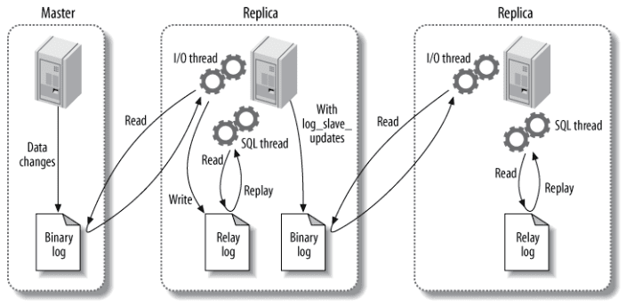

## 存储引擎、行格式

### MySQL 服务器处理客户端的查询请求的流程？

1. **连接管理**：**每当一个客户端进程连接到服务器进程时，服务器都会创建一个线程专门处理与这个客户端的交互**；当客户端退出时会与服务器断开连接，服务器并不会立即把与该客户端交互的线程销毁，而是把它缓存起来。在另一个新的客户端再进行连接时，把这个缓存的线程分配给该新客户端；客户端程序在发起连接时，需要携带主机信息、用户名、密码等信息，服务器程序会对客户端程序提供的这些信息进行**认证**。当连接建立后，与该客户端关联的服务器线程会一直等待客户端发送过来的请求，MySQL 服务器接收到的请求只是一个文本消息，该文本消息还要经过各种处理；
2. **解析与优化**：
   1. **查询缓存**：同样的请求（要求没有任何字符不同），会查询缓存中的数据。这个查询可以在不同的客户端之间共享。该缓存会在对应的表结构或者数据被修改，则该表有关的所有查询缓存都将变为失效，并从缓存中删除；（MySQL8.0直接删除了这个缓存，因为维护这一块缓存也会造成的一些开销）
   2. **语法解析**：因为客户端程序发送过来的只是一个文本，所以服务器需要先对这个文本进行分析，判断语法是否正确；（词法解析、语法分析、语义分析）
   3. **查询优化**：MySQL 的优化程序会对我们的 SQL 做一些优化，比如外连接转换为内连接、表达式简化、子查询转换为连接等。优化的结果就是生成一个执行计划，这个执行计划表明了应该使用那些索引执行查询，已经表之间的连接顺序是什么样的；
3. **存储引擎**：**MySQL 服务器把数据的存储和读取都封装到了一个名为存储引擎的模块中，接收上层传下来的指令，然后对表中的数据进行读取和写入操作。各种存储引擎为 Server 层提供统一的调用接口**；（Server 层在判断某条记录是否符合要求之后，其实是先将其发送到一个缓冲区，待到该缓冲区满了，才向客户端发送真正记录）

### MySQL 存储引擎的作用是什么？有哪些常用的存储引擎？它们的各自的特点是什么？

1. 数据的存储和读取；
2. InnoDB、MyISAM、MEMORY；
3. InnoDB 支持事务，行级锁，外键；MyISAM 主要是非事务处理存储引擎；

### InnoDB 行格式有哪些？各个行格式的具体结构是怎么样的？

1. Compact、Dynamic、compressed；还有一种过时的 redundant；
2. 前面三个基本上相同，两部分，
   1. **记录的额外信息：变长字段长度列表、NULL 值列表、记录头信息(固定字节)；**
   2. **记录的真实数据：记录列的值；**
3. 记录的额外信息的部分内容：
   1. **变长字段长度列表**：如 varchar(M)，各种 text 类型等。因为这种变长字段中存储多少字节的数据是不固定的，所以在存储真实数据的时候需要把这些数据占用的字节数也存起来；（逆序存放）
   2. **NULL 值列表**：一条记录中可能会有些列存 NULL 值，如果把这些 NULL 值都放到记录的真实数据中存储会很占地方，所以需要把 NULL 值存到 NULL 值列表中。需要注意的是主键和使用 NOT NULL 修饰的列都不可以存到 NULL 值列表中的。如果一条记录中没有 NULL 值，此时 NULL 值列表也就不存在了。1 表示该列的值是 NULL，0 表示该列值不是 NULL；（逆序存放）
   3. **记录头信息（固定的 5 字节）**：
      1. delete_flag：标记该记录是否被删除；
      2. min_rec_flag：B+ 树的每层非叶子节点中最小的目录项记录都会添加标记；
      3. n_owned：一个页面中会分成很多个组，每个组会有个大哥，大哥的 n_owned 会标记该组中有多少个记录，小弟的 n_owned 都是 0；
      4. heap_no：当前记录在页面堆中的相对位置；
      5. record_type：当前记录的类型。0-普通记录，1-B+树非叶子节点的目录项记录，2-Infimum，3-Supremum记录；
      6. next_record：表示下一条记录的相对位置；

### 溢出列是什么？产生溢出列的临界点是什么？

1. 溢出列是因为某列数据长度太长了，导致一页（默认一页 16KB）放不下（MySQL 规定一个页中至少存放两行记录）；
2. 一页默认 16KB，所以一个字段数据太长了会溢出的，解决方案三个行格式处理方式不同，以 Dynamic 为例，把该列的所有真实数据都存储到溢出页中，只在记录的真实数据处存储 20 字节大小的指向溢出页的地址。

## InnoDB 主键生成策略、隐藏列

### MySQL 的 InnoDB 的主键生成策略

1. **优先使用用户自定义的主键作为主键**；如果用户没有定义主键，则**选取一个不允许存储 NULL 值的 UNIQUE 列作为主键**；如果表中连不允许存储 NULL 值的 UNIQUE 列都没有定义，则 InnoDB 会为表**默认创建一个 DB_ROW_ID 的隐藏列作为主键**。
2. InnoDB 的主键生成策略是使用聚簇索引来实现的。聚簇索引是将数据行存储在与索引相同的 B-tree 中的一种索引类型。在 InnoDB 中，每个表只能有一个聚簇索引，且聚簇索引必须是主键或唯一索引。
3. 当创建一个表时，如果没有指定主键，则 InnoDB 会自动创建一个隐藏列作为主键，并将其作为聚簇索引。这个隐藏列是一个 6 字节的整数，它按照插入顺序递增，用于唯一标识每一行数据。
4. 如果用户指定了主键，则 InnoDB 会将该主键作为聚簇索引。如果主键是单列，那么数据行将按照主键的值排序存储。如果主键是多列，则按照这些列的联合值排序存储。
5. **在 InnoDB 中，聚簇索引的优点是能够快速地定位数据行，因为数据行和索引行存储在同一颗 B-tree 中**。但是，如果主键不是单调递增的，那么插入新数据时可能会导致页分裂，从而影响性能。因此，在设计表结构时，**应该尽量选择单调递增的主键。**

### 有哪些隐藏列？它们的作用是什么？

1. DB_ROW_ID：隐藏主键；
2. DB_TRX_ID：事务 ID；
3. DB_ROLL_PTR：回滚指针；

### DB_ROW_ID 的隐藏列的赋值策略

- 服务器会在内存中维护一个**全局变量**，每当向某个包含 row_id 隐藏列的表中插入一条记录时，就会把这个**全局变量的值当做新记录的 row_id 列的值**，并且把这个**全局变量的值自增 1**；
- 每当这个全局变量的值为 256 的倍数时，就会将该变量的值刷新到系统空间表页号为 7 的页面中的一个名为 Max Row ID 的属性中，之所以不是每次自增该全局变量时就将该值刷新到磁盘，是为了避免频繁刷盘；
- 当系统启动时，会将这个 Max Row ID 属性加载到内存中，并将该值加上 256 之后赋值给前面提到的全局变量，应为系统在上次关机时，该全局变量的值可能大于磁盘页面中的 Max Row ID 属性的值；

## InnoDB 索引页结构？


1. **File Heade**r：记录一些固定信息，当前页的页号、前一页和后一页的页号（双向链表）、当前页的类型（索引页、溢出页等）；
2. **Page  Header**：记录当前页面的信息，例如页目录中槽的数量、FreeSpace 开始的地址、该页内用户记录的数量、索引在 B+ 树中的层次级别等等；
3. **Infimum + Supremum**：MySQL 自动创建的记录，规定当前页内所有用户记录都比 Infimum 记录大，所有用户记录都比 Supremum 小；
4. **User Records**：用户记录，单链表连接，用户记录是按照主键大小排列的；
5. **Free Space**：刚开始是没有用户记录的，每次新增记录就是从 Free Space 里面分配的；
6. **Page Directory**：用户记录会分组，Infimum 自己一个组，在每组最后一个记录（老大）的 owner_id 位置记下当前组内有多少个元素。将每个分组的最后一个记录存到一个槽中，就是目录了，因为记录是按照主键大小排列的，我们在页内查找元素的时候就能够用二分查找先找到对应的目录，找到该槽中最小的记录，然后通过 next_record 指针依次向后遍历；
7. **File Trailer**：InnoDB 一般会将数据存到磁盘上，会以页为单位加载到内存中处理，如果页中的内容修改了，会在修改的某个时间后再次刷新到磁盘上。假如在这个时间出现问题，比如断电了，那可能就无法刷新到磁盘上了，File Trailer 就是为了校验当前页的数据是否有错误（完整）。（计算校验和）

## 如何查找元素的？

**没有索引时的查找过程：**

1. **先定位数据页**：各个数据页可以组成一个双向链表，而每个数据页中的记录会按照主键值从大到小的顺序形成一个双向链表；
2. **以主键为搜索条件**：在页的 Page Directory 中使用二分法快速定位到对应的槽，然后遍历该槽中对应分组中的记录，即可快速定位到指定的记录；
3. **以其他列作为搜索条件**：对于非主键列的查找，麻烦一点，因为在数据页中并没有为非主键列建立所谓的 Page Directory，所以无法通过二分法快速定位到对应的槽。这种情况只能从 Infimum 记录开始依次遍历单向链表中的每条记录，然后对比每条记录是否符合搜索条件；

> 分组的概念： InnoDB 中将所有正常的记录（包括 Infimum 和 Supremum，但不包括已经移除到垃圾链表中的记录）分为几个组。每个组的最后一条记录就是「大哥」，组内其他的记录是「小弟」。「大哥」的 n_owned 属性表示该组内共有几条记录。将每个组的最后一条记录在页面中的地址偏移量按照顺序存储到靠近页面尾部的地方，这个地方就是 Page Directory，Page Directory 中的这些地址偏移量称为槽（slot），每个槽占用 2 字节。Page Directory 就是由多个槽组成的

## InnoDB 删除元素

### InnoDB 是如何删除一条记录的？

插入到页面中的记录会根据记录头信息中的 next_record 属性组成一个单向链表（正常记录链表），被删除的记录其实也会根据记录头信息中的 next_record 属性组成一个链表（垃圾链表），只不过这个链表的记录占用的存储空间可以被重新利用。Page Header 部分中有一个名为 PAGE_FREE 的属性，它指向被删除记录组成的垃圾链表的头节点。

记录删除需要经历两个阶段：

- **delete mark 阶段**：**仅仅将记录的 deleted_flag 标志位置为 1，其他不做修改**（其实会修改记录的 trx_id、roll_pointer这些隐藏列的值），在这个节点当前记录并未迁移到垃圾链表中，还是在正常记录链表中，只不过是改变了记录的删除状态，在删除语句所在的事务提交之前都是这个状态；
- **purge 阶段**：当**该删除语句所在的事务提交之后，会有专门的线程来真正的把记录删除掉，所谓”真正的删除“就是把该记录从正常记录链表中移除，并加入到垃圾链表中**，然后还有调整一些页面信息；

需要注意的是：在将被删除记录加入到垃圾链表中时，实际上是加入到链表的头节点出，还会跟着修改 PAGE_FREE 的值；

### InnoDB 是如何复用已删除的记录的空间的？

页面的 Page Header 有一个 PAGE_GARBAGE 的属性，这个属性记录着当前页面中可重用存储空间占用的总字节数。每当有已删除的记录加入到垃圾链表后，都会把这个 PAGE_GARBAGE 属性的值加上已删除记录占用的存储空间大小。

PAGE_FREE 指向垃圾链表的头节点，之后每当插入新的记录时，会先判断垃圾链表头节点代表的已删除记录所占用的存储空间是否足够容纳这条新插入的记录，如果无法容纳，直接向页面申请新的空间来存储这条记录，并不会去遍历垃圾链表，只会判断头节点；

那么问题来了，如果新插入的记录占用的存储空间，小于垃圾链表头节点对应的已删除记录占用的存储空间，那就意味着头节点对应的记录所占用的存储空间站中，有一部分空间用不到，也就是碎片空间了，随着新纪录越差越多，由此产生的碎片空间也可能越来越多。

这些碎片空间占用的存储空间大小会被统计到 PAGE_GARBAGE 属性中，这些碎片空间在整个页面快使用完前并不会被重新利用。不过当页面快满时，如果再插入一条新的记录，此页面中并不能分配一条完整记录的空间。这个时候会先看看 PAGE_GARBAGE 的空间和剩余可利用的空间相加之后是否可以容纳这条记录。如果可以，InnoDB 会尝试重新组织页面内的记录。就是先开辟一个临时页，把页面的记录一次插入一遍。应为依次插入记录时并不会产生碎片，之后再把临时页面的内容复制到本页面，这样就可以把那些碎片空间都解放出来。

## 索引概念、原理

### B+ 树存储数据的案例？为什么使用 B+ 树而不是红黑树？

**假设**：

- **叶子节点**：假设所有存放⽤户记录的叶⼦节点代表的数据⻚可以存放 100 条⽤户记录；
- **非叶子节点**：假设所有存放⽬录项记录的内节点代表的数据⻚可以存放 1000 条⽬录项记录；

**数据存储个数预估**：

- 如果B+树只有1层，也就是只有1个⽤于存放⽤户记录的节点，最多能存放100条记录。

- 如果B+树有2层，最多能存放1000×100=100000条记录。
- 如果B+树有3层，最多能存放1000×1000×100=100000000条记录。  （三层就一个亿了）
- 如果B+树有4层，最多能存放1000×1000×1000×100=100000000000条记录。

所以在一般的情况下，我们⽤到的 B+ 树都不会超过 4 层，那我们通过主键值去查找某条记录最多只需要做 4 个⻚⾯内的查找，（查找 3 个⽬录项⻚和⼀个⽤户记录⻚），⼜因为在每个⻚⾯内有所谓的 Page Directory（⻚⽬录），所以在⻚⾯内也可以通过⼆分法实现快速定位记录。


**为什么使用 B+ 树？**

- 为了减少磁盘读取次数，决定了树的高度不能高，所以必须是先 B-Tree；
- 以页为单位读取使得一次 I/O 就能完全载入一个节点，且相邻的节点也能够**被预先载入**；所以数据放在叶子节点，本质上是一个Page页；
- 为了支持范围查询以及关联关系， 页中数据需要有序，且页的尾部节点指向下个页的头部；

### MySQL 的索引类型有哪些？

首先，索引是在**存储引擎层实现**的，而不是在服务器层实现的，所以不同存储引擎具有不同的索引类型和实现。

- **B+Tree 索引**
  - 是大多数 MySQL 存储引擎的默认索引类型。
- **哈希索引**
  - 哈希索引能以 O(1) 时间进行查找，但是失去了有序性；
  - InnoDB 存储引擎有一个特殊的功能叫“自适应哈希索引”，当某个索引值被使用的非常频繁时，会在 B+Tree 索引之上再创建一个哈希索引，这样就让 B+Tree 索引具有哈希索引的一些优点，比如快速的哈希查找。
- **全文索引**
  - MyISAM 存储引擎支持全文索引，用于查找文本中的关键词，而不是直接比较是否相等。查找条件使用 MATCH AGAINST，而不是普通的 WHERE。
  - 全文索引一般使用倒排索引实现，它记录着关键词到其所在文档的映射。
  - InnoDB 存储引擎在 MySQL 5.6.4 版本中也开始支持全文索引。
- **空间数据索引**
  - MyISAM 存储引擎支持空间数据索引(R-Tree)，可以用于地理数据存储。空间数据索引会从所有维度来索引数据，可以有效地使用任意维度来进行组合查询。

### 什么是聚簇索引？

1. **使用记录的主键值的大小进行页内记录的排序和页的排序**；
   1. **每页（叶子节点和非叶子节点）内的记录按照主键的大小组成一个单链表**，页内被划分为若干组，每个组也是按照主键大小排列的，每个组内最大的记录再页内的偏移量会被当做一个槽（目录）存放在页目录中，我们可以在页目录中按照二分查找快速定位到主键列等于某个值的记录；
   2. 各个存放**用户记录的页也是根据页中的用户记录的主键大小顺序组成一个双向链表**；
   3. 存放目录项的记录的页分为不同的层级，在同一层及中的页也是根据页中目录项记录的主键大小顺序排成一个双向链表；
2. **B+ 树的叶子节点存储的是完整的用户记录。（包括隐藏列）**；
3. **聚簇索引是 MySQL 的 InnoDB 自己生成的，也就是"索引即数据，数据即索引"；**

### 什么是二级索引？

1. 聚簇索引只能在搜索条件是主键值的时候才能发挥作用，因为B+ 树的数据都是按照主键进行排序的。
2. 二级索引的记录和聚簇索引记录其实是差不多的，
   1. 只不过**二级索引的叶子节点存的不是完整的用户记录，而是索引列 + 主键；**
   2. **非叶子节点，也就是目录页内存的目录项记录存的是：索引列 + 主键 + 指向的页号；**

### 什么是联合索引？

1. 联合索引其实就是一个二级索引；
2. 区别是：**用多个列的大小作为排序规则，比如给 A，B，C 列设计一个联合索引，那么会先按照 A 排序，A 相同的情况下按照 B 排序，B 还是相同就按照 C 排序，假如 C 还是相同，最后就按照主键来排序。**

### B+ 树的形成过程是怎么样的？

1. 每给某个表中创建一个 B+ 树索引时，**会先为这个索引创建一个根节点页面**，最开始表中没有数据的时候，根节点页面中既没有用户记录，也没有目录项记录；
2. 当新增用户记录的时候，**会先把用户记录存储到这个根节点中**；
3. 在**根节点中的可用空间用完之后，会先将根节点中的所有记录复制到一个新分配的页 A，然后对这个页进行页分裂操作，得到一个新页 B。**这是新插入的用户记录会根据键值（索引列的值）的大小分配到页 A 或者 B 中，根节点此时就升级为存储目录项记录的页，也就需要把 A 和 B 对应的目录项记录插入到根节点中；

### 为什么 MySQL 规定一个页面至少容纳两条记录？

1. 为了避免 B+树层次过高。一棵 B+树只需要很少的层级就可以轻松存储数亿条记录。

### MyISAM 的索引方案是什么？

1. MyISAM 的索引虽然也是树形结构，但是 MyISAM 将**索引和数据分开存储**；
   1. **数据文件**：将表中的记录按照插入顺序存储在一个文件中；（有多少记录就往里放多少，就可以通过**行号**来访问数据）；
   2. **索引文件**：会**为表的主键单独创建一个索引**，只不过在所有的叶子节点中存储的不是完整的用户记录，而是**主键和行号的组合，也就是说每次都要做回表操作**；创建二级索引或联合索引的时候叶子节点存的就是索引列的值和行号；

### 创建一个索引有那些代价？

1. **空间**：B+ 树也是占内存的；
2. **时间**：因为索引的 B+ 树内叶子节点和非叶子节点都是按照索引列的大小排序的，每页内部也是按照索引列大小排序的，所以**当增删改操作多时，就会涉及到额外的时间进行页面分裂和页面回收等操作，以维护节点和记录的排序**；
3. 另外，我们做查询操作的时候，执行查询语句前会先生成一个执行计划，一般情况下一条查询语句在执行过程中最多使用一个二级索引，**在生成计划时需要计算使用不同索引查询所需要的成本，如果建立了太多索引，可能会导致成本分析过程消耗太多**；

### 什么是索引条件下推？

1. 针对获取到的每一条二级索引记录，**如果没有开启索引条件下推特性，则必须先执行回表操作，在获取到完整的用户记录后再判断条件是否成立；**
2. 在普通的查询中，MySQL 数据库会将 SELECT 语句中的所有 WHERE 子句都发送到存储引擎中进行处理。**如果 WHERE 子句中包含多个条件，其中有些条件是可以在存储引擎层面过滤掉的，但是存储引擎仍然需要将所有数据都读入内存进行处理，这会导致查询效率较低。**
3. 如果开启了索引条件下推特性，如果判断条件包含了索引中的某个列，可以立即判断该二级索引记录是否符合该列的某个条件。**如果符合该条件则再进行回表操作，如果不符合则不执行回表操作，直接跳到下一条二级索引记录**；

### 索引用于排序升序和降序是怎么查找元素的？

1. 首先需要知道索引是已经排好序的。B+ 树的每层页面之间是用双向链表连接起来的，但是在一个页内的记录是按照记录大小从小到大以单向链表连接起来的；
2. **升序排序**：因为索引就是升序排序的，所以直接查就行了；
3. **降序排序**：页目录（Page Directory）中有个槽的概念，在查找当前记录的上一条记录时，找到该记录的所在组的第一条记录（一直根据记录的 next_record 属性找下一条记录，直到某条记录的头信息的 n_owned 不是 0，说明找到本组的大哥了，然后再从页目录中找到大哥记录对应的槽的上一个槽，该槽对应记录的下一条记录就是本组的第一条记录），从第一条记录开始遍历该组中的记录，直到找到当前记录的前一条记录；

### 什么是索引合并？

MySQL 一般会为**单个索引生成扫描区间，但是还存在特殊情况给多个索引生成扫描区间**。把使用多个索引完成一次查询的执行方式称为 index merge（索引合并）；

**Intersection 索引合并**

**交集索引合并，要求从不同的二级索引中获取到的二级索引记录都是按照主键排好序的；**

```sql
select * from single_table where key1='a' and key3='b'；
```

假设 key1 和 key2 都有索引。在 key1 索引扫描 key 值在 ['a', 'a'] 区间中的二级索引记录，同时在 key3 索引扫描 key 值在 ['b', 'b'] 区间中的二级索引记录，然后从两者的操作结果中找出 id 列值相同的记录（交集）。然后再根据这些共用的主键值去执行回表操作，这样就可能省下很多回表操作带来的开销；

为什么要求从不同的二级索引中获取到的二级索引记录都是按照主键排好序的？

- 因为从两个有序集合中取交集比从两个无需集合中取交集要容易的多；
- 如果获取到的 id 值是有序排列的，则再根据这些 id 值执行回表操作时就不再是进行单纯的随机 IO 了（这些 id 是有序的），这样就会提高效率；

也就是说如果使用某个二级索引执行查询时，从对应的扫描区间中读取出的二级索引记录不是按照主键值排序的，则不可用使用 Intersection 索引合并来执行查询；

**Union 索引合并**

**并集索引合并，同样要求从不同的二级索引中获取到的二级索引记录都是按照主键排好序的；**

```sql
select * from single_table where key1='a' or key3='b'；
```

假设 key1 和 key2 都有索引。在 key1 索引扫描 key 值在 ['a', 'a'] 区间中的二级索引记录，同时在 key3 索引扫描 key 值在 ['b', 'b'] 区间中的二级索引记录，然后从两者的操作结果中根据 id 列去重。然后再根据这些共用的主键值去执行回表操作，这样重复的 id 值只需要回表一次，这样就可能省下很多回表操作带来的开销；

为什么要求从不同的二级索引中获取到的二级索引记录都是按照主键排好序的？

- 因为从两个有序集合中取交集比从两个无需集合中取交集要容易的多；
- 如果获取到的 id 值是有序排列的，则再根据这些 id 值执行回表操作时就不再是进行单纯的随机 IO 了（这些 id 是有序的），这样就会提高效率；

**Sort-Union 索引合并**

**Union 索引合并的使用条件太苛刻，它必须保证从各个索引中扫描到的记录的主键值是有序的；**

```sql
select * from single_table where key1<'a' or key3>'z'
```

- 先根据 key1<'a' 条件从 key1 二级索引中获取二级索引记录，并将获取到的二级索引记录的主键值进行排序；
- 再根据 key3>'z' 条件从 key3 二级索引中获取二级索引记录，并将获取到的二级索引记录的主键值进行排序；
- 因为上面两个二级索引主键值都是排好序的，所以剩下的操作就与 Union 索引合并方式一样了；

把上面这种“先将从各个索引中扫描到的记录的主键值进行排序，再按照执行 Union 索引合并的方式执行查询”的方式称为 Sort-Union 索引合并。很显然 Sort-Union 索引合并要比单存的 Union 合并多了一步对二级索引记录的主键值进行排序的过程；

**需要注意的是有 Sort-Union 索引合并，但是没有 Sort-Intersection 索引合并。但是 MariaDB 中实现了**

Sort-Union 索引合并针对的是“单独根据搜索条件从某个二级索引中获取的记录比较少”的场景，这样及时对这些二级索引记录按照主键进行排序成本也不会太高。而 Intersection 索引合并针对的是“单独根据搜索条件从某个二级索引中获取的记录数太多，导致回表成本太大”的场景，使用Intersection 索引合并后能明显降低回表成本。但是如果加入 Sort-Intersection ，就需要为大量的二级索引记录按照主键值进行排序，这个成本可能就比使用单个二级索引执行查询的成本都要高。

## 索引使用注意事项

### 索引用于排序

1. 一般情况下，我们将数据从磁盘加载到内存，然后在内存中用排序算法对这些记录进行排序。有时候查询的结果集太大以至于无法再内存中进行排序，此时就需要暂时借助磁盘空间来存放中间结果，在排序操作完成后再把排序好的结果集返回客户端；（文件排序，filesort）
2. 假如 ORDER BY 语句后使用了索引列，就有可能省去在内存或磁盘中的排序步骤，因为索引已经是排好序的；

### 联合索引用于排序需要注意什么？

1. 在使用联合索引排序时，ORDER BY 字句后面的列的顺序也必须按照索引列的顺序给出，因为联合索引中页面和记录的排序规则就是固定的；
2. 对于联合索引进行排序的场景，要求各个排列值的排序规则是一致的，也就是**要么各个列都是按照升序，要么都是按照降序。**
3. **当排序列是某个联合索引的索引列，但是这些排序列在联合索引中并不连续，这时也是不走索引的；**
4. 排序列需要以单独列名形式出现才会走索引，也就是说不能给列加函数操作，或者其他的什么运算操作；

### 回表的代价

1. **对于使用 InnoDB 存储引擎的表来说，索引中的数据页都必须存放在磁盘中，等到需要时才会加载到内存中使用**。这些数据也会被存到磁盘中的一个或者多个文件中，页面的页号对应着该页在磁盘文件中的偏移量。以 16KB 大小的页面为例，页号为 0 的页面对应着这些文件中偏移量为 0 的位置，页号为 1 的页面对应着这些文件中偏移量为 16KB 的位置；
2. **如果某个扫描区间中的二级索引记录的 id 值的大小是毫无规律的，我们每读取一条二级索引记录，就需要根据该二级索引记录的 id 值到聚簇索引中做回表操作。如果对应的聚簇索引记录所在的页面不在内存中，就需要将该页面从磁盘加载到内存中。由于需要读取很多 id 值并不连续的聚簇索引记录，而且这些聚簇索引记录分布在不同的数据页中，这些数据页的页号也毫无规律，因此会造成大量随机 IO；**
3. 需要执行回表的操作的记录越多，使用二级索引进行查询的性能也就越低，某些查询宁愿走全表扫描也不愿意走二级索引；

### 增删改操作对二级索引的影响

对于二级索引来说，INSERT 操作和 DELETE 操作与在聚簇索引中执行时产生的影响差不多，但是 UPDATE 操作稍微不同。

- 如果 UPDATE 操作不涉及到二级索引列，就不需要对二级索引执行任何操作；
- 如果 UPDATE 操作涉及到了二级索引列，更新二级索引的键值就意味着下面两个操作
  - 对旧的二级索引记录执行 delete mark 操作，主要是考虑 MVCC；
  - 根据更新后的值创建一条新的二级索引记录，然后再二级索引对应的 B+ 树中重新定位到它的位置并插进去；

虽然只有聚簇索引才有 trx_id，roll_pointer 这些属性，不过每当我们增删改一条二级索引记录时，都会影响这条二级索引记录所在页面的 Page Header 部分中的一个 PAGE_MAX_TRX_ID 的属性。这个属性表示修改当前页的最大事务 id。

## SQL 优化

1. **只尽量避免全表扫描，为用于搜索、排序或分组的列创建索引；**

2. **需要考虑索引列中不重复值的个数。**在通过二级索引 + 回表方式进行查询时，某个扫描区间中包含的二级索引记录越多，就会导致回表操作代价越大。在创建索引时需要考虑该列中的数据的重复值占的比例，假如重复值很多，就可能执行太多次的回表操作，导致性能低下；

3. **索引列的类型尽量小。**因为数据类型越小，索引占用的存储空间就越少，在一个数据页中就可以存放更多的记录，磁盘 IO 带来的性能损耗也就越小，读写效率也就越高；

4. **为列前缀建立索引。**当列中存储的字符串包含的字符较多时，为列前缀建立索引可以明显减少索引大小；（需要注意的是列前缀做索引是无法支持使用索引进行排序的）

5. **使用覆盖索引。**最好在查询列表中只包含索引列，减少回表带来的性能损耗；

6. **让索引列以列名的形式在搜索条件中单独出现**；避免在索引列上进行计算或函数操作，这会让索引失效；

7. **新插入记录时主键大小对效率的影响。**记录都是按照主键的大小依次插入的。如果插入记录的主键值忽大忽小，就可能会出现页面分裂了，意味着性能损耗。所以做好让插入记录的主键值依次递增；

8. 应**尽量避免在 where 子句中对字段进行 null 值判断，否则将导致引擎放弃使用索引而进行全表扫描**。最好不要给数据库留 NULL，尽可能的使用 NOT NULL 填充数据库；

   > 不要以为 NULL 不需要空间，比如：char(100) 型，在字段建立时，空间就固定了， 不管是否插入值（NULL也包含在内），都是占用 100 个字符的空间的，如果是varchar这样的变长字段， null 不占用空间。

9. 应尽量**避免在 where 子句中使用 != 或 <> 操作符，否则将引擎放弃使用索引而进行全表扫描**；

10. 应尽量避免在 where 子句中使用 or 来连接条件，如果一个字段有索引，一个字段没有索引，将导致引擎放弃使用索引而进行全表扫描；

11. in 和 not in 也要慎用，用的不好会导致全表扫描；对于连续的数值，能用 between 就不要用 in 了；

12. 应尽量**避免在 where 子句中对字段进行函数操作**，这将导致引擎放弃使用索引而进行全表扫描；

13. 在使用索引字段作为条件时，如果该索引是**复合索引**，那么**必须使用到该索引中的第一个字段作为条件时才能保证系统使用该索引**，否则该索引将不会被使用，并且应尽可能的让字段顺序与索引顺序相一致；

14. 索引并不是越多越好，索引固然可以提高相应的 select 的效率，但同时也降低了 insert 及 update 的效率，因为 insert 或 update 时有可能会重建索引，所以怎样建索引需要慎重考虑，视具体情况而定；

7. **尽量使用数字型字段，若只含数值信息的字段尽量不要设计为字符型，这会降低查询和连接的性能，并会增加存储开销**。这是因为引擎在处理查询和连 接时会逐个比较字符串中每一个字符，而对于数字型而言只需要比较一次就够了；

## 从准备更新一条数据到事务的提交的流程描述，过程


- 首先执行器根据 MySQL 的执行计划来查询数据，先是从缓存池中查询数据，如果没有就会去数据库中查询，如果查询到了就将其放到缓存池中
- 在数据被缓存到缓存池的同时，会写入 undo log 日志文件；
- 更新的动作是在 BufferPool 中完成的，同时会将更新后的数据添加到 redo log buffer 中；
- 完成以后就可以提交事务，在提交的同时会做以下三件事：
  - 将 redo log buffe r中的数据刷入到 redo log 文件中
  - 将本次操作记录写入到 bin log文件中
  - 将 bin log 文件名字和更新内容在 bin log 中的位置记录到redo log中，同时在 redo log 最后添加 commit 标记

## 分库分表

### 分库分表的定义

首先分库分表分为垂直和水平两个方式，一般来说我们拆分的顺序是先垂直后水平。

- **垂直分库**

基于现在微服务拆分来说，都是已经做到了垂直分库了；

- **垂直分表**

**垂直切分是将一张表按列切分成多个表**，通常是按照列的关系密集程度进行切分，也可以利用垂直切分将经常被使用的列和不经常被使用的列切分到不同的表中。

在数据库的层面使用垂直切分将按数据库中表的密集程度部署到不同的库中，例如将原来的电商数据库垂直切分成商品数据库、用户数据库等。

- **水平分表**

首先根据业务场景来决定使用什么字段作为分表字段(sharding_key)，比如我们现在日订单 1000 万，我们大部分的场景来源于 C 端，我们可以用 user_id 作为sharding_key，数据查询支持到最近 3 个月的订单，超过 3 个月的做归档处理，那么 3个月的数据量就是9亿，可以分 1024 张表，那么每张表的数据大概就在 100 万左右。

比如用户 id 为100，那我们都经过 hash(100)，然后对 1024 取模，就可以落到对应的表上了。

### 那分表后的 ID 怎么保证唯一性？

- 分布式ID，自己实现一套分布式ID生成算法或者使用开源的比如雪花算法这种
- 分表后不使用主键作为查询依据，而是每张表单独新增一个字段作为唯一主键使用，比如订单表订单号是唯一的，不管最终落在哪张表都基于订单号作为查询依据，更新也一样。

## MySQL 主从复制

主要涉及三个线程: binlog 线程、I/O 线程和 SQL 线程。

- **binlog 线程** : 负责将主服务器上的数据更改写入二进制日志中。
- **I/O 线程** : 负责从主服务器上读取二进制日志，并写入从服务器的中继日志中。
- **SQL 线程** : 负责读取中继日志并重放其中的 SQL 语句。



**全同步复制**

主库写入binlog后强制同步日志到从库，所有的从库都执行完成后才返回给客户端，但是很显然这个方式的话性能会受到严重影响。

**半同步复制**

和全同步不同的是，半同步复制的逻辑是这样，从库写入日志成功后返回ACK确认给主库，主库收到至少一个从库的确认就认为写操作完成。

> 关于主从同步的延迟问题，这个问题貌似真的是个无解的问题，只能是说自己来判断了，需要走主库的强制走主库查询。

## 表空间

### 表空间区的概念

区的概念：对于 16KB 的页来说，连续的 64 个页就是一个区，也就是说一个区的默认大小是 1MB。无论是系统表空间还是独立表空间，都可以看成是由若干个连续的区组成的，每 256 个区被划分为一组。

1. 一页：16KB；
2. 一个区：1MB，也就是 16 页；
3. 一组：256MB，也就是 256 个区；

### 表空间段的概念

为什么要引入段的概念：每向表中插入一条记录，本质上就是向表的聚簇索引以及所有二级索引代表的 B+ 树的节点中插入数据。而 B+ 树的每一层中的页都会形成一个双向链表，如果以页为单位来分配存储空间，双向链表相邻的两个页之间的物理位置可能离的非常远。前面提到的使用 B+ 树来减少记录的扫描行数的过程是通过一些搜索条件到 B+ 树的叶子节点定位到第一条符合该条件的单向链表以及由数据也组成的双向链表一直向后扫描就行了。如果双向链表中相邻的两个页的物理位置不连续，对于传统的机械硬盘来说，需要重新定位磁头位置，也就是会产生随机 IO，这样会影响磁盘的性能。所以我们应该尽量让页面链表中相邻的页的物理位置也相邻，这样在扫描叶子节点中大量的记录时才可以使用顺序 IO。

所以就引出了区的概念，一个区就是连续的 64 个页（区里的页面的页号都是连续的）。在表中的数据量很大时，为某个索引分配空间的时候就不再按照页为单位分配了，而是按照区为单位进行分配，甚至在表中的数据非常多的时候，可以一次性分配多个连续的区。

1. 叶子节点有自己独有的区；
2. 非叶子节点也有自己的区；

存放叶子节点的区的集合计算是一个段，存放非叶子节点的区的集合也算是一个段。也就是说一个索引会生成两个段：一个叶子节点段，一个非叶子节点段。

还有一个碎片区，在一个碎片区中，并不是所有的页都是存储一个段的数据而存在的，碎片区中的页可以用于不同的目的。有的页属于段 A，有的属于段 B，有的页甚至不属于任何段。碎片区直属于表空间，并不属于任何一个段。

1. 在刚开始向表中插入数据的时候，段是从某个碎片区以单个页面为单位来分配存储空间的；
2. 当某个段已经占用了 32 个碎片区页面之后，就会以完成的区为单位来分配存储空间（原先占用的碎片区页面并不会被复制到新申请的完整的区中）

还有回滚段；

## 单表访问方法/访问类型

**MySQL 执行查询语句的方式称为访问方法或者访问类型**。同一个查询语句可以使用多种不同的访问方法来执行，虽然最后的查询的结果都是一样的，但是不同的执行方式花费的时间成本可能差异巨大；

1. **const**：通过主键或者唯一二级索引与常数的等值比较来定位一条记录是很快的；
2. **ref**：普通二级索引与常数等值比较，因为普通二级索引并不限制索引列值的唯一性，所以等值比较也会形成单点扫描区间，所以使用二级索引执行查询的代价就取决于该扫描区间中的记录条数；（采用二级索引来执行查询时，每获取到一条二级索引记录，就会去对其执行回表操作）
3. **ref_or_null**：二级索引列值和某个常数值等值比较，且需要查询 NULL 记录；
4. **range**：扫描区间为若干单点区间或范围区间；
5. **index**：扫描全部的二级索引记录的。ORDER BY 主键被人为视为 index；
6. **all**：全表扫描；

## 两个表连接的原理、JOIN BUFFER

**连接的步骤：**

- 首先确定第一个需要查询的表，这个表称为驱动表；
- 从驱动表中每获取到一条记录，都需要到被驱动表中查找匹配的记录；
- 在两表的连接查询中，驱动表访问一次，被驱动表可能需要访问多次；（每获取一条驱动表记录，就立即到被驱动表中寻找匹配的记录）

**内连接和外连接：**

- 对于内连接的两个表，若驱动表中的记录在被驱动表中找不到匹配的记录，则该记录不会加入到最后的结果集；
- 对于外连接的两个表，即使驱动表中的记录再被驱动表中没有匹配的记录，也需要加入到结果集；

**根据驱动表的不同，外连接可分为两种：**

- 左外连接：选取左侧的表为驱动表；
- 右外连接：选取右侧的表为驱动表；

**嵌套循环连接：**

对于两表连接来说，驱动表只会被访问一遍，但被驱动表却要被访问多次，具体访问几次取决于对驱动表执行单表查询后的结果集中有多少条记录。

**使用索引加快连接速度：**对于被驱动表来说多次查询它，其实也就是单表查询，可以利用索引加快查询速度；

**基于块的嵌套循环连接（Join Buffer）：**

生产环境中表的数据量一般都很大，先假设我们不能使用索引来加快被驱动表的查询过程，所以对于驱动表结果集中的每一条记录，都需要对被驱动表执行全表扫描。这样被驱动表进行全表扫描时，可能表前面的记录还在内存中，而表后面的记录还在磁盘上。而等到扫描表中后面的记录时，可能由于内存不足，需要把表前面的记录从内存释放掉给现在正在扫描中的记录腾出空间。在采用嵌套循环连接时，被驱动表会被访问多次，如果这个被驱动表中的数据特别多而且不能使用索引进行访问时，那就相当于要从磁盘上读这个表好多次，这个 IO 的代价就很大了，所以必须得减少被驱动表的访问次数；

**Join Buffer（连接缓冲区），在执行连表查询前申请的一块固定大小的内存。先把若干条驱动表结果集中的记录装在这个 Join Buffer 中，然后开始扫描被驱动表，每一条被驱动表记录一次性的与 Join Buffer 中的多条驱动表记录进行匹配。由于匹配都是在内存中完成的，所以这样可以显著减少被驱动表的 IO 代价。**Join Buffer 的大小可配置，默认 256KB，最小可以设置为 128 字节。当然我们在优化对被驱动表的查询时，最好是为被驱动表加上高效率的索引。如果实在不能使用索引，可以尝试调大 Join Buffer 的值来进行连接传销优化；

**节约 IO 成本的原理是，之前每次访问被驱动表就会去查询一次被驱动表，就相当于要从磁盘读取这个表好多次，使用 Join Buffer 后，相当于驱动表得到的结果集都在内存中，然后一次性和被驱动表做匹配；**

## MySQL 的成本

### MySQL 中的成本计算

**MySQL 会选择一个执行成本较低的执行方案去执行 SQL。**

1. **IO 成本**：InnoDB 存储引擎将数据和索引存储到磁盘上，当查询表中的记录时，需要先把数据或者索引加载到内存中，然后再进行操作。这个时间损耗称为 IO 成本；
2. **CPU 成本**：读取记录以及检测记录是否满足对应的搜索条件、对结果集进行排序等这些操作损耗的时间被称为 CPU 成本；

对于 InnoDB 存储引擎来说，页是磁盘和内存之间进行交互的基本单位，认为读取一个页面的成本默认是 1.0，读取以及检测一条记录是否符合搜索条件的成本默认是 0.2，在读取记录时即使不需要检测记录是否符合搜索条件，其成本也算作 0.2；

### 单表查询的成本

1. 根据搜索条件，**找出所有可能使用的索引**；
   1. 可能使用到的索引称为 possible keys；
2. **计算全表扫描的代价**；
   1. 全表扫描的意思就是将聚簇索引中的记录都一次和给定的搜索条件进行比较，并把符合搜索条件的记录加入到结果集中，所以需要把聚簇索引对应的页面加载到内存中，然后再检测记录是否符合搜索条件；
   2. 查询成本 = IO 成本 + CPU 成本，所以计算去全表扫描的代价需要：聚簇索引占用的页面数和该表中的记录数；
3. **计算使用不同索引执行查询的代价**；
   1. 对于**二级索引+回表**方式执行的查询，计算这种查询的成本依赖两方面的数据：**扫描区间数量**和**需要回表的记录数**；
   2. 扫描区间的数量：无论某个扫描区间的二级索引页面占用了多少个页面，查询优化器简单粗暴的认为读取索引的一个扫描区间的 IO 成本与读取一个页面的 IO 成本是相同的；
   3. 需要回表的记录数：查询优化器需要计算二级索引的某个扫描区间中包含了多少条记录。
      1. 如果某个扫面区间的最左记录和最右记录相隔不太远（不大于 10 个页面即可），就可以精确统计出该扫描区间的二级索引记录的条数。
      2. 否则只沿着区间最左记录向右读 10 个页面，计算每个页面平均包含多少条记录，然后用这个平均值乘以区间最左记录和区间最右记录之间的页面数量即可。
      3. 根据这些记录的主键值大聚簇索引中执行回表操作，认为每次回表操作都相当于访问一个页面，也就是说二级索引扫描区间中有多少条记录，就需要进行多少次回表操作，也就是需要进行多少次页面 IO；
      4. 回表操作后得到完整的用户记录，然后再检测其他搜索条件是否成立；
4. **对比各种执行方案的代价，找出成本最低的那个方案**；

### 连接查询的成本

驱动表访问一次，被驱动表可能访问多次，所以对于两表连接查询来说，它的查询成本由两部分组成：

- **单次查询驱动表的成本**；
- **多次查询被驱动表的成本**；（具体查询多少次取决于针对驱动表查询后的结果集中有多少条记录）

**把驱动表查询后得到的记录条数称为驱动表的扇出**，显然，驱动表的扇出值越小，对驱动表的查询次数也就越小，连接查询的总成本也就越低。

在下面两种情况下计算驱动表的扇出值时候需要靠猜测：猜测的过程称为 **Condition Filtering**

- 如果使用全表扫描的方式执行单表查询，那么计算驱动表的扇出值需要猜测满足全部搜索条件的记录到达有多少条；
- 如果使用索引来执行单表查询，那么计算驱动表扇出值时需要猜测除了满足形成索引扫描区间的搜索条件外，还满足其他搜索条件的记录有多少条；

**连接查询总成本 = 单词访问驱动表的成本 + 驱动表的扇出值 × 单次访问被驱动表的成本**

对于左连接和右连接的连接查询来说，它们的驱动表都是固定的，所以只需要分别为驱动表和被驱动表选择成本最低的访问方案，就可以得到最优的查询方案；

对于内连接来说，驱动表和被驱动表的位置是可以互换的，也就是需要考虑最优的表连接顺序，因为不同的表作为驱动表时，最终的查询成本可能不同，然后分别为驱动表和被驱动表选择成本最低的访问方法。

**对连接查询的优化重点是**：

- 尽量减少驱动表的扇出；
- 访问被驱动表的成本尽量要低；也就是说尽量在被驱动表的连接列上建立索引，如果可以，被驱动表的连接列最好是主键或者唯一二级索引，这样就可以把访问被驱动表的成本降至更低；

**对于多表连接的成本分析（三张以上）**

在分析多表连接查询的成本之前，需要考虑多表连接可能会产生多少中连接顺序。在对 n 个表进行连接时，MySQL 查询优化器并不会计算每一种连接顺序的成本。

- 维护一个成本变量，记录最小的连接查询成本，如果计算某种连接顺序的成本已经大于这个最小值了，提前结束评估；
- 系统变量 optimizer_search_depth，如果连接表的个数小于该值，那么就继续穷举分析每一种连接顺序的成本，否则只对数量与 optimizer_search_depth 只相同的表进行穷举分析；

### 如何调节成本参数

有两个表，server层面和存储引擎层面的成本参数

1. mysql.server_cost 表：
   1. 创建基于磁盘的临时表的成本；
   2. 基于磁盘临时表的写入或读取一条记录的成本；
   3. 两条记录进行比较操作的成本；（多用在排序操作中，计入增大这个值则会提升 filesort 的成本，让查询优化器更倾向于使用索引完成排序）
   4. 创建基于内存的临时表的成本；
   5. 基于内存的临时表的写入或读取一条记录的成本；
   6. 读取并检测一条记录是否符合搜索条件的成本；（如果增大这个值，可能会让查询优化器更倾向于使用索引而不是全表扫描）
2. mysql.engine_cost 表：
   1. 从磁盘读取一个块对应的成本；对于 InnoDB 来说，一个页就是一个块； 
   2. 从内存中读取一个块对应的成本；

对于临时表：在数据量大的情况下可能创建基于磁盘的临时表，也及时MyISAM、InnoDB，在数据量不大的情况下创建基于内存你的临时表，也就是 MEMORY 存储引擎。

## in 语句的值列表长度问题

**因为 in 语句可能会生成许多单点扫描区间**，假如使用的索引不是唯一二级索引，所以并不能确定一个单点扫描区间内对应的二级索引记录的条数有多少，需要MySQL 去计算（计算方式在上一个问题中说了），把这种通过直接访问索引对应的 B+ 树来计算某个扫描区间内对应的索引记录条数的方式称为 index dive，也就是说在查询真正执行前的执行计划生成阶段，就可能少量地访问 B+ 树中的数据。

有少量的单点扫描区间的话，使用 index dive 来计算这些单点扫描区间内对应的记录数也不是什么大问题，但是**假如 in 中值列表个数过多，这就意味着 MySQL 的优化器为了计算单点扫描区间对应的索引记录条数要进行很多次的 index dive 操作。**

这样性能消耗就很大了，没准计算这些单点扫描区间对应的索引记录条数的成本都要被全表扫描的成本都大，索引提供了一个系统变量来配置一个阈值，默认 200，**也就是说如果 IN 语句生成的单点扫描区间的数量小于 200 个，就使用 index dive 来计算各个单点扫描区间的记录条数。如果大于等于 200 个，就不能使用 index dive，而是使用索引统计数据（index statistics）来进行估算**；当查询中包含了 in 子句，但是实际上没有使用索引执行查询时，就应该考虑一下是否应为这个变量的值设置的太小导致的；

MySQL 会为表中的每个索引维护一份统计数据。 

- show index from 表名，查看 Cardinality 属性，该列中不重复值的数量；
- show table status 语句显示出来的 Rows 值，表示一个表中有多少条记录；
- 这样就可以计算某一个列中的一个值的平均重复多少次，一个值的重复次数大多等于 Rows 除以 Cardinality 的值；
- 这种方式的弱点就是计算出来的查询成本不准确，使用统计数据算出来的查询成本可能与实际执行时的成本

## InnoDB 的统计数据是如何收集的？

InnoDB 默认以表为单位来收集和存储统计数据。

基于磁盘的永久性统计数据，两个表：

1. innodb_table_stats：存储关于表的统计信息，每一条记录都对应着一个表的统计数据；
   1. 数据库名；
   2. 表名；
   3. 更新时间；
   4. 表中的记录的条数；（估计值）
   5. 表的聚簇索引占用的页面数量；
   6. 表中的其他索引占用的页面数量；
2. innodb_index_stats：存储了关于索引的统计数据，每一条记录对应这一个索引的一个统计项的统计数据；
   1. 数据库名；
   2. 表名；
   3. 索引名；
   4. 更新时间；
   5. 统计项的名称；
   6. 对应统计项的值；
   7. 为生成统计数据而采样的页面数量；
   8. 对应的统计项的描述；


**定期更新统计数据**

- 开启 innodb_stats_auto_recalc 决定服务器是否自动重新计算统计数据。默认是开启的。每个表维护一个变量，记录对该表进行增删改的记录条数。如果发生变动的记录数据超过了表大小的 10%，并且自动重新计算统计数据的功能是打开的，那么服务器会重新计算一次统计数据（异步执行）；
- 手动调用 ANALYZE TABLE 语句来更新统计信息，是同步的。在表中索引较多或者采样页面特别多时，这个过程可能会很慢；


**为什么 innodb_table_stats 中的 n_rows 统计项的数据是估计值呢？**

InnoDB 在统计一个表中有多少行记录时：按照一定的算法从聚簇索引中选取几个叶子节点页面，统计每个页面中包含的记录数量，然后计算一个页面中平均包含的记录数量，并将其乘以全部叶子节点的数量，结果就是 n_rows 的值；索引 n_rows 的值是否精确取决于统计时候采样的页面数量。有一个 innodb_stats_persistent_sample_pages 的系统变量，在使用永久性的统计数据时，这系统变量表示计算统计数据时采样的页面数量。该值设置的越大，统计出的 n_rows 值越准确，但是统计耗时也越久。该值设置的越小，统计出的 n_rows 值越不准确，但是统计耗时也越少。默认值是 20。

## 基于规则的优化-条件简化

1. **移除不必要的括号**；
2. **常量传递**：有时候表达式是某个列和某个常量的等值匹配，例如 a = 5，当使用 AND 将这个表达式和其他涉及列的表达式连接起来时，可以将其他表达式中的 a 值替换为 5，例如：a = 5 AND b > a，替换为 a = 5 AND b > 5；
3. **移除没用的条件**：对于一些明显的永远为 true 或者 false 的表达式，优化器会将他们移除掉；
4. **表达式计算**：在执行查询前，如果表达式中只包含常量的话，它们的值会被先计算出来，例如 a = 4 + 1，会被优化为 a = 5；
5. **HAVING 字句和 WHERE 字句合并**：如果查询语句中没有出现诸如 SUM、MAX 这样的聚合函数以及 GROUP BY 子句，查询优化器会把 HAVING 子句和 WHERE 子句合并；
6. **常量表检测**：
   1. 查询的表中一条记录都没有，或者只有一条记录；
   2. 使用主键等值匹配或者唯一二级索引列等值匹配作为搜索条件来查询某个表；

## 基于规则的优化-外连接消除

内连接的驱动表和被驱动表的位置可以相互转换，而左连接和右连接的驱动表和被驱动表是固定的。这就导致内连接可能通过优化表的连接顺序来降低整体的查询成本，而外连接却无法优化表的连接顺序。

外连接和内连接的本质区别是：对于外连接的驱动表的记录来说，如果无法再被驱动表中找到匹配 ON 子句中的过滤条件的记录，那么该驱动表的记录仍然会被加入到结果集中，对于的被驱动表记录的各个字段使用 NULL 值填充；而内连接的驱动表的记录如果无法再被驱动表中找到匹配 ON 子句中的过滤条件的记录，那么该驱动表的记录是会被舍弃的。

假如在 WHERE 子句的搜索条件中指定"被驱动表的列不为 NULL"的搜索条件，那么外连接中在被驱动表中找不到符合 ON 子句条件的驱动表记录也就从最后的结果集中被排除了。也就是说在这种情况下，外连接和内连接也就没有什么区别了。这种情况叫做“**空值拒绝（reject-NULL）**”

**在被驱动表的 WHERE 子句符合空值拒绝的条件后，外连接和内连接可以相互转换。这种转换带来的好处就是优化器可以通过评估表的不同连接顺序的成本，选出成本最低的连接顺序来执行查询。**

## EXPLAIN 语句

| 列名          | 描述                                                         |
| ------------- | ------------------------------------------------------------ |
| id            | 在一个大的查询语句中，每个 SELECT 关键字都对应一个唯一的 id  |
| select_type   | SELECT 关键字对应的查询的类型                                |
| table         | 表名                                                         |
| partions      | 匹配的分区信息                                               |
| type          | 针对单表的访问方法                                           |
| possible_keys | 可能用到的索引                                               |
| key           | 实际使用的索引                                               |
| key_len       | 实际使用的索引长度                                           |
| ref           | 当使用索引列做等值查询时，与索引列进行等值匹配的对象信息     |
| rows          | 预估的需要读取的记录条数                                     |
| filtered      | 针对预估的需要读取的记录，经过搜索条件过滤后剩余记录条数的百分比 |
| Extra         | 一些额外信息                                                 |

1. **table**：无论查询语句多么复杂，里面包含了多少张表，到最后也是对每个表进行单表访问。table 就是该表的表名；
2. **id**：查询语句中每出现一个 SELECT 关键字，MySQL 会分配一个唯一的 id 值；在连接查询的执行计划中，每个表都会对应一条记录，这些记录的 id 列的值是相同的；出现在前面的表表示驱动表，出现在后面的表表示被驱动表；
3. **select_type**：这里列举常见的：
   1. SIMPLE：查询语句中不包含 UNION 或者子查询的都算 SIMPLE 类型；
   2. PRIMARY：对应包含 UNION、UNION ALL 或者子查询的大查询来说，它是由几个小查询组成的；其中最左边的那个查询的 select_type 就是 PRIMARY；
   3. UNION：对应包含 UNION、UNION ALL的大查询来说，由几个小查询组成的，其中除了最左边的那个小查询以外，其他的小查询的 select_type 值都是 UNION；
   4. SUBQUERY：如果包含子查询的查询语句不能转换为对应的半连接形式，并且该子查询是不相关子查询，而且查询优化器决定采用将该子查询物化的方案来执行该子查询时，该子查询的第一个 SELECT 关键字代表的那个查询的 select_type 就是 SUBQUERY；
4. **partions**：略；
5. **type**：system、const、eq_ref、ref、fulltext、ref_or_null、index_merge、unique_subquery、index_subquery、range、index、all；
   1. **system**：当表中只有一条记录并且该表使用的存储引擎的统计数据是精确的，那么对该表的访问方法就是 system；
   2. **const**：当根据主键或者唯一二级索引列与常数进行等值匹配时，对单表的访问方法就是 const；
   3. **eq_ref**：执行连接查询时，如果被驱动表是通过主键或者不允许存储 NULL 值的唯一二级索引列等值匹配的方式进行查询的，则对该被驱动表的访问方法是 eq_ref；
   4. **ref**：当通过普通的二级索引列与常量进行等值匹配的方式来查询某个表时，对该表的访问方法就是 ref；
   5. **fulltext**：全文索引；
   6. **ref_or_null**：当对普通二级索引列进行等值匹配且该索引列的值也是可以是 NULL 值时；
   7. **index_merge**：一般情况下只会为单个索引生成扫描区间，但是会出现对多个索引进行索引合并的操作；
   8. **unique_subquery**：类似于两表连接中被驱动表的 eq_ref 访问方法，unique_subquery 针对的是一些包含 IN 子查询的查询语句。如果查询优化器决定将 IN 子查询转换为 EXISTS 子查询，而且子查询在转换之后可以使用主键或者不允许存储 NULL 值的唯一二级索引进行等值比较；
   9. **Index_subquery**：和 unique_subquery 类似，只不过在访问子查询中的表会使用到 id 列的聚簇索引；
   10. **range**：如果使用索引获取某些单点扫描区间的记录，那么可能使用到 range 的访问方法；
   11. **index**：当可以使用索引覆盖，但需要扫描全部的索引记录时，该表的访问方法就是 index；
   12. **ALL**：全部扫描；
6. **possible_keys**：可能使用到的索引；并不是越多越好，因为查询优化器需要计算查询成本；
7. **key**：真正使用到的索引；
8. **key_len**：key_len 的值由三部分组成，
   1. 该列的实际数据最多占用的存储空间长度；
   2. 如果该列可以存储 NULL 值，则 key_len 值在该列的实际数据最多占用的存储空间长度的基础上再加 1 字节；
   3. 对于使用可变长类型的列来说，都会有 2 字节的空间来存储该列的实际数据占用的存储空间长度，key_len 的值还要再原先的基础上再加 2 字节；
9. **ref**：当访问方法是 const、eq_ref、ref、ref_or_null、unique_subquery、index_subquery 中的其中一种，ref 列展示的就是与索引列进行等值匹配的东西是啥，比如只是一个常数或者某个列；
10. **rows**：表示该表的估计行数。如果使用索引来执行查询，执行计划的 row 列就代表预计扫描的索引记录行数；
11. **filtered**：condition filtering 计算驱动表扇出时的一个策略
    1. 如果使用全表扫描的方式来执行单表查询，那么计算驱动表扇出时需要估计出满足全部搜索条件的记录到底有多少条；
    2. 如果使用索引来执行单表扫描，那么计算驱动表扇出时需要估计出在满足形成索引扫描区间的搜索条件外，还满足其他搜索条件的记录有多少条；
12. **Extra**：额外信息，比较常见的
    1. **Using index**：使用覆盖索引执行查询时；
    2. **Using index condition**：有些搜索条件中虽然出现了索引列，但是不能充当边界条件来形成扫描区间，也就是不能用来减少需要扫描的记录数量；假如使用了索引条件下推，就是这个；
    3. **Using where**：当某个搜索条件需要在 server 层进行判断时；
    4. **Using join buffer**：在连接查询执行过程中，当被驱动表不能有效的利用索引加快访问速度时，MySQL 会为其分配一块名为 Join Buffer 的内存块来增加查询速度；
    5. **Using filesort**：在有些情况下，当对结果集中的记录进行排序时，是可以使用到索引的；假如排序操作无法使用到索引，只能在内存中（记录较少）或者磁盘中（记录较多）进行排序，也就是文件排序（filesort）；
    6. **Using temporary**：在执行某些查询时，MySQL 可能会借助临时表来完成一些功能，例如去重、排序之类的。比如，我们在执行许多包含 DISTINCT、GROUP BY、UNION 等子句的查询过程中，如果不能有效的使用索引来完成查询，MySQL 很有可能通过建立临时表来执行查询；

explain 之后可以用 show warnings 来看查询计划相关的扩展信息；

## Buffer Pool

### Buffer Pool 是什么

InnoDB 存储引擎在处理客户端的请求时，如果需要访问某个页的数据，就会把完整的页中的数据全部加载到内存中。也就是说，**即使只需要访问某个页的数据，就会先把整个页的数据全部加载到内存中。将整个页加载到内存中后就可以进行读写访问了，而且在读写访问之后并不着急把这个页对应的内存空间释放掉，而是将其缓存起来，这样将来有请求再次需要访问该页面时，就能剩下磁盘 IO 的开销了**；

Buffer Pool 默认 128MB，公司的阿里云自动调节为 24GB；

Buffer Pool 对应的一片连续的内存被划分为若干个页面，页面大小与 InnoDB 表空间使用的页面大小一致，默认都是 16KB。（缓冲页），每个**缓冲页**对应的控制信息占用的内存大小是相同的，我们把每个页对应的控制信息占用的一块内存称为**控制块**，控制块和缓冲页是一一对应的，它们都存放在 Buffer Pool 中，其中控制块存放在 Buffer Pool 的前面，缓冲页存放在 Buffer Pool 的后面；

### Buffer Pool 的 free 链表（双向链表）

我们在**加载磁盘的页面到 Buffer Pool 中时，如何判断那些缓冲页是空闲的，那些已经使用了呢**？

我们可以把所有空闲的缓冲页对应的控制块作为一个节点放到一个链表中（free 链表/空闲链表）。**刚刚完成初始化的 Buffer Pool 中，所有的缓冲页都是空闲的，所以每一个缓冲页对应的控制块都会加入到 free 链表中**，为了更好的管理这个 free 链表，为这个链表定义了一个基节点，里面包含链表的头节点地址、尾结点地址、以及当前链表中节点数量等。需要注意的是，链表的基节点占用的内存空间并不包含在 Buffer Pool 申请的一大片连续内存空间之内，而是一块单独申请的内存空间（40 字节）；

有了 free 链表之后，**每当需要从磁盘中加载一个页到 Buffer Pool 中时，就从 free 链表中取一个空闲的缓冲页，并且把该缓冲页对应的控制块的信息填上（就是该页所在的表空间、页号之类的信息），然后把该缓冲页对应的 free 链表的节点（也就是对应的控制块）从链表移除，表示该缓冲页已经被占用了。**

当我们需要访问某个页的数据时，就会把该页从磁盘中加载到 Buffer Pool 中，如果该页已经在 Buffer Pool 中的话，直接使用就行了。那么如何知道该页是否在 Buffer Pool 中呢？我们是根据表空间号和页号来定位一个页的，所以以表空间号和页号作为哈希表的 key，缓冲页控制块的地址就是对应的 value。**在需要访问某个页的数据时，先从哈希表中根据表空间号+页号看看是否有对应的缓冲页。如果有直接使用该缓冲页就好了。如果没有，就从 free 链表中选一个空闲的缓冲页，然后把磁盘中对应的页加载到该缓冲页的位置；**

### Buffer Pool 的 flush 链表（双向链表）

**如果我们修改了 Buffer Pool 中某个缓冲页的数据，也就与磁盘上的页不一致了，这样的缓冲页也称为脏页（dirty page）。**

**每次修改缓冲页后，并不着急立即把修改刷新到磁盘上，而是在未来的某个时间点进行刷新；**

存储脏页的链表，凡是被修改过的缓冲页对应的控制块都会作为一个节点存放到这个链表中。flush 链表和 free 链表的构造差不多。

### Buffer Pool 中的 LRU 链表管理

**（1）缓冲区不够的窘境**

Buffer Pool 对应的内存大小毕竟是有限的。如果需要缓存的页占用的内存大小超过了 Buffer Pool 的大小，也就是 free 链表中已经没有多余的空闲缓冲页了，这时需要把某些旧的缓冲页从 Buffer Pool 中移除，然后再把新的页放进来。

**（2）Buffer Pool 命中率**

假如一共访问了 n 次页，那么被访问的页已经在 Buffer Pool 中的次数除以 n 就是 Buffer Pool 的命中率；

**（3）简单的 LRU 链表（不是最终的）**

最近最少使用的缓冲页淘汰掉。我们可以创建一个LRU 链表，当需要访问某个页时，可以按照下面的方式处理 LRU链表

- 如果该页不在 Buffer Pool 中，则把该页从磁盘加载到 Buffer Pool 中的缓冲页时，就把该缓冲页对应的控制块作为节点塞到 LRU 链表的头部；
- 如果该页已经被加载到 Buffer Pool 中，这直接把该页对应的控制跨移动到 LRU 链表的头部；

也就是说，**只要我们使用到了某个缓冲页，就把该页调整到 LRU 链表的头部，当 Buffer Pool 的容量使用完时，淘汰掉 LRU 尾部的缓冲页就行了；**

**（4）简单的 LRU 链表的问题 - InnoDB 的预读**

**预读就是 InnoDB 认为执行当前的请求时，可能会在后面读取某些页面，于是就预先把这些页面加载到 Buffer Pool 中**，根据触发方式不同，预读可分为下面两种：

- 线性预读：如果顺序访问的某个区的页面超过了某个系统变量（innodb_read_ahead_threshold）的值，就会触发一次异步读取下一个区中全部的页面到 Buffer Pool 的请求。默认 56；
- 随机预读：如果某个区的 13 个连续的页面（这 13 个页面必须是在 young 区域的前 1/4 部分）都被加载到了 Buffer Pool 中，无论这些页面是不是顺序读取的，都会触发一次异步读取本区中所有其他页面到 Buffer Pool 的请求。Innodb_random_read_ahead 控制是否开启随机预读功能；

预读本来是一个好事情，如果预读到 Buffer Pool 中的页被成功使用到，那就可以极大的提高语句的执行效率。如果用不到，那么这些预读的页都会放到 LRU 链表的头部，但是如果此时 Buffer Pool 的容量不太大，而且很多预读的页都没有使用到的话，就会导致处于 LRU 链表尾部的一些缓冲页很快就被淘汰，从而大大降低 Buffer Pool 的命中率；

**（5）全表扫描对 Buffer Pool 的影响**

全表扫描时，意味着将访问该表的聚簇索引的所有叶子节点对应的页，如果需要访问的页面非常多，而 Buffer Pool  又不能全部容纳它们的话，就意味着需要将其中语句在执行过程中用到的页面“排挤”出 Buffer Pool ，之后在其他语句重新执行时，又需要将需要用到的页面从磁盘加载到 Buffer Pool。

**（6）降低 Buffer Pool 命中率的两种情况**

- 加载到 Buffer Pool 的页不一定被用到；
- 如果有非常多使用频率滴的页被同时加载到 Buffer Pool 中，则可能会把那些使用频率高的页冲 Buffer Pool 中淘汰；

**（7）LRU 链表结构分为两截**

两部分：

- 一部分存储使用频率非常高的缓冲页；这部分链表也叫**热数据**，也叫 young 区域；
- 一部分存储使用频率非常低的缓冲页；这部分链表也叫**冷数据**，也叫 old 区域；

按照某个比例将 LRU 链表分成两部分的，所以说并不是某些节点固定处于 young 区域，某些节点固定处于 old 区域。随着程序的执行，某个节点所属的区域也可能发送变化。

对于 InnoDB 存储引擎来说，通过 innodb_old_blocks_pct 的值来确定 old 区域在整个 LRU 链表中所占的比例；**默认 37%**。

**（8）分两部分的 LRU 链表对降低 Buffer Pool 命中率的优化**

- **针对预读的页面可能不进行后续访问的优化**：当磁盘上的某个页面在初次加载到  Buffer Pool 中的某个缓冲页时，该缓冲页对应的控制块会放到 old 区域的头部。这样预读到 Buffer Pool 却不进行后续访问的页面就会逐渐从 old 区域逐出，而不影响 young 区域中使用比较频繁的缓冲页；
- **针对全表扫描短时间内访问大量使用频率很低的页面的优化**：进行全表扫描时，首次加载到 Buffer Pool 中的页放到了 old 区域的头部，但是后续会被马上访问到，每次访问又会把该页放到 young 区域的头部，这样仍然会把那些使用频率较高的页面给“排挤”走。在执行全表扫描时，即使某个页面中有很多记录，经过每读取一条记录都算是访问一次页面，但是这个过程所花费的时间是非常少的，所以规定在对某个处于 old 区域的缓冲页进行第一次访问时，就在它对应的控制块中记录这个访问时间，如果后续访问时间和第一次访问时间在某个时间间隔内，那么该页面就不会从 old 区域移动到 young 区域的头部，否则将它移动到 young 区域的头部，这个间隔时间是由 innodb_old_blocks_time控制的。默认是 1 秒。

**（9）更进一步优化的 LRU 链表**

对于 young 区域的缓冲页来说，每次访问一个缓冲页就把它移动到 LRU 链表的头部，这样开销太大了，毕竟在 young 区域的缓冲页都是热点数据；

**优化策略**：**只有被访问的缓冲页位于 young 区域 1/4 的后面时，才会被移动到 LRU 链表头部。这样就可以降低调整 LRU 链表的评率，从而提升性能。也就是说，如果某个缓冲页对应的节点在 young 区域的前面的 1/4 部分时，再次访问该缓冲页时也不会将其移动到 LRU 链表头部；**

###  Buffer Pool 刷新脏页到磁盘

有专门的线程负责每隔一段时间把脏页刷新到磁盘

- 从 LRU 链表的冷数据中刷新一部分页面到磁盘；
- 从 flush 链表中刷新一部分页面到磁盘；

有时候，后台线程刷新脏页的速度比较慢，导致用户线程在准备加载一个磁盘页到 Buffer Pool 中没有空闲的缓冲页，这时就会尝试查看 LRU 链表的尾部，看是否存在可以直接释放掉的未修改的缓冲页。如果没有，则不得不将 LRU 链表尾部的一个脏页同步刷新到磁盘。在系统特别繁忙时，也可能出现用户线程直接从 flush 链表中刷新脏页的情况。

###  Buffer Pool 多实例

Buffer Pool 本质是向操作系统申请一块连续的内存空间。在多线程环境下，访问 Buffer Pool 中的各种链表都需要加锁处理。在 Buffer Pool 特别大并且多线程并发访问量特别高的情况，单一的 Buffer Pool 可能会影响请求的处理速度。所以在 Buffer Pool 特别大时，可以把它们拆分成若干个小的 Buffer Pool，每个 Buffer Pool 都称为一个实例，它们都是独立的，独立的申请内存空间、独立的管理各种链表。在多线程并发访问时并不会相互影响。从而提高了并发处理能力；

每个  Buffer Pool 占用的空间通过下面的公式计算：

innodb_buffer_pool_size / innodb_buffer_pool_instances

并不是 Buffer Pool 实例创建的越多越好，分别管理各个 Buffer Pool 也是需要性能开销的。当 innodb_buffer_pool_size 的值小于 1GB 时，设置多个实例是无效的，InnoDB 会默认把 innodb_buffer_pool_instances 设置为 1；

不再一次性为某个 Buffer Pool 实例向操作系统申请一大片连续的内存空间，而是以一个 chunk 为单位向操作系统申请内存空间。也就是说一个 Buffer Pool 实例是由若干个 chunk 组成的。一个 chunk 代表一片连续的内存空间梦里面包含了若干个缓冲页和对应的控制块。例如某个Buffer Pool 由两个实例组成，而每个实例中又包含了 2 个 chunk。

## 事务

### 事务的 ACID

- **原子性（Atomicity）**：对于一个事务操作来说，这些操作要么全部发生，要么都没发生；
- **隔离性（Isolation）**：指的是一个事务的修改在最终提交前，对其他事务是不可见的；
- **一致性（Consistency）**：指的是数据库总是从一个一致性的状态转换到另外一个一致性的状态。比如 A 转账给 B 100块钱，假设中间 SQL 执行过程中系统崩溃 A 也不会损失 100 块，因为事务没有提交，修改也就不会保存到数据库；
- **持久性（Durability）**:指的是一旦事务提交，所做的修改就会永久保存到数据库中；

### 事务的隔离等级

- **未提交读(READ UNCOMMITTED)** 事务中的修改，即使没有提交，对其它事务也是可见的。
- **提交读(READ COMMITTED)** 一个事务只能读取已经提交的事务所做的修改。换句话说，一个事务所做的修改在提交之前对其它事务是不可见的。
- **可重复读(REPEATABLE READ)** 保证在同一个事务中多次读取同样数据的结果是一样的。
- **可串行化(SERIALIZABLE)** 强制事务串行执行。

| 隔离级别 | 脏读 | 不可重复读 | 幻影读 |
| :------: | :--: | :--------: | :----: |
| 未提交读 |  √   |     √      |   √    |
|  提交读  |  ×   |     √      |   √    |
| 可重复读 |  ×   |     ×      |   √    |
| 可串行化 |  ×   |     ×      |   ×    |

### 事务的概念

把需要保证 ACID 的一个或多个数据库操作称为事务（Transaction），事务是一个抽象概念，它其实对应着一个或多个数据库操作，根据这些操作所执行的不同阶段把事务大致划分了下面几种状态：

- 活动的（active）：事务对应的数据库操作正在执行过程中；
- 部分提交的（partially committed）：当事务中的最后一个操作完成，但是由于操作都在内存中执行，所造成的影响并没有刷新到磁盘时；
- 失败的（failed）：当事务处于活动状态或者部分提交时，可能遇到了某些错误而无法继续执行，或者人为停止了当前事务的执行，我们就说该事务处于失败状态；
- 中止的（aborted）：打如果事务执行了半截而装变为失败状态，就是撤销失败事务对当前数据库造成的影响。就是回滚操作了。当回滚操作执行完毕后，也就是数据库恢复到了执行事务之前的状态；
- 提交的（committed）：当一个处于部分提交的状态的事务将修改过的数据都刷新到磁盘中后；

只有当事务处于提交或者终止的状态时，一个事务的生命周期才算是结束了。对于已经提交的事务来说，该事务对数据所作的修改是永久生效的。对于处于中止状态的事务来说，该事务对数据所做的所有修改都会回滚到没执行该事务之前的状态。

```
                                （刷盘成功）
                     部分提交的 ------------> 提交的
                    /   |
最后一个操作执行完   /     |
                /	    |
            活动的	     |（刷盘错误）
                \       |
错误或手动停止      \     |
                   \   \|/  （回滚操作执行完）
                      失败的 ---------------> 中止的
```

### MySQL 是怎么保证 ACID 的？

- **A 原子性(atomicity)** 由 undo log日志保证，它记录了需要回滚的日志信息，事务回滚时撤销已经执行成功的 SQL；
- **C 一致性(consistency)** 一般由代码层面来保证；
- **I 隔离性(isolation)** 由 MVCC 来保证；
- **D 持久性(durability)** 由内存 + redo log 来保证，MySQL 修改数据同时在内存和 redo log 记录这次操作，事务提交的时候通过 redo log 刷盘，宕机的时候可以从 redo log 恢复

## redo log

### redo log 是什么

**保证 ACID 的持久性**

**（1） redo log 是什么**

事务提交后即使系统发生了崩溃，这个事务对数据库所在的更改也不能丢失。**针对事务操作对数据库所做的修改，把每次修改的内容记录下来刷新到磁盘中，即使之后系统崩溃了，重启之后只要按照上述内容所记录的步骤重新更新一下数据页，那么该事务对数据库中所做的修改就可以被恢复出来**，这样就满足了一致性的要求。

重做日志的**优点**是：

- redo log 占用的空间很小；
- redo log 是顺序写入磁盘的；

针对事务对数据库不同的修改场景，定义了很多种类型的 redo log。（5.7.22 中有 53 种）

**（2）redo log 的格式**

redo log 的格式，不同的 redo log 格式的 data 部分存的东西不太一样。

```
| type | spaceID | page number | data |
```

**（3）插入一条语句会改动什么**

以 INSERT 语句为例，

- 表中包含多少个索引，一个 INSERT 语句就可能更新多少棵 B+树；
- 针对某一棵 B+ 树来说，既可能更新叶子节点页面，也可能更新非叶子节点页面，还可能创建新的页面（在该记录插入的叶子节点的剩余空间比较小，不足以存放该记录时，会进行页面分裂，在非叶子节点页面中添加目录项记录）

每往叶子节点代表的数据页中插入一条记录，还有其他很多地方会跟着更新，例如：

- 可能更新 Page Directory 中的槽信息；
- 可能更新 Page Header 中的各种页面统计信息，比如 PAGE_N_DIR_SLOTS 表示的槽数量可能会更改；
- 因为数据页中的记录是按照索引列从小到大的顺序组成的一个单向链表，每插入一条记录，还需要更新上一条记录的记录头信息中的 next_record 属性来维护这个单向链表；
- 等等；

**（4）以组的形式写入 redo log**

因为对页面的更改都发生在 Buffer Pool 中，所以在修改完页面之后，需要记录相应的 redo log。在执行语句的过程中产生的 redo log，被划分成了若干个不可分割的组，比如：

- 更新 Max Row ID 属性产生的 redo log 是一组，是不可分割的；
- 向聚簇索引对应 B+ 树的页面中插入一条记录时产生的 redo log 是一组，是不可分割的；
- 向某个二级索引对应 B+ 树的页面中插入一条记录时产生的 redo log 是一组，是不可分割的；
- 还有其他不可分割的组；

**（5）为什么提出组的概念？什么是不可分割？**

以向某个索引列对应的 B+ 树插入一条记录为例进行解释，在定位到具体的叶子节点后，会有乐观插入和悲观插入两种情况：

- 乐观插入：该数据页的空闲空间很充足，足够容纳当前要插入的记录，记录一条 INSERT 类型的 redo log 就好了（其实还有别的 redo log）；
- 悲观插入：该数据页的空闲空间不足了，不足以容纳当前要插入的记录，需要进行页分裂操作。也就是新建一个叶子节点，把原先数据页的一部分记录复制到这个新的数据页中，然后再把记录插入进去；再把这个叶子节点插入到叶子节点链表中，最后还要在非叶子节点中添加一条目录项记录来执行这个新创建的页面。很明显，这个过程需要对多个页面进行修改，这意味着会产生多条 redo log；

redo log 是为了在系统因崩溃而重启时恢复崩溃前的状态而提出的，如果在悲观插入的过程中只记录了一部分 redo log，那么在系统重启时会将索引对应的 b+ 树恢复成一个不正确的状态。

MySQL 规定在执行这些需要保证原子性的操作时，必须以组的形式来记录 redo log。在进行恢复时，针对某个组的 redo log，要么把全部的日志都恢复，要么一条也不恢复。

有些需要保证原子性的操作会生成多条 redo log，这一系列 redo log，必须以一条类型为 MLOG_MULTI_REC_END 的 redo 日志结尾。这样在系统因崩溃而重启恢复时，只有解析到了类型为 MLOG_MULTI_REC_END 的 redo log，才认为解析到了一组完整的 redo log，才会进行恢复；否则直接放弃前面解析到的 redo log；

有些需要保证原子性的操作只生成一条 redo log，比如更新 Max Row ID 属性的操作，这种情况是使用 type 字段的没有用到的 bit 位来做标记是单一的 redo log。

**（6）Mini-Transaction 的概念**

MySQL 规定对底层页面进行一次原子访问的过程称为一个 Mini-Transaction（MTR）。修改一次 Max Row ID 的值算是一个 MTR，向某个索引对应的 b+ 树插入一条记录的过程也算是一个 MTR。一个 MTR 可以包含一组 redo log，在进行崩溃恢复时，需要把这一组 redo log 作为一个不可分割的整体来处理；

一个事务可以包含若干条语句，一条语句又包含若干个 MTR，每一个 MTR 又可以包含若干条 redo log 日志；

### redo log 日志写入过程

为了方便管理 redo log，把通过 MTR 生成的 redo log 存放在大小为 512 字节的页中。

为了解决磁盘速度过慢的问题引入了 Buffer Pool，同理写入 redo log 时也不能直接写到磁盘，实际上在服务器启动时就向操作系统申请了一大片称为 redo log buffer 的连续内存空间。

向 redo log buffer 写入 redo log 的过程是顺序写入的。也就是依次向存 redo log 的页内写。有一个全局的 buf_free 变量，该变量指明后续写入的 redo log 应该写到 log buffer 的那个位置。

一个 MTR 生成的若干个 redo log 是一个不可分割的组，所以并不是没生成一条 redo log 就将其插入到 log buffer 中，而是将每个 MTR 运行过程中产生的日志先暂时存到一个地方，当该 MTR 结束的时候，再将过程中产生的一组 redo log 全部复制到 log buffer 中；

### redo log 刷盘和日志文件

 **（1）redo log 刷盘时机**

MTR 产生一组的 redo log 在该 MTR 结束时会被复制到 log buffer 中，在下面几种情况会刷新到磁盘；

- **log buffer 空间不足时**：如果当前写入 log buffer 的 redo 日志量已经占满了 log buffer 总容量的 50% 左右，就需要把这些日志刷新到磁盘中；
- **事务提交时**：引入 redo log 后虽然可以在事务提交时不把修改过的 Buffer Pool 页面立即刷新到磁盘，但是为了保证持久性，必须要把页面修改时所对应的 redo log 刷新到磁盘，否则系统崩溃后，无法将该事务对页面所做的修改恢复过来；
- **后台线程**，大约以每秒一次的频率将 log buffer 中的 redo log 刷新到磁盘；
- **正常关闭服务器时**；
- **做 checkpoint 时**；

**（2）redo log 文件组**

 innodb_log_group_home_dir 指定 redo log 文件所在的目录，默认值就是当前的数
 innodb_log_file_size       指定 redo log 文件的大小，默认 48MB（5.7.22）          
 innodb_log_files_in_group  指定 redo log 文件的个数，默认值是 2，最大值是 100     

磁盘上的 redo log 文件的个数不止一个，这些文件以 ib_logfile[数字] 的形式进行命名，从 ib_logfile0 开始写起，如果 ib_logfile0 写满了，就接着 ib_logfile1 写，依次写到最后一个文件，当最后一个文件也写满了，就重新转到 ib_logfile0 继续写。

redo log 文件的总大小其实就是 innodb_log_file_size × innodb_log_files_in_group。

**（3）redo log 文件格式**

log buffer 本质上是一片连续的内存空间，被划分成若干个 512 字节大小的 block。将 log buffer 中的 redo log刷新到磁盘的本质就是把 block 的镜像写入日志文件中，所以 redo log 文件其实也是由若干个 512 字节大小的 block 组成；

redo log 文件组中，每个文件的大小都是一样的，格式也是一样的；

- 前面 4 个 block 存储管理信息；（主要是两个 checkpoint）
- 后面的 block 存储 log buffer 的镜像文件；

### redo log 的 checkpoint

**（1）什么是 log sequence number** 

log sequence number 简称 lsn；MySQL 内有一个 lsn 的全局变量，用来记录当前总共已经写入的 redo log 的量，每组由 MTR 生成的 redo log 都有一个唯一的 lsn 值与其对应。lsn 的值越小，说明 redo log 产生的越早。

**（2）flushed_to_disk_lsn**

redo log 是先写到 log buffer 中，之后才被刷新到磁盘的 redo log 日志文件中，MySQL 中有一个名为 buf_next_to_write 的全局变量，用来标记当前 log buffer 中已经有那些日志被刷新到磁盘中了；

lsn 表示当前系统已经写入的 redo log 的量，这包括了写到了 log buffer 但没有刷新到磁盘的 redo log。相应的，MySQL 中有一个表示刷新到磁盘中的 redo log 量的全局变量，名为 flushed_to_disk_lsn。

**当有新的 redo log 写入到 log buffer 时，首先 lsn 的值会增长，但 flushed_to_disk_lsn 不变，随后随着不断有 log buffer 中的日志被刷新到磁盘上，flushed_to_disk_lsn 的值也跟着增长，如果两者的值相同，说明log buffer 中的所有的 redo log 都已经刷新到磁盘中了。**

**（3）lsn 值和 redo log 日志文件组中的偏移量的对应关系**

因为 lsn 的值表示系统写入的 redo log 的量的一个总和，一个 MTR 中产生多少 redo log，lsn 的值就增加多少，这样 MTR 产生的 redo log 写到磁盘中时，很容易计算某一个 lsn 的值在 redo log 的文件组的偏移量。

**（4）flush 链表中的 lsn**

一个 MTR 代表对底层页面的一次原子访问，在访问过程中可能会产生一些不可分割的 redo 日志，在 MTR 结束时，会把这一组 redo 日志写入到 log buffer 中，除此之外，在 MTR 结束时还有一件非常重要的事情要做，就是把在 MTR 执行过程中修改过的页面加入到 Buffer Pool 的 flush 链表中；

flush 链表是页面的控制块组成的链表，控制块中有下面两个信息：

- oldest_modification：第一次修改 Buffer Pool 中的某个缓冲页时，就将修改该页面的 MTR 开始是对应的 lsn 值写入这个属性；
- newest_modification：每次修改页面，都会将修改该页面的 MTR 结束时对应的 lsn 值写入到这个属性，也就是说，该属性表示页面最近页次修改后对应的 lsn 值；

每次新插入到 flush 链表中的节点都放在了头部。也就是说在 flush 链表中，前面的脏页修改的时间比较晚，后面的脏页修改时间比较早；flush 链表中脏页按照第一次修改发生的时间顺序进行排序，也就是按照 oldest_modification 代表的 lsn 值进行排序，被多次更新的页面不会重复插入到 flush 链表中，但是会更新 newest_modification 属性的值；

**（5）checkpoint**

 因为 redo 日志文件组的容量是有限的，不得不选择循环使用redo log 文件组中的文件，但是会造成最后写入的 redo log 与最开始写入的 redo log “追尾”。redo log 是为了在系统崩溃后恢复脏页的，如果对应的脏页已经刷新到了磁盘中，那么及时现在系统崩溃，在重启后也用不着使用 redo log 恢复该页面了，索引该 redo log 也就没有存在的必要了，它占用的磁盘空间就可以被后续的 redo log 重用了。

也就是说，判断某些 redo log 占用的磁盘空间是否可以覆盖的依据，就是它对应的脏页是否已经被刷新到磁盘中。

- 全局变量 checkpoint_lsn：表示当前系统中可以被覆盖的 redo log 的总量是多少，初始值也是 8704；
- 变量 checkpoint_no：统计当前系统执行了多少次 checkpoint，每执行一次 checkpoint 该值就加 1；

假如某个 Buffer Pool 的页面被刷新到磁盘上，那么这上面生成的 redo log 就可以被覆盖了，所以可以进行一个增加 checkpoint_lsn 的操作，我们把这个一个过程称为 checkpoint；

**（6）innodb_flush_log_at_trx_commit 用法**

为了保证事务的持久性，用户线程在事务提交时需要将该事务执行过程中产生的所有 redo log 都刷新到磁盘中，其实这是可以配置的；

- 0：表示事务在提交时不立即向磁盘同步 redo 日志，这个任务交给后台线程来处理；
- 1：表示事务提交时需要将 redo log 日志同步到磁盘，保证事务的持久性；
- 2：表示事务提交时需要将 redo log 写到操作系统的缓冲区中，但并不需要保证日志真正刷到磁盘。在这种情况下，如果数据库挂了但是操作系统没挂，事务的持久性还是可以保证的；

### redo log 崩溃恢复

**（1）确定恢复的起点**

对应 lsn 小于 checkpoint_lsn 的 redo log 来说，它们是可以被覆盖的，也就是说这些 redo log 对应的脏页都已经被刷新到磁盘中了。既然这些脏页已经被刷盘，也就没有必要恢复它们了。对于对应的 lsn 值不小于 checkpoint_lsn 的 redo log，它们对应的脏页可能还没被刷盘，也有可能被刷盘了，我们不能确定（因为刷盘操作大部分时候是异步进行的），所以需要从对应的 lsn 值为 checkpoint_lsn 的 redo log 开始恢复页面；

**（2）确定恢复的终点**

因为 redo log 是顺序写入到页（block） 中的，每个 block 的大小是 512 字节，也就是当某个 block 内的 LOG_BLOCK_HDE_DATA_LEN 不是 512，就说明找到了 redo log 文件的终点。(LOG_BLOCK_HDE_DATA_LEN 表示某个 block 中使用了多少字节的空间)

**（3）如何恢复**

按照 redo log 的顺序一次扫描 checkpoint_lsn 之后的各条 redo log，按照日志中记载的内容将对应的页面恢复过来。

优化：

- 使用哈希表：将表空间和页号作为 key，value 是相同的表空间和页号的 redo log 组成的链表。这样就将同一个页面就行修改的 redo log 放在一个槽中，这样就可以一次性的讲一个页面修复好（毕淼很多读取页面的随机 IO）

## 事务 id

**（1）分配事务 id 的时机**

如果某个事务在执行过程中对某个表执行了增删改操作，那么 InnoDB 存储引擎就会给它分配一个独一无二的事务 id，分配方式如下：

- 对于只读事务来说，只有在它第一次对某个用户创建的临时表执行增删改操作时，才会为这个事务分配一个事务 id，否则是不分配事务 id；
- 对于读写事务来说，只有在它第一次对某个表（包括用户创建的临时表）执行增删改操作时，才会为这个事务分配一个事务 id，非欧洲是不分配事务 id 的；

也就是说，只有事务对表中数据进行改动时才会为这个事务分配一个唯一的事务 id；

**（2）事务 id 的生成策略**

事务 id 本质上就是一个数字，它的分配策略和前面的隐藏列 row_id 基本上一样。

- 服务器会在内存中维护一个全局变量，每当需要为某个事务分配事务 id 时，就会把该变量的值当做事务 id 分配给该事务，并且把该变量自增 1；
- 每当这个变量的值为 256 的倍数时，就会把该变量的值刷新到系统表空间的页号为 5 的页面中一个名为 Max Trx ID 的属性中，这个属性占用 8 字节的存储空间；
- 当系统下一次重新启动时，会将这个 Max Trx ID 属性加载到内存中，将该值加上 256 之后赋值给前面提到的全局变量（因为上次关机时，该全局变量的值可能大于磁盘页面中的 Max Trx ID 属性值）

这样就可以保证整个系统中分配的事务 id 是一个递增的数字，先分配事务 id 的事务得到的是较小的事务 id，后分配事务 id 的事务得到的是较大的事务 id；

**（3）trx_id 隐藏列**

聚簇索引除了会保存完整的用户数据外，而且还会自动添加名为 trx_id、roll_pointer 的隐藏列。trx_id 就是对这个聚簇索引记录进行改动的语句所在的事务对应的事务 id 而已（可以是 INSERT、UPDATE、DELETE）

## 隐藏列 roll_pointer 是什么？

本质上就是指向记录的 undo 日志的指针。

```
| undo 日志类型 | 回滚段编号 | undo 日志页的页号 | undo 日志在页中的偏移量 |
```

## undo log

### undo log 的格式

**用户事务回滚的**

**（1) 什么是 undo log**

事务需要保证原子性，也就是事务中的操作要么是全部完成，要么什么也不做。但是有时候事务执行过程中可能遇到各种错误，比如服务器本身的错误、操作系统的错误，或者程序员手动回滚。**也就是说每更新了一条记录，我们需要把回滚所需要的东西记录下来，这就是 undo log 了。**

一般每对一条记录进行一次改动，就对应着一条 undo log（某些更新也可能有两条）。一个事务在执行过程中可能新增、删除、更新若干条记录，也就是说需要记录很多条对应的 undo log。这些 undo log 会从 0 开始编号，也就是说根据生成的顺序分别称为第 0 号 undo 日志，第 1 号 undo 日志，这个编号也称为 undo no；

**（2）undo log 是针对聚簇索引的记录的**

当我们向某个表中插入一条记录时，实际上需要向聚簇索引和所有二级索引都插入一条记录，不过在记录 undo log 时，我们只需要针对聚簇索引记录来记录一条 undo log 就好了。聚簇索引和二级索引记录都是一一对应的，我们在回滚 INSERT 操作时，只需要知道这条记录的主键信息，然后根据主键信息进行对应的删除操作。在执行删除操作时，就会把聚簇索引和所有二级索引中相应的记录都删除掉。DELETE 操作和 UPDATE 操作也是针对聚簇索引记录的改动来记录 undo log 的；

**（3）INSERT 操作对应的 undo 日志**

当向表中插入一条记录时会有乐观插入（叶子节点页面空间充裕）和悲观插入（叶子节点页面的空间不充裕）的区分。但是不管怎么说，最终导致的结果就是这条记录被放到了一个数据页中。如果希望回滚这个插入操作，那么把这条记录删除就行了。也就是说在写对应的 undo log 时，这要把这条记录的主键信息记录下来就行了。

如果主键只包含一列，那么在 INSERT 对应的 undo log 中只需要把该列占用的存储空间和真实值记录下来。假如记录中的主键包含多个列，则每个列的存储空间和真实值都要记录下来；

**（4）DELETE 操作对应的 undo 日志**

在执行一条删除语句的过程中，在删除语句所在的事务提交之前，只会经历 delete mark 阶段。一旦事务提交，我们也就不需要回滚这个事务了，所以 DELETE 操作对应的 undo log 只需要考虑对删除操作在 delete mark 阶段的影响进行回滚就好了。

DELETE 操作对应的 undo log，重要的属性有 undo_no，table_id，trx_id，roll_pointer，主键各个列的信息，二级索引各个列的信息。

上面的 trx_id 和 roll_pointer 都是旧记录的 trx_id 和 roll_pointer，这样的好处是可以通过 undo log 的 roll_pointer 属性找到上一次对该立即进行改动产生的 undo log。比如在某个事务中，我们先插入了一条记录，然后又执行了该记录的删除操作，在执行完 delete mark 后产生的 undo log 和 INSERT 时产生的 undo log 就串成了一个链表（版本链）

**（5）UPDATE 操作对应的 undo 日志**

在执行 UPDATE 语句时，InnoDB 对更新主键和不更新主键这两种情况有不同的处理方式；

- **不更新主键**：
  - **就地更新**：在更新记录时，对于被更新的没个列来说，如果更新后的列与更新前的列占用的存储空间一样大，那么就可以就地更新，也就是直接在原记录的基础上修改对于列的值；
  - **先删除旧记录，再插入新记录：**在不更新主键的情况下，如果任何一个被更新的列在更新前和更新后占用的存储空间大小不一致，那么就需要先把这条旧记录从聚簇索引页面中删除（用户线程同步删除），然后再根据更新后列的值创建一条新的记录并插入到页面中；这里所说的删除，并不是 delete mark 操作，而是真正的删除掉，也就是直接将该记录从正常记录链表中移除并加入到垃圾链表中，并且修改页面中的相应的统计信息。如果新创建的记录占用的存储空间不超过旧记录占用的空间，那么可以直接重用加入到垃圾链表中的旧记录所占用的存储空间，否则需要在页面中新申请一块空间供记录使用。（或者页分裂）
- **更新主键**：因为聚簇索引中的记录是按照主键值的大小连成了一个单向链表。如果更新了某条记录的主键值，意味着这条记录再聚簇索引中的位置将会发生改变。
  - 第一步：将旧记录进行 delete mark 操作，因为更新的是主键，在这个 UPDATE 事务执行过程中，其他事务可能同时访问这个记录，假如真正的直接假如到垃圾链表了，别的事务就访问不到这条记录了（MVCC）;
  - 第二步：根据更新后各列的值创建一条新记录，并将其插入到聚簇索引中。
  - 两个步骤会分别产生一条 undo log；


### 存储 undo log 的页面

**（1）undo log 分类**

MySQL 中有专门存储 undo log 的页面，undo log 大致可以分成两类：

- insert 类型：一般由 insert 语句产生，当 update 语句中有更新主键的情况，也会产生此类型的 undo log；
- update 类型：一般由 delete、update 语句产生；

之所以分成两个类，是因为 insert 类型的 undo log 在事务提交后可以直接删除掉，而其他类型的 undo log 还需要为 MVCC 服务，不能直接删除调，因此对它们的处理需要区别对待；

**（2）undo log 页面的 Undo Page Header 属性**

存储 undo log 的页面有下面几个属性：

- 当前 undo log 的类型，就是上面说的 insert 和 update；
- 当前页面从什么位置开始存储 undo 日志，或者说表示第一条 undo 日志在本页面中的起始偏移量；
- 当前页面中存储的最后一条日志结束时的偏移量，或者说从这个位置开始，可以继续写入新的 undo log；
- 最后一个属性，代表一个链表节点结构。

**（3）Undo 页面链表**

因为一个事物可能包含多个语句，一个语句可能会对若干条记录进行改动，而对每条记录进行改动前需要记录 1 条或者 2 条 undo log。所以在一个事务执行中可能产生很多 undo log，这些日志可能在一个页面中放不下，需要放到多个页面中，这些页面就通过前面说的链表节点结构组成了链表。

一个事务可能生成 insert 和 update 类型的日志，因为 MySQL 规定不同大类的 undo log 不能混着存储，所以在一个事务的执行过程中可能需要两个 Undo 页面的链表，一个称为 insert undo 链表，一个称为 update undo 链表。

另外，在对普通表和临时表的记录改动时产生的 undo 日志要分别记录。所以在一个事务中最多有 4 个 Undo 页面为节点组成的链表。

### 重用 undo log 页面

为了能提高并发执行的对个事务写入 undo log 的性能，每个事务单独分配相应的 Undo 页面链表（最多可能单独分配 4 个链表）。但是这样造成了一个问题，比如大部分事务在执行的过程中可能只修改了一条或几条记录，针对某个 UNdo 页面链表只产生了非常少的 undo 日志，这些 undo 日志可能只占用一点点存储空间。所以可能会有浪费，于是设计了一个重用 undo log 页面的机制；

在事务提交后的某些情况下重用该事务的 undo 页面链表：

- 该链表中只包含一个 Undo 页面；
- 该 Undo 页面已经使用的空间小于整个页面空间的 3/4；


针对 insert 类型和 update 类型的链表的重用策略也是不一样的：

- insert 类型：这种类型的 undo log 在事务提交之后就没用了，可以被清除掉，所以在某个事务提交之后，在重用这个事务的 insert undo 链表（这个链表中只有一个页面）时，可以直接吧之前事务写入的一组 undo log 覆盖掉，从头开始写入新事务的一组 undo log；
- update 类型：在一个事务提交后，它的 update undo 链表中的 undo 日志不能立即删除（这些日志要用于 MVCC）。如果之后的事务想要重用 update undo 链表，就不能覆盖之前事务写入的 undo log。这样相当于在同一个 Undo 页面中写入了多组 undo 日志；

### 回滚段

前面说过，一个事务在执行的过程中最多可以分配 4 个Undo 页面链表。在同一时刻，不同事务拥有的 Undo 页面链表是不一样的，系统在同一时刻其实可以存在许多个 Undo 页面链表。为了更好的管理这些链表，MySQL 设计了回滚段，这个回滚段就一个页面，存放了各个 Undo 页面链表的第一个 Undo 页，这些页号称为 undo slot；

从回滚段中申请 Undo 页面链表：

初始情况下，由于未向任何事务分配任何 Undo 页面链表，所以对于一个回滚段的页面来说，它的各个 undo slot 都被设置为一个特殊值，表示这个 undo slot 不指向任何一个页面。

随着时间的流逝，开始有事务需要分配 Undo 页面链表了，于是从回滚段的第一个 undo slot 开始看，找到一个未被使用的 undo slot，找到之后就在表空间中新建一个段，从这个段中申请一个页面作为 Undo 页面链表的第一个 Undo 页，最后把这个 undo slot 的值设置为刚刚申请的这个页面的地址。这就意味着这个 undo slot 分配给了这个事务；


一个事务提交时，它所占用的 undo slot 有两个命运：

- 如果该 undo slot 指向的 Undo 页面链表符合被重用的条件（就是 Undo 页面链表只占用一个页面，并且已使用空间小于整个页面的 3/4），该 undo slot 就处于被缓存的状态。被缓存的 undo slot 都会加入到一个链表中，不同类型的 Undo 页面链表对应的 undo slot 会被加入到不同的链表中。insert 和 update。也就是说一个回滚段对应上述两个 cached 链表，如果有新事务要分配 undo slot，都会先从对应的 cached 链表中查找。如果没有被缓存的 undo slot，才会到回滚段的页面中去寻找；
- 如果该 undo slot 指向的 undo 页面链表不符合被重用的条件，
  - 如果是 insert 链表，则归还这个undo slot。
  - 如果是 update 链表，归还 undo slot，并将本次事务写入一组 undo 日志放入到 History 链表中；


多个回滚段，默认 128 个。一个事务最多分配 4 个 Undo 页面链表，而一个回滚段中只有 1024 个undo slot，很显然 undo slot 的数量有点少。假如一个读写事务在执行过程中只分配一个 Undo 页面链表，那么 1024 个 undo slot 也只能支持 1024 个读写事务同事进行。所以设置了 128 个回滚段。

### 为事务分配 Undo 页面链表的详细过程


### undo log 在崩溃恢复时的作用

如果一个事务执行了一半的时候服务器突然崩溃，加入这个事务执行过程中所写的 redo log 尚未刷新到磁盘，也就是还停留在 log buffer 中，那么服务器崩了就崩了，相当于该事务什么都没做。但是如果这些 redo log 已经刷新到磁盘中，那么在下次开机重启时会根据这些 redo log 把页面恢复过来，这就会造成一个事务处于执行了一半的状态。其实这些执行了一般的事务对页面所做的修改都会通过 undo log 撤销；

##  MySQL 系统级别配置

| 配置                                 | 作用                                                         |
| ------------------------------------ | ------------------------------------------------------------ |
| innodb_page_size                     | InnoDB 中页的大小，默认 16KB                                 |
| join_buffer_size                     | Join Buffer 大小，默认 256KB                                 |
| eq_range_index_dive_limit            | 当 In 语句对应的单点区间数量大于或等于该值时，就不会使用 index dive 了，而是使用索引统计数据（index statistics），假如使用了 IN 而没走索引时，可以看下是不是因为这个值太小了。默认 200（5.7.3 之后） |
| optimizer_search_depth               | 为了防止无穷止的分析各种连接顺序的成本，如果连接表的个数小于这个值就会穷举分析每一种连接顺序的成本，否则只对数量和该值相同的表进行穷举分析 |
| optimizer_prune_level                | 启发式规则（根据以往的经验指定的一些规则）；凡是不满足这些规则的连接顺序压根不分析，这样可以降低需要分析的连接顺序的数量，但这样也可能错失最优的执行计划 |
| Innodb_stats_persistent              | 1表示把该表的统计数据存在磁盘上，0 表示临时存在内存中        |
| innodb_stats_persistent_sample_pages | n_rows 精确与否和这个采样页面的个数有关。按照一定的算法从聚簇索引中选取几个叶子节点页面，统计每个页面中包含的记录数量，然后计算一个页面中平均包含的记录数量，乘以全部叶子节点数量，得到 n_rows 的值； |
| innodb_stats_auto_recalc             | 服务器是否自动重新计算统计数据。                             |
| innodb_log_buffer_size               | redo log 的缓冲区大小，默认 16MB（5.7.22）                   |
| innodb_log_group_home_dir            | 指定 redo log 文件所在的目录，默认值就是当前的数据目录       |
| innodb_log_file_size                 | 指定 redo log 文件的大小，默认 48MB（5.7.22）                |
| innodb_log_files_in_group            | 指定 redo log 文件的个数，默认值是 2，最大值是 100           |
| innodb_flush_log_at_trx_commit       | 0：表示事务在提交时不立即向磁盘同步 redo 日志，这个任务交给后台线程来处理； 1：表示事务提交时需要将 redo log 日志同步到磁盘，保证事务的持久性； 2：表示事务提交时需要将 redo log 写到操作系统的缓冲区中，但并不需要保证日志真正刷到磁盘 |
