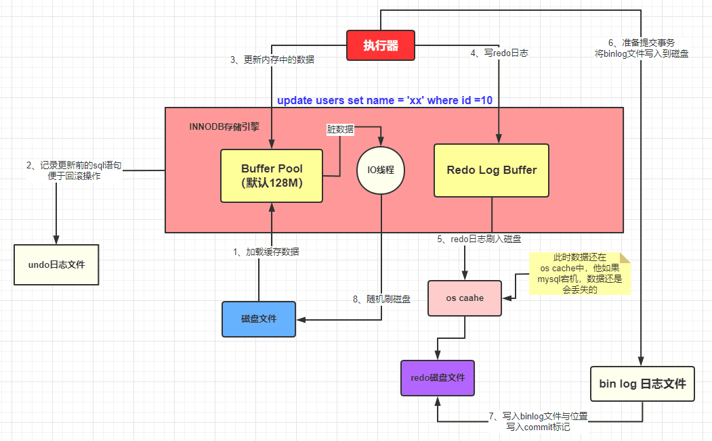
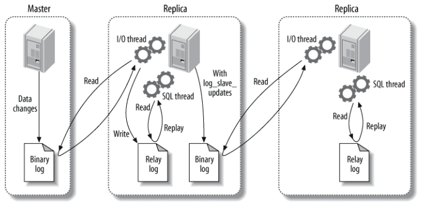

## 存储引擎、行格式

### MySQL 服务器处理客户端的查询请求的流程？

**1） 连接管理（连接层）**

1. 客户端通过 MySQL 二进制协议发起 TCP 连接，携带 IP、用户名、密码；服务端读取`mysql.user`完成身份 + 主机白名单双重认证，认证失败直接断开连接。

2. MySQL 维护连接线程池（由`thread_cache_size`控制最大空闲缓存线程）：

   - 新连接优先复用缓存中的空闲线程；

   - 客户端正常断开 / 会话超时，线程不会立即销毁，转为空闲存入线程缓存；缓存满时，多余空闲线程直接销毁。

3. 线程长期阻塞等待客户端发送请求；客户端发送的 SQL 语句封装在二进制协议包中到达服务端，进入 Server 层处理。

---

**2）Server 层统一处理**

**① 查询缓存（仅 MySQL5.x，8.0 彻底移除）**

拿到完整 SQL 文本后，先校验是否命中查询缓存：

- 命中条件：SQL 字符完全一致、无动态不确定函数（now ()/rand ()）、无用户变量；缓存跨客户端共享；
- 失效机制：对应数据表发生增删改操作，该表全部缓存条目自动清空；
- 未命中则继续向下执行解析流程。

**② SQL 解析（词法→语法→语义）**

- 词法 / 语法分析：拆分 SQL 关键字、标识符，校验语法合法性，生成抽象语法树 AST；
- 语义分析：校验库、表、字段、函数是否存在，基础语法逻辑校验；
- **权限校验**：校验当前登录用户是否拥有该表 / 字段的查询 / 修改权限，无权限直接抛出异常。

**③ 查询优化器（基于成本优化）**

分为**逻辑优化**和**物理优化**，输出最优执行计划：

- 逻辑优化：常量折叠、外连接转内连接、子查询展开、谓词下推、消除无用表；
- 物理优化：遍历候选索引、选择表连接顺序、匹配三种连接算法 (NLJ/BNL/HJ)，计算每条执行计划的 IO+CPU 成本，选出成本最低方案。

**④ 执行器**

接收优化后的执行计划，通过统一 Handler 接口调用底层存储引擎，下发数据读写指令；筛选符合查询条件的数据行，组装结果集存入 Server 层网络缓冲区（net_buffer_length）。

---

**3）存储引擎层（以 InnoDB 为例）**

- 存储引擎是独立模块化组件，向 Server 层提供统一数据读写接口，负责磁盘数据、索引、事务、MVCC、行锁管理；
- 读写优先操作 InnoDB 缓冲池 Buffer Pool（内存缓存磁盘页），减少磁盘随机 IO；修改数据先写 redo log、undo log，事务提交刷盘；
- 按执行器指令返回匹配的数据行给上层 Server。

---

**4）结果返回与收尾**

- Server 层网络缓冲区达到配置阈值后，批量将结果集通过 TCP 发送给客户端；查询结束清空缓冲区；
- DML/DDL 语句会同步写入 binlog（开启时），用于主从复制、数据恢复；
- 线程回到空闲等待状态，等待下一条 SQL 请求。

### MySQL 存储引擎的作用是什么？有哪些常用的存储引擎？它们的各自的特点是什么？

存储引擎的作用

- 存储引擎是 MySQL **可插拔、模块化**的数据存储组件，Server 层与底层数据读写解耦；
- 向上为 SQL 执行器提供统一标准接口，向下封装磁盘 / 内存的数据存取逻辑；
- 全权负责：数据存储、索引实现、锁机制、事务、MVCC、崩溃恢复、并发控制、缓存管理；

---

**① InnoDB（MySQL5.5+ 默认引擎，生产主流）**

- 支持完整 ACID 事务，支持 4 种事务隔离级别；
- 基于 MVCC 多版本并发控制，实现读写不阻塞；
- **行级锁 + 意向表锁**，并发读写性能优秀；
- 支持外键约束、崩溃自动恢复（redo/undo log）；
- 采用聚簇索引，主键与数据存放在一起；
- 拥有 Buffer Pool 内存缓冲池，减少磁盘 IO；
- 支持自增锁、事务回滚、崩溃安全；

> 适用：绝大多数业务表（订单、用户、商品等）。


**② MyISAM（老版本默认，现已极少生产使用）**

- **不支持事务、无 MVCC**，崩溃后数据易损坏丢失；
- 仅支持**表级锁**，写操作会阻塞全表读，并发写入差；
- 非聚簇索引，数据和索引分文件存储；
- 支持全文索引、数据压缩；
- 不支持外键、崩溃恢复；

> 适用：仅静态只读、几乎无更新的历史归档表。


**③ MEMORY（Heap 内存引擎）**

- 数据完全存内存，磁盘只保存表结构，重启 / 断电数据全部清空；
- 支持哈希索引、B + 树索引；
- 仅表级锁，不支持事务、不支持大 TEXT/BLOB 字段；

> 适用：临时中间计算、高频临时统计表、缓存临时数据。

### InnoDB 行格式有哪些？各个行格式的具体结构是怎么样的？

**一、InnoDB 四种行格式**

- Redundant：MySQL5.0 之前老旧行格式，已淘汰；
- Compact：5.0 引入，基础紧凑格式；
- Dynamic：5.7 默认，动态溢出存储；
- Compressed：基于 Dynamic，增加数据压缩能力。

Compact / Dynamic / Compressed 行头部元数据结构完全一致，仅大变长字段（TEXT/BLOB/VARCHAR 超长）溢出存储策略不同。

---

**二、通用行整体结构（Compact/Dynamic/Compressed）**

每条记录分为两大段：

- **记录额外元数据（行头信息）**：变长字段长度列表 + NULL 位图列表 + 5 字节记录头；
- **记录真实数据**：用户定义字段值 + InnoDB 3 个系统隐藏列。


**1）变长字段长度列表**

- 存储对象：VARCHAR、VARBINARY、TEXT、BLOB 等变长类型；
- 存储原因：因为这种变长字段中存储多少字节的数据是不固定的，所以在存储真实数据的时候需要把这些数据占用的字节数也存起来
- 存储规则：按字段定义**逆序存放**；数据长度≤255 占用 1 字节，>255 占用 2 字节；
- 作用：读取时快速定位每个变长字段的数据边界。

**2）NULL 值位图列表**

- 仅当表存在允许为 NULL 的字段时才存在，无 NULL 列则该区域消失；
- 存储规则：按位标记，1bit 对应一个可 NULL 字段，`1=NULL`，`0=非NULL`；整体字节、位均逆序；
- 核心：**标记为 NULL 的字段，不在真实数据段存储任何内容**，节约空间；主键、NOT NULL 字段不占用位图位。

**3）记录头信息（固定 5 字节，40bit）**

- delete_flag（1bit）：逻辑删除标记，1 代表已删除，会加入页面垃圾链表等待**垃圾回收线程**清理；
- min_rec_flag（1bit）：B+ 树的每层非叶子节点中最小的目录项记录都会添加标记，页内分组最小记录标记，用于页内有序分组；
- n_owned（4bit）：一个页面中会分成很多个组，每个组会有个大哥，大哥的 n_owned 会标记该组中有多少个记录，小弟的 n_owned 都是 0；
- heap_no（13bit）：记录在页面堆中的编号（相对位置）；页内虚拟记录 Infimum=1，Supremum=2，用户数据从 3 开始；
- record_type（3bit）记录类型：
  - 0：普通用户记录
  - 1：B+ 树非叶子节点目录项记录
  - 2：页内下界虚拟记录 Infimum
  - 3：页内上界虚拟记录 Supremum
- next_record（16bit）：有符号偏移量，指向下一条记录的页内相对位置，串联页内单向有序链表。

**4）记录真实数据**

- 用户自定义字段：INT、CHAR、VARCHAR 等业务字段；超长字段根据行格式决定是否溢出；
- 系统隐藏列（固定存在）：
  - DB_ROW_ID (6B)：无主键时自动生成全局行 ID；
  - DB_TRX_ID (6B)：最后修改该记录的事务 ID，MVCC 可见性判断；
  - DB_ROLL_PTR (7B)：回滚指针，指向 undo 日志，构建数据版本链。

---

**三、Compact / Dynamic / Compressed 核心区别**

1. Compact

   超长文本 / 二进制字段：**行内保留前 768 字节数据前缀，剩余数据存入溢出页；**

2. Dynamic（默认）

   超长字段完全不在行内存放数据，**仅保留 20 字节溢出页指针，全部内容存溢出页；**

3. Compressed

   溢出规则同 Dynamic；额外支持页面、行数据、溢出页压缩，节省磁盘空间，会消耗少量 CPU。


### 溢出页是什么？产生溢出页的临界点是什么？

**什么是溢出页（溢出数据）**

当 TEXT、BLOB、超长 VARCHAR 等大字段数据过长，InnoDB 不会把完整数据都存在聚簇索引页的行记录内，而是将字段主体数据单独存放在独立的溢出页，行内只保留一段指针，存溢出页地址，存放在溢出页的字段数据称为溢出数据。

---

**溢出产生的临界点（核心）**

默认页面大小 `16KB=16384字节`

InnoDB 固定阈值：**单个变长字段数据长度 > 8126 字节（页大小 / 2）**，触发溢出存储逻辑。

配套页面硬性约束：数据页至少要能放下 2 条完整记录，避免单条巨型记录独占一整个索引页，这是页面存储限制，不是溢出触发条件。

---

**三种行格式对溢出字段的处理差异**

- Compact

  字段超过 8126 字节：行内保留该字段前 768 字节数据前缀，剩余全部存入溢出页；

- Dynamic（MySQL5.7 默认）

  字段超过 8126 字节：行内不保留任何字段数据，仅存放 20 字节溢出页指针，完整数据全部存溢出页；

- Compressed

  溢出逻辑和 Dynamic 完全一致，额外会对索引页、溢出页整体做压缩存储。

> 查询时读取溢出字段会多一次 IO，大量大文本会降低查询性能。

## InnoDB 主键生成策略、隐藏列

### MySQL 的 InnoDB 的主键生成策略

**一、InnoDB 如何选择聚簇索引（主键载体三优先级）**

- **优先使用显式定义的 PRIMARY KEY**

  用户手动指定主键，直接作为聚簇索引，数据按主键有序存放。支持单列主键、复合联合主键。

- 没有主键，但存在 **UNIQUE NOT NULL 唯一索引**

  选取第一个满足非空的唯一索引充当聚簇索引；

  注意：该字段逻辑上仍然是唯一索引，不会自动升级为主键。

  普通允许 NULL 的 UNIQUE 索引无法充当聚簇索引。

- 既无主键，也无非空唯一索引

  InnoDB 自动生成隐藏列 `DB_ROW_ID`（6 字节无符号整数），作为整张表的聚簇索引；

  该值表级自增，业务 SQL 无法查询、修改此字段，仅内部使用。

---

**二、聚簇索引存储机制**

- InnoDB 每张表有且仅有一个聚簇索引，聚簇索引的 B + 树叶子节点完整存储整行全部数据；
- 数据页内的记录，严格按照聚簇索引的值升序排列；
  - 单列主键：按主键值排序；
  - 复合主键：按联合字段字典序排序。

---

**三、隐藏 DB_ROW_ID 特性**

- 占用 6 字节，表内全局自增，由系统内部分配；
- 高并发批量插入时会出现数值间隙，不能保证插入顺序严格连续；
- 仅当表无主键、无可用唯一索引时才会创建，有主键的表不存在该隐藏列。

---

**优点**

- 查询性能好：主键和数据在同一棵 B + 树，主键等值 / 范围查询无需回表；
- 自增有序主键插入永远追加到页面末尾，几乎不会触发页分裂，写入性能高，碎片少。

**无序主键问题**

若主键随机无序（如 UUID、雪花无序 ID），新插入数据会随机落在页面中间，频繁触发**页分裂**：

- 页面拆分，产生大量磁盘碎片；
- 占用更多 Buffer Pool 内存，IO 上涨，插入性能下降。

> 设计表时，推荐使用单调递增数值类型（BIGINT 自增 ID）作为主键，避免 UUID 等无序主键。

### 有哪些隐藏列？它们的作用是什么？

InnoDB 每条用户记录存在 3 个系统隐藏列：`DB_ROW_ID`、`DB_TRX_ID`、`DB_ROLL_PTR`。

① **DB_ROW_ID（6 字节，条件存在）**

- 出现条件：表**无主键、无 UNIQUE NOT NULL 唯一索引**时自动生成；
- 作用：充当聚簇索引，全局自增数字，唯一标识一行；
- 特点：业务 SQL 无法直接查询、修改。

② **DB_TRX_ID（6 字节，每行必存在）**

- 含义：最后**修改 / 插入**这条记录的事务 ID；
- 作用：MVCC 实现可见性判断；

> **Read Committed** 读已提交、**Repeatable Read** 可重复读（MySQL InnoDB 默认隔离级别） 隔离级别下，快照读依靠该事务 ID 和当前事务 ReadView 对比，判断这条版本是否可见。

③ **DB_ROLL_PTR（7 字节，每行必存在）**

- 含义：回滚指针；
- 作用：指向这条记录修改前的旧版本数据（存放在 Undo Log 中）；
- 串联整条数据版本链，快照读沿着指针遍历旧版本，实现多版本并发控制。

### DB_ROW_ID 的隐藏列的赋值策略

- **生效前提**

  仅**无主键、无 UNIQUE NOT NULL 唯一索引**的 InnoDB 表，插入记录时才会分配 DB_ROW_ID；每张此类表共用一套全局 row_id 分配器。

- **内存计数器分配逻辑**

  InnoDB 数据字典内存中维护共享计数器 `dict_sys->row_id`：

  - 插入新记录时，取出当前计数器值作为这条记录的 DB_ROW_ID；

  - 分配完成后，内存计数器立刻自增 1。

  > 所有符合条件的表共用同一个计数器，跨表连续递增。

- 延迟刷盘机制（每 256 个 ID 落地一次）

  为避免每次自增都刷磁盘产生大量 IO：

  - 每累计分配 256 个 row_id（计数器值为 256 整数倍），将当前计数器值持久化到**系统页 7（数据字典页）** 的 `Max Row ID` 字段；

  - 两次刷盘之间新增的最多 255 个 row_id 仅存在内存，未落地磁盘。

- 数据库重启恢复逻辑

  读取磁盘持久化的`Max Row ID`，**内存计数器初始值 = MaxRowID + 256**。

- 设计缓冲窗口 256 的原因：崩溃会丢失最近最多 255 个未落地的 row_id，启动直接跳过这段区间，保证后续分配的 row_id 不会和历史数据重复，避免主键冲突。

> DB_ROW_ID 占用 6 字节，业务 SQL 无法查询、修改；高并发插入会产生大量 ID 间隙，无法保证连续。

## InnoDB 索引页结构？


默认 16KB

- **File Heade**r：
  - 表空间 ID、当前页号、上一页页号、下一页页号；叶子页通过前后页号组成**双向有序链表**；
  - 页面类型（聚簇叶子页 / 非叶子索引页 / 溢出页 / 系统页）；
  - LSN 日志序列号、页面校验和，用于崩溃恢复与损坏校验。
- **Page Header**：记录本页面内部统计信息
  - 页内用户记录总数、页目录槽数量、页面分组数量；
  - Free Space 空闲空间起始偏移、页内最大 heap_no；
  - B + 树层级（叶子页 = 0，上层非叶子页递增）；
  - 已删除逻辑记录垃圾链表头、页面最大修改事务 ID、页面清理标记。
- **Infimum + Supremum**：页面内置两条特殊记录，不存储业务数据：
  - Infimum（下界）：页内最小记录，所有用户记录排序后均大于它；单独占用一个分组；
  - Supremum（上界）：页内最大记录，所有用户记录排序后均小于它；不参与分组、不存入页目录；
- **User Records**：存放业务真实行记录（叶子页）/ 索引目录项（非叶子页）：
  - 记录按**索引键升序**排列，通过行头`next_record`偏移量串联成**单向有序链表**；
  - DELETE 仅打 delete_flag 逻辑删除，不会立刻物理移除，删除记录统一挂载页面垃圾链表；
  - 每条记录由「行头元数据 + 真实字段数据」组成，包含 3 个隐藏列。
- **Free Space**：页面未分配的空白内存区域
  - 新增记录从空闲空间头部截取空间写入；大量删除后碎片空闲区域会合并，减少空间浪费。
- **Page Directory**：页内二分快速查找的索引结构，动态长度，从页底反向增长
  - 分组规则：每一组最多 8 条记录；组内第一条记录（组长）行头`n_owned`保存本组记录总数，组内其余记录`n_owned=0`；
  - 每个分组对应一个目录槽，槽内存放**该组最后一条记录**的页内偏移；
  - **查找流程：二分遍历页目录槽，锁定目标所在分组 → 通过槽偏移拿到组尾记录 → 顺着`next_record`向前遍历本组匹配目标行，大幅减少遍历次数。**
- **File Trailer**：页面完整性校验，避免断电 / IO 损坏：
  - 前 4 字节：页面数据校验和；后 4 字节：复制 File Header 的 LSN 低 4 位；
  - 磁盘加载页面时，对比 Header 与 Trailer 校验和、LSN，校验页面是否完整无损坏。

> - 聚簇索引叶子页：User Records 存储完整用户行数据；
>
> - B + 树非叶子索引页：User Records 只存索引键 + 子页号，无完整行数据；
>
> 两类页面七层分区结构完全相同。

## 如何查找元素的？

前置基础概念：页内分组 & Page Directory

- **分组规则：正常有序用户记录 + Infimum 会划分多个组，每组最多 8 条记录；**
  - 每组**第一条记录是组长（大哥）**，行头 `n_owned` 存储本组记录总数；
  - 组内其余记录（小弟）`n_owned=0`；
  - Supremum 不参与分组，不存入页目录。
- **Page Directory（页目录）**
  - 页面尾部区域，由若干 2 字节的槽 slot 组成；每个槽保存**对应分组最后一条记录**的页内偏移量，槽按主键升序排列。
- **链表区分**
  - 页内用户记录：依靠`next_record`偏移组成**单向升序链表**（主键从小到大）；
  - B + 树叶子数据页：依靠 File Header 前后页号组成**双向链表**。

---

**场景 1：主键等值查询（走聚簇索引完整流程）**

- **B + 树索引定位目标叶子页**

  从聚簇索引根节点出发，逐层遍历非叶子目录页，对比主键值，找到目标记录所在的叶子数据页。

- **页内利用 Page Directory 二分查找**

  - 二分遍历 Page Directory 所有槽，快速锁定主键可能存在的分组；
  - 根据槽取出分组最后一条记录，沿着`next_record`向前遍历本组全部记录；
  - 匹配到相等主键，直接返回该行；遍历完无匹配则不存在。

---

**场景 2：查询条件为普通列（无对应二级索引，触发全表扫描）**

无二级索引时，只能遍历全部聚簇索引叶子页：

- 从 B + 树最左侧叶子页开始，顺着叶子页双向链表逐页遍历；
- 针对当前页面：从 Infimum 记录开始，顺着单向用户链表**逐条遍历所有行**；
- 逐行对比普通字段是否匹配条件；
- 整页遍历完成后切换下一个数据页，直到全部叶子页扫描完毕。

> 为什么不能用页目录二分？二分依赖主键有序，查询条件不是主键，无法通过索引键缩小范围，只能全链表遍历。

## InnoDB 删除元素

### InnoDB 是如何删除一条记录的？

前置基础结构

1. 页内正常记录：依靠`next_record`组成**有序单向链表**（按索引键升序）；
2. Page Header 中`PAGE_FREE`：垃圾链表头指针，存放已 purge 摘除、可复用的废弃记录碎片；
3. 垃圾链表存储的记录脱离正常有序链表，空间可被新插入记录复用。

---

**阶段 1：标记删除（SQL 执行 DELETE 时，逻辑删除）**

仅修改该行**记录头 delete_flag = 1**，记录物理位置不变，依旧保留在正常有序用户单向链表中；

生成一条 undo 日志，保存这条记录删除前完整数据版本，行内 roll_ptr 指向该 undo；

此时效果：

- 当前事务内可见删除结果；
- 其他事务**快照读**：通过 undo 日志读取未删除的旧数据；
- 其他事务**当前读**：识别 delete_flag=1，直接判定该行不存在；

关键约束：仅完成标记，**无论事务是否提交，记录都不会立刻移入垃圾链表**，必须等待 purge 线程判断无事务依赖旧版本。

---

**阶段 2：Purge 线程物理回收（真正移除、空间复用）**

触发前提：删除事务早已提交，且**全局不存在任何活跃快照读事务**需要依赖这条记录的 undo 旧版本（由全局最小 ReadView 判断）。

完整执行步骤

- 处理聚簇索引：**将带 delete_flag 标记的记录，从正常有序`next_record`单向链表中摘除**；
- 插入垃圾链表：把摘除的记录插入`PAGE_FREE`垃圾链表**头部**，更新 Page Header 的 PAGE_FREE 指针；这片内存空间变为可复用；
- 同步清理所有二级索引：遍历该表全部二级索引，对对应索引记录执行同样「标记删除 → purge 摘除入垃圾链表」流程；
- 辅助页面统计更新：更新 Page Header 内用户记录数量、页面分组、页目录槽等元数据。

### InnoDB 是如何复用已删除的记录的空间的？（有点问题，不用看了）

页面的 Page Header 有一个 PAGE_GARBAGE 的属性，这个属性记录着当前页面中可重用存储空间占用的总字节数。每当有已删除的记录加入到垃圾链表后，都会把这个 PAGE_GARBAGE 属性的值加上已删除记录占用的存储空间大小。

PAGE_FREE 指向垃圾链表的头节点，之后每当插入新的记录时，会先判断垃圾链表头节点代表的已删除记录所占用的存储空间是否足够容纳这条新插入的记录，如果无法容纳，直接向页面申请新的空间来存储这条记录，并不会去遍历垃圾链表，只会判断头节点；

那么问题来了，如果新插入的记录占用的存储空间，小于垃圾链表头节点对应的已删除记录占用的存储空间，那就意味着头节点对应的记录所占用的存储空间站中，有一部分空间用不到，也就是碎片空间了，随着新纪录越差越多，由此产生的碎片空间也可能越来越多。

这些碎片空间占用的存储空间大小会被统计到 PAGE_GARBAGE 属性中，这些碎片空间在整个页面快使用完前并不会被重新利用。不过当页面快满时，如果再插入一条新的记录，此页面中并不能分配一条完整记录的空间。这个时候会先看看 PAGE_GARBAGE 的空间和剩余可利用的空间相加之后是否可以容纳这条记录。如果可以，InnoDB 会尝试重新组织页面内的记录。就是先开辟一个临时页，把页面的记录一次插入一遍。应为依次插入记录时并不会产生碎片，之后再把临时页面的内容复制到本页面，这样就可以把那些碎片空间都解放出来。

## 索引概念、原理

### B+ 树存储数据的案例？

**假设**：

- **B + 树叶子节点（数据页）**：每页存放 100 条完整用户行记录；
- **B + 树非叶子目录节点**：每页存放 1000 条目录项（索引键 + 子页号）。

**数据存储个数预估**：

- 如果B+树只有1层，也就是只有1个⽤于存放⽤户记录的节点，最多能存放100条记录。

- 如果B+树有2层，最多能存放1000×100=10 万条记录。
- 如果B+树有3层，最多能存放1000×1000×100=1 亿条记录。  （三层就一个亿了）
- 如果B+树有4层，最多能存放1000×1000×1000×100=1千亿条记录。

磁盘 IO 读取次数说明（核心：根节点常驻内存，无磁盘 IO）

- 2 层 B + 树：内存读根目录 → 磁盘读叶子页，**仅 1 次磁盘 IO**；
- 3 层 B + 树：内存读根 → 磁盘读中间目录页 → 磁盘读叶子页，**2 次磁盘 IO**；
- 4 层 B + 树：内存读根 → 磁盘读两层中间目录 → 磁盘读叶子页，**3 次磁盘 IO**；

**如果不考虑内存缓存（纯理论最坏情况，所有页都要从磁盘加载）：4 层树需要读取 3 个目录页 + 1 个叶子页，合计 4 次磁盘 IO。**

无论目录页还是叶子数据页，**页内都通过 Page Directory 页目录二分查找快速定位目标记录**，不需要遍历页内全部数据，进一步减少页内扫描耗时。

### 为什么使用 B+ 树而不是红黑树？

数据库索引数据存在**磁盘**，内存容量极小；磁盘 IO（页加载）是最慢操作，设计目标：**最大限度减少 IO 次数**。

- **树高度天差地别，IO 次数差距巨大（最核心原因）**

  磁盘一次 IO 读取一整页 (16KB)，B + 树单个节点能存放成百上千个索引键，树极矮；红黑树是二叉树，单节点仅 1 条数据，相同数据量下树高极高。

- **范围查询、排序性能碾压红黑树**

  B + 树所有叶子节点构成双向有序链表，**范围查询、分页、排序**只需要顺着链表顺序遍历，不用反复回溯上层节点；红黑树是独立二叉节点，范围查找需要中序遍历，频繁节点跳转、多次 IO，大批量范围查询性能极差。

- **插入、删除平衡代价更低**

  红黑树新增 / 删除节点会触发大量旋转操作，逻辑复杂；B + 树多路平衡，节点分裂 / 合并操作少，平衡维护成本更低；同时叶子页链表结构，批量删除、批量插入友好。

### MySQL 的索引类型有哪些？

首先，索引是在**存储引擎层实现**的，而不是在服务器层实现的，所以不同存储引擎具有不同的索引类型和实现。

- **B+Tree 索引**

  - InnoDB、MyISAM 默认使用 B+Tree 索引；MEMORY 内存引擎默认哈希索引；
  - InnoDB 基于 B+Tree 实现聚簇索引、二级辅助索引；MyISAM 无聚簇索引，所有 B + 树索引叶子存储数据文件物理偏移量；
  - 有序结构，支持等值、范围、排序、分组、最左匹配，是业务最常用索引。

- **哈希索引**：分为两类：原生 Hash 索引、InnoDB 自适应哈希索引 (AHI)

  **原生 Hash 索引（MEMORY 引擎）**

  - 底层哈希表存储，等值查询 O (1)；
  - 数据无序，**不支持范围查询、排序、模糊匹配**，仅支持`=` / `IN`；

  **InnoDB 自适应哈希索引 AHI**

  - 完全内存缓存，磁盘不落地，服务重启失效；
  - InnoDB 自动监控热点等值查询，针对高频访问的 B + 树页构建哈希映射，无需人工创建；
  - 仅加速等值查询，范围查询仍走原生 B + 树；无法手动控制开启 / 关闭。

- **FULLTEXT 全文索引**

  - 底层基于倒排索引实现，记录关键词与对应数据行的映射；
  - 使用 `MATCH() AGAINST()` 语法检索文本关键词，替代低效 `LIKE '%关键词%'`；
  - MyISAM 早期版本就支持；InnoDB 在 MySQL 5.6.4 版本新增支持；
  - 限制：无原生中文分词，需第三方分词插件，不支持范围、排序优化。

### 什么是聚簇索引？

聚簇索引是 InnoDB 特有的索引存储方式，**数据行本身按照索引键有序存放在 B + 树的叶子节点**，数据与索引融为一体，俗称「索引即数据，数据即索引」；每张 InnoDB 表有且仅有一个聚簇索引。

---

**一、聚簇索引的排序与链表规则**

- **页内记录排序（仅叶子数据页有 Page Directory）**
  - 叶子数据页内所有用户记录按**聚簇索引键（主键）升序**，依靠行头`next_record`偏移组成单向有序链表；
  - 页内记录划分多个分组，每组最后一条记录的页内偏移存入 Page Directory 槽，通过二分快速定位目标分组；
  - 非叶子目录页仅存储路由目录项，无页目录二分查找机制。
- 叶子节点页双向链表
  - 所有存放完整用户记录的叶子数据页，通过 File Header 中前后叶子页号，组成**双向有序链表**，方便范围查询、分页连续遍历。
- **非叶子目录页无同层链表**
  - B + 树上层各级非叶子页仅存放「索引键 + 子页号」用于路由；**同一层级的非叶子页之间没有双向链表**，仅由父节点的目录项指针指向子页。

---

**二、B + 树分层存储特征**

1. **非叶子节点（目录层）**：只存储索引键与子页面编号，不存储完整数据，仅做查询路由；
2. **叶子节点（底层）**：存储**完整的用户行记录**，包含全部业务字段 + DB_ROW_ID/DB_TRX_ID/DB_ROLL_PTR 三个系统隐藏列，所有真实数据都存在叶子层。

### 什么是二级索引？

InnoDB 一张表仅有一个聚簇索引，其余所有索引都统称为**二级索引**，一张表可创建多个；

**分层存储结构**

- **非叶子目录页（路由层）**：

  仅存储：`索引键值 + 子页面编号`，**不存储主键**，只用来二分匹配索引值、定位下层页面。

- **叶子节点（底层）**

  存储：`当前索引列的值 + 聚簇索引主键`，**不会存放完整用户行数据**；

  - 单列二级索引：叶子 = 索引字段 + 主键；
  - 联合复合二级索引：叶子 = 联合索引全部字段 + 主键；

  所有叶子页同样按索引键升序排列，叶子页之间通过前后页号组成双向链表，支持索引范围查询。

---

**与聚簇索引的配合逻辑（回表）**

- 当查询条件命中二级索引时，先遍历二级索引 B + 树，拿到匹配记录对应的主键；
- 再拿着主键去聚簇索引 B + 树中查找完整的用户行数据，这个二次查询聚簇索引的过程叫做**回表**；
- 特殊场景：覆盖索引，查询需要的全部字段都存在二级索引叶子中，无需回表，性能最优。

> MyISAM 引擎没有聚簇索引概念，所有索引都是二级索引，其叶子节点存储的不是主键，而是数据文件的物理行偏移量。

### 什么是联合索引？

**基础定义**

联合索引是由**两个及以上字段共同组成的单个索引**，分为两类：

1. 复合主键 `PRIMARY KEY(a,b,c)`：属于聚簇索引，整张表以此排序；
2. 普通 / 唯一联合索引 `INDEX idx_abc(a,b,c)`：属于二级辅助索引，一张表可创建多个。

---

**排序规则（以索引 idx (a,b,c) 为例）**

B + 树内所有记录严格按索引字段依次升序排序：

1. 优先按字段 A 排序；

2. A 值相等时，按字段 B 排序；

3. B 值相等时，按字段 C 排序；

4. 若 A、B、C 全部相同，最后按照主键排序，保证每条索引记录唯一。

   二级联合索引叶子节点存储结构：`A的值 + B的值 + C的值 + 主键`。

---

**核心特性：最左匹配原则**

MySQL 使用联合索引时，会从索引最左侧第一个字段开始匹配，连续命中条件才能使用索引；跳过前列、中间断字段会导致索引失效。

示例索引 `idx(a,b,c)`：

✅ 能走索引：`where a=1` / `where a=1 and b=2` / `where a=1 and b=2 and c=3`

❌ 无法走索引：`where b=2` / `where b=2 and c=3` / `where c=3`

---

**查询特性**

1. 若查询仅使用 a/b/c 三个索引字段，二级索引叶子已包含全部所需数据，**无需回表**，即覆盖索引；
2. 若查询包含其他未建立索引的字段，需要通过叶子中存储的主键，回聚簇索引 B + 树读取完整行数据。

### B+ 树的形成过程是怎么样的？

以单列索引 B + 树举例：

- 初始化根节点（初始为叶子页）

  创建索引时，分配一个空白页面作为 B + 树根节点；无数据时，页面无任何用户记录，此时根节点身份是**叶子页**，专门用来存放完整索引记录。

- **插入数据，填充根叶子页**

  新增数据记录时，直接写入当前唯一的根叶子页，记录按索引键有序排列。持续插入，页面空闲空间不断减少。

- **根叶子页存满，触发第一次页分裂（树从 1 层变为 2 层）**

  - 插入一条新记录后，页面剩余空间不足以存放，触发分裂；
  - 新建一块空白叶子页 B；
  - 将原根页中后半部分记录**移动**到新页 B（不是复制全部），原根页保留前半段记录；
  - 取中间分割点的索引键，生成一条目录项记录（分割键 + 新页 B 的页号），插入原根页；
  - 原根页身份发生变化：不再存放用户数据，升级为**非叶子目录页**；原根页 + 页 B 构成两层 B + 树。
  - 后续新插入记录，根据索引键大小，分配到两个叶子页中。

- **多层 B + 树的递归分裂（树扩展为 3/4 层）**

  随着数据持续插入，下层叶子页不断分裂，父级目录页会不断新增目录项；

  当某一层**非叶子目录页**空间占满、无法插入新目录项时，会执行**递归向上分裂**：

  - 新建空白目录子页，拆分当前满页的目录项；
  - 向上生成一条新目录项，插入上层父页面；
  - 如果上层父页面也满了，重复分裂逻辑，直到根目录页也分裂，树的整体高度 + 1。

### MyISAM 的索引方案是什么？

MyISAM 索引同样基于 B + 树，但采用**索引、数据分离存储**的设计，和 InnoDB 聚簇索引完全不同：

**存储文件拆分**

- `.MYD` 数据文件：**完整行数据单独存放，默认按插入顺序存储**；删除会产生页内碎片，新记录优先复用碎片空间；每条记录有唯一物理偏移（行号），依靠偏移直接读取行数据。
- `.MYI` 索引文件：表内所有索引（主键、普通、唯一、联合）全部存在这个文件中，和数据完全分开。

**索引统一结构（**无聚簇索引）：MyISAM 不存在聚簇索引，主键仅仅是带唯一性约束的普通索引，所有索引底层规则一致：

- 非叶子节点：存储索引键 + 子页号，用于路由；
- 叶子节点：仅存储**索引字段值 + 数据行物理偏移（行号）**。
  - 主键索引：叶子存「主键值 + 行偏移」；
  - 普通 / 联合索引：叶子存「索引列值 + 行偏移」。

**查询逻辑**：命中索引后，从索引叶子拿到行偏移，直接去独立的.MYD 数据文件中，根据偏移读取完整记录；

### 创建一个索引有那些代价？

创建索引会带来磁盘、写入、查询、运维四大类开销：

**磁盘空间开销**

- 索引 B + 树永久占用磁盘存储空间，热点页面会加载到 Buffer Pool 内存；
- 二级索引叶子节点额外保存主键，联合索引存储多列，索引越多，磁盘文件体积膨胀越严重，占用更多存储资源。

**DML 增删改的性能损耗**：索引 B + 树全程有序，表执行 INSERT/DELETE/UPDATE 时，需要额外维护索引有序性：

- INSERT：无序主键频繁触发页分裂，产生大量随机磁盘 IO；
- DELETE：标记删除后后台 Purge 线程清理索引记录，大量删除触发页合并；
- UPDATE：若修改索引字段，等价于删除旧索引记录 + 插入新记录，双倍索引维护开销；

页面分裂、合并、碎片整理都会消耗 CPU 与磁盘 IO，写入量大时性能衰减明显。

**SQL 优化器解析开销**

- 一条 SQL 最多选用一个二级索引；表上索引数量过多时，优化器需要遍历全部索引估算 IO 成本，执行计划生成耗时变长，极端场景还可能选错最优索引。

**事务日志写入开销**

- 索引结构的所有修改都需要记录 undo、redo 日志，用于 MVCC、事务回滚、崩溃恢复；索引越多，日志写入量越大，加重磁盘刷写压力，限制数据库写入并发吞吐量。

### 什么是索引条件下推？

1. 针对获取到的每一条二级索引记录，**如果没有开启索引条件下推特性，则必须先执行回表操作，在获取到完整的用户记录后再判断条件是否成立；**
2. 在普通的查询中，MySQL 数据库会将 SELECT 语句中的所有 WHERE 子句都发送到存储引擎中进行处理。**如果 WHERE 子句中包含多个条件，其中有些条件是可以在存储引擎层面过滤掉的，但是存储引擎仍然需要将所有数据都读入内存进行处理，这会导致查询效率较低。**
3. 如果开启了索引条件下推特性，如果判断条件包含了索引中的某个列，可以立即判断该二级索引记录是否符合该列的某个条件。**如果符合该条件则再进行回表操作，如果不符合则不执行回表操作，直接跳到下一条二级索引记录**；

### 索引用于排序升序和降序是怎么查找元素的？

> 升序全程顺着单向链表正向走；降序跨页反向跳转，单页无反向指针，少量数据靠页目录槽分组算法逐条找前驱，批量数据直接整页反转。

**前置核心基础**

InnoDB B + 树叶子节点（数据页）特性

- 所有叶子页按索引键**升序**组织；页头存 `prev_page`（上一页）、`next_page`（下一页），叶子页构成**双向链表**。
- 单个数据页内部：记录仅靠 `next_record` 偏移组成**单向升序链表**，没有前置指针；依靠 Page Directory（页目录 + 槽 + 分组 n_owned）实现向前查找。

> 正向升序：顺着 `next_record`、`next_page` 走；
>
> 反向降序：跨页靠 `prev_page` 向前跳转，单页内无反向链表，必须通过页目录分组算法找前驱记录。

---

**一、升序 ORDER BY xxx ASC 完整查找逻辑**

- **定位起始叶子页**：根据 WHERE 条件匹配索引，找到**最小匹配索引值所在的叶子页**。

- **跨页遍历规则（**由小到大）：当前页读完，直接取页头 `next_page` 下一页，循环直到无下一页。

- **单页内部读取逻辑**（最简单）：页内记录单向升序链表，从头记录开始，不断读取 `next_record` 下一条，顺序天然从小到大。

> 整体流程总结（升序）
>
> 索引定位起始最小页 → 页内从头顺着 next_record 正向读 → 读完当前页跳 next_page 下一页 → 持续输出有序数据。

---

**二、降序 ORDER BY xxx DESC 完整查找逻辑**

**第一步：全局跨页跳转规则（由大到小）**

- 根据 WHERE 条件定位**最大匹配索引值所在的最后一个叶子页**；
- 当前页所有记录处理完成后，取页头 `prev_page` 跳转到上一页；
- 重复处理每一页，直到无前置页。

跨页是倒序，但**单页内部没有反向链表**，单页取前一条记录必须走页目录分组算法。

**第二步：单页内底层查找前驱记录**

需求：已知当前记录，找到它的**前一条更小的记录**，步骤拆解：

1. 利用 Page Directory 二分槽，定位当前记录属于哪一个分组；
2. 顺着本页单向 `next_record` 持续向后遍历，找到本组**末尾记录（组大哥）**，该记录头信息 `n_owned>0`，标记本组记录总数；
3. 在页目录数组中，找到这个组大哥对应的槽，取**前一个槽**；前一个槽存储上一组末尾记录的偏移；
4. 上一组末尾记录的 `next_record` 就是**当前分组第一条记录**；
5. 从本组第一条记录开始，再次顺着 `next_record` 逐条遍历，直到遍历到当前记录；遍历途中最后读到的那条，就是当前记录的前驱记录。

> 案例页内分组：
>
> 组 1：10、20（末尾 20，n_owned=2，槽 1）
>
> 组 2：30、40、50（末尾 50，n_owned=3，槽 2）
>
> 当前记录 = 40，找它的前驱 30：
>
> 1. 二分槽定位 40 在槽 2 分组；
> 2. 向后 next_record 走到本组末尾 50（n_owned=3）；
> 3. 取槽 2 的前一个槽 1，对应末尾记录 20；
> 4. 20.next_record = 30（本组第一条）；
> 5. 从 30 开始遍历：30 → 40，40 的前一条就是 30。

**第三步：两种降序读取实现方案（上层执行器选择）**

**方案 1：逐条游标式读取（底层调用 index_prev，分页 / 少量数据）**

循环逻辑：

取当前最大记录 → 调用页目录分组算法找前驱记录输出 → 重复找前驱，直到页内无记录 → 跳转 prev_page 上一页。

优势：不用一次性加载整页所有数据，内存占用低；

缺点：多次分组遍历链表，单条读取开销比升序大。

**方案 2：批量整页反转（大量数据全页扫描，上层优化）**

一次性把当前叶子页所有匹配记录加载到内存数组，直接反转数组顺序批量输出；

不用循环调用前驱查找，批量场景性能更好；底层单条找前驱依然依赖上面的分组槽逻辑。

示例页数据 [10,20,30,40,50]，反转后输出 [50,40,30,20,10]。

### 什么是索引合并？

MySQL 默认一条查询只会选用单个索引生成扫描区间，特殊场景下可同时使用多个独立索引分别扫描、再合并结果集，该执行策略称为**索引合并（Index Merge）**，分为三种实现：交集合并 Intersection、并集合并 Union、排序并集 Sort-Union。

**Intersection 索引合并**

**交集索引合并，要求从不同的二级索引中获取到的二级索引记录都是按照主键排好序的；**

```sql
select * from single_table where key1='a' and key2='b'；
```

假设 key1 和 key2 都有索引。在 key1 索引扫描 key 值在 ['a', 'a'] 区间中的二级索引记录，同时在 key3 索引扫描 key 值在 ['b', 'b'] 区间中的二级索引记录，然后从两者的操作结果中找出 id 列值相同的记录（交集）。然后再根据这些共用的主键值去执行回表操作，这样就可能省下很多回表操作带来的开销；

为什么要求从不同的二级索引中获取到的二级索引记录都是按照主键排好序的？

- 因为从两个有序集合中取交集比从两个无需集合中取交集要容易的多；
- 如果获取到的 id 值是有序排列的，则再根据这些 id 值执行回表操作时就不再是进行单纯的随机 IO 了（这些 id 是有序的），这样就会提高效率；

也就是说如果使用某个二级索引执行查询时，从对应的扫描区间中读取出的二级索引记录不是按照主键值排序的，则不可用使用 Intersection 索引合并来执行查询；

**Union 索引合并**

**并集索引合并，同样要求从不同的二级索引中获取到的二级索引记录都是按照主键排好序的；**

```sql
select * from single_table where key1='a' or key2='b'；
```

假设 key1 和 key2 都有索引。在 key1 索引扫描 key 值在 ['a', 'a'] 区间中的二级索引记录，同时在 key3 索引扫描 key 值在 ['b', 'b'] 区间中的二级索引记录，然后从两者的操作结果中根据 id 列去重。然后再根据这些共用的主键值去执行回表操作，这样重复的 id 值只需要回表一次，这样就可能省下很多回表操作带来的开销；

为什么要求从不同的二级索引中获取到的二级索引记录都是按照主键排好序的？

- 因为从两个有序集合中取交集比从两个无需集合中取交集要容易的多；
- 如果获取到的 id 值是有序排列的，则再根据这些 id 值执行回表操作时就不再是进行单纯的随机 IO 了（这些 id 是有序的），这样就会提高效率；

**Sort-Union 索引合并**

**Union 索引合并的使用条件太苛刻，它必须保证从各个索引中扫描到的记录的主键值是有序的；**

```sql
select * from single_table where key1<'a' or key3>'z'
```

- 先根据 key1<'a' 条件从 key1 二级索引中获取二级索引记录，并将获取到的二级索引记录的主键值进行排序；
- 再根据 key3>'z' 条件从 key3 二级索引中获取二级索引记录，并将获取到的二级索引记录的主键值进行排序；
- 因为上面两个二级索引主键值都是排好序的，所以剩下的操作就与 Union 索引合并方式一样了；

把上面这种“先将从各个索引中扫描到的记录的主键值进行排序，再按照执行 Union 索引合并的方式执行查询”的方式称为 Sort-Union 索引合并。很显然 Sort-Union 索引合并要比单存的 Union 合并多了一步对二级索引记录的主键值进行排序的过程；

**需要注意的是有 Sort-Union 索引合并，但是没有 Sort-Intersection 索引合并。但是 MariaDB 中实现了**

Sort-Union 索引合并针对的是“单独根据搜索条件从某个二级索引中获取的记录比较少”的场景，这样及时对这些二级索引记录按照主键进行排序成本也不会太高。而 Intersection 索引合并针对的是“单独根据搜索条件从某个二级索引中获取的记录数太多，导致回表成本太大”的场景，使用Intersection 索引合并后能明显降低回表成本。但是如果加入 Sort-Intersection ，就需要为大量的二级索引记录按照主键值进行排序，这个成本可能就比使用单个二级索引执行查询的成本都要高。

## 索引使用注意事项

### 索引用于排序

**文件排序（filesort）逻辑**

当 SQL 需要排序且无法利用索引有序性时，MySQL 会执行文件排序：优先分配内存缓冲区 `sort_buffer_size`，将待排序数据放入内存完成排序；若待排序的数据量超过缓冲区上限，会借助磁盘临时文件分段排序、归并处理，最后将有序结果返回客户端。

**索引优化排序原理**

B + 树索引叶子节点记录本身已经按索引字段固定升序排列，若 `ORDER BY` 满足索引有序匹配规则，可直接顺着索引链表按顺序读取数据，**完全省去内存 / 磁盘排序开销**。

---

即使排序字段是索引列，依然会触发 `Using filesort` 的场景：

- 联合索引升降序混合：`idx(a,b)，order by a asc, b desc`；
- 索引范围条件打断有序分组：`idx(a,b)，where a > 10 order by b`；，**只在同一个 a 值内部，b 才是有序的；跨不同 a 值时，整体 b 完全乱序。**
- 跳过联合索引最左前缀排序：`idx(a,b)，order by b`；
- 索引字段使用函数、隐式转换：`order by substr(name,1,1)`。

> 执行 `EXPLAIN` 分析执行计划，若 `Extra` 列出现 `Using filesort`，代表没有走索引排序，发生了文件排序。

### 联合索引用于排序需要注意什么？ idx(a,b,c)

**一、最左匹配原则必须遵守**

排序字段要从索引最左列连续开始，不能跳过前列。

✅ 可用索引排序：

```
order by a`、`order by a,b`、`order by a,b,c
```

❌ 触发 filesort：

```
order by b`、`order by c`、`order by b,c
```

原因：索引是先排 a，再排 b，再排 c；跳过 a 直接看 b，全局 b 无序。

---

**二、WHERE 中不能在前置索引列使用范围条件**

范围：`> < >= <= like '前缀%' between`

一旦最左区间出现范围，**范围后面所有索引列都会失去全局有序性**，无法用于排序。

示例：

```sql
-- a是范围，后面b、c不能利用索引排序
where a > 10 order by b;
where a between 1 and 100 order by c;
```

✅ 正确写法（等值不破坏有序）：

```sql
where a = 20 order by b,c;
```

等值锁定单一 a 分组，组内 b、c 有序。

---

**三、升降序必须完全统一，不能混合**

索引底层存储固定：a 升、b 升、c 升。只有全部 asc / 全部 desc 才能顺着双向叶子链表直接读取，不用排序。

---

**四、排序字段不能被函数、隐式转换包裹**

字段加工后会失效，无法使用索引有序性：

```sql
-- 失效
order by substr(a,1,2)
order by cast(b as char)
where a+1=10 order by b
```

### 回表的代价

1. **对于使用 InnoDB 存储引擎的表来说，索引中的数据页都必须存放在磁盘中，等到需要时才会加载到内存中使用**。这些数据也会被存到磁盘中的一个或者多个文件中，页面的页号对应着该页在磁盘文件中的偏移量。以 16KB 大小的页面为例，页号为 0 的页面对应着这些文件中偏移量为 0 的位置，页号为 1 的页面对应着这些文件中偏移量为 16KB 的位置；
2. **如果某个扫描区间中的二级索引记录的 id 值的大小是毫无规律的，我们每读取一条二级索引记录，就需要根据该二级索引记录的 id 值到聚簇索引中做回表操作。如果对应的聚簇索引记录所在的页面不在内存中，就需要将该页面从磁盘加载到内存中。由于需要读取很多 id 值并不连续的聚簇索引记录，而且这些聚簇索引记录分布在不同的数据页中，这些数据页的页号也毫无规律，因此会造成大量随机 IO；**
3. 需要执行回表的操作的记录越多，使用二级索引进行查询的性能也就越低，某些查询宁愿走全表扫描也不愿意走二级索引；

### 增删改操作对二级索引的影响

**一、INSERT 插入操作**

插入一条新数据，除写入聚簇索引完整行，**所有二级索引都要新增一条索引记录**：索引字段 + 主键。

- 按索引排序规则找到对应叶子页；
- 插入新索引记录，维持页内有序；
- 若当前页空间不足：触发**页分裂**，一页拆成两页，调整上层非叶子节点指针，产生大量 IO。

**负面影响：**

- 多二级索引表，一次插入要维护多棵 B + 树，写入放大；
- 索引页频繁满页，频繁页分裂，产生碎片、增加磁盘 IO；
- 页分裂产生大量离散脏页，后台刷盘压力上升。

---

**二、DELETE 删除操作**

1. 找到二级索引对应记录，打上删除标记，逻辑失效，不会立刻清理；
2. 标记后的记录依然占用页面空间；
3. 后台 Purge 线程统一清理：事务提交且无快照需要这条记录时，物理移除；
4. 页面删除记录过多、空闲空间足够时触发**页合并**，减少页碎片。

**负面影响**

1. 大量删除只打标记，页面空洞越来越多，索引页利用率下降，同等数据占用更多磁盘；
2. 范围扫描时仍会遍历已标记删除的记录，增加 CPU、IO 开销；
3. Purge 线程集中清理时会爆发批量 IO，引发数据库短时抖动；
4. 页合并会修改上层索引节点，带来额外写入开销。

---

**三、UPDATE 更新操作**

情况 1：更新字段不在任何二级索引内

只修改聚簇索引完整行数据，**所有二级索引完全不受影响**，无索引维护开销。

情况 2：更新字段属于某个二级索引的列（重点）

等价于：**先删除旧索引记录 + 插入新索引记录**

1. 在二级索引中找到原索引值记录，标记删除；
2. 根据新索引值，找到新位置插入一条全新索引记录；
3. 新旧索引值落在不同页面时，同时触发旧页标记删除、新页插入，可能同时出现页合并、页分裂；
4. 多索引字段更新，多张二级索引都要执行删 + 插双重操作，写入开销翻倍。

**负面影响**

1. 一条 UPDATE 转化为删除 + 插入两次索引变更，IO、CPU 消耗倍增；
2. 频繁更新索引字段会持续产生索引碎片、页分裂、页合并；

## SQL 优化

**创建索引相关**

1. 尽量避免全表扫描，**针对高频搜索、排序、分组字段合理创建索引**，平衡查询与写入性能。

2. **创建索引需要评估字段区分度**。二级索引查询会伴随回表操作，若字段重复值极多，扫描区间会产生大量回表，性能极差；低区分度字段（如性别、状态）不建议单独建索引，优化器往往直接放弃索引走全表。

3. **索引字段数据类型尽可能小巧**：类型占用空间越小，单页可存放更多索引记录，减少磁盘 IO 次数，提升读写效率。

4. **为列前缀建立索引。**当列中存储的字符串包含的字符较多时，为列前缀建立索引可以明显减少索引大小；（前缀索引无法用于排序、分组，也不能作为覆盖索引；前缀截取过短会降低字段区分度，索引失效。）

5. 索引并非越多越好：索引提升查询效率，但会加重 INSERT/UPDATE/DELETE 写入开销，每条变更都需要维护多棵 B + 树，产生页分裂、redo 日志、行锁等额外损耗，按需创建索引。

6. **尽量使用数字型字段，若只含数值信息的字段尽量不要设计为字符型，这会降低查询和连接的性能，并会增加存储开销**。这是因为引擎在处理查询和连接时会逐个比较字符串中每一个字符，而对于数字型而言只需要比较一次就够了；

7. 唯一索引 vs 普通二级索引取舍

   唯一索引插入时必须实时校验唯一性，**无法使用 Change Buffer 做写入缓冲**，大批量写入性能差；仅区分度充足、无重复风险、写入压力低时使用唯一索引；高频写入场景优先普通非唯一二级索引。

   补充：Change Buffer 仅对非唯一二级索引生效，主键、唯一索引均不支持。

---

**联合索引相关**

1. **最左匹配原则**：遵循最左匹配原则，查询条件必须匹配索引最左连续前缀才能完整使用该联合索引。

2. 前置范围条件会截断后置索引能力

   索引 `idx(a,b,c)`，`where a>10 and b=20`。a 是范围，**b 无法用于索引过滤、排序**；哪怕 b 写等值，也只能靠 Server 层过滤。

   优化方案：把范围字段放联合索引最后。

3. **索引字段排序顺序与存储一致**

   MySQL5.7 及更早：索引叶子固定升序存储，无法自定义字段排序方向，反向排序只能整体 order by desc 逆序读取索引；

   MySQL8.0 支持在建索引时单独指定字段 desc，适配混合排序场景。

---

**where 查询条件**

1. **索引列要独立出现在条件中**，禁止对索引列做函数、四则运算，同时避免隐式类型转换，否则索引失效。

2. ****!= / <> 不会直接触发全表扫描**：过滤后匹配行数很少时，依旧可以走 range 索引扫描；仅当匹配数据量大，优化器判定大量回表 IO 开销高于全表顺序扫描，才会放弃索引。

3. **应尽量避免在 where 子句中使用 or 来连接条件**：

   - OR 两侧字段均建有单列索引：触发索引合并 Index Merge，不会全表扫描；
   - 一侧有索引、另一侧无索引：引擎放弃索引，执行全表扫描；

4. **慎用 IN / NOT IN**：少量离散常量 `IN(1,2,3)` 可正常走索引；IN 元素数量超过参数`eq_range_index_dive_limit`（默认 200）时，优化器放弃精准索引探查，仅靠统计信息估算行数，极易索引失效；NOT IN 天然匹配大量数据，几乎不会走索引；连续数值区间优先 BETWEEN 替代 IN（BETWEEN 只生成**1 个连续区间**，IN 会生成**多个独立等值区间**）。

5. 应尽量**避免在 where 子句中对字段进行函数操作**，这将导致引擎放弃使用索引而进行全表扫描；

6. 谨慎使用 `is null / is not null`：InnoDB 索引允许存储 NULL，该条件不一定全表扫描；但索引字段大量为 NULL 会降低区分度。

   存储细节：char 定长字段无论是否为 NULL 均占用完整存储空间；varchar 变长字段 NULL 不占用内容长度，仅占用行头 NULL 标记位；索引字段业务设计尽量设置 NOT NULL。

---

**关联查询 JOIN 优化**

1. **小表驱动大表**：MySQL 嵌套循环 JOIN 逻辑，驱动表数据量越小，循环匹配次数越少，性能越好，优化器会自动调换 INNER JOIN 驱动顺序。

2. **关联字段必须建立索引**：`A join B on A.b_id = B.id`，b_id、id 都要有索引，否则全表匹配（Block Nested Loop），巨慢。

3. **优先 inner join，慎用 left join**：left join 左表全部输出，右表索引很难命中；能内连接就不用左连接。

   - INNER JOIN：仅返回两边匹配数据，优化器自由选择小表驱动大表，两张表索引均可充分利用；
   - LEFT JOIN：强制左表全部保留，驱动表固定为左表，无法交换驱动顺序；若左表数据量大，循环匹配次数暴增；右表即使有索引，收益也会被大量循环抵消。

   > 配套规范：右表过滤条件写在 ON 子句后；若写在 WHERE 中会隐式转为 INNER JOIN，丢失无匹配的左表数据。

---

**分页、Limit 深度分页优化**

深度分页 `limit 100000,10` 灾难，MySQL 会先扫描前 10 万条数据、回表、过滤，再丢弃，只返回后 10 条。

优化方案：

1. **书签主键分页**：`where id > 上一页最大id limit 10`，利用有序聚簇索引直接定位扫描起点，彻底跳过前置数据；

   局限：不支持页面跳转；排序字段存在重复值时，仅 id 分页会丢 / 重复数据，需用「排序字段 + id」双条件过滤。

2. **延迟关联（覆盖索引分页**）：先通过覆盖索引仅查询主键，无回表快速筛选目标主键，再关联查询完整数据，减少大量中间行回表开销。

   补充：分页搭配 order by 若无对应索引，会触发 filesort 文件排序，性能大幅衰减。

   ```sql
   select t.* from t
   inner join (select id from t order by create_time limit 100000,10) tmp
   on t.id = tmp.id;
   ```

---

**查询字段**

1. **使用覆盖索引**，查询字段全部放入联合索引，无需回表，大幅降低随机 IO 开销，执行计划 Extra 出现 `Using index`。

---

**主键相关：**

1. **主键推荐使用有序自增类型**：聚簇索引按主键有序存储，随机主键插入会频繁触发页分裂，增加 IO 损耗；递增主键顺序写入叶子节点，无页分裂。

## 从准备更新一条数据到事务的提交的流程描述，过程



以单条 `update users set name='xx' where id=10` 事务为例：

1. **查找数据，加载进 Buffer Pool**

   执行器按执行计划定位 id=10 的数据：

   - 先去 Buffer Pool 缓存查找对应数据页；
   - 缓存不存在，则从磁盘`.ibd`文件读取数据页，加载到 Buffer Pool 内存。

2. **写入 undo 日志（预存旧数据，用于回滚 / MVCC）**

   修改内存数据前，把这条记录**更新前的原始数据**写入 undo 缓冲区，后续后台线程刷入 undo 磁盘文件；如果事务中途回滚，通过 undo 恢复原始数据。

3. **写入 Redo Log Buffer，再修改 Buffer Pool 内存（脏页产生）**

   - 先把本次数据页的**变更逻辑**写入 Redo Log Buffer（内存）；

   - 再修改 Buffer Pool 里内存页的数据，修改后该页变为**脏页**（内存和磁盘数据不一致）；

     > 先写 redo 再改内存：宕机后可通过 redo 重做变更，保证崩溃安全。

4. **事务提交：InnoDB 两阶段提交 2PC（核心三步）**

   **阶段一：Prepare 准备阶段**

   - 将 Redo Log Buffer 中当前事务的 redo 日志，刷新到磁盘 redo 文件；
   - 在磁盘 redo 日志末尾打上 `PREPARE` 标记；

   此时事务处于中间状态：redo 已持久，binlog 还未写入。

   **阶段二：写入 Binlog 并持久化**

   - 把这条 update 完整操作记录写入 binlog 缓冲区，强制刷入磁盘 binlog 文件，记录 binlog 文件名、当前偏移位置。

   **阶段三：Commit 提交阶段**

   - 再次刷新磁盘 redo 文件，在 redo 日志末尾追加 `COMMIT` 标记，同时把对应 binlog 的文件名、偏移记录在 redo 中；
   - 数据库判定事务完整提交，对客户端返回执行成功。

## 分库分表

### 分库分表的定义

分库分表分为**垂直拆分**、**水平拆分**两大类，落地通用顺序：**先垂直拆分，再水平拆分**；

**一、垂直拆分（按业务 / 列维度切割，不切分行数据）**

垂直拆分分为「垂直分库」、「垂直分表」两种：

1. **垂直分库**

   定义：按业务模块将整套数据表集合拆分至独立数据库实例，库物理隔离。

   案例：单一电商总库，拆分为用户库、商品库、订单库、支付库；微服务架构本质就是垂直分库，各服务独占业务库，降低库之间资源竞争。

2. **垂直分表**

   定义：**同一数据库内**，将一张宽表按列拆分为多张子表，不跨库。

   拆分依据：列访问热度、字段耦合度。

方案 1：冷热列拆分，高频查询字段放主表，大文本、低频字段（备注、详情）拆附属扩展表；

方案 2：关联紧密的列聚合，减少多字段 IO 加载。

- 例：user (id,name,phone) 主表 + user_ext (id,avatar,intro) 扩展表。

---

**二、水平拆分（按行维度切割，表结构完全一致，分水平分表、水平分库分表）**

核心逻辑：表结构完全相同，根据分片键（sharding_key）将不同行数据分散到多张表 / 多个库，解决单表行数过大问题。

**水平分表（单库多表）**

所有分片表存放在同一个数据库，仅表名区分。

落地步骤：

① 选定分片键 sharding_key：优先业务高频查询字段，订单业务常用 user_id、order_id；

② 设计分片算法：数字型 ID 可直接 `分片键 % 分表总数`；字符串字段使用 hash 取模；

示例：日订单千万级，选用 user_id 分片，规划 1024 张子表；任意用户 id=100，计算 `100 % 1024`，路由至对应数据表。

缺陷：单库 CPU、IO 存在上限，库容量有瓶颈，扩容困难，仅适合中等数据量。

**水平分库分表（主流方案，多库多表）**

先拆分多个独立数据库，每个库内再划分若干分片表，双重分散数据，解决单库资源瓶颈。

---

**补充分片算法短板（hash 取模）**

单纯取模分片存在两大问题：

1. **数据分布不均**：用户活跃度差异大，部分分片表数据堆积；
2. **扩容成本极高**：分表数量变更时，所有数据分片路由全部失效，需要全量迁移数据；

优化方案：一致性 hash、range 范围分片。

### range 范围分片

核心原理

按照分片键**数值区间**划分数据，每一张分片表 / 库负责一段连续区间，表结构完全一致。

以 `user_id` 分片为例：

- t_order_0：user_id 1 ~ 1000000
- t_order_1：user_id 1000001 ~ 2000000
- t_order_2：user_id 2000001 ~ 3000000

路由逻辑：只需要判断分片键落在哪个区间，直接路由对应分片。

---

**扩容怎么处理（最核心优势）**

只需要**新增区间**，原有分片数据完全不用动，无历史数据迁移。

例如现在最大到 300 万，新增分片存储 3000001~4000000，旧分片数据完全不变。

---

**优点**

1. 扩容零迁移历史数据，只新增区间分片，运维成本极低；
2. 范围查询天然友好：`where user_id between 100 and 5000` 只会路由单张分片，不用查全部分片；
3. 路由逻辑简单，计算开销小。

---

**致命缺点：数据倾斜（冷热不均）**

如果业务数据不均匀，会出现某一个区间数据爆炸。

案例：大 V 用户集中在 100 万～200 万区间，该分片数据量远超其他分片，单表压力过大。

---

**优化方案**

1. 提前预留超大区间分片，监控数据量，提前拆分区间；
2. 结合冷热归档，把超量历史数据迁移归档库；
3. 拆分区间时，将热门区间一分为二，仅迁移该区间内数据，不影响其他分片。

---

**适用场景**

分片键自增均匀、需要大量范围查询（订单时间分片、自增 ID 分片）；**订单按创建时间分片是典型 Range。**

---

### 一致性 hash 分片

**核心原理**

1. 构建一个 **0 ~ 2^32 -1** 的环形哈希环；
2. 对每个分片节点（库 / 表）的标识做 hash，映射到环上固定位置；
3. 分片键 `user_id` 做 hash，映射到环上某一点，**顺时针找到第一个遇到的节点**，数据路由至该分片。
4. 引入**虚拟节点**：解决节点少、数据分布严重倾斜问题，一个物理节点映射成数百个虚拟节点均匀铺满哈希环。

---

**扩容 / 缩容怎么处理（核心优势）**

新增 / 下线一个分片节点时，**只有该节点相邻区间的数据需要迁移**，90% 以上历史数据路由不变，迁移量极小。

对比传统取模：传统扩容全量迁移；一致性哈希仅迁移一小部分数据。

示例：环上节点 A、B、C；新增节点 D 插入 B、C 之间，仅 B 到 D 之间的数据从 C 迁移到 D，A、B 区间数据完全不动。

---

**优点**

1. 扩容缩容仅迁移少量数据，线上平滑扩容，无需全量迁移；
2. 虚拟节点打散数据，相比简单取模，数据分布更均匀。

**缺点**

1. 范围查询极不友好：`where user_id between 100 and 1000` 哈希值分散在环各处，需要查询所有分片，性能极差；
2. 实现复杂，框架（Sharding-JDBC、MyCat）内置实现，但自定义开发成本高；
3. 极端节点下线，相邻分片压力瞬间暴涨，有短暂热点。

---

**优化手段**

虚拟节点：每个物理分片配置 16/32/64 个虚拟节点，让数据均匀分散在环上，避免单分片数据堆积。

---

**适用场景**

分片键离散、以等值查询为主，几乎无大范围区间查询（用户表、支付流水，以 uid 精准查询）。

### 企业落地分库分表策略

**核心结论**：

1. **有大量范围查询、自增有序分片键（订单、流水、日志）→ Range 区间分片**
2. **仅等值查询、分片键离散无连续查询（用户、商户、支付账号）→ 一致性哈希（带虚拟节点）**
3. 海量数据千万级以上、追求扩容平滑、冷热均衡：主流采用「Range 分库 + 库内一致性哈希分表」双层混合方案
4. 简单中小体量、业务几乎不扩容：简单取模 `id % N` 临时过渡

---

**一、Range 范围分片 适用落地场景**

适合选 Range 的业务

1. 按时间分片的订单 / 账单 / 日志表

   sharding_key = 订单创建时间、时间戳，天然连续区间；

   业务经常查：近 7 天、本月、季度订单，`between` 范围查询极多。

   例：t_order_202601、t_order_202602 按月分表；单库按月 Range 分表，超量再拆多库。

2. 分片键是连续自增 ID（order_id 雪花 ID），业务频繁区间分页、批量区间导出。

3. 数据冷热分层强，历史数据直接归档，旧区间分片直接下线归档库。

---

**二、一致性哈希（带虚拟节点）适用落地场景**

适合选一致性哈希的业务

1. C 端用户表、商户表、账号表，查询全是等值：`where user_id = ?`、`phone = ?`，几乎无大范围区间查询；
2. 分片键离散随机，用户活跃度差异大，需要均匀打散数据；
3. 业务未来会频繁扩容分库，不能接受全量迁移数据（电商用户逐年增长，分片库持续增加）。

---

**三、传统取模 hash (id) % N（仅临时过渡）**

适用：初创业务、数据量中等、短期不会扩容

---

**四、主流工业双层混合方案（千万级 / 亿级数据标准架构）**

方案：Range 分库 + 库内一致性哈希分表

适用：订单、交易流水、海量日志（互联网电商、支付平台标配）

**第一层分库：Range 按时间（年 / 季度）拆分多个独立数据库**

- ds_order_2025：存储 2025 全年订单

- ds_order_2026：存储 2026 全年订单

  优势：按时间归档、扩容新年度库无需迁移旧数据，范围查询锁定单库。

**第二层库内分表：一致性哈希 (user_id % 虚拟节点)**

每个年份库内拆分 1024 张子表，按用户 ID 打散，均衡单库内每张表的数据量，解决单表千万级性能瓶颈。

### 那分表后的 ID 怎么保证唯一性？

- 分布式ID，自己实现一套分布式ID生成算法或者使用开源的比如雪花算法这种

## MySQL 主从复制

### 三大核心线程



MySQL 主从复制三大核心线程（纠正命名）

1. **Master：Binlog Dump 线程**

   从库建立连接后，主库为该从库创建 Dump 线程；读取本地 Binary Log 二进制日志，将数据变更事件持续推送给从库。

2. **Slave：IO 线程**

   和主库 Dump 线程建立网络连接，持续拉取主库 binlog 数据，写入本地磁盘的 Relay Log（中继日志）文件。

3. **Slave：SQL 线程**

   读取本地 Relay Log 中的日志事件，重放执行 SQL，最终同步数据到从库。

> 中间从库开启 `log_slave_updates=ON`，回放中继日志后，会把变更再次写入自身 Binary Log，用于**级联复制（主→从 1→从 2）**，让下游从库同步数据。

### 三种复制模式

三种复制模式（区分 MySQL 原生支持范围）

**异步复制（MySQL 默认）**

- 主库完成事务、写入 binlog 后，直接返回客户端成功，**不等待任何从库同步回执**；

- 优点：写入性能最高；缺点：主库宕机，可能存在已提交数据未同步到从库，丢失数据风险。

**半同步复制（原生插件支持，生产常用）**：主从分别开启半同步插件

- 主库提交事务后阻塞，等待任意一台从库返回 ACK 确认；
- 从库仅将日志成功写入本地 Relay Log 就回复 ACK，**不需要等 SQL 线程执行完 SQL**；
- 主库收到至少一台从库的 ACK，才向客户端返回写入成功；
- 容错机制：等待 ACK 超时后，自动降级为异步复制，避免业务阻塞。

**全同步复制（MySQL 单机主从不原生支持，仅集群方案）**

- 代表方案：Galera、MGR 组复制；

- 需要所有从库完整回放执行完事务 SQL 后，主库才返回客户端；数据零丢失，但写入阻塞严重，并发性能差，极少单独主从使用。

### 主从同步延迟问题

同步延迟产生的核心根源

- **网络 IO**：主从网络带宽不足、延迟高，IO 线程拉取日志慢；
- **SQL 单线程回放**（旧版无并行复制）：大量 DML 堆积，SQL 线程追不上 IO 线程；
- **大事务**：主库 1 秒执行完，从库回放需要几十秒；
- **从库读负载过高**：大量查询抢占 CPU/IO，拖慢日志回放。

---

主从延迟无法彻底清零，但有完整优化手段控制延迟在业务阈值内：

- **并发复制优化**：开启 `slave_parallel_workers`，从库多线程并行回放 relay log，大幅降低 SQL 线程堆积；
- SQL 规范：**禁止超大事务、批量删改分批执行**，避免单条 SQL 锁住大量数据拖慢回放；
- 硬件与参数：**从库使用 SSD、调高 innodb 缓冲，降低磁盘 IO 延迟**；
- 架构拆分：**多台从库分摊读压力**，单从负载过高会加剧延迟；报表、离线统计单独使用专用从库；
- 业务兜底规则：**强一致性查询（订单库存、余额）强制走主库**；普通统计、列表查询走从库。

## 单表访问方法/访问类型

访问类型代表 MySQL 检索数据的方式，相同 SQL 不同访问方式 IO、CPU 成本差距极大，完整顺序：

```
system > const > eq_ref > ref > ref_or_null > range > index > ALL
```

**system（最优）**：表内仅有 1 行数据，仅系统元数据表会触发，查询成本几乎为 0，业务表几乎不会出现。

**const**

- 仅**单表查询**生效，通过主键 / 唯一二级索引做常量等值匹配，最多匹配 1 行；

- 优化器执行前即可算出常量结果，仅访问 1 次索引页，速度极快。

  > 注意：多表 JOIN 场景下主键等值匹配不会走 const，而是 eq_ref。

**eq_ref**：多表关联专用最优类型，驱动表每一条记录，在被关联表通过主键 / 唯一索引精准匹配**唯一一行**，JOIN 场景首选。 

**ref**：普通二级索引与常数等值比较，因为普通二级索引并不限制索引列值的唯一性，所以等值比较也会形成单点扫描区间，所以使用二级索引执行查询的代价就取决于该扫描区间中的记录条数；

- 若查询字段全部包含在索引内（覆盖索引），不会发生回表；
- 若查询包含非索引字段，每条索引记录都需要回表读取完整聚簇数据。

**ref_or_null**：ref 的特殊分支，同时匹配「索引列 = 指定常量」和「索引列 IS NULL」两个区间，合并扫描；适用于索引字段允许 NULL 的等值查询。

**range**：利用索引扫描一段 / 多段连续区间，支持 `>、<、>=、<=、BETWEEN、IN`；

- 仅扫描区间内索引数据，不遍历全索引 / 全表；
- 边界：IN 列表常量超过参数`eq_range_index_dive_limit`（默认 200），优化器估算失真，可能直接放弃索引降级为 ALL。

**index 全索引扫描**：完整遍历整棵二级索引树，分两种场景：

- ① 仅查询索引字段（覆盖索引），Extra 出现`Using index`，无需回表，性能优于 ALL；
- ② 扫描主键聚簇索引，等价于全表扫描，性能和 ALL 接近；

**ALL 全表扫描（最差，线上禁止）**：不使用任何索引，完整遍历聚簇索引所有数据页；

## 两个表连接的原理、JOIN BUFFER

### 两张表连接的原理

MySQL 所有两表关联本质都是**嵌套循环**，固定分为两张角色表：

1. **驱动表（外层循环表）**：只会完整遍历**1 次**，循环总次数 = 驱动表结果行数；
2. **被驱动表（内层循环表）**：每一条驱动行都要去该表匹配数据，扫描次数由优化算法决定。

---

内连接 vs 外连接 驱动表规则

- INNER JOIN 内连接：优化器**可以自由交换两张表**，自动选择数据量更小的表作为驱动表，减少外层循环次数，性能最优。无匹配的行会直接丢弃，不会出现在结果集。

- LEFT / RIGHT 外连接：驱动表**强制固定，无法交换**：

  - `A LEFT JOIN B`：A 固定驱动表，左表全部保留；B 是被驱动表；

  - `A RIGHT JOIN B`：B 固定驱动表，右表全部保留；

> 驱动表所有记录必须输出，无匹配时被驱动表字段填充 `NULL`。

---

**三种 JOIN 执行算法（性能从优到差）**

**① Index Nested-Loop Join 索引嵌套循环（最优，推荐）**

触发条件：**被驱动表的关联字段建有索引**。

- 读取一行驱动表数据，拿到关联字段值；

- 利用被驱动表索引，直接等值快速定位匹配行；
- 拼接两条记录返回，循环遍历所有驱动行。

关键特点：完全**不使用 Join Buffer**；每次匹配只读取少量索引页，几乎无磁盘 IO，生产首选。

**② Block Nested-Loop Join 块嵌套循环（无索引兜底，用到 Join Buffer）**

触发条件：被驱动表关联字段**无可用索引**，无法快速定位匹配数据。

原始无缓冲的致命缺陷：驱动表有 M 行，就要对被驱动表**完整全表扫描 M 次**，反复从磁盘读取整张表，IO 开销爆炸。为了解决这个问题，MySQL 引入 `Join Buffer` 内存缓冲区做批量优化。

③ Batched Key Access Join (BKA 批量键访问)

触发条件：被驱动表有索引，但驱动表数据量巨大，单行循环访问索引会产生大量随机 IO。

逻辑：借助 Join Buffer 批量缓存驱动表的关联键，一次性批量查询索引，合并多次随机读，降低 IO 次数。

### Join Buffer详解

基础属性

- **线程私有内存**：每条执行 JOIN 的 SQL 单独分配一块，并发量大时内存会叠加占用，不能随意调大；
- 配置参数 `join_buffer_size`：默认 256KB，理论最小值 128 字节；
- **仅用于 Block Nested-Loop / BKA Join**；索引嵌套循环完全不使用该缓冲区；
- 缓冲区装满不会落磁盘，分多批循环加载驱动表数据、分批匹配。

---

**Join Buffer 里面存什么？**

不会存储驱动表完整整行，只缓存执行 SQL 必需的字段：

- `SELECT` 查询列
- `ON` 关联条件字段
- `WHERE` 过滤字段

无关字段全部丢弃，最大化节省内存，让一批能缓存更多驱动行。

---

**Block Nested-Loop 下 Buffer 完整执行流程**

- 批量读取多条驱动表数据，写入 Join Buffer；
- **只完整扫描 1 次被驱动表**，取出被驱动表每一行；
- 在内存中，拿当前被驱动行和 Buffer 里所有缓存驱动行批量比对匹配；
- 匹配成功则拼接输出；
- 清空缓冲区，加载下一批驱动表数据，重复步骤 2~4，直到驱动表全部遍历完毕。

---

**Join Buffer 节省 IO 的核心本质**

- 无缓冲原生嵌套循环：驱动 M 行 → 被驱动表全表扫描 M 次；
- 启用 Join Buffer 块优化：无论 M 多大，**被驱动表仅完整扫描 1 次**；

极大减少磁盘重复读取，所有匹配逻辑在内存完成，大幅降低 IO 耗时。

> EXPLAIN 识别标记：Extra 列出现 `Using join buffer (Block Nested Loop)` 代表当前 SQL 无索引，使用了块缓冲，是重点优化对象。

## MySQL 的成本

### MySQL 中的成本计算

MySQL 查询优化器会预估多条可行执行方案的总开销，最终选择**预估总成本最低**的方案执行 SQL。

总成本 = IO 成本 + CPU 成本

**IO 成本**

- InnoDB 以「页」作为磁盘与内存交换最小单位；查询时需要将磁盘上的数据页、索引页加载进 Buffer Pool 内存才能读取，**从磁盘加载一页产生 1 份 IO 成本**；
- 若页面已经缓存于内存，重复访问不会新增 IO 成本，仅消耗 CPU。
- 优化器内部规定：读取 1 个磁盘页，IO 成本固定计为 `1.0`。

**CPU 成本**

- 数据页载入内存后，遍历行、校验 WHERE 过滤条件、JOIN 匹配、排序、分组、结果集拼接等计算操作产生 CPU 开销。
- 优化器内部估算规则：
  - 每读取并处理一条数据行，CPU 成本固定计 `0.2`；
  - 即使该行无需校验过滤条件，只要是逐条遍历扫描（全表 / 全索引 /range 扫描），依然会累加 0.2；
  - 精准索引单点匹配（const/eq_ref）无需批量遍历行，不会按行累加 CPU 成本。

### 单表查询的成本

MySQL 优化器会枚举所有可行执行方案，分别预估总执行成本，最终选择总成本最低的方案；总代价 = IO 成本 + CPU 成本。

1. 找出所有候选索引

   - 根据 WHERE 条件、关联条件，筛选出所有能够用于过滤数据的索引，这些候选索引称为 `possible_keys`；候选索引不一定会被最终选用。

2. 计算全表扫描的预估代价

   InnoDB 无堆表，全表扫描等价于完整遍历聚簇索引全部叶子页：执行时逐页加载聚簇索引页到内存，逐条校验记录是否匹配搜索条件。

   - IO 成本：聚簇索引全部叶子页的数量，每页 IO 成本记 1.0；
   - CPU 成本：表内全部记录行数，每行处理成本 0.2；

3. 逐个计算每条二级索引执行方案的代价

   使用二级索引查询分为两种场景：普通二级索引（需要回表）、覆盖索引（无需回表）。

   （1）核心统计依据：扫描区间覆盖的索引叶子页数、区间内预估记录条数

   （2）二级索引区间 IO 成本：优化器统计该 range 区间覆盖的所有二级索引叶子页数量，一页计 1.0 IO 成本；并非一个区间固定等于 1 页 IO。

   （3）区间记录条数估算逻辑（索引页采样估算）

   - ① 若区间左右边界记录相隔≤10 个索引页：精确统计区间内记录数量；
   - ② 若区间跨页超过 10 页：读取区间最左侧 10 个索引页，计算单页平均行数，再乘以区间总页数，估算总记录数；

   （4）回表代价计算（仅非覆盖索引）

   - 拿到二级索引内主键后，需要到聚簇索引读取完整行数据，即回表：优化器采用悲观保守估算：**预估每一条匹配记录都会产生 1 次聚簇索引页 IO**（不考虑 Buffer Pool 缓存命中复用页面的情况）；
   - 回表读取完整行后，再校验 WHERE 中索引无法覆盖的过滤条件，叠加对应 CPU 成本。

4. **对比所有方案预估总成本**：分别对比「全表扫描」「各个二级索引 range / 等值扫描」的总 IO+CPU 代价，选择预估开销最小的执行方案。

### 连接查询的成本

驱动表访问一次，被驱动表可能访问多次，所以对于两表连接查询来说，它的查询成本由两部分组成：

- **单次查询驱动表的成本**；
- **多次查询被驱动表的成本**；（具体查询多少次取决于针对驱动表查询后的结果集中有多少条记录）

**把驱动表查询后得到的记录条数称为驱动表的扇出**，显然，驱动表的扇出值越小，对驱动表的查询次数也就越小，连接查询的总成本也就越低。

---

扇出 Fanout 与 Condition Filtering

扇出：驱动表执行单表查询、经过所有条件过滤后，最终参与 JOIN 匹配的有效记录行数；扇出越小，内层循环次数越少，整体连接成本越低。

优化器无法精准统计过滤后行数时，会依靠索引统计、索引页采样做估算，这个估算流程称为 **Condition Filtering（条件过滤估算）**，两种场景需要估算：

- 驱动表走全表扫描：需要估算满足全部 WHERE 过滤条件后剩余的行数；
- 驱动表走索引区间扫描：索引仅覆盖部分过滤条件，需要估算额外过滤条件筛除后剩余的行数。

---

**索引嵌套循环下的成本计算公式**

仅适用于 Index Nested-Loop Join：

```
连接查询总成本 = 单次访问驱动表的成本 + 驱动表扇出值 × 单次访问被驱动表的成本
```

> 补充边界：如果是 Block Nested-Loop 块嵌套循环（无索引、使用 Join Buffer），该公式不生效；BNL 会批量缓存驱动数据，被驱动表仅扫描极少次数，不会随扇出倍数叠加成本。

---

**内连接 vs 外连接 连接顺序差异**

- **LEFT / RIGHT 外连接**

  驱动表强制固定，两张表不能互换顺序；优化器仅需分别给驱动、被驱动表选择各自最低成本的单表访问方案，无需对比多种表顺序。

- **INNER JOIN 内连接**

  两张表可自由互换驱动 / 被驱动身份；优化器需要枚举多种表连接顺序，分别计算每种顺序的总成本，选出全局最低成本的连接方案。

---

**连接查询两大核心优化方向**

1. 降低驱动表扇出：给驱动表增加索引过滤、缩小查询范围，减少内层循环执行次数；
2. 降低单次访问被驱动表的成本：优先在被驱动表关联字段建立索引，主键 / 唯一索引最优，单次匹配仅少量 IO；

> MySQL 兜底方案：无法创建索引时，依靠 Join Buffer 块嵌套循环，减少被驱动表全表扫描次数。

## in 语句的值列表长度问题

index dive 与 eq_range_index_dive_limit 阈值完整原理

当 SQL 中 IN (值 1, 值 2,...) 会生成多个单点等值扫描区间：

**Index Dive 索引下探**

- 优化器为精准计算每个单点区间内的记录行数，会少量读取索引 B + 树的叶子页（最多采样 10 页），基于页面内真实数据统计区间行数；该操作发生在**执行计划生成阶段**，会少量消耗 IO、CPU。

- 仅普通二级索引需要 index dive；唯一索引 / 主键单点等值能直接确定最多 1 行，无需下探。

阈值变量 `eq_range_index_dive_limit`，默认值 200

- IN 生成的单点区间数量 < 200：启用 index dive，精准采样统计每个区间行数，成本估算准确；
- IN 生成的单点区间数量 ≥ 200：停止 index dive，不再访问索引 B + 树，改用**索引全局统计信息**估算行数。

---

**阈值设置的影响**

如果 IN 列表元素很多，但 SQL 最终没走索引（type=ALL 全表扫描），大概率是该阈值过小：

区间数超过阈值后，优化器只能依靠全局平均值粗略估算匹配行数，容易高估 IN 匹配的数据量，判定索引扫描成本高于全表扫描，直接放弃索引；

---

**索引全局统计数据的估算逻辑**

MySQL 会为每个索引维护统计信息，用于无法 index dive 时快速估算区间行数：

- `show index from 表名` 中 `Cardinality`：索引列不重复值的估算数量；

- `show table status` 的 `Rows`：表总行数（InnoDB 为估算值，非精确）；

- 平均每个值重复次数 = 总行数 Rows ÷ Cardinality；

  优化器会用这个平均值，直接估算 IN 中每个单点区间的匹配行数。

---

**全局统计估算的致命弱点**

该平均值是整张表的全局均值，完全无法识别数据冷热分布，估算误差极大：

1. 热点值真实行数远高于均值、冷门值远低于均值；
2. 基于失真的行数计算 IO/CPU 成本，容易选错执行方案；
3. Cardinality、Rows 均为采样估算，长期不执行`ANALYZE TABLE`会进一步加剧偏差，导致执行计划持续劣化。

## InnoDB 的统计数据是如何收集的？

InnoDB 统计分为**表维度**、**索引维度**两套数据。

基于磁盘的永久性统计数据，两个表：

1. innodb_table_stats：存储关于表的统计信息，每一条记录都对应着一个表的统计数据；
   - database_name：数据库名
   - table_name：表名
   - last_update：统计信息最后更新时间
   - n_rows：表总行数（聚簇索引页采样估算值，非精确数字）
   - clustered_index_size：聚簇索引占用总页数
   - sum_of_other_index_sizes：该表全部二级索引占用页数总和
2. innodb_index_stats：存储了关于索引的统计数据，每一条记录对应这一个索引的一个统计项的统计数据；
   - database_name：数据库名
   - table_name：表名
   - index_name：索引名称
   - last_update：统计更新时间
   - stat_name：统计项名称（如 n_leaf_pages、size、n_diff_pfx01 等）
   - stat_value：该统计项对应的数值
   - sample_size：生成该统计数据时，采样读取的索引页面数量（由 innodb_stats_persistent_sample_pages 控制，默认 20 页）
   - stat_description：对应 stat_name 的文字描述，说明该指标含义


**定期更新统计数据**

- 自动更新规则：表发生大量增删改（默认变更数据超过表行数 10%），后台自动重新采样更新两张系统表；
- 手动刷新统计：执行 `ANALYZE TABLE 表名;`，强制重新采样并持久化；


**为什么 innodb_table_stats 中的 n_rows 统计项的数据是估计值呢？**

InnoDB 不会遍历聚簇索引所有叶子页精确统计行数（亿级大表全量遍历 IO 代价极高），采用**页面采样估算**逻辑：

1. 采样阶段：读取`innodb_stats_persistent_sample_pages`个聚簇索引叶子页，统计所有采样页内的总记录；
2. 计算均值：单页平均记录数 = 采样页总记录 ÷ 采样页数；
3. 全局估算：查询聚簇索引完整叶子页总数，用「单页平均行数 × 全部叶子页数」得到最终`n_rows`。


innodb_stats_persistent_sample_pages 参数权衡：

- 值越大：采样样本更多，冷热数据、稀疏页覆盖更全，`n_rows`、索引基数 Cardinality 估算更精准；但 ANALYZE 执行 IO、耗时显著增加，大表可能阻塞业务；
- 值越小：统计速度快，但少量样本无法代表全局数据分布，估算偏差极大，容易导致优化器选错执行计划。

## 基于规则的优化-条件简化

MySQL 查询优化器会在解析阶段基于固定规则简化 WHERE/HAVING 条件，减少后续计算、尽早过滤数据、方便索引匹配：

1. **移除多余括号**

   不改变逻辑的冗余括号全部清除，简化表达式结构。

   例：`((a = 5) AND b > 1)` → `a = 5 AND b > 1`

2. **常量传递（等值替换）**

   同一表内，通过 `=` 常量等值条件，把同列常量替换到同 AND 连接的其他表达式；OR 连接不会触发该优化。

   例：`a = 5 AND b > a` → `a = 5 AND b > 5`

3. **移除 / 裁剪永真、永假冲突条件**

   恒真条件直接删除：`WHERE 1=1 AND a>1` → `WHERE a>1`

   恒假 / 冲突条件直接判定结果为空，跳过表扫描：`a=1 AND a=2`、`id>100 AND id<10`

4. **纯常量表达式预计算**

   WHERE 中只由数字、字符串常量组成的表达式，执行前直接算出结果，不用运行时计算。

   例：`a = 4 + 1` → `a = 5`；`create_time = '2026-01-01' + INTERVAL 1 DAY` 提前算出完整日期常量。

5. **合并重复等值条件**

   同一列多次等值判断自动去重：`a=3 AND a=3` → `a=3`

6. **HAVING 与 WHERE 合并优化**

   若 SQL**无 GROUP BY、无 SUM/MAX/MIN 等聚合函数**：HAVING 的过滤条件等价于 WHERE，优化器直接合并到 WHERE；可以提前利用索引过滤，减少数据读取；

   若存在 GROUP BY 或聚合函数：HAVING 无法合并，只能在分组计算完成后再过滤。

## EXPLAIN 语句

| 列名          | 描述                                                         |
| ------------- | ------------------------------------------------------------ |
| id            | 在一个大的查询语句中，每个 SELECT 关键字都对应一个唯一的 id  |
| select_type   | SELECT 关键字对应的查询的类型                                |
| table         | 表名                                                         |
| partions      | 匹配的分区信息                                               |
| type          | 针对单表的访问方法                                           |
| possible_keys | 可能用到的索引                                               |
| key           | 实际使用的索引                                               |
| key_len       | 实际使用的索引长度                                           |
| ref           | 当使用索引列做等值查询时，与索引列进行等值匹配的对象信息     |
| rows          | 预估的需要读取的记录条数                                     |
| filtered      | 针对预估的需要读取的记录，经过搜索条件过滤后剩余记录条数的百分比 |
| Extra         | 一些额外信息                                                 |

1. **table**：无论查询语句多么复杂，里面包含了多少张表，到最后也是对每个表进行单表访问。table 就是该表的表名；

2. **id**：查询语句中每出现一个 SELECT 关键字，MySQL 会分配一个唯一的 id 值；在连接查询的执行计划中，每个表都会对应一条记录，这些记录的 id 列的值是相同的；出现在前面的表表示驱动表，出现在后面的表表示被驱动表；

3. **select_type**：这里列举常见的：
   1. SIMPLE：查询语句中不包含 UNION 或者子查询的都算 SIMPLE 类型；
   2. PRIMARY：对应包含 UNION、UNION ALL 或者子查询的大查询来说，它是由几个小查询组成的；其中最左边的那个查询的 select_type 就是 PRIMARY；
   3. UNION：对应包含 UNION、UNION ALL的大查询来说，由几个小查询组成的，其中除了最左边的那个小查询以外，其他的小查询的 select_type 值都是 UNION；
   4. SUBQUERY：如果包含子查询的查询语句不能转换为对应的半连接形式，并且该子查询是不相关子查询，而且查询优化器决定采用将该子查询物化的方案来执行该子查询时，该子查询的第一个 SELECT 关键字代表的那个查询的 select_type 就是 SUBQUERY；

4. **partions**：分区专用，非分区表为空。；

5. **type**：system、const、eq_ref、ref、fulltext、ref_or_null、index_merge、unique_subquery、index_subquery、range、index、all；
   1. **system**：当表中只有一条记录并且该表使用的存储引擎的统计数据是精确的，那么对该表的访问方法就是 system；
   2. **const**：当根据主键或者唯一二级索引列与常数进行等值匹配时，对单表的访问方法就是 const；
   3. **eq_ref**：执行连接查询时，如果被驱动表是通过主键或者不允许存储 NULL 值的唯一二级索引列等值匹配的方式进行查询的，则对该被驱动表的访问方法是 eq_ref；
   4. **ref**：当通过普通的二级索引列与常量进行等值匹配的方式来查询某个表时，对该表的访问方法就是 ref；
   5. **fulltext**：全文索引；
   6. **ref_or_null**：当对普通二级索引列进行等值匹配且该索引列的值也是可以是 NULL 值时；
   7. **index_merge**：一般情况下只会为单个索引生成扫描区间，但是会出现对多个索引进行索引合并的操作；
   8. **unique_subquery**：类似于两表连接中被驱动表的 eq_ref 访问方法，unique_subquery 针对的是一些包含 IN 子查询的查询语句。如果查询优化器决定将 IN 子查询转换为 EXISTS 子查询，而且子查询在转换之后可以使用主键或者不允许存储 NULL 值的唯一二级索引进行等值比较；
   9. **Index_subquery**：和 unique_subquery 类似，只不过在访问子查询中的表会使用到 id 列的聚簇索引；
   10. **range**：如果使用索引获取某些单点扫描区间的记录，那么可能使用到 range 的访问方法；
   11. **index**：当可以使用索引覆盖，但需要扫描全部的索引记录时，该表的访问方法就是 index；
   12. **ALL**：全部扫描；

6. **possible_keys**：可能使用到的索引；并不是越多越好，因为查询优化器需要计算查询成本；

7. **key**：真正使用到的索引；

8. **key_len**：key_len 的值由三部分组成，
   1. 该列的实际数据最多占用的存储空间长度；
   2. 如果该列可以存储 NULL 值，则 key_len 值在该列的实际数据最多占用的存储空间长度的基础上再加 1 字节；
   3. 对于使用可变长类型的列来说，都会有 2 字节的空间来存储该列的实际数据占用的存储空间长度，key_len 的值还要再原先的基础上再加 2 字节；

9. **ref**：当访问方法是 const、eq_ref、ref、ref_or_null、unique_subquery、index_subquery 中的其中一种，ref 列展示的就是与索引列进行等值匹配的东西是啥，比如只是一个常数或者某个列；

10. **rows**：表示该表的估计行数。如果使用索引来执行查询，执行计划的 row 列就代表预计扫描的索引记录行数；

11. **filtered**：condition filtering 计算驱动表扇出时的一个策略
    1. 如果使用全表扫描的方式来执行单表查询，那么计算驱动表扇出时需要估计出满足全部搜索条件的记录到底有多少条；
    2. 如果使用索引来执行单表扫描，那么计算驱动表扇出时需要估计出在满足形成索引扫描区间的搜索条件外，还满足其他搜索条件的记录有多少条；

12. **Extra**：额外信息，比较常见的

    1. 优化类（良好）

       - **Using index**：覆盖索引，只读取二级索引，不需要回表访问聚簇完整行。；
       - **Using index condition**：索引列过滤条件下推到 InnoDB 引擎层过滤，减少回表次数，不用全部捞到 Server 层判断；
       - **Using index for group-by**：利用索引有序性直接完成分组、去重，不需要临时表和排序。

    2. 普通执行标记

       - **Using where**：过滤条件在 MySQL Server 层完成判断（未下推引擎）；
       - **Using join buffer (Block Nested Loop / Batched Key Access)**：无有效索引，使用连接缓冲区优化 JOIN；
    3. 性能劣化标记（需要优化）
       - **Using filesort**：无法利用索引有序性，内存 / 磁盘额外排序；
       - **Using temporary**：创建临时表处理 DISTINCT/GROUP BY/UNION，开销大；

> 执行`EXPLAIN EXTENDED SQL;`后执行 `SHOW WARNINGS;`，可查看优化器重写、条件简化、表连接顺序改写后的完整 SQL，直观看到基于规则优化后的真实执行语句。

## Buffer Pool

### Buffer Pool 是什么

Buffer Pool 是 InnoDB 核心内存缓冲区，用于缓存磁盘上的索引页、数据页，大幅减少磁盘 IO：

1. InnoDB 磁盘交互最小单位是页（默认 16KB），哪怕只读取页内一条记录，也必须把整页加载进 Buffer Pool；
2. 页面加载到内存后，读写都优先操作内存，不会立刻释放；后续再次访问该页时，直接读取内存，省去磁盘 IO，提升性能。

---

基础配置

- 系统变量 `innodb_buffer_pool_size` 控制总大小，MySQL5.7/8.0 默认 128MB；线上数据库一般调整为服务器物理内存的 50%~70%，例如高配置阿里云机器调整至 24GB；
- 页大小由 `innodb_page_size` 控制，默认 16KB，缓冲页和磁盘表空间页尺寸完全统一。

---

Buffer Pool 内存组成

Buffer Pool 由两块独立内存区域组成，**控制块与缓冲页一一对应、数量相等，但内存空间相互独立，不存在前后拼接**：

1. **缓冲页**：一段连续内存，每块大小 16KB，用来存放从磁盘读取的数据 / 索引页；
2. **控制块（buf_block_t）**：单独分配的内存，每一个缓冲页配套一个控制块；控制块存储页元数据：表空间 ID、页号、页是否为脏页、LRU 链表指针、读写锁、引用计数等管理信息。

### Buffer Pool 的 free 空闲链表（双向链表）

**空闲链表的作用**

管理所有未使用、空白可直接复用的缓冲页，快速获取空闲内存块，避免遍历全部缓冲页查找空位。

1. 链表存储：**空闲缓冲页对应的控制块**作为链表节点串联；控制块自带前后指针，构成双向链表；
2. 初始化状态：Buffer Pool 刚创建时，所有缓冲页都是空白空闲，全部控制块加入 free 链表；
3. 链表基节点：单独申请一小块内存（不在 Buffer Pool 连续缓冲内存中），记录链表头、尾、当前空闲节点总数。

---

**free 链表使用流程**

当需要从磁盘加载新页面到缓冲页：

1. 先拿表空间号 + 页号去 **page hash（页哈希表）** 查询，判断该页是否已经缓存；
   - 哈希命中：直接使用内存中的缓冲页，完全不走 free 链表；
   - 哈希未命中：需要申请一块空白缓冲页存放磁盘数据，进入下面分配逻辑；
2. 尝试从 free 链表头部取出一个空闲控制块（缓冲页）；
   - 取出后：在控制块中写入该页的表空间 ID、页号等元数据；
   - 将该控制块从 free 链表移除，代表缓冲页已占用；
   - 把该控制块插入 LRU 冷热链表，用于后续内存淘汰管理；
   - 在 page hash 中新增一条记录：key (表空间号 + 页号) → value (控制块地址)；
   - 读取磁盘页数据，写入这块 16KB 缓冲页内存。

另外：如果 free 链表中已经没有任何空闲缓冲页：无法直接分配空白页，需要走 LRU 链表淘汰长期未访问的冷页；

> 以「表空间号 + 页号」作为唯一 key，控制块地址作为 value；O (1) 时间复杂度判断页是否在 Buffer Pool，替代遍历链表的低效查询。

### Buffer Pool 的 flush 链表（双向链表）

Buffer Pool flush 脏页双向链表

- **脏页定义**：若 Buffer Pool 内缓冲页的数据被修改，内存版本和磁盘持久化的数据不一致，该页称为脏页。InnoDB 修改缓冲页后不会同步刷盘，采用异步批量刷新，减少随机磁盘 IO。

- **flush 链表作用**：专门存放所有脏页对应的控制块，方便后台刷脏线程快速遍历所有脏页，不需要扫描全部 LRU 链表，提升刷脏效率。

  链表结构与 free 链表、LRU 链表一致：双向链表，拥有独立单独分配的基节点，记录链表头、尾、当前脏页节点总数。

- **脏页入链规则**：缓冲页第一次被修改、变成脏页时，才会将对应的控制块插入 flush 链表；若该页已经在 flush 链表，后续多次更新页内数据，不会重复添加节点，一个脏页在 flush 链表中只会存在一份。

- 链表共存特性：脏页会**同时存在于 LRU 链表 + flush 链表**：二者相互独立，互不冲突。

  - LRU 链表：负责冷热判断、内存淘汰；

  - flush 链表：负责异步刷脏；

- **刷盘后的处理**：后台 page cleaner 线程遍历 flush 链表，将脏页写入磁盘后，仅把控制块标记为干净页；不会马上从 flush 链表移除，下一轮扫描时跳过干净页，后台统一清理链表内干净节点。

### Buffer Pool LRU 冷热链表完整管理机制

**1）内存不足的淘汰场景**

innodb_buffer_pool_size 固定有限，当需要加载新磁盘页、且 free 空闲链表无缓冲页时，必须淘汰长期少访问的旧页面，腾出内存存放新页，淘汰依据 LRU 链表。

---

**2）Buffer Pool 命中率**

总访问页次数为 n，其中命中内存缓冲页的次数 ÷ n = 缓存命中率；命中率越高，磁盘 IO 越少，性能越好。

---

**3）朴素单段 LRU（仅理论模型，InnoDB 不直接使用）**

核心规则：最近最少使用优先淘汰，所有页面共用一条链表

- 页面不在缓存：磁盘加载后，放到 LRU 链表最头部；
- 页面已存在缓存：访问时直接移动到链表头部；
- 内存不足时，直接淘汰链表尾部页面。

**朴素 LRU 两大致命缺陷**

1. 预读加载大量短期内不用的冷页，全部塞进头部，快速挤走长期热点；
2. 全表扫描一次性加载海量冷页，批量晋升热点，严重污染缓存，命中率暴跌。

---

**4）InnoDB 预读机制**

预读：预判后续会访问相邻页面，提前批量加载进 Buffer Pool，减少多次随机 IO。

1. **线性预读（仍在用）：**

   顺序读取同一个 extent（区）内页面数量达到 `innodb_read_ahead_threshold`（默认 56 页），异步预读下一个区所有页面。

2. **随机预读（废弃）**

   5.7 默认关闭、8.0 彻底移除

预读带来的问题：**预读页面大概率短期不会访问，朴素 LRU 下直接插入链表头部，挤占热点页，尾部热点快速被淘汰，命中率大幅下降。**

---

**5）全表扫描对缓存的冲击**

全表扫描会读取聚簇索引全部叶子页，一次性批量加载大量低频冷页；朴素 LRU 会把全部冷页晋升头部，长期热点被挤出缓存，后续业务查询大量失效，频繁磁盘加载。

---

**6）降低命中率的两类根源**

- 加载进缓存的页面后续从未访问（预读冷页）；
- 大量低频冷页集中载入，挤占、淘汰高频热点页。

---

**7）InnoDB 改良 LRU：冷热双段分区链表**

整条 LRU 链表分为两段，头部热区 young，尾部冷区 old，分割比例由 `innodb_old_blocks_pct` 控制，默认 37，即 old 冷区占链表总长度 37%。

- young 区：高频热点页；
- old 区：刚加载、低频冷页；

页面不会永久固定在某一段，随访问行为动态调整。所有**新从磁盘加载的页面，统一插入 old 区头部**，而非链表总头部。

---

**8）两套配套优化，解决预读、全表扫描污染**

**优化 1：冷热分区隔离预读冷页**

预读页面初次加载放入 old 头部，长期不用会逐步滑向 old 尾部被淘汰，不会进入 young 热区，保护热点数据不被快速挤出。

**优化 2：innodb_old_blocks_time（默认 1000 毫秒）**

针对全表扫描批量冷页设计：

1. old 区页面第一次访问，记录访问时间戳；
2. 若下次访问间隔小于 1000ms，页面停留在 old 区，不晋升 young 热区；
3. 若两次访问间隔超过 1000ms，证明是真正长期有用的数据，移动到 young 头部。

避免一次性全表扫描的冷页批量晋升热区污染缓存。

补充：同一页内多条记录读取，仅算作一次页访问，不会重复刷新时间戳。

---

**9）young 热区内部轻量化优化（减少链表移动开销）**

young 区再次访问页面无需频繁调整链表，降低锁竞争开销：

young 区内部再切分前后两段，仅当页面处于 young**后 3/4 区间**被访问时，才移动到整条 LRU 最头部；

若页面在 young 前 1/4 热点区间重复访问，不做任何链表移动操作。

###  Buffer Pool 刷新脏页到磁盘

InnoDB 依靠 **Page Cleaner 后台线程** 异步定期将脏页刷新到磁盘，有两套独立刷脏逻辑：

1. **遍历 flush 链表刷脏（主刷脏逻辑）**

   flush 链表存放全部脏页控制块，后台线程批量遍历链表，批量把脏页落盘，是最主要的刷脏方式，效率最高。

2. **扫描 LRU old 冷区尾部预刷脏（辅助逻辑）**

   定期扫描 LRU 链表冷区尾部，提前把尾部脏页刷新到磁盘，提前腾出干净空闲页，减少业务线程被迫同步刷盘的概率。

###  Buffer Pool 多实例

**1）为什么需要多实例**

单实例 Buffer Pool 是一整块连续内存，内部 free/LRU/flush 链表、page hash 共享同一把大锁；高并发读写时大量线程争抢锁，形成性能瓶颈。

解决方案：将总 Buffer Pool 内存拆分为多个独立小 Buffer Pool 实例：

1. 每个实例独立申请内存、独立维护 free/LRU/flush 链表、独立页哈希、独立互斥锁；
2. 线程访问页面仅竞争对应实例的锁，锁粒度打散，并发能力显著提升。

---

**2）容量分配规则**

总内存由 `innodb_buffer_pool_size` 控制，实例数量由 `innodb_buffer_pool_instances` 控制；

单个实例容量计算公式：

```
单实例大小 = innodb_buffer_pool_size / innodb_buffer_pool_instances
```

两条硬性限制：

1. 若总 buffer_pool_size < 1G，强制实例数 = 1，多实例配置不生效；
2. 拆分后**单个实例容量不得小于 1G**，不满足时 InnoDB 自动减少实例数量，保证单实例最低 1G。

---

**3）内存分配单位 chunk**

不会一次性给单个实例申请一整块超大连续内存，以 `chunk` 为最小单位分配内存，由参数 `innodb_buffer_pool_chunk_size`（默认 128M）控制单块 chunk 大小：

- 一个实例由若干个 chunk 拼接而成；
- 单个 chunk 内部是一段连续内存，内部包含批量缓冲页 + 一一对应的控制块；
- Buffer Pool 在线扩容、缩容时，只能整 chunk 增减，不能拆分 chunk。

---

**4）页路由规则**

根据页面的「表空间 ID + 页号」做哈希取模，固定路由到某一个 Buffer Pool 实例；

同一个磁盘页只会存在于同一个实例，不会跨实例存储。

---

**5）实例数量取舍**

并非实例越多越好：每个实例都要维护独立链表、哈希表、锁，存在管理开销；生产环境一般设置 4~8 个实例即可，过多收益下降。

## MySQL行锁

**什么是行锁？**

InnoDB 数据库专属的锁。只锁**你要修改的那几行数据**，别的行完全不受影响。

只有改数据的语句才会加行锁：

```
update、delete、select ... for update
```

普通单纯 `select 查询` 不加行锁，随便读。

举例子：

用户表有 10 万条数据，你只改 id=100 这条。

行锁只会锁住 id=100，别人修改 id=1、id=20000 完全正常运行，互不堵塞。

---

**为什么要有行锁？**

以前老引擎 MyISAM 只有表锁：只要有人修改表里任意一行，**整张表全部锁住**，所有人都不能改，高并发场景直接卡死。

比如电商同时上万人扣库存，用表锁所有人排队，系统瘫痪。于是 InnoDB 做出行锁：只锁要改的行，提高并发能力。

---

**行锁最核心的硬性规则**

规则：行锁是绑定在「索引」上的，不是绑在数据上

- 如果你的 `update` 条件能用上索引 → 精准锁定匹配的少数行，并发很高；
- 如果条件**没有索引 / 索引失效**：数据库没办法快速定位目标行，只能从头到尾扫描全表，**每一行临时上锁**。


这里分两种隔离级别，结果完全不一样

1. 本地默认：RR 可重复读

   无索引全表更新 → 所有行全部锁住，整张表堵塞，非常卡。

2. 线上业务库大多：RC 读已提交

   无索引扫描时：不满足条件的行，上完锁立刻释放，只锁住真正需要修改的行。

举个直观对比

表 10 万条，`update user set status=1 where name='张三'`，name 无索引

- RR：10 万行全部上锁，任何人改任何数据都卡住；
- RC：遍历 99999 条不匹配数据，上锁马上释放，只锁住张三那一行，不影响别人。

---

**行锁分两种类型（S 读锁、X 写锁）**

- X 排他锁（写锁）:`update/delete/for update` 自动加。我改这条数据期间，其他人不能改这条，连加锁查询都不行，互相堵塞。

- S 共享锁（读锁）:`select ... lock in share mode` 手动加。多人可以同时加 S 锁一起读，但任何人都不能修改该行。

写锁独占，谁拿谁独享；读锁共享，大家一起读。

---

**RR 可重复读隔离多出来的东西：间隙锁（只 RR 有，RC 没有）**

**先搞懂什么是幻读**：

同一个事务，两次**范围查询**，中间别的事务插入新数据并提交，第二次查询多出一行，像凭空多出来数据，这就是幻读。

举幻读场景（不加间隙锁就会出现）

表现有主键：1、10

事务 A（RR）：

```sql
select * from t where id < 20 for update; -- 当前读，锁住1、10
```

此时没有间隙锁：

事务 B 执行 `insert t(id=5); commit;` 可以正常插入。

事务 A 再执行一次相同查询，查到 id=5，前后结果不一样 → **幻读**。

**间隙锁干了什么？**

间隙锁锁住**索引两条数据中间的空白区间**，禁止其他事务在这个区间插入新记录。

上面例子数据：1、10

条件 `id<20`，临键锁覆盖区间：`(-∞,1]`、`(1,10]`，其中间隙是 `(1,10)`。

间隙 `(1,10)` 被锁住，事务 B 想插 id=5、6、9 全部阻塞，插不进去，自然不会产生幻读。

间隙锁只堵 `insert`；已有数据的 update、delete 不受间隙锁影响。

## 事务

### 事务的 ACID

- **原子性 Atomicity**

  一个事务内所有 SQL 是不可分割的整体：全部执行成功则提交；任意一步失败，全部操作回滚，相当于什么都没执行。底层依靠 undo 回滚日志实现。

- **一致性 Consistency**

  事务执行前后，数据库的数据完整性约束始终保持合法（主键唯一、外键、字段约束、业务数据平衡等），不会产生非法数据状态。

  原子性、隔离性、持久性最终都是为了保障一致性。

  举例：A 转账 100 给 B，转账前后两人存款总和不变，不会出现只扣钱不加钱的失衡状态。

- **隔离性 Isolation**

  并发执行多个事务时，事务之间操作互相隔离，通过不同隔离级别控制数据可见性，避免脏读、不可重复读、幻读三类并发问题。

  不同隔离级别可见规则不同：最低的读未提交允许读取未提交数据，高级隔离级别屏蔽未提交修改。

- **持久性 Durability**

  事务成功提交后，对数据的修改永久写入数据库，即使服务器断电、崩溃，修改也不会丢失；依靠 redo 重做日志保障。

### 事务的隔离等级

三类并发问题

1. **脏读**

   一个事务读到了其他事务未提交的数据，若对方事务回滚，读到的数据是无效脏数据。

2. **不可重复读**

   同一事务内，先后两次读取同一行数据；期间其他事务更新并提交该行，两次读取结果不一致。

3. **幻读**

   同一事务执行范围查询，期间其他事务插入 / 删除并提交数据，再次范围查询发现行数变多 / 变少，像出现幻觉。

---

**四大隔离级别**

1. **未提交读 READ UNCOMMITTED**

   事务的修改即使没有提交，对其他事务也可见；会产生脏读。

2. **读已提交 READ COMMITTED**

   一个事务只能读取其他事务**已经提交**的数据；未提交的修改对外部事务不可见。消除脏读，但会出现不可重复读。

3. **可重复读 REPEATABLE READ（MySQL InnoDB 默认隔离级别）**

   同一个事务里，只要你没提交，不管别的事务怎么更新、提交数据，你多次查询看到的数据永远是你事务刚开启那一刻的快照，不会变。

   依靠 MVCC 快照读解决脏读、不可重复读；InnoDB 通过临键锁（记录锁 + 间隙锁）在当前读下彻底杜绝幻读。

4. **串行化 SERIALIZABLE**

   最高隔离级别，普通 SELECT 会自动加共享读锁，读写互相阻塞，所有事务只能串行排队执行，并发性能极低。


> InnoDB 在 可重复读 级别依靠 MVCC + 临键锁，彻底解决幻读

| 隔离级别 | 脏读 | 不可重复读 |                            幻影读                            |
| :------: | :--: | :--------: | :----------------------------------------------------------: |
| 未提交读 |  √   |     √      |                              √                               |
|  提交读  |  ×   |     √      |                              √                               |
| 可重复读 |  ×   |     ×      | ×（注意：InnoDB 在 可重复读 级别依靠 MVCC + 临键锁，彻底解决幻读） |
| 可串行化 |  ×   |     ×      |                              ×                               |

### 你们选什么隔离级别

**一、绝大多数互联网业务：READ COMMITTED 读已提交（RC）**

为什么线上优先 RC

1. **没有间隙锁，阻塞极少，并发性能高**

   RR 有间隙锁 / 临键锁，范围更新会锁住空白区间，出现很多莫名其妙的锁等待；RC 只存在记录锁，不会锁空隙，插入不会无故被堵，吞吐更高。

2. **不存在幻读带来的额外锁竞争**

   电商、订单、用户、库存这类高并发表，最怕大范围锁导致排队超时，RC 牺牲幻读换并发。

3. **锁释放更快**

   RC 每条 SQL 执行完就释放行锁；RR 要等整个事务提交才释放，长事务更容易堵死业务。

4. **线上极少遇到幻读业务问题**

   幻读只出现在同一个事务内两次范围当前读，业务代码很少这么写；

   大部分业务都是单条 update/select for update，不会触发幻读场景。

**读已提交缺点**

1. 同一事务多次普通查询，会读到别的事务已提交更新，存在**不可重复读**；
2. 会出现幻读（但业务感知不到）。

**适用业务**

电商、支付、后台管理、用户系统、订单、商品、库存、日志表、中台服务等绝大多数通用业务。

---

**二、少数场景使用默认 REPEATABLE READ 可重复读（RR）**

**什么时候必须 RR**

1. 事务内多次范围加锁查询，要求两次结果完全一致，不能出现幻读；

2. **金融核心账务、清算对账、资产核算：**

   对账逻辑需要事务内多次读取数据，不能中途看到其他事务提交的新数据，避免对账总额错乱；

3. 数据迁移、批量统计、导出报表，需要事务内快照稳定。

**RR 缺点**

间隙锁容易产生大量阻塞，并发差；长事务锁持有时间长，容易锁等待、死锁。

### 事务的概念

把需要保证 ACID 的一个或多个数据库操作称为事务（Transaction），事务是一个抽象概念，它其实对应着一个或多个数据库操作，根据这些操作所执行的不同阶段把事务大致划分了下面几种状态：

- **活动的（active）**：事务已开启，正在执行增删改查等 SQL，持续生成 undo、redo 日志，占用行锁 / 表锁；所有操作未全部完成。
- **部分提交的（partially committed）**：事务内最后一条 SQL 逻辑执行完成，业务修改仅存在内存缓冲区（数据页缓冲区、redo 日志缓冲区），尚未持久化到磁盘；此时修改随时可能因崩溃丢失。
- **失败的（failed）**：事务处于活动态 / 部分提交态时，出现 SQL 报错、服务器崩溃、手动执行 rollback 等异常，无法正常走完提交流程，进入失败中间状态；此时已产生的修改未撤销。
- **中止的（aborted）**：事务进入失败态后，系统利用 undo 日志反向回滚所有修改，释放占用的锁，数据库恢复到事务执行前的一致状态；**完整回滚执行完毕，才进入中止态**。
- 提交的（committed）：处于部分提交态的事务，将 redo 事务日志持久写入磁盘，事务正式提交成功；脏数据页可后台异步刷盘，无需同步等待。

仅 `committed（已提交）`、`aborted（已中止）` 代表事务生命周期彻底结束：

- 已提交：修改永久生效，满足持久性；
- 已中止：全部修改回滚，相当于事务从未执行，满足原子性；

```
                全部SQL执行完成
active(活动)  ------------------> partially committed(部分提交)
    |                                    |
    | 异常/手动rollback                   | redo日志持久化
    v                                    v
failed(失败) --------------------> committed(已提交)
    | 回滚全部修改完成
    v
aborted(中止)
```

**原子性 Atomicity（全部成功 / 全部回滚）**

依靠 **undo log 回滚日志** 实现：

1. 事务修改数据前，先在 undo log 记录修改前的数据镜像；
2. 事务执行失败 / 手动 rollback：利用 undo 日志反向执行，撤销所有修改；
3. 数据库宕机重启：识别未提交事务，通过 undo 日志自动回滚，保证无中间残留数据。

---

**隔离性 Isolation（并发事务互不干扰）**

两套机制配合实现不同隔离级别：

1. **MVCC 多版本并发控制（快照读，普通 select）**

   生成数据快照，事务只能读到符合隔离级别的快照数据，解决脏读、不可重复读；

2. **行锁 / 间隙锁 / 临键锁（当前读：update/delete/select for update）**

   锁住读写范围，阻塞并发修改，RR 级别下消除幻读；

二者结合，实现四种隔离级别。

----

**持久性 Durability（提交后修改永久生效，宕机不丢失）**

依靠 **redo log 重做日志 + WAL 预写日志机制** 实现：

1. 修改数据时，先写 redo log 缓冲区，再修改 Buffer Pool 内存脏页；
2. 事务提交时，强制将本次事务 redo 日志刷入磁盘；只要 redo 落盘，事务就算提交成功；
3. 数据库断电 / 崩溃：数据页可能还没刷到磁盘文件，重启后读取磁盘 redo 日志，重做所有已提交事务的修改，恢复数据，保证持久。

---

**一致性 Consistency（事务前后数据合法、无非法状态）**

一致性是最终目标，多层共同保障：

1. **底层数据库机制兜底**：原子性 undo、隔离性 MVCC + 锁、持久性 redo 三大机制，避免并发、崩溃导致的数据错乱；
2. **数据库内置约束**：主键唯一、非空、外键、字段校验、事务锁机制，防止产生非法数据；
3. **业务代码补充**：保证业务逻辑一致性（如转账双方总额不变）。

### 隐藏列 roll_pointer 是什么？

InnoDB 聚簇索引每条数据行自带隐藏列 `roll_pointer`，本质是指针，指向**当前记录上一个历史版本对应的 undo 日志**，用于构建 MVCC 数据版本链。

```
| undo 日志类型 | 回滚段编号 | undo 日志页的页号 | undo 日志在页中的偏移量 |
```

## redo log

### redo log 是什么

**一、redo log 核心定位**

作用：保障 ACID 中的**持久性 D**。事务提交后即使数据库崩溃断电，已提交事务的数据修改不能丢失；

原理：提前把数据页的物理修改记录到磁盘 redo 日志，重启后扫描 redo 重做变更，恢复数据。

redo log 两大核心优势

1. 记录物理页局部改动，单条日志体积很小；
2. 日志文件顺序写入磁盘，顺序 IO 性能远优于数据文件随机刷盘。

InnoDB 定义了几十种不同类型 redo 日志，分别对应页面新增、修改、删除、页分裂、元数据变更等操作。

---

**二、redo log 基础存储格式**

```
| type | spaceID | page number | data |
```

- type：redo 日志类型，区分插入、更新、页分裂、元数据修改等操作；
- spaceID：表空间唯一标识；
- page number：被修改的数据页编号；
- data：记录页内偏移位置、修改后的物理数据，属于**物理日志**。

---

**三、一条 INSERT 语句会改动哪些页面**

一张表有多少个索引（聚簇索引 + 全部二级索引），INSERT 就要修改多少棵 B + 树；

单棵 B + 树插入记录时，会产生多层页面变更：

1. 优先修改目标叶子节点数据页；
2. 若页面空闲空间不足，触发**页分裂**：新建叶子页、迁移部分记录、更新叶子双向链表、修改上层非叶子节点目录项；

仅叶子页插入一条记录，就会同步修改页面多处元信息：

1. Page Directory 页目录槽位信息；
2. Page Header 页面统计属性（记录数量、目录槽总数等）；
3. 记录单向链表：更新上一条记录头 `next_record` 指针，维持有序链表；

以上所有页面改动，每一处变更都会生成对应的 redo 日志。

---

**四、redo 日志分组机制（MTR 配套规则）**

所有 Buffer Pool 内的数据页修改，都会生成对应 redo 日志；底层把一组具备原子性的 redo 划分为不可分割的日志组，一组日志对应一次底层页面原子操作，典型分组场景：

1. 修改全局 Max Row ID 元数据，单独一组 redo；
2. 向聚簇索引 B + 树插入记录（含页分裂），完整一组 redo；
3. 向任意二级索引 B + 树插入记录，完整一组 redo；

**为什么需要 “不可分割的日志组”？**

以插入记录页分裂场景举例：

页分裂需要新建页面、迁移数据、修改叶子链表、更新父节点目录项，涉及多个页面修改，会生成多条 redo。

如果崩溃时只写入一部分 redo，重启恢复会导致 B + 树结构错乱、索引损坏。

规则：一组 redo 日志恢复时，**要么全部重做，要么一条都不执行**。

1. 多日志组成员（如页分裂）：末尾追加 `MLOG_MULTI_REC_END` 标记组结束；崩溃恢复时只有读到该标记，才判定本组日志完整，执行重做；未读到结束标记直接丢弃本组所有日志；
2. 仅单条 redo 的简单操作（如更新 Max Row ID）：利用 type 字段闲置比特位标记为单条日志，无需结束标记。

### redo log 日志写入过程

**一、redo 存储最小单元 log block**

MTR 生成的 redo 日志会封装进固定 512 字节的 log block 日志块，redo 日志在内存 redo log buffer、磁盘 redo 文件中，都以 log block 为最小存储单元。

**二、redo log buffer 作用与结构**

1. 引入背景

   **为了规避直接写磁盘的低速 IO 问题**，和 Buffer Pool 缓存数据页思路类似，**MySQL 启动时会向操作系统申请一块连续内存，命名为 redo log buffer**，专门临时存放产生的 redo 日志，减少频繁磁盘刷写。

2. 写入规则

   redo log buffer 是一段连续内存，**采用顺序追加写入**；

   维护全局变量 buf_free，标记下一条 redo log 的写入偏移位置，所有日志按先后顺序依次填充。

**三、MTR 日志写入 redo log buffer 机制**

1. 写入规则

   一个 MTR 生成的多条 redo log 属于不可分割的原子日志组，不能生成一条就拷贝一条到共享 redo log buffer；

   每个 MTR 执行过程中，会先把本组所有 redo 临时存放在 MTR 自身的私有缓冲区；

   等到整个 MTR 完整执行结束，再将本组全部 redo 一次性批量复制到共享 redo log buffer。

2. 设计目的

   保证同一个 MTR 的一组 redo 在 redo log buffer 中连续存放，不会被其他 MTR 的日志穿插分割；

   崩溃恢复时能够完整识别一组原子日志，实现 “整组重做、或者全部丢弃”，防止 B + 树、数据页结构损坏。

### redo log 刷盘和日志文件

redo log 刷盘时机与磁盘日志文件

**1）redo log buffer 刷盘到磁盘的五种时机**

MTR 执行完成后，本组 redo 仅拷贝到 redo log buffer 内存，满足以下任意一种条件，会将 buffer 内日志刷新到磁盘 redo 文件：

1. **log buffer 空间不足**

   若剩余内存不足以存放当前 MTR 生成的整组 redo 日志，会先把 buffer 中已有日志刷盘腾出空间；无固定 50% 触发阈值。

2. **事务提交 commit**

   WAL 机制要求：事务持久化必须保证对应 redo 落地磁盘。即便 Buffer Pool 脏页不刷盘，redo 也必须落盘，否则宕机丢失已提交事务修改，破坏持久性。

3. **后台 log_writer 线程定时刷盘**

   后台线程每秒主动将 log buffer 中未刷盘的 redo 写入磁盘，减轻事务提交时同步 IO 的压力。

4. **数据库正常关闭 shutdown**

   关机前强制刷完所有内存中未落地的 redo，保证数据完整。

5. **执行 Checkpoint 检查点**

   推进全局 LSN，将对应脏页落地磁盘，同时把 buffer 中相关 redo 刷盘；已完成 checkpoint 的 redo 日志后续可被循环覆盖。

---

**2）redo log 文件组相关配置与写入规则**

配置参数：

- `innodb_log_group_home_dir`：redo 日志磁盘存放目录；
- `innodb_log_file_size`：单个 redo 日志文件大小，5.7 默认 48MB；
- `innodb_log_files_in_group`：日志文件数量，默认 2 个，上限 100。

磁盘文件规则：

1. 文件命名 `ib_logfile0`、`ib_logfile1` …… 按数字顺序循环写入；
2. 先写 ib_logfile0，写满切换下一个，全部文件写满后回到第一个文件循环覆盖；
3. 总日志容量 = 单文件大小 × 文件数量；
4. 覆盖限制：**未完成 checkpoint、还需要用于崩溃恢复的 redo 日志不能被覆盖**，日志全部占满且无法覆盖时，会阻塞所有写入操作。

### redo log 的 checkpoint

**（1）什么是 log sequence number** 

log sequence number 简称 lsn；MySQL 内有一个 lsn 的全局变量，用来记录当前总共已经写入的 redo log 的量，每组由 MTR 生成的 redo log 都有一个唯一的 lsn 值与其对应。lsn 的值越小，说明 redo log 产生的越早。

**（2）flushed_to_disk_lsn**

redo log 是先写到 log buffer 中，之后才被刷新到磁盘的 redo log 日志文件中，MySQL 中有一个名为 buf_next_to_write 的全局变量，用来标记当前 log buffer 中已经有那些日志被刷新到磁盘中了；

lsn 表示当前系统已经写入的 redo log 的量，这包括了写到了 log buffer 但没有刷新到磁盘的 redo log。相应的，MySQL 中有一个表示刷新到磁盘中的 redo log 量的全局变量，名为 flushed_to_disk_lsn。

**当有新的 redo log 写入到 log buffer 时，首先 lsn 的值会增长，但 flushed_to_disk_lsn 不变，随后随着不断有 log buffer 中的日志被刷新到磁盘上，flushed_to_disk_lsn 的值也跟着增长，如果两者的值相同，说明log buffer 中的所有的 redo log 都已经刷新到磁盘中了。**

**（3）lsn 值和 redo log 日志文件组中的偏移量的对应关系**

因为 lsn 的值表示系统写入的 redo log 的量的一个总和，一个 MTR 中产生多少 redo log，lsn 的值就增加多少，这样 MTR 产生的 redo log 写到磁盘中时，很容易计算某一个 lsn 的值在 redo log 的文件组的偏移量。

**（4）flush 链表中的 lsn**

一个 MTR 代表对底层页面的一次原子访问，在访问过程中可能会产生一些不可分割的 redo 日志，在 MTR 结束时，会把这一组 redo 日志写入到 log buffer 中，除此之外，在 MTR 结束时还有一件非常重要的事情要做，就是把在 MTR 执行过程中修改过的页面加入到 Buffer Pool 的 flush 链表中；

flush 链表是页面的控制块组成的链表，控制块中有下面两个信息：

- oldest_modification：第一次修改 Buffer Pool 中的某个缓冲页时，就将修改该页面的 MTR 开始是对应的 lsn 值写入这个属性；
- newest_modification：每次修改页面，都会将修改该页面的 MTR 结束时对应的 lsn 值写入到这个属性，也就是说，该属性表示页面最近页次修改后对应的 lsn 值；

每次新插入到 flush 链表中的节点都放在了头部。也就是说在 flush 链表中，前面的脏页修改的时间比较晚，后面的脏页修改时间比较早；flush 链表中脏页按照第一次修改发生的时间顺序进行排序，也就是按照 oldest_modification 代表的 lsn 值进行排序，被多次更新的页面不会重复插入到 flush 链表中，但是会更新 newest_modification 属性的值；

**（5）checkpoint**

 因为 redo 日志文件组的容量是有限的，不得不选择循环使用redo log 文件组中的文件，但是会造成最后写入的 redo log 与最开始写入的 redo log “追尾”。redo log 是为了在系统崩溃后恢复脏页的，如果对应的脏页已经刷新到了磁盘中，那么及时现在系统崩溃，在重启后也用不着使用 redo log 恢复该页面了，索引该 redo log 也就没有存在的必要了，它占用的磁盘空间就可以被后续的 redo log 重用了。

也就是说，判断某些 redo log 占用的磁盘空间是否可以覆盖的依据，就是它对应的脏页是否已经被刷新到磁盘中。

- 全局变量 checkpoint_lsn：表示当前系统中可以被覆盖的 redo log 的总量是多少，初始值也是 8704；
- 变量 checkpoint_no：统计当前系统执行了多少次 checkpoint，每执行一次 checkpoint 该值就加 1；

假如某个 Buffer Pool 的页面被刷新到磁盘上，那么这上面生成的 redo log 就可以被覆盖了，所以可以进行一个增加 checkpoint_lsn 的操作，我们把这个一个过程称为 checkpoint；

**（6）innodb_flush_log_at_trx_commit 用法**

为了保证事务的持久性，用户线程在事务提交时需要将该事务执行过程中产生的所有 redo log 都刷新到磁盘中，其实这是可以配置的；

- 0：表示事务在提交时不立即向磁盘同步 redo 日志，这个任务交给后台线程来处理；
- 1：表示事务提交时需要将 redo log 日志同步到磁盘，保证事务的持久性；
- 2：表示事务提交时需要将 redo log 写到操作系统的缓冲区中，但并不需要保证日志真正刷到磁盘。在这种情况下，如果数据库挂了但是操作系统没挂，事务的持久性还是可以保证的；

### redo log 崩溃恢复

确定恢复起点：checkpoint_lsn

1. 所有 `lsn < checkpoint_lsn` 的 redo 日志：这些日志对应的脏页已经全部刷入磁盘数据文件，崩溃后不需要重做，直接跳过。
2. 所有 `lsn ≥ checkpoint_lsn` 的 redo 日志：对应脏页存在两种可能：已刷盘 / 仍停留在内存 Buffer Pool；异步刷脏页无法精准区分，因此必须从 `checkpoint_lsn` 开始扫描重做。

---

确定恢复终点：日志有效边界

redo 磁盘文件以 512 字节 log block 为单位存储，每个 block 头部有字段 `LOG_BLOCK_HDR_DATA_LEN`，代表本 block 内部真实使用的日志字节长度：

1. 若 `LOG_BLOCK_HDR_DATA_LEN = 512`：当前 block 写满，下一个 block 还有有效日志；
2. 若 `LOG_BLOCK_HDR_DATA_LEN < 512`：当前 block 是最后一块有效日志，后面无数据，到达恢复终点。

---

3）重做恢复完整流程

从 `checkpoint_lsn` 开始，按写入顺序逐条解析 redo 日志，根据日志内 `spaceID、page number、data` 记录的物理修改，对磁盘数据页执行重做操作。

## undo log

### undo log 的格式

**用户事务回滚的**

**（1) 什么是 undo log**

undo log 用于保障事务**原子性**，实现事务回滚。

事务执行失败、手动 rollback 时，依靠 undo 日志撤销所有已执行的修改。

核心规则：每修改一条聚簇索引记录，生成一条 undo 日志；**更新主键的 UPDATE 会生成两条 undo**。同一个事务内多条 undo 按生成顺序分配自增编号 `undo_no`，从 0 开始递增。

---

**（2）undo log 是针对聚簇索引的记录的**

INSERT/DELETE/UPDATE 操作修改聚簇索引 + 全部二级索引，但**仅聚簇索引生成 undo 日志**，二级索引无独立 undo：

聚簇索引主键可以唯一定位一条完整记录，回滚时通过主键操作聚簇记录，引擎会自动同步修改所有关联二级索引，不需要额外记录二级索引的回滚信息。

---

**（3）INSERT 操作对应的 undo 日志**

插入分乐观插入（页空间充足）、悲观插入（触发页分裂），两种场景 undo 结构一致。

回滚 INSERT 只需要删除该行记录，因此 undo 仅存储**完整主键信息**：

- 单列主键：记录主键占用长度 + 主键值；
- 复合主键：依次记录每一列的长度与字段值。

事务回滚时，根据主键删除聚簇索引记录，同步清理全部二级索引。

---

**（4）DELETE 操作对应的 undo 日志**

InnoDB 的 DELETE 不会立刻物理删除数据，仅给记录打上删除标记 `delete_mark=1`；事务提交前删除标记可回滚。

undo 日志存储核心字段：undo_no、table_id、trx_id、roll_pointer、全部主键列、二级索引列旧值。

- trx_id、roll_pointer 保存修改前记录的版本指针；

  roll_pointer 串联本条记录所有历史 undo 日志，形成**行版本链**，支撑 MVCC 快照读；

回滚逻辑：清除记录的删除标记，恢复记录为可见状态。

---

**（5）UPDATE 操作对应的 undo 日志**

UPDATE 分「不更新主键」「更新主键」两种逻辑，处理方式完全不同：

① 不更新主键

1. 字段新旧占用存储空间相等：就地更新，直接在原记录修改字段，生成单条 undo 存储修改前旧值；
2. 更新后字段变长、原位置存不下：原记录打删除标记，页面内新建一条更新后的记录；旧记录不会立刻物理删除，由后台 purge 线程后续回收清理。

② 更新主键

主键决定聚簇索引记录排序位置，修改主键等价 “删旧记录、插新记录”，分为两步，生成两条独立 undo：

1. 旧记录执行 delete mark 标记（不能直接物理删除，保证其他事务 MVCC 能读取旧版本），生成第一条 undo；
2. 根据新主键值构建新记录，插入聚簇索引，生成第二条 undo；

事务回滚时分别撤销插入、清除旧记录删除标记。

### undo log 在崩溃恢复时的作用

**一、事务产生的 redo 日志仅存在内存 log buffer，未刷入磁盘**

断电后内存数据全部丢失，磁盘无任何该事务记录，重启后等同于事务从未执行，无需任何恢复 / 回滚操作。

---

**二、事务部分 redo 已经刷新到磁盘 redo 文件，但事务未执行 commit（半完成事务）**

重启崩溃恢复分为两步：

① 重做阶段：从 checkpoint_lsn 开始扫描磁盘 redo 日志，把所有 redo 记录的页面变更全部还原到内存数据页；

此时内存中会残留一批只执行了一半、未提交事务的脏数据。

② 回滚阶段：系统识别出崩溃前未提交的活跃事务，读取这些事务对应的 undo 日志，反向撤销事务所有修改，将页面恢复到事务执行前的状态。

总结 undo 在崩溃恢复中的定位：

redo 负责把所有磁盘记录的变更还原出来；undo 专门用来清理**未提交的半截事务**，保证事务原子性，不会出现只改一半数据的异常状态。

##  MySQL 系统级别配置

| 配置                                 | 作用                                                         |
| ------------------------------------ | ------------------------------------------------------------ |
| innodb_page_size                     | InnoDB 中页的大小，默认 16KB                                 |
| join_buffer_size                     | Join Buffer 大小，默认 256KB                                 |
| eq_range_index_dive_limit            | 当 In 语句对应的单点区间数量大于或等于该值时，就不会使用 index dive 了，而是使用索引统计数据（index statistics），假如使用了 IN 而没走索引时，可以看下是不是因为这个值太小了。默认 200（5.7.3 之后） |
| optimizer_search_depth               | 为了防止无穷止的分析各种连接顺序的成本，如果连接表的个数小于这个值就会穷举分析每一种连接顺序的成本，否则只对数量和该值相同的表进行穷举分析 |
| optimizer_prune_level                | 启发式规则（根据以往的经验指定的一些规则）；凡是不满足这些规则的连接顺序压根不分析，这样可以降低需要分析的连接顺序的数量，但这样也可能错失最优的执行计划 |
| Innodb_stats_persistent              | 1表示把该表的统计数据存在磁盘上，0 表示临时存在内存中        |
| innodb_stats_persistent_sample_pages | n_rows 精确与否和这个采样页面的个数有关。按照一定的算法从聚簇索引中选取几个叶子节点页面，统计每个页面中包含的记录数量，然后计算一个页面中平均包含的记录数量，乘以全部叶子节点数量，得到 n_rows 的值； |
| innodb_stats_auto_recalc             | 服务器是否自动重新计算统计数据。                             |
| innodb_log_buffer_size               | redo log 的缓冲区大小，默认 16MB（5.7.22）                   |
| innodb_log_group_home_dir            | 指定 redo log 文件所在的目录，默认值就是当前的数据目录       |
| innodb_log_file_size                 | 指定 redo log 文件的大小，默认 48MB（5.7.22）                |
| innodb_log_files_in_group            | 指定 redo log 文件的个数，默认值是 2，最大值是 100           |
| innodb_flush_log_at_trx_commit       | 0：表示事务在提交时不立即向磁盘同步 redo 日志，这个任务交给后台线程来处理； 1：表示事务提交时需要将 redo log 日志同步到磁盘，保证事务的持久性； 2：表示事务提交时需要将 redo log 写到操作系统的缓冲区中，但并不需要保证日志真正刷到磁盘 |
