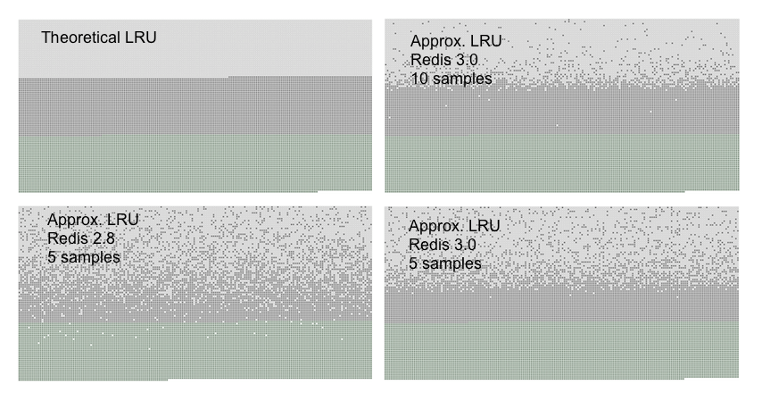
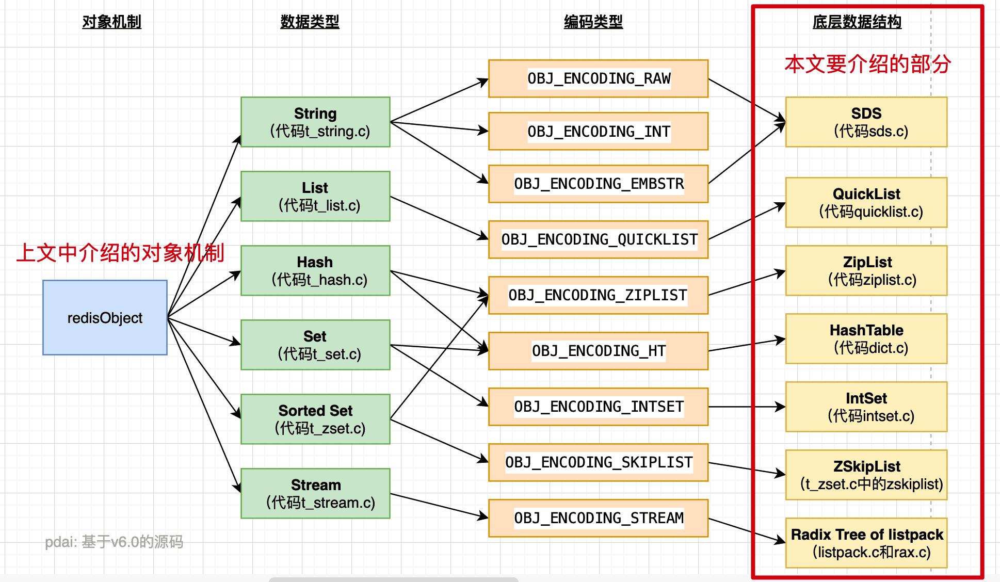
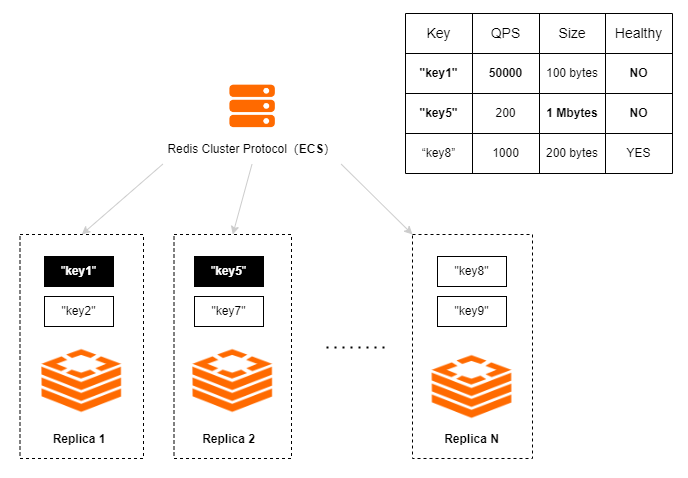
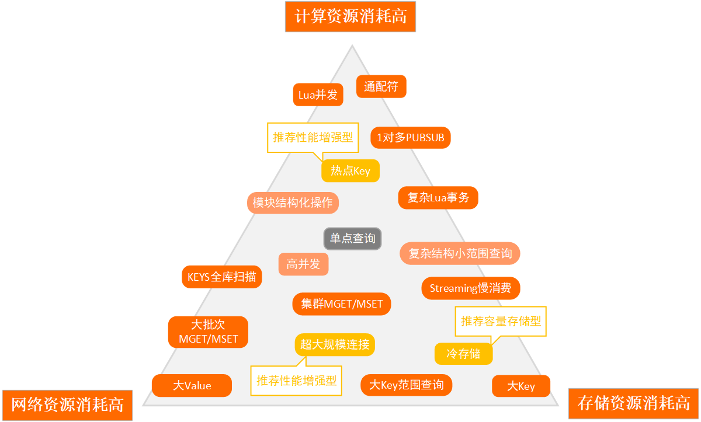
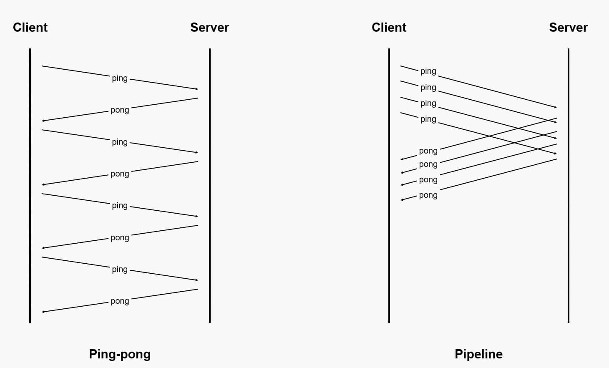

## Redis 为什么这么快？ （ 重要）

1. **基于内存，数据存在内存中**。Redis 为了达到最快的读写速度将数据都读到内存中，并通过异步的方式将数据写入磁盘。所以 redis 具有快速和数据持久化的特征。**如果不将数据放在内存中，磁盘 I/O 速度为严重影响 redis 的性能**。 如果设置了最大使用的内存，则数据已有记录数达到内存限值后不能继续插入新值。

2. **数据结构简单，对数据操作也简单，Redis 中的数据结构是专门进行设计的**；

3. **采用单线程来执行命令，避免了不必要的上下文切换和竞争条件，也不存在多进程或者多线程导致的切换而消耗 CPU，不用去考虑各种锁的问题**。（利用队列技术将并发访问变为串行访问）

   > Redis 是单线程主要是指执行命令由一个线程来完成的，但 Redis 的其他功能，比如持久化、异步删除、集群数据同步等，其实是由额外的线程执行的。

4. **Redis 的瓶颈主要在 IO 而不是 CPU**。使用多路 IO 复用模型，非阻塞 IO。Redis 采用了多路复用机制使其在网络 IO 操作中能并发处理大量的客户端请求，实现高吞吐率。 

## Redis 的事件模型（ 重要）

Redis 使用的 IO 多路复用技术主要有：`select`、`epoll`、`evport`和`kqueue`等。每个 IO 多路复用函数库在 Redis 源码中都对应一个单独的文件，比如`ae_select.c`，`ae_epoll.c`， `ae_kqueue.c`等。Redis 会根据不同的操作系统，按照不同的优先级选择多路复用技术。事件响应框架一般都采用该架构，比如 netty。

如下图所示，文件事件处理器有四个组成部分，它们分别是套接字、I/O多路复用程序、文件事件分派器以及事件处理器。


文件事件是对套接字操作的抽象，每当一个套接字准备好执行 `accept`、`read`、`write`和 `close` 等操作时，就会产生一个文件事件。因为 Redis 通常会连接多个套接字，所以多个文件事件有可能并发出现。

I/O多路复用程序负责监听多个套接字，并向文件事件派发器传递那些产生了事件的套接字。

尽管多个文件事件可能会并发出现，但 **I/O 多路复用程序总是会将所有产生的套接字都放到同一个队列里边，然后文件事件处理器会以有序、同步、单个套接字的方式处理该队列中的套接字**，也就是处理就绪的文件事件。**因为文件事件分派器队列的消费是单线程的，所以 Redis 才叫单线程模型**。

## 缓存穿透、缓存击穿、缓存雪崩（ 重要）

### 缓存穿透

**缓存穿透**：指访问的数据是**缓存和 DB 中都没有的数据**。缓存不起作用，请求会穿透到DB，流量大时DB会挂掉。

**针对**：某些 redis key。

解决方案：

1. 采用布隆过滤器，使用一个足够大的 bitmap，用于存储可能访问的 key，不存在的 key 直接被过滤；
2. 从 cache 和 db 都取不到，可以将 key-value 写为 key-null，设置较短过期时间，如 30 秒（设置太长会导致正常情况也没法使用）。这样可以防止攻击用户反复用同一个 id 暴力攻击。

### 缓存雪崩

**缓存雪崩：**指缓存中大量的数据到了过期时间，导致在缓存在同一时刻全部失效，造成瞬时 DB 请求量大、压力骤增，引起雪崩。

**针对**：大量 redis key。

解决方案：

1. 缓存数据的过期时间设置随机，防止同一时间大量数据过期现象发生。
2. 如果缓存数据库是分布式部署，将热点数据均匀分布在不同的缓存数据库中。
3. 设置热点数据永远不过期。

### 缓存击穿

**缓存击穿：**指访问的数据是缓存中没有，但是 DB 中有的数据。在该数据缓存过期的一瞬间，同时有大量的请求，这些请求都会击穿到 DB，造成瞬时 DB 请求量大、压力骤增。

**针对**：单个 redis key。

解决方案：

1. 设置热点数据永远不过期；
2. 加互斥锁，所谓的互斥锁，就是保证同一时间只有一个业务线程更新缓存，对于没有获取互斥锁的请求，要么等待锁释放后重新读取缓存，要么就返回空值或者默认值；

## 数据库和缓存的一致性问题（ 重要）

问题来源：使用 redis 做缓存操作，让请求先访问到 redis，而不是直接访问 MySQL 等数据库；读取缓存步骤一般没有什么问题，但是一旦涉及到数据更新：数据库和缓存更新，就容易出现缓存（Redis）和数据库（MySQL）间的数据一致性问题。

**不管是先写 MySQL 数据库，再删除 Redis 缓存；还是先删除缓存，再写库，都有可能出现数据不一致的情况**。举一个例子：

1. 如果删除了缓存 Redis，还没有来得及写库 MySQL，另一个线程就来读取，发现缓存为空，则去数据库中读取数据写入缓存，此时缓存中为脏数据。
2. 如果先写了库，在删除缓存前，写库的线程宕机了，没有删除掉缓存，则也会出现数据不一致情况。

因为写和读是并发的，没法保证顺序,就会出现缓存和数据库的数据不一致的问题。

一般情况最常用的是：

- **读的时候**，先读缓存，缓存没有的话，就读数据库，然后取出数据后放入缓存，同时返回响应。
- **更新的时候**，**先更新数据库，然后再删除缓存**。

其具体逻辑如下：

- **失效**：应用程序先从 cache 取数据，没有得到，则从数据库中取数据，成功后，放到缓存中。
- **命中**：应用程序从 cache 中取数据，取到后返回。
- **更新**：先把数据存到数据库中，成功后，再让缓存失效。（删除缓存）

一个是查询操作，一个是更新操作的并发，首先，没有了删除 cache 数据的操作了，而是先更新了数据库中的数据，此时，缓存依然有效，所以，并发的查询操作拿的是没有更新的数据，但是，更新操作马上让缓存的失效了，后续的查询操作再把数据从数据库中拉出来。

Facebook 的论文《[Scaling Memcache at Facebook在新窗口打开](https://www.usenix.org/system/files/conference/nsdi13/nsdi13-final170_update.pdf)》也使用了这个策略。为什么不是写完数据库后更新缓存？你可以看一下Quora上的这个问答《[Why does Facebook use delete to remove the key-value pair in Memcached instead of updating the Memcached during write request to the backend?在新窗口打开](https://www.quora.com/Why-does-Facebook-use-delete-to-remove-the-key-value-pair-in-Memcached-instead-of-updating-the-Memcached-during-write-request-to-the-backend)》，主要是怕两个并发的写操作导致脏数据。

这个就不会有并发问题了？不是的，比如，一个是读操作，但是没有命中缓存，然后就到数据库中取数据，此时来了一个写操作，写完数据库后，让缓存失效，然后，之前的那个读操作再把老的数据放进去，所以，会造成脏数据。

但，**这个 case 理论上会出现，不过，实际上出现的概率可能非常低，因为这个条件需要发生在读缓存时缓存失效，而且并发着有一个写操作。**而实际上数据库的写操作会比读操作慢得多，而且还要锁表，而读操作必需在写操作前进入数据库操作，而又要晚于写操作更新缓存，所有的这些条件都具备的概率基本并不大。

所以，要么通过 2PC 或是 Paxos 协议保证一致性，要么就是拼命的降低并发时脏数据的概率，而 Facebook 使用了这个降低概率的玩法，因为 2PC 太慢，而 Paxos 太复杂。当然，**最好还是为缓存设置上过期时间**。

## Redis 的键的过期删除策略（ 重要）

redis 采用的是**定期删除 + 惰性删除**策略。

**（1）为什么不用定时删除策略?**

定时删除：在设置 key 的过期时间的同时，为该 key 创建一个定时器，让定时器在 key 的过期时间来临时，对 key 进行删除；定时删除需要用一个定时器来负责监视 key，过期则自动删除。虽然内存及时释放，但是十分消耗 CPU 资源。在大并发请求下，CPU 要将时间应用在处理请求，而不是删除 key，因此没有采用这一策略。

**（2）定期删除+惰性删除是如何工作的呢?**

定期删除，redis 默认每个 100ms 检查（配置 hz 可控制间隔时间），是否有过期的 key，有过期 key 则删除。需要说明的是，redis 不是每个 100ms 将所有的 key 检查一次，而是随机抽取进行检查（如果每隔 100ms，全部 key 进行检查，redis 岂不是卡死）。因此，如果只采用定期删除策略，会导致很多 key 到时间没有删除。

于是，惰性删除派上用场。也就是说在你获取某个 key 的时候，redis 会检查一下，这个 key 如果设置了过期时间，那么就会判断这个 key 是否过期了？如果过期了此时就会删除。

**（3）采用定期删除+惰性删除就没其他问题了么?**

不是的，如果定期删除没删除 key。然后你也没即时去请求 key，也就是说惰性删除也没生效。这样，redis 的内存会越来越高。那么就应该采用内存淘汰机制。


**在持久化时遇到了过期的缓存会发生什么？**

- RDB 方式：
  - 持久化：持久化 key 之前，会检查是否过期，过期的 key 不进入 RDB 文件；
  - 载入：
    - 如果 Redis 以主服务器的模式运行，那么会对 RDB 中的键进行时间检查，**过期的键不会被恢复到 Redis 中**；
    - 如果 Redis 以从服务器的模式运行，那么 RDB 中所有的键都会被载入，忽略时间检查。在从服务器与主服务器进行数据同步的时候，从服务器的数据会先被清空，所以载入过期键不会有问题；
- AOF 方式：对于 AOF 来说，如果一个键过期了，那么不会立刻对 AOF 文件造成影响。因为 Redis 使用的是**惰性删除和定期删除**，只有这个键被删除了，才会往 AOF 文件中追加一条 DEL 命令。**在重写 AOF 的过程中，程序会检查数据库中的键，已经过期的键不会被保存到 AOF 文件中。**


**主从服务对过期键的处理的不同处**

在运行过程中，对于主从复制的 Redis，主服务器和从服务器对于过期键的处理也不相同：

1. 对于主服务器，一个过期的键被删除了后，会**向从服务器发送 DEL 命令**，通知从服务器删除对应的键
2. 从服务器接收到读取一个键的命令时，即使这个键已经过期，也不会删除，而是照常处理这个命令。
3. **从服务器接收到主服务器的 DEL 命令后，才会删除对应的过期键**。

这么做的主要目的是保证数据一致性，所以当一个过期键存在于主服务器时，也必然存在于从服务器。

## Redis 内存淘汰策略（ 重要）

| 策略            | 说明                                                         |
| --------------- | ------------------------------------------------------------ |
| volatile-lru    | 从已设置过期时间（Expire）的Key中，删除最近最少使用的Key（LRU算法），且不会考虑Key是否已经过期。 |
| volatile-lfu    | 从已设置过期时间（Expire）的Key中，删除最不常用的Key（LFU算法）。 |
| volatile-ttl    | 从已设置过期时间（Expire）的Key中，根据存活时间（TTL）从小到大排序进行删除。 |
| volatile-random | 从已设置过期时间（Expire）的Key中，随机删除一些Key。         |
| allkeys-lru     | 从所有Key中，删除最近最少使用的Key（LRU算法）。              |
| allkeys-lfu     | 从所有Key中，删除最不常用的Key（LFU算法）。                  |
| allkeys-random  | 从所有Key中，随机删除一些Key。                               |
| no-enviction    | 不删除任何Key，当内存达到上限时，将无法写入新数据，数据库会返回错误信息。 |

- **什么时候用 allkeys-lru？**
  1. 如果预计访问请求的特性呈现幂律分布，也就是说预计只有一部分元素会被频繁访问，而其余元素则很少被访问。使用 **allkeys-lru** 策略是一个不错的选择。如果不确定该选择哪种策略，**allkeys-lru** 也是一个很好的备选方案；
- **什么时候用 allkeys-random?**
  1. 如果需要循环扫描所有键，并且持续访问它们，即所有键有相同的操作频率和重要性，则 **allkeys-random** 策略可以使得所有键被均衡地淘汰，并保证整个键空间的内存使用处于稳定状态；
  2. 如果预计访问请求的分布是均匀的，则 **allkeys-random** 策略也能够适应这种情况。与其他淘汰策略相比，在这种情况下使用随机策略更具有普适性和可靠性；

## Redis 的 LRU 算法（ 重要）

### 如果要你设计一个 LRU 算法你需要考虑什么问题（leetcode 有题）

java 如何实现 lru 缓存淘汰策略？

- linkedhashmap  考察点： 查询时间复杂度O1、删除修改时间复杂度O1
- 有哪些需要考虑的？LRU 算法需要实现下面的特性
  1. 实现 get/put 方法 （都为 O(1) 的时间复杂度）
  2. 每次 get 时需要将访问的节点提前至队首
  3. 每次 put 需要判断队列是否已满，满了则将最后的节点删除，并且将该节点放至队首，不满则直接放队首

### Redis 使用理论的 LRU 的问题

假如使用双链表来实现 LRU，需要用链表管理 Redis 中的所有数据，**大量的节点访问就会带来频繁的链表节点的移动操作，会造成大量的额外空间和时间的消耗，从而降低 Redis 的性能**。

### Redis 近似 LRU 的效果

Redis LRU 算法并不是一个精确的实现。这意味着 Redis 每次淘汰键的时候可能没有选择最佳的淘汰对象，也就是说可能不是最久未访问的键。Redis 的实现是通过一个近似的 LRU 的算法淘汰键的，通过**采样一小部分的键，淘汰这一小部分的键中访问时间最早的键**。

Redis 3.0 改进了这个近似的 LRU 算法，也可以选择一个好的淘汰池。提高了算法的性能，使其能够更接近真实 LRU 算法的行为。

Redis 的 LRU 算法可以通过更改样本数来调整算法的精度，配置文件通过 `maxmemory-samples` 配置采样数量。

```
maxmemory-samples 5
```

Redis 不使用真正的 LRU 实现的原因是它需要更多的内存。但是，对于使用 Redis 的应用程序，近似的 LRU 算法实际上已经满足使用要求了。此图将 Redis 使用的 LRU 近似与真实的 LRU 进行了比较。



- **测试过程**：

  生成上述图表的测试用给定数量的键填充了 Redis 服务器。从头到尾访问一次键，所以第一个添加的键在 LRU 算法中是最佳的淘汰对象。后面又添加了 50% 的密钥，以强制驱逐一半的旧键。

- **三种不同颜色的含义**

  1. 浅灰色带是被逐出的对象；
  2. 灰色带是未被逐出的对象；
  3. 绿色带是添加的对象；

**分析**：

- 预期的效果：
  1. 理论的 LRU 实现预计的效果是在旧键中，前半部分的键将被淘汰；
  2. Redis LRU 算法只会按概率淘汰旧键；
- 上图 Theoretical LRU 是理论上的 LRU 的算法；
- Redis 3.0 的近似的 LRU 的算法比 Redis 2.8 的效果要好。Redis 3.0 后的近似 LRU 算法可以调节采样键的数量，可以看到当把采样键的数量设置为 10 的时候和理论上 LRU 的算法的效果差不多了。需要注意的是将采样样本键的数量设置成 10 会产生以一些额外的 CPU 消耗；

### Redis 近似 LRU 的实现

Redis 近似的 LRU 实现涉及到了一个**实例级别的全局 LRU 的时钟**，Redis 会使用一个字段保存键值的时钟信息**，每次访问就会更新这个值，保存最新的时间戳**。

需要注意的是默认情况下这个时钟的精度是 1 秒钟，全局时钟的值更新频率由配置项 `hz` 控制，每次访问键值对的时候就会保存最新的时间戳，这样当 Redis 存储数据的内存达到了 `maxmemory` 的限制时，就会根据淘汰策略驱逐数据了，LRU 相关的淘汰策略，**默认采样 5 个 key，通过键值保存的时间戳和全局时钟比较，找到其中最久未访问的数据去驱逐**。

Redis的key的底层结构

```c
typedef struct redisObject {
    unsigned type:4; // 类型
    unsigned encoding:4; // 编码
    unsigned lru:LRU_BITS; /* LRU time (relative to global lru_clock) or
   							* LFU data (least significant 8 bits frequency
     					    * and most significant 16 bits access time). */
    int refcount; // 引用计数
    void *ptr; // 指向存储实际值的数据结构的指针，数据结构由 type、encoding 决定。
} robj;
```

## Redis 的 LFU 算法 TODO-KWOK


## Redis 分布式锁原理

**synchronized 或者 Lock 都是线程锁，对同一个JVM进程内的多个线程有**效。因为锁的本质是内存中存放一个标记，记录获取锁的线程是谁，这个标记对每个线程都可见。分布式环境中多个JVM，内存中的锁显然是不共享的，每个JVM进程都有自己的锁，自然无法保证线程的互斥了，这个时候我们就需要使用到分布式锁了。

最常见的解决方案是 Redis 实现，**实现分布式锁要满足 3 点：多进程可见，互斥，可重入**。

原理：

- 获取锁的时候，使用 setnx（SETNX key val：当且仅当 key 不存在时，set 一个 key 为 val 的字符串，返回1；若 key 存在，则什么都不做，返回 0）加锁，锁的 value 值为一个随机生成的UUID，在释放锁的时候进行判断。并使用 expire 命令为锁添加一个超时时间，超过该时间则自动释放锁；
- **获取锁的时候调用 setnx，如果返回 0，则该锁正在被别人使用，返回 1 则成功获取锁。 还设置一个获取的超时时间，若超过这个时间则放弃获取锁；**
- 释放锁的时候，通过 UUID 判断是不是该锁，若是该锁，则执行 del 进行锁释放；


SET lock_key random_value NX PX 5000

值得注意的是：random_value：是客户端生成的唯一的字符串。NX：代表只在键不存在时，才对键进行设置操作。PX 5000：设置键的过期时间为5000毫秒。这样，如果上面的命令执行成功，则证明客户端获取到了锁。

解锁：解锁的过程就是将Key键删除。但也不能乱删，不能说客户端1的请求将客户端2的锁给删除掉。这时候random_value的作用就体现出来。

为了保证解锁操作的原子性，我们用LUA脚本完成这一操作。先判断当前锁的字符串是否与传入的值相等，是的话就删除Key，解锁成功。

## 底层数据结构 TODO-KWOK



## 为什么 redis 的 zset 使用跳表？（ 重要）

简单来说，跳表其实是一种**多层的有序链表**。跳表来源于链表，在链表的基础上**结合了二分的思想进行改造。**我们知道：二分查找针对的有序数组，时间复杂度是o(logn)。如果是有序链表，查询和插入的的时间复杂度是o(n)。跳表就是链表的“二分查找”。**跳表的查询，增加和删除的时间复杂度都是 logn 级别的；**


为什么 Zset 的实现用跳表而不用平衡树（如 AVL树、红黑树等）？

对于[这个问题 (opens new window)](https://link.zhihu.com/?target=https%3A//news.ycombinator.com/item%3Fid%3D1171423)，Redis的作者 @[antirez](https://www.zhihu.com/search?q=antirez&search_source=Entity&hybrid_search_source=Entity&hybrid_search_extra={"sourceType"%3A"answer"%2C"sourceId"%3A2619230497}) 是怎么说的：

> There are a few reasons:
> 1、They are not very memory intensive. It's up to you basically. Changing parameters about the probability of a node to have a given number of levels will make then less memory intensive than btrees.
> 2、A sorted set is often target of many ZRANGE or ZREVRANGE operations, that is, traversing the skip list as a linked list. With this operation the cache locality of skip lists is at least as good as with other kind of balanced trees.
> 3、They are simpler to implement, debug, and so forth. For instance thanks to the skip list simplicity I received a [patch](https://www.zhihu.com/search?q=patch&search_source=Entity&hybrid_search_source=Entity&hybrid_search_extra={"sourceType"%3A"answer"%2C"sourceId"%3A2619230497}) (already in Redis master) with augmented skip lists implementing ZRANK in O(log(N)). It required little changes to the code.

主要是从内存占用、对范围查找的支持、实现难易程度这三方面总结的原因，简单翻译一下：

- 它们不是非常内存密集型的。基本上由你决定。改变关于节点具有给定级别数的概率的参数将使其比 btree 占用更少的内存。
- **Zset 经常需要执行 ZRANGE 或 ZREVRANGE 的命令，即作为链表遍历跳表**。通过此操作，跳表的缓存局部性至少与其他类型的平衡树一样好。
- **它们更易于实现、调试等**。例如，由于跳表的简单性，我收到了一个补丁（已经在Redis master中），其中扩展了跳表，在 O(log(N) 中实现了 ZRANK。它只需要对代码进行少量修改。

我再详细补充点：

- **从内存占用上来比较，跳表比平衡树更灵活一些**。平衡树每个节点包含 2 个指针（分别指向左右子树），而跳表每个节点包含的指针数目平均为 1/(1-p)，具体取决于参数 p 的大小。如果像 Redis里的实现一样，取 p=1/4，那么平均每个节点包含 1.33 个指针，比平衡树更有优势。
- **在做范围查找的时候，跳表比平衡树操作要简单**。在平衡树上，我们找到指定范围的小值之后，还需要以[中序遍历](https://www.zhihu.com/search?q=中序遍历&search_source=Entity&hybrid_search_source=Entity&hybrid_search_extra={"sourceType"%3A"answer"%2C"sourceId"%3A2619230497})的顺序继续寻找其它不超过大值的节点。如果不对平衡树进行一定的改造，这里的中序遍历并不容易实现。而在跳表上进行范围查找就非常简单，只需要在找到小值之后，对第 1 层链表进行若干步的遍历就可以实现。
- **从算法实现难度上来比较，跳表比平衡树要简单得多**。平衡树的插入和删除操作可能引发子树的调整，逻辑复杂，而跳表的插入和删除只需要修改相邻节点的指针，操作简单又快速。

## 一致性哈希算法 TODO-KWOK

[一致性哈希算法原理](https://www.cnblogs.com/lpfuture/p/5796398.html)

## Redis 的部署架构（阿里云文档）

> https://help.aliyun.com/document_detail/54590.html

| 架构类型                                                     | 说明                                                         |
| :----------------------------------------------------------- | :----------------------------------------------------------- |
| [标准版-单副本](https://help.aliyun.com/document_detail/52685.htm#concept-fx3-jrg-tdb) | 适用于纯缓存场景，支持单节点集群弹性变配，满足高QPS（Queries per Second）场景，提供超高性价比。 |
| [标准版-双副本](https://help.aliyun.com/document_detail/52226.htm#concept-qf3-kjh-tdb) | 系统工作时主节点（Master）和副本（Replica）数据实时同步，若主节点发生故障，系统会快速将业务切换至备节点，全程自动且对业务无影响，保障服务高可用性。 |
| [集群版-单副本](https://help.aliyun.com/document_detail/59201.htm#concept-ydy-g24-tdb) | 单副本集群版实例采用集群架构，每个分片服务器采用单副本模式。适用于纯缓存类业务或者QPS压力较大的业务场景。 |
| [集群版-双副本](https://help.aliyun.com/document_detail/52228.htm#concept-tds-4mm-tdb) | 集群（Cluster）实例采用分布式架构，每个数据分片都支持主从切换（master-replica），能够自动进行容灾切换和故障迁移，保障服务高可用。同时提供多种规格，您可以根据业务压力选择对应规格，还可以随着业务的发展自由变配规格。集群版支持两种连接模式：[代理模式](https://help.aliyun.com/document_detail/52228.htm#section-h69-izd-531)：提供智能的连接管理，降低应用开发成本。[直连模式](https://help.aliyun.com/document_detail/52228.htm#section-dqj-mgc-4ir)：客户端绕过代理服务器直接访问后端数据分片，可降低网络开销和服务响应时间，适用于对Redis响应速度要求极高的业务。 |
| [Redis读写分离版](https://help.aliyun.com/document_detail/62870.htm#concept-zm4-3mh-tdb) | 与标准版-双副本架构类似，读写分离实例采用主从（Master-Replica）架构提供高可用，主节点挂载只读副本（Read Replica）实现数据复制，支持读性能线性扩展。 只读副本可以有效缓解热点key带来的性能问题，适合高读写比的业务场景。 读写分离实例提供非集群版和集群版：非集群版读写分离实例支持一个只读副本、三个只读副本或五个只读副本三种版本。集群版读写分离实例在每个分片下挂载一个只读副本，提供分片级别的自动读写分离能力，适合超大规模高读写比的业务场景。 |

## Redis 部署架构（阿里云文档）

| 实例架构                                                     | 简介                                                         | 适用场景                                                     |
| :----------------------------------------------------------- | :----------------------------------------------------------- | :----------------------------------------------------------- |
| [标准架构](https://help.aliyun.com/document_detail/52226.htm#concept-qf3-kjh-tdb) | 采用主从（master-replica）双副本架构，由主节点提供日常服务访问，备节点提供高可用。当主节点发生故障，系统会自动在30秒内切换至备节点，保障业务平稳运行。 | 对Redis协议兼容性要求较高的业务。将Redis作为持久化数据存储使用的业务。单个Redis性能压力可控的场景。Redis命令相对简单，排序和计算之类的命令较少的场景。 |
| [集群架构](https://help.aliyun.com/document_detail/52228.htm#concept-tds-4mm-tdb) | 由代理节点、数据分片和配置服务器组件构成，可通过增加数据分片的方式实现横向扩展。每个数据分片均为双副本（分别部署在不同机器上）高可用架构，主节点发生故障后，系统会自动进行主备切换保证服务高可用。 | 数据量较大的场景。整体读写请求的QPS压力较大的场景。吞吐密集型、高性能应用场景。 |
| [读写分离架构](https://help.aliyun.com/document_detail/62870.htm#concept-zm4-3mh-tdb) | 由代理节点、主从节点和只读节点构成。只读节点采取链式复制架构，扩展只读节点个数可使整体实例性能呈线性增长。 | 读请求QPS压力较大的场景（如热点数据集中）。对Redis协议兼容性要求较高的业务场景，例如规避集群架构的[使用限制](https://help.aliyun.com/document_detail/145968.htm#concept-2353537)。**说明** 由于数据同步至只读节点存在一定延迟，不适用于数据一致性要求高的场景，可选用集群架构。 |

- 代理模式：客户端的请求由代理节点转发至数据分片，可享受代理节点带来的负载均衡、读写分离、故障转移、[代理查询缓存](https://help.aliyun.com/document_detail/216309.htm#task-2078219)（仅[内存型](https://help.aliyun.com/document_detail/126164.htm#concept-1254543)支持）、长连接等特性能力。更多信息，请参见[Redis Proxy特性说明](https://help.aliyun.com/document_detail/142959.htm#concept-2334147)。
- 直连模式：可通过直连地址绕过代理，直接访问后端的数据分片（类似连接原生Redis集群）。相比代理模式，直连模式节约了通过代理处理请求的时间，可以在一定程度上提高Redis服务的响应速度。


读写分离架构的解释：https://blog.51cto.com/u_15352876/5241656，主要解释了星型复制和链式复制；

阿里的读写分离架构：https://help.aliyun.com/document_detail/62870.html

## Redis 部署容灾方案（阿里云文档）

> https://help.aliyun.com/document_detail/100734.html

| 灾备方案                                                     | 灾备级别 | 说明                                                         |
| :----------------------------------------------------------- | :------- | :----------------------------------------------------------- |
| [单可用区高可用方案](https://help.aliyun.com/document_detail/100734.htm#section-u3t-f4t-2gb) | ★★★☆☆    | 主备节点部署在同一可用区中的不同机器上，当任一节点发生故障时，由高可用HA（High Availability）系统自动执行故障切换，避免单点故障引起的服务中断。 |
| [同城容灾方案](https://help.aliyun.com/document_detail/100734.htm#section-h5s-zxn-fgb) | ★★★★☆    | 主备节点分别部署在同一地域下两个不同的可用区，当任一可用区因电力、网络等不可抗因素失去通信时，高可用HA系统将执行故障切换，确保整个实例的持续可用。 |
| [跨地域容灾方案](https://help.aliyun.com/document_detail/100734.htm#section-zhl-xdp-fgb) | ★★★★★    | 由多个子实例构成全球分布式实例，所有子实例通过同步通道保持实时数据同步，由通道管理器负责子实例的健康状态监测、主备切换等等异常事件的处理，适用于异地灾备、异地多活、应用就近访问、分摊负载等场景。更多介绍，请参见[全球多活](https://help.aliyun.com/document_detail/71881.htm#concept-qf1-mdk-zdb)。 |

## 预估 redis 内存规格（重要）

通常情况下，您需要考虑下述因素预估可能消耗的内存容量并在创建实例时选择对应的规格，该操作有助于节约成本、避免频繁变更规格给业务带来的影响，助力业务快速上云。

**重要** 在确定云数据库Redis实例的内存容量时，首先**要考虑存储的业务数据大小**，除此之外，您还需额外**考虑Redis自身运行占用的必要内存开销（例如进程元数据、复制缓冲区、内存碎片等）**。

不同于自建Redis数据库，选用云数据库Redis时，您无需再额外考虑云数据库Redis持久化Fork写时复制占用的内存开销以及云数据库Redis增强功能（如安全白名单、审计、大Key、热Key等）的内存开销，这些开销由阿里云承担，不计入购买的实例内存容量。


需要考虑的如下：

- Key 的数据类型、长度和数量。

  **说明** 如果使用可包含元素的数据类型（例如Hash），您还需要计算每个Key中，各元素的数量和长度。

- Value 的长度。

- Key 的过期时间与[逐出策略](https://help.aliyun.com/document_detail/38679.htm#concept-e5v-hs5-ydb)。

- 访问模型，例如大量的客户端连接、使用 Lua 脚本或事务等，均需要为其预留适量的内存。

- **中长期的业务增长情况。**

> 我一般是通过在测试环境通过 **memory usage 命令看占用的字节数，预估一下**

## Redis 线程模型（重要）

https://zhuanlan.zhihu.com/p/639750217 说的非常好

我们经常会被问到的一个问题：**Redis 真的是单线程吗？**

在回答这个问题之前，我们需要先明确一下问题的边界：当我们说“Redis 采用的是单线程模型”时，实际上我们是针对其使用的网络模型。

事实上

- Redis 早在 4.0 版本中就已经引入了多线程，但这里的“多线程”是指用于处理一些特定任务的线程，而不是网络模型上的多线程。
- Redis 在 6.0 版本中正式引入多线程网络模型，在这之前，其网络模型一直是单线程模式的。

从 4.0 版本开始，Redis 采用的是**单线程网络模型** + **多线程后台任务** 这个组合。

- 在**主线程**中完成了，包括接收（socket 读）、解析、执行、发送（socket 写）在内的全部流程
- 在**主线程**中还实现了周期任务的处理，如删除过期 key、字典 rehash 等

除此之外，**针对一些非常耗时的操作**，Redis 则通过专用的后台线程来进行处理，避免其阻塞主线程的事件循环。

我们知道 Redis 的 DEL 命令是用来删除掉一个或多个 key 储存的值，它是一个同步阻塞的命令。大多数情况下你要删除的 key 里存的值不会特别多，最多也就几十上百个对象，所以可以很快执行完，但是如果你要删的是一个超大的键值对，里面有几百万个对象，那么这条命令可能会阻塞至少好几秒，又因为事件循环是单线程的，所以会阻塞后面的其他事件，导致吞吐量下降。

于是，在 Redis v4.0 之后增加了一些的非阻塞命令如 UNLINK、FLUSHALL ASYNC、FLUSHDB ASYNC。

UNLINK 命令其实就是 DEL 的异步版本，它不会同步删除数据，而只是把 key 从 keyspace 中暂时移除掉，然后将任务添加到一个异步队列，最后由后台线程去删除。

Redis 在 6.0 版本中，为其核心网络模型引入了多线程，称为 I/O threading。从此我们就可以放心大胆地说：Redis 采用了 **多线程网络模型** + **多线程后台任务** 这个组合。

但是，Redis 的多线程模型却并非上面介绍的标准 Reactor 多线程模型。因为 Redis 的 I/O threading 只负责 I/O 读写，不负责命令执行。所以，Redis 其实是将读取客户端请求命令和回写响应数据的逻辑异步化了，实际命令的执行最终还是在主线程上完成。


阿里的 Tair 多线程模型：Tair内存型将服务各阶段的任务进行分离，通过分工明确的多个线程并行处理各阶段任务，达到提高性能的目的。

- IO线程：负责请求读取、响应发送、命令解析等。
- Worker线程：负责命令处理、定时器事件等。
- 辅助线程：负责高可用探测、保活等。

**IO线程读取用户的请求并进行解析，之后将解析结果以命令的形式放在队列中发送给Worker线程处理**。Worker线程将命令处理完成后生成响应，通过另一条队列发送给IO线程。

Tair内存型最多支持4个IO线程并发运行。为了提高线程的并行度，IO线程和Worker线程之间采用无锁队列和管道进行数据交换。

```
IO线程
----->接收请求---->解析请求		       发送响应-------->
					\				  /
					 \			     /
worker线程		     \            /
---------------------处理请求---->生成响应----------->
  					  /			   \
				     /				\
IO线程              /					\
----->接收请求---->解析请求		       发送响应-------->
```

## 集群架构的命令限制

> https://help.aliyun.com/document_detail/145968.html

不支持的命令

- SWAPDB
- CLIENT ID
- SORT（**BY**和**GET**参数）

受限的命令：如需在集群架构实例中执行下述受限制的命令，请使用 hash tag 确保命令所要操作的 key 都分布在 1 个hash slot 中，hash tag 的详细用法请参见[Redis官方文档](http://redis.io/topics/cluster-spec)。

| 命令族      | 具体命令                                                     |
| :---------- | :----------------------------------------------------------- |
| HyperLogLog | PFMERGE、PFCOUNT                                             |
| Keys        | RENAME、RENAMENX、SORT                                       |
| Lists       | RPOPLPUSH、BRPOP、BLPOP、BRPOPLPUSH                          |
| Scripting   | EVAL、EVALSHA、SCRIPT EXISTS、SCRIPT FLUSH、SCRIPT KILL、SCRIPT LOAD |
| Strings     | MSETNX                                                       |
| Transaction | DISCARD、EXEC、MULTI、UNWATCH、WATCH                         |

由于集群架构对 Lua 脚本的使用存在一定的限制，当实例变配至集群架构时，Lua 脚本可能因脚本内容不符合限制而发生丢失，请务必提前备份，更多信息，请参见[集群架构实例的命令限制](https://help.aliyun.com/document_detail/145968.htm#concept-2353537)。

实例变配至集群架构前，您需要评估集群实例的命令限制对业务的影响，更多信息，请参见[集群架构实例的命令限制](https://help.aliyun.com/document_detail/145968.htm#concept-2353537)。

## Redis 的一些管理命令 memory usage（重要）

memory

Redis 4.0之前只能通过`info memory`来了解Redis内部有限的内存信息，Redis 4.0提供了 `memory` 命令，帮助用户全面了解Redis的内存状态。

info memory：查看 redis 实例的内存信息；

memory 相关命令：

```
127.0.0.1:6379> memory help
1) "MEMORY DOCTOR                        - Outputs memory problems report"
2) "MEMORY USAGE <key> [SAMPLES <count>] - Estimate memory usage of key"
3) "MEMORY STATS                         - Show memory usage details"
4) "MEMORY PURGE                         - Ask the allocator to release memory"
5) "MEMORY MALLOC-STATS                  - Show allocator internal stats"
```

- `memory usage`

  `usage`子命令可以查看某个key在Redis内部实际占用多少内存。

  **注意**

  - 不光key、value需要占用内存，Redis管理这些数据还需要一部分内存。
  - 对于hash、list、set、sorted set这些类型的key，结果是采样计算的，可以通过`SAMPLES`来控制采样数量。

- `memory stats`：

```
127.0.0.1:6379> memory stats
1) "peak.allocated"    // Redis从启动到现在，历史最多使用过多少内存
2) (integer) 423995952
3) "total.allocated"    //当前使用内存
4) (integer) 11130320
5) "startup.allocated"    //Redis启动初始化以后占用内存
6) (integer) 9942928
7) "replication.backlog"    //主从复制断开重连时会用到，默认10MB
8) (integer) 1048576
9) "clients.slaves"    // 主从复制用到的内存
10) (integer) 16858
11) "clients.normal"    //普通用户客户端的读写缓冲区
12) (integer) 49630
13) "aof.buffer"    //aof持久化使用的缓存和aofrewrite时产生的缓存之和
14) (integer) 3253
15) "db.0"    //每个db的元数据所占用内存
16) 1) "overhead.hashtable.main"
2) (integer) 5808
3) "overhead.hashtable.expires" //管理带过期时间的数据所额外消耗内存
4) (integer) 104
17) "overhead.total"    //上面提到的各项内存消耗之和
18) (integer) 11063904
19) "keys.count"    //当前存储的key的总量
20) (integer) 94
21) "keys.bytes-per-key"    //当前内存中平均每个key大小
22) (integer) 12631
23) "dataset.bytes"        //用户数据所占用内存(= 总内存 - Redis元数据所占内存)
24) (integer) 66416
25) "dataset.percentage"    //100 * dataset.bytes / (total.allocated - startup.allocated)
26) "5.5934348106384277"
27) "peak.percentage"    // 100 * total.allocated / peak_allocated
28) "2.6251003742218018"
29) "fragmentation"    //内存碎片率
30) "1.1039986610412598"
```

## Redis 数据结构的使用建议

| 数据类型            | 建议                                                         |
| ------------------- | ------------------------------------------------------------ |
| List 数据类型       | List 及其包含的元素个数无限制，单个元素最大值为 512 MB，推荐 List 的元素个数小于 8192，Value最大长度不超过 1 MB。 |
| Set 数据类型        | Set 及其包含的元素个数无限制，单个元素最大值为 512 MB，推荐 Set 的元素个数小于 8192， Value最大长度不超过 1 MB。 |
| Sorted set 数据类型 | Sorted Set 及其包含的元素个数无限制，单个元素最大值为 512 MB，推荐 Sorted Set 的元素个数小8192，Value最大长度不超过1 MB。 |
| Hash 数据类型       | Hash 及其包含的元素个数无限制，单个元素最大值为 512 MB，推荐元素个数小于 8192， Value 最大长度不超过 1 MB。 |

## Redis 配置参数设置（配置文件）（重要）

| 配置项                                                       |                                                              |                  |
| ------------------------------------------------------------ | ------------------------------------------------------------ | ---------------- |
| **appendfsync**                                              | AOF（AppendOnly File）持久化功能的fsync频率<br />仅在**appendonly**参数开启时生效，<br />默认为 everysec |                  |
| **appendonly**                                               | 开启或关闭主节点的 AOF 持久化功能，可选值： <br /> yes：默认值，开启 AOF 持久化。<br /> no：关闭 AOF 持久化。 |                  |
| **dynamic-hz**                                               | 开启或关闭动态hz，可选值：  yes：默认值，开启。 no：关闭。   | 高版本才有       |
| **hash-max-ziplist-entries**<br />**hash-max-ziplist-value** | 当哈希对象同时满足以下两个条件时， 使用ziplist编码。<br />1、哈希对象保存的键值对数量小于**hash-max-ziplist-entries**的值。<br />2、 哈希对象保存的所有键值对的键和值的字符串长度的字节数都小于**hash-max-ziplist-value**的值。 | Redis 6 以下版本 |
| **hz**                                                       | 设置 Redis 后台任务执行频率，例如清除过期键任务。取值范围为 1~500，默认值为 10，即每秒执行 10 次。<br />该值越大，CPU资源消耗越多，但在过期键较多的情况下清理频率也更高，同时Redis能够更精确地处理超时。建议取值不要超过100。 |                  |
| **lazyfree-lazy-eviction**                                   | 是否开启基于lazyfree的驱逐功能，可选值：<br />  yes：开启。 no：默认值，不开启。 |                  |
| **lazyfree-lazy-expire**                                     | 是否开启基于lazyfree的过期Key删除功能，可选值：  <br />  yes：默认值，开启。 no：不开启。 |                  |
| **lazyfree-lazy-server-del**                                 | **DEL**命令是否基于lazyfree异步删除数据，可选值：<br />  yes：默认值，开启。 no：不开启。 |                  |
| **maxmemory-policy**                                         | 数据逐出策略。当Redis实例内存不足，使用量达到**Maxmemory**时，会触发数据逐出，您可以选择不同的数据逐出策略。取值如下：<br />LRU表示最近最少使用的。LFU表示最不常用的。LRU、LFU和volatile-ttl都是使用近似随机算法实现的。 |                  |
| **slowlog-log-slower-than**                                  | 设置慢日志的记录阈值，即设置对执行时间大于多少微秒的操作进行记录。取值范围10000~10000000，默认值为20000。 |                  |
| **slowlog-max-len**                                          | 慢日志最多保存记录条数，取值范围100~10000，默认值为1024。    |                  |
|                                                              |                                                              |                  |
|                                                              |                                                              |                  |

## 慢日志排查超时问题

慢请求引起的连接超时等问题是影响 Redis 服务质量的常见问题

> 阿里云的：
>
> 云数据库 Redis 的慢日志系统能够帮助您快速找到慢请求问题发生的位置，定位发出请求的客户端 IP，为彻底解决超时问题提供可靠的依据。
>
> Redis 的慢日志会记录执行时间超过指定阈值的请求，慢日志分为数据节点慢日志和代理慢日志。（阿里的架构有代理）
>
> Redis 服务超时的原因通常比较复杂，很多情况下与慢请求相关。您可以按照下述步骤来排查超时问题。
>
> -  当 Redis 服务出现超时问题，首先查看代理慢日志；
>    - 如果代理慢日志内容为空，您可以排查客户端与 Redis 实例间的网络状况。
> -  定位最早的代理慢日志由哪条命令引发。
>    - **说明** 代理节点的慢日志通常是因为数据节点中出现慢请求，引起命令堆积而导致的。
> -  查看数据节点慢日志以确认代理慢日志中的哪些日志引起了超时问题。
>    - **说明** 通常情况下，在代理慢日志中最先产生慢日志的命令，也会在数据节点生成慢日志。数据节点的慢日志一般比代理节点慢日志少，这与二者对执行时间的定义以及慢日志阈值不同有关。
> -  在代理慢日志中，根据上一步骤定位到的命令精确搜索，可找到使用这些命令的客户端IP，随后进行优化。

针对慢日志，Redis 提供配置参数：

- **slowlog-log-slower-than**：设置数据节点慢日志阈值，默认为20000微秒（即20毫秒）；
  - 通常情况下您感知到的延迟实际会高于本参数设置的值，因为感知时间中包含了数据在客户端、代理、数据节点之间传输和处理所消耗的时间；
- **slowlog-max-len**：设置最大慢日志条目数，默认为1024；


那么我们怎么看慢日志呢？Redis 提供了命令：

```
SLOWLOG GET [count]
```


```
127.0.0.1:6379> slowlog get
1) 1) (integer) 4
   2) (integer) 1680796134
   3) (integer) 560
   4) 1) "set"
      2) "name"
      3) "hello"
   5) "127.0.0.1:51612"
   6) ""
2) 1) (integer) 3
   2) (integer) 1680796120
   3) (integer) 6027
   4) 1) "config"
      2) "rewrite"
   5) "127.0.0.1:51612"
   6) ""
```

慢查询日志中的每个条目由下面 6 个值组成：

1. 慢查询日志的标识 ID（唯一性）；
2. 记录日志的 Unix 时间戳；
3. 命令耗时（微秒）；
4. 执行命令和参数的数组；
5. 客户端 IP 和端口（仅限 4.0 或更高版本）；
6. 客户端名称（如果通过 CLIENT SETNAME 命令设置，仅限 4.0 或更高版本）；

## Redis持久化与备份恢复方案（重要）

> https://help.aliyun.com/document_detail/43886.html

### RDB 持久化

RDB 是一种快照模式，周期性的创建快照，每次全量备份，快照是内存数据的二进制序列化形式，存储紧凑。优点就是占用空间小，便于移动，非常适合用于备份或迁移指定时间点的 Redis 数据。

RDB 持久化产生的文件是以 .rdb 后缀结尾，其中 rdb 表示 Redis Database。Redis 有多种方式创建 RDB 文件：

- **SAVE 命令**；（SAVE 命令会阻塞 Redis 服务器进程）

- **BGSAVE 命令**；（因为 BGSAVE 是 fork 一个子进程来创建 RDB 的，所以当父进程占用的内存数量越大，创建子进程这一操作耗费的时间也会越长，所以 Redis 服务器在执行 BGSAVE 命令的时候也可能会因为 fork 子进程而短暂阻塞。）

- **配置文件配置触发创建 RDB 文件的条件**；

  如果服务器在 seconds 秒的时间内，对各个数据库总共执行了至少 changes 次修改，服务器就会自动执行一次 BGSAVE。

  ```
  save 900 1
  save 300 10
  save 60 10000
  ```

**RDB 持久化的原理**

一般都是使用 BGSAVE 来完成持久化操作的。Redis 会调用 glibc 的 fork 函数产生一个子进程，**RDB 持久化由这个子进程来处理，父进程继续处理客户端的请求。子进程刚刚产生时，它和父进程共享内存里面的代码段和数据段。**

Redis 需要一边持久化，一边响应客户端的请求。持久化操作的同时，内存的数据结构还在改变。这时候**需要使用 COW（Copy on Write）机制来实现 RDB 的持久化。**

数据段是一个由多个操作系统的页面（4KB）组成的，当父进程对其中的一个页面的数据进行修改时，会将被共享的页面复制一份分离出来，然后对这个复制的页面进行修改。这时子进程相应的页面是没有变化的，还是进程产生时的那一瞬间的数据。

随着父进程修改操作的持续进行，越来越多的共享页面被分离出来，内存就会持续增长，但是也不会超过原有数据内存的 2 倍。另外 Redis 实例里面的冷数据的比例比例也是很高的，所以很少会出现所有页面都被分离的情况。


**RDB 持久化的优点：**

1. RDB 是一个进紧凑的二进制文件，代表某个时间点上的数据快照。非常适合备份，全量复制等场景。我们可以每隔几个小时执行 bgsave 备份；
2. Redis 加载 RDB 文件恢复数据的速度比 AOF 的方式快很多；

**RBD 持久化的缺点**

1. 使用 RDB 持久化策略，可能会丢失几分钟的数据。因为 RDB 是一种时间点快照（point-in-time snapshot），对于 RDB 持久化来说，服务器停机时丢失的数据量取决于最后一次成功执行 RDB 持久化操作的开始执行时间。
2. 为了使用子进程持久化到磁盘，RDB 需要经常调用 fork()。如果数据集很大，fork() 可能会耗费很长时间，并且如果数据集非常大且 CPU 性能不太好，则可能导致 Redis 在几毫秒甚至一秒钟内停止为客户端提供服务；

### AOF 持久化

**核心原理**：服务器每次执行完写命令之后，都会以协议文本的方式将被执行的命令追加到 AOF 文件的末尾。在服务器停机之后，只要重新执行 AOF 文件中保存的命令，就可以将数据库恢复到停机之前的状态。

**主要工作流程如下：**

1. 所有的写入命令会追加到 aof_buf（ 缓冲区）中；
2. AOF 缓冲区根据对应的策略向硬盘做同步操作；
3. 随着 AOF 文件越来越大， 需要定期对 AOF 文件进行重写， 达到压缩的目的；
4. 当 Redis 服务器重启时， 可以加载 AOF 文件进行数据恢复；

**为什么要把命令先写入到一个缓冲区中呢**？因为如果每次都把 AOF 文件命令都直接刷新到磁盘，性能很低。一般的操作时，将对硬盘的多次写入操作优化成一次写入操作，当程序调用 write 系统调用对文件进行写入时，系统会将数据写入位于内存的缓冲区中，等到指定的时长或者满足某些写入条件时，系统才会执行 flush 系统调用，将缓冲区中的数据刷新到磁盘。

Redis 提供了三种 AOF 文件刷新频率的配置，由参数 appendfsync 控制：

- always：每执行一个写命令，就对 AOF 文件执行一次刷新操作。也就是命令写入缓冲区后调用系统调用 fsync 操作同步到 AOF 文件，fsync 后线程立即返回；
- everysec：每隔 1s，就对 AOF 文件执行一次刷新操作。也就是命令写入缓冲区后调用系统调用 write 操作，write 完后线程返回。 fsync 同步到 AOF 文件的操作有专门的线程控制 1s 一次；
- no：不主动对 AOF 进行刷新操作，由操作系统决定什么时候对 AOF 进行刷新。也就是命令写入缓冲区后调用系统调用 write 操作，write 完后线程返回。 不对 AOF 文件做 fsync 操作，同步到磁盘的操作由操作系统控制，一般同步周期最长 30 秒；

fsync 针对单个文件操作，做强制磁盘同步，fsync 将阻塞直到写入硬盘完成后返回，保证了数据的持久化。

**AOF 文件的重写**

随着命令不断写入 AOF 文件，AOF 文件会越来越大，Redis 使用重写机制压缩文件体积。AOF 文件重写是把 Redis 进程内的数据转化为写命令同步到新的 AOF 文件的过程；

**为什么 AOF 文件可以压缩呢？**

如果对相同的键执行过多次修改，那么 AOF 文件中会出现多个冗余命令；多条写命令可以合并成一个，例如 lpush list a、lpush list b、lpush list c 可以转化为  lpush list a b c。为了防止单条命令过大造成客户端缓冲区溢出，对于 list、 set、 hash、 zset 等类型操作， 以 64 个元素为界拆分为多条。

AOF 重写同样是基于 copy-on-write 实现的。

**AOF 的优缺点**

优点就是 AOF 持久化的安全性要高很多，通过使用 everysec 选项，用户可以将数据丢失的时间限制在 1s 以内。

缺点：

- AOF 存储的是协议文本，所以体积会比相同数据量的 RBD 文件要大很多，并且生成 AOF 文件需要的时间也比 RDB 文件要长；
- RDB 的恢复数据的速度要比 AOF 块很多。因为 RDB 是直接的数据恢复操作，AOF 是间接的数据恢复操作，它要通过执行命令来恢复数据；
- AOF 重写命令 BGREWRITEAOF 和 RBD 使用的 BGSAVE 命令一样都要创建子进程，索引数据库体积比较大的情况下，进行 AOF 文件重写将占用大量资源，并导致服务器被短暂阻塞；

### RDB-AOF 混合持久化

开启混合持久化，前提是打开 AOF 持久化功能了，然后将下面的值设置了 yes

```
aof-use-rdb-preamble <value>
```

那么服务器在执行 AOF 重写时，就会像执行 BGSAVE 命令那样，根据数据库当前的状态生成出相应的 RDB 数据，并且将这些数据写入新建的 AOF 文件中，至于那些在 AOF 重写开始之后执行的 Redis 命令，则会继续以协议文本的方式追加到新 AOF 文件的末尾，也就是已由的 RDB 数据的后面。

```
| RDB 数据 | AOF 数据 |
```

当一个支持 RDB-AOF 混合持久化模式的 Redis 服务器启动并载入 AOF 文件时，它会检查 AOF 文件的开头是否包含了 RDB 格式的内容；

- 如果包含，那么服务器会先加载开头的 RDB 数据，然后再加载之后的 AOF 数据；
- 如果 AOF 文件只包含 AOF 数据，那么服务器会直接加载 AOF 数据；

## 如何处理 redis 集群数据倾斜（重要）

> https://help.aliyun.com/document_detail/467543.html

### 什么是集群数据倾斜

什么是 Redis 的集群数据倾斜：在 Redis 集群中，若个别的数据分片的下面几个指标远远高于其他数据分片，该 Redis 集群可能已经产生数据倾斜：

- 内存使用率；
- CPU 使用率；
- 带宽使用率；
- 延时；

Redis 集群分片的数据倾斜严重时，会导致集群在整体内存使用率不高的情况下可能会出现下面的异常情况：

- 内存逐出；
- 内存溢出；
- 实例响应时间上升等问题；

### 背景信息

Redis 集群架构作为一个分布式系统，**整个数据库空间会被分为 16384 个槽（Slot）**，每个数据分片节点将存储与处理指定Slot的数据（Key），例如 3 分片集群实例，3 个分片分别负责的 Slot 为：[0,5460]、[5461,10922]、[10923,16383]。当用户写入或更新数据时，客户端会通过 CRC 算法计算出 Key 所属的 Slot，具体公式为 `Slot=CRC16(key)%16384`，并将数据写入 Slot 所属的数据分片节点。**通常情况下，各数据分片节点的 Key 数量是均匀分布的，同时内存使用率、CPU 使用率等性能指标也是相近的。**

但在使用数据库的过程中，**可能会由于前期规划不足、不规范的数据写入及突发的访问量，造成数据量倾斜或数据访问倾斜，最终引起数据倾斜。**

> **说明** 数据倾斜通常是指大多数据分片节点的性能指标较低，而个别节点的性能指标较高的情况，高或低没有明确的标准。**通常情况下，若某数据分片节点（最高）的性能指标高出其他数据分片节点（最低）20%及以上时，可认为已产生数据倾斜**，差值越大，数据倾斜程度越严重。



如上图所示，虽然 Key 均匀地分布在集群中，每个数据分片节点 2 个 Key，但仍产生了数据倾斜：

- `Replica 1` 节点中 `key1` 的 QPS 明显高于其他 Key，属于典型的**数据访问倾斜**，会导致该 Key 所在的数据分片节点CPU 使用率、带宽使用率升高，从而影响该分片上所有 Key 的处理。
- `Replica 2` 节点中 `key5`的 QPS 虽然不高，但该 Key 的大小为 1 MB，属于典型的**数据量倾斜**，会导致该 Key 所在的数据分片节点的内存使用率、带宽使用率升高，从而影响该分片上所有 Key 的处理。

### 发生数据倾斜的临时方案

若实例已产生数据倾斜，您可以通过如下临时方案进行过渡。但以下临时方案，例如对实例进行重启、变配、扩容等操作，无法解决数据倾斜的根源问题。

同时，您也可以在短时间内可降低大 Key、热 Key 的请求量，暂缓数据倾斜问题，但大 Key、热 Key 问题只能通过业务上的改造才能解决。建议您及时对实例进行数据倾斜的原因排查，并根据对应处理方法在业务层进行改造，对实例进行优化

| 倾斜场景      | 可能原因                   | 临时方案                                                     |
| :------------ | :------------------------- | :----------------------------------------------------------- |
| 内存倾斜      | 大Key、Hash Tags。         | 升级实例规格。在成功升级实例规格后，会改善内存倾斜问题，但可能也引起带宽倾斜或CPU倾斜。 |
| 带宽倾斜      | 大Key、热Key、高消耗命令。 | 提升实例中指定 1 个或多个分片的带宽。**说明** 由于单个实例分片带宽最大可调整至当前实例分片规格对应带宽上限的3倍，若当前业务流量大于该值，则只能在业务层进行改造。 |
| CPU使用率倾斜 | 大Key、热Key、高消耗命令。 | 无临时方案，请进行原因排查并在业务层进行改造。               |

### 数据倾斜的原因和处理方法

**提前规划业务增长率，合理地拆分大 Key，并保持规范的数据写入**，才能解决数据倾斜的根源问题。

| 产生倾斜原因 | 说明                                                         | 处理方法                                                     |
| :----------- | :----------------------------------------------------------- | :----------------------------------------------------------- |
| 大Key        | 大 Key 通常以 Key 的大小和 Key 中成员的数量来综合判定。常见于在KKV（Key-key-value）类型的数据结构中，例如Hash、List、Set、Zset等，存放过多或过大的 field，从而导致单个 Key 过大，产生实例数据倾斜。 | 避免使用大 Key。对大 Key 进行拆分，例如将含有数万成员的一个HASH Key 拆分为多个 HASH Key，并确保每个 Key的成员数量在合理范围。 |
| 热Key        | 热 Key 指某个 Key 或者少部分 Key 的操作 QPS 明显高于其他 Key。常见于压测时选了单一 Key 或秒杀场景下热点商品ID Key。 | 请避免使用热Key。                                            |
| 高消耗命令   | 不同的命令具有不同的复杂度，高复杂度的命令会消耗大量性能资源，例如 `HGETALL` 命令的复杂度为 O(n)，该命令会随着您存储的Field 越多，消耗越大。同时，简单的 `SET` 或 `GET` 命令也会在 Value过大时，消耗大量数据分片节点的性能资源。 | 可以通过慢查询日志来查看是那些命令比较慢，业务侧需减少或禁止使用高消耗命令 |
| Hash Tags    | 若 Key名称中包含`{}`，例如`{item}id1`，则 Redis 仅会对`{}`中的内容进行 Slot 计算并选择数据分片节点。若存在`{item}id1`、`{item}id2`、`{item}id3`等等大量Key，由于`{}`中的内容相同，上述 Key 均会被分配至同一数据分片节点，导致该数据分片节点的内存资源、性能消耗大幅升高。 | 避免在Key名称中使用`{}`。**说明** 如需在Key名称中使用`{}`，需保证`{}`中的内容尽可能不同，从而使Key尽量均匀地分布在集群的不同数据分片节点上。 |

## 排查 Redis 实例 CPU 使用率高的问题（重要）

> https://help.aliyun.com/document_detail/200630.html

**Redis 实例的 CPU 使用率升高会影响整体的吞吐量和应用的响应速度，极端情况下甚至会导致应用不可用。**当平均 CPU 使用率高于 50%、连续 5 分钟内的 CPU 平均峰值使用率高 于90% 时，您需要及时关注并排查该问题，以保障应用的稳定运行。

### 查找并禁用高消耗命令

高消耗命令：即时间复杂度为 O(N) 或更高的命令。通常情况下，命令的时间复杂度越高，在执行时会消耗较多的资源，从而导致 CPU 使用率上升。

**由于单线程的特性，Redis 在执行高消耗命令时会引发排队导致应用响应变慢。极端情况下，甚至可能导致实例被整体阻塞，引发应用超时中断或流量跳过缓存层直接到达后端的数据库侧，引发雪崩效应。**

**评估并禁用高风险命令和高消耗命令**，例如**FLUSHALL**、**KEYS**、**HGETALL**等。具体操作，优化业务，例如避免频繁执行数据排序操作。

**可选操作：**根据业务情况，调整实例为[读写分离架构](https://help.aliyun.com/document_detail/62870.htm#concept-zm4-3mh-tdb)，对高消耗命令或应用进行分流。

### 优化热点 key

**现象**：Redis实例为[集群架构](https://help.aliyun.com/document_detail/52228.htm#concept-tds-4mm-tdb)或[读写分离架构](https://help.aliyun.com/document_detail/62870.htm#concept-zm4-3mh-tdb)，实例中部分数据节点的 CPU 使用率高。

具体怎么优化热点 key，得看业务。

### 优化短连接

**现象**：频繁地建立连接，导致 Redis 实例的大量资源消耗在连接处理上。具体表现为 CPU 使用率较高，连接数较高，但QPS（每秒访问次数）未达到预期的情况。

**解决方法**：**将短连接调整为长连接，例如使用 JedisPool 连接池连接**。

### 关闭 AOF

**现象**：Redis 实例开启了 AOF（append-only file）后，当实例处于高负载状态时，频繁地执行 AOF 会一定程度上导致 CPU使用率升高。

**解决方法**：在业务允许的前提下，例如数据可以从其他地方恢复时，可以考虑关闭持久化。另外将 Redis 数据备份时间设定到低访问/维护时间窗口内，降低影响。

### 优化批量操作管道的使用

**现象**：Redis 实例为[集群架构](https://help.aliyun.com/document_detail/52228.htm#concept-tds-4mm-tdb)或[读写分离架构](https://help.aliyun.com/document_detail/62870.htm#concept-zm4-3mh-tdb)，各个 redis CPU 使用率不均衡，差额过大。

**不均衡**：通常因 **pipeline** 或 **batch** 的操作规模过大引起，需要减少对应的操作规模，例如将其拆分为多个操作来执行。

### 评估服务能力

经过上述方法优化后，在业务正常运行的情况下，还是经常遇到实例整体的负载较高（平均 CPU 使用率在 50% 以上），**可能存在性能瓶颈**。

**首先，应排查是否存在异常的业务访问，例如异常的命令、来自某台应用主机的异常访问等，此类情况需要从业务上进行优化**。如果均为正常访问，此时的高负载是正常业务行为，为保障业务平稳运行，建议升级实例的规格，或将其升级为[集群架构](https://help.aliyun.com/document_detail/52228.htm#concept-tds-4mm-tdb)或[读写分离架构](https://help.aliyun.com/document_detail/62870.htm#concept-zm4-3mh-tdb)。

## 排查Redis实例内存使用率高的问题（重要）

> https://help.aliyun.com/document_detail/200631.html

云数据库 Redis 可提供高效的数据库服务，当内存不足时，可能导致 Key 频繁被逐出、响应时间上升、QPS（每秒访问次数）不稳定等问题，进而影响业务运行。通常情况下，当内存使用率超过 95% 时需要及时关注。

### redis 内存占用情况

Redis 的内存占用主要由以下三部分组成：

| 内存占用         | 说明                                                         |
| :--------------- | :----------------------------------------------------------- |
| 链路内存（动态） | 主要包括Input Buff、Output Buff、JIT Overhead、Fake Lua Link、Lua执行缓存等，例如可执行**INFO**命令，通过返回结果的 **Clients** 中查看客户端缓存信息。<br />**说明** Input buff与Output buff与每个客户端的连接有关，通常较小。当执行客户端 Range 类操作或大 Key 收发较慢时，Input buff 与 Output buff 占用的内存会增大，从而影响数据区，甚至会造成内存溢出 OOM。 |
| 数据内存         | 用户数据区，即实际存储的 Value 信息，通常作为重点分析的对象。 |
| 管理内存（静态） | 启动时较小且相对恒定，该区域由管理数据的 Hash 内存开销、Repl-buff 与 aof-buff 的内存开销（约 32 MB～64 MB）等构成。<br />**说明** 当Key数量特别多时（例如几亿个），会占用较大的内存。 |

> **说明** 大部分 OOM 场景是由于动态内存管理失效引起，例如限流时请求堆积导致动态内存快速上升、过于复杂或不合理的 Lua 脚本也可能导致 OOM

### 步骤 一：分析内存使用情况

1. 查看监控数据，查看内存使用率；

2. **查询历史累计逐出的 Key 总数和命令的最大时延**，分析是否呈现明显的上升趋势；

   > **说明** 需关注的监控指标为**Evicted Keys**（历史累计逐出的Key总数）和**Max Rt**（数据节点从接收命令到发出响应最大时延）。

3. **可选：**当Redis的内存使用率不符合预期时，可以使用 **MEMORY STATS** 命令查询内存使用详情。Redis实例的内存开销主要由两部分组成：

   - **业务数据的内存开销，该部分一般作为重点分析对象**。

   - **非业务数据的内存开销，例如主备复制的积压缓冲区、Redis进程初始化消耗的内存等**。


返回示例及各参数对应的解释如下：

```java
 1) "peak.allocated" //Redis进程自启动以来消耗内存的峰值。
 2) (integer) 79492312
 3) "total.allocated" //Redis使用其分配器分配的总字节数，即当前的总内存使用量。
 4) (integer) 79307776
 5) "startup.allocated" //Redis启动时消耗的初始内存量。
 6) (integer) 45582592
 7) "replication.backlog" //复制积压缓冲区的大小。
 8) (integer) 33554432
 9) "clients.slaves" //主从复制中所有从节点的读写缓冲区大小。
10) (integer) 17266
11) "clients.normal" //除从节点外，所有其他客户端的读写缓冲区大小。
12) (integer) 119102
13) "aof.buffer" //AOF持久化使用的缓存和AOF重写时产生的缓存。
14) (integer) 0
15) "db.0"  //业务数据库的数量。
16) 1) "overhead.hashtable.main" //当前数据库的hash链表开销内存总和，即元数据内存。
    2) (integer) 144
    3) "overhead.hashtable.expires" //用于存储key的过期时间所消耗的内存。
    4) (integer) 0
17) "overhead.total" //数值=startup.allocated+replication.backlog+clients.slaves+clients.normal+aof.buffer+db.X。
18) (integer) 79273616
19) "keys.count" //当前Redis实例的key总数
20) (integer) 2
21) "keys.bytes-per-key" //当前Redis实例每个key的平均大小，计算公式：(total.allocated-startup.allocated)/keys.count。
22) (integer) 16862592
23) "dataset.bytes" //纯业务数据占用的内存大小。
24) (integer) 34160
25) "dataset.percentage" //纯业务数据占用的内存比例，计算公式：dataset.bytes*100/(total.allocated-startup.allocated)。
26) "0.1012892946600914"
27) "peak.percentage" //当前总内存与历史峰值的比例，计算公式：total.allocated*100/peak.allocated。
28) "99.767860412597656"
29) "fragmentation" //内存的碎片率。
30) "0.45836541056632996"
```

- 在Redis命令行中，执行**MEMORY USAGE**命令查询指定Key消耗的内存（单位为字节）。

  ```java
  MEMORY USAGE Key0089393003
  (integer) 1000072
  ```

- 在Redis命令行中，执行**MEMORY DOCTOR**命令获取内存诊断建议。

  MEMORY DOCTOR会从以下维度为Redis实例的提供内存诊断建议，您可以根据诊断建议制定相应的优化策略：

  ```java
  int empty = 0;     /* Instance is empty or almost empty. */
  int big_peak = 0;       /* Memory peak is much larger than used mem. */
  int high_frag = 0;      /* High fragmentation. */
  int high_alloc_frag = 0;/* High allocator fragmentation. */
  int high_proc_rss = 0;  /* High process rss overhead. */
  int high_alloc_rss = 0; /* High rss overhead. */
  int big_slave_buf = 0;  /* Slave buffers are too big. */
  int big_client_buf = 0; /* Client buffers are too big. */
  int many_scripts = 0;   /* Script cache has too many scripts. */
  ```


### 步骤二：优化内存使用率

1. 查询现有的 Key 是否符合业务预期，**及时清理无用的 Key**；
2. **通过一些 rdb 文件的内存分析工具，分析大 Key 分布和 Key 的 TTL 过期策略**。
   1. 分析 Key 是否有合理的 TTL 策略。建议根据业务需求来衡量，并在应用端设置合理的过期时间；
   2. 对大 Key 进行评估，然后从业务方向对大 Key 进行拆分；
3. 根据业务需求，设置**合理的数据逐出策略**（即调整**maxmemory-policy**参数的值）
4. 根据业务需求，设置**合理的过期 Key 主动删除的执行频率（即调整 hz 参数的值）**。**hz** 的取值建议在 100 以内，如果该值过大将对 CPU 的使用率产生较大影响。您也可以设置为自动调整（要求 Redis 实例的大版本为5.0及以上版本）
5. 经过上述步骤优化后，内存使用率依旧较高，可能是性能瓶颈，可评估升级至更大内存的规格，以承载更多数据并改善性能。

## 排查 Redis 实例流量使用率高的问题

> https://help.aliyun.com/zh/redis/user-guide/troubleshoot-high-traffic-usage-on-an-apsaradb-for-redis-instance

Redis 实例作为更靠近应用服务的数据层，通常会执行较多的数据存取并消耗网络带宽。不同的实例规格对应的最大带宽有所不同，**当超过该规格的最大带宽时，将对应用服务的数据访问性能造成影响。**

### 步骤一：查询流量使用率

查监控查询实例在指定时段的流量使用率，即入流量和出流量的使用率：

> **说明**
>
> - 通常来说，流量的平均使用率持续保持在 80% 时需引起注意，可能流量不足；
> - 需关注的监控指标为**入流量使用率**和**出流量使用率**；

### 步骤二：优化流量使用率

- **调整实例的带宽，降低对业务的影响并获得较长的时间窗口来排查问题**；
- **当业务的访问量与预期带宽消耗不匹配，例如流量使用率的增长趋势和 QPS 的增长趋势明显不一致**。您可以通过缓存分析功能，发现实例中存在的**大Key**。
- 对**大Key（通常大于10 KB）**进行优化，例如将大 Key 拆分、减少对大 Key 的访问、删除不必要的大 Key 等。
- **经过上述步骤优化后，流量使用率依旧较高，可能是性能瓶颈，可评估升级至更大内存的规格**，以承载更大的网络流量。

## 发现并处理Redis的大Key和热Key（重要）

在使用 Redis 的过程中，如果未能及时发现并处理 Big keys（下文称为“大 Key ”）与 Hotkeys（下文称为“热 Key ”），可能会导致服务性能下降、用户体验变差，甚至引发大面积故障。介绍大 Key 与热 Key 产生的原因、其可能引发的问题及如何快速找出大 Key 与热 Key 并将其优化的方案。

### 大 Key 和热 Key 的定义

| 名词  | 解释                                                         |
| :---- | :----------------------------------------------------------- |
| 大Key | 通常以 Key 的大小和 Key 中成员的数量来综合判定，例如：<br />Key 本身的数据量过大：一个 String 类型的 Key，它的值为 5 MB。<br />Key 中的成员数过多：一个 ZSET 类型的 Key，它的成员数量为 10,000 个。<br />Key 中成员的数据量过大：一个 Hash 类型的 Key，它的成员数量虽然只有 1,000 个但这些成员的 Value（值）总大小为 100 MB。 |
| 热Key | 通常以其接收到的 Key 被请求频率来判定，例如：<br />**QPS 集中在特定的 Key**：Redis 实例的总 QPS（每秒查询率）为 10,000，而其中一个 Key 的每秒访问量达到了7,000。<br />**带宽使用率集中在特定的 Key**：对一个拥有上千个成员且总大小为 1 MB 的 HASH Key 每秒发送大量的**HGETALL **操作请求。<br />**CPU使用时间占比集中在特定的Key**：对一个拥有数万个成员的 Key（ZSET类型）每秒发送大量的 **ZRANGE** 操作请求。 |

>  **说明** 上述例子中的具体数值仅供参考，在实际业务中，您需要根据Redis的实际业务场景进行综合判断。

### 大 Key 和热 Key 引发的问题

| 类别  | 说明                                                         |
| :---- | :----------------------------------------------------------- |
| 大Key | 1、客户端执行命令的时长变慢。<br />2、Redis 内存达到 **maxmemory** 参数定义的上限引发操作阻塞或重要的 Key 被逐出，甚至引发内存溢出。<br />3、集群架构下，某个数据分片的内存使用率远超其他数据分片，无法使数据分片的内存资源达到均衡。<br />4、对大 Key 执行读请求，会使 Redis 实例的带宽使用率被占满，导致自身服务变慢，同时易波及相关的服务。<br />5、对大 Key 执行删除操作，易造成主库较长时间的阻塞，进而可能引发同步中断或主从切换。 |
| 热Key | 1、占用大量的 CPU 资源，影响其他请求并导致整体性能降低。<br />2、集群架构下，产生访问倾斜，即某个数据分片被大量访问，而其他数据分片处于空闲状态，可能引起该数据分片的连接数被耗尽，新的连接建立请求被拒绝等问题。<br />3、在抢购或秒杀场景下，可能因商品对应库存 Key 的请求量过大，超出 Redis 处理能力造成超卖。<br />4、热 Key 的请求压力数量超出 Redis 的承受能力易造成缓存击穿，即大量请求将被直接指向后端的存储层，导致存储访问量激增甚至宕机，从而影响其他业务。 |

### 大Key和热Key产生的原因

未正确使用 Redis、业务规划不足、无效数据的堆积、访问量突增等都会产生大 Key 与热 Key，如：

- 大 key
  - 在不适用的场景下使用 Redis，易造成 Key 的 value 过大，如使用 String 类型的 Key 存放大体积二进制文件型数据；
  - 业务上线前规划设计不足，没有对 Key 中的成员进行合理的拆分，造成个别 Key 中的成员数量过多；
  - 未定期清理无效数据，造成如 HASH 类型 Key 中的成员持续不断地增加；
  - 使用 LIST 类型 Key 的业务消费侧发生代码故障，造成对应 Key 的成员只增不减。
- 热 key
  - 预期外的访问量陡增，如突然出现的爆款商品、访问量暴涨的热点新闻、直播间某主播搞活动带来的大量刷屏点赞、游戏中某区域发生多个工会之间的战斗涉及大量玩家等。

### 快速找出大 Key 和热 Key

Redis 提供多种方案帮助您轻松找出大 Key 与热 Key。

| 方法                                                         | 优缺点                                                       | 说明                                                         |
| :----------------------------------------------------------- | :----------------------------------------------------------- | :----------------------------------------------------------- |
| [实时Top Key统计](https://help.aliyun.com/document_detail/279446.htm#task-2096542)（推荐）<br />阿里云的<br />**它这其实是代理层做收集做的** | 优点：准确性高、对性能几乎无影响。<br />缺点：展示的 Key 数量有一定限制，但能满足常规场景下的需求。 | 可实时展示实例中的大 Key 和热 Key 信息，同时支持查看 4 天内大 Key 和热 Key 的历史信息。该功能可帮助您掌握 Key 在内存中的占用、Key 的访问频次等信息，溯源分析问题，为您的优化操作提供数据支持。 |
| [离线全量Key分析](https://help.aliyun.com/document_detail/102093.htm#concept-ufz-byl-jgb)<br />阿里云的 | 优点：可对历史备份数据进行分析，对线上服务无影响。缺点：时效性差，RDB文件较大时耗时较长。 | 对 Redis 的 RDB 备份文件进行定制化的分析，帮助您发现实例中的大Key，掌握 Key 在内存中的占用和分布、Key 过期时间等信息，为您的优化操作提供数据支持，帮助您避免因 Key倾斜引发的内存不足、性能下降等问题。 |
| 通过 redis-cli 的 **bigkeys** 和**hotkeys** 参数查找大 Key 和热 Key | 优点：方便、快速、安全。<br />缺点：分析结果不可定制化，准确性与时效性差。 | Redis 提供了 **bigkeys** 参数能够使 redis-cli 以遍历的方式分析 Redis 实例中的所有Key，并返回 Key 的整体统计信息与每个数据类型中 Top1 的大 Key，**bigkeys **仅能分析并输入六种数据类型（STRING、LIST、HASH、SET、ZSET、STREAM），命令示例为`redis-cli -h <host> -a <password> --bigkeys`。<br />**说明** 若您只需要分析 STRING 类型的大 key 或是找出成员数量超过 10 个的HASH Key，则**bigkeys**参数无法直接实现该类需求。同时，自Redis 4.0版本起提供了 **hotkeys** 参数，可以快速帮您找出业务中的热 Key，具体操作，请参见[通过redis-cli的hotkeys参数查找热Key](https://help.aliyun.com/document_detail/101108.htm#concept-pw3-snd-ggb)。 |
| 通过 Redis 内置命令对目标Key 进行分析                        | 优点：方便、对线上服务影响小。<br />缺点：返回的Key 序列化长度并不等同于它在内存空间中的真实长度，因此不够准确，仅可作为参考。 | 对不同数据类型的目标Key，分别通过如下风险较低的命令进行分析，来判断目标 Key 是否符合大 Key 判定标准。<br />STRING 类型：执行**STRLEN**命令，返回对应 Key 的 value 的字节数。<br />LIST类型：执行 **LLEN** 命令，返回对应 Key 的列表长度。<br />HASH类型：执行 **HLEN** 命令，返回对应 Key 的成员数量。<br />SET类型：执行 **SCARD** 命令，返回对应 Key 的成员数量。<br />ZSET类型：执行 **ZCARD** 命令，返回对应 Key 的成员数量。<br />STREAM类型：执行 **XLEN** 命令，返回对应 Key 的成员数量。<br />**说明** **DEBUG OBJECT**与**MEMORY USAGE**命令在执行时需占用较多资源，且时间复杂度为 O(N)，有阻塞 Redis 实例的风险，不建议使用。 |
| 通过业务层定位热 Key                                         | 优点：可准确并及时地定位热 Key。<br />缺点：业务代码复杂度的增加，同时可能会降低一些性能。 | **通过在业务层增加相应的代码对 Redis 的访问进行记录并异步汇总分析。**<br />例如改造 jedis 客户端，在每个命令操作记录下来，用来分析热 key。 |
| 通过 redis-rdb-tools 工具以定制化方式找出大Key               | 优点：支持定制化分析，对线上服务无影响。<br />缺点：时效性差，RDB文件较大时耗时较长。 | [Redis-rdb-tools](https://github.com/sripathikrishnan/redis-rdb-tools?spm=a2c4g.11186623.0.0.27ed6cc9yjBefB)是通过Python编写，支持定制化分析 Redis RDB 快照文件的开源工具。您可以根据您的精细化需求，全面地分析 Redis 实例中所有Key 的内存占用情况，同时也支持灵活地分析查询。 |
| 通过**MONITOR**命令找出热Key                                 | 优点：方便、安全。<br />缺点：会占用CPU、内存、网络资源，时效性与准确性较差。 | Redis 的 **MONITOR** 命令能够忠实地打印 Redis 中的所有请求，包括时间信息、Client信息、命令以及 Key 信息。在发生紧急情况时，可以通过短暂执行 **MONITOR** 命令并将返回信息输入至文件，在关闭 **MONITOR** 命令后，对文件中请求进行归类分析，找出这段时间中的热 Key。<br />**说明** 由于 **MONITOR** 命令对 Redis 实例性能消耗较大，非特殊情况不推荐使用 **MONITOR** 命令。 |

### 优化大 key

- **对大 Key 进行拆分**

  - 例如将含有数万成员的一个 HASH Key 拆分为多个 HASH Key，并确保每个 Key 的成员数量在合理范围。在 Redis 集群架构中，拆分大 Key 能对数据分片间的内存平衡起到显著作用。

- **对大 Key 进行清理**：将不适用 Redis 能力的数据存至其它存储，并在 Redis 中删除此类数据。

  - Redis 4.0及之后版本：您可以通过 **UNLINK** 命令安全地删除大 Key 甚至特大 Key，该命令能够以非阻塞的方式，逐步地清理传入的Key。
  - Redis 4.0之前的版本：建议先通过 **SCAN** 命令读取部分数据，然后进行删除，避免一次性删除大量 key 导致 Redis阻塞。

- 监控 Redis 的内存水位，报警

  - 您可以**通过监控系统设置合理的 Redis 内存报警阈值进行提醒**，例如 Redis 内存使用率超过 70%、Redis 的内存在 1 小时内增长率超过 20% 等。通过此类监控手段，可以提前规避许多问题，例如 LIST 数据类型的消费程序故障造成对应 Key 的列表数量持续增长，将告警转变为预警从而避免故障的发生。

- 对过期数据进行定期清理

  堆积大量过期数据会造成大 Key 的产生，例如在 HASH 数据类型中以增量的形式不断写入大量数据而忽略了数据的时效性。可以通过定时任务的方式对失效数据进行清理。

  **说明** 在清理 HASH 数据时，建议通过**HSCAN**命令配合 **HDEL** 命令对失效数据进行清理，避免清理大量数据造成 Redis阻塞。

### 优化热 key

- **在 Redis 集群架构中对热 Key 进行复制**

  在 Redis 集群架构中，由于热 Key 的迁移粒度问题，无法将请求分散至其他数据分片，导致单个数据分片的压力无法下降。此时，可以将对应热 Key 进行复制并迁移至其他数据分片，例如将热 Key foo 复制出 3 个内容完全一样的 Key 并名为 foo2、foo3、foo4，将这三个 Key 迁移到其他数据分片来解决单个数据分片的热 Key 压力。

  > **说明** 该方案的缺点在于需要联动修改代码，同时带来了数据一致性的挑战（由原来更新一个Key演变为需要更新多个Key），仅建议该方案用来解决临时棘手的问题。

- **使用读写分离架构**

  如果热 Key 的产生来自于读请求，您可以将实例改造成读写分离架构来降低每个数据分片的读请求压力，甚至可以不断地增加从节点。但是读写分离架构在增加业务代码复杂度的同时，也会增加 Redis 集群架构复杂度。不仅要为多个从节点提供转发层（如Proxy，LVS等）来实现负载均衡，还要考虑从节点数量显著增加后带来故障率增加的问题。Redis 集群架构变更会为监控、运维、故障处理带来了更大的挑战。

  > **说明** 读写分离架构同样存在缺点，在请求量极大的场景下，读写分离架构会产生不可避免的延迟，此时会有读取到脏数据的问题。因此，在读、写压力都较大且对数据一致性要求很高的场景下，读写分离架构并不是最优方案。

##  redis 性能边界



| 资源类别 | 说明                                                         |
| :------- | :----------------------------------------------------------- |
| 计算资源 | 使用通配符、Lua 并发、1 对多的 PUBSUB、热点 Key 等会大量消耗计算资源，[集群架构](https://help.aliyun.com/document_detail/52228.htm#concept-tds-4mm-tdb)下还会导致访问倾斜，无法有效利用所数据分片。 |
| 存储资源 | Streaming 慢消费、大 Ke y等会占用大量存储资源，[集群架构](https://help.aliyun.com/document_detail/52228.htm#concept-tds-4mm-tdb)下还会导致数据倾斜，无法有效利用所有数据分片。 |
| 网络资源 | 扫描全库（**KEYS**命令）、大 Value、大 Key 的范围查询（如 **HGETALL** 命令）等会消耗大量的网络资源，且极易引发线程阻塞。<br />**注意** Redis 的高并发能力不等同于高吞吐能力，例如将大 Value 存在 Redis 里以期望提升访问性能，此类场景往往不会有特别大的收益，反而会影响 Redis 整体的服务能力。 |

## 业务部署规范

**高速缓存**：将 Redis 作为高速缓存使用，**常见的架构为 应用+高速缓存+持久化存储**，可为后端的 MySQL 缓解读写压力，**侧重关注 QPS 和延时能力，对数据可靠性要求不高**；

**内存数据库**：直接将 Redis 数据库作为持久化存储，可以将目前流程的 应用+高速缓存+持久化存储，演进为更加简洁的 **应用 + 内存数据库的架构模型，侧重关注数据可靠性和持久化能力，同时兼顾 QPS 和延时能力**；

| 重要程度 | 规范                                                         | 说明                                                         |
| :------- | :----------------------------------------------------------- | :----------------------------------------------------------- |
| ★★★★★    | 确定使用场景为 **高速缓存** 或 **内存数据库**。              | 高速缓存：建议关闭 AOF以降低开销，同时，由于数据可能会被淘汰，业务设计上避免强依赖缓存中的数据。例如 Redis 被写满后，会触发数据淘汰策略以挪移出空间给新的数据写入，根据业务的写入量会相应地导致延迟升高。 |
| ★★★★★    | 就近部署业务，例如将业务部署在同一个专有网络VPC下的ECS实例中。 | Redis 具备极强的性能，如果部署位置过远（例如 业务服务器 与 Redis 实例通过公网连接），网络延迟将极大影响读写性能。 |
| ★★★★☆    | 为每个业务提供单独的 Redis 实例。                            | 避免业务混用，尤其需要避免将同一 Redis 实例同时用作高速缓存和内存数据库业务。带来的影响例如针对某个业务淘汰策略设置、产生的慢请求或执行 **FLUSHDB** 命令影响将扩散至其他业务。 |
| ★★★★☆    | 设置合理的过期淘汰策略。                                     |                                                              |
| ★★★☆☆    | 合理控制压测的数据和压测时间。                               |                                                              |

## Key 设计规范（重要）

| 重要程度 | 规范                                                         | 说明                                                         |
| :------- | :----------------------------------------------------------- | :----------------------------------------------------------- |
| ★★★★★    | 设计合理的 Key 中 Value 的大小，推荐小于10 KB。              | 过大的 Value 会引发数据倾斜、热点 Key、实例流量或 CPU 性能被占满等问题，应从设计源头上避免此类问题带来的影响。 |
| ★★★★★    | 设计合理的 Key 名称与长度。                                  | **Key名称**：<br />1、使用可读字符串作为 Key 名，如果使用 Key 名拼接库、表和字段名时，推荐使用英文冒号（:）分隔。例如`project:user:001`。<br />2、在能完整描述业务的前提下，尽量简化 Key 名的长度，例如`username`可简化为`u`。<br />3、由于大括号（{}）为 Redis 的 hash tag 语义，如果使用的是集群架构的实例，Key 名称需要正确地使用大括号避免引发数据倾斜 ，更多信息，请参见[keys-hash-tags](https://redis.io/topics/cluster-spec#keys-hash-tags)。<br />4、**说明** 集群架构下执行同时操作多个 Key 的命令时（例如**RENAME**命令），如果被操作的 Key 未使用 hash tag 让其处于相同的数据分片，则命令无法正常执行。<br /><br />**长度**：推荐 Key 名的长度不超过 128 字节（越短越好）。 |
| ★★★★★    | 对于支持子 Key 的复杂数据结构，应避免一个 Key 中包含过多的子 Key（推荐低1,000）。<br /><br />**说明** 常见的复杂数据结构例如 Hash、Set、Zset、Geo、Stream | 由于某些命令（例如**HGETALL**）的时间复杂度直接与 Key 中的子Key数量相关。如果频繁执行时间复杂度为 **O(N)** 及以上的命令，且 Key中的子 Key 数量过多容易引发慢请求、数据倾斜或热点 Key 问题。 |
| ★★★★☆    | 推荐使用串行化方法将 Value转变为可读的结构。                 | 由于编程语言的字节码随着版本可能会变化，如果存储裸对象（例如Java Object、C#对象）会导致整个软件栈升级困难，推荐使用串行化方法将 Value 变成可读的结构。 |

## 命令使用规范

| 重要程度 | 规范                                                         | 说明                                                         |
| :------- | :----------------------------------------------------------- | :----------------------------------------------------------- |
| ★★★★★    | 避免执行范围查询（例如**KEYS \***），使用多次单点查询或 **SCAN** 命令来获取延迟优势。 | 执行范围查询可能导致服务发生抖动、引发慢请求或产生阻塞。     |
| ★★★★★    | 避免使用Lua脚本                                              | Lua 脚本会占用较多的计算和内存资源，且无法被多线程加速，过于复杂或不合理的 Lua 脚本可能导致资源被占满的情况。 |
| ★★★★☆    | 合理使用管道（pipeline）降低链路的往返时延RTT（Round-trip time）。 | 如果有多个操作命令需要被迅速提交至服务器端，且客户端不依赖每个操作返回的结果，那么可以通过管道来作为优化性能的批处理工具，<br />注意事项如下：<br />1、管道执行期间客户端将独占与服务器端的连接，推荐为管道单独建立一个连接，将其与常规操作分离。<br />2、**每个管道应包含合理的命令数量（不超过100个）**。 |
| ★★★★☆    | 正确使用Redis社区版命令支持                                  | 使用事务（Transaction）时，需要注意其限制：<br />1、事务本身没有回滚条件。对于集群架构的实例，需要使用hash tag确保命令所要操作的Key都分布在1个Hash槽中，同时还需要避免hash tag带来的存储倾斜问题。<br />2、避免在Lua脚本中封装事务命令，可能因编译加载消耗较多的计算资源。 |
| ★★★★☆    | 避免使用Redis社区版命令支持执行大量的消息分发工作。          | 由于 Pub 和 Sub 不支持数据持久化，且不支持 ACK 应答机制无法实现数据可靠性，当执行大量消息分发工作时（例如订阅客户端数量超过 100且 Value 超过 1 KB），订阅客户端可能因服务端资源被占满而无法接收到数据。 |

## 发布订阅 TODO-KWOK


## 管道传输

客户端和服务端是通过网络连接的，网络连接可能很快，也可能很慢。无论网络延迟如何，**数据包从客户端传输到服务器，再从服务器写到响应信息返回到客户端都需要时间**。

这个时间就叫做 **RTT（Round Trip Time**），当客户端需要连续执行许多请求时，多次网络 IO 很影响系统的性能；假如 Redis 服务器每秒能够处理 100k 个请求，如果 RTT 是 250 毫秒（网络连接很慢），那么我们每秒最多也只能处理 4 个请求。

Redis Pipeline 是一种通过一次发出多个命令而无需等待对每个命令的响应来提高性能的技术。大多数 Redis 的客户端都支持 Pipeline。**客户端发送一个命令后无需等待执行结果，会继续发送其他命令；在全部请求发送完毕后，客户端关闭请求，开始接收响应，收到执行结果后再与之前发送的命令按顺序进行一一匹配**。在Pipeline模式的具体实现中，大部分Redis客户端采用批处理的方式，即一次发送多个命令，在接收完所有命令执行结果后再返回给上层业务。



通过使用 Pipeline ，我们可以将执行多个命令所需的网络通信次数从原来的 N 次降低为 1 次，这样可以大幅度减少程序在网络通信方面的耗时，提高程序的执行效率；

> 虽然 Redis 服务器并不会限制客户端在 Pipeline 中包含的命令数量，但是却会为客户端的输入缓冲区设置默认值为 1 GB 的上限，当客户端发送的数据量超过这个限制时，Redis 服务器将会强制关闭该客户端。而且当客户端使用 Pipeline 发送命令时，服务器将被迫使用内存对响应进行排队。因此，**需要使用 Pipeline 发送大量命令，最好将它们分批发送，每批包含一个合理的数量**。例如 每批 10k 命令，读取回复，然后再次发送另外 10k 命令，依此类推。这两种操作的速度将几乎相同，但**使用的额外内存**最多为将这些 10k 命令的回复排队所需的内存量。


使用 redis 管道的注意事项：

- **不要在 Pipeline 中使用太多的命令；**

  但是如果一次性发送的命令过多，可能会导致网络阻塞，反而影响性能。

- **Pipeline 不能保证原子性。**

  Pipeline 模式只是将客户端发送命令的方式改为发送批量命令，而服务端在处理批量命令的数据流时，仍然是解析出多个单命令并按顺序执行，各个命令相互独立，即服务端仍有可能在该过程中执行其他客户端的命令。如需保证原子性，请使用事务或 Lua 脚本。

- **Pipeline 中的命令可能会失败。**

  在使用 Pipeline 时，如果某个命令执行失败，后续的命令仍然会继续执行，因此需要在代码中对命令执行结果进行判断，并根据实际情况处理；

- **Pipeline 不支持事务，若 Pipeline 执行过程中发生错误，不支持回滚。**

  Pipeline 没有事务的特性，如待执行命令的前后存在依赖关系，请勿使用 Pipeline。

- 集群架构代理模式、集群架构直连模式以及读写分离架构实例均支持 Pipeline，但由于**集群架构不支持在一个命令中访问跨 Slot 的 Key，因此在使用 Pipeline 时，访问跨 Slot 的 Key 也会报错**。

  例如在集群架构直连模式访问的 Key 不在当前数据节点，数据节点会返回 `-MOVE` 错误，但由于 Pipeline 模式时客户端无法立即处理错误，可能会导致业务异常。建议集群架构实例在使用 Pipeline 时需确保访问的 Key 都在同一数据节点。

## 事务处理

### Redis 事务

Redis 通过 MULTI、EXEC、WATCH 等命令来实现事务功能。

事务提供了一种将多个命令请求打包，然后一次性、按顺序地执行多个命令的机制，并且在事务执行期间，服务器不会中断事务而改去执行其他客户端的命令请求，它会将事务中的所有命令都执行完毕，然后才去处理其他客户端的命令请求。

因为事务在执行时会独占服务器，所以用户应该避免在事务中执行过多命令，更不要将一些需要进行大量计算的命令放入事务中，以免造成服务阻塞。

### Redis 事务相关的命令

| 命令    | 简单含义                         | 具体含义                                                     |
| ------- | -------------------------------- | ------------------------------------------------------------ |
| MULTI   | 开启事务                         | 开启事务，当一个客户端执行 MULTI 命令后，将执行该命令的客户端从非事务状态切换至事务状态。这时候所有除开 EXEC、DISCARD、WATCH、MULTI 这几个命令，其他对数据库操作命令都不会立即执行，而是按顺序放入一个事务队列中 |
| EXEC    | 执行事务中的命令                 | 遍历这个客户端的事务队列，执行队列中保存的所有命令，最后将执行命令所得的结果全部返回给客户端。并将连接恢复为正常状态 |
| DISCARD | 取消执行事务                     | 这个客户端的事务队列，也就是移除所有排队的命令，并将连接恢复为正常状态 |
| WATCH   | 标记要监视的键，用于实现乐观事务 | WATCH 命令对键进行监视。客户端可以通过执行 WATCH 命令，要求服务器对一个或多个数据库键进行监视，如果在客户端尝试执行事务之前，这些键的值发生了变化，那么服务器将拒绝执行客户端发送的事务，并返回一个空值。 |
| UNWATCH | 取消监视给定的键                 | 客户端可以通过 UNWATCH 命令，取消对所有键的监视。除了显示地执行 UNWATCH 命令之外，使用 EXEC 命令执行事务和使用 DISCARD 命令取消事务，同样会导致客户端撤销对所有键的监视，这是因为这两个命令在执行之后都会隐式调用 UNWATCH 命令 |

## JedisPool 资源池优化 TODO-KWOK

> https://help.aliyun.com/zh/redis/use-cases/jedispool-optimization?spm=a2c4g.11186623.0.0.379f6362zUXM0k

## Lua 脚本规范和常见报错 TODO-KWOK

> https://help.aliyun.com/zh/redis/support/usage-of-lua-scripts?spm=a2c4g.11186623.0.0.43331387yIAxmw