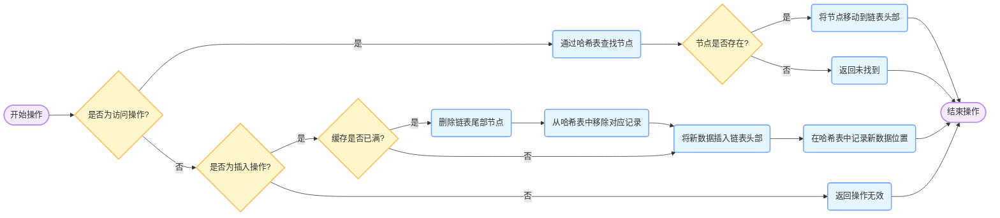

| 版本 | 内容         | 时间                   |
| ---- | ------------ | ---------------------- |
| V1   | 新建         | 忘了，应该是 2023 年底 |
| V2   | 更新部分文案 | 2025-04-20 19:41:26    |

 [[toc]]

## Redis 为什么这么快？（ 重要）

Redis 是一款基于内存的高性能键值对数据库，其速度快主要归因于以下几个方面：

- **内存存储**：Redis 将数据存储在内存中，内存的读写速度远快于传统的磁盘存储。
- **高效的数据结构**：Redis 支持多种数据结构，如字符串、哈希、列表、集合和有序集合等。这些数据结构都经过了精心设计和优化，以提高内存利用率和操作效率。
- **单线程模型**：Redis 采用单线程模型来处理客户端的请求，**避免了多线程环境下的线程切换和锁竞争开销**。单线程模型使得 Redis 的代码实现相对简单，同时也保证了数据的一致性和原子性。Redis 通过高效的事件驱动机制来处理大量的并发请求，能够在单线程的情况下实现高性能的并发处理。Redis 是单线程主要是指**执行命令由一个线程来完成的，但 Redis 的其他功能，比如持久化、异步删除、集群数据同步等，其实是由额外的线程执行的**。
- **优化的网络通信**：**Redis 的瓶颈主要在 IO 而不是 CPU**。使用多路 IO 复用模型，非阻塞 IO。Redis 采用了多路复用机制使其在网络 IO 操作中能并发处理大量的客户端请求，实现高吞吐率。 
- **数据持久化策略**：虽然 Redis 主要是基于内存的数据库，但它也提供了数据持久化功能，以保证数据的安全性和可靠性。Redis 支持两种持久化方式：RDB 和 AOF。RDB 通过定期将内存中的数据快照保存到磁盘上，而 AOF 则是将每次写操作都追加到日志文件中。这两种持久化方式都不会对 Redis 的性能产生太大的影响，因为它们都是在后台异步进行的，不会阻塞主线程。

## Redis 的事件模型（ 重要）

Redis 使用 I/O 多路复用技术来同时监听多个套接字的状态变化。常见的 I/O 多路复用模型有 `select`、`poll`、`epoll`（Linux 系统）和 `kqueue`（BSD 系统）等。Redis 会根据不同的操作系统选择合适的 I/O 多路复用函数，例如在 Linux 系统上默认使用 `epoll`。事件响应框架一般都采用该架构，比如 netty。

如下图所示，文件事件处理器有四个组成部分，它们分别是套接字、I/O多路复用程序、文件事件分派器以及事件处理器。


文件事件是对套接字操作的抽象，每当一个套接字准备好执行 `accept`、`read`、`write`和 `close` 等操作时，就会产生一个文件事件。因为 Redis 通常会连接多个套接字，所以多个文件事件有可能并发出现。

I/O多路复用程序负责监听多个套接字，并向文件事件派发器传递那些产生了事件的套接字。

尽管多个文件事件可能会并发出现，但 **I/O 多路复用程序总是会将所有产生的套接字都放到同一个队列里边，然后文件事件处理器会以有序、同步、单个套接字的方式处理该队列中的套接字**，也就是处理就绪的文件事件。**因为文件事件分派器队列的消费是单线程的，所以 Redis 才叫单线程模型**。

## 缓存穿透、缓存击穿、缓存雪崩（ 重要）

### 缓存穿透

**缓存穿透**：指访问的数据是**缓存和 DB 中都没有的数据**。缓存不起作用，请求会穿透到DB，流量大时 DB 会挂掉。

**针对**：某些 redis key。

**解决方案**：

- **布隆过滤器**：布隆过滤器可以判断一个元素是否可能存在于集合中，使用一个足够大的 bitmap，用于存储可能访问的 key，不存在的 key 直接被过滤；
- **缓存空值**：当数据库中查询不到数据时，也将空值缓存起来，并设置一个较短的过期时间。这样，后续相同的请求会直接从缓存中获取空值，而不会再次访问数据库。这样可以防止攻击用户反复用同一个 id 暴力攻击。

### 缓存击穿

**缓存击穿**：缓存击穿是指一个热点 key 在缓存中过期的瞬间，有大量的并发请求同时访问该 key。由于缓存中已经没有该 key 的数据，这些请求会直接访问数据库，从而给数据库带来巨大的压力。

**针对**：单个 redis key。

**解决方案**：

- **设置热点数据永不过期**：对于一些热点数据，可以不设置过期时间，或者在业务层面手动更新缓存。这样可以避免因缓存过期而导致的击穿问题。

- **加互斥锁**：所谓的互斥锁，就是保证同一时间只有一个业务线程更新缓存，对于没有获取互斥锁的请求，要么等待锁释放后重新读取缓存，要么就返回空值或者默认值；

### 缓存雪崩

**缓存雪崩**：缓存雪崩是指在某一时刻，缓存中大量的 key 同时过期，或者缓存服务器出现故障导致缓存不可用。此时，大量的请求会直接访问数据库，导致数据库压力剧增，甚至可能使数据库崩溃。

**针对**：大量 redis key。

**解决方案**：

- 针对大量缓存同时过期：
  - **分散过期时间**：为不同的 key 设置不同的过期时间，避免大量 key 同时过期。可以在基础过期时间上加上一个随机值，使过期时间分散开来。
- 针对缓存服务器故障
  - **缓存集群高可用**：使用 Redis Cluster 等集群方案，将数据分散存储在多个节点上。当部分节点出现故障时，其他节点仍然可以正常提供服务。同时，利用 Redis Sentinel 实现自动故障转移，当主节点故障时，能自动将从节点提升为主节点。
  - **熔断与限流**：
    - 引入熔断机制，当缓存服务器故障导致大量请求涌向数据库时，自动切断部分请求，避免数据库被压垮。例如，使用 Hystrix 等熔断框架，当数据库的请求错误率达到一定阈值时，触发熔断，返回预设的默认值。
    - 同时，进行限流操作，对访问数据库的请求进行速率限制。可以使用令牌桶算法或漏桶算法实现限流。例如，使用 Google Guava 的 `RateLimiter` 进行限流：

## 数据库和缓存的一致性问题（ 重要）

不一致产生原因：

- <font color='purple'>更新顺序问题</font>：在并发环境下，**更新数据库和缓存的顺序不同可能导致数据不一致**。例如，先更新数据库再更新缓存时，若更新缓存失败，就会造成缓存数据与数据库不一致；先更新缓存再更新数据库，若更新数据库失败，也会出现同样的问题。
- <font color='purple'>并发读写问题</font>：多个线程同时进行读写操作，可能会出现数据覆盖、读取到旧数据等问题。比如，**一个线程更新数据库后还未更新缓存，另一个线程就从缓存中读取数据，此时读到的就是旧数据。**
- <font color='purple'>缓存失效问题</font>：缓存过期或者被手动删除后，新的请求可能会读取到旧的数据库数据，而在这个过程中其他请求可能已经更新了数据库。


**<font color='purple'>不一致产生的原因</font>**

并发场景下，无论是先删除缓存再更新数据库，还是先更新数据库再删除缓存，都可能导致数据不一致。

- **先删缓存，再写库**：当删除缓存后但数据库更新操作还未完成时，若有其他线程发起读取请求，会发现缓存为空，进而从数据库中读取旧数据并写入缓存，使缓存中存储了脏数据。
- **先写库，再删缓存**：若写库操作成功，但在删除缓存前写库线程出现异常（如宕机），导致缓存未被删除，后续读取操作会从缓存中获取到旧数据，与数据库中的新数据不一致。

**<font color='purple'>常见解决方案及流程</font>**

实际应用中，最常用的策略如下：

- **读操作**：应用程序先尝试从缓存中读取数据。若缓存命中，直接返回缓存中的数据；若缓存未命中，则从数据库中读取数据，将数据存入缓存后再返回。
- **写操作**：先更新数据库中的数据，更新成功后，删除缓存中的对应数据。

**<font color='purple'>此方案优势及相关解释</font>**

这种**先更新数据库再删除缓存的策略被广泛使用**，如 Facebook 在论文《Scaling Memcache at Facebook》中也采用了该策略。选择删除缓存而非更新缓存，主要是为了避免并发写操作导致脏数据。在高并发场景下，多**个写操作同时更新缓存可能会出现数据覆盖或不一致的情况，而删除缓存后，后续读取操作会自动从数据库获取最新数据并更新缓存。**

**<font color='purple'>潜在并发问题及发生概率</font>**

即便采用上述策略，仍存在一定的并发问题。例如，**一个读操作未命中缓存，去数据库中取数据，此时有一个写操作更新了数据库并删除了缓存，而读操作后续将之前从数据库获取的旧数据又放入了缓存，从而产生脏数据**。

不过，这种情况在实际中发生的**概率极低**。因为数据库的**写操作通常比读操作慢很多**，且写操作可能需要锁表。要出现上述问题，读操作必须在写操作之前进入数据库操作，同时又要在写操作之后更新缓存，这些条件同时满足的可能性极小。

> Facebook 的论文《[Scaling Memcache at Facebook在新窗口打开](https://www.usenix.org/system/files/conference/nsdi13/nsdi13-final170_update.pdf)》也使用了这个策略。为什么不是写完数据库后更新缓存？你可以看一下Quora上的这个问答《[Why does Facebook use delete to remove the key-value pair in Memcached instead of updating the Memcached during write request to the backend?在新窗口打开](https://www.quora.com/Why-does-Facebook-use-delete-to-remove-the-key-value-pair-in-Memcached-instead-of-updating-the-Memcached-during-write-request-to-the-backend)》，主要是怕两个并发的写操作导致脏数据。
>
> 所以，要么通过 2PC 或是 Paxos 协议保证一致性，要么就是拼命的降低并发时脏数据的概率，而 Facebook 使用了这个降低概率的玩法，因为 2PC 太慢，而 Paxos 太复杂。当然，**最好还是为缓存设置上过期时间**。

## Redis 的键的过期删除策略（ 重要）

### Redis 的键的过期删除策略

redis 采用的是**定期删除 + 惰性删除**策略。

- **<font color='purple'>惰性删除</font>**：当客户端尝试访问某个键时，Redis 会检查该键是否过期。如果过期，就删除该键并返回空结果；若未过期，则正常返回键的值。
  - **优点**：这种策略只有在访问键时才会进行过期检查，对 CPU 资源的消耗较少。
  - **缺点**：可能导致过期键长时间占用内存。
- **<font color='purple'>定期删除</font>**：Redis 会默认每隔 100ms（通过配置文件中的 `hz` 参数控制检查频率），从设置了过期时间的键中随机抽取一部分进行检查，将其中过期的键删除。
  - **缺点**：某些设置了过期时间的键可能没有被扫描到。
  - **优点**：在 CPU 资源消耗和内存空间利用之间取得了较好的平衡。

### 定期删除+惰性删除有什么问题？

<font color='purple'>内存占用问题</font>

- **过期键未及时清理**：**定期删除**每隔一段时间随机检查**部分**设置了过期时间的键，这就可能导致一些过期键在检查周期内未被选中检查，从而仍然保留在内存中。而**惰性删除**依赖于客户端对键的访问来触发过期检查，如果**某些过期键长时间未被访问**，也会持续占用内存。随着时间推移，**大量过期键积累在内存中**，会造成内存空间的浪费，可能导致 Redis 可用内存减少，影响系统的正常运行。

<font color='purple'>数据一致性问题</font>

- **主从复制场景**：在 Redis 的主从复制架构中，主节点和从节点可能存在数据不一致的情况。**当主节点使用定期删除或惰性删除清理过期键时，从节点可能无法及时同步这些操作**。例如，主节点通过定期删除删除了一个过期键，但在从节点下一次与主节点进行数据同步之前，客户端如果从从节点读取该键，仍然会得到过期数据，从而导致数据不一致。
- **分布式缓存场景**：在分布式系统中，不同节点上的 Redis 实例可能由**于网络延迟、时钟不一致等原因**，在过期键的删除时间上存在差异。例如，一个客户端在节点 A 写入一个设置了过期时间的键，由于网络问题，节点 B 接收到该键的时间较晚，那么节点 A 和节点 B 上该键的过期时间可能不一致。在进行定期删除和惰性删除时，就可能出现不同节点上该键的删除时间不同步，导致客户端在不同节点读取到的数据不一致。

<font color='purple'>性能影响问题</font>

- **定期删除的 CPU 开销**：定期删除策略需要 Redis 周期性地暂停正常的服务，对部分过期键进行检查和删除操作。虽然 Redis 会尽量控制检查的时间和频率，但在过期键数量较多的情况下，仍然会**消耗一定的 CPU 资源**。如果检查频率设置过高，会导致 Redis 频繁地进行过期键检查，影响其对正常客户端请求的响应性能；如果检查频率设置过低，又会增加过期键长时间占用内存的风险。
- **惰性删除的延迟问题**：惰性删除依赖于客户端的访问来触发过期键的删除。**当客户端访问一个大量过期键的数据集时，可能会在短时间内触发大量的过期键删除操作，导致 Redis 在处理客户端请求时出现延迟**。

### 为什么不用定时删除策略?

<font color='purple'>CPU 资源消耗过大</font>：定时删除策略需要为每个设置了过期时间的键都创建一个定时器，当键的过期时间到达时，定时器触发，立即将该键从内存中删除。在高并发场景下，Redis 可能会处理大量的键，并且会有众多键设置了过期时间。虽然内存及时释放，但是十分消耗 CPU 资源。在大并发请求下，CPU 要将时间应用在处理请求，而不是删除 key。

### 在持久化时遇到了过期的缓存会发生什么？

- <font color='purple'>RDB</font>
  - 持久化：持久化 key 之前，会检查是否过期，过期的 key 不进入 RDB 文件；
  - 载入：
    - 如果 Redis 以主服务器的模式运行，那么会对 RDB 中的键进行时间检查，**过期的键不会被恢复到 Redis 中**；
    - 如果 Redis 以从服务器的模式运行，那么 RDB 中所有的键都会被载入，忽略时间检查。在从服务器与主服务器进行数据同步的时候，从服务器的数据会先被清空，所以载入过期键不会有问题；
- <font color='purple'>AOF</font>
  - 对于 AOF 来说，如果一个键过期了，那么不会立刻对 AOF 文件造成影响。因为 Redis 使用的是**惰性删除和定期删除**，只有这个键被删除了，才会往 AOF 文件中追加一条 DEL 命令。
  - **在重写 AOF 的过程中，程序会检查数据库中的键，已经过期的键不会被保存到 AOF 文件中。**


### 主从服务对过期键的处理的不同处

在运行过程中，对于主从复制的 Redis，主服务器和从服务器对于过期键的处理也不相同：

1. 对于主服务器，一个过期的键被删除了后，会**向所有从服务器发送 DEL 命令**，通知从服务器删除对应的键。
2. 从服务器不会主动使用定期删除和惰性删除策略来删除过期键。即使**从服务器检测到某个键已经过期，也不会立即删除它**。这是因为从服务器需要严格按照主服务器的命令来操作，以确保主从数据的一致性。
3. 在主服务器未发送 `DEL` 命令之前，如果客户端从从服务器读取一个实际上已经过期的键，从服务器会返回该键的值。这就可能导致客户端在从服务器上读取到过期数据，出现数据不一致的情况。
4. **从服务器接收到主服务器的 DEL 命令后，才会删除对应的过期键**。

这么做的主要目的是保证数据一致性，所以当一个过期键存在于主服务器时，也必然存在于从服务器。

## Redis 内存淘汰策略（ 重要）

| 策略            | 说明                                                         |
| --------------- | ------------------------------------------------------------ |
| volatile-lru    | 从已设置过期时间的  Key中，删除最近最少使用的 Key（LRU算法），且不会考虑 Key 是否已经过期。<br />Redis 会记录每个键的访问时间 |
| volatile-lfu    | 从已设置过期时间的 Key 中，删除最不常用的Key（LFU算法）。<br />Redis 会记录每个键的访问频率，淘汰访问频率最低的键。 |
| volatile-ttl    | 从已设置过期时间的 key 中，优先移除剩余生存时间（TTL）最短的键。也就是优先淘汰即将过期的键。 |
| volatile-random | 从已设置过期时间的 Key 中，随机删除一些 Key。                |
| allkeys-lru     | 从所有 Key 中，删除最近最少使用的 Key（LRU算法）。           |
| allkeys-lfu     | 从所有 Key 中，删除最不常用的 Key（LFU算法）。               |
| allkeys-random  | 从所有 Key 中，随机删除一些Key。                             |
| no-enviction    | 不删除任何 Key，当内存达到上限时，将无法写入新数据，数据库会返回错误信息。 |

<font color='purple'>什么时候用 allkeys-lru？</font>

- 如果预计访问请求的特性呈现幂律分布，也就是说预计只有一部分元素会被频繁访问，而其余元素则很少被访问。使用 <font color='purple'>**allkeys-lru**</font> 策略是一个不错的选择。如果不确定该选择哪种策略，<font color='purple'>**allkeys-lru**</font> 也是一个很好的备选方案。

<font color='purple'>什么时候用 allkeys-random?</font>

- **所有键有相同的操作频率和重要性**，则 <font color='purple'>**allkeys-random**</font> 策略可以使得所有键被均衡地淘汰，并保证整个键空间的内存使用处于稳定状态。
- **如果预计访问请求的分布是均匀的**，则 <font color='purple'>**allkeys-random**</font> 策略也能够适应这种情况。与其他淘汰策略相比，在这种情况下使用随机策略更具有普适性和可靠性。

## Redis 的 LRU 算法（ 重要）

### 如果要你设计一个 LRU 算法你需要考虑什么问题（leetcode 有题）

java 如何实现 lru 缓存淘汰策略？

- linkedhashmap  考察点： 查询时间复杂度O1、删除修改时间复杂度O1
- 有哪些需要考虑的？LRU 算法需要实现下面的特性
  1. 实现 get/put 方法 （都为 O(1) 的时间复杂度）
  2. 每次 get 时需要将访问的节点提前至队首
  3. 每次 put 需要判断队列是否已满，满了则将最后的节点删除，并且将该节点放至队首，不满则直接放队首

### 理论的 LRU

<font color='purple'>LRU 算法概述</font>

LRU（Least Recently Used）即最近最少使用，是一种广泛应用于缓存淘汰的策略。其核心思想是：当缓存空间满时，优先淘汰那些最近最少被访问的数据，以此保证缓存中存储的是最常被使用的数据，提升缓存的命中率。

<font color='purple'>传统 LRU 算法实现原理</font>

传统的 LRU 算法一般借助**双向链表**和**哈希表**来实现。**双向链表用于维护数据的访问顺序，链表头部的数据表示最近刚访问过，链表尾部的数据表示最近最少访问；哈希表用于快速定位数据在链表中的位置。**

**数据结构设计**

- **双向链表**：每个节点包含数据、指向前一个节点的指针和指向后一个节点的指针。双向链表可以方便地在头部插入节点和删除尾部节点。
- **哈希表**：键为数据的键，值为双向链表中对应节点的指针，这样可以在 *O*(1) 的时间复杂度内找到数据对应的节点。

**操作流程**

- **访问数据**：当访问一个数据时，先通过哈希表找到该数据在链表中的位置，然后将其移动到链表头部，表示该数据是最近访问的。
- **插入数据**：如果缓存未满，直接将新数据插入到链表头部，并在哈希表中记录该数据的位置；如果缓存已满，删除链表尾部的数据（即最近最少使用的数据），并从哈希表中移除对应的记录，然后将新数据插入到链表头部。




### Redis 使用理论的 LRU 的问题

Redis 并没有采用传统的 LRU 算法实现，因为传统 LRU 算法需要维护一个双向链表，会消耗额外的内存和 CPU 资源。

**大量的节点访问就会带来频繁的链表节点的移动操作，会造成大量的额外空间和时间的消耗，从而降低 Redis 的性能**。

### Redis 近似 LRU 的效果

Redis LRU 算法并不是一个精确的实现。这意味着 Redis 每次淘汰键的时候可能没有选择最佳的淘汰对象，也就是说可能不是最久未访问的键。Redis 的实现是通过一个近似的 LRU 的算法淘汰键的，通过**采样一小部分的键，淘汰这一小部分的键中访问时间最早的键**。

Redis 3.0 改进了这个近似的 LRU 算法，也可以选择一个好的淘汰池。提高了算法的性能，使其能够更接近真实 LRU 算法的行为。

Redis 的 LRU 算法可以通过更改样本数来调整算法的精度，配置文件通过 `maxmemory-samples` 配置采样数量。

```
maxmemory-samples 5
```

Redis 不使用真正的 LRU 实现的原因是它需要更多的内存。但是，对于使用 Redis 的应用程序，近似的 LRU 算法实际上已经满足使用要求了。此图将 Redis 使用的 LRU 近似与真实的 LRU 进行了比较。


- **测试过程**：

  生成上述图表的测试用给定数量的键填充了 Redis 服务器。从头到尾访问一次键，所以第一个添加的键在 LRU 算法中是最佳的淘汰对象。后面又添加了 50% 的密钥，以强制驱逐一半的旧键。

- **三种不同颜色的含义**

  1. 浅灰色带是被逐出的对象；
  2. 灰色带是未被逐出的对象；
  3. 绿色带是添加的对象；

**分析**：

- 预期的效果：
  1. 理论的 LRU 实现预计的效果是在旧键中，前半部分的键将被淘汰；
  2. Redis LRU 算法只会按概率淘汰旧键；
- 上图 Theoretical LRU 是理论上的 LRU 的算法；
- Redis 3.0 的近似的 LRU 的算法比 Redis 2.8 的效果要好。Redis 3.0 后的近似 LRU 算法可以调节采样键的数量，可以看到当把采样键的数量设置为 10 的时候和理论上 LRU 的算法的效果差不多了。需要注意的是将采样样本键的数量设置成 10 会产生以一些额外的 CPU 消耗；

### Redis 近似 LRU 的实现

Redis 近似的 LRU 实现涉及到了一个**实例级别的全局 LRU 的时钟**，Redis 会使用一个字段保存键值的时钟信息**，每次访问就会更新这个值，保存最新的时间戳**。

- Redis 会为每个键维护一个 24 位的时间戳字段（`lru` 字段），记录该键最后一次被访问的时间。
- 当需要淘汰数据时，Redis 会随机选择一定数量（可通过 `maxmemory-samples` 配置，**默认是 5 个**）的键，然后比较这些键的 `lru` 字段，选择 `lru` 时间戳最小（即其中最久未访问的）的键进行淘汰。
- 通过增加 `maxmemory-samples` 的值，可以使 Redis 的近似 LRU 算法更接近传统 LRU 算法的效果，但会增加 CPU 开销。

Redis的key的底层结构

```c
typedef struct redisObject {
    unsigned type:4; // 类型
    unsigned encoding:4; // 编码
    unsigned lru:LRU_BITS; /* LRU time (relative to global lru_clock) or
   							* LFU data (least significant 8 bits frequency
     					    * and most significant 16 bits access time). */
    int refcount; // 引用计数
    void *ptr; // 指向存储实际值的数据结构的指针，数据结构由 type、encoding 决定。
} robj;
```

> 需要注意的是默认情况下这个时钟的精度是 1 秒钟，全局时钟的值更新频率由配置项 `hz` 控制，

## Redis 的 LFU 算法 TODO-KWOK

### 理论上的 LFU

LFU（Least Frequently Used）即最不经常使用算法，是一种常见的缓存淘汰策略。LRU（Least Recently Used）算法**关注数据的最近访问时间，LFU 算法主要关注数据的访问频率。**

其核心思想是：当缓存空间满时，优先淘汰访问频率最低的数据；如果存在多个访问频率相同的数据，则淘汰最久未使用的数据。

<font color='purple'>LFU 算法的数据结构设计</font>

- **哈希表（HashMap）**：用于快速查找数据。键为数据的键，值为存储该数据的节点。通过哈希表，可以在 *O*(1) 的时间复杂度内找到数据对应的节点。
- **频率到双向链表的映射（HashMap）**：键为访问频率，值为对应访问频率的双向链表。每个双向链表按访问时间排序，链**表头部的数据是最近访问的**，链表尾部的数据是最久未访问的。
- **双向链表（Doubly Linked List）**：用于维护相同访问频率的数据的访问顺序。


<font color='purple'>LFU 算法的复杂度分析</font>

- **时间复杂度**：`get` 和 `put` 操作的平均时间复杂度均为 *O*(1)。这是因为哈希表的查找、插入和删除操作的平均时间复杂度为 *O*(1)，双向链表的插入和删除操作的时间复杂度也为 *O*(1)。
- **空间复杂度**：空间复杂度为 *O*(*n*)，其中 *n* 是缓存的最大容量。主要的空间开销在于哈希表和双向链表的存储。

<font color='purple'>LFU 算法的优缺点</font>

优点

- 能够更好地反映数据的使用频率，在数据访问频率差异较大的场景下，LFU 算法可以更有效地保留热点数据，提高缓存命中率。
- 相比于 LRU 算法，LFU 算法对访问频率较低的数据更加敏感，能够更快地淘汰那些不常使用的数据。

缺点

- 实现复杂度较高，需要维护多个数据结构，包括哈希表和多个双向链表，代码实现相对复杂。
- 对于新加入的数据，由于其初始访问频率较低，可能会在短时间内被淘汰，即使该数据在未来可能会被频繁访问。
- 访问频率的统计可能会受到时间因素的影响，例如某个数据在一段时间内被频繁访问，但之后不再被访问，其访问频率仍然较高，可能会导致缓存中保留了一些不再需要的数据。

### Redis 的 LFU 实现

TODO-KWOK

## Redis 分布式锁原理

### 基本原理

**synchronized 或者 Lock 都是线程锁，对同一个JVM进程内的多个线程有**效。因为锁的本质是内存中存放一个标记，记录获取锁的线程是谁，这个标记对每个线程都可见。分布式环境中多个JVM，内存中的锁显然是不共享的，每个JVM进程都有自己的锁，自然无法保证线程的互斥了，这个时候我们就需要使用到分布式锁了。

最常见的解决方案是 Redis 实现，**实现分布式锁要满足 3 点：多进程可见，互斥，可重入**。

**加锁**

- **利用 `SET` 命令**：Redis 实现分布式锁主要基于 `SET` 命令的原子性。比如：`SET lock_key unique_value NX EX 10`
  - `lock_key`：表示锁的名称，多个客户端需要竞争同一把锁时，使用相同的 `lock_key`。
  - `unique_value`：是一个唯一的值，用于标识加锁的客户端。这个唯一值可以使用 UUID 等方式生成，主要用于确保释放锁时的安全性。
  - `NX`：表示只有当 `lock_key` 不存在时，才会设置该键值对，即只有一个客户端能够成功设置该键，从而获得锁。
  - `EX 10`：表示设置键的过期时间为 10 秒，防止因为客户端异常崩溃等原因导致锁无法释放，造成死锁。

**获取锁：**

- **获取锁的时候调用 setnx，如果返回 0，则该锁正在被别人使用，返回 1 则成功获取锁。 还设置一个获取的超时时间，若超过这个时间则放弃获取锁；**

**释放锁：**

- **使用 Lua 脚本保证原子性**：解锁操作需要保证原子性，否则可能会出现误解锁的情况。例如，客户端 A 的锁过期后，客户端 B 获得了锁，此时客户端 A 执行解锁操作，就可能会误解锁客户端 B 的锁。Redis 支持执行 Lua 脚本，通过 Lua 脚本可以保证解锁操作的原子性。示例 Lua 脚本如下：

- ```lua
  if redis.call("GET", KEYS[1]) == ARGV[1] then
      return redis.call("DEL", KEYS[1])
  else
      return 0
  end
  ```

- 在执行该 Lua 脚本时，需要传入两个参数：`KEYS[1]` 表示锁的名称（即 `lock_key`），`ARGV[1]` 表示**加锁时使用的唯一值。**脚本首先检查当前锁的唯一值是否与传入的唯一值相等，如果相等，则删除该锁，返回 1 表示解锁成功；如果不相等，返回 0 表示解锁失败。

#### <font color='purple'>Redis 分布式锁的可靠性问题及解决办法</font>

**锁过期问题**

- **问题描述**：如果业务处理时间超过了锁的过期时间，可能会导致多个客户端同时访问共享资源，破坏了锁的互斥性。
- **解决办法**：可以使用 “看门狗” 机制，即启动一个后台线程，在锁快要过期时，自动延长锁的过期时间。Redisson 框架就实现了这种 “看门狗” 机制。
  - **看门狗定时任务**：默认情况下，看门狗的检查周期是锁默认过期时间的 1/3。例如，Redisson 中锁的默认过期时间是 30 秒，那么看门狗会每隔 10 秒检查一次。
  - **延长锁过期时间**：看门狗通过 Redis 的 `EXPIRE` 命令来延长锁的过期时间。在检查到锁仍然被当前客户端持有时，会向 Redis 发送 `EXPIRE` 命令，将锁的过期时间重新设置为默认的过期时间（如 30 秒）。

**Redis 主从复制问题**

- **问题描述**：在 Redis 主从复制架构中，如果主节点加锁后还未将锁信息同步到从节点就发生故障，从节点晋升为主节点，新的主节点中可能不包含该锁信息，其他客户端就可以再次加锁，导致多个客户端同时持有锁。
- **解决办法**：可以使用 Redlock 算法。Redlock 算法需要在多个独立的 Redis 节点上进行加锁操作，只有在大多数节点上都成功加锁，才认为加锁成功，从而提高了锁的可靠性。

## Redis 的底层数据结构 TODO-KWOK


## 为什么 redis 的 zset 使用跳表？（ 重要）

<font color='purple'>1. 高效的查找、插入和删除操作</font>

- **平均时间复杂度**<font color='purple'>*O*(log*n*)</font>：跳表的查找、插入和删除操作的平均时间复杂度为 <font color='purple'>*O*(log*n*)</font>，这与平衡二叉树（如 AVL 树、红黑树）相当。在有序集合中，需要频繁进行查找某个成员、插入新成员或删除成员的操作，跳表能够以较低的时间复杂度完成这些操作，保证了有序集合操作的高效性。
- **实现相对简单**：相比于平衡二叉树，跳表的实现要简单得多。平衡二叉树在插入和删除节点时，需要进行复杂的旋转操作来保持树的平衡，实现起来较为复杂，而跳表只需要通过随机化的方式来决定节点的层数，代码实现和维护都更加容易。

> 简单来说，跳表其实是一种**多层的有序链表**。跳表来源于链表，在链表的基础上**结合了二分的思想进行改造。**我们知道：二分查找针对的有序数组，时间复杂度是o(logn)。如果是有序链表，查询和插入的的时间复杂度是o(n)。跳表就是链表的“二分查找”。**跳表的查询，增加和删除的平均时间复杂度都是 logn 级别的；**

<font color='purple'>2. 支持范围查找</font>

- **天然适合范围查找**：在有序集合中，范围查找是一个非常常见的操作，例如查找分数在某个区间内的所有成员。跳表可以很方便地实现范围查找，通过从高层开始查找，快速定位到范围的起始位置，然后沿着链表依次遍历，直到找到范围的结束位置。这种查找方式的时间复杂度也是 <font color='purple'>*O*(log*n*+*m*)</font>，其中 <font color='purple'>*n*</font> 是集合中元素的总数，<font color='purple'>*m*</font> 是范围内元素的数量。

<font color='purple'>3. 动态性好</font>

- **无需频繁调整结构**：跳表是一种动态的数据结构，它可以在插入和删除节点时动态地调整节点的层数，而不需要像平衡二叉树那样进行大规模的结构调整。在有序集合中，元素的插入和删除操作比较频繁，跳表的这种动态性使得它能够很好地适应这种变化，保证操作的高效性。

<font color='purple'>4. 内存使用较为合理</font>

- **空间复杂度可接受**：跳表的空间复杂度为 <font color='purple'>*O*(*n*)</font>，虽然相比于普通链表会多使用一些额外的指针来维护多层结构，但相比于平衡二叉树，跳表的指针数量并没有显著增加。而且，通过合理调整跳表的层数，可以在时间复杂度和空间复杂度之间取得较好的平衡。

<font color='purple'>5. 与字典结合使用的优势</font>

- **满足有序集合的特性需求**：Redis 的有序集合不仅需要根据成员的分数进行排序，还需要能够快速查找某个成员的分数。因此，Redis 的有序集合使用跳表和字典（HashTable）共同实现，跳表负责维护元素的有序性和范围查找，字典负责快速查找某个成员的分数，两者结合可以充分发挥各自的优势，满足有序集合的各种操作需求。


为什么 Zset 的实现用跳表而不用平衡树（如 AVL树、红黑树等）？

对于[这个问题 (opens new window)](https://link.zhihu.com/?target=https%3A//news.ycombinator.com/item%3Fid%3D1171423)，Redis的作者 @[antirez](https://www.zhihu.com/search?q=antirez&search_source=Entity&hybrid_search_source=Entity&hybrid_search_extra={"sourceType"%3A"answer"%2C"sourceId"%3A2619230497}) 是怎么说的：

> There are a few reasons:
> 1、They are not very memory intensive. It's up to you basically. Changing parameters about the probability of a node to have a given number of levels will make then less memory intensive than btrees.
> 2、A sorted set is often target of many ZRANGE or ZREVRANGE operations, that is, traversing the skip list as a linked list. With this operation the cache locality of skip lists is at least as good as with other kind of balanced trees.
> 3、They are simpler to implement, debug, and so forth. For instance thanks to the skip list simplicity I received a [patch](https://www.zhihu.com/search?q=patch&search_source=Entity&hybrid_search_source=Entity&hybrid_search_extra={"sourceType"%3A"answer"%2C"sourceId"%3A2619230497}) (already in Redis master) with augmented skip lists implementing ZRANK in O(log(N)). It required little changes to the code.

主要是从内存占用、对范围查找的支持、实现难易程度这三方面总结的原因，简单翻译一下：

- 它们不是非常内存密集型的。基本上由你决定。改变关于节点具有给定级别数的概率的参数将使其比 btree 占用更少的内存。
- **Zset 经常需要执行 ZRANGE 或 ZREVRANGE 的命令，即作为链表遍历跳表**。通过此操作，跳表的缓存局部性至少与其他类型的平衡树一样好。
- **它们更易于实现、调试等**。例如，由于跳表的简单性，我收到了一个补丁（已经在Redis master中），其中扩展了跳表，在 O(log(N) 中实现了 ZRANK。它只需要对代码进行少量修改。

我再详细补充点：

- **从内存占用上来比较，跳表比平衡树更灵活一些**。平衡树每个节点包含 2 个指针（分别指向左右子树），而跳表每个节点包含的指针数目平均为 1/(1-p)，具体取决于参数 p 的大小。如果像 Redis里的实现一样，取 p=1/4，那么平均每个节点包含 1.33 个指针，比平衡树更有优势。
- **在做范围查找的时候，跳表比平衡树操作要简单**。在平衡树上，我们找到指定范围的小值之后，还需要以[中序遍历](https://www.zhihu.com/search?q=中序遍历&search_source=Entity&hybrid_search_source=Entity&hybrid_search_extra={"sourceType"%3A"answer"%2C"sourceId"%3A2619230497})的顺序继续寻找其它不超过大值的节点。如果不对平衡树进行一定的改造，这里的中序遍历并不容易实现。而在跳表上进行范围查找就非常简单，只需要在找到小值之后，对第 1 层链表进行若干步的遍历就可以实现。
- **从算法实现难度上来比较，跳表比平衡树要简单得多**。平衡树的插入和删除操作可能引发子树的调整，逻辑复杂，而跳表的插入和删除只需要修改相邻节点的指针，操作简单又快速。

## 一致性哈希算法 TODO-KWOK

[一致性哈希算法原理](https://www.cnblogs.com/lpfuture/p/5796398.html)

## Redis 部署架构（阿里云文档）

> https://help.aliyun.com/document_detail/54590.html

| 架构类型                                                     | 图                                                           | 说明                                                         |
| :----------------------------------------------------------- | ------------------------------------------------------------ | :----------------------------------------------------------- |
| [标准版-单副本](https://help.aliyun.com/document_detail/52685.htm#concept-fx3-jrg-tdb) |  | 适用于纯缓存场景，支持单节点集群弹性变配，满足高QPS场景      |
| [标准版-双副本](https://help.aliyun.com/document_detail/52226.htm#concept-qf3-kjh-tdb) |  | 系统工作时主节点和副本数据实时同步<br />若主节点发生故障，系统会快速将业务切换至备节点 |
| [集群版-单副本](https://help.aliyun.com/document_detail/59201.htm#concept-ydy-g24-tdb) |  | 单副本集群版实例采用集群架构，每个分片服务器采用单副本模式<br />适用于纯缓存类业务或者QPS压力较大的业务场景。 |
| [集群版-双副本](https://help.aliyun.com/document_detail/52228.htm#concept-tds-4mm-tdb) |  | 集群实例采用分布式架构，每个数据分片都支持主从切换（master-replica）<br />能够自动进行容灾切换和故障迁移，保障服务高可用。<br /><br />集群版支持两种连接模式：<br />[代理模式](https://help.aliyun.com/document_detail/52228.htm#section-h69-izd-531)：提供智能的连接管理，降低应用开发成本。<br />[直连模式](https://help.aliyun.com/document_detail/52228.htm#section-dqj-mgc-4ir)：客户端绕过代理服务器直接访问后端数据分片，<br />可降低网络开销和服务响应时间，适用于对Redis响应速度要求极高的业务。<br /><br />**适用场景**：数据量较大的场景。整体读写请求的QPS压力较大的场景。吞吐密集型、高性能应用场景。 |
| [Redis读写分离版](https://help.aliyun.com/document_detail/62870.htm#concept-zm4-3mh-tdb) |  | 读写分离实例采用主从（Master-Replica）架构提供高可用，主节点挂载只读副本（Read Replica）实现数据复制，支持读性能线性扩展。 <br />只读副本可以有效缓解热点key带来的性能问题，适合高读写比的业务场景。<br /><br />**适用场景**：读请求QPS压力较大的场景（如热点数据集中）。于数据同步至只读节点存在一定延迟，不适用于数据一致性要求高的场景，可选用集群架构。》 |

> 阿里的读写分离架构：https://help.aliyun.com/document_detail/62870.html
>
> 读写分离架构的解释：https://blog.51cto.com/u_15352876/5241656，主要解释了星型复制和链式复制；

## 主从同步的星型复制和链式复制

星型复制就是将所有的只读的 replica 直接和 master 保持同步，

- **优点**：每个只读的 replica 之间相互独立，任何一个节点异常不影响到其他节点，同时因为复制链比较短，**只读 replica上的复制延迟比较小。**

- **缺点**：Redis是单进程单线程模型，**主从之间的数据复制也在主线程中处理，只读 replica 数量越多，数据同步对 master 的 CPU 消耗就越严重**，集群的写入性能会随着只读 replica 数量的增加而降低。此外，星型架构会让 master 的出口带宽随着只读 replica 的增加而成倍增长。Master 上较高的 CPU 和网络负载会抵消掉星型复制延迟较低的优势，因此，星型复制架构会带来比较严重的扩展问题，整个集群的性能会受限于master。

链式复制将所有的只读 replica组织成一个复制链，master只需要将数据同步给replica和复制链上的第一个只读replica。

- **优点**：链式复制解决了星型复制的扩展问题，理论上可以无限增加只读 replica的数量，随着节点的增加整个集群的性能也可以基本上呈线性增长。
- **缺点**：链式复制的架构下，复制链越长，复制链末端的只读 replica 和 master 之间的同步延迟就越大，考虑到读写分离主要使用在对一致性要求不高的场景下，这个缺点一般可以接受。但是如果复制链中的某个节点异常，会导致下游的所有节点数据都会大幅滞后。更加严重的是这可能带来全量同步，并且全量同步将一直传递到复制链的末端，这会对服务带来一定的影响。

> 为了解决这个问题，读写分离的 Redis 都使用阿里云优化后的 binlog 复制版本，最大程度的降低全量同步的概率。

## Redis 部署容灾方案（阿里云文档）

> https://help.aliyun.com/document_detail/100734.html


| 灾备方案                                                     | 灾备级别 | 说明                                                         |
| :----------------------------------------------------------- | :------- | :----------------------------------------------------------- |
| [单可用区高可用方案](https://help.aliyun.com/document_detail/100734.htm#section-u3t-f4t-2gb) | ★★★☆☆    | 主备节点部署在同一可用区中的不同机器上，当任一节点发生故障时，由高可用HA（High Availability）系统自动执行故障切换，避免单点故障引起的服务中断。 |
| [同城容灾方案](https://help.aliyun.com/document_detail/100734.htm#section-h5s-zxn-fgb) | ★★★★☆    | 主备节点分别部署在同一地域下两个不同的可用区，当任一可用区因电力、网络等不可抗因素失去通信时，高可用HA系统将执行故障切换，确保整个实例的持续可用。 |
| [跨地域容灾方案](https://help.aliyun.com/document_detail/100734.htm#section-zhl-xdp-fgb) | ★★★★★    | 由多个子实例构成全球分布式实例，所有子实例通过同步通道保持实时数据同步，由通道管理器负责子实例的健康状态监测、主备切换等等异常事件的处理，适用于异地灾备、异地多活、应用就近访问、分摊负载等场景。更多介绍，请参见[全球多活](https://help.aliyun.com/document_detail/71881.htm#concept-qf1-mdk-zdb)。 |

单可用区，可以使用：

1. 主从，一主一从，一主多从
2. 集群，分片，每个分片有一个或多个从节点
3. 读写分离架构

## 预估 redis 内存规格（重要）

在确定云数据库Redis实例的内存容量时，首先**要考虑存储的业务数据大小**，除此之外，您还需额外**考虑Redis自身运行占用的必要内存开销（例如进程元数据、复制缓冲区、内存碎片等）**。

不同于自建Redis数据库，选用云数据库Redis时，您无需再额外考虑云数据库Redis持久化Fork写时复制占用的内存开销以及云数据库Redis增强功能（如安全白名单、审计、大Key、热Key等）的内存开销，这些开销由阿里云承担，不计入购买的实例内存容量。


需要考虑的如下：

- Key 的数据类型、长度和数量。如果使用可包含元素的数据类型（例如Hash），您还需要计算每个Key中，各元素的数量和长度。

- Value 的长度。

- Key 的过期时间与[逐出策略](https://help.aliyun.com/document_detail/38679.htm#concept-e5v-hs5-ydb)。

- 访问模型，例如大量的客户端连接、使用 Lua 脚本或事务等，均需要为其预留适量的内存。

- **中长期的业务增长情况。**

> 我一般是通过在测试环境通过 **memory usage 命令看占用的字节数，预估一下**

## Redis 线程模型（重要）

https://zhuanlan.zhihu.com/p/639750217 说的非常好

我们常常会碰到这样一个问题：**<font color="blue">Redis 真的是单线程吗？</font>**

在回答这个问题之前，我们得先明确问题的边界。当我们提及 “Redis 采用的是单线程模型” 时，实际上指的是其网络模型。

事实上

- Redis 早在 4.0 版本中就已经引入了多线程，但这里的“多线程”是指用于处理一些特定任务的线程，而不是网络模型上的多线程。
- Redis 在 6.0 版本中正式引入多线程网络模型，在这之前，其网络模型一直是单线程模式的。

从 4.0 版本起，Redis 采用的是 **<font color="green">单线程网络模型</font>** + **<font color="green">多线程后台任务</font>** 的组合模式。

- **<font color="purple">主线程</font>** 承担了包括接收（socket 读）、解析、执行、发送（socket 写）在内的整个流程。
- **<font color="purple">主线程</font>** 还负责周期任务的处理，像删除过期 key、字典 rehash 等操作。

此外，**<font color="red">对于一些极为耗时的操作</font>**，Redis 会借助专用的后台线程来处理，以此避免阻塞主线程的事件循环。

我们知道，Redis 的 DEL 命令用于删除一个或多个 key 存储的值，它是一个同步阻塞命令。多数情况下，要删除的 key 中存储的值数量不多，最多几十上百个对象，所以能快速执行完毕。但如果要删除的是一个包含数百万个对象的超大键值对，这条命令可能会阻塞至少数秒。由于事件循环是单线程的，这会阻塞后续的其他事件，进而导致吞吐量下降。

于是，从 Redis v4.0 开始，增加了一些非阻塞命令，如 UNLINK、FLUSHALL ASYNC、FLUSHDB ASYNC。UNLINK 命令其实就是 DEL 的异步版本，它不会同步删除数据，只是将 key 从 keyspace 中暂时移除，然后把任务添加到异步队列，最后由后台线程进行删除操作。

到了 6.0 版本，Redis 为其核心网络模型引入了多线程，即 I/O threading。至此，我们可以明确地说：Redis 采用了 **<font color="orange">多线程网络模型</font>** + **<font color="orange">多线程后台任务</font>** 的组合模式。

不过，Redis 的多线程模型并非标准的 Reactor 多线程模型。因为 Redis 的 I/O threading 仅负责 I/O 读写，不负责命令执行。也就是说，Redis 只是将读取客户端请求命令和回写响应数据的逻辑进行了异步化处理，**实际命令的执行最终还是在主线程上完成**。

## 集群架构的命令限制

> https://help.aliyun.com/document_detail/145968.html

不支持的命令

- SWAPDB
- CLIENT ID
- SORT（**BY**和**GET**参数）

受限的命令：如需在集群架构实例中执行下述受限制的命令，请**使用 hash tag 确保命令所要操作的 key 都分布在 1 个hash slot 中**，hash tag 的详细用法请参见[Redis官方文档](http://redis.io/topics/cluster-spec)。

| 命令族      | 具体命令                                                     |
| :---------- | :----------------------------------------------------------- |
| HyperLogLog | PFMERGE、PFCOUNT                                             |
| Keys        | RENAME、RENAMENX、SORT                                       |
| Lists       | RPOPLPUSH、BRPOP、BLPOP、BRPOPLPUSH                          |
| Scripting   | EVAL、EVALSHA、SCRIPT EXISTS、SCRIPT FLUSH、SCRIPT KILL、SCRIPT LOAD |
| Strings     | MSETNX                                                       |
| Transaction | DISCARD、EXEC、MULTI、UNWATCH、WATCH                         |

由于集群架构对 Lua 脚本的使用存在一定的限制，当实例变配至集群架构时，Lua 脚本可能因脚本内容不符合限制而发生丢失，请务必提前备份，更多信息，请参见[集群架构实例的命令限制](https://help.aliyun.com/document_detail/145968.htm#concept-2353537)。Lua 脚本中涉及的键必须都在同一个哈希槽中，否则脚本将无法执行。这是因为 Redis 集群为了保证脚本执行的原子性，要求脚本操作的键在同一个节点上。

## Redis 的一些管理命令 memory usage（重要）

memory

Redis 4.0之前只能通过`info memory`来了解Redis内部有限的内存信息，Redis 4.0提供了 `memory` 命令，帮助用户全面了解Redis的内存状态。

info memory：查看 redis 实例的内存信息；

memory 相关命令：

```
127.0.0.1:6379> memory help
1) "MEMORY DOCTOR                        - Outputs memory problems report"
2) "MEMORY USAGE <key> [SAMPLES <count>] - Estimate memory usage of key"
3) "MEMORY STATS                         - Show memory usage details"
4) "MEMORY PURGE                         - Ask the allocator to release memory"
5) "MEMORY MALLOC-STATS                  - Show allocator internal stats"
```

- `memory usage`

  `usage`子命令可以查看某个key在Redis内部实际占用多少内存。

  **注意**

  - 不光key、value需要占用内存，Redis管理这些数据还需要一部分内存。
  - 对于hash、list、set、sorted set这些类型的key，结果是采样计算的，可以通过`SAMPLES`来控制采样数量。

- `memory stats`：

```
127.0.0.1:6379> memory stats
1) "peak.allocated"    // Redis从启动到现在，历史最多使用过多少内存
2) (integer) 423995952
3) "total.allocated"    //当前使用内存
4) (integer) 11130320
5) "startup.allocated"    //Redis启动初始化以后占用内存
6) (integer) 9942928
7) "replication.backlog"    //主从复制断开重连时会用到，默认10MB
8) (integer) 1048576
9) "clients.slaves"    // 主从复制用到的内存
10) (integer) 16858
11) "clients.normal"    //普通用户客户端的读写缓冲区
12) (integer) 49630
13) "aof.buffer"    //aof持久化使用的缓存和aofrewrite时产生的缓存之和
14) (integer) 3253
15) "db.0"    //每个db的元数据所占用内存
16) 1) "overhead.hashtable.main"
2) (integer) 5808
3) "overhead.hashtable.expires" //管理带过期时间的数据所额外消耗内存
4) (integer) 104
17) "overhead.total"    //上面提到的各项内存消耗之和
18) (integer) 11063904
19) "keys.count"    //当前存储的key的总量
20) (integer) 94
21) "keys.bytes-per-key"    //当前内存中平均每个key大小
22) (integer) 12631
23) "dataset.bytes"        //用户数据所占用内存(= 总内存 - Redis元数据所占内存)
24) (integer) 66416
25) "dataset.percentage"    //100 * dataset.bytes / (total.allocated - startup.allocated)
26) "5.5934348106384277"
27) "peak.percentage"    // 100 * total.allocated / peak_allocated
28) "2.6251003742218018"
29) "fragmentation"    //内存碎片率
30) "1.1039986610412598"
```

## Redis 数据结构的使用建议

| 数据结构    | 长度 / 元素个数建议                                          | 原因                                                         |
| ----------- | ------------------------------------------------------------ | ------------------------------------------------------------ |
| String      | 尽量控制在 1MB 以内                                          | 1）过大的字符串会占用较多内存，且在网络传输和操作时会增加延迟。 <br />2）Redis 单线程处理，大字符串操作会阻塞其他请求。 |
| Hash        | 每个哈希的字段数建议不超过 1000 个。<br />总大小尽量控制在几 MB 以内。 | 字段过多会增加哈希表的复杂度，影响查找和插入性能。<br />操作时可能引起性能抖动。<br />可能会变成热点 key |
| List        | 列表长度建议控制在 10000 以内。<br />避免存储超大元素。      | 过长的列表在执行 `LTRIM`、`LINDEX` 等操作时会变慢。<br />大元素会增加内存占用和网络传输时间。 |
| Set         | 集合元素个数建议不超过 10000 个。<br />元素尽量为短字符串。  | 元素过多会使集合运算（如交集、并集）的性能下降。<br />长字符串元素会占用更多内存。<br />可能会变成热点 key |
| Sorted Set  | 元素个数建议控制在 10000 个以内。 <br />避免存储超大元素。。 | 大量元素会使排序和范围查询变慢。<br />可能会变成热点 key     |
| Bitmap      | 位长度根据实际需求合理设置，避免过大。<br />例如，记录一年的签到信息，位长度为 365 即可。 | 过大的位图会占用大量内存，且位操作的性能会受影响。           |
| HyperLogLog | 无严格元素个数限制，但元素基数很大时也需注意。               | HyperLogLog 内存占用固定，但基数过大可能导致统计误差稍增大。 |

这些建议并非绝对，实际使用中要根据业务场景、Redis 服务器配置等因素进行调整。

## 各个数据结构在项目中的使用场景

| 数据结构   | 项目中的场景                                                 |
| ---------- | ------------------------------------------------------------ |
| String     | 项目中，暴露给 C 端用户查询的表的每条记录，都需要使用 string 缓存 |
| Hash       |                                                              |
| List       | 伪随机红包，提前分好每个红包的金额，push 到队列中去，然后抽奖时，依次 pop 弹出 |
| Set        | 抽奖奖池，使用 SRANDMEMBER 就相当于抽奖了                    |
| Sorted Set | 直播间排行榜使用这个，score 就是用户送礼的价值               |
| Bitmap     | 用户的每日签到信息<br />可以为每个用户分配一个独立的 Bitmap，每个位代表一天的签到状态，0 表示未签到，1 表示已签到。 |

## Redis 配置参数设置（配置文件）（重要）

| 配置项                                                       |                                                              |                  |
| ------------------------------------------------------------ | ------------------------------------------------------------ | ---------------- |
| **appendfsync**                                              | AOF（AppendOnly File）持久化功能的fsync频率<br />仅在**appendonly**参数开启时生效，<br />默认为 everysec |                  |
| **appendonly**                                               | 开启或关闭主节点的 AOF 持久化功能，可选值： <br /> yes：默认值，开启 AOF 持久化。<br /> no：关闭 AOF 持久化。 |                  |
| **dynamic-hz**                                               | 开启或关闭动态hz，可选值：  yes：默认值，开启。 no：关闭。   | 高版本才有       |
| **hash-max-ziplist-entries**<br />**hash-max-ziplist-value** | 当哈希对象同时满足以下两个条件时， 使用ziplist编码。<br />1、哈希对象保存的键值对数量小于**hash-max-ziplist-entries**的值。<br />2、 哈希对象保存的所有键值对的键和值的字符串长度的字节数都小于**hash-max-ziplist-value**的值。 | Redis 6 以下版本 |
| **hz**                                                       | 设置 Redis 后台任务执行频率，例如清除过期键任务。取值范围为 1~500，默认值为 10，即每秒执行 10 次。<br />该值越大，CPU资源消耗越多，但在过期键较多的情况下清理频率也更高，同时Redis能够更精确地处理超时。建议取值不要超过100。 |                  |
| **lazyfree-lazy-eviction**                                   | 是否开启基于lazyfree的驱逐功能，可选值：<br />  yes：开启。 no：默认值，不开启。 |                  |
| **lazyfree-lazy-expire**                                     | 是否开启基于lazyfree的过期Key删除功能，可选值：  <br />  yes：默认值，开启。 no：不开启。 |                  |
| **lazyfree-lazy-server-del**                                 | **DEL**命令是否基于lazyfree异步删除数据，可选值：<br />  yes：默认值，开启。 no：不开启。 |                  |
| **maxmemory-policy**                                         | 数据逐出策略。当Redis实例内存不足，使用量达到**Maxmemory**时，会触发数据逐出，您可以选择不同的数据逐出策略。取值如下：<br />LRU表示最近最少使用的。LFU表示最不常用的。LRU、LFU和volatile-ttl都是使用近似随机算法实现的。 |                  |
| **slowlog-log-slower-than**                                  | 设置慢日志的记录阈值，即设置对执行时间大于多少微秒的操作进行记录。取值范围10000~10000000，默认值为20000。 |                  |
| **slowlog-max-len**                                          | 慢日志最多保存记录条数，取值范围100~10000，默认值为1024。    |                  |
|                                                              |                                                              |                  |
|                                                              |                                                              |                  |

## 慢日志排查超时问题

慢请求引起的连接超时等问题是影响 Redis 服务质量的常见问题

> 阿里云的：
>
> 云数据库 Redis 的慢日志系统能够帮助您快速找到慢请求问题发生的位置，定位发出请求的客户端 IP，为彻底解决超时问题提供可靠的依据。
>
> Redis 的慢日志会记录执行时间超过指定阈值的请求，慢日志分为数据节点慢日志和代理慢日志。（阿里的架构有代理）
>
> Redis 服务超时的原因通常比较复杂，很多情况下与慢请求相关。您可以按照下述步骤来排查超时问题。
>
> -  当 Redis 服务出现超时问题，首先查看代理慢日志；
>    - 如果代理慢日志内容为空，您可以排查客户端与 Redis 实例间的网络状况。
> -  定位最早的代理慢日志由哪条命令引发。
>    - **说明** 代理节点的慢日志通常是因为数据节点中出现慢请求，引起命令堆积而导致的。
> -  查看数据节点慢日志以确认代理慢日志中的哪些日志引起了超时问题。
>    - **说明** 通常情况下，在代理慢日志中最先产生慢日志的命令，也会在数据节点生成慢日志。数据节点的慢日志一般比代理节点慢日志少，这与二者对执行时间的定义以及慢日志阈值不同有关。
> -  在代理慢日志中，根据上一步骤定位到的命令精确搜索，可找到使用这些命令的客户端IP，随后进行优化。

针对慢日志，Redis 提供配置参数：

- **slowlog-log-slower-than**：设置数据节点慢日志阈值，默认为20000微秒（即20毫秒）；
  - 通常情况下您感知到的延迟实际会高于本参数设置的值，因为感知时间中包含了数据在客户端、代理、数据节点之间传输和处理所消耗的时间；
- **slowlog-max-len**：设置最大慢日志条目数，默认为1024；


那么我们怎么看慢日志呢？Redis 提供了命令：

```
SLOWLOG GET [count]
```


```
127.0.0.1:6379> slowlog get
1) 1) (integer) 4
   2) (integer) 1680796134
   3) (integer) 560
   4) 1) "set"
      2) "name"
      3) "hello"
   5) "127.0.0.1:51612"
   6) ""
2) 1) (integer) 3
   2) (integer) 1680796120
   3) (integer) 6027
   4) 1) "config"
      2) "rewrite"
   5) "127.0.0.1:51612"
   6) ""
```

慢查询日志中的每个条目由下面 6 个值组成：

1. 慢查询日志的标识 ID（唯一性）；
2. 记录日志的 Unix 时间戳；
3. 命令耗时（微秒）；
4. 执行命令和参数的数组；
5. 客户端 IP 和端口（仅限 4.0 或更高版本）；
6. 客户端名称（如果通过 CLIENT SETNAME 命令设置，仅限 4.0 或更高版本）；


对慢日志记录进行分析，从中找出可能导致超时问题的命令，分析时可以关注以下几个方面：

- **执行时间**：查看每条慢日志记录的执行时间，找出执行时间较长的命令。
- **命令类型**：不同类型的命令执行时间可能会有较大差异，例如涉及大量数据操作的命令（如 `KEYS`、`SORT`、HGETALL、SMEMBERS 等）可能会比较耗时。
- **数据量**：如果命令涉及对大量数据的操作，可能会导致执行时间过长。例如，`LRANGE` 命令获取一个很长的列表时，执行时间会随着列表长度的增加而增加。还有 MSET，MGET 等。

## Redis持久化与备份恢复方案（重要）

> https://help.aliyun.com/document_detail/43886.html

### RDB 持久化

RDB 是一种快照模式，周期性的创建快照，每次全量备份，快照是内存数据的二进制序列化形式，存储紧凑。优点就是占用空间小，便于移动，非常适合用于备份或迁移指定时间点的 Redis 数据。

RDB 持久化产生的文件是以 .rdb 后缀结尾，其中 rdb 表示 Redis Database。Redis 有多种方式创建 RDB 文件：

- **SAVE 命令**：会阻塞 Redis 服务器进程

- **BGSAVE 命令**：因为 BGSAVE 是 fork 一个子进程来创建 RDB 的，所以当父进程占用的内存数量越大，创建子进程这一操作耗费的时间也会越长，所以 Redis 服务器在执行 BGSAVE 命令的时候也可能会因为 fork 子进程而短暂阻塞。

- **配置文件配置触发创建 RDB 文件的条件**；

  如果服务器在 seconds 秒的时间内，对各个数据库总共执行了至少 changes 次修改，服务器就会自动执行一次 BGSAVE。

  ```
  save 900 1
  save 300 10
  save 60 10000
  ```

**RDB 持久化的原理**

一般都是使用 BGSAVE 来完成持久化操作的。Redis 会调用 glibc 的 fork 函数产生一个子进程，**RDB 持久化由这个子进程来处理，父进程继续处理客户端的请求。子进程刚刚产生时，它和父进程共享内存里面的代码段和数据段。**

Redis 需要一边持久化，一边响应客户端的请求。持久化操作的同时，内存的数据结构还在改变。这时候**需要使用 COW（Copy on Write）机制来实现 RDB 的持久化。**

数据段是一个由多个操作系统的页面（4KB）组成的，当父进程对其中的一个页面的数据进行修改时，会将被共享的页面复制一份分离出来，然后对这个复制的页面进行修改。这时子进程相应的页面是没有变化的，还是进程产生时的那一瞬间的数据。

随着父进程修改操作的持续进行，越来越多的共享页面被分离出来，内存就会持续增长，但是也不会超过原有数据内存的 2 倍。另外 Redis 实例里面的冷数据的比例比例也是很高的，所以很少会出现所有页面都被分离的情况。


**RDB 持久化的优点：**

- **恢复速度快**：由于 RDB 文件是某个时间点的内存数据快照，在 Redis 重启时，只需要将 RDB 文件加载到内存中，就可以快速恢复数据，相比 AOF 持久化方式，恢复速度更快。	
- **文件紧凑**：RDB 文件是经过压缩的二进制文件，占用的磁盘空间相对较小，适合用于数据备份、数据迁移等场景。
- **对性能影响小**：使用 `BGSAVE` 时，主进程不需要进行磁盘 I/O 操作，由子进程负责持久化，因此对 Redis 服务的性能影响较小。

**RBD 持久化的缺点**

- **数据安全性低**：RDB 持久化是在特定时间点进行的，如果在两次持久化之间 Redis 发生故障，那么这期间的数据将会丢失。例如，按照 `save 900 1` 的配置，如果在这 15 分钟内 Redis 崩溃，那么这 15 分钟内的数据就无法恢复。
- **fork 操作耗时**：在执行 `BGSAVE` 时，Redis 会 fork 出一个子进程，对于内存较大的 Redis 实例，fork 操作可能会比较耗时，并且会占用一定的系统资源。，并且如果数据集非常大且 CPU 性能不太好，则可能导致 Redis 在几毫秒甚至一秒钟内停止为客户端提供服务；

### AOF 持久化

**核心原理**：服务器每次执行完写命令之后，都会以协议文本的方式将被执行的命令追加到 AOF 文件的末尾。在服务器停机之后，只要重新执行 AOF 文件中保存的命令，就可以将数据库恢复到停机之前的状态。

**主要工作流程如下：**

1. 所有的写入命令会追加到 aof_buf（ 缓冲区）中；
2. AOF 缓冲区根据对应的策略向硬盘做同步操作；
3. 随着 AOF 文件越来越大， 需要定期对 AOF 文件进行重写， 达到压缩的目的；
4. 当 Redis 服务器重启时， 可以加载 AOF 文件进行数据恢复；

**为什么要把命令先写入到一个缓冲区中呢**？因为如果每次都把 AOF 文件命令都直接刷新到磁盘，性能很低。一般的操作时，将对硬盘的多次写入操作优化成一次写入操作，当程序调用 write 系统调用对文件进行写入时，系统会将数据写入位于内存的缓冲区中，等到指定的时长或者满足某些写入条件时，系统才会执行 flush 系统调用，将缓冲区中的数据刷新到磁盘。

Redis 提供了三种 AOF **文件刷新频率**的配置，由参数 appendfsync 控制：

- **always**：每执行一个写命令，就对 AOF 文件执行一次刷新操作。也就是命令写入缓冲区后调用系统调用 fsync 操作同步到 AOF 文件，fsync 后线程立即返回；
- **everysec**：每隔 1s，就对 AOF 文件执行一次刷新操作。也就是命令写入缓冲区后调用系统调用 write 操作，write 完后线程返回。 fsync 同步到 AOF 文件的操作有专门的线程控制 1s 一次；
- **no**：不主动对 AOF 进行刷新操作，由操作系统决定什么时候对 AOF 进行刷新。也就是命令写入缓冲区后调用系统调用 write 操作，write 完后线程返回。 不对 AOF 文件做 fsync 操作，同步到磁盘的操作由操作系统控制，一般同步周期最长 30 秒；

fsync 针对单个文件操作，做强制磁盘同步，fsync 将阻塞直到写入硬盘完成后返回，保证了数据的持久化。

**AOF 文件的重写**

随着命令不断写入 AOF 文件，AOF 文件会越来越大，Redis 使用重写机制压缩文件体积。AOF 文件重写是把 Redis 进程内的数据转化为写命令同步到新的 AOF 文件的过程；

**为什么 AOF 文件可以压缩呢？**

如果对相同的键执行过多次修改，那么 AOF 文件中会出现多个冗余命令；多条写命令可以合并成一个，例如 lpush list a、lpush list b、lpush list c 可以转化为  lpush list a b c。为了防止单条命令过大造成客户端缓冲区溢出，对于 list、 set、 hash、 zset 等类型操作， 以 64 个元素为界拆分为多条。

AOF 重写同样是基于 copy-on-write 实现的。

> 可以通过配置 `auto-aof-rewrite-percentage` 和 `auto-aof-rewrite-min-size` 参数来实现自动触发 AOF 文件重写。
>
> - `auto-aof-rewrite-percentage`：当 AOF 文件的大小比上一次重写后的大小增长了指定的百分比时，触发重写操作。默认值是 100，表示当 AOF 文件大小翻倍时触发重写。
> - `auto-aof-rewrite-min-size`：指定 AOF 文件重写的最小文件大小。只有当 AOF 文件的大小超过这个值时，才会考虑触发重写操作。默认值是 64MB。

**AOF 的优缺点**

优点

- **数据安全性高**：AOF 持久化可以通过不同的同步策略来控制数据的安全性，尤其是使用 `always` 同步策略时，几乎可以保证数据不丢失。
- **易读性好**：AOF 文件是文本格式，记录的是 Redis 命令，因此可以很方便地查看和分析文件内容，也可以手动修改文件内容（需要谨慎操作）。
- **兼容性好**：AOF 文件的格式是基于 Redis 命令的，因此具有较好的兼容性，即使 Redis 版本升级，也可以通过执行 AOF 文件中的命令来恢复数据。

缺点：

- **文件体积大**：由于 AOF 文件会记录所有的写操作命令，随着时间的推移，文件会越来越大，占用较多的磁盘空间。
- **恢复速度慢**：在 Redis 重启时，需要重新执行 AOF 文件中的所有命令来恢复数据，相比 RDB 持久化，恢复速度较慢。
- **性能开销大**：尤其是使用 `always` 同步策略时，频繁的磁盘 I/O 操作会对 Redis 的性能产生较大的影响。

### RDB-AOF 混合持久化

开启混合持久化，前提是打开 AOF 持久化功能了，然后将下面的值设置了 yes

```
aof-use-rdb-preamble <value>
```

那么服务器在执行 AOF 重写时，就会像执行 BGSAVE 命令那样，根据数据库当前的状态生成出相应的 RDB 数据，并且将这些数据写入新建的 AOF 文件中，至于那些在 AOF 重写开始之后执行的 Redis 命令，则会继续以协议文本的方式追加到新 AOF 文件的末尾，也就是已由的 RDB 数据的后面。

Redis 在进行 AOF 重写时，先将内存中的数据以 RDB 快照的二进制格式写入 AOF 文件，然后再将重写操作之后执行的写命令以文本形式追加到 AOF 文件的末尾。

这样一来，AOF 文件的前半部分是 RDB 格式的快照数据，后半部分是 AOF 格式的增量命令数据。当 Redis 重启时，会先加载 RDB 部分的数据，这可以快速地将数据恢复到重写时间点的状态，然后再执行 AOF 部分的增量命令，将数据恢复到最新状态。

```
| RDB 数据 | AOF 数据 |
```

当一个支持 RDB-AOF 混合持久化模式的 Redis 服务器启动并载入 AOF 文件时，它会检查 AOF 文件的开头是否包含了 RDB 格式的内容；

- 如果包含，那么服务器会先加载开头的 RDB 数据，然后再加载之后的 AOF 数据；
- 如果 AOF 文件只包含 AOF 数据，那么服务器会直接加载 AOF 数据；


优点

- **数据恢复速度快**：由于 AOF 文件开头包含 RDB 快照数据，Redis 重启时可以快速加载这部分数据，相比传统 AOF 持久化，大大缩短了数据恢复的时间。
- **节省磁盘空间**：RDB 快照以二进制格式存储，相比纯文本的 AOF 命令，占用的磁盘空间更小，因此混合持久化方式生成的 AOF 文件体积通常比传统 AOF 文件小。
- **数据安全性高**：与传统 AOF 持久化一样，混合持久化可以通过 AOF 部分的增量命令记录，保证数据的安全性，减少数据丢失的风险。

缺点

- **兼容性问题**：如果需要将 AOF 文件迁移到不支持 RDB - AOF 混合持久化的 Redis 版本，可能会出现兼容性问题。
- **复杂度增加**：混合持久化方式增加了持久化机制的复杂度，在排查问题和维护时，需要对 RDB 和 AOF 两种格式有更深入的了解。

## 如何处理 redis 集群数据倾斜（重要）

> https://help.aliyun.com/document_detail/467543.html

### 什么是集群数据倾斜

**数据倾斜的判定依据**

在 Redis 集群里，每个数据分片承担着存储和处理部分数据的任务。正常状况下，各个分片的资源使用情况和性能指标应该相对均衡。但要是个别数据分片的内存使用率、CPU 使用率、带宽使用率或者延时等指标远远高于其他数据分片，就意味着数据在这些分片上出现了集中，即产生了数据倾斜。

- **内存使用率**：若某个分片的内存使用率过高，可能是因为**大量的数据**被分配到了该分片，使得该分片存储的数据量远超其他分片。
- **CPU 使用率**：某个分片需要处理**更多的读写请求**，会消耗更多的 CPU 资源，导致 CPU 使用率上升。
- **带宽使用率**：当某个分片的数据**访问量过大**时，会产生更多的网络流量，进而使该分片的带宽使用率高于其他分片。
- **延时**：由于处理的数据量增多，该分片在响应客户端请求时会花费更多的时间，从而导致延时增加。


**数据倾斜引发的异常情况**

当 Redis 集群分片的数据倾斜严重时，即便集群整体的内存使用率不高，也可能出现一系列异常问题：

- **个别内存逐出**：在数据倾斜的情况下，个别分片的内存可能会率先达到上限。为了腾出空间，Redis 会按照配置的逐出策略删除一些键，这就是内存逐出。即便集群其他部分还有大量的可用内存，数据倾斜导致的局部内存压力仍会触发这一机制。
- **内存溢出**：如果数据倾斜过于严重，某个分片的内存使用量持续增长，最终可能会超出该分片所能承受的最大内存限制，从而引发内存溢出错误。一旦出现内存溢出，该分片可能会崩溃，影响整个集群的正常运行。
- **实例响应时间上升**：数据倾斜使得个别分片需要处理大量的请求，导致该**分片的处理能力达到瓶颈**，无法及时响应客户端的请求，从而使实例的响应时间显著上升。这会影响到使用 Redis 集群的应用程序的性能，甚至可能导致应用程序出现卡顿或无响应的情况。


### 背景信息

Redis 集群架构作为一个分布式系统，**整个数据库空间会被分为 16384 个槽（Slot）**，每个数据分片节点将存储与处理指定Slot的数据（Key），例如 3 分片集群实例，3 个分片分别负责的 Slot 为：[0,5460]、[5461,10922]、[10923,16383]。当用户写入或更新数据时，客户端会通过 CRC 算法计算出 Key 所属的 Slot，具体公式为 `Slot=CRC16(key)%16384`，并将数据写入 Slot 所属的数据分片节点。**通常情况下，各数据分片节点的 Key 数量是均匀分布的，同时内存使用率、CPU 使用率等性能指标也是相近的。**

但在使用数据库的过程中，**可能会由于前期规划不足、不规范的数据写入及突发的访问量，造成数据量倾斜或数据访问倾斜，最终引起数据倾斜。**

> **说明** 数据倾斜通常是指大多数据分片节点的性能指标较低，而个别节点的性能指标较高的情况，高或低没有明确的标准。**通常情况下，若某数据分片节点（最高）的性能指标高出其他数据分片节点（最低）20%及以上时，可认为已产生数据倾斜**，差值越大，数据倾斜程度越严重。


如上图所示，虽然 Key 均匀地分布在集群中，每个数据分片节点 2 个 Key，但仍产生了数据倾斜：

- `Replica 1` 节点中 `key1` 的 QPS 明显高于其他 Key，属于典型的**数据访问倾斜**，会导致该 Key 所在的数据分片节点CPU 使用率、带宽使用率升高，从而影响该分片上所有 Key 的处理。
- `Replica 2` 节点中 `key5`的 QPS 虽然不高，但该 Key 的大小为 1 MB，属于典型的**数据量倾斜**，会导致该 Key 所在的数据分片节点的内存使用率、带宽使用率升高，从而影响该分片上所有 Key 的处理。

### 发生数据倾斜的临时方案

若实例已产生数据倾斜，您可以通过如下临时方案进行过渡。但以下临时方案，例如对实例进行重启、变配、扩容等操作，无法解决数据倾斜的根源问题。

同时，您也可以在短时间内可降低大 Key、热 Key 的请求量，暂缓数据倾斜问题，但大 Key、热 Key 问题只能通过业务上的改造才能解决。建议您及时对实例进行数据倾斜的原因排查，并根据对应处理方法在业务层进行改造，对实例进行优化

| 倾斜场景      | 可能原因                   | 临时方案                                                     |
| :------------ | :------------------------- | :----------------------------------------------------------- |
| 内存倾斜      | 大Key、Hash Tags。         | 升级实例规格。在成功升级实例规格后，会改善内存倾斜问题，但可能也引起带宽倾斜或CPU倾斜。 |
| 带宽倾斜      | 大Key、热Key、高消耗命令。 | 提升实例中指定 1 个或多个分片的带宽。                        |
| CPU使用率倾斜 | 大Key、热Key、高消耗命令。 | 如果热点Key分布在不同Slot，可以尝试在业务低峰期增加数据分片节点，使热点Key分散。 <br />优化高消耗命令，例如减少每次**SCAN**命令获取Key的数量。 |

### 数据倾斜的原因和处理方法

**提前规划业务增长率，合理地拆分大 Key，并保持规范的数据写入**，才能解决数据倾斜的根源问题。

| 产生倾斜原因 | 说明                                                         | 处理方法                                                     |
| :----------- | :----------------------------------------------------------- | :----------------------------------------------------------- |
| 大Key        | 大 Key 通常以 Key 的大小和 Key 中成员的数量来综合判定。<br />常见于在KKV（Key-key-value）类型的数据结构中，例如Hash、List、Set、Zset等，存放过多或过大的 field，从而导致单个 Key 过大，产生实例数据倾斜。 | 避免使用大 Key。<br />对大 Key 进行拆分，例如将含有数万成员的一个HASH Key 拆分为多个 HASH Key，并确保每个 Key的成员数量在合理范围。 |
| 热Key        | 热 Key 指某个 Key 或者少部分 Key 的操作 QPS 明显高于其他 Key。<br />常见于压测时选了单一 Key 或秒杀场景下热点商品ID Key。 | 请避免使用热Key。                                            |
| 高消耗命令   | 不同的命令具有不同的复杂度，高复杂度的命令会消耗大量性能资源，<br />例如 `HGETALL` 命令的复杂度为 O(n)，该命令会随着您存储的Field 越多，消耗越大。<br />同时，简单的 `SET` 或 `GET` 命令也会在 Value过大时，消耗大量数据分片节点的性能资源。 | 可以通过慢查询日志来查看是那些命令比较慢，业务侧需减少或禁止使用高消耗命令 |
| Hash Tags    | 若 Key名称中包含`{}`，例如`{item}id1`，则 Redis 仅会对`{}`中的内容进行 Slot 计算并选择数据分片节点。若存在`{item}id1`、`{item}id2`、`{item}id3`等等大量Key，由于`{}`中的内容相同，上述 Key 均会被分配至同一数据分片节点，导致该数据分片节点的内存资源、性能消耗大幅升高。 | 避免在Key名称中使用`{}`。<br />**说明** 如需在Key名称中使用`{}`，需保证`{}`中的内容尽可能不同，从而使Key尽量均匀地分布在集群的不同数据分片节点上。 |

## 排查 Redis 实例 CPU 使用率高的问题（重要）

> https://help.aliyun.com/document_detail/200630.html

**Redis 实例的 CPU 使用率升高会影响整体的吞吐量和应用的响应速度，极端情况下甚至会导致应用不可用。**当平均 CPU 使用率高于 50%、连续 5 分钟内的 CPU 平均峰值使用率高 于90% 时，您需要及时关注并排查该问题，以保障应用的稳定运行。

### 查找并禁用高消耗命令

**高消耗命令**：即时间复杂度为 O(N) 或更高的命令。通常情况下，命令的时间复杂度越高，在执行时会消耗较多的资源，从而导致 CPU 使用率上升。

**由于单线程的特性，Redis 在执行高消耗命令时会引发排队导致应用响应变慢。极端情况下，甚至可能导致实例被整体阻塞，引发应用超时中断或流量跳过缓存层直接到达后端的数据库侧，引发雪崩效应。**

**评估并禁用高风险命令和高消耗命令**，例如**FLUSHALL**、**KEYS**、**HGETALL**等。具体操作，优化业务，例如避免频繁执行数据排序操作。

**可选操作：**根据业务情况，调整实例为[读写分离架构](https://help.aliyun.com/document_detail/62870.htm#concept-zm4-3mh-tdb)，对高消耗命令或应用进行分流。

> - **热Key**：某个或某部分Key的请求访问次数显著超过其他Key时，代表此时可能产生了热Key。热Key将会消耗实例的大量CPU资源，从而影响其他Key的访问时延。并且，在集群架构中，如果热Key较为集中地分布在部分数据分片节点，可能会导致CPU使用率倾斜（个别分片的CPU使用率远超其他分片）。
> - **大Key**：大Key会占用更多的内存，同时，对大Key的访问会显著增加实例的CPU负载和流量。大Key在一定程度上更容易形成热点从而造成CPU使用率高。如果大Key较为集中地分布在部分数据分片节点，可能会导致CPU使用率倾斜、带宽使用率倾斜及内存使用率倾斜。
> - **短连接**：频繁地建立连接，导致实例的大量资源消耗在连接处理上。
> - **AOF**：实例默认开启了AOF（append-only file），当实例处于高负载状态时，AOF的写盘行为将会导致CPU使用率升高及实例整体的响应时延增加。

### 优化热点 key

**现象**：Redis实例为[集群架构](https://help.aliyun.com/document_detail/52228.htm#concept-tds-4mm-tdb)或[读写分离架构](https://help.aliyun.com/document_detail/62870.htm#concept-zm4-3mh-tdb)，实例中部分数据节点的 CPU 使用率高。

具体怎么优化热点 key，得看业务。

### 优化短连接

**现象**：频繁地建立连接，导致 Redis 实例的大量资源消耗在连接处理上。具体表现为 CPU 使用率较高，连接数较高，但QPS（每秒访问次数）未达到预期的情况。

**解决方法**：**将短连接调整为长连接，例如使用 JedisPool 连接池连接**。

### 关闭 AOF

**现象**：Redis 实例开启了 AOF（append-only file）后，当实例处于高负载状态时，频繁地执行 AOF 会一定程度上导致 CPU使用率升高。

**解决方法**：在业务允许的前提下，例如数据可以从其他地方恢复时，可以考虑关闭持久化。另外将 Redis 数据备份时间设定到低访问/维护时间窗口内，降低影响。

### 优化批量操作管道的使用

**现象**：Redis 实例为[集群架构](https://help.aliyun.com/document_detail/52228.htm#concept-tds-4mm-tdb)或[读写分离架构](https://help.aliyun.com/document_detail/62870.htm#concept-zm4-3mh-tdb)，各个 redis CPU 使用率不均衡，差额过大。

**不均衡**：通常因 **pipeline** 或 **batch** 的操作规模过大引起，需要减少对应的操作规模，例如将其拆分为多个操作来执行。

### 评估服务能力

经过上述方法优化后，在业务正常运行的情况下，还是经常遇到实例整体的负载较高（平均 CPU 使用率在 50% 以上），**可能存在性能瓶颈**。

**首先，应排查是否存在异常的业务访问，例如异常的命令、来自某台应用主机的异常访问等，此类情况需要从业务上进行优化**。如果均为正常访问，此时的高负载是正常业务行为，为保障业务平稳运行，建议升级实例的规格，或将其升级为[集群架构](https://help.aliyun.com/document_detail/52228.htm#concept-tds-4mm-tdb)或[读写分离架构](https://help.aliyun.com/document_detail/62870.htm#concept-zm4-3mh-tdb)。

## 排查Redis实例内存使用率高的问题（重要）

> https://help.aliyun.com/document_detail/200631.html

云数据库 Redis 可提供高效的数据库服务，当内存不足时，可能导致 Key 频繁被逐出、响应时间上升、QPS（每秒访问次数）不稳定等问题，进而影响业务运行。通常情况下，当内存使用率超过 95% 时需要及时关注。

### redis 内存占用情况

Redis 的内存占用主要由以下三部分组成：

| 内存占用         | 说明                                                         |
| :--------------- | :----------------------------------------------------------- |
| 链路内存（动态） | 主要包括Input Buff、Output Buff、JIT Overhead、Fake Lua Link、Lua执行缓存等，例如可执行**INFO**命令，通过返回结果的 **Clients** 中查看客户端缓存信息。<br />**说明** Input buff与Output buff与每个客户端的连接有关，通常较小。当执行客户端 Range 类操作或大 Key 收发较慢时，Input buff 与 Output buff 占用的内存会增大，从而影响数据区，甚至会造成内存溢出 OOM。 |
| 数据内存         | 用户数据区，即实际存储的 Value 信息，通常作为重点分析的对象。 |
| 管理内存（静态） | 启动时较小且相对恒定，该区域由管理数据的 Hash 内存开销、Repl-buff 与 aof-buff 的内存开销（约 32 MB～64 MB）等构成。<br />**说明** 当Key数量特别多时（例如几亿个），会占用较大的内存。 |

> **说明** 大部分 OOM 场景是由于动态内存管理失效引起，例如限流时请求堆积导致动态内存快速上升、过于复杂或不合理的 Lua 脚本也可能导致 OOM

### **问题原因**

内存使用率突然升高的主要原因如下：

- 短时间内大量写入新数据。
- 短时间内大量创建新连接。
- 突发访问产生大量流量超过网络带宽，导致输入缓冲区和输出缓冲区积压。
- 客户端处理速度跟不上实例的处理速度，导致输出缓冲区积压。

### 步骤 一：分析内存使用情况

1. 查看监控数据，查看内存使用率；

2. **查询历史累计逐出的 Key 总数和命令的最大时延**，分析是否呈现明显的上升趋势；

   > **说明** 需关注的监控指标为**Evicted Keys**（历史累计逐出的Key总数）和**Max Rt**（数据节点从接收命令到发出响应最大时延）。

3. **可选：**当Redis的内存使用率不符合预期时，可以使用 **MEMORY STATS** 命令查询内存使用详情。Redis实例的内存开销主要由两部分组成：

   - **业务数据的内存开销，该部分一般作为重点分析对象**。

   - **非业务数据的内存开销，例如主备复制的积压缓冲区、Redis进程初始化消耗的内存等**。


返回示例及各参数对应的解释如下：

```java
 1) "peak.allocated" //Redis进程自启动以来消耗内存的峰值。
 2) (integer) 79492312
 3) "total.allocated" //Redis使用其分配器分配的总字节数，即当前的总内存使用量。
 4) (integer) 79307776
 5) "startup.allocated" //Redis启动时消耗的初始内存量。
 6) (integer) 45582592
 7) "replication.backlog" //复制积压缓冲区的大小。
 8) (integer) 33554432
 9) "clients.slaves" //主从复制中所有从节点的读写缓冲区大小。
10) (integer) 17266
11) "clients.normal" //除从节点外，所有其他客户端的读写缓冲区大小。
12) (integer) 119102
13) "aof.buffer" //AOF持久化使用的缓存和AOF重写时产生的缓存。
14) (integer) 0
15) "db.0"  //业务数据库的数量。
16) 1) "overhead.hashtable.main" //当前数据库的hash链表开销内存总和，即元数据内存。
    2) (integer) 144
    3) "overhead.hashtable.expires" //用于存储key的过期时间所消耗的内存。
    4) (integer) 0
17) "overhead.total" //数值=startup.allocated+replication.backlog+clients.slaves+clients.normal+aof.buffer+db.X。
18) (integer) 79273616
19) "keys.count" //当前Redis实例的key总数
20) (integer) 2
21) "keys.bytes-per-key" //当前Redis实例每个key的平均大小，计算公式：(total.allocated-startup.allocated)/keys.count。
22) (integer) 16862592
23) "dataset.bytes" //纯业务数据占用的内存大小。
24) (integer) 34160
25) "dataset.percentage" //纯业务数据占用的内存比例，计算公式：dataset.bytes*100/(total.allocated-startup.allocated)。
26) "0.1012892946600914"
27) "peak.percentage" //当前总内存与历史峰值的比例，计算公式：total.allocated*100/peak.allocated。
28) "99.767860412597656"
29) "fragmentation" //内存的碎片率。
30) "0.45836541056632996"
```

- 在Redis命令行中，执行**MEMORY USAGE**命令查询指定Key消耗的内存（单位为字节）。

  ```java
  MEMORY USAGE Key0089393003
  (integer) 1000072
  ```

- 在Redis命令行中，执行**MEMORY DOCTOR**命令获取内存诊断建议。

  MEMORY DOCTOR会从以下维度为Redis实例的提供内存诊断建议，您可以根据诊断建议制定相应的优化策略：

  ```java
  int empty = 0;     /* Instance is empty or almost empty. */
  int big_peak = 0;       /* Memory peak is much larger than used mem. */
  int high_frag = 0;      /* High fragmentation. */
  int high_alloc_frag = 0;/* High allocator fragmentation. */
  int high_proc_rss = 0;  /* High process rss overhead. */
  int high_alloc_rss = 0; /* High rss overhead. */
  int big_slave_buf = 0;  /* Slave buffers are too big. */
  int big_client_buf = 0; /* Client buffers are too big. */
  int many_scripts = 0;   /* Script cache has too many scripts. */
  ```


### 步骤二：优化内存使用率

1. 查询现有的 Key 是否符合业务预期，**及时清理无用的 Key**；
2. **通过一些 rdb 文件的内存分析工具，分析大 Key 分布和 Key 的 TTL 过期策略**。
   1. 分析 Key 是否有合理的 TTL 策略。建议根据业务需求来衡量，并在应用端设置合理的过期时间；
   2. 对大 Key 进行评估，然后从业务方向对大 Key 进行拆分；
3. 根据业务需求，设置**合理的数据逐出策略**（即调整**maxmemory-policy**参数的值）
4. 根据业务需求，设置**合理的过期 Key 主动删除的执行频率（即调整 hz 参数的值）**。**hz** 的取值建议在 100 以内，如果该值过大将对 CPU 的使用率产生较大影响。您也可以设置为自动调整（要求 Redis 实例的大版本为5.0及以上版本）
5. 经过上述步骤优化后，内存使用率依旧较高，可能是性能瓶颈，可评估升级至更大内存的规格，以承载更多数据并改善性能。

## 排查 Redis 实例流量使用率高的问题

> https://help.aliyun.com/zh/redis/user-guide/troubleshoot-high-traffic-usage-on-an-apsaradb-for-redis-instance

Redis 实例作为更靠近应用服务的数据层，通常会执行较多的数据存取并消耗网络带宽。不同的实例规格对应的最大带宽有所不同，**当超过该规格的最大带宽时，将对应用服务的数据访问性能造成影响。**

### 步骤一：查询流量使用率

查监控查询实例在指定时段的流量使用率，即入流量和出流量的使用率：

> **说明**
>
> - 通常来说，流量的平均使用率持续保持在 80% 时需引起注意，可能流量不足；
> - 需关注的监控指标为**入流量使用率**和**出流量使用率**；

### 步骤二：优化流量使用率

- **调整实例的带宽，降低对业务的影响并获得较长的时间窗口来排查问题**；
- **当业务的访问量与预期带宽消耗不匹配，例如流量使用率的增长趋势和 QPS 的增长趋势明显不一致**。您可以通过缓存分析功能，发现实例中存在的**大Key**。
- 对**大Key（通常大于10 KB）**进行优化，例如将大 Key 拆分、减少对大 Key 的访问、删除不必要的大 Key 等。
- **经过上述步骤优化后，流量使用率依旧较高，可能是性能瓶颈，可评估升级至更大内存的规格**，以承载更大的网络流量。

## 发现并处理Redis的大Key和热Key（重要）

在使用 Redis 的过程中，如果未能及时发现并处理 Big keys（下文称为“大 Key”）与 Hot keys（下文称为“热 Key”），可能会导致服务性能下降、用户体验变差，甚至引发大面积故障。介绍大 Key 与热 Key 产生的原因、其可能引发的问题及如何快速找出大 Key 与热 Key 并将其优化的方案。

### 大 Key 和热 Key 的定义

| 名词  | 解释                                                         |
| :---- | :----------------------------------------------------------- |
| 大Key | 通常以 Key 的大小和 Key 中成员的数量来综合判定，例如：<br />Key 本身的数据量过大：一个 String 类型的 Key，它的值为 5 MB。<br />Key 中的成员数过多：一个 ZSET 类型的 Key，它的成员数量为 10,000 个。<br />Key 中成员的数据量过大：一个 Hash 类型的 Key，它的成员数量虽然只有 1,000 个但这些成员的 Value（值）总大小为 100 MB。 |
| 热Key | 通常以其接收到的 Key 被请求频率来判定，例如：<br />**QPS 集中在特定的 Key**：Redis 实例的总 QPS（每秒查询率）为 10,000，而其中一个 Key 的每秒访问量达到了7,000。<br />**带宽使用率集中在特定的 Key**：对一个拥有上千个成员且总大小为 1 MB 的 HASH Key 每秒发送大量的**HGETALL **操作请求。<br />**CPU使用时间占比集中在特定的Key**：对一个拥有数万个成员的 Key（ZSET类型）每秒发送大量的 **ZRANGE** 操作请求。 |

>  **说明** 上述例子中的具体数值仅供参考，在实际业务中，您需要根据Redis的实际业务场景进行综合判断。

### 大 Key 和热 Key 引发的问题

| 类别  | 说明                                                         |
| :---- | :----------------------------------------------------------- |
| 大Key | 1、客户端执行命令的时长变慢。<br />2、Redis 内存达到 **maxmemory** 参数定义的上限引发操作阻塞或重要的 Key 被**逐出**，甚至引发**内存溢出**。<br />3、集群架构下，某个数据分片的内存使用率远超其他数据分片，**无法使数据分片的内存资源达到均衡**。<br />4、对大 Key 执行读请求，会使 Redis 实例的带宽使用率被占满，导致**自身服务变慢**，同时易波及相关的服务。<br />5、对大 Key 执行删除操作，易造成主库较长时间的阻塞，进而可能引发同步中断或主从切换。 |
| 热Key | 1、**占用大量的 CPU 资源**，影响其他请求并导致整体性能降低。<br />2、集群架构下，**产生访问倾斜**，即某个数据分片被大量访问，而其他数据分片处于空闲状态，可能引起该数据分片的连接数被耗尽，新的连接建立请求被拒绝等问题。<br />3、在抢购或秒杀场景下，可能因商品对应库存 Key 的请求量过大，**超出 Redis 处理能力**造成超卖。<br />4、热 Key 的请求压力数量**超出 Redis 的承受能力易造成缓存击穿**，即大量请求将被直接指向后端的存储层，导致存储访问量激增甚至宕机，从而影响其他业务。 |

### 大Key和热Key产生的原因

未正确使用 Redis、业务规划不足、无效数据的堆积、访问量突增等都会产生大 Key 与热 Key，如：

- 大 key
  - **在不适用的场景下使用 Redis**，易造成 Key 的 value 过大，如使用 String 类型的 Key 存放大体积二进制文件型数据；
  - 业务上线前规划设计不足，**没有对 Key 中的成员进行合理的拆分**，造成个别 Key 中的成员数量过多；
  - **未定期清理无效数据，**造成如 HASH 类型 Key 中的成员持续不断地增加；
  - 使用 LIST 类型 Key 的业务消费侧发生代码故障，造成对应 Key 的成员只增不减。
- 热 key
  - **预期外的访问量陡增**，如突然出现的爆款商品、访问量暴涨的热点新闻、直播间某主播搞活动带来的大量刷屏点赞、游戏中某区域发生多个工会之间的战斗涉及大量玩家等。

### 快速找出大 Key 和热 Key

Redis 提供多种方案帮助您轻松找出大 Key 与热 Key。

| 方法                                                         | 优缺点                                                       | 说明                                                         |
| :----------------------------------------------------------- | :----------------------------------------------------------- | :----------------------------------------------------------- |
| 通过 redis-cli 的 **bigkeys** 和**hotkeys** 参数查找大 Key 和热 Key | 优点：方便、快速、安全。<br />缺点：分析结果不可定制化，准确性与时效性差。<br />需要遍历实例当前所有Key，可能影响实例性能。 | redis-cli的**bigkeys**、**memkeys**与**hotkeys**参数能获取Key的整体统计信息与每个数据类型中Top1的大Key或热Key。<br />**bigkeys**：统计大Key信息，集合或列表类型返回元素个数。<br />**memkeys**：统计大Key信息，返回所有数据类型所占内存大小。 <br />**hotkeys**：统计热Key信息。<br /><br />支持的数据类型：STRING、LIST、HASH、SET、ZSET、STREAM。<br />命令示例为`redis-cli -h <host> -a <password> --bigkeys`。<br />**说明** 若您只需要分析 STRING 类型的大 key 或是找出成员数量超过 10 个的HASH Key，则**bigkeys**参数无法直接实现该类需求。请参见[通过redis-cli的hotkeys参数查找热Key](https://help.aliyun.com/document_detail/101108.htm#concept-pw3-snd-ggb)。 |
| 通过 Redis 内置命令对目标Key 进行分析                        | 优点：方便、对线上服务影响小。<br />缺点：返回的Key 序列化长度并不等同于它在内存空间中的真实长度，因此不够准确，仅可作为参考。 | 对不同数据类型的目标Key，分别通过如下风险较低的命令进行分析，来判断目标 Key 是否符合大 Key 判定标准。<br />STRING 类型：执行**STRLEN**命令，返回对应 Key 的 value 的字节数。<br />LIST类型：执行 **LLEN** 命令，返回对应 Key 的列表长度。<br />HASH类型：执行 **HLEN** 命令，返回对应 Key 的成员数量。<br />SET类型：执行 **SCARD** 命令，返回对应 Key 的成员数量。<br />ZSET类型：执行 **ZCARD** 命令，返回对应 Key 的成员数量。<br />STREAM类型：执行 **XLEN** 命令，返回对应 Key 的成员数量。<br /><br />**说明** **DEBUG OBJECT**与**MEMORY USAGE**命令在执行时需占用较多资源，且时间复杂度为 O(N)，有阻塞 Redis 实例的风险，不建议使用。 |
| 通过业务层定位热 Key                                         | 优点：可准确并及时地定位热 Key。<br />缺点：业务代码复杂度的增加，同时可能会降低一些性能。 | **通过在业务层增加相应的代码对 Redis 的访问进行记录并异步汇总分析。**<br />例如改造 jedis 客户端，在每个命令操作记录下来，用来分析热 key。 |
| 通过 redis-rdb-tools 工具以定制化方式找出大Key               | 优点：支持定制化分析，对线上服务无影响。<br />缺点：时效性差，RDB文件较大时耗时较长。 | [Redis-rdb-tools](https://github.com/sripathikrishnan/redis-rdb-tools?spm=a2c4g.11186623.0.0.27ed6cc9yjBefB)是通过Python编写，支持定制化分析 Redis RDB 快照文件的开源工具。您可以根据您的精细化需求，全面地分析 Redis 实例中所有Key 的内存占用情况，同时也支持灵活地分析查询。 |
| 通过**MONITOR**命令找出热Key                                 | 优点：方便、安全。<br />缺点：会占用CPU、内存、网络资源，时效性与准确性较差。 | Redis 的 **MONITOR** 命令能够忠实地打印 Redis 中的所有请求，包括时间信息、Client信息、命令以及 Key 信息。<br /><br />在发生紧急情况时，可以通过短暂执行 **MONITOR** 命令并将返回信息输入至文件，在关闭 **MONITOR** 命令后，对文件中请求进行归类分析，找出这段时间中的热 Key。<br /><br />**说明** 由于 **MONITOR** 命令对 Redis 实例性能消耗较大，非特殊情况不推荐使用 **MONITOR** 命令。 |

### 优化大 key

| **方案**     | **适用场景**                                  | **操作建议**                                                 |
| ------------ | --------------------------------------------- | ------------------------------------------------------------ |
| 清理过期数据 | 大量过期数据堆积，如HASH中未清理的增量数据。  | 通过**HSCAN**命令配合**HDEL**命令对失效数据进行清理，避免清理大量数据造成实例阻塞。<br />例如在 HASH 数据类型中以增量的形式不断写入大量数据而忽略了数据的时效性。可以通过定时任务的方式对失效数据进行清理。 |
| 压缩大Key    | JSON、XML文本数据等可压缩数据，如日志、配置。 | 1) 序列化时启动压缩，如GZIP、Snappy。<br />2) 使用二进制序列化协议，如Protocol Buffers。<br /><br />**说明**压缩和解压缩操作需要消耗额外的CPU资源，可能影响处理性能。 |
| 拆分大Key    | 高频访问的HASH、ZSET等，如排行榜。            | 1) 按照业务逻辑拆分，如用户ID、时间范围。<br />2) 使用分片键设计，如：user:1001:shard1、user:1001:shard2。<br /><br />拆分大Key能有效避免数据倾斜。 |
| 转存大Key    | String类型大文件或BLOB。                      | 将不适用数据存至其它存储（如OSS），并在实例中删除此类数据。<br />Redis开源版4.0及之后版本：<br />1) 您可以通过**UNLINK**命令安全地删除大Key甚至特大Key，该命令通过异步方式清理 Key，避免阻塞主线程。<br />2) Redis开源版4.0之前的版本：建议先通过**SCAN**命令读取部分数据，然后进行删除，避免一次性删除大量key导致主线程阻塞。 |

> 监控 Redis 的内存水位，报警
>
> - 您可以**通过监控系统设置合理的 Redis 内存报警阈值进行提醒**，例如 Redis 内存使用率超过 70%、Redis 的内存在 1 小时内增长率超过 20% 等。通过此类监控手段，可以提前规避许多问题，例如 LIST 数据类型的消费程序故障造成对应 Key 的列表数量持续增长，将告警转变为预警从而避免故障的发生。

### 优化热 key

| **方案**                                                     | **适用场景**                                                | **操作建议**                                                 |
| ------------------------------------------------------------ | ----------------------------------------------------------- | ------------------------------------------------------------ |
| 在集群架构中对热Key进行复制                                  | 热Key作为整体存储在单一分片，无法通过迁移部分数据分散请求。 | 将热Key复制并迁移至其他数据分片，例如将热Key foo复制出3个内容完全一样的Key并命名为foo2、foo3、foo4，将这三个Key迁移到其他数据分片来解决单个数据分片的热Key压力。<br /><br />**说明**该方案的缺点是需修改代码维护多个副本，且多副本间的数据一致性难以保障（例如更新操作需同步所有副本）。建议将该方案作为临时解决方案，用于缓解紧急问题。 |
| [开启读写分离功能](https://help.aliyun.com/zh/redis/user-guide/enable-read-or-write-splitting) | 读多写少                                                    | 如果开启后读请求负载依旧很高，可通过[增加只读节点数量](https://help.aliyun.com/zh/redis/user-guide/enable-read-or-write-splitting#section-uki-uaa-q63)进一步缓解读请求负载。<br /><br />**说明**在请求量极大的场景下，主从同步会产生不可避免的延迟，此时会出现读取到脏数据的问题。因此，在读、写压力都较大且对数据一致性要求很高的场景下，不推荐开启读写分离。 |
| 增加本地缓存                                                 |                                                             | 改造代码，增加本地缓存                                       |

##  redis 性能边界


| 资源类别 | 说明                                                         |
| :------- | :----------------------------------------------------------- |
| 计算资源 | 使用通配符、Lua 并发、1 对多的 PUBSUB、热点 Key 等会大量消耗计算资源，[集群架构](https://help.aliyun.com/document_detail/52228.htm#concept-tds-4mm-tdb)下还会导致访问倾斜，无法有效利用所数据分片。 |
| 存储资源 | Streaming 慢消费、大 Ke y等会占用大量存储资源，[集群架构](https://help.aliyun.com/document_detail/52228.htm#concept-tds-4mm-tdb)下还会导致数据倾斜，无法有效利用所有数据分片。 |
| 网络资源 | 扫描全库（**KEYS**命令）、大 Value、大 Key 的范围查询（如 **HGETALL** 命令）等会消耗大量的网络资源，且极易引发线程阻塞。<br />**注意** Redis 的高并发能力不等同于高吞吐能力，例如将大 Value 存在 Redis 里以期望提升访问性能，此类场景往往不会有特别大的收益，反而会影响 Redis 整体的服务能力。 |

## 业务部署规范

**高速缓存**：将 Redis 作为高速缓存使用，**常见的架构为 应用+高速缓存+持久化存储**，可为后端的 MySQL 缓解读写压力，**侧重关注 QPS 和延时能力，对数据可靠性要求不高**；

**内存数据库**：直接将 Redis 数据库作为持久化存储，可以将目前流程的 应用+高速缓存+持久化存储，演进为更加简洁的 **应用 + 内存数据库的架构模型，侧重关注数据可靠性和持久化能力，同时兼顾 QPS 和延时能力**；

| 重要程度 | 规范                                                         | 说明                                                         |
| :------- | :----------------------------------------------------------- | :----------------------------------------------------------- |
| ★★★★★    | 确定使用场景为 **高速缓存** 或 **内存数据库**。              | 高速缓存：建议关闭 AOF以降低开销，同时，由于数据可能会被淘汰，业务设计上避免强依赖缓存中的数据。例如 Redis 被写满后，会触发数据淘汰策略以挪移出空间给新的数据写入，根据业务的写入量会相应地导致延迟升高。 |
| ★★★★★    | 就近部署业务，例如将业务部署在同一个专有网络VPC下的ECS实例中。 | Redis 具备极强的性能，如果部署位置过远（例如 业务服务器 与 Redis 实例通过公网连接），网络延迟将极大影响读写性能。 |
| ★★★★☆    | 为每个业务提供单独的 Redis 实例。                            | 避免业务混用，尤其需要避免将同一 Redis 实例同时用作高速缓存和内存数据库业务。带来的影响例如针对某个业务淘汰策略设置、产生的慢请求或执行 **FLUSHDB** 命令影响将扩散至其他业务。 |
| ★★★★☆    | 设置合理的过期淘汰策略。                                     |                                                              |
| ★★★☆☆    | 合理控制压测的数据和压测时间。                               |                                                              |

## Key 设计规范（重要）

| 重要程度 | 规范                                                         | 说明                                                         |
| :------- | :----------------------------------------------------------- | :----------------------------------------------------------- |
| ★★★★★    | 设计合理的 Key 中 Value 的大小，推荐小于10 KB。              | 过大的 Value 会引发数据倾斜、热点 Key、实例流量或 CPU 性能被占满等问题，应从设计源头上避免此类问题带来的影响。 |
| ★★★★★    | 设计合理的 Key 名称与长度。                                  | **Key名称**：<br />1、使用可读字符串作为 Key 名，如果使用 Key 名拼接库、表和字段名时，推荐使用英文冒号（:）分隔。例如`project:user:001`。<br />2、在能完整描述业务的前提下，尽量简化 Key 名的长度，例如`username`可简化为`u`。<br />3、由于大括号（{}）为 Redis 的 hash tag 语义，如果使用的是集群架构的实例，Key 名称需要正确地使用大括号避免引发数据倾斜 ，更多信息，请参见[keys-hash-tags](https://redis.io/topics/cluster-spec#keys-hash-tags)。<br />4、**说明** 集群架构下执行同时操作多个 Key 的命令时（例如**RENAME**命令），如果被操作的 Key 未使用 hash tag 让其处于相同的数据分片，则命令无法正常执行。<br /><br />**长度**：推荐 Key 名的长度不超过 128 字节（越短越好）。 |
| ★★★★★    | 对于支持子 Key 的复杂数据结构，应避免一个 Key 中包含过多的子 Key（推荐低1,000）。<br /><br />**说明** 常见的复杂数据结构例如 Hash、Set、Zset、Geo、Stream | 由于某些命令（例如**HGETALL**）的时间复杂度直接与 Key 中的子Key数量相关。如果频繁执行时间复杂度为 **O(N)** 及以上的命令，且 Key中的子 Key 数量过多容易引发慢请求、数据倾斜或热点 Key 问题。 |
| ★★★★☆    | 推荐使用串行化方法将 Value转变为可读的结构。                 | 由于编程语言的字节码随着版本可能会变化，如果存储裸对象（例如Java Object、C#对象）会导致整个软件栈升级困难，推荐使用串行化方法将 Value 变成可读的结构。 |

## 命令使用规范

| 重要程度 | 规范                                                         | 说明                                                         |
| :------- | :----------------------------------------------------------- | :----------------------------------------------------------- |
| ★★★★★    | 避免执行范围查询（例如**KEYS \***），使用多次单点查询或 **SCAN** 命令来获取延迟优势。 | 执行范围查询可能导致服务发生抖动、引发慢请求或产生阻塞。     |
| ★★★★★    | 避免使用Lua脚本                                              | Lua 脚本会占用较多的计算和内存资源，且无法被多线程加速，过于复杂或不合理的 Lua 脚本可能导致资源被占满的情况。 |
| ★★★★☆    | 合理使用管道（pipeline）降低链路的往返时延RTT（Round-trip time）。 | 如果有多个操作命令需要被迅速提交至服务器端，且客户端不依赖每个操作返回的结果，那么可以通过管道来作为优化性能的批处理工具，<br />注意事项如下：<br />1、管道执行期间客户端将独占与服务器端的连接，推荐为管道单独建立一个连接，将其与常规操作分离。<br />2、**每个管道应包含合理的命令数量（不超过100个）**。 |
| ★★★★☆    | 正确使用Redis社区版命令支持                                  | 使用事务（Transaction）时，需要注意其限制：<br />1、事务本身没有回滚条件。对于集群架构的实例，需要使用hash tag确保命令所要操作的Key都分布在1个Hash槽中，同时还需要避免hash tag带来的存储倾斜问题。<br />2、避免在Lua脚本中封装事务命令，可能因编译加载消耗较多的计算资源。 |
| ★★★★☆    | 避免使用Redis社区版命令支持执行大量的消息分发工作。          | 由于 Pub 和 Sub 不支持数据持久化，且不支持 ACK 应答机制无法实现数据可靠性，当执行大量消息分发工作时（例如订阅客户端数量超过 100且 Value 超过 1 KB），订阅客户端可能因服务端资源被占满而无法接收到数据。 |

## 发布订阅 TODO-KWOK

优点

- **松耦合**：发布者和订阅者之间不需要直接通信，它们只需要关注频道，降低了系统的耦合度，便于系统的扩展和维护。
- **实时性**：消息可以实时传递，订阅者能够及时接收到发布者发送的消息。
- **多对多通信**：一个发布者可以向多个订阅者发送消息，一个订阅者也可以接收多个发布者的消息，支持多对多的通信模式。

缺点

- **消息可靠性低**：Redis 的发布订阅机制是异步的，且不保证消息的可靠传递。如果订阅者在消息发布时处于离线状态，或者网络出现问题，消息可能会丢失。
- **消息持久化问题**：Redis 发布的消息不会持久化存储，一旦消息发布，没有订阅者接收，消息就会丢失。
- **缺乏消息队列功能**：与专业的消息队列系统（如 RabbitMQ、Kafka）相比，Redis 发布订阅机制缺乏一些高级的消息队列功能，如消息重试、消息优先级等。

## 管道传输

客户端和服务端是通过网络连接的，网络连接可能很快，也可能很慢。无论网络延迟如何，**数据包从客户端传输到服务器，再从服务器写到响应信息返回到客户端都需要时间**。

这个时间就叫做 **RTT（Round Trip Time**），当客户端需要连续执行许多请求时，多次网络 IO 很影响系统的性能；假如 Redis 服务器每秒能够处理 100k 个请求，如果 RTT 是 250 毫秒（网络连接很慢），那么我们每秒最多也只能处理 4 个请求。

Redis Pipeline 是一种通过一次发出多个命令而无需等待对每个命令的响应来提高性能的技术。大多数 Redis 的客户端都支持 Pipeline。**客户端发送一个命令后无需等待执行结果，会继续发送其他命令；在全部请求发送完毕后，客户端关闭请求，开始接收响应，收到执行结果后再与之前发送的命令按顺序进行一一匹配**。在Pipeline模式的具体实现中，大部分Redis客户端采用批处理的方式，即一次发送多个命令，在接收完所有命令执行结果后再返回给上层业务。


通过使用 Pipeline ，我们可以将执行多个命令所需的网络通信次数从原来的 N 次降低为 1 次，这样可以大幅度减少程序在网络通信方面的耗时，提高程序的执行效率；

> 虽然 Redis 服务器并不会限制客户端在 Pipeline 中包含的命令数量，但是却会为客户端的输入缓冲区设置默认值为 1 GB 的上限，当客户端发送的数据量超过这个限制时，Redis 服务器将会强制关闭该客户端。而且当客户端使用 Pipeline 发送命令时，服务器将被迫使用内存对响应进行排队。因此，**需要使用 Pipeline 发送大量命令，最好将它们分批发送，每批包含一个合理的数量**。例如 每批 10k 命令，读取回复，然后再次发送另外 10k 命令，依此类推。这两种操作的速度将几乎相同，但**使用的额外内存**最多为将这些 10k 命令的回复排队所需的内存量。


使用 redis 管道的注意事项：

- **不要在 Pipeline 中使用太多的命令；**

  但是如果一次性发送的命令过多，可能会导致网络阻塞，反而影响性能。

- **Pipeline 不能保证原子性。**

  Pipeline 模式只是将客户端发送命令的方式改为发送批量命令，而服务端在处理批量命令的数据流时，仍然是解析出多个单命令并按顺序执行，各个命令相互独立，即服务端仍有可能在该过程中执行其他客户端的命令。如需保证原子性，请使用事务或 Lua 脚本。

- **Pipeline 中的命令可能会失败。**

  在使用 Pipeline 时，如果某个命令执行失败，后续的命令仍然会继续执行，因此需要在代码中对命令执行结果进行判断，并根据实际情况处理；

- **Pipeline 不支持事务，若 Pipeline 执行过程中发生错误，不支持回滚。**

  Pipeline 没有事务的特性，如待执行命令的前后存在依赖关系，请勿使用 Pipeline。

- 集群架构代理模式、集群架构直连模式以及读写分离架构实例均支持 Pipeline，但由于**集群架构不支持在一个命令中访问跨 Slot 的 Key，因此在使用 Pipeline 时，访问跨 Slot 的 Key 也会报错**。

  例如在集群架构直连模式访问的 Key 不在当前数据节点，数据节点会返回 `-MOVE` 错误，但由于 Pipeline 模式时客户端无法立即处理错误，可能会导致业务异常。建议集群架构实例在使用 Pipeline 时需确保访问的 Key 都在同一数据节点。

## 事务处理

### Redis 事务

Redis 通过 MULTI、EXEC、WATCH 等命令来实现事务功能。

事务提供了一种将多个命令请求打包，然后一次性、按顺序地执行多个命令的机制，并且在事务执行期间，服务器不会中断事务而改去执行其他客户端的命令请求，它会将事务中的所有命令都执行完毕，然后才去处理其他客户端的命令请求。

因为事务在执行时会独占服务器，所以用户应该避免在事务中执行过多命令，更不要将一些需要进行大量计算的命令放入事务中，以免造成服务阻塞。

### Redis 事务相关的命令

| 命令    | 简单含义                         | 具体含义                                                     |
| ------- | -------------------------------- | ------------------------------------------------------------ |
| MULTI   | 开启事务                         | 开启事务，当一个客户端执行 MULTI 命令后，将执行该命令的客户端从非事务状态切换至事务状态。这时候所有除开 EXEC、DISCARD、WATCH、MULTI 这几个命令，其他对数据库操作命令都不会立即执行，而是按顺序放入一个事务队列中 |
| EXEC    | 执行事务中的命令                 | 遍历这个客户端的事务队列，执行队列中保存的所有命令，最后将执行命令所得的结果全部返回给客户端。并将连接恢复为正常状态 |
| DISCARD | 取消执行事务                     | 这个客户端的事务队列，也就是移除所有排队的命令，并将连接恢复为正常状态 |
| WATCH   | 标记要监视的键，用于实现乐观事务 | WATCH 命令对键进行监视。客户端可以通过执行 WATCH 命令，要求服务器对一个或多个数据库键进行监视，如果在客户端尝试执行事务之前，这些键的值发生了变化，那么服务器将拒绝执行客户端发送的事务，并返回一个空值。 |
| UNWATCH | 取消监视给定的键                 | 客户端可以通过 UNWATCH 命令，取消对所有键的监视。除了显示地执行 UNWATCH 命令之外，使用 EXEC 命令执行事务和使用 DISCARD 命令取消事务，同样会导致客户端撤销对所有键的监视，这是因为这两个命令在执行之后都会隐式调用 UNWATCH 命令 |

### 优缺点

优点

- **简单易用**：Redis 事务的实现方式相对简单，只需要使用几个基本的命令就可以完成事务的开启、执行和取消。
- **顺序执行**：事务队列中的命令会按照顺序依次执行，保证了操作的顺序性。
- **乐观锁支持**：`WATCH` 命令提供了乐观锁机制，适用于高并发场景下的并发控制。

缺点

- **部分原子性**：如前面所述，Redis 事务不具备严格的原子性，某个命令执行失败不会回滚之前已经执行的命令。
- **功能有限**：与传统数据库的事务相比，Redis 事务的功能相对有限，不支持事务嵌套、事务隔离级别等高级特性。

## JedisPool 资源池优化 TODO-KWOK

> https://help.aliyun.com/zh/redis/use-cases/jedispool-optimization?spm=a2c4g.11186623.0.0.379f6362zUXM0k

## Lua 脚本规范和常见报错 TODO-KWOK

> https://help.aliyun.com/zh/redis/support/usage-of-lua-scripts?spm=a2c4g.11186623.0.0.43331387yIAxmw