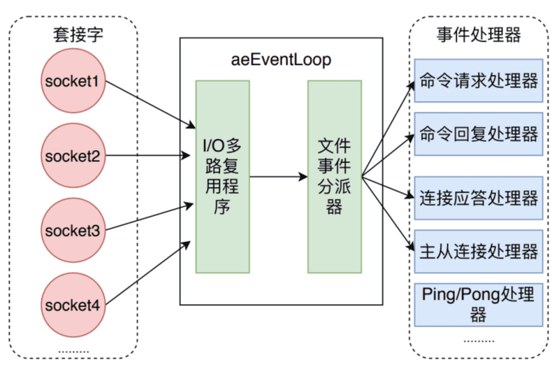
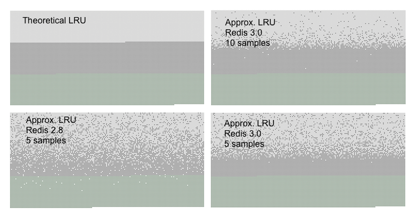
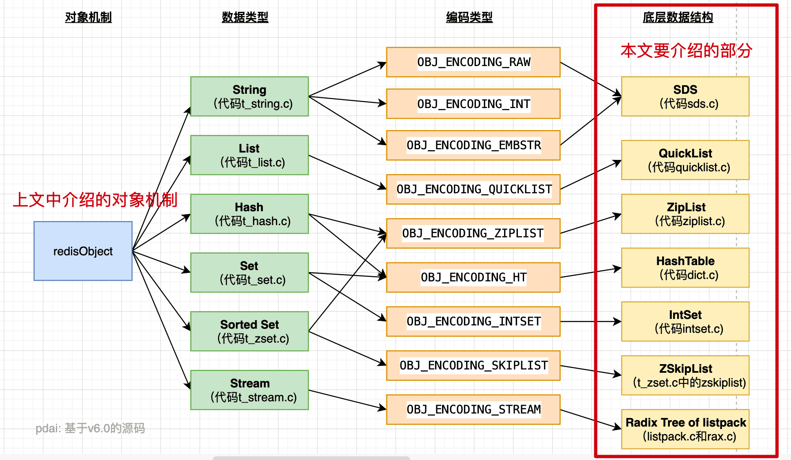
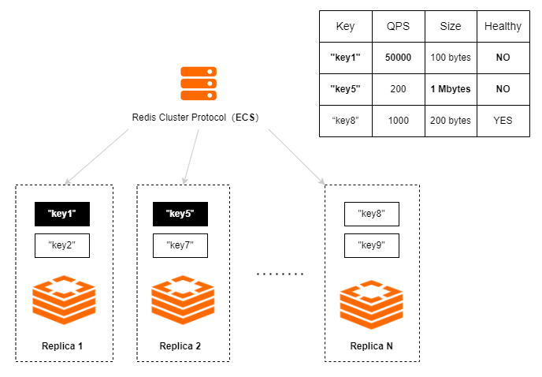
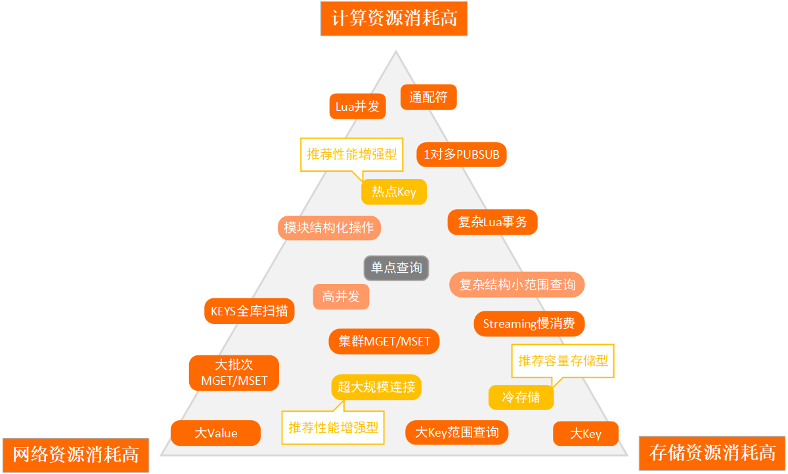
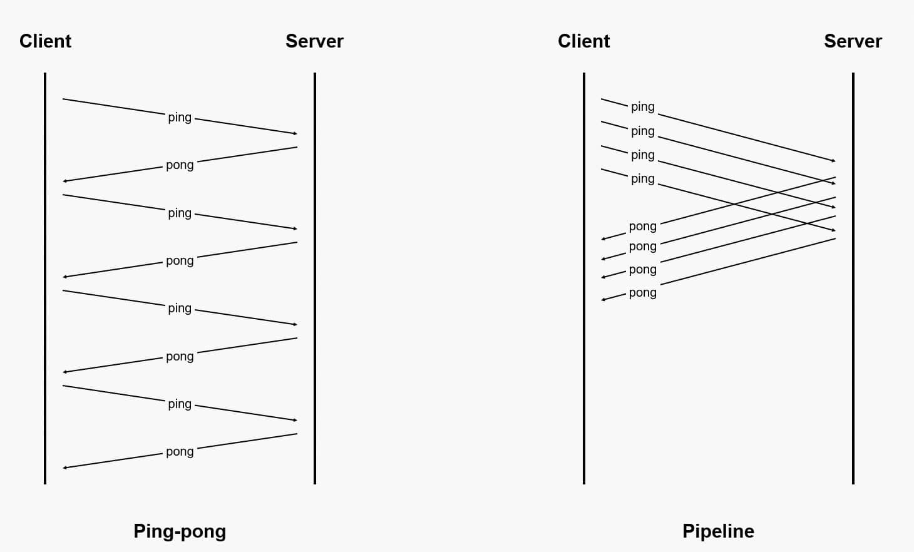

| 版本 | 内容         | 时间                |
| ---- | ------------ | ------------------- |
| V1   | 新建         | 2023-12-27 23:34:57 |
| V2   | 更新部分文案 | 2025-04-20 19:41:26 |

 [[toc]]

## Redis 为什么这么快？（重要）

Redis 是一款基于内存的高性能键值对数据库，其速度快主要归因于以下几个方面：

- **纯内存存储**

  Redis 绝大多数数据常驻内存，内存随机读写为纳秒级，远快于磁盘毫秒级 IO，天然规避了磁盘寻道、块加载带来的性能损耗；持久化落盘操作异步后台执行，不阻塞正常读写请求。

- **高效的数据结构**

  Redis 支持多种数据结构，如字符串、哈希、列表、集合和有序集合等。这些数据结构都经过了精心设计和优化，以提高内存利用率和操作效率。

- **命令执行单线程 + IO 多路复用事件驱动模型（核心）**

  Redis 执行命令逻辑为单线程串行处理，规避了多线程上下文切换、互斥锁竞争的额外开销；单线程天然保证**单条命令执行原子性**，代码实现简洁。

  注意：仅命令解析与执行主线程单线程，持久化、异步大键删除、集群同步等耗时操作由额外子线程 / 子进程异步执行。

  同时采用 epoll/kqueue IO 多路复用 + 非阻塞 IO，单个线程可同时监听海量客户端 Socket 连接，不会因单个连接阻塞整体服务。Redis 性能瓶颈通常在网络 IO，而非 CPU。

- **轻量化 RESP 私有通信协议**

  协议二进制安全、格式简单规整，服务端解析成本极低，客户端不用复杂序列化 / 反序列化，按分隔符拆分即可读取参数；相比 HTTP 冗余头部，网络数据包更小，减少多次网络往返 RTT 耗时。

- **数据持久化策略**：

  提供 RDB、AOF 两种持久化方案保障落地可靠性，且均不会阻塞命令主线程：

  - RDB：调用 fork 创建子进程生成磁盘快照，依托写时复制 COW 机制，主线程继续正常处理请求；
  - AOF：主线程仅把写入命令追加到内存缓冲区，后台线程异步刷写到磁盘。

## Redis 的事件模型（ 重要）

Redis 使用 I/O 多路复用技术同时监听多个套接字的状态变化。常见的 I/O 多路复用模型有 `select`、`poll`、`epoll`（Linux）、`kqueue`（BSD）等。Redis 会自动根据操作系统适配最优实现，Linux 下默认使用 `epoll`。Netty 同样基于 IO 多路复用，但 Netty 是多线程 Reactor 架构，

文件事件处理器由四部分构成：套接字、I/O 多路复用程序、文件事件分派器、事件处理器。



文件事件是套接字操作的抽象，当一个套接字就绪，可执行 `accept`、`read`、`write`、`close` 操作时，就会触发对应的文件事件。Redis 同时维护大量客户端连接，同一时刻会并发产生多个就绪文件事件。

I/O 多路复用程序负责批量监听多个套接字，把已经就绪的套接字列表交付给文件事件分派器。

即便多个文件事件同时就绪，I/O 多路复用只会返回就绪 fd 集合，由分派器放入内部事件队列；后续**以同步、有序、逐个串行的方式处理队列里的就绪事件**。

文件事件分派器以及后续的命令解析、执行、结果回写全程由同一个主线程处理

## Redis 线程模型（重要）

>  https://zhuanlan.zhihu.com/p/639750217 说的非常好

日常开发里常说「Redis 是单线程」，这句话**并不严谨**，它特指：**Redis 执行数据读写命令的核心逻辑，始终只有一条主线程串行执行**；

但 Redis 整体进程是多线程混合架构，只是多线程只分担网络 IO、后台慢速任务，绝不并行执行命令。

---

**一、Redis 6.0 之前（2.x~5.x）：单线程网络模型 + BIO 后台多线程 + Fork 子进程**

整体架构：**主线程独占网络 IO + 命令执行，慢速任务异步剥离**

**1）主线程（事件循环 EventLoop）完整职责**

- IO 多路复用（epoll/kqueue）监听全部客户端 Socket：新连接、读请求、可写响应事件；
- 同步读取 Socket 缓冲区数据、解析 Redis 协议；
- **串行逐条执行所有读写命令（GET/SET/HGET 等）**；
- 把执行结果写入输出缓冲区，同步回写给客户端；
- 执行内部定时周期任务：过期 Key 抽样删除、哈希表渐进式 rehash、集群 Gossip 心跳、持久化触发判断等。

> 核心特点：一条耗时命令（`KEYS`、`HGETALL`、超大`DEL`）会阻塞整个事件循环，所有后续请求排队等待。

**2）BIO 固定后台线程池（很早就存在，非 4.0 新增）**

Redis 很早内置 3 条独立后台线程，专门处理会阻塞磁盘 IO 的慢速操作，完全不占用主线程：

1. `BIO_AOF_FSYNC`：AOF 日志刷盘 fsync 操作，避免同步刷盘阻塞主线程；
2. `BIO_CLOSE_FILE`：大文件异步关闭；
3. `BIO_LAZY_FREE`：内存异步释放。

**3）Redis 4.0 对后台线程的能力增强**

4.0 只是扩展了 BIO 惰性释放线程的能力，新增异步删除机制：

- 同步`DEL`删除超大集合（百万元素 Hash/List）时，同步遍历释放内存，会长时间阻塞主线程；
- 新增`UNLINK`、`FLUSHDB ASYNC`、`FLUSHALL ASYNC`异步命令：仅在主线程把 Key 从全局键空间移除，回收内存的真实操作丢给`BIO_LAZY_FREE`后台线程执行，彻底规避阻塞。

**4）Fork 独立子进程（不属于线程，独立进程）**

RDB 快照、AOF 重写通过`fork()`创建子进程，依靠 COW 写时复制机制拷贝内存快照，父子进程内存隔离，不会阻塞主线程，和线程池是两套异步方案。

---

**二、Redis 6.0 及更高版本：IO 多线程网络模型 + BIO 后台多线程**

**关键红线（必考点）**

6.0 新增的**IO 多线程仅做网络层并行处理，命令执行逻辑依然 100% 留在主线程串行执行**，没有任何并发数据修改，依旧天然线程安全，不需要加锁。

**任务完整拆分**

1. **IO 子线程池（可手动配置线程数）**

   **并行处理纯网络操作：Socket 数据读取、Redis 协议解析、响应报文打包组装、结果回写 Socket；**

   只是把 CPU 密集的网络编解码操作从主线程剥离，多核 CPU 可以分摊网络压力。

2. **主线程不变**

   只做一件核心事：接收 IO 线程解析完毕的完整命令，排队串行执行；执行完再把结果交回 IO 线程批量回写给客户端。

**开启方式**

```
io-threads 4                # 建议设置为CPU物理核数，不超过8
io-threads-do-reads yes     # 开启读请求多线程并行
```

> 总结：
>
> 大家常说的 Redis「单线程」，特指**命令执行逻辑永远单线程串行执行**；6.0 之前全程网络 IO 都由主线程处理，依靠 BIO 后台线程异步处理刷盘、大 key 内存释放等慢速任务；6.0 新增 IO 多线程仅分担 Socket 收发和协议解析，绝不并行执行命令，全程天然线程安全。

## 布隆过滤器

### 前置基础结构

布隆过滤器由两部分组成：

1. **位数组（Bit Array / Bit Vector）**

   一段连续的二进制空间，每一位只有 `0` 和 `1` 两种状态，**初始全部为 0**。

   假设数组长度为 `m`，下标范围：`0 ~ m-1`。

   > 特点：极致省内存，1 字节 = 8 个 bit 位。

2. **k 个相互独立的哈希函数**

   作用：把任意输入元素（字符串、数字、ID）**均匀映射到位数组的不同下标**。

   要求：哈希算法分散性好、冲突低、计算快。

### 插入元素完整流程（核心步骤）

以「向布隆过滤器插入一个元素 `x`」为例，设哈希函数数量 `k=3`。

1. 把元素 `x` 依次送入 **3 个不同哈希函数**，得到 3 个下标，哈希结果会对数组长度 `m` 取模，保证下标落在 `[0, m-1]` 范围内
2. 将这 **3 个下标对应的 bit 位，全部置为 1**
   - 原来是 0 → 改成 1
   - 原来已经是 1 → 保持 1 不变

> 关键现象：**多个元素会共用同一个 bit 位，这是后续**误判**的根源。

### 查询元素完整流程

查询逻辑和插入**完全对称**，依旧使用同样 `k` 个哈希函数。

步骤

1. 对待查询元素 `y`，用同样 `k` 个哈希函数算出 `k` 个下标。

2. 逐个检查对应 bit 位：

   - 规则 1：只要有任意一位是 0

     → 结论：该元素一定不存在（百分百准确，无漏判）

   - 规则 2：所有位全是 1

     → 结论：该元素可能存在（但无法 100% 保证）

### 两大核心特性原理

**1）为什么「不存在」的判断绝对可靠（无漏判）**

反证法理解：如果一个元素**真的被插入过**，那么它对应的 `k` 个 bit 位**必然全部被置为 1**。

反过来：如果查询时发现**有一个 bit 是 0**，说明这个元素从来没有被插入过。

👉 所以：**判断不存在 = 100% 正确**。

---

**2）为什么会出现「误判（假阳性）」**

根本原因：**bit 位是多元素共享的**。某个未插入的元素，它命中的所有 bit 位，刚好被**其他多个元素**分别置为 1，布隆过滤器无法区分：这些 1 是来自当前元素，还是其他元素。

👉 所以：**判断存在 ≠ 一定存在**。

---

**3）原生布隆过滤器「为什么不支持删除元素」**

这是高频考点，原理很简单：假设要删除元素 A，它占用下标 2、5、7。

如果直接把这三位改成 0：

- 下标 5 同时被元素 B 共用
- 第 5 位一旦置 0 → 再查询 B 时，会误判 **B 不存在**

结论：**一个 bit 位归属多个元素，改 0 会牵连其他元素，因此原生布隆过滤器禁止删除。**

### 优缺点

优点

1. **占用空间极小**，远低于哈希表、集合；
2. **插入、查询时间复杂度均为 O (k)**（`k` 为哈希函数个数，常数级，速度极快）；
3. 适合海量数据场景做快速过滤。

缺点

1. 存在**误判率**，无法精准判定 “一定存在”；
2. 原生布隆过滤器**不能删除元素**；
3. 元素数量超过预期容量后，误判率会急剧上升。

## 计数布隆过滤器

**一、为什么需要计数布隆过滤器？**

回顾标准布隆过滤器（Standard BF）的致命缺陷：

1. 底层是**二进制位（1 bit）**，只有 `0 / 1` 两种状态；
2. 多个元素的哈希下标会**共享同一个 bit 位**；
3. 若直接把某一位从 `1` 改回 `0`，会误伤其他同样映射到该位置的元素，引发**假阴性**（元素实际存在，却判定为不存在）。

**计数布隆过滤器的核心改造**：

把原本的「1 个二进制位」替换为**小型计数器（Counter）**，用**计数增减**替代「位翻转」，实现安全删除。

---

**二、底层数据结构**

**1）基础组成：和标准 BF 一致，由两部分构成：**

- **计数器数组**

  不再是 `bit array`，而是连续的**计数器数组**。

  - 每个位置存放一个整数计数器；
  - 工程上常用：**4 bit 计数器**（取值 0~15）、**8 bit 计数器**（取值 0~255）；
  - 数组长度仍记为 m（计数器总个数）。

- **k 个独立哈希函数**

  作用、选型、数量计算规则 **和标准布隆过滤器完全一致**。

**2）内存对比（直观感受）**

以同样容量、误判率为例：

- 标准 BF：**1 bit / 位置**
- 4bit 计数 BF：**4 bit / 位置**（内存扩大 4 倍）
- 8bit 计数 BF：**8 bit / 位置**（内存扩大 8 倍）

> 核心取舍：**用额外内存换取「删除能力」**。

**三、核心逻辑**

**1）插入元素（Add / Put）**

**流程**

- 使用 k 个哈希函数，计算出元素对应的 k 个数组下标；
- 对每个下标对应的**计数器执行 +1 操作**；
- 做简单防溢出保护（计数器达到最大值时不再累加）。

**2）查询元素（Contains / MightContain）**

查询逻辑和标准 BF **几乎一致**，仅判断条件改变：

**流程**

1. 对目标元素计算出 k 个哈希下标；
2. 依次检查每个下标对应的计数器：
   - 任意一个计数器 = 0 → **元素一定不存在**（无假阴性，100% 准确）；
   - 所有计数器 > 0 → **元素可能存在**（存在假阳性 / 误判）。

**3）删除元素（Remove / Delete）【核心能力】**

这是 CBF 区别于标准 BF 的关键操作。

**流程**

1. 对待删除元素计算出 k 个哈希下标；
2. 遍历每个下标：**计数器 > 0 时执行 -1**，禁止计数器变为负数；
3. 删除完成。

---

优点

1. **支持安全删除**，弥补了标准 BF 最大短板；
2. 保留 BF 高吞吐、低延迟、空间紧凑的优势；
3. 误判率可控，参数体系和标准 BF 完全兼容，学习、迁移成本低；
4. 实现简单，易于编码、维护。

缺点

1. **内存开销上涨**：相比标准 BF 增加 4~8 倍内存；
2. 存在**计数器溢出风险**，极端场景会产生假阴性；
3. 依然存在**假阳性误判**，不能完全替代精确集合（Set、Map）；
4. 同样**不支持元素遍历、元素个数精确统计**。

## 布谷鸟过滤器

### 布谷鸟过滤器的结构

整个过滤器 = **很多个「桶」排成一排**

1. 桶 Bucket

- 每一个**桶**，里面固定放 **4 个小格子（槽位）**（行业默认 4 格，记住这个数）

- 每个格子里，不放完整数据，只存一段

  短摘要（指纹）

  > 类比：人不用存全身，只存「指纹」就能区分，这里也是同理。

举个极简例子：

假设一共 **5 个桶**，每个桶 4 格，初始全空：

```
桶0：[空] [空] [空] [空]
桶1：[空] [空] [空] [空]
桶2：[空] [空] [空] [空]
桶3：[空] [空] [空] [空]
桶4：[空] [空] [空] [空]
```

2. 两个固定规则（超级关键）

任意一个元素，经过计算，**只会对应到两个桶**，不会多、不会少。

记死：

> 任何元素 → 永远只有 **候选桶 A、候选桶 B** 两个位置可以放。

这是和布隆过滤器最大的区别：

- 布隆：一个元素对应 `k` 个位置（3~9 个）
- 布谷鸟：一个元素**永远只对应 2 个桶**

### 三个核心动作：插入、查询、删除

**1）场景 1：插入元素**

目标：把一个元素的「指纹」放进它对应的**两个桶之一**。

**步骤 1：算位置**

来了元素 X

1. 算出 X 的**指纹**（一小段数字 / 二进制）
2. 算出 X 专属的 **桶 1、桶 2**（只有这两个桶能放它）

**情况一：两个桶里有空位 → 直接放进去**

示例：

X 对应 桶 1、桶 3

- 桶 1 有空位置 → 随便找一个空格子，把 X 的指纹放进去。

结束，插入成功。

**情况二：其中一个桶满了，另一个有空 → 放进有空的桶**

X 对应 桶 1、桶 3

- 桶 1 4 个格子全满
- 桶 3 还有空位 → 直接放进桶 3。

结束，插入成功。

**情况三：两个桶全都满了（布谷鸟名字由来）**

这是最特殊的场景：

X 对应 桶 1、桶 3，**两个桶 4 个格子全部占满**，没地方放。布谷鸟的做法：**踢走一个旧指纹，腾位置**

1. 在 `桶1 / 桶3` 里，随便挑一个已经存在的指纹 Y
2. 把 Y 从格子里**踢出去**，把 X 放进来
3. 现在 Y 被踢走了，它也要找自己的两个专属桶，重复上面逻辑：
   - Y 的两个桶有没有空位？有就放；
   - 也满了？再踢别人……

最多重试几十次，还塞不进去 → 整个过滤器太满了，插入失败。

> 通俗理解：
>
> 房间全满了，你强行进来，就随机赶一个人出去；被赶的人再去找自己另外一个房间，循环往复。
>
> 这就是「布谷鸟占巢」的由来。

---

**场景 2：查询元素**

判断「元素在不在」，逻辑非常简单：

1. 算出当前元素的 **指纹** + 专属两个桶（桶 A、桶 B）

2. 只查这

   两个桶

   里的所有格子：

   - 两个桶里 **找到了一模一样的指纹** → 判定：**大概率存在**（可能误判）
   - 两个桶 **全都没有** → 判定：**一定不存在**（绝对准确）

✅ 特点：只查 2 个桶，每个桶最多 4 格，一共最多查 8 个位置，**速度极快**。

---

**场景 3：删除元素**

布隆过滤器不能删，计数布隆可以删但费内存，布谷鸟删起来又简单又安全：

1. 算出元素的 **指纹** + 专属两个桶
2. 在这两个桶里，逐个格子找匹配的指纹
3. **找到就直接清空这个格子**，删除完成

为什么不会误伤别人？

- 每个元素只属于**两个固定桶**，你只删这两个桶里对应的指纹；
- 别的元素有自己专属的两个桶，互不干扰。

👉 结论：**原生支持安全删除，不会删错别人**。

## 缓存穿透、缓存击穿、缓存雪崩（重要）

### 缓存穿透

**定义**：客户端查询缓存、数据库中都不存在的数据，缓存永远无法命中，请求全部直达数据库。恶意攻击者批量用非法不存在 ID 高频查询，极易压垮 DB。

**触发场景**：非法参数、随机不存在业务主键。

**解决方案**：

1. **参数前置校验**

   网关 / 接口层校验 ID 合法性，拦截负数、非数字、超长无意义随机参数，低成本拦截大部分非法请求。

2. **缓存空值**

   DB 查询不到数据时，向 Redis 存入空标识并设置很短的过期时间（几分钟级别）。后续相同请求直接命中缓存，不再访问 DB。

   缺点：会产生大量无效空 key，占用 Redis 内存，需控制 TTL 时长。

3. **布隆过滤器**

   将所有合法业务主键提前存入布隆过滤器 bitmap。查询前先校验，过滤器判定不存在则直接拦截；判定存在再放行查询缓存与 DB。

   缺点：存在极小误判率（不存在的 key 可能误放行），不支持元素删除，适合数据基本不删除的场景。

### 缓存击穿

**缓存击穿**：缓存击穿是指一个热点 key 在缓存中过期的瞬间，有大量的并发请求同时访问该 key。由于缓存中已经没有该 key 的数据，这些请求会直接访问数据库，从而给数据库带来巨大的压力。

**触发场景**：单个热点商品、秒杀爆款 Key 过期。

**解决方案**：

1. **热点 key 永不过期**

   不设置 expire 过期时间，业务代码主动定时更新缓存，从根源杜绝过期。

2. **互斥分布式锁**

   同一时刻只允许一个线程去查询 DB 并更新缓存；其余线程等待短暂重试或直接重试读缓存。

   注意：分布式场景不能使用 JVM 本地锁，需使用 Redis 分布式锁；缺点是并发请求串行排队，吞吐量下降。

3. **逻辑过期方案**

   key 物理永不过期，value 内额外存储逻辑过期时间；线程检测到逻辑过期，异步开启独立线程更新缓存，当前请求直接返回旧数据，无阻塞，适合高并发热点场景。

### 缓存雪崩

**定义**：两类场景都会引发雪崩：

① 大批量 key 同一时刻集中过期，缓存大面积失效；

② Redis 集群整体宕机、无法提供服务。

海量请求绕过缓存直达 DB，造成数据库 CPU、连接数打满，服务雪崩。

**解决方案**：

- 针对大量缓存同时过期：
  - **分散过期时间**：
  
    过期时间打散，在固定基础过期时间上叠加合理随机偏移值（例如 1 小时 ±10 分钟），错开批量过期时间，规避同一时刻大批量 key 失效。
  
- 针对缓存服务器故障
  - **缓存集群高可用**：
  
    主从复制 + 哨兵 Sentinel 实现故障自动转移；Redis Cluster 分片集群，部分节点故障不影响整体服务，避免 Redis 整体宕机。该方案只能解决 Redis 宕机问题，无法解决批量 key 过期。
  
  - **多级缓存兜底**
    
    应用本地内存缓存（Caffeine） + Redis 二级缓存，Redis 故障时直接读取本地缓存，流量不会全部打入 DB。
    
  - **熔断与限流**：
    
    - 引入熔断机制，当缓存服务器故障导致大量请求涌向数据库时，自动切断部分请求，避免数据库被压垮。例如，使用 Hystrix 等熔断框架，当数据库的请求错误率达到一定阈值时，触发熔断，返回预设的默认值。
    - 同时，进行限流操作，对访问数据库的请求进行速率限制。可以使用令牌桶算法或漏桶算法实现限流。例如，使用 Google Guava 的 `RateLimiter` 进行限流：

## 数据库和缓存的一致性问题（重要）

不一致产生原因：

- <font color='purple'>更新执行顺序不同</font>：

  并发环境下，更新数据库、操作缓存的先后顺序不一样，会直接出现数据错乱。

  不建议同步更新缓存：多线程连续写库后同步更新缓存，后执行的旧值会覆盖新缓存值，天然脏数据；

  无论哪种顺序，只要两步操作无法原子执行，就存在不一致风险。

- <font color='purple'>并发读写交织</font>：

  读、写线程并行执行，写线程更新完数据库，但缓存还未处理；读线程此时命中旧缓存，或缓存失效后加载旧数据回填缓存，造成缓存长期脏数据。


**<font color='purple'>不一致产生的原因</font>**

并发场景下，无论是先删除缓存再更新数据库，还是先更新数据库再删除缓存，都可能导致数据不一致。

- **先删缓存，再更新库**：

  删除缓存后、数据库更新事务未提交完成，读请求缓存未命中，查询到 DB 旧数据并重新写入缓存。后续缓存永久留存旧脏数据，一致性问题概率极高。
- **先写库，再删缓存**：

  缺陷分两类场景：

  （1）故障场景：数据库更新成功，线程在删除缓存前宕机，缓存残留旧数据；

  （2）正常并发场景：极低概率出现脏数据（后文详解）。


**<font color='purple'>常见解决方案及流程</font>**

- 读操作：先查 Redis，命中直接返回；未命中查询 DB，回写 Redis 后返回。

- 写操作：**先更新数据库，数据库事务提交成功后，再删除对应缓存 Key**。

> Facebook Memcache 大规模线上采用该方案。


**<font color='purple'>为什么是删除缓存而不是更新缓存</font>**

这种**先更新数据库再删除缓存的策略被广泛使用**，如 Facebook 在论文《Scaling Memcache at Facebook》中也采用了该策略。

多个写请求并发执行时，如果同步更新缓存：线程 A 更新库为旧值、线程 B 更新库为新值；但网络时序导致 A 后更新缓存，旧值覆盖新值，缓存永久错乱。

删除缓存无覆盖风险，下一次查询自动从 DB 拉取最新数据写入缓存。


**<font color='purple'>潜在并发问题及发生概率</font>**

即便采用上述策略，仍存在一定的并发问题。

时序：

1. 读请求缓存未命中，发起查询 DB（慢查询，耗时很长）；
2. 写请求完成数据库更新，并成功删除缓存；
3. 慢读请求拿到之前查询到的旧 DB 数据，回填到 Redis。

最终缓存存入旧脏数据。

不过，这种情况在实际中发生的**概率极低**。因为数据库的**写操作通常比读操作慢很多**，且写操作可能需要锁表。正常业务中，

- 单行 SELECT 读数据库速度远快于带事务的 UPDATE 写库操作；
- 想要触发该异常，必须满足：读 DB 耗时 > 写 DB + 删除缓存总耗时，条件苛刻。

仅超大结果集慢查询才有可能触发，线上概率极低。


**<font color='purple'>兜底保障方案</font>**

**给所有缓存 Key 设置合理过期 TTL；极端情况产生脏数据，超时自动失效，最终自动恢复一致；**

想要强一致性：延时双删、消息队列异步删缓存、Canal 监听 binlog 异步更新缓存；

极致强一致：分布式事务（2PC/TCC），性能损耗大，缓存场景极少使用。


> Facebook 的论文《[Scaling Memcache at Facebook在新窗口打开](https://www.usenix.org/system/files/conference/nsdi13/nsdi13-final170_update.pdf)》也使用了这个策略。为什么不是写完数据库后更新缓存？你可以看一下Quora上的这个问答《[Why does Facebook use delete to remove the key-value pair in Memcached instead of updating the Memcached during write request to the backend?在新窗口打开](https://www.quora.com/Why-does-Facebook-use-delete-to-remove-the-key-value-pair-in-Memcached-instead-of-updating-the-Memcached-during-write-request-to-the-backend)》，主要是怕两个并发的写操作导致脏数据。
>
> 所以，要么通过 2PC 或是 Paxos 协议保证一致性，要么就是拼命的降低并发时脏数据的概率，而 Facebook 使用了这个降低概率的玩法，因为 2PC 太慢，而 Paxos 太复杂。当然，**最好还是为缓存设置上过期时间**。

## Redis 的键的过期删除策略（ 重要）

### Redis 的键的过期删除策略

redis 采用的是**定期删除 + 惰性删除**策略。

- **<font color='purple'>惰性删除</font>**：当客户端尝试访问某个键时，Redis 会检查该键是否过期。如果过期，就删除该键并返回空结果；若未过期，则正常返回键的值。

  - **优点**：只有访问键时才做过期校验，无全局轮询扫描，CPU 开销极低。
  - **缺点**：长期无人访问的过期冷 key 永远不会被清理，持续占用内存。

- **<font color='purple'>定期抽样删除</font>**：由配置参数 `hz` 控制扫描频次，默认 `hz 10`，每秒执行 10 轮过期检测，每轮间隔 100ms；每一轮从带过期时间的键库中抽样扫描过期键并删除。

  机制做了保护限制：分批遍历、单次扫描有最大执行时长上限，不会长时间阻塞主线程。

  - **优点**：主动批量清理一部分过期键，缓解惰性删除的内存堆积问题，在 CPU 消耗与内存占用之间做到平衡。
  - **缺点**：抽样机制必然存在遗漏，部分过期 key 始终无法被扫描到。

  > 另外开启 lazyfree 异步删除后的变化（Redis4.0+）
  >
  > 即便主线程还是要遍历、判定 key 过期、把 key 从哈希表摘除；
  >
  > 但**真正释放大 key 内存**的操作丢到后台 BIO 线程异步执行。
  >
  > 主线程耗时大幅缩短，哪怕过期大 key 极多，阻塞也被极大缓解。


**惰性删除**：只在访问时检查，无任何后台调度开销，CPU 几乎零损耗；

**定期抽样删除**：固定频次分批抽样，单次扫描强制最长 25ms 时间上限，可控、可限流，不会无限阻塞主线程；

二者组合，用极小 CPU 损耗换取可控的少量过期键内存残留；

残留的冷过期键，最后由 `maxmemory` 内存淘汰策略兜底清理，完美闭环。

### 定期删除+惰性删除有什么问题？

<font color='purple'>内存占用问题</font>

- **过期键无法被及时清理，持续占用内存：**

  定期删除只是抽样抽查一部分过期键，必然有部分过期 key 侥幸没被扫描到；惰性删除只有客户端主动访问该 key 时，才会校验并删除过期键。

  长期无人访问的冷过期键，两种策略都不会主动回收，不断堆积占用 Redis 内存，造成内存浪费。

> 补充：正因为该缺陷，Redis 必须配套 `maxmemory` 内存淘汰策略兜底，内存打满后主动剔除过期 / 冷数据。

<font color='purple'>数据一致性问题</font>

- **主从复制场景**：

  该过期删除策略本身不会造成主从不一致：过期键仅主节点执行定期 / 惰性删除，删除后会同步 DEL 命令到从节点；从节点只做数据副本，不会主动执行过期删除逻辑。

  从节点读到过期未删 key，是主从同步时延导致，并非删除策略本身缺陷。

<font color='purple'>性能影响问题</font>

- **定期删除的 CPU 开销**：

  定期删除有执行时长上限，不会阻塞主线程、暂停业务服务，但过期键数量巨大时，每个周期都要扫描大量 key，持续占用 CPU；扫描频率过高会挤占正常命令处理算力，频率过低又会堆积更多过期键。

- **惰性删除的延迟问题**：惰性删除仅在 key 被访问时触发过期检查。如果客户端使用 MGET 等批量命令一次性传入上千个独立过期 key，Redis 会在主线程中逐个校验并同步删除这些 key，操作耗时叠加会造成当前这条批量命令延迟；但 Redis 不会主动扫描并清理服务内其他未被本次请求指定的过期键。


### 为什么不用定时删除策略?

为每一个设置了过期时间的 key，单独创建一个定时器；key 到期瞬间，定时器触发，主线程立刻删除该键。

理论上：过期键能被即时清理，内存无残留，不用依赖访问触发。

- **海量 Key 下，大量定时器极度消耗 CPU**

  如果 Redis 存有几十上百万带过期时间的 key，就要维护同等数量的定时器。操作系统内核维护海量定时器、频繁触发回调，内核调度压力巨大，CPU 占用飙升。Redis 是单线程高性能模型，根本扛不住这种高频调度开销。

- **定时器任务跑在主线程，会频繁阻塞命令执行**

  所有过期删除操作都在 Redis 主线程执行，大量 key 集中同时过期时，定时器批量触发删除，主线程持续被占用，正常客户端命令排队严重，请求大面积超时，直接引发性能毛刺甚至雪崩。

- **内存开销巨大**

  每个定时器都要有独立结构体存储、内核句柄；海量 key 场景下，定时器元数据本身就要占用可观内存，得不偿失。Redis 主打内存数据库，不能额外无谓消耗内存。

- **过期集中释放带来瞬时 IO / 内存抖动**

  大批量 key 同一时刻到期，同步批量释放内存，操作系统内存回收、页表操作瞬间压力拉满，容易出现阶段性性能抖动。


### 在持久化时遇到了过期的缓存会发生什么？

<font color='purple'>RDB模式</font>

**1）RDB 生成（BGSAVE/SAVE）**

遍历内存所有 key，**主动校验过期时间**：已经过期、还没被惰性 / 定期删除的 key，**直接跳过，不会写入 RDB 快照**。

结论：RDB 文件里永远不会留存过期键，快照体积干净。

**2）Redis 重启加载 RDB**

- 主节点模式

  载入每一条 key 时再次校验时间戳，过期 key 直接丢弃，不加载进内存。

- 从节点模式

  不会做过期校验，不管是否过期全部加载；但后续主从全量同步会清空从库数据，这批过期数据很快被覆盖，无长期影响。


<font color='purple'>AOF模式</font>

场景 1：普通 AOF 追加（append 模式，实时写命令）

1. key 过期了，但还没触发惰性 / 定期删除：

   没有任何写命令产生，不会往 AOF 新增任何内容，旧的 SET/EXPIRE 命令依旧留在 AOF 里。

2. 后续访问触发惰性删除 / 定期删除清理了过期 key：

   Redis 会主动向 AOF 追加一条 DEL key 命令。

   后续用这份 AOF 恢复时，回放完写入命令再执行 DEL，最终该 key 消失，不会残留过期数据。

> 弊端：旧 AOF 会堆积大量冗余命令（SET+EXPIRE+DEL），文件持续膨胀。

场景 2：AOF 重写 BGREWRITEAOF

重写不走原有 AOF 日志，直接遍历当前内存实时状态重建命令集；

遍历过程中过滤掉所有已过期 key，**新生成的重写后 AOF 不会包含过期键**，直接瘦身清理冗余过期数据。


### 主从服务对过期键的处理的不同处

**只有主节点真正执行过期键删除（惰性删除、定期删除）；从节点只做过期时间判断，绝不主动删除任何 key**。

**主节点**

- 定期删除：后台轮询抽样扫描，过期 key 直接同步删除；
- 惰性删除：客户端访问 key 时校验过期，当场删除该 key；
- 只要主节点删掉过期 key，会生成一条 `DEL` 命令，异步同步给所有从节点。

**从节点**：从节点不会运行定期删除任务，也不会触发惰性删除：

- 客户端读从节点某个已过期但未收到主节点 DEL 同步的 key；
- 从节点会对比本机系统时间和 key 的过期时间戳，识别出该 key 已经过期，但**不会本地执行 DEL 删除**；
- 依然把过期的旧数据正常返回给调用方，直到收到主节点下发的 DEL 指令，才会删掉这条数据。


**为什么从节点不能主动删过期 key？**

1. 主从复制是命令同步机制，如果从节点私自删 key，主从数据集立刻不一致；
2. 多从节点各自时钟存在微小偏差，各从库自行判定过期删除，不同从库数据不一样，后续同步无法修复；
3. 统一由主节点掌控删除逻辑，再同步 DEL，保证所有副本数据完全一致。

## Redis 内存淘汰策略（ 重要）

| 淘汰策略        | 规则说明                                                     |
| --------------- | ------------------------------------------------------------ |
| volatile-lru    | 候选池：仅**设置过过期时间**的 Key；<br>采用近似 LRU，淘汰最近最少访问的键，Redis 会维护键最近一次访问时间戳。 |
| volatile-lfu    | 候选池：仅设置过过期时间的 Key；<br/>近似 LFU 算法，淘汰访问频次最低的键，自动做访问热度衰减。 |
| volatile-ttl    | 候选池：仅设置过过期时间的 Key；<br/>优先淘汰剩余 TTL 时间最短、快要过期的键。 |
| volatile-random | 候选池：仅设置过过期时间的 Key；<br/>随机挑选键删除。        |
| allkeys-lru     | 候选池：**所有 Key（无论是否配置过期时间）**；<br/>近似 LRU 淘汰最少使用的键。 |
| allkeys-lfu     | 候选池：所有 Key；<br/>近似 LFU 淘汰访问频率最低的键。       |
| allkeys-random  | 候选池：所有 Key；<br/>随机删除任意键。                      |
| noeviction      | 不淘汰任何键；<br/>内存触达 maxmemory 上限后，**写操作直接返回 OOM 错误，读命令正常执行**。 |

你们是怎么选的？

实例 A：只存**永久无 TTL 持久化数据**（配置、基础字典、核心固定数据，绝不允许被淘汰）

实例 B：只存**带 TTL 临时缓存数据**（热点缓存、接口临时数据、验证码、token 等，允许内存淘汰）


一、实例 A：纯无 TTL 永久数据实例（存储型，不是缓存）

选型：`noeviction`

完整理由

1. 该实例所有 key 都没设置过期时间，所有 `volatile-*` 策略的候选淘汰池是空的，内存打满后没有任何 key 可以驱逐，最终行为等价于 `noeviction`；
2. 这些是业务核心固定数据，绝对不能被 Redis 自动删除，一旦丢失会造成业务异常；
3. 内存触达 maxmemory 上限后，拒绝所有写入指令、返回 OOM 错误，能及时告警，方便运维扩容内存 / 分片，不会悄无声息丢数据。

配套运维建议

1. 单独监控内存使用率，接近阈值提前扩容，不要等着写报错；
2. 严禁往这个实例写入带 TTL 的临时缓存数据；
3. 不要用 `allkeys-lru`：哪怕是永久配置 key，长期没人访问依然会被 LRU 淘汰，引发线上故障。


二、实例 B：纯带 TTL 缓存实例（缓存业务）

最优选型：`volatile-lru`

为什么不选 allkeys 系列？

这个实例里**全部 key 都设置了过期时间**，不存在永久常驻 key；

`volatile-lru` 限定只在这批带 TTL 的缓存里做 LRU 淘汰，天然贴合你的架构隔离设计。

补充优缺点

✅ 优点：

1. 严格限定只操作缓存数据，不会误触及任何永久业务数据；
2. 热点缓存持续访问不会被淘汰，冷缓存逐步释放内存，命中率高；
3. 架构语义对齐：本来就是专门放 TTL 缓存的节点，策略语义清晰。

⚠️ 唯一风险与规避方案

极端场景：该实例内所有带 TTL 的 key 全是热点，无冷 key 可淘汰，内存占满后写入报错。

规避手段：

1. 合理设置单个 key 的 TTL，让缓存自然过期释放内存；
2. 监控内存水位，提前扩容分片；
3. 备选降级方案：改用 `volatile-lfu`，抗瞬时批量读取扰动，稳定性更强。


<font color='purple'>什么时候用 allkeys-lru？</font>

- 如果预计访问请求的特性呈现幂律分布，也就是说预计只有一部分元素会被频繁访问，而其余元素则很少被访问。使用 <font color='purple'>**allkeys-lru**</font> 策略是一个不错的选择。如果不确定该选择哪种策略，<font color='purple'>**allkeys-lru**</font> 也是一个很好的备选方案。

## Redis 的 LRU 算法（ 重要）

### 如果要你设计一个 LRU 算法你需要考虑什么问题（leetcode 有题）

考虑点，LRU 是最近最少使用，每次使用要把数据放到最前面

- **时间复杂度硬性约束**：`get`、`put` 操作要求 **O(1)**
- 每次 get 时需要将访问的节点提前至队首
- 每次 put 需要判断队列是否已满，满了则将最后的节点删除，并且将该节点放至队首，不满则直接放队首


✅ 标准组合：

哈希表 HashMap + 双向链表

- HashMap：key 映射链表节点，O (1) 定位节点；
- 双向链表：维护访问时序，头部最新、尾部最旧，O (1) 删除尾部、移动节点。


linkedhashmap 实现：重写 `removeEldestEntry`，判断 size 超过容量就删除最老节点。

```java
public class LRUCacheByLHM extends LinkedHashMap<Integer, Integer> {

	// 省略其他方法

 
    // 容量超限自动淘汰最久未访问
    @Override
    protected boolean removeEldestEntry(Map.Entry<Integer, Integer> eldest) {
        return size() > capacity;
    }
}
```

### 理论的 LRU

<font color='purple'>LRU 算法概述</font>

LRU：**Least Recently Used**，最近最少使用算法。

核心淘汰规则：**优先淘汰最长时间没有被访问过的数据**，其核心思想是：当缓存空间满时，优先淘汰那些最近最少被访问的数据，以此保证缓存中存储的是最常被使用的数据，提升缓存的命中率


<font color='purple'>传统 LRU 算法实现原理</font>

传统的 LRU 算法一般借助**双向链表**和**哈希表**来实现。**双向链表用于维护数据的访问顺序，链表头部的数据表示最近刚访问过，链表尾部的数据表示最近最少访问；哈希表用于快速定位数据在链表中的位置。**

最终经典架构：

- **HashMap**：key → 双向链表节点引用，实现 O(1) 快速定位任意节点；
- **双向链表**：维护全局访问时序，约定表头为最新访问节点，表尾为最久未访问节点；双向指针可直接拿到前驱、后继，任意节点删除、移动仅修改指针，O(1)完成。

**操作流程**

- get：命中移位到表头标记为最新，未命中直接返回，符合 LRU 规则；
- put 分两大分支：
  - key 存在：只更新值 + 移动节点，不新增；
  - key 不存在再细分容量判断：
    - 没满：直接新增插入表头；
    - 已满：先淘汰尾结点、同步清理哈希映射，再新增插入。


### Redis 使用理论的 LRU 的问题

<font color='purple'>理论 LRU 的缺点</font>

大量冷门数据一次性批量查询（全量导出、同步遍历），这些冷 key 都会触发`get`，被移动到链表头部，标记成最新访问。

原本长期热点的缓存被挤到链表尾部，后续容量不足时热点反而被淘汰，真实高频数据失效，大量请求击穿缓存打数据库。

LRU 只看**最近一次访问时间**，不区分是偶然单次访问还是持续高频访问。


**Redis 为什么不用理论的 LRU 算法**

其他问题：

1. **精确 LRU 维护开销大**

   传统「HashMap + 双向链表」要频繁修改前驱、后继指针；海量 key 场景指针改动频繁，并发下极易出现链表成环、节点丢失，必须加锁，并发性能下滑。

2. **无法区分热点强弱**

   只记录时间维度，不统计访问频次：

   - 热点 A：每秒访问上千次

   - 冷数据 B：一天只访问 1 次

     二者只要刚刚都被访问过，在 LRU 里优先级完全一致。

3. **链表频繁移动，CPU 开销高**

   每次读写命中都要摘除节点、插入表头，大量随机访问场景下指针重定向操作密集。正因如此，Redis 没有使用精确 LRU，改用**抽样近似 LRU**，不维护完整链表，降低 CPU 消耗。

4. **单次偶发访问永久占据缓存**

   某个 key 只临时查询一次，之后再也不用，但会长时间留在缓存里，挤占有效内存空间。


所以 Redis 并没有采用传统的 LRU 算法实现，因为传统 LRU 算法需要维护一个双向链表，会消耗额外的内存和 CPU 资源。

**大量的节点访问就会带来频繁的链表节点的移动操作，会造成大量的额外空间和时间的消耗，从而降低 Redis 的性能**。

### Redis 近似 LRU 的效果

Redis LRU 并不是精确实现，内存淘汰时不一定全局选出最久未访问的键；它采用近似 LRU：每**次随机采样一小批 key，只在这批样本里剔除访问时间最早的键**。

Redis 3.0 重构优化了近似 LRU 的候选淘汰池逻辑，精度大幅提升，行为更贴近理论精确 LRU。

Redis 的 LRU 算法可以通过更改样本数来调整算法的精度，配置文件通过 `maxmemory-samples` 配置采样数量。

```
maxmemory-samples 5
```

Redis 舍弃精确 LRU，不只是因为双向链表额外占用内存，更关键是海量 key 场景下频繁挪动链表指针会带来极高 CPU 开销，和 Redis 单线程高性能设计冲突。而近似 LRU 在线上业务场景下完全可以满足缓存需求。



**测试流程**：先写入一批键，按写入顺序从头到尾完整访问一遍，最早写入的键理应最先被 LRU 淘汰；之后再新增 50% 数量的新键，触发内存驱逐，需要剔除一半旧键。

**色块含义：**

- 浅灰色区域：理应被淘汰的老旧键区间；
- 深灰色区域：最终留存下来的旧键；
- 绿色区域：后续新增写入的新键；

**图表分析**：

- 理论精确 LRU：会整齐完整淘汰全部靠前旧键，无任何新键误伤，没有零散白点；

- Redis 近似 LRU 是概率性淘汰旧键，存在少量误淘汰；

- Redis3.0 优化后的近似 LRU 效果显著优于 2.8 版本；调大采样数量至 10，误淘汰白点极少，效果几乎对齐理论 LRU，但采样变多会带来少量额外 CPU 开销。

### Redis 近似 LRU 的实现

Redis 近似的 LRU 实现涉及到了一个**实例级别的全局 LRU 的时钟**，Redis 会使用一个字段保存键值的时钟信息**，每次访问就会更新这个值，保存最新的时间戳**。

- Redis 会为每个键维护一个 24 位的时间戳字段（`lru` 字段），记录该键最后一次被访问的时间。
- 当需要淘汰数据时，Redis 会随机选择一定数量（可通过 `maxmemory-samples` 配置，**默认是 5 个**）的键，然后比较这些键的 `lru` 字段，选择 `lru` 时间戳最小（即其中最久未访问的）的键进行淘汰。
- 通过增加 `maxmemory-samples` 的值，可以使 Redis 的近似 LRU 算法更接近传统 LRU 算法的效果，但会增加 CPU 开销。

Redis的key的底层结构

```c
typedef struct redisObject {
    unsigned type:4; // 类型
    unsigned encoding:4; // 编码
    unsigned lru:LRU_BITS; /* LRU time (relative to global lru_clock) or
   							* LFU data (least significant 8 bits frequency
     					    * and most significant 16 bits access time). */
    int refcount; // 引用计数
    void *ptr; // 指向存储实际值的数据结构的指针，数据结构由 type、encoding 决定。
} robj;
```

> 需要注意的是默认情况下这个时钟的精度是 1 秒钟，全局时钟的值更新频率由配置项 `hz` 控制，

## Redis 的 LFU 算法

### 如果要你设计一个 LRU 算法你需要考虑什么问题

1. 缓存容量满时，淘汰**访问频次最低**的 key；
2. 频次相同则淘汰最久没访问的；
3. 和 LRU 一样硬性要求`get/put` O (1)，

### 理论的 LFU

LFU 不能只用哈希表 + 单双向链表，单纯链表无法快速按频次分组，需要多层结构：

**标准经典结构**

1. **key-> 节点哈希表（HashMap）**

   O (1) 根据 key 直接定位缓存节点，节点内存储：key、value、访问频次 freq、最后访问时间。

2. **频次 -> 双向链表哈希表（freqMap）**

   key 是访问频次 freq，value 是同频次节点组成的双向链表；

   同一条链表内：头部最新访问、尾部最久未访问，解决频次相同怎么淘汰。

3. **最小频次 minFreq 变量**

   全局记录当前最低频次，淘汰时不用遍历所有 freq，直接 O (1) 定位要删的链表。

---

**为什么不能只用 LRU 的一套双向链表？**

LRU 只看时序，一条链表够用；LFU 按频次分层，不同频次节点不能混在一条链里，否则查找最低频次要遍历全部，退化 O (n)。

---

<font color='purple'>LFU 算法的复杂度分析</font>

- **时间复杂度**：`get` 和 `put` 操作的平均时间复杂度均为 *O*(1)。这是因为哈希表的查找、插入和删除操作的平均时间复杂度为 *O*(1)，双向链表的插入和删除操作的时间复杂度也为 *O*(1)。
- **空间复杂度**：空间复杂度为 *O*(*n*)，其中 *n* 是缓存的最大容量。主要的空间开销在于哈希表和双向链表的存储。

---

<font color='purple'>LFU 算法的优缺点</font>

优点：

- **彻底解决 LRU 缓存污染问题**

  LRU 只看「最近访问时间」，批量一次性遍历大量冷数据时，冷 key 会全部挪到链表头部，挤占长期热点 key，造成热点被误淘汰。

  LFU 统计**访问频次**，偶然一次读取不会大幅提升计数器，冷数据无法挤走持续高频访问的真实热点，缓存命中率更稳定。

- **贴合真实业务冷热分布（二八法则）**

  互联网业务少量热点 key 会被反复查询，LFU 会持续保留高频访问 key；长期少用的冷 key 频次低，优先被淘汰，长期运行命中率优于 LRU。

- **频次相同时内嵌 LRU 规则，逻辑完备**

  同访问频次的节点内部用双向链表维护访问时序，频次一致时淘汰最久未访问的，无平局漏洞，淘汰规则严谨。

- **`get`/`put` 仍保持 O(1) 时间复杂度**

  多层哈希表 + 分组双向链表架构，没有遍历操作，性能量级和精确 LRU 持平，仅常数开销略高。

缺点

- **经典「旧热点滞留」问题（最大缺陷）**

  早年曾经高频访问、后续彻底不再使用的历史热点，频次计数器数值很高，长期不会被淘汰，永久占用内存。

  例：活动过期后的爆款商品缓存，不再被访问，但累计访问次数极高，新业务热点 key 无法挤掉它，内存泄漏式常驻。

  **解决方式**：频次定时衰减（Redis LFU 采用）、给 key 叠加 TTL 过期兜底。

- **新 key 极易刚插入就被淘汰**

  新写入 key 初始频次 = 1，如果缓存已满，批量新增一批新 key，它们频次一致，会互相淘汰，还没来得及被业务访问就被清理，缓存预热困难。

- **实现复杂度、内存开销高于 LRU**

  - LRU：一层哈希表 + 一条双向链表；

  - LFU：两层哈希表 + 多条分组双向链表，还要维护全局最小频次 minFreq

    节点迁移、空链表清理、minFreq 更新分支更多，手写代码量大，更容易出 bug；额外的频次映射表带来少量额外内存占用。

- **短时爆发热点不友好**

  瞬时突发流量产生临时热点（秒杀、临时接口查询），流量过后不再访问。这类短时热点频次被拉高，后续很难被淘汰，挤占常规长期热点内存。

### Redis 使用理论 LFU 的问题

理论 LFU = 两层 HashMap + 多组双向链表、线性频次计数器、全局严格频次排序、精确淘汰最低频 key；Redis 是**单线程高性能内存数据库**，原生精确 LFU 完全无法适配其架构，分为**架构性能、固有算法缺陷、内存开销、并发执行、工程落地**五大类问题。

- 单线程架构下性能致命：精确 LFU CPU 开销极高，多层链表频繁节点迁移，大量指针修改，阻塞主线程
- 原生 LFU 算法自带固有缺陷：
  - 历史热点永久滞留（数据老化问题）
  - 新 key 冷启动极易被瞬间淘汰
  - 瞬时脉冲热点永久霸占缓存
  - 频次相同依赖内嵌 LRU，逻辑分支暴增
- 内存开销大幅上涨，违背 Redis 轻量化元数据设计
  - 独立频次计数器额外占用内存
  - 多层哈希表 + 多条双向链表额外内存冗余

### Redis 的 LFU 实现

Redis **不会实现标准精确 LFU（两层哈希 + 多组双向链表）**，复用原有`redisObject`里固定的 24bit `lru`字段改造实现**近似 LFU**，同时解决原生 LFU「历史热点滞留、新 key 易被淘汰、计数器溢出」三大缺陷，依旧采用随机采样 + 固定 16 位淘汰池，单线程无链表移动，CPU 开销极低。

---

**24bit 字段拆分（核心内存设计，无额外内存开销）**

原 LRU 只用 24bit 存时间戳；LFU 将这 24 位一分为二，原地复用，不需要修改对象结构体、无需新增内存字段：

```
高16bit：ldt（Last Decrement Time） 单位：分钟
低8bit：logc（对数访问计数器）取值范围0~255
```

**ldt（16 位）**：记录上一次计数器衰减的时刻，用来计算 key 空闲多久，触发计数器衰减；16bit 分钟时间戳循环周期约 45.5 天，足够业务使用。

**logc（8bit）**：概率型对数计数器，不是真实访问次数，仅表征**相对热度**，最大值 255。

新写入 key 默认`logc=LFU_INIT_VAL=5`，解决新 key 刚写入就被淘汰的预热问题。

---

**核心机制**

**1）logc 对数概率递增（解决 8bit 溢出问题）**

不是每次访问`logc++`，而是**随机概率递增**，访问越频繁，计数器上涨越慢，8bit 就能区分千万级访问量：

公式：

p= 1 / ((logc − LFU_INIT_VAL) × lfu_log_factor + 1)

- `lfu_log_factor`：配置参数，默认 10，控制计数器增长快慢；
- 随机生成 0~1 小数`r`，`r<p`时计数器 + 1，上限锁定 255 不再增长。

直观示例（默认 factor=10）：

- 新 key 初始 logc=5：必 + 1；
- logc=6：递增概率≈9%；
- logc 越大，上涨概率越低，高频 key 计数器缓慢触顶 255，不会瞬间打满溢出。

```
+--------+------------+------------+------------+------------+------------+
| factor | 100 hits   | 1000 hits  | 100K hits  | 1M hits    | 10M hits   |
+--------+------------+------------+------------+------------+------------+
| 0      | 104        | 255        | 255        | 255        | 255        |
+--------+------------+------------+------------+------------+------------+
| 1      | 18         | 49         | 255        | 255        | 255        |
+--------+------------+------------+------------+------------+------------+
| 10     | 10         | 18         | 142        | 255        | 255        |
+--------+------------+------------+------------+------------+------------+
| 100    | 8          | 11         | 49         | 143        | 255        |
+--------+------------+------------+------------+------------+------------+
```

**2）ldt 驱动计数器自动衰减（解决历史热点永久滞留）**

原生 LFU 计数器只涨不降，过期活动热点永久占内存；Redis LFU 每隔固定周期自动降低 logc：

1. 计算 key 空闲时长：`idle = 当前分钟数 - ldt`；
2. 配置`lfu_decay_time`（默认 1 分钟），衰减轮次 = idle /lfu_decay_time；
3. 每经过一轮衰减，logc = max (1, logc/2)，长期不访问的热点 key 热度逐步降级；
4. 更新 ldt 为当前时间，标记本次衰减时刻。

效果：曾经高频、现在彻底冷掉的 key，计数器持续下降，最终会被正常淘汰，适配业务访问模式变化。

---

**访问时完整更新逻辑（读操作触发，写操作不刷新）**

1. 读命令（GET/HGET 等）命中 key，先计算距离上次衰减的空闲时间，执行 logc 衰减；
2. 执行概率递增逻辑，尝试提升 logc 热度值；
3. 更新 ldt 为当前全局分钟时钟；
4. 写命令（SET/HSET）不会修改 ldt、logc，只修改 value：只写入没读取，不算真实缓存命中使用，不提升热度。

---

**内存超限淘汰执行流程（和 LRU 复用同一套采样 + 16 位淘汰池）**

LFU 淘汰和近似 LRU**复用同一套淘汰框架**，仅候选排序规则不同：

1. 内存超出`maxmemory`阈值，进入淘汰循环；

2. 每轮随机采样`maxmemory-samples`（默认 5）个符合策略范围的 key（allkeys-lfu 全局 /volatile-lfu 仅带 TTL）；

3. 放入固定大小 = 16 的全局淘汰候选池：只有比池内热度最低候选更冷（logc 更小）的 key，才能挤入池子；池子不复用清空，多轮采样持续收敛全局最冷 key；

4. 淘汰优先级规则：

   ① 优先删掉 logc（访问频次）最小的 key；

   ② 频次相同，再比较 ldt，淘汰空闲时间更长的 key（内嵌 LRU 规则）；

5. 删除 key 释放内存，若内存仍超限，重复采样淘汰流程。

## Redis 分布式锁原理（重要）

### 分布式锁基本原理

最常见的解决方案是 Redis 实现，**实现分布式锁要满足 3 点：多进程可见，互斥，可重入**。

利用 Redis**单条命令原子执行** + `SETNX`（不存在才设置）特性实现互斥：

1. 互斥规则：同一个 key 同一时间只能被一个客户端设置成功，设置成功 = 获取锁；
2. 释放规则：删除该 lock key，其他客户端才能重新抢占；
3. 规避死锁：必须给锁 key 设置过期时间，客户端宕机没主动释放锁，超时自动解锁。


**方案：SET 命令原子加过期（单机 Redis 标准基础方案）**

**加锁**

- **利用 `SET` 命令**：Redis 实现分布式锁主要基于 `SET` 命令的原子性。比如：`SET lock_key unique_value NX EX 10`
  - `lock_key`：表示锁的名称，多个客户端需要竞争同一把锁时，使用相同的 `lock_key`。
  - `unique_value`：是一个唯一的值，用于标识加锁的客户端。这个唯一值可以使用 UUID 等方式生成，主要用于确保释放锁时的安全性。
  - `NX`：表示只有当 `lock_key` 不存在时，才会设置该键值对，即只有一个客户端能够成功设置该键，从而获得锁。
  - `EX 10`：表示设置键的过期时间为 10 秒，防止因为客户端异常崩溃等原因导致锁无法释放，造成死锁。

**获取锁：**

- **获取锁的时候调用 setnx，如果返回 0，则该锁正在被别人使用，返回 1 则成功获取锁。还设置一个获取的超时时间，若超过这个时间则放弃获取锁；**

**释放锁：**

- **使用 Lua 脚本保证原子性**：解锁操作需要保证原子性，否则可能会出现误解锁的情况。例如，客户端 A 的锁过期后，客户端 B 获得了锁，此时客户端 A 执行解锁操作，就可能会误解锁客户端 B 的锁。Redis 支持执行 Lua 脚本，通过 Lua 脚本可以保证解锁操作的原子性。示例 Lua 脚本如下：

- ```lua
  if redis.call("GET", KEYS[1]) == ARGV[1] then
      return redis.call("DEL", KEYS[1])
  else
      return 0
  end
  ```

- 在执行该 Lua 脚本时，需要传入两个参数：`KEYS[1]` 表示锁的名称（即 `lock_key`），`ARGV[1]` 表示**加锁时使用的唯一值。**脚本首先检查当前锁的唯一值是否与传入的唯一值相等，如果相等，则删除该锁，返回 1 表示解锁成功；如果不相等，返回 0 表示解锁失败。


### 分布式锁自动续期（看门狗机制，Redisson 封装）

自动续期是为了解决一个核心痛点：**业务代码执行耗时 > 锁设置的过期时间**，锁提前过期释放，其他线程抢占锁，出现并发安全问题。

---

**基础前置约定**

- 手动设置锁过期时间（比如 `lockWatchdogTimeout = 30s`，Redisson 默认）；
- 加锁时存入唯一客户端标识，保证只能自己给自己续期；
- 续期、解锁全部用 Lua 脚本原子执行，不会出现并发错乱。

---

**完整流程**

**1）加锁成功，启动异步看门狗**

客户端执行 `RLock.lock()` 获取锁成功后：

- 单独开启一条**后台异步定时线程（非业务主线程）**，主线程继续执行业务代码，互不阻塞；
- 定时任务触发间隔：`锁过期时间 / 3`，默认 30s 过期锁，每 10s 执行一次续期检测。

**2）每轮定时检测 & 续期逻辑（Lua 原子脚本）**

定时任务触发后，向 Redis 发送 Lua 脚本，一次性完成判断 + 续期：

- 判断当前锁是否**依然被当前客户端持有**（比对锁的 value = 当前客户端唯一 ID）；
- 如果锁还在、持有者没变：重新把锁过期时间重置为初始值（30s）；
- 如果锁已经不存在 / 被别人持有：直接终止看门狗线程，不再续期。

**3）业务正常执行完毕，主动终止看门狗**

业务代码执行完成，手动调用 `unlock()` 解锁：

- Lua 脚本递减重入计数器，计数器归 0 则删除锁 key；
- 同时主动关闭定时看门狗线程，定时任务不再运行，不会后台无限续期。

---

**异常兜底场景**

1. 业务代码卡死、死循环，永远不调用 unlock：

   方案 1：主动给锁设置固定过期时间，直接禁用看门狗

   方案 2：业务层增加执行超时兜底

   方案 3：Redis 层面做全局兜底（终极方案）：哪怕客户端无限续期，运维层面监控长期不释放的锁，定时告警 + 人工清理；也可以结合业务自身业务状态判断，如果业务单据已经超时，主动 DEL 释放锁。

2. 客户端网络中断：JVM 进程断开，看门狗线程随之销毁，无人续期，锁超时自动释放。

---

**Redisson 是可重入锁，同一个线程多次加锁，锁内部维护重入计数器：**

- 续期 Lua 脚本只会重置过期时间，**不会修改计数器数值**；
- 无论重入多少次，只要锁还归当前线程持有，就统一续期；
- 必须所有加锁层级全部 unlock、计数器归零，锁才会真正删除，看门狗停止。

---

**为什么间隔是 过期时间 / 3？（设计考量）**

示例：锁 30s 过期，每 10s 续一次

1. 预留 2 轮重试窗口期：哪怕某一次续期网络超时失败，下一个 10s 还能再次续期，几乎不可能出现锁意外过期；
2. 不会频繁高频请求 Redis，减少网络 IO 压力；
3. 不会间隔太久，避免续期不及时。


### 集群（哨兵 / Cluster）分布式锁的问题

底层依然在**锁所在分片的 Master 节点**执行 SET 加锁，主从异步复制，这是绝大多数公司线上在用的方案。

**致命漏洞（单机没有这个问题）**

时序故障场景：

1. 客户端 A 在 Master 加锁成功，Redis 立刻返回 OK；
2. 锁 key 还没异步同步到 Slave，Master 直接宕机；
3. 哨兵 / Cluster 自动把 Slave 升级为新 Master；
4. 新 Master 没有该 lock key，客户端 B 成功抢到同一把锁；

👉 A、B 两个客户端同时持有锁，互斥性彻底失效。

---

**简单的解决方案：**

真正的互斥强一致性交给数据库兜底，哪怕 Redis 锁失效，数据库层面依然不会出现超卖、重复扣减。

两种常用实现：

1. **数据库唯一索引**

   争抢资源绑定唯一业务单号，执行更新 / 插入时，数据库唯一索引冲突直接抛出异常，后到达请求直接失败，即使双客户端拿到 Redis 锁，也只能一个操作成功。

   示例：库存扣减，订单号唯一索引，同一订单只能执行一次扣减。

2. **数据库乐观锁（version 版本号）**

```sql
update stock set num=num-1, version=version+1 
where id=1 and version=#{oldVersion};
```

A、B 同时拿到 Redis 锁，同时执行更新，只有一行数据受影响，另一个更新行数为 0，直接回滚。

✅ 优点：零运维改造、无性能损耗、兼容现有 Redis 集群，成本最低；

❌ 缺点：Redis 锁降级成 “性能前置拦截”，不再是纯粹分布式锁。

>  Redis 是 AP 架构，天生无法保证分布式锁强一致性，换成 CP 架构组件：可以用 zookeeper 分布式锁。

### Redis Redlock（红锁）详解

**诞生背景**

常规 Redis 主从 / Cluster 集群分布式锁存在致命缺陷：Master 加锁成功、锁未异步同步到 Slave 就宕机，新 Master 无锁，多个客户端同时抢占锁，互斥失效。

Redis 作者 Antirez 提出**Redlock 红锁算法**，用**多独立节点多数派投票**规避主从复制带来的锁丢失问题。

**硬性部署要求（极易踩坑）**

- N 个完全独立的 Redis Master 节点（官方推荐 N=5，奇数）
  - 节点之间**无主从复制、无 Cluster 分片、无任何数据同步关系**，互相完全隔离；
  - 建议部署在不同物理机器 / 虚拟机，避免整机断电批量故障。
- 所有节点使用**完全相同的 lock_key**；每个客户端生成全局唯一 UUID 作为锁 value，用于校验锁归属、防止误删。
- 红锁**不是 Redis 服务端内置命令 / 配置**，只是客户端侧实现的投票算法；Redis 节点仅执行普通`SET NX PX`、Lua 解锁原生命令，服务端无感知。

---

**加锁流程**

设定：锁过期 TTL=30000ms，单个节点请求超时 = 5~50ms（远小于 TTL），N=5 个独立节点。

1. **记录起始时间戳 T1（毫秒）**

   客户端本地获取当前系统时间，作为抢锁计时起点。

2. **逐个向全部 N 个节点串行发起加锁请求**

   每个节点执行原子命令：`SET lock_key 唯一UUID NX PX 30000`

   单个节点设置短超时（如 10ms），某节点宕机 / 网络不通时立刻跳过，不阻塞整体流程。

3. **统计成功节点数，计算总耗时**

   拿到当前时间 T2，总耗时 `elapsed = T2-T1`；统计成功执行 SET 加锁的节点数量 K。

4. **双重校验，满足才算真正拿到锁**

   必须同时成立：

   - 条件 1：`K ≥ N/2+1`（5 节点至少成功 3 个，多数派达成）；
   - 条件 2：总耗时`elapsed < TTL`（抢锁耗时不能超过锁有效期，否则锁刚拿到就过期）。

5. **成功 / 失败分支处理**

   - ✅ 加锁成功：锁实际剩余有效期 = `TTL - elapsed - 时钟漂移预留值`，执行业务；
   - ❌ 加锁失败（成功节点不足半数 / 超时）：**立刻向所有 N 个节点执行 Lua 解锁脚本**，回滚所有已加成功的节点，避免残留脏锁。

---

**解锁流程**（统一 Lua 原子脚本）

无论加锁成功与否，释放锁时**遍历全部 N 个独立节点**执行同一段 Lua 脚本：

```lua
-- KEYS[1]：锁key；ARGV[1]：当前客户端唯一UUID
if redis.call('GET',KEYS[1]) == ARGV[1] then
    return redis.call('DEL',KEYS[1])
else
    return 0
end
```

- 原子校验锁持有者，只能自己释放自己的锁，不会误删别人的锁；
- 全部节点批量解锁，不会出现部分节点锁残留。

---

**故障场景验证（为什么能解决主从锁丢失）**

经典故障：客户端 A 在 5 节点中 A/B/C 3 个节点加锁成功（达成多数派），拿到锁；

节点 C 瞬间宕机，且 C 节点锁没有任何从机同步：

1. 最多只丢失 1 个节点上的锁，剩余 A、B 两个节点依然持有锁；
2. 客户端 B 再次抢锁，最多只能在 D、E 两个节点加锁成功，成功数量 = 2＜3，无法达成多数派；
3. B 永远拿不到锁，互斥性完好保留。

**问题：**

**C 宕机可以暂时不紧急处理**

当前已经拿到锁的 A 正常执行业务，并发互斥不会失效，不会出现多客户端同时持有锁的资损问题。

**不能永久放任 C 宕机不管**

存活节点变少，后续新请求永远凑不够半数成功节点，所有人都抢不到锁，业务阻塞。

## Zookeeper 分布式锁

### Zookeeper 核心特性

ZK 天生适合做分布式锁，依赖这几个关键能力：

1. 节点类型
   - **持久节点**：客户端断开连接不删除
   - **临时节点（EPHEMERAL）**：客户端会话失效 / 断开，节点**自动删除**（核心）
   - **临时顺序节点（EPHEMERAL_SEQUENTIAL）**：临时节点 + ZK 自动在后缀加**全局自增序号**（最常用）
2. **Watcher 监听机制**：客户端可以监听某个节点，节点被删除 / 变更时，ZK 主动推送事件通知客户端。
3. **强一致性**：集群保证数据一致，全局节点名称唯一、顺序全局有序。

### 方案一：基础版 — 单临时节点排他锁（简易抢占锁）

**实现思路**

利用 **ZK 节点全局唯一** + **临时节点** 特性：

- 约定一个**固定锁节点**（例如 `/lock`）
- 谁能成功创建 `/lock` 临时节点，谁就拿到锁
- 释放锁：主动删除节点 / 客户端宕机，临时节点自动消失，锁释放

---

**完整执行流程**

假设有客户端 A、B、C 同时抢锁：

1. 所有客户端尝试 **创建临时节点 `/lock`**

2. ZK 节点名唯一：

   - **客户端 A 创建成功** → A 获取锁，执行业务
   - B、C 创建失败（节点已存在）→ 抢锁失败

3. 抢锁失败的客户端：

   给 `/lock` 节点**注册 Watcher 监听**，进入等待

4. 锁释放两种场景：

   - 正常释放：A 业务执行完，**手动删除 `/lock`**
   - 异常释放：A 宕机 / 断连，临时节点自动被 ZK 删除

5. `/lock` 被删除 → ZK 触发 Watcher，**同时通知 B、C**

6. B、C 收到通知后，再次并发尝试创建 `/lock`，新一轮抢锁开始

---

**存在致命问题：惊群效应**

当锁释放、节点删除时：所有等待的客户端**同时被唤醒，同时并发抢锁**

- 大量客户端同时发起创建节点请求，对 ZK 集群造成瞬时压力
- 大部分客户端依然抢不到锁，白白浪费网络 + CPU

结论：该方案简单，但不适合高并发场景，生产基本不用。

### 方案二：生产主流 — 临时顺序节点分布式锁（排队锁）

**核心设计思想**

放弃 “抢同一个节点”，改成**排队机制**：

1. 所有抢锁客户端，在同一个**父节点**下创建 **临时顺序节点**
2. ZK 会为每个节点分配**全局递增序号**，序号越小越靠前
3. 规则：**只有序号最小的节点，才算获取到锁**
4. 每个客户端**只监听前一个节点**，不监听总锁节点 → 彻底解决惊群效应

> 类比：银行排队叫号，每个人只看前一个人有没有办完，前面走了才轮到自己，不会所有人一拥而上。

---

**节点结构约定**

先手动创建一个**持久父节点**，作为锁目录：

```
/lock_root   (持久父节点，手动创建一次即可)
```

所有抢锁节点都创建在它下面，类型：**临时顺序节点**。

客户端创建后，ZK 自动生成带序号的节点，示例：

```
/lock_root/lock-0000000001
/lock_root/lock-0000000002
/lock_root/lock-0000000003
...
```

---

**完整流程**

以客户端 A、B、C 依次抢锁为例：

**步骤 1：所有客户端创建临时顺序节点**

A、B、C 同时在 `/lock_root` 下创建 **临时顺序节点**

ZK 按创建顺序分配全局序号：

- A → `/lock_root/lock-0000000001`
- B → `/lock_root/lock-0000000002`
- C → `/lock_root/lock-0000000003`

**步骤 2：判断自己是否拿到锁**

每个客户端执行逻辑：

1. 查询 `/lock_root` 下**所有子节点**，并按序号升序排序
2. 对比自己节点的序号：
   - **如果自己是序号最小的节点 → 成功获取锁，执行业务代码**
   - **如果不是最小 → 抢锁失败**

本例：

A 的序号 `01` 最小 → **A 拿到锁**

B (02)、C (03) 失败，进入等待逻辑

步骤 3：失败客户端 → 监听「前一个节点」（关键，解决惊群）

- 客户端 B（02）：找到前面最近的节点 `01`，**只给 01 注册 Watcher**
- 客户端 C（03）：找到前面最近的节点 `02`，**只给 02 注册 Watcher**

> 重点：每个人只盯**前一位**，不监听根节点，锁释放时只会唤醒下一个，不会全员唤醒。

**步骤 4：持有锁的客户端 A 释放锁**

两种释放场景（自动兜底，防死锁）：

1. **正常释放**：A 业务执行完毕，**主动删除自己的节点 lock-01**
2. **异常宕机**：A 机器挂了 / 会话断开，临时节点 **被 ZK 自动删除**

**步骤 5：节点删除，Watcher 触发，接力抢锁**

1. `lock-01` 被删除 → 它的监听者 **B** 收到事件通知
2. B 再次查询 `/lock_root` 子节点、排序
3. 此时 B 的节点 `02` 变成全局最小 → **B 获取锁，执行业务**
4. C 依旧只监听 `02`，继续等待

**步骤 6：循环往复**

B 执行完删除 `02` → 唤醒 C → C 拿到锁……

整个过程串行排队，有序执行。

### 优缺点

优点

1. **可靠性高**：ZK 集群强一致性，锁不会丢失、不会多机同时持有
2. **自动防死锁**：临时节点 + 会话机制，宕机自动释放锁
3. **公平锁**：顺序节点实现先来先服务
4. **无惊群（主流方案）**：逐个唤醒，高并发友好
5. 具备监听、排队能力，功能完善

缺点

1. **性能一般**：ZK 侧重一致性，而非高吞吐；抢锁、监听、节点创建删除都有网络开销，**不适合超高频秒杀场景**
2. **依赖 ZK 集群**：ZK 集群宕机，整个锁服务不可用
3. **会话超时风险**：业务执行太久，锁被 ZK 强制释放，引发并发问题
4. 实现相对复杂（原生 API 繁琐，一般依赖 Curator 框架）

## Redis 的底层数据结构



### string

```
客户端 SET key value
    ↓
redisObject（外层统一包装）
    ├─ type = OBJ_STRING  对外暴露String类型
    ├─ encoding 三种可选：INT / EMBSTR / RAW
    └─ ptr 指向真实存储数据
        ├─ encoding=INT：ptr直接存long数字，不走SDS
        ├─ encoding=EMBSTR：ptr指向内存连续的redisObject+sdshdr
        └─ encoding=RAW：ptr独立指向sdshdr结构
```

编码 1：OBJ_ENCODING_INT

- 触发条件：value 是**可以用 long 类型存储的整数**（范围 [-2^63, 2^63-1]）
- 内存布局：
  - `ptr` 不再指向堆内存，直接把数字值存进指针变量本身，**无任何堆内存分配**；
  - 启用整数对象池：`0~9999` 的常用整数全局复用，多个 key 共享同一个 redisObject；

编码 2：OBJ_ENCODING_EMBSTR（嵌入式字符串）

- 触发条件：字符串长度 **≤ 44 字节**（Redis3.2 后固定阈值，Redis6 不变）
- 内存布局：
  - `redisObject` 和 `sdshdr8` 在**同一块连续内存**，一次 `malloc` 分配；
  - `[redisObject 头部][sdshdr8 len+alloc+flags][buf[] 真实字符串+'\0']`
  - 只调用 1 次内存分配，释放也只 1 次 free，内存碎片少；只读模式：修改字符串（APPEND/SETRANGE）会立刻转成 RAW 编码；兼容 C 字符串函数，buf 末尾自带`\0`。

编码 3：OBJ_ENCODING_RAW

- 触发条件：
  - 字符串长度 > 44 字节；
  - embstr 字符串执行了修改操作（APPEND、SETRANGE）；
- 内存布局：`redisObject`、`sdshdr` 是两块独立堆内存：`redisObject->ptr → 独立sdshdr8结构体`
  - 两次 malloc 分配内存，会产生内存碎片；
  - 支持动态扩容、修改字符串内容；


SDS 四大核心优势（对比原生 C 字符串 char*）

1. **O (1) 获取长度**

   C 字符串 `strlen()` 需要遍历直到`\0`；SDS 直接读`len`字段，超长字符串性能差距极大。

2. **二进制安全**

   依靠`len`字段判定有效数据长度，不会被中间的`\0`截断，可以存储图片、序列化二进制、协议报文。

### List

**前置：为什么抛弃旧方案（ziplist、adlist 双向链表）**

**1）纯双向链表 adlist 缺陷**

每个元素独立一个节点，节点自带 `prev`、`next` 双向指针：

- 大量小元素场景，指针占用内存远大于真实数据；
- 频繁内存申请释放，内存碎片严重。

**2）纯压缩列表 ziplist 缺陷**

一整块连续内存存储所有元素，靠偏移量寻址，无指针开销；

但插入 / 删除中间元素时，后续所有元素都要内存移位，触发**级联更新**，元素量大后性能雪崩。

---

**折中产物：QuickList（压缩链表）**

外层双向链表分片，内层每个节点包裹一块 ziplist，同时支持 LZF 压缩，同时解决上面两种结构的短板。

Redis3.2 ~ Redis6、7 中，List 固定只有 `OBJ_ENCODING_QUICKLIST` 一种编码，不再自动切换编码。


每个 `quicklistNode` 内部不是单个元素，而是一整块连续内存的 ziplist，多个真实数据紧凑打包存储：

- 无任何指针，只用偏移量定位上一个元素；
- 大幅削减双向链表海量指针带来的内存冗余，这也是 “压缩链表” 第一层含义。

```
quicklist（总表头）
    head ↓                                  ↓ tail
quicklistNode[1] <--> quicklistNode[2] <--> quicklistNode[3]
        ↓                   ↓                   ↓
    ziplist块1          ziplist块2           ziplist块3
[e1,e2,e3,e4,e5]      [e6,e7,e8,e9]        [e10,e11]
```

---

**为什么叫压缩链表**？

**内存结构压缩（必存在，默认就生效）**

普通双向链表一个元素就要一对 prev/next 指针；QuickList 把几十个元素打包进一个 ziplist，一个 node 只需要一对指针，海量削减指针冗余，压缩内存占用。

**二进制数据压缩（可选开启）**

可对中间节点的 ziplist 执行 LZF 压缩，字节流进一步压缩，内存占用更低。

> 和 gzip、zlib 相比：
>
> - 压缩率中等（不如 gzip 压得狠），但**压缩、解压速度快数倍**；
> - 内存占用极小，非常适合 Redis 这种单线程高性能中间件。
>
> 压缩深度配置 `list-compress-depth N`（Redis 核心设计）
>
> ```
> list-compress-depth 0   # 默认：全部节点不压缩
> list-compress-depth 1   # 首尾各1个节点不压缩，中间全部压缩
> list-compress-depth 2   # 首尾各2个节点不压缩，中间全部压缩
> ```
>
> **为什么首尾节点坚决不压缩？**
>
> List 90% 场景都是做队列、栈，只做 `LPUSH/RPUSH/LPOP/RPOP` 头尾操作：
>
> - 头尾节点不压缩，读写不用解压，性能无损耗；
> - 长期极少访问的中间冷数据节点开启压缩，用一点点 CPU 换取内存节省。

### Hash

```
redisObject
├─ type = OBJ_HASH
├─ encoding：ZIPLIST / HT
└─ ptr
   ├─ encoding=ZIPLIST：指向一块连续 ziplist 内存
   └─ encoding=HT：指向 dict 哈希字典
```

---

**编码 1：OBJ_ENCODING_ZIPLIST（压缩列表）**

**触发条件（redis.conf 默认阈值）**

```
hash-max-ziplist-entries 512   # 字段个数≤512
hash-max-ziplist-value 64      # 每个field/value字符串长度≤64字节
```

两个条件同时满足，使用 ziplist。

**存储排布规则**

ziplist 是连续内存，**依次紧挨着存放：field1,value1,field2,value2...**

```
[zlbytes][zltail][zllen][field1][val1][field2][val2]...[zlend]
```

**优缺点**

- ✅ 无指针、连续内存，内存占用极低；

- ❌ 查找指定 field 需要从头到尾遍历，O (n)；插入删除会引发内存移位、级联更新；

**查找逻辑**

执行 `HGET h k1`：循环遍历 ziplist，偶数位置是 field、下一位是对应 value，逐个比对 key。

**升级触发**

任意一条不满足阈值：

- field 总数 > 512
- 任意一个 field/value 长度 > 64 字节自动整体转换成 HT 哈希表，上层 HGET/HSET 命令无感知。

---

**编码 2：OBJ_ENCODING_HT（dict 哈希字典）**

条件超限后升级为 dict，和 Redis 全局 key 哈希表、Set 大容量结构共用同一套 `dict.c` 源码。

Hash 类型使用 dict 的特性

1. **O (1) 按 field 查找**

   field 做哈希取模定位数组下标，直接定位 entry，不再线性遍历。

2. **链地址法解决哈希冲突**

   多个 field 哈希落到同一个数组下标，用单向链表挂接。

3. 渐进式 rehash（核心）负载因子  used/size>1 触发扩容；

   不会一次性把所有 key 迁移到新 ht [1]：

   - 每次执行 HSET/HGET/HDEL 等操作，顺带迁移 1 个桶；
   - 迁移期间查数据同时遍历 ht [0]、ht [1]；
   - 全部迁移完成后，释放 ht [0]，ht [1] 转正。

   👉 避免海量 key 一次性 rehash 阻塞 Redis 单线程。


> - Hash 为什么不用跳表？
>
>   Hash 场景都是按 key 精确查找，不需要有序范围遍历，哈希表 O (1) 最优；ZSet 才需要跳表做有序区间查询。
>
> - ziplist 为什么 field 和 value 成对挨着存？
>
>   Hash 是键值对结构，遍历的时候一次取出相邻两个 entry，直接映射 field-value。

### Set

```
redisObject
├─ type = OBJ_SET
├─ encoding：INTSET / HT
└─ ptr 指向对应底层结构
```

---

一、编码 1：OBJ_ENCODING_INTSET（整数集合）

**触发条件**：两个条件同时满足，使用 intset。

- 集合里**所有元素都是整数**；
- 元素个数不超过默认阈值 set-max-intset-entries 512;

**存储特点**

- **连续整块内存、有序升序排列**，无任何指针，内存占用极低；
- 根据数值大小自动升级编码：`int16` → `int32` → `int64`；
- 基于二分查找定位元素，查询时间复杂度 O (log n)。

**自动升级触发**（单向不可逆）：任意一种情况都会直接转为哈希表 HT：

- 插入字符串、浮点数等非整数元素；
- 元素数量超过 512 个；

---

二、编码 2：OBJ_ENCODING_HT（哈希表 dict）

**触发条件**

intset 触发升级后，底层复用全局统一的 `dict` 字典结构（和 Hash、全局 key 哈希表是同一套代码）。

**特殊存储设计**

Set 只存唯一元素，没有 key-value 的 value 部分：

- dictEntry 的 `key` = Set 的集合元素；
- `v` 联合体存空值（NULL），只用 key 做唯一性去重；

**结构：数组 + 单向冲突链表**

1. `dictht.table` 是指针数组，哈希取模定位数组下标；
2. 哈希冲突时，同下标节点用单向链表串联；
3. 天然自带去重：插入前先查找 key 是否存在，存在直接插入失败，完美契合 Set 特性。

**dict 自带能力**

1. O (1) 增删查元素，性能稳定；
2. 支持**渐进式 rehash**，扩容不会阻塞 Redis 单线程；
3. `SISMEMBER` 判断元素是否存在，直接哈希定位，极快。


> Set 对外无序，但 intset 内部有序
>
> - intset 内部数组升序存放整数，但 Redis 命令 `SMEMBERS` 返回结果依然是无序的，对外不承诺顺序，内部有序只是为了二分查找。
>
> 和 Hash 共用 dict 源码，只是用法不同
>
> - Hash：dict 存 `field -> value` 键值对；
> - Set：dict 只存元素 key，value 置空；

### Zset

```
redisObject
├─ type = OBJ_ZSET
├─ encoding：ZIPLIST / SKIPLIST
└─ ptr 指向对应底层结构
```

---

**一、编码 1：OBJ_ENCODING_ZIPLIST（压缩列表）**

**触发阈值**（redis.conf 默认配置）

```
zset-max-ziplist-entries 128
zset-max-ziplist-value 64
```

同时满足：元素总数 ≤128、每个 member 字符串长度 ≤64 字节，启用 ziplist。

**内存存储排布**

ziplist 是整块连续内存，**相邻两个 entry 成对存储：member、score**

```
zlbytes | zltail | zllen | member1 | score1 | member2 | score2 | … | zlend
```

ziplist 内部会按照 score 从小到大有序排列。

**操作特点**

1. 插入新元素：需要遍历找到对应分值位置，挪动后续内存，O (n)；
2. 查询元素：线性遍历逐个比对 member，O (n)；
3. 无指针开销，内存占用极小；
4. 同样存在 ziplist 经典缺陷：元素多了会触发级联内存移位，性能暴跌。

**升级规则**

任意一个条件不满足（元素超 128 个 /member 超长），一次性完整转换成跳表 + dict 结构，**单向升级、无法降级**。

---

**二、编码 2：OBJ_ENCODING_SKIPLIST（跳表 + dict 双结构）**

ZSet 不会只用单一跳表，而是**ZSkipList + dict 哈希表成对组合使用**

为什么必须两套结构配合？

1. **ZSkipList（跳表）**
   - 优势：元素按 score 排序，支持 `ZRANGE`、`ZREVRANGE`、按分值区间截取，范围遍历效率极高；
   - 短板：想根据 member 查对应的 score，只能逐个遍历，O (n)。
2. **dict（哈希表）**
   - 优势：`member → score` 映射，O (1) 快速查询分值、判断元素是否存在；
   - 短板：无序，无法做区间范围筛选。

二者组合，同时支持「有序范围遍历」+「O (1) 单点查找」，完美适配 ZSet 全部命令。

### 为什么 redis 的 zset 使用跳表和哈希表？（ 重要）

Redis ZSet 同时需要两种核心能力：**按 score 有序范围查询** + **按 member 精确查找**，单一结构无法同时高效满足，所以采用 **skiplist + dict** 分工协作：

- **哈希表 dict（作用：精准查询、去重）**
  - 维护 `member -> score` 的键值映射
  - **O(1)** 时间复杂度快速获取元素分值、判断元素是否存在（去重）
  - 缺陷：哈希表无序，无法做范围排序、区间遍历、排名查询
- **跳表 skiplist（作用：排序、范围遍历、排名）**
  - 所有元素按照 **score 分值有序排列**
  - 支持 **ZRANGE / ZREVRANGE** 高效区间遍历、**ZRANK** 排名查询
  - 底层是双向有序链表，定位起点后直接顺序遍历，缓存命中率高
  - 缺陷：无法根据 member 快速查 score，只能遍历

**总结**：dict 解决「单点快速查」，跳表解决「有序范围查」，两者互补，完美适配 ZSet 所有命令场景


<font color='purple'>1. 高效的查找、插入和删除操作</font>

- **平均时间复杂度**<font color='purple'>*O*(log*n*)</font>：跳表的查找、插入和删除操作的平均时间复杂度为 <font color='purple'>*O*(log*n*)</font>，这与平衡二叉树（如 AVL 树、红黑树）相当。在有序集合中，需要频繁进行查找某个成员、插入新成员或删除成员的操作，跳表能够以较低的时间复杂度完成这些操作，保证了有序集合操作的高效性。
- **实现相对简单**：相比于平衡二叉树，跳表的实现要简单得多。平衡二叉树在插入和删除节点时，需要进行复杂的旋转操作来保持树的平衡，实现起来较为复杂，而跳表只需要通过随机化的方式来决定节点的层数，代码实现和维护都更加容易。

> 简单来说，跳表其实是一种**多层的有序链表**。跳表来源于链表，在链表的基础上**结合了二分的思想进行改造。**我们知道：二分查找针对的有序数组，时间复杂度是o(logn)。如果是有序链表，查询和插入的的时间复杂度是o(n)。跳表就是链表的“二分查找”。**跳表的查询，增加和删除的平均时间复杂度都是 logn 级别的；**

<font color='purple'>2. 支持范围查找</font>

- **天然适合范围查找**：在有序集合中，范围查找是一个非常常见的操作，例如查找分数在某个区间内的所有成员。跳表可以很方便地实现范围查找，通过从高层开始查找，快速定位到范围的起始位置，然后沿着链表依次遍历，直到找到范围的结束位置。这种查找方式的时间复杂度也是 <font color='purple'>*O*(log*n*+*m*)</font>，其中 <font color='purple'>*n*</font> 是集合中元素的总数，<font color='purple'>*m*</font> 是范围内元素的数量。

<font color='purple'>3. 动态性好</font>

- **无需频繁调整结构**：跳表是一种动态的数据结构，它可以在插入和删除节点时动态地调整节点的层数，而不需要像平衡二叉树那样进行大规模的结构调整。在有序集合中，元素的插入和删除操作比较频繁，跳表的这种动态性使得它能够很好地适应这种变化，保证操作的高效性。

<font color='purple'>4. 内存使用较为合理</font>

- **空间复杂度可接受**：跳表的空间复杂度为 <font color='purple'>*O*(*n*)</font>，虽然相比于普通链表会多使用一些额外的指针来维护多层结构，但相比于平衡二叉树，跳表的指针数量并没有显著增加。而且，通过合理调整跳表的层数，可以在时间复杂度和空间复杂度之间取得较好的平衡。

<font color='purple'>5. 与字典结合使用的优势</font>

- **满足有序集合的特性需求**：Redis 的有序集合不仅需要根据成员的分数进行排序，还需要能够快速查找某个成员的分数。因此，Redis 的有序集合使用跳表和字典（HashTable）共同实现，跳表负责维护元素的有序性和范围查找，字典负责快速查找某个成员的分数，两者结合可以充分发挥各自的优势，满足有序集合的各种操作需求。


为什么 Zset 的实现用跳表而不用平衡树（如 AVL树、红黑树等）？

对于[这个问题 (opens new window)](https://link.zhihu.com/?target=https%3A//news.ycombinator.com/item%3Fid%3D1171423)，Redis的作者 @[antirez](https://www.zhihu.com/search?q=antirez&search_source=Entity&hybrid_search_source=Entity&hybrid_search_extra={"sourceType"%3A"answer"%2C"sourceId"%3A2619230497}) 是怎么说的：

> There are a few reasons:
> 1、They are not very memory intensive. It's up to you basically. Changing parameters about the probability of a node to have a given number of levels will make then less memory intensive than btrees.
> 2、A sorted set is often target of many ZRANGE or ZREVRANGE operations, that is, traversing the skip list as a linked list. With this operation the cache locality of skip lists is at least as good as with other kind of balanced trees.
> 3、They are simpler to implement, debug, and so forth. For instance thanks to the skip list simplicity I received a [patch](https://www.zhihu.com/search?q=patch&search_source=Entity&hybrid_search_source=Entity&hybrid_search_extra={"sourceType"%3A"answer"%2C"sourceId"%3A2619230497}) (already in Redis master) with augmented skip lists implementing ZRANK in O(log(N)). It required little changes to the code.

主要是从内存占用、对范围查找的支持、实现难易程度这三方面总结的原因，简单翻译一下：

- 它们不是非常内存密集型的。基本上由你决定。改变关于节点具有给定级别数的概率的参数将使其比 btree 占用更少的内存。
- **Zset 经常需要执行 ZRANGE 或 ZREVRANGE 的命令，即作为链表遍历跳表**。通过此操作，跳表的缓存局部性至少与其他类型的平衡树一样好。
- **它们更易于实现、调试等**。例如，由于跳表的简单性，我收到了一个补丁（已经在Redis master中），其中扩展了跳表，在 O(log(N) 中实现了 ZRANK。它只需要对代码进行少量修改。

我再详细补充点：

- **从内存占用上来比较，跳表比平衡树更灵活一些**。平衡树每个节点包含 2 个指针（分别指向左右子树），而跳表每个节点包含的指针数目平均为 1/(1-p)，具体取决于参数 p 的大小。如果像 Redis里的实现一样，取 p=1/4，那么平均每个节点包含 1.33 个指针，比平衡树更有优势。
- **在做范围查找的时候，跳表比平衡树操作要简单**。在平衡树上，我们找到指定范围的小值之后，还需要以[中序遍历](https://www.zhihu.com/search?q=中序遍历&search_source=Entity&hybrid_search_source=Entity&hybrid_search_extra={"sourceType"%3A"answer"%2C"sourceId"%3A2619230497})的顺序继续寻找其它不超过大值的节点。如果不对平衡树进行一定的改造，这里的中序遍历并不容易实现。而在跳表上进行范围查找就非常简单，只需要在找到小值之后，对第 1 层链表进行若干步的遍历就可以实现。
- **从算法实现难度上来比较，跳表比平衡树要简单得多**。平衡树的插入和删除操作可能引发子树的调整，逻辑复杂，而跳表的插入和删除只需要修改相邻节点的指针，操作简单又快速。

### redis 的跳表的高度 - 随机抛硬币算法（Redis 固定概率 p=1/4）

跳表每个新节点的层高**不是预先指定，插入节点时随机生成**，采用经典随机层级策略：

1. 初始层高 `level = 1`（底层链表必存在）；
2. 循环随机生成一个 0~3 的随机整数：
   - 随机数等于 0（概率 1/4）：层高 +1；
   - 随机数不等于 0（概率 3/4）：终止循环；
3. 额外上限：层高最大不能超过宏定义 `ZSKIPLIST_MAXLEVEL = 32`。


为什么上限卡死 32 层？层高 k 层最多能容纳大约 4k−1 个节点：

- 32 层理论可承载节点数量：4的31次方，量级远超现实业务 Redis 能存入的元素上限；
- 不会出现层高无限膨胀、内存失控的极端情况；
- 固定上限，遍历查找时最多循环 32 次，时间复杂度稳定可控。


**仅在 ZADD 插入全新 member 节点时调用一次随机函数生成层高**：

1. 节点创建完毕后层高永久固定，后续删除、修改 score 不会重新调整层高；
2. 插入时顺着高层向下查找插入位置，同步更新前驱节点各层 forward 指针即可。

## 一致性哈希算法

> [一致性哈希算法原理](https://www.cnblogs.com/lpfuture/p/5796398.html)

**一、先解决普通哈希的痛点（为什么需要一致性哈希）**

常规分片哈希公式：`hash(key) % 节点总数N`

**问题：增减节点时，大量 key 重定向、缓存雪崩**

举例：3 台 Redis 节点 `A、B、C`

1. `hash(k) % 3` 路由到对应节点；
2. 新增节点 D，N 变成 4，所有 key 都要重新 `hash(k)%4`；
3. 超过 2/3 的 key 路由节点改变，缓存全部失效，大量请求打向数据库。

普通哈希只适合固定节点数量的场景，分布式集群动态扩缩容完全无法使用，**一致性哈希就是为了解决节点增减时，仅少量 key 迁移**。

---

**二、一致性哈希核心原理**

**1）构造哈希环（圆环空间）**

把哈希结果值域 `[0, 2^32-1]` 想象成一个首尾相连的**环形哈希环**。

- 对每个真实节点 IP / 节点名称做 hash 运算，算出一个环上的位置，挂载到圆环上；
- 对客户端 key 做 hash，得到环上一个点位；
- **顺时针查找遇到的第一个节点**，就是 key 路由目标节点。

**2）路由完整流程**

- 节点 A、B、C 分别 hash 后落在环上不同位置；
- key1 计算 hash 落在区间 A→B 之间，顺时针第一个节点是 B，存入 B；
- key2 落在 B→C 之间，路由到 C。

**3）扩缩容优势（核心亮点）**

- 场景 1：新增节点 D

  D 只插入到环上某两个节点中间，**只有落在这两个节点区间内的少量 key 需要迁移**，其余绝大部分 key 路由不变。

- 场景 2：下线节点 B

  原本属于 B 的 key，只会顺时针顺延到下一个节点 C，仅 B 的全部数据迁移到 C，其余节点不受影响。

> 结论：节点增减，仅相邻区间少量数据迁移，不会全局缓存失效。

---

**三、原生一致性哈希的致命缺陷：数据倾斜**

节点数量很少时，哈希环上节点分布不均匀，会出现**大量 key 全部集中到某一台节点**，负载失衡。

例子：环上只有 A、B 两个节点，A 占据圆环 90% 区间，B 只有 10%，90% 的数据都压在 A 节点，分片完全失效。

解决方案：虚拟节点（Redis Cluster、Memcached 都在用）

- 给每一台真实物理节点，拆分出成百上千个**虚拟节点（Virtual Node）**；
- 对虚拟节点名称（如`A#0`、`A#1`…`A#999`）做 hash，均匀打散挂载到哈希环；
- 路由到虚拟节点后，再映射回真实物理节点。

效果：

- 大量虚拟节点均匀铺满圆环，数据自动均分；
- 真实节点下线，它对应的所有虚拟节点顺延到下一批虚拟节点，数据均匀分流到多台机器，不会单点过载；
- 新增机器，分配一批新虚拟节点，从多台旧机器均匀拿走少量数据，负载平滑。

---

**四、一致性哈希核心优缺点**

✅ 优点

- 集群节点扩缩容，只有相邻区间少量数据迁移，不会全局缓存失效；
- 配合虚拟节点，数据均匀分片，节点负载均衡；
- 客户端本地即可计算路由，不需要中心调度节点。

❌ 缺点

- 客户端需要实现哈希环、虚拟节点映射逻辑，有一定开发成本；
- 节点数量极端少时，不加虚拟节点依然倾斜严重；
- 无法像哈希槽一样精准控制每台节点存储的数据量。

---

**补充：Redis Cluster 并没有用一致性哈希**

Redis 集群采用**哈希槽（hash slot）**，和一致性哈希是两套分片方案，高频易混淆：

1. Redis 固定划分 16384 个哈希槽 `0~16383`；
2. `CRC16(key)%16384` 计算槽位，人工手动把槽分配给主节点；
3. 迁移粒度是单个哈希槽，比一致性哈希的 key 粒度迁移更可控、运维更方便。

## Redis Cluster的分片策略

**一、工作原理**

**1）固定槽位总数量**

整个集群预先划分 **0 ~ 16383 一共 16384 个哈希槽**，槽总数永久固定，不会随节点增减变化。

**2）key → 哈希槽 计算公式**

```
slot = CRC16(key) % 16384
```

- 对 key 执行 CRC16 (XMODEM) 哈希运算，得到 16bit 哈希值；
- 对 16384 取模，唯一确定当前 key 归属哪一个槽；
- **key 归属哪个槽永远不变**，只需要修改「槽和物理节点的绑定关系」完成扩容缩容。

**3）哈希槽 ↔ 物理主节点绑定**

人工 / 集群自动把 16384 个槽拆分分配给各个 Master 主节点。3 个节点标准均分示例：

- Master A：0 ~ 5460
- Master B：5461 ~ 10922
- Master C：10923 ~ 16383

客户端算出 slot 后，查询本地缓存的「slot→节点」映射表，直接路由；路由错误时节点返回`MOVED`重定向指令，客户端自动刷新映射缓存。

**4）扩容 / 缩容怎么迁移数据**

新增节点 D：

- 从 A、B、C 旧节点里各自划拨一部分哈希槽给 D；
- 逐个把目标槽内所有 key 批量迁移到新节点；
- 迁移过程支持在线执行、可暂停、可回滚，业务不停机。

只迁移被重新分配的槽，绝大多数 key 路由节点不变，不会全局缓存失效。

---

**二、16384 这个数字的设计原因（高频面试考点）**

- **2 的 14 次方，位运算高效 `%16384`等价于 `& 16383`，CPU 位运算极快，路由计算无损耗。**

- **元数据同步开销极小**

  16384 个槽用 1 个 bitmap 位图存储节点归属，仅占用 2KB。

- **节点上限合理**

  理论最多支持 16384 个主节点；官方建议最多 1000 个以内，完全覆盖生产集群规模。

- **均衡性可控**

  槽数量足够多，均分后天然不容易出现数据倾斜，不用额外维护虚拟节点。

---

**三、哈希标签（Hash Tag）：强制多个 key 落到同一个槽**

业务多 key 批量操作（`MGET`/`MSET`）要求 key 必须在同一节点，Redis 提供哈希标签：

用 `{}` 包裹 key 里固定部分，只对大括号内内容做 CRC16 计算：

```
user:{100}:name
user:{100}:age
```

两个 key 只会对`100`做哈希，必然落入同一个 slot，能在同一个节点执行批量原子操作。

---

**四、为什么 Redis 放弃一致性哈希？**

- **迁移粒度不可控**：一致性哈希只能被动顺延数据，没法指定哪些数据迁移；哈希槽可以精确指定迁移哪一批槽，运维自由度极高。
- **不需要虚拟节点**：一致性哈希节点少必然倾斜，必须维护成千上万虚拟节点；16384 个槽天然打散数据。
- **去中心化适配更强**：2KB 位图就能同步全量槽位映射，Gossip 节点间同步成本极低，完美适配无中心集群。
- **批量迁移优势**：一个槽内成千上万个 key 整体迁移，批量拷贝效率远高于逐个 key 迁移。

## Redis Cluster 集群

**一、核心分片机制**

见上一个问题。

---

**二、客户端路由机制：MOVED / ASK 重定向**

**1）正常路由**：客户端本地缓存一份 `slot→目标节点IP端口` 映射表：

- 本地算出 key 对应的 slot；
- 直接向对应节点发送命令，一次网络交互完成请求。

2）**MOVED 重定向（槽永久归属变更）**：客户端缓存的映射过时（槽已经迁移到其他节点）：

- 节点收到不属于自己 slot 的请求，返回 `MOVED slot ip:port`；
- 客户端刷新本地 slot 映射缓存，重新发起请求；
- 后续请求直接路由新节点，不再重定向。

**3）ASK 重定向（槽迁移中临时状态）**：槽正在从节点 A 迁移到节点 B，部分 key 还没迁移完成：

- 访问仍在 A 节点的 key：正常执行；
- 访问已经迁移到 B 的 key：节点 A 返回 `ASK slot ip:port`；
- 客户端临时跳转至 B 节点执行本次请求，不更新本地缓存；迁移全部结束后，统一触发 MOVED 刷新全量映射。


两种接入模式

- Proxy 代理模式

  客户端统一连 Proxy，Proxy 内置集群路由逻辑，业务完全不用感知集群分片，零改造接入；

- 客户端直连模式

  SDK（Jedis/Lettuce）内置 CRC16 算法 + slot 缓存，绕过代理直连后端分片，少一层转发，延迟更低。

---

**三、节点组网：去中心化 Gossip 协议**

1）**去中心化设计**

无中心管控节点，所有节点两两对等，每个节点都保存完整集群元数据（全部 slot 分配、所有主从节点地址、节点健康状态）。

2）**Gossip 通信机制**

节点每秒定期向随机几个其他节点发送 Gossip 数据包，交换信息：

- 哪些节点在线 / 下线；
- 每个节点持有哪些 slot；
- 主从复制关系；

信息最终全网扩散同步，任意节点都能完整回答客户端路由查询。

**3）集群握手流程**

新节点加入集群，只需任意一个集群内节点做握手，就能同步完整集群元数据，自动加入组网。

---

**四、主从复制 & 自动故障转移（内置哨兵能力，无需独立 Sentinel）**

Redis Cluster 故障检测、投票切换全部集群内部完成。

**1）分片主从架构**

每个 Master 主节点配套若干 Replica 从节点：

- Master：负责读写、持有哈希槽；
- Replica：异步复制 Master 全量数据，不分配 slot，不接收写请求；

**2）故障检测（主观下线 PFAIL / 客观下线 FAIL）**

- 主观下线 PFAIL

  节点 A 一段时间内无法 ping 通节点 B，A 单方面标记 B 为 PFAIL（仅 A 自己认为 B 故障），不生效；

- 客观下线 FAIL

  超过半数 Master 主节点都标记 B 为 PFAIL，正式将 B 标记为 FAIL，判定节点真实宕机。

**3）从库晋升新主（Raft 过半投票）**

- 原 Master 宕机，它的所有 Replica 候选晋升；
- 集群全部在线 Master 节点发起投票，超过半数赞成票的 Replica 晋升为新 Master；
- 新 Master 正式接管原有的全部哈希槽，对外提供读写服务；
- 旧 Master 恢复上线后，自动降级为新 Master 的从节点。

> 要点：投票仅 Master 节点参与，从节点无投票权；集群必须半数以上主节点存活，集群整体才可对外提供服务。

---

**五、在线扩容 & 缩容原理（不停机迁移槽）**

**1）扩容（新增 Master 分片）**

- 启动新空 Master 节点，加入集群组网；
- 执行槽迁移命令，从原有多个老 Master 分别抽取部分 slot 迁移到新节点；
- 迁移粒度是单个 slot，slot 内所有 key 批量迁移，迁移过程业务不停机；
- 客户端陆续收到 MOVED 刷新本地路由，扩容完成。

**2）缩容（下线旧 Master）**

- 先把该节点持有的所有 slot 分批迁移到其他存活 Master；
- slot 全部迁移完毕，该节点无任何数据；
- 正式剔除节点，缩容完成。

## Redis Sentinel高可用

> 具体见个人博客 https://dkblog.guosgbin.cn/article/redis-sentinel-high-availability

**一、基础架构组成**

一套标准哨兵架构包含三类角色，**至少部署 3 个哨兵实例（奇数）**，避免投票脑裂：

1. **Master 主节点**：负责读写，异步复制数据给从节点；

2. **Replica 从节点**：备份数据，不接收写流量，主节点故障时可被提拔为新主；

3. Sentinel 哨兵进程（独立 Redis 进程，不存业务数据）

   核心三大职责：监控、通知、自动故障转移。

> 重要边界：哨兵架构只是「单套主从的高可用方案」，**不支持数据分片扩容**，整套架构永远只有一个写入主节点。

---

**二、哨兵三大核心工作**

1. 监控（心跳检测）

- 每个哨兵每隔 `sentinel monitor` 配置的周期（默认 1 秒），向主、从节点发送 `PING` 心跳；
- 同时哨兵之间互相建立 TCP 连接，哨兵集群内部也会交换节点状态信息；
- 持续采集主从节点运行状态、复制偏移量、在线与否。

2. 两种下线判定机制（关键）

- 主观下线（SDOWN）

  单个哨兵发现某 Redis 节点连续超时无响应，**仅这一个哨兵单方面**标记该节点为 `SDOWN`。仅代表单个哨兵视角判定故障，不触发任何切换动作，可信度不足。

- 客观下线（ODOWN）

  **超过半数（quorum，仲裁数）哨兵**都把 Master 标记为 SDOWN，该主节点正式被判定客观下线 `ODOWN`。只有达成客观下线，才会启动故障转移流程。

> 例：3 个哨兵，quorum=2，至少 2 个哨兵认为主节点挂了，才认定真故障。

3. 自动故障转移（完整流程）

- 哨兵集群内部选举领头哨兵（Leader）

  多个哨兵都想发起切换，哨兵之间进行投票，只有获得半数以上选票的哨兵成为 Leader，唯一由它执行故障转移，避免多个哨兵同时操作引发冲突。

- 筛选合适的候选从节点Leader 按照优先级依次筛选从库：

  ① 剔除已经掉线、长时间断连的从节点；

  ② 按照 `replica-priority` 从库优先级排序（默认都为 100，数值越小优先级越高）；

  ③ 优先级相同时，对比主从复制偏移量，偏移量更大（数据更完整）的从库优先；

- 提拔选中的从节点为新 Master

  Leader 向该从节点发送指令：执行 slaveof no one，脱离原主，升级为主节点，开启独立读写；

- 剩余从节点重新挂靠新主。

  集群内其他旧从节点执行 slaveof 新主IP:端口，开始同步新主数据；

- 通知客户端更新连接地址

  哨兵会把新主节点地址推送给接入的客户端；客户端 SDK（Jedis/Lettuce）内置哨兵解析逻辑，自动重连新主，业务无需修改配置。

---

**三、哨兵如何对外提供统一接入？**

客户端不直接写死主节点 IP，只配置哨兵集群地址列表：

- 客户端随机连接任意一个哨兵，查询当前有效 Master 地址；
- 主节点切换后，哨兵主动推送新主信息，SDK 自动完成重定向；
- 业务连接串不用改动，实现无感知切换。

---

**四、主从复制：异步复制带来的数据丢失问题**

哨兵无法解决异步复制的数据丢失风险，两种典型场景：

- 旧 Master 还没把最新写入同步给从库，就突然宕机；从库升级新主，丢失这条最新数据；
- 网络分区脑裂：客户端还在写入旧主，旧主隔离恢复后，降级为从库，未同步数据被截断丢弃。

防护配置（min-replicas-to-write）

```
min-replicas-to-write 1
min-replicas-max-lag 10
```

要求主节点至少有 1 个从库同步延迟小于 10 秒，主节点才接收写入，大幅降低丢数据概率。

---

**五、哨兵架构优缺点**

优点

- 部署简单，只为单主从做高可用，运维成本低；
- 客户端接入友好，自动感知主节点切换，适配中小体量业务。

致命局限

- **无法分片扩容**：全局只有一个 Master，写入 QPS、内存受单机上限约束；
- 仅能横向扩容读节点（新增从库做读写分离），写能力无法扩展；
- 依赖独立哨兵进程维护，多套 Redis 主从需要部署多套哨兵，管理繁琐。

---

**六、Sentinel 和 Redis Cluster 核心区分（易混点）**

1. **Sentinel**：外置独立进程，只做单主从 HA，不分片，3.0 全版本可用；
2. **Redis Cluster**：3.0 + 内置 Gossip 投票机制，不需要哨兵，自带分片 + HA，支持写扩容；
3. **二者互斥，不能混用**。

## Redis 部署架构（阿里云文档）

> https://help.aliyun.com/document_detail/54590.html

| 架构类型                                                     | 图                                                           | 说明                                                         |
| :----------------------------------------------------------- | ------------------------------------------------------------ | :----------------------------------------------------------- |
| [标准版-单副本](https://help.aliyun.com/document_detail/52685.htm#concept-fx3-jrg-tdb) |  | 适用于纯缓存场景，支持单节点集群弹性变配，满足高QPS场景      |
| [标准版-双副本](https://help.aliyun.com/document_detail/52226.htm#concept-qf3-kjh-tdb) |  | 系统工作时主节点和副本数据实时同步<br />若主节点发生故障，系统会快速将业务切换至备节点 |
| [集群版-单副本](https://help.aliyun.com/document_detail/59201.htm#concept-ydy-g24-tdb) |  | 单副本集群版实例采用集群架构，每个分片服务器采用单副本模式<br />适用于纯缓存类业务或者QPS压力较大的业务场景。 |
| [集群版-双副本](https://help.aliyun.com/document_detail/52228.htm#concept-tds-4mm-tdb) |  | 集群实例采用分布式架构，每个数据分片都支持主从切换（master-replica）<br />能够自动进行容灾切换和故障迁移，保障服务高可用。<br /><br />集群版支持两种连接模式：<br />[代理模式](https://help.aliyun.com/document_detail/52228.htm#section-h69-izd-531)：提供智能的连接管理，降低应用开发成本。<br />[直连模式](https://help.aliyun.com/document_detail/52228.htm#section-dqj-mgc-4ir)：客户端绕过代理服务器直接访问后端数据分片，<br />可降低网络开销和服务响应时间，适用于对Redis响应速度要求极高的业务。<br /><br />**适用场景**：数据量较大的场景。整体读写请求的QPS压力较大的场景。吞吐密集型、高性能应用场景。 |
| [Redis读写分离版](https://help.aliyun.com/document_detail/62870.htm#concept-zm4-3mh-tdb) |  | 读写分离实例采用主从（Master-Replica）架构提供高可用，主节点挂载只读副本（Read Replica）实现数据复制，支持读性能线性扩展。 <br />只读副本可以有效缓解热点key带来的性能问题，适合高读写比的业务场景。<br /><br />**适用场景**：读请求QPS压力较大的场景（如热点数据集中）。于数据同步至只读节点存在一定延迟，不适用于数据一致性要求高的场景，可选用集群架构。》 |

> 阿里的读写分离架构：https://help.aliyun.com/document_detail/62870.html
>
> 读写分离架构的解释：https://blog.51cto.com/u_15352876/5241656，主要解释了星型复制和链式复制；

## 主从同步的星型复制和链式复制

Redis 主从复制是异步复制，默认主节点（Master）向从节点（Replica）全量 + 增量同步数据；两种拓扑只是复制链路组网方式不同，复制底层流程（RDB 全量同步、偏移量增量同步）不变。

### 星型复制（标准一主多从，最常用）

**拓扑结构**

单个 Master 作为中心节点，**所有从节点都直接直连 Master**，形成星型放射结构：

```
          Master
    ↙️      🔽        ↘️
Replica1  Replica2  Replica3
```

所有从节点统一配置 `replicaof MasterIP Port`，直接向主节点发起复制。

---

**工作流程**

1. Master 单独和每一个从节点建立复制链路；
2. Master 持久化 RDB 后，分别发送 RDB 文件给每一个从节点；
3. 后续主节点每一条写命令，都会异步复制转发给全部直连从节点；
4. 所有从节点各自独立同步偏移量，互不干扰。

---

**优点**

- **故障收敛快**：任意一个从节点掉线、重同步，只影响它自身，不会牵连其他从库；
- **复制延迟统一**：所有从节点和主节点之间延迟基本一致，同时因为复制链比较短，**只读 replica上的复制延迟比较小**，读负载均衡可控；
- 运维直观：所有从节点复制状态、偏移量都直接和主节点对比，排查简单；
- Sentinel 哨兵架构原生适配该拓扑，故障切换逻辑无额外改动。

**缺点**

- **Master 网络带宽压力大**：N 个从节点同时拉取 RDB、接收复制流，主节点出口带宽会被多倍消耗；
- **Master CPU 开销更高**：要并发向多个从节点输出复制缓冲区数据，从节点数量极多时主节点压力明显上涨。

---

**适用场景**

从节点数量不多（一般≤10 个）、读写分离、哨兵标准部署、中小型业务，**生产默认首选**。

### 链式复制（级联复制、树型复制）

**拓扑结构**

不再所有从节点直连主节点，部分从节点不再挂载 Master，而是挂载**其他从节点**，形成多级串联链路：

```
Master
   ↓
ReplicaA（一级从库，既是Master的从，又是下级节点的上游）
   ↓
ReplicaB（二级从库，同步 ReplicaA）
   ↓
ReplicaC（三级从库，同步 ReplicaB）
```

ReplicaA 本身还是只读从节点，但是承担了「上游数据分发」的中转角色。

---

**工作流程**

1. Master 只需要同步给 ReplicaA 一个节点；
2. ReplicaA 接收主节点复制流后，再把数据同步转发给自己的下级 ReplicaB；
3. ReplicaB 继续向下分发数据，逐级传递复制流。

---

**核心优势**

- **极大减轻 Master 带宽、CPU 压力**

  主节点只维护 1 条复制链路，海量从节点的 RDB 拉取、复制流分发压力全部下沉到各级中转从库；适合几十上百个只读从节点的超大读扩容场景。

- 分层部署：异地多机房场景，可以本地机房搭建一级中转从库，同机房下级从库同步本地节点，跨机房带宽只消耗一次。

**致命缺点（生产重点规避）**

- 复制延迟逐级叠加放大

  ReplicaC 的数据同步要经过 A→B 两层转发，距离主节点层级越深，复制延迟越高，多级链路下末尾从库数据严重滞后；

- 链路单点故障传导

  中转节点 ReplicaA 宕机，整条链路上 B、C 全部断连、失去数据同步，整条分支不可用；

- 故障排查复杂：多级偏移量层层校验，很难定位同步卡顿节点；

- 哨兵故障切换不友好：中转从库晋升逻辑复杂，极易出现复制环路、双主冲突。

> 为了解决这个问题，读写分离的 Redis 都使用阿里云优化后的 binlog 复制版本，最大程度的降低全量同步的概率。

---

**适用场景**

只读副本数量极多、纯粹做读扩容、允许较高数据延迟；**严禁把链式中间节点当成故障候选主节点**，只做纯读分流。

## Redis 部署容灾方案（阿里云文档）

> https://help.aliyun.com/document_detail/100734.html


| 灾备方案                                                     | 灾备级别 | 说明                                                         |
| :----------------------------------------------------------- | :------- | :----------------------------------------------------------- |
| [单可用区高可用方案](https://help.aliyun.com/document_detail/100734.htm#section-u3t-f4t-2gb) | ★★★☆☆    | 主备节点部署在同一可用区中的不同机器上，当任一节点发生故障时，由高可用HA（High Availability）系统自动执行故障切换，避免单点故障引起的服务中断。 |
| [同城容灾方案](https://help.aliyun.com/document_detail/100734.htm#section-h5s-zxn-fgb) | ★★★★☆    | 主备节点分别部署在同一地域下两个不同的可用区，当任一可用区因电力、网络等不可抗因素失去通信时，高可用HA系统将执行故障切换，确保整个实例的持续可用。 |
| [跨地域容灾方案](https://help.aliyun.com/document_detail/100734.htm#section-zhl-xdp-fgb) | ★★★★★    | 由多个子实例构成全球分布式实例，所有子实例通过同步通道保持实时数据同步，由通道管理器负责子实例的健康状态监测、主备切换等等异常事件的处理，适用于异地灾备、异地多活、应用就近访问、分摊负载等场景。更多介绍，请参见[全球多活](https://help.aliyun.com/document_detail/71881.htm#concept-qf1-mdk-zdb)。 |

单可用区，可以使用：

1. 主从，一主一从，一主多从
2. 集群，分片，每个分片有一个或多个从节点
3. 读写分离架构

## 预估 redis 内存规格（重要）

在确定云数据库Redis实例的内存容量时，首先**要考虑存储的业务数据大小**，除此之外，您还需额外**考虑Redis自身运行占用的必要内存开销（例如进程元数据、复制缓冲区、内存碎片等）**。

不同于自建Redis数据库，选用云数据库Redis时，您无需再额外考虑云数据库Redis持久化Fork写时复制占用的内存开销以及云数据库Redis增强功能（如安全白名单、审计、大Key、热Key等）的内存开销，这些开销由阿里云承担，不计入购买的实例内存容量。


需要考虑的如下：

- Key 的数据类型、长度和数量。如果使用可包含元素的数据类型（例如Hash），您还需要计算每个Key中，各元素的数量和长度。

- Value 的长度。

- Key 的过期时间与[逐出策略](https://help.aliyun.com/document_detail/38679.htm#concept-e5v-hs5-ydb)。

- 访问模型，例如大量的客户端连接、使用 Lua 脚本或事务等，均需要为其预留适量的内存。

- **中长期的业务增长情况。**

> 我一般是通过在测试环境通过 **memory usage 命令看占用的字节数，预估一下**
>
> - 批量灌入线上等量测试数据，单 key 精确统计；
> - `MEMORY USAGE key` 会把 key 自身、编码元数据、指针开销一次性全部算出；
> - 批量汇总后，直接得到真实业务总占用，规避理论膨胀系数估算偏差。

## 集群架构的命令限制

> https://help.aliyun.com/document_detail/145968.html

不支持的命令

- SWAPDB
- CLIENT ID
- SORT（**BY**和**GET**参数）

受限的命令：如需在集群架构实例中执行下述受限制的命令，请**使用 hash tag 确保命令所要操作的 key 都分布在 1 个hash slot 中**，hash tag 的详细用法请参见[Redis官方文档](http://redis.io/topics/cluster-spec)。

| 命令族      | 具体命令                                                     |
| :---------- | :----------------------------------------------------------- |
| HyperLogLog | PFMERGE、PFCOUNT                                             |
| Keys        | RENAME、RENAMENX、SORT                                       |
| Lists       | RPOPLPUSH、BRPOP、BLPOP、BRPOPLPUSH                          |
| Scripting   | EVAL、EVALSHA、SCRIPT EXISTS、SCRIPT FLUSH、SCRIPT KILL、SCRIPT LOAD |
| Strings     | MSETNX                                                       |
| Transaction | DISCARD、EXEC、MULTI、UNWATCH、WATCH                         |

由于集群架构对 Lua 脚本的使用存在一定的限制，当实例变配至集群架构时，Lua 脚本可能因脚本内容不符合限制而发生丢失，请务必提前备份，更多信息，请参见[集群架构实例的命令限制](https://help.aliyun.com/document_detail/145968.htm#concept-2353537)。Lua 脚本中涉及的键必须都在同一个哈希槽中，否则脚本将无法执行。这是因为 Redis 集群为了保证脚本执行的原子性，要求脚本操作的键在同一个节点上。

## Redis 的一些管理命令 memory usage（重要）

memory

Redis 4.0之前只能通过`info memory`来了解Redis内部有限的内存信息，Redis 4.0提供了 `memory` 命令，帮助用户全面了解Redis的内存状态。

info memory：查看 redis 实例的内存信息；

memory 相关命令：

```
127.0.0.1:6379> memory help
1) "MEMORY DOCTOR                        - Outputs memory problems report"
2) "MEMORY USAGE <key> [SAMPLES <count>] - Estimate memory usage of key"
3) "MEMORY STATS                         - Show memory usage details"
4) "MEMORY PURGE                         - Ask the allocator to release memory"
5) "MEMORY MALLOC-STATS                  - Show allocator internal stats"
```

- `memory usage`

  `usage`子命令可以查看某个key在Redis内部实际占用多少内存。

  **注意**

  - 不光key、value需要占用内存，Redis管理这些数据还需要一部分内存。
  - 对于hash、list、set、sorted set这些类型的key，结果是采样计算的，可以通过`SAMPLES`来控制采样数量。

- `memory stats`：

```
127.0.0.1:6379> memory stats
1) "peak.allocated"    // Redis从启动到现在，历史最多使用过多少内存
2) (integer) 423995952
3) "total.allocated"    //当前使用内存
4) (integer) 11130320
5) "startup.allocated"    //Redis启动初始化以后占用内存
6) (integer) 9942928
7) "replication.backlog"    //主从复制断开重连时会用到，默认10MB
8) (integer) 1048576
9) "clients.slaves"    // 主从复制用到的内存
10) (integer) 16858
11) "clients.normal"    //普通用户客户端的读写缓冲区
12) (integer) 49630
13) "aof.buffer"    //aof持久化使用的缓存和aofrewrite时产生的缓存之和
14) (integer) 3253
15) "db.0"    //每个db的元数据所占用内存
16) 1) "overhead.hashtable.main"
2) (integer) 5808
3) "overhead.hashtable.expires" //管理带过期时间的数据所额外消耗内存
4) (integer) 104
17) "overhead.total"    //上面提到的各项内存消耗之和
18) (integer) 11063904
19) "keys.count"    //当前存储的key的总量
20) (integer) 94
21) "keys.bytes-per-key"    //当前内存中平均每个key大小
22) (integer) 12631
23) "dataset.bytes"        //用户数据所占用内存(= 总内存 - Redis元数据所占内存)
24) (integer) 66416
25) "dataset.percentage"    //100 * dataset.bytes / (total.allocated - startup.allocated)
26) "5.5934348106384277"
27) "peak.percentage"    // 100 * total.allocated / peak_allocated
28) "2.6251003742218018"
29) "fragmentation"    //内存碎片率
30) "1.1039986610412598"
```

## Redis 数据结构的使用建议

| 数据结构    | 长度 / 元素个数建议                                          | 原因                                                         |
| ----------- | ------------------------------------------------------------ | ------------------------------------------------------------ |
| String      | 尽量控制在 1MB 以内                                          | 1）过大的字符串会占用较多内存，且在网络传输和操作时会增加延迟。 <br />2）Redis 单线程处理，大字符串操作会阻塞其他请求。 |
| Hash        | 每个哈希的字段数建议不超过 1000 个。<br />总大小尽量控制在几 MB 以内。 | 字段过多会增加哈希表的复杂度，影响查找和插入性能。<br />操作时可能引起性能抖动。<br />可能会变成热点 key |
| List        | 列表长度建议控制在 10000 以内。<br />避免存储超大元素。      | 过长的列表在执行 `LTRIM`、`LINDEX` 等操作时会变慢。<br />大元素会增加内存占用和网络传输时间。 |
| Set         | 集合元素个数建议不超过 10000 个。<br />元素尽量为短字符串。  | 元素过多会使集合运算（如交集、并集）的性能下降。<br />长字符串元素会占用更多内存。<br />可能会变成热点 key |
| Sorted Set  | 元素个数建议控制在 10000 个以内。 <br />避免存储超大元素。。 | 大量元素会使排序和范围查询变慢。<br />可能会变成热点 key     |
| Bitmap      | 位长度根据实际需求合理设置，避免过大。<br />例如，记录一年的签到信息，位长度为 365 即可。 | 过大的位图会占用大量内存，且位操作的性能会受影响。           |
| HyperLogLog | 无严格元素个数限制，但元素基数很大时也需注意。               | HyperLogLog 内存占用固定，但基数过大可能导致统计误差稍增大。 |

这些建议并非绝对，实际使用中要根据业务场景、Redis 服务器配置等因素进行调整。

## 各个数据结构在项目中的使用场景

| 数据结构   | 项目中的场景                                                 |
| ---------- | ------------------------------------------------------------ |
| String     | 项目中，暴露给 C 端用户查询的表的每条记录，都需要使用 string 缓存<br>其他的例如计数器，例如点赞次数、阅读量等 |
| Hash       | **对象存储**：用户资料、商品信息、订单基础属性（一个 key 对应一个实体）<br />HSET user:1001 name "张三" age 22 phone "138xxxx" HGET user:1001 name<br />单 Hash field 建议 ≤500，保证压缩列表高效；字段极多建议拆分为多个 Hash 或改用 String 分片。 |
| List       | 伪随机红包，提前分好每个红包的金额，push 到队列中去，然后抽奖时，依次 pop 弹出<br />**固定长度队列**：最新 N 条消息、消息回执，配合 `LTRIM` 裁剪旧数据 |
| Set        | 抽奖奖池，使用 SRANDMEMBER 就相当于抽奖了                    |
| Sorted Set | 直播间排行榜使用这个，score 就是用户送礼的价值<br />**各类排行榜**：积分榜、战力榜、销量榜、点赞榜（核心场景） |
| Bitmap     | 用户的每日签到信息<br />可以为每个用户分配一个独立的 Bitmap，每个位代表一天的签到状态，0 表示未签到，1 表示已签到。 |

## Redis 配置参数设置（配置文件）（重要）

| 配置项                                                       |                                                              |                                                              |
| ------------------------------------------------------------ | ------------------------------------------------------------ | ------------------------------------------------------------ |
| **appendfsync**                                              | AOF（AppendOnly File）持久化功能的fsync频率<br />仅在**appendonly**参数开启时生效，<br />默认为 everysec | 1）`always`：每执行一条写命令，立即刷盘到磁盘。**数据最安全，性能最差**。<br />2）`everysec`（默认）：每秒执行一次刷盘。**兼顾安全与性能**，最多丢失 1 秒数据，生产主流。<br />3）`no`：交给操作系统自行决定刷盘时机。**性能最好，数据风险最高**。 |
| **appendonly**                                               | Redis **默认 `appendonly no`（关闭 AOF）**，默认只开启 RDB；需要手动改为 `yes` 才启用 AOF。 |                                                              |
| **dynamic-hz**                                               | 开启或关闭动态hz，可选值：  yes：默认值，开启。 no：关闭。   | Redis 6.0+ 新增<br />空闲时自动降低 hz 减少 CPU 占用；高负载 / 有大量过期键时自动提升 hz。 |
| **hash-max-ziplist-entries**<br />**hash-max-ziplist-value** | 当哈希对象同时满足以下两个条件时， 使用ziplist编码。<br />1、哈希对象保存的键值对数量小于**hash-max-ziplist-entries**的值。<br />2、 哈希对象保存的所有键值对的键和值的字符串长度的字节数都小于**hash-max-ziplist-value**的值。 | 默认值（生产必记）：<br />`hash-max-ziplist-entries 512`：字段数小于 512 用 ziplist<br />`hash-max-ziplist-value 64`：单个 field/value 长度小于 64 字节<br />逻辑描述正确：**同时满足两个条件**才使用压缩列表，任一条件不满足转为哈希表 (dict)。 |
| **hz**                                                       | 设置 Redis 后台任务执行频率，例如过期键清理、客户端超时、集群心跳、渐进式 rehash 等。取值范围为 1~500，默认值为 10，即每秒执行 10 次。<br />该值越大，CPU资源消耗越多，但在过期键较多的情况下清理频率也更高，同时Redis能够更精确地处理超时。建议取值不要超过100。 | hz 越高，CPU 开销略增，过期键清理更及时。                    |
| **lazyfree-lazy-eviction**                                   | 是否开启基于lazyfree的驱逐功能，可选值：<br />  yes：开启。 no：默认值，不开启。 | 内存达到 `maxmemory` 触发**数据淘汰**时，是否异步释放内存    |
| **lazyfree-lazy-expire**                                     | 是否开启基于lazyfree的过期Key删除功能，可选值：  <br />  yes：默认值，开启。 no：不开启。 | Key 过期删除时，是否使用异步内存释放                         |
| **lazyfree-lazy-server-del**                                 | **DEL**命令是否基于lazyfree异步删除数据，可选值：<br />  yes：默认值，开启。 no：不开启。 | 服务端执行 `DEL` 命令删除大 Key 时，是否异步释放内存         |
| **maxmemory-policy**                                         | 数据逐出策略。当Redis实例内存不足，使用量达到**Maxmemory**时，会触发数据逐出，您可以选择不同的数据逐出策略。取值如下：<br />LRU表示最近最少使用的。LFU表示最不常用的。LRU、LFU和volatile-ttl都是使用近似随机算法实现的。 |                                                              |
| **slowlog-log-slower-than**                                  | 慢日志耗时阈值（单位：微秒）                                 | 慢日志耗时阈值（单位：微秒）默认 20000（20ms），超过该耗时的命令会被记录 |
| **slowlog-max-len**                                          | 慢日志最大存储条数                                           | 默认 1024，队列满则丢弃旧日志                                |
| maxmemory-samples                                            | LRU/LFU 淘汰算法采样数                                       | 默认 5，近似淘汰算法，采样数越大越精准，CPU 开销略增，一般保持默认即可 |
| client-output-buffer-limit slave                             | 主从复制缓冲区限制                                           | 默认 256M 64M 60<br />主从同步缓冲区上限，超限断开重连；读写分离多从库可适当调大<br /><br />1）缓冲区 **瞬间 > 256MB**（硬限制）<br />2） 缓冲区 **> 64MB 并且持续超过 60 秒**（软限制 + 超时） |

**集群相关**

| 配置项               | 功能说明                               | 默认值 & 补充建议                                            |
| -------------------- | -------------------------------------- | ------------------------------------------------------------ |
| replicaof            | 主从复制，指定当前实例的主节点地址端口 | 无（默认单机）格式：`replicaof 主IP 端口`；Redis 5.0+ 弃用 `slaveof`，统一使用 `replicaof` |
| replica-read-only    | 从节点是否只读                         | 默认 yes（只读）线上从库建议保持只读，禁止直写从库引发数据不一致 |
| repl-timeout         | 主从复制超时时间                       | 默认 60 秒超时判定主从断开，从库触发重连全量同步；网络不稳定可适当调大 |
| cluster-enabled      | 开启 Redis Cluster 集群模式            | 默认 no集群版实例设为 yes，单机 / 哨兵架构关闭               |
| cluster-node-timeout | 集群节点心跳超时                       | 默认 15000（15 秒）超时标记节点主观下线，集群核心参数，一般不修改 |

**RDB持久化**

| 配置项                      | 功能说明                            | 默认值 & 补充建议                                            |
| --------------------------- | ----------------------------------- | ------------------------------------------------------------ |
| save                        | RDB 快照触发条件（时间 + 写入次数） | 默认 `save 3600 1 300 100 60 10000`含义：1 小时改 1 键 / 5 分钟改 100 键 / 1 分钟改 10000 键，触发 RDB纯缓存可注释关闭，持久化业务按需调整 |
| rdbcompression              | RDB 文件压缩                        | 默认 yes压缩减少磁盘占用，消耗少量 CPU，线上保持开启         |
| stop-writes-on-bgsave-error | RDB 备份失败时是否停止写入          | 默认 yesRDB 无法生成则拒绝新写入，防止数据无备份丢失；缓存场景可设为 no |

**AOF 扩展配置**

| 配置项                 | 功能说明                    | 默认值 & 补充建议                                            |
| ---------------------- | --------------------------- | ------------------------------------------------------------ |
| aof-rewrite-min-size   | 触发 AOF 重写的最小文件大小 | 默认 64MB，AOF 文件达到该值才触发 bgrewriteaof，避免小文件频繁重写 |
| aof-rewrite-percentage | AOF 重写增长比例            | 默认 100A，OF 文件比上一次重写后增长 100%，触发重写          |
| aof-use-rdb-preamble   | 混合持久化开关（RDB+AOF）   | Redis 4.0+ 默认 yes。重写时先写 RDB 快照，再追加增量 AOF，兼顾恢复速度与数据安全，**生产推荐开启** |

## 慢日志排查超时问题

慢请求引起的连接超时等问题是影响 Redis 服务质量的常见问题

> 阿里云的：
>
> 云数据库 Redis 的慢日志系统能够帮助您快速找到慢请求问题发生的位置，定位发出请求的客户端 IP，为彻底解决超时问题提供可靠的依据。
>
> Redis 的慢日志会记录执行时间超过指定阈值的请求，慢日志分为数据节点慢日志和代理慢日志。（阿里的架构有代理）
>
> Redis 服务超时的原因通常比较复杂，很多情况下与慢请求相关。您可以按照下述步骤来排查超时问题。
>
> -  当 Redis 服务出现超时问题，首先查看代理慢日志；
>    - 如果代理慢日志内容为空，您可以排查客户端与 Redis 实例间的网络状况。
> -  定位最早的代理慢日志由哪条命令引发。
>    - **说明** 代理节点的慢日志通常是因为数据节点中出现慢请求，引起命令堆积而导致的。
> -  查看数据节点慢日志以确认代理慢日志中的哪些日志引起了超时问题。
>    - **说明** 通常情况下，在代理慢日志中最先产生慢日志的命令，也会在数据节点生成慢日志。数据节点的慢日志一般比代理节点慢日志少，这与二者对执行时间的定义以及慢日志阈值不同有关。
> -  在代理慢日志中，根据上一步骤定位到的命令精确搜索，可找到使用这些命令的客户端IP，随后进行优化。

针对慢日志，Redis 提供配置参数：

- **slowlog-log-slower-than**：设置数据节点慢日志阈值，默认为20000微秒（即20毫秒）；
  - 通常情况下您感知到的延迟实际会高于本参数设置的值，因为感知时间中包含了数据在客户端、代理、数据节点之间传输和处理所消耗的时间；
  - 建议：核心低延迟业务可设为 `10000`（10ms），普通业务保持默认。
- **slowlog-max-len**：设置最大慢日志条目数，默认为1024；
  - 说明：慢日志基于环形队列存储，达到上限后新日志会覆盖旧日志；排查问题时若日志丢失，可临时调大该值。


那么我们怎么看慢日志呢？Redis 提供了命令：

```
SLOWLOG GET [count]
```


```
127.0.0.1:6379> slowlog get
1) 1) (integer) 4
   2) (integer) 1680796134
   3) (integer) 560
   4) 1) "set"
      2) "name"
      3) "hello"
   5) "127.0.0.1:51612"
   6) ""
2) 1) (integer) 3
   2) (integer) 1680796120
   3) (integer) 6027
   4) 1) "config"
      2) "rewrite"
   5) "127.0.0.1:51612"
   6) ""
```

慢查询日志中的每个条目由下面 6 个值组成：

1. 慢查询日志的标识 ID（唯一性）；
2. 记录日志的 Unix 时间戳；
3. 命令耗时（微秒）；
4. 执行命令和参数的数组；
5. 客户端 IP 和端口（仅限 4.0 或更高版本）；
6. 客户端名称（如果通过 CLIENT SETNAME 命令设置，仅限 4.0 或更高版本）；


对慢日志记录进行分析，从中找出可能导致超时问题的命令，分析时可以关注以下几个方面：

- **执行耗时**：筛选耗时远超阈值的记录，优先处理最慢的命令。
- **高危阻塞命令（重点优化）**
  - 全量遍历类：`KEYS`、`HGETALL`、`SMEMBERS`、`LRANGE 0 -1`，会一次性遍历所有数据阻塞主线程；
  - 大键操作：超大集合 `DEL`（建议改用异步 `UNLINK`）；
  - 批量命令：`MSET`/`MGET` 一次性传入成千上万个键；
  - 其他：`SORT`、`FLUSHALL`、`FLUSHDB`、复杂 Lua 脚本。
- **数据量判断**：长列表、大 Hash、大 ZSet 执行范围查询时，耗时会随数据量增大明显上升，建议分页处理。

## Redis持久化与备份恢复方案（重要）

> https://help.aliyun.com/document_detail/43886.html

### RDB 持久化

RDB 是**快照式持久化**，周期性对内存数据做全量二进制快照，文件存储紧凑。适合做定时备份、跨实例数据迁移、时间点数据恢复。RDB 文件后缀为 `.rdb`（Redis Database）。

Redis 有多种方式创建 RDB 文件：

- **SAVE 命令**：主线程同步执行，全程阻塞 Redis 所有客户端请求，直到快照生成完成。**生产环境禁止使用**。

- **BGSAVE 命令**：后台异步生成快照：Redis 调用 `fork()` 创建子进程完成 RDB 落地。

  仅 `fork` 动作会短暂阻塞主线程（实例内存越大，fork 耗时越长）；fork 完成后，父进程正常处理客户端请求，子进程独立执行快照写入磁盘。

- **配置文件配置触发创建 RDB 文件的条件**；

  通过 `save 秒数 数据变更次数` 规则，满足条件自动执行 BGSAVE。

  ```
  save 900 1    # 900秒内至少1次数据修改，触发BGSAVE
  save 300 10   # 300秒内至少10次数据修改，触发BGSAVE
  save 60 10000 # 60秒内至少10000次数据修改，触发BGSAVE
  ```

---

**RDB 核心原理 & COW 写时复制**

线上主流使用 `BGSAVE` 实现持久化：

1. Redis 调用 `fork()` 生成子进程，fork 瞬间父子进程**共享同一份物理内存页**。
2. 子进程遍历内存，将数据序列化为二进制写入 RDB 文件。
3. 父进程继续响应客户端读写请求，此时依靠 COW（Copy on Write 写时复制）隔离数据：
   - 父子进程共享的内存页为只读状态；
   - 当父进程修改某一页数据时，操作系统会先拷贝该内存页，父进程在新副本上执行修改；
   - 子进程依然读取 fork 瞬间的内存数据，保证快照数据一致性。

随着父进程不断写入，被修改的内存页会逐一分离，内存占用逐步上涨，**理论峰值不超过原数据内存的 2 倍**。由于 Redis 冷数据占比通常较高，绝大多数页面不会触发拷贝，实际很少达到两倍上限。

---

**RDB 持久化的优点：**

- **恢复速度快**：由于 RDB 文件是某个时间点的内存数据快照，在 Redis 重启时，只需要将 RDB 文件加载到内存中，就可以快速恢复数据，相比 AOF 持久化方式，恢复速度更快。	
- **文件紧凑**：RDB 文件是经过压缩的二进制文件，占用的磁盘空间相对较小，适合用于数据备份、数据迁移等场景。
- **对性能影响小**：使用 `BGSAVE` 时，主进程不需要进行磁盘 I/O 操作，由子进程负责持久化，因此对 Redis 服务的性能影响较小。

**RBD 持久化的缺点**

- **数据安全性低**：RDB 持久化是在特定时间点进行的，如果在两次持久化之间 Redis 发生故障，那么这期间的数据将会丢失。例如，按照 `save 900 1` 的配置，如果在这 15 分钟内 Redis 崩溃，那么这 15 分钟内的数据就无法恢复。
- **fork 操作耗时**：在执行 `BGSAVE` 时，Redis 会 fork 出一个子进程，对于内存较大的 Redis 实例，fork 操作可能会比较耗时，并且会占用一定的系统资源。，并且如果数据集非常大且 CPU 性能不太好，则可能导致 Redis 在几毫秒甚至一秒钟内停止为客户端提供服务；
- 频繁生成大 RDB 文件，会带来一定磁盘 IO 压力。

### AOF 持久化

**核心原理**：AOF（Append Only File）以**Redis 协议文本**形式，记录每一条写命令。服务重启时，重新回放 AOF 内所有命令，即可恢复数据。

**主要工作流程如下：**

1. 所有写入命令先追加到 Redis 应用层缓冲区 `aof_buf`；
2. 按照 `appendfsync` 策略，将缓冲区数据同步到磁盘；
3. AOF 文件持续膨胀后，定期执行 **AOF 重写** 压缩文件；
4. Redis 重启时，加载并回放 AOF 命令，完成数据恢复。

**为什么先写入缓冲区？**

如果每一条命令都直接刷盘，频繁磁盘 IO 会严重拖慢性能。Redis 先将命令写入内存缓冲区，再批量触发落盘，合并多次小 IO，提升整体吞吐。

> 层级区分：`aof_buf`（Redis 应用层）→ 操作系统内核页缓存 → 物理磁盘。

---

由 `appendfsync` 配置控制 fsync 时机，共三种模式：

1. **always**

   每条写命令执行后，立刻调用 `fsync` 强制落盘，主线程阻塞等待完成。

   特点：数据安全性最高，几乎不丢数据；**性能最差**。

2. **everysec（默认）**

   命令先写入缓冲区并调用 `write` 进入系统内核缓存，主线程直接返回；

   由后台 BIO 刷盘线程**每秒执行一次 fsync** 落地磁盘。

   特点：兼顾性能与安全，生产环境主流选择；极端故障最多丢失 1 秒数据。

3. **no**

   Redis 仅执行 `write` 写入系统缓冲区，**不主动调用 fsync**；

   何时落盘完全由操作系统内核控制（Linux 默认脏页约 30 秒回写一次）。

   特点：性能最好；数据丢失风险最高。

> 补充：`write` 仅写入内存缓存，不保证落盘；`fsync` 强制数据写入物理磁盘。

---

**AOF 文件的重写**

随着不断写入，AOF 会堆积大量冗余命令（多次修改同一个 Key），文件体积持续变大。AOF 重写会**直接遍历当前内存数据**，用最少的命令重建新 AOF 文件，实现压缩。

**为什么 AOF 文件可以压缩呢？**

如果对相同的键执行过多次修改，那么 AOF 文件中会出现多个冗余命令；多条写命令可以合并成一个，例如 lpush list a、lpush list b、lpush list c 可以转化为  lpush list a b c。为了防止单条命令过大造成客户端缓冲区溢出，对于 list、 set、 hash、 zset 等类型操作， 以 64 个元素为界拆分为多条。

AOF 重写同样通过 `fork` 创建子进程完成，依托 Linux **COW 写时复制** 保证数据快照一致性，父进程正常处理客户端请求，不影响线上业务。

> 可以通过配置 `auto-aof-rewrite-percentage` 和 `auto-aof-rewrite-min-size` 参数来实现自动触发 AOF 文件重写。
>
> - `auto-aof-rewrite-percentage`：当 AOF 文件的大小比上一次重写后的大小增长了指定的百分比时，触发重写操作。默认值是 100，表示当 AOF 文件大小翻倍时触发重写。
> - `auto-aof-rewrite-min-size`：指定 AOF 文件重写的最小文件大小。只有当 AOF 文件的大小超过这个值时，才会考虑触发重写操作。默认值是 64MB。

---

**AOF 的优缺点**

- 优点
  1. **数据安全性高**：三种刷盘策略可按需选择，`always` 模式基本可做到数据零丢失。
  2. **可读性强**：纯文本协议，可直接查看、简单人工修改（生产谨慎操作）。
  3. **版本兼容性好**：基于标准 Redis 命令，跨版本恢复数据基本无兼容问题。
- 缺点
  1. **文件体积偏大**：相比二进制 RDB，同等数据量下 AOF 文件更大。
  2. **数据恢复慢**：重启需要逐条回放命令，大数据量场景恢复速度远慢于 RDB。
  3. **性能开销分级**：`always` 模式频繁刷盘，磁盘 IO 开销大，严重影响性能；默认 `everysec` 影响较小。
  4. 大体积 AOF 会拉长服务启动时间；重写阶段 fork、磁盘 IO 也会消耗系统资源。

### RDB-AOF 混合持久化

该特性在 **Redis 4.0+** 版本推出，结合 RDB 与 AOF 两者优势。

**一、开启条件与配置**

1. 必须先开启 AOF 持久化：`appendonly yes`
2. 开启混合持久化开关：

```
aof-use-rdb-preamble yes
```

Redis 4.0+ 默认开启。

---

**二、工作原理**

**1）AOF 重写阶段**

执行 AOF 重写时，流程分为两部分：

- 先像执行 `BGSAVE` 一样，遍历当前内存全量数据，生成 **RDB 二进制快照**，写入新 AOF 文件头部；
- 重写开始后新产生的写命令，继续以 Redis 文本协议格式，追加到快照内容之后。

最终新 AOF 文件结构：

```
[ RDB 二进制快照 ] + [ AOF 文本增量命令 ]
```

**2）重启加载阶段**

Redis 启动载入 AOF 文件时，会自动识别文件格式：

1. 若文件头部是 RDB 格式：**先加载 RDB 快照**，快速恢复到重写完成时刻的数据；再回放后续 AOF 增量命令，还原至最新状态。
2. 若文件为纯 AOF 文本格式：直接按传统方式逐条回放命令恢复。

> 说明：混合持久化生成的文件后缀仍为 `.aof`，仅内部内容格式拼接。

---

优点

- **数据恢复速度快**：借助头部 RDB 二进制快照，重启加载远快于传统纯 AOF。
- **节省磁盘空间**：RDB 二进制压缩格式体积更小，整体文件比纯 AOF 更紧凑。
- **数据安全性高**：后半段保留 AOF 增量日志，延续 AOF 的持久化能力，数据丢失风险低。

缺点

- **版本兼容性差**：Redis 4.0 以下低版本无法识别带 RDB 头部的 AOF 文件，跨版本迁移、降级部署会加载失败。
- **运维复杂度提升**：需要同时掌握 RDB、AOF 两套机制，故障排查、问题定位门槛更高。

## 如何处理 redis 集群数据倾斜（重要）

> https://help.aliyun.com/document_detail/467543.html

### 什么是集群数据倾斜

**数据倾斜的判定依据**

在 Redis 集群里，每个数据分片承担着存储和处理部分数据的任务。正常状况下，各个分片的资源使用情况和性能指标应该相对均衡。但要是个别数据分片的内存使用率、CPU 使用率、带宽使用率或者延时等指标远远高于其他数据分片，就意味着数据在这些分片上出现了集中，即产生了数据倾斜。

- **数据量倾斜（内存倾斜）**：若某个分片的内存使用率过高，可能是因为**大量的数据**被分配到了该分片，使得该分片存储的数据量远超其他分片。
- **请求热点倾斜（CPU、带宽、延时倾斜）**：
  - **CPU 使用率**：单节点处理海量请求，CPU 跑满；
  - **带宽使用率**：高频读写、大 Key 传输造成单节点带宽打满；
  - **延时**：节点负载触顶，处理能力下降，接口响应延迟显著增加。


**数据倾斜引发的异常情况**

即便集群整体资源充足，局部节点过载也会引发各类故障：

- **个别内存逐出**：

  倾斜节点内存率先达到 `maxmemory` 阈值，按照淘汰策略主动删除数据；集群其他节点内存空闲也无法分担，造成无辜数据丢失。

- **内存溢出**

  如果数据倾斜过于严重，某个分片的内存使用量持续增长，最终可能会超出该分片所能承受的最大内存限制，从而引发内存溢出错误。一旦出现内存溢出，该分片可能会崩溃，影响整个集群的正常运行。

- **节点性能瓶颈，业务卡顿**

  单节点 CPU、带宽、连接数触顶，请求排队阻塞，全链路延迟升高，最终导致应用超时、卡顿。

  **集群稳定性受损**

  负载过高的节点容易出现心跳超时，被集群判定为下线，触发主从切换；同时主从复制流量集中，加剧同步延迟，引发连锁故障。


### 背景信息

Redis 集群架构作为一个分布式系统，**整个数据库空间会被分为 16384 个槽（Slot）**，每个数据分片节点将存储与处理指定Slot的数据（Key），例如 3 分片集群实例，3 个分片分别负责的 Slot 为：[0,5460]、[5461,10922]、[10923,16383]。当用户写入或更新数据时，客户端会通过 CRC 算法计算出 Key 所属的 Slot，具体公式为 `Slot=CRC16(key)%16384`，并将数据写入 Slot 所属的数据分片节点。**通常情况下，各数据分片节点的 Key 数量是均匀分布的，同时内存使用率、CPU 使用率等性能指标也是相近的。**

但在使用数据库的过程中，**可能会由于前期规划不足、不规范的数据写入及突发的访问量，造成数据量倾斜或数据访问倾斜，最终引起数据倾斜。**

> **说明** 数据倾斜通常是指大多数据分片节点的性能指标较低，而个别节点的性能指标较高的情况，高或低没有明确的标准。**通常情况下，若某数据分片节点（最高）的性能指标高出其他数据分片节点（最低）20%及以上时，可认为已产生数据倾斜**，差值越大，数据倾斜程度越严重。



如上图所示，虽然 Key 均匀地分布在集群中，每个数据分片节点 2 个 Key，但仍产生了数据倾斜：

- `Replica 1` 节点中 `key1` 的 QPS 明显高于其他 Key，属于典型的**数据访问倾斜**，会导致该 Key 所在的数据分片节点CPU 使用率、带宽使用率升高，从而影响该分片上所有 Key 的处理。
- `Replica 2` 节点中 `key5`的 QPS 虽然不高，但该 Key 的大小为 1 MB，属于典型的**数据量倾斜**，会导致该 Key 所在的数据分片节点的内存使用率、带宽使用率升高，从而影响该分片上所有 Key 的处理。

### 发生数据倾斜的临时方案

若实例已产生数据倾斜，您可以通过如下临时方案进行过渡。但以下临时方案，例如对实例进行重启、变配、扩容等操作，无法解决数据倾斜的根源问题。

同时，您也可以在短时间内可降低大 Key、热 Key 的请求量，暂缓数据倾斜问题，但大 Key、热 Key 问题只能通过业务上的改造才能解决。建议您及时对实例进行数据倾斜的原因排查，并根据对应处理方法在业务层进行改造，对实例进行优化

| 倾斜场景      | 可能原因                                                     | 临时方案                                                     | 局限性说明                                                   |
| :------------ | :----------------------------------------------------------- | :----------------------------------------------------------- | ------------------------------------------------------------ |
| 内存倾斜      | 大Key、Hash Tags。                                           | 升级实例规格。在成功升级实例规格后，会改善内存倾斜问题，但可能也引起带宽倾斜或CPU倾斜。 | 扩容只是 “增大水桶”，热点节点的相对压力并未消失，且可能掩盖其他问题。 |
| 带宽倾斜      | 大 Key 传输、热 Key 高并发访问、批量操作。                   | 提升实例中指定 1 个或多个分片的带宽。                        | 仅能缓解流量压力，无法解决热点本身。                         |
| CPU使用率倾斜 | 热 Key 高并发读写、执行`KEYS`/`HGETALL`/`SORT`等高消耗命令。 | 如果热点Key分布在不同Slot，可以尝试在业务低峰期增加数据分片节点，使热点Key分散。 <br />优化高消耗命令，例如减少每次**SCAN**命令获取Key的数量。 | 增加集群分片只能分散均匀分布的热点，对固定 Slot 的热点 Key 无效。 |

### 数据倾斜的原因和处理方法

**提前规划业务增长率，合理地拆分大 Key，并保持规范的数据写入**，才能解决数据倾斜的根源问题。

| 产生倾斜原因 | 说明                                                         | 处理方法                                                     |
| :----------- | :----------------------------------------------------------- | :----------------------------------------------------------- |
| 大Key        | 大 Key 通常以 Key 的大小和 Key 中成员的数量来综合判定。<br />常见于在KKV（Key-key-value）类型的数据结构中，例如Hash、List、Set、Zset等，存放过多或过大的 field，从而导致单个 Key 过大，产生实例数据倾斜。 | 避免使用大 Key。<br />对大 Key 进行拆分，例如将含有数万成员的一个HASH Key 拆分为多个 HASH Key，并确保每个 Key的成员数量在合理范围。 |
| 热Key        | 热 Key 指某个 Key 或者少部分 Key 的操作 QPS 明显高于其他 Key。<br />常见于压测时选了单一 Key 或秒杀场景下热点商品ID Key。 | 请避免使用热Key。<br />无法彻底杜绝热点，多方案组合优化：<br />1）读热点：应用层增加**本地缓存**，拦截大部分请求；<br />2）热点 Key 分片：`hotkey_01`/`hotkey_02` 打散至不同槽位；<br />3）集群读写分离、接口限流，削峰减压。 |
| 高消耗命令   | 不同的命令具有不同的复杂度，高复杂度的命令会消耗大量性能资源，<br />例如 `HGETALL` 命令的复杂度为 O(n)，该命令会随着您存储的Field 越多，消耗越大。<br />同时，简单的 `SET` 或 `GET` 命令也会在 Value过大时，消耗大量数据分片节点的性能资源。 | 可以通过慢查询日志来查看是那些命令比较慢，业务侧需减少或禁止使用高消耗命令 |
| Hash Tags    | 若 Key名称中包含`{}`，例如`{item}id1`，则 Redis 仅会对`{}`中的内容进行 Slot 计算并选择数据分片节点。若存在`{item}id1`、`{item}id2`、`{item}id3`等等大量Key，由于`{}`中的内容相同，上述 Key 均会被分配至同一数据分片节点，导致该数据分片节点的内存资源、性能消耗大幅升高。 | 避免在Key名称中使用`{}`。<br />**说明** 如需在Key名称中使用`{}`，需保证`{}`中的内容尽可能不同，从而使Key尽量均匀地分布在集群的不同数据分片节点上。 |

## 排查 Redis 实例 CPU 使用率高的问题（重要）

> https://help.aliyun.com/document_detail/200630.html

**Redis 实例的 CPU 使用率升高会影响整体的吞吐量和应用的响应速度，极端情况下甚至会导致应用不可用。**当平均 CPU 使用率高于 50%、连续 5 分钟内的 CPU 平均峰值使用率高 于90% 时，您需要及时关注并排查该问题，以保障应用的稳定运行。

### 查找并禁用高消耗命令

**高消耗命令**：即时间复杂度为 O(N) 或更高的命令。通常情况下，命令的时间复杂度越高，在执行时会消耗较多的资源，从而导致 CPU 使用率上升。

**由于单线程的特性，Redis 在执行高消耗命令时会引发排队导致应用响应变慢。极端情况下，甚至可能导致实例被整体阻塞，引发应用超时中断或流量跳过缓存层直接到达后端的数据库侧，引发雪崩效应。**

**评估并禁用高风险命令和高消耗命令**，例如**FLUSHALL**、**KEYS**、**HGETALL**等。具体操作，优化业务，例如避免频繁执行数据排序操作。

**可选操作：**根据业务情况，调整实例为[读写分离架构](https://help.aliyun.com/document_detail/62870.htm#concept-zm4-3mh-tdb)，对高消耗命令或应用进行分流。

> - **热Key**：某个或某部分Key的请求访问次数显著超过其他Key时，代表此时可能产生了热Key。热Key将会消耗实例的大量CPU资源，从而影响其他Key的访问时延。并且，在集群架构中，如果热Key较为集中地分布在部分数据分片节点，可能会导致CPU使用率倾斜（个别分片的CPU使用率远超其他分片）。
> - **大Key**：大Key会占用更多的内存，同时，对大Key的访问会显著增加实例的CPU负载和流量。大Key在一定程度上更容易形成热点从而造成CPU使用率高。如果大Key较为集中地分布在部分数据分片节点，可能会导致CPU使用率倾斜、带宽使用率倾斜及内存使用率倾斜。
> - **短连接**：频繁地建立连接，导致实例的大量资源消耗在连接处理上。
> - **AOF**：实例默认开启了AOF（append-only file），当实例处于高负载状态时，AOF的写盘行为将会导致CPU使用率升高及实例整体的响应时延增加。

### 优化热点 key

**现象**：Redis实例为[集群架构](https://help.aliyun.com/document_detail/52228.htm#concept-tds-4mm-tdb)或[读写分离架构](https://help.aliyun.com/document_detail/62870.htm#concept-zm4-3mh-tdb)，实例中部分数据节点的 CPU 使用率高。

具体怎么优化热点 key，得看业务。

比如：客户端本地缓存、Key 分片、接口限流、读写分离分流；

### 优化短连接

**现象**：频繁创建、销毁 TCP 连接，Redis 主线程大量资源消耗在连接握手与释放上。具体表现为 CPU 使用率较高，连接数较高，但QPS（每秒访问次数）未达到预期的情况。

**解决方法**：**将短连接调整为长连接，例如使用 JedisPool 连接池连接**。

### 关闭 AOF

**现象**：Redis 实例开启了 AOF（append-only file）后，当实例处于高负载状态时，频繁地执行 AOF 会一定程度上导致 CPU使用率升高。

**解决方法**：在业务允许的前提下，例如数据可以从其他地方恢复时，可以考虑关闭持久化。另外将 Redis 数据备份时间设定到低访问/维护时间窗口内，降低影响。

### 优化批量操作管道的使用

**现象**：Redis 实例为[集群架构](https://help.aliyun.com/document_detail/52228.htm#concept-tds-4mm-tdb)或[读写分离架构](https://help.aliyun.com/document_detail/62870.htm#concept-zm4-3mh-tdb)，各个 redis CPU 使用率不均衡，差额过大。

**不均衡**：通常因 **pipeline** 或 **batch** 的操作规模过大引起，需要减少对应的操作规模，例如将其拆分为多个操作来执行。

### 评估服务能力

经过上述方法优化后，在业务正常运行的情况下，还是经常遇到实例整体的负载较高（平均 CPU 使用率在 50% 以上），**可能存在性能瓶颈**。

完成以上优化后，若日常业务 CPU 仍持续高于 50%，说明实例已达性能瓶颈：

1. 先排查是否存在异常访问、异常命令、单应用主机恶意流量，优先从业务侧治理；
2. 若为正常业务负载：
   - 单机：升级实例硬件规格；
   - 单机压力大：改造为**集群架构**或**读写分离架构**，横向扩容、分流请求。

## 排查Redis实例内存使用率高的问题（重要）

> https://help.aliyun.com/document_detail/200631.html

云数据库 Redis 可提供高效的数据库服务，当内存不足时，可能导致 Key 频繁被逐出、响应时间上升、QPS（每秒访问次数）不稳定等问题，进而影响业务运行。通常情况下，当内存使用率超过 95% 时需要及时关注。

### redis 内存占用情况

云数据库 Redis 内存不足会触发 Key 频繁逐出、响应延迟升高、QPS 抖动，严重影响业务。**内存使用率超过 95% 需立即排查处理**。

### redis 内存整体组成

Redis 的内存占用主要由以下三部分组成：

| 内存占用           | 说明                                                         |
| :----------------- | :----------------------------------------------------------- |
| 链路内存（动态）   | 包含客户端输入 / 输出缓冲区、主从复制缓冲区、AOF 缓冲区、Lua 脚本缓存等。<br />正常占用较小；大 Key 传输、流量堆积、客户端读写慢时会快速膨胀，甚至引发 OOM。<br />可通过 `INFO clients` 查看客户端缓冲区状态。 |
| 数据内存           | 用户数据区，即实际存储的 Value 信息，通常作为重点分析的对象。 |
| 管理内存（半静态） | 进程启动初始开销、全局哈希表、Key 过期字典等元数据。<br />常规体量稳定；Key 量级达到亿级时，元数据开销会显著上涨。复制缓冲区、AOF 缓冲区会随写入流量波动，并非纯静态。 |

> 补充说明：线上多数 OOM 由**动态内存暴涨、请求流量堆积、Lua 脚本滥用**导致；内存碎片过高也会出现 “内存统计低、系统视角内存占用高” 的异常。

### **问题原因**

内存使用率突然升高的主要原因如下：

- 短时间内大量写入新数据。
- 连接数突增，客户端缓冲区整体膨胀；
- 网络带宽打满、客户端消费慢，造成输入 / 输出缓冲区积压；
- 大量 Key 集中过期，清理任务带来内存波动；
- 大 Key、高频 Lua 脚本、主从同步流量异常。

### 步骤 一：分析内存使用情况

1. 查看监控数据，查看内存使用率；

2. **查询历史累计逐出的 Key 总数和命令的最大时延**，分析是否呈现明显的上升趋势；

   > **说明** 需关注的监控指标为**Evicted Keys**（历史累计逐出的Key总数）和**Max Rt**（数据节点从接收命令到发出响应最大时延）。

3. **可选：**当Redis的内存使用率不符合预期时，可以使用 **MEMORY STATS** 命令查询内存使用详情。Redis实例的内存开销主要由两部分组成：

   - **业务数据的内存开销，该部分一般作为重点分析对象**。

   - **非业务数据的内存开销，例如主备复制的积压缓冲区、Redis进程初始化消耗的内存等**。


返回示例及各参数对应的解释如下：

```java
 1) "peak.allocated" //Redis进程自启动以来消耗内存的峰值。
 2) (integer) 79492312
 3) "total.allocated" //Redis使用其分配器分配的总字节数，即当前的总内存使用量。
 4) (integer) 79307776
 5) "startup.allocated" //Redis启动时消耗的初始内存量。
 6) (integer) 45582592
 7) "replication.backlog" //复制积压缓冲区的大小。
 8) (integer) 33554432
 9) "clients.slaves" //主从复制中所有从节点的读写缓冲区大小。
10) (integer) 17266
11) "clients.normal" //除从节点外，所有其他客户端的读写缓冲区大小。
12) (integer) 119102
13) "aof.buffer" //AOF持久化使用的缓存和AOF重写时产生的缓存。
14) (integer) 0
15) "db.0"  //业务数据库的数量。
16) 1) "overhead.hashtable.main" //当前数据库的hash链表开销内存总和，即元数据内存。
    2) (integer) 144
    3) "overhead.hashtable.expires" //用于存储key的过期时间所消耗的内存。
    4) (integer) 0
17) "overhead.total" //数值=startup.allocated+replication.backlog+clients.slaves+clients.normal+aof.buffer+db.X。
18) (integer) 79273616
19) "keys.count" //当前Redis实例的key总数
20) (integer) 2
21) "keys.bytes-per-key" //当前Redis实例每个key的平均大小，计算公式：(total.allocated-startup.allocated)/keys.count。
22) (integer) 16862592
23) "dataset.bytes" //纯业务数据占用的内存大小。
24) (integer) 34160
25) "dataset.percentage" //纯业务数据占用的内存比例，计算公式：dataset.bytes*100/(total.allocated-startup.allocated)。
26) "0.1012892946600914"
27) "peak.percentage" //当前总内存与历史峰值的比例，计算公式：total.allocated*100/peak.allocated。
28) "99.767860412597656"
29) "fragmentation" //内存的碎片率。
30) "0.45836541056632996"
```

- 在Redis命令行中，执行**MEMORY USAGE**命令查询指定Key消耗的内存（单位为字节）。

  ```java
  MEMORY USAGE Key0089393003
  (integer) 1000072
  ```

- 在Redis命令行中，执行**MEMORY DOCTOR**命令获取内存诊断建议。

  MEMORY DOCTOR会从以下维度为Redis实例的提供内存诊断建议，您可以根据诊断建议制定相应的优化策略：

  ```java
  int empty = 0;     /* Instance is empty or almost empty. */
  int big_peak = 0;       /* Memory peak is much larger than used mem. */
  int high_frag = 0;      /* High fragmentation. */
  int high_alloc_frag = 0;/* High allocator fragmentation. */
  int high_proc_rss = 0;  /* High process rss overhead. */
  int high_alloc_rss = 0; /* High rss overhead. */
  int big_slave_buf = 0;  /* Slave buffers are too big. */
  int big_client_buf = 0; /* Client buffers are too big. */
  int many_scripts = 0;   /* Script cache has too many scripts. */
  ```


### 步骤二：优化内存使用率

1. 查询现有的 Key 是否符合业务预期，**及时清理无用的 Key**；
2. **通过一些 rdb 文件的内存分析工具，分析大 Key 分布和 Key 的 TTL 过期策略**。
   1. 分析 Key 是否有合理的 TTL 策略。建议根据业务需求来衡量，并在应用端设置合理的过期时间；
   2. 对大 Key 进行评估，然后从业务方向对大 Key 进行拆分；
3. 根据业务需求，设置**合理的数据逐出策略**（即调整**maxmemory-policy**参数的值）
4. 根据业务需求，设置**合理的过期 Key 主动删除的执行频率（即调整 hz 参数的值）**。**hz** 的取值建议在 100 以内，如果该值过大将对 CPU 的使用率产生较大影响。您也可以设置为自动调整（要求 Redis 实例的大版本为5.0及以上版本）
5. 经过上述步骤优化后，内存使用率依旧较高，可能是性能瓶颈，可评估升级至更大内存的规格，以承载更多数据并改善性能。

## 排查 Redis 实例流量使用率高的问题

> https://help.aliyun.com/zh/redis/user-guide/troubleshoot-high-traffic-usage-on-an-apsaradb-for-redis-instance

Redis 作为靠近应用的数据层，数据读写会持续消耗网络带宽。不同实例规格对应不同带宽上限，**一旦打满带宽，会直接引发请求排队、响应超时，严重影响业务访问性能**。

### 步骤一：查询流量使用率

查监控查询实例在指定时段的流量使用率，即入流量和出流量的使用率：

> **说明**
>
> - 通常来说，流量的平均使用率持续保持在 80% 时需引起注意，可能流量不足；持续超过 90% 大概率即将出现带宽瓶颈。
> - 需关注的监控指标为**入流量使用率**和**出流量使用率**；

### 步骤二：优化流量使用率

- **临时应急，调整实例的带宽，降低对业务的影响并获得较长的时间窗口来排查问题**；
- **当业务的访问量与预期带宽消耗不匹配，例如流量使用率的增长趋势和 QPS 的增长趋势明显不一致**。您可以通过缓存分析功能，发现实例中存在的**大Key**。
- 对**大Key（通常大于10 KB）**进行优化，例如将大 Key 拆分、减少对大 Key 的访问、删除不必要的大 Key 等。
  - 禁用 `HGETALL`、`SMEMBERS`、全量 `LRANGE` 等一次性拉取全量数据的命令，改用分页查询；
  - 控制 Pipeline、批量 MGET/MSET 的单次请求体量，避免单次传输数据过大。
- **经过上述步骤优化后，流量使用率依旧较高，可能是性能瓶颈，可评估升级至更大内存的规格**，以承载更大的网络流量。

## 发现并处理Redis的大Key和热Key（重要）

Redis 中大 Key、热 Key 若未及时治理，会造成服务性能下降、用户体验受损，严重时引发线上大面积故障。下面明确二者定义、判定标准与典型场景。

### 大 Key 和热 Key 的定义

| 名词  | 解释                                                         |
| :---- | :----------------------------------------------------------- |
| 大Key | 通常以 Key 的大小和 Key 中成员的数量来综合判定，例如：<br />Key 本身的数据量过大：一个 String 类型的 Key，它的值为 5 MB。<br />Key 中的成员数过多：一个 ZSET 类型的 Key，它的成员数量为 10,000 个。<br />Key 中成员的数据量过大：一个 Hash 类型的 Key，它的成员数量虽然只有 1,000 个但这些成员的 Value（值）总大小为 100 MB。 |
| 热Key | 通常以其接收到的 Key 被请求频率来判定，例如：<br />**QPS 集中在特定的 Key**：Redis 实例的总 QPS（每秒查询率）为 10,000，而其中一个 Key 的每秒访问量达到了7,000。<br />**带宽使用率集中在特定的 Key**：对一个拥有上千个成员且总大小为 1 MB 的 HASH Key 每秒发送大量的**HGETALL **操作请求。<br />**CPU使用时间占比集中在特定的Key**：对一个拥有数万个成员的 Key（ZSET类型）每秒发送大量的 **ZRANGE** 操作请求。 |

>  **说明** 上述例子中的具体数值仅供参考，在实际业务中，您需要根据Redis的实际业务场景进行综合判断。

### 大 Key 和热 Key 引发的问题

| 类别  | 说明                                                         |
| :---- | :----------------------------------------------------------- |
| 大Key | 1、读写大 Key 时数据传输量大，命令执行时延明显升高。<br />2、Redis 内存达到 **maxmemory** 参数定义的上限引发操作阻塞或重要的 Key 被**逐出**。<br />3、集群环境下，大 Key 集中在单个分片，**引发内存数据倾斜**，节点负载不均。<br />4、对大 Key 执行读请求，会使 Redis 实例的带宽使用率被占满，导致**自身服务变慢**，同时易波及相关的服务。<br />5、 使用 `DEL` 同步删除大集合 / 超大 Value，会阻塞 Redis 主线程；严重时节点心跳超时，引发主从同步异常甚至主从切换。生产推荐使用 `UNLINK` 异步删除。 |
| 热Key | 1、海量请求集中在个别 Key，持续占用 CPU 资源，拖累全节点请求性能。<br />2、集群架构下，**产生访问倾斜**，即某个数据分片被大量访问，而其他数据分片处于空闲状态，可能引起该数据分片的连接数被耗尽，新的连接建立请求被拒绝等问题。<br />3、在抢购或秒杀场景下，可能因商品对应库存 Key 的请求量过大，**超出 Redis 处理能力**造成超卖。<br />4、热 Key 的请求压力数量**超出 Redis 的承受能力易造成缓存击穿**，即大量请求将被直接指向后端的存储层，导致存储访问量激增甚至宕机，从而影响其他业务。 |

### 大Key和热Key产生的原因

使用方式不当、前期业务规划缺失、无效数据堆积、访问流量突增等，都会催生大 Key 与热 Key，具体成因如下：

大 key

- **使用场景不当**

  用 String 类型存储大体积二进制文件、超长文本等，造成单个 Value 过大。

- **数据设计不合理**

  业务上线前未对集合数据做拆分，导致单个 Hash、List、ZSet 等集合成员数量持续膨胀。

- **无效数据长期堆积**

  未制定数据清理策略，Hash、List 等类型不断新增成员，历史冗余数据无法释放。

- **消费端异常**

  List 队列消费服务故障、停服，数据只进不出，队列持续堆积变大。

- **数据导入 / 路由问题**

  批量数据未做分片导入，或滥用 Hash Tag、统一 Key 前缀，造成数据集中到单个 Key。


热 key

- **业务天然热点**

  全局配置、首页数据、公共计数器等公共基础数据，本身被全业务高频访问。

- **突发流量陡增**

  爆款商品、热点资讯、直播活动、游戏团战等场景，短时间访问量暴涨。

- **架构设计缺陷**

  热点业务未做 Key 分片，所有请求集中命中同一个 Key，人为造成访问倾斜。

### 快速找出大 Key 和热 Key

Redis 提供多种方案帮助您轻松找出大 Key 与热 Key。

| 方法                                                         | 优缺点                                                       | 说明                                                         |
| :----------------------------------------------------------- | :----------------------------------------------------------- | :----------------------------------------------------------- |
| 通过 redis-cli 的 **bigkeys** 和**hotkeys** 参数查找大 Key 和热 Key | 优点：方便、快速、安全。<br />缺点：分析结果不可定制化，准确性与时效性差。<br />需要遍历实例当前所有Key，可能影响实例性能。 | redis-cli的**bigkeys**、**memkeys**与**hotkeys**参数能获取Key的整体统计信息与每个数据类型中Top1的大Key或热Key。<br />**bigkeys**：统计大Key信息，集合或列表类型返回元素个数。<br />**hotkeys**：统计热Key信息。<br /><br />支持的数据类型：STRING、LIST、HASH、SET、ZSET、STREAM。<br />命令示例为`redis-cli -h <host> -a <password> --bigkeys`。<br />**说明** 若您只需要分析 STRING 类型的大 key 或是找出成员数量超过 10 个的HASH Key，则**bigkeys**参数无法直接实现该类需求。请参见[通过redis-cli的hotkeys参数查找热Key](https://help.aliyun.com/document_detail/101108.htm#concept-pw3-snd-ggb)。 |
| 通过 Redis 内置命令对目标Key 进行分析                        | 优点：方便、对线上服务影响小。<br />缺点：返回的Key 序列化长度并不等同于它在内存空间中的真实长度，因此不够准确，仅可作为参考。 | 对不同数据类型的目标Key，分别通过如下风险较低的命令进行分析，来判断目标 Key 是否符合大 Key 判定标准。<br />STRING 类型：执行**STRLEN**命令，返回对应 Key 的 value 的字节数。<br />LIST类型：执行 **LLEN** 命令，返回对应 Key 的列表长度。<br />HASH类型：执行 **HLEN** 命令，返回对应 Key 的成员数量。<br />SET类型：执行 **SCARD** 命令，返回对应 Key 的成员数量。<br />ZSET类型：执行 **ZCARD** 命令，返回对应 Key 的成员数量。<br />STREAM类型：执行 **XLEN** 命令，返回对应 Key 的成员数量。<br /><br />**说明** **DEBUG OBJECT**命令在执行时需占用较多资源，且时间复杂度为 O(N)，有阻塞 Redis 实例的风险，不建议使用。 |
| 通过业务层定位热 Key                                         | 优点：可准确并及时地定位热 Key。<br />缺点：业务代码复杂度的增加，同时可能会降低一些性能。 | **通过在业务层增加相应的代码对 Redis 的访问进行记录并异步汇总分析。**<br />例如改造 jedis 客户端，在每个命令操作记录下来，用来分析热 key。 |
| 通过 redis-rdb-tools 工具以定制化方式找出大Key               | 优点：支持定制化分析，对线上服务无影响。<br />缺点：时效性差，RDB文件较大时耗时较长。 | [Redis-rdb-tools](https://github.com/sripathikrishnan/redis-rdb-tools?spm=a2c4g.11186623.0.0.27ed6cc9yjBefB)是通过Python编写，支持定制化分析 Redis RDB 快照文件的开源工具。您可以根据您的精细化需求，全面地分析 Redis 实例中所有Key 的内存占用情况，同时也支持灵活地分析查询。 |
| 通过**MONITOR**命令找出热Key                                 | 优点：方便、安全。<br />缺点：会占用CPU、内存、网络资源，时效性与准确性较差。 | Redis 的 **MONITOR** 命令能够忠实地打印 Redis 中的所有请求，包括时间信息、Client信息、命令以及 Key 信息。<br /><br />在发生紧急情况时，可以通过短暂执行 **MONITOR** 命令并将返回信息输入至文件，在关闭 **MONITOR** 命令后，对文件中请求进行归类分析，找出这段时间中的热 Key。<br /><br />**说明** 由于 **MONITOR** 命令对 Redis 实例性能消耗较大，非特殊情况不推荐使用 **MONITOR** 命令。 |

### 优化大 key

| **方案**     | **适用场景**                                  | **操作建议**                                                 |
| ------------ | --------------------------------------------- | ------------------------------------------------------------ |
| 清理过期数据 | 大量过期数据堆积，如HASH中未清理的增量数据。  | 通过**HSCAN**命令配合**HDEL**命令对失效数据进行清理，避免清理大量数据造成实例阻塞。<br />例如在 HASH 数据类型中以增量的形式不断写入大量数据而忽略了数据的时效性。可以通过定时任务的方式对失效数据进行清理。<br />List/Set/ZSet 使用对应 Scan 系列命令遍历后分批删除。<br />可结合定时任务，常态化清理失效数据。 |
| 压缩大Key    | JSON、XML文本数据等可压缩数据，如日志、配置。 | 1) 序列化时启动压缩，如GZIP、Snappy。<br />2) 使用二进制序列化协议，如Protocol Buffers。<br /><br />**说明**压缩和解压缩操作需要消耗额外的CPU资源，可能影响处理性能。 |
| 拆分大Key    | 高频访问的HASH、ZSET等，如排行榜。            | 1) 按照业务逻辑拆分，如用户ID、时间范围。<br />2) 使用分片键设计，如：user:1001:shard1、user:1001:shard2。<br /><br />拆分大Key能有效避免数据倾斜。 |
| 转存大Key    | String类型大文件或BLOB。                      | 将不适用数据存至其它存储（如OSS），并在实例中删除此类数据。<br />Redis开源版4.0及之后版本：<br />1) 您可以通过**UNLINK**命令安全地删除大Key甚至特大Key，该命令通过异步方式清理 Key，避免阻塞主线程。<br />2) Redis开源版4.0之前的版本：建议先通过**SCAN**命令读取部分数据，然后进行删除，避免一次性删除大量key导致主线程阻塞。 |

> 监控 Redis 的内存水位，报警
>
> - 您可以**通过监控系统设置合理的 Redis 内存报警阈值进行提醒**，例如 Redis 内存使用率超过 70%、Redis 的内存在 1 小时内增长率超过 20% 等。通过此类监控手段，可以提前规避许多问题，例如 LIST 数据类型的消费程序故障造成对应 Key 的列表数量持续增长，将告警转变为预警从而避免故障的发生。

### 优化热 key

| **方案**                                                     | **适用场景**                                                | **操作建议**                                                 |
| ------------------------------------------------------------ | ----------------------------------------------------------- | :----------------------------------------------------------- |
| 在集群架构中对热Key进行复制                                  | 热Key作为整体存储在单一分片，无法通过迁移部分数据分散请求。 | 将热Key复制并迁移至其他数据分片，例如将热Key foo复制出3个内容完全一样的Key并命名为foo2、foo3、foo4，将这三个Key迁移到其他数据分片来解决单个数据分片的热Key压力。<br /><br />**说明**该方案的缺点是需修改代码维护多个副本，且多副本间的数据一致性难以保障（例如更新操作需同步所有副本）。建议将该方案作为临时解决方案，用于缓解紧急问题。 |
| [开启读写分离功能](https://help.aliyun.com/zh/redis/user-guide/enable-read-or-write-splitting) | 读多写少                                                    | 如果开启后读请求负载依旧很高，可通过[增加只读节点数量](https://help.aliyun.com/zh/redis/user-guide/enable-read-or-write-splitting#section-uki-uaa-q63)进一步缓解读请求负载。<br /><br />**说明**在请求量极大的场景下，主从同步会产生不可避免的延迟，此时会出现读取到脏数据的问题。因此，在读、写压力都较大且对数据一致性要求很高的场景下，不推荐开启读写分离。 |
| 增加本地缓存                                                 |                                                             | 改造代码，增加本地缓存                                       |
| 热 Key 物理分片（长期最优）                                  | 可对 Key 做逻辑拆分，无强单 Key 绑定要求                    | 将单个热 Key 按规则拆分为一组分片 Key，例如 `hotkey_0`、`hotkey_1` … `hotkey_9`；依靠集群哈希槽自动打散到不同节点，天然实现负载均衡。<br />优势：无需手动维护副本、一致性好，适合长期治理 |
| 接口限流 / 削峰                                              | 秒杀、直播、活动等**突发流量型热 Key**                      | 在网关、应用层对接口做限流、排队、队列削峰，拦截异常超大流量，避免 Redis 被压垮。 |

##  redis 性能边界



| 资源类别 | 说明                                                         |
| :------- | :----------------------------------------------------------- |
| 计算资源 | 使用通配符、Lua 并发、1 对多的 PUBSUB、热点 Key 等会大量消耗计算资源，[集群架构](https://help.aliyun.com/document_detail/52228.htm#concept-tds-4mm-tdb)下还会导致访问倾斜，无法有效利用所数据分片。 |
| 存储资源 | Streaming 慢消费、大 Ke y等会占用大量存储资源，[集群架构](https://help.aliyun.com/document_detail/52228.htm#concept-tds-4mm-tdb)下还会导致数据倾斜，无法有效利用所有数据分片。 |
| 网络资源 | 扫描全库（**KEYS**命令）、大 Value、大 Key 的范围查询（如 **HGETALL** 命令）等会消耗大量的网络资源，且极易引发线程阻塞。<br />**注意** Redis 的高并发能力不等同于高吞吐能力，例如将大 Value 存在 Redis 里以期望提升访问性能，此类场景往往不会有特别大的收益，反而会影响 Redis 整体的服务能力。 |

## 业务部署规范

**高速缓存**

- 架构：应用 + 缓存 + 持久化数据库（如 MySQL）。
- 定位：分担后端存储读写压力，**侧重 QPS、响应延时，数据可靠性要求较低**。
- 特点：允许数据被淘汰、丢失，业务需兼容缓存失效场景。

**内存数据库（做主存储）**

- 架构：应用 + Redis（直接作为主存储）。
- 定位：简化架构，**侧重数据可靠性、持久化能力**，同时兼顾高并发与低延迟。
- 特点：数据不能随意丢失，必须依赖持久化保障宕机恢复。

| 重要程度 | 规范                                                         | 说明                                                         |
| :------- | :----------------------------------------------------------- | :----------------------------------------------------------- |
| ★★★★★    | 确定使用场景为 **高速缓存** 或 **内存数据库**。              | 高速缓存：建议关闭 AOF以降低开销，同时，由于数据可能会被淘汰，业务设计上避免强依赖缓存中的数据。例如 Redis 被写满后，会触发数据淘汰策略以挪移出空间给新的数据写入，根据业务的写入量会相应地导致延迟升高。 |
| ★★★★★    | 就近部署业务，例如将业务部署在同一个专有网络VPC下的ECS实例中。 | Redis 具备极强的性能，如果部署位置过远（例如 业务服务器 与 Redis 实例通过公网连接），网络延迟将极大影响读写性能。 |
| ★★★★☆    | 为每个业务提供单独的 Redis 实例。                            | 避免业务混用，尤其需要避免将同一 Redis 实例同时用作高速缓存和内存数据库业务。带来的影响例如针对某个业务淘汰策略设置、产生的慢请求或执行 **FLUSHDB** 命令影响将扩散至其他业务。 |
| ★★★★☆    | 设置合理的过期淘汰策略。                                     |                                                              |
| ★★★☆☆    | 合理控制压测的数据和压测时间。                               |                                                              |

## Key 设计规范（重要）

| 重要程度 | 规范                                                         | 说明                                                         |
| :------- | :----------------------------------------------------------- | :----------------------------------------------------------- |
| ★★★★★    | 设计合理的 Key 中 Value 的大小，推荐小于10 KB。              | 过大的 Value 会引发数据倾斜、热点 Key、实例流量或 CPU 性能被占满等问题，应从设计源头上避免此类问题带来的影响。 |
| ★★★★★    | 设计合理的 Key 名称与长度。                                  | **Key名称**：<br />1、使用可读字符串作为 Key 名，如果使用 Key 名拼接库、表和字段名时，推荐使用英文冒号（:）分隔。例如`project:user:001`。<br />2、在能完整描述业务的前提下，尽量简化 Key 名的长度，例如`username`可简化为`u`。<br />3、由于大括号（{}）为 Redis 的 hash tag 语义，如果使用的是集群架构的实例，Key 名称需要正确地使用大括号避免引发数据倾斜 ，更多信息，请参见[keys-hash-tags](https://redis.io/topics/cluster-spec#keys-hash-tags)。<br />4、**说明** 集群架构下执行同时操作多个 Key 的命令时（例如**RENAME**命令），如果被操作的 Key 未使用 hash tag 让其处于相同的数据分片，则命令无法正常执行。<br /><br />**长度**：推荐 Key 名的长度不超过 128 字节（越短越好）。 |
| ★★★★★    | 对于支持子 Key 的复杂数据结构，应避免一个 Key 中包含过多的子 Key（推荐低1,000）。<br /><br />**说明** 常见的复杂数据结构例如 Hash、Set、Zset、Geo、Stream | 由于某些命令（例如**HGETALL**）的时间复杂度直接与 Key 中的子Key数量相关。如果频繁执行时间复杂度为 **O(N)** 及以上的命令，且 Key中的子 Key 数量过多容易引发慢请求、数据倾斜或热点 Key 问题。 |
| ★★★★☆    | 推荐使用串行化方法将 Value转变为可读的结构。                 | 由于编程语言的字节码随着版本可能会变化，如果存储裸对象（例如Java Object、C#对象）会导致整个软件栈升级困难，推荐使用串行化方法将 Value 变成可读的结构。 |

## 命令使用规范

| 重要程度 | 规范                                                         | 说明                                                         |
| :------- | :----------------------------------------------------------- | :----------------------------------------------------------- |
| ★★★★★    | 避免执行范围查询（例如**KEYS \***），使用多次单点查询或 **SCAN** 命令来获取延迟优势。 | 执行范围查询可能导致服务发生抖动、引发慢请求或产生阻塞。     |
| ★★★★★    | 规范使用 Lua 脚本，禁止编写复杂 / 超长 / 含死循环的脚本      | Lua 脚本原子执行且独占主线程，合理使用可减少网络开销；但执行耗时过长会全局阻塞实例、抬高 CPU。 |
| ★★★★☆    | 合理使用管道（pipeline）降低链路的往返时延RTT（Round-trip time）。 | 管控要求：精简脚本逻辑，限制执行时长，杜绝循环、超大批量处理。如果有多个操作命令需要被迅速提交至服务器端，且客户端不依赖每个操作返回的结果，那么可以通过管道来作为优化性能的批处理工具，<br />注意事项如下：<br />1、管道执行期间客户端将独占与服务器端的连接，推荐为管道单独建立一个连接，将其与常规操作分离。<br />2、**每个管道应包含合理的命令数量（不超过100个）**。 |
| ★★★★☆    | 正确使用Redis社区版命令支持                                  | 使用事务（Transaction）时，需要注意其限制：<br />1、事务本身没有回滚条件。对于集群架构的实例，需要使用hash tag确保命令所要操作的Key都分布在1个Hash槽中，同时还需要避免hash tag带来的存储倾斜问题。<br />2、避免在Lua脚本中封装事务命令，可能因编译加载消耗较多的计算资源。 |
| ★★★★☆    | 避免使用Redis社区版命令支持执行大量的消息分发工作。          | 由于 Pub 和 Sub 不支持数据持久化，且不支持 ACK 应答机制无法实现数据可靠性，当执行大量消息分发工作时（例如订阅客户端数量超过 100且 Value 超过 1 KB），订阅客户端可能因服务端资源被占满而无法接收到数据。 |

## 发布订阅 TODO-KWOK

优点

- **松耦合**：发布者和订阅者之间不需要直接通信，它们只需要关注频道，降低了系统的耦合度，便于系统的扩展和维护。
- **实时性**：消息可以实时传递，订阅者能够及时接收到发布者发送的消息。
- **多对多通信**：一个发布者可以向多个订阅者发送消息，一个订阅者也可以接收多个发布者的消息，支持多对多的通信模式。

缺点

- **消息可靠性低**：Redis 的发布订阅机制是异步的，且不保证消息的可靠传递。如果订阅者在消息发布时处于离线状态，或者网络出现问题，消息可能会丢失。
- **消息持久化问题**：Redis 发布的消息不会持久化存储，一旦消息发布，没有订阅者接收，消息就会丢失。
- **缺乏消息队列功能**：与专业的消息队列系统（如 RabbitMQ、Kafka）相比，Redis 发布订阅机制缺乏一些高级的消息队列功能，如消息重试、消息优先级等。

## 管道传输

客户端与 Redis 服务端基于网络通信，数据包往返耗时称为 **RTT（往返时间）**。若客户端串行逐条发送请求，多次网络 I/O 会严重拖累整体性能。

举例：单次网络 RTT = 250ms，客户端串行发送请求时，受限于网络往返，**每秒最多仅能完成 4 次请求**，Redis 服务端本身 10 万 QPS 的处理能力无法发挥。

Pipeline 是批量网络发包优化技术，主流客户端均支持：

- 客户端无需等待单条命令响应，连续发送一批命令；全部发送完成后，再统一接收所有返回结果，并按命令顺序一一匹配。

它将 **N 次网络往返缩减为 1 次**，大幅降低网络开销、提升整体吞吐量。



> 缓冲区风险说明
>
> Redis 会对客户端输入缓冲区做大小限制（1GB 为人工调优后的特殊配置）。若单次发送命令体量过大，会造成服务端响应队列堆积、内存暴涨，甚至被服务端强制断开连接。
>
> 建议对大批量命令**分批发送**（线上常规单批控制在 100~500 条），每批接收完回复后再发送下一批，在性能基本持平的前提下，大幅降低内存占用风险。


使用 redis 管道的注意事项：

- **不要在 Pipeline 中使用太多的命令；**

  但是如果一次性发送的命令过多，可能会导致网络阻塞，反而影响性能。

- **Pipeline 不能保证原子性。**

  Pipeline 模式只是将客户端发送命令的方式改为发送批量命令，而服务端在处理批量命令的数据流时，仍然是解析出多个单命令并按顺序执行，各个命令相互独立，即服务端仍有可能在该过程中执行其他客户端的命令。如需保证原子性，请使用事务或 Lua 脚本。

- **Pipeline 中的命令可能会失败。**

  在使用 Pipeline 时，如果某个命令执行失败，后续的命令仍然会继续执行，因此需要在代码中对命令执行结果进行判断，并根据实际情况处理；

- **Pipeline 不支持事务，若 Pipeline 执行过程中发生错误，不支持回滚。**

  Pipeline 没有事务的特性，如待执行命令的前后存在依赖关系，请勿使用 Pipeline。

- 集群架构代理模式、集群架构直连模式以及读写分离架构实例均支持 Pipeline，但由于**集群架构不支持在一个命令中访问跨 Slot 的 Key，因此在使用 Pipeline 时，访问跨 Slot 的 Key 也会报错**。

  例如在集群架构直连模式访问的 Key 不在当前数据节点，数据节点会返回 `-MOVE` 错误，但由于 Pipeline 模式时客户端无法立即处理错误，可能会导致业务异常。建议集群架构实例在使用 Pipeline 时需确保访问的 Key 都在同一数据节点。

## 事务处理

### Redis 事务

Redis 基于 `MULTI`、`EXEC`、`DISCARD`、`WATCH`、`UNWATCH` 实现事务机制。

事务可将多条命令打包，**在 `EXEC` 执行阶段按顺序一次性执行全部队列命令**，此过程不会穿插其他客户端的请求。

> 注意：`MULTI` 开启事务后、`EXEC` 执行前的**命令入队阶段**，服务端仍正常处理其他客户端请求。
>
> 事务执行阶段会独占主线程，因此禁止在事务中放入大量命令、高耗时计算类命令，避免造成实例阻塞。

### Redis 事务相关的命令

| 命令    | 简单含义                         | 具体含义                                                     |
| ------- | -------------------------------- | ------------------------------------------------------------ |
| MULTI   | 开启事务                         | 切换客户端至事务状态；此后除 `EXEC`、`DISCARD`、`WATCH`、`UNWATCH` 外，其他数据操作命令不会立即执行，而是按顺序存入事务队列。 |
| EXEC    | 执行事务中的命令                 | 遍历并执行事务队列内所有命令，统一返回全部执行结果，执行完成后客户端恢复普通状态。同时会隐式解除所有 `WATCH` 监视。 |
| DISCARD | 取消执行事务                     | 清空事务队列、丢弃所有待执行命令，客户端恢复普通状态，同时隐式解除所有 `WATCH` 监视。 |
| WATCH   | 标记要监视的键，用于实现乐观事务 | 对一个或多个键添加监视。若在`EXEC`执行前，被监视的键被其他客户端修改，则本次事务会被终止，`EXEC` 返回空结果。 |
| UNWATCH | 取消监视给定的键                 | 手动解除当前客户端对所有键的监视。`EXEC`、`DISCARD` 执行后也会自动触发该逻辑。 |

### 优缺点

优点

- **简单易用**：仅依靠少量命令即可完成事务的开启、提交、回滚（放弃），上手成本低。
- **顺序执行**：队列内命令严格按入队顺序执行，保证操作时序。
- **支持乐观锁**：通过 `WATCH` 实现乐观锁，适配高并发场景的竞争控制。

缺点

- **部分原子性**：如前面所述，Redis 事务不具备严格的原子性，某个命令执行失败不会回滚之前已经执行的命令。
- **功能有限**：与传统数据库的事务相比，Redis 事务的功能相对有限，不支持事务嵌套、事务隔离级别等高级特性。

## JedisPool 资源池优化 TODO-KWOK

> https://help.aliyun.com/zh/redis/use-cases/jedispool-optimization?spm=a2c4g.11186623.0.0.379f6362zUXM0k

## Lua 脚本规范和常见报错

> https://help.aliyun.com/zh/redis/support/usage-of-lua-scripts?spm=a2c4g.11186623.0.0.43331387yIAxmw

### 核心使用原则（五星强制）

1. **合理使用，不滥用**

   Lua 优势：多条命令原子执行、减少网络 RTT、简化复杂逻辑；

   禁止场景：能用普通命令 / Pipeline / 事务实现的逻辑，不强行使用 Lua。

2. **执行期间独占主线程**

   Lua 脚本执行过程不会被打断、无法调度其他请求，长耗时脚本会造成全局阻塞、全实例卡顿，这是最核心风险。

3. **脚本具备天然原子性**

   单脚本内所有命令原子执行，等效于强事务；但不建议在 Lua 内部再嵌套 `MULTI/EXEC` 事务，二者原子能力重叠，无意义且增加开销。

4. **脚本全局唯一 & 可复用**

   优先使用 SCRIPT LOAD + EVALSHA 执行脚本，减少脚本重复编译、传输开销；避免频繁用 EVAL 动态传代码。

### 基础编码规范

1）脚本结构与写法

- 严格区分 KEYS 与 ARGV

  - 所有操作的 Redis 键名，必须通过 **`KEYS[]` 数组传入**；
  - 普通参数、变量、值，统一通过 **`ARGV[]` 数组传入**；
  - 禁止在脚本内硬编码 Key、动态拼接 Key 字符串，破坏集群路由与脚本缓存。
  - 语法要求：`EVAL`/`EVALSHA` 第一个数字参数，**必须准确填写 Key 的数量**。

- 代码精简，逻辑单一

  一个脚本只做一件事，拆分复杂多步骤逻辑为多个独立脚本，降低排障难度与阻塞时长。

- 注释规范

  线上正式脚本必须添加注释：脚本功能、入参含义、返回值说明、使用场景。

**2）数据类型与返回值**

- 统一返回格式：优先返回**数字、字符串、简单数组**，避免嵌套复杂结构，方便客户端解析。
- 异常场景主动返回标识（如 `-1`/`nil`），不要依赖脚本报错透传到业务。

### 性能规范（重点防阻塞）

**1）执行时长限制（强制红线）**

- 单脚本**整体执行时长建议 < 1ms**；
- 严禁编写循环、递归、大遍历逻辑；**禁止死循环**，一旦出现会直接拖垮整个 Redis 实例。
- 超大集合遍历（Hash/List/Set/ZSet）不要在 Lua 中全量遍历，改用 `SCAN` 系列命令拆分。

**2）命令选择限制**

- 禁用高危阻塞命令

  脚本内禁止使用：`KEYS`、`HGETALL`、`SMEMBERS`、`ZRANGE`（全量范围）、`FLUSHDB`、`FLUSHALL` 等 O (N) 全量操作命令。

- 控制单次操作数据量

  单脚本内操作的 Key / 元素数量不宜过多，避免单次批量处理引发瞬时高 CPU。

**3）脚本缓存优化**

- 生产环境**优先 `EVALSHA`**，流程：`SCRIPT LOAD` 预加载脚本 → 拿到 sha1 值 → 后续用 `EVALSHA sha1 键数量 key1 key2 argv1...` 执行。
- 临时 / 一次性短脚本可使用 `EVAL`，长期运行业务脚本必须走预加载。
- 控制脚本总数量，过多冷门脚本会占用脚本缓存内存。

**4）禁止耗时运算**

Lua 仅做**命令编排、简单逻辑判断**；复杂计算、加解密、大文本解析、正则匹配等 CPU 密集逻辑，**放到业务客户端实现**，不要下沉到 Redis 脚本。

### 集群 & 架构兼容规范

**1）Redis 集群模式（Cluster）**

**同槽位约束**：集群环境中，一个 Lua 脚本内**所有操作的 Key 必须落在同一个哈希槽**，否则直接报错。

解决方案：

- 业务设计保证 Key 天然同槽；
- 合理使用 **Hash Tag `{}`** 强制槽位一致；同时警惕 Hash Tag 滥用造成**数据倾斜**。

不支持跨节点脚本调用，无法在一个脚本中操作多个集群节点数据。

**2）读写分离 / 主从架构**

1. 读为主的脚本可在从节点执行；**写操作脚本必须路由到主节点**。
2. 主从同步延迟不影响脚本原子性，但从节点数据滞后会影响查询结果，业务自行兼容。